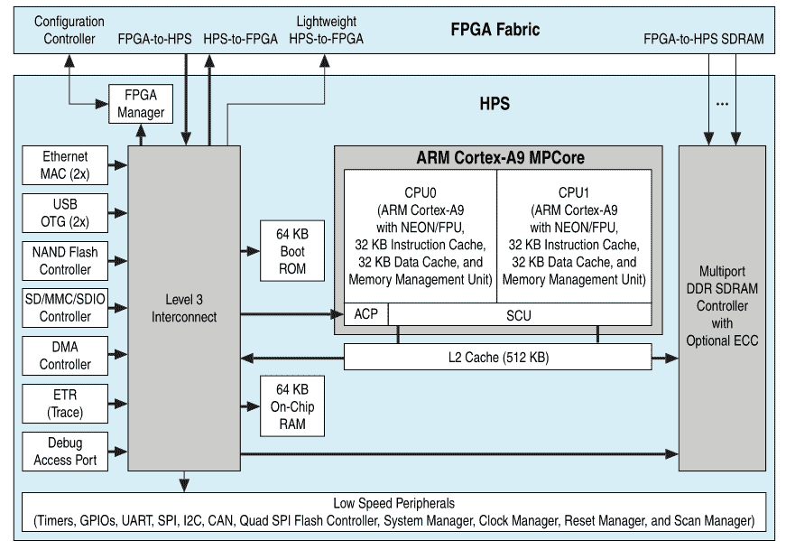
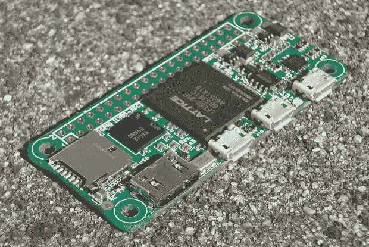
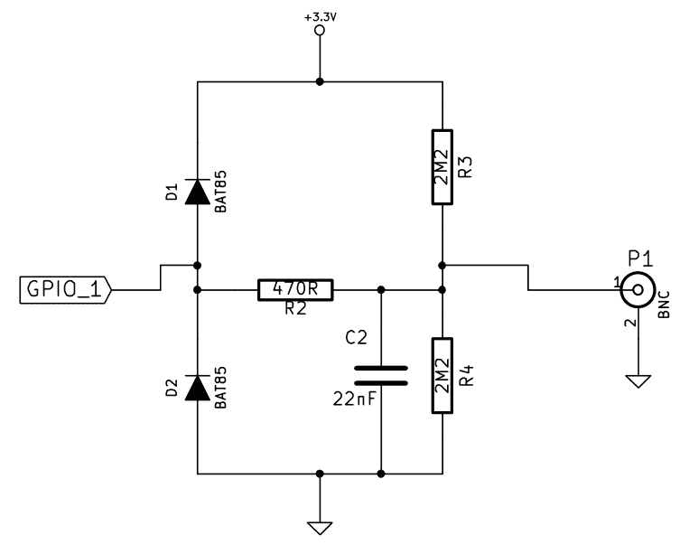

# 第十一章：为混合 SoC/FPGA 系统开发

除了标准的基于 CPU 的嵌入式系统之外，一个越来越常见的方法是将 CPU 与**现场可编程门阵列**（**FGPAs**）结合在 SoC 的形式中。这使得 CPU 密集型算法和处理，包括 DSP 和图像处理，可以在系统的 FPGA 部分上实现，而 CPU 端处理较不密集的任务，如用户交互、存储和网络。

本章中，我们将涵盖以下主题：

+   如何与混合 FPGA/SoC 系统的 FPGA 端进行通信

+   学习如何在 FPGA 中实现各种算法，并从 SoC 端使用

+   如何在混合 FPGA/SoC 系统上实现基本示波器

# 极端并行化

在性能方面，使用单核处理器一次执行单个指令基本上是实现算法或其他功能的最慢方式。从这里开始，您可以将这种单一执行流扩展到多个流，使用单个处理器核心的各个功能单元进行同时调度。

提高性能的下一步是增加更多的核心，这当然会使调度变得更加复杂，并引入潜在的延迟问题，因为关键任务被推迟，而不太关键的任务正在阻塞资源。对于某些任务，特别是那些尴尬地并行的任务，使用通用处理器也非常有限。

对于需要使用相同算法处理单个大型数据集的任务，使用基于**通用图形处理单元**（**GPGPU**）的处理已经变得非常流行，同时还使用**数字信号处理器**（**DSP**）通过使用专用硬件大大加速一系列操作。

在这个问题的另一面是任务，这些任务是大规模并行的，但涉及对传入数据、内部数据或两者都进行许多不同操作。如果纯粹在软件中实现一系列微处理器核心的范围内，要想获得合理的性能将会非常困难。

昂贵的 DSP 硬件可能会有所帮助，但即使如此，也不会针对该任务进行优化。传统上，这将是公司考虑设计和生产**应用特定集成电路**（**ASIC**）的时候。然而，这样做的成本非常高，只有在大规模生产中才是现实的，它才能与其他选项竞争。

随着时间的推移，发明了不同的解决方案，使得这种定制硬件实现更加现实，其中之一就是可编程逻辑芯片的开发。例如，像 Commodore 64 这样的系统包含一个**PLA**（原名**可编程逻辑阵列**，最初是 Signetics 82S100）芯片，它是一次性可编程的组合逻辑元素阵列。它允许处理器重新配置地址总线的内部路由，以改变 DRAM 存储芯片、ROM 存储芯片和其他外围设备在活动寻址空间中的部分。

在编程 PLA 之后，它的功能基本上与大量的 74 逻辑芯片（离散逻辑芯片）以相同的方式运行，但所需空间仅为离散解决方案的一小部分。这种方法本质上为 Commodore 提供了他们自己的定制 ASIC，但无需投资设计和生产。相反，他们使用了现成的零件，并且可以在 Commodore 64 的生命周期内对烧入 PLA 芯片的逻辑进行改进。

随着时间的推移，PLAs（也称为 PAL**s**）变得更加先进，发展成为基于宏单元的**复杂可编程逻辑设备**（**CPLDs**），这些设备允许实现更高级的功能，而不仅仅是简单的组合逻辑。这些最终演变成了 FPGAs，再次增加了更高级的功能和外围设备。

如今，几乎在所有需要一些高级处理或控制的地方都可以找到 FPGAs。视频和音频处理设备通常与 DSP 一起使用 FPGAs，MCU 或 SoC 处理用户界面和其他低优先级功能。

如今，示波器等设备采用模拟（如果支持的话还有数字）前端，DSP 进行数据的原始转换和初始处理，然后将数据传递给一个或多个 FPGAs，FPGAs 进行进一步的处理和分析数据。处理后，这些数据可以存储在缓冲区（**数字存储示波器**（**DSO**）的“数字存储”部分），也可以传递给前端，在那里运行在 SoC 上的软件将在用户界面中呈现它，并允许用户输入命令来操作显示的数据。

在本章中，我们将介绍一个基本示波器项目，该项目将使用简单的硬件和使用 VHDL 代码编程的 FPGA 来实现。

# 硬件描述语言

随着过去几十年**超大规模集成**（**VLSI**）电路的复杂性增加，改进开发过程的能力，包括验证设计的能力，变得越来越关键。这导致了**硬件描述语言**（**HDL****s**）的发展，其中今天 VHDL 和 Verilog 是最常用的两种。

HDL 的主要目的是允许开发人员轻松描述硬件电路，这些电路可以集成到 ASIC 中或用于编程 FPGAs。此外，这些 HDL 还使得可以模拟设计并验证其功能正确性。

在本章中，我们将介绍一个使用 VHDL 实现在 FPGA 上的编程的示例。**VHSIC 硬件描述语言**（**VHDL**）作为一种语言于 1983 年首次出现，当时由美国国防部开发。它旨在作为一种记录供应商提供设备的 ASIC 行为的方式。

随着时间的推移，人们提出了这些文档文件可以用于模拟 ASIC 的行为的想法。这一发展很快被综合工具的发展所跟随，以创建可用于创建 ASIC 的功能硬件实现。

VHDL 在很大程度上基于 Ada 编程语言，Ada 本身也源自美国军方。虽然 VHDL 主要用作 HDL，但它也可以像 Ada 及其衍生语言一样用作通用编程语言。

# FPGA 架构

尽管并非每个 FPGA 的结构都相同，但一般原则仍然相同：它们是可以配置为形成特定电路的逻辑元素阵列。因此，这些**逻辑元素**（**LEs**）的复杂性决定了可以形成什么样的逻辑电路，在为特定 FPGA 架构编写 VHDL 代码时必须考虑到这一点。

术语**逻辑元素**（**LEs**）和**逻辑单元**（**LCs**）可以互换使用。一个 LE 由一个或多个**查找表**（**LUTs**）组成，通常每个 LUT 具有四到六个输入。无论确切的配置如何，每个 LE 都被互连逻辑所包围，这允许不同的 LE 相互连接，LE 本身被编程为特定的配置，从而形成预期的电路。

开发 FPGA 的潜在风险包括 FPGA 制造商强烈假设 FPGA 将用于时钟设计（使用中央时钟源和时钟域），而不是组合逻辑（无时钟）的设计。一般来说，在将其包含在新项目中之前，熟悉目标 FPGA 系统是个好主意，以了解它能够支持你需要的功能有多好。

# 混合 FPGA/SoC 芯片

尽管多年来包含 FPGA 和 SoC 的系统非常常见，但最近增加了混合 FPGA/SoC 芯片，其中在同一封装中包含了 FPGA 和 SoC（通常是基于 ARM 的）。然后，它们通过总线连接在一起，以便两者可以使用内存映射 I/O 等方式有效地相互通信。

目前这类 FPGA 的常见示例包括 Altera（现在是英特尔）的 Cyclone V SoC 和 Xilinx 的 Zynq。Cyclone V SoC 的官方数据表中的块图给出了这种系统工作方式的很好概述：



在这里，我们可以看到 HPS 和 FPGA 两侧可以相互通信的多种方式，比如通过共享 SDRAM 控制器、两个点对点链接和其他一些接口。对于 Cyclone V SoC，系统启动时 FPGA 或 SoC 两侧可以是首先启动的一侧，从而可以实现广泛的系统配置选项。

# 示例-基本示波器

这个示例基本上介绍了如何在嵌入式项目中使用 FPGA。它使用 FPGA 对输入进行采样并测量电压或类似的东西，就像示波器一样。然后，得到的 ADC 数据通过串行链路发送到一个基于 C++/Qt 的应用程序中，该应用程序显示数据。

# 硬件

在这个项目中，我们将使用 Fleasystems FleaFPGA Ohm 板（[`fleasystems.com/fleaFPGA_Ohm.html`](http://fleasystems.com/fleaFPGA_Ohm.html)）。这是一个小型的、低于 50 美元、低于 40 欧元的 FPGA 开发板，外形尺寸与树莓派 Zero 相同：



它具有以下规格：

+   ECP5 FPGA 芯片具有 24K 个 LUT 元素和 112KB 的块 RAM。

+   256-Mbit SDRAM，16 位宽，167 MHz 时钟。

+   8-Mbit SPI Flash ROM，用于 FPGA 配置存储。

+   25 MHz 晶体振荡器。

+   HDMI 视频输出（最高 1080p30 或 720p60 屏幕模式）。

+   μSD 卡槽。

+   两个 Micro USB 主机端口，具有备用的 PS/2 主机端口功能。

+   29 个用户 GPIO，包括 4 个中速 ADC 输入和 12 对 LVDS 信号对，分别来自（与树莓派兼容的）40 针扩展和 2 针复位头。

+   一个 Micro USB 从机端口。提供+5V 供电给 Ohm，串行控制台/UART 通信，以及访问板载 JTAG 编程接口（用于配置 ECP5 FPGA）。

+   提供外部 JTAG 编程接口，以实现实时调试。

我们连接到这块板子上的电路可以让我们连接示波器探头：



这个电路将连接到 Ohm 板的 GPIO 引脚 29 号，对应 GPIO 5。它允许我们测量 0 到 3V 的直流信号，以及 1.5V 的交流（有效值），在 1x 探头测量模式下。带宽略高于 10 MHz。

# VHDL 代码

在这一部分，我们将看一下 VHDL 项目中的顶层实体，以了解它的功能。它以 VHDL 的标准库包含开始，如下所示：

```cpp
library IEEE; 
use IEEE.STD_LOGIC_1164.ALL; 
use IEEE.std_logic_unsigned.ALL; 
use IEEE.numeric_std.all; 

entity FleaFPGA_Ohm_A5 is   
   port( 
   sys_clock         : in        std_logic;  -- 25MHz clock input from external xtal oscillator. 
   sys_reset         : in        std_logic;  -- master reset input from reset header. 
```

这映射到底层 FPGA 的系统时钟和复位线。我们还可以看到端口映射的工作方式，定义了实体端口的方向和类型。在这里，类型是`std_logic`，它是一个标准逻辑信号，可以是二进制的 1 或 0：

```cpp
   n_led1                  : buffer    std_logic; 

   LVDS_Red          : out       std_logic_vector(0 downto 0); 
   LVDS_Green        : out       std_logic_vector(0 downto 0); 
   LVDS_Blue         : out       std_logic_vector(0 downto 0); 
   LVDS_ck                 : out       std_logic_vector(0 downto 0); 

   slave_tx_o        : out       std_logic; 
   slave_rx_i        : in        std_logic; 
   slave_cts_i       : in        std_logic;  -- Receive signal from #RTS pin on FT230x 
```

我们还使用了板上的状态 LED，映射了 HDMI 的视频引脚（LVDS 信号），以及使用了板上的 FDTI USB-UART 芯片的 UART 接口。后者是我们将用来将数据从 FPGA 发送到 C++ 应用程序的。

接下来是树莓派兼容的标题映射，如下所示的代码：

```cpp
   GPIO_2                  : inout           std_logic; 
   GPIO_3                  : inout           std_logic; 
   GPIO_4                  : inout           std_logic; 
   -- GPIO_5               : inout           std_logic; 
   GPIO_6                  : inout           std_logic;   
   GPIO_7                  : inout           std_logic;   
   GPIO_8                  : inout           std_logic;   
   GPIO_9                  : inout           std_logic;   
   GPIO_10                 : inout           std_logic; 
   GPIO_11                 : inout           std_logic;   
   GPIO_12                 : inout           std_logic;   
   GPIO_13                 : inout           std_logic;   
   GPIO_14                 : inout           std_logic;   
   GPIO_15                 : inout           std_logic;   
   GPIO_16                 : inout           std_logic;   
   GPIO_17                 : inout           std_logic; 
   GPIO_18                 : inout           std_logic;   
   GPIO_19                 : inout           std_logic;   
   GPIO_20                 : in        std_logic; 
   GPIO_21                 : in        std_logic;   
   GPIO_22                 : inout           std_logic;   
   GPIO_23                 : inout           std_logic; 
   GPIO_24                 : inout           std_logic; 
   GPIO_25                 : inout           std_logic;   
   GPIO_26                 : inout           std_logic;   
   GPIO_27                 : inout           std_logic; 
   GPIO_IDSD         : inout           std_logic; 
   GPIO_IDSC         : inout           std_logic; 
```

GPIO 5 被注释掉的原因是因为我们想要将其用于 ADC 功能而不是通用输入/输出。

相反，我们启用了 sigma-delta-capable ADC3 外设来处理该引脚的工作，如下所示：

```cpp
   --ADC0_input      : in        std_logic; 
   --ADC0_error      : buffer    std_logic; 
   --ADC1_input      : in        std_logic; 
   --ADC1_error      : buffer    std_logic; 
   --ADC2_input      : in        std_logic; 
   --ADC2_error      : buffer    std_logic; 
   ADC3_input  : in        std_logic; 
   ADC3_error  : buffer    std_logic; 
```

在这里，我们看到我们还有另外三个 ADC 外设，如果我们想要为示波器添加额外的通道，可以使用这些外设，如下所示的代码：

```cpp
   mmc_dat1          : in        std_logic; 
   mmc_dat2          : in        std_logic; 
   mmc_n_cs          : out       std_logic; 
   mmc_clk           : out       std_logic; 
   mmc_mosi          : out       std_logic; 
   mmc_miso          : in        std_logic; 

   PS2_enable        : out       std_logic; 
   PS2_clk1          : inout           std_logic; 
   PS2_data1         : inout           std_logic; 

   PS2_clk2          : inout           std_logic; 
   PS2_data2         : inout           std_logic 
   ); 
end FleaFPGA_Ohm_A5; 
```

顶层的实体定义以 MMC（SD 卡）和 PS2 接口结束。

接下来是模块的架构定义。这部分类似于 C++ 应用程序的源文件，实体定义的功能类似于标题，如下所示：

```cpp
architecture arch of FleaFPGA_Ohm_A5 is 
   signal clk_dvi  : std_logic := '0'; 
   signal clk_dvin : std_logic := '0'; 
   signal clk_vga  : std_logic := '0'; 
   signal clk_50  : std_logic := '0'; 
   signal clk_pcs   : std_logic := '0'; 

   signal vga_red     : std_logic_vector(3 downto 0) := (others => '0'); 
   signal vga_green   : std_logic_vector(3 downto 0) := (others => '0'); 
   signal vga_blue    : std_logic_vector(3 downto 0) := (others => '0'); 

   signal ADC_lowspeed_raw     : std_logic_vector(7 downto 0) := (others => '0'); 

   signal red     : std_logic_vector(7 downto 0) := (others => '0'); 
   signal green   : std_logic_vector(7 downto 0) := (others => '0'); 
   signal blue    : std_logic_vector(7 downto 0) := (others => '0'); 
   signal hsync   : std_logic := '0'; 
   signal vsync   : std_logic := '0'; 
   signal blank   : std_logic := '0'; 
```

这里定义了一些信号。这些信号允许我们将 VHDL 模块的端口、实体、进程和其他元素相互连接。

我们可以看到这里定义了一些信号以支持 VGA。这允许与支持 VGA 的 FPGA 板兼容，但其中的部分也与 HDMI（或 DVI）外设兼容，我们稍后将会看到。让我们看看以下代码：

```cpp
begin 
 Dram_CKE <= '0';    -- DRAM Clock disable. 
 Dram_n_cs <= '1';   -- DRAM Chip disable. 
 PS2_enable <= '1'; -- Configures both USB host ports for legacy PS/2 mode. 
 mmc_n_cs <= '1';    -- Micro SD card chip disable. 
```

通过 `begin` 关键字，我们指示这是我们希望开始执行架构定义中的命令的地方。除非一组指令被封装在 `process` 中（在此代码中未显示），否则在此关键字之后和终止关键字（`end architecture`）之前的所有内容将同时执行。

通过写入适当的引脚，我们禁用了一些硬件功能。出于简洁起见，我们在早期的实体定义中省略了 DRAM（外部内存）部分。DRAM 和 SD 卡功能被禁用，而 PS2（键盘、鼠标）功能被启用。这样，我们就可以连接 PS2 输入设备，如果我们想的话：

```cpp
 user_module1 : entity work.FleaFPGA_DSO 
    port map( 
         rst => not sys_reset, 
         clk => clk_50, 
         ADC_1 => n_led1, 
         ADC_lowspeed_raw => ADC_lowspeed_raw, 
         Sampler_Q => ADC3_error, 
         Sampler_D => ADC3_input, 
         Green_out => vga_green, 
         Red_out => vga_red, 
         Blue_out => vga_blue, 
         VGA_HS => hsync, 
         VGA_VS => vsync, 
         blank => blank, 
         samplerate_adj => GPIO_20, 
         trigger_adj => GPIO_21 
    ); 
```

在这里，我们定义将使用 FleaFPGA 数字存储示波器模块的一个实例。虽然模块可以支持四个通道，但只映射了第一个通道。这种简化有助于演示操作原理。

DSO 模块负责从 ADC 中读取数据，因为它对我们用探头测量的信号进行采样，并将其呈现到本地缓存以在本地（HDMI 或 VGA）监视器上显示，并通过串行接口发送到 UART 模块（在本节末尾显示）。让我们看看以下代码：

```cpp
   red <= vga_red & "0000"; 
   green <= vga_green & "0000"; 
   blue <= vga_blue & "0000"; 
```

在这里，显示输出的最终颜色是通过 HDMI 输出信号确定的：

```cpp
 u0 : entity work.DVI_clkgen 
   port map( 
         CLKI              =>    sys_clock, 
         CLKOP             =>    clk_dvi, 
         CLKOS                   =>  clk_dvin, 
         CLKOS2                  =>  clk_vga, 
         CLKOS3                  =>  clk_50 
         );   

   u100 : entity work.dvid PORT MAP( 
      clk       => clk_dvi, 
      clk_n     => clk_dvin, 
      clk_pixel => clk_vga, 
      red_p     => red, 
      green_p   => green, 
      blue_p    => blue, 
      blank     => blank, 
      hsync     => hsync, 
      vsync     => vsync, 
      -- outputs to TMDS drivers 
      red_s     => LVDS_Red, 
      green_s   => LVDS_Green, 
      blue_s    => LVDS_Blue, 
      clock_s   => LVDS_ck 
   ); 
```

整个部分用于输出由 DSO 模块生成的视频信号，这样我们也可以将 FPGA 板用作独立示波器单元：

```cpp
   myuart : entity work.simple_uart 

         port map( 
               clk => clk_50, 
               reset => sys_reset, -- active low 
               txdata => ADC_lowspeed_raw, 
               --txready => ser_txready, 
               txgo => open, 
               --rxdata => ser_rxdata, 
               --rxint => ser_rxint, 
               txint => open, 
               rxd => slave_rx_i, 
               txd => slave_tx_o 
         ); 
end architecture; 
```

最后，简单的 UART 实现允许 DSO 模块与我们的 C++ 应用程序进行通信。

UART 配置为工作在波特率为 19,200，8 位，1 个停止位，无校验。构建了这个 VHDL 项目并用 FPGA 板进行了编程后，我们可以通过这个串行连接连接到它。

# C++ 代码

虽然 VHDL 代码实现了简单的显示输出和基本的输入选项，但如果我们想要有一个大型（高分辨率）显示屏，进行信号分析，录制多分钟甚至几小时的数据等，能够在 SBC 上进行这些操作将非常方便。

以下代码是作为一个 C++/Qt 图形应用程序编写的，它从 FPGA 板接收原始 ADC 数据并在图表中显示。虽然简陋，但它为一个功能齐全的基于 SoC 的系统提供了框架。

首先，显示标题如下：

```cpp
#include <QMainWindow> 

#include <QSerialPort> 
#include <QChartView> 
#include <QLineSeries> 

namespace Ui { 
    class MainWindow; 
} 

class MainWindow : public QMainWindow { 
    Q_OBJECT 

public: 
    explicit MainWindow(QWidget *parent = nullptr); 
    ~MainWindow(); 

public slots: 
    void connectUart(); 
    void disconnectUart(); 
    void about(); 
    void quit(); 

private: 
    Ui::MainWindow *ui; 

    QSerialPort serialPort; 
    QtCharts::QLineSeries* series; 
    quint64 counter = 0; 

private slots: 
    void uartReady(); 
}; 
```

在这里，我们可以看到我们将在 Qt 中使用串行端口实现，以及 QChart 模块进行可视化部分。

实现如下代码所示：

```cpp
#include "mainwindow.h" 
#include "ui_mainwindow.h" 

#include <QSerialPortInfo> 
#include <QInputDialog> 
#include <QMessageBox> 

MainWindow::MainWindow(QWidget *parent) : QMainWindow(parent), 
    ui(new Ui::MainWindow) { 
    ui->setupUi(this); 

    // Menu connections. 
    connect(ui->actionQuit, SIGNAL(triggered()), this, SLOT(quit())); 
    connect(ui->actionConnect, SIGNAL(triggered()), this, SLOT(connectUart())); 
    connect(ui->actionDisconnect, SIGNAL(triggered()), this, SLOT(disconnectUart())); 
    connect(ui->actionInfo, SIGNAL(triggered()), this, SLOT(about())); 

    // Other connections 
    connect(&serialPort, SIGNAL(readyRead()), this, SLOT(uartReady())); 

    // Configure the chart view. 
    QChart* chart = ui->chartView->chart(); 
    chart->setTheme(QChart::ChartThemeBlueIcy); 
    chart->createDefaultAxes(); 
    series = new QtCharts::QLineSeries(chart); 
    chart->setAnimationOptions(QChart::NoAnimation);         
    chart->addSeries(series); 
} 
```

在构造函数中，我们创建了与 GUI 中菜单选项的连接，这些选项允许我们退出应用程序，连接到串行端口，如果已连接则断开与串行端口的连接，或者获取有关应用程序的信息。

我们将串行端口实例连接到一个插槽，每当准备读取新数据时，该插槽将被调用。

最后，我们在 GUI 中配置图表视图，获取 QChartView 小部件内的 QChart 实例的引用。在这个引用上，我们为图表设置了一个主题，添加了默认轴，最后添加了一个空系列，我们将用来填充来自 FPGA 的传入数据，如下面的代码所示：

```cpp
MainWindow::~MainWindow() { 
    delete ui; 
} 

void MainWindow::connectUart() { 
    QList<QSerialPortInfo> comInfo = QSerialPortInfo::availablePorts(); 
    QStringList comNames; 
    for (QSerialPortInfo com: comInfo) { 
        comNames.append(com.portName()); 
    } 

    if (comNames.size() < 1) { 
        QMessageBox::warning(this, tr("No serial port found"), tr("No serial port was found on the system. Please check all connections and try again.")); 
        return; 
    } 

    QString comPort = QInputDialog::getItem(this, tr("Select serial port"), tr("Available ports:"), comNames, 0, false); 

    if (comPort.isEmpty()) { return; } 

    serialPort.setPortName(comPort); 
    if (!serialPort.open(QSerialPort::ReadOnly)) { 
        QMessageBox::critical(this, tr("Error"), tr("Failed to open the serial port.")); 
        return; 
    } 

    serialPort.setBaudRate(19200); 
    serialPort.setParity(QSerialPort::NoParity); 
    serialPort.setStopBits(QSerialPort::OneStop); 
    serialPort.setDataBits(QSerialPort::Data8); 
} 
```

当用户希望通过 UART 连接到 FPGA 时，必须选择连接 FPGA 的串行连接，之后将建立连接，使用我们在项目的 VHDL 部分中之前建立的 19,200 波特率，8N1 设置。

对于固定配置，其中串行端口始终相同，可以考虑在系统启动时自动化以下部分：

```cpp
void MainWindow::disconnectUart() { 
    serialPort.close(); 
} 
```

从串行端口断开连接非常简单：

```cpp
void MainWindow::uartReady() { 
    QByteArray data = serialPort.readAll(); 

    for (qint8 value: data) { 
        series->append(counter++, value); 
    } 
} 
```

当 UART 从 FPGA 板接收新数据时，将调用此插槽。在其中，我们从 UART 缓冲区中读取所有数据，将其附加到我们添加到图形小部件的系列中，从而更新显示的跟踪。计数器变量用于为图表提供递增的时间基准。这在这里充当了简单的时间戳。

在某个时候，我们应该开始从系列中删除数据，以防止其变得过大，同时具有搜索和保存数据的能力。基于计数器的时间戳可以报告我们接收信号的实际时间，尽管理想情况下，这应该是我们从 FPGA 接收到的数据的一部分：

```cpp
void MainWindow::about() { 
    QMessageBox::aboutQt(this, tr("About")); 
} 

void MainWindow::quit() { 
    exit(0); 
} 
```

最后，我们有一些简单的插槽。对于信息对话框，我们只需显示标准的 Qt 信息对话框。这可以替换为自定义的帮助或信息对话框。

# 构建项目

可以使用免费的 Lattice Semiconductor Diamond IDE 软件（[`www.latticesemi.com/latticediamond`](http://www.latticesemi.com/latticediamond)）构建 VHDL 项目，并将其编程到 Ohm FPGA 板上。编程板需要安装来自[`github.com/Basman74/FleaFPGA-Ohm`](https://github.com/Basman74/FleaFPGA-Ohm)的 FleaFPGA JTAG 实用程序，以便 Diamond 可以使用它。

通过按照快速入门指南中描述的 FleaFPGA Ohm 板的说明，应该相对容易地启动和运行项目的一部分。对于 C++部分，必须确保 FPGA 板和 SBC（或等效物）连接在一起，以便后者可以访问前者上的 UART。

有了这个设置，只需使用 Qt 框架编译 C++项目（直接在 SBC 上或最好是在桌面系统上进行交叉编译）就足够了。之后，可以运行已刷写 FPGA 板的应用程序，连接到 UART，并观察在应用程序窗口上绘制的跟踪。

# 摘要

在本章中，我们看了 FPGA 在嵌入式开发中扮演的角色，它们在过去几十年中的重要性发生了变化，以及它们现在的用途。我们看了一个使用 FPGA 和基于 SBC 的组件的示波器的简单实现。阅读完本章后，您现在应该知道何时选择 FPGA 用于新的嵌入式项目，并了解如何使用和与这样的设备通信。
