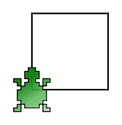

# 第一章：函数式编程简介

为什么函数式编程有用？在过去的十年里，函数式编程构造已经出现在所有主要的编程语言中。程序员们享受了它们的好处——简化循环，更具表现力的代码，以及简单的并行化。但其中还有更多——脱离时间的耦合，提供消除重复、可组合性和更简单的设计的机会。更多人采用函数式编程（包括金融领域大规模采用 Scala）意味着一旦你了解并理解它，就会有更多的机会。虽然我们将在本书中深入探讨函数式编程，帮助你学习，但请记住，函数式编程是你工具箱中的另一个工具，当问题和上下文适合时，你可以选择使用它。

本章将涵盖以下主题：

+   函数式编程简介以及对你已经在使用的函数式构造的检查

+   结构化循环与函数式循环

+   不可变性

+   **面向对象编程**（**OOP**）与函数式设计

+   可组合性和消除重复

# 技术要求

代码适用于 g++ 7.3.0 和 C++ 17；它包括一个`makefile`以方便你使用。你可以在 GitHub 仓库（[`github.com/PacktPublishing/Hands-On-Functional-Programming-with-Cpp`](https://github.com/PacktPublishing/Hands-On-Functional-Programming-with-Cpp)）的`Chapter01`目录中找到它。

# 函数式编程简介

我第一次接触函数式编程是在大学。我是一个 20 岁的极客，对科幻小说、阅读和编程感兴趣；编程是我学术生活的亮点。对我来说，与 C++、Java、MATLAB 以及我们使用的其他一些编程语言有关的一切都很有趣。不幸的是，我不能说同样的话适用于电气工程、电路或编译器理论等学科。我只想写代码！

根据我的兴趣，函数式编程本应该是一门非常有趣的课程。我们的老师非常热情。我们不得不写代码。但出了些问题——我没有理解老师在告诉我们的内容。为什么列表如此有趣？为什么语法如此反向且充满括号？为什么我要使用这些东西，当用 C++写相同的代码要简单得多？最终我试图将我从 BASIC 和 C++中所知的所有编程构造翻译成 Lisp 和 OCaml。这完全错过了函数式编程的要点，但我通过了这门课程，多年来都忘记了它。

我想很多人都能理解这个故事，我对此有一个可能的原因。我现在相信，尽管我的老师非常热情，但采用了错误的方法。今天，我明白了函数式编程在其核心具有一定的优雅，因为它与数学有着密切的关系。但这种优雅需要一种深刻的洞察力，而我 20 岁时并没有，也就是说，我在多年的各种经历后才有幸建立起来的洞察力。现在对我来说很明显，学习函数式编程不应该与读者看到这种优雅的能力有关。

那么，我们可以使用什么方法呢？回想起过去的我，也就是那个只想写代码的极客，只有一种方法——看看代码中的常见问题，并探索函数式编程如何减少或完全消除这些问题。此外，从一开始就开始；你已经看到了函数式编程，已经使用了一些概念和构造，你甚至可能发现它们非常有用。让我们来看看为什么。

# 函数式编程构造随处可见

在我完成大学函数式编程课程大约 10 年后，我和我的朋友 Felix 闲聊。像所有的极客一样，我们很少见面，但多年来，我们一直在即时通讯中讨论各种书呆子话题，当然也包括编程。

不知何故，我们谈到了函数式编程这个话题。Felix 指出我最喜欢和最享受的编程语言之一，LOGO，实际上是一种函数式编程语言。

**LOGO**是一种教育性编程语言，其主要特点是利用所谓的**turtle graphics**。

回顾起来是显而易见的；以下是如何在 LOGO 的 KTurtle 版本中编写一个画正方形的函数：

```cpp
learn square {
    repeat 4 {forward 50 turnright 90}
}
```

结果显示在以下截图中：



你能看到我们是如何将两行代码传递给 repeat 函数的吗？这就是函数式编程！函数式编程的一个基本原则是，代码只是另一种类型的数据，可以被打包在一个函数中，并传递给其他函数。我在 LOGO 中使用了这个构造数百次，却没有意识到这一点。

这个认识让我想：是否还有其他函数式编程构造是我在不知情中使用的？事实证明，是的，还有。事实上，作为一个 C++程序员，你很可能也使用过它们；让我们看看一些例子：

```cpp
int add(const int base, const int exponent){
   return pow(base, exponent);
}
```

这个函数是推荐的 C++代码的典型例子。我最初是从 Bertrand Meyer 的惊人著作《Effective C++》、《More Effective C++》和《Effective STL》中了解到在任何地方都添加`const`的好处的。这个构造之所以有效有多个原因。首先，它保护了不应该改变的数据成员和参数。其次，它通过消除可能的副作用，使程序员更容易推理出函数中发生的事情。第三，它允许编译器优化函数。

事实证明，这也是不可变性的一个例子。正如我们将在接下来的章节中发现的那样，函数式编程将不可变性置于程序的核心，将所有的副作用移到程序的边缘。我们已经了解了函数式编程的基本构造；说我们使用函数式编程只是意味着我们更广泛地使用它！

以下是 STL 的另一个例子：

```cpp
std::vector aCollection{5, 4, 3, 2, 1};
sort (aCollection.begin(), aCollection.end());
```

STL 算法具有很大的威力；这种威力来自多态性。我使用这个术语的含义比在 OOP 中更基本——这仅仅意味着集合包含什么并不重要，因为只要实现了比较，算法就能正常工作。我必须承认，当我第一次理解它时，我对这个聪明、有效的解决方案印象深刻。

有一种`sort`函数的变体，允许在比较没有实现或者不按我们期望的情况下对元素进行排序；例如，当我们给出一个`Name`结构时，如下所示：

```cpp
using namespace std;

// Parts of code omitted for clarity
struct Name{
     string firstName;
     string lastName;
};
```

如果我们想要按照名字对`vector<Name>`容器进行排序，我们只需要一个`compare`函数：

```cpp
bool compareByFirstName(const Name& first, const Name& second){
     return first.firstName < second.firstName;
}
```

此外，我们需要将其传递给`sort`函数，如下面的代码所示：

```cpp
int main(){
    vector<Name> names = {Name("John", "Smith"), Name("Alex",
    "Bolboaca")};

    sort(names.begin(), names.end(), compareByFirstName);
}
// The names vector now contains "Alex Bolboaca", "John Smith"
```

这构成了一种*高阶函数*。高阶函数是一种使用其他函数作为参数的函数，以允许更高级别的多态性。恭喜——你刚刚使用了第二个函数式编程构造！

我甚至要说 STL 是函数式编程在实践中的一个很好的例子。一旦你了解更多关于函数式编程构造，你会意识到它们在 STL 中随处可见。其中一些，比如函数指针或者仿函数，已经存在于 C++语言中很长时间了。事实上，STL 经受住了时间的考验，那么为什么不在我们的代码中也使用类似的范式呢？

没有比 STL 中的函数式循环更好的例子来支持这个说法了。

# 结构化循环与函数式循环

作为程序员，我们学习的第一件事之一就是如何编写循环。我在 C++中的第一个循环是打印从`1`到`10`的数字：

```cpp
for(int i = 0; i< 10; ++i){
    cout << i << endl;
}
```

作为一个好奇的程序员，我曾经认为这种语法是理所当然的，研究了它的特殊之处和复杂性，然后就使用了它。回想起来，我意识到这种结构有一些不寻常的地方。首先，为什么要从`0`开始？我被告知这是一个惯例，出于历史原因。然后，`for`循环有三个语句——初始化、条件和增量。对于我们想要实现的目标来说，这听起来有点太复杂了。最后，结束条件让我犯了比我愿意承认的更多的偏差错误。

此时，您会意识到 STL 允许您在循环遍历集合时使用迭代器：

```cpp
for (list<int>::iterator it = aList.begin(); it != aList.end(); ++it)
      cout << *it << endl;
```

这绝对比使用游标的`for`循环要好。它避免了偏差错误，也没有`0`的惯例怪事。然而，该操作周围仍然有很多仪式感。更糟糕的是，随着程序复杂性的增加，循环往往会变得越来越大。

有一种简单的方法可以显示这种症状。让我们回顾一下我用循环解决的第一个问题。

让我们考虑一个整数向量并计算它们的总和；朴素的实现将如下所示：

```cpp
int sumWithUsualLoop(const vector<int>& numbers){
    int sum = 0;
    for(auto iterator = numbers.begin(); iterator < numbers.end(); 
    ++iterator){
        sum += *iterator;
    }
    return sum;
}
```

如果生产代码能如此简单就好了！相反，一旦我们实现了这段代码，就会得到一个新的需求。现在我们需要对向量中的偶数进行求和。嗯，这很容易，对吧？让我们看看下面的代码：

```cpp
int sumOfEvenNumbersWithUsualLoop(const vector<int>& numbers){
    int sum = 0;
    for(auto iterator = numbers.begin(); iterator<numbers.end(); 
    ++iterator){
        int number = *iterator;
        if (number % 2 == 0) sum+= number;
    }
    return sum;
}
```

如果你以为这就是结尾，那就错了。我们现在需要对同一个向量进行三次求和——偶数的和、奇数的和和总和。现在让我们添加一些更多的代码，如下所示：

```cpp
struct Sums{
    Sums(): evenSum(0),  oddSum(0), total(0){}
    int evenSum;
    int oddSum;
    int total;
};

const Sums sums(const vector<int>& numbers){
    Sums theTotals;
    for(auto iterator = numbers.begin(); iterator<numbers.end(); 
    ++iterator){
        int number = *iterator;
        if(number % 2 == 0) theTotals.evenSum += number;
        if(number %2 != 0) theTotals.oddSum += number;
        theTotals.total += number;
    }
    return theTotals;
}
```

我们最初相对简单的循环变得越来越复杂。当我开始专业编程时，我们常常责怪用户和客户无法确定完美功能并给出最终的冻结需求。然而，在现实中很少可能；我们的客户每天都从用户与我们编写的程序的互动中学到新的东西。我们有责任使这段代码清晰，而使用函数循环是可能的。

多年后，我学会了 Groovy。Groovy 是一种基于 Java 虚拟机的编程语言，它专注于通过帮助程序员编写更少的代码和避免常见错误来简化程序员的工作。以下是您如何在 Groovy 中编写先前的代码：

```cpp
def isEven(value){return value %2 == 0}
def isOdd(value){return value %2 == 1}
def sums(numbers){
   return [
      evenSum: numbers.filter(isEven).sum(),
      oddSum: numbers.filter(isOdd).sum(),
      total: numbers.sum()
   ]
}
```

让我们比较一下这两种方法。没有循环。代码非常清晰。没有办法犯偏差错误。没有计数器，因此也没有*从*`0`开始的怪异现象。此外，它周围没有支撑结构——我只需写出我想要实现的目标，一个经过训练的读者就可以轻松理解。

虽然 C++版本更冗长，但它允许我们实现相同的目标：

```cpp
const Sums sumsWithFunctionalLoops(const vector<int>& numbers){
    Sums theTotals;
    vector<int> evenNumbers;
    copy_if(numbers.begin(), numbers.end(), 
    back_inserter(evenNumbers), isEven);
    theTotals.evenSum = accumulate(evenNumbers.begin(), 
    evenNumbers.end(), 0);

    vector<int> oddNumbers;
    copy_if(numbers.begin(), numbers.end(), back_inserter(oddNumbers), 
    isOdd);
    theTotals.oddSum= accumulate(oddNumbers.begin(), oddNumbers.end(), 
    0);

    theTotals.total = accumulate(numbers.begin(), numbers.end(), 0);

    return theTotals;
}
```

尽管如此，仪式感仍然很浓重，而且代码相似度太高。因此，让我们摆脱它，如下所示：

```cpp
template<class UnaryPredicate>
const vector<int> filter(const vector<int>& input, UnaryPredicate filterFunction){
    vector<int> filtered;
    copy_if(input.begin(), input.end(), back_inserter(filtered), 
    filterFunction);
    return filtered;
}

const int sum(const vector<int>& input){
    return accumulate(input.begin(), input.end(), 0);
}

const Sums sumsWithFunctionalLoopsSimplified(const vector<int>& numbers){
    Sums theTotals(
        sum(filter(numbers, isEven)),
        sum(filter(numbers, isOdd)),
        sum(numbers)
    ); 
    return theTotals;
}
```

我们刚刚用一些更简单、更易读和可组合的函数替换了一个复杂的`for`循环。

那么，这段代码更好吗？嗯，这取决于你对“更好”的定义。我喜欢用优点和缺点来思考任何实现。函数式循环的优点是简单性、可读性、减少代码重复和可组合性。有什么缺点吗？嗯，我们最初的`for`循环只需要通过向量进行一次遍历，而我们当前的实现需要三次遍历。对于非常大的集合，或者当响应时间和内存使用非常重要时，这可能是一个负担。这绝对值得讨论，我们将在第十章中更详细地研究这个问题，即专注于函数式编程性能优化的*性能优化*。现在，我建议你专注于理解函数式编程的新工具。

为了做到这一点，我们需要重新思考不可变性。

# 不可变性

我们已经了解到，在 C++中，一定程度的不可变性是首选的；常见的例子如下：

```cpp
class ...{
    int add(const int& first, const int& second) const{
        return first + second;
    }
}
```

`const`关键字清楚地传达了代码的一些重要约束，例如以下内容：

+   函数在返回之前不会改变任何参数。

+   函数在其所属的类的任何数据成员之前不会更改。

现在让我们想象一个`add`的另一个版本，如下所示

```cpp
int uglyAdd(int& first, int& second){
    first = first + second;
    aMember = 40;
    return first;
}
```

我之所以称之为`uglyAdd`，是有原因的——我在编程时不容忍这样的代码！这个函数违反了最小惊讶原则，做了太多的事情。阅读函数代码并不能揭示其意图。想象一下调用者的惊讶，如果不小心的话，仅仅通过调用`add`函数，就会有两件事情发生变化——一个是传递的参数，另一个是函数所在的类。

虽然这是一个极端的例子，但它有助于支持不可变性的论点。不可变函数很无聊；它们接收数据，在接收的数据中不做任何改变，在包含它们的类中也不做任何改变，并返回一个值。然而，当涉及长时间维护代码时，无聊是好事。

不可变性是函数式编程中函数的核心属性。当然，你的程序中至少有一部分是不可变的——**输入/输出**（**I/O**）。我们将接受 I/O 的本质，并专注于尽可能增加我们代码的不可变性。

现在，你可能想知道是否你需要完全重新思考编写程序的方式。你是否应该忘记你学到的关于面向对象编程的一切？嗯，并不完全是这样，让我们看看为什么。

# 面向对象编程与函数式设计风格

我的工作的一个重要部分是与程序员合作，帮助他们改善编写代码的方式。为此，我尽力提出简单的解释复杂的想法。我对软件设计有一个这样的解释。对我来说，软件设计是我们构建代码的方式，使其最大程度地优化为业务目的。

我喜欢这个定义，因为它简单明了。但在我开始尝试函数式构造之后，有一件事让我感到困扰；即，函数式编程会导致出现以下代码：

```cpp
const Sums sumsWithFunctionalLoopsSimplified(const vector<int>& numbers){
    Sums theTotals(
        sum(filter(numbers, isEven)),
        sum(filter(numbers, isOdd)),
        sum(numbers)
    );
    return theTotals;
 }
```

在面向对象编程风格中编写类似的代码很可能意味着创建类并使用继承。那么，哪种风格更好？此外，如果软件设计涉及代码结构，那么这两种风格之间是否存在等价性？

首先，让我们看看这两种设计风格真正推广了什么。什么是面向对象编程？多年来，我相信了所有列出以下三个面向对象语言属性的书籍：

+   封装

+   继承

+   多态

作为面向对象编程(OOP)的思想家，Alan Kay 并不完全同意这个列表。对他来说，OOP 是关于许多小对象之间的通信。作为生物学专业的学生，他看到了将程序组织成身体组织细胞的机会，并允许对象像细胞一样进行通信。他更看重对象而不是类，更看重通信而不是通常列出的 OOP 特性。我最好地总结他的立场如下：系统中的动态关系比其静态属性更重要。

这改变了关于 OOP 范式的很多东西。那么，类应该与现实世界匹配吗？并不是真的。它们应该被优化以表示现实世界。我们应该专注于拥有清晰、深思熟虑的类层次结构吗？不，因为这些比对象之间的通信更不重要。我们能想到的最小对象是什么？嗯，要么是数据的组合，要么是函数。

在 Quora 的最近一个回答中（[`www.quora.com/Isnt-getting-rid-of-the-evil-state-like-Haskells-approach-something-every-programmer-should-follow/answer/Alan-Kay-11`](https://www.quora.com/Isnt-getting-rid-of-the-evil-state-like-Haskells-approach-something-every-programmer-should-follow/answer/Alan-Kay-11)），Alan Kay 在回答有关函数式编程的问题时提出了一个有趣的想法。函数式编程源自数学，也是为了模拟现实世界以实现人工智能的努力。这一努力遇到了以下问题——*Alex 在布加勒斯特* 和 *Alex 在伦敦* 都可能是真实的，但发生在不同的时间点。解决这个建模问题的方法是不可变性；也就是说，时间成为函数的一个参数，或者是数据结构中的一个数据成员。在任何程序中，我们可以将数据变化建模为数据的时间限定版本。没有什么能阻止我们将数据建模为小对象，将变化建模为函数。此外，正如我们将在后面看到的那样，我们可以轻松地将函数转换为对象，反之亦然。

因此，总结一下，Alan Kay 所说的 OOP 和函数式编程之间并没有真正的紧张关系。只要我们专注于增加代码的不可变性，并且专注于小对象之间的通信，我们可以一起使用它们，可以互换使用。在接下来的章节中，我们将发现用函数替换类，反之亦然是多么容易。

但是有很多使用 OOP 的方式与 Alan Kay 的愿景不同。我在客户那里看到了很多 C++ 代码，我见过一切——庞大的函数、巨大的类和深层次的继承层次结构。大多数情况下，我被叫来的原因是因为设计太难改变，添加新功能会变得非常缓慢。继承是一种非常强的关系，过度使用会导致强耦合，因此代码难以改变。长方法和长类更难理解和更难改变。当然，有些情况下继承和长类是有意义的，但总的来说，选择松散耦合的小对象能够实现可变性。

但是类可以被重用，对吗？我们能用函数做到吗？让我们下一个讨论这个话题。

# 可组合性和去除重复

我们已经看到了一个存在大量重复的例子：

```cpp
const Sums sumsWithFunctionalLoops(const vector<int>& numbers){
    Sums theTotals;
    vector<int> evenNumbers;
    copy_if(numbers.begin(), numbers.end(), back_inserter(evenNumbers), 
    isEven);
    theTotals.evenSum = accumulate(evenNumbers.begin(), 
    evenNumbers.end(), 0);

    vector<int> oddNumbers;
    copy_if(numbers.begin(), numbers.end(), back_inserter(oddNumbers), 
    isOdd);
    theTotals.oddSum= accumulate(oddNumbers.begin(), oddNumbers.end(), 
    0);

    theTotals.total = accumulate(numbers.begin(), numbers.end(), 0);

    return theTotals;
}
```

我们设法使用函数来减少它，如下面的代码所示：

```cpp
template<class UnaryPredicate>
const vector<int> filter(const vector<int>& input, UnaryPredicate filterFunction){
    vector<int> filtered;
    copy_if(input.begin(), input.end(), back_inserter(filtered), 
    filterFunction);
    return filtered;
}

const int sum(const vector<int>& input){
    return accumulate(input.begin(), input.end(), 0);
}

const Sums sumsWithFunctionalLoopsSimplified(const vector<int>& numbers){
    Sums theTotals(
        sum(filter(numbers, isEven)),
        sum(filter(numbers, isOdd)),
        sum(numbers)
    );

    return theTotals;
}
```

看到函数以各种方式组合是很有趣的；我们两次调用了 `sum(filter())`，并且一次调用了 `sum()`。此外，`filter` 可以与多个谓词一起使用。此外，通过一些工作，我们可以使 `filter` 和 `sum` 成为多态函数：

```cpp
template<class CollectionType, class UnaryPredicate>
const CollectionType filter(const CollectionType& input, UnaryPredicate filterFunction){
    CollectionType filtered;
    copy_if(input.begin(), input.end(), back_inserter(filtered), 
    filterFunction);
    return filtered;
}
template<typename T, template<class> class CollectionType>
const T sum(const CollectionType<T>& input, const T& init = 0){
    return accumulate(input.begin(), input.end(), init);
} 
```

现在很容易使用除了`vector<int>`之外的类型的参数调用`filter`和`sum`。实现并不完美，但它说明了我试图表达的观点，即小的不可变函数可以轻松变成多态和可组合的。当我们可以将函数传递给其他函数时，这种方法特别有效。

# 总结

我们已经涵盖了很多有趣的话题！你刚刚意识到你已经掌握了函数式编程的基础知识。你可以使用`const`关键字在 C++中编写不可变函数。你已经在 STL 中使用了高级函数。此外，你不必忘记面向对象编程的任何内容，而是从不同的角度来看待它。最后，我们发现了小的不可变函数如何组合以提供复杂的功能，并且如何借助 C++模板实现多态。

现在是时候深入了解函数式编程的构建模块，并学习如何在 C++中使用它们了。这包括纯函数、lambda 表达式，以及与函数相关的操作，如函数组合、柯里化或部分函数应用。

# 问题

1.  什么是不可变函数？

1.  如何编写不可变函数？

1.  不可变函数如何支持代码简洁性？

1.  不可变函数如何支持简单设计？

1.  什么是高级函数？

1.  你能从 STL 中举一个高级函数的例子吗？

1.  函数式循环相对于结构化循环有哪些优势？可能的缺点是什么？

1.  从 Alan Kay 的角度来看，面向对象编程是什么？它如何与函数式编程相关？
