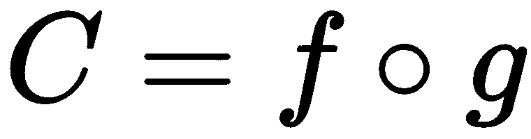
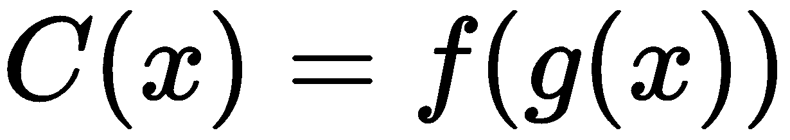

# 第四章：函数组合的概念

在过去的章节中，我们已经学习了如何编写纯函数和 lambda。这些是函数式编程的基本构建模块。现在是时候将它们提升到下一个级别了。

在这一章中，我们将学习如何从现有的函数中获得更多功能，从而从我们迄今为止所看到的简单示例中构建复杂的行为。

本章将涵盖以下主题：

+   在 C++中组合函数

+   具有多个参数的函数的基本分解策略

+   使用函数组合消除重复（或代码相似性）

# 技术要求

您将需要一个支持 C++ 17 的编译器。我使用的是 GCC 7.3.0。

该代码位于 GitHub 上的[`github.com/PacktPublishing/Hands-On-Functional-Programming-with-Cpp`](https://github.com/PacktPublishing/Hands-On-Functional-Programming-with-Cpp)中，位于`Chapter04`文件夹中。它包括并使用`doctest`，这是一个单头开源单元测试库。您可以在其 GitHub 存储库中找到它：[`github.com/onqtam/doctest`](https://github.com/onqtam/doctest)。

# 什么是函数组合？

纯函数和 lambda 是函数式编程的基本组成部分。但到目前为止，我们所看到的所有示例都使用非常简单的函数。在我们的行业中，我们显然处理着更复杂的问题。然而，正如我们所看到的，我们仍然希望我们的基本组成部分非常简单，因为我们希望能够轻松理解和维护它们。那么，我们如何能够从迄今为止所看到的简单 lambda 和纯函数创建复杂的程序呢？函数式编程有一个简单的答案——让我们通过组合我们拥有的简单函数来创建更复杂的函数。在函数式编程中创建复杂函数的基本方法是函数组合。

# 函数组合

从本质上讲，函数组合非常简单。我们将使用一个基本示例来说明它。我们将从我们的`increment`函数开始。从现在开始，我将使用测试用例来展示代码的工作原理。我正在使用`doctest`，这是一个单头开源单元测试库([`github.com/onqtam/doctest`](https://github.com/onqtam/doctest))。

让我们看看我们的`increment`函数及其测试用例：

```cpp
auto increment = [](const int value) { return value + 1; };

TEST_CASE("Increments value"){
    CHECK_EQ(2, increment(1));
}
```

我们还可以说，出于某种原因，我们需要两次增加值。由于我们在思考函数，我们希望重用我们的函数。因此，我们可以调用它两次：

```cpp
TEST_CASE("Increments twice"){
    CHECK_EQ(3, increment(increment(1)));
}
```

如果我们只需要在代码中的一个地方进行双重增量，那么这样做是可以的。如果我们需要在代码中的多个地方进行双重增量，我们将需要一个函数。很容易提取一个执行双重增量的函数：

```cpp
auto incrementTwiceLambda = [](int value){return increment(increment(value));};

TEST_CASE("Increments result of addition with lambda"){
    CHECK_EQ(3, incrementTwiceLambda(1));
}
```

如果我们看`incrementTwiceLambda`，我们可以看到它是由对`increment`的结果调用`increment`形成的。

让我们暂且不谈它，转而讨论另一个情况。我们现在想要计算一个数字的平方，仍然使用函数。这很容易写，再次：

```cpp
auto square = [](int value){ return value * value; };

TEST_CASE("Squares the number"){
    CHECK_EQ(4, square(2));
}
```

我们的下一个要求是计算一个值的增加平方。我们可以再次提取一个 lambda，将`increment`和`square`组合在一起，因为我们需要它们：

```cpp
auto incrementSquareLambda = [](int value) { return increment(square(value));};

TEST_CASE("Increments the squared number"){
    CHECK_EQ(5, incrementSquareLambda(2));
}

```

这很好。然而，我们在代码中有一个隐藏的相似之处。让我们看看`incrementTwiceLambda`和`incrementSquareLambda`函数：

```cpp
auto incrementTwiceLambda = [](int value){ return increment(increment(value)); };
auto incrementSquareLambda = [](int value) { return increment(square(value)); };
```

它们都有相同的模式——我们通过让一个函数`f`调用另一个函数`g`应用于传递给我们的函数`C`的值的结果来创建一个函数`C`。这是一种我们可以期望在使用小的纯函数时经常看到的代码相似性。最好有一个名称，甚至可能有一种方法来实现它，而不需要写太多样板代码。

事实证明，它确实有一个名字——这就是函数组合。一般来说，对于任何具有单个参数的*f*或*g*函数，我们可以按照以下方式获得一个函数*C*：

 意味着对于*x*的每个值，。

符号是函数组合的数学运算符。

正如你所看到的，我们实际上正在尝试通过对函数本身进行操作来获得其他函数！这是一种使用 lambda 而不是数字的微积分类型，并定义了对 lambda 的操作。Lambda 演算是一个合适的名称，你不觉得吗？

这就是函数组合的概念。下一个问题是-我们能否消除样板代码？

# 在 C++中实现函数组合

如果我们能有一个运算符，允许我们执行函数组合，那就太好了。事实上，其他编程语言提供了一个；例如，在 Groovy 中，我们可以使用`<<`运算符如下：

```cpp
def incrementTwiceLambda = increment << increment
def incrementSquareLambda = increment << square
```

不幸的是，C++（尚）没有标准的函数组合运算符。但是，C++是一种强大的语言，因此应该可以为有限的情况编写自己的执行函数组合的函数。

首先，让我们清楚地定义问题。我们希望有一个`compose`函数，它接收两个 lambda，`f`和`g`，并返回一个调用`value -> f(g(value)`的新 lambda。在 C++中最简单的实现看起来像下面的代码：

```cpp
auto compose(auto f, auto g){
    return f, g{ return f(g(x); };
}

TEST_CASE("Increments twice with composed lambda"){
    auto incrementTwice = compose(increment, increment);
    CHECK_EQ(3, incrementTwice(1));
}
```

不幸的是，这段代码无法编译，因为 C++不允许使用`auto`类型的参数。一种方法是指定函数类型：

```cpp
function<int(int)> compose(function<int(int)> f,  function<int(int)> g){
    return f, g{ return f(g(x); };
}

TEST_CASE("Increments twice with composed lambda"){
    auto incrementTwice = compose(increment, increment);
    CHECK_EQ(3, incrementTwice(1));
}
```

这很好地运行并通过了测试。但现在我们的`compose`函数取决于函数类型。这并不是很有用，因为我们将不得不为我们需要的每种类型的函数重新实现`compose`。虽然比以前的样板代码少了，但仍然远非理想。

但这正是 C++模板解决的问题类型。也许它们可以帮助：

```cpp
template <class F, class G>
auto compose(F f, G g){
    return ={return f(g(value));};
}

TEST_CASE("Increments twice with composed lambda"){
    auto incrementTwice = compose(increment, increment);
    CHECK_EQ(3, incrementTwice(1));
}

TEST_CASE("Increments square with composed lambda"){
    auto incrementSquare = compose(increment, square);
    CHECK_EQ(5, incrementSquare(2));
}
```

事实上，这段代码有效！因此，我们现在知道，尽管 C++中没有函数组合的运算符，但我们可以用一个优雅的函数来实现它。

请注意，compose 返回一个 lambda，它使用惰性评估。因此，我们的函数组合函数也使用惰性评估。这是一个优势，因为组合的 lambda 只有在我们使用它时才会初始化。

# 函数组合不是可交换的

重要的是要意识到函数组合不是可交换的。事实上，当我们说话时很容易理解-“值的增量平方”与“增量值的平方”是不同的。然而，在代码中我们需要小心，因为这两者只是 compose 函数参数顺序不同而已：

```cpp
auto incrementSquare = compose(increment, square);
auto squareIncrement = compose(square, increment);
```

我们已经看到了函数组合是什么，如何在 C++中实现它，以及如何在简单情况下使用它。我敢打赌你现在渴望尝试它，用于更复杂的程序。我们会到那里的，但首先让我们看看更复杂的情况。多参数函数怎么办？

# 复杂的函数组合

我们的 compose 函数有一个问题-它只能与接收一个参数的 lambda 一起使用。那么，如果我们想要组合具有多个参数的函数，我们该怎么办呢？

让我们看下面的例子-给定两个 lambda，`multiply`和`increment`：

```cpp
auto increment = [](const int value) { return value + 1; };
auto multiply = [](const int first, const int second){ return first * second; };
```

我们能否获得一个增加乘法结果的 lambda？

不幸的是，我们不能使用我们的`compose`函数，因为它假定两个函数都有一个参数：

```cpp
template <class F, class G>
auto compose(F f, G g){
    return ={return f(g(value));};
}
```

那么，我们有哪些选择呢？

# 实现更多的组合函数

我们可以实现`compose`函数的变体，它接受一个接收一个参数的函数`f`，和另一个接收两个参数的函数`g`：

```cpp
template <class F1, class G2>
auto compose12(F1 f, G2 g){
    return ={ return f(g(first, second)); };
}

TEST_CASE("Increment result of multiplication"){
    CHECK_EQ(5, compose12(increment, multiply)(2, 2));
}
```

这个解决方案足够简单。但是，如果我们需要获得一个函数，它将增加其参数的值，我们需要另一个`compose`变体：

```cpp
template <class F2, class G1>
auto compose21(F2 f, G1 g){
    return ={ return f(g(first), g(second)); };
}

TEST_CASE("Multiplies two incremented values"){
    CHECK_EQ(4, compose21(multiply, increment)(1, 1));
}
```

如果我们只想增加其中一个参数怎么办？有很多可能的组合，虽然我们可以用多个 compose 变体来覆盖它们，但也值得考虑其他选项。

# 分解具有多个参数的函数

而不是实现更多的 compose 变体，我们可以查看`multiply`函数本身：

```cpp
auto multiply = [](const int first, const int second){ return first *  
    second; };
```

我们可以使用一个技巧将其分解为两个分别接收一个参数的 lambda。关键思想是 lambda 只是一个值，因此它可以被函数返回。我们已经在我们的`compose`函数中看到了这一点；它创建并返回一个新的 lambda：

```cpp
template <class F, class G>
auto compose(F f, G g){
    return ={return f(g(value));};
}
```

因此，我们可以通过返回一个捕获上下文中的`first`参数的单参数 lambda 来分解具有两个参数的函数：

```cpp
auto multiplyDecomposed = [](const int first) { 
    return ={ return first * second; }; 
};

TEST_CASE("Adds using single parameter functions"){
    CHECK_EQ(4, multiplyDecomposed(2)(2));
}
```

让我们解开这段代码，因为它非常复杂：

+   `multiplyDecomposed`接收一个参数`first`，并返回一个 lambda。

+   返回的 lambda 捕获了上下文中的`first`。

+   然后接收一个参数`second`。

+   它返回了`first`和`second`的加法结果。

事实证明，任何具有两个参数的函数都可以像这样分解。因此，我们可以使用模板编写一个通用实现。我们只需要使用相同的技巧——将函数类型指定为模板类型，并继续在我们的分解中使用它：

```cpp
template<class F>
auto decomposeToOneParameter(F f){
    return ={
        return ={
            return f(first, second);
        };
    };
}

TEST_CASE("Multiplies using single parameter functions"){
    CHECK_EQ(4, decomposeToOneParameter(multiply)(2)(2));
}
```

这种方法很有前途；它可能简化我们的函数组合实现。让我们看看它是否有效。

# 增加乘法结果

让我们朝着我们的目标前进。我们能否使用`compose`来获得一个增加乘法结果的函数？现在很容易，因为`add`已经分解成了接收一个参数的 lambda。我们期望只需将`multiplyDecomposed`与`increment`组合起来：

```cpp
TEST_CASE("Increment result of multiplication"){
    int first = 2;
    int second = 2;
    auto incrementResultOfMultiplication = compose(increment, 
        multiplyDecomposed);
    CHECK_EQ(5, incrementResultOfMultiplication(first)(second));
}
```

然而，这不会编译。我们的 compose 函数假设`multiplyDecomposed(first)`的结果可以传递给 increment。但是`multiplyDecompose(first)`返回一个 lambda，而`increment`接收一个整数。

因此，我们需要将`increment`与`multipyDecomposed(first)`组合：

```cpp
TEST_CASE("Increment result of multiplication"){
    int first = 2;
    int second = 2;
    auto incrementResultOfMultiplication = compose(increment, 
        multiplyDecomposed(first));
    CHECK_EQ(5, incrementResultOfMultiplication(second));
}
```

这样做是有效的，但我们还没有实现我们的目标。我们没有获得一个接收两个值的函数；相反，在将其与`increment`函数组合时，第一个值被传递给了`multiplyDecomposed`。

幸运的是，这是使用 lambda 的完美场所，如下面的代码所示：

```cpp
TEST_CASE("Increment result of multiplication final"){
    auto incrementResultOfMultiplication = [](int first, int second) {
        return compose(increment, multiplyDecomposed(first))(second);
    };

    CHECK_EQ(5, incrementResultOfMultiplication(2, 2));
}
```

这绝对有效，我们实现了我们的目标！`incrementResultOfMultiplication` lambda 接收两个参数并返回乘法的增量。不过，如果我们不必重写`multiply`就更好了。幸运的是，我们有我们的`decomposeToOneParameter`函数来帮助我们：

```cpp
TEST_CASE("Increment result of multiplication"){
    auto incrementResultOfMultiplication = [](int first, int second) { 
        return compose(increment, decomposeToOneParameter(multiply) 
            (first)) (second);
 };
    int result = incrementResultOfMultiplication(2, 2);
    CHECK_EQ(5, result);
}
```

现在是时候看看反向组合了——如果我们想要将两个参数的增量相乘呢？

# 乘法增量

我们希望通过使用我们的`compose`函数获得一个将参数的增量相乘的函数。不使用`compose`的最简单的代码如下：

```cpp
TEST_CASE("Multiply incremented values no compose"){
    auto multiplyIncrementedValues = [](int first, int second){
        return multiply(increment(first), increment(second)); 
    };
    int result = multiplyIncrementedValues(2, 2);
    CHECK_EQ(9, result);
}
```

正如我们所见，如果我们想要使用我们的 compose 版本，我们首先需要分解`multiply`lambda：

```cpp
TEST_CASE("Multiply incremented values decompose"){
    auto multiplyIncrementedValues = [](int first, int second){
        return multiplyDecomposed(increment(first))(increment(second)); 
    };
    int result = multiplyIncrementedValues(2, 2);
    CHECK_EQ(9, result);
}
```

现在我们可以看到对`multiplyDecomposed(increment(first))`的调用，这是`multiplyDecomposed`和`increment`之间的组合。我们可以用我们的`compose`函数替换它，如下面的代码所示：

```cpp
TEST_CASE("Multiply incremented values compose simple"){
    auto multiplyIncrementedValues = [](int first, int second){
        return compose(multiplyDecomposed, increment)(first)
            (increment(second)); 
    };

    int result = multiplyIncrementedValues(2, 2);
    CHECK_EQ(9, result);
}
```

再次强调，如果我们不必重写我们的`multiply`函数就好了。但是请记住，我们实现了一个有用的函数，可以将具有两个参数的任何函数分解为具有一个参数的两个函数。我们不必重写`multiply`；我们只需在其上调用我们的分解实用程序：

```cpp
TEST_CASE("Multiply incremented values decompose first"){
    auto multiplyIncrementedValues = [](int first, int second){
        return compose(
                decomposeToOneParameter(multiply), 
                increment
               )(first)(increment(second)); 
    };
    int result = multiplyIncrementedValues(2, 2);
    CHECK_EQ(9, result);
}
```

我们实现了我们的目标！

# 对函数的组合和分解的反思

让我们花点时间来看看结果和我们的工作方法。好消息是，我们在学习如何以函数思维的方式思考方面取得了良好的进展。我们之前的例子只需在代码中操作函数作为一等公民就可以工作，这正是我们在设计应用程序时需要的思维方式。函数的分解和重组非常强大；掌握它，你将能够用很少的代码实现非常复杂的行为。

至于结果代码，它具有一个有趣的属性——我们可以将其泛化以在许多函数组合上重用。

但我们还没有完成！我们可以使用这些函数来从我们的代码中删除某些类型的重复。让我们看看如何做到这一点。

# 使用函数组合来消除重复

到目前为止，我们已经看到了如何以各种方式编写组合 lambda 的函数。但是代码往往会重复，因此我们希望使这种方法更加通用。我们确实可以进一步进行；让我们看几个例子。

# 泛化增量乘法结果

让我们再看看我们的`incrementResultOfMultiplication` lambda：

```cpp
 auto incrementResultOfMultiplication = [](int first, int second) { 
     return compose(increment, decomposeToOneParameter(multiply) 
        (first))(second);
  };
```

这里有一些有趣的东西——它并不特定于“增量”和“乘法”。由于 lambda 只是值，我们可以将它们作为参数传递并获得一个通用的`composeWithTwoParameters`函数：

```cpp
template <class F, class G>
auto composeWithTwoParameters(F f, G g){
    return = { 
        return compose(
                f, 
                decomposeToOneParameter(g)(first)
                )(second);
   };
};

TEST_CASE("Increment result of multiplication"){
    auto incrementResultOfMultiplication =  
    composeWithTwoParameters(increment, multiply);
    int result = incrementResultOfMultiplication(2, 2);
    CHECK_EQ(5, result);
}
```

这个函数允许我们*组合任何其他两个函数*，`f` *和* `g`*，其中* `g` *接受两个参数，* `f` *只接受一个参数*。

让我们再做一些。让我们泛化`multiplyIncrementedValues`。

# 泛化增量乘法结果

同样，我们可以轻松地泛化我们的`multiplyIncrementedValues` lambda，如下面的代码所示：

```cpp
    auto multiplyIncrementedValues = [](int first, int second){
        return compose(
                 decomposeToOneParameter(multiply), 
                 increment
                 )(first)(increment(second)); 
    };
```

同样，我们需要将“乘法”和“增量”lambda 作为参数传递：

```cpp
template<class F, class G>
auto composeWithFunctionCallAllParameters(F f, G g){
    return ={
        return compose(
                decomposeToOneParameter(f), 
                g 
                )(first)(g(second)); 
    };
};

TEST_CASE("Multiply incremented values generalized"){
    auto multiplyIncrementedValues = 
    composeWithFunctionCallAllParameters(multiply, increment);
    int result = multiplyIncrementedValues(2, 2);
    CHECK_EQ(9, result);
}
```

我们可以使用这个新函数来创建一个函数*C*，它实现了`g(f(first), f(second))`，无论`g`和`f`是什么。

我们目前的工作已经完成。

# 总结

如果你认为纯函数和 lambda 很强大，那么现在你将意识到通过组合它们可以做多少事情！在本章中，您学会了什么是函数组合以及如何在 C++中组合函数。

我们还做了一件更重要的事情。在本章中，我们真正开始思考函数。以下是我们学到的一些东西：

+   lambda 只是一个值，所以我们可以有返回 lambda 的函数，或者返回 lambda 的 lambda。

+   此外，我们可以有接收一个或多个 lambda 并返回一个新 lambda 的函数。

+   任何具有多个参数的函数都可以分解为具有单个参数和捕获值的多个 lambda。

+   函数的操作非常复杂。如果你感到头晕，没关系——我们一直在玩强大而抽象的概念。

+   在各种组合函数的方式上立即想出解决方案是非常困难的。最好的方法是一步一步地进行，设定明确的目标和清晰的思路，并使用本章中描述的技术来改进。

+   函数组合可以帮助消除某些类型的重复；例如，当您有多个具有相似签名的不同函数之间的多个组合时。

+   然而，像我们在本章中所做的那样实现 compose 函数族是有成本的——更高的抽象级别。理解对 lambda 执行操作的函数的工作方式非常困难；确实，相信我，我也很难理解结果。但是，一旦您理解了它们的目标，它们就非常容易使用。

经过所有这些努力，让我们花点时间考虑一下结果。想象一下，您已经在代码库中拥有的任何两个函数，或者您使用的库中的任何两个函数，都可以通过一个函数调用组合并表示为变量。此外，这些调用可以堆叠；您获得的函数甚至可以进一步组合。函数组合非常强大；通过非常简单的 lambda 和一些函数操作，我们可以非常快速地实现复杂的行为。

我们已经看到了如何组合两个函数。我们还需要学习函数的另一个操作——通过玩弄参数来获得新函数。

# 问题

1.  什么是函数组合？

1.  函数组合具有通常与数学运算相关联的属性。是什么？

1.  如何将具有两个参数的`add`函数转换为具有一个参数的两个函数？

1.  你如何编写一个包含两个单参数函数的 C++函数？

1.  函数组合的优势是什么？

1.  在函数操作的实施中有哪些潜在的缺点？
