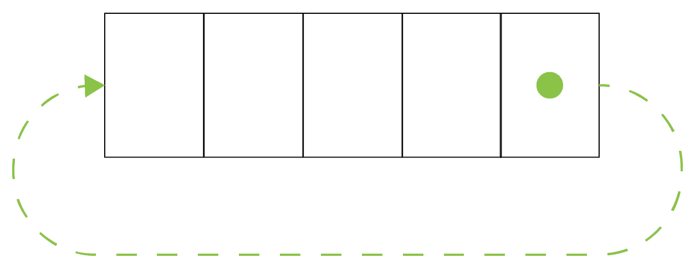

# 第五章：部分应用和柯里化

我们已经在探索函数式编程的过程中走得很远！我们学习了纯函数和 lambda，并借助函数组合深入了解了 lambda 演算。我们现在知道如何从其他函数创建函数。

关于 lambda 演算基础的还有一件事要学习。除了函数组合，我们还可以通过两种操作——柯里化和部分应用——从其他函数创建函数。这将完成我们对函数式构建块的讨论，并让你向前迈进，朝着使用函数进行设计。

本章将涵盖以下主题：

+   什么是部分应用？

+   如何在 C++中使用部分应用

+   什么是柯里化？

+   如何在 C++中柯里化函数

+   柯里化和部分应用之间的关系

+   如何将柯里化与函数组合结合

# 技术要求

你需要一个支持 C++ 17 的编译器。我使用的是 GCC 7.3.0。

代码在 GitHub 上的[`github.com/PacktPublishing/Hands-On-Functional-Programming-with-Cpp`](https://github.com/PacktPublishing/Hands-On-Functional-Programming-with-Cpp)的`Chapter05`文件夹中。它包括并使用`doctest`，这是一个单头开源单元测试库。你可以在它的 GitHub 仓库中找到它：[`github.com/onqtam/doctest`](https://github.com/onqtam/doctest)。

# 部分应用和柯里化

如果你考虑 lambda 以及我们可以对它们进行的操作来获得其他 lambda，会想到两件事：

+   关于组合两个 lambda 的事情，我们在函数组合中已经见过

+   关于 lambda 的参数，我们将在下一节讨论

我们可以用 lambda 的参数做什么？有两件事：

+   将具有多个参数的 lambda 分解为具有一个参数的更多 lambda，这个操作称为**柯里化**

+   通过将具有*N*个参数的 lambda 的一个参数绑定到一个值来获得具有*N-1*个参数的 lambda，这个操作称为**部分应用**

由于很快就会变得明显的原因，这两个操作是相关的，所以我们将一起讨论它们。

# 部分应用

如果你有一个带有*N*个参数的 lambda，部分应用意味着通过将一个参数绑定到一个值来获得另一个 lambda，从而获得一个带有*N-1*个参数的新 lambda。例如，我们可以对`add`函数进行部分应用，将其中一个参数绑定到值`1`，从而得到一个`increment`函数。在伪 C++中，它看起来像这样：

```cpp
auto add = [](const int first, const int second){return first + second;};
auto increment = partialApplication(add, /*first*/ 1); 
/* equivalent with 
auto increment = [](const int second){return 1 + second;}; 
*/
```

就是这样！部分应用的想法相当简单。让我们看看 C++中的语法。

# C++中的部分应用

部分应用的基本实现可以手动完成。我们可以简单地创建一个名为`increment`的 lambda，调用通用的`add`函数，将`1`作为第二个参数传递：

```cpp
auto add = [](const int first, const int second) { return first + second; };
TEST_CASE("Increments using manual partial application"){
    auto increment = [](const int value) { return add(value, 1); };

    CHECK_EQ(43, increment(42));
}
```

这不是我们正在寻找的简洁操作，但在某些情况下可能很有用，你无法使用通用方法时。

幸运的是，STL 在我们友好的头文件`functional`中提供了一个更好的选择——`bind`函数。它的参数是函数、你想要绑定的值和占位符参数，它只是转发参数。通过调用`bind`获得`increment`函数，我们传入通用的`add` lambda；第一个参数的参数值`1`；以及指定未绑定参数的占位符：

```cpp
using namespace std::placeholders; // to allow _1, _2 etc.

TEST_CASE("Increments using bind"){
    // bind the value 1 to the first parameter of add 
    // _1 is a placeholder for the first parameter of the increment    
       lambda
    auto increment = bind(add, 1, _1); 

    CHECK_EQ(43, increment(42));
}
```

虽然方便，但你应该意识到`bind`具有很高的编译时开销。当这是一个问题时，你总是可以回到之前的选项——从另一个手动编写的 lambda 直接调用更通用的 lambda。

当然，我们可以绑定两个参数。由于程序员喜欢数字`42`，我将`add` lambda 的两个参数都绑定到值`1`和`41`，以获得另一个 lambda，`number42`：

```cpp
TEST_CASE("Constant using bind"){
   auto number42 = bind(add, 1, 41); 
   CHECK_EQ(42, number42());
}
```

`bind`语法有时可能有点棘手，所以让我们更详细地看一下。关键是要理解*参数占位符指的是结果 lambda 的参数，而不是初始 lambda 的参数*。

为了更清楚地说明这一点，让我们看一个添加其三个参数的 lambda 的示例：

```cpp
auto addThree = [](const int first, const int second, const int third){return first + second + third;};

TEST_CASE("Adds three"){
    CHECK_EQ(42, addThree(10, 20, 12));
}
```

如果我们想通过将其第一个参数绑定到值`10`，从我们的`addThree` lambda 中获得另一个 lambda `addTwoNumbersTo10`，`bind`的语法是什么？嗯，我们的结果 lambda `addTwoNumbersTo10` 将接收两个参数。它们的占位符将用 `_1` 和 `_2` 表示。因此，我们需要告诉`bind`我们初始 lambda `addThree`的第一个参数是`10`。第二个参数将从`addTwoNumbersTo10`中转发，所以是`_1`。第三个参数也将从`addNumbersTo10`的第二个参数中转发，所以是`_2`。我们最终得到这段代码：

```cpp
TEST_CASE("Adds two numbers to 10"){
    auto addTwoNumbersTo10 = bind(addThree, 10, _1, _2);

    CHECK_EQ(42, addTwoNumbersTo10(20, 12));
}
```

让我们继续。我们希望通过部分应用从我们最初的`addThree` lambda 中获得另一个 lambda，`addTo10Plus20`。结果函数将只有一个参数，`_1`。要绑定的其他参数将是值`10`和`20`。我们最终得到以下代码：

```cpp
TEST_CASE("Adds one number to 10 + 20"){
    auto addTo10Plus20 = bind(addThree, 10, 20, _1);

    CHECK_EQ(42, addTo10Plus20(12));
}
```

如果我们想要绑定第一个和第三个参数呢？现在应该很清楚，参数是完全相同的，但它们在`bind`调用中的顺序发生了变化：

```cpp
TEST_CASE("Adds 10 to one number, and then to 20"){
    auto addTo10Plus20 = bind(addThree, 10, _1, 20);

    CHECK_EQ(42, addTo10Plus20(12));
}
```

如果我们想要绑定第二和第三个参数呢？嗯，占位符会移动，但它仍然是结果函数的唯一参数，所以 `_1`。

```cpp
TEST_CASE("Adds one number to 10, and then to 20"){
    auto addTo10Plus20 = bind(addThree, _1, 10, 20);

    CHECK_EQ(42, addTo10Plus20(12));
}
```

如果我们想对类方法进行部分应用呢？

# 类方法的部分应用

`bind`函数允许我们对类方法进行部分应用，但有一个问题——第一个参数必须是类的实例。例如，我们将使用一个实现两个数字之间简单相加的`AddOperation`类来进行示例：

```cpp
class AddOperation{
    private:
        int first;
        int second;

    public:
        AddOperation(int first, int second): first(first), 
            second(second){}
        int add(){ return first + second;}
};
```

我们可以通过将`AddOperation`类的实例绑定到函数来创建一个新函数`add`：

```cpp
TEST_CASE("Bind member method"){
    AddOperation operation(41, 1);
    auto add41And1 = bind(&AddOperation::add, operation); 

    CHECK_EQ(42, add41And1());
}
```

更有趣的是，更接近部分应用的概念，我们可以从调用者那里转发实例参数：

```cpp
TEST_CASE("Partial bind member method no arguments"){
    auto add = bind(&AddOperation::add, _1); 
    AddOperation operation(41, 1);
    CHECK_EQ(42, add(operation));
}
```

如果方法接收参数，那么绑定也是可能的。例如，假设我们有另一个实现`AddToOperation`的类：

```cpp
class AddToOperation{
    private:
        int first;

    public:
        AddToOperation(int first): first(first) {}
        int addTo(int second){ return first + second;}
};
```

我们可以使用类的实例对`addTo`进行部分应用，如下面的代码所示：

```cpp
TEST_CASE("Partial application member method"){
    AddToOperation operation(41);
    auto addTo41 = bind(&AddToOperation::addTo, operation, _1); 

    CHECK_EQ(42, addTo41(1));
}
```

类方法的部分应用表明，在函数式和面向对象编程之间进行转换是相当容易的。我们将在接下来的章节中看到如何利用这一点。在那之前，让我们为我们现在知道的部分应用和如何在 C++中使用它而感到高兴。现在是时候谈谈它的近亲柯里化了。

# 柯里化

让我们试着想一想软件开发中的一些著名人物，不要在互联网上搜索。有 Alan Turing，Ada Lovelace（她有一个迷人的故事），Grace Hopper，Donald Knuth，Bjarne Stroustroup，Grady Booch，可能还有其他许多人。他们中有多少人的名字不仅出现在行业中，而且还出现在两个你经常听到的事物中？对于 Alan Turing 来说，这是肯定的，他有图灵机和图灵测试，但对于其他许多人来说并非如此。

因此，令人惊讶的是，Haskell 编程语言的名称和柯里化操作的名称都来自同一个人——Haskell Curry。Haskell Curry 是一位美国数学家和逻辑学家。他研究了一种叫做**组合逻辑**的东西，这是函数式编程的一部分基础。

但是什么是柯里化？它与部分应用有什么关系？

# 什么是柯里化？

**柯里化**是将具有*N*个参数的函数分解为具有一个参数的*N*个函数的过程。我们可以通过变量捕获或部分应用来实现这一点。

让我们再次看看我们的`add` lambda：

```cpp
auto add = [](const int first, const int second) { return first +  
     second; };

TEST_CASE("Adds values"){
    CHECK_EQ(42, add(25, 17));
}
```

我们如何分解它？关键在于 lambda 只是一个普通值，这意味着我们可以从函数中返回它。因此，我们可以传入第一个参数并返回一个捕获第一个参数并使用第一个和第二个参数的 lambda。在代码中比在文字中更容易理解，所以这里是：

```cpp
auto curryAdd = [](const int first){ 
    return first{
        return first + second;
    };
};

TEST_CASE("Adds values using captured curry"){
    CHECK_EQ(42, curryAdd(25)(17));
}
```

让我们来解开发生了什么：

+   我们的`curryAdd` lambda 返回一个 lambda。

+   返回的 lambda 捕获第一个参数，接受第二个参数，并返回它们的和。

这就是为什么在调用它时，我们需要使用双括号。

但这看起来很熟悉，好像与偏函数应用有关。

# 柯里化和偏函数应用

让我们再次看看我们之前是如何进行偏函数应用的。我们通过对`add`函数进行偏函数应用创建了一个`increment`函数：

```cpp
TEST_CASE("Increments using bind"){
    auto increment = bind(add, 1, _1); 

    CHECK_EQ(43, increment(42));
}
```

然而，让我们对我们的`add`函数进行柯里化：

```cpp
auto curryAdd = [](const int first){ 
    return first{
        return first + second;
    };
};

TEST_CASE("Adds values using captured curry"){
    CHECK_EQ(42, curryAdd(25)(17));
}
```

然后，`increment`非常容易编写。你能看到吗？

`increment` lambda 只是`curryAdd(1)`，如下面的代码所示：

```cpp
TEST_CASE("Increments value"){
    auto increment = curryAdd(1);

    CHECK_EQ(43, increment(42));
}
```

这向我们展示了函数式编程语言常用的一个技巧——函数可以默认进行柯里化。在这样的语言中，编写以下内容意味着我们首先将`add`函数应用于`first`参数，然后将结果函数应用于`second`参数：

```cpp
add first second
```

看起来好像我们正在使用参数列表调用函数；实际上，这是一个部分应用的柯里化函数。在这样的语言中，`increment`函数可以通过简单地编写以下内容从`add`函数派生出来：

```cpp
increment = add 1
```

反之亦然。由于 C++默认情况下不进行柯里化，但提供了一种简单的偏函数应用方法，我们可以通过偏函数应用来实现柯里化。不要返回带有值捕获的复杂 lambda，只需绑定到单个值并转发结果函数的单个参数：

```cpp
auto curryAddPartialApplication = [](const int first){ 
    return bind(add, first, _1);
};

TEST_CASE("Adds values using partial application curry"){
    CHECK_EQ(42, curryAddPartialApplication(25)(17));
}
```

但我们能走多远呢？对带有多个参数的函数进行柯里化容易吗？

# 对具有多个参数的函数进行柯里化

在前一节中，我们已经看到了如何对带有两个参数的函数进行柯里化。当我们转向三个参数时，柯里化函数也会增长。现在我们需要返回一个返回 lambda 的 lambda。再次，代码比任何解释都更容易理解，所以让我们来看看：

```cpp
auto curriedAddThree = [](const int first){
    return first{ 
        return first, second{
            return first + second + third;
        };
    };
}; 

TEST_CASE("Add three with curry"){
    CHECK_EQ(42, curriedAddThree(15)(10)(17));
}
```

似乎有一个递归结构在那里。也许通过使用`bind`我们可以理解它？

原因是它并不那么简单，但是确实是可能的。我想写的是这样的：

```cpp
bind(bind(bind(addThree, _1),_1), _1)
```

然而，`addThree`有三个参数，所以我们需要将它们绑定到某些东西。下一个`bind`会导致一个具有两个参数的函数，再次，我们需要将它们绑定到某些东西。因此，实际上看起来是这样的：

```cpp
bind(bind(bind(addThree, ?, ?, _1), ?,_1), _1)
```

问号应该被之前绑定的值替换，但这在我们当前的语法中不起作用。

然而，有一个变通方法。让我们实现多个使用`bind`在具有*N*个参数的函数上的`simpleCurryN`函数，并将它们减少到*N-1*。对于一个参数的函数，结果就是以下函数：

```cpp
auto simpleCurry1 = [](auto f){
     return f;
 };
```

对于两个参数，我们绑定第一个参数并转发下一个：

```cpp
auto simpleCurry2 = [](auto f){
    return f{ return bind(f, x, _1); };
};
```

类似的操作也适用于三个和四个参数：

```cpp
auto simpleCurry3 = [](auto f){
     return f{ return bind(f, x, y, _1); };
};
auto simpleCurry4 = [](auto f){
    return f{ return bind(f, x, y, z, _1);  
};
};
```

这组`simpleCurryN`函数允许我们编写我们的`curryN`函数，它接受一个具有*N*个参数的函数并返回其柯里化形式：

```cpp
auto curry2 = [](auto f){
    return simpleCurry2(f);
 };

auto curry3 = [](auto f){
    return curry2(simpleCurry3(f));
 };

auto curry4 = [](auto f){
    return curry3(simpleCurry4(f));
};
```

让我们在具有两个、三个和四个参数的`add` lambda 上进行测试，如下面的代码所示：

```cpp
TEST_CASE("Add three with partial application curry"){
    auto add = [](int a, int b) { return a+b; };
    CHECK_EQ(3, curry2(add)(1)(2));

    auto addThreeCurryThree = curry3(addThree);
    CHECK_EQ(6, curry3(addThree)(1)(2)(3));

    auto addFour = [](int a, int b, int c, int d){return a + b + c +  
        d;};
    CHECK_EQ(10, curry4(addFour)(1)(2)(3)(4));
 }
```

很可能我们可以通过巧妙地使用模板来重写这些函数。我将把这个练习留给读者。

目前，重要的是要看到偏函数应用如何与柯里化相连接。在默认情况下对函数进行柯里化的编程语言中，偏函数应用非常容易——只需使用更少的参数调用函数。对于其他编程语言，我们可以通过偏函数应用来实现柯里化。

这些概念非常有趣，但你可能想知道它们在实践中是否有用。让我们看看如何使用这些技术来消除重复。

# 使用部分应用和柯里化来消除重复

程序员长期以来一直在寻找写更少的代码做更多事情的解决方案。函数式编程提出了一个解决方案——通过从其他函数派生函数来构建函数。

我们已经在之前的例子中看到了这一点。由于`increment`是加法的一个特殊情况，我们可以从我们的加法函数中派生它：

```cpp
auto add = [](const auto first, const auto second) { return first + second; };
auto increment = bind(add, _1, 1);

TEST_CASE("Increments"){
    CHECK_EQ(43, increment(42));
}
```

这对我们有什么帮助？嗯，想象一下，你的客户某天走进来告诉你*我们想使用另一种加法类型*。想象一下，你不得不在你的代码中到处搜索`+`和`++`，并找出实现新行为的方法。

相反，使用我们的`add`和`increment`函数，再加上一点模板魔法，我们可以做到这一点：

```cpp
auto add = [](const auto first, const auto second) { return first + 
    second; };

template<typename T, T one>
auto increment = bind(add, _1, one);

TEST_CASE("Increments"){
    CHECK_EQ(43, increment<int, 1>(42));
}
```

我们的`add`方法不关心它得到什么类型，只要它有一个加法运算符。我们的`increment`函数不关心它使用什么类型和`add`是如何工作的，只要你为其中一个提供一个值。而我们只用了三行代码就实现了这一点。我很少这样说代码，但这不是很美吗？

当然，你可能会说，但我们的客户并不真的想改变我们添加事物的方式。你会惊讶于用一些简单的运算符可以做多少事情。让我给你举一个简单的例子。实现一个角色在一个循环移动的线上的游戏，如下面的截图所示：



这不就是加法的修改版本吗？让我们来看看：

```cpp
// Assume wrap at 20 for now
auto addWrapped = [](const auto first, const auto second) { return 
    (first + second)%20; };

TEST_CASE("Adds values"){
    CHECK_EQ(7, addWrapped(10, 17));
}

template<typename T, T one>
auto incrementWrapped = bind<T>(addWrapped, _1, one);

TEST_CASE("Increments"){
    CHECK_EQ(1, incrementWrapped<int, 1>(20));
}
```

嗯，这段代码看起来与`add`非常相似。也许我们可以使用部分应用？让我们看看：

```cpp
auto addWrapped = [](const auto first, const auto second, const auto 
    wrapAt) { return (first + second) % wrapAt; };

auto add = bind(addWrapped, _1, _2, 20);

template<typename T, T one>
    auto increment = bind<T>(add, _1, one);

TEST_CASE("Increments"){
    CHECK_EQ(1, increment<int, 1>(20));
}
```

我们的`increment`函数与以前完全相同，而我们的`add`函数已经成为了`addWrapped`的部分应用。值得注意的是，为了使代码更清晰，我仍然会更改函数名称，以便非常清楚地了解函数的功能。然而，主要的观点是，部分应用和柯里化帮助我们从代码中删除某些类型的重复，使我们能够打开代码以实现我们在设计初始解决方案时并不一定知道的实现。虽然我们也可以使用面向对象编程或模板来实现这一点，但函数式解决方案通过消除副作用来限制复杂性，只需要几行代码。这使得在设计程序时成为一个值得选择。

# 总结

看看我们在理解函数式编程方面取得了多大的进步！我们学习了所有的构建模块——纯函数和 lambda——以及我们可以在它们上面使用的操作——柯里化、部分应用和函数组合。我们还看到了这些操作是如何相互关联的，以及我们如何使用柯里化来实现部分应用，反之亦然。我们还看到了在 C++中实现柯里化的方法。

但我们的探索才刚刚开始。下一站是——开始在更有趣的上下文中使用这些构造。现在是时候解决一个困难的问题了——我们到底如何使用函数进行设计？

# 问题

1.  什么是部分函数应用？

1.  什么是柯里化？

1.  柯里化如何帮助我们实现部分应用？

1.  我们如何在 C++中实现部分应用？
