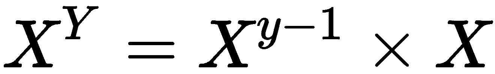
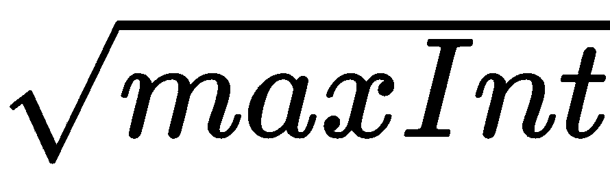

# 第十一章：基于属性的测试

我们已经看到纯函数有一个重要的属性——它们对于相同的输入返回相同的输出。我们也看到这个属性使我们能够轻松地为纯函数编写基于示例的单元测试。此外，我们可以编写数据驱动的测试，允许一个测试函数被多个输入和输出重复使用。

事实证明，我们甚至可以做得更好。除了编写许多行的数据驱动测试之外，我们还可以利用纯函数的数学属性。这种技术是由函数式编程启用的数据生成器所实现的。这些测试被误导地称为**基于属性的测试**；您必须记住，这个名称来自纯函数的数学属性，而不是来自类或对象中实现的属性。

本章将涵盖以下主题：

+   理解基于属性的测试的概念

+   如何编写生成器并利用它们

+   如何从基于示例的测试转向基于属性的测试

+   如何编写良好的属性

# 技术要求

您将需要一个支持 C++ 17 的编译器。我使用的是 GCC 7.4.0。

代码可以在 GitHub 上找到，网址为[https:/​/​github.​com/​PacktPublishing/​Hands-​On-​Functional-Programming-​with-​Cpp](https://github.%E2%80%8Bcom/PacktPublishing/Hands-On-Functional-Programming-with-Cpp)，位于`Chapter11`文件夹中。它包括并使用了`doctest`，这是一个单头开源单元测试库。您可以在其 GitHub 存储库上找到它，网址为[https:/​/github.com/​onqtam/​doctest](https://github.%E2%80%8Bcom/onqtam/doctest)。

# 基于属性的测试

单元测试是一种非常有用的软件开发技术。一套良好的单元测试可以做到以下几点：

+   通过自动化回归测试的繁琐部分来加快部署速度。

+   使专业测试人员能够发现隐藏的问题，而不是一遍又一遍地运行相同的测试计划。

+   在开发过程的早期消除错误，从而减少查找和修复错误的成本。

+   通过提供反馈来改进软件设计，作为代码结构的第一个客户端（如果测试复杂，很可能您的设计也很复杂），只要开发人员知道如何看到和解释反馈。

+   增加对代码的信任，从而允许更多的更改，从而促进加速开发或消除代码中的风险。

我喜欢编写单元测试。我喜欢找出有趣的测试用例，我喜欢使用测试驱动我的代码——正如您在第九章中所看到的，*函数式编程的测试驱动开发*。与此同时，我一直在寻找更好的编写测试的方法，因为如果我们能加快这个过程，那将是很棒的。

我们已经在第九章中看到，纯函数使我们更容易识别测试用例，因为根据定义，它们的输出是受限制的。事实证明，如果我们涉足与这些纯函数相关的数学属性领域，我们可以走得更远。

如果您已经写了一段时间的单元测试，您可能会觉得其中一些测试有点多余。如果我们能够编写这样的测试——对于一定范围内的输入，预期输出必须具有某种属性，那将是很好的。事实证明，借助数据生成器和一点抽象思维，我们可以做到这一点。

让我们比较一下方法。

# 基于示例的测试与基于属性的测试

让我们以`power`函数为例：

```cpp
function<int(int, int)> power = [](auto first, auto second){
    return pow(first, second);
};
```

如何使用基于示例的测试来测试它？我们需要找出一些有趣的值作为第一个和第二个，并将它们组合。对于这个练习的目标，我们将限制自己只使用正整数。一般来说，整数的有趣值是`0`，`1`，很多，和最大值。这导致了以下可能的情况：

+   *0⁰ -> 未定义*（在 C++的 pow 实现中，除非启用了特定错误，否则返回`1`）

+   *0^(0 到 max 之间的任何整数) -> 0*

+   *1^(任何整数) -> 1*

+   *(除了 0 之外的任何整数)⁰ -> 1*

+   *2² -> 4*

+   *2^(不会溢出的最大整数) -> 要计算的值*

+   *10⁵ -> 100000*

+   *10^(不会溢出的最大整数) -> 要计算的值*

这个清单当然并不完整，但它展示了对问题的有趣分析。因此，让我们写下这些测试：

```cpp
TEST_CASE("Power"){
    int maxInt = numeric_limits<int>::max();
    CHECK_EQ(1, power(0, 0));
    CHECK_EQ(0, power(0, 1));
    CHECK_EQ(0, power(0, maxInt));
    CHECK_EQ(1, power(1, 1));
    CHECK_EQ(1, power(1, 2));
    CHECK_EQ(1, power(1, maxInt));
    CHECK_EQ(1, power(2, 0));
    CHECK_EQ(2, power(2, 1));
    CHECK_EQ(4, power(2, 2));
    CHECK_EQ(maxInt, power(2, 31) - 1);
    CHECK_EQ(1, power(3, 0));
    CHECK_EQ(3, power(3, 1));
    CHECK_EQ(9, power(3, 2));
    CHECK_EQ(1, power(maxInt, 0));
    CHECK_EQ(maxInt, power(maxInt, 1));
}
```

这显然不是我们需要检查以确保幂函数有效的所有测试的完整清单，但这是一个很好的开始。看着这个清单，我在想，你认为——你会写更多还是更少的测试？我肯定想写更多，但在这个过程中我失去了动力。当然，其中一个问题是我是在编写代码之后才写这些测试；我更有动力的是在编写代码的同时编写测试，就像**测试驱动开发**（**TDD**）一样。但也许有更好的方法？

让我们换个角度思考一下。有没有一些我们可以测试的属性，适用于一些或所有的预期输出？让我们写一个清单：

+   *0⁰ -> 未定义（在 C++的 pow 函数中默认为 1）*

+   *0^([1 .. maxInt]) -> 0*

+   *值：[1 .. maxInt]⁰ -> 1*

+   *值：[0 .. maxInt]¹ -> 值*

这些是一些明显的属性。然而，它们只涵盖了一小部分值。我们仍然需要涵盖*x**^y*的一般情况，其中*x*和*y*都不是`0`或`1`。我们能找到任何属性吗？好吧，想想整数幂的数学定义——它是重复的乘法。因此，我们可以推断，对于大于`1`的任何*x*和*y*值，以下成立：



我们在这里有一个边界问题，因为计算可能会溢出。因此，需要选择*x*和*y*的值，使*x^y*小于`maxInt`。解决这个问题的一种方法是首先选择*x*，然后选择*y*在*y=2*和`maxy=floor(log[x]maxInt)`之间。为了尽可能接近边界，我们应该始终选择`maxy`作为一个值。要检查溢出情况，我们只需要测试*x*的`maxy + 1`次方是否溢出。

前面的方法当然意味着我们信任标准库中对数函数的结果。如果你的“测试者偏执狂”比我更大，我建议使用经过验证的对数表，包括从`2`到`maxInt`和值`maxInt`的所有基数。然而，我会使用 STL 对数函数。

现在我们有了幂函数的数学属性清单。但我们想要像之前看到的那样，使用区间来实现它们。我们能做到吗？这就是数据生成器的作用。

# 生成器

生成器是函数式编程语言的一个重要特性。它们通常通过 lambda 和惰性求值的组合来实现，允许编写以下代码：

```cpp
// pseudocode
vector<int> values = generate(1, maxInt, [](){/*generatorCode*/}).pick(100)
```

生成器函数通常会生成无限数量的值，但由于它是惰性求值的，只有在调用`pick`时，这`100`个值才会实现。

C++目前还没有标准支持惰性求值和数据生成器，因此我们必须实现自己的生成器。值得注意的是，C++ 20 已经采纳了在标准中包含了令人敬畏的 ranges 库，该库可以实现这两个功能。对于本章的目标，我们将坚持使用今天可用的标准，但你将在本书的最后几章中找到 ranges 库的基本用法。

首先，我们如何生成数据？STL 为我们提供了一种生成均匀分布的随机整数的好方法，使用`uniform_int_distribution`类。让我们先看看代码；我已经添加了注释来解释发生了什么：

```cpp
auto generate_ints = [](const int min, const int max){
    random_device rd; // use for generating the seed
    mt19937 generator(rd()); // used for generating pseudo-random 
        numbers
    uniform_int_distribution<int> distribution(min, max); // used to 
        generate uniformly distributed numbers between min and max
    auto values = transformAll<vector<int>>(range(0, 98), // generates 
        the range [0..98]
            &distribution, &generator{
                return distribution(generator); // generate the random 
                    numbers
            });
    values.push_back(min); // ensure that min and max values are 
        included
    values.push_back(max);
    return values;
};
```

这个函数将从`min`到`max`生成均匀分布的数字。我倾向于始终包括区间的边缘，因为这些对于测试来说总是有趣的值。

我们还使用了一个名为`range`的函数，您还没有看到。它的目标是用`minValue`到`maxValue`的值填充一个向量，以便进行简单的转换。在这里：

```cpp
auto range = [](const int minValue, const int maxValue){
    vector<int> range(maxValue - minValue + 1);
    iota(range.begin(), range.end(), minValue);
    return range;
};
```

值得注意的是，在函数式编程语言中，范围通常是惰性求值的，这大大减少了它们的内存占用。不过，对于我们的示例目标来说，这也很好用。

先前的`generator`函数允许我们为我们的测试创建输入数据，这些数据在 1 和最大整数值之间均匀分布。它只需要一个简单的绑定：

```cpp
auto generate_ints_greater_than_1 = bind(generate_ints, 1, numeric_limits<int>::max());
```

让我们将其用于我们的属性测试。

# 将属性放到测试中

让我们再次看看我们想要检查的属性列表：

+   *0⁰ -> 未定义（在 C++的 pow 函数中默认为 1）*

+   *0^([1 .. maxInt]) -> 0*

+   *值：[1 .. maxInt]⁰ -> 1*

+   *值：[0 .. maxInt]¹ -> 值*

+   *x^y = x^(y-1) * x*

现在我们将依次实现每个属性。对于每个属性，我们将使用基于示例的测试或受`generate_ints_greater_than_1`函数启发的数据生成器。让我们从最简单的属性开始——*0⁰*应该是未定义的——或者实际上是其标准实现中的`1`。

# 属性：00 -> 未定义

第一个问题使用基于示例的测试非常容易实现。出于一致性考虑，我们将其提取到一个函数中：

```cpp
auto property_0_to_power_0_is_1 = [](){
    return power(0, 0) == 1;
};
```

在我们的测试中，我们还将编写属性的描述，以便获得信息丰富的输出：

```cpp
TEST_CASE("Properties"){
    cout << "Property: 0 to power 0 is 1" << endl;
    CHECK(property_0_to_power_0_is_1);
 }
```

当运行时，会产生以下输出，通过测试：

```cpp
g++ -std=c++17 propertyBasedTests.cpp -o out/propertyBasedTests
./out/propertyBasedTests
[doctest] doctest version is "2.0.1"
[doctest] run with "--help" for options
Property: 0 to power 0 is 1
===============================================================================
[doctest] test cases:      1 |      1 passed |      0 failed |      0 skipped
[doctest] assertions:      1 |      1 passed |      0 failed |
[doctest] Status: SUCCESS!
```

这很容易！我们现在有了一个基本的属性测试结构。下一个测试将需要一个数据生成器，但我们已经有了。让我们看看它如何适用于`0`属性到任何幂，除了`0`等于`0`。

# 属性：0[1 .. maxInt] -> 0

我们需要我们的数字生成器从`1`到`maxInt`，这已经实现了。然后我们需要一个属性函数，检查对于从`1`到`maxInt`的任何指数，`0`的指数等于`0`。代码编写起来相当容易：

```cpp
auto prop_0_to_any_nonzero_int_is_0= [](const int exponent){
    CHECK(exponent > 0); // checking the contract just to be sure
    return power(0, exponent) == 0;
};
```

接下来，我们需要检查这个属性。由于我们有一个生成的值列表，我们可以使用`all_of`函数来检查所有这些值是否符合属性。为了使事情更加信息丰富，我决定显示我们正在使用的值列表：

```cpp
auto printGeneratedValues = [](const string& generatorName, const auto& 
    values){
        cout << "Check generator " << generatorName << endl;
        for_each(values.begin(), values.end(), [](auto value) { cout << 
            value << ", ";});
        cout << endl;
 };

auto check_property = [](const auto& generator, const auto& property, const string& generatorName){
    auto values = generator();
    printGeneratedValues(generatorName, values);
    CHECK(all_of_collection(values, property));
};
```

最后，我们可以编写我们的测试。我们将再次在测试之前显示属性名称：

```cpp
TEST_CASE("Properties"){
    cout << "Property: 0 to power 0 is 1" << endl;
    CHECK(property_0_to_power_0_is_1);

    cout << "Property: 0 to [1..maxInt] is 0" << endl;
    check_property(generate_ints_greater_than_1,  
        prop_0_to_any_nonzero_int_is_0, "generate ints");
}
```

运行测试会产生以下输出：

```cpp
Property: 0 to power 0 is 1
Property: 0 to [1..maxInt] is 0
Check generator generate ints
1073496375, 263661517, 1090774655, 590994005, 168796979, 1988143371, 1411998804, 1276384966, 252406124, 111200955, 775255151, 1669887756, 1426286501, 1264685577, 1409478643, 944131269, 1688339800, 192256171, 1406363728, 1624573054, 2654328, 1025851283, 1113062216, 1099035394, 624703362, 1523770105, 1243308926, 104279226, 1330992269, 1964576789, 789398651, 453897783, 1041935696, 561917028, 1379973023, 643316376, 1983422999, 1559294692, 2097139875, 384327588, 867142643, 1394240860, 2137873266, 2103542389, 1385608621, 2058924659, 1092474161, 1071910908, 1041001035, 582615293, 1911217125, 1383545491, 410712068, 1161330888, 1939114509, 1395243657, 427165959, 28574042, 1391025789, 224683120, 1222884936, 523039771, 1539230457, 2114587312, 2069325876, 166181790, 1504124934, 1817094271, 328329837, 442231460, 2123558414, 411757963, 1883062671, 1529993763, 1645210705, 866071861, 305821973, 1015936684, 2081548159, 1216448456, 2032167679, 351064479, 1818390045, 858994762, 2073835547, 755252854, 2010595753, 1882881401, 741339006, 1080861523, 1845108795, 362033992, 680848942, 728181713, 1252227588, 125901168, 1212171311, 2110298117, 946911655, 1, 2147483647, 
===============================================================================
[doctest] test cases:      1 |      1 passed |      0 failed |      0 skipped
[doctest] assertions:    103 |    103 passed |      0 failed |
[doctest] Status: SUCCESS!
```

正如您所看到的，一堆随机值被用于测试，最后两个值是`1`和`maxInt`。

现在是时候停下来思考一分钟了。这些测试是不寻常的。单元测试的一个关键思想是进行可重复的测试，但在这里，我们有一堆随机值。这些算不算？当一个值导致失败时我们该怎么办？

这些都是很好的问题！首先，使用基于属性的测试并不排除基于示例的测试。实际上，我们现在正在混合使用这两种——*0⁰*是一个示例，而不是一个属性。因此，在有意义时，不要犹豫检查任何特定值。

其次，支持属性测试的库允许收集特定失败值并自动重新测试这些值。很简单——每当有失败时，将值保存在某个地方，并在下次运行测试时包含它们。这不仅可以让您进行更彻底的测试，还可以发现代码的行为。

因此，我们必须将基于示例的测试和基于属性的测试视为互补的技术。第一个帮助您使用**测试驱动开发**（**TDD**）来驱动代码，并检查有趣的案例。第二个允许您找到您尚未考虑的案例，并重新测试相同的错误。两者都有用，只是方式不同。

让我们回到编写我们的属性。接下来的一个属性是任何数的零次幂等于`1`。

# 属性：value: [1 .. maxInt]0 -> 1

我们已经准备就绪，我们只需要写下来：

```cpp
auto prop_anyIntToPower0Is1 = [](const int base){
    CHECK(base > 0);
    return power(base, 0) == 1;
};
```

测试变成了以下内容：

```cpp
TEST_CASE("Properties"){
    cout << "Property: 0 to power 0 is 1" << endl;
    CHECK(property_0_to_power_0_is_1);

    cout << "Property: 0 to [1..maxInt] is 0" << endl;
    check_property(generate_ints_greater_than_1, 
        prop_0_to_any_nonzero_int_is_0, "generate ints");

    cout << "Property: any int to power 0 is 1" << endl;
    check_property(generate_ints_greater_than_1, 
        prop_anyIntToPower0Is1, "generate ints");
}
```

运行测试会得到以下输出（为简洁起见，省略了几行）：

```cpp
Property: 0 to power 0 is 1
Check generator generate ints
1673741664, 1132665648, 342304077, 936735303, 917238554, 1081591838, 743969276, 1981329112, 127389617, 
...
 1, 2147483647, 
Property: any int to power 0 is 1
Check generator generate ints
736268029, 1304281720, 416541658, 2060514167, 1695305196, 1479818034, 699224013, 1309218505, 302388654, 765083344, 430385474, 648548788, 1986457895, 794974983, 1797109305, 1131764785, 1221836230, 802640954,
...
1543181200, 1, 2147483647, 
===============================================================================
[doctest] test cases:      1 |      1 passed |      0 failed |      0 skipped
[doctest] assertions:    205 |    205 passed |      0 failed |
[doctest] Status: SUCCESS!
```

从前面的示例中可以看出，这些数字确实是随机的，同时始终包括`1`和`maxInt`。

我们已经掌握了这个！下一个属性是任何值的 1 次幂就是这个值。

# 属性：value: [0 .. maxInt]1 -> value

我们需要另一个生成方法，从`0`开始。我们只需要再次使用 bind 魔术来获得所需的结果：

```cpp
auto generate_ints_greater_than_0 = bind(generate_ints, 0, numeric_limits<int>::max());
```

这个属性写起来很容易：

```cpp
auto prop_any_int_to_power_1_is_the_value = [](const int base){
    return power(base, 1) == base;
};
```

测试很明显：

```cpp
TEST_CASE("Properties"){
    cout << "Property: 0 to power 0 is 1" << endl;
    CHECK(property_0_to_power_0_is_1);

    cout << "Property: 0 to any non-zero power is 0" << endl;
    check_property(generate_ints_greater_than_1, 
        prop_0_to_any_nonzero_int_is_0, "generate ints");

    cout << "Property: any int to power 0 is 1" << endl;
    check_property(generate_ints_greater_than_1, 
        prop_anyIntToPower0Is1, "generate ints");

    cout << "Property: any int to power 1 is the value" << endl;
    check_property(generate_ints_greater_than_0, 
        prop_any_int_to_power_1_is_the_value, "generate ints");
}
```

再次运行测试，结果再次通过。

让我们再次反思一下：

+   我们要检查多少个值？答案是`301`。

+   测试代码有多少行？测试代码只有 23 行代码，而我们用于测试的*库*函数大约有 40 行代码。

这不是很神奇吗？这不是对你的测试值得投资吗？

我们知道如何做到这一点。是时候来看我们的练习中最复杂的属性了——任何数的 y 次幂等于 y-1 次幂乘以这个数。

# 属性：xy = xy-1 * x

这将要求我们生成两组值，*x*和*y*，以便*x^y < maxInt*。我花了一些时间与数据生成器一起摸索，但我发现任何大于的*x*只能测试*y=1*。因此，我将使用两个生成器；第一个将生成`2`和之间的数字，而第二个将生成大于且小于`maxInt`的数字：

```cpp
auto generate_ints_greater_than_2_less_sqrt_maxInt = bind(generate_ints, 2, sqrt(numeric_limits<int>::max()));
```

属性的第一部分变成了以下内容：

```cpp
cout << "Property: next power of x is previous power of x multiplied by  
    x" << endl;
check_property(generate_ints_greater_than_2_less_sqrt_maxInt, 
    prop_nextPowerOfXIsPreviousPowerOfXMultipliedByX, "generate greater 
        than 2 and less than sqrt of maxInt");
```

为了实现属性，我们还需要生成`x`基数的指数，这样我们就可以将属性写成如下形式：

```cpp
auto prop_nextPowerOfXIsPreviousPowerOfXMultipliedByX = [](const int x){
    auto exponents = bind(generate_exponent_less_than_log_maxInt, x);
    return check_property(exponents, x{ return power(x, y) ==  
      power(x, y - 1) * x;}, "generate exponents for " + to_string(x));
};
```

从生成函数的名称中可以看出，我们需要生成在`1`和*log[x]maxInt*之间的数字。超过这个值的任何数字在计算 x^y 时都会溢出。由于 STL 中没有通用对数函数，我们需要实现一个。为了计算*log[x]maxInt*，我们只需要使用一个数学等式：

```cpp
auto logMaxIntBaseX = [](const int x) -> int{
    auto maxInt = numeric_limits<int>::max() ;
    return floor(log(maxInt) / log(x));
};
```

我们的生成函数变成了以下内容：

```cpp
auto generate_exponent_less_than_log_maxInt = [](const int x){
    return generate_ints(1, logMaxIntBaseX(x));
};
```

有了这个，我们可以运行我们的测试。以下是输出的简要部分：

```cpp
Check generator generate exponents for 43740
1, 2, 
Check generator generate exponents for 9320
1, 2, 
Check generator generate exponents for 2
1, 2, 3, 4, 5, 6, 7, 8, 9, 10, 11, 12, 13, 14, 15, 16, 17, 18, 19, 20, 21, 22, 23, 24, 25, 26, 27, 28, 29, 30, 
Check generator generate exponents for 46340
1, 2,
```

测试的最后一部分是添加从 + 1 到`maxInt`的区间：

```cpp
check_property(generate_ints_greater_than_sqrt_maxInt,  
    prop_nextPowerOfXIsPreviousPowerOfXMultipliedByX, "generate greater    
    than sqrt of maxInt");
```

这也导致了生成函数的更新，以支持一些边缘情况；请参考以下代码中的注释以获取解释：

```cpp
auto generate_ints = [](const int min, const int max){
    if(min > max) { // when lower range is larger than upper range, 
        just return empty vector
            return vector<int>();
    }
    if(min == max){ // if min and max are equal, just return {min}
        return range(min, min);
    }

    if(max - min <= 100){ // if there not enough int values in the 
        range, just return it fully
            return range(min, max);
    }
    ...
}
```

我们已经实现了我们的最终属性！

# 结论

现在我们只需用几行代码来检查所有以下内容：

+   *0⁰ -> undefined (1 by default in pow function in C++)*

+   *0^([1 .. maxInt]) -> 0*

+   *value: [1 .. maxInt]⁰ -> 1*

+   *value: [0 .. maxInt]¹ -> value*

+   *x^y = x^(y-1) * x*

这与更常用的基于示例的测试方法相比如何？我们用更少的代码进行更多的测试。我们可以发现代码中隐藏的问题。但是属性比示例更难识别。我们还确定了基于属性的测试与基于示例的测试非常有效地配合使用。

因此，让我们现在解决找到属性的问题。这需要一些分析，我们将探讨一种实际的方式，通过数据驱动测试从示例中演变出属性。

# 从示例到数据驱动测试到属性

当我第一次听说基于属性的测试时，我有两个问题。首先，我以为它们是用来替代示例测试的——现在我们知道它们并不是；只需将这两种技术并行使用。其次，我不知道如何提出好的属性。

然而，我对如何提出好的示例和如何消除测试之间的重复有了一个好主意。我们已经看到了如何为幂函数提出好的示例；让我们回顾一下：

+   *0⁰ -> 未定义（C++中的 pow 实现返回 1，除非启用了特定错误）*

+   0^(0 到最大的任何整数) -> 0

+   *1^(任何整数) -> 1*

+   （除 0 外的任何整数）⁰ -> 1

+   *2² -> 4*

+   *2^(不会溢出的最大整数) -> 要计算的值*

+   *10⁵ -> 100000*

+   *10^(不会溢出的最大整数) -> 要计算的值*

我们还看到了为这些情况编写基于示例的测试非常容易：

```cpp
TEST_CASE("Power"){
    int maxInt = numeric_limits<int>::max();
    CHECK_EQ(1, power(0, 0));
    CHECK_EQ(0, power(0, 1));
    CHECK_EQ(0, power(0, maxInt));
    CHECK_EQ(1, power(1, 1));
    CHECK_EQ(1, power(1, 2));
    CHECK_EQ(1, power(1, maxInt));
    CHECK_EQ(1, power(2, 0));
    CHECK_EQ(2, power(2, 1));
    CHECK_EQ(4, power(2, 2));
    CHECK_EQ(maxInt, power(2, 31) - 1);
    CHECK_EQ(1, power(3, 0));
    CHECK_EQ(3, power(3, 1));
    CHECK_EQ(9, power(3, 2));
    CHECK_EQ(1, power(maxInt, 0));
    CHECK_EQ(maxInt, power(maxInt, 1));
}
```

这些示例展示了代码的相似之处。`0`、`1`、`2`和`3`的基数重复了多次。我们在第九章中已经看到，*函数式编程的测试驱动开发*，我们可以通过指定多个输入值来使用数据驱动测试来消除这种相似性：

```cpp
TEST_CASE("1 raised to a power is 1"){
    int exponent;

    SUBCASE("0"){
        exponent = 0;
    }
    SUBCASE("1"){
        exponent = 1;
    }
    SUBCASE("2"){
        exponent = 1;
    }
    SUBCASE("maxInt"){
        exponent = maxInt;
    }

    CAPTURE(exponent);
    CHECK_EQ(1, power(1, exponent));
}
```

在我努力一段时间后消除这些相似性之后，我开始看到这些属性。在这种情况下，很明显，我们可以添加一个检查相同数学属性的测试，而不是使用特定示例。事实上，我们在上一节中写了它，它看起来像这样：

```cpp
cout << "Property: any int to power 1 is the value" << endl;
check_property(generate_ints_greater_than_0, 
    prop_any_int_to_power_1_is_the_value, "generate ints");
```

所以我的建议是——如果你花几分钟思考问题并找到要检查的数学属性，那太好了！（编写基于属性的测试，并添加尽可能多的基于示例的测试，以确保你已经涵盖了各种情况。）如果你看不到它们，别担心；继续添加基于示例的测试，通过使用数据驱动测试消除测试之间的重复，并最终你会发现这些属性。然后，添加基于属性的测试，并决定如何处理现有的基于示例的测试。

# 好的属性，坏的属性

由于属性比示例更抽象，因此很容易以混乱或不清晰的方式实现它们。你已经需要对基于示例的测试付出很多注意力；现在你需要加倍努力来处理基于属性的测试。

首先，好的属性就像好的单元测试。因此，我们希望有以下属性：

+   小

+   适当命名和清晰

+   在失败时提供非常清晰的消息

+   快速

+   可重复

不过，基于属性的测试有一个警告——由于我们使用随机值，我们是否应该期望随机失败？当基于属性的测试失败时，我们会对我们的代码有所了解，因此这是值得庆祝的。然而，我们应该期望随着时间的推移和错误的消除，失败次数会减少。如果你的基于属性的测试每天都失败，那肯定有问题——也许属性太大，或者实现中存在许多漏洞。如果你的基于属性的测试偶尔失败，并且显示代码中可能存在的错误——那太好了。

基于属性的测试的一个困难之处在于保持生成器和属性检查没有错误。这也是代码，任何代码都可能有错误。在基于示例的测试中，我们通过简化单元测试的方式来解决这个问题，使错误几乎不可能发生。请注意，属性更加复杂，因此可能需要更多的注意。旧的原则“保持简单，愚蠢”在基于属性的测试中更加有价值。因此，更偏爱小属性而不是大属性，进行分析，并与同事一起审查代码，包括名称和实现。

# 关于实现的一些建议

在本章中，我们使用了一组自定义函数来实现数据生成器，以保持代码标准为 C++ 17。然而，这些函数是为了学习技术而优化的，并不适用于生产环境。您可能已经注意到，它们并不针对内存占用或性能进行优化。我们可以通过巧妙地使用迭代器来改进它们，但还有更好的方法。

如果您可以使用范围库或使用 C++ 20 编译您的测试，那么实现无限数据生成器就会变得非常容易（由于惰性评估）。我还建议您搜索基于属性的测试库或生成器库，因为一些生成器已经被其他人编写，一旦您理解了概念，就可以更快地在您的代码中使用它们。

# 总结

基于属性的测试是我们多年来所知道和使用的基于示例的测试的一个受欢迎的补充。它向我们展示了如何将数据生成与一些分析相结合，以消除测试中的重复项并找到我们未考虑的情况。

基于属性的测试是通过非常容易使用纯函数实现的数据生成器来实现的。随着 C++ 20 中的惰性评估或范围库的到来，事情将变得更加容易。

但基于属性的测试的核心技术是识别属性。我们已经看到了两种方法来做到这一点——第一种是通过分析示例，第二种是通过编写基于示例的测试，消除重复项，将其转换为数据驱动测试，然后用属性替换数据行。

最后，请记住，基于属性的测试是代码，它们需要非常干净，易于更改和理解。尽可能偏爱小属性，并通过清晰命名使它们易于理解。

在下一章中，我们将看看如何使用纯函数来支持我们的重构工作，以及如何将设计模式实现为函数。
