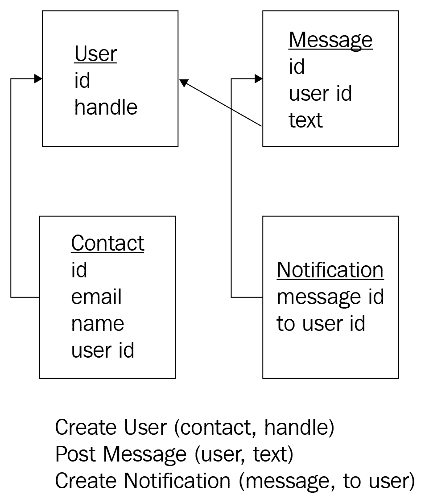

# 第十六章：不变性和架构 - 事件溯源

事件溯源是一种利用不变性进行存储的架构模式。事件溯源的基本思想是，与其存储数据的当前状态，不如存储修改数据的事件。这个想法可能看起来很激进，但并不新颖；事实上，您已经在使用基于这一原则的工具——例如 Git 等源代码控制系统遵循这种架构。我们将更详细地探讨这个想法，包括其优点和缺点。

本章将涵盖以下主题：

+   不变性的概念如何应用于数据存储

+   事件溯源架构的外观

+   在决定是否使用事件溯源时需要考虑的因素

# 技术要求

您需要一个支持 C++ 17 的编译器。我使用的是 GCC 7.4.0。

代码可以在 GitHub 上找到[https:/​/​github.​com/​PacktPublishing/​Hands-​On-​Functional-Programming-​with-​Cpp](https://github.%E2%80%8Bcom/PacktPublishing/Hands-On-Functional-Programming-with-Cpp)的`Chapter13`文件夹中。它包括并使用了`doctest`，这是一个单头开源单元测试库。您可以在其 GitHub 存储库中找到它[https:/​/github.​com/​onqtam/​doctest](https://github.%E2%80%8Bcom/onqtam/doctest)。

# 不变性和架构 - 事件溯源

直到 2010 年左右，数据存储的选择相当有限。无论您偏好的是 Oracle、MySQL 还是 PostgreSQL，您几乎都必须使用关系模型来存储数据。

然后，突然间，大量新的数据库引擎如雨后春笋般出现，对关系数据的支持部分或完全不足。它们如此不同，以至于无法进行积极的分类，因此世界最终以它们不做的事情来命名它们——NoSQL 数据库。事实上，它们唯一的共同点是对 SQL 的支持很少或根本没有。引擎的列表很长且不断变化，但在撰写本文时，一些引擎很普遍，包括 Redis、MongoDB、DynamoDb、Cassandra 和 Couchbase 等。每个引擎都有其自身的优势和劣势，它们出现的原因是为了优化各种场景，通常是在云计算的背景下。例如，Cassandra 具有高度分布式，而 MongoDB 允许轻松存储多种类型的数据。

大约在我听说 NoSQL 的同时，我开始听说一种称为事件溯源的新架构模式。与通常的 UI 服务器关系数据库模式相比，事件溯源对数据存储采取了一种根本不同的方法。事件溯源模式认为，与其存储系统的当前状态，不如我们将系统的增量更改编码为*领域事件*进行存储。

敏锐的读者会注意到这个想法的两个方面：

+   这听起来像是**领域驱动设计**（**DDD**）运动中的产物，事实上确实如此。领域事件可以作为我们在架构和领域模型演进中使用的另一种模式。

+   尽管对于业务应用程序来说，在数据存储中存储增量更改的想法可能是激进的，但在软件架构中并不新鲜。事实上，在撰写本书的过程中，我一直在使用基于这种模式的工具。您可能也使用它来获取代码示例。虽然使用了比我们将在事件溯源中讨论的历史更复杂的模型，但 Git 将增量更改与代码的当前状态一起存储。

Git 并不是唯一使用这种模式的工具。多年来，我们一直在运维中使用这样的工具进行数据备份。由于完整备份可能需要很长时间，一个好的策略是将频繁的增量备份与不经常的完整备份混合使用。然而，诀窍在于，当需要恢复时，我们可以依次应用增量备份，达到与完整备份相同的状态。这是在备份所需的时间和存储空间以及恢复备份所需的时间之间的一个很好的权衡。

到这一点，你可能会想知道事件溯源与 NoSQL 数据库有什么关系，除了与存储相关？虽然我无法证明，但我相信这两个想法都来自于 2010 年代围绕编程的思想潮流——通过消除技术障碍来优化开发速度，并为各种网络和基于云的架构优化系统。

让我们来思考一下 Twitter。在数据流方面，Twitter 有两个主要功能——发布消息和查看其他用户发布的消息。如果你不能立即看到另一个用户发布的消息，你甚至都不会知道，因此允许高延迟。然而，我们不希望丢失数据，所以需要尽快将用户消息存储起来。

实现这样的功能的标准方式是在请求时直接将消息保存到数据库中，并在响应时返回更新后的消息源。这使我们能够立即看到消息，但它也有一些缺点。首先，它使数据库成为瓶颈，因为每条发布的消息都执行了`INSERT`和`SELECT`语句。其次，它需要更多的服务器资源，从而增加了基于云的服务器成本。

如果我们换个思路呢？当你发布一条消息时，我们只是将事件保存到一个快速事件存储中，并立即返回。在未来的请求中更新消息源时，事件会被考虑进去，并返回更新后的消息源。数据存储不再是瓶颈，我们减少了服务器负载。然而，我们在系统中增加了一个新元素，即事件存储，这可能会增加一些成本，但事实证明，在高规模下，这可能比另一种选择更便宜、更响应。这是事件溯源的一个例子。

另一个选择是在数据引擎层解决这个问题，并像之前提到的那样分离写入和读取；然而，我们使用的数据存储是为写入进行了优化。缺点是数据的可读性比以前更高延迟，但这没关系。在未来的某个时候，数据变得可用，消息源也会更新。这是使用 NoSQL 数据库而不是关系数据库管理系统的一个例子。

2010 年代确实非常有趣，引发了软件架构和设计领域的许多新想法，同时将函数式编程引入了主流编程语言。顺便说一句，这个时期还因漫威电影宇宙（MCU）的一系列超级英雄电影而变得有趣。这两者之间没有联系，我只是喜欢漫威电影宇宙！然而，我必须停止对软件设计历史和漫威电影宇宙的狂热追捧，转而讨论另一个奇怪的想法——将不可变性引入数据存储。

# 将不可变性引入架构

我们已经看到不可变性对代码结构有深远影响，因此也对软件设计产生影响。我们还多次讨论过，I/O 基本上是可变的。我们将要展示的是，数据存储不一定是可变的，不可变的数据存储也对架构产生深远影响。

数据存储如何做到不可变？毕竟，许多软件应用的整个目的就是 CRUD——创建、检索、更新和删除。唯一不改变数据的操作是检索，尽管在某些情况下，检索数据可能会产生额外的副作用，如分析或日志记录。

然而，要记住我们面临着与数据结构相同的问题。可变数据结构在添加或删除元素时会改变其结构。然而，纯函数式语言支持不可变数据结构。

不可变数据结构具有以下特性——添加或删除项目不会改变数据结构。相反，它会返回初始数据结构的副本以及变化。为了优化内存，纯函数式编程语言实际上并不克隆数据，它们只是巧妙地利用指针来重用现有的内存。然而，对于程序员来说，就好像数据结构已经完全被克隆了。

考虑将相同的想法应用于存储。与其改变现有数据，每次写入或删除都会创建一个应用了变化的新版本的数据，同时保留之前的版本不变。想象一下可能性；我们得到了数据变化的整个历史，我们总是可以恢复它们，因为我们有一个非常近期的数据版本。

不过这并不容易。存储的数据往往很大，在每次变化时复制它将占用大量的存储空间，并且在这个过程中变得极其缓慢。与内存数据一样，同样的优化技术并不奏效，因为存储的数据往往更加复杂，而指针在文件系统中并不（还没有？）那么容易管理。

幸运的是，还有一种选择——一开始存储数据的版本，然后只存储数据的一些变化。我们可以在关系数据库中实现这一点（毕竟这些变化只是实体），但幸运的是，我们不必这样做。为了支持这种存储模型，一些被称为**事件存储**的存储引擎已经被实现。它们允许我们存储事件，并在需要时获取数据的最新版本。

这样的系统会如何运作呢？嗯，我们需要对领域和领域事件进行建模。让我们以 Twitter 为例来做这个。



如果我们使用传统的数据存储，我们只会以某种方式保存实体，但我们想要存储事件，所以我们将会有一个长长的增量变化列表，概念上看起来像这样：

```cpp
CreateUser name:alexboly -> userid 1
CreateUser name: johndoe -> userid 2
PostMessage userid: 1, message: 'Hello, world!' -> messageid 1
PostMessage userid: 2, message: 'Hi @alexboly' -> messageid 2
CreateNotification userid: 1, notification: "Message from johndoe"
PostMessage userid: 1, message: 'Hi @johndoe' -> messageid 3
CreateNotification userid: 2, notification: "Message from alexboly"
LikeMessage userid: 2, messageid: 3
...
```

在我们继续看一个实现的例子之前，我们需要记住我们正在讨论软件架构，没有解决方案是完美的。因此，我们必须停下来考虑一下在使用事件溯源时所做的权衡。

# 事件溯源的优势

如果事件溯源没有优势，我们就不会谈论它。

在概念层面，领域模型和领域事件可以很快地从领域专家那里提取出来，而且可以在非常快速、轻量级的会话中完成。事件风暴是一个促进会话，允许我们通过技术和领域专家之间的合作在几小时内设计一个复杂的系统。在这个事件中创造的知识不容小觑；这种共同的理解是知识工作中复杂努力中任何领域之间合作的强有力基础。

在软件设计层面，事件溯源比其他代码结构更好地揭示了意图。领域操作往往隐藏在实体内部；而在事件溯源中，领域模型的变化成为了架构的核心。我们实际上可以搜索数据可能经历的所有变化，并获得一个列表——这对其他代码结构来说是很困难的。

在编码层面，事件溯源简化了编程。虽然一开始可能很难以事件的方式思考，但它很快就会变得很自然。这种模型允许我们编写反映最重要业务特性的代码，从而使程序员和产品所有者或客户之间的理解更加容易。它还很好地封装了每种类型的变化，从而简化了我们的测试和代码。

在数据存储级别上，事件溯源允许我们查看对数据所做的更改列表，这对于其他数据存储模型来说是一个极端的壮举。增量备份在这种模型中更合适，因为它基本上是增量的。恢复内置于数据存储中，允许我们从任何过去的具体化存储开始，并应用所有事件。

此外，事件溯源允许我们回到过去。如果每个事件都有一个相反的事件，通常很容易做到，我们可以从末尾播放相反的事件到特定的时间戳，从而导致我们在那个时间点拥有的确切数据。

在性能水平上，事件溯源优化了数据的写入，使其对于大多数需要快速写入但可以处理读取延迟的应用程序非常有用（也被称为**大多数基于 Web 的系统**）。

但没有什么是免费的，那么什么可能出错呢？

# 事件溯源的缺点和注意事项

尽管事件溯源具有诸多优势，但在跳上这辆车之前，你需要考虑一些重要的缺点。

# 更改事件模式

第一个问题来自事件溯源的核心模型——如果我们需要在已经有大量数据的情况下更改事件的结构会怎样？例如，如果我们需要为每个事件添加时间戳怎么办？或者如果我们需要更改我们的`PostMessage`事件以包括一个可见性字段，该字段只能是接收者、只有关注者或所有人？

这个问题有解决方案，但每个解决方案都有自己的问题。一个解决方案是对事件模式进行版本控制，并且并排使用多个模式，这样做虽然有效，但会使具体化变得复杂。另一个解决方案是使用数据迁移脚本来更改过去的事件，但这会破坏不可变性的概念，而且必须做得正确。另一个选择是永远不更改事件模式，只是添加新的事件类型，但这可能会因多个已弃用的事件类型而导致混乱。

# 删除过去的数据

第二个问题是隐私。最近在**欧洲联盟**（**EU**）颁布的**通用数据保护条例**（**GDPR**）影响了世界各地许多软件系统，赋予用户要求从系统中完全删除私人数据的权利。在使用普通数据库时，这相对容易——只需删除与用户 ID 相关的记录——但在事件存储中该如何做呢？

我们可以从删除与用户相关的所有事件开始。但我们能这样做吗？如果事件具有时间关系，我们可能会遇到问题。例如，想象一下协同编辑文档的以下场景：

```cpp
CreateAuthor alexboly => authorid 1
CreateAuthor johndoe => authorid 2
...
AddText index: 2400, authorid:1, text: "something interesting here."
AddText index: 2427, authorid:2, text: "yes, that's interesting" => 
    "something interesting here. yes that's interesting"
DeleteText index: 2400, length: 10, authorid: 1 =>"interesting here. 
    yes that's interesting"
...
```

如果用户`alexboly`要求我们删除事件，让我们标记需要删除的事件：

```cpp
CreateAuthor alexboly => authorid 1
CreateAuthor johndoe => authorid 2
...
AddText index: 2400, authorid:1, text: "something interesting here."
AddText index: 2427, authorid:2, text: "yes, that's interesting" => 
    "something interesting here. yes that's interesting"
DeleteText index: 2400, length: 10, authorid: 1 =>"interesting here. 
    yes that's interesting"
...
```

你看到问题了吗？如果我们删除了突出显示的事件，不仅会丢失文档中的数据，而且索引也不再匹配！按顺序应用事件到空白文档将导致错误或损坏的数据。

我们可以做一些事情：

+   一个解决方案是删除用户的身份但保留数据。虽然这在特定情境下可能有效，但这个解决方案取决于删除请求的范围。有一种特殊情况，即用户已将个人数据（例如地址、电子邮件地址或 ID 号码）添加到文档中。如果我们删除了用户的身份，但也需要删除个人数据，我们将需要扫描所有事件以查找个人数据，并删除或用相同数量的空白字符替换它。

+   另一个解决方案是具体化数据库，删除数据，并从新的检查点开始处理未来事件。这破坏了事件溯源的核心理念之一——从空存储重建数据的能力——对于具有许多事件或许多删除的系统来说可能会很困难。但通过适当的规划和结构是可能的。

+   第三种解决方案是利用架构并使用`DeletePrivateData`的特殊事件。但是，这个事件不同，因为它将改变事件存储而不是数据。虽然它符合架构，但它是有风险的，并且需要广泛的测试，因为它可能会破坏一切。

+   第四种解决方案是设计事件，使它们不是时间上耦合的。从理论上讲，这听起来不错，但我们必须承认在实践中可能并不总是可能的。在前面的例子中，我们需要一些文本的位置，我向你挑战找到一种独立于现有文本的指定位置的方法。还要考虑到，我们将在一个罕见的情况下进行这种设计工作，这可能使所有事件都不那么容易理解。如果可以通过最小的更改实现，那就太好了；但如果不能，你就需要自己做出决定。

# 实现示例

接下来我们将看一个使用事件源的简单实现示例。我们将从我们的 Twitter 示例开始，然后开始编写一些测试。

首先，让我们创建一个用户，并在伪代码中检查正确的事件存储：

```cpp
TEST_CASE("Create User"){
    EventStore eventStore;
    ...
    auto alexId = createUser("alexboly", eventStore);
    ...
    CHECK_EQ(lastEvent, expectedEvent);
}
```

我们需要一些东西来编译这个测试。首先，一个可以存储事件的事件存储，但是如何表示可以存储的事件呢？我们需要一种可以保存属性名称和值的数据结构。最简单的是一个`map<string, string>`结构，它将属性的名称映射到它们的值。为了看到它的作用，让我们为`CreateUser`创建事件结构：

```cpp
auto makeCreateUserEvent = [](const string& handle, const int id){
    return map<string, string>{
            {"type", "CreateUser"}, 
            {"handle", handle}, 
            {"id", to_string(id)}
    };
};
```

`CreateUser`事件有一个类型，`CreateUser`，并且需要一个句柄，例如`alexboly`，以及用户的`id`。让我们使用`typedef`使其更加友好和明确：

```cpp
typedef map<string, string> Event;
auto makeCreateUserEvent = [](const string& handle, const int id){
    return Event{
            {"type", "CreateUser"}, 
            {"handle", handle}, 
            {"id", to_string(id)}
    };
};
```

现在我们可以创建我们的`EventStore`。因为它基本上是一个事件列表，让我们直接使用它：

```cpp
class EventStore : public list<Event>{
    public:
        EventStore() : list<Event>(){
        };
};
```

所以，现在我们的测试可以使用`EventStore`和`makeCreateUserEvent`函数来检查，在调用`createUser`后，正确的事件将在事件存储中：

```cpp
TEST_CASE("Create User"){
    auto handle = "alexboly";
    EventStore eventStore;

    auto alexId = createUser(handle, eventStore);

    auto expectedEvent = makeCreateUserEvent(handle, alexId);
    auto event = eventStore.back();
    CHECK_EQ(event, expectedEvent);
}
```

我们现在只需要为这个测试实现`createUser`。这很简单；调用`makeCreateUserEvent`并将结果添加到`EventStore`。我们需要一个`id`，但由于我们现在只有一个元素，让我们使用一个硬编码值`1`：

```cpp
int id = 1;
auto createUser = [](string handle, EventStore& eventStore){
    eventStore.push_back(makeCreateUserEvent(handle, id));
    return id;
};
```

测试通过了；现在我们可以执行事件，并它们将进入事件存储。

现在让我们看看新用户如何发布消息。我们将需要第二种事件类型`PostMessage`，以及类似的代码基础设施。让我们编写测试。首先，我们需要创建一个用户。其次，我们需要创建一个通过`userId`与用户关联的消息。以下是测试：

```cpp
TEST_CASE("Post Message"){
    auto handle = "alexboly";
    auto message = "Hello, world!";
    EventStore eventStore;

    auto alexId = createUser(handle, eventStore);
    auto messageId = postMessage(alexId, message, eventStore);
    auto expectedEvent = makePostMessageEvent(alexId, message, 
        messageId);
    auto event = eventStore.back();
    CHECK_EQ(event, expectedEvent);
}
```

`makePostMessageEvent`函数将只创建一个带有所有必需信息的`Event`结构。它还需要一个类型和`messageId`：

```cpp
auto makePostMessageEvent = [](const int userId, const string& message, int id){
    return Event{
            {"type", "PostMessage"}, 
            {"userId", to_string(userId)}, 
            {"message", message},
            {"id", to_string(id)}
    };
};
```

最后，`postMessage`只需将`makePostMessageEvent`的结果添加到`EventStore`中。我们再次需要一个 ID，但我们只有一条消息，所以我们可以使用相同的 ID`1`：

```cpp
auto postMessage = [](const int userId, const string& message, 
    EventStore& eventStore){
      eventStore.push_back(makePostMessageEvent(userId, message, id));
      return id;
};
```

所以，现在我们有一个用户可以通过事件发布消息。这相当不错，也没有像一开始看起来那么困难。

这个实现提出了一些有趣的问题。

# 你如何检索数据？

首先，如果我想通过他们的句柄或`id`搜索用户怎么办？这是 Twitter 上的一个真实使用场景。如果我在消息中提到另一个用户`@alexboly`，通知应该发布到具有句柄`alexboly`的用户。此外，我想在时间轴上显示与用户`@alexboly`相关的所有消息。

对此我有两个选择。第一个选择是仅存储事件，并在读取数据时运行所有事件。第二个选择是维护一个具有当前值的域存储，并像任何其他数据库一样查询它。重要的是要注意，这些存储中的每一个或两个可能都是内存中的，以便非常快速地访问。

无论当前值是缓存还是计算得出的，我们都需要一种执行事件并获取它们的方法。我们怎么做呢？

让我们编写一个测试来描述我们需要的内容。在运行一个或多个事件之后，我们需要执行这些事件并获取当前值，以便在需要时检索它们：

```cpp
TEST_CASE("Run events and get the user store"){
    auto handle = "alexboly";
    EventStore eventStore;

    auto alexId = createUser(handle, eventStore);
    auto dataStore = eventStore.play();

    CHECK_EQ(dataStore.users.back(), User(alexId, handle));
}
```

为了使测试通过，我们需要一些东西。首先，一个`User`领域对象，我们将保持非常简单：

```cpp
class User{
    public:
        int id;
        string handle;
        User(int id, string handle): id(id), handle(handle){};
};
```

其次，一个包含`users`列表的数据存储：

```cpp
class DataStore{
    public:
        list<User> users;
};
```

最后，`play`机制。现在让我们先使用一个丑陋的实现：

```cpp
  class EventStore : public list<Event>{
    public:
       DataStore play(){
            DataStore dataStore;
            for(Event event :  *this){
                if(event["type"] == "CreateUser"){
                    dataStore.users.push_back(User(stoi(event["id"]), 
                        event["handle"]));
                }
            };
            return dataStore;
        };
}
```

了解高阶函数后，我们当然可以看到我们在前面的片段中的`for`语句可以转换为函数式方法。实际上，我们可以通过调用`transform`将所有事件按`CreateUser`类型进行过滤，然后将每个事件转换为实体。首先，让我们提取一些较小的函数。我们需要一个将`CreateUser`事件转换为用户的函数：

```cpp
auto createUserEventToUser = [](Event event){
    return User(stoi(event["id"]), event["handle"]);
};
```

我们还需要另一个函数，它可以按类型过滤事件列表：

```cpp
auto createUserEventToUser = [](Event event){
    return User(stoi(event["id"]), event["handle"]);
};
```

现在我们可以提取一个`playEvents`函数，它接受一个事件列表，按类型进行过滤，并运行转换，得到一个实体列表：

```cpp
template<typename Entity>
auto playEvents = [](const auto& events, const auto& eventType, 
    auto playEvent){
      list<Event> allEventsOfType;
      auto filterEventByThisEventType = bind(filterEventByEventType, 
        _1, eventType);
      copy_if(events.begin(),events.end(),back_insert_iterator
        (allEventsOfType), filterEventByThisEventType);
      list<Entity> entities(allEventsOfType.size());
      transform(allEventsOfType.begin(), allEventsOfType.end(),    
        entities.begin(), playEvent); 
      return entities;
};
```

现在我们可以在我们的`EventStore`中使用这个函数来替换`CreateUser`的处理，并将其泛化到其他事件中：

```cpp
class EventStore : public list<Event>{
    public:
        EventStore() : list<Event>(){
        };
        DataStore play(){
            DataStore dataStore;
            dataStore.users = playEvents<User>(*this, "CreateUser", 
                createUserEventToUser);
            return dataStore;
        };
};
```

我们现在有了一种根据事件从我们的存储中检索数据的方法。是时候看看下一个问题了。

# 引用完整性怎么样？

到目前为止，我们已经看到了在使用事件时实体之间的关系是基于 ID 的，但是如果我们使用错误的`id`调用事件会怎样？看看下面片段中的例子：

```cpp
CreateUser handle:alexboly -> id 1
DeleteUser id: 1
PostMessage userId: 1, text: "Hello, world!" -> user with id 1 doesn't 
                                                exist anymore
```

我看到了这个问题的几个解决方案：

+   第一个解决方案是无论如何都运行事件。如果这不会在显示上创建额外的问题，那么这将起作用。在 Twitter 上，如果我看到一条消息，我可以导航到发布消息的用户。在这种情况下，导航将导致一个不存在的页面。这是一个问题吗？我认为对于像 Twitter 这样的东西，这不是一个很大的问题，只要它不经常发生，但你必须在你自己产品的上下文中判断它。

+   第二个解决方案是在没有任何检查的情况下运行事件，但运行一个重复的作业来检查引用问题并清理它们（通过事件，当然）。这种方法允许您最终使用事件源清理数据，而不会通过完整性检查减慢更新。再次，您需要弄清楚这在您的上下文中是否起作用。

+   第三种解决方案是在每次事件运行时运行完整性检查。虽然这可以确保引用完整性，但也会减慢一切速度。

检查可以通过两种方式进行——要么通过检查数据存储，要么通过检查事件存储。例如，你可以检查`DeleteUser`的 ID`1`从未发生过，或者它没有在`CreateUser`之后发生过（但你需要用户句柄）。

在选择事件源应用程序时请记住这一点！

# 总结

事件源是一种不可变数据存储方法，从一个简单的想法开始——我们存储导致当前状态的所有事件，而不是存储世界的当前状态？这种方法的优势很多，也很有趣——能够在时间上前进和后退，内置增量备份，并且以时间线而不是状态来思考。它也有一些注意事项——删除过去的数据非常困难，事件模式很难更改，引用完整性往往变得更松散。您还需要注意可能的错误，并定义处理它们的结构化和可重复的策略。

我们还看到了如何使用 lambda 作为事件实现简单的事件源架构。我们还可以看一下用于存储 lambda 的事件源，因为存储的事件基本上是一个命令模式，而命令模式的最简单实现是 lambda。好奇的读者可以尝试将事件序列化/反序列化为 lambda，并看看它如何改变设计。

像任何架构模式一样，我的建议是仔细考虑权衡，并对实施中提出的最重要的挑战有答案。如果您选择尝试事件溯源，我还建议您尝试一个成熟的事件存储，而不是自己构建一个。本章中我们编写的事件存储对展示事件溯源的核心原则和挑战很有用，但远未准备好投入生产使用。

现在是时候转向 C ++中函数式编程的未来了。在下一章中，我们将介绍 C ++ 17 中现有的函数式编程特性，并了解关于 C ++ 20 的最新消息。
