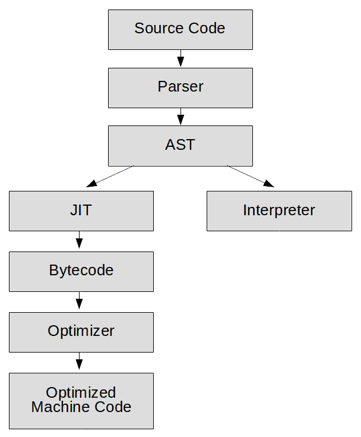
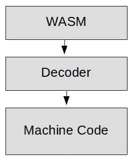
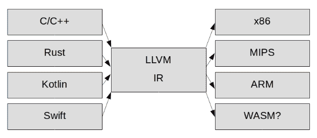
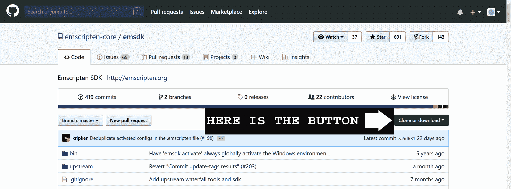

# 第一章：介绍 WebAssembly 和 Emscripten

欢迎来到令人兴奋的 WebAssembly 新世界！对于 WebAssembly 来说，现在还处于早期阶段，但这项技术目前正如火箭般腾飞，通过阅读本书，您有机会站在起步阶段。如果您对网络游戏开发感兴趣，或者您想尽可能多地了解这项新技术，以便在其成熟时为自己找到位置，那么您来对地方了。尽管 WebAssembly 还处于萌芽阶段，但所有主要的浏览器供应商都已经采用了它。现在是早期阶段，使用案例有限，但幸运的是，游戏开发是其中之一。因此，如果您想成为下一代网络应用程序开发派对的早期参与者，那就继续阅读吧，冒险家！

在本章中，我将向您介绍 WebAssembly、Emscripten 以及围绕 WebAssembly 的一些基础技术。我将教您 Emscripten 工具链的基础知识，以及如何使用 Emscripten 将 C++代码编译成 WebAssembly。我们将讨论 LLVM 是什么，以及它如何融入 Emscripten 工具链。我们将讨论 WebAssembly 的**最小可行产品**（**MVP**），以及在其当前 MVP 形式下 WebAssembly 的最佳使用案例，以及即将到来的内容。我将介绍**WebAssembly 文本**（**.wat**），以及我们如何使用它来理解 WebAssembly 字节码的设计，以及它与其他机器字节码的区别。我们还将简要讨论**asm.js**，以及它在 WebAssembly 设计中的历史意义。最后，我将向您展示如何在 Windows 和 Linux 上安装和运行 Emscripten。

在本章中，我们将涵盖以下主题：

+   什么是 WebAssembly？

+   我们为什么需要 WebAssembly？

+   为什么 WebAssembly 比 JavaScript 更快？

+   WebAssembly 会取代 JavaScript 吗？

+   什么是 asm.js？

+   对 LLVM 的简要介绍

+   对 WebAssembly 文本的简要介绍

+   什么是 Emscripten，我们如何使用它？

# 什么是 WebAssembly？

WebAssembly 不是像 JavaScript 那样的高级编程语言，而是一种编译的二进制格式，所有主要浏览器目前都能够执行。WebAssembly 是一种机器字节码，不是设计用于直接在任何真实机器硬件上运行，而是在每个浏览器内置的 JavaScript 引擎中运行。在某些方面，它类似于旧的**Java 虚拟机**（**JVM**）；例如，它是一个平台无关的编译字节码。JavaScript 字节码的一个主要问题是需要下载和安装浏览器中的插件才能运行字节码。**WebAssembly**不仅旨在在浏览器中直接运行而无需插件，而且还旨在生成在 Web 浏览器内高效执行的紧凑二进制格式。规范的 MVP 版本利用了浏览器制造商设计他们的 JavaScript **即时**（**JIT**）编译器的现有工作。WebAssembly 目前是一项年轻的技术，许多改进计划中。然而，使用当前版本的 WebAssembly 的开发人员已经看到了相对于 JavaScript 的性能提升 10-800%。

MVP 是可以赋予产品的最小功能集，以使其吸引早期采用者。由于当前版本是 MVP，功能集很小。有关更多信息，请参阅这篇关于 WebAssembly“后 MVP 未来”的优秀文章：[`hacks.mozilla.org/2018/10/webassemblys-post-mvp-future/`](https://hacks.mozilla.org/2018/10/webassemblys-post-mvp-future/)。

# 我们为什么需要 WebAssembly？

JavaScript 已经存在很长时间了。它已经从一个允许在网页上添加花里胡哨的小脚本语言发展成一个庞大的 JIT 编译语言生态系统，可以用来编写完整的应用程序。如今，JavaScript 正在做许多在 1995 年由网景创建时可能从未想象过的事情。JavaScript 是一种解释语言，这意味着它必须在运行时进行解析、编译和优化。JavaScript 也是一种动态类型语言，这给优化器带来了麻烦。

Chrome V8 团队成员 Franziska Hinkelmann 在*Web Rebels 2017*会议上发表了一次精彩的演讲，她讨论了过去 20 年来对 JavaScript 所做的所有性能改进，以及他们在 JavaScript V8 引擎中尽可能挤出每一点性能时遇到的困难：[`youtu.be/ihANrJ1Po0w`](https://youtu.be/ihANrJ1Po0w)。

WebAssembly 解决了 JavaScript 及其在浏览器中的悠久历史所带来的许多问题。因为 JavaScript 引擎已经是字节码格式，所以不需要运行解析器，这消除了应用程序执行中的一个重要瓶颈。这种设计还允许 JavaScript 引擎始终知道它正在处理的数据类型。字节码使优化变得更加容易。这种格式允许浏览器中的多个线程同时处理编译和优化代码的不同部分。

有关 Chrome V8 引擎解析代码时发生的详细解释，请参考*JSConf EU 2017*的这个视频，其中 Chrome V8 工具的 Marja Hölttä（负责人）详细介绍了您可能想要了解有关解析 JavaScript 的更多细节：[`www.youtube.com/watch?v=Fg7niTmNNLg&t=123s`](https://www.youtube.com/watch?v=Fg7niTmNNLg&t=123s)。

WebAssembly 不是一种高级编程语言，而是一个带有虚拟机操作码的二进制文件。目前，它被认为处于 MVP 开发阶段。这项技术仍处于初期阶段，但即使现在，它也为许多用例提供了显著的性能和文件大小优势，例如游戏开发。由于 WebAssembly 目前的限制，我们只有两种选择用于其开发的语言 - C/C++或 Rust。WebAssembly 的长期计划是支持多种编程语言进行开发。如果我想以最低的抽象级别编写，我可以在**Web Assembly Text**（**WAT**）中编写所有内容，但 WAT 是作为一种支持调试和测试的语言开发的，并不打算供开发人员用于编写应用程序。

# 为什么 WebAssembly 比 JavaScript 快？

正如我所提到的，WebAssembly 比 JavaScript 快 10-800％，这取决于应用程序。要理解原因，我需要谈一下当运行 JavaScript 代码时 JavaScript 引擎做了什么，以及当运行 WebAssembly 时它必须做什么。我将专门谈谈 V8（Chrome JavaScript 引擎），尽管据我所知，相同的一般过程也存在于 SpiderMonkey（Firefox）和 Chakra（IE 和 Edge）JavaScript 引擎中。

JavaScript 引擎的第一件事是将您的源代码解析成**抽象语法树**（**AST**）。源代码根据应用程序内的逻辑被分成分支和叶子。此时，解释器开始处理您当前执行的语言。多年来，JavaScript 一直是一种解释语言，因此，如果您在 JavaScript 中运行相同的代码 100 次，JavaScript 引擎必须将该代码转换为机器代码 100 次。可以想象，这是极其低效的。

Chrome 浏览器在 2008 年引入了第一个 JavaScript JIT 编译器。JIT 编译器与**提前编译**（**AOT**）编译器相对，它在运行代码时编译代码。一种分析器坐在那里观察 JavaScript 执行，寻找重复执行的代码。每当它看到代码执行几次时，就将该代码标记为 JIT 编译的“热”代码。然后编译器编译 JavaScript“存根”代码的字节码表示。这个字节码通常是**中间表示**（**IR**），与特定于机器的汇编语言相去一步。解码存根将比下次通过解释器运行相同代码的速度快得多。

以下是运行 JavaScript 代码所需的步骤：



图 1.1：现代 JavaScript 引擎所需的步骤

在所有这些情况下，还有一个**优化编译器**正在观察分析器以寻找“热”代码分支。优化编译器然后将这些代码分支优化为 JIT 创建的字节码的高度优化的机器代码。此时，JavaScript 引擎已经创建了一些运行速度非常快的代码，但有一个问题（或者可能有几个）。

JavaScript 引擎必须对数据类型做出一些假设，以获得优化的机器代码。问题是，JavaScript 是一种动态类型语言。动态类型使程序员更容易学习如何编写 JavaScript 代码，但对于代码优化器来说却是一个糟糕的选择。我经常看到的例子是，当 JavaScript 看到表达式`c = a + b`时会发生什么（尽管我们几乎可以将此示例用于任何表达式）。

执行此操作的任何机器代码几乎都需要三个步骤：

1.  将`a`值加载到一个寄存器中。

1.  将`b`值添加到一个寄存器中。

1.  然后将寄存器存储到`c`中。

以下伪代码摘自*ECMAScript® 2018 语言规范*的第 12.8.3 节，描述了 JavaScript 中使用加法运算符（+）时必须运行的代码：

```cpp
1\. Let lref be the result of evaluating AdditiveExpression.
2\. Let lval be ? GetValue(lref).
3\. Let rref be the result of evaluating MultiplicativeExpression.
4\. Let rval be ? GetValue(rref).
5\. Let lprim be ? ToPrimitive(lval).
6\. Let rprim be ? ToPrimitive(rval).
7\. If Type(lprim) is String or Type(rprim) is String, then
   a. Let lstr be ? ToString(lprim).
   b. Let rstr be ? ToString(rprim).
   c. Return the string-concatenation of lstr and rstr.
8\. Let lnum be ? ToNumber(lprim).
9\. Let rnum be ? ToNumber(rprim).
10.Return the result of applying the addition operation to lnum and      
   rnum.
```

您可以在网上找到*ECMAScript® 2018 语言规范*，网址为[`www.ecma-international.org/ecma-262/9.0/index.html`](https://www.ecma-international.org/ecma-262/9.0/index.html)。

这个伪代码并不是我们必须评估的全部内容。其中几个步骤是调用高级函数，而不是运行机器代码命令。例如，`GetValue`本身就有 11 个步骤，反过来又调用其他步骤。所有这些可能最终导致数百个机器操作码。这里发生的绝大部分是类型检查。在 JavaScript 中，当您执行`a + b`时，每个变量都可能是以下类型之一：

+   整数

+   浮点数

+   字符串

+   对象

+   这些的任何组合

更糟糕的是，JavaScript 中的对象也是高度动态的。例如，也许您已经定义了一个名为`Point`的函数，并使用`new`运算符创建了两个具有该函数的对象：

```cpp
function Point( x, y ) {
    this.x = x;
    this.y = y;
}

var p1 = new Point(1, 100);
var p2 = new Point( 10, 20 );
```

现在我们有两个共享相同类的点。假设我们添加了这行：

```cpp
p2.z = 50;
```

这意味着这两个点将不再共享相同的类。实际上，`p2`已经成为一个全新的类，这对该对象在内存中的存在位置和可用的优化产生了影响。JavaScript 被设计为一种高度灵活的语言，但这一事实产生了许多特殊情况，而特殊情况使优化变得困难。

JavaScript 动态特性带来的另一个优化问题是，没有一种优化是最终的。所有围绕类型的优化都必须不断使用资源进行检查，以查看它们的类型假设是否仍然有效。此外，优化器必须保留非优化代码，以防这些假设被证明是错误的。优化器可能会确定最初做出的假设结果是不正确的。这会导致“退出”，优化器将丢弃其优化代码并取消优化，导致性能不一致。

最后，JavaScript 是一种具有**垃圾收集**（**GC**）的语言，这使得 JavaScript 代码的作者在编写代码时可以承担更少的内存管理负担。尽管这对开发人员来说很方便，但它只是将内存管理的工作推迟到运行时的机器上。多年来，JavaScript 中的 GC 变得更加高效，但在运行 JavaScript 时，JavaScript 引擎仍然必须执行这项工作，而在运行 WebAssembly 时则不需要。

执行 WebAssembly 模块消除了运行 JavaScript 代码所需的许多步骤。WebAssembly 消除了解析，因为 AOT 编译器完成了该功能。解释器是不必要的。我们的 JIT 编译器正在进行近乎一对一的字节码到机器码的转换，这是非常快的。JavaScript 需要大部分优化是因为 WebAssembly 中不存在的动态类型。在 WebAssembly 编译之前，AOT 编译器可以进行与硬件无关的优化。JIT 优化器只需要执行 WebAssembly AOT 编译器无法执行的特定于硬件的优化。

以下是 JavaScript 引擎执行 WebAssembly 二进制文件的步骤：



图 1.2：执行 WebAssembly 所需的步骤

我想要提到的最后一件事不是当前 MVP 的特性，而是 WebAssembly 可能带来的未来。使现代 JavaScript 运行速度快的所有代码都占用内存。保留非优化代码的旧副本占用内存。解析器、解释器和垃圾收集器都占用内存。在我的桌面上，Chrome 经常占用大约 1GB 的内存。通过在我的网站[`www.classicsolitaire.com`](https://www.classicsolitaire.com)上运行一些测试，我可以看到启用 JavaScript 引擎时，Chrome 浏览器占用约 654MB 的内存。

这是一个任务管理器的截图：


图 1.3：启用 JavaScript 的 Chrome 任务管理器进程截图

关闭 JavaScript 后，Chrome 浏览器占用约 295MB。

这是一个任务管理器的截图：


图 1.4：没有 JavaScript 的 Chrome 任务管理器进程截图

因为这是我的网站之一，我知道该网站上只有几百千字节的 JavaScript 代码。对我来说，令人震惊的是，运行这么少量的 JavaScript 代码会使我的浏览器占用大约 350MB 的内存。目前，WebAssembly 在现有的 JavaScript 引擎上运行，并且仍然需要相当多的 JavaScript 粘合代码来使一切正常运行，但从长远来看，WebAssembly 不仅将允许我们加快 Web 上的执行速度，还将使我们能够以更小的内存占用来实现。

# WebAssembly 会取代 JavaScript 吗？

简短的回答是不会很快。目前，WebAssembly 仍处于 MVP 阶段。在这个阶段，使用案例的数量仅限于 WebAssembly 与 JavaScript 和文档对象模型（DOM）之间的有限来回。WebAssembly 目前无法直接与 DOM 交互，Emscripten 使用 JavaScript“粘合代码”来实现该交互。这种交互可能很快会发生变化，可能在您阅读本文时就已经发生了，但在未来几年，WebAssembly 将需要额外的功能来增加可能的使用案例数量。

WebAssembly 并不是一个“功能完备”的平台。目前，它无法与任何需要 GC 的语言一起使用。这种情况将会改变，最终，几乎所有强类型语言都将以 WebAssembly 为目标。此外，WebAssembly 很快将与 JavaScript 紧密集成，允许诸如 React、Vue 和 Angular 等框架开始用 WebAssembly 替换大量的 JavaScript 代码，而不影响应用程序编程接口（API）。React 团队目前正在努力改进 React 的性能。

从长远来看，JavaScript 可能会编译成 WebAssembly。出于技术原因，这还有很长的路要走。JavaScript 不仅需要 GC（目前不支持），而且由于其动态特性，JavaScript 还需要运行时分析器来进行优化。因此，JavaScript 将产生非常糟糕的优化代码，或者需要进行重大修改以支持严格类型。更有可能的是，像 TypeScript 这样的语言将添加功能，使其能够编译成 WebAssembly。

在 GitHub 上开发的*AssemblyScript*项目正在开发一个 TypeScript 到 WebAssembly 的编译器。该项目创建 JavaScript 并使用 Binaryen 将该 JavaScript 编译成 WebAssembly。AssemblyScript 如何处理垃圾回收的问题尚不清楚。有关更多信息，请参阅[`github.com/AssemblyScript/assemblyscript`](https://github.com/AssemblyScript/assemblyscript)。

JavaScript 目前在网络上无处不在；有大量的库和框架是用 JavaScript 开发的。即使有一大批开发人员渴望用 C++或 Rust 重写整个网络，WebAssembly 也还没有准备好取代这些 JavaScript 库和框架。浏览器制造商已经付出了巨大的努力来使 JavaScript 运行（相对）快速，因此 JavaScript 可能仍然会成为网络的标准脚本语言。网络将始终需要一种脚本语言，无数开发人员已经努力使 JavaScript 成为这种脚本语言，因此 JavaScript 很可能永远不会消失。

然而，网络需要一种编译格式，WebAssembly 很可能会满足这种需求。目前，编译代码可能在网络上只是一个小众市场，但在其他地方却是标准。随着 WebAssembly 接近功能完备的状态，它将提供比 JavaScript 更多的选择和更好的性能，企业、框架和库将逐渐向其迁移。

# 什么是 asm.js？

早期实现在 Web 浏览器中使用 JavaScript 实现类似本机速度的尝试是 asm.js。尽管达到了这个目标，并且 asm.js 被所有主要浏览器供应商采用，但它从未被开发人员广泛采用。asm.js 的美妙之处在于它仍然可以在大多数浏览器中运行，即使在那些不对其进行优化的浏览器中也是如此。asm.js 的理念是，可以在 JavaScript 中使用类型化数组来模拟 C++内存堆。浏览器模拟 C++中的指针和内存分配，以及类型。设计良好的 JavaScript 引擎可以避免动态类型检查。使用 asm.js，浏览器制造商可以避开 JavaScript 动态特性带来的许多优化问题，只需假装这个版本的 JavaScript 不是动态类型的即可。Emscripten 作为 C++到 JavaScript 编译器，迅速采用了 asm.js 作为其编译的 JavaScript 子集，因为它在大多数浏览器中的性能得到了改善。由 asm.js 带来的性能改进引领了 WebAssembly 的发展。用于使 asm.js 性能良好的相同引擎修改可以用来引导 WebAssembly MVP。只需要添加一个字节码到字节码编译器，就可以将 WebAssembly 字节码直接转换为浏览器使用的 IR 字节码。

在撰写本文时，Emscripten 不能直接从 LLVM 编译到 WebAssembly。相反，它将编译为 asm.js，并使用一个名为 Binaryen 的工具将 Emscripten 的 asm.js 输出转换为 WebAssembly。

# LLVM 简介

Emscripten 是我们将用来将 C++编译成 WebAssembly 的工具。在讨论 Emscripten 之前，我需要解释一下一个名为 LLVM 的技术以及它与 Emscripten 的关系。

首先，花点时间想想航空公司（跟着我）。航空公司希望将乘客从一个机场运送到另一个机场。但是要为每个机场到地球上的每个其他机场提供直达航班是具有挑战性的。这意味着航空公司必须提供大量的直达航班，比如从俄亥俄州的阿克伦到印度的孟买。让我们回到 20 世纪 90 年代，那是编译器世界的状态。如果你想要从 C++编译到 ARM，你需要一个能够将 C++编译到 ARM 的编译器。如果你需要从 Pascal 编译到 x86，你需要一个能够将 Pascal 编译到 x86 的编译器。这就像在任何两个城市之间只有直达航班一样：每种语言和硬件的组合都需要一个编译器。结果要么是你必须限制你为其编写编译器的语言数量，限制你可以支持的平台数量，或者更可能的是两者都有。

2003 年，伊利诺伊大学的一名学生克里斯·拉特纳想到了一个问题：“如果我们为编程语言创建一个轮毂和辐条模型会怎样？”他的想法导致了 LLVM 的诞生，LLVM 最初代表“低级虚拟机”。其理念是，不是为了任何可能的分发编译源代码，而是为了 LLVM。然后在中间语言和最终输出语言之间进行编译。理论上，这意味着如果你在下图的右侧开发了一个新的目标平台，你立即就能得到左侧所有语言：



图 1.5：LLVM 作为编程语言和硬件之间的轮毂。

要了解更多关于 LLVM 的信息，请访问 LLVM 项目主页[`llvm.org`](https://llvm.org)或阅读《LLVM Cookbook》，作者 Mayur Padney 和 Suyog Sarda，Packt Publishing：[`www.packtpub.com/application-development/llvm-cookbook`](https://www.packtpub.com/application-development/llvm-cookbook)。

# WebAssembly 文本简介

WebAssembly 二进制不是一种语言，而是类似于为 ARM 或 x86 构建的构建目标。然而，字节码的结构与其他特定硬件的构建目标不同。WebAssembly 字节码的设计者考虑了网络。目标是创建一种紧凑且可流式传输的字节码。另一个目标是用户应该能够对 WebAssembly 二进制执行“查看/源代码”以查看发生了什么。WebAssembly 文本是 WebAssembly 二进制的伴随代码，允许用户以人类可读的形式查看字节码指令，类似于汇编语言可以让您以机器可读的形式查看操作码。

对于习惯于为 ARM、x86 或 6502（如果您是老派的话）等硬件编写汇编的人来说，WebAssembly 文本可能一开始看起来很陌生。您可以使用 S 表达式编写 WebAssembly 文本，它具有括号密集的树结构。一些操作对于汇编语言来说也非常高级，例如 if/else 和 loop 操作码。如果您记得 WebAssembly 不是设计为直接在计算机硬件上运行，而是快速下载和转换为机器码，那么这就更有意义了。

处理 WebAssembly 文本时，刚开始会感到有些陌生的另一件事是缺少寄存器。WebAssembly 被设计为一种虚拟*堆栈机*，这是一种与您可能熟悉的 x86 和 ARM 等*寄存器机*不同的替代机器。堆栈机的优势在于生成的字节码比寄存器机小得多，这是选择堆栈机用于 WebAssembly 的一个很好的理由。堆栈机不是使用一系列寄存器来存储和操作数字，而是在堆栈上推送或弹出值（有时两者都有）。例如，在 WebAssembly 中调用`i32.add`会从堆栈中取出两个 32 位整数，将它们相加，然后将结果推送回堆栈。计算机硬件可以充分利用可用的寄存器来执行此操作。

# Emscripten

现在我们知道了 LLVM 是什么，我们可以讨论 Emscripten。Emscripten 最初是开发为将 LLVM IR 编译成 JavaScript，但最近已更新为将 LLVM 编译成 WebAssembly。其想法是，一旦您使 LLVM 编译器工作，您就可以获得编译为 LLVM IR 的所有语言的好处。实际上，WebAssembly 规范仍处于早期阶段，不支持诸如 GC 之类的常见语言特性。因此，目前仅支持非 GC 语言，如 C/C++和 Rust。WebAssembly 仍处于其发展的早期 MVP 阶段，但很快将添加 GC 和其他常见语言特性。发生这种情况时，应该会有大量编程语言可以编译为 WebAssembly。

Emscripten 于 2012 年发布时，旨在成为 LLVM 到 JavaScript 的编译器。2013 年，添加了对 asm.js 的支持，这是 JavaScript 语言的更快、更易优化的子集。2015 年，Emscripten 开始添加对 LLVM 到 WebAssembly 的编译支持。Emscripten 还为 C++和 JavaScript 提供了**软件开发工具包**（**SDK**），提供了比 WebAssembly MVP 本身提供的更好的 JavaScript 和 WebAssembly 交互工具。Emscripten 还集成了一个名为 Clang 的 C/C++到 LLVM 编译器，因此您可以将 C++编译成 WebAssembly。此外，Emscripten 将生成您启动项目所需的 HTML 和 JavaScript 粘合代码。

Emscripten 是一个非常动态的项目，工具链经常发生变化。要了解 Emscripten 的最新变化，请访问项目主页[`emscripten.org`](https://emscripten.org)。

# 在 Windows 上安装 Emscripten

我将保持本节简短，因为这些说明可能会发生变化。您可以在 Emscripten 网站上找到官方 Emscripten 下载和安装说明来补充这些说明：[`emscripten.org/docs/getting_started/downloads.html`](https://emscripten.org/docs/getting_started/downloads.html)。

我们需要从 GitHub 上的 emsdk 源文件下载并构建 Emscripten。首先，我们将介绍在 Windows 上的操作。

Python 2.7.12 或更高版本是必需的。如果您尚未安装高于 2.7.12 的 Python 版本，您需要从[python.org](http://python.org)获取 Windows 安装程序并首先安装：[`www.python.org/downloads/windows/`](https://www.python.org/downloads/windows/)。

如果您已安装 Python，但仍然收到 Python 未找到的错误提示，可能需要将 Python 添加到 Windows 的 PATH 变量中。有关更多信息，请参考本教程：[`www.pythoncentral.io/add-python-to-path-python-is-not-recognized-as-an-internal-or-external-command/`](https://www.pythoncentral.io/add-python-to-path-python-is-not-recognized-as-an-internal-or-external-command/)。

如果您已经安装了 Git，则克隆存储库相对简单：

1.  运行以下命令来克隆存储库：

```cpp
git clone https://github.com/emscripten-core/emsdk.git
```

1.  无论您在何处运行此命令，它都将创建一个`emsdk`目录。使用以下命令进入该目录：

```cpp
cd emsdk
```

您可能尚未安装 Git，在这种情况下，以下步骤将帮助您迅速掌握：

1.  在 Web 浏览器中转到以下 URL：[`github.com/emscripten-core/emsdk`](https://github.com/juj/emsdk)。

1.  您将在右侧看到一个绿色按钮，上面写着克隆或下载。下载 ZIP 文件：



1.  将下载的文件解压缩到`c:\emsdk`目录。

1.  通过在开始菜单中输入`cmd`并按*Enter*来打开 Windows 命令提示符。

1.  然后，通过输入以下内容将目录更改为`c:\emsdk\emsdk-master`目录：

```cpp
 cd \emsdk\emsdk-master
```

此时，无论您是否已安装 Git 都无关紧要。让我们继续向前：

1.  从源代码安装`emsdk`，运行以下命令：

```cpp
emsdk install latest
```

1.  然后激活最新的`emsdk`：

```cpp
emsdk activate latest
```

1.  最后，设置我们的路径和环境变量：

```cpp
emsdk_env.bat
```

这最后一步需要在您的安装目录中的每次打开新的命令行窗口时重新运行。不幸的是，它不会永久设置 Windows 环境变量。希望这在未来会有所改变。

# 在 Ubuntu 上安装 Emscripten

如果您在 Ubuntu 上安装，您应该能够使用`apt-get`软件包管理器和 git 进行完整安装。让我们继续向前：

1.  Python 是必需的，因此如果您尚未安装 Python，请务必运行以下命令：

```cpp
sudo apt-get install python
```

1.  如果您尚未安装 Git，请运行以下命令：

```cpp
sudo apt-get install git
```

1.  现在您需要克隆`emsdk`的 Git 存储库：

```cpp
git clone https://github.com/emscripten-core/emsdk.git
```

1.  更改您的目录以进入`emsdk`目录：

```cpp
cd emsdk
```

1.  从这里，您需要安装最新版本的 SDK 工具，激活它，并设置您的环境变量：

```cpp
./emsdk install latest
./emsdk activate latest
source ./emsdk_env.sh
```

1.  为了确保一切安装正确，运行以下命令：

```cpp
emcc --version
```

# 使用 Emscripten

我们通过命令行运行 Emscripten；因此，您可以使用任何文本编辑器来编写 C/C++代码。我个人偏爱 Visual Studio Code，您可以在此处下载：[`code.visualstudio.com/download`](https://code.visualstudio.com/download)。

Visual Studio Code 的一个美妙之处在于它具有内置的命令行终端，这样您就可以在不切换窗口的情况下编译代码。它还有一个出色的 C/C++扩展，您可以安装它。只需从扩展菜单中搜索 C/C++并安装 Microsoft C/C++ Intellisense 扩展。

无论您选择哪种文本编辑器或集成开发环境，您都需要一个简单的 C 代码片段来测试 emcc 编译器。

1.  创建一个新的文本文件并将其命名为`hello.c`。

1.  在`hello.c`中输入以下代码：

```cpp
#include <emscripten.h>
#include <stdlib.h>
#include <stdio.h>

int main() {
    printf("hello wasm\n");
}
```

1.  现在我可以将`hello.c`文件编译成 WebAssembly，并生成一个`hello.html`文件：

```cpp
emcc hello.c --emrun -o hello.html
```

1.  如果您想要从`emrun`运行 HTML 页面，则需要`--emrun`标志。此标志会在 C 代码中添加代码，以捕获`stdout`、`stderr`和退出，没有它`emrun`将无法工作：

```cpp
emrun --browser firefox hello.html
```

使用`--browser`标志运行`emrun`将选择您想要运行脚本的浏览器。`emrun`的行为在不同的浏览器之间似乎是不同的。Chrome 将在 C 程序退出时关闭窗口。这可能很烦人，因为我们只是想显示一个简单的打印消息。如果您有 Firefox，我建议使用`--browser`标志运行`emrun`。

我不想暗示 Chrome 不能运行 WebAssembly。当 WebAssembly 模块退出时，Chrome 的行为确实有所不同。因为我试图尽可能简化我们的 WebAssembly 模块，所以当主函数完成时，它就会退出。这就是在 Chrome 中出现问题的原因。当我们学习游戏循环时，这些问题将会消失。

要查看可用的浏览器，请运行以下命令：

```cpp
emrun --list_browsers
```

`emrun`应该在浏览器中打开一个 Emscripten 模板的 HTML 文件。

确保您的浏览器能够运行 WebAssembly。以下主要浏览器的版本应该能够运行 WebAssembly：

+   Edge 16

+   Firefox 52

+   Chrome 57

+   Safari 11

+   Opera 44

如果您熟悉设置自己的 Web 服务器，您可能希望考虑使用它而不是 emrun。在本书的前几章中使用 emrun 后，我又开始使用我的 Node.js Web 服务器。我发现随时运行基于 Node 的 Web 服务器更容易，而不是每次想要测试代码时都重新启动 emrun Web 服务器。如果您知道如何设置替代 Web 服务器（如 Node、Apache 和 IIS），您可以使用您喜欢的任何 Web 服务器。尽管 IIS 需要一些额外的配置来处理 WebAssembly MIME 类型。

# 其他安装资源

为 Emscripten 创建安装指南可能会有些问题。WebAssembly 技术经常发生变化，而 Emscripten 的安装过程在您阅读本文时可能已经不同。如果您遇到任何问题，我建议查阅 Emscripten 网站上的下载和安装说明：[`emscripten.org/docs/getting_started/downloads.html`](https://emscripten.org/docs/getting_started/downloads.html)。

您可能还想查阅 GitHub 上的 Emscripten 页面：[`github.com/emscripten-core/emsdk`](https://github.com/emscripten-core/emsdk)。

Google Groups 有一个 Emscripten 讨论论坛，如果您在安装过程中遇到问题，可以在那里提问：[`groups.google.com/forum/?nomobile=true#!forum/emscripten-discuss`](https://groups.google.com/forum/?nomobile=true#!forum/emscripten-discuss)。

您也可以在 Twitter 上联系我（`@battagline`），我会尽力帮助您：[`twitter.com/battagline`](https://twitter.com/battagline)。

# 摘要

在本章中，我们了解了 WebAssembly 是什么，以及为什么它将成为 Web 应用程序开发的未来。我们了解了为什么我们需要 WebAssembly，尽管我们已经有了像 JavaScript 这样强大的语言。我们了解了为什么 WebAssembly 比 JavaScript 快得多，以及它如何有可能增加其性能优势。我们还讨论了 WebAssembly 取代 JavaScript 成为 Web 应用程序开发的事实标准的可能性。

我们已经讨论了使用 Emscripten 和 LLVM 创建 WebAssembly 模块的实际方面。我们已经讨论了 WebAssembly 文本及其结构。我们还讨论了使用 Emscripten 编译我们的第一个 WebAssembly 模块，以及使用它创建运行该模块的 HTML 和 JavaScript 粘合代码。

在下一章中，我们将更详细地讨论如何使用 Emscripten 来创建我们的 WebAssembly 模块，以及用于驱动它的 HTML/CSS 和 JavaScript。
