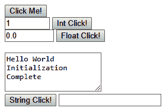
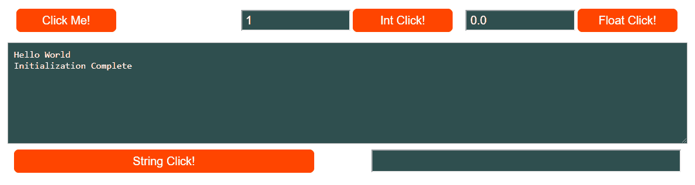
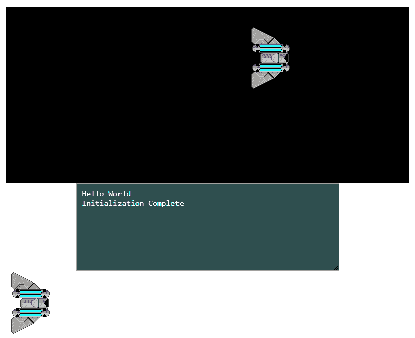

# HTML5 和 WebAssembly

在本章中，我们将向您展示我们编写的用于目标 WebAssembly 的 C 代码如何与 HTML5、JavaScript 和 CSS 结合在一起，创建一个网页。我们将教您如何创建一个新的 HTML 外壳文件，供 Emscripten 在创建我们的 WebAssembly 应用程序时使用。我们将讨论`Module`对象以及 Emscripten 如何将其用作 JavaScript 和 WebAssembly 模块之间的接口。我们将向您展示如何在我们的 HTML 页面上从 JavaScript 中调用用 C 编写的 WebAssembly 函数。我们还将向您展示如何从我们的 C 代码中调用 JavaScript 函数。我们将讨论如何使用 CSS 来改善我们网页的外观。我们将向您介绍 HTML5 Canvas 元素，并展示如何可以从 JavaScript 中向画布显示图像。我们将简要讨论如何从我们的 WebAssembly 模块移动这些图像。本章将让您了解所有内容是如何协同工作的，并为我们为 WebAssembly 应用程序开发的其他功能奠定基础。

从本章开始，一直到本书的其余部分，您将需要从 GitHub 项目中获取图像和字体文件来编译示例。对于本章，您将需要从项目目录中获取`/Chapter02/spaceship.png`图像文件。请从以下网址下载项目：[`github.com/PacktPublishing/Hands-On-Game-Development-with-WebAssembly`](https://github.com/PacktPublishing/Hands-On-Game-Development-with-WebAssembly)。

我强烈建议您在阅读本章的每个部分时进行实际操作。您可以使用您喜欢的代码编辑器和命令行进行跟随。尽管我们已经提供了直接下载代码的链接，但无法强调您通过实际跟随本章建议的编辑来学到多少。您将犯错误并从中学到很多。如果您决定跟随操作，另一个建议是：除非当前部分的编辑/步骤成功，否则不要继续进行下一部分。如果需要帮助，请在 Twitter 上联系我（`@battagline`）。

在本章中，我们将涵盖以下主题：

+   Emscripten 最小外壳文件

+   创建新的 HTML 外壳和 C 文件

+   定义我们的 CSS

+   HTML5 和游戏开发

+   向 Emscripten 模板添加画布

# Emscripten 最小外壳文件

我们使用 Emscripten 创建的第一个构建使用了默认的 HTML 外壳文件。如果您有一个网站，这可能不是您希望网页看起来的方式。您可能更喜欢使用 CSS 和 HTML5 来设计您的外观和感觉，以满足您的设计或业务需求。例如，我用于我的网站的模板通常在游戏画布的左右两侧包括广告。这就是这些网站的流量变现方式。您可能选择在您的网站上方添加一个标志。还有一个文本区域，Emscripten 从`printf`或其他标准 IO 调用中记录输出。您可以选择完全删除这个`textarea`元素，或者您可以保留它，但将其隐藏，因为它对以后的调试很有用。

要基于不是默认 Emscripten 外壳的新外壳文件构建 HTML 文件，我们必须使用`--shell-file`参数，将新的 HTML 模板文件传递给它，而不是 Emscripten 的默认文件。新的`emcc`命令将如下所示：

```cpp
emcc hello.c --shell-file new_shell.html --emrun -o hello2.html
```

暂时不要执行这个命令。我们目前在项目目录中没有`new_shell.html`文件，因此在该文件存在之前运行该命令将导致错误消息。我们需要创建`new_shell.html`文件，并将其用作 HTML 外壳，而不是 Emscripten 的默认 HTML 外壳。这个外壳文件必须遵循特定的格式。为了构建它，我们必须从 Emscripten 的最小 HTML 外壳文件开始，您可以在 GitHub 上找到它：

[`github.com/emscripten-core/emscripten/blob/master/src/shell_minimal.html`](https://github.com/emscripten-core/emscripten/blob/master/src/shell_minimal.html)

我们将编写自己的 HTML 外壳，使用 `shell_minimal.html` 文件作为起点。最小外壳中的大部分内容都不是必需的，因此我们将对其进行一些重大编辑。我们将删除大部分代码以适应我们的目的。当您在文本编辑器中打开 `shell_minimal.html` 时，您会看到它以标准的 HTML 头部和 `style` 标签开头：

```cpp
<style>
 .emscripten { padding-right: 0; margin-left: auto; margin-right: auto;    
               display: block; }
 textarea.emscripten { font-family: monospace; width: 80%; }
 div.emscripten { text-align: center; }
 div.emscripten_border { border: 1px solid black; }
 /* the canvas *must not* have any border or padding, or mouse coords 
    will be wrong */
 canvas.emscripten { border: 0px none; background-color: black; }
 .spinner {
            height: 50px;
            width: 50px;
            margin: 0px auto;
            -webkit-animation: rotation .8s linear infinite;
            -moz-animation: rotation .8s linear infinite;
            -o-animation: rotation .8s linear infinite;
            animation: rotation 0.8s linear infinite;
            border-left: 10px solid rgb(0,150,240);
            border-right: 10px solid rgb(0,150,240);
            border-bottom: 10px solid rgb(0,150,240);
            border-top: 10px solid rgb(100,0,200);
            border-radius: 100%;
            background-color: rgb(200,100,250);
          }
 @-webkit-keyframes rotation {
         from {-webkit-transform: rotate(0deg);}
         to {-webkit-transform: rotate(360deg);}
  }
 @-moz-keyframes rotation {
         from {-moz-transform: rotate(0deg);}
         to {-moz-transform: rotate(360deg);}
 }
 @-o-keyframes rotation {
         from {-o-transform: rotate(0deg);}
         to {-o-transform: rotate(360deg);}
 }
 @keyframes rotation {
         from {transform: rotate(0deg);}
         to {transform: rotate(360deg);}
 }
 </style>
```

这段代码是基于撰写时可用的 `shell_minimal.html` 版本。不预期对此文件进行任何更改。然而，WebAssembly 发展迅速。不幸的是，我们无法完全肯定在您阅读此文时，该文件是否会保持不变。如前所述，如果遇到问题，请随时在 Twitter 上联系我（`@battagline`）。

我们删除此样式标签，以便您可以按自己的喜好设置代码样式。如果您喜欢他们的旋转加载图像并希望保留它，这是必需的，但最好将所有这些都删除，并用链接标签从外部加载 CSS 文件替换它，如下所示：

```cpp
<link href="shell.css" rel="stylesheet" type="text/css">
```

向下滚动一点，您会看到它们使用的加载指示器。我们最终将用我们自己的加载指示器替换它，但现在我们正在本地测试所有这些，我们的文件都很小，所以我们也会删除这些代码：

```cpp
<figure style="overflow:visible;" id="spinner">
    <div class="spinner"></div>
    <center style="margin-top:0.5em"><strong>emscripten</strong></center>
</figure>
<div class="emscripten" id="status">Downloading...</div>
    <div class="emscripten">
        <progress value="0" max="100" id="progress" hidden=1></progress>
    </div>
```

之后是一个 HTML5 `canvas` 元素和与之相关的一些其他标签。我们最终需要重新添加一个 `canvas` 元素，但现在我们不会使用 `canvas`，因此代码的这部分也是不必要的：

```cpp
<div class="emscripten">
    <input type="checkbox" id="resize">Resize canvas
    <input type="checkbox" id="pointerLock" checked>Lock/hide mouse 
     pointer&nbsp;&nbsp;&nbsp;
    <input type="button" value="Fullscreen" onclick=
    "Module.requestFullscreen(document.getElementById
    ('pointerLock').checked,
            document.getElementById('resize').checked)">
 </div>
```

在 `canvas` 之后，有一个 `textarea` 元素。这也是不必要的，但最好将其用作从我的 C 代码执行的任何 `printf` 命令的打印位置。外壳用两个 `<hr/>` 标签将其包围，用于格式化，因此我们也可以删除这些标签：

```cpp
 <hr/>
 <textarea class="emscripten" id="output" rows="8"></textarea>
 <hr/>
```

接下来是我们的 JavaScript。它以三个变量开头，这些变量代表我们之前删除的 HTML 元素，因此我们也需要删除所有这些 JavaScript 变量：

```cpp
var statusElement = document.getElementById('status');
var progressElement = document.getElementById('progress');
var spinnerElement = document.getElementById('spinner');
```

JavaScript 中的 `Module` 对象是 Emscripten 生成的 JavaScript *粘合* 代码用来与我们的 WebAssembly 模块交互的接口。这是 shell HTML 文件中最重要的部分，了解它正在做什么是至关重要的。`Module` 对象以两个数组 `preRun` 和 `postRun` 开始。这些是在模块加载之前和之后运行的函数数组，分别。

```cpp
var Module = {
 preRun: [],
 postRun: [],
```

出于演示目的，我们可以像这样向这些数组添加函数：

```cpp
preRun: [function() {console.log("pre run 1")},
            function() {console.log("pre run 2")}],
postRun: [function() {console.log("post run 1")},
            function() {console.log("post run 2")}],
```

这将从我们在 Chapter1 中创建的 hello WASM 应用程序产生以下输出，*WebAssembly 和 Emscripten 简介*：

```cpp
pre run 2
pre run 1
status: Running...
Hello wasm
post run 2
post run 1
```

请注意，`preRun` 和 `postRun` 函数按照它们在数组中的顺序相反的顺序运行。我们可以使用 `postRun` 数组来调用一个函数，该函数将初始化我们的 WebAssembly 封装器，但是，出于演示目的，我们将在我们的 C `main()` 函数中调用 JavaScript 函数。

`Module` 对象内的下两个函数是 `print` 和 `printErr` 函数。`print` 函数用于将 `printf` 调用的输出打印到控制台和我们命名为 `output` 的 `textarea` 中。您可以将此 `output` 更改为打印到任何 HTML 标记，但是，如果您的输出是原始 HTML，则必须运行几个已注释掉的文本替换调用。`print` 函数如下所示：

```cpp
print: (function() {
    var element = document.getElementById('output');
    if (element) element.value = ''; // clear browser cache
    return function(text) {
        if (arguments.length > 1) text = 
        Array.prototype.slice.call(arguments).join(' ');
        // These replacements are necessary if you render to raw HTML
        //text = text.replace(/&/g, "&amp;");
        //text = text.replace(/</g, "&lt;");
        //text = text.replace(/>/g, "&gt;");
        //text = text.replace('\n', '<br>', 'g');
        console.log(text);
        if (element) {
            element.value += text + "\n";
            element.scrollTop = element.scrollHeight; // focus on 
            bottom
        }
    };
})(),
```

`printErr` 函数在粘合代码中运行，当我们的 WebAssembly 模块或粘合代码本身发生错误或警告时。`printErr` 的输出只在控制台中，尽管原则上，如果你想添加代码来写入 HTML 元素，你也可以这样做。这是 `printErr` 代码：

```cpp
printErr: function(text) {
     if (arguments.length > 1) text = 
     Array.prototype.slice.call(arguments).join(' ');
     if (0) { // XXX disabled for safety typeof dump == 'function') {
       dump(text + '\n'); // fast, straight to the real console
     } else {
         console.error(text);
     }
 },
```

在`print`函数之后，还有一个`canvas`函数。此函数设置为警告用户丢失了 WebGL 上下文。目前我们不需要该代码，因为我们已经删除了 HTML Canvas。当我们重新添加`canvas`元素时，我们将需要恢复此函数。更新它以处理丢失上下文事件，而不仅仅是警告用户也是有意义的。

```cpp
canvas: (function() {
     var canvas = document.getElementById('canvas');
     // As a default initial behavior, pop up an alert when webgl 
        context is lost. To make your
     // application robust, you may want to override this behavior 
        before shipping!
     // See http://www.khronos.org/registry/webgl/specs/latest/1.0/#5.15.2
     canvas.addEventListener("webglcontextlost", function(e) { 
        alert('WebGL context lost. You will need to reload the page.'); 
        e.preventDefault(); }, false);
     return canvas;
 })(),
```

在您的网页可能丢失其 WebGL 上下文的几种不同情况下。上下文是您进入 GPU 的门户，您的应用程序对 GPU 的访问由浏览器和操作系统共同管理。让我们来到*隐喻之地*，在那里我们想象 GPU 是一辆公共汽车，Web 浏览器是公共汽车司机，使用其上下文的应用程序是一群吵闹的中学生。如果公共汽车司机（浏览器）觉得孩子们（应用程序）太吵闹，他可以停下公共汽车（GPU），让所有孩子下车（使应用程序失去上下文），然后让他们一个接一个地上车，如果他们答应表现好的话。

之后，最小外壳文件中有一些代码用于跟踪模块的状态和依赖关系。在这段代码中，我们可以删除对`spinnerElement`、`progressElement`和`statusElement`的引用。稍后，如果我们选择，可以用元素替换这些内容，以跟踪加载模块的状态，但目前不需要。以下是最小外壳中的状态和运行依赖监控代码：

```cpp
setStatus: function(text) {
    if (!Module.setStatus.last) Module.setStatus.last = { time: 
        Date.now(), text: '' };
    if (text === Module.setStatus.last.text) return;
    var m = text.match(/([^(]+)\((\d+(\.\d+)?)\/(\d+)\)/);
    var now = Date.now();

    // if this is a progress update, skip it if too soon
    if (m && now - Module.setStatus.last.time < 30) return; 
    Module.setStatus.last.time = now;
    Module.setStatus.last.text = text;
    if (m) {
        text = m[1];
    }
    console.log("status: " + text);
},
totalDependencies: 0,
monitorRunDependencies: function(left) {
  this.totalDependencies = Math.max(this.totalDependencies, left);
    Module.setStatus(left ? 'Preparing... (' + (this.totalDependencies-
                     left) + '/' + this.totalDependencies + ')' : 'All 
                     downloads complete.');
}
};
 Module.setStatus('Downloading...');
```

JavaScript 代码的最后一部分在最小外壳文件中确定了在浏览器错误发生时 JavaScript 将会做什么：

```cpp
window.onerror = function() {
    Module.setStatus('Exception thrown, see JavaScript console');
    Module.setStatus = function(text) {
        if (text) Module.printErr('[post-exception status] ' + text);
    };
```

在我们的 JavaScript 之后，还有一行非常重要的代码：

```cpp
{{{ SCRIPT }}}
```

此标记告诉 Emscripten 将 JavaScript 粘合代码的链接放在这里。以下是编译到最终 HTML 文件中的示例：

```cpp
<script async type="text/javascript" src="img/shell-min.js"></script>
```

`shell-min.js`是由 Emscripten 构建的 JavaScript 粘合代码。在下一节中，我们将学习如何创建自己的 HTML 外壳文件。

# 创建新的 HTML 外壳和 C 文件

在这一部分中，我们将创建一个新的`shell.c`文件，其中公开了从 JavaScript 调用的几个函数。我们还将使用`EM_ASM`调用`InitWrappers`函数，该函数将在我们即将创建的新 HTML 外壳文件中定义。此函数将在 JavaScript 中创建包装器，可以调用 WebAssembly 模块中定义的函数。在创建新的 HTML 外壳文件之前，我们需要创建将由 HTML 外壳内的 JavaScript 包装器调用的 C 代码：

1.  按照以下方式创建新的`shell.c`文件：

```cpp
#include <emscripten.h>
#include <stdlib.h>
#include <stdio.h>

int main() {
    printf("Hello World\n");
    EM_ASM( InitWrappers() );
    printf("Initialization Complete\n");
}

void test() {
    printf("button test\n");
}

void int_test( int num ) {
    printf("int test=%d\n", num);
}

void float_test( float num ) {
    printf("float test=%f\n", num);
}

void string_test( char* str ) {
    printf("string test=%s\n", str);
}
```

当 WebAssembly 模块加载时，`main`函数将运行。此时，`Module`对象可以使用`cwrap`创建该函数的 JavaScript 版本，我们可以将其绑定到 HTML 元素的`onclick`事件上。在`main`函数内部，`EM_ASM( InitWrappers() );`代码调用了在 HTML 外壳文件中的 JavaScript 中定义的`InitWrappers()`函数。DOM 使用事件来调用接下来的四个函数。

我们初始化包装器的另一种方式是从`Module`对象的`postRun: []`数组中调用`InitWrappers()`函数。

我们将在 DOM 中将对`test()`函数的调用与按钮点击绑定。`int_test`函数将作为一个值从 DOM 中的输入字段传递，并通过使用`printf`语句将一个消息打印到控制台和`textarea`元素中，其中包括该整数。`float_test`函数将作为一个浮点数传递一个数字，并打印到控制台和`textarea`元素中。`string_test`函数将打印从 JavaScript 传入的字符串。

现在，我们将在 HTML 外壳文件中添加以下代码，并将其命名为`new_shell.html`。该代码基于 Emscripten 团队创建的*Emscripten 最小外壳文件*，并在前一节中进行了解释。我们将整个 HTML 页面分为四个部分呈现。

首先是 HTML 文件的开头和`head`元素：

```cpp
<!doctype html>
<html lang="en-us">
<head>
    <meta charset="utf-8">
    <meta http-equiv="Content-Type" content="text/html; charset=utf-8">
    <title>New Emscripten Shell</title>
    <link href="shell.css" rel="stylesheet" type="text/css">
</head>
```

接下来是`body`标签的开始。在此之后，我们有几个 HTML `input`元素以及`textarea`元素：

```cpp
<body>
    <div class="input_box">&nbsp;</div>
    <div class="input_box">
        <button id="click_me" class="em_button">Click Me!</button>
    </div>
    <div class="input_box">
        <input type="number" id="int_num" max="9999" min="0" step="1" 
         value="1" class="em_input">
        <button id="int_button" class="em_button">Int Click!</button>
    </div>
    <div class="input_box">
        <input type="number" id="float_num" max="99" min="0" 
          step="0.01" value="0.0" class="em_input">
        <button id="float_button" class="em_button">Float Click!</button>
    </div>
    <div class="input_box">&nbsp;</div>
    <textarea class="em_textarea" id="output" rows="8"></textarea>
    <div id="string_box">
        <button id="string_button" class="em_button">String Click!</button>
        <input id="string_input">
    </div>
```

在我们的 HTML 之后，我们有`script`标签的开始，以及我们添加到默认 shell 文件中的一些 JavaScript 代码：

```cpp

 <script type='text/javascript'>
    function InitWrappers() {
        var test = Module.cwrap('test', 'undefined');
        var int_test = Module.cwrap('int_test', 'undefined', ['int']);
        var float_test = Module.cwrap('float_test', 'undefined', 
                                       ['float']);
        var string_test = Module.cwrap('string_test', 'undefined', 
                                       ['string']);
        document.getElementById("int_button").onclick = function() {

        if( int_test != null ) {
            int_test(document.getElementById('int_num').value);
        }
    }

    document.getElementById("string_button").onclick = function() {
        if( string_test != null ) {
            string_test(document.getElementById('string_input').value);
        }
    }

    document.getElementById("float_button").onclick = function() {
        if( float_test != null ) {
            float_test(document.getElementById('float_num').value);
        }
    }

    document.getElementById("click_me").onclick = function() {
        if( test != null ) {
            test();
        }
    }
 }

function runbefore() {
    console.log("before module load");
}

function runafter() {
    console.log("after module load");
}
```

接下来是我们从默认 shell 文件中引入的`Module`对象。在`Module`对象之后，我们有`script`标签的结束，`{{{ SCRIPT }}}`标签，在编译时由 Emscripten 替换，以及我们文件中的结束标签：

```cpp
var Module = {
    preRun: [runbefore],
    postRun: [runafter],
    print: (function() {
        var element = document.getElementById('output');
        if (element) element.value = ''; // clear browser cache
            return function(text) {
                if (arguments.length > 1) text = 
                   Array.prototype.slice.call(arguments).join(' ');
                /*
                // The printf statement in C is currently writing to a 
                   textarea. If we want to write
                // to an HTML tag, we would need to run these lines of 
                   codes to make our text HTML safe
                text = text.replace(/&/g, "&amp;");
                text = text.replace(/</g, "&lt;");
                text = text.replace(/>/g, "&gt;");
                text = text.replace('\n', '<br>', 'g');
                */
                console.log(text);
                if (element) {
                    element.value += text + "\n";
                    element.scrollTop = element.scrollHeight; 
                     // focus on bottom
                } 
            };
        })(),
        printErr: function(text) {
            if (arguments.length > 1) text = 
                Array.prototype.slice.call(arguments).join(' ');
            if (0) { // XXX disabled for safety typeof dump == 
                       'function') {
                dump(text + '\n'); // fast, straight to the real                     console
            } else {
                console.error(text);
            }
        },
        setStatus: function(text) {
            if (!Module.setStatus.last) Module.setStatus.last = { time: 
                Date.now(), text: '' };
            if (text === Module.setStatus.last.text) return;
            var m = text.match(/([^(]+)\((\d+(\.\d+)?)\/(\d+)\)/);
            var now = Date.now();

            // if this is a progress update, skip it if too soon
            if (m && now - Module.setStatus.last.time < 30) return;
            Module.setStatus.last.time = now;
            Module.setStatus.last.text = text;

            if (m) {
                text = m[1];
            }
            console.log("status: " + text);
        },
        totalDependencies: 0,
        monitorRunDependencies: function(left) {
            this.totalDependencies = Math.max(this.totalDependencies,                                               
                                              left);
            Module.setStatus(left ? 'Preparing... (' + 
            (this.totalDependencies-left) + '/' +             
            this.totalDependencies + ')' : 'All downloads complete.');
        }
    };
    Module.setStatus('Downloading...');
    window.onerror = function() {
    Module.setStatus('Exception thrown, see JavaScript console');
    Module.setStatus = function(text) {
        if (text) Module.printErr('[post-exception status] ' + text);
    };
};
</script>
{{{ SCRIPT }}}
</body>
</html>
```

这前面的四个部分组成了一个名为`new_shell.html`的单个 shell 文件。您可以通过将最后四个部分输入到一个名为`new_shell.html`的文件中来创建此代码，或者您可以从我们的 GitHub 页面下载该文件[`github.com/PacktPublishing/Hands-On-Game-Development-with-WebAssembly/blob/master/Chapter02/new_shell.html`](https://github.com/PacktPublishing/Hands-On-Game-Development-with-WebAssembly/blob/master/Chapter02/new_shell.html)。

现在我们已经大块地看完了整个`new_shell.html`文件，我们可以花一点时间来分解其中的重要部分，并以更细粒度的方式进行讨论。您会注意到我们删除了所有的 CSS 样式代码，并创建了一个新的`shell.css`文件，并在其中包含了以下行：

```cpp
<link href="shell.css" rel="stylesheet" type="text/css">
```

接下来，我们重新设计了这个文件中的 HTML 代码，以创建与 WebAssembly 模块交互的元素。首先，我们将添加一个按钮，该按钮将调用 WebAssembly 模块内的`test()`函数：

```cpp
<div class="input_box">
    <button id="click_me" class="em_button">Click Me!</button>
</div>
```

我们将在我们创建的`shell.css`文件中对按钮及其包含的`div`元素进行样式设置。我们需要定义将在稍后编写的 JavaScript 代码中由此`button`元素的`onclick`事件调用的函数。我们将在 HTML 中定义的两个输入/按钮对中做类似的事情，如下面的代码块所示：

```cpp
<div class="input_box">
    <input type="number" id="int_num" max="9999" min="0" step="1" 
     value="1" class="em_input">
    <button id="int_button" class="em_button">Int Click!</button>
</div>
<div class="input_box">
    <input type="number" id="float_num" max="99" min="0" step="0.01" 
     value="0.0" class="em_input">
    <button id="float_button" class="em_button">Float Click!</button>
</div>
```

就像我们对第一个`button`元素所做的那样，我们将把接下来的两个按钮与将调用 WebAssembly 模块的函数联系起来。这些函数调用还将把`input`元素中定义的值传递到 WebAssembly 函数中。我们将`textarea`元素留作 WebAssembly 模块内的`printf`调用的输出。我们在 CSS 文件中对其进行了不同的样式设置，但我们将保持功能不变：

```cpp
<textarea class="em_textarea" id="output" rows="8"></textarea>
<div id="string_box">
    <button id="string_button" class="em_button">String Click!</button>
    <input id="string_input">
</div>
```

在`textarea`元素下面，我们添加了另一个`button`和一个`string` `input`元素。这个按钮将调用 WebAssembly 模块内的`string_test`函数，并将`string_input`元素中的值作为 C `char*`参数传递给它。

既然我们已经在 HTML 中定义了所有需要的元素，我们将逐步添加一些 JavaScript 代码，以将 JavaScript 和 WebAssembly 模块联系在一起。我们需要做的第一件事是定义`InitWrappers`函数。`InitWrappers`将从 C 代码的`main`函数内部调用：

```cpp
function InitWrappers() {
    var test = Module.cwrap('test', 'undefined');
    var int_test = Module.cwrap('int_test', 'undefined', ['int']);
    var float_test = Module.cwrap('float_test', 'undefined', 
                                   ['float']);
    var string_test = Module.cwrap('string_test', 'undefined',
                                     ['string']);
    document.getElementById("int_button").onclick = function() {
        if( int_test != null ) {
            int_test(document.getElementById('int_num').value);
        }
    }

    document.getElementById("string_button").onclick = function() {
        if( string_test != null ) {
            string_test(document.getElementById('string_input').value);
        }
    }

    document.getElementById("float_button").onclick = function() {
        if( float_test != null ) {
            float_test(document.getElementById('float_num').value);
        }
    }

    document.getElementById("click_me").onclick = function() {
        if( test != null ) {
            test();
        }
    }
}
```

此函数使用`Module.cwrap`来创建围绕 WebAssembly 模块内导出函数的 JavaScript 函数包装器。我们传递给`cwrap`的第一个参数是我们要包装的 C 函数的名称。所有这些 JavaScript 函数都将返回`undefined`。JavaScript 没有像 C 那样的`void`类型，因此当我们在 JavaScript 中声明`return`类型时，我们需要使用`undefined`类型。如果函数要返回`int`或`float`，我们需要在这里放置`'number'`值。传递给`cwrap`的最后一个参数是一个字符串数组，表示传递给 WebAssembly 模块的参数的 C 类型。

在我们定义了函数的 JavaScript 包装器之后，我们需要从按钮中调用它们。其中一个调用是对 WebAssembly 的`int_test`函数。以下是我们为`int_button`设置`onclick`事件的方式：

```cpp
document.getElementById("int_button").onclick = function() {
    if( int_test != null ) {
        int_test(document.getElementById('int_num').value);
    }
}
```

我们要做的第一件事是检查`int_test`是否已定义。如果是这样，我们调用我们之前解释的`int_test`包装器，将`int_num`输入的值传递给它。然后我们对所有其他按钮做类似的事情。

接下来我们要做的是创建一个`runbefore`和`runafter`函数，将它们放在`Module`对象的`preRun`和`postRun`数组中：

```cpp
function runbefore() {
    console.log("before module load");
}
function runafter() {
    console.log("after module load");
}
var Module = {
    preRun: [runbefore],
    postRun: [runafter],
```

这将导致在模块加载之前在控制台上打印“before module load”，并且在模块加载后打印“after module load”。这些函数不是必需的；它们旨在展示您如何在加载 WebAssembly 模块之前和之后运行代码。如果您不想从 WebAssembly 模块的`main`函数中调用`InitWrappers`函数，您可以将该函数放在`postRun`数组中。

JavaScript 代码的其余部分与 Emscripten 创建的`shell_minimal.html`文件中的内容类似。我们已删除了对于本演示多余的代码，例如与 HTML5`canvas`相关的代码，以及与`spinnerElement`、`progressElement`和`statusElement`相关的代码。这并不是说在 JavaScript 中留下这些代码有什么问题，但对于我们的演示来说并不是真正必要的，因此我们已将其删除以减少所需的最小代码。

# 定义 CSS

现在我们有了一些基本的 HTML，我们需要创建一个新的`shell.css`文件。没有任何 CSS 样式，我们的页面看起来非常糟糕。

没有样式的页面将类似于以下所示：



图 2.1：没有 CSS 样式的 Hello WebAssembly 应用程序

幸运的是，一点点 CSS 可以让我们的网页看起来很不错。以下是我们正在创建的新`shell.css`文件的样子：

```cpp
body {
    margin-top: 20px;
}

.input_box {
    width: 20%;
    display: inline-block;
}
.em_button {
    width: 45%;
    height: 40px;
    background-color: orangered;
    color: white;
    border: 2px solid white;
    font-size: 20px;
    border-radius: 8px;
    transition-duration: 0.5s;
}

.em_button:hover {
    background-color: orange;
    color: white;
    border: 2px solid white;
}

.em_input {
    width: 45%;
    height: 20px;
    font-size: 20px;
    background-color: darkslategray;
    color: white;
    padding: 6px;
}

#output {
    background-color: darkslategray;
    color: white;
    font-size: 16px;
    padding: 10px;
    padding-right: 0;
    margin-left: auto;
    margin-right: auto;
    display: block;
    width: 60%;
}

#string_box {
    padding-top: 10px;
    margin-left: auto;
    margin-right: auto;
    display: block;
    width: 60%;
}

#string_input {
    font-size: 20px;
    background-color: darkslategray;
    color: white;
    padding: 6px;
    margin-left: 5px;
    width: 45%;
    float: right;
}
```

让我快速浏览一下我们需要做的样式化页面的步骤。这本书不是一本关于 CSS 的书，但简要地介绍一下这个主题也无妨。

1.  我们要做的第一件事是在页面主体上放置 20 像素的小边距，以在浏览器工具栏和页面内容之间留出一点空间：

```cpp
body {
    margin-top: 20px;
}
```

1.  我们已创建了五个输入框，每个输入框占浏览器宽度的`20%`。左右两侧的框中都没有内容，因此内容占据了浏览器宽度的 60%。它们以内联块的形式显示，这样它们就可以在屏幕上水平排列。以下是使其发生的 CSS：

```cpp
.input_box {
    width: 20%;
    display: inline-block;
}
```

1.  然后我们有一些类来使用名为`em_button`的类来样式化我们的按钮：

```cpp
.em_button {
    width: 45%;
    height: 40px;
    background-color: orangered;
    color: white;
    border: 0px;
    font-size: 20px;
    border-radius: 8px;
    transition-duration: 0.2s;
}

.em_button:hover {
    background-color: orange;
}
```

我们已将按钮宽度设置为占包含元素的`45%`。我们将按钮高度设置为 40 像素。我们已将按钮的颜色设置为`orangered`，文本颜色设置为`白色`。我们通过将边框宽度设置为 0 像素来移除边框。我们已将字体大小设置为 20 像素，并给它设置了 8 像素的边框半径，这样按钮就呈现出圆角外观。最后一行设置了用户悬停在按钮上时过渡到新颜色所需的时间。

在定义`em_button`类之后，我们定义了`em_button:hover`类，当用户悬停在按钮上时，它会改变按钮的颜色。

某些版本的 Safari 需要在`em_button`类定义内部包含一行`-webkit-transition-duration: 0.2s;`，才能实现悬停状态的过渡。没有这一行，在某些版本的 Safari 中，按钮会立即从`orangered`变为`orange`，而不是在 200 毫秒内过渡。

我们定义的下一个类是用于`input`元素的：

```cpp
.em_input {
    width: 45%;
    height: 20px;
    font-size: 20px;
    background-color: darkslategray;
    color: white;
    padding: 6px;
}
```

我们在开头设置了它的`高度`、`宽度`和`字体大小`。我们将背景颜色设置为`darkslategray`，文本为`白色`。我们添加了`6`像素的填充，以便在`input`元素的字体和边缘之间有一小段空间。

在 CSS 元素名称前面的`#`样式化 ID 而不是类。ID 定义了特定的元素，而类（在 CSS 中以`.`开头）可以分配给 HTML 中的多个元素。CSS 的下一部分样式化了具有 ID 输出的`textarea`：

```cpp
#output {
    background-color: darkslategray;
    color: white;
    font-size: 16px;
    padding: 10px;
    margin-left: auto;
    margin-right: auto;
    display: block;
    width: 60%;
}
```

前两行设置了背景和文本颜色。我们将字体大小设置为`16`像素，并添加了`10`像素的填充。接下来的两行使用左右边距将`textarea`居中：

```cpp
margin-left: auto;
margin-right: auto;
```

设置`display: block;`将此元素放在一行上。将宽度设置为`60%`使元素占据包含元素的`60%`，在这种情况下是浏览器的`body`标记。

最后，我们对`string_box`和`string_input`元素进行了样式设置：

```cpp
#string_box {
    padding-top: 10px;
    margin-left: auto;
    margin-right: auto;
    display: block;
    width: 60%;
}

#string_input {
    font-size: 20px;
    background-color: darkslategray;
    color: white;
    padding: 6px;
    margin-left: 5px;
    width: 45%;
    float: right;
}
```

`string_box`是包含字符串按钮和字符串输入元素的框。我们在框的顶部填充了一些空间，以在其上方的`textarea`和`string_box`之间添加一些空间。`margin-left: auto`和`margin-right: auto`将框居中。然后，我们使用`display:block`和`width: 60%`使其占据浏览器的`60%`。

对于`string_input`元素，我们设置了字体大小和颜色，并在其周围填充了 6 像素。我们设置了左边距为 5 像素，以在元素和其按钮之间留出一些空间。我们将其设置为占包含元素宽度的`45%`，而`float: right`样式将元素推到包含元素的右侧。

要构建我们的应用程序，我们需要运行`emcc`：

```cpp
 emcc shell.c -o shell-test.html --shell-file new_shell.html -s NO_EXIT_RUNTIME=1 -s EXPORTED_FUNCTIONS="['_test', '_string_test', '_int_test', '_float_test', '_main']" -s EXTRA_EXPORTED_RUNTIME_METHODS="['cwrap', 'ccall']"
```

`EXPORTED_FUNCTIONS`用于定义从 JavaScript 调用的所有函数。它们在前面加上`_`字符。`EXTRA_EXPORTED_RUNTIME_METHODS`用于使`cwrap`和`ccall`方法在我们的 shell 文件内部的 JavaScript 中可用。我们目前没有使用`ccall`，这是`cwrap`的替代方法，我们将来可能选择使用它。

重要的是要记住，您必须使用 Web 服务器或`emrun`来运行 WebAssembly 应用程序。如果您想使用`emrun`运行 WebAssembly 应用程序，您必须使用`--emrun`标志进行编译。Web 浏览器需要 Web 服务器来流式传输 WebAssembly 模块。如果您尝试直接从硬盘驱动器在浏览器中打开使用 WebAssembly 的 HTML 页面，那么 WebAssembly 模块将无法加载。

现在我们已经添加了一些 CSS 样式，我们的应用程序看起来好多了：



图 2.2：带有 CSS 样式的 Hello WebAssembly 应用程序

在下一节中，我们将讨论 HTML5 网络游戏开发。

# HTML5 和游戏开发

大多数 HTML 渲染是通过 HTML **文档对象模型**（**DOM**）完成的。DOM 是一种称为*保留模式*的图形库。保留模式图形保留了一个称为**场景图**的树。这个场景图跟踪我们模型中的所有图形元素以及如何渲染它们。保留模式图形的好处是它们对开发人员来说很容易管理。图形库完成了所有繁重的工作，并为我们跟踪了对象以及它们的渲染位置。缺点是保留模式系统占用了更多的内存，并且为开发人员提供了更少的控制权。当我们编写 HTML5 游戏时，我们可以使用`` HTML 元素在 DOM 中渲染图像，并使用 JavaScript 或 CSS 动画移动这些元素，直接在 DOM 中操作这些图像的位置。

然而，在大多数情况下，这会使游戏变得非常缓慢。每次我们在 DOM 中移动一个对象时，都会强制浏览器重新计算 DOM 中所有其他对象的位置。因此，通常情况下，通过在 DOM 中操作对象来制作网络游戏通常是行不通的。

# 即时模式与保留模式

即时模式经常被认为是保留模式的相反，但实际上，当我们为即时模式系统编写代码时，我们可能会在保留模式库的 API 之上构建一些功能。 即时模式迫使开发人员完成保留模式库所做的所有或大部分繁重工作。 我们作为开发人员被迫管理我们的场景图，并了解我们需要渲染的图形对象以及这些对象必须何时以何种方式渲染。 简而言之，这是更多的工作，但如果做得好，游戏将比使用 DOM 渲染更快地渲染。

你可能会问自己：*我该如何使用这个 Immediate Mode*？进入 HTML5 画布！ 2004 年，苹果公司开发了画布元素作为苹果专有浏览器技术的即时模式显示标签。 画布将我们网页的一部分分隔出来，允许我们使用即时模式渲染到该区域。 这将使我们能够在不需要浏览器重新计算 DOM 中所有元素的位置的情况下，渲染到 DOM 的一部分（画布）。 这允许浏览器进一步优化画布的渲染，使用计算机的**图形处理单元**（**GPU**）。

# 向 Emscripten 模板添加画布

在本章的较早部分，我们讨论了从 shell 模板调用 Emscripten WebAssembly 应用程序。 现在您知道如何使 JavaScript 和 WebAssembly 之间的交互工作，我们可以将`canvas`元素添加回模板，并开始使用 WebAssembly 模块操纵该`canvas`。 我们将创建一个新的`.c`文件，该文件将调用一个 JavaScript 函数，传递一个`x`和`y`坐标。 JavaScript 函数将操纵太空船图像，将其移动到`canvas`周围。 我们还将创建一个名为`canvas_shell.html`的全新 shell 文件。

与我们为之前版本的 shell 所做的一样，我们将首先将此文件分成四个部分，以便从高层次讨论它。 然后我们将逐一讨论该文件的基本部分。

1.  HTML 文件的开头以开头的`HTML`标签和`head`元素开始：

```cpp
<!doctype html>
<html lang="en-us">
<head>
    <meta charset="utf-8">
    <meta http-equiv="Content-Type" content="text/html; charset=utf-8">
    <title>Canvas Shell</title>
    <link href="canvas.css" rel="stylesheet" type="text/css">
</head>
```

1.  在那之后，我们有了开头的`body`标签，并且删除了在此文件的早期版本中存在的许多 HTML 元素：

```cpp
<body>
    <canvas id="canvas" width="800" height="600" oncontextmenu="event.preventDefault()"></canvas>
    <textarea class="em_textarea" id="output" rows="8"></textarea>
    
```

1.  接下来是开头的`script`标签，一些全局 JavaScript 变量和一些我们添加的新函数：

```cpp
    <script type='text/javascript'>
        var img = null;
        var canvas = null;
        var ctx = null;
        function ShipPosition( ship_x, ship_y ) {
            if( img == null ) {
                return;
            }
            ctx.fillStyle = "black";
            ctx.fillRect(0, 0, 800, 600);
            ctx.save();
            ctx.translate(ship_x, ship_y);
            ctx.drawImage(img, 0, 0, img.width, img.height);
            ctx.restore();
        }
        function ModuleLoaded() {
            img = document.getElementById('spaceship');
            canvas = document.getElementById('canvas');
            ctx = canvas.getContext("2d");
        }
```

1.  在新的 JavaScript 函数之后，我们有`Module`对象的新定义：

```cpp
        var Module = {
            preRun: [],
            postRun: [ModuleLoaded],
            print: (function() {
                var element = document.getElementById('output');
                if (element) element.value = ''; // clear browser cache
                return function(text) {
                    if (arguments.length > 1) text = 
                    Array.prototype.slice.call(arguments).join(' ');
                        // uncomment block below if you want to write 
                           to an html element
                        /*
                        text = text.replace(/&/g, "&amp;");
                        text = text.replace(/</g, "&lt;");
                        text = text.replace(/>/g, "&gt;");
                        text = text.replace('\n', '<br>', 'g');
                        */
                        console.log(text);
                        if (element) {
                            element.value += text + "\n";
                            element.scrollTop = element.scrollHeight; 
      // focus on bottom
                        }
                    };
                })(),
                printErr: function(text) {
                    if (arguments.length > 1) text = 
                       Array.prototype.slice.call(arguments).join(' ');
                    console.error(text);
                },
                canvas: (function() {
                    var canvas = document.getElementById('canvas');
                    canvas.addEventListener("webglcontextlost", 
                    function(e) { 
                        alert('WebGL context lost. You will need to 
                                reload the page.');
                        e.preventDefault(); }, 
                        false);
                    return canvas;
                })(),
                setStatus: function(text) {
                    if (!Module.setStatus.last) Module.setStatus.last = 
                    { time: Date.now(), text: '' };
                    if (text === Module.setStatus.last.text) return;
                    var m = text.match(/([^(]+)\((\d+
                    (\.\d+)?)\/(\d+)\)/);
                    var now = Date.now();

                    // if this is a progress update, skip it if too        
                       soon
                    if (m && now - Module.setStatus.last.time < 30) 
            return; 
                    Module.setStatus.last.time = now;
                    Module.setStatus.last.text = text;
                    if (m) {
                        text = m[1];
                    }
                    console.log("status: " + text);
                },
                totalDependencies: 0,
                monitorRunDependencies: function(left) {
                    this.totalDependencies = 
                    Math.max(this.totalDependencies, left);
                    Module.setStatus(left ? 'Preparing... (' + 
                    (this.totalDependencies-left) + 
                        '/' + this.totalDependencies + ')' : 'All 
                        downloads complete.');
                }
            };
            Module.setStatus('Downloading...');
            window.onerror = function() {
                Module.setStatus('Exception thrown, see JavaScript 
                                    console');
                Module.setStatus = function(text) {
                    if (text) Module.printErr('[post-exception status] 
                    ' + text);
                };
            };
```

最后几行关闭了我们的标签，并包括了`{{{ SCRIPT }}}` Emscripten 标签：

```cpp
    </script>
{{{ SCRIPT }}}
</body>
</html>
```

这些前面的四个代码块定义了我们的新`canvas_shell.html`文件。 如果您想下载该文件，可以在 GitHub 上找到它，地址为：[`github.com/PacktPublishing/Hands-On-Game-Development-with-WebAssembly/blob/master/Chapter02/canvas.html`](https://github.com/PacktPublishing/Hands-On-Game-Development-with-WebAssembly/blob/master/Chapter02/canvas.html)。

现在我们已经从高层次查看了代码，我们可以更详细地查看源代码。 在 HTML 的`head`部分，我们正在更改我们链接的`title`和`CSS`文件的`name`。 这是 HTML`head`中的更改：

```cpp
<title>Canvas Shell</title>
<link href="canvas.css" rel="stylesheet" type="text/css">
```

我们不需要之前`<body>`标签中的大多数元素。 我们需要一个`canvas`，这是我们从 Emscripten 提供的`shell_minimal.html`文件中删除的，但现在我们需要将其添加回去。 我们保留了最初在最小 shell 中的`textarea`，并添加了一个新的`img`标签，其中包含从[embed.com](https://www.embed.com)网站上的 TypeScript 画布教程中获取的太空船图像，网址为[`www.embed.com/typescript-games/draw-image.html`](https://www.embed.com/typescript-games/draw-image.html)。 这是`body`元素中的新 HTML 标签：

```cpp
<canvas id="canvas" width="800" height="600" oncontextmenu="event.preventDefault()"></canvas>
<textarea class="em_textarea" id="output" rows="8"></textarea>

```

最后，我们需要更改 JavaScript 代码。我们要做的第一件事是在开头添加三个变量，用于保存对`canvas`元素、画布上下文和新的飞船`img`元素的引用：

```cpp
var img = null;
var canvas = null;
var ctx = null;
```

接下来我们要添加到 JavaScript 中的是一个函数，用于将飞船图像渲染到给定的*x*和*y*坐标的画布上：

```cpp
function ShipPosition( ship_x, ship_y ) {
    if( img == null ) {
        return;
    } 
    ctx.fillStyle = "black";
    ctx.fillRect(0, 0, 800, 600); 
    ctx.save();
    ctx.translate(ship_x, ship_y);
    ctx.drawImage(img, 0, 0, img.width, img.height);
    ctx.restore();
}
```

该函数首先检查`img`变量是否为`null`以外的值。这将让我们知道模块是否已加载，因为`img`变量最初设置为 null。接下来我们要做的是使用`ctx.fillStyle = `black``清除画布的黑色，将上下文填充样式设置为颜色`black`，然后调用`ctx.fillRect`绘制填充整个画布的黑色矩形。接下来的四行保存了画布上下文，将上下文位置转换为飞船的`x`和`y`坐标值，然后将飞船图像绘制到画布上。这四行中的最后一行执行上下文恢复，将我们的平移设置回到(0,0)的起始位置。

在定义了这个函数之后，WebAssembly 模块可以调用它。当模块加载时，我们需要设置一些初始化代码来初始化这三个变量。以下是该代码：

```cpp
function ModuleLoaded() {
    img = document.getElementById('spaceship');
    canvas = document.getElementById('canvas');
    ctx = canvas.getContext("2d");
} 
var Module = {
    preRun: [],
    postRun: [ModuleLoaded],
```

`ModuleLoaded`函数使用`getElementById`将`img`和`canvas`分别设置为飞船和画布的 HTML 元素。然后我们将调用`canvas.getContext(”2d”)`来获取 2D 画布上下文，并将`ctx`变量设置为该上下文。所有这些都在`Module`对象完成加载时调用，因为我们将`ModuleLoaded`函数添加到`postRun`数组中。

我们还在最小的 shell 文件中添加了`canvas`函数，该函数在之前的教程中已经删除了。该代码监视画布上下文，并在上下文丢失时向用户发出警报。最终，我们希望这段代码能够解决问题，但目前知道发生了什么是很好的。以下是该代码：

```cpp
canvas: (function() {
    var canvas = document.getElementById('canvas');
    // As a default initial behavior, pop up an alert when webgl 
       context is lost. To make your
    // application robust, you may want to override this behavior 
       before shipping!
    // See http://www.khronos.org/registry/webgl/specs/latest/1.0/#5.15.2
    canvas.addEventListener("webglcontextlost", function(e) { 
        alert('WebGL context lost. You will need to reload the page.'); 
        e.preventDefault(); }, false);
    return canvas;
})(),
```

为了配合这个新的 HTML shell 文件，我们创建了一个新的`canvas.c`文件，用于编译成 WebAssembly 模块。请注意，从长远来看，我们将在 JavaScript 中做的事情要少得多，而在 WebAssembly C/C++代码中要多得多。以下是新的`canvas.c`文件：

```cpp
#include <emscripten.h>
#include <stdlib.h>
#include <stdio.h>

int ship_x = 0;
int ship_y = 0;

void MoveShip() {
    ship_x += 2;
    ship_y++;

    if( ship_x >= 800 ) {
        ship_x = -128;
    }

    if( ship_y >= 600 ) {
        ship_y = -128;
    }
    EM_ASM( ShipPosition($0, $1), ship_x, ship_y );
}

int main() {
    printf("Begin main\n");
    emscripten_set_main_loop(MoveShip, 0, 0);
    return 1;
}
```

首先，我们创建一个`ship_x`和`ship_y`变量来跟踪飞船的*x*和*y*坐标。之后，我们创建一个`MoveShip`函数。每次调用该函数时，该函数将飞船的*x*位置增加`2`，飞船的*y*位置增加`1`。它还检查飞船的 x 坐标是否离开了画布的右侧，如果是，则将其移回左侧，如果飞船已经移出画布底部，则执行类似的操作。该函数的最后一步是调用我们的 JavaScript`ShipPosition`函数，传递飞船的*x*和*y*坐标。这最后一步将在 HTML5 画布元素上以新坐标绘制我们的飞船。

在我们的`main`函数的新版本中，有以下一行：

```cpp
emscripten_set_main_loop(MoveShip, 0, 0);
```

这行将作为第一个参数传递的函数转换为游戏循环。我们将在后面的章节中详细介绍`emscripten_set_main_loop`的工作原理，但目前只需知道这会导致每次渲染新帧时调用`MoveShip`函数。

最后，我们将创建一个新的`canvas.css`文件，其中包含`body`和`#output` CSS 的代码，并添加一个新的`#canvas` CSS 类。以下是`canvas.css`文件的内容：

```cpp
body {
    margin-top: 20px;
}

#output {
    background-color: darkslategray;
    color: white;
    font-size: 16px;
    padding: 10px;
    margin-left: auto;
    margin-right: auto;
    display: block;
    width: 60%;
}

#canvas {
    width: 800px;
    height: 600px;
    margin-left: auto;
    margin-right: auto;
    display: block;
}
```

一切完成后，我们将使用`emcc`编译新的`canvas.html`文件，以及`canvas.wasm`和`canvas.js`的粘合代码。以下是对`emcc`的调用示例：

```cpp
emcc canvas.c -o canvas.html --shell-file canvas_shell.html
```

在`emcc`之后，我们传入`.c`文件的名称`canvas.c`，这将用于编译我们的 WASM 模块。`-o`标志告诉我们的编译器下一个参数将是输出。使用扩展名为`.html`的输出文件告诉`emcc`编译 WASM、JavaScript 和 HTML 文件。接下来传入的标志是`--shell-file`，告诉`emcc`后面的参数是 HTML 外壳文件的名称，这将用于创建我们最终输出的 HTML 文件。

重要的是要记住，您必须使用 Web 服务器或`emrun`来运行 WebAssembly 应用程序。如果您想使用`emrun`运行 WebAssembly 应用程序，您必须使用`--emrun`标志进行编译。Web 浏览器需要一个 Web 服务器来流式传输 WebAssembly 模块。如果您尝试直接从硬盘驱动器在浏览器中打开使用 WebAssembly 的 HTML 页面，那么 WebAssembly 模块将无法加载。

以下是`canvas.html`的屏幕截图：



图 2.3：我们的第一个 WebAssembly HTML5 画布应用程序

# 摘要

在本章中，我们讨论了 Emscripten 最小外壳 HTML 文件，它的各个组件以及它们的工作原理。我们还写了关于文件的哪些部分可以不用，如果我们不使用我们的外壳来生成画布代码。您了解了`Module`对象，以及它是使用 JavaScript 粘合代码将我们的 HTML 中的 JavaScript 和我们的 WebAssembly 联系在一起的接口。然后，我们创建了一个包含我们导出的函数的新的 WebAssembly 模块，以允许 JavaScript 使用`Module.cwrap`来创建我们可以从 DOM 中调用的 JavaScript 函数，从而执行我们的 WebAssembly 函数。

我们创建了一个全新的 HTML 外壳文件，使用了 Emscripten 最小外壳的一些`Module`代码，但几乎完全重写了原始外壳的 HTML 和 CSS。然后，我们能够将新的 C 代码和 HTML 外壳文件编译成一个能够从 JavaScript 调用 WebAssembly 函数，并且能够从 WebAssembly 调用 JavaScript 函数的工作 WebAssembly 应用程序。

我们讨论了使用 HTML5 画布元素的好处，以及即时模式和保留模式图形之间的区别。我们还解释了为什么对于游戏和其他图形密集型任务来说，使用即时模式而不是保留模式是有意义的。

然后，我们创建了一个外壳文件来利用 HTML5 画布元素。我们添加了 JavaScript 代码来将图像绘制到画布上，并编写了使用 WebAssembly 在每帧修改画布上图像位置的 C 代码，从而在 HTML5 画布上创建出移动的太空飞船的外观。

在下一章中，我们将向您介绍 WebGL，它是什么，以及它如何改进 Web 上的图形渲染。
