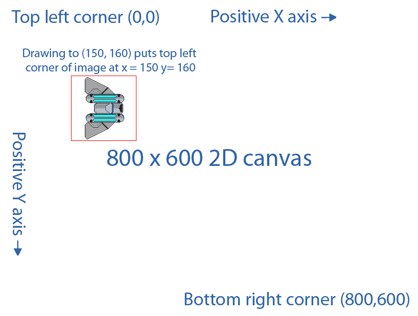
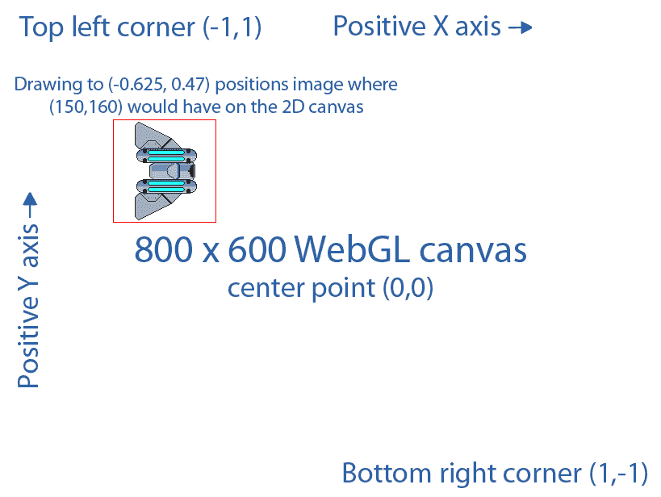
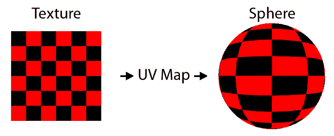

# 第三章：WebGL 简介

在苹果创建 Canvas 元素之后，Mozilla 基金会于 2006 年开始研究 Canvas 3D 原型，并在 2007 年实现了这个早期版本，最终成为 WebGL。2009 年，一个名为 Kronos Group 的财团成立了一个 WebGL 工作组。到 2011 年，该组织已经制定了基于 OpenGL ES 2.0 API 的 WebGL 1.0 版本。

正如我之前所说，WebGL 被视为与 HTML5 Canvas 元素一起使用的 3D 渲染 API。它的实现消除了传统 2D 画布 API 的一些渲染瓶颈，并几乎直接访问计算机的 GPU。因此，使用 WebGL 将 2D 图像渲染到 HTML5 画布通常比使用原始 2D 画布实现更快。然而，由于增加了三维渲染的复杂性，使用 WebGL 要复杂得多。因此，有几个库是建立在 WebGL 之上的。这允许用户使用 WebGL，但使用简化的 2D API。如果我们在传统的 JavaScript 中编写游戏，我们可能会使用像 Pixi.js 或 Cocos2d-x 这样的库来简化我们的代码，以便在 WebGL 上进行 2D 渲染。现在，WebAssembly 使用**Simple DirectMedia Layer**（**SDL**）的实现，这是大多数开发人员用来编写游戏的库。这个 WebAssembly 版本的 SDL 是建立在 WebGL 之上的，并提供高端性能，但使用起来更容易。

使用 SDL 并不妨碍您直接从编译为 WebAssembly 的 C++代码中直接使用 WebGL。有时，我们可能对直接与 WebGL 进行交互感兴趣，因为我们感兴趣的功能在 SDL 内部并不直接可用。这些用例的一个例子是创建允许特殊 2D 光照效果的自定义着色器。

在本章中，您需要从 GitHub 项目中获取图像文件来运行示例。该应用程序需要项目目录中的`/Chapter03/spaceship.png`图像文件。请从以下网址下载项目：[`github.com/PacktPublishing/Hands-On-Game-Development-with-WebAssembly`](https://github.com/PacktPublishing/Hands-On-Game-Development-with-WebAssembly)。

在本章中，我们将涵盖以下主题：

+   WebGL 和画布上下文

+   WebGL 着色器简介

+   WebGL 和 JavaScript

# WebGL 和画布上下文

WebGL 是用于绘制 HTML5 元素的渲染上下文，是 2D 渲染上下文的替代品。通常，当有人提到画布时，他们指的是 2D 渲染上下文，通过调用`getContext`并传入字符串`2d`来访问。这两个上下文都是用于绘制到 HTML5 画布元素的方法。上下文是一种用于即时模式渲染的 API 类型。可以请求两种不同的 WebGL 上下文，两者都提供对不同版本的 WebGL API 的访问。这些上下文是*webgl*和*webgl2*。在接下来的示例中，我将使用*webgl*上下文，并将使用 WebGL 1.0 API。还有一个很少使用的上下文，用于将位图渲染到画布上，我们可以通过传入`bitmaprenderer`作为字符串值来访问。

我想指出，术语画布有时用于指代 2D 画布上下文，有时用于指代即时模式渲染的 HTML5 画布元素。当我在本书中提到画布而没有提到 2D 上下文时，我指的是 HTML5 画布元素。

在下一节中，我将向您介绍着色器和 GLSL 着色器语言。

# WebGL 着色器简介

当 OpenGL 或 WebGL 与 GPU 交互时，它们传递数据告诉 GPU 需要渲染的几何图形和纹理。此时，GPU 需要知道如何将这些纹理和与之相关的几何图形渲染成一个在计算机显示器上显示的单个 2D 图像。**OpenGL 着色器语言**（**GLSL**）是一种用于指导 GPU 如何渲染 2D 图像的语言，它与 OpenGL 和 WebGL 一起使用。

从技术上讲，WebGL 使用 GLSL ES 着色器语言（有时称为 ELSL），它是 GLSL 语言的一个子集。GLSL ES 是与 OpenGL ES 一起使用的着色器语言，OpenGL ES 是 OpenGL 的一个移动友好子集（ES 代表嵌入式系统）。因为 WebGL 基于 OpenGL ES，它继承了 GLSL ES 着色器语言。请注意，每当我在 WebGL 或 WebAssembly 的上下文中提到 GLSL 时，我指的是 GLSL ES。

WebGL 渲染管道要求我们编写两种类型的着色器来将图像渲染到屏幕上。这些是顶点着色器，它以每个顶点为基础渲染几何图形，以及片段着色器，它渲染像素候选，称为片段。GLSL 看起来很像 C 语言，所以如果你在 C 或 C++中工作，代码会看起来有些熟悉。

这个 GLSL 着色器的介绍不会详细讨论。在后面的章节中，我将更详细地讨论 WebGL 着色器。现在，我只想介绍这个概念，并向你展示一个非常简单的 2D WebGL 着色器。在关于 2D 光照的章节中，我将更详细地讨论这个问题。这是一个用于渲染 2D WebGL 渲染引擎中四边形的简单顶点着色器的示例：

```cpp
precision mediump float;

attribute vec4 a_position;
attribute vec2 a_texcoord;

uniform vec4 u_translate;

varying vec2 v_texcoord;

void main() {
   gl_Position = u_translate + a_position;
    v_texcoord = a_texcoord;
}
```

这个非常简单的着色器接收顶点的位置，并根据通过 WebGL 传递到着色器中的位置统一值移动它。这个着色器将在我们的几何图形中的每个顶点上运行。在 2D 游戏中，所有几何图形都将被渲染为四边形。以这种方式使用 WebGL 可以更好地利用计算机的 GPU。让我简要地讨论一下这个顶点着色器代码中发生了什么。

如果你是游戏开发的新手，顶点着色器和像素着色器的概念可能会感到有些陌生。它们并不像一开始看起来那么神秘。如果你想更好地理解着色器是什么，你可能想快速阅读一下维基百科的*着色器*文章（[`en.wikipedia.org/wiki/Shader`](https://en.wikipedia.org/wiki/Shader)）。如果你仍然感到迷茫，可以随时在 Twitter 上问我问题（`@battagline`）。

这个着色器的第一行设置了浮点精度：

```cpp
precision mediump float;
```

计算机上的所有浮点运算都是对实数分数的近似。我们可以用 0.333 来低精度地近似 1/3，用 0.33333333 来高精度地近似。代码中的精度行表示 GPU 上浮点值的精度。我们可以使用三种可能的精度：`highp`、`mediump`或`lowp`。浮点精度越高，GPU 执行代码的速度就越慢，但所有计算值的精度就越高。一般来说，我将这个值保持在`mediump`，这对我来说效果很好。如果你有一个需要性能而不是精度的应用程序，你可以将其更改为`lowp`。如果你需要高精度，请确保你了解目标 GPU 的能力。并非所有 GPU 都支持`highp`。

属性变量是与顶点数组一起传递到管道中的值。在我们的代码中，这些值包括与顶点相关的纹理坐标，以及与顶点相关的 2D 平移矩阵：

```cpp
attribute vec4 a_position;
attribute vec2 a_texcoord;
```

uniform 变量类型是一种在所有顶点和片段中保持恒定的变量类型。在这个顶点着色器中，我们传入一个 uniform 向量`u_translate`。通常情况下，除非是为了相机，您不会希望将所有顶点平移相同的量，但因为我们只是编写一个用于绘制单个精灵的 WebGL 程序，所以使用`uniform`变量来进行`translate`将是可以的：

```cpp
uniform vec4 u_translate;
```

`varying`变量（有时被称为插值器）是从顶点着色器传递到片段着色器的值，片段着色器中的每个片段都会得到该值的插值版本。在这段代码中，唯一的`varying`变量是顶点的纹理坐标：

```cpp
varying vec2 v_texcoord;
```

在数学中，插值值是计算出的中间值。例如，如果我们在 0.2 和 1.2 之间进行插值，我们将得到一个值为 0.7。也就是说，0.2 的起始值，加上(1.2-0.2)/2 的平均值=0.5。所以，0.2+0.5=0.7。使用`varying`关键字从顶点着色器传递到片段着色器的值将根据片段相对于顶点的位置进行插值。

最后，在顶点着色器中执行的代码位于`main`函数内。该代码获取顶点的位置，并将其乘以平移矩阵以获得顶点的世界坐标，以便将其放入`gl_Position`中。然后，它将直接将传递到顶点着色器的纹理坐标设置为插值变量，以便将其传递到片段着色器中：

```cpp
void main() {
    gl_Position = u_translate + a_position;
    v_texcoord = a_texcoord;
}
```

顶点着色器运行后，顶点着色器生成的所有片段都会通过片段着色器运行，片段着色器会为每个片段插值所有的`varying`变量。

这是一个片段着色器的简单示例：

```cpp
precision mediump float;

varying vec2 v_texcoord;

uniform sampler2D u_texture;

void main() {
    gl_FragColor = texture2D(u_texture, v_texcoord);
}
```

就像在我们的顶点着色器中一样，我们首先将浮点精度设置为`mediump`。片段有一个`uniform sample2D`纹理，定义了用于在我们的游戏中生成 2D 精灵的纹理映射：

```cpp
uniform sampler2D u_texture;
```

`uniform`有点像是传递到管道中并应用于着色器中使用它的每个顶点或每个片段的全局变量。`main`函数中执行的代码也很简单。它获取从`v_texcoord`变量中插值的纹理坐标，并从我们采样的纹理中检索颜色值，然后使用该值设置`gl_FragColor`片段的颜色：

```cpp
void main() {
    gl_FragColor = texture2D(u_texture, v_texcoord);
}
```

直接在 JavaScript 中使用 WebGL 将一个简单的 2D 图像绘制到屏幕上需要更多的代码。在下一节中，我们将编写我能想到的最简单版本的 2D 精灵渲染 WebGL 应用程序，这恰好是我们在上一章中编写的 2D 画布应用程序的新版本。我认为值得看到两种方法在 HTML 画布上渲染 2D 图像之间的区别。了解更多关于 WebGL 的知识也将有助于我们理解当我们最终在 WebAssembly 中使用 SDL API 时发生了什么。在创建 WebGL JavaScript 应用程序时，我会尽量保持演示和代码的简单。

正如我之前提到的，本章的目的是让您亲身体验 WebGL。在本书的大部分内容中，我们不会直接处理 WebGL，而是使用更简单的 SDL API。如果您对编写自己的着色器不感兴趣，您可以将本章视为可选但有益的信息。

在下一节中，我们将学习如何使用 WebGL 绘制到画布上。

# WebGL 和 JavaScript

正如我们在上一章中学到的，使用 2D 画布非常简单。要绘制图像，你只需要将上下文转换为要绘制图像的像素坐标，并调用`drawImage`上下文函数，传入图像、宽度和高度。如果你愿意，你甚至可以更简单地忘记转换，直接将 x 和 y 坐标传递到`drawImage`函数中。在 2D 画布中，你在使用图像，但在 WebGL 中，即使在编写 2D 游戏时，你总是在使用 3D 几何。在 WebGL 中，你需要将纹理渲染到几何体上。你需要使用顶点缓冲区和纹理坐标。我们之前编写的顶点着色器接收 3D 坐标数据和纹理坐标，并将这些值传递到片段着色器，后者将在几何体之间进行插值，并使用纹理采样函数来检索正确的纹理数据，以将像素渲染到画布上。

# WebGL 坐标系统与 2D 画布

使用 WebGL，画布元素的中心是原点(0,0)。**正 Y**向上，而**正 X**向右。对于从未使用过 2D 图形的人来说，这更直观一些，因为它类似于我们在小学学到的坐标几何中的象限。在 2D 画布中，你总是在使用像素，并且画布上不会出现负数。



当你调用`drawImage`时，X 和 Y 坐标是图像的左上角绘制的位置。WebGL 有点不同。一切都使用几何，需要顶点着色器和像素着色器。我们将图像转换为纹理，然后将其拉伸到几何上，以便显示。这是 WebGL 坐标系统的样子：



如果你想在画布上的特定像素位置放置图像，你需要知道画布的宽度和高度。你的画布的**中心点**是**(0,0)**，**左上角**是**(-1, 1)**，**右下角**是**(1, -1)**。因此，如果你想在 x=150，y=160 处放置图像，你需要使用以下方程来找到 WebGL 的 x 坐标：

```cpp
 webgl_x = (pixel_x - canvas_width / 2) / (canvas_width / 2)
```

因此，对于`pixel_x`位置为 150，我们需要从 150 减去 400 得到-250。然后，我们需要将-250 除以 400，我们会得到-0.625。我们需要做类似的事情来获取 WebGL 的 y 坐标，但是轴的符号是相反的，所以我们需要做以下操作来获取`pixel_x`值，而不是我们之前做的：

```cpp
((canvas_height / 2) - pixel_y) / (canvas_height / 2)
```

通过插入值，我们得到((600 / 2) - 160) / (600 / 2) 或 (300 - 160) / 300 = 0.47。

我跳过了很多关于 WebGL 的信息，以简化这个解释。WebGL 不是一个 2D 空间，即使在这个例子中我把它当作一个 2D 空间。因为它是一个 3D 空间，单位中画布的大小是基于一个称为裁剪空间的视图区域。如果你想了解更多，Mozilla 有一篇关于裁剪空间的优秀文章：[`developer.mozilla.org/en-US/docs/Web/API/WebGL_API/WebGL_model_view_projection`](https://developer.mozilla.org/en-US/docs/Web/API/WebGL_API/WebGL_model_view_projection)。

# 顶点和 UV 数据

在我们看一大段可怕的 WebGL JavaScript 代码之前，我想简要讨论数据缓冲区以及我们将如何将几何和纹理坐标数据传递到着色器中。我们将在一个大缓冲区中传递 32 位浮点数据，该缓冲区将包含顶点的 X 和 Y 坐标的组合以及该顶点的 UV 纹理坐标。UV 映射是 GPU 将 2D 纹理坐标映射到 3D 几何的方法：



WebGL 和 OpenGL 通过为每个顶点分配 U 和 V 坐标来实现这一点。分配给顶点的 UV 坐标（0,0）意味着该顶点的颜色将基于纹理左上角的颜色。UV 坐标（1,1）意味着它将根据纹理右下角的颜色进行着色。当我们在 3D 对象的点之间进行插值时，我们还在纹理内部的不同 UV 坐标之间进行插值。这些 UV 坐标可以在我们的片段着色器中使用`texture2D`内置函数进行采样，通过传入纹理和当前 UV 坐标。

让我们来看看我们在这个 WebGL 应用程序中使用的顶点和纹理数据数组：

```cpp
var vertex_texture_data = new Float32Array([
 //  X,     Y,     U,   V
     0.16,  0.213, 1.0, 1.0,
    -0.16,  0.213, 0.0, 1.0,
     0.16, -0.213, 1.0, 0.0,
    -0.16, -0.213, 0.0, 0.0,
    -0.16,  0.213, 0.0, 1.0,
     0.16, -0.213, 1.0, 0.0
 ]);
```

这些数据已经按行和列输入。尽管这是一组线性数据，但格式允许您看到我们将为每个顶点传递四个浮点值。数据上方有一条注释，显示每列代表什么。前两个数据值是几何图形的 X 和 Y 坐标。接下来的两个值是将纹理映射到几何图形的 X 和 Y 坐标的 U 和 V 坐标。这里有六行，尽管我们正在渲染一个矩形。我们需要六个点而不是四个的原因是，WebGL 通常使用三角形组成的几何图形。因此，我们需要重复两个顶点。

也许你会想，*为什么是三角形？*嗯，曾经有一段时间，计算机图形使用的几何图形并不是分解成三角形的。但是当你有一个四边形，而不是所有的点都共面（在同一个平面上）时就会出现问题。这与我去使用四条腿凳子的酒吧时遇到的问题是一样的。我很确定四条腿凳子的存在是某种秘密组织的阴谋，目的是让我失去平衡，但我岔开了话题。因为三个点定义一个平面，所以三角形根据定义总是共面的，就像一个三条腿的凳子永远不会摇摆一样。

# 2D 画布到 WebGL

让我们从`Chapter02`目录中复制出画布代码到`Chapter03`目录中。接下来，我们将把`canvas_shell.html`文件重命名为`webgl_shell.html`。我们将把`canvas.css`重命名为`webgl.css`。最后，我们将把`canvas.c`文件重命名为`webgl.c`。我们还需要确保复制`spaceship.png`文件。我们不会对`webgl.css`文件进行任何更改。我们将对`webgl_shell.html`文件进行最重要的更改。有很多代码需要添加，以完成从 2D 画布到 WebGL 的切换；几乎所有的代码都是额外的 JavaScript 代码。我们需要对`webgl.c`进行一些微小的调整，以使`MoveShip`函数中飞船的位置反映出带有原点在画布中心的 WebGL 坐标系统。

在我们开始之前，我想提一下，这个 WebGL 代码并不是为了投入生产。我们将要创建的游戏不会像我在这里演示的方式使用 WebGL。那不是最有效或可扩展的代码。我们所编写的代码将无法在没有重大更改的情况下一次渲染多个精灵。我之所以向你演示使用 WebGL 渲染 2D 图像的过程，是为了让你了解在使用类似 SDL 这样的库时发生了什么。如果你不在乎幕后的工作原理，那么跳过也没人会责怪你。就我个人而言，我总是更愿意多了解一点。

# 对 head 标签进行微小调整

在我们的`head`标签内，我们需要改变`title`，因为我们将`canvas.css`重命名为`webgl.css`，所以我们需要将我们的`link`标签指向新的样式表名称。以下是在 HTML 开头必须更改的唯一两个标签：

```cpp
<title>WebGL Shell</title>
<link href="webgl.css" rel="stylesheet" type="text/css">
```

稍后在 HTML 中，我们将删除`img`标签，其中`src`设置为`"spaceship.png"`。这并不是必须的。在画布版本中，我们使用此标签将图像呈现到画布上。在这个 WebGL 版本中，我们将动态加载图像，因此没有必要保留它，但如果您忘记删除它，将不会以任何方式损害应用程序。

# 主要 JavaScript 更改

`webgl_shell.html`文件中 JavaScript 部分内的`Module`代码将保持不变，因此您无需担心在以下行之后修改任何内容：

```cpp
var Module = {
```

但是，`script`标签中代码的前半部分将需要进行一些重大修改。您可能希望重新开始并删除整个模块。

# WebGL 全局变量

我们要做的第一件事是创建许多 JavaScript 全局变量。如果此代码不仅仅是用于演示，使用这么多全局变量通常是不受欢迎的，被认为是不良实践。但就我们现在所做的事情而言，它有助于简化事情：

```cpp
<script type='text/javascript'>
 var gl = null; // WebGLRenderingContext
 var program = null; // WebGLProgram
 var texture = null; // WebGLTexture
 var img = null; // HTMLImageElement
 var canvas = null;
 var image_width = 0;
 var image_height = 0;
 var vertex_texture_buffer = null; // WebGLBuffer
 var a_texcoord_location = null; // GLint
 var a_position_location = null; // GLint
 var u_translate_location = null; // WebGLUniformLocation
 var u_texture_location = null; // WebGLUniformLocation
```

第一个变量`gl`是渲染上下文的新版本。通常，如果您使用 2D 渲染上下文，您称之为`ctx`，如果您使用 WebGL 渲染上下文，您将其命名为`gl`。第二行定义了`program`变量。当我们编译顶点和片段着色器时，我们会得到一个编译后的版本，以`WebGLProgram`对象的形式存储在`program`变量中。`texture`变量将保存我们将从`spaceship.png`图像文件加载的`WebGLTexture`。这是我们在上一章中用于 2D 画布教程的图像。`img`变量将用于加载将用于加载纹理的`spaceship.png`图像文件。`canvas`变量将再次是对我们的 HTML 画布元素的引用，`image_width`和`image_height`将在加载后保存`spaceship.png`图像的高度和宽度。

`vertex_texture_buffer`属性是一个缓冲区，将用于将顶点几何和纹理数据传输到 GPU，以便我们在上一节中编写的着色器可以使用它。`a_texcoord_location`和`a_position_location`变量将用于保存对顶点着色器中`a_texcoord`和`a_position`属性变量的引用，最后，`u_translate_location`和`u_texture_location`用于引用着色器中的`u_translate`和`u_texture`统一变量。

# 返回顶点和纹理数据

如果我告诉你我们还有一些变量要讨论，你会不会不高兴？好吧，下一个变量是我们之前讨论过的变量，但我会再次提到它，因为它很重要。`vertex_texture_data`数组是一个存储用于渲染的所有顶点几何和 UV 纹理坐标数据的数组：

```cpp
var vertex_texture_data = new Float32Array([
     // x,  y,     u,   v
     0.16,  0.213, 1.0, 1.0,
    -0.16,  0.213, 0.0, 1.0,
     0.16, -0.213, 1.0, 0.0,
    -0.16, -0.213, 0.0, 0.0,
    -0.16,  0.213, 0.0, 1.0,
     0.16, -0.213, 1.0, 0.0
 ]);
```

我之前没有提到的一件事是，为什么`x`和`y`值在 x 轴上的范围是`-0.16`到`0.16`，在 y 轴上的范围是`-0.213`到`0.213`。因为我们正在渲染一张单独的图像，我们不需要动态地缩放几何图形以适应图像。我们正在使用的太空船图像是 128 x 128 像素。我们使用的画布大小是 800 x 600 像素。正如我们之前讨论的，无论我们为画布使用什么大小，WebGL 都会将两个轴都适应到-1 到+1 的范围内。这使得坐标（0, 0）成为画布元素的中心。这也意味着画布的宽度始终为 2，高度始终为 2，无论画布元素有多少像素宽或高。因此，如果我们想要计算出我们的几何图形有多宽，以使其与图像的宽度匹配，我们需要进行一些计算。首先，我们需要弄清楚 WebGL 剪辑空间宽度的一个单位对应于一个像素的宽度。WebGL 剪辑空间的宽度为 2.0，实际画布的宽度为 800 像素，因此在 WebGL 空间中一个像素的宽度为 2.0 / 800 = 0.0025。我们需要知道我们的图像在 WebGL 剪辑空间中有多宽，因此我们将 128 像素乘以 0.0025，得到 WebGL 剪辑空间宽度为 0.32。因为我们希望我们的几何图形的 x 值在中心为 0，我们的 x 几何范围从-0.16 到+0.16。

现在我们已经完成了宽度，让我们来解决高度。画布的高度为 600 像素，但在 WebGL 剪辑空间中，画布的高度始终为 2.0（-1.0 Y 到+1.0 Y）。因此，一个像素中有多少个 WebGL 单位？2.0 / 600 = 0.00333333…重复。显然，这是一个浮点精度无法匹配实际值的情况。我们将截掉一些尾随的 3，并希望精度足够。回到计算图像在 WebGL 剪辑空间中的高度，它高 128 像素，所以我们需要将 128 乘以 0.0033333…重复。结果是 0.4266666…重复，我们将截断为 0.426。因此，我们的 y 几何必须从`-0.213`到`+0.213`。

我正在尽力忽略 WebGL 剪辑空间的复杂性。这是一个 3D 体积，而不是像 2D 画布上下文那样简单的 2D 绘图区域。有关此主题的更多信息，请参阅 Mozilla 开发人员文档的剪辑空间部分：[`developer.mozilla.org/en-US/docs/Web/API/WebGL_API/WebGL_model_view_projection#Clip_space`](https://developer.mozilla.org/en-US/docs/Web/API/WebGL_API/WebGL_model_view_projection#Clip_space)。

正如我之前所说的，当我们开发游戏时，SDL 会为我们处理很多事情，但是在将来，您可能希望在 WebAssembly 中使用 OpenGL。OpenGL ES 2.0 和 OpenGL ES 3.0 库已经移植到 WebAssembly，并且这些库或多或少地与 WebGL 具有直接的类比。WebGL 1.0 是 OpenGL ES 2.0 的修改版本，它是设计用于在移动硬件上运行的 OpenGL 的一个版本。WebGL 2.0 是 OpenGL ES 3.0 的修改版本。通过对 SDL 的调用理解 WebGL 正在做什么，可以使我们成为更好的游戏开发人员，即使 SDL 为我们做了很多繁重的工作。

# 缓冲区常量

我选择使用一个单独的`Float32Array`来保存此应用程序的所有顶点数据。这包括 X 和 Y 坐标数据，以及 U 和 V 纹理坐标数据。因此，当我们将这些数据加载到 GPU 的缓冲区中时，我们需要告诉 WebGL 如何将这些数据分开成不同的属性。我们将使用以下常量来告诉 WebGL`Float32Array`中的数据是如何分解的：

```cpp
const FLOAT32_BYTE_SIZE = 4; // size of a 32-bit float
const STRIDE = FLOAT32_BYTE_SIZE * 4; // there are 4 elements for every vertex. x, y, u, v
const XY_OFFSET = FLOAT32_BYTE_SIZE * 0;
const UV_OFFSET = FLOAT32_BYTE_SIZE * 2;
```

`FLOAT32_BYTE_SIZE`常量是`Float32Array`中每个变量的大小。`STRIDE`常量将用于告诉 WebGL 单个顶点数据使用了多少字节。我们在前面的代码中定义的四列代表*x*、*y*、*u*和*v*。由于这些变量中的每一个使用了四个字节的数据，我们将变量的数量乘以每个变量使用的字节数来得到*stride*，或者单个顶点使用的字节数。`XY_OFFSET`常量是每个 stride 内的起始位置，我们将在那里找到*x*和*y*坐标数据。为了保持一致，我将浮点字节大小乘以位置，但由于它是`0`，我们可以直接使用`const XY_OFFSET = 0`。现在，`UV_OFFSET`是从每个 stride 开始的偏移量，我们将在那里找到 UV 纹理坐标数据。由于它们在位置 2 和 3，偏移量是每个变量使用的字节数乘以`2`。

# 定义着色器

我在前一节中详细介绍了着色器所做的一切。你可能想再次浏览一下那一节作为复习。代码的下一部分定义了多行 JavaScript 字符串中的顶点着色器代码和片段着色器代码。以下是顶点着色器代码：

```cpp
var vertex_shader_code = `
    precision mediump float;
    attribute vec4 a_position;
    attribute vec2 a_texcoord;
    varying vec2 v_texcoord;
    uniform vec4 u_translate;

    void main() {
        gl_Position = u_translate + a_position;
        v_texcoord = a_texcoord;
    }
`;
```

片段着色器代码如下：

```cpp
var fragment_shader_code = `
    precision mediump float;
    varying vec2 v_texcoord;
    uniform sampler2D u_texture;

    void main() {
        gl_FragColor = texture2D(u_texture, v_texcoord);
    }
`;
```

让我们来看看顶点着色器代码中的属性：

```cpp
attribute vec4 a_position;
attribute vec2 a_texcoord;
```

这两个属性将从`Float32Array`中的数据中传递。在 WebGL 中的一个很棒的技巧是，如果你没有使用所有四个位置变量（*x*，*y*，*z*，*w*），你可以传递你正在使用的两个（*x*，*y*），GPU 将知道如何在其他两个位置使用适当的值。这些着色器将需要传递两个属性：

```cpp
attribute vec4 a_position;
attribute vec2 a_texcoord;
```

我们将再次使用缓冲区和`Float32Array`来完成这个任务。我们还需要传递两个`uniform`变量。`u_translate`变量将被顶点着色器用于平移精灵的位置，`u_texture`是片段着色器将使用的纹理缓冲区。这些着色器几乎是尽可能简单的。许多教程都是从没有纹理开始，只是硬编码片段着色器的颜色输出，就像这样：

```cpp
gl_FragColor = vec4(1.0, 0.0, 0.0, 1.0);
```

做出这个改变将导致片段着色器始终输出红色，所以请不要做这个改变。我能想到的唯一让这个教程更简单的事情是不加载纹理并渲染纯色，以及不允许几何体被移动。

# `ModuleLoaded`函数

在旧的 2D 画布代码中，我们在`ModuleLoaded`函数之前定义了`ShipPosition` JavaScript 函数，但是我们已经将这两个函数互换了。我觉得在渲染部分之前解释 WebGL 初始化会更好。以下是`ModuleLoaded`函数的新版本：

```cpp
function ModuleLoaded() {
    canvas = document.getElementById('canvas');
    gl = canvas.getContext("webgl", { alpha: false }) ||
                            canvas.getContext("experimental-webgl", { 
                            alpha: false });

    if (!gl) {
        console.log("No WebGL support!");
        return;
    }

    gl.blendFunc( gl.SRC_ALPHA, gl.ONE_MINUS_SRC_ALPHA );
    gl.enable( gl.BLEND );

    var vertex_shader = gl.createShader(gl.VERTEX_SHADER);
    gl.shaderSource( vertex_shader, vertex_shader_code );
    gl.compileShader( vertex_shader );

    if( !gl.getShaderParameter(vertex_shader, gl.COMPILE_STATUS) ) {
        console.log('Failed to compile vertex shader' + 
                     gl.getShaderInfoLog(vertex_shader));
        gl.deleteShader(vertex_shader);
        return;
    }

    var fragment_shader = gl.createShader(gl.FRAGMENT_SHADER);
    gl.shaderSource( fragment_shader, fragment_shader_code );
    gl.compileShader( fragment_shader );

    if( !gl.getShaderParameter(fragment_shader, gl.COMPILE_STATUS) ) {
        console.log('Failed to compile fragment shader' + 
                     gl.getShaderInfoLog(fragment_shader));
        gl.deleteShader(fragment_shader);
        return;
    }

    program = gl.createProgram();

    gl.attachShader(program, vertex_shader);
    gl.attachShader(program, fragment_shader);
    gl.linkProgram(program);

    if( !gl.getProgramParameter(program, gl.LINK_STATUS) ) {
        console.log('Failed to link program');
        gl.deleteProgram(program);
        return;
    }

    gl.useProgram(program);

    u_texture_location = gl.getUniformLocation(program, "u_texture");
    u_translate_location = gl.getUniformLocation(program, 
    "u_translate");

    a_position_location = gl.getAttribLocation(program, "a_position");
    a_texcoord_location = gl.getAttribLocation(program, "a_texcoord");

    vertex_texture_buffer = gl.createBuffer();

    gl.bindBuffer(gl.ARRAY_BUFFER, vertex_texture_buffer);
    gl.bufferData(gl.ARRAY_BUFFER, vertex_texture_data, 
    gl.STATIC_DRAW);

    gl.enableVertexAttribArray(a_position_location);
    gl.vertexAttribPointer(a_position_location, 2, gl.FLOAT, false, 
    STRIDE, XY_OFFSET);

    gl.enableVertexAttribArray(a_texcoord_location);
    gl.vertexAttribPointer(a_texcoord_location, 2, gl.FLOAT, false, 
    STRIDE, UV_OFFSET);

    texture = gl.createTexture();

    gl.bindTexture(gl.TEXTURE_2D, texture);
    gl.texParameteri(gl.TEXTURE_2D, gl.TEXTURE_WRAP_S, gl.REPEAT);
    gl.texParameteri(gl.TEXTURE_2D, gl.TEXTURE_WRAP_T, gl.REPEAT);

    gl.texParameteri(gl.TEXTURE_2D, gl.TEXTURE_MAG_FILTER, gl.NEAREST);
    gl.texParameteri(gl.TEXTURE_2D, gl.TEXTURE_MIN_FILTER, gl.NEAREST);

    img = new Image();
    img.addEventListener('load', function() {
        image_width = img.width;
        image_height = img.height;

        gl.bindTexture(gl.TEXTURE_2D, texture);
        gl.texImage2D(gl.TEXTURE_2D, 0, gl.RGBA, gl.RGBA,
        gl.UNSIGNED_BYTE, img );
    });
    img.src = "spaceship.png";

    gl.viewport(0, 0, gl.canvas.width, gl.canvas.height);
}
```

前几行获取了`canvas`元素，并使用它来获取 WebGL 上下文。如果 JavaScript 未能获取 WebGL 上下文，我们会警告用户，让他们知道他们的浏览器不支持 WebGL：

```cpp
canvas = document.getElementById('canvas');

gl = canvas.getContext("webgl", { alpha: false }) ||
                        canvas.getContext("experimental-webgl", { 
                        alpha: false });
if (!gl) {
    console.log("No WebGL support!");
    return;
}
```

接下来的两行打开了 alpha 混合：

```cpp
gl.blendFunc( gl.SRC_ALPHA, gl.ONE_MINUS_SRC_ALPHA );
gl.enable( gl.BLEND );
```

编译、加载和链接顶点和片段着色器是一项具有挑战性的工作。我不确定为什么 WebGL 库中没有一个函数可以一步完成所有这些工作。几乎每个为 2D 编写 webgl 的人都要做到这一点，他们要么将其放入一个单独的`.js`文件中，要么将其复制粘贴到每个项目的代码中。目前，你需要知道关于下面的代码批处理的是，它正在将我们之前编写的顶点和片段着色器编译成程序变量。从那时起，我们将使用程序变量与着色器进行交互。以下是代码：

```cpp
var vertex_shader = gl.createShader(gl.VERTEX_SHADER);
gl.shaderSource( vertex_shader, vertex_shader_code );
gl.compileShader( vertex_shader );

if( !gl.getShaderParameter(vertex_shader, gl.COMPILE_STATUS) ) {
    console.log('Failed to compile vertex shader' + 
    gl.getShaderInfoLog(vertex_shader));
    gl.deleteShader(vertex_shader);
    return;
}

var fragment_shader = gl.createShader(gl.FRAGMENT_SHADER);
gl.shaderSource( fragment_shader, fragment_shader_code );
gl.compileShader( fragment_shader );

if( !gl.getShaderParameter(fragment_shader, gl.COMPILE_STATUS) ) {
    console.log('Failed to compile fragment shader' + 
    gl.getShaderInfoLog(fragment_shader));
    gl.deleteShader(fragment_shader);
    return;
}

program = gl.createProgram();
gl.attachShader(program, vertex_shader);
gl.attachShader(program, fragment_shader);
gl.linkProgram(program);

if( !gl.getProgramParameter(program, gl.LINK_STATUS) ) {
    console.log('Failed to link program');
    gl.deleteProgram(program);
    return;
}
gl.useProgram(program);
```

现在我们在`program`变量中有了`WebGLProgram`对象，我们可以使用该对象与我们的着色器进行交互。

1.  我们要做的第一件事是获取我们着色器程序中的`uniform`变量的引用：

```cpp
u_texture_location = gl.getUniformLocation(program, "u_texture");
u_translate_location = gl.getUniformLocation(program, "u_translate");
```

1.  之后，我们将使用`program`对象来获取我们顶点着色器使用的属性变量的引用：

```cpp
a_position_location = gl.getAttribLocation(program, "a_position");
a_texcoord_location = gl.getAttribLocation(program, "a_texcoord");
```

1.  现在，是时候开始使用缓冲区了。您还记得我们创建了包含所有顶点数据的`Float32Array`吗？现在是使用缓冲区将该数据发送到 GPU 的时候了：

```cpp
vertex_texture_buffer = gl.createBuffer();

gl.bindBuffer(gl.ARRAY_BUFFER, vertex_texture_buffer);
gl.bufferData(gl.ARRAY_BUFFER, vertex_texture_data, 
              gl.STATIC_DRAW);

gl.enableVertexAttribArray(a_position_location);
gl.vertexAttribPointer(a_position_location, 2, gl.FLOAT, false, 
                        STRIDE, XY_OFFSET);

gl.enableVertexAttribArray(a_texcoord_location);
gl.vertexAttribPointer(a_texcoord_location, 2, gl.FLOAT, false, 
                        STRIDE, UV_OFFSET);
```

第一行创建了一个名为`vertex_texture_buffer`的新缓冲区。以`gl.bindBuffer`开头的行将`vertex_texture_buffer`绑定到`ARRAY_BUFFER`，然后`bufferData`将`vertex_texture_data`中的数据添加到`ARRAY_BUFFER`中。之后，我们需要使用之前在`a_position_location`和`a_texcoord_location`变量中创建的对`a_position`和`a_texcoord`的引用告诉 WebGL 在这个数组缓冲区中找到`a_position`和`a_texcoord`属性的数据。它首先调用`enableVertexAttribArray`来使用我们创建的位置变量启用该属性。接下来，`vertexAttribPointer`使用`STRIDE`和`XY_OFFSET`或`UV_OFFSET`告诉 WebGL 属性数据在缓冲区数据中的位置。

1.  之后，我们将创建并绑定纹理缓冲区：

```cpp
texture = gl.createTexture();
gl.bindTexture(gl.TEXTURE_2D, texture);
```

1.  现在我们有了一个绑定的纹理缓冲区，我们可以在缩放时配置该缓冲区为镜像包裹和最近邻插值：

```cpp
gl.texParameteri(gl.TEXTURE_2D, gl.TEXTURE_WRAP_S, gl.REPEAT);
gl.texParameteri(gl.TEXTURE_2D, gl.TEXTURE_WRAP_T, gl.REPEAT);

gl.texParameteri(gl.TEXTURE_2D, gl.TEXTURE_MAG_FILTER, gl.NEAREST);
gl.texParameteri(gl.TEXTURE_2D, gl.TEXTURE_MIN_FILTER, gl.NEAREST);
```

我们使用`gl.NEAREST`而不是`gl.LINEAR`，因为我希望游戏具有老式的像素化外观。在您的游戏中，您可能更喜欢不同的算法。

1.  配置纹理缓冲区后，我们将下载`spaceship.png`图像并将该图像数据加载到纹理缓冲区中：

```cpp
img = new Image();

img.addEventListener('load', function() {
    image_width = img.width;
    image_height = img.height;

    gl.bindTexture(gl.TEXTURE_2D, texture);
    gl.texImage2D(gl.TEXTURE_2D, 0, gl.RGBA, gl.RGBA,
                    gl.UNSIGNED_BYTE, img );
});

img.src = "spaceship.png";
```

1.  我们要做的最后一件事是将视口设置为从（0,0）到画布的宽度和高度。视口告诉 WebGL 画布元素中的空间如何与我们的 WebGL 裁剪空间相关联：

```cpp
gl.viewport(0, 0, gl.canvas.width, gl.canvas.height);
```

# ShipPosition 函数

如果这是生产质量的代码，我将在渲染函数中执行目前在初始化例程中执行的大部分工作。在画布上独立移动精灵将需要更新我们的数组缓冲区。我可能不会以我所做的方式定义几何形状，也就是手动计算大小。我目前没有对数组缓冲区或纹理缓冲区进行任何更改；我试图保持这段代码尽可能少，以便使用 WebGL 将精灵渲染到画布上。这是我拥有的内容：

```cpp
function ShipPosition( ship_x, ship_y ) {
    if( image_width == 0 ) {
        return;
    }

    gl.uniform4fv(u_translate_location, [ship_x, ship_y, 0.0, 0.0]);
    gl.drawArrays(gl.TRIANGLES, 0, 6);
}

```

1.  前几行检查图像下载是否已完成。如果没有，我们将退出该函数：

```cpp
if( image_width == 0 ) {
    return;
}
```

1.  接下来，我们告诉 WebGL 使用我们飞船坐标加载`u_translate`统一变量：

```cpp
gl.uniform4fv(u_translate_location, [ship_x, ship_y, 0.0, 0.0]);
```

1.  最后，我们指示 WebGL 使用数组缓冲区中的六个顶点绘制三角形：

```cpp
gl.drawArrays(gl.TRIANGLES, 0, 6);
```

# MoveShip 函数

我们需要回到 WebAssembly C 模块。`webgl.c`文件是`canvas.c`的复制版本，我们需要做的唯一更改是在`MoveShip`函数内部。这是`MoveShip`的新版本：

```cpp
void MoveShip() {
    ship_x += 0.002;
    ship_y += 0.001;

    if( ship_x >= 1.16 ) {
        ship_x = -1.16;
    }

    if( ship_y >= 1.21 ) {
        ship_y = -1.21;
    }

    EM_ASM( ShipPosition($0, $1), ship_x, ship_y );
}
```

更改都是从像素空间转换为 WebGL 裁剪空间。在 2D 画布版本中，我们每帧将两个像素添加到飞船的`x`坐标和一个像素添加到飞船的`y`坐标。但是在 WebGL 中，将`x`坐标移动两个像素将使其移动整个屏幕的宽度。因此，我们必须将这些值修改为与 WebGL 坐标系统兼容的小单位：

```cpp
ship_x += 0.002;
ship_y += 0.001;
```

将`0.002`添加到`x`坐标会使飞船每帧移动画布宽度的 1/500。将`y`坐标移动`0.001`会使飞船在 y 轴上每帧移动屏幕高度的 1/1,000。你可能会注意到，在这个应用程序的 2D 画布版本中，飞船向右下方移动。这是因为在 2D 画布坐标系统中增加`y`坐标会使图像向下移动。在 WebGL 坐标系统中，飞船向上移动。我们唯一需要做的另一件事就是改变飞船包裹其`x`和`y`坐标的坐标，以适应 WebGL 剪辑空间：

```cpp
if( ship_x >= 1.16 ) {
    ship_x = -1.16;
}

if( ship_y >= 1.21 ) {
    ship_y = -1.21;
}
```

现在我们有了所有的源代码，继续运行`emcc`来编译我们的新`webgl.html`文件。

```cpp
emcc webgl.c -o webgl.html --shell-file webgl_shell.html
```

一旦你编译了`webgl.html`，将其加载到 Web 浏览器中。它应该看起来像这样：


图 3.1：我们的 WebGL 应用程序的屏幕截图

重要的是要记住，应用程序必须从 Web 服务器上运行，或者使用`emrun`。如果你不从 Web 服务器上运行应用程序，或者使用`emrun`，当 JavaScript 粘合代码尝试下载 WASM 和数据文件时，你将会收到各种错误。你还应该知道，IIS 需要额外的配置才能为`.wasm`和`.data`文件扩展名设置正确的 MIME 类型。

现在我们在 WebGL 中完成了所有这些工作，下一章中，我将谈论如果一开始就使用 SDL，所有这些工作将会更容易。

# 总结

在这一章中，我们讨论了 WebGL 以及它如何提高网络游戏的性能。我向你介绍了 GLSL 着色器的概念，并讨论了顶点着色器和片段着色器，这两种着色器之间的区别，以及它们如何用于将几何图形和图像渲染到 HTML5 画布上。

我们还使用 WebGL 重新创建了我们在 2D 画布上创建的移动飞船。我们讨论了如何使用顶点几何来将 2D 图像渲染到 3D 画布上。我们还讨论了基于像素的 2D 画布坐标系统和 3D WebGL 坐标系统之间的区别。

WebGL 是一个广泛的主题，因此单独一章只能给出一个非常粗略的介绍。WebGL 是一个 3D 渲染空间，在这一章中，我刻意忽略了这一点，将其视为 2D 空间。你可以在我们所做的基础上进行扩展，但为了提高应用程序的性能，我们将来使用 WebAssembly SDL API 与 WebGL 进行所有交互。如果你想了解更多关于 WebGL 的知识，Packt 有大量专门致力于 WebGL 的图书可供查阅[`search.packtpub.com/?query=webgl`](https://search.packtpub.com/?query=webgl)。

在下一章中，我将教你 SDL 的基础知识，它是什么，以及它如何与 WebAssembly 一起工作。我们还将学习如何使用 SDL 将精灵渲染到 HTML5 画布上，对其进行动画处理，并在画布上移动它。
