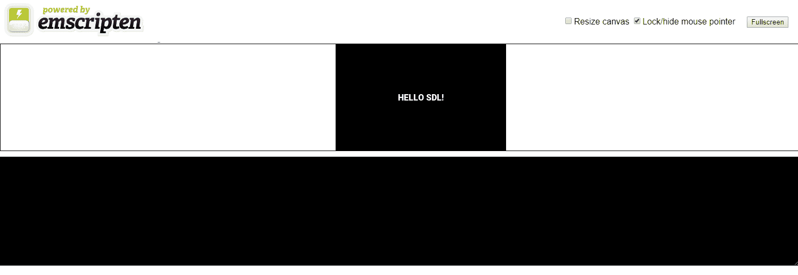
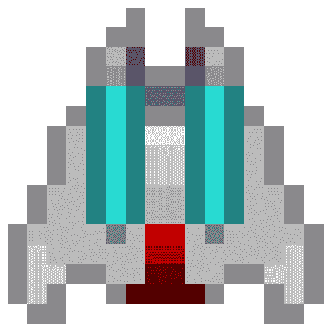
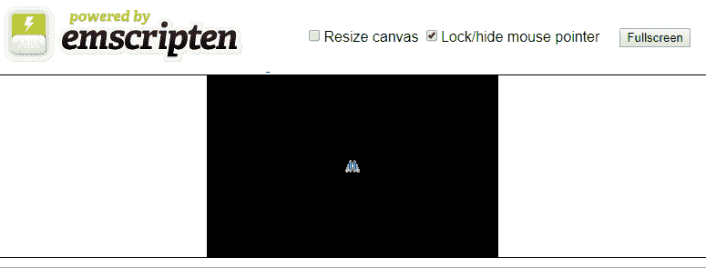

# 第四章：在 WebAssembly 中使用 SDL 进行精灵动画

在撰写本文时，Simple DirectMedia Layer（SDL）是唯一集成到 Emscripten 中供 WebAssembly 使用的 2D 渲染库。但是，即使更多的渲染库变得可用，SDL 也是一个得到广泛支持的渲染库，已经被移植到了大量平台，并且在可预见的未来仍将保持相关和有用，用于 WebAssembly 和 C++开发。使用 SDL 渲染到 WebGL 可以节省大量时间，因为我们不必自己编写 WebAssembly C++代码和 WebGL 之间的接口代码。庞大的社区还提供支持和文档。您可以在[libsdl.org](http://libsdl.org)上找到更多 SDL 资源。

您需要在构建中包含几个图像才能使此项目工作。确保包括项目的 GitHub 中的`/Chapter04/sprites/`和`/Chapter04/font/`文件夹。如果您还没有下载 GitHub 项目，可以从以下网址在线获取：[`github.com/PacktPublishing/Hands-On-Game-Development-with-WebAssembly`](https://github.com/PacktPublishing/Hands-On-Game-Development-with-WebAssembly)。

本章我们将涵盖以下主题：

+   在 WebAssembly 中使用 SDL

+   将精灵渲染到画布上

+   动画精灵

+   移动精灵

# 在 WebAssembly 中使用 SDL

到目前为止，我可以为 WebAssembly 模块和 JavaScript WebGL 库之间的交互自己开发系统。这将涉及使用函数表从 C++中调用 JavaScript WebGL 函数。幸运的是，Emscripten 团队已经完成了大部分工作。他们已经为我们创建了一个流行的 2D C++图形库的端口，可以实现这一点。SDL 是一个建立在大多数实现中的 OpenGL 之上的 2D 图形 API。有一个 Emscripten 端口，用于帮助我们在 WebGL 上渲染我们的 2D 图形。如果您想知道 Emscripten 集成了哪些其他库，请使用以下`emcc`命令：

```cpp
emcc --show-ports
```

如果您运行此命令，您会注意到显示了几个不同的 SDL 库。这些包括 SDL2、SDL2_image、SDL2_gfx、SDL2_ttf 和 SDL2_net。SDL 是以模块化设计创建的，允许用户只包含他们需要的 SDL 部分，从而使核心 SDL 库保持较小。如果您的目标是创建一个下载大小受限的网络游戏，这将非常有帮助。

我们将首先通过创建一个简单的“Hello World”应用程序来熟悉 SDL，该应用程序将一些文本写入 HTML5 画布元素。为此，我们需要包含我们运行`emcc --show-ports`命令时列出的 Emscripten 库中的两个。我们需要通过在 Emscripten 编译时添加`USE_SDL=2`标志来添加核心 SDL 库，还需要通过添加`USE_SDL_TTF=2`标志来添加 SDL TrueType 字体库。

将在 HTML 画布中显示消息`"HELLO SDL!"`的`.c`源代码相对简单：

```cpp
#include <SDL2/SDL.h>
#include <SDL2/SDL_ttf.h>
#include <emscripten.h>
#include <stdio.h>

#define MESSAGE "HELLO SDL!"
#define FONT_SIZE 16
#define FONT_FILE "font/Roboto-Black.ttf"

int main() {
    SDL_Window *window;
    SDL_Renderer *renderer;

    SDL_Rect dest = {.x = 160, .y = 100, .w = 0, .h = 0 };

    TTF_Font *font;
    SDL_Texture* texture;

    SDL_Init( SDL_INIT_VIDEO );
    TTF_Init();

    SDL_CreateWindowAndRenderer( 320, 200, 0, &window, &renderer );

    SDL_SetRenderDrawColor( renderer, 0, 0, 0, 255 );
    SDL_RenderClear( renderer );

    font = TTF_OpenFont( FONT_FILE, FONT_SIZE );

    SDL_Color font_color = {255, 255, 255, 255 }; // WHITE COLOR
    SDL_Surface *temp_surface = TTF_RenderText_Blended( font, 
                                                        MESSAGE, 
                                                       font_color );

    texture = SDL_CreateTextureFromSurface( renderer, temp_surface );

    SDL_FreeSurface( temp_surface );
    SDL_QueryTexture( texture,
                        NULL, NULL,
                        &dest.w, &dest.h ); // query the width and 
                                               height

    dest.x -= dest.w / 2;
    dest.y -= dest.h / 2;

    SDL_RenderCopy( renderer, texture, NULL, &dest );
    SDL_RenderPresent( renderer );

    return EXIT_SUCCESS;
}
```

让我来详细介绍一下这里发生了什么。代码的前四行是 SDL 头文件，以及 Emscripten 头文件：

```cpp
#include <SDL2/SDL.h>
#include <SDL2/SDL_ttf.h>
#include <emscripten.h>
#include <stdio.h>
```

在此之后，有三个预处理器定义。如果我们想快速更改消息或字体大小，我们将修改这前两行。第三个定义不太清楚。我们有一个叫做`FONT_FILE`的东西，它是一个看起来像是文件系统位置的字符串。这有点奇怪，因为 WebAssembly 无法访问本地文件系统。为了让 WebAssembly 模块访问 fonts 目录中的 TrueType 字体文件，我们将在编译`WASM`文件时使用`--preload-file`标志。这将从字体目录的内容生成一个`.data`文件。Web 浏览器将此数据文件加载到虚拟文件系统中，WebAssembly 模块可以访问该文件。这意味着我们编写的 C 代码将可以像访问本地文件系统一样访问此文件：

```cpp
#define MESSAGE "HELLO SDL!"
#define FONT_SIZE 16
#define FONT_FILE "font/Roboto-Black.ttf"
```

# 初始化 SDL

与 C/C++的其他目标一样，代码从`main`函数开始执行。我们将通过声明一些变量来启动我们的`main`函数：

```cpp
int main() {
    SDL_Window *window;
    SDL_Renderer *renderer;

    SDL_Rect dest = {.x = 160, .y = 100, .w = 0, .h = 0 };
    TTF_Font *font;

    SDL_Texture *texture;
```

前两个变量是`SDL_Window`和`SDL_Renderer`对象。`window`对象将定义应用程序窗口，如果我们为 Windows、Mac 或 Linux 系统编写代码，我们将渲染到该窗口中。当我们构建 WebAssembly 时，我们的 HTML 中有一个画布，但 SDL 仍然需要一个`window`对象指针来进行初始化和清理。所有对 SDL 的调用都使用`renderer`对象将图像渲染到画布上。

`SDL_Rect dest`变量是一个表示我们将要渲染到画布上的目标的矩形。我们将渲染到 320x200 画布的中心，所以我们将从`x`和`y`值`160`和`100`开始。我们还不知道我们将要渲染的文本的宽度和高度，所以在这一点上，我们将`w`和`h`设置为`0`。我们稍后会重置这个值，所以理论上，我们可以将它设置为任何值。

`TTF_Font *font`变量是指向`SDL_TTF`库的`font`对象的指针。稍后，我们将使用该对象从虚拟文件系统加载字体，并将该字体渲染到`SDL_Texture *texture`指针变量。`SDL_Texture`变量由 SDL 用于将精灵渲染到画布上。

接下来的几行用于在 SDL 中进行一些初始化工作：

```cpp
SDL_Init( SDL_INIT_VIDEO );
TTF_Init();

SDL_CreateWindowAndRenderer( 320, 200, 0, &window, &renderer );
```

`SDL_Init`函数使用单个标志调用，仅初始化视频子系统。顺便说一句，我不知道 SDL 的任何用例不需要视频子系统初始化。许多开发人员将 SDL 用作 OpenGL/WebGL 图形渲染系统；因此，除非您设计了一个仅音频的游戏，否则应始终传入`SDL_INIT_VIDEO`标志。如果您想初始化其他 SDL 子系统，您将使用布尔或`|`运算符传入这些子系统的标志，如下面的代码片段所示：

```cpp
 SDL_Init( SDL_INIT_VIDEO | SDL_INIT_AUDIO | SDL_INIT_HAPTIC );
```

如果我们使用上一行，SDL 也会初始化音频和触觉子系统，但我们现在不需要它们，所以我们不会进行更改。

`TTF_Init();`函数初始化我们的 TrueType 字体，`SDL_CreateWindowAndRenderer`向我们返回`window`和`renderer`对象。我们传入`320`作为画布的宽度，`200`作为高度。第三个变量是`window`标志。我们传入`0`作为该参数，表示我们不需要任何`window`标志。因为我们正在使用 SDL Emscripten 端口，我们无法控制窗口，所以这些标志不适用。

# 清除 SDL 渲染器

初始化完成后，我们需要清除渲染器。我们可以用任何颜色清除我们的渲染器。为了做到这一点，我们将调用`SDL_RenderDrawColor`函数：

```cpp
SDL_SetRenderDrawColor( renderer, 0, 0, 0, 255 );
SDL_RenderClear( renderer );
```

这将为渲染器设置绘图颜色为完全不透明的黑色。`0, 0, 0`是 RGB 颜色值，`255`是 alpha 不透明度。这些数字的范围都是从 0 到 255，其中 255 是颜色光谱上的全色。我们设置这样，这样当我们在下一行调用`SDL_RenderClear`函数时，它将用黑色清除渲染器。如果我们想要清除红色而不是黑色，我们需要修改以下调用方式：

```cpp
SDL_SetRenderDrawColor( renderer, 255, 0, 0, 255 );
```

这不是我们想要的，所以我们不会做出这种改变。我只是想指出我们可以用任何颜色清除渲染器。

# 使用 WebAssembly 虚拟文件系统

接下来的几行将在虚拟文件系统中打开 TrueType 字体文件，并将其渲染到`SDL_Texture`，这可以用来渲染到画布：

```cpp
font = TTF_OpenFont( FONT_FILE, FONT_SIZE );
SDL_Color font_color = {255, 255, 255, 255 }; // WHITE COLOR
SDL_Surface *temp_surface = TTF_RenderText_Blended( font, MESSAGE,
                                                    font_color );
texture = SDL_CreateTextureFromSurface( renderer, temp_surface );
SDL_FreeSurface( temp_surface ); 
```

在前面代码的第一行中，我们通过在程序顶部定义的 WebAssembly 虚拟文件系统中传递文件的位置来打开 TrueType 字体。我们还需要指定字体的点大小，这也在程序顶部定义为 16。接下来，我们创建一个`SDL_Color`变量，我们将用它来设置字体的颜色。这是一个 RGBA 颜色，我们将所有值设置为 255，这样它就是完全不透明的白色。做完这些之后，我们需要使用`TTF_RenderText_Blended`函数将文本渲染到一个表面上。我们传递了几行前打开的 TrueType 字体，`MESSAGE`，在程序顶部定义为`"HELLO SDL!"`，以及定义为白色的字体颜色。然后，我们将从我们的表面创建一个纹理，并释放我们刚刚分配的表面内存。在使用表面指针创建纹理后，您应该立即释放表面指针的内存，因为一旦您有了纹理，表面就不再需要了。

# 将纹理渲染到 HTML5 画布

从虚拟文件系统加载字体，然后将该字体渲染到纹理后，我们需要将该纹理复制到渲染器对象的位置。在完成这些操作后，我们需要将渲染器的内容呈现到 HTML5 画布元素。

以下是将纹理渲染到画布的源代码：

```cpp
SDL_QueryTexture( texture,
                    NULL, NULL,
                    &dest.w, &dest.h ); // query the width and height

dest.x -= dest.w / 2;
dest.y -= dest.h / 2;

SDL_RenderCopy( renderer, texture, NULL, &dest );
SDL_RenderPresent( renderer ); 
```

调用`SDL_QueryTexture`函数用于检索纹理的宽度和高度。我们需要使用这些值在目标矩形中，以便我们将纹理渲染到画布而不改变其尺寸。在那个调用之后，程序知道了纹理的宽度和高度，所以它可以使用这些值来修改目标矩形的*x*和*y*变量，以便它可以将我们的文本居中在画布上。因为`dest`（目标）矩形的*x*和*y*值指定了该矩形的左上角，我们需要减去矩形宽度的一半和矩形高度的一半，以确保它居中。然后`SDL_RenderCopy`函数将这个纹理渲染到我们的渲染缓冲区，`SDL_RenderPresent`将整个缓冲区移动到 HTML5 画布上。

到这一点，代码中剩下的就是`return`：

```cpp
return EXIT_SUCCESS;
```

以`EXIT_SUCCESS`的值返回告诉我们的 JavaScript 粘合代码，当运行这个模块时一切都进行得很好。

# 清理 SDL。

您可能会注意到这段代码中缺少的内容，这在 Windows 或 Linux 版本的 SDL 应用程序中会有，那就是在程序结束时进行一些 SDL 清理的代码。例如，如果我们在 Windows 中退出应用程序，而没有进行清理工作，我们将退出而不清除 SDL 分配的一些内存。如果这不是一个 WebAssembly 模块，以下行将包含在函数的末尾：

```cpp
SDL_Delay(5000);
SDL_DestroyWindow(window);
SDL_Quit();
```

因为我们还没有花时间制作游戏循环，我们希望通过调用`SDL_Delay(5000)`来延迟清理和退出程序五秒，`5000`是等待进行清理之前的毫秒数。我们要重申，因为我们正在编译为 WebAssembly，我们不希望清理我们的 SDL。这对不同的浏览器有不同的影响。

在 Firefox 中测试此代码时，使用延迟是不必要的，因为 Web 浏览器标签会在 WebAssembly 模块停止执行后保持打开。然而，Chrome 浏览器标签在 SDL 销毁`window`对象后会显示错误页面。

`SDL_DestroyWindow`函数会在 Windows 环境下销毁`window`对象。`SDL_Quit`函数终止 SDL 引擎，最后，`return EXIT_SUCCESS;`从`main`函数成功退出。

# 编译 hello_sdl.html

最后，我们将使用 Emscripten 的`emcc`编译器编译和测试我们的 WebAssembly 模块：

```cpp
emcc hello_sdl.c --emrun --preload-file font -s USE_SDL=2 -s USE_SDL_TTF=2 -o hello_sdl.html
```

重要的是要记住，您必须使用 Web 服务器或`emrun`来运行 WebAssembly 应用程序。如果您想使用`emrun`来运行 WebAssembly 应用程序，您必须使用`--emrun`标志进行编译。Web 浏览器需要 Web 服务器来流式传输 WebAssembly 模块。如果您尝试直接从硬盘驱动器在浏览器中打开使用 WebAssembly 的 HTML 页面，那么 WebAssembly 模块将无法加载。

在这次对`emcc`的调用中，我们使用了一些新的标志，并临时省略了`--shell-file new_shell.html`标志，该标志用于生成模板的定制版本。如果您想继续使用`emrun`来测试应用程序，您必须包括`--emrun`标志，以使用`emrun`命令运行。如果您使用 Node.js 等 Web 服务器来提供应用程序，则可以从现在开始省略`--emrun`标志。如果您喜欢使用`emrun`，请继续使用该标志进行编译。

我们已经添加了`--preload-file`字体标志，以便我们可以创建包含在`hello_sdl.data`文件中的虚拟文件系统。这个文件保存了我们的 TrueType 字体。应用程序使用了核心 SDL 库和额外的 SDL TrueType 字体模块，因此我们包含了以下标志`-s USE_SDL=2 -s USE_SDL_TTF=2`，以允许调用`SDL`和`SDL_ttf`。如果您的编译顺利进行，当您在浏览器中打开新的`hello_sdl.html`文件时，它将会是这个样子：



图 4.1：Hello SDL!应用程序截图

在下一节中，我们将学习如何使用 SDL 将精灵渲染到 HTML5 画布上。

# 将精灵渲染到画布上

现在我们已经学会了如何使用 SDL 和 Emscripten 将文本渲染到 HTML 画布元素，我们可以迈出下一步，学习如何渲染精灵。用于将精灵渲染到画布的代码与我们用于渲染 TrueType 字体的代码非常相似。我们仍然使用虚拟文件系统来生成包含我们使用的精灵的数据文件，但是我们需要一个新的 SDL 库来实现这一点。我们不再需要`SDL2_ttf`来加载 TrueType 字体并将其渲染到纹理。相反，我们需要`SDL2_image`。稍后我们将向您展示如何更改我们对`emcc`的调用以包含这个新库。

首先，让我们来看一下新版本的 SDL 代码，它将图像渲染到我们的 HTML 画布元素上，而不是我们在上一节中渲染的文本：

```cpp
#include <SDL2/SDL.h>
#include <SDL2/SDL_image.h>
#include <emscripten.h>
#include <stdio.h>
#define SPRITE_FILE "sprites/Franchise1.png"

int main() {
    SDL_Window *window;
    SDL_Renderer *renderer;
    SDL_Rect dest = {.x = 160, .y = 100, .w = 0, .h = 0 };
    SDL_Texture *texture;
    SDL_Init( SDL_INIT_VIDEO );
    SDL_CreateWindowAndRenderer( 320, 200, 0, &window, &renderer );
    SDL_SetRenderDrawColor( renderer, 0, 0, 0, 255 );
    SDL_RenderClear( renderer );
    SDL_Surface *temp_surface = IMG_Load( SPRITE_FILE );

    if( !temp_surface ) {
        printf("failed to load image: %s\n", IMG_GetError() );
        return 0;
    }

    texture = SDL_CreateTextureFromSurface( renderer, temp_surface );

    SDL_FreeSurface( temp_surface );

    SDL_QueryTexture( texture,
                        NULL, NULL,
                        &dest.w, &dest.h ); // query the width and 
                        height

    dest.x -= dest.w / 2;
    dest.y -= dest.h / 2;

    SDL_RenderCopy( renderer, texture, NULL, &dest );
    SDL_RenderPresent( renderer );

 SDL_Delay(5000);
 SDL_DestroyWindow(window);
 SDL_Quit();
    return 1;
}
```

这段代码类似于我们在上一节*HTML5 和 WebAssembly*中编写的代码，用于*HELLO SDL!*应用程序。我们使用的是`SDL2_image`模块，而不是`SDL2_ttf`模块。因此，我们需要包含`SDL2/SDL_image.h`头文件。我们还需要从`sprites`目录加载一个精灵文件，并将其添加到 WebAssembly 虚拟文件系统中：

```cpp
SDL_Surface *temp_surface = IMG_Load( SPRITE_FILE );

if( !temp_surface ) {
    printf("failed to load image: %s\n", IMG_GetError() );
    return 0;
}
```

在调用`IMG_Load`之后，我们添加了一个错误检查，以便在文件加载失败时让我们知道出了什么问题。除此之外，代码大部分都是相同的。如果成功，画布将显示我们的 16x16 像素的 Starship Franchise 图像：



图 4.2：Franchise1.png

在下一节中，我们将学习如何使用 SDL 在画布上制作动画精灵。

# 动画精灵

在本节中，我们将学习如何在 SDL 应用程序中制作一个快速而简单的动画。这不是我们在最终游戏中做动画的方式，但它会让您了解我们如何通过在 SDL 内部交换纹理来随时间创建动画。我将呈现分解为两部分的代码来动画精灵。第一部分包括我们的预处理宏、全局变量和`show_animation`函数：

```cpp
#include <SDL2/SDL.h>
#include <SDL2/SDL_image.h>

#include <emscripten.h>
#include <stdio.h>

#define SPRITE_FILE "sprites/Franchise1.png"
#define EXP_FILE "sprites/FranchiseExplosion%d.png"
#define FRAME_COUNT 7

int current_frame = 0;
Uint32 last_time;
Uint32 current_time;
Uint32 ms_per_frame = 100; // animate at 10 fps

SDL_Window *window;
SDL_Renderer *renderer;
SDL_Rect dest = {.x = 160, .y = 100, .w = 0, .h = 0 };
SDL_Texture *sprite_texture;
SDL_Texture *temp_texture;
SDL_Texture* anim[FRAME_COUNT];

void show_animation() {
    current_time = SDL_GetTicks();
    int ms = current_time - last_time;

    if( ms < ms_per_frame) {
        return;
    }

    if( current_frame >= FRAME_COUNT ) {
        SDL_RenderClear( renderer );
        return;
    }

    last_time = current_time;
    SDL_RenderClear( renderer );

    temp_texture = anim[current_frame++];

    SDL_QueryTexture( temp_texture,
                        NULL, NULL,
                        &dest.w, &dest.h ); // query the width and       
                                               height

    dest.x = 160 - dest.w / 2;
    dest.y = 100 - dest.h / 2;

    SDL_RenderCopy( renderer, temp_texture, NULL, &dest );
    SDL_RenderPresent( renderer );
}

```

在定义了`show_animation`函数之后，我们需要定义模块的`main`函数：

```cpp
int main() {
    char explosion_file_string[40];
    SDL_Init( SDL_INIT_VIDEO );
    SDL_CreateWindowAndRenderer( 320, 200, 0, &window, &renderer );

    SDL_SetRenderDrawColor( renderer, 0, 0, 0, 255 );
    SDL_RenderClear( renderer );

    SDL_Surface *temp_surface = IMG_Load( SPRITE_FILE );

    if( !temp_surface ) {
        printf("failed to load image: %s\n", IMG_GetError() );
        return 0;
    }

    sprite_texture = SDL_CreateTextureFromSurface( renderer, 
    temp_surface );

    SDL_FreeSurface( temp_surface );

    for( int i = 1; i <= FRAME_COUNT; i++ ) {
        sprintf( explosion_file_string, EXP_FILE, i );
        SDL_Surface *temp_surface = IMG_Load( explosion_file_string );

        if( !temp_surface ) {
            printf("failed to load image: %s\n", IMG_GetError() );
            return 0;
        }

        temp_texture = SDL_CreateTextureFromSurface( renderer, 
        temp_surface );
        anim[i-1] = temp_texture;
        SDL_FreeSurface( temp_surface );
    }

    SDL_QueryTexture( sprite_texture,
                        NULL, NULL,
                        &dest.w, &dest.h ); // query the width and 
                                               height

    dest.x -= dest.w / 2;
    dest.y -= dest.h / 2;

    SDL_RenderCopy( renderer, sprite_texture, NULL, &dest );
    SDL_RenderPresent( renderer );

    last_time = SDL_GetTicks();
    emscripten_set_main_loop(show_animation, 0, 0);
    return 1;
}
```

这里有很多内容需要解释。有更高效的方法来做这个动画，但我们在这里所做的是基于我们已经完成的工作并进行扩展。在代码的早期版本中，我们将单个帧呈现到画布上，然后退出 WebAssembly 模块。如果您的目标是将静态内容呈现到画布并永远不更改它，那么这样做就足够了。但是，如果您正在编写游戏，则需要能够对精灵进行动画处理并在画布上移动它们。在这里，我们遇到了一个问题，如果我们将 C++代码编译为 WebAssembly 以外的任何目标，我们就不会遇到这个问题。游戏通常在循环中运行，并直接负责向屏幕渲染。WebAssembly 在 Web 浏览器的 JavaScript 引擎内运行。WebAssembly 模块本身无法更新我们的画布。Emscripten 使用 JavaScript 粘合代码间接从 SDL API 更新 HTML 画布。但是，如果 WebAssembly 在循环中运行，并使用该循环通过 SDL 来对我们的精灵进行动画处理，那么 WebAssembly 模块永远不会释放它所在的线程，并且 JavaScript 永远没有机会更新画布。因此，我们不能将游戏循环放在`main`函数中。相反，我们必须创建一个不同的函数，并使用 Emscripten 来设置 JavaScript 粘合代码，以便在每次浏览器渲染帧时调用该函数。我们将使用的函数如下：

```cpp
emscripten_set_main_loop(show_animation, 0, 0);
```

我们将传递给`emscripten_set_main_loop`的第一个参数是`show_animation`。这是我们在代码顶部附近定义的一个函数的名称。稍后我会谈论`show_animation`函数的具体内容。现在，知道这是每次浏览器在画布上渲染新帧时调用的函数就足够了。

`emscripten_set_main_loop`的第二个参数是**每秒帧数**（**FPS**）。如果要将游戏的 FPS 设置为固定速率，可以通过在此处将目标帧速率传递给函数来实现。如果传入`0`，这告诉`emscripten_set_main_loop`以尽可能高的帧速率运行。通常情况下，您希望游戏以尽可能高的帧速率运行，因此传入`0`通常是最好的做法。如果传入的值高于计算机能够渲染的速度，它将以其能够的速度渲染，因此此值仅对 FPS 设置了上限。

我们传递的第三个参数是`simulate_infinite_loop`。传入`0`等同于传递`false`值。如果此参数的值为`true`，它会强制模块在每帧通过`main`函数重新进入。我不确定这个用例是什么。我建议将其保持为`0`，并将游戏循环分离到另一个函数中，就像我们在这里做的那样。

在调用`emscripten_set_main_loop`之前，我们将设置一个 SDL 纹理表面指针的数组：

```cpp
for( int i = 1; i <= FRAME_COUNT; i++ ) {
 sprintf( explosion_file_string, EXP_FILE, i );
    SDL_Surface *temp_surface = IMG_Load( explosion_file_string );

    if( !temp_surface ) {
        printf("failed to load image: %s\n", IMG_GetError() );
        return 0;
    }

    temp_texture = SDL_CreateTextureFromSurface( renderer, temp_surface );
    anim[i-1] = temp_texture;
    SDL_FreeSurface( temp_surface );
}
```

这个循环将`FranchiseExplosion1.png`到`FranchiseExplosion7.png`加载到一个 SDL 纹理数组中，并将它们存储到一个名为`anim`的不同数组中。这是我们稍后将在`show_animation`函数中循环的数组。有更有效的方法可以使用精灵表，并通过修改目标矩形来实现这一点。我们将在后面的章节中讨论渲染动画精灵的这些技术。

在代码的顶部附近，我们定义了`show_animation`函数，每渲染一帧就调用一次：

```cpp
void show_animation() {
    current_time = SDL_GetTicks();
    int ms = current_time - last_time;

    if( ms < ms_per_frame) {
        return;
    }

    if( current_frame >= FRAME_COUNT ) {
        SDL_RenderClear( renderer );
        return;
    }

    last_time = current_time;
    SDL_RenderClear( renderer );

    temp_texture = anim[current_frame++];

    SDL_QueryTexture( temp_texture,
                        NULL, NULL,
                        &dest.w, &dest.h ); // query the width and 
                                               height

    dest.x = 160 - dest.w / 2;
    dest.y = 100 - dest.h / 2;

    SDL_RenderCopy( renderer, temp_texture, NULL, &dest );
    SDL_RenderPresent( renderer );
}
```

这个函数的设计是等待一定的毫秒数，然后更新我们正在渲染的纹理。我创建了一个七帧动画，让星际特许经营号在一个小像素化的爆炸中爆炸。在这个循环中我们需要短暂等待的原因是，我们的刷新率可能是 60+ FPS，如果我们每次调用`show_animation`时都渲染一个新的动画帧，整个动画将在大约 1/10 秒内运行完毕。经典的街机游戏经常以比游戏帧率慢得多的速度翻转它们的动画序列。许多经典的**任天堂娱乐系统**（**NES**）游戏使用两阶段动画，其中动画会在几百毫秒内交替精灵，尽管 NES 的帧率是 60 FPS。

这个函数的核心与我们之前创建的单纹理渲染类似。主要的区别是在改变动画帧之前我们等待固定的毫秒数，通过递增`current_frame`变量来遍历我们动画的所有七个阶段，这需要不到一秒的时间。

# 移动精灵

现在我们已经学会了如何以逐帧动画的方式为我们的精灵添加动画，我们将学习如何在画布上移动精灵。我希望保持我们的飞船动画，但我希望它不要在`爆炸`循环中运行。在我们的`sprites`文件夹中，我包含了一个简单的四阶段动画，可以使我们飞船的引擎闪烁。源代码非常长，所以我将分三部分介绍它：预处理和全局变量部分，`show_animation`函数和`main`函数。

这是我们的`cpp`文件开头定义的预处理指令和全局变量的代码：

```cpp
#include <SDL2/SDL.h>
#include <SDL2/SDL_image.h>

#include <emscripten.h>
#include <stdio.h>

#define SPRITE_FILE "sprites/Franchise1.png"
#define EXP_FILE "sprites/Franchise%d.png"

#define FRAME_COUNT 4

int current_frame = 0;
Uint32 last_time;
Uint32 current_time;
Uint32 ms_per_frame = 100; // animate at 10 fps

SDL_Window *window;

SDL_Renderer *renderer;
SDL_Rect dest = {.x = 160, .y = 100, .w = 0, .h = 0 };
SDL_Texture *sprite_texture;
SDL_Texture *temp_texture;
SDL_Texture* anim[FRAME_COUNT];
```

在预处理指令和全局变量之后，我们的`cpp`文件包含了一个定义游戏循环的`show_animation`函数。以下是我们`show_animation`函数的代码：

```cpp
void show_animation() {
    current_time = SDL_GetTicks();
    int ms = current_time - last_time;

    if( ms >= ms_per_frame) {
        ++current_frame;
        last_time = current_time;
    }

    if( current_frame >= FRAME_COUNT ) {
        current_frame = 0;
    }

    SDL_RenderClear( renderer );
    temp_texture = anim[current_frame];

    dest.y--;

    if( dest.y < -16 ) {
        dest.y = 200;
    }

    SDL_RenderCopy( renderer, temp_texture, NULL, &dest );
    SDL_RenderPresent( renderer );
}

```

我们的`cpp`文件的最后部分定义了`main`函数。这是我们的 WebAssembly 模块中的初始化代码：

```cpp
int main() {
    char explosion_file_string[40];
    SDL_Init( SDL_INIT_VIDEO );
    SDL_CreateWindowAndRenderer( 320, 200, 0, &window, &renderer );
    SDL_SetRenderDrawColor( renderer, 0, 0, 0, 255 );
    SDL_RenderClear( renderer );
    SDL_Surface *temp_surface = IMG_Load( SPRITE_FILE );

    if( !temp_surface ) {
        printf("failed to load image: %s\n", IMG_GetError() );
        return 0;
    }

    sprite_texture = SDL_CreateTextureFromSurface( renderer, 
    temp_surface );
    SDL_FreeSurface( temp_surface );

    for( int i = 1; i <= FRAME_COUNT; i++ ) {
        sprintf( explosion_file_string, EXP_FILE, i );
        SDL_Surface *temp_surface = IMG_Load( explosion_file_string );

        if( !temp_surface ) {
            printf("failed to load image: %s\n", IMG_GetError() );
            return 0;
        }

        temp_texture = SDL_CreateTextureFromSurface( renderer, 
        temp_surface );

        anim[i-1] = temp_texture;
        SDL_FreeSurface( temp_surface );
    }

    SDL_QueryTexture( sprite_texture,
                        NULL, NULL,
                        &dest.w, &dest.h ); // query the width and 
                                               height

    dest.x -= dest.w / 2;
    dest.y -= dest.h / 2;

    SDL_RenderCopy( renderer, sprite_texture, NULL, &dest );
    SDL_RenderPresent( renderer );

    last_time = SDL_GetTicks();
    emscripten_set_main_loop(show_animation, 0, 0);
    return 1;
}
```

这段代码类似于我们的`sprite_animation`代码。只有一些修改，大部分在`show_animation`函数中：

```cpp
void show_animation() {
    current_time = SDL_GetTicks();

    int ms = current_time - last_time;

    if( ms >= ms_per_frame) {
        ++current_frame;
        last_time = current_time;
    }

    if( current_frame >= FRAME_COUNT ) {
        current_frame = 0;
    }

    SDL_RenderClear( renderer );
    temp_texture = anim[current_frame];

    dest.y--;

    if( dest.y < -16 ) {
        dest.y = 200;
    }

    SDL_RenderCopy( renderer, temp_texture, NULL, &dest );
    SDL_RenderPresent( renderer );
}
```

当`ms`中的值超过`ms_per_frame`时，我们就会推进我们的帧，`ms`跟踪自上一帧更改以来的毫秒数，我们将`ms_per_frame`设置为`100`。因为飞船在移动，我们仍然需要在每一帧更新我们的画布以显示新的飞船位置。我们通过修改`dest.y`的值来实现这一点，这告诉 SDL 在 y 轴上渲染我们的飞船。我们每一帧都从`dest.y`变量中减去 1，以将飞船向上移动。我们还进行了一个检查，看看这个值是否变小到小于`-16`。因为精灵高度为 16 像素，当精灵完全移出屏幕顶部时，这种情况就会发生。如果是这种情况，我们需要通过将`y`值设置回`200`来将精灵移回游戏屏幕的底部。在实际游戏中，像这样直接将我们的移动与帧速率绑定在一起是一个坏主意，但是对于这个演示来说，这样做是可以的。

# 编译 sprite.html

现在我们可以使用`emcc`命令来编译我们的精灵 WebAssembly 应用程序。您需要从 GitHub 的`Chapter02`文件夹中获取`sprites`文件夹。在您下载了`sprites`文件夹并将其放在项目文件夹中之后，您可以使用以下命令编译应用程序：

```cpp
emcc sprite_move.c --preload-file sprites -s USE_SDL=2 -s USE_SDL_IMAGE=2 -s SDL2_IMAGE_FORMATS=["png"] -o sprite_move.html
```

重要的是要记住，应用程序必须从 Web 服务器上运行，或者使用`emrun`。如果您不从 Web 服务器上运行应用程序，或者使用`emrun`，当 JavaScript 粘合代码尝试下载 WASM 和数据文件时，您将收到各种错误。您还应该知道，为了设置`.wasm`和`.data`文件扩展名的正确 MIME 类型，IIS 需要额外的配置。

我们仍然使用`--preload-file`标志，但是这次我们传递的是`sprites`文件夹，而不是`fonts`文件夹。我们将继续使用`-s USE_SDL=2`标志，并将添加`-s USE_SDL_IMAGE=2`标志，这将允许我们在 SDL 中使用图像，这是`.bmp`文件格式的替代品。

为了告诉`SDL_IMAGE`要使用哪种文件格式，我们使用以下`-s SDL2_IMAGE_FORMATS=["png"]`标志传递`png`格式：



图 4.3：sprite_move.html 的屏幕截图

# 总结

在本章中，我向您介绍了 SDL 及其可在 WebAssembly 中使用的模块库。我们了解了 WebAssembly 虚拟文件系统，以及 Emscripten 如何创建`.data`文件以便在 WebAssembly 虚拟文件系统中访问。我教会了您如何使用 SDL 将图像和字体渲染到 HTML 画布上。最后，我们学会了如何使用 SDL 在游戏中创建简单的动画。

在下一章中，我们将学习如何使用键盘输入来移动画布上的游戏对象。
