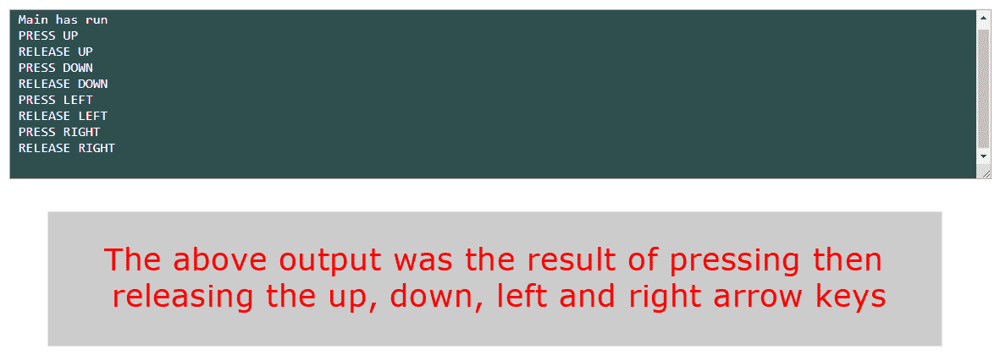
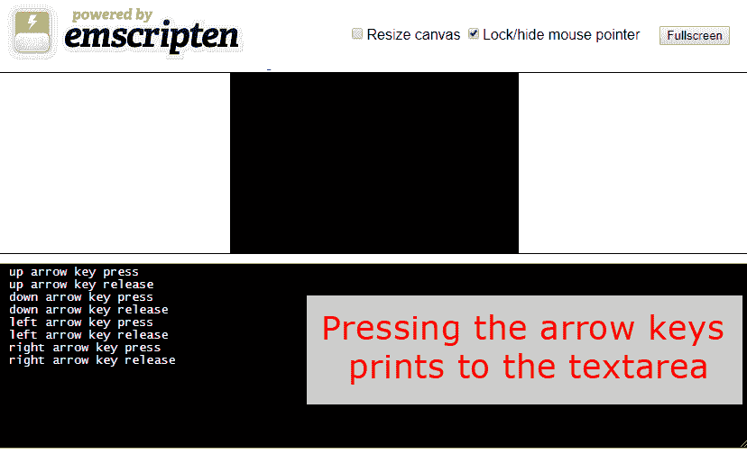
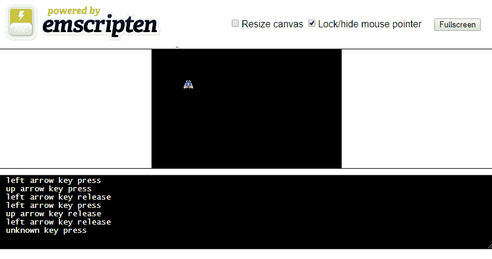

# 键盘输入

现在我们有了精灵和动画，可以在画布上移动这些精灵，我们需要在游戏中添加一些交互。有几种方法可以获取游戏的键盘输入。一种方法是通过 JavaScript，根据输入调用 WebAssembly 模块中的不同函数。我们代码的第一部分将做到这一点。我们将在 WebAssembly 模块中添加一些函数，供我们在 JavaScript 包装器中使用。我们还将设置一些 JavaScript 键盘事件处理程序，这些处理程序将在触发键盘事件时调用我们的 WebAssembly 模块。

我们可以让 SDL 来为我们处理所有繁重的工作，从而将输入传递到我们的 WebAssembly 模块中。这涉及将 C 代码添加到我们的 WebAssembly 模块中，以捕获`SDL_KEYDOWN`和`SDL_KEYUP`事件。然后，模块将查看事件的键码，以确定触发事件的键。使用任一方法编写我们的代码都有成本和收益。一般来说，让 SDL 管理我们的键盘输入会使我们失去在 JavaScript 中编写键盘输入管理器的灵活性，同时，我们也会获得更加直接的代码的好处。

您需要在构建中包含几个图像，以使该项目正常工作。确保您从项目的 GitHub 中包含`/Chapter05/sprites/`文件夹。如果您还没有下载 GitHub 项目，可以在以下网址在线获取：[`github.com/PacktPublishing/Hands-On-Game-Development-with-WebAssembly`](https://github.com/PacktPublishing/Hands-On-Game-Development-with-WebAssembly)。

在本章中，我们将执行以下操作：

+   学习如何使用 JavaScript 键盘事件调用我们的 WebAssembly 模块

+   学习如何使用 SDL 事件来管理 WebAssembly 模块内的键盘输入

+   通过使用键盘输入来移动画布上的飞船精灵来演示我们所学到的内容

# JavaScript 键盘输入

我们将首先学习如何监听 JavaScript 键盘事件，并根据这些事件调用我们的 WebAssembly 模块。我们将重用我们为第二章编写的大部分代码，*HTML5 和 WebAssembly*，所以我们应该首先从`Chapter02`文件夹中获取该代码，并将其复制到我们的新`Chapter05`文件夹中。将`Chapter02`目录中的`new_shell.html`文件复制到`Chapter05`目录，然后将该文件重命名为`jskey_shell.html`。接下来，将`Chapter02`目录中的`shell.c`复制到`Chapter05`目录，并将该文件重命名为`jskey.c`。最后，将`Chapter02`目录中的`shell.css`文件复制到`Chapter05`目录，但不要重命名。这三个文件将为我们编写 JavaScript 键盘输入代码提供一个起点。

首先，让我们来看一下我们刚刚从`shell.c`创建的`jskey.c`文件。我们可以在文件的开头就把大部分代码删除掉。删除`main`函数结束后的所有代码。这意味着你将删除以下所有代码：

```cpp
void test() {
    printf("button test\n");
}

void int_test( int num ) {
    printf("int test=%d\n", num);
}

void float_test( float num ) {
    printf("float test=%f\n", num);
}

void string_test( char* str ) {
    printf("string test=%s\n", str);
}
```

接下来，我们将修改`main`函数。我们不再希望在`main`函数内部使用`EM_ASM`来调用我们的 JavaScript 包装器初始化函数，因此从`main`函数中删除以下两行代码：

```cpp
EM_ASM( InitWrappers() );
printf("Initialization Complete\n");
```

在我们的`main`函数中，唯一剩下的是一个`printf`语句。我们将更改该行以让我们知道`main`函数已运行。您可以更改此代码以说任何您喜欢的内容，或者完全删除`printf`语句。以下代码显示了我们`main`函数的内容：

```cpp
int main() {
    printf("main has run\n");
}
```

现在我们已经修改了`main`函数，并删除了我们不再需要的所有函数，让我们添加一些在触发 JavaScript`keyboard`事件时调用的函数。当用户在键盘上按下箭头键时，我们将添加一个`keypress`事件的函数。以下代码将被这些`keypress`事件调用：

```cpp
void press_up() {
    printf("PRESS UP\n");
}

void press_down() {
    printf("PRESS DOWN\n");
}

void press_left() {
    printf("PRESS LEFT\n");
}

void press_right() {
    printf("PRESS RIGHT\n");
}
```

我们还想知道用户何时释放按键。因此，我们将在 C 模块中添加四个`release`函数，如下所示：

```cpp
void release_up() {
    printf("RELEASE UP\n");
}

void release_down() {
    printf("RELEASE DOWN\n");
}

void release_left() {
    printf("RELEASE LEFT\n");
}

void release_right() {
    printf("RELEASE RIGHT\n");
}
```

现在我们有了新的 C 文件，我们可以改变我们的 shell 文件。打开`jskey_shell.html`。我们不需要改变`head`标签中的任何内容，但在`body`内部，我们将删除许多我们将不再使用的 HTML 元素。继续删除除`textarea`元素之外的所有元素。我们希望保留`textarea`元素，以便我们可以看到模块内的`printf`语句的输出。我们需要在`jskey_shell.html`中删除以下 HTML，然后再删除`textarea`元素之后的`div`及其内容：

```cpp
<div class="input_box">&nbsp;</div>
<div class="input_box">
    <button id="click_me" class="em_button">Click Me!</button>
</div>

<div class="input_box">
    <input type="number" id="int_num" max="9999" min="0" step="1" 
     value="1" class="em_input">
    <button id="int_button" class="em_button">Int Click!</button>
</div>

<div class="input_box">
    <input type="number" id="float_num" max="99" min="0" step="0.01" 
     value="0.0" class="em_input">
    <button id="float_button" class="em_button">Float Click!</button>
</div>

<div class="input_box">&nbsp;</div>
```

然后，在`textarea`元素之后，我们需要删除以下`div`及其内容：

```cpp
<div id="string_box">
    <button id="string_button" class="em_button">String Click!</button>
    <input id="string_input">
</div>
```

之后，我们有包含所有 JavaScript 代码的`script`标签。我们需要在该`script`标签中添加一些全局变量。首先，让我们添加一些布尔变量，告诉我们玩家是否按下了我们的任何箭头键。将所有这些值初始化为`false`，如下例所示：

```cpp
var left_key_press = false;
var right_key_press = false;
var up_key_press = false;
var down_key_press = false;
```

在我们的`key_press`标志之后，我们将有所有将用于保存调用我们 WebAssembly 模块内函数的`wrapper`函数的`wrapper`变量。我们将所有这些包装器初始化为`null`。稍后，我们只会在这些函数不为`null`时调用这些函数。以下代码显示了我们的包装器：

```cpp
var left_press_wrapper = null;
var left_release_wrapper = null;

var right_press_wrapper = null;
var right_release_wrapper = null;

var up_press_wrapper = null;
var up_release_wrapper = null;

var down_press_wrapper = null;
var down_release_wrapper = null;
```

现在我们已经定义了所有的全局变量，我们需要添加在`key_press`和`key_release`事件上触发的函数。其中之一是`keyPress`函数。我们为这个函数编写的代码如下：

```cpp
function keyPress() {
    event.preventDefault();
    if( event.repeat === true ) {
        return;
    }

    // PRESS UP ARROW
    if (event.keyCode === 38) {
        up_key_press = true;
        if( up_press_wrapper != null ) up_press_wrapper();
    }

    // PRESS LEFT ARROW
    if (event.keyCode === 37) {
        left_key_press = true;
        if( left_press_wrapper != null ) left_press_wrapper();
    }

    // PRESS RIGHT ARROW
    if (event.keyCode === 39) {
        right_key_press = true;
        if( right_press_wrapper != null ) right_press_wrapper();
    }

    // PRESS DOWN ARROW
    if (event.keyCode === 40) {
        down_key_press = true;
        if( down_press_wrapper != null ) down_press_wrapper();
    }
}
```

这个函数的第一行是`event.preventDefault();`。这一行阻止了网页浏览器在用户按下相应键时通常会做的事情。例如，如果你正在玩游戏，并按下下箭头键使你的飞船向下移动，你不希望网页也滚动向下。在`keyPress`函数的开头放置这个`preventDefault`调用将禁用所有按键的默认行为。在其他项目中，这可能不是你想要的。如果你只想在按下下箭头键时禁用默认行为，你会将该调用放在管理下箭头键按下的`if`块内。以下代码块检查事件是否为重复事件：

```cpp
if( event.repeat === true ) {
    return;
}
```

如果你按住其中一个键是正确的。例如，如果你按住上箭头键，你最初会得到一个上箭头键按下事件，但是，经过一段时间后，你会开始得到一个重复的上箭头键事件。你可能已经注意到，如果你曾经按住一个单一的键，比如*F*键，你会在你的文字处理器中看到一个 f，但是，一秒左右后你会开始看到 fffffffffffff，你会继续看到 f 重复进入你的文字处理器，只要你按住*F*键。一般来说，这种行为在使用文字处理器时可能是有帮助的，但在玩游戏时是有害的。前面的`if`块使我们在接收到重复按键事件时退出函数。

我们函数中的接下来的几个`if`块检查各种 JavaScript 键码，并根据这些键码调用我们的 WebAssembly 模块。让我们快速看一下当玩家按下上箭头键时会发生什么：

```cpp
// PRESS UP ARROW
if (event.keyCode === 38) {
    up_key_press = true;
    if( up_press_wrapper != null ) up_press_wrapper();
}
```

`if`语句正在检查事件的键码是否等于值`38`，这是上箭头的键码值。您可以在[`www.embed.com/typescript-games/html-keycodes.html`](https://www.embed.com/typescript-games/html-keycodes.html)找到 HTML5 键码的列表。如果触发事件是上箭头键按下，我们将`up_key_press`变量设置为`true`。如果我们的`up_press_wrapper`已初始化，我们将调用它，它将调用 WebAssembly 模块内的`press_up`函数。在检查上箭头键码的`if`块之后，我们将需要更多的`if`块来检查其他箭头键，如下例所示：

```cpp
    // PRESS LEFT ARROW
    if (event.keyCode === 37) {
        left_key_press = true;
        if( left_press_wrapper != null ) left_press_wrapper();
    }

    // PRESS RIGHT ARROW
    if (event.keyCode === 39) {
        right_key_press = true;
        if( right_press_wrapper != null ) right_press_wrapper();
    }

    // PRESS DOWN ARROW
    if (event.keyCode === 40) {
        down_key_press = true;
        if( down_press_wrapper != null ) down_press_wrapper();
    }
}
```

在`keyUp`函数之后，我们需要创建一个非常相似的函数：`keyRelease`。这个函数与`keyUp`几乎相同，只是它将调用 WebAssembly 模块中的按键释放函数。以下代码显示了`keyRelease()`函数的样子：

```cpp
function keyRelease() {
    event.preventDefault();

    // PRESS UP ARROW
    if (event.keyCode === 38) {
        up_key_press = false;
        if( up_release_wrapper != null ) up_release_wrapper();
    }

    // PRESS LEFT ARROW
    if (event.keyCode === 37) {
        left_key_press = false;
        if( left_release_wrapper != null ) left_release_wrapper();
    }

    // PRESS RIGHT ARROW
    if (event.keyCode === 39) {
        right_key_press = false;
        if( right_release_wrapper != null ) right_release_wrapper();
    }

    // PRESS DOWN ARROW
    if (event.keyCode === 40) {
        down_key_press = false;
        if( down_release_wrapper != null ) down_release_wrapper();
    }
}
```

在定义了这些函数之后，我们需要使用以下两行 JavaScript 代码将它们作为事件监听器：

```cpp
document.addEventListener('keydown', keyPress);
document.addEventListener('keyup', keyRelease);
```

接下来我们需要修改我们的`InitWrappers`函数来包装我们之前创建的函数。我们使用`Module.cwrap`函数来实现这一点。我们的`InitWrappers`函数的新版本如下：

```cpp
function InitWrappers() {
    left_press_wrapper = Module.cwrap('press_left', 'undefined');
    right_press_wrapper = Module.cwrap('press_right', 'undefined');
    up_press_wrapper = Module.cwrap('press_up', 'undefined');
    down_press_wrapper = Module.cwrap('press_down', 'undefined');

    left_release_wrapper = Module.cwrap('release_left', 'undefined');
    right_release_wrapper = Module.cwrap('release_right', 'undefined');
    up_release_wrapper = Module.cwrap('release_up', 'undefined');
    down_release_wrapper = Module.cwrap('release_down', 'undefined');
}
```

我们有两个不再需要的函数可以删除。这些是`runbefore`和`runafter`函数。这些函数在第二章的 shell 中使用，用来演示`preRun`和`postRun`模块功能。它们只是在控制台中记录一行，所以请从`jskey_shell.html`文件中删除以下代码：

```cpp
function runbefore() {
    console.log("before module load");
}

function runafter() {
    console.log("after module load");
}
```

现在我们已经删除了这些行，我们可以从模块的`preRun`和`postRun`数组中删除对这些函数的调用。因为我们之前已经从 WebAssembly 模块的`main`函数中删除了对`EM_ASM( InitWrappers() );`的调用，所以我们需要从模块的`postRun`数组中运行`InitWrappers`。以下代码显示了这些更改后`Module`对象定义的开头是什么样子的：

```cpp
preRun: [],
postRun: [InitWrappers],
```

现在我们应该构建和测试我们的新 JavaScript 键盘处理程序。运行以下`emcc`命令：

```cpp
emcc jskey.c -o jskey.html  -s NO_EXIT_RUNTIME=1 --shell-file jskey_shell.html -s EXPORTED_FUNCTIONS="['_main', '_press_up', '_press_down', '_press_left', '_press_right', '_release_up', '_release_down', '_release_left', '_release_right']" -s EXTRA_EXPORTED_RUNTIME_METHODS="['cwrap', 'ccall']"
```

您会注意到我们使用了`-s EXPORT_FUNCTIONS`标志来导出所有的按键按下和按键释放函数。因为我们没有使用默认的 shell，我们使用了`--shell-file jskey_shell.html`标志。`-s NO_EXIT_RUNTIME=1`标志防止浏览器在没有 emscripten 主循环时退出 WebAssembly 模块。我们还使用`-s EXTRA_EXPORTED_RUNTIME_METHODS="['cwrap', 'ccall']"`导出了`cwrap`和`ccall`。

以下是应用程序的屏幕截图：



图 5.1：jskey.html 的屏幕截图

重要的是要记住，应用程序必须从 Web 服务器运行，或者使用`emrun`。如果您不从 Web 服务器运行应用程序，或者使用`emrun`，当 JavaScript 粘合代码尝试下载 WASM 和数据文件时，您将收到各种错误。您还应该知道，IIS 需要额外的配置才能为`.wasm`和`.data`文件扩展名设置正确的 MIME 类型。

在下一节中，我们将使用 SDL 事件处理程序和默认的 WebAssembly shell 来捕获和处理键盘事件。

# 向 WebAssembly 添加 SDL 键盘输入

SDL 允许我们轮询键盘输入。每当用户按下键时，调用`SDL_PollEvent( &event )`将返回一个`SDK_KEYDOWN SDL_Event`。当释放键时，它将返回一个`SDK_KEYUP`事件。在这种情况下，我们可以查看这些值，以确定哪个键被按下或释放。我们可以使用这些信息来设置游戏中的标志，以便在何时移动我们的飞船以及移动的方向。稍后，我们可以添加检测空格键按下的代码，以发射飞船的武器。

现在，我们将回到使用默认的 Emscripten shell。在本节的其余部分，我们将能够在 WebAssembly C 代码中完成所有操作。我将带你创建一个新的`keyboard.c`文件，从头开始处理键盘事件并在默认 shell 中打印到`textarea`。

首先创建一个新的`keyboard.c`文件，并在文件顶部添加以下`#include`指令：

```cpp
#include <SDL2/SDL.h>
#include <emscripten.h>
#include <stdio.h>
#include <stdbool.h>
```

之后，我们需要添加我们的全局`SDL`对象。前两个，`SDL_Window`和`SDL_Renderer`，现在应该看起来很熟悉。第三个，`SDL_Event`，是新的。我们将使用`SDL_PollEvent`在代码后期填充这个事件对象：

```cpp
SDL_Window *window;
SDL_Renderer *renderer;
SDL_Event event;
```

和这段代码的 JavaScript 版本一样，我们将使用全局变量来跟踪我们当前按下的箭头键。这些都将是布尔变量，如下面的代码所示：

```cpp
bool left_key_press = false;
bool right_key_press = false;
bool up_key_press = false;
bool down_key_press = false;
```

我们要定义的第一个函数是`input_loop`，但在我们定义该函数之前，我们需要声明`input_loop`将调用的两个函数，如下所示：

```cpp
void key_press();
void key_release();
```

这将允许我们在实际定义`input_loop`调用这些函数之前定义`input_loop`函数。`input_loop`函数将调用`SDL_PollEvent`来获取一个事件对象。然后我们可以查看事件的类型，如果是`SDL_KEYDOWN`或`SDL_KEYUP`事件，我们可以调用适当的函数来处理这些事件，如下所示：

```cpp
void input_loop() {
    if( SDL_PollEvent( &event ) ){
        if( event.type == SDL_KEYDOWN ){
            key_press();
        }
        else if( event.type == SDL_KEYUP ) {
            key_release();
        }
    }
}
```

我们将定义的第一个函数是`key_press()`函数。在这个函数内部，我们将在 switch 中查看键盘事件，并将值与不同的箭头键 SDLK 事件进行比较。如果键之前是弹起状态，它会打印出一个消息，让我们知道用户按下了哪个键。然后我们应该将`keypress`标志设置为`true`。下面的示例展示了`key_press()`函数的全部内容：

```cpp
void key_press() {
    switch( event.key.keysym.sym ){
        case SDLK_LEFT:
            if( !left_key_press ) {
                printf("left arrow key press\n");
            }
            left_key_press = true;
            break;

        case SDLK_RIGHT:
            if( !right_key_press ) {
                printf("right arrow key press\n");
            }
            right_key_press = true;
            break;

        case SDLK_UP:
            if( !up_key_press ) {
                printf("up arrow key press\n");
            }
            up_key_press = true;
            break;

        case SDLK_DOWN:
            if( !down_key_press ) {
                printf("down arrow key press\n");
            }
            down_key_press = true;
            break;

        default:
            printf("unknown key press\n");
            break;
    }
}
```

`key_press`函数内的第一行是一个 switch 语句，`switch(event.key.keysym.sym)`。这些都是结构中的结构。在`input_loop`函数内，我们调用了`SDL_PollEvent`，传递了一个`SDL_Event`结构的引用。这个结构包含了可能返回给我们的任何事件的事件数据，以及一个告诉我们这是什么类型事件的类型。如果类型是`SDL_KEYDOWN`或`SDL_KEYUP`，那意味着内部的`key`结构，它是一个`SDL_KeyboardEvent`类型的结构，被填充了。如果你想看`SDL_Event`结构的完整定义，你可以在 SDL 网站上找到它：[`wiki.libsdl.org/SDL_Event`](https://wiki.libsdl.org/SDL_Event)。在`SDL_Event`内部的 key 变量，你会注意到它是一个`SDL_KeyboardEvent`类型的结构。这个结构里有很多我们暂时不会用到的数据。它包括时间戳、这个键是否是重复按下的，或者这个键是被按下还是被释放；但是我们在 switch 语句中关注的是`keysym`变量，它是一个`SDL_Keysym`类型的结构。关于`SDL_KeyboardEvent`的更多信息，你可以在 SDL 网站上找到它的定义：[`wiki.libsdl.org/SDL_KeyboardEvent`](https://wiki.libsdl.org/SDL_KeyboardEvent)。`SDL_KeyboardEvent`结构中的`keysym`变量是你会在`sym`变量中找到`SDL_Keycode`的地方。这个键码是我们必须查看的，以确定玩家按下了哪个键。这就是为什么我们在`switch( event.key.keysym.sym )`周围构建了 switch 语句。SDL 键码的所有可能值的链接可以在这里找到：[`wiki.libsdl.org/SDL_Keycode`](https://wiki.libsdl.org/SDL_Keycode)。

我们在 switch 语句中的所有 case 语句看起来非常相似：如果按下给定的 SDLK 键码，我们会检查上一个周期是否按下了该键，并且仅在其未按下时打印出该值。然后我们将`keypress`标志设置为`true`。以下示例显示了我们检测左箭头键按下的代码：

```cpp
case SDLK_LEFT:
    if( !left_key_press ) {
        printf("left arrow key press\n");
    }
    left_key_press = true;
    break;
```

当事件类型为`SDL_KEYUP`时，我们的应用程序调用`key_release`函数。这与`key_down`函数非常相似。主要区别在于它是在查看用户是否按下按键，并且仅在状态变为未按下时打印消息。以下示例展示了该函数的全部内容：

```cpp
void key_release() {
    switch( event.key.keysym.sym ){

        case SDLK_LEFT:
            if( left_key_press ) {
                printf("left arrow key release\n");
            }
            left_key_press = false;
            break;

        case SDLK_RIGHT:
            if( right_key_press ) {
                printf("right arrow key release\n");
            }
            right_key_press = false;
            break;

        case SDLK_UP:
            if( up_key_press ) {
                printf("up arrow key release\n");
            }
            up_key_press = false;
            break;

        case SDLK_DOWN:
            if( down_key_press ) {
                printf("down arrow key release\n");
            }
            down_key_press = false;
            break;

        default:
            printf("unknown key release\n");
            break;
    }
}
```

我们的最后一个函数是`main`函数的新版本，在加载我们的`Module`时调用。我们仍然需要使用`emscripten_set_main_loop`来防止我们的代码占用 JavaScript 引擎。我们创建了一个我们之前定义的`input_loop`。它使用 SDL 来轮询键盘事件。但是，在此之前，我们仍然需要进行 SDL 初始化。我们使用 Emscripten 默认 shell，因此调用`SDL_CreateWindowAndRenderer`将设置我们的`canvas`元素的宽度和高度。我们不会在`input_loop`中渲染`canvas`元素，但是我们仍希望在此处进行初始化，因为在下一节中，我们将调整此代码以将太空船图像渲染到画布上，并使用按键移动它。以下代码显示了我们的`main`函数的新版本将是什么样子：

```cpp
int main() {
    SDL_Init( SDL_INIT_VIDEO );

    SDL_CreateWindowAndRenderer( 320, 200, 0, &window, &renderer );
    SDL_SetRenderDrawColor( renderer, 0, 0, 0, 255 );

    SDL_RenderClear( renderer );
    SDL_RenderPresent( renderer );

    emscripten_set_main_loop(input_loop, 0, 0);
    return 1;
}
```

现在我们已经将所有代码放入了`keyboard.c`文件中，我们可以使用以下`emcc`命令编译我们的`keyboard.c`文件：

```cpp
emcc keyboard.c -o keyboard.html -s USE_SDL=2
```

当您在浏览器中运行`keyboard.html`时，您会注意到按下箭头键会导致消息打印到 Emscripten 默认 shell 的文本区域。

考虑以下屏幕截图：



图 5.2：keyboard.html 的屏幕截图

在接下来的部分，我们将学习如何使用键盘输入来移动精灵在画布上移动。

# 使用键盘输入移动精灵

现在我们知道如何获取键盘输入并在我们的 WebAssembly 模块中使用它，让我们想想如何将键盘输入用于在 HTML 画布上移动我们的太空船精灵。让我们从`Chapter04`目录中复制`sprite_move.c`到`Chapter05`目录中。这将给我们一个很好的起点。现在我们可以开始修改代码。我们需要在我们的`.c`文件开头添加一个`#include`。因为我们需要布尔变量，所以我们必须添加`#include <stdbool.h>`。现在我们的`.c`文件的新开头将如下所示：

```cpp
#include <SDL2/SDL.h>
#include <SDL2/SDL_image.h>
#include <emscripten.h>
#include <stdio.h>
#include <stdbool.h>
```

之后，所有的`#define`指令将保持与`sprite_move.c`文件中的内容相同，如下面的代码所示：

```cpp
#define SPRITE_FILE "sprites/Franchise1.png"
#define ANIM_FILE "sprites/Franchise%d.png"
#define FRAME_COUNT 4
```

`sprite_move.c`文件中有几个全局变量，我们将继续在`keyboard_move.c`中使用。不要删除这些变量中的任何一个；我们只会添加到它们中：

```cpp
int current_frame = 0;

Uint32 last_time;
Uint32 current_time;
Uint32 ms_per_frame = 100; // animate at 10 fps

SDL_Window *window;
SDL_Renderer *renderer;
SDL_Rect dest = {.x = 160, .y = 100, .w = 0, .h = 0 };

SDL_Texture *sprite_texture;
SDL_Texture *temp_texture;
SDL_Texture* anim[FRAME_COUNT];
```

现在我们需要从`keyboard.c`文件中引入一些变量，这些变量在上一节中使用过。我们需要`SDL_Event`全局变量，以便我们有东西传递给我们对`SDL_PollEvent`的调用，并且我们需要我们的布尔键按下标志，如下所示：

```cpp
SDL_Event event;

bool left_key_press = false;
bool right_key_press = false;
bool up_key_press = false;
bool down_key_press = false;
```

然后是函数声明，允许我们在定义`input_loop`函数之后定义`key_press`和`key_release`函数，如下例所示：

```cpp
void key_press();
void key_release();
```

接下来，我们将从我们的`keyboard.c`文件中引入`input_loop`函数。这是我们用来调用`SDL_PollEvent`的函数，并根据返回的事件类型调用`key_press`或`key_release`。这个函数与我们在`keyboard.c`中的版本保持不变，如下例所示：

```cpp
void input_loop() {
    if( SDL_PollEvent( &event ) ){
        if( event.type == SDL_KEYDOWN ){
            key_press();
        }
        else if( event.type == SDL_KEYUP ) {
            key_release();
        }
    }
}
```

`key_press`和`key_release`函数跟随`input_loop`函数，并且与`keyboard.c`版本保持不变。这些函数的主要目的是设置按键标志。`printf`语句现在是不必要的，但我们将它们留在那里。这对性能来说并不是一件好事，因为继续在我们的`textarea`中添加每次按键按下和释放的行最终会减慢我们的游戏速度，但是，此时，我觉得最好还是为了演示目的将这些语句留在那里：

```cpp
void key_press() {
    switch( event.key.keysym.sym ){

        case SDLK_LEFT:
            if( !left_key_press ) {
                printf("left arrow key press\n");
            }
            left_key_press = true;
            break;

        case SDLK_RIGHT:
            if( !right_key_press ) {
                printf("right arrow key press\n");
            }
            right_key_press = true;
            break;

        case SDLK_UP:
            if( !up_key_press ) {
                printf("up arrow key press\n");
            }
            up_key_press = true;
            break;

        case SDLK_DOWN:
            if( !down_key_press ) {
                printf("down arrow key press\n");
            }
            down_key_press = true;
            break;

        default:
            printf("unknown key press\n");
            break;
    }
}

void key_release() {
    switch( event.key.keysym.sym ){

        case SDLK_LEFT:
            if( left_key_press ) {
                printf("left arrow key release\n");
            }
            left_key_press = false;
            break;

        case SDLK_RIGHT:
            if( right_key_press ) {
                printf("right arrow key release\n");
            }
            right_key_press = false;
            break;

        case SDLK_UP:
            if( up_key_press ) {
                printf("up arrow key release\n");
            }
            up_key_press = false;
            break;

        case SDLK_DOWN:
            if( down_key_press ) {
                printf("down arrow key release\n");
            }
            down_key_press = false;
            break;

        default:
            printf("unknown key release\n");
            break;
    }
}
```

`keyboard_move.c`文件中的下一个函数将是`show_animation`。这个函数需要与`sprite_move.c`中的版本有显著的改变，以便玩家可以控制飞船并在画布上移动它。在我们逐步讲解之前，以下示例展示了新函数的全部内容：

```cpp
void show_animation() {
    input_loop();

    current_time = SDL_GetTicks();
    int ms = current_time - last_time;

    if( ms >= ms_per_frame) {
        ++current_frame;
        last_time = current_time;
    }

    if( current_frame >= FRAME_COUNT ) {
        current_frame = 0;
    }

    SDL_RenderClear( renderer );
    temp_texture = anim[current_frame];

    if( up_key_press ) {
        dest.y--;

        if( dest.y < -16 ) {
            dest.y = 200;
        }
    }

    if( down_key_press ) {
        dest.y++;

        if( dest.y > 200 ) {
            dest.y = -16;
        }
    }

    if( left_key_press ) {
        dest.x--;

        if( dest.x < -16 ) {
            dest.x = 320;
        }
    }

    if( right_key_press ) {
        dest.x++;

        if( dest.x > 320 ) {
            dest.x = -16;
        }
    }

    SDL_RenderCopy( renderer, temp_texture, NULL, &dest );
    SDL_RenderPresent( renderer );
}
```

我们将`show_animation`中的第一行添加到这个函数的新版本中。调用`input_loop`用于在每帧设置按键按下标志。在调用`input_loop`之后，有一大块代码，我们没有从`sprite_move.c`文件中更改，如下例所示：

```cpp
current_time = SDL_GetTicks();
int ms = current_time - last_time;

if( ms >= ms_per_frame) {
    ++current_frame;
    last_time = current_time;
}

if( current_frame >= FRAME_COUNT ) {
    current_frame = 0;
}

SDL_RenderClear( renderer );
temp_texture = anim[current_frame];
```

这段代码调用`SDL_GetTicks()`来获取当前时间，然后从上一次当前帧更改的时间中减去当前时间，以获取自上次帧更改以来的毫秒数。如果自上次帧更改以来的毫秒数大于我们希望停留在任何给定帧上的毫秒数，我们需要推进当前帧。一旦我们弄清楚了是否推进了当前帧，我们需要确保当前帧不超过我们的帧数。如果超过了，我们需要将其重置为`0`。之后，我们需要清除我们的渲染器，并将我们使用的纹理设置为与当前帧对应的动画数组中的纹理。

在`sprite_move.c`中，我们使用以下几行代码将飞船的`y`坐标每帧向上移动一个像素：

```cpp
dest.y--;

if( dest.y < -16 ) {
    dest.y = 200;
}
```

在新的键盘应用程序中，我们只希望在玩家按下上箭头键时改变我们的`y`坐标。为此，我们必须将改变`y`坐标的代码放在一个检查`up_key_press`标志的`if`块中。以下是该代码的新版本：

```cpp
if( up_key_press ) {
    dest.y--;

    if( dest.y < -16 ) {
        dest.y = 200;
    }
}
```

我们还需要添加代码，当玩家按下其他箭头键时移动飞船。根据玩家当前按下的键，以下代码将使飞船向下、向左或向右移动：

```cpp
if( down_key_press ) {
    dest.y++;

    if( dest.y > 200 ) {
        dest.y = -16;
    }
}

if( left_key_press ) {
    dest.x--;

    if( dest.x < -16 ) {
        dest.x = 320;
    }
}

if( right_key_press ) {
    dest.x++;

    if( dest.x > 320 ) {
        dest.x = -16;
    }
}
```

最后，我们必须渲染纹理并呈现它，如下所示：

```cpp
SDL_RenderCopy( renderer, temp_texture, NULL, &dest );
SDL_RenderPresent( renderer );
```

`main`函数不会从`sprite_move.c`中的版本改变，因为初始化没有改变。以下代码显示了`keyboard_move.c`中的`main`函数：

```cpp
int main() {
    char explosion_file_string[40];

    SDL_Init( SDL_INIT_VIDEO );
    SDL_CreateWindowAndRenderer( 320, 200, 0, &window, &renderer );
    SDL_SetRenderDrawColor( renderer, 0, 0, 0, 255 );
    SDL_RenderClear( renderer );

    SDL_Surface *temp_surface = IMG_Load( SPRITE_FILE );

    if( !temp_surface ) {
        printf("failed to load image: %s\n", IMG_GetError() );
        return 0;
    }

    sprite_texture = SDL_CreateTextureFromSurface( renderer, temp_surface );

    SDL_FreeSurface( temp_surface );

    for( int i = 1; i <= FRAME_COUNT; i++ ) {
        sprintf( explosion_file_string, ANIM_FILE, i );
        SDL_Surface *temp_surface = IMG_Load( explosion_file_string );

        if( !temp_surface ) {
            printf("failed to load image: %s\n", IMG_GetError() );
            return 0;
        }

        temp_texture = SDL_CreateTextureFromSurface( renderer, temp_surface );
        anim[i-1] = temp_texture;
        SDL_FreeSurface( temp_surface );
    }

    SDL_QueryTexture( sprite_texture,
                        NULL, NULL,
                        &dest.w, &dest.h ); // query the width and height

    dest.x -= dest.w / 2;
    dest.y -= dest.h / 2;

    SDL_RenderCopy( renderer, sprite_texture, NULL, &dest );
    SDL_RenderPresent( renderer );

    last_time = SDL_GetTicks();
    emscripten_set_main_loop(show_animation, 0, 0);
    return 1;
}
```

正如我之前所说，这段代码是我们在第四章中编写的最后一个应用程序的结合，*使用 SDL 在 WebAssembly 中进行精灵动画*，以及我们在*将 SDL 键盘输入添加到 WebAssembly*部分编写的代码，我们在那里从键盘接收输入并使用`printf`语句记录我们的按键。我们保留了`input_loop`函数，并在`show_animation`函数的开头添加了对它的调用。在`show_animation`内部，我们不再在每一帧移动飞船一像素，而是只有在按下上箭头键时才移动飞船。同样，当用户按下左箭头键时，我们向左移动飞船，当按下右箭头键时，我们向右移动飞船，当用户按下下箭头键时，我们向下移动飞船。

现在我们有了新的`keyboard_move.c`文件，让我们编译它并尝试一下我们的新移动飞船。运行以下`emcc`命令来编译代码：

```cpp
emcc keyboard_move.c -o keyboard_move.html --preload-file sprites -s USE_SDL=2 -s USE_SDL_IMAGE=2 -s SDL2_IMAGE_FORMATS=["png"]
```

我们需要添加`--preload-file sprites`标志，以指示我们希望在虚拟文件系统中包含 sprites 文件夹。我们还需要添加`-s USE_SDL=2`和`-s USE_SDL_IMAGE=2 -s SDL2_IMAGE_FORMATS=["png"]`标志，以允许我们从虚拟文件系统加载`.png`文件。一旦你编译了`keyboard_move.html`，将其加载到浏览器中，并使用箭头键在画布上移动飞船。请参阅以下截图：



图 5.3：keyboard_move.html 的键盘移动截图

# 摘要

在本章中，我们学习了如何获取用于 WebAssembly 的键盘输入。有两种主要方法。我们可以在 JavaScript 端接收键盘输入，并通过使用`Module.cwrap`制作的包装器与 WebAssembly 进行通信，或者直接通过`Module.ccall`调用 WebAssembly 函数。在 WebAssembly 中接受键盘输入的另一种方法是使用 SDL 键盘输入事件。当我们使用这种方法时，我们可以使用默认的 Emscripten shell。使用 SDL 事件的这种第二种方法将是本书其余部分中我们首选的方法。

在下一章中，我们将更多地了解游戏循环以及我们将如何在我们的游戏中使用它，以及一般的游戏。
