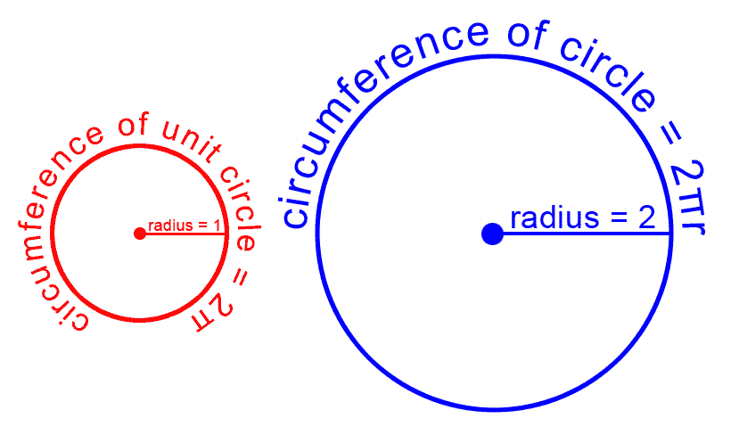
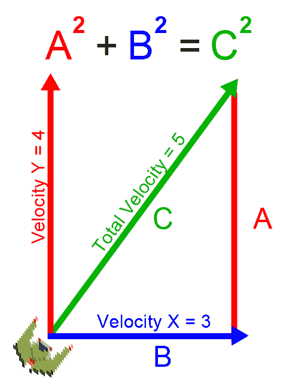
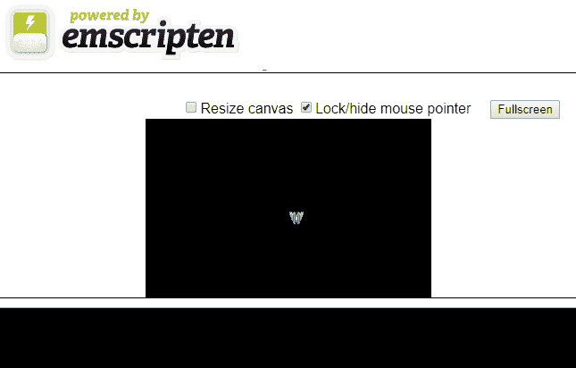
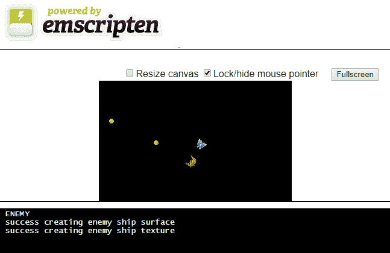

# 第六章：游戏对象和游戏循环

在本章中，我们将开始构建游戏的框架。所有游戏都有**游戏对象**和**游戏循环**。游戏循环存在于每个游戏中。一些工具，比如 Unity，尽最大努力抽象出游戏循环，以便开发人员不一定需要知道它的存在，但即使在这些情况下，它仍然存在。所有游戏都必须对操作系统或硬件的渲染能力进行一定的控制，并在游戏运行时向屏幕绘制图像。游戏的所有工作都在一个**大循环**中完成。游戏对象可以是**面向对象编程**（**OOP**）语言（如 C++）中的类的实例，也可以是过程式语言（如 C）中的松散变量或结构的集合。在本章中，我们将学习如何设计游戏循环，并从 C++编译成**WebAssembly**中学习我们游戏对象的早期版本。

您需要在构建中包含几个图像才能使此项目工作。确保您包含了项目的 GitHub 存储库中的`/Chapter06-game-object/sprites/`文件夹。如果您还没有下载 GitHub 项目，可以在这里在线获取：[`github.com/PacktPublishing/Hands-On-Game-Development-with-WebAssembly`](https://github.com/PacktPublishing/Hands-On-Game-Development-with-WebAssembly)。

在本章中，我们将涵盖以下主题：

+   游戏循环

+   对象池

+   玩家游戏对象

+   敌人游戏对象

+   抛射物

# 理解游戏循环

游戏设计中的一个关键概念是游戏循环。在任何游戏中，代码必须一遍又一遍地运行，执行一系列任务，如输入、人工智能、物理和渲染。游戏循环可能看起来像这样：

```cpp
while(loop_forever) {
    get_user_input();
    move_game_objects();
    collision_detection();
    render_game_objects();
    play_audio();
}
```

一个针对几乎任何平台的 SDL/C++游戏会有一个`while`循环，可能位于 C++代码的`main`函数中，只有当玩家退出游戏时才会退出。WebAssembly 与您的 Web 浏览器内部的 JavaScript 引擎共享运行时。JavaScript 引擎在单个线程上运行，Emscripten 使用 JavaScript 的**glue code**将您在 WebAssembly 中的 SDL 内部所做的工作渲染到 HTML 画布元素上。因此，我们需要使用一个特定于 Emscripten 的代码片段来实现我们的游戏循环：

```cpp
emscripten_set_main_loop(game_loop, 0, 0);
```

在接下来的几章中，我们将向我们的游戏中添加一些这些函数：

+   游戏对象管理

+   游戏对象之间的碰撞检测

+   粒子系统

+   使用**有限状态机**（**FSM**）的敌人飞船 AI

+   用于跟踪玩家的游戏摄像机

+   播放音频和音效

+   游戏物理

+   用户界面

这些将是从游戏循环中调用的函数。

# 编写基本游戏循环

在某种程度上，我们已经有了一个简单的游戏循环，尽管我们没有显式地创建一个名为`game_loop`的函数。我们将修改我们的代码，以便有一个更明确的游戏循环，将分离`input`、`move`和`render`函数。此时，我们的`main`函数变成了一个初始化函数，最后使用 Emscripten 来设置游戏循环。这个新应用的代码比之前的应用要大。让我们首先以高层次的方式浏览代码，介绍每个部分。然后我们将详细介绍代码的每个部分。

我们从`#include`和`#define`预处理宏开始编写代码：

```cpp
#include <SDL2/SDL.h>
#include <SDL2/SDL_image.h>
#include <emscripten.h>
#include <stdio.h>
#include <stdbool.h>
#include <math.h>

#define SPRITE_FILE "sprites/Franchise.png"
#define PI 3.14159
#define TWO_PI 6.28318
#define MAX_VELOCITY 2.0
```

在预处理宏之后，我们有一些全局时间变量：

```cpp
Uint32 last_time;
Uint32 last_frame_time;
Uint32 current_time;
```

然后我们将定义几个与 SDL 相关的全局变量：

```cpp
SDL_Window *window;
SDL_Renderer *renderer;
SDL_Rect dest = {.x = 160, .y = 100, .w = 16, .h = 16 };
SDL_Texture *sprite_texture;
SDL_Event event;
```

在我们的 SDL 全局变量之后，我们有一个键盘标志块：

```cpp
bool left_key_down = false;
bool right_key_down = false;
bool up_key_down = false;
bool down_key_down = false;
```

最后的全局变量跟踪玩家数据：

```cpp
float player_x = 160.0;
float player_y = 100.0;
float player_rotation = PI;
float player_dx = 0.0;
float player_dy = 1.0;
float player_vx = 0.0;
float player_vy = 0.0;
float delta_time = 0.0;
```

现在我们已经定义了所有的全局变量，我们需要两个函数来使玩家的飞船向左和向右旋转：

```cpp

void rotate_left() {
    player_rotation -= delta_time;
    if( player_rotation < 0.0 ) {
        player_rotation += TWO_PI;
    }
    player_dx = sin(player_rotation);
    player_dy = -cos(player_rotation);
}

void rotate_right() {
    player_rotation += delta_time;
    if( player_rotation >= TWO_PI ) {
        player_rotation -= TWO_PI;
    }
    player_dx = sin(player_rotation);
    player_dy = -cos(player_rotation);
}
```

然后我们有三个与玩家飞船相关的移动函数。我们使用它们来加速和减速我们的飞船，并限制我们飞船的速度：

```cpp

void accelerate() {
    player_vx += player_dx * delta_time;
    player_vy += player_dy * delta_time;
}

void decelerate() {
    player_vx -= (player_dx * delta_time) / 2.0;
    player_vy -= (player_dy * delta_time) / 2.0;
}

void cap_velocity() {
    float vel = sqrt( player_vx * player_vx + player_vy * player_vy );
    if( vel > MAX_VELOCITY ) {
        player_vx /= vel;
        player_vy /= vel;
        player_vx *= MAX_VELOCITY;
        player_vy *= MAX_VELOCITY;
    }
}
```

`move`函数执行游戏对象的高级移动：

```cpp

void move() {
    current_time = SDL_GetTicks();
    delta_time = (float)(current_time - last_time) / 1000.0;
    last_time = current_time;

    if( left_key_down ) {
        rotate_left();
    }
    if( right_key_down ) {
        rotate_right();
    }
    if( up_key_down ) {
        accelerate();
    }
    if( down_key_down ) {
        decelerate();
    }
    cap_velocity();

    player_x += player_vx;

    if( player_x > 320 ) {
        player_x = -16;
    }
    else if( player_x < -16 ) {
        player_x = 320;
    }

    player_y += player_vy;

    if( player_y > 200 ) {
        player_y = -16;
    }
    else if( player_y < -16 ) {
        player_y = 200;
    }
} 
```

`input`函数确定键盘输入状态并设置我们的全局键盘标志：

```cpp

void input() {
    if( SDL_PollEvent( &event ) ){
        switch( event.type ){
            case SDL_KEYDOWN:
                switch( event.key.keysym.sym ){
                    case SDLK_LEFT:
                        left_key_down = true;
                        break;
                    case SDLK_RIGHT:
                        right_key_down = true;
                        break;
                    case SDLK_UP:
                        up_key_down = true;
                        break;
                    case SDLK_DOWN:
                        down_key_down = true;
                        break;
                    default:
                        break;
                }
                break;
            case SDL_KEYUP:
                switch( event.key.keysym.sym ){
                    case SDLK_LEFT:
                        left_key_down = false;
                        break;
                    case SDLK_RIGHT:
                        right_key_down = false;
                        break;
                    case SDLK_UP:
                        up_key_down = false;
                        break;
                    case SDLK_DOWN:
                        down_key_down = false;
                        break;
                    default:
                        break;
                }
                break;

            default:
                break;
        }
    }
}
```

`render`函数将玩家的精灵绘制到画布上：

```cpp
void render() {
    SDL_RenderClear( renderer );

    dest.x = player_x;
    dest.y = player_y;

    float degrees = (player_rotation / PI) * 180.0;
    SDL_RenderCopyEx( renderer, sprite_texture,
                        NULL, &dest,
    degrees, NULL, SDL_FLIP_NONE );

    SDL_RenderPresent( renderer );
 }
```

`game_loop`函数在每一帧中运行我们所有的高级游戏对象：

```cpp
void game_loop() {
    input();
    move();
    render();
}
```

与往常一样，`main`函数执行所有初始化：

```cpp
int main() {
    char explosion_file_string[40];
    SDL_Init( SDL_INIT_VIDEO );
    SDL_CreateWindowAndRenderer( 320, 200, 0, &window, &renderer );
    SDL_SetRenderDrawColor( renderer, 0, 0, 0, 255 );
    SDL_RenderClear( renderer );
    SDL_Surface *temp_surface = IMG_Load( SPRITE_FILE );

    if( !temp_surface ) {
        printf("failed to load image: %s\n", IMG_GetError() );
        return 0;
    }

    sprite_texture = SDL_CreateTextureFromSurface( renderer, 
                                                  temp_surface );
    SDL_FreeSurface( temp_surface );
    last_frame_time = last_time = SDL_GetTicks();

    emscripten_set_main_loop(game_loop, 0, 0);
    return 1;
}
```

在前面的代码中，您可能已经注意到我们添加了大量全局变量来定义特定于玩家的值：

```cpp
float player_x = 160.0;
float player_y = 100.0;
float player_rotation = PI;
float player_dx = 0.0;
float player_dy = 1.0;
float player_vx = 0.0;
float player_vy = 0.0;
```

在“游戏对象”部分，我们将开始创建游戏对象并将这些值从全局定义移动到对象中，但是目前，将它们作为全局变量将起作用。我们正在添加移动玩家飞船的能力，这与经典街机游戏“Asteroids”类似。在我们游戏的最终版本中，我们将有两艘太空飞船进行决斗。为此，我们需要跟踪飞船的“x”和“y”坐标以及飞船的旋转；`player_dx`和`player_dy`组成了我们太空飞船的归一化方向向量。

`player_vx`和`player_vy`变量分别是玩家当前的`x`和`y`速度。

我们不再让左右键在按住时移动飞船向左或向右，而是让这些键将飞船向左或向右转动。为此，我们的输入函数将调用`rotate_left`和`rotate_right`函数：

```cpp
void rotate_left() {
    player_rotation -= delta_time;
    if( player_rotation < 0.0 ) {
        player_rotation += TWO_PI;
    }
    player_dx = sin(player_rotation);
    player_dy = -cos(player_rotation);
}

void rotate_right() {
    player_rotation += delta_time;
    if( player_rotation >= TWO_PI ) {
         player_rotation -= TWO_PI;
    }
    player_dx = sin(player_rotation);
    player_dy = -cos(player_rotation);
}
```

如果玩家正在向左转，我们会从玩家旋转中减去`delta_time`变量，这是自上一帧渲染以来的秒数。 `player_rotation`变量是玩家的弧度旋转，其中 180 度=π（3.14159…）。这意味着玩家可以通过按住左或右箭头约三秒钟来旋转 180 度。如果玩家的旋转低于 0 或玩家的旋转超过 2π（360 度），我们还必须纠正我们的旋转。如果您不熟悉弧度，它是一种替代的角度测量系统，其中一个圆中有 360 度。使用弧度，您可以考虑您需要绕单位圆的周长走多远才能到达该角度。半径为 1 的圆称为**单位圆**。

单位圆在左侧：



单位圆和半径为 2 的圆

圆的直径公式是 2πr（在我们的代码中是`2 * PI * radius`）。因此，弧度中的 2π等同于 360 度。大多数游戏引擎和数学库在旋转精灵时使用弧度而不是度，但由于某种原因 SDL 在旋转精灵时使用度，因此我们需要在渲染游戏对象时将我们的弧度旋转回度（呸！）。

只是为了确保每个人都在跟着我，我们的代码中，`PI`宏保存了一个近似值，即定义为圆的直径与其周长的比值的π。 π的典型近似值为 3.14，尽管在我们的代码中，我们将π近似为 3.14159。

如果玩家按下键盘上的上下键，我们还需要加速或减速飞船。为此，我们将创建`accelerate`和`decelerate`函数，当玩家按住上下键时调用这些函数：

```cpp
void accelerate() {
    player_vx += player_dx * delta_time;
    player_vy += player_dy * delta_time;
}

void decelerate() {
    player_vx -= (player_dx * delta_time) / 2.0;
    player_vy -= (player_dy * delta_time) / 2.0;
}
```

这两个函数都使用了使用我们的旋转函数中的`sin`和`-cos`计算出的`player_dx`和`player_dy`变量，并使用这些值来添加到存储在`player_vx`和`player_vy`变量中的玩家的*x*和*y*速度。我们将该值乘以`delta_time`，这将使我们的加速度设置为每秒 1 像素。我们的减速函数将该值除以 2，这将使我们的减速率设置为每秒 0.5 像素。

在定义了“加速”和“减速”函数之后，我们需要创建一个函数，将我们的飞船的`x`和`y`速度限制为每秒 2.0 像素：

```cpp
void cap_velocity() {
    float vel = sqrt( player_vx * player_vx + player_vy * player_vy );

    if( vel > MAX_VELOCITY ) {
        player_vx /= vel;
        player_vy /= vel;
        player_vx *= MAX_VELOCITY;
        player_vy *= MAX_VELOCITY;
     }
}
```

这不是定义这个函数的最有效方式，但这是最容易理解的方式。第一行确定了我们速度向量的大小。如果你不知道这意味着什么，让我更好地解释一下。我们有一个沿着*x*轴的速度。我们也有一个沿着*y*轴的速度。我们想要限制总速度。如果我们分别限制`x`和`y`的速度，我们将能够通过对角线行进更快。为了计算我们的总速度，我们需要使用毕达哥拉斯定理（你还记得高中的三角学吗？）。如果你不记得了，当你有一个直角三角形时，要计算它的斜边，你需要取另外两条边的平方和的平方根（记得`A² + B² = C²`吗？）：

[使用毕达哥拉斯定理来确定使用 x 和 y 速度的速度大小]

因此，为了计算我们的总速度，我们需要对`x`速度进行平方，对`y`速度进行平方，然后将它们加在一起，然后取平方根。在这一点上，我们将我们的速度与`MAX_VELOCITY`值进行比较，我们已经将其定义为`2.0`。如果当前速度大于这个最大速度，我们需要调整我们的`x`和`y`速度，使其达到`2`的值。我们通过将`x`和`y`速度都除以总速度，然后乘以`MAX_VELOCITY`来实现这一点。

最终我们需要编写一个`move`函数，它将移动所有游戏对象，但目前我们只会移动玩家的太空飞船：

```cpp
void move() {
    current_time = SDL_GetTicks();
    delta_time = (float)(current_time - last_time) / 1000.0;
    last_time = current_time;

    if( left_key_down ) {
        rotate_left();
    }

    if( right_key_down ) {
        rotate_right();
    }

    if( up_key_down ) {
        accelerate();
    }

    if( down_key_down ) {
        decelerate();
    }

    cap_velocity();
    player_x += player_vx;

    if( player_x > 320 ) {
         player_x = -16;
     }
    else if( player_x < -16 ) {
        player_x = 320;
    }
    player_y += player_vy;

    if( player_y > 200 ) {
        player_y = -16;
    }
    else if( player_y < -16 ) {
        player_y = 200;
    }
}
```

我们需要做的第一件事是获取这一帧的当前时间，然后将其与我们之前的帧时间结合起来计算`delta_time`。`delta_time`变量是自上一帧时间以来的时间量（以秒为单位）。我们需要将许多移动和动画与这个值联系起来，以获得一个与任何给定计算机的帧速率无关的一致的游戏速度。之后，我们需要根据我们在`input`函数中设置的标志来旋转、加速或减速我们的太空飞船。然后我们限制我们的速度，并使用`x`和`y`值来修改玩家太空飞船的*x*和*y*坐标。

在`move`函数中，我们使用了一系列标志，告诉我们当前是否按住了键盘上的特定键。为了设置这些标志，我们需要一个`input`函数，它使用`SDL_PollEvent`来查找键盘事件，并相应地设置标志：

```cpp

void input() {
    if( SDL_PollEvent( &event ) ){
        switch( event.type ){
            case SDL_KEYDOWN:
                switch( event.key.keysym.sym ){
                    case SDLK_LEFT:
                        left_key_down = true;
                        break;
                    case SDLK_RIGHT:
                        right_key_down = true;
                        break;
                    case SDLK_UP:
                        up_key_down = true;
                        break;
                    case SDLK_DOWN:
                        down_key_down = true;
                        break;
                    default:
                        break;
                }
                break;
            case SDL_KEYUP:
                switch( event.key.keysym.sym ){
                    case SDLK_LEFT:
                        left_key_down = false;
                        break;
                    case SDLK_RIGHT:
                        right_key_down = false;
                        break;
                    case SDLK_UP:
                        up_key_down = false;
                        break;
                    case SDLK_DOWN:
                        down_key_down = false;
                        break;
                    default:
                        break;
                }
                break;
            default:
                break;
        }
    }
}
```

这个函数包括一些`switch`语句，用于查找箭头键的按下和释放。如果按下箭头键之一，我们将相应的标志设置为`true`；如果释放了一个键，我们将该标志设置为`false`。

接下来，我们定义`render`函数。这个函数目前渲染了我们的太空飞船精灵，并最终会渲染所有精灵到 HTML 画布上：

```cpp
void render() {
    SDL_RenderClear( renderer );
    dest.x = player_x;
    dest.y = player_y;
    float degrees = (player_rotation / PI) * 180.0;
    SDL_RenderCopyEx( renderer, sprite_texture,
                        NULL, &dest,
                        degrees, NULL, SDL_FLIP_NONE );
    SDL_RenderPresent( renderer );
}
```

这个函数清除 HTML 画布，将目的地`x`和`y`值设置为`player_x`和`player_y`，计算玩家的旋转角度，然后将该精灵渲染到画布上。我们用一个调用`SDL_RenderCopyEx`替换了之前的`SDL_RenderCopy`调用。这个新函数允许我们传入一个值，旋转我们的太空飞船的精灵。

在我们定义了`render`函数之后，我们有了新的`game_loop`函数：

```cpp
void game_loop() {
    input();
    move();
    render();
}
```

这个函数将被`emscripten_set_main_loop`从我们的`main`函数中调用。这个函数在渲染的每一帧都会运行，并负责管理游戏中发生的所有活动。它目前调用我们在游戏代码中之前定义的`input`、`move`和`render`函数，将来还会调用我们的 AI 代码、音效、物理代码等。

# 编译 gameloop.html

现在我们已经编写了我们的代码，可以继续编译我们的游戏循环应用程序。在运行此命令之前，我想重申，您需要从 GitHub（[`github.com/PacktPublishing/Hands-On-Game-Development-with-WebAssembly`](https://github.com/PacktPublishing/Hands-On-Game-Development-with-WebAssembly)）下载项目，因为您需要在`/Chapter06-game-loop/sprites`文件夹中找到 PNG 文件才能构建此项目。

一旦您正确设置了文件夹，使用以下命令编译应用程序：

```cpp
emcc game_loop.c -o gameloop.html  --preload-file sprites -s NO_EXIT_RUNTIME=1 -s USE_SDL_IMAGE=2 -s SDL2_IMAGE_FORMATS=["png"] -s EXTRA_EXPORTED_RUNTIME_METHODS="['cwrap', 'ccall']" -s USE_SDL=2
```

使用 Web 服务器提供您编译的目录，或者使用 emrun 构建和运行它，加载到 Web 浏览器中时应该是这样的：



游戏循环的屏幕截图

重要的是要记住，必须使用 WebAssembly 应用程序使用 Web 服务器或`emrun`运行。如果您想使用`emrun`运行 WebAssembly 应用程序，必须使用`--emrun`标志进行编译。Web 浏览器需要一个 Web 服务器来流式传输 WebAssembly 模块。如果您尝试直接从硬盘驱动器在浏览器中打开使用 WebAssembly 的 HTML 页面，那么 WebAssembly 模块将无法加载。

应用程序编译完成后，您应该能够使用箭头键在画布上移动太空飞船。现在我们有了一个基本的游戏循环，在下一节中，我们将向我们的应用程序添加一些游戏对象，使其更像一个游戏。

# 游戏对象

到目前为止，我们的方法完全是过程化的，并且编码方式可以用 C 而不是 C++编写。开发人员长期以来一直在用 C 甚至汇编语言编写游戏，因此从代码管理的角度来看，面向对象的游戏设计并不是绝对必要的，但是从代码管理的角度来看，面向对象编程是设计和编写游戏的一种很好的方式。游戏对象可以帮助我们通过对象池管理我们分配的内存。此时，开始将程序分解成多个文件也是有意义的。我的方法是有一个单独的`.hpp`文件来定义所有的游戏对象，以及一个`.cpp`文件来定义每个对象。

# 玩家的太空飞船游戏对象

到目前为止，我们一直在全局变量中保存跟踪玩家飞船的所有值。从组织的角度来看，这并不理想。我们将创建的第一个游戏对象将是玩家的飞船对象。我们将从一个基本类开始，稍后再向我们的代码中添加更多面向对象的特性。

这是我们新的头文件`game.hpp`的代码：

```cpp
#ifndef __GAME_H__
#define __GAME_H__#include <SDL2/SDL.h>
#include <SDL2/SDL_image.h>
#include <emscripten.h>
#include <stdio.h>
#include <stdbool.h>
#include <math.h>
#include <string>
#include <vector>

#define SPRITE_FILE "sprites/Franchise.png"
#define MAX_VELOCITY 2.0
#define PI 3.14159
#define TWO_PI 6.28318

extern Uint32 last_time;
extern Uint32 last_frame_time;
extern Uint32 current_time;
extern SDL_Window *window;
extern SDL_Renderer *renderer;
extern SDL_Rect dest;
extern SDL_Texture *sprite_texture;
extern SDL_Event event;
extern bool left_key_down;
extern bool right_key_down;
extern bool up_key_down;
extern bool down_key_down;
extern bool space_key_down;
extern float delta_time;
extern int diff_time;

class PlayerShip {
    public:
        float m_X;
        float m_Y;
        float m_Rotation;
        float m_DX;
        float m_DY;
        float m_VX;
        float m_VY;

        PlayerShip();
        void RotateLeft();
        void RotateRight();
        void Accelerate();
        void Decelerate();
        void CapVelocity();
        void Move();
        void Render();
};

extern PlayerShip player;
#endif
```

我们所有的 CPP 文件都将包括这个`game.hpp`头文件。这个文件的前几行是为了确保我们不会多次包含这个文件。然后我们定义了我们在旧的 C 文件中定义的所有全局变量：

```cpp
extern Uint32 last_time;
extern Uint32 last_frame_time;
extern Uint32 current_time;
extern SDL_Window *window;
extern SDL_Renderer *renderer;
extern SDL_Rect dest;
extern SDL_Texture *sprite_texture;
extern SDL_Event event;
extern bool left_key_down;
extern bool right_key_down;
extern bool up_key_down;
extern bool down_key_down;
extern float delta_time;
```

在头文件中，我们不会在堆上分配空间。在全局变量定义之前使用`extern`关键字告诉编译器我们在一个`.cpp`文件中声明了全局变量。现在，我们仍然有很多全局变量。随着我们在本章对代码进行修改，我们将减少这些全局变量的数量。

如果这是生产代码，将所有这些值移到类中是有意义的，但是，目前，我们只创建了一个`PlayerShip`对象。我们还为`PlayerShip`定义了我们的类定义。开发人员通常在头文件中创建类定义。

在定义了所有全局变量之后，我们将需要我们的类定义。

这是我们的`PlayerShip`类的定义：

```cpp
class PlayerShip {
    public:
        float m_X;
        float m_Y;
        float m_Rotation;
        float m_DX;
        float m_DY;
        float m_VX;
        float m_VY;

        PlayerShip();
        void RotateLeft();
        void RotateRight();
        void Accelerate();
        void Decelerate();
        void CapVelocity();
        void Move();
        void Render();
 };

extern PlayerShip player;
```

在本书中，我们将声明所有的属性为`public`。这意味着我们的代码可以从任何地方访问它们，而不仅仅是从这个函数内部。如果你正在与多个开发人员一起开发项目，这通常不被认为是一个好的做法。如果你不希望另一个开发人员直接修改一些只有类中的函数才能修改的特定属性，比如`m_DX`和`m_DY`，那么阻止其他类能够直接修改一些属性是一个好主意。然而，出于演示目的，将我们类中的所有内容定义为`public`将简化我们的设计。

在定义了我们的属性之后，我们有一系列函数，一旦定义，就会与这个类相关联。第一个函数`PlayerShip()`与我们的类同名，这使它成为构造函数，也就是说，当我们的应用程序创建`PlayerShip`类型的对象时，默认情况下会调用该函数。如果我们希望，我们可以定义一个析构函数，当对象被销毁时运行，通过将其命名为`~PlayerShip()`。我们目前不需要该对象的析构函数，因此我们不会在这里定义它，这意味着我们将依赖 C++为这个类创建一个*默认析构函数*。

我们在这个类中定义的所有其他函数对应于我们在游戏的先前 C 版本中创建的函数。将所有这些函数移动到一个类中可以更好地组织我们的代码。请注意，在我们的类定义之后，我们创建了另一个全局变量，一个名为`player`的`PlayerShip`。编译器在包含我们的`game.hpp`文件的所有`.cpp`文件中共享这个玩家对象。

# 对象池

我们已经定义了我们的第一个游戏对象，代表了我们玩家的太空飞船，但我们所能做的就是在游戏屏幕上飞行。我们需要允许玩家发射抛射物。如果每次玩家发射抛射物时都创建一个新的抛射物对象，我们很快就会填满 WASM 模块的内存。我们需要做的是创建所谓的**对象池**。对象池用于创建具有固定寿命的对象。我们的抛射物只需要存活足够长的时间，要么击中目标，要么在消失之前行进一定距离。如果我们创建一定数量的抛射物，略多于我们一次在屏幕上需要的数量，我们可以将这些对象保留在池中，处于活动或非活动状态。当我们需要发射新的抛射物时，我们扫描我们的对象池，找到一个非活动的对象，然后激活它并将其放置在发射点。这样，我们就不会不断地分配和释放内存来创建我们的抛射物。

让我们回到我们的`game.hpp`文件，在`#endif`宏之前添加一些类定义。

```cpp
class Projectile {
    public:
        const char* c_SpriteFile = "sprites/Projectile.png";
        const int c_Width = 8;
        const int c_Height = 8;
        SDL_Texture *m_SpriteTexture;
        bool m_Active;
        const float c_Velocity = 6.0;
        const float c_AliveTime = 2000;
        float m_TTL;
        float m_X;
        float m_Y;
        float m_VX;
        float m_VY;

        Projectile();
        void Move();
        void Render();
        void Launch(float x, float y, float dx, float dy);
};

class ProjectilePool {
    public:
        std::vector<Projectile*> m_ProjectileList;
        ProjectilePool();
        ~ProjectilePool();
        void MoveProjectiles();
        void RenderProjectiles();
        Projectile* GetFreeProjectile();
};

extern ProjectilePool* projectile_pool; 
```

因此，我们已经在`game.hpp`文件中定义了所有的类。现在，我们有三个类：`PlayerShip`，`Projectile`和`ProjectilePool`。

`PlayerShip`类之前就存在，但我们正在为该类添加一些额外的功能，以允许我们发射抛射物。为了允许这种新功能，我们正在向我们的类定义中添加一些新的公共属性：

```cpp
public:
    const char* c_SpriteFile = "sprites/Franchise.png";
    const Uint32 c_MinLaunchTime = 300;
    const int c_Width = 16;
    const int c_Height = 16;
    Uint32 m_LastLaunchTime;
    SDL_Texture *m_SpriteTexture;
```

我们将一些在`#define`宏中的值直接移到了类中。`c_SpriteFile`常量是我们将加载以渲染玩家太空飞船精灵的 PNG 文件的名称。`c_MinLaunchTime`常量是两次发射抛射物之间的最小时间间隔（以毫秒为单位）。我们还用`c_Width`和`c_Height`常量定义了精灵的宽度和高度。这样，我们可以为不同的对象类型设置不同的值。`m_LastLaunchTime`属性跟踪了最近的抛射物发射时间（以毫秒为单位）。精灵纹理，之前是一个全局变量，将移动到玩家飞船类的属性中。

在对`PlayerShip`类定义进行修改后，我们必须为两个新类添加类定义。这两个类中的第一个是`Projectile`类：

```cpp
class Projectile {
    public:
        const char* c_SpriteFile = "sprites/Projectile.png";
        const int c_Width = 8;
        const int c_Height = 8;
        const float c_Velocity = 6.0;
        const float c_AliveTime = 2000;

        SDL_Texture *m_SpriteTexture;
        bool m_Active;
        float m_TTL;
        float m_X;
        float m_Y;
        float m_VX;
        float m_VY;

        Projectile();
        void Move();
        void Render();
        void Launch(float x, float y, float dx, float dy);
};
```

这个类代表了玩家将射出的 projectile 游戏对象，以及后来的敌人飞船。我们从几个常量开始，这些常量定义了我们在虚拟文件系统中放置精灵的位置，以及宽度和高度：

```cpp
class Projectile {
    public:
        const char* c_SpriteFile = "sprites/Projectile.png";
        const int c_Width = 8;
        const int c_Height = 8;
```

接下来的属性是`m_SpriteTexture`，它是一个指向用于渲染我们的 projectiles 的 SDL 纹理的指针。我们需要一个变量来告诉我们的对象池这个游戏对象是活动的。我们称这个属性为`m_Active`。接下来，我们有一个常量，它定义了我们的 projectile 每秒移动的像素数，称为`c_Velocity`，以及一个常量，表示 projectile 在自毁之前会在毫秒内保持活动的时间，称为`c_AliveTime`。

`m_TTL`变量是一个**生存时间**变量，跟踪着直到这个 projectile 将其`m_Active`变量更改为`false`并将自己回收到**projectile 池**中还有多少毫秒。`m_X`，`m_Y`，`m_VX`和`m_VY`变量用于跟踪我们的 projectile 的`x`和`y`位置以及`x`和`y`速度。

然后我们为我们的 projectile 类声明了四个函数：

```cpp
Projectile();
void Move();
void Render();
void Launch(float x, float y, float dx, float dy);
```

`Projectile`函数是我们的类构造函数。如果我们的 projectile 当前处于活动状态，`Move`和`Render`将在每帧调用一次。`Move`函数将管理活动 projectile 的移动，`Render`将管理将 projectile 精灵绘制到我们的 HTML 画布元素上。`Launch`函数将从我们的`PlayerShip`类中调用，使我们的飞船朝着飞船的方向发射 projectile。

我们必须添加到我们的`game.hpp`文件中的最终类定义是`ProjectilePool`类：

```cpp
class ProjectilePool {
    public:
        std::vector<Projectile*> m_ProjectileList;
        ProjectilePool();
        ~ProjectilePool();
        void MoveProjectiles();
        void RenderProjectiles();
        Projectile* GetFreeProjectile();
};
```

这个类管理一个包含在向量属性`m_ProjectileList`中的 10 个 projectiles 的**池**。这个类的函数包括构造函数和析构函数，`MoveProjectiles`，`RenderProjectils`和`GetFreeProjectile`。

`MoveProjectiles()`函数循环遍历我们的 projectile 列表，调用任何活动 projectile 上的`move`函数。`RenderProjectiles()`函数循环遍历我们的 projectile 列表，并在画布上渲染任何活动的 projectile，`GetFreeProjectile`返回我们的池中第一个非活动的 projectile。

# 池化玩家的 projectiles

现在我们已经查看了`Projectile`和`ProjectilePool`类的类定义，我们需要创建一个`projectile.cpp`文件和一个`projectile_pool.cpp`文件来存储这些类的函数代码。因为这是在第六章，*游戏对象和游戏循环*，我建议创建一个名为`Chapter06`的新文件夹来保存这些文件。这段代码将完成我们的 projectiles 的池化工作，在我们需要时请求一个非活动的 projectile，并移动和渲染我们的活动 projectiles。首先，让我们看看我们在`projectile.cpp`中的代码：

```cpp
#include "game.hpp"

Projectile::Projectile() {
    m_Active = false;
    m_X = 0.0;
    m_Y = 0.0;
    m_VX = 0.0;
    m_VY = 0.0;

    SDL_Surface *temp_surface = IMG_Load( c_SpriteFile );

    if( !temp_surface ) {
        printf("failed to load image: %s\n", IMG_GetError() );
        return;
    }

    m_SpriteTexture = SDL_CreateTextureFromSurface( renderer, 
    temp_surface );

    if( !m_SpriteTexture ) {
        printf("failed to create texture: %s\n", IMG_GetError() );
        return;
    }

    SDL_FreeSurface( temp_surface );
}

void Projectile::Move() {
    m_X += m_VX;
    m_Y += m_VY;
    m_TTL -= diff_time;

    if( m_TTL <= 0 ) {
        m_Active = false;
        m_TTL = 0;
    }
}

void Projectile::Render() {
    dest.x = m_X;
    dest.y = m_Y;
    dest.w = c_Width;
    dest.h = c_Height;

    int return_val = SDL_RenderCopy( renderer, m_SpriteTexture,
                                     NULL, &dest );
    if( return_val != 0 ) {
        printf("SDL_Init failed: %s\n", SDL_GetError());
    }
}

void Projectile::Launch(float x, float y, float dx, float dy) {
    m_X = x;
    m_Y = y;
    m_VX = c_Velocity * dx;
    m_VY = c_Velocity * dy;
    m_TTL = c_AliveTime;
    m_Active = true;
}
```

这是处理移动、渲染和发射单个 projectile 的代码。这里声明的第一个函数是构造函数：

```cpp
Projectile::Projectile() {
    m_Active = false;
    m_X = 0.0;
    m_Y = 0.0;
    m_VX = 0.0;
    m_VY = 0.0;

    SDL_Surface *temp_surface = IMG_Load( c_SpriteFile );

    if( !temp_surface ) {
        printf("failed to load image: %s\n", IMG_GetError() );
        return;
    }

    m_SpriteTexture = SDL_CreateTextureFromSurface( renderer, 
    temp_surface );

    if( !m_SpriteTexture ) {
        printf("failed to create texture: %s\n", IMG_GetError() );
        return;
    }
    SDL_FreeSurface( temp_surface );
}
```

这个构造函数的主要任务是将 projectile 设置为非活动状态，并创建一个 SDL 纹理，我们稍后将用它来渲染我们的精灵到画布元素上。在定义了构造函数之后，我们定义了我们的`Move`函数：

```cpp
void Projectile::Move() {
    m_X += m_VX;
    m_Y += m_VY;
    m_TTL -= diff_time;
    if( m_TTL <= 0 ) {
        m_Active = false;
        m_TTL = 0;
    }
}
```

这个函数根据速度改变我们的 projectile 的*x*和*y*位置，并减少我们的 projectile 的生存时间，如果它的生存时间小于或等于零，就将其设置为非活动状态并回收到 projectile 池中。我们定义的下一个函数是我们的`Render`函数：

```cpp
void Projectile::Render() {
    dest.x = m_X;
    dest.y = m_Y;
    dest.w = c_Width;
    dest.h = c_Height;

    int return_val = SDL_RenderCopy( renderer, m_SpriteTexture,
                                    NULL, &dest );

    if( return_val != 0 ) {
        printf("SDL_Init failed: %s\n", SDL_GetError());
    }
}
```

这段代码与我们用来渲染飞船的代码类似，所以它应该对你来说看起来很熟悉。我们最后的 projectile 函数是`Launch`函数：

```cpp
void Projectile::Launch(float x, float y, float dx, float dy) {
    m_X = x;
    m_Y = y;
    m_VX = c_Velocity * dx;
    m_VY = c_Velocity * dy;
    m_TTL = c_AliveTime;
    m_Active = true;
}
```

这个函数是在玩家在键盘上按下空格键时从`PlayerShip`类中调用的。`PlayerShip`对象将在`dx`和`dy`参数中传入玩家飞船的*x*和*y*坐标，以及飞船面对的方向。这些参数用于设置抛射物的*x*和*y*坐标以及抛射物的*x*和*y*速度。游戏将生存时间设置为默认的存活时间，然后将对象设置为活动状态。

现在我们已经完全定义了我们的`Projectile`类，让我们设置一个管理这些抛射物的`ProjectilePool`类。以下代码将在我们的`projectile_pool.cpp`文件中：

```cpp
#include "game.hpp"

ProjectilePool::ProjectilePool() {
    for( int i = 0; i < 10; i++ ) {
        m_ProjectileList.push_back( new Projectile() );
    }
}

ProjectilePool::~ProjectilePool() {
    m_ProjectileList.clear();
}

void ProjectilePool::MoveProjectiles() {
    Projectile* projectile;
    std::vector<Projectile*>::iterator it;

    for( it = m_ProjectileList.begin(); it != m_ProjectileList.end(); it++ ) {
        projectile = *it;
        if( projectile->m_Active ) {
            projectile->Move();
        }
    }
}

void ProjectilePool::RenderProjectiles() {
    Projectile* projectile;
    std::vector<Projectile*>::iterator it;

    for( it = m_ProjectileList.begin(); it != m_ProjectileList.end(); it++ ) {
        projectile = *it;
        if( projectile->m_Active ) {
            projectile->Render();
         }
    }
}

Projectile* ProjectilePool::GetFreeProjectile() {
    Projectile* projectile;
    std::vector<Projectile*>::iterator it;

    for( it = m_ProjectileList.begin(); it != m_ProjectileList.end(); it++ ) {
        projectile = *it;
        if( projectile->m_Active == false ) {
            return projectile;
        }
    }
    return NULL;
}
```

前两个函数是构造函数和析构函数。这些函数在我们的列表内创建和销毁抛射物。接下来的函数是`MoveProjectiles`函数，它循环遍历我们的`m_ProjectileList`寻找活动的抛射物并移动它们。之后，我们有一个`RenderProjectiles`函数，它与我们的`MoveProjectiles`函数非常相似。这个函数循环遍历我们的列表，调用所有活动抛射物的`Render`函数。最后一个函数是`GetFreeProjectile`函数，它通过`m_ProjectileList`寻找第一个不活动的抛射物以返回它。每当我们想要发射一个抛射物时，我们需要调用这个函数来找到一个不活动的抛射物。

# 创建一个敌人

所以，现在我们有了一个射击的玩家飞船，我们可以开始添加一个敌人飞船。它将类似于`PlayerShip`类。稍后，我们将进入类继承，这样我们就不会得到一个复制并粘贴的相同代码版本，但现在我们将在我们的`game.hpp`文件中添加一个几乎与我们的`PlayerShip`类相同的新类定义：

```cpp
enum FSM_STUB {
    SHOOT = 0,
    TURN_LEFT = 1,
    TURN_RIGHT = 2,
    ACCELERATE = 3,
    DECELERATE = 4
};

class EnemyShip {
    public:
        const char* c_SpriteFile = "sprites/BirdOfAnger.png";
        const Uint32 c_MinLaunchTime = 300;
        const int c_Width = 16;
        const int c_Height = 16;
        const int c_AIStateTime = 2000;

        Uint32 m_LastLaunchTime;
        SDL_Texture *m_SpriteTexture;

        FSM_STUB m_AIState;
        int m_AIStateTTL;

        float m_X;
        float m_Y;
        float m_Rotation;
        float m_DX;
        float m_DY;
        float m_VX;
        float m_VY;

        EnemyShip();
        void RotateLeft();
        void RotateRight();
        void Accelerate();
        void Decelerate();
        void CapVelocity();
        void Move();
        void Render();
        void AIStub();
};
```

您会注意到在`EnemyShip`类之前，我们定义了一个`FSM_STUB`枚举。枚举就像是您可以在 C 或 C++代码中定义的新数据类型。我们将在另一章中讨论**人工智能**和**有限状态机**，但现在我们仍然希望我们的敌人飞船做一些事情，即使那些事情并不是很聪明。我们创建了一个`FSM_STUB`枚举来定义我们的敌人飞船目前可以做的事情。我们还在我们的`EnemyShip`类中创建了一个`AIStub`，它将作为未来 AI 逻辑的替身。整数属性`m_AIStateTTL`是一个倒计时计时器，用于 AI 状态的变化。还有一个名为`c_AIStateTime`的新常量，它的值为`2000`。这是我们的 AI 状态在随机更改之前将持续的毫秒数。

我们将创建一个`enemy_ship.cpp`文件，并向其中添加九个函数。第一个函数是我们的构造函数，在它之前是我们的`game.hpp`文件的`#include`：

```cpp
#include "game.hpp"
EnemyShip::EnemyShip() {
 m_X = 60.0;
    m_Y = 50.0;
    m_Rotation = PI;
    m_DX = 0.0;
    m_DY = 1.0;
    m_VX = 0.0;
    m_VY = 0.0;
    m_LastLaunchTime = current_time;

    SDL_Surface *temp_surface = IMG_Load( c_SpriteFile );

    if( !temp_surface ) {
        printf("failed to load image: %s\n", IMG_GetError() );
        return;
    }
    else {
        printf("success creating enemy ship surface\n");
    }
    m_SpriteTexture = SDL_CreateTextureFromSurface( renderer, 
    temp_surface );

    if( !m_SpriteTexture ) {
        printf("failed to create texture: %s\n", IMG_GetError() );
        return;
    }
    else {
        printf("success creating enemy ship texture\n");
    }
    SDL_FreeSurface( temp_surface );
}
```

之后，我们有`RotateLeft`和`RotateRight`函数，用于转动太空飞船：

```cpp
void EnemyShip::RotateLeft() {
    m_Rotation -= delta_time;

    if( m_Rotation < 0.0 ) {
        m_Rotation += TWO_PI;
    }
    m_DX = sin(m_Rotation);
    m_DY = -cos(m_Rotation);
}
void EnemyShip::RotateRight() {
    m_Rotation += delta_time;

    if( m_Rotation >= TWO_PI ) {
        m_Rotation -= TWO_PI;
    }
    m_DX = sin(m_Rotation);
    m_DY = -cos(m_Rotation);
}
```

函数`Accelerate`、`Decelerate`和`CapVelocity`都用于修改敌舰的速度。

```cpp
void EnemyShip::Accelerate() {
    m_VX += m_DX * delta_time;
    m_VY += m_DY * delta_time;
}

void EnemyShip::Decelerate() {
    m_VX -= (m_DX * delta_time) / 2.0;
    m_VY -= (m_DY * delta_time) / 2.0;
}

void EnemyShip::CapVelocity() {
    float vel = sqrt( m_VX * m_VX + m_VY * m_VY );

    if( vel > MAX_VELOCITY ) {
        m_VX /= vel;
        m_VY /= vel;

        m_VX *= MAX_VELOCITY;
        m_VY *= MAX_VELOCITY;
    }
}
```

接下来我们添加到文件中的是`Render`函数：

```cpp
void EnemyShip::Render() {
    dest.x = (int)m_X;
    dest.y = (int)m_Y;
    dest.w = c_Width;
    dest.h = c_Height;

    float degrees = (m_Rotation / PI) * 180.0;

    int return_code = SDL_RenderCopyEx( renderer, m_SpriteTexture,
                                        NULL, &dest,
                                        degrees, NULL, SDL_FLIP_NONE );

 if( return_code != 0 ) {
 printf("failed to render image: %s\n", IMG_GetError() );
 }
}

```

最后，我们添加了`Move`和`AIStub`函数：

```cpp
void EnemyShip::Move() {
     AIStub();

 if( m_AIState == TURN_LEFT ) {
     RotateLeft();
 }

 if( m_AIState == TURN_RIGHT ) {
     RotateRight();
 }

 if( m_AIState == ACCELERATE ) {
     Accelerate();
 }

 if( m_AIState == DECELERATE ) {
     Decelerate();
 }

 CapVelocity();
 m_X += m_VX;

 if( m_X > 320 ) {
     m_X = -16;
 }
 else if( m_X < -16 ) {
     m_X = 320;
 }

 m_Y += m_VY;

 if( m_Y > 200 ) {
     m_Y = -16;
 }
 else if( m_Y < -16 ) {
     m_Y = 200;
 }

 if( m_AIState == SHOOT ) {
     Projectile* projectile;
     if( current_time - m_LastLaunchTime >= c_MinLaunchTime ) {
         m_LastLaunchTime = current_time;
         projectile = projectile_pool->GetFreeProjectile();

         if( projectile != NULL ) {
             projectile->Launch( m_X, m_Y, m_DX, m_DY );
             }
         }
     }
}

void EnemyShip::AIStub() {
     m_AIStateTTL -= diff_time;
     if( m_AIStateTTL <= 0 ) {
         // for now get a random AI state.
         m_AIState = (FSM_STUB)(rand() % 5);
         m_AIStateTTL = c_AIStateTime;
     }
}
```

这些函数都与我们的`player_ship.cpp`文件中定义的函数相同，除了`Move`函数。我们添加了一个新函数，`AIStub`。以下是`AIStub`函数中的代码：

```cpp
void EnemyShip::AIStub() {
    m_AIStateTTL -= diff_time;

    if( m_AIStateTTL <= 0 ) {
        // for now get a random AI state.
        m_AIState = (FSM_STUB)(rand() % 5);
        m_AIStateTTL = c_AIStateTime;
    }
}
```

这个函数是暂时的。我们最终将为我们的敌人飞船定义一个真正的 AI。现在，这个函数使用`m_AIStateTTL`来倒计时固定数量的毫秒，直到达到或低于`0`。在这一点上，它会基于我们之前定义的枚举`FSM_STUB`中的一个值随机设置一个新的 AI 状态。我们还对我们为玩家飞船创建的`Move()`函数进行了一些修改：

```cpp
void EnemyShip::Move() {
    AIStub();

    if( m_AIState == TURN_LEFT ) {
        RotateLeft();
    }
    if( m_AIState == TURN_RIGHT ) {
        RotateRight();
    }
    if( m_AIState == ACCELERATE ) {
        Accelerate();
    }
    if( m_AIState == DECELERATE ) {
        Decelerate();
    }
    CapVelocity();
     m_X += m_VX;

    if( m_X > 320 ) {
        m_X = -16;
    }
    else if( m_X < -16 ) {
        m_X = 320;
    }
    m_Y += m_VY;

    if( m_Y > 200 ) {
        m_Y = -16;
    }
    else if( m_Y < -16 ) {
        m_Y = 200;
    }

    if( m_AIState == SHOOT ) {
        Projectile* projectile;
        if( current_time - m_LastLaunchTime >= c_MinLaunchTime ) {
            m_LastLaunchTime = current_time;
            projectile = projectile_pool->GetFreeProjectile();

            if( projectile != NULL ) {
                projectile->Launch( m_X, m_Y, m_DX, m_DY );
            }
        }
    }
}
```

我已经从我们的`PlayerShip::Move`函数中取出了代码并对其进行了一些修改。在这个新函数的开头，我们添加了对`AIStub`函数的调用。这个函数是我们未来 AI 的替身。与我们为玩家飞船所做的一样，敌人飞船不会查看我们的键盘输入，而是会查看 AI 状态并选择左转、右转、加速、减速或射击。这不是真正的 AI，只是飞船做一些随机的事情，但它让我们能够想象一下当飞船具有真正的 AI 时它会是什么样子，并且它将允许我们稍后添加更多功能，比如碰撞检测。

# 编译 game_objects.html

现在我们已经构建了所有这些游戏对象，我们不再将所有内容放在一个文件中。我们需要包含几个 CPP 文件，并将它们全部编译成一个名为`game_objects.html`的输出文件。因为我们已经从 C 世界转移到了 C++世界，所以我们将使用 em++来指示我们正在编译的文件是 C++文件而不是 C 文件。这并不是严格必要的，因为当 Emscripten 接收到扩展名为`.cpp`的文件作为输入时，它会自动判断我们正在使用 C++进行编译。当我们传入`-std=c++17`标志时，我们还明确告诉编译器我们正在使用的 C++版本。请使用以下 em++命令编译`game_objects.html`文件：

```cpp
em++ main.cpp enemy_ship.cpp player_ship.cpp projectile.cpp projectile_pool.cpp -std=c++17 --preload-file sprites -s USE_WEBGL2=1 -s USE_SDL=2 -s USE_SDL_IMAGE=2 -s SDL2_IMAGE_FORMATS=["png"] -o game_objects.html
```

现在我们已经编译了`game_objects.html`文件，请使用 Web 服务器来提供文件并在浏览器中打开它，它应该看起来像这样：



game_objects.html 的屏幕截图

不要忘记，您必须使用 Web 服务器或`emrun`来运行 WebAssembly 应用程序。如果您想使用`emrun`运行 WebAssembly 应用程序，您必须使用`--emrun`标志进行编译。Web 浏览器需要 Web 服务器来流式传输 WebAssembly 模块。如果您尝试直接从硬盘驱动器在浏览器中打开使用 WebAssembly 的 HTML 页面，那么 WebAssembly 模块将无法加载。

您可以使用箭头键在画布上移动您的飞船，并使用空格键发射抛射物。敌船将在画布上随机移动并射击。

如果您在构建此应用程序或本书中的任何其他应用程序时遇到问题，请记住您可以在 Twitter 上联系我，[`twitter.com/battagline/`](https://twitter.com/battagline/)，使用 Twitter 账号`@battagline`提问。我很乐意帮助。

# 摘要

在本章中，我们学习了如何创建一个基本的游戏框架。我们了解了游戏循环是什么，以及如何使用 Emscripten 为 WebAssembly 创建游戏循环。我们学习了游戏对象，并创建了用于定义玩家飞船、敌人飞船和抛射物的类。我们学习了对象池，以及如何使用对象池来回收内存中的对象，这样我们就不需要不断地在内存中创建和销毁新对象。我们利用这些知识为我们的抛射物创建了一个对象池。我们还为我们的敌人飞船创建了一个 AI 存根，使该对象具有随机行为，并创建了让我们的玩家和敌人相互射击的函数，同时我们的抛射物会无害地穿过飞船。

在下一章结束时，我们将添加碰撞检测；这将允许我们的抛射物摧毁它们击中的飞船，并添加一个动画序列，当飞船被抛射物击中时将显示飞船被摧毁的情景。
