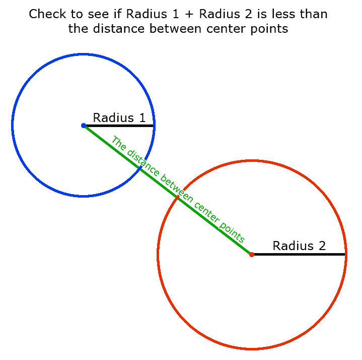
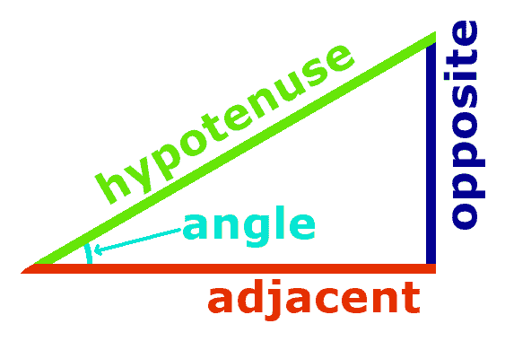
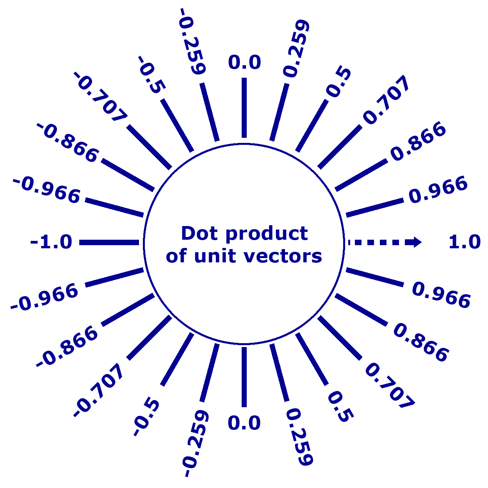
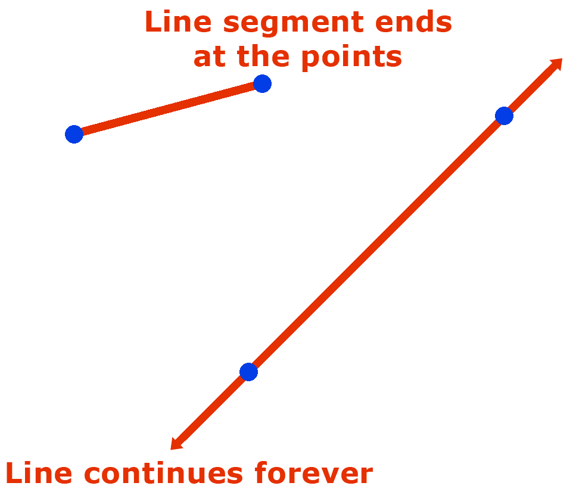
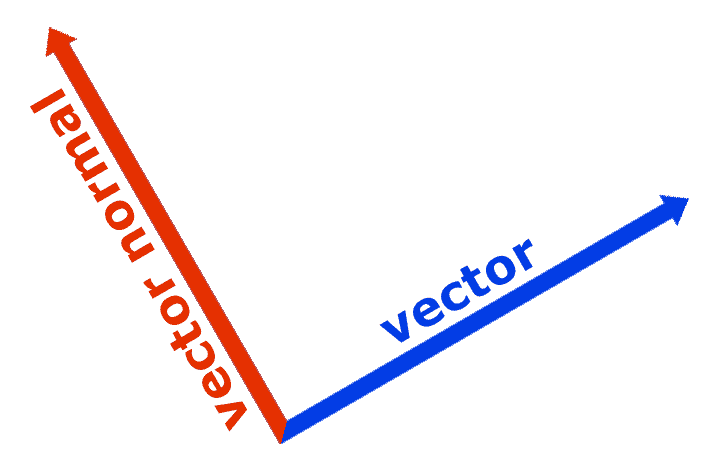
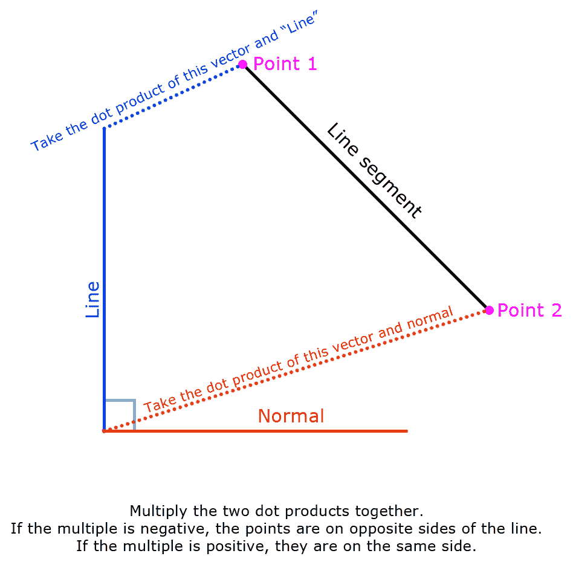
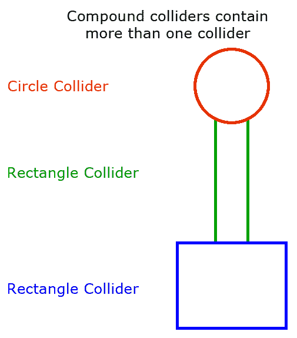
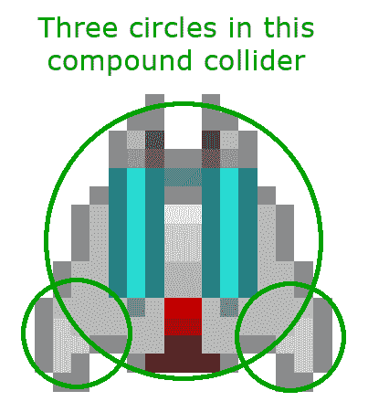
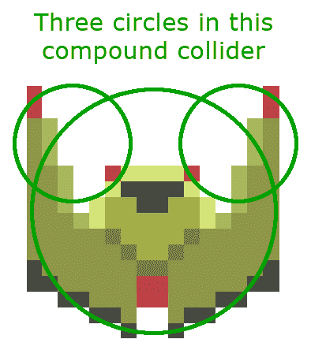
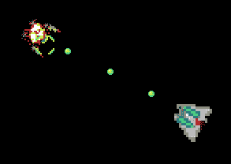

# 碰撞检测

目前，我们的太空飞船可以四处飞行并互相射击，但没有发生任何事情。

**碰撞检测**在绝大多数视频游戏中用于确定游戏对象是否相交。有许多方法可以检测不同游戏对象之间的碰撞。不同的方法在不同情况下可能效果更好。在计算时间和我们的碰撞检测的准确性之间也存在权衡。

您需要在构建中包含几个图像才能使此项目工作。确保您包含了项目的 GitHub 中的`/Chapter07/sprites/`文件夹。如果您还没有下载 GitHub 项目，可以在这里在线获取：[`github.com/PacktPublishing/Hands-On-Game-Develop`](https://github.com/PacktPublishing/Hands-On-Game-Development-with-WebAssembly)[ment-with-WebAssembly](https://github.com/PacktPublishing/Hands-On-Game-Development-with-WebAssembly)。

在本章中，我们将讨论以下内容：

+   碰撞检测

+   碰撞器对象

+   碰撞器的类型

+   向我们的游戏对象添加碰撞器

# 2D 碰撞检测类型

我可以写一本关于我们可以使用的各种 2D 碰撞检测方法的书，更不用说 3D 碰撞检测的数量了。我已经在[`www.embed.com/typescript-games/basic-collision-detection.html`](https://www.embed.com/typescript-games/basic-collision-detection.html)上写了几篇 TypeScript 教程，介绍了如何使用不同的检测技术，包括基本的和复杂的，但在这本书中，我们将坚持使用一些更基本的碰撞技术的组合。

# 圆形碰撞检测

最基本的碰撞检测是**圆形**或**距离**碰撞检测。如果我们把所有的碰撞器都看作是带有半径和位置的小圆圈，我们可以计算两个位置之间的距离，并查看该距离是否小于我们半径的总和。这种形式的碰撞检测速度很快，但精度有限。如果你看看我们游戏中的抛射物，这种方法效果还不错。另一方面，我们的太空飞船并不完全适合圆形。我们可以调整任何给定飞船的圆形碰撞器的半径，以获得略有不同的结果。当圆形碰撞检测有效时，它可以非常高效：

[圆形碰撞检测]

# 矩形碰撞检测

**矩形**碰撞检测是另一种快速的碰撞检测方法。在许多情况下，它可能比圆形碰撞检测更快。矩形碰撞器由* x *和* y *坐标定义，这是我们矩形左上角的位置，以及宽度和高度。检测矩形碰撞非常简单。我们在* x *轴上寻找两个矩形之间的重叠。如果在* x *轴上有重叠，然后我们在* y *轴上寻找重叠。如果两个轴上都有重叠，就会发生碰撞。这种技术对许多老式视频游戏非常有效。在任天堂娱乐系统上发布的几款经典游戏使用了这种碰撞检测方法。在我们编写的游戏中，我们正在旋转我们的精灵，因此使用传统的非定向碰撞检测对我们来说没有用处。

# 三角函数的简短复习

在这一点上，我们的碰撞检测算法开始变得更加复杂。你可能还记得一些高中三角学课程的概念，但一些基本的三角学对于许多碰撞检测算法非常重要。即使我们之前讨论的圆形碰撞检测也依赖于毕达哥拉斯定理，所以，实际上，除非你在进行简单的非定向矩形碰撞检测，至少需要一点三角学。三角学是数学中三角形的研究。大多数游戏使用所谓的**笛卡尔坐标系**。如果你对这个词不熟悉，*笛卡尔坐标系*意味着我们有一个带有*x*和*y*坐标的网格（对于 2D 游戏）。

*笛卡尔*这个词是由勒内·笛卡尔发明的——那个“我思故我在”的家伙，在数学上有很多伟大的想法，在哲学上有很多愚蠢的想法（机器中的幽灵…呸！）。

我们必须从高中的三角学课程中记住一些关键概念，它们都与直角三角形有关。直角三角形是一个内含 90 度角的三角形。当你使用笛卡尔坐标系时，这是一个方便的事情，因为你的*x*和*y*轴恰好形成一个直角，所以任何两点之间不共享*x*或*y*坐标的线都可以被视为直角三角形的斜边（长边）。我们还需要记住一些比率；它们如下：

+   *正弦 - Y / 斜边*

+   *余弦 - X / 斜边*

+   *正切 - Y / X*

你还记得 SOHCAHTOA 吗？（发音为“Sock-Ah-Toe-Ah”）

这是为了提醒你记住三角比率的以下版本：

+   *正弦 - 对边 / 斜边*

+   *余弦 - 邻边 / 斜边*

+   *正切 - 对边 / 邻边*

在这个公式中，三角形的*对边*是*y*轴，三角形的邻边是*x*轴。如果你记得 SOHCAHTOA，你可能更容易记住这些比率。如果不记得，就重新翻开这本书或使用谷歌：

[SOHCAHTOA]

有些人被教导使用短语“*Some Old Horse Came A-Hoppin' Through Our Alley.*”我不确定这是否有帮助。我觉得比 SOHCAHTOA 更难记住，但这是一个观点问题。所以，如果想象一匹像兔子一样在某个城市的后巷里跳跃的马是你的菜，那么尽管使用那个。

你可能还记得在本书的前面，我们使用了船舶旋转的角度和`sin`和`cos`数学库函数来计算我们的船在*x*轴和*y*轴上的移动速度。这些函数返回给定角度的比率。

我们需要知道的另一个概念是两个单位向量之间的**点积**。单位向量是长度为 1 的向量。两个单位向量之间的点积就是这两个单位向量之间的角的余弦。点积越接近 1，两个向量之间的角度就越接近 0 度。如果点积接近 0，两个向量之间的角度接近 90 度，如果两个角之间的点积接近-1，两个向量之间的角度接近 180 度。不同向量之间的点积在碰撞检测和游戏物理中非常有用。参考以下图表：

[两个归一化向量的点积]

# 线碰撞检测

因此，我们需要做的第一件事是讨论线和线段之间的区别。我们使用两点来定义一条线。该线在点之后延伸到无穷大。线段在两点处终止，并且不会无限期地继续。不平行的两条线总会在某个地方相交。两条不平行的线段可能会相交，也可能不会相交。

在大多数情况下，在游戏中，我们都对两条线段是否相交感兴趣：

[线与线段]

确定一条线是否与线段相交相对容易。你所要做的就是看看线段的两个点是否在你的线的两侧。由于一条线是无限的，这意味着你的线段必须在某个地方与你的线相交。如果你想要找出两条线段是否相交，你可以分两个阶段来做。首先，找出线段 A 是否与无限线 B 相交。如果它们相交，那么找出线段 B 是否与无限线 A 相交。如果在这两种情况下都成立，那么线段相交。

那么，下一个问题是，我们如何在数学上知道两点是否在一条线的对立面？为了做到这一点，我们将使用先前讨论过的点积和称为**向量法线**的东西。向量法线只是你的向量的一个 90 度旋转版本。请参阅以下图表：



一个向量及该向量的法线

我们还需要一个向量，它的起点与同一点相同，但方向指向我们线段的第一个点。如果这两个向量的点积是一个正值，那么这意味着该点与归一化向量在同一侧。如果点积是一个负值，那么这意味着该点在与我们的法向量相反的一侧。如果线段相交，那么意味着一个点有一个正的点积，另一侧有一个负的点积。由于两个负数相乘和两个正数相乘都会得到一个正的结果，而一个负数和一个正数相乘会得到一个负的结果，将这两个点积相乘，看看结果值是否为负数。如果是，那么线段与线相交：

[确定两点是否在线的对立面]

# 复合碰撞器

**复合碰撞器**是指游戏对象使用多个碰撞器来确定是否发生了碰撞。我们将在我们的飞船上使用复合圆形碰撞器，以提高我们飞船碰撞检测的准确性，同时仍然提供使用圆形碰撞器的增加速度。我们将用三个圆覆盖我们的玩家飞船和敌人飞船。我们的抛射物是圆形的，因此对于它们使用圆形是非常自然的。没有理由限制复合碰撞器只使用一种形状的碰撞器。在内部，复合碰撞器可以混合圆形碰撞器和矩形碰撞器，或者任何其他你喜欢的类型。

下面的图表显示了一个由圆和两个矩形碰撞器组成的假想化复合碰撞器：

[由三个基本碰撞器组成的复合碰撞器]

在下一节中，我们将学习如何实现基本的圆形碰撞检测算法。

# 实现圆形碰撞检测

我们将从实现圆形碰撞检测开始，因为这是最快的碰撞检测方法。它也很适合我们的抛射物，这将是我们游戏中最常见的碰撞器。它对我们的飞船的效果不是很好，但是以后，我们可以通过实现一个复合碰撞器来改善这种情况，该碰撞器将为每艘飞船使用多个圆形碰撞器，而不仅仅是一个。因为我们只有两艘飞船，这将为我们的碰撞检测带来最佳的效果：圆形碰撞检测的速度，以及一些更好的碰撞检测方法的准确性。

让我们首先在`game.hpp`文件中添加一个`Collider`类定义，并创建一个新的`collider.cpp`文件，在其中我们可以定义`Collider`类使用的函数。以下是我们在`game.hpp`文件中新`Collider`类的样子：

```cpp
class Collider {
    public:
        double m_X;
        double m_Y;
        double m_Radius;

        Collider(double radius);

        bool HitTest( Collider *collider );
};
```

这是我们放在`collider.cpp`文件中的代码：

```cpp
#include "game.hpp"
Collider::Collider(double radius) {
    m_Radius = radius;
}

bool Collider::HitTest( Collider *collider ) {
    double dist_x = m_X - collider->m_X;
    double dist_y = m_Y - collider->m_Y;
    double radius = m_Radius + collider->m_Radius;

    if( dist_x * dist_x + dist_y * dist_y <= radius * radius ) {
        return true;
    }
    return false;
}
```

`Collider`类是一个相当简单的圆形碰撞器。正如我们之前讨论的，圆形碰撞器有一个*x*和*y*坐标以及一个半径。`HitTest`函数进行了一个相当简单的距离测试，以确定两个圆是否足够接近以触碰彼此。我们通过平方两个碰撞器之间的*x*距离和*y*距离来实现这一点，这给了我们两点之间的距离的平方。我们可以取平方根来确定实际距离，但平方根是一个相对较慢的函数，而平方两个半径的和进行比较要快得多。

我们还需要简要讨论类继承。如果你回顾一下我们之前的代码，我们有一个`PlayerShip`类和一个`EnemyShip`类。这些类共享大部分属性。它们都有*x*和*y*坐标，*x*和*y*速度，以及许多其他相同的属性。许多函数使用相同的复制粘贴的代码。我们不想重复定义这些代码，让我们回过头来创建一个`Ship`类，它包含了`PlayerShip`和`EnemyShip`类共有的所有特性。然后，我们可以重构我们的`EnemyShip`和`PlayerShip`类，让它们继承自我们的`Ship`类。这是我们在`game.hpp`中添加的新`Ship`类定义：

```cpp
class Ship: public Collider {
    public:
        Uint32 m_LastLaunchTime;
        const int c_Width = 16;
        const int c_Height = 16;
        SDL_Texture *m_SpriteTexture;
        Ship();
        float m_Rotation;
        float m_DX;
        float m_DY;
        float m_VX;
        float m_VY;

        void RotateLeft();
        void RotateRight();
        void Accelerate();
        void Decelerate();
        void CapVelocity();

        virtual void Move() = 0;
        void Render();
};
```

第一行`Ship class: public Collider`告诉我们`Ship`将继承`Collider`类的所有公共和受保护成员。我们这样做是因为我们希望能够执行碰撞检测。`Collider`类现在也定义了`m_X`和`m_Y`属性变量，用于跟踪对象的*x*和*y*坐标。我们已经将`EnemyShip`和`PlayerShip`类的共同部分移到了`Ship`类中。你会注意到我们有一个虚函数`virtual void Move() = 0;`。这一行告诉我们，所有继承自`Ship`的类都将有一个`Move`函数，但我们需要在这些类中定义`Move`，而不是直接在`Ship`类中定义。这使`Ship`成为一个**抽象类**，这意味着我们不能创建`Ship`的实例，而是它是其他类将继承的类。

类继承、抽象类和虚函数都是一种被称为**面向对象编程**（**OOP**）的编程风格的一部分。C++是由 Bjarne Stroustrup 于 1979 年创建的，用于将 OOP 添加到 C 编程语言中。如果你对 OOP 不熟悉，有数百本书详细介绍了这个主题。我只能在本书中粗略地介绍它。

接下来，我们将修改`game.hpp`文件中的`PlayerShip`和`EnemyShip`类，删除我们移动到父类`Ship`中的所有方法和属性。我们还将修改这些类，使它们继承自`Ship`。以下是类定义的新版本：

```cpp
class PlayerShip: public Ship {
    public:
        const char* c_SpriteFile = "sprites/Franchise.png";
        const Uint32 c_MinLaunchTime = 300;
        PlayerShip();
        void Move();
};

class EnemyShip: public Ship {
    public:
        const char* c_SpriteFile = "sprites/BirdOfAnger.png";
        const Uint32 c_MinLaunchTime = 300;
        const int c_AIStateTime = 2000;
        FSM_STUB m_AIState;
        int m_AIStateTTL;

        EnemyShip();
        void AIStub();
        void Move();
};
```

现在，我们需要添加一个`ship.cpp`文件，并定义所有`EnemyShip`和`PlayerShip`共有的方法。这些方法之前都在`PlayerShip`和`EnemyShip`中，但现在我们可以将它们都放在一个地方。以下是`ship.cpp`文件的样子：

```cpp
#include "game.hpp"

Ship::Ship() : Collider(8.0) {
    m_Rotation = PI;
    m_DX = 0.0;
    m_DY = 1.0;
    m_VX = 0.0;
    m_VY = 0.0;
    m_LastLaunchTime = current_time;
}

void Ship::RotateLeft() {
    m_Rotation -= delta_time;

    if( m_Rotation < 0.0 ) {
        m_Rotation += TWO_PI;
    }
    m_DX = sin(m_Rotation);
    m_DY = -cos(m_Rotation);
}

void Ship::RotateRight() {
    m_Rotation += delta_time;

    if( m_Rotation >= TWO_PI ) {
        m_Rotation -= TWO_PI;
    }
    m_DX = sin(m_Rotation);
    m_DY = -cos(m_Rotation);
}

void Ship::Accelerate() {
    m_VX += m_DX * delta_time;
    m_VY += m_DY * delta_time;
}

void Ship::Decelerate() {
    m_VX -= (m_DX * delta_time) / 2.0;
    m_VY -= (m_DY * delta_time) / 2.0;
}
void Ship::CapVelocity() {
    double vel = sqrt( m_VX * m_VX + m_VY * m_VY );

    if( vel > MAX_VELOCITY ) {
        m_VX /= vel;
        m_VY /= vel;

        m_VX *= MAX_VELOCITY;
        m_VY *= MAX_VELOCITY;
    }
}
void Ship::Render() {
    dest.x = (int)m_X;
    dest.y = (int)m_Y;
    dest.w = c_Width;
    dest.h = c_Height;

    double degrees = (m_Rotation / PI) * 180.0;

    int return_code = SDL_RenderCopyEx( renderer, m_SpriteTexture,
                                        NULL, &dest,
                                        degrees, NULL, SDL_FLIP_NONE );

    if( return_code != 0 ) {
        printf("failed to render image: %s\n", IMG_GetError() );
    }
}
```

这些类的版本之间唯一真正的区别是，在`player_ship.cpp`和`enemy_ship.cpp`文件中，每个函数定义前面不再是`PlayerShip::`或`EnemyShip::`，而是`Ship::`。

接下来，我们需要修改`player_ship.cpp`和`enemy_ship.cpp`，删除现在在`ship.cpp`文件中定义的所有函数。让我们看看`enemy_ship.cpp`文件分成两部分的样子。第一部分是我们的`game.hpp`文件的`#include`和`EnemyShip`构造函数：

```cpp
#include "game.hpp"

EnemyShip::EnemyShip() {
    m_X = 60.0;
    m_Y = 50.0;
    m_Rotation = PI;
    m_DX = 0.0;
    m_DY = 1.0;
    m_VX = 0.0;
    m_VY = 0.0;
    m_LastLaunchTime = current_time;

    SDL_Surface *temp_surface = IMG_Load( c_SpriteFile );

    if( !temp_surface ) {
        printf("failed to load image: %s\n", IMG_GetError() );
        return;
    }
    else {
        printf("success creating enemy ship surface\n");
    }
    m_SpriteTexture = SDL_CreateTextureFromSurface( renderer, 
    temp_surface );

    if( !m_SpriteTexture ) {
        printf("failed to create texture: %s\n", IMG_GetError() );
        return;
    }
    else {
        printf("success creating enemy ship texture\n");
    }

    SDL_FreeSurface( temp_surface );
}

```

在`enemy_ship.cpp`文件的第二部分中，我们有`Move`和`AIStub`函数：

```cpp
void EnemyShip::Move() {
    AIStub();

    if( m_AIState == TURN_LEFT ) {
        RotateLeft();
    }

    if( m_AIState == TURN_RIGHT ) {
        RotateRight();
    }

    if( m_AIState == ACCELERATE ) {
        Accelerate();
    }

    if( m_AIState == DECELERATE ) {
        Decelerate();
    }

    CapVelocity();
    m_X += m_VX;

    if( m_X > 320 ) {
        m_X = -16;
    }
    else if( m_X < -16 ) {
        m_X = 320;
    }

    m_Y += m_VY;

    if( m_Y > 200 ) {
        m_Y = -16;
    }
    else if( m_Y < -16 ) {
        m_Y = 200;
    }

    if( m_AIState == SHOOT ) {
        Projectile* projectile;

        if( current_time - m_LastLaunchTime >= c_MinLaunchTime ) {
            m_LastLaunchTime = current_time;
            projectile = projectile_pool->GetFreeProjectile();

            if( projectile != NULL ) {
                projectile->Launch( m_X, m_Y, m_DX, m_DY );
            }
        }
    }
}

void EnemyShip::AIStub() {
    m_AIStateTTL -= diff_time;

    if( m_AIStateTTL <= 0 ) {
        // for now get a random AI state.
        m_AIState = (FSM_STUB)(rand() % 5);
        m_AIStateTTL = c_AIStateTime;
    }
}
```

现在我们已经看到了`enemy_ship.cpp`文件中的内容，让我们看看新的`player_ship.cpp`文件的样子：

```cpp
#include "game.hpp"
PlayerShip::PlayerShip() {
    m_X = 160.0;
    m_Y = 100.0;
    SDL_Surface *temp_surface = IMG_Load( c_SpriteFile );

    if( !temp_surface ) {
        printf("failed to load image: %s\n", IMG_GetError() );
        return;
    }

    m_SpriteTexture = SDL_CreateTextureFromSurface( renderer, 
    temp_surface );

    if( !m_SpriteTexture ) {
        printf("failed to create texture: %s\n", IMG_GetError() );
        return;
    }

    SDL_FreeSurface( temp_surface );
}

void PlayerShip::Move() {
    current_time = SDL_GetTicks();
    diff_time = current_time - last_time;
    delta_time = (double)diff_time / 1000.0;
    last_time = current_time;

    if( left_key_down ) {
        RotateLeft();
    }

    if( right_key_down ) {
        RotateRight();
    }

    if( up_key_down ) {
        Accelerate();
    }

    if( down_key_down ) {
        Decelerate();
    }

    CapVelocity();
    m_X += m_VX;

    if( m_X > 320 ) {
        m_X = -16;
    }
    else if( m_X < -16 ) {
        m_X = 320;
    }

    m_Y += m_VY;

    if( m_Y > 200 ) {
        m_Y = -16;
    }
    else if( m_Y < -16 ) {
        m_Y = 200;
    }

    if( space_key_down ) {
        Projectile* projectile;

        if( current_time - m_LastLaunchTime >= c_MinLaunchTime ) {
            m_LastLaunchTime = current_time;
            projectile = projectile_pool->GetFreeProjectile();
            if( projectile != NULL ) {
                projectile->Launch( m_X, m_Y, m_DX, m_DY );
            }
        }
    }
}
```

接下来，让我们修改`ProjectilePool`类中的`Move`函数，以便每次移动`Projectile`时，它也测试是否击中了我们的飞船之一：

```cpp
void ProjectilePool::MoveProjectiles() {
    Projectile* projectile;
    std::vector<Projectile*>::iterator it;
    for( it = m_ProjectileList.begin(); it != m_ProjectileList.end(); 
        it++ ) {
        projectile = *it;
        if( projectile->m_Active ) {
            projectile->Move();
            if( projectile->HitTest( player ) ) {
                printf("hit player\n");
            }
            if( projectile->HitTest( enemy ) ) {
                printf("hit enemy\n");
            }
        }
    }
}
```

现在，我们只会在玩家或敌人与抛射物发生碰撞时在控制台上打印。这将告诉我们我们的碰撞检测是否正确。在后面的部分中，我们将添加动画来摧毁我们的飞船当它们与抛射物碰撞时。

我们需要对`Projectile`类的`Launch`函数进行最后一个更改。当我们从飞船发射抛射物时，我们给抛射物一个基于飞船面向的方向的 x 和 y 位置和*x*和*y*速度。我们需要根据这个方向移动抛射物的起点。这是为了防止抛射物通过移动出碰撞检测圈而击中发射它的飞船：

```cpp
void Projectile::Launch(double x, double y, double dx, double dy) {
    m_X = x + dx * 9;
    m_Y = y + dy * 9;
    m_VX = velocity * dx;
    m_VY = velocity * dy;
    m_TTL = alive_time;
    m_Active = true;
}
```

在接下来的部分中，我们将检测当我们的飞船与抛射物碰撞时，并运行一个爆炸动画。

# 在碰撞时摧毁飞船

现在我们正在检测抛射物和飞船之间的碰撞，做一些比在控制台打印一行更有趣的事情会很好。当抛射物和飞船碰到东西时，能有一点爆炸动画会很好。当这些对象被摧毁时，我们可以为每个对象添加一个关联的动画。

我将介绍**精灵表**的概念，而不是像在之前的章节中那样为动画的每一帧加载多个精灵。我们将为每个飞船加载一个精灵表，其中不仅包括每个未受损版本，还包括我们在这些对象被摧毁时要播放的摧毁序列。

在这个示例中使用三个不同的精灵表只是为了方便。当您决定如何打包精灵表以供生产时，有几个考虑因素。您很可能希望根据需要打包精灵表。您可能会选择根据游戏的级别来打包精灵表。您还需要考虑到，出于性能原因，WebGL 需要大小为 2 的幂的精灵文件。这可能会影响您关于将哪些精灵打包到哪些精灵表中的决定。您还可以考虑购买一个像 Texture Packer 这样的工具，以便比手工更快地为您打包精灵。

我们已经创建了三个精灵表来替换我们之前使用的三个精灵。这些`Sprites`分别是`FranchiseExp.png`替换`Franchise.png`，`BirdOfAngerExp.png`替换`BirdOfAnger.png`，以及`ProjectileExp.png`替换`Projectile.png`。我们需要对`Projectile`类、`Ship`类、`EnemyShip`类、`PlayerShip`类以及`ProjectilePool`类，以及`game_loop`函数进行一些调整。

我们将从修改游戏循环开始，以跟踪游戏的时间数据。我们必须从`player_ship.cpp`文件中的`PlayerShip::Move`函数中删除一些代码。这段代码存在于第四章中，*使用 SDL 在 WebAssembly 中进行精灵动画*，我们讨论了通过对`PlayerShip`进行动画化来实现精灵动画的基础知识。我们必须从`PlayerShip::Move`的前几行中删除以下代码：

```cpp
current_time = SDL_GetTicks();
diff_time = current_time - last_time;
delta_time = (double)diff_time / 1000.0;
last_time = current_time;
```

这段代码获取当前时间并计算我们用于速度调整和动画定时的所有时间相关信息。我们可能应该在几章前将这段代码移到游戏循环中，但迟做总比不做好。以下是`main.cpp`中新的`game_loop`函数的代码：

```cpp
void game_loop() {
    current_time = SDL_GetTicks();
    diff_time = current_time - last_time;
    delta_time = (double)diff_time / 1000.0;
    last_time = current_time;
    input();
    move();
    render();
}
```

严格来说，我们不必进行这种更改，但将游戏时间代码放在游戏循环中更合理。现在我们已经改变了游戏循环，我们将修改`Projectile`类。以下是我们必须在`game.hpp`文件中进行的类定义更改：

```cpp
class Projectile: public Collider {
    public:
        const char* c_SpriteFile = "sprites/ProjectileExp.png";
        const int c_Width = 16;
        const int c_Height = 16;
        const double velocity = 6.0;
        const double alive_time = 2000;
        SDL_Texture *m_SpriteTexture;
        SDL_Rect src = {.x = 0, .y = 0, .w = 16, .h = 16 };
        Uint32 m_CurrentFrame = 0;
        int m_NextFrameTime;
        bool m_Active;

        float m_TTL;
        float m_VX;
        float m_VY;

        Projectile();
        void Move();
        void Render();
        void Launch(float x, float y, float dx, float dy);
};
```

我们需要修改`c_SpriteFile`变量，使其指向新的精灵表 PNG 文件，而不是单个精灵文件。我们需要增加宽度和高度。为了为爆炸腾出空间，我们将使精灵表中的所有帧都变为 16 x 16，而不是 8 x 8。我们还需要一个源矩形。当每个精灵使用整个文件时，我们可以将`null`传递给`SDL_RenderCopy`，函数将渲染精灵文件的全部内容。现在我们只想渲染一帧，所以我们需要一个从 0,0 开始并渲染宽度和高度为 16 的矩形。我们创建的精灵表是**水平条形精灵表**，这意味着每一帧都按顺序排列并水平放置。要渲染动画的不同帧，我们只需要修改源矩形中的`.x`值。我们添加的最后一个属性是公共部分的`m_CurrentFrame`属性。它跟踪我们当前所处动画的帧。当我们不渲染爆炸动画时，我们将保持当前帧为 0。

接下来，我们需要修改`Projectile`类上的几个函数。这些函数是`projectile.cpp`文件中的`Projectile::Move`函数和`Projectile::Render`函数。这是`Projectile::Move`函数的新版本：

```cpp
void Projectile::Move() {
    if( m_CurrentFrame > 0 ) {
        m_NextFrameTime -= diff_time;
        if( m_NextFrameTime <= 0 ) {
            ++m_CurrentFrame;
            m_NextFrameTime = ms_per_frame;
            if( m_CurrentFrame >= 4 ) {
                m_Active = false;
                m_CurrentFrame = 0;
                return;
            }
        }
        return;
    }
    m_X += m_VX;
    m_Y += m_VY;
    m_TTL -= diff_time;
    if( m_TTL < 0 ) {
        m_Active = false;
        m_TTL = 0;
    }
}
```

`Move`函数的顶部部分都是新的。如果当前帧不是`0`，我们将运行动画直到结束，然后停用我们的抛射物，将其发送回抛射物池。我们通过减去自上次应用程序运行游戏循环以来的时间来实现这一点。这是存储在`diff_time`全局变量中的值。`m_NextFrameTime`属性变量存储了切换到我们系列中下一帧的毫秒数。一旦值低于 0，我们就会增加当前帧并将`m_NextFrameTime`重置为我们希望在动画的每一帧之间的毫秒数。现在我们已经增加了当前动画帧，我们可以检查它是否大于或等于此动画中最后一帧的帧数（在本例中为 4）。如果是，我们需要停用抛射物并将当前帧重置为 0。

现在，我们已经对`Move()`函数进行了所需的更改，接下来我们需要对`Projectile::Render()`函数进行以下更改：

```cpp
void Projectile::Render() {
    dest.x = m_X + 8;
    dest.y = m_Y + 8;
    dest.w = c_Width;
    dest.h = c_Height;
    src.x = 16 * m_CurrentFrame;
    int return_val = SDL_RenderCopy( renderer, m_SpriteTexture,
                                    &src, &dest );
    if( return_val != 0 ) {
        printf("SDL_Init failed: %s\n", SDL_GetError());
    }
}
```

对`Render`函数的第一个更改是在`SDL_RenderCopy`调用中添加了`src`矩形，并在该调用的上方立即设置了它的*x*值。我们的精灵表中的每一帧都是 16 像素宽，所以将*x*值设置为`16 * m_CurrentFrame`将从精灵表中选择一个不同的 16 x 16 精灵。该矩形的宽度和高度将始终为 16，*y*值将始终为 0，因为我们将精灵放入这个精灵表中作为水平条带。

现在我们要对`game.hpp`文件中的`Ship`类定义进行一些修改：

```cpp
class Ship: public Collider {
    public:
        Uint32 m_LastLaunchTime;
        const int c_Width = 32;
        const int c_Height = 32;

        SDL_Texture *m_SpriteTexture;
        SDL_Rect src = {.x = 0, .y = 0, .w = 32, .h = 32 };
        bool m_Alive = true;
        Uint32 m_CurrentFrame = 0;
        int m_NextFrameTime;

        float m_Rotation;
        float m_DX;
        float m_DY;
        float m_VX;
        float m_VY;

        void RotateLeft();
        void RotateRight();
        void Accelerate();
        void Decelerate();
        void CapVelocity();

        virtual void Move() = 0;
        Ship();
        void Render();
};
```

我们修改了宽度和高度常量以反映精灵表中新的精灵大小为 32 x 32 像素。我们还必须为`Projectile`类添加一个源矩形。在我们的公共属性部分，我们添加了一些变量来跟踪飞船的存活或死亡状态`(m_Alive)`；游戏正在渲染的当前帧`(m_CurrentFrame)`；以及直到渲染下一帧的毫秒数`(m_NextFrameTime)`。接下来，我们将对`ship.cpp`文件进行必要的修改。我们需要修改`Ship::Render`函数：

```cpp
void Ship::Render() {
    if( m_Alive == false ) {
        return;
    }
    dest.x = (int)m_X;
    dest.y = (int)m_Y;
    dest.w = c_Width;
    dest.h = c_Height;

    src.x = 32 * m_CurrentFrame;
    float degrees = (m_Rotation / PI) * 180.0;
    int return_code = SDL_RenderCopyEx( renderer, m_SpriteTexture,
                                    &src, &dest,
                                    degrees, NULL, SDL_FLIP_NONE );
    if( return_code != 0 ) {
        printf("failed to render image: %s\n", IMG_GetError() );
    }
}
```

在函数顶部，我们添加了代码来检查飞船当前是否存活。如果不是，我们就不想渲染飞船，所以我们返回。稍后，我们将源矩形*x*值设置为当前帧的 32 倍，代码如下：`src.x = 32 * m_CurrentFrame;`。这样我们的渲染就会根据我们想要渲染的帧来渲染来自精灵表的不同的 32 x 32 像素块。最后，我们必须将`src`矩形传递给`SDL_RenderCopyEx`调用。

现在我们已经修改了`Ship`类，我们将改变`EnemyShip`类定义和`PlayerShip`类定义，以使用我们的精灵表 PNG 文件，而不是旧的单个精灵文件。以下是`game.hpp`文件中这两个类定义的修改：

```cpp
class PlayerShip: public Ship {
    public:
        const char* c_SpriteFile = "sprites/FranchiseExp.png";
        const Uint32 c_MinLaunchTime = 300;
        PlayerShip();
        void Move();
};

class EnemyShip: public Ship {
    public:
        const char* c_SpriteFile = "sprites/BirdOfAngerExp.png";
        const Uint32 c_MinLaunchTime = 300;
        const int c_AIStateTime = 2000;

        FSM_STUB m_AIState;
        int m_AIStateTTL;

        EnemyShip();
        void AIStub();
        void Move();
};
```

对这些类定义的唯一更改是在每个类中的`c_SpriteFile`常量的值。`PlayerShip`类中的`c_SpriteFile`常量从`"sprites/Franchise.png"`修改为`"sprites/FranchiseExp.png"`，`EnemyShip`中的`c_SpriteFile`常量从`"sprites/BirdOfAnger.png"`修改为`"sprites/BirdOfAngerExp.png"`。现在我们已经做出了这个改变，这些类将使用精灵表`.png`文件而不是原始精灵文件。

现在我们已经修改了这些类的定义，我们必须改变它们的`Move`函数。首先，我们将修改`enemy_ship.cpp`文件中的`EnemyShip::Move`函数：

```cpp
void EnemyShip::Move() {
    if( m_Alive == false ) {
        return;
    }
    AIStub();

    if( m_AIState == TURN_LEFT ) {
        RotateLeft();
    }
    if( m_AIState == TURN_RIGHT ) {
        RotateRight();
    }
    if( m_AIState == ACCELERATE ) {
        Accelerate();
    }
    if( m_AIState == DECELERATE ) {
        Decelerate();
    }

    if( m_CurrentFrame > 0 ) {
        m_NextFrameTime -= diff_time;

        if( m_NextFrameTime <= 0 ) {
            m_NextFrameTime = ms_per_frame;
            if( ++m_CurrentFrame >= 8 ) {
                m_Alive = false;
                return;
            }
        }
    }
    CapVelocity();

    m_X += m_VX;

    if( m_X > 320 ) {
        m_X = -16;
    }
    else if( m_X < -16 ) {
        m_X = 320;
    }

    m_Y += m_VY;

    if( m_Y > 200 ) {
        m_Y = -16;
    }
    else if( m_Y < -16 ) {
        m_Y = 200;
    }

    if( m_AIState == SHOOT ) {
        Projectile* projectile;
        if( current_time - m_LastLaunchTime >= c_MinLaunchTime ) {
            m_LastLaunchTime = current_time;
            projectile = projectile_pool->GetFreeProjectile();

            if( projectile != NULL ) {
                projectile->Launch( m_X, m_Y, m_DX, m_DY );
            }
        }
    }
}
```

有两个地方需要更改代码。首先，如果敌方飞船不再存活，我们不想执行任何`Move`函数的工作，所以我们在函数开头添加了这个检查来返回，如果飞船不再存活：

```cpp
if( m_Alive == false ) {
    return;
}
```

接下来，我们需要添加代码来检查是否需要运行死亡动画。如果当前帧大于 0，我们就会这样做。这一部分的代码与我们为抛射物运行死亡动画所做的类似。我们从下一帧时间`(m_NextFrameTime)`中减去帧之间的时间`(diff_time)`，以确定是否需要增加帧数。当这个值低于 0 时，帧数准备好改变，通过增加`m_CurrentFrame`，然后我们通过将其设置为每帧之间的毫秒数`(ms_per_frame)`来重置`m_NextFrameTime`倒计时器。如果我们当前的帧达到了我们帧精灵表的末尾，`(++m_CurrentFrame >= 8)`，那么我们将敌方飞船设置为不再存活，`(m_Alive = false)`。如下所示：

```cpp
if( m_CurrentFrame > 0 ) {
    m_NextFrameTime -= diff_time;
    if( m_NextFrameTime <= 0 ) {
        m_NextFrameTime = ms_per_frame;
        if( ++m_CurrentFrame >= 8 ) {
            m_Alive = false;
            return;
        }
    }
}
```

现在，我们将对`player_ship.cpp`文件中的`PlayerShip::Move`函数进行相同的更改：

```cpp
void PlayerShip::Move() {
    if( m_Alive == false ) {
        return;
    }
    if( left_key_down ) {
        RotateLeft();
    }
    if( right_key_down ) {
        RotateRight();
    }
    if( up_key_down ) {
        Accelerate();
    }
    if( down_key_down ) {
        Decelerate();
    }
    if( m_CurrentFrame > 0 ) {
        m_NextFrameTime -= diff_time;
        if( m_NextFrameTime <= 0 ) {
            m_NextFrameTime = ms_per_frame;
            if( ++m_CurrentFrame >= 8 ) {
                m_Alive = false;
                return;
            }
        }
    }
    CapVelocity();
    m_X += m_VX;

    if( m_X > 320 ) {
        m_X = -16;
    }
    else if( m_X < -16 ) {
        m_X = 320;
    }

    m_Y += m_VY;

    if( m_Y > 200 ) {
        m_Y = -16;
    }
    else if( m_Y < -16 ) {
        m_Y = 200;
    }

    if( space_key_down ) {
        Projectile* projectile;
        if( current_time - m_LastLaunchTime >= c_MinLaunchTime ) {
            m_LastLaunchTime = current_time;
            projectile = projectile_pool->GetFreeProjectile();
            if( projectile != NULL ) {
                projectile->Launch( m_X, m_Y, m_DX, m_DY );
            }
        }
    }
}
```

就像在我们的`EnemyShip::Move`函数中一样，我们添加了一个检查，看玩家是否还活着，代码如下：

```cpp
if( m_Alive == false ) {
    return;
}
```

我们还添加了一些代码，如果当前帧大于 0，就运行死亡动画：

```cpp
if( m_CurrentFrame > 0 ) {
    m_NextFrameTime -= diff_time;
    if( m_NextFrameTime <= 0 ) {
        m_NextFrameTime = ms_per_frame;
        if( ++m_CurrentFrame >= 8 ) {
            m_Alive = false;
            return;
        }
    }
}
```

我们需要做的最后一件事是修改我们之前添加到`ProjectilePool::MoveProjectiles`函数中的碰撞检测代码，以便在两者碰撞时运行飞船和抛射物的死亡动画。这是`projectile_pool.cpp`文件中`ProjectilePool::MoveProjectiles`的新版本：

```cpp
void ProjectilePool::MoveProjectiles() {
    Projectile* projectile;
    std::vector<Projectile*>::iterator it;
    for( it = m_ProjectileList.begin(); it != m_ProjectileList.end(); it++ ) {
        projectile = *it;
        if( projectile->m_Active ) {
            projectile->Move();
            if( projectile->m_CurrentFrame == 0 &&
                player->m_CurrentFrame == 0 &&
                projectile->HitTest( player ) ) {

                player->m_CurrentFrame = 1;
                player->m_NextFrameTime = ms_per_frame;
                projectile->m_CurrentFrame = 1;
                projectile->m_NextFrameTime = ms_per_frame;
            }
            if( projectile->m_CurrentFrame == 0 &&
                enemy->m_CurrentFrame == 0 &&
                projectile->HitTest( enemy ) ) {

                enemy->m_CurrentFrame = 1;
                enemy->m_NextFrameTime = ms_per_frame;
                projectile->m_CurrentFrame = 1;
                projectile->m_NextFrameTime = ms_per_frame;
            }
        }
    }
}
```

在这段代码中，每次移动抛射物时，我们都会对该抛射物和玩家进行碰撞测试，以及对该抛射物和敌人进行碰撞测试。如果飞船或抛射物正在运行死亡动画（`m_CurrentFrame == 0`为 false），那么我们就不需要运行碰撞测试，因为飞船或抛射物已经被摧毁。如果碰撞测试返回 true，那么我们需要将抛射物和飞船的当前帧都设置为 1，开始摧毁动画。我们还需要将下一帧时间设置为直到帧变化的毫秒数。

现在我们已经添加了所有这些新代码，飞船和敌人飞船将运行一个爆炸动画，当被击中时摧毁飞船。抛射物也会爆炸而不是只是消失。圆形碰撞器速度很快，但不太精确。在*实现复合圆形碰撞器*部分，我们将学习需要进行的修改，以便在单个飞船上使用多个圆形碰撞器。这将使我们的碰撞看起来比简单的圆更准确。

# 内存中的指针

WebAssembly 的内存模型基于 asm.js 内存模型，后者使用一个大型的类型化`ArrayBuffer`来保存模块要操作的所有原始字节。JavaScript 调用`WebAssembly.Memory`设置模块的内存缓冲区为 64KB 的**页面**。

*页面*是线性数据块，是操作系统或 WebAssembly 虚拟机分配的最小数据单元。有关内存页面的更多信息，请参阅维基百科页面：[`en.wikipedia.org/wiki/Page_%28computer_memory%29`](https://en.wikipedia.org/wiki/Page_%28computer_memory%29)。

WebAssembly 模块只能访问`ArrayBuffer`中的数据。这可以防止 WebAssembly 对浏览器沙盒之外的内存地址进行恶意攻击。由于这种设计，WebAssembly 的内存模型与 JavaScript 一样安全。

在下一节中，我们将在`collider`对象中使用 C++指针。如果您是 JavaScript 开发人员，您可能不熟悉**指针**。指针是一个保存内存位置而不是直接值的变量。让我们看一些代码：

```cpp
int VAR1 = 1;
int* POINTER = &VAR1;
```

在这段代码中，我们创建了一个名为`VAR1`的变量，并给它赋了一个值 1。在第二行，我们使用`int*`创建了一个名为`POINTER`的指针。然后我们使用`&`字符将该指针初始化为`VAR1`的地址，这在 C++中被称为**地址运算符**。这个运算符给出了我们之前声明的`VAR1`的地址。如果我们想要改变`VAR1`，我们可以使用指针而不是直接改变，如下所示：

```cpp
*POINTER = 2;
 printf("VAR1=%d\n", VAR1); // prints out "VAR1=2"
```

在`POINTER`前面加上`*`告诉 C++设置内存地址中`POINTER`指向的值；在这种情况下使用的`*`被称为**解引用运算符**。

如果您想了解有关 C++中指针及其工作原理的更多信息，以下文章详细介绍了这个主题：[`www.cplusplus.com/doc/tutorial/pointers/`](http://www.cplusplus.com/doc/tutorial/pointers/)。

在下一节中，我们将为太空飞船的碰撞检测实现复合圆形碰撞器。

# 实现复合圆形碰撞器

现在我们的碰撞检测已经起作用，我们的飞船和抛射物在碰撞时爆炸，让我们看看如何使我们的碰撞检测更好。我们选择圆形碰撞检测有两个原因：碰撞算法快速且简单。然而，我们可以通过简单地为每艘飞船添加更多的圆形来做得更好。这将使我们的碰撞检测时间增加*n*倍，其中*n*是我们每艘飞船上平均圆形的数量。这是因为我们只进行抛射物和飞船之间的碰撞检测。即使如此，我们也不希望在选择用于每艘飞船的圆形数量上过火。

对于玩家飞船，飞船的前部由基本圆形很好地覆盖。然而，通过在每一侧添加一个圆形，我们可以更好地覆盖玩家飞船的后部：



[我们的玩家飞船复合碰撞器]

敌方飞船则相反。飞船的后部被默认圆形很好地覆盖，但前部需要更好的覆盖，因此对于敌方飞船，我们将在前部添加一些额外的圆形：



[我们的敌方飞船复合碰撞器]

我们需要做的第一件事是改变`Collider`类，以包括来自我们碰撞器父级的信息。以下是我们`game.hpp`文件中`Collider`类定义的新版本：

```cpp
class Collider {
    public:
        float* m_ParentRotation;
        float* m_ParentX;
        float* m_ParentY;
        float m_X;
        float m_Y;
        float m_Radius;

        bool CCHitTest( Collider* collider );
        void SetParentInformation( double* rotation, double* x, double* 
                                   y );
        Collider(double radius);
        bool HitTest( Collider *collider );
};
```

我们已经为我们的`Collider`类的父级属性添加了三个指针。这些指针将指向碰撞器的父级的*x*和*y*坐标，以及`Rotation`，它可能是敌方飞船、玩家飞船或`NULL`。我们将在构造函数中将这些值初始化为`NULL`，如果该值为 null，我们将不修改碰撞器的行为。然而，如果这些值设置为其他值，我们将调用`CCHitTest`函数来确定是否有碰撞。这个碰撞测试的版本将在进行碰撞测试之前，调整碰撞器的位置，使其相对于其父级的位置和旋转。现在我们已经对碰撞器的定义进行了更改，我们将对`collider.cpp`文件中的函数进行更改，以支持新的复合碰撞器。

首先要做的是修改我们的构造函数，将新指针初始化为`NULL`：

```cpp
Collider::Collider(double radius) {
    m_ParentRotation = NULL;
    m_ParentX = NULL;
    m_ParentY = NULL;
    m_Radius = radius;
}
```

我们有一个新的函数要添加到我们的`collider.cpp`文件中，即`CCHitTest`函数，它将是我们的复合碰撞器碰撞测试。这个碰撞测试的版本将调整我们的碰撞器的*x*和*y*坐标，使其相对于父级飞船的位置和旋转：

```cpp
bool Collider::CCHitTest( Collider* collider ) {
    float sine = sin(*m_ParentRotation);
    float cosine = cos(*m_ParentRotation);
    float rx = m_X * cosine - m_Y * sine;
    float ry = m_X * sine + m_Y * cosine;
    float dist_x = (*m_ParentX + rx) - collider->m_X;
    float dist_y = (*m_ParentY + ry) - collider->m_Y;
    float radius = m_Radius + collider->m_Radius;

    if( dist_x * dist_x + dist_y * dist_y <= radius * radius ) {
        return true;
    }
    return false;
}
```

这个函数的第一件事是取父级旋转的正弦和余弦，并使用该旋转来得到变量`rx`和`ry`中*x*和*y*的旋转版本。然后我们调整旋转后的*x*和*y*位置，通过父级的*x*和*y*位置，然后计算两个碰撞器*x*和*y*位置之间的距离。在我们添加了这个新的`CCHitTest`函数之后，我们需要修改`HitTest`函数，以便在设置了父级值时调用这个版本的碰撞测试。以下是`HitTest`的最新版本：

```cpp
bool Collider::HitTest( Collider *collider ) {
    if( m_ParentRotation != NULL && m_ParentX != NULL && m_ParentY !=         NULL ) {
        return CCHitTest( collider );
    }

    float dist_x = m_X - collider->m_X;
    float dist_y = m_Y - collider->m_Y;
    float radius = m_Radius + collider->m_Radius;

    if( dist_x * dist_x + dist_y * dist_y <= radius * radius ) {
        return true;
    }
    return false;
}
```

我们创建了一个名为`SetParentInformation`的函数来设置所有这些值。以下是函数定义：

```cpp
void Collider::SetParentInformation( float* rotation, float* x, float* y ) {
    m_ParentRotation = rotation;
    m_ParentX = x;
    m_ParentY = y;
}
```

为了利用这些新类型的碰撞器，我们需要在`Ship`类中添加一个新的碰撞器向量。以下是`game.hpp`文件中`Ship`的新类定义：

```cpp
class Ship : public Collider {
    public:
        Uint32 m_LastLaunchTime;
        const int c_Width = 32;
        const int c_Height = 32;

        SDL_Texture *m_SpriteTexture;
        SDL_Rect src = {.x = 0, .y = 0, .w = 32, .h = 32 };
        std::vector<Collider*> m_Colliders;
        bool m_Alive = true;
        Uint32 m_CurrentFrame = 0;

        int m_NextFrameTime;
        float m_Rotation;
        float m_DX;
        float m_DY;
        float m_VX;
        float m_VY;

        void RotateLeft();
        void RotateRight();
        void Accelerate();
        void Decelerate();
        void CapVelocity();
        virtual void Move() = 0;
        Ship();
        void Render();
        bool CompoundHitTest( Collider* collider );
};
```

这个版本和`Ship`类的上一个版本之间有两个不同之处。第一个是添加了`m_Colliders`向量属性：

```cpp
 std::vector<Collider*> m_Colliders;
```

第二个变化是在类底部添加的新的`CompoundHitTest`函数：

```cpp
bool CompoundHitTest( Collider* collider );
```

对于我们的类的更改，我们需要在`ship.cpp`文件中添加一个新的函数：

```cpp
bool Ship::CompoundHitTest( Collider* collider ) {
    Collider* col;
    std::vector<Collider*>::iterator it;
    for( it = m_Colliders.begin(); it != m_Colliders.end(); it++ ) {
        col = *it;
        if( col->HitTest(collider) ) {
            return true;
        }
    }
    return false;
}
```

这个`CompoundHitTest`函数是一个非常简单的函数，它循环遍历我们的额外碰撞器并对它们执行碰撞测试。这一行创建了一个碰撞器指针的向量。现在我们将修改`EnemyShip`和`PlayerShip`构造函数，将一些碰撞器添加到这个向量中。首先，我们将在`enemy_ship.cpp`文件中的`EnemyShip`构造函数中添加一些新的行：

```cpp
EnemyShip::EnemyShip() {
    m_X = 60.0;
    m_Y = 50.0;
    m_Rotation = PI;
    m_DX = 0.0;
    m_DY = 1.0;
    m_VX = 0.0;
    m_VY = 0.0;
    m_AIStateTTL = c_AIStateTime;
    m_Alive = true;
    m_LastLaunchTime = current_time;

    Collider* temp_collider = new Collider(2.0);
    temp_collider->SetParentInformation( &(this->m_Rotation),
                                         &(this->m_X), &(this->m_Y) );
    temp_collider->m_X = -6.0;
    temp_collider->m_Y = -6.0;
    m_Colliders.push_back( temp_collider );
    temp_collider = new Collider(2.0);
    temp_collider->SetParentInformation( &(this->m_Rotation),
                                         &(this->m_X), &(this->m_Y) );
    temp_collider->m_X = 6.0;
    temp_collider->m_Y = -6.0;
    m_Colliders.push_back( temp_collider );

    SDL_Surface *temp_surface = IMG_Load( c_SpriteFile );

    if( !temp_surface ) {
        printf("failed to load image: %s\n", IMG_GetError() );
        return;
    }
    else {
        printf("success creating enemy ship surface\n");
    }
    m_SpriteTexture = SDL_CreateTextureFromSurface( renderer, 
    temp_surface );
    if( !m_SpriteTexture ) {
        printf("failed to create texture: %s\n", IMG_GetError() );
        return;
    }
    else {
        printf("success creating enemy ship texture\n");
    }
    SDL_FreeSurface( temp_surface );
}
```

我们添加的代码创建了新的碰撞器，并将这些碰撞器的父级信息设置为指向该对象内部的*x*和*y*坐标以及半径的地址。我们将这个碰撞器的`m_X`和`m_Y`值相对于该对象的位置进行设置，然后将新的碰撞器推入`m_Colliders`向量属性中。

```cpp
Collider* temp_collider = new Collider(2.0);
temp_collider->SetParentInformation( &(this->m_Rotation),
                                     &(this->m_X), &(this->m_Y) );
temp_collider->m_X = -6.0;
temp_collider->m_Y = -6.0;
m_Colliders.push_back( temp_collider );
temp_collider = new Collider(2.0);
temp_collider->SetParentInformation( &(this->m_Rotation),
                                     &(this->m_X), &(this->m_Y) );
temp_collider->m_X = 6.0;
temp_collider->m_Y = -6.0;
m_Colliders.push_back( temp_collider );
```

现在我们将在`player_ship.cpp`文件中对`PlayerShip`构造函数做类似的事情：

```cpp
PlayerShip::PlayerShip() {
    m_X = 160.0;
    m_Y = 100.0;
    SDL_Surface *temp_surface = IMG_Load( c_SpriteFile );

    Collider* temp_collider = new Collider(3.0);
    temp_collider->SetParentInformation( &(this->m_Rotation),
                                         &(this->m_X), &(this->m_Y) );
    temp_collider->m_X = -6.0;
    temp_collider->m_Y = 6.0;
    m_Colliders.push_back( temp_collider );
    temp_collider = new Collider(3.0);
    temp_collider->SetParentInformation( &(this->m_Rotation),
                                         &(this->m_X), &(this->m_Y) );
    temp_collider->m_X = 6.0;
    temp_collider->m_Y = 6.0;
    m_Colliders.push_back( temp_collider );

    if( !temp_surface ) {
        printf("failed to load image: %s\n", IMG_GetError() );
        return;
    }
    m_SpriteTexture = SDL_CreateTextureFromSurface( renderer, 
    temp_surface );

    if( !m_SpriteTexture ) {
        printf("failed to create texture: %s\n", IMG_GetError() );
        return;
    }
    SDL_FreeSurface( temp_surface );
}
```

现在，我们必须修改我们的抛射物池，以在我们的飞船中对这些新的复合碰撞器进行碰撞检测。以下是`projectile_pool.cpp`文件中`MoveProjectiles`函数的修改版本：

```cpp
void ProjectilePool::MoveProjectiles() {
    Projectile* projectile;
    std::vector<Projectile*>::iterator it;

    for( it = m_ProjectileList.begin(); it != m_ProjectileList.end(); 
         it++ ) {
        projectile = *it;
        if( projectile->m_Active ) {
            projectile->Move();
            if( projectile->m_CurrentFrame == 0 &&
                player->m_CurrentFrame == 0 &&
                ( projectile->HitTest( player ) ||
                  player->CompoundHitTest( projectile ) ) ) {
                player->m_CurrentFrame = 1;
                player->m_NextFrameTime = ms_per_frame;
                projectile->m_CurrentFrame = 1;
                projectile->m_NextFrameTime = ms_per_frame;
            }
            if( projectile->m_CurrentFrame == 0 &&
                enemy->m_CurrentFrame == 0 &&
                ( projectile->HitTest( enemy ) ||
                  enemy->CompoundHitTest( projectile ) ) ) {
                enemy->m_CurrentFrame = 1;
                enemy->m_NextFrameTime = ms_per_frame;
                projectile->m_CurrentFrame = 1;
                projectile->m_NextFrameTime = ms_per_frame;
            }
        }
    }
}
```

因为我们在`Ship`类中继承了`Collider`，所以我们仍然会对玩家和敌人的飞船执行常规的碰撞测试。我们在`Ship`类中添加了对`CompoundHitTest`的调用，它循环遍历我们的`m_Colliders`向量，并对该向量中的每个碰撞器执行碰撞测试。

我们的复合碰撞器解决方案并不是通用的，大部分情况下，我们的碰撞检测也不是通用的。我们只检测飞船和抛射物之间的碰撞。我们目前没有执行任何飞船之间的碰撞检测。要实现通用的碰撞检测方法，我们需要实现空间分割。这将防止随着每个额外的碰撞器添加到我们的游戏中，碰撞检测数量呈指数级增长。

# 编译 collider.html

我们用来编译`collider.html`文件的命令与上一章中的编译命令类似。我们需要在命令行中添加一个新的`collider.cpp`文件，但除此之外应该是一样的。以下是编译`collider.html`所使用的命令：

```cpp
em++ main.cpp collider.cpp ship.cpp enemy_ship.cpp player_ship.cpp projectile.cpp projectile_pool.cpp -std=c++17 --preload-file sprites -s USE_WEBGL2=1 -s USE_SDL=2 -s USE_SDL_IMAGE=2 -s SDL2_IMAGE_FORMATS=["png"] -o collider.html
```

现在我们已经编译了`collider.html`，我们可以从我们选择的 Web 服务器中提供它，或者使用`emrun`运行它，并将其加载到 Web 浏览器中。这是它的样子：

[当被抛射物击中时，敌方飞船会爆炸]

请记住，您必须使用 Web 服务器或`emrun`来运行 WebAssembly 应用程序。如果您想使用`emrun`运行 WebAssembly 应用程序，您必须使用`--emrun`标志进行编译。Web 浏览器需要一个 Web 服务器来流式传输 WebAssembly 模块。如果您尝试直接从硬盘驱动器在浏览器中打开使用 WebAssembly 的 HTML 页面，那么 WebAssembly 模块将无法加载。

我没有像之前游戏截图那样截取整个浏览器，因为我想放大玩家飞船摧毁敌方飞船的画面。正如你所看到的，我们现在有了可以检测抛射物何时与飞船碰撞并在碰撞发生时摧毁飞船的碰撞器，从而运行爆炸动画。

# 总结

圆形碰撞体是我们现在需要的。它们快速高效，对于这样一个简单的游戏，你可能可以不用做更复杂的事情就能逃脱。我们添加了一个复合碰撞体来演示这个简单修改如何显著增加碰撞体的准确性。我们将在本书的后面添加更多的碰撞检测方法。在未来，我们将在游戏中添加小行星和一颗星星，并创建一个**AI**（**人工智能**）代理来导航我们的游戏并攻击我们的玩家。这个代理最终需要知道它是否与玩家有视线，因此线碰撞检测将变得更加重要。我们的代理还希望快速扫描其附近的区域，以查看是否有任何必须避开的小行星。对于这个功能，我们将使用矩形碰撞。

2D 游戏有许多种碰撞检测技术，在本章中我们只是触及了皮毛。我们学会了如何实现一些基本的圆形碰撞体和复合碰撞体，并添加了代码来检测游戏中抛射物与玩家和敌人飞船之间的碰撞。这些类型的碰撞体快速而相对容易实现，但它们并非没有缺点。

你可能会注意到我们实现的简单碰撞体的一个缺点是，如果两个对象以足够高的相对速度相互穿过，它们可能会在不发生碰撞的情况下相互穿过。这是因为我们的对象在每一帧都有一个新的位置计算，并且它们不是连续地从 A 点移动到 B 点。如果需要一帧的时间从 A 点移动到 B 点，那么对象在两个点之间有效地传送。如果在这两个点之间有第二个对象，但当在 A 点或 B 点时我们没有与该对象发生碰撞，那么对象碰撞就会被忽略。这在我们的游戏中不应该是一个问题，因为我们将保持我们的最大对象速度相对较低。然而，在编写游戏时要记住这一点。

在下一章中，我们将构建一个工具来帮助我们配置**粒子系统**。
