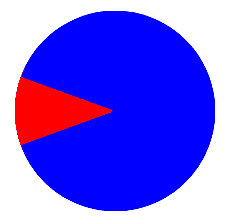
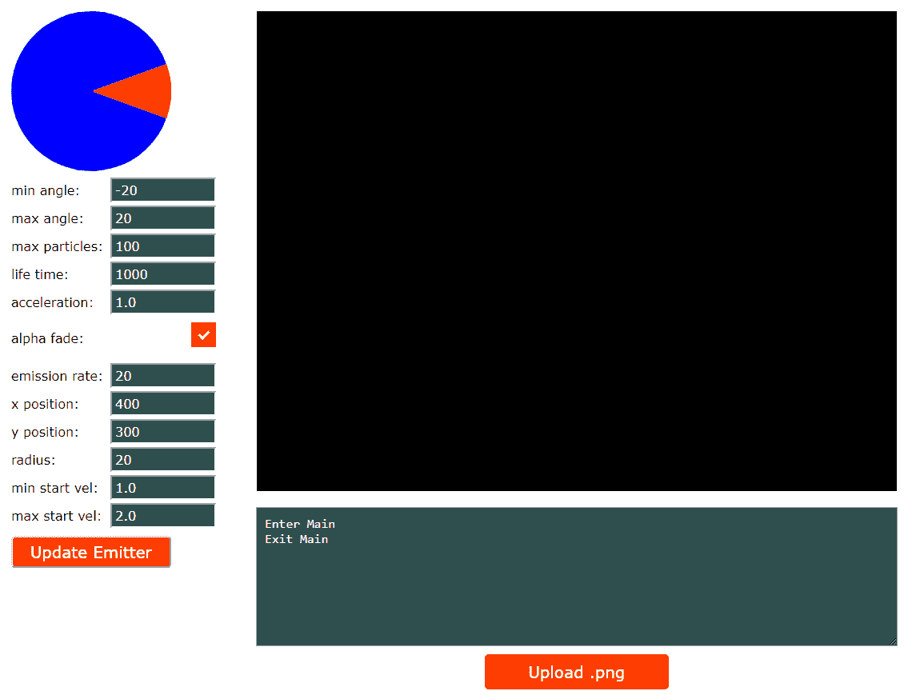

# 第八章：基本粒子系统

*粒子系统*是一种图形技术，我们从*发射器*中发射大量精灵，并使这些精灵经历一个生命周期，在这个过程中它们以各种方式改变。我们在精灵的生命周期中加入了一些随机性，以创建各种有趣的效果，如爆炸、火花、雪、灰尘、火、发动机排气等。一些粒子效果可以与它们的环境互动。在我们的游戏中，我们将使用粒子效果来创建漂亮的发动机排气和飞船爆炸效果。

在本章中，您需要在构建中包含几个图像，以使该项目正常工作。确保您从项目的 GitHub 中包含`/Chapter08/sprites/`文件夹。如果您还没有下载 GitHub 项目，可以在这里在线获取：[`github.com/PacktPublishing/Hands-On-Game-Develop`](https://github.com/PacktPublishing/Hands-On-Game-Development-with-WebAssembly)。

这一章和下一章的开始起初会感觉像是一个离题。在接下来的两章中，我们将花费大量时间来处理游戏之外的内容。如果您对粒子系统感兴趣，我保证这将是值得的。当您创建一个粒子系统时，您会花费大量时间来调整它们，并玩耍以使它们看起来正确。在游戏中直接进行这样的操作将导致大量的编译和测试。我们需要的是一个工具，可以在将粒子系统添加到游戏之前配置和测试粒子系统。这一章和下一章的前半部分致力于构建这个工具。如果您对学习如何构建这个工具不感兴趣，您可以略过本章的文本，并从 GitHub 下载并编译该工具。如果您对学习 JavaScript、HTML 和 WebAssembly 如何在应用程序中交互感兴趣，本章和第九章 *改进的粒子系统*的前半部分是一个很好的教程，可以教您如何编写一个应用程序，而不仅仅是一个带有 WebAssembly 的游戏。

在本章中，我们将涵盖以下主题：

+   SVG 简介

+   再次三角函数？

+   添加 JavaScript

+   简单的粒子发射器工具

+   Point 类

+   粒子类

+   发射器类

+   WebAssembly 接口函数

+   编译和测试粒子发射器

# 添加到虚拟文件系统

这一部分将是一个简短的离题，因为我想花时间创建一个*粒子系统设计工具*，这将需要我们向 WebAssembly 虚拟文件系统添加文件。我们将添加一个类型为文件的输入元素，我们可以使用它将图像加载到虚拟文件系统中。我们需要检查正在加载的文件，以验证它是否是`.png`文件，如果是，我们将使用 WebAssembly 和 SDL 在画布上绘制和移动图像。 

Emscripten 默认不会创建虚拟文件系统。因为我们需要使用一个最初没有任何内容的虚拟文件系统，我们需要向 em++传递以下标志，以强制 Emscripten 构建虚拟文件系统：`-s FORCE_FILESYSTEM=1`。

我们将首先从第二章 *HTML5 和 WebAssembly*中复制`canvas_shell.html`，并使用它创建一个名为`upload_shell.html`的新 shell 文件。我们需要在处理文件加载的 JavaScript 中添加一些代码，并将该文件插入到 WebAssembly 虚拟文件系统中。我们还需要添加一个 HTML `input`元素，类型为`file`，直到`Module`对象加载完成才会显示。在下面的代码中，我们有新的 shell 文件：

```cpp
<!doctype html><html lang="en-us">
<head><meta charset="utf-8"><meta http-equiv="Content-Type" content="text/html; charset=utf-8">
    <title>Upload Shell</title>
    <link href="upload.css" rel="stylesheet" type="text/css">
</head>
<body>
    <canvas id="canvas" width="800" height="600" 
     oncontextmenu="event.preventDefault()"></canvas>
    <textarea class="em_textarea" id="output" rows="8"></textarea>
    <script type='text/javascript'>
        var canvas = null;
        var ctx = null;
        function ShowFileInput()         
            {document.getElementById("file_input_label")
            .style.display="block";}
        var Module = {
            preRun: [],
            postRun: [ShowFileInput],
            print: (function() {
                var element = document.getElementById('output');
                if (element) element.value = '';
                return function(text) {
                    if (arguments.length > 1)         
                    text=Array.prototype.slice.call(arguments).join('                     
                    ');
                    console.log(text);
                    if (element) {
                        element.value += text + "\n";
                        element.scrollTop = element.scrollHeight;
                } }; })(),
    printErr: function(text) {
        if (arguments.length > 1) 
        text=Array.prototype.slice.call(arguments).join(' ');
        if (0) { dump(text + '\n'); } 
        else { console.error(text); } },
    canvas: (function() {
        var canvas = document.getElementById('canvas');
        canvas.addEventListener("webglcontextlost", function(e) { 
        alert('WebGL context lost. You will need to reload the page.'); 
        e.preventDefault(); }, false);
        return canvas; })(),
    setStatus: function(text) {
        if (!Module.setStatus.last) Module.setStatus.last = { time: 
            Date.now(), text: '' };
        if (text === Module.setStatus.last.text) return;
        var m = text.match(/([^(]+)\((\d+(\.\d+)?)\/(\d+)\)/);
        var now = Date.now();
        if (m && now - Module.setStatus.last.time < 30) return;
        Module.setStatus.last.time = now;
        Module.setStatus.last.text = text;
        if (m) { text = m[1]; }
        console.log("status: " + text);
    },
    totalDependencies: 0,
    monitorRunDependencies: function(left) {
        this.totalDependencies = Math.max(this.totalDependencies,left);
        Module.setStatus(left ? 'Preparing... (' + 
        (this.totalDependencies-left) + '/' +
         this.totalDependencies + ')' : 'All downloads complete.'); }
};
Module.setStatus('Downloading...');
window.onerror = function() {
    Module.setStatus('Exception thrown, see JavaScript console');
    Module.setStatus = function(text) { if (text) Module.printErr('[post-exception status] ' + text); };
};
function handleFiles(files) {
    var file_count = 0;
    for (var i = 0; i < files.length; i++) {
        if (files[i].type.match(/image.png/)) {
            var file = files[i];
            console.log("file name=" + file.name);
            var file_name = file.name;
            var fr = new FileReader();
            fr.onload = function (file) {
                var data = new Uint8Array(fr.result);
                Module.FS_createDataFile('/', file_name, data, true, 
                true, true);
                Module.ccall('add_image', 'undefined', ["string"], 
                [file_name]);
            };
            fr.readAsArrayBuffer(files[i]);
        }
    }
}
</script>
<input type="file" id="file_input" onchange="handleFiles(this.files)" />
<label for="file_input" id="file_input_label">Upload .png</label>
{{{ SCRIPT }}}
</body></html>
```

在头部，我们唯一做的更改是标题和样式表：

```cpp
<title>Upload Shell</title>
<link href="upload.css" rel="stylesheet" type="text/css">
```

在`body`标签中，我们不会对`canvas`和`textarea`元素进行更改，但是 JavaScript 部分有显著的变化。我们将要做的第一件事是向 JavaScript 添加一个`ShowFileInput`函数，以显示`file_input_label`元素，该元素在我们的 CSS 中是隐藏的。您可以在以下代码片段中看到它：

```cpp
function ShowFileInput() {
    document.getElementById("file_input_label").style.display = "block";
}

var Module = {
    preRun: [],
    postRun: [ShowFileInput],
```

请注意，我们已经在`postRun`数组中添加了对此函数的调用，以便在模块加载后运行。这是为了确保在`Module`对象加载之前没有人加载图像文件，而我们的页面可以处理它。除了将`ShowFileInput`添加到`postRun`数组中，`Module`对象保持不变。在`Module`对象代码之后，我们添加了一个`handleFiles`函数，当用户选择要加载的新文件时，文件输入元素将调用该函数。以下是该函数的代码：

```cpp
function handleFiles(files) {
    var file_count = 0;
    for (var i = 0; i < files.length; i++) {
        if (files[i].type.match(/image.png/)) {
            var file = files[i];
            var file_name = file.name;
            var fr = new FileReader();

            fr.onload = function (file) {
                var data = new Uint8Array(fr.result);
                Module.FS_createDataFile('/', file_name, data, true, 
                true, true);
                Module.ccall('add_image', 'undefined', ["string"], 
                [file_name]);
            };
            fr.readAsArrayBuffer(files[i]);
        }
    }
}
```

您会注意到，该函数设计为通过循环遍历传入`handleFiles`的`files`参数来处理多个文件。我们将首先检查图像文件类型是否为 PNG。在编译 WebAssembly 时，我们需要告诉它 SDL 将处理哪些图像文件类型。PNG 格式应该就足够了，但是在这里添加其他类型并不困难。

如果您不想专门检查 PNG 文件，可以省略匹配字符串的`.png`部分，然后在编译命令行参数中添加其他文件类型。如果文件是`image/png`类型，我们将文件名放入其变量`file_name`中，并创建一个`FileReader`对象。然后我们定义了`FileReader`加载文件时运行的函数：

```cpp
fr.onload = function (file) {
    var data = new Uint8Array(fr.result);
    Module.FS_createDataFile('/', file_name, data, true, true, true);
    Module.ccall('add_image', 'undefined', ["string"], [file_name]);
};
```

该函数将数据作为 8 位无符号整数数组输入，然后将其传递到`Module`函数`FS_createDataFile`中。此函数的参数是一个字符串，表示我们文件的父目录'/'，文件名`file_name`，我们从文件中读取的数据，以及`canRead`，`canWrite`和`canOwn`，这些都应设置为`true`，因为我们希望我们的 WebAssembly 能够读取、写入和拥有此文件。然后，我们使用`Module.ccall`调用在我们的 WebAssembly 中定义的名为`add_image`的函数，该函数将获取文件名，以便我们的 WebAssembly 可以使用 SDL 将此图像呈现到 HTML 画布上。在定义告诉`FileReader`在加载文件时要执行的函数之后，我们必须指示`FileReader`继续读取已加载的文件作为`ArrayBuffer`：

```cpp
fr.readAsArrayBuffer(files[i]);
```

在 JavaScript 之后，我们添加了一个文件`input`元素和一个相应的标签，如下所示：

```cpp
<input type="file" id="file_input" onchange="handleFiles(this.files)" />
<label for="file_input" id="file_input_label">Upload .png</label>
```

标签纯粹是为了样式。在 CSS 中，样式化输入文件元素并不是一件简单的事情。我们稍后会讨论如何做到这一点。在讨论 CSS 之前，我想先讨论一下我们将使用的 WebAssembly C 代码，以使用 SDL 加载和呈现此图像。以下代码将放在我们命名为`upload.c`的文件中：

```cpp
#include <emscripten.h>
#include <stdlib.h>
#include <SDL2/SDL.h>
#include <SDL2/SDL_image.h>

SDL_Window *window;
SDL_Renderer *renderer;
char* fileName;
SDL_Texture *sprite_texture = NULL;
SDL_Rect dest = {.x = 160, .y = 100, .w = 16, .h = 16 };

int sprite_x = 0;
int sprite_y = 0;

void add_image(char* file_name) {
    SDL_Surface *temp_surface = IMG_Load( file_name );

    if( !temp_surface ) {
        printf("failed to load image: %s\n", IMG_GetError() );
        return;
    }
    sprite_texture = SDL_CreateTextureFromSurface( renderer, 
    temp_surface );
    SDL_FreeSurface( temp_surface );
    SDL_QueryTexture( sprite_texture,
                        NULL, NULL,
                        &dest.w, &dest.h );
}

void show_animation() {
    if( sprite_texture == NULL ) {
        return;
    }

    SDL_SetRenderDrawColor( renderer, 0, 0, 0, 255 );
    SDL_RenderClear( renderer );

    sprite_x += 2;
    sprite_y++;

    if( sprite_x >= 800 ) {
        sprite_x = -dest.w;
    }

    if( sprite_y >= 600 ) {
        sprite_y = -dest.h;
    }
    dest.x = sprite_x;
    dest.y = sprite_y;

    SDL_RenderCopy( renderer, sprite_texture, NULL, &dest );
    SDL_RenderPresent( renderer );
}

int main() {
    printf("Enter Main\n");
    SDL_Init( SDL_INIT_VIDEO );

    int return_val = SDL_CreateWindowAndRenderer( 800, 600, 0, &window, 
    &renderer );

    if( return_val != 0 ) {
        printf("Error creating renderer %d: %s\n", return_val, 
        IMG_GetError() );
         return 0;
    }
    emscripten_set_main_loop(show_animation, 0, 0);
    printf("Exit Main\n");
    return 1;
}
```

在我们的新的`upload.c`文件中，我们定义了三个函数。第一个函数是`add_image`函数。此函数接受一个代表我们刚刚加载到 WebAssembly 虚拟文件系统中的文件的`char*`字符串。我们使用 SDL 将图像加载到表面中，然后使用该表面创建一个纹理，我们将使用它来呈现我们加载的图像。第二个函数是`show_animation`，我们用它来移动画布上的图像。第三个是`main`函数，它在模块加载时始终运行，因此我们用它来初始化我们的 SDL。

让我们快速看一下`add_image`函数：

```cpp
void add_image(char* file_name) {
    SDL_Surface *temp_surface = IMG_Load( file_name );

    if( !temp_surface ) {
        printf("failed to load image: %s\n", IMG_GetError() );
        return;
    }
    sprite_texture = SDL_CreateTextureFromSurface( renderer, 
    temp_surface );
    SDL_FreeSurface( temp_surface );
    SDL_QueryTexture( sprite_texture,
                        NULL, NULL,
                        &dest.w, &dest.h );
}
```

在`add_image`函数中，我们首先使用传入的`file_name`参数将图像加载到`SDL_Surface`对象指针中，使用`IMG_Load`函数，该函数是`SDL_image`库的一部分：

```cpp
SDL_Surface *temp_surface = IMG_Load( file_name );
```

如果加载失败，我们会打印错误消息并从函数中返回：

```cpp
if( !temp_surface ) {
    printf("failed to load image: %s\n", IMG_GetError() );
    return;
}
```

如果没有失败，我们使用表面创建一个纹理，我们将能够在帧动画中渲染它。然后，我们释放表面，因为我们不再需要它：

```cpp
sprite_texture = SDL_CreateTextureFromSurface( renderer, temp_surface );
SDL_FreeSurface( temp_surface );
```

我们最后要做的是使用`SDL_QueryTexture`函数获取图像的宽度和高度，并将这些值加载到`dest`矩形中：

```cpp
SDL_QueryTexture( sprite_texture,
                  NULL, NULL,
                  &dest.w, &dest.h );
```

`show_animation`函数类似于我们过去编写的其他游戏循环。它应该在每一帧中运行，只要加载了精灵纹理，它应该清除画布，增加精灵的`x`和`y`值，然后将精灵渲染到画布上：

```cpp
void show_animation() {
    if( sprite_texture == NULL ) {
        return;
    }

    SDL_SetRenderDrawColor( renderer, 0, 0, 0, 255 );
    SDL_RenderClear( renderer );
    sprite_x += 2;
    sprite_y++;

    if( sprite_x >= 800 ) {
        sprite_x = -dest.w;
    }
    if( sprite_y >= 600 ) {
        sprite_y = -dest.h;
    }

    dest.x = sprite_x;
    dest.y = sprite_y;
    SDL_RenderCopy( renderer, sprite_texture, NULL, &dest );
    SDL_RenderPresent( renderer );
}
```

在`show_animation`中我们要做的第一件事是检查`sprite_texture`是否仍然为`NULL`。如果是，用户尚未加载 PNG 文件，因此我们无法渲染任何内容：

```cpp
if( sprite_texture == NULL ) {
    return;
}
```

接下来我们要做的是用黑色清除画布：

```cpp
SDL_SetRenderDrawColor( renderer, 0, 0, 0, 255 );
SDL_RenderClear( renderer );
```

然后，我们将增加精灵的`x`和`y`坐标，并使用这些值来设置`dest`（目标）矩形：

```cpp
sprite_x += 2;
sprite_y++;
if( sprite_x >= 800 ) {
    sprite_x = -dest.w;
}
if( sprite_y >= 600 ) {
    sprite_y = -dest.h;
}
dest.x = sprite_x;
dest.y = sprite_y;
```

最后，我们将精灵渲染到后备缓冲区，然后将后备缓冲区移动到画布上：

```cpp
SDL_RenderCopy( renderer, sprite_texture, NULL, &dest );
SDL_RenderPresent( renderer );
```

`upload.c`中的最后一个函数是`main`函数，当模块加载时调用。此函数用于初始化目的，如下所示：

```cpp
int main() {
    printf("Enter Main\n");
    SDL_Init( SDL_INIT_VIDEO );
    int return_val = SDL_CreateWindowAndRenderer( 800, 600, 0, &window, 
    &renderer );

    if( return_val != 0 ) {
        printf("Error creating renderer %d: %s\n", return_val, 
        IMG_GetError() );
        return 0;
    }

    emscripten_set_main_loop(show_animation, 0, 0);
    printf("Exit Main\n");
    return 1;
}
```

它调用了一些 SDL 函数来初始化我们的 SDL 渲染器：

```cpp
SDL_Init( SDL_INIT_VIDEO );
int return_val = SDL_CreateWindowAndRenderer( 800, 600, 0, &window, &renderer );

if( return_val != 0 ) {
    printf("Error creating renderer %d: %s\n", return_val, 
    IMG_GetError() );
    return 0;
}
```

然后，它设置`show_animation`函数在每次渲染帧时运行：

```cpp
emscripten_set_main_loop(show_animation, 0, 0);
```

我们最后要做的是设置一个 CSS 文件，以正确显示我们外壳文件中的 HTML。以下是新的`upload.css`文件的内容：

```cpp
body {
    margin-top: 20px;
}
#output {
    background-color: darkslategray;
    color: white;
    font-size: 16px;
    padding: 10px;
    margin-left: auto;
    margin-right: auto;
    display: block;
    width: 780px;
}
#canvas {
    width: 800px;
    height: 600px;
    margin-left: auto;
    margin-right: auto;
    display: block;
    background-color: black;
    margin-bottom: 20px;
}
[type="file"] {
    height: 0;
    overflow: hidden;
    width: 0;
    display: none;
}

[type="file"] + label {
    background: orangered;
    border-radius: 5px;
    color: white;
    display: none;
    font-size: 20px;
    font-family: Verdana, Geneva, Tahoma, sans-serif;
    text-align: center;
    margin-top: 10px;
    margin-bottom: 10px;
    margin-left: auto;
    margin-right: auto;
    width: 130px;
    padding: 10px 50px;
    transition: all 0.2s;
    vertical-align: middle;
}
[type="file"] + label:hover {
    background-color: orange;
}
```

前几个类，`body`、`#output`和`#canvas`，与以前的 CSS 文件中的那些类并没有太大不同，所以我们不需要详细介绍。在这些类之后是一个看起来有点不同的 CSS 类：

```cpp
[type="file"] {
 height: 0;
 overflow: hidden;
 width: 0;
 display: none;
 }
```

这定义了具有`file`类型的`input`元素的外观。由于使用 CSS 直接为文件输入元素设置样式并不是非常直接。我们将使用`display: none;`属性隐藏元素，然后创建一个样式化的标签，如下所示：

```cpp
[type="file"] + label {
    background: orangered;
    border-radius: 5px;
    color: white;
    display: none;
    font-size: 20px;
    font-family: Verdana, Geneva, Tahoma, sans-serif;
    text-align: center;
    margin-top: 10px;
    margin-bottom: 10px;
    margin-left: auto;
    margin-right: auto;
    width: 130px;
    padding: 10px 50px;
    transition: all 0.2s;
    vertical-align: middle;
}
[type="file"] + label:hover {
    background-color: orange;
}
```

因此，在 HTML 中，我们在输入文件元素之后立即添加了一个标签元素。您可能会注意到，我们的标签也将`display`设置为`none`。这样用户就无法在`Module`对象加载之前使用该元素上传 PNG 文件。如果您回顾一下我们 HTML 外壳文件中的 JavaScript，我们在`postRun`上调用了以下代码，以便在`Module`加载后使标签可见：

```cpp
function ShowFileInput() {
    document.getElementById("file_input_label").style.display = 
    "block";
}
```

现在，我们应该有一个可以将图像加载到 WebAssembly 虚拟文件系统中的应用程序。在接下来的几节中，我们将扩展此应用程序以配置和测试一个简单的粒子发射器。

# 对 SVG 的简要介绍

SVG 代表*可缩放矢量图形*，是 HTML 画布中进行即时模式栅格图形渲染的一种替代方案。SVG 是一种基于 XML 的图形渲染语言，对于熟悉 HTML 的人来说应该至少有些熟悉。SVG 标记可以直接放在 HTML 中，并像任何其他 DOM 节点一样访问。因为我们正在编写一个用于配置粒子发射器数据的工具，我们将在我们的应用程序中添加 SVG 以进行数据可视化。

# 矢量与栅格图形

作为游戏开发者，您可能不熟悉*矢量图形*。当我们渲染计算机图形时，无论我们使用什么格式，它们都需要在游戏在计算机屏幕上显示之前被*栅格化*为像素网格。使用栅格图形意味着在像素级别处理我们的图像。另一方面，矢量图形涉及以不同的抽象级别处理图形，我们处理线条、点和曲线。最终，基于矢量的图形引擎仍然必须弄清楚它正在处理的线条、点和曲线如何转换为像素，但处理矢量图形并非没有好处。它们如下：

+   矢量图形可以被清晰地缩放

+   矢量图形允许更小的下载

+   矢量图形可以在运行时轻松修改

在网络上使用矢量图形的一个甜蜜点是*数据可视化*。这本书不是关于 SVG 或数据可视化的，而且 SVG 目前还不够快，不能用于大多数应用程序的游戏渲染。然而，当你想要在网站上呈现数据时，它是一个有用的工具。我们将在我们的粒子发射器配置工具中添加一些 SVG 作为视觉辅助，帮助用户看到发射器配置为发射粒子的方向。因为我们将使用它作为视觉辅助，所以没有必要将其放在我们的应用程序中。

我们要做的第一件事是在我们的 HTML 中添加一些标签。我们需要一个 SVG 标签来设置一个可以用来绘制矢量圆形图形的区域。我们还需要一些输入值，允许我们输入两个角度，角度的值以度为单位。这两个输入字段将取最小和最大角度来发射粒子。当这个工作起来时，它将给我们的粒子发射一些方向。这是我们需要添加到`body`标签的 HTML 代码：

```cpp
<svg id="pie" width="200" height="200" viewBox="-1 -1 2 2"></svg>
 <br/>
 <div style="margin-left: auto; margin-right: auto">
 <span class="label">min angle:</span>
 <input type="number" id="min_angle" max="359" min="-90" step="1" 
  value="-20" class="em_input"><br/>
 <span class="label">max angle:</span>
 <input type="number" id="max_angle" max="360" min="0" step="1" 
  value="20" class="em_input"><br/>
 </div>
```

我们在`svg`标签中将`id`设置为 pie。这将允许我们稍后用线和弧修改这个标签内的值。我们给它设置了高度和宽度为`200`像素。

`viewbox`设置为`-1 -1 2 2`。这表示我们的 SVG 绘图区域的左上坐标设置为坐标`-1，-1`。接下来的两个数字`2 2`是 SVG 绘图区域中的宽度和高度。这意味着我们的绘图空间将从左上角的坐标`-1，-1`到右下角的坐标`1，1`。这将使我们在需要计算角度时更容易处理正弦和余弦值。

# 三角学又来了？

天啊，是的，还有更多的*三角学*。我已经在第七章中介绍了基本的三角学，*碰撞检测*，但信不信由你，三角学在游戏开发中真的很有用。三角学碰巧对粒子系统非常有用，我们将使用 SVG 和一些三角函数来构建一个小的饼图，以便可视化我们的粒子发射器的方向。所以，让我们花点时间快速复习一下：

+   *正弦=对边/斜边（SOH）*

+   *余弦=邻边/斜边（CAH）*

+   *正切=对边/邻边（TOA）*

还记得 SOHCAHTOA 这个词吗？

如果我们使用的是 2D 笛卡尔坐标系（剧透警告，我们是），在我们的情况中*对边*就是*Y*坐标，*邻边*就是*X*坐标。因此，在 2D 笛卡尔坐标系中，我们的比率如下：

+   *正弦=Y/圆半径*

+   *余弦=X/圆半径*

+   *正切=Y/X*

如果你在 JavaScript 数学库中调用`cos`（余弦）或`sin`（正弦）等函数，通常传入的是以弧度为单位的角度。你将得到一个比值，如果你处理的是*单位圆*（半径为 1 的圆），那么这个比值就是余弦的*X*值和正弦的*Y*值。所以大多数时候，你只需要记住这个：

+   如果你想要*Y*坐标，使用正弦

+   如果你想要*X*坐标，使用余弦

我们之前用它来计算飞船的方向和速度。我们将在以后使用它来获得给定角度的粒子的方向和速度。而且，我们现在将使用它来找出如何绘制 SVG 图表，显示我们将发射粒子的角度。

我们正在使用两个不同的角度来获得一系列角度来发射粒子。因为我们希望我们的角度与 0 度的角度重叠，我们必须允许`min_angle`为负数。我们的最小角度可以从-90 度到 359 度，最大角度可以从 0 度到 360 度。

我更喜欢用度量角度而不是弧度。数学函数通常使用弧度，所以如果您更喜欢在界面中使用弧度，您可以省去转换的麻烦。弧度是基于*单位圆*的角度测量。*单位圆*的周长为*2π*。如果您用弧度测量角度，您是根据绕*单位圆*走多远来确定您的角度的。因此，如果您从*单位圆*的一侧走到另一侧，您需要走π的距离。因此*π*（以弧度表示）= 180 度。如果您想要一个圆的四分之一角度，您需要绕您的圆走*π / 2*的距离，所以*π / 2 = 90 度*。我仍然觉得 360 度的圆更直观，因为在学校时我们花了更多的时间学习度数。弧度只是提及而已。如果情况不是这样，我肯定会觉得用*单位圆*来测量我的角度更有意义。

360 度圆的概念只是直观的，因为当我们在学校时他们把它灌输给我们。我们之所以有这个圆的模型，只是因为我们从古巴比伦人那里继承了一个 60 进制的数学系统，这也是我们一分钟有 60 秒，一小时有 60 分钟的原因。

稍后，我们将使用 SVG 和一些三角函数来绘制一个小的饼图，代表粒子将从我们的粒子系统中发射的方向。我们需要这种方向性来创建我们的引擎排气粒子发射器：



图 8.1：我们的 SVG 饼图

在下一节中，我们将使用 JavaScript 实现我们的 SVG 饼图。

# 添加 JavaScript

现在我们已经讨论了一些绘制 SVG 图表所需的三角学知识，让我逐步介绍我们需要添加的 JavaScript 代码，使我们的代码能够运行：

```cpp

<script>
    document.getElementById("min_angle").onchange = function() {
        var min_angle = Number(this.value);
        var max_angle = Number(document.getElementById         
                        ("max_angle").value);

        if( min_angle >= max_angle ) {
            max_angle = min_angle + 1;
            document.getElementById("max_angle").value = max_angle;
        }

        if( min_angle < this.min ) {
            min_angle = this.min;
            this.value = min_angle;
        }
        SetPie( min_angle / 180 * Math.PI, max_angle / 180 * Math.PI );
    }

    document.getElementById("max_angle").onchange = function() {
        var min_angle = Number(document.getElementById         
                        ("min_angle").value);
        var max_angle = Number(this.value);

        if( min_angle >= max_angle ) {
            min_angle = max_angle - 1;
            document.getElementById("min_angle").value = min_angle;
        }

        if( max_angle > this.max ) {
            max_angle = this.max;
            this.value = max_angle;
        }

        SetPie( min_angle / 180 * Math.PI, max_angle / 180 * Math.PI );
    }

    function SetPie( start_angle, end_angle ) {
        const svg = document.getElementById('pie');
        const start_x = Math.cos( start_angle );
        const start_y = Math.sin( start_angle );

        const end_x = Math.cos( end_angle );
        const end_y = Math.sin( end_angle );
        var arc_flag_1 = 0;
        var arc_flag_2 = 0;

        if( end_angle - start_angle <= 3.14) {
            arc_flag_1 = 0;
            arc_flag_2 = 1;
        }
        else {
            arc_flag_1 = 1;
            arc_flag_2 = 0;
        }

        const path_data_1 = 
            `M 0 0 L ${start_x} ${start_y} A 1 1 0 ${arc_flag_1} 1 
            ${end_x} ${end_y} L 0 0`;

        const path_1 = document.createElementNS         
        ('http://www.w3.org/2000/svg', 'path');
        path_1.setAttribute('d', path_data_1);
        path_1.setAttribute('fill', 'red');
        svg.appendChild(path_1);

        const path_data_2 = 
            `M 0 0 L ${end_x} ${end_y} A 1 1 0 ${arc_flag_2} 1 
             ${start_x} ${start_y} L 0 0`;

        const path_2 = 
        document.createElementNS('http://www.w3.org/2000/svg', 'path');
        path_2.setAttribute('d', path_data_2);
        path_2.setAttribute('fill', 'blue');
        svg.appendChild(path_2);
    }

    SetPie( Number(document.getElementById("min_angle").value) / 180 *             
            Math.PI,
    Number(document.getElementById("max_angle").value) / 180 * Math.PI );
</script>
```

尽管这是代码中的最后一个函数，但我想首先解释`SetPie`函数，该函数用于设置显示用户输入的红色发射角范围的 SVG 饼图。很久以前，当我们设置 SVG 标签时，我们将`viewport`设置为从`x`和`y`值为`-1`到`1`。这很好，因为使用`Math.cos`和`Math.sin`将给我们*单位圆*的*X*和*Y*坐标的值，*单位圆*的半径为`1`，所以这些值也将从`-1`到`1`运行。

我们使用`document.getElementById('pie')`从 DOM 中获取`svg`元素，以便根据角度值的变化对其进行修改。接下来，我们使用`Math.cos`和`Math.sin`函数分别获取*单位圆*上的`x`和`y`坐标。然后，我们使用`end_angle`来获取结束的`x`和`y`坐标：

```cpp
const end_x = Math.cos( end_angle );
const end_y = Math.sin( end_angle );
```

在 SVG 中，我们需要绘制两条路径。第一条路径将以红色绘制，表示粒子系统发射器发射粒子的角度。第二条路径将以蓝色绘制，表示我们不会发射粒子的发射圆的部分。当我们绘制 SVG 弧线时，我们给弧线两个点，并告诉它一个标志，如果我们需要绕圆走远的方式（钝角）或者走近的方式（锐角）。我们通过检查发射角是否小于π，并设置一个标志，将根据这个标志进入我们的 SVG 中：

```cpp
if( end_angle - start_angle <= 3.14) {
    arc_flag_1 = 0;
    arc_flag_2 = 1;
}
else {
    arc_flag_1 = 1;
    arc_flag_2 = 0;
}
```

现在，我们需要定义路径数据并将其放入 SVG 路径对象中。以下代码设置了我们发射粒子的发射器部分的路径数据：

```cpp
const path_data_1 = `M 0 0 L ${start_x} ${start_y} A 1 1 0 ${arc_flag_1} 1 ${end_x} ${end_y} L 0 0`;

const path_1 = document.createElementNS('http://www.w3.org/2000/svg',                                         
                                        'path');
path_1.setAttribute('d', path_data_1);
path_1.setAttribute('fill', 'red');
svg.appendChild(path_1);
```

一系列命令在 SVG 中定义路径数据。如果您查看`path_data_1`的定义，它以`M 0 0`开头，告诉 SVG 将光标移动到位置`0, 0`而不绘制。下一个命令是`L ${start_x} ${start_y}`。因为我们使用了字符串模板文字，`${start_x}`和`${start_y}`会被`start_x`和`start_y`变量中的值替换。这个命令从我们在上一步移动到的当前位置`(0,0)`画一条线到坐标`start_x`和`start_y`。我们路径中的下一个命令是`Arc`命令，以`A`开头：`A 1 1 0 ${arc_flag_1} 1 ${end_x} ${end_y}`。

前两个参数`1 1`是椭圆的`x`和`y`半径。因为我们想要一个单位圆，这两个值都是`1`。之后的`0`是 SVG 在绘制椭圆时使用的*X*轴旋转。因为我们正在绘制一个圆，所以将其设置为`0`。之后的值是`${arc_flag_1}`。这用于设置*大弧标志*，告诉 SVG 我们是在绘制钝角弧（我们将值设置为 1）还是锐角弧（我们将值设置为 0）。之后的值是*扫描标志*。此标志确定我们是以顺时针（值为 1）还是逆时针（值为 0）方向绘制。我们总是希望以顺时针方向绘制，因此这个值将是 1。我们*arc*命令中的最后两个参数是`${end_x} ${end_y}`。这些值是我们弧的结束位置，我们之前通过获取结束角的余弦和正弦来确定这些值。完成弧后，我们通过使用`L 0 0`线命令画一条线回到`0,0`坐标来完成我们的形状。

在我们用红色绘制了发射角之后，我们通过从结束位置到起始位置绘制第二条路径，用蓝色覆盖了圆的其余部分。

在下一节中，我们将构建一个简单的粒子发射器配置工具。

# 简单的粒子发射器工具

现在我们已经创建了一个简单的 Web 应用程序，可以将 PNG 图像文件上传到 WebAssembly *虚拟文件系统*，并且使用 SVG 图表显示粒子的发射方向，我们将添加一个简单的粒子系统配置工具。对于我们粒子系统配置工具的第一个版本，我们将保持可配置值的数量较少。稍后，我们将为我们的粒子系统工具添加更多功能，但目前这是我们将用来配置粒子发射器的参数列表：

+   图像文件

+   最小发射角度

+   最大发射角度

+   最大粒子

+   粒子寿命（毫秒）

+   粒子加速（或减速）

+   Alpha 淡出（粒子是否会随时间淡出？）

+   发射速率（每秒发射的粒子数）

+   X 位置（发射器 x 坐标）

+   Y 位置（发射器 y 坐标）

+   半径（离发射器位置有多远可以创建一个粒子？）

+   最小起始速度

+   最大起始速度

这将让我们创建一个非常基本的粒子发射器。我们将在下一节改进这个发射器，但我们需要从某个地方开始。我不打算讨论我们添加的任何 CSS 来增强这个工具的外观。我想要做的第一件事是覆盖将放入新外壳文件中的 HTML，我们称之为`basic_particle_shell.html`。我们需要添加一些 HTML `input`字段来接收我们之前讨论的所有可配置值。我们还需要一个按钮，在我们写入更改后更新发射器。

将以下代码添加到我们新外壳文件的`<body>`标签中：

```cpp
<div class="container">
    <svg id="pie" width="200" height="200" viewBox="-1 -1 2 2"></svg>
    <br/>
    <div style="margin-left: auto; margin-right: auto">
        <span class="label">min angle:</span>
        <input type="number" id="min_angle" max="359" min="-90" 
         step="1" value="-20" class="em_input">
        <br/>
        <span class="label">max angle:</span>
        <input type="number" id="max_angle" max="360" min="0" step="1" 
         value="20" class="em_input">
        <br/>
    </div>
    <span class="label">max particles:</span>
    <input type="number" id="max_particles" max="10000" min="10" 
            step="10" value="100" class="em_input">    
    <br/>
    <span class="label">life time:</span>
    <input type="number" id="lifetime" max="10000" min="10"
            step="10" value="1000" class="em_input"><br/>
    <span class="label">acceleration:</span>

    <input type="number" id="acceleration" max="2.0" min="0.0"
                        step="0.1" value="1.0" class="em_input"><br/>
    <label class="ccontainer"><span class="label">alpha fade:</span>
        <input type="checkbox" checked="checked">
        <span class="checkmark"></span>
    </label>
    <br/>
    <span class="label">emission rate:</span>
    <input type="number" id="emission_rate" max="100" min="1" step="1" 
     value="20" class="em_input">
    <br/>

    <span class="label">x position:</span>
    <input type="number" id="x_pos" max="800" min="0" step="1" 
     value="400" class="em_input">
    <br/>
    <span class="label">y position:</span>
    <input type="number" id="y_pos" max="600" min="0" step="1" 
     value="300" class="em_input">
    <br/>
    <span class="label">radius:</span>
    <input type="number" id="radius" max="500" min="0" step="1" 
     value="20" class="em_input">
    <br/>

    <span class="label">min start vel:</span>
    <input type="number" id="min_starting_vel" max="9.9" min="0.0"
                        step="0.1" value="1.0" class="em_input"><br/>
    <span class="label">max start vel:</span>
    <input type="number" id="max_starting_vel" max="10.0" min="0.0"
                        step="0.1" value="2.0" class="em_input"><br/>

    <div class="input_box">
        <button id="update_btn" class="em_button" 
         onclick="UpdateClick()">Update Emitter</button>
    </div>
 </div>
```

CSS 文件将此容器样式设置为出现在网页的左侧。用户可以像以前一样将图像加载到虚拟文件系统中，但是这次所有这些输入字段中的值都用于创建一个粒子发射器。用户可以修改这些设置并单击“更新发射器”按钮以更新发射器使用的值。这将允许用户测试一些基本的发射器设置。

主函数中的代码需要添加以防止 SDL 事件处理程序拦截键盘事件并阻止这些输入元素内部的默认行为。我们稍后会介绍这段代码。

现在我已经向您展示了必须添加的 HTML 元素，以便我们能够配置一个粒子系统，让我们逐步了解一下能够将这些值传递到 WebAssembly 模块的 JavaScript 代码。以下是 JavaScript 代码的样子：

```cpp
<script type='text/javascript'>
 var canvas = null;
 var ctx = null;
 var ready = false;
    var image_added = false;
    function ShowFileInput() {
        document.getElementById("file_input_label").style.display = 
        "block";
        ready = true;
    }
    function UpdateClick() {
        if( ready == false || image_added == false ) { return; }
        var max_particles = Number(document.getElementById         
                             ("max_particles").value);
        var min_angle = Number(document.getElementById         
                            ("min_angle").value) / 180 * Math.PI;
        var max_angle = Number(document.getElementById             
                              ("max_angle").value) / 180 * Math.PI
        var particle_lifetime = Number(document.getElementById         
                                    ("lifetime").value);
        var acceleration = Number(document.getElementById        
                               ("acceleration").value);
        var alpha_fade = Boolean(document.getElementById         
                               ("alpha_fade").checked);
        var emission_rate = Number(document.getElementById             
                                ("emission_rate").value);
        var x_pos = Number(document.getElementById("x_pos").value);
        var y_pos = Number(document.getElementById("y_pos").value);
        var radius = Number(document.getElementById("radius").value);
        var min_starting_velocity = Number(document.getElementById                                                                                                                                                         
                                    ("min_starting_vel").value);
        var max_starting_velocity = Number(document.getElementById                                                                                                                                                         
                                    ("max_starting_vel").value);
        Module.ccall('update_emitter', 'undefined',             
        ["number","number","number","number", "number","bool", 
        "number","number","number","number","number","number"],

        [max_particles,min_angle,max_angle,particle_lifetime,
         acceleration,alpha_fade,min_starting_velocity,
         max_starting_velocity,emission_rate,x_pos ,y_pos,radius]);
        }
        var Module = {
            preRun: [],
            postRun: [ShowFileInput],
            print: (function() {
                var element = document.getElementById('output');
                if (element) element.value = '';
                return function(text) {
                    if (arguments.length > 1) text =   
                    Array.prototype.slice.call(arguments).join(' ');
                    console.log(text);
                    if (element) {
                        element.value += text + "\n";
                        element.scrollTop = element.scrollHeight;
                    }
                }; })(),
        printErr: function(text) {
            if (arguments.length > 1) text = 
            Array.prototype.slice.call(arguments).join(' ');
            if (0) { dump(text + '\n'); } 
            else { console.error(text); }
        },
        canvas: (function() {
            var canvas = document.getElementById('canvas');
            canvas.addEventListener("webglcontextlost", function(e) {
                alert('WebGL context lost. You will need to reload the 
                       page.');
                e.preventDefault();},false);
            return canvas; })(),
        setStatus: function(text) {
            if (!Module.setStatus.last) Module.setStatus.last={ time: 
                Date.now(), text: '' };
            if (text === Module.setStatus.last.text) return;
            var m = text.match(/([^(]+)\((\d+(\.\d+)?)\/(\d+)\)/);
            var now = Date.now();
            if (m && now - Module.setStatus.last.time < 30) return;
            Module.setStatus.last.time = now;
            Module.setStatus.last.text = text;
            if(m) { text = m[1]; }
            console.log("status: " + text); },
        totalDependencies: 0,
        monitorRunDependencies: function(left) {
            this.totalDependencies = Math.max(this.totalDependencies, 
                                              left);
            Module.setStatus(left?'Preparing... (' + 
                            (this.totalDependencies-left) +
                '/' + this.totalDependencies + ')' : 
                'All downloads complete.');
        } };
    Module.setStatus('Downloading...');
    window.onerror = function() {
        Module.setStatus('Exception thrown, see JavaScript console');
        Module.setStatus = function(text) {
            if (text) Module.printErr('[post-exception status] ' + 
                                        text);
        }; };
    function handleFiles(files) {
      var file_count = 0;
      for (var i = 0; i < files.length; i++) {
          if (files[i].type.match(/image.png/)) {
              var file = files[i];
              var file_name = file.name;
              var fr = new FileReader();
              fr.onload = function(file) {
                var data = new Uint8Array(fr.result);
                Module.FS_createDataFile('/', file_name, data, 
                                          true, true, true);
                var max_particles = Number(document.getElementById                                         
                                    ("max_particles").value);
                var min_angle = Number(document.getElementById                                       
                                ("min_angle").value) / 180 * 
                                Math.PI;
                var max_angle = Number(document.getElementById                                     
                                ("max_angle").value) / 180 * 
                                 Math.PI
                var particle_lifetime = Number(document.getElementById                                                
                                        ("lifetime").value);
                var acceleration = Number(document.getElementById 
                                    ("acceleration").value);
                var alpha_fade = Boolean(document.getElementById 
                                 ("alpha_fade").checked);
                var emission_rate = Number(document.getElementById 
                                    ("emission_rate").value);
                var x_pos = Number(document.getElementById 
                            ("x_pos").value);
                var y_pos = Number(document.getElementById 
                            ("y_pos").value);
                var radius = Number(document.getElementById                                          
                            ("radius").value);
                var min_starting_velocity = Number(document.getElementById
                                            ("min_starting_vel").value);
                var max_starting_velocity = Number(document.getElementById                                             
                                            ("max_starting_vel").value);
                Module.ccall('add_emitter','undefined', 
                ["string","number", "number", "number", "number", 
                 "number", "bool",  "number", "number","number", 
                 "number", "number", "number"],
                [file_name, max_particles, min_angle, max_angle, 
                particle_lifetime, acceleration, alpha_fade, 
                min_starting_velocity, max_starting_velocity, 
                emission_rate, x_pos, y_pos, radius]);
                image_added = true; };
              fr.readAsArrayBuffer(files[i]);
} } }
</script>
```

大部分`Module`代码未经修改，但我们添加了几个函数和一些新变量。我们添加了一个全局的`ready`变量，当初始化时设置为`false`。当`Module`加载时，此标志将设置为`true`。与前一节一样，`ShowFileInput`在使用`postRun`数组之后运行。我们已调整此代码以设置我们之前提到的`ready`标志：

```cpp
function ShowFileInput() {
    document.getElementById("file_input_label").style.display = "block";
    ready = true;
}
```

在较早的部分，我们创建了一个`handleFiles`函数，将文件加载到我们的 WebAssembly 虚拟文件系统中。现在我们需要修改该函数，以调用一个名为`add_emitter`的函数，我们需要在我们的 C++代码中定义该函数。我们将调用此函数，传入我们在 HTML 输入元素中定义的所有值。以下是该函数的样子：

```cpp
function handleFiles(files) {
    var file_count = 0;
    for (var i = 0; i < files.length; i++) {
        if (files[i].type.match(/image.png/)) {
            var file = files[i];
            var file_name = file.name;
            var fr = new FileReader();
            fr.onload = function (file) {
                var data = new Uint8Array(fr.result);
                Module.FS_createDataFile('/', file_name, data, true, 
                                          true, true);
                var max_particles = Number(document.getElementById( 
                                    "max_particles").value);
                var min_angle = Number(document.getElementById         
                                ("min_angle").value) / 180 * Math.PI;
                var max_angle = Number(document.getElementById         
                                ("max_angle").value) / 180 * Math.PI
                var particle_lifetime = Number(document.getElementById                                         
                                        ("lifetime").value);
                var acceleration = Number(document.getElementById 
                                   ("acceleration").value);
                var alpha_fade = Boolean(document.getElementById 
                                 ("alpha_fade").checked);
                var emission_rate = Number(document.getElementById 
                                    ("emission_rate").value);
                var x_pos = Number(document.getElementById 
                            ("x_pos").value);
                var y_pos = Number(document.getElementById    
                            ("y_pos").value);
                var radius = Number(document.getElementById 
                             ("radius").value);
              var min_starting_velocity = Number(document.getElementById 
                                         ("min_starting_vel").value);
              var max_starting_velocity = Number(document.getElementById                                                        
                                          ("max_starting_vel").value);
                Module.ccall('add_emitter', 'undefined', ["string", 
                "number", "number", "number",
                "number", "number", "bool",
                "number", "number",
                "number", "number", "number", "number"],
                [file_name, max_particles,
                min_angle, max_angle,
                particle_lifetime, acceleration, alpha_fade,                                                      
                min_starting_velocity, max_starting_velocity,
                emission_rate, x_pos, y_pos, radius]);
                image_added = true;
            };
            fr.readAsArrayBuffer(files[i]);
        }
    }
}
```

`FileReader`代码和从此函数的先前迭代中调用`Module.FS_createDataFile`仍然存在。除此之外，我们使用`document.getElementById`来获取 HTML 元素，并将这些元素的值存储到一组变量中：

```cpp
var max_particles = Number(document.getElementById    
                    ("max_particles").value);
var min_angle = Number(document.getElementById("min_angle").value) / 
                180 * Math.PI;
var max_angle = Number(document.getElementById("max_angle").value) / 
                180 * Math.PI
var particle_lifetime = Number(document.getElementById     
                        ("lifetime").value);
var acceleration = Number(document.getElementById         
                   ("acceleration").value);
var alpha_fade = Boolean(document.getElementById 
                 ("alpha_fade").checked);
var emission_rate = Number(document.getElementById 
                    ("emission_rate").value);
var x_pos = Number(document.getElementById("x_pos").value);
var y_pos = Number(document.getElementById("y_pos").value);
var radius = Number(document.getElementById("radius").value);
var min_starting_velocity = Number(document.getElementById 
                            ("min_starting_vel").value);
var max_starting_velocity = Number(document.getElementById   
                            ("max_starting_vel").value);
```

许多这些值需要使用`Number`强制转换函数明确转换为数字。`alpha_fade`变量必须被强制转换为`Boolean`值。现在我们已经将所有这些值放入变量中，我们可以使用`Module.ccall`调用 C++函数`add_emitter`，传入所有这些值：

```cpp
Module.ccall('add_emitter', 'undefined', ["string", "number", "number", 
             "number",
             "number", "number", "bool",
             "number", "number",
             "number", "number", "number", "number"],
             [file_name, max_particles, min_angle, max_angle,
             particle_lifetime, acceleration, alpha_fade,
             min_starting_velocity, max_starting_velocity,
             emission_rate, x_pos, y_pos, radius]);
```

在最后，我们将`image_added`标志设置为`true`。除非调用`add_emitter`已创建发射器，否则我们将不允许用户更新发射器。我们还添加了一个新函数`UpdateClick`，每当有人点击“更新发射器”按钮时，我们将调用该函数，假设他们已经创建了一个发射器。以下是该函数中的代码样子：

```cpp
function UpdateClick() {
    if( ready == false || image_added == false ) {
        return;
    }
    var max_particles = Number(document.getElementById    
                        ("max_particles").value);
    var min_angle = Number(document.getElementById("min_angle").value) 
                    / 180 * Math.PI;
    var max_angle = Number(document.getElementById("max_angle").value) 
                    / 180 * Math.PI
    var particle_lifetime = Number(document.getElementById 
                            ("lifetime").value);
    var acceleration = Number(document.getElementById     
                       ("acceleration").value);
    var alpha_fade = Boolean(document.getElementById 
                     ("alpha_fade").checked);
    var emission_rate = Number(document.getElementById 
                        ("emission_rate").value);
    var x_pos = Number(document.getElementById("x_pos").value);
    var y_pos = Number(document.getElementById("y_pos").value);
    var radius = Number(document.getElementById("radius").value);
    var min_starting_velocity = Number(document.getElementById     
                                ("min_starting_vel").value);
    var max_starting_velocity = Number(document.getElementById 
                                ("max_starting_vel").value);

    Module.ccall('update_emitter', 'undefined', ["number", "number", 
                 "number",
                 "number", "number", "bool",
                 "number", "number",
                 "number", "number", "number", "number"],
                 [max_particles, min_angle, max_angle,
                 particle_lifetime, acceleration, alpha_fade,
                 min_starting_velocity, max_starting_velocity,
                 emission_rate, x_pos, y_pos, radius]);
}
```

我们要做的第一件事是确保`Module`对象已加载，并且我们已创建了发射器。如果这两者中的任何一个尚未发生，我们不希望运行此代码，因此我们必须返回：

```cpp
if( ready == false || image_added == false ) {
    return;
}
```

此代码的其余部分与我们添加到`handleFiles`的代码类似。首先，我们获取所有 HTML 元素，并将它们中的值强制转换为适当的数据类型，以传递给我们对 C++函数的调用：

```cpp
var max_particles = Number(document.getElementById             
                    ("max_particles").value);
var min_angle = Number(document.getElementById("min_angle").value) / 
                180 * Math.PI;
var max_angle = Number(document.getElementById("max_angle").value) / 
                180 * Math.PI
var particle_lifetime = Number(document.getElementById     
                        ("lifetime").value);
var acceleration = Number(document.getElementById         
                   ("acceleration").value); 
var alpha_fade = Boolean(document.getElementById 
                 ("alpha_fade").checked);
var emission_rate = Number(document.getElementById     
                    ("emission_rate").value);
var x_pos = Number(document.getElementById("x_pos").value);
var y_pos = Number(document.getElementById("y_pos").value);
var radius = Number(document.getElementById("radius").value);
var min_starting_velocity = Number(document.getElementById 
                            ("min_starting_vel").value);
var max_starting_velocity = Number(document.getElementById 
                            ("max_starting_vel").value);
```

从输入元素中获取所有值后，我们使用这些值调用`update_emitter` C++函数，传入这些值：

```cpp
Module.ccall('update_emitter', 'undefined', ["number", "number", 
             "number",
             "number", "number", "bool",
             "number", "number",
             "number", "number", "number", "number"],
             [max_particles, min_angle, max_angle,
             particle_lifetime, acceleration, alpha_fade,
             min_starting_velocity, max_starting_velocity,
             emission_rate, x_pos, y_pos, radius]);

```

在下一节中，我们将实现一个`Point`类来跟踪游戏对象的位置。

# Point 类

在以前的章节中，我们直接处理了类中的 2D *X*和*Y*坐标。我想添加一些处理我们的*X*和*Y*坐标的功能。为此，我们需要定义一个名为`Point`的新类。最终，`Point`将做的不仅仅是我们在这里使用它。但是现在，我想能够创建一个`Point`对象并能够通过角度`Rotate`该点。以下是我们添加到`game.hpp`文件中的`Point`类定义：

```cpp
class Point {
    public:
        float x;
        float y;
        Point();
        Point( float X, float Y );
        Point operator=(const Point& p);
        void Rotate( float radians );
};
```

前几个函数和`operator=`都很简单。它们通过构造函数或使用诸如`point_1 = point_2;`这样的代码行来设置 x 和 y 属性。最后一个函数`Rotate`是我们创建这个类的整个原因。它的工作是将*X*和*Y*坐标围绕点`0,0`旋转。以下是完成这项工作的代码：

```cpp
void Point::Rotate( float radians ) {
    float sine = sin(radians);
    float cosine = cos(radians);
    float rx = x * cosine - y * sine;
    float ry = x * sine + y * cosine;
    x = rx;
    y = ry;
}
```

这个`Rotate`函数最终将在整个游戏中使用。目前，我们将使用它来根据发射角度定义粒子的速度。

# 粒子类

`Particle`类是我们将用来表示粒子系统发射的单个粒子的类。`Particles`类将需要通过构造函数进行创建，并且稍后通过`Update`函数进行更新，用于修改粒子的定义属性。将会有一个`Spawn`函数用于激活`Particle`，一个`Move`函数用于移动粒子通过其生命周期最终使其停用，以及一个`Render`函数，用于执行绘制粒子到画布所需的 SDL 渲染任务。以下是我们在`game.hpp`文件中`Particle`类的样子：

```cpp
class Particle {
    public:
        bool m_active;
        bool m_alpha_fade;
        SDL_Texture *m_sprite_texture;
        int m_ttl;
        Uint32 m_life_time;
        float m_acceleration;
        float m_alpha;
        Point m_position;
        Point m_velocity;
        SDL_Rect m_dest = {.x = 0, .y = 0, .w = 0, .h = 0 };
        Particle( SDL_Texture *sprite, Uint32 life_time, float 
        acceleration, bool alpha_fade, int width, int height );
        void Update( Uint32 life_time, float acceleration,
                    bool alpha_fade );
        void Spawn( float x, float y, float velocity_x, float 
        velocity_y, float alpha );
        void Move();
        void Render();
};
```

我们将在`particle.cpp`文件中定义与`Particle`类相关的函数。在该文件的顶部，我们已经定义了一个构造函数和一个`Update`函数。当用户在网页上点击更新发射器按钮时，我们将调用`Update`函数。这将更新所有粒子以使用它们的寿命、加速度和透明度衰减的新值。以下是这两个函数的代码样子：

```cpp
Particle::Particle( SDL_Texture *sprite_texture, Uint32 life_time, 
                    float acceleration, bool alpha_fade, 
                    int width, int height ) {
    m_sprite_texture = sprite_texture;
    m_life_time = life_time;
    m_acceleration = acceleration;
    m_alpha_fade = alpha_fade;
    m_dest.w = width;
    m_dest.h = height;
    m_active = false;
}
void Particle::Update( Uint32 life_time, float acceleration, bool 
                       alpha_fade ) {
    m_life_time = life_time;
    m_acceleration = acceleration;
    m_alpha_fade = alpha_fade;
    m_active = false;
}
```

`Spawn`函数在`Emitter`需要发射粒子时被调用。`Emitter`检查其正在发射的粒子是否具有设置为`false`的活动标志。传递给`Spawn`的值，如*X*和*Y*坐标、速度`x`和`y`值以及起始透明度值，都是由`Emitter`在发射新粒子时计算的。以下是代码的样子：

```cpp
void Particle::Spawn( float x, float y, float velocity_x, 
                      float velocity_y, float alpha ) {
    m_position.x = x;
    m_dest.x = (int)m_position.x;
    m_position.y = y;
    m_dest.y = (int)m_position.y;
    m_velocity.x = velocity_x;
    m_velocity.y = velocity_y;
    m_alpha = alpha;
    m_active = true;
    m_ttl = m_life_time;
}
```

每个活动粒子的`Move`函数由发射器每帧调用一次，粒子在其中计算其新位置、透明度，并根据其存在时间确定其是否仍处于活动状态。以下是代码的样子：

```cpp
void Particle::Move() { 
    float acc_adjusted = 1.0f;
    if( m_acceleration < 1.0f ) {
        acc_adjusted = 1.0f - m_acceleration;
        acc_adjusted *= delta_time;
        acc_adjusted = 1.0f - acc_adjusted;
    }
    else if( m_acceleration > 1.0f ) {
        acc_adjusted = m_acceleration - 1.0f;
        acc_adjusted *= delta_time;
        acc_adjusted += 1.0f;
    }
    m_velocity.x *= acc_adjusted;
    m_velocity.y *= acc_adjusted;
    m_position.x += m_velocity.x;
    m_position.y += m_velocity.y;
    m_dest.x = (int)m_position.x;
    m_dest.y = (int)m_position.y;

    if( m_alpha_fade == true ) {
        m_alpha = 255.0 * (float)m_ttl / (float)m_life_time;
        if( m_alpha < 0 ) {
            m_alpha = 0;
        }
    }
    else {
        m_alpha = 255.0;
    }
    m_ttl -= diff_time;
    if( m_ttl <= 0 ) {
        m_active = false;
    }
}
```

最后，`Render`函数调用 SDL 函数设置粒子的透明度值，然后将该粒子复制到渲染器：

```cpp
void Particle::Render() {
    SDL_SetTextureAlphaMod(m_sprite_texture, (Uint8)m_alpha );
    SDL_RenderCopy( renderer, m_sprite_texture, NULL, &m_dest );
}
```

在下一节中，我们将讨论`Emitter`类以及我们需要使该类工作的代码。

# 发射器类

`Emitter`类管理一个粒子池，并且粒子用于渲染自身的加载的精灵纹理位于其中。我们的发射器只会是圆形的。可以定义具有许多不同形状的发射器，但对于我们的游戏，圆形的发射器就可以了。目前，我们的`Emitter`类将会非常基础。在后面的部分，我们将添加一些新功能，但现在我想创建一个非常基本的粒子系统。以下是在`game.hpp`文件中类定义的样子：

```cpp
class Emitter {
    public:
        SDL_Texture *m_sprite_texture;
        std::vector<Particle*> m_particle_pool;
        int m_sprite_width;
        int m_sprite_height;
        Uint32 m_max_particles;
        Uint32 m_emission_rate;
        Uint32 m_emission_time_ms;
        int m_next_emission;
        float m_max_angle;
        float m_min_angle;
        float m_radius;
        float m_min_starting_velocity;
        float m_max_starting_velocity;
        Point m_position;

        Emitter(char* sprite_file, int max_particles, float min_angle, 
                float max_angle,
                Uint32 particle_lifetime, float acceleration, bool 
                alpha_fade,
                float min_starting_velocity, float 
                max_starting_velocity,
                Uint32 emission_rate, int x_pos, int y_pos, float 
                radius );
        void Update(int max_particles, float min_angle, float 
        max_angle,
                    Uint32 particle_lifetime, float acceleration, bool 
                    alpha_fade,
                    float min_starting_velocity, float 
                    max_starting_velocity,
                    Uint32 emission_rate, int x_pos, int y_pos, float 
                    radius );
        void Move();
        Particle* GetFreeParticle();
};
```

该类内部的属性与本章前面创建的 HTML 输入元素相对应。这些值在`Emitter`使用构造函数创建时设置，或者当用户点击更新按钮时设置，该按钮调用`Update`函数。`Move`函数将每帧调用一次，并且将移动并渲染粒子池中所有活动的粒子。它还将通过调用`Spawn`函数确定是否应该发射新粒子。

我们将在`emitter.cpp`文件中定义所有这些函数。以下是`emitter.cpp`文件中`Emitter`构造函数和`Update`函数的样子：

```cpp
Emitter::Emitter(char* sprite_file, int max_particles, float min_angle, 
float max_angle, Uint32 particle_lifetime, float acceleration, bool alpha_fade, float min_starting_velocity, float max_starting_velocity,
Uint32 emission_rate, int x_pos, int y_pos, float radius ) {

    if( min_starting_velocity > max_starting_velocity ) {
        m_min_starting_velocity = max_starting_velocity;
        m_max_starting_velocity = min_starting_velocity;
    }
    else {
        m_min_starting_velocity = min_starting_velocity;
        m_max_starting_velocity = max_starting_velocity;
    }
    SDL_Surface *temp_surface = IMG_Load( sprite_file );

    if( !temp_surface ) {
        printf("failed to load image: %s\n", IMG_GetError() );
        return;
    }
    m_sprite_texture = SDL_CreateTextureFromSurface( renderer, 
    temp_surface );
    SDL_FreeSurface( temp_surface );
    SDL_QueryTexture( m_sprite_texture,
                     NULL, NULL, &m_sprite_width, &m_sprite_height );
    m_max_particles = max_particles;

    for( int i = 0; i < m_max_particles; i++ ) {
        m_particle_pool.push_back(
            new Particle( m_sprite_texture, particle_lifetime, 
            acceleration, alpha_fade, m_sprite_width, m_sprite_height )
        );
    }
    m_max_angle = max_angle;
    m_min_angle = min_angle;
    m_radius = radius;
    m_position.x = (float)x_pos;
    m_position.y = (float)y_pos;
    m_emission_rate = emission_rate;
    m_emission_time_ms = 1000 / m_emission_rate;
    m_next_emission = 0;
}

void Emitter::Update(int max_particles, float min_angle, float 
                     max_angle, Uint32 particle_lifetime, float 
                     acceleration, bool alpha_fade,
                     float min_starting_velocity, float 
                     max_starting_velocity, Uint32 emission_rate, int 
                     x_pos, int y_pos, float radius ) {
    if( min_starting_velocity > max_starting_velocity ) {
        m_min_starting_velocity = max_starting_velocity;
        m_max_starting_velocity = min_starting_velocity;
    }
    else {
        m_min_starting_velocity = min_starting_velocity;
        m_max_starting_velocity = max_starting_velocity;
    }
    m_max_particles = max_particles;
    m_min_angle = min_angle;
    m_max_angle = max_angle;
    m_emission_rate = emission_rate;
    m_position.x = (float)x_pos;
    m_position.y = (float)y_pos;
    m_radius = radius;

    if( m_particle_pool.size() > m_max_particles ) {
        m_particle_pool.resize( m_max_particles );
    }
    else if( m_max_particles > m_particle_pool.size() ) {
        while( m_max_particles > m_particle_pool.size() ) {
            m_particle_pool.push_back(
                new Particle( m_sprite_texture, particle_lifetime, 
                acceleration, alpha_fade, m_sprite_width, 
                m_sprite_height )
            );
        }
    }

    Particle* particle;
    std::vector<Particle*>::iterator it;

    for( it = m_particle_pool.begin(); it != m_particle_pool.end(); 
         it++ ) {
        particle = *it;
        particle->Update( particle_lifetime, acceleration, alpha_fade );
    }
}
```

这两个函数都设置了`Emitter`类的属性，并根据传入这些函数的`max_particles`值设置了粒子池。`GetFreeParticle`函数被`Move`函数调用，以从当前未激活的粒子池中获取一个粒子。`Move`函数首先确定是否需要发射新的粒子，如果需要，就调用`GetFreeParticle`函数来获取一个未激活的粒子，然后使用`Emitter`的属性来设置生成粒子时要使用的值。它将循环遍历池中的所有粒子，如果粒子是活动的，它将`Move`然后`Render`该粒子：

```cpp
Particle* Emitter::GetFreeParticle() {
    Particle* particle;
    std::vector<Particle*>::iterator it;
    for( it = m_particle_pool.begin(); it != m_particle_pool.end(); 
         it++ ) {
        particle = *it;
        if( particle->m_active == false ) {
            return particle;
        }
    }
    return NULL;
}

void Emitter::Move() {
    Particle* particle;
    std::vector<Particle*>::iterator it;
    static int count = 0;
    m_next_emission -= diff_time;
    if( m_next_emission <= 0 ) {
        m_next_emission = m_emission_time_ms;
        particle = GetFreeParticle();
        if( particle != NULL ) {
            float rand_vel = (rand() %
                (int)((m_max_starting_velocity - 
                       m_min_starting_velocity) * 1000)) / 1000.0f;
            Point spawn_point;
            spawn_point.x = (float)(rand() % (int)(m_radius * 1000)) / 
            1000.0;
            Point velocity_point;
            velocity_point.x = (float)(rand() %
                (int)((m_max_starting_velocity + rand_vel) * 1000)) / 
                 1000.0;
            int angle_int = (int)((m_max_angle - m_min_angle) * 
            1000.0);
            float add_angle = (float)(rand() % angle_int) /1000.0f;
            float angle = m_min_angle + add_angle;
            velocity_point.Rotate(angle);
            angle = (float)(rand() % 62832) / 10000.0;
            spawn_point.Rotate( angle );
            spawn_point.x += m_position.x;
            spawn_point.y += m_position.y;
            particle->Spawn(spawn_point.x, spawn_point.y, 
            velocity_point.x, velocity_point.y, 255.0f );
        }
    }
    for( it = m_particle_pool.begin(); it != m_particle_pool.end(); 
         it++ ) {
        particle = *it;
        if( particle->m_active ) {
            particle->Move();
            particle->Render();
        }
    }
}
```

我们将把这些类编译成我们的 WebAssembly 模块，但它们不会直接与我们之前定义的 JavaScript 进行交互。为此，我们需要在一个新文件中定义一些函数，我们将在下一节中讨论。

# WebAssembly 接口函数

我们需要定义将与我们的 JavaScript 进行交互的函数。我们还需要定义一些将被我们的几个类使用的全局变量。以下是新的`basic_particle.cpp`文件中的代码：

```cpp
#include "game.hpp"
#include <emscripten/bind.h>
SDL_Window *window;
SDL_Renderer *renderer;
char* fileName;
Emitter* emitter = NULL;
Uint32 last_time = 0;
Uint32 current_time = 0;
Uint32 diff_time = 0;
float delta_time = 0.0f;
extern "C"
    EMSCRIPTEN_KEEPALIVE
    void add_emitter(char* file_name, int max_particles, float 
    min_angle, float max_angle, Uint32 particle_lifetime, float 
    acceleration, bool alpha_fade, float min_starting_velocity, float 
    kmax_starting_velocity, Uint32 emission_rate, float x_pos, float 
    y_pos, float radius) {
        if( emitter != NULL ) {
            delete emitter;
        }
        emitter = new Emitter(file_name, max_particles, min_angle, 
                              max_angle, particle_lifetime, 
                              acceleration, alpha_fade,
                              min_starting_velocity, 
                              max_starting_velocity,
                              emission_rate, x_pos, y_pos, radius );
        }
extern "C"
    EMSCRIPTEN_KEEPALIVE
    void update_emitter(int max_particles, float min_angle, float   
    max_angle, Uint32 particle_lifetime, float acceleration, bool   
    alpha_fade, float min_starting_velocity, float 
    max_starting_velocity, Uint32 emission_rate, float x_pos, float 
    y_pos, float radius ) {
        if( emitter == NULL ) {
            return;
        }
        emitter->Update(max_particles, min_angle, max_angle,
                        particle_lifetime, acceleration, alpha_fade,
                        min_starting_velocity, max_starting_velocity,
                        emission_rate, x_pos, y_pos, radius );
    }
    void show_emission() {
        current_time = SDL_GetTicks();
        delta_time = (double)(current_time - last_time) / 1000.0;
        diff_time = current_time - last_time;
        last_time = current_time;
        if( emitter == NULL ) {
            return;
        }
        SDL_SetRenderDrawColor( renderer, 0, 0, 0, 255 );
        SDL_RenderClear( renderer );
        emitter->Move();
        SDL_RenderPresent( renderer );
    }
    int main() {
        printf("Enter Main\n");
        SDL_Init( SDL_INIT_VIDEO );
        int return_val = SDL_CreateWindowAndRenderer( 800, 600, 0, 
        &window, &renderer );
        SDL_EventState(SDL_TEXTINPUT, SDL_DISABLE);
        SDL_EventState(SDL_KEYDOWN, SDL_DISABLE);
        SDL_EventState(SDL_KEYUP, SDL_DISABLE);
        if( return_val != 0 ) {
            printf("Error creating renderer %d: %s\n", return_val, 
            IMG_GetError() );
            return 0;
        }
        last_time = SDL_GetTicks();
        emscripten_set_main_loop(show_emission, 0, 0);
        printf("Exit Main\n");
        return 1;
    }
```

前两个全局变量是`SDL_Window`和`SDL_Renderer`。我们需要这些作为全局对象（特别是渲染器），以便它们可以用来将我们的纹理渲染到画布上：

```cpp
SDL_Window *window;
SDL_Renderer *renderer;
```

之后，我们有我们的发射器。现在，我们只支持单个发射器。在以后的版本中，我们将希望配置多个发射器。

```cpp
Emitter* emitter = NULL;
```

其余的全局变量都与在毫秒（`diff_time`）和秒的分数（`delta_time`）之间跟踪时间有关。`last_time`和`current_time`变量主要用于计算这两个与时间相关的变量。以下是代码中这些定义的样子：

```cpp
Uint32 last_time = 0;
Uint32 current_time = 0;
Uint32 diff_time = 0;
float delta_time = 0.0f;
```

在定义了全局变量之后，是时候定义将与我们的 JavaScript 进行交互的函数了。其中的第一个函数是`add_emitter`。这是一个简单的函数，它查看是否已定义了一个发射器，如果有，就删除它。然后，它使用从 JavaScript 传入此函数的值创建一个新的发射器，使用此时 HTML 输入元素中的值。以下是函数的样子：

```cpp
extern "C"
    EMSCRIPTEN_KEEPALIVE
    void add_emitter(char* file_name, int max_particles, float 
    min_angle, float max_angle, Uint32 particle_lifetime, float   
    acceleration, bool alpha_fade, float min_starting_velocity, float 
    max_starting_velocity, Uint32 emission_rate, float x_pos, float 
    y_pos, float radius) {
        if( emitter != NULL ) {
            delete emitter;
        }
        emitter = new Emitter(file_name, max_particles, min_angle, 
        max_angle, particle_lifetime, acceleration, alpha_fade,
        min_starting_velocity, max_starting_velocity,
        emission_rate, x_pos, y_pos, radius );
    }

```

你可能已经注意到在`add_emitter`函数定义之前的这两行：

```cpp
extern "C"
    EMSCRIPTEN_KEEPALIVE
```

我们需要这些行来防止*名称混编*和*死代码消除*。如果你以前从未听说过这些术语，让我来解释一下。

# C++名称混编

这些行中的第一行`extern "C"`告诉编译器这是一个 C 函数，并指示它不要在该函数上使用 C++ *名称混编*。如果你不熟悉 C++名称混编，它的基本原理是：C++支持函数重载。换句话说，你可以有多个具有不同参数的相同名称的函数。C++将根据传递给该函数的参数调用正确的函数。由于这个功能，C++在编译时会对名称进行*混编*，在编译过程中为每个函数赋予不同的名称。因为我现在正在使用 C++，而不是使用 C，这些函数我希望从 JavaScript 中调用都会受到这个名称混编过程的影响。`extern "C"`指令告诉 C++编译器这些是 C 函数，并请不要混编名称，以便我可以从我的 JavaScript 中外部调用它们。

# 死代码消除

默认情况下，Emscripten 使用*死代码消除*来删除您在 C++代码内部没有调用的任何函数。在大多数情况下，这是一件好事。您不希望未使用的代码占据 WebAssembly 模块中的空间。当存在一个函数可供从 JavaScript 调用，但无法从 C++代码内部调用时，就会出现问题。Emscripten 编译器会看到没有任何东西调用此函数，并将其删除。`EMSCRIPTEN_KEEPALIVE`告诉 Emscripten 编译器不要删除此代码，因为您希望从外部源调用它。

# 更新发射器

在`add_emitter`代码之后，为外部调用设置的下一个函数是`update_emitter`。此函数首先检查是否定义了发射器，如果是，则调用更新函数，该函数将更新发射器上的所有属性，以便与从 HTML 输入元素传入的值相匹配。代码如下：

```cpp
extern "C"
    EMSCRIPTEN_KEEPALIVE
    void update_emitter(int max_particles, float min_angle, float   
    max_angle, Uint32 particle_lifetime, float acceleration, bool 
    alpha_fade, float min_starting_velocity, float 
    max_starting_velocity, Uint32 emission_rate, float x_pos, float 
    y_pos, float radius ) {
        if( emitter == NULL ) {
            return;
        }
        emitter->Update(max_particles, min_angle, max_angle,
                        particle_lifetime, acceleration, alpha_fade,
                        min_starting_velocity, max_starting_velocity,
                        emission_rate, x_pos, y_pos, radius );
    }
```

# 循环函数

下一个函数`show_emission`是如果此应用程序是游戏，则将成为我们的游戏循环的函数。此函数在每个渲染的帧上调用，并负责设置计时器值，准备我们的 SDL 进行渲染，并调用发射器的`Move`函数，该函数将移动和渲染粒子系统中的所有粒子：

```cpp
void show_emission() {
    current_time = SDL_GetTicks();
    delta_time = (double)(current_time - last_time) / 1000.0;
    diff_time = current_time - last_time;
    last_time = current_time;

    if( emitter == NULL ) {
        return;
    }
    SDL_SetRenderDrawColor( renderer, 0, 0, 0, 255 );
    SDL_RenderClear( renderer );
    emitter->Move();
    SDL_RenderPresent( renderer );
}
```

前几行计算了`delta_time`和`diff_time`全局变量，这些变量由粒子根据帧速率调整粒子的移动：

```cpp
current_time = SDL_GetTicks();
delta_time = (double)(current_time - last_time) / 1000.0;
diff_time = current_time - last_time;
last_time = current_time;
```

如果发射器尚未设置，我们不希望渲染任何内容，因此我们返回：

```cpp
if( emitter == NULL ) {
    return;
}
```

如果发射器存在，我们需要使用黑色清除渲染器：

```cpp
SDL_SetRenderDrawColor( renderer, 0, 0, 0, 255 );
SDL_RenderClear( renderer );
```

之后，我们调用发射器的`Move`函数，该函数既移动所有粒子，又将精灵纹理复制到渲染器中的适当位置。然后，我们调用`SDL_RenderPresent`函数，将其渲染到 HTML 画布元素上：

```cpp
emitter->Move();
SDL_RenderPresent( renderer );
```

# 初始化

最后一个函数是`main`函数，当加载 WebAssembly 模块时会自动调用：

```cpp
int main() {
    SDL_Init( SDL_INIT_VIDEO );
    int return_val = SDL_CreateWindowAndRenderer( 800, 600, 0, &window, 
                                                  &renderer );
    if( return_val != 0 ) {
        printf("Error creating renderer %d: %s\n", return_val, 
                IMG_GetError() );
        return 0;
    }
    SDL_EventState(SDL_TEXTINPUT, SDL_DISABLE);
    SDL_EventState(SDL_KEYDOWN, SDL_DISABLE);
    SDL_EventState(SDL_KEYUP, SDL_DISABLE);
    last_time = SDL_GetTicks();
    emscripten_set_main_loop(show_emission, 0, 0);
    return 1;
}
```

前几行初始化了我们的 SDL：

```cpp
SDL_Init( SDL_INIT_VIDEO );
int return_val = SDL_CreateWindowAndRenderer( 800, 600, 0, &window, 
                                              &renderer );
```

之后，接下来的几行用于禁用 SDL 文本输入和键盘事件。这些行防止 SDL 捕获我们需要在 HTML 元素内设置输入值的键盘输入。在大多数游戏中，我们不希望这些行存在，因为我们希望捕获这些事件，以便我们可以从我们的 WebAssembly 模块内管理游戏输入。但是，如果我们希望我们的应用程序正常工作，并且我们希望用户能够更改我们的 HTML 输入，我们必须在我们的代码中包含这些行：

```cpp
SDL_EventState(SDL_TEXTINPUT, SDL_DISABLE);
SDL_EventState(SDL_KEYDOWN, SDL_DISABLE);
SDL_EventState(SDL_KEYUP, SDL_DISABLE);
```

下一行获取`last_time`全局变量的起始时钟值：

```cpp
last_time = SDL_GetTicks();
```

在返回之前，此函数中的最后一行用于设置我们的循环函数。我们的循环函数将在每次渲染帧时调用：

```cpp
emscripten_set_main_loop(show_emission, 0, 0);
```

在下一节中，我们将编译和测试发射器配置工具的早期版本。

# 编译和测试粒子发射器

哇，这是很多代码。好的，现在我们在粒子发射器配置工具中拥有了所有需要的东西，我们需要花时间编译和测试它。在测试此版本之后，我们可以使用相同的 em++调用来测试我们将在下一节开始构建的高级版本。

在命令行上运行此命令：

```cpp
em++ emitter.cpp particle.cpp point.cpp basic_particle.cpp -o particle.html -std=c++17 --shell-file basic_particle_shell.html -s NO_EXIT_RUNTIME=1 -s USE_WEBGL2=1 -s USE_SDL=2 -s USE_SDL_IMAGE=2 -s SDL2_IMAGE_FORMATS=["png"] -s NO_EXIT_RUNTIME=1 -s EXPORTED_FUNCTIONS="['_add_emitter', '_update_emitter', '_main']" -s EXTRA_EXPORTED_RUNTIME_METHODS="['cwrap', 'ccall']" -s FORCE_FILESYSTEM=1
```

您的粒子发射器配置工具应如下所示：



图 8.2：粒子系统配置工具的屏幕截图

不要忘记，您必须使用 Web 服务器或`emrun`来运行 WebAssembly 应用程序。如果您想使用`emrun`运行 WebAssembly 应用程序，则必须使用`--emrun`标志进行编译。Web 浏览器需要 Web 服务器来流式传输 We1bAssembly 模块。如果您尝试直接从硬盘驱动器在浏览器中打开使用 WebAssembly 的 HTML 页面，那么该 WebAssembly 模块将无法加载。

使用这个界面上传一个`.png`图像文件，并在左侧的字段中玩一下。我们还没有足够的数值来制作一个出色的粒子发射器，但你可以通过目前的内容对基础知识有所了解。

# 总结

在本章中，我们学习了如何创建一个基本的粒子发射器配置工具。我们讨论了如何强制 Emscripten 在应用程序启动时没有加载文件时创建虚拟文件系统。我们学习了如何从用户的计算机加载图像到浏览器的虚拟文件系统，并添加了允许我们上传`.png`图像文件的功能。我们介绍了一些 SVG 的基础知识，讨论了矢量图形和光栅图形之间的区别，并学习了如何使用 SVG 来为我们的配置工具绘制饼状图。我们介绍了一些在本章中有用的基本三角学知识，在后面的章节中将变得更加有用。我们创建了一个新的 HTML 外壳文件，与我们的 WebAssembly 进行交互，帮助我们为游戏配置一个新的粒子系统。我们在一个 WebAssembly 模块中创建了`Point`、`Particle`和`Emitter`类，我们将最终在游戏中使用它们。最后，我们了解了 C++的名称修饰、死代码消除以及在编写 Emscripten 代码时必须避免它们的情况。

在下一章中，我们将改进我们的*粒子发射器配置工具*。在本章结束时，我们将使用它来配置游戏中的效果，如爆炸、太阳耀斑和飞船排气。这个工具可以用来尝试不同的效果，并在将该效果添加到游戏之前感受一下它们的外观。最后，我们将使用配置工具中使用的数值作为配置游戏中粒子效果的起点。
