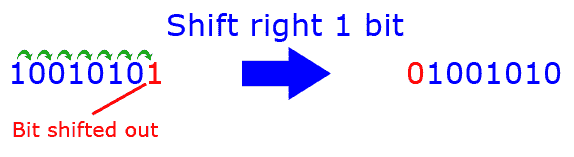
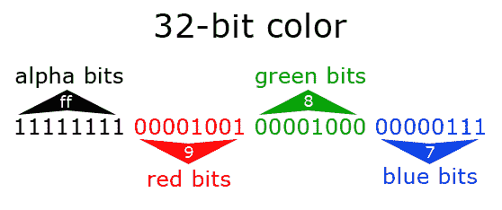
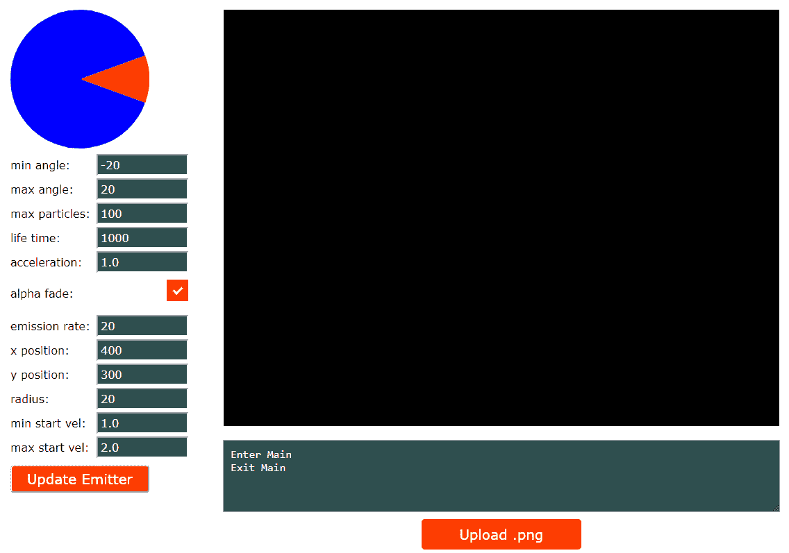
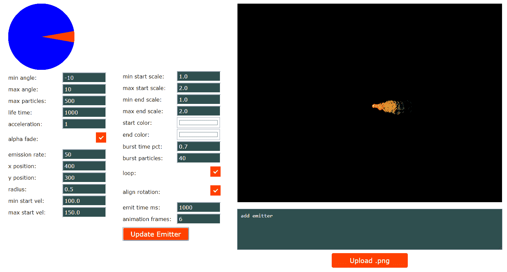
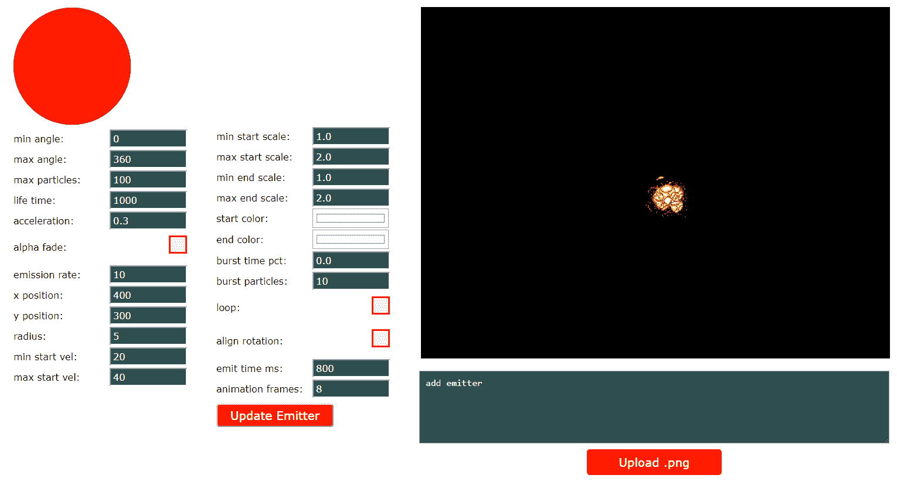

# 第九章：改进的粒子系统

我们在上一章中开发的*粒子系统*是一个很好的开始，但您可以使用它创建的效果相当单调。我们的粒子不会旋转或缩放，它们不会动画，它们在外观上相对一致。

在本章中，您需要在构建中包含几个图像，以使该项目正常工作。确保您包含了此项目的 GitHub 存储库中的`/Chapter09/sprites/`文件夹。如果您想要从 GitHub 构建粒子系统工具，该工具的源代码位于`/Chapter09/advanced-particle-tool/`文件夹中。如果您还没有下载 GitHub 项目，可以在此处在线获取：[`github.com/PacktPublishing/Hands-On-Game-Develop`](https://github.com/PacktPublishing/Hands-On-Game-Development-with-WebAssembly)。

如果我们希望从我们的粒子系统中获得最大的效果，我们需要为其添加更多功能。在本章中，我们将添加以下附加功能：

+   粒子在其生命周期内的比例

+   粒子旋转

+   动画粒子

+   随时间改变颜色

+   支持粒子爆发

+   支持循环和非循环发射器

# 修改我们的 HTML 外壳文件

我们需要做的第一件事是在 HTML 外壳文件中添加一些新的输入。我们将复制`basic_particle_shell.html`文件到一个新的外壳文件，我们将称之为`advanced_particle_shell.html`。我们将在原始容器和`canvas`元素之间的外壳文件的 HTML 部分中添加第二个容器类`div`元素和许多新的输入。以下是新容器元素的样子：

```cpp
<div class="container">
<div class="empty_box">&nbsp;</div><br/>
<span class="label">min start scale:</span>
<input type="number" id="min_starting_scale" max="9.9" min="0.1" step="0.1" value="1.0" class="em_input"><br/>
<span class="label">max start scale:</span>
<input type="number" id="max_starting_scale" max="10.0" min="0.2" step="0.1" value="2.0" class="em_input"><br/>
<span class="label">min end scale:</span>
<input type="number" id="min_end_scale" max="9.9" min="0.1" step="0.1" value="1.0" class="em_input">
<br/>
<span class="label">max end scale:</span>
<input type="number" id="max_end_scale" max="10.0" min="0.2" step="0.1" value="2.0" class="em_input">
<br/>
<span class="label">start color:</span>
<input type="color" id="start_color" value="#ffffff" class="color_input"><br/>
<span class="label">end color:</span>
<input type="color" id="end_color" value="#ffffff" class="color_input"><br/>
<span class="label">burst time pct:</span>
<input type="number" id="burst_time" max="1.0" min="0.0" step="0.05" value="0.0" class="em_input">
<br/>
<span class="label">burst particles:</span>
<input type="number" id="burst_particles" max="100" min="0" step="1" value="0" class="em_input">
<br/>
<label class="ccontainer"><span class="label">loop:</span>
    <input type="checkbox" id="loop" checked="checked">
    <span class="checkmark"></span>
</label>
<br/>
<label class="ccontainer"><span class="label">align rotation:</span>
    <input type="checkbox" id="align_rotation" checked="checked">
    <span class="checkmark"></span>
</label>
<br/>
<span class="label">emit time ms:</span>
<input type="number" id="emit_time" max="10000" min="100" step="100" value="1000" class="em_input">
<br/>
<span class="label">animation frames:</span>
<input type="number" id="animation_frames" max="64" min="1" step="1" value="1" class="em_input">
<br/>
<div class="input_box">
<button id="update_btn" class="em_button" onclick="UpdateClick()">Update Emitter</button>
</div>
</div>
```

# 缩放值

缩放精灵意味着通过其原始大小的某个倍数修改该精灵的大小。例如，如果我们使用缩放值`2.0`来缩放一个 16 x 16 的精灵，那么该精灵将呈现为画布上的 32 x 32 图像。这个新容器以四个输入元素开始，以及它们的标签，告诉粒子系统如何在其生命周期内缩放粒子。`min_starting_scale`和`max_starting_scale`元素是粒子的起始范围缩放。如果您希望粒子始终以`1.0`的比例（与`.png`图像大小的 1 比 1 比例）开始，您应该在这两个字段中都放入`1.0`。实际的起始比例值将是在这些字段中放入的两个值之间随机选择的值。我们还没有在此界面中添加任何检查来验证`max`是否大于`min`，因此请确保`max`与`min`值相同或大于`min`值，否则这将破坏发射器。接下来的两个`input`元素是`min_end_scale`和`max_end_scale`。与起始比例值一样，实际的结束比例将是在这些字段中放入的两个值之间随机选择的值。在粒子的生命周期中的任何给定点，它将具有一个比例，该比例是在该粒子生命周期开始时分配的比例值和结束时的比例值之间插值的值。因此，如果我从`1.0`的比例值开始，然后以`3.0`的比例值结束，当粒子的生命周期过了一半时，粒子的比例值将是`2.0`。

以下是 HTML 文件中这些元素的样子：

```cpp
<span class="label">min start scale:</span>
<input type="number" id="min_starting_scale" max="9.9" min="0.1" step="0.1" value="1.0" class="em_input"><br/>
<span class="label">max start scale:</span>
<input type="number" id="max_starting_scale" max="10.0" min="0.2" step="0.1" value="2.0" class="em_input"><br/>
<span class="label">min end scale:</span>
<input type="number" id="min_end_scale" max="9.9" min="0.1" step="0.1" value="1.0" class="em_input">
<br/>
<span class="label">max end scale:</span>
<input type="number" id="max_end_scale" max="10.0" min="0.2" step="0.1" value="2.0" class="em_input">
<br/>
```

# 颜色混合值

SDL 有一个名为`SDL_SetTextureColorMod`的函数，能够修改纹理的红色、绿色和蓝色通道。这个函数只能减少颜色通道值，所以在灰度图像上使用这些值效果最好。HTML 中的下两个输入是`start_color`和`end_color`。这些值将用于修改粒子在其生命周期内的颜色通道。每个颜色通道（红色、绿色和蓝色）在粒子的生命周期内进行插值。

以下是 HTML 文件中这些元素的样子：

```cpp
<span class="label">start color:</span>
<input type="color" id="start_color" value="#ffffff" class="color_input"><br/>
<span class="label">end color:</span>
<input type="color" id="end_color" value="#ffffff" class="color_input"><br/>
```

# 粒子爆发

到目前为止，我们所使用的粒子系统都发射一致的粒子流。在粒子系统的生命周期内，我们可能希望在某个时间点突发发射一大批粒子。接下来的两个输入元素是`burst_time`和`burst_particles`。`burst_time`元素允许值从`0.0`到`1.0`。这个数字代表粒子发射器生命周期中爆发将发生的时间点。`0.0`表示爆发将在发射器生命周期的开始时发生，`1.0`表示在结束时发生，`0.5`表示在中间时发生。在`burst_time`元素之后是`burst_particles`元素。该元素包含爆发时发射的粒子数量。在调整此值为较大值之前，请确保将`max_particles`输入元素设置为可以容纳爆发的值。例如，如果你有一个每秒发射`20`个粒子的粒子发射器，并且你的最大粒子数也是`20`个粒子，那么添加任何大小的爆发都不会被注意到，因为粒子池中没有足够的非活动粒子供爆发使用。

以下是 HTML 文件中这些元素的外观：

```cpp
<span class="label">burst time pct:</span>
<input type="number" id="burst_time" max="1.0" min="0.0" step="0.05" value="0.0" class="em_input">
<br/>
<span class="label">burst particles:</span>
<input type="number" id="burst_particles" max="100" min="0" step="1" value="0" class="em_input">
<br/>
```

# 循环发射器

一些发射器在固定时间内执行，然后在时间到期时停止。这种发射器的例子是爆炸。一旦爆炸效果完成，我们希望它结束。另一种类型的发射器可能会循环，它会继续执行，直到其他代码停止发射器。这种发射器的例子是我们飞船的引擎排气口。只要我们的飞船在加速，我们希望看到一串粒子从它的后面排放出来。HTML 中的下一个元素是一个循环复选框元素。如果点击，发射器将继续发射，即使其寿命已经结束。如果与此发射器相关联的是一次性爆发，那么每次发射器通过循环的那部分时，爆发都会发生。

以下是 HTML 中输入元素的外观：

```cpp
<label class="ccontainer"><span class="label">loop:</span>
<input type="checkbox" id="loop" checked="checked">
<span class="checkmark"></span>
</label>
<br/>
```

# 对齐粒子旋转

*旋转*可以改善许多粒子效果。由于我们在项目中被迫选择要在粒子系统中使用的值，因此，坦率地说，我可以写一本关于粒子系统的整本书。与之前为粒子的比例所做的旋转值范围不同，我们将有一个单一的标志，允许用户选择粒子系统是否将其旋转与发射速度矢量对齐。我发现这是一个愉快的效果。用户将通过`id="align_rotation"`复选框做出这个决定。

以下是 HTML 代码的外观：

```cpp
<label class="ccontainer"><span class="label">align rotation:</span>
 <input type="checkbox" id="align_rotation" checked="checked">
 <span class="checkmark"></span>
 </label>
 <br/>
```

# 发射时间

*发射时间*是我们的粒子发射器在停止运行之前运行的毫秒数，或者如果用户已经选中循环复选框，则循环。如果粒子系统循环，这个值只对具有突发的粒子系统才会有影响。这将导致每次粒子系统通过循环时都会发生爆发。

HTML 代码如下：

```cpp
<span class="label">emit time ms:</span>
<input type="number" id="emit_time" max="10000" min="100" step="100" value="1000" class="em_input"><br/>
```

# 动画帧

如果我们想创建一个具有多帧动画的粒子，我们可以在这里添加帧数。此功能假定*水平条形精灵表*，并将加载的图像文件均匀分割在*x*轴上。当这个值为`1`时，没有动画，因为只有一个单独的帧。动画的帧时间将均匀分配到单个粒子的存活时间上。换句话说，如果你有一个十帧动画，粒子寿命为 1,000 毫秒，那么动画的每一帧将显示 100 毫秒（1,000/10）。

以下是 HTML 元素：

```cpp
<span class="label">animation frames:</span>
<input type="number" id="animation_frames" max="64" min="1" step="1" value="1" class="em_input"><br/>
```

现在我们已经定义了 HTML，让我们来看看代码的 JavaScript 部分。

# 修改 JavaScript

我们正在创建的工具是在我们已经进行了几章工作的游戏之外运行的。因此，我们正在修改一个新的 HTML 外壳文件，并且我们将编写大量的 JavaScript 代码，以便将用户界面与稍后将放入游戏中的 WebAssembly 类集成起来。让我们花点时间来逐步了解我们需要添加到新的 HTML 外壳文件中的所有 JavaScript 函数。

# JavaScript UpdateClick 函数

在我们修改了 HTML 之后，我们需要做的下一件事是修改`UpdateClick()` JavaScript 函数，以便它可以从 HTML 元素中获取新值，并将这些值传递给`Module.ccall`函数调用`update_emitter`。

以下是完整的`UpdateClick`函数的新版本：

```cpp
function UpdateClick() {
    if( ready == false || image_added == false ) {
        return;
    }
    var max_particles = Number(document.getElementById
                        ("max_particles").value);
    var min_angle = Number(document.getElementById
                    ("min_angle").value) / 180 * Math.PI;
    var max_angle = Number(document.getElementById
                    ("max_angle").value) / 180 * Math.PI
    var particle_lifetime = Number(document.getElementById
                            ("lifetime").value);
    var acceleration = Number(document.getElementById
                       ("acceleration").value);
    var alpha_fade = Boolean(document.getElementById
                     ("alpha_fade").checked);
    var emission_rate = Number(document.getElementById
                        ("emission_rate").value);
    var x_pos = Number(document.getElementById
                ("x_pos").value);
    var y_pos = Number(document.getElementById
                ("y_pos").value);
    var radius = Number(document.getElementById
                 ("radius").value);
    var min_starting_velocity = Number(document.getElementById
                                ("min_starting_vel").value);
    var max_starting_velocity = Number(document.getElementById
                                ("max_starting_vel").value);

    /* NEW INPUT PARAMETERS */
    var min_start_scale = Number(document.getElementById
                          ("min_starting_scale").value);
    var max_start_scale = Number(document.getElementById
                          ("max_starting_scale").value);
    var min_end_scale = Number(document.getElementById
                        ("min_end_scale").value);
    var max_end_scale = Number(document.getElementById
                        ("max_end_scale").value);
    var start_color_str = document.getElementById
                          ("start_color").value.substr(1, 7);
    var start_color = parseInt(start_color_str, 16);
    var end_color_str = document.getElementById
                        ("end_color").value.substr(1, 7);
    var end_color = parseInt(end_color_str, 16);
    var burst_time = Number(document.getElementById
                     ("burst_time").value);
    var burst_particles = Number(document.getElementById
                          ("burst_particles").value);
    var loop = Boolean(document.getElementById
               ("loop").checked);
    var align_rotation = Boolean(document.getElementById
                         ("align_rotation").checked);
    var emit_time = Number(document.getElementById
                    ("emit_time").value);
    var animation_frames = Number(document.getElementById
                           ("animation_frames").value);

    Module.ccall('update_emitter', 'undefined', ["number", "number", 
    "number", "number", "number", "bool", "number", "number",
    "number", "number", "number", "number",
    /* new parameters */
    "number", "number", "number", "number", "number", "number", 
    "number", "number", "bool", "bool", "number"],
    [max_particles, min_angle, max_angle, particle_lifetime, 
    acceleration, alpha_fade, min_starting_velocity, 
    max_starting_velocity, emission_rate, x_pos, y_pos, radius,
    /* new parameters */
    min_start_scale, max_start_scale, min_end_scale, max_end_scale,
    start_color, end_color, burst_time, burst_particles,    
    loop, align_rotation, emit_time, animation_frames]);
    }
```

正如您所看到的，我们在这个 JavaScript 函数中添加了新的本地变量，用于存储我们从新的 HTML 元素中获取的值。检索缩放值并将其强制转换为数字以传递给`update_emitter`现在应该看起来非常熟悉。以下是该代码：

```cpp
var min_start_scale = Number(document.getElementById
                      ("min_starting_scale").value);
var max_start_scale = Number(document.getElementById
                      ("max_starting_scale").value);
var min_end_scale = Number(document.getElementById
                    ("min_end_scale").value);
var max_end_scale = Number(document.getElementById
                    ("max_end_scale").value);
```

# 强制转换颜色值

在 JavaScript 中，变量强制转换是将一个变量类型转换为另一个变量类型的过程。由于 JavaScript 是一种弱类型语言，强制转换与类型转换有所不同，后者类似于强类型语言（如 C 和 C++）中的变量强制转换。

将我们的颜色值强制转换为`Integer`值是一个两步过程。这些元素中的值是以`*#*`字符开头的字符串，后面跟着一个六位十六进制数。我们需要做的第一件事是删除该起始的`#`字符，因为它将阻止我们将该字符串解析为整数。我们可以通过简单的`substr`来实现这一点，以获取元素内部值的子字符串（字符串的一部分）。

以下是`start_color`的代码：

```cpp
var start_color_str = document.getElementById
                      ("start_color").value.substr(1, 7);
```

我们知道字符串的长度始终为七个字符，但我们只想要最后的六个字符。现在，我们已经得到了起始颜色的十六进制表示，但它仍然是一个字符串变量。现在，我们需要将其强制转换为一个`Integer`值，并且我们必须告诉`parseInt`函数使用十六进制（base 16），因此我们将值`16`作为第二个参数传递给`parseInt`：

```cpp
var start_color = parseInt(start_color_str, 16);
```

现在，我们已经将`start_color`强制转换为整数，我们将对`end_color`执行相同的操作：

```cpp
var end_color_str = document.getElementById
                    ("end_color").value.substr(1, 7);
var end_color = parseInt(end_color_str, 16);
```

# 额外的变量强制转换

在`start_color`和`end_color`强制转换之后，我们必须执行的其余强制转换应该感觉很熟悉。我们将`burst_time`、`burst_particles`、`emit_time`和`animation_frames`中的值强制转换为`Number`变量。我们将从`loop`和`align_rotation`中检查的值强制转换为布尔变量。

以下是强制转换代码的其余部分：

```cpp
var burst_time = Number(document.getElementById
                 ("burst_time").value);
var burst_particles = Number(document.getElementById
                      ("burst_particles").value);
var loop = Boolean(document.getElementById
           ("loop").checked);
var align_rotation = Boolean(document.getElementById
                     ("align_rotation").checked);
var emit_time = Number(document.getElementById
                ("emit_time").value);
var animation_frames = Number(document.getElementById
                       ("animation_frames").value);
```

最后，我们需要将变量类型和新变量添加到我们的`Module.ccall`调用中，以便在我们的 WebAssembly 模块中调用`update_emitter`：

```cpp
Module.ccall('update_emitter', 'undefined', ["number", "number",                                       "number", "number", "number", "bool",
                                  "number", "number", "number",                                           "number", "number","number",
                                            /* new parameters */
                                             "number", "number",
                                             "number", "number",
                                             "number", "number",
                                             "number", "number",
                                             "bool", "bool", "number"],
                                            [max_particles, min_angle, 
                                             max_angle,
                                             particle_lifetime,         
                                             acceleration, alpha_fade,
                                             min_starting_velocity, 
                                             max_starting_velocity,
                                             emission_rate, x_pos, 
                                             y_pos, radius,
                                            /* new parameters */
                                             min_start_scale,   
                                             max_start_scale,
                                             min_end_scale, 
                                             max_end_scale,
                                             start_color, end_color,
                                             burst_time, 
                                             burst_particles,
                                             loop, align_rotation, 
                                             emit_time,
                                             animation_frames
                                         ]);
```

# 修改 handleFiles 函数

我们需要对 HTML 外壳文件进行的最后更改是修改`handleFiles`函数。这些修改实际上与`UpdateClick`函数的更改相同。当您逐步执行代码时，您将看到`handleFiles`中复制的相同强制转换，并且`Module.ccall`到`add_emitter`将使用相同的新参数类型和参数进行更新。以下是最新版本的`handleFiles`函数的代码：

```cpp
function handleFiles(files) {
    var file_count = 0;
    for (var i = 0; i < files.length; i++) {
        if (files[i].type.match(/image.png/)) {
            var file = files[i]; 
            var file_name = file.name;
            var fr = new FileReader();
            fr.onload = function (file) {
                var data = new Uint8Array(fr.result);
                Module.FS_createDataFile('/', file_name, data, true, true, 
                true);
                var max_particles = Number(document.getElementById
                                    ("max_particles").value);
                var min_angle = Number(document.getElementById
                                ("min_angle").value) / 180 * Math.PI;
                var max_angle = Number(document.getElementById
                                ("max_angle").value) / 180 * Math.PI
                var particle_lifetime = Number(document.getElementById
                                        ("lifetime").value);
                var acceleration = Number(document.getElementById
                                   ("acceleration").value);
                var alpha_fade = Boolean(document.getElementById
                                 ("alpha_fade").checked);
                var emission_rate = Number(document.getElementById
                                    ("emission_rate").value);
                var x_pos = Number(document.getElementById
                                  ("x_pos").value);
                var y_pos = Number(document.getElementById
                                  ("y_pos").value);
                var radius = Number(document.getElementById
                                   ("radius").value);
                var min_starting_velocity = Number(document.getElementById
                                            ("min_starting_vel").value);
                var max_starting_velocity = Number(document.getElementById
                                            ("max_starting_vel").value);

                /* NEW INPUT PARAMETERS */
                var min_start_scale = Number(document.getElementById
                                      ("min_starting_scale").value);
                var max_start_scale = Number(document.getElementById
                                      ("max_starting_scale").value);
                var min_end_scale = Number(document.getElementById
                                    ("min_end_scale").value);
                var max_end_scale = Number(document.getElementById
                                    ("max_end_scale").value);
                var start_color_str = document.getElementById
                                     ("start_color").value.substr(1, 7);
                var start_color = parseInt(start_color_str, 16);
                var end_color_str = document.getElementById
                                    ("end_color").value.substr(1, 7);
                var end_color = parseInt(end_color_str, 16);
                var burst_time = Number(document.getElementById
                                 ("burst_time").value);
                var burst_particles = Number(document.getElementById
                                      ("burst_particles").value);
                var loop = Boolean(document.getElementById
                           ("loop").checked);
                var align_rotation = Boolean(document.getElementById 
                                     ("align_rotation").checked);
                var emit_time = Number(document.getElementById
                                ("emit_time").value);
                var animation_frames = Number(document.getElementById
                                       ("animation_frames").value);

                Module.ccall('add_emitter', 'undefined', 
                ["string","number", "number", "number", 
                "number","number","bool","number","number",
                "number", "number", "number","number", 
                /* new parameters */ 
                "number", "number", "number",
                "number", "number", "number", "number", 
                "number","bool", "bool", "number"],
                    file_name,max_particles,min_angle,max_angle,
                    particle_lifetime,acceleration,alpha_fade,
                    min_starting_velocity,max_starting_velocity,
                    emission_rate, x_pos,y_pos,radius,
                    /* new parameters */ 
                    min_start_scale,max_start_scale,min_end_scale, 
                    max_end_scale,start_color,end_color,
                    burst_time,burst_particles,loop,
                    align_rotation,emit_time,animation_frames ]);
                image_added = true;
            };
            fr.readAsArrayBuffer(files[i]); }}}
```

现在我们有了 JavaScript 代码，我们可以开始对 WebAssembly 模块进行修改。

# 修改 Particle 类

现在我们已经对 HTML 外壳文件进行了更改，我们需要对 WebAssembly 模块进行一些更改，以支持这些新参数。我们将从下往上逐步进行工作，从`Particle`类开始。这个类不仅对我们正在构建的设计粒子系统的工具有用，而且是我们完成后将能够引入我们的游戏中的几个类之一，这将使我们能够添加一些美丽的效果。

以下是`game.hpp`文件中粒子类定义的样子：

```cpp
class Particle {
    public:
        bool m_active;
        bool m_alpha_fade;
        bool m_color_mod;
        bool m_align_rotation;
        float m_rotation;

        Uint8 m_start_red;
        Uint8 m_start_green;
        Uint8 m_start_blue;

        Uint8 m_end_red;
        Uint8 m_end_green;
        Uint8 m_end_blue;

        Uint8 m_current_red;
        Uint8 m_current_green;
        Uint8 m_current_blue;

        SDL_Texture *m_sprite_texture;
        int m_ttl;

        Uint32 m_life_time;
        Uint32 m_animation_frames;
        Uint32 m_current_frame;
        Uint32 m_next_frame_ms;

        float m_acceleration;
        float m_alpha;
        float m_width;
        float m_height;
        float m_start_scale;
        float m_end_scale;
        float m_current_scale;

        Point m_position;
        Point m_velocity;

        SDL_Rect m_dest = {.x = 0, .y = 0, .w = 0, .h = 0 };
        SDL_Rect m_src = {.x = 0, .y = 0, .w = 0, .h = 0 };

        Particle( SDL_Texture *sprite, Uint32 life_time, float 
        acceleration,
                    bool alpha_fade, int width, int height, bool 
                    align_rotation,
                    Uint32 start_color,
                    Uint32 end_color,
                    Uint32 animation_frames );
        void Update( Uint32 life_time, float acceleration,
                     bool alpha_fade, bool align_rotation,
                     Uint32 start_color, Uint32 end_color,
                     Uint32 animation_frames );

        void Spawn( float x, float y, float velocity_x, float 
                velocity_y,
                    float start_scale, float end_scale, float rotation );

        void Move();
        void Render();
};
```

# 新属性

我们将逐步介绍已添加到`Particle`类定义中的新属性，并简要讨论每个新属性的作用。我们添加的第一个属性是`bool m_color_mod`。在我们的 HTML 中，我们没有为这个值添加复选框，所以您可能会想知道为什么这里有一个。原因是性能。如果用户不想要颜色修改，调用`SDL_SetTextureColorMod`就是浪费。如果我们将两个白色值传递给`Particle`对象，就不需要进行插值或调用修改值。我们可以每次检查开始和结束颜色，看它们的值是否为`0xffffff`，但我觉得添加这个标志会使检查更清晰。

# 对齐旋转属性

接下来跟随的`m_align_rotation`标志只是我们从复选框中传递的标志。如果这个值为`true`，粒子将自行旋转以指向它移动的方向。接下来是浮点变量`m_rotation`。这个属性变量保存粒子的角度，将根据粒子移动的方向进行旋转。以下是这些值在我们的代码中的样子：

```cpp
bool m_align_rotation;
float m_rotation;
```

# 颜色属性

我之前提到的颜色 mod 标志使得对下一组值的检查变得更容易。我们在 HTML 中表示红色、绿色和蓝色值的十六进制颜色值需要作为整数传递，以便它可以被分解为三个 8 位通道。以下是代码中这些 8 位颜色变量的样子：

```cpp
Uint8 m_start_red;
Uint8 m_start_green;
Uint8 m_start_blue;

Uint8 m_end_red;
Uint8 m_end_green;
Uint8 m_end_blue;

Uint8 m_current_red;
Uint8 m_current_green;
Uint8 m_current_blue;
```

您会注意到这些都是声明为`Uint8`的 8 位无符号整数变量。当 SDL 执行颜色修改时，它不会将 RGB 值作为单个变量传入；相反，它会将这些值分解为三个表示每个单独通道的 8 位变量。`m_start_(color)`变量和`m_end_(color)`变量将根据粒子寿命进行插值，得到`m_current_(color)`变量，这将作为通道传递给 SDL 进行颜色修改。因为我们将这些值作为单个颜色变量从 JavaScript 传递，所以`Particle`构造函数和`Update`函数需要执行位操作来设置这些单独的通道变量。

# 动画属性

接下来的一组新属性都与`Particle`中新的帧动画功能有关。以下是代码中的这些属性：

```cpp
Uint32 m_animation_frames;
Uint32 m_current_frame;
Uint32 m_next_frame_ms;
```

第一个属性`m_animation_frames`是间接从 JavaScript 传递的值。它告诉`Particle`类在将纹理渲染到画布时有多少帧。第二个属性`m_current_frame`由`Particle`类用于跟踪它当前应该渲染的帧。最后一个属性变量`m_next_frame_ms`告诉粒子在必须增加当前帧以显示序列中的下一帧之前还有多少毫秒。

# 大小和比例属性

接下来一批属性与粒子的大小和比例有关。在此代码的先前版本中，我们在`m_dest`矩形中处理了宽度和高度。这已不再实际，因为这个矩形的宽度和高度（`w`和`h`）属性需要被修改以适应我们当前的比例。以下是这些新变量在代码中的样子：

```cpp
float m_width;
float m_height;

float m_start_scale;
float m_end_scale;
float m_current_scale;
```

`m_width`和`m_height`属性现在是必需的，以跟踪粒子的原始宽度和高度，这些宽度和高度已经通过比例调整。

`m_start_scale`和`m_end_scale`属性是在 JavaScript 中定义的`max`和`min`值之间随机选择的值。

`m_current_scale`属性是在渲染粒子时用于计算`m_dest.w`和`m_dest.h`值的当前比例。当前比例将是在`m_start_scale`和`m_end_scale`属性之间插值的值。

# 源矩形属性

在先前版本的代码中，我们没有帧动画粒子。因此，我们不需要声明源矩形。如果要将整个纹理渲染到画布上，可以在调用`SDL_RenderCopy`时传入`NULL`，这就是我们所做的。现在我们有了帧动画，我们将传入纹理渲染到画布的位置和尺寸。因此，我们需要定义一个源矩形属性：

```cpp
SDL_Rect m_src = {.x = 0, .y = 0, .w = 0, .h = 0 };
```

# 额外的构造函数参数

现在我们已经了解了所有新属性，我们将简要讨论我们的函数签名所需的更改。`Particle`类构造函数必须添加一些新参数，以支持我们的对齐旋转、颜色修改和帧动画功能。构造函数的新签名如下：

```cpp
Particle( SDL_Texture *sprite, Uint32 life_time, float acceleration,
             bool alpha_fade, int width, int height, bool align_rotation,
             Uint32 start_color,
             Uint32 end_color,
             Uint32 animation_frames );
```

名为`align_rotation`的布尔值告诉构造函数将粒子的旋转与其移动方向对齐。`start_color`和`end_color`参数是颜色修改值，如果我们使用粒子系统的新颜色修改功能。最后一个参数`animation_frames`告诉粒子系统是否正在使用帧动画系统，如果是，它将使用多少帧。

# `Update`函数的参数

对`Update`函数签名的修改反映了我们需要对构造函数进行的更改。一共有四个新参数，用于影响对齐旋转、颜色修改系统和帧动画系统。

新的`Update`函数签名如下：

```cpp
void Update( Uint32 life_time, float acceleration,
             bool alpha_fade, bool align_rotation,
             Uint32 start_color, Uint32 end_color,
             Uint32 m_animation_frames );
```

# `Spawn`函数的参数

最后需要修改的函数签名是`Spawn`函数。需要新值来允许`Emitter`在生成单个粒子时设置比例和旋转值。`float start_scale`和`float end_scale`参数用于设置生成粒子时的起始和结束比例乘数。添加的最后一个参数是`float rotation`，表示基于这个特定粒子的*x*和*y*速度的角度。以下是函数的新版本：

```cpp
void Spawn( float x, float y, float velocity_x, float velocity_y,
             float start_scale, float end_scale, float rotation );
```

# 对 particle.cpp 的更改

我们需要对`Particle`类进行的下一组更改都是对我们在`particle.cpp`文件中定义的函数进行的更改。跟踪对这些函数所做的更改是具有挑战性的，因此我将带领您了解我们讨论的每个函数中所发生的一切，而不是讨论这些更改。

# 粒子构造函数逻辑

新的`Particle`构造函数中的逻辑添加了大量代码，为我们的新功能设置了舞台。函数的最新版本如下：

```cpp
Particle::Particle( SDL_Texture *sprite_texture, Uint32 life_time, 
                   float acceleration, bool alpha_fade, int width, 
                   int height, bool align_rotation,
                   Uint32 start_color, Uint32 end_color, 
                   Uint32 animation_frames ) {

    if( start_color != 0xffffff || end_color != 0xffffff ) {
        m_color_mod = true;
        m_start_red = (Uint8)(start_color >> 16);
        m_start_green = (Uint8)(start_color >> 8);
        m_start_blue = (Uint8)(start_color);

        m_end_red = (Uint8)(end_color >> 16);
        m_end_green = (Uint8)(end_color >> 8);
        m_end_blue = (Uint8)(end_color);

        m_current_red = m_start_red;
        m_current_green = m_start_green;
        m_current_blue = m_start_blue;
    }
    else {
        m_color_mod = false;

        m_start_red = (Uint8)255;
        m_start_green = (Uint8)255;
        m_start_blue = (Uint8)255;

        m_end_red = (Uint8)255;
        m_end_green = (Uint8)255;
        m_end_blue = (Uint8)255;

        m_current_red = m_start_red;
        m_current_green = m_start_green;
        m_current_blue = m_start_blue;
    }
    m_align_rotation = align_rotation;
    m_animation_frames = animation_frames;
    m_sprite_texture = sprite_texture;
    m_life_time = life_time;
    m_acceleration = acceleration;
    m_alpha_fade = alpha_fade;
    m_width = (float)width;
    m_height = (float)height;

    m_src.w = m_dest.w = (int)((float)width / (float)m_animation_frames);
    m_src.h = m_dest.h = height;

    m_next_frame_ms = m_life_time / m_animation_frames;
    m_current_frame = 0;
    m_active = false;
}
```

这段代码的第一大批用于设置粒子生命周期开始和结束时的 8 位颜色通道。如果起始颜色或结束颜色不是`0xffffff`（白色），我们将使用`>>`运算符（位移）设置起始和结束颜色通道。以下是设置起始通道的代码：

```cpp
m_start_red = (Uint8)(start_color >> 16);
m_start_green = (Uint8)(start_color >> 8);
m_start_blue = (Uint8)(start_color);
```

如果您不熟悉右移位运算符`>>`，它会将左侧的整数向右移动右侧的位数。例如，一个二进制值为 15（0000 1111）向右移动两位将返回一个新值 3（0000 0011）。当我们向右移动时，向右移的任何位都会丢失，并且值为 0 的位会从左侧移入：



图 9.1：右位移的示例

如果我们有一个 RGB 整数，每个通道占用 1 字节或 8 位。因此，如果 R = **9**，G = **8**，B = **7**，我们的十六进制整数值看起来像这样：ff090807\. 如果我们想得到 R 值，我们需要移除这个 4 字节整数右侧的两个字节。每个字节是 8 位，所以我们会取出我们的 RGB 并使用`>>`运算符将其向右移动 16 位。然后我们会得到值`09`，我们可以用它来设置我们的 8 位红色通道。当我们处理绿色通道时，我们希望从右侧取出第二个字节，以便我们可以移除 8 位。现在，在我们的 4 字节整数中，我们会有 00000908\. 因为我们将其移入一个 8 位整数，所有不在最右侧字节中的数据在赋值时都会丢失，所以我们最终得到绿色通道中的`08`。最后，蓝色通道的值已经在最右侧字节中。我们只需要将其转换为 8 位整数，因此我们会丢失不在蓝色通道中的所有数据。以下是 32 位颜色的图示：



图 9.2：32 位整数中的颜色位

我们必须对结束颜色通道执行相同的操作：

```cpp
m_end_red = (Uint8)(end_color >> 16);
m_end_green = (Uint8)(end_color >> 8);
m_end_blue = (Uint8)(end_color);
```

最后我们要做的是将当前颜色通道设置为起始颜色通道。我们这样做是为了使用颜色的起始值创建我们的粒子。

如果起始颜色和结束颜色都是白色，我们希望将颜色修改标志设置为`false`，这样我们就不会尝试修改这个粒子的颜色。我们将所有颜色通道初始化为`255`。以下是执行此操作的代码：

```cpp
else {
    m_color_mod = false;
    m_start_red = (Uint8)255;
    m_start_green = (Uint8)255;
    m_start_blue = (Uint8)255;

    m_end_red = (Uint8)255;
    m_end_green = (Uint8)255;
    m_end_blue = (Uint8)255;

    m_current_red = m_start_red;
    m_current_green = m_start_green;
    m_current_blue = m_start_blue;
}
```

在管理颜色修改的代码之后是一些初始化代码，它从构造函数中传入的参数设置了这个对象的属性变量：

```cpp
m_align_rotation = align_rotation;
m_animation_frames = animation_frames;
m_sprite_texture = sprite_texture;
m_life_time = life_time;
m_acceleration = acceleration;
m_alpha_fade = alpha_fade;

m_width = (float)width;
m_height = (float)height;
```

然后，我们根据传入的高度和宽度以及粒子的动画帧数设置源矩形和目标矩形：

```cpp
m_src.w = m_dest.w = (int)((float)width / (float)m_animation_frames);
m_src.h = m_dest.h = height;
```

代码的最后两行将当前帧初始化为`0`，并将我们的活动标志初始化为`false`。所有动画都从第`0`帧开始，直到生成新的粒子才会变为活动状态。

以下是代码的最后几行：

```cpp
m_current_frame = 0;
m_active = false;
```

# 粒子更新逻辑

`Particle`类的`Update`函数在之前通过 PNG 文件上传创建的每个粒子上运行。这个函数更新了构造函数中设置的大部分值。唯一的例外是粒子的宽度和高度尺寸必须保持不变。这是因为构造函数根据上传的图像文件的尺寸设置了这些值。我不觉得有必要逐步介绍这个函数的每个部分，因为它与我们刚刚讨论过的构造函数非常相似。花点时间看一下代码，看看它有多相似：

```cpp
void Particle::Update( Uint32 life_time, float acceleration, 
                       bool alpha_fade, bool align_rotation,
                       Uint32 start_color, Uint32 end_color, 
                       Uint32 animation_frames ) {
    if( start_color != 0xffffff || end_color != 0xffffff ) {
        m_color_mod = true;

        m_start_red = (Uint8)(start_color >> 16);
        m_start_green = (Uint8)(start_color >> 8);
        m_start_blue = (Uint8)(start_color);

        m_end_red = (Uint8)(end_color >> 16);
        m_end_green = (Uint8)(end_color >> 8);
        m_end_blue = (Uint8)(end_color);

        m_current_red = m_start_red;
        m_current_green = m_start_green;
        m_current_blue = m_start_blue;
    }
     else {
        m_color_mod = false;

        m_start_red = (Uint8)255;
        m_start_green = (Uint8)255;
        m_start_blue = (Uint8)255;

        m_end_red = (Uint8)255;
        m_end_green = (Uint8)255;
        m_end_blue = (Uint8)255;

        m_current_red = m_start_red;
        m_current_green = m_start_green;
        m_current_blue = m_start_blue;
    }

    m_align_rotation = align_rotation;
    m_life_time = life_time;
    m_acceleration = acceleration;
    m_alpha_fade = alpha_fade;
    m_active = false;

    m_current_frame = 0;
    m_animation_frames = animation_frames;
    m_next_frame_ms = m_life_time / m_animation_frames;;

    m_src.w = m_dest.w = (int)((float)m_width / (float)m_animation_frames);
    m_src.h = m_dest.h = m_height;
}
```

# 粒子生成函数

`Particle`类的`Spawn`函数由`Emitter`在需要发射新粒子时运行。当发射器达到下一个粒子发射时间时，它会在粒子池中寻找一个标记为非活动的粒子。如果找到一个粒子，它会调用该粒子的`Spawn`函数，激活粒子并设置其运行时的几个值。每次粒子被发射时，`Emitter`都会改变传递给`Spawn`的所有值。以下是这个函数的代码：

```cpp
void Particle::Spawn( float x, float y,
                      float velocity_x, float velocity_y,
                      float start_scale, float end_scale,
                      float rotation ) {
     m_position.x = x;
     m_dest.x = (int)m_position.x;
     m_position.y = y;
     m_dest.y = (int)m_position.y;

    m_velocity.x = velocity_x;
    m_velocity.y = velocity_y;

    m_alpha = 255.0;
    m_active = true;
    m_ttl = m_life_time;
    m_rotation = rotation;

    m_current_red = m_start_red;
    m_current_green = m_start_green;
    m_current_blue = m_start_blue;

    m_current_scale = m_start_scale = start_scale;
    m_end_scale = end_scale;

    m_current_frame = 0;
    m_next_frame_ms = m_life_time / m_animation_frames;
}
```

这个函数中几乎所有的操作都是初始化，非常直接。前四行初始化了位置属性（`m_position`），以及与目标矩形相关的位置（`m_dest`）。然后设置了速度。Alpha 始终从`255`开始。粒子被激活，生存时间变量被激活，旋转被设置。颜色通道被重新初始化，比例被初始化，当前帧和下一帧的时间被设置。

# 粒子移动函数

`Particle`类的`Move`函数是一个不仅改变粒子渲染位置，还调整粒子生命周期开始和结束之间所有插值数值的函数。让我们逐步看一下代码：

```cpp
void Particle::Move() {
    float time_pct = 1.0 - (float)m_ttl / (float)m_life_time;
    m_current_frame = (int)(time_pct * (float)m_animation_frames);
    float acc_adjusted = 1.0f;

    if( m_acceleration < 1.0f ) {
        acc_adjusted = 1.0f - m_acceleration;
        acc_adjusted *= delta_time;
        acc_adjusted = 1.0f - acc_adjusted;
    }
    else if( m_acceleration > 1.0f ) {
        acc_adjusted = m_acceleration - 1.0f;
        acc_adjusted *= delta_time;
        acc_adjusted += 1.0f;
    }
    m_velocity.x *= acc_adjusted;
    m_velocity.y *= acc_adjusted;

    m_position.x += m_velocity.x * delta_time;
    m_position.y += m_velocity.y * delta_time;

    m_dest.x = (int)m_position.x;
    m_dest.y = (int)m_position.y;

    if( m_alpha_fade == true ) {
         m_alpha = 255.0 * (1.0 - time_pct);
         if( m_alpha < 0 ) {
            m_alpha = 0;
        }
    }
    else {
        m_alpha = 255.0;
    }
    if( m_color_mod == true ) {
        m_current_red = m_start_red + (Uint8)(( m_end_red - m_start_red
        ) * 
        time_pct);
        m_current_green = m_start_green + (Uint8)(( m_end_green -
        m_start_green ) * 
        time_pct);
        m_current_blue = m_start_blue + (Uint8)(( m_end_blue -
        m_start_blue ) * 
        time_pct);
    }

    m_current_scale = m_start_scale + (m_end_scale - m_start_scale) * 
    time_pct;
    m_dest.w = (int)(m_src.w * m_current_scale);
    m_dest.h = (int)(m_src.h * m_current_scale);    
    m_ttl -= diff_time;

    if( m_ttl <= 0 ) {
        m_active = false;
    }
    else {
        m_src.x = (int)(m_src.w * m_current_frame);
    }
}
```

`Move`函数的第一行计算`time_pct`。这是一个浮点值，范围从`0.0`到`1.0`。当粒子刚刚生成时，该变量的值为`0.0`，当粒子准备停用时，该值为`1.0`。它给我们一个浮点值，指示我们在这个粒子的寿命中的位置：

```cpp
float time_pct = 1.0 - (float)m_ttl / (float)m_life_time;
```

`m_ttl`属性是粒子在毫秒内的存活时间，`m_life_time`是粒子的总寿命。这个值对于在`Move`函数内进行所有插值计算非常有用。

以下一行根据`time_pct`中的值返回当前帧：

```cpp
m_current_frame = (int)(time_pct * (float)m_animation_frames);
```

之后，几行代码根据加速度值调整粒子的 x 和 y 速度：

```cpp
float acc_adjusted = 1.0f;

if( m_acceleration < 1.0f ) {
    acc_adjusted = 1.0f - m_acceleration;
    acc_adjusted *= delta_time;
    acc_adjusted = 1.0f - acc_adjusted;
}
else if( m_acceleration > 1.0f ) {
    acc_adjusted = m_acceleration - 1.0f;
    acc_adjusted *= delta_time;
    acc_adjusted += 1.0f;
}

m_velocity.x *= acc_adjusted;
m_velocity.y *= acc_adjusted;
```

我们需要将`acc_adjusted`变量设置为`m_acceleration`变量的修改版本，根据已经过去的秒数（`delta_time`）来调整。在改变`m_velocity`值后，我们需要使用这些速度值来修改粒子的位置：

```cpp
m_position.x += m_velocity.x * delta_time;
m_position.y += m_velocity.y * delta_time;

m_dest.x = (int)m_position.x;
m_dest.y = (int)m_position.y;
```

如果`m_alpha_fade`变量为`true`，代码将修改 alpha 值，使其在`time_pct`值变为`1.0`时插值为`0`。如果`m_alpha_fade`标志未设置，alpha 值将设置为`255`（完全不透明）。以下是代码：

```cpp
if( m_alpha_fade == true ) {
    m_alpha = 255.0 * (1.0 - time_pct);
    if( m_alpha < 0 ) {
        m_alpha = 0;
    }
}
else {
    m_alpha = 255.0;
}
```

如果`m_color_mod`标志为`true`，我们需要使用`time_pct`来在起始通道颜色值和结束通道颜色值之间进行插值，以找到当前通道颜色值：

```cpp
if( m_color_mod == true ) {
    m_current_red = m_start_red + (Uint8)(( m_end_red - m_start_red ) *         
    time_pct);
    m_current_green = m_start_green + (Uint8)(( m_end_green -
    m_start_green ) * time_pct);
    m_current_blue = m_start_blue + (Uint8)(( m_end_blue - m_start_blue         
    ) * time_pct);
}
```

找到每个颜色通道的插值值后，我们需要使用`time_pct`来插值当前比例。然后，我们根据当前比例值和源矩形的尺寸设置目标宽度和目标高度：

```cpp
m_current_scale = m_start_scale + (m_end_scale - m_start_scale) * time_pct;
m_dest.w = (int)(m_src.w * m_current_scale);
m_dest.h = (int)(m_src.h * m_current_scale);
```

我们将做的最后一件事是减少`m_ttl`变量（存活时间）的值，减去`diff_time`（自上一帧渲染以来的时间）。如果存活时间降至或低于`0`，我们将停用粒子，使其在粒子池中可用，并停止渲染。如果还有一些存活时间，我们将`m_src.x`（源矩形*x*值）设置为我们要渲染的帧的正确位置：

```cpp
m_ttl -= diff_time;
if( m_ttl <= 0 ) {
    m_active = false;
}
else {
    m_src.x = (int)(m_src.w * m_current_frame);
}
```

# 粒子渲染函数

我们`Particle`类中的最后一个函数是`Render`函数。`Emitter`类为粒子池中的每个活动粒子调用此函数。该函数在粒子使用的精灵纹理上设置 alpha 和颜色通道值。然后，它检查`m_align_rotation`标志，看看纹理是否需要使用`SDL_RenderCopy`或`SDL_RederCopyEx`复制到后台缓冲区。这两个渲染调用之间的区别在于`SDL_RenderCopyEx`允许复制进行旋转或翻转。这两个函数都使用`m_src`矩形来确定要复制的纹理内的矩形。两者都使用`m_dest`矩形来确定后台缓冲区中的目的地，我们在那里复制我们的纹理数据：

```cpp
void Particle::Render() {

    SDL_SetTextureAlphaMod(m_sprite_texture,
                            (Uint8)m_alpha );

    if( m_color_mod == true ) {
        SDL_SetTextureColorMod(m_sprite_texture,
        m_current_red,
        m_current_green,
        m_current_blue );
    }

    if( m_align_rotation == true ) {
        SDL_RenderCopyEx( renderer, m_sprite_texture, &m_src, &m_dest, 
                            m_rotation, NULL, SDL_FLIP_NONE );
    }
    else {
        SDL_RenderCopy( renderer, m_sprite_texture, &m_src, &m_dest );
    }
}
```

在接下来的部分，我们将讨论如何修改我们的`Emitter`类以适应我们的改进。

# 修改`Emitter`类

正如我之前提到的，在讨论`Emitter`类时，它管理和发射粒子。在典型的粒子系统中，可能会有许多发射器。在我们的游戏中，最终会允许多个发射器，但在这个工具中，为了简单起见，我们将保持单个发射器。`Emitter`类中定义了四个函数，我们将更改其中的三个。唯一不需要更改的函数是`GetFreeParticle`函数。如果你不记得，`GetFreeParticle`循环遍历`m_particle_pool`（粒子池属性），寻找未标记为激活的粒子（`particle->m_active == false`）。如果找到，它返回该粒子。如果没有找到，它返回`null`。

# 发射器构造函数

`Emitter`构造函数的代码将需要更改，以便我们可以设置支持新粒子系统功能所需的属性。以下是新`Emitter`构造函数的代码：

```cpp
Emitter::Emitter(char* sprite_file, int max_particles, float min_angle, 
         float max_angle, Uint32 particle_lifetime, 
         float acceleration, bool alpha_fade,
         float min_starting_velocity, float max_starting_velocity,
         Uint32 emission_rate, int x_pos, int y_pos, float radius,
         float min_start_scale, float max_start_scale,
         float min_end_scale, float max_end_scale,
         Uint32 start_color, Uint32 end_color,
         float burst_time_pct, Uint32 burst_particles,
         bool loop, bool align_rotation, Uint32 emit_time_ms, 
         Uint32 animation_frames ) {
    m_start_color = start_color;
    m_end_color = end_color;
    m_active = true;
    if( min_starting_velocity > max_starting_velocity ) {
        m_min_starting_velocity = max_starting_velocity;
        m_max_starting_velocity = min_starting_velocity;
    }
    else {
        m_min_starting_velocity = min_starting_velocity;
        m_max_starting_velocity = max_starting_velocity;
    }
    SDL_Surface *temp_surface = IMG_Load( sprite_file );
    if( !temp_surface ) {
        printf("failed to load image: %s\n", IMG_GetError() );
        return;
    }
    m_sprite_texture = SDL_CreateTextureFromSurface( renderer, temp_surface 
    );
    SDL_FreeSurface( temp_surface );
    SDL_QueryTexture( m_sprite_texture,
                        NULL, NULL,
                        &m_sprite_width, &m_sprite_height );
    m_max_particles = max_particles;
    for( int i = 0; i < m_max_particles; i++ ) {
        m_particle_pool.push_back(
            new Particle( m_sprite_texture, particle_lifetime, 

                          acceleration, alpha_fade, m_sprite_width, 
                          m_sprite_height, align_rotation,
                          m_start_color, m_end_color, 
                          animation_frames )
            );
    }
    m_max_angle = max_angle;
    m_min_angle = min_angle;
    m_radius = radius;
    m_position.x = (float)x_pos;
    m_position.y = (float)y_pos;
    m_emission_rate = emission_rate;
    m_emission_time_ms = 1000 / m_emission_rate;
    m_next_emission = 0;
    /* new values */
    m_min_start_scale = min_start_scale;
    m_max_start_scale = max_start_scale;
    m_min_end_scale = min_end_scale;
    m_max_end_scale = max_end_scale;

    m_loop = loop;
    m_align_rotation = align_rotation;
    m_emit_loop_ms = emit_time_ms;
    m_ttl = m_emit_loop_ms;
    m_animation_frames = animation_frames;
    m_burst_time_pct = burst_time_pct;
    m_burst_particles = burst_particles;
    m_has_burst = false;
}
```

这段代码已经改变了很多，我觉得有必要逐步讲解整个函数。前两行设置了`color`属性，然后通过将`m_active`设置为`true`来激活发射器。当发射器被创建或更新时，我们将此激活标志设置为`true`。如果是循环发射器，激活标志将一直保持激活状态。如果`Emitter`不循环，当它达到由`emit_time_ms`参数设置的发射时间结束时，发射器将停止发射。

接下来我们要做的是设置最小和最大起始速度。我们在`Emitter`中有一些代码，确保`max_starting_velocity`大于`min_starting_velocity`，但当我们将这段代码移到游戏中时，我们可能选择将值设置为任何有效的值。以下是代码：

```cpp
if( min_starting_velocity > max_starting_velocity ) {
    m_min_starting_velocity = max_starting_velocity;
    m_max_starting_velocity = min_starting_velocity;
}
else {
    m_min_starting_velocity = min_starting_velocity;
    m_max_starting_velocity = max_starting_velocity;
}
```

设置速度后，使用`sprite_file`字符串创建一个 SDL 表面，这是我们加载到 WebAssembly 虚拟文件系统中的文件的位置。如果该文件不在虚拟文件系统中，我们会打印出错误消息并退出构造函数：

```cpp
SDL_Surface *temp_surface = IMG_Load( sprite_file );

if( !temp_surface ) {
    printf("failed to load image: %s\n", IMG_GetError() );
    return;
}
```

在从图像文件创建表面后，我们使用该表面创建一个名为`m_sprite_texture`的 SDL 纹理，然后我们使用`SDL_FreeSurface`来销毁表面使用的内存，因为现在我们已经有了纹理，表面就不再需要了。然后，我们调用`SDL_QueryTexture`来检索精灵纹理的宽度和高度，并使用它们来设置`Emitter`的属性`m_sprite_width`和`m_sprite_height`。以下是代码：

```cpp
m_sprite_texture = SDL_CreateTextureFromSurface( renderer, temp_surface );
SDL_FreeSurface( temp_surface );
SDL_QueryTexture( m_sprite_texture,
                  NULL, NULL,
                  &m_sprite_width, &m_sprite_height );
```

接下来我们需要设置`m_max_particles`属性，并使用该变量初始化粒子池。使用`for`循环将新粒子推送到`std::vector`变量`m_particle_pool`的末尾：

```cpp
m_max_particles = max_particles;
for( int i = 0; i < m_max_particles; i++ ) {
    m_particle_pool.push_back(
        new Particle( m_sprite_texture, particle_lifetime, acceleration,
                        alpha_fade, m_sprite_width, m_sprite_height, 
                        align_rotation,
                        m_start_color, m_end_color, animation_frames )
    );
}
```

设置好粒子池后，我们使用参数设置了旧和新粒子系统值的发射器属性：

```cpp
m_max_angle = max_angle;
m_min_angle = min_angle;
m_radius = radius;
m_position.x = (float)x_pos;
m_position.y = (float)y_pos;
m_emission_rate = emission_rate;
m_emission_time_ms = 1000 / m_emission_rate;
m_next_emission = 0;

/* new values */
m_min_start_scale = min_start_scale;
m_max_start_scale = max_start_scale;
m_min_end_scale = min_end_scale;
m_max_end_scale = max_end_scale;

m_loop = loop;
m_align_rotation = align_rotation;
m_emit_loop_ms = emit_time_ms;
m_ttl = m_emit_loop_ms;
m_animation_frames = animation_frames;
m_burst_time_pct = burst_time_pct;
m_burst_particles = burst_particles;
m_has_burst = false;
```

# 发射器更新逻辑

`Emitter`的`Update`函数类似于构造函数，但在`Emitter`已经存在且需要更新时运行。此函数首先设置`Emitter`上的所有属性变量：

```cpp
if( min_starting_velocity > max_starting_velocity ) {
    m_min_starting_velocity = max_starting_velocity;
    m_max_starting_velocity = min_starting_velocity;
}
else {
    m_min_starting_velocity = min_starting_velocity;
    m_max_starting_velocity = max_starting_velocity;
}
m_active = true;
m_has_burst = false;
m_max_particles = max_particles;
m_min_angle = min_angle;
m_max_angle = max_angle;
m_emission_rate = emission_rate;
m_emission_time_ms = 1000 / m_emission_rate;
m_position.x = (float)x_pos;
m_position.y = (float)y_pos;
m_radius = radius;
/* new values */
m_min_start_scale = min_start_scale;
m_max_start_scale = max_start_scale;
m_min_end_scale = min_end_scale;
m_max_end_scale = max_end_scale;
m_start_color = start_color;
m_end_color = end_color;
m_burst_time_pct = burst_time_pct;
m_burst_particles = burst_particles;
m_loop = loop;
m_align_rotation = align_rotation;
m_emit_loop_ms = emit_time_ms;
m_ttl = m_emit_loop_ms;
m_animation_frames = animation_frames;
```

设置属性变量后，我们可能需要增加或减少`m_particle_pool`向量（粒子池）的大小。如果我们的粒子池中的粒子数量大于新的最大粒子数量，我们可以通过简单的调整大小来缩小粒子池。如果粒子池太小，我们需要循环遍历创建新粒子并将这些粒子添加到池中的代码。我们一直这样做，直到池的大小与新的最大粒子数量匹配。以下是执行此操作的代码：

```cpp
if( m_particle_pool.size() > m_max_particles ) {
    m_particle_pool.resize( m_max_particles );
}
else if( m_max_particles > m_particle_pool.size() ) {
    while( m_max_particles > m_particle_pool.size() ) {
        m_particle_pool.push_back(
            new Particle( m_sprite_texture, particle_lifetime, 
                            acceleration, alpha_fade, m_sprite_width, 
                            m_sprite_height, m_align_rotation,
                            m_start_color, m_end_color, 
                            m_animation_frames )
        );
    }
}
```

现在我们已经调整了粒子池的大小，我们需要循环遍历该池中的每个粒子，并对每个粒子运行`Update`函数，以确保每个粒子都使用新的属性值进行更新。以下是代码：

```cpp
Particle* particle;
std::vector<Particle*>::iterator it;
for( it = m_particle_pool.begin(); it != m_particle_pool.end(); it++ ) {
    particle = *it;
    particle->Update( particle_lifetime, acceleration, alpha_fade, 
    m_align_rotation, m_start_color, m_end_color, m_animation_frames );
}
```

# 发射器移动函数

我们需要更新的最后一个发射器函数是`Emitter::Move`函数。这个函数确定本帧是否发射任何新粒子，以及如果是，有多少。它还使用随机化来选择这些粒子的许多起始值，这些值在我们的 HTML 中传递的范围内。在生成任何新粒子后，函数将循环遍历粒子池，移动和渲染当前处于活动状态的任何粒子。以下是这个函数的完整代码：

```cpp
void Emitter::Move() {
    Particle* particle;
    std::vector<Particle*>::iterator it;
    if( m_active == true ) {
        m_next_emission -= diff_time;
        m_ttl -= diff_time;
        if( m_ttl <= 0 ) {
            if( m_loop ) {
                m_ttl = m_emit_loop_ms;
                m_has_burst = false;
            }
            else {
                m_active = false;
            }
        }
        if( m_burst_particles > 0 && m_has_burst == false ) {
            if( (float)m_ttl / (float)m_emit_loop_ms <= 1.0 - 
            m_burst_time_pct ) {
                m_has_burst = true;
                m_next_emission -= m_burst_particles * m_emission_time_ms;
            }
        }
        while( m_next_emission <= 0 ) {
            m_next_emission += m_emission_time_ms;
            particle = GetFreeParticle();
            if( particle != NULL ) {
                Point spawn_point;
                spawn_point.x = get_random_float( 0.0, m_radius );
                Point velocity_point;
                velocity_point.x = get_random_float( 
                m_min_starting_velocity, m_max_starting_velocity );
                float angle = get_random_float( m_min_angle, m_max_angle );
                float start_scale = get_random_float( m_min_start_scale, 
                m_max_start_scale );
                float end_scale = get_random_float( m_min_end_scale, 
                m_max_end_scale );
                spawn_point.x += m_position.x;
                spawn_point.y += m_position.y;
                particle->Spawn(spawn_point.x, spawn_point.y, 
                velocity_point.x, velocity_point.y,
                                start_scale, end_scale,
                                (int)(angle / 3.14159 * 180.0 + 360.0) 
                                % 360 );
            }
            else {
                m_next_emission = m_emission_time_ms;
            }
        }
    }
    for( it = m_particle_pool.begin(); it != m_particle_pool.end(); it++ ) {
        particle = *it;
        if( particle->m_active ) {
            particle->Move();
            particle->Render();
        }
    }
}
```

我们将这段代码分成两部分，以便更容易理解。`Move`函数的第一部分负责在必要时生成新粒子。第二部分负责移动和渲染任何已激活的粒子。只有当`m_active`（活动标志）为`true`时，才会运行这段代码的粒子生成部分。第二部分无论如何都会运行。当发射器停用时，我们不希望由发射器生成的所有粒子突然消失。相反，我们希望所有粒子继续移动和渲染，直到它们全部被停用。

我们现在将逐步解释代码中的每个部分：

```cpp
if( m_active == true ) {
    m_next_emission -= diff_time;
    m_ttl -= diff_time;
    if( m_ttl <= 0 ) {
        if( m_loop ) {
            m_ttl = m_emit_loop_ms;
            m_has_burst = false;
        }
        else {
            m_active = false;
        }
    }
```

这段代码首先检查`m_active`属性变量，以确保发射器当前处于活动状态。如果不是，我们可以跳过生成新粒子的部分。接下来我们要做的是从`m_next_emission`属性中减去`diff_time`。当`m_next_emission`属性达到或低于`0`时，将生成另一个粒子。我们还从`m_ttl`中减去`diff_time`，这是存活时间属性。在从`m_ttl`中减去后，我们立即检查`m_ttl`中的值，看它是否小于或等于`0`。如果存活时间低于`0`，我们需要检查`m_loop`属性，看这是否是一个循环发射器。如果是循环发射器，我们重置存活时间变量，并将`m_has_burst`标志设置为`false`。如果这不是一个循环发射器，我们通过将`m_active`设置为`false`来停用发射器。

以下代码块涉及使用新的爆发功能发射粒子的部分：

```cpp
if( m_burst_particles > 0 && m_has_burst == false ) {
    if( (float)m_ttl / (float)m_emit_loop_ms <= 1.0 - m_burst_time_pct ) {
        m_has_burst = true;
        m_next_emission -= m_burst_particles * m_emission_time_ms;
    }
}
```

爆发粒子功能是我们*高级粒子系统*的新功能。我们在这里使用了嵌套的`if`语句。我们本可以在第一个`if`的末尾加上`&&`，用一个`if`语句完成，但我想分开条件以便更容易理解。外部`if`语句首先检查`m_burst_particles`属性（爆发粒子的数量）是否大于`0`。如果是，那么这个发射器使用爆发系统，并需要在适当的爆发时间创建一波粒子。这个外部`if`语句中的下一个检查是检查爆发是否已经在这个发射器中运行过。由于我们设计了这个爆发系统的方式，每次发射循环只能有一个爆发。因此，如果`m_has_burst`属性为`true`，则不会运行爆发。

继续内部循环，我们需要检查是否已经超过了发射的爆发时间。`m_burst_time_pct`属性保存了一个值，介于`0.0`和`1.0`之间，表示粒子爆发发生的时间百分比。`m_ttl`变量保存了发射器的存活时间（以毫秒为单位）。如果我们将`m_ttl`除以`m_emit_loop_ms`（以毫秒为单位的发射时间），我们得到一个从`1.0`到`0.0`的发射时间倒计时，其中`0.0`表示发射完成。`m_burst_time_pct`变量则相反。值为`0.6`表示爆发发生在我们发射的 60%处。因为这个`if`语句的另一侧是一个倒计时，而爆发时间是递增的，我们需要从`1.0`中减去`m_burst_time_pct`来进行适当的比较。如果`(float)m_ttl / (float)m_emit_loop_ms`小于`1.0 - m_burst_time_pct`，那么我们准备好进行爆发。为了进行爆发，我们首先设置`m_has_burst = true`。这将防止在同一次发射中多次发生爆发。然后，我们从`m_next_emission`中减去爆发粒子的数量，乘以以毫秒为单位的发射时间。

接下来的几行代码进入一个`while`循环，只要下一个发射时间小于`0`，就会发射粒子。在这段代码的先前版本中，我们在这里有一个`if`语句而不是一个循环。这限制了我们的粒子系统每帧只能发射一个粒子。这对一些简单的没有爆发模式的粒子系统可能有效，但一旦添加了爆发，就需要能够在单帧中发射许多粒子。让我们来看看这个：

```cpp
while( m_next_emission <= 0 ) {
    m_next_emission += m_emission_time_ms;
    particle = GetFreeParticle();
    if( particle != NULL ) {
```

`while`循环检查`m_next_emission`是否小于或等于`0`。紧接着的一行将`m_emission_time_ms`添加到下一个发射时间。这样做的效果是，如果我们从`m_next_emission`中减去了一个大数（就像我们在爆发中做的那样），这个循环将允许我们在`Move`函数的单次运行中发射多个粒子。这意味着我们可以在单帧中发射许多粒子。在添加到`m_next_emission`后，我们立即从粒子池中获取一个空闲粒子，通过调用`GetFreeParticle`。如果我们将最大粒子数设置得太小，`GetFreeParticle`可能会用尽我们可以使用的粒子并返回`NULL`。如果是这种情况，我们需要跳过所有发射新粒子的步骤，这就是为什么有`if`语句来检查`NULL`粒子的原因。

一旦我们知道我们可以生成一个粒子，我们需要在 HTML 文件中设置的范围内获取一堆随机值。C/C++的`rand()`函数返回一个随机整数。我们需要的大多数值都是浮点数。我们需要编写一个简单的名为`get_random_float`的函数。这个函数获取一个随机的浮点数，保留三位小数，落在传入的最小值和最大值之间。我们根据这个游戏的需求选择了三位小数的精度。如果以后有必要，这个函数可以修改为更高的精度。

这是为新生成的粒子获取随机值的代码：

```cpp
Point spawn_point;
spawn_point.x = get_random_float( 0.0, m_radius );
Point velocity_point;
velocity_point.x = get_random_float( m_min_starting_velocity, m_max_starting_velocity );
float angle = get_random_float( m_min_angle, m_max_angle );
float start_scale = get_random_float( m_min_start_scale, m_max_start_scale );
float end_scale = get_random_float( m_min_end_scale, m_max_end_scale );
```

我们在这里得到的随机值是我们将生成粒子的发射器距离，粒子的速度，粒子的方向角以及起始和结束的比例值。因为我们希望从我们的发射器中心生成的粒子也具有相同的方向速度，所以我们只给`spawn_point`和`velocity_point`的*x*值分配了一个随机数。我们将使用之前随机生成的相同角度来旋转这两个点。这是这些点的旋转代码：

```cpp
velocity_point.Rotate(angle);
spawn_point.Rotate( angle );
```

我们使用相对于`0,0`原点的位置生成生成点。因为我们的发射器可能不在`0,0`，所以我们需要通过`m_position`点的值来调整生成点的位置。这是我们用来做到这一点的代码：

```cpp
spawn_point.x += m_position.x;
spawn_point.y += m_position.y;
```

我们做的最后一件事是使用我们随机生成的值生成粒子：

```cpp
particle->Spawn(spawn_point.x, spawn_point.y, velocity_point.x, 
                velocity_point.y,
                start_scale, end_scale,
                (int)(angle / 3.14159 * 180.0 + 360.0) % 360 );
```

现在函数已经完成了为当前帧生成粒子，函数需要循环遍历粒子池，寻找活跃的粒子进行移动和渲染：

```cpp
for( it = m_particle_pool.begin(); it != m_particle_pool.end(); it++ ) {
    particle = *it;
    if( particle->m_active ) {
        particle->Move();
        particle->Render();
    }
}
```

在下一节中，我们将更新从 JavaScript 调用的 C++/WebAssembly 函数。

# 外部函数

我们正在编写的*高级粒子系统*具有两个可以从我们应用程序的 JavaScript 中调用的外部函数。这些函数`add_emitter`和`update_emitter`用于在 WebAssembly 模块中插入或修改粒子系统。`advanced_particle.cpp`文件包含这些函数，以及`main`函数，当加载`Module`时调用，以及`show_emission`函数，每帧渲染调用一次。我们不需要修改`main`和`show_emission`函数，因为我们在本章前面为基本粒子系统创建了这些函数。但是，我们需要将我们在 JavaScript 代码中放入的附加参数添加到`add_emitter`和`update_emitter`中。此外，我们创建了一个名为`get_random_float`的实用函数，我们在生成粒子时使用它。因为这个文件包含了我们的其他所有 C 风格函数，我觉得`advanced_particle.cpp`是放置这个函数的最佳位置。

# 随机浮点数

让我们首先讨论新的`get_random_float`函数。以下是代码：

```cpp
float get_random_float( float min, float max ) {
    int int_min = (int)(min * 1000);
    int int_max = (int)(max * 1000);
    if( int_min > int_max ) {
        int temp = int_max;
        int_max = int_min;
        int_min = temp;
    }
    int int_diff = int_max - int_min;
    int int_rand = (int_diff == 0) ? 0 : rand() % int_diff;
    int_rand += int_min;
    return (float)int_rand / 1000.0;
}
```

`％`（取模运算符）用于使随机整数值在`％`后使用的任何值之间的 0 和值之间。取模运算符是一个余数运算符。它返回除法运算的余数。例如，`13％10`将返回 3，`23％10`也将返回 3。对任何数字取`％10`将始终得到 0 到 9 之间的数字。取模与`rand()`结合使用很有用，因为它将导致在`％`后的值之间的随机数。因此，`rand()％10`将导致在 0 和 9 之间的随机数。

`get_random_float`函数接受最小和最大浮点值，并在该范围内生成随机数。前两行获取这些浮点值，将它们乘以 1,000，并将它们转换为整数。因为`rand()`只能使用整数，所以我们需要模拟一个精度值。乘以 1,000 给我们三位小数的精度。例如，如果我们想在 1.125 和 1.725 之间生成一个随机数，那么这两个值都将乘以 1,000，我们将使用`rand()`在 1,125 和 1,175 之间生成一个随机值：

```cpp
int int_min = (int)(min * 1000);
int int_max = (int)(max * 1000);
```

再次，`rand()`只生成随机整数，并且与`rand()`一起使用`％`（取模运算符）将给出`0`和`％`后面的数字之间的数字。因此，我们想知道`int_min`和`int_max`值之间的差异。如果我们从`int_min`中减去`int_max`，我们将得到这个差异的数字。如果调用代码意外地传递了一个比`int_min`的值更小的值，我们可能会被扔掉，因此我们需要一点代码来检查`max`是否小于`min`，如果是，我们需要交换这两个值。以下是`if`语句代码：

```cpp
if( int_min > int_max ) {
    int temp = int_max;
    int_max = int_min;
    int_min = temp;
}
```

现在，我们可以继续获取两者之间的差异。

```cpp
int int_diff = int_max - int_min;
```

在以下代码行中，我们获取 0 和`int_diff`值之间的随机值。我们使用`?:`（三元运算符）来确保在执行`rand() % int_diff`之前，`int_diff`不为 0。这样做的原因是`%`是一个除法余数运算符，所以，就像除以 0 一样，执行`% 0`会导致异常。如果我们的最小值和最大值之间没有差异，我们将返回最小值。因此，通过使用三元运算符，如果`int_diff`为 0，我们可以将`int_rand`设置为 0。以下是代码：

```cpp
int int_rand = (int_diff == 0) ? 0 : rand() % int_diff;
```

然后，我们将`int_min`添加到`int_rand`，这样我们就得到了`int_min`和`int_max`值之间的随机值：

```cpp
int_rand += int_min;
```

我们需要做的最后一件事是将`int_rand`转换为`float`并除以`1000.0`。这将返回一个浮点值，介于传入函数的`min`和`max`浮点值之间。

```cpp
return (float)int_rand / 1000.0;
```

# 添加一个发射器

`add_emitter`函数是一个通过函数，用于检查是否存在发射器，如果存在则删除它。然后创建一个新的`Emitter`对象，传入我们在 HTML 中设置并通过 JavaScript 传递的所有值。我们需要做的更改包括将新参数添加到`add_emitter`函数的签名中，并将这些新参数添加到`Emitter`构造函数的调用中。在函数签名和构造函数调用中，我们将添加一个`/* new parameters */`注释，显示旧参数的结束和新参数的开始位置。以下是新代码：

```cpp
extern "C"
    EMSCRIPTEN_KEEPALIVE
    void add_emitter(char* file_name, int max_particles, float min_angle, 
         float max_angle,
         Uint32 particle_lifetime, float acceleration, bool alpha_fade,
         float min_starting_velocity, float max_starting_velocity,
         Uint32 emission_rate, float x_pos, float y_pos, float radius,
         /* new parameters */
         float min_start_scale, float max_start_scale,
         float min_end_scale, float max_end_scale,
         Uint32 start_color, Uint32 end_color,
         float burst_time_pct, Uint32 burst_particles,
         bool loop, bool align_rotation, Uint32 emit_time_ms,
         Uint32 animation_frames ) {
        if( emitter != NULL ) {
            delete emitter;
        }

        emitter = new Emitter(file_name, max_particles, min_angle, 
                  max_angle,
                  particle_lifetime, acceleration, alpha_fade,
                  min_starting_velocity, max_starting_velocity,
                  emission_rate, x_pos, y_pos, radius,
                  /* new parameters */
                  min_start_scale, max_start_scale,
                  min_end_scale, max_end_scale,
                  start_color, end_color,
                  burst_time_pct, burst_particles,
                  loop, align_rotation, emit_time_ms,
                  animation_frames
                  );
    }
```

# 更新发射器

我们对`update_emitter`函数所做的更改与`add_emitter`函数中所做的更改相似。`add_emitter`和`update_emitter`之间的主要区别在于，如果没有现有的发射器，`update_emitter`将不会运行，而不是调用`Emitter`构造函数来创建新的`Emitter`，它调用现有发射器的`Update`函数。`Update`函数传入所有新值和大部分旧值（除了`char* file_name`）。就像我们对`add_emitter`函数所做的更改一样，我们在函数签名和发射器`Update`函数的调用中放置了一个`/* new parameters */`注释，以显示新参数已添加的位置。以下是代码：

```cpp
extern "C"
    EMSCRIPTEN_KEEPALIVE
    void update_emitter(int max_particles, float min_angle, 
         float max_angle,
         Uint32 particle_lifetime, float acceleration, bool alpha_fade,
         float min_starting_velocity, float max_starting_velocity,
         Uint32 emission_rate, float x_pos, float y_pos, float radius,
         /* new parameters */
         float min_start_scale, float max_start_scale,
         float min_end_scale, float max_end_scale,
         Uint32 start_color, Uint32 end_color,
         float burst_time_pct, Uint32 burst_particles,
         bool loop, bool align_rotation, Uint32 emit_time_ms,
         Uint32 animation_frames ) {
         if( emitter == NULL ) {
                        return;
                    }
                    emitter->Update(max_particles, min_angle, max_angle,
                          particle_lifetime, acceleration, alpha_fade,
                          min_starting_velocity, max_starting_velocity,
                          emission_rate, x_pos, y_pos, radius,
                          /* new parameters */
                          min_start_scale, max_start_scale,
                          min_end_scale, max_end_scale,
                          start_color, end_color,
                          burst_time_pct, burst_particles,
                          loop, align_rotation, emit_time_ms,
                          animation_frames
                    );
                }
```

在下一节中，我们将配置我们的*高级粒子系统工具*来创建一个新的*粒子发射器*。

# 配置粒子发射器

此时，您可能想知道我们何时会回到编写游戏。我们构建这个*粒子发射器配置工具*有几个原因。首先，在编译代码中配置粒子系统是很困难的。如果我们想测试发射器的配置，我们需要在每次测试时重新编译我们的值，或者我们需要编写一个数据加载程序，并在进行配置更改后重新运行游戏。创建一个允许我们测试不同发射器配置的工具可以加快（并且更有趣）粒子系统的创建。

# HTML 外壳和 WebAssembly 模块交互

我创建粒子系统配置工具还有一个别有用心的动机。有可能你们中的一些人并不是为了学习游戏编程而阅读这本书。您可能购买这本书是为了以一种有趣的方式了解更多关于 WebAssembly。编写这个工具是一种有趣的方式来了解 WebAssembly 模块与驱动该模块的 HTML 和 JavaScript 之间的交互。

# 编译和运行新工具

现在我们已经拥有了所有我们想要的参数，是时候重新编译更新版本的配置工具并开始设计一些粒子系统了。

如果您是从 GitHub 项目构建的，您需要从`/Chapter09/advanced-particle-tool/`目录运行编译命令。

首先，在命令行上运行以下命令来编译新的配置工具：

```cpp
em++ emitter.cpp particle.cpp point.cpp advanced_particle.cpp -o particle.html -std=c++17 --shell-file advanced_particle_shell.html -s NO_EXIT_RUNTIME=1 -s USE_WEBGL2=1 -s USE_SDL=2 -s USE_SDL_IMAGE=2 -s SDL2_IMAGE_FORMATS=["png"] -s NO_EXIT_RUNTIME=1 -s EXPORTED_FUNCTIONS="['_add_emitter', '_update_emitter', '_main']" -s EXTRA_EXPORTED_RUNTIME_METHODS="['cwrap', 'ccall']" -s FORCE_FILESYSTEM=1
```

在`emrun`中打开网页或者在 Web 浏览器中打开（如果您正在运行 Web 服务器）。它会看起来像这样：



图 9.3：我们的粒子系统配置工具的屏幕截图

我们将从一个简单的排气发射器开始。对 HTML 值进行以下更改，然后点击“上传.png”按钮：

+   最小角度：-10

+   最大角度：10

+   最大粒子数：500

+   发射速率：50

+   半径：0.5

+   最小起始速度：100.0

+   最大起始速度：150.0

+   爆发时间：0.7

+   爆发粒子数：40

+   动画帧数：6

当您点击“上传.png”按钮后，转到图像目录中的`ProjectileExpOrange.png`文件并打开它。

这是配置工具与我们的排气粒子发射器的屏幕截图：



图 9.4：引擎排气配置

我鼓励您尝试不同的值，直到您得到满意的效果。每当您更改页面左侧的值时，您需要点击“更新发射器”按钮，以查看新值在网页右侧的粒子系统中的反映。

# 创建粒子发射器

现在我们有了一个排气粒子系统，我们将开始将粒子系统代码添加到游戏中，以添加一些漂亮的粒子效果。我想为玩家和敌人的飞船排气口添加一个粒子系统。我还想在我们的动画爆炸上添加一个粒子系统效果，使其更加突出。

我们要做的第一件事是将`particle.cpp`和`emitter.cpp`文件复制到主`Chapter09`目录中。之后，我们需要将这些类定义添加到`game.hpp`文件，以及`get_random_float`函数原型。

# 对 game.hpp 的更改

我们需要做的第一组更改是对`game.hpp`文件。我们需要添加一个`Emitter`类定义，一个`Particle`类定义，以及一个`get_random_float`的外部函数原型。我们还需要向`Ship`类添加一些新属性。这是我们必须添加的`get_random_float`原型的行：

```cpp
extern float get_random_float( float min, float max );
```

# 添加 Particle 类定义

我们必须添加到`game.hpp`的`Particle`类的定义与我们的高级配置工具相同。因为它是相同的，我们不会逐一介绍类中的每个内容。如果您不记得，请随时返回到上一章作为参考。这是我们将添加到`game.hpp`的`Particle`类定义代码：

```cpp
class Particle {
    public:
        bool m_active;
        bool m_alpha_fade;
        bool m_color_mod;
        bool m_align_rotation;

        Uint8 m_start_red;
        Uint8 m_start_green;
        Uint8 m_start_blue;

        Uint8 m_end_red;
        Uint8 m_end_green;
        Uint8 m_end_blue;

        Uint8 m_current_red;
        Uint8 m_current_green;
        Uint8 m_current_blue;

        SDL_Texture *m_sprite_texture;
        int m_ttl;

        Uint32 m_life_time;
        Uint32 m_animation_frames;
        Uint32 m_current_frame;

        Uint32 m_next_frame_ms;
        float m_rotation;
        float m_acceleration;
        float m_alpha;

        float m_width;
        float m_height;

        float m_start_scale;
        float m_end_scale;
        float m_current_scale;

        Point m_position;
        Point m_velocity;
        SDL_Rect m_dest = {.x = 0, .y = 0, .w = 0, .h = 0 };
        SDL_Rect m_src = {.x = 0, .y = 0, .w = 0, .h = 0 };

        Particle( SDL_Texture *sprite, Uint32 life_time, float 
                    acceleration,
                    bool alpha_fade, int width, int height, bool 
                    align_rotation,
                    Uint32 start_color,
                    Uint32 end_color,
                    Uint32 animation_frames );

        void Update( Uint32 life_time, float acceleration,
                    bool alpha_fade, bool align_rotation,
                    Uint32 start_color, Uint32 end_color,
                    Uint32 m_animation_frames );

        void Spawn( float x, float y, float velocity_x, float velocity_y,
                    float start_scale, float end_scale, float rotation );
        void Move();
        void Render();
};
```

# Emitter 类定义

`Emitter`类有一些额外的属性，我们已经添加了这些属性，这些属性帮助`Emitter`相对于游戏对象定位。有一个`Run`函数，我们在粒子发射器配置工具中不需要，但在游戏代码中需要，这样我们就可以随时触发`Emitter`。`Emitter`和`Particle`内部的`Update`函数在游戏中并不是必需的，但我们将它们保留在那里，以免复杂化更改。Emscripten 死代码消除逻辑应该在编译游戏时删除该代码。这是我们需要添加到`games.hpp`的`Emitter`类定义的新代码：

```cpp
class Emitter {
    public:
        bool m_loop;
        bool m_align_rotation;
        bool m_active;
        bool m_has_burst;

        SDL_Texture *m_sprite_texture;
        std::vector<Particle*> m_particle_pool;
        int m_sprite_width;
        int m_sprite_height;
        int m_ttl;

        // added ----------------------------
        int m_x_adjustment = 0;
        int m_y_adjustment = 0;
        // ----------------------------------

        Uint32 m_max_particles;
        Uint32 m_emission_rate;
        Uint32 m_emission_time_ms;

        Uint32 m_start_color;
        Uint32 m_end_color;

        Uint32 m_burst_particles;
        Uint32 m_emit_loop_ms;
        Uint32 m_animation_frames;

        int m_next_emission;

        float* m_parent_rotation;

        float m_max_angle;
        float m_min_angle;
        float m_radius;
        float m_min_starting_velocity;
        float m_max_starting_velocity;

        float m_min_start_scale;
        float m_max_start_scale;
        float m_min_end_scale;
        float m_max_end_scale;
        float m_min_start_rotation;
        float m_max_start_rotation;
        float m_burst_time_pct;

        // added ----------------------------
        float* m_parent_rotation_ptr;
        float* m_parent_x_ptr;
        float* m_parent_y_ptr;
        // -----------------------------------

        Point m_position;

        Emitter(char* sprite_file, int max_particles, float min_angle, 
              float max_angle,
              Uint32 particle_lifetime, float acceleration, 
              bool alpha_fade,
              float min_starting_velocity, float max_starting_velocity,
              Uint32 emission_rate, int x_pos, int y_pos, float radius,
              float min_start_scale, float max_start_scale,
              float min_end_scale, float max_end_scale,
              Uint32 start_color, Uint32 end_color,
              float burst_time_pct, Uint32 burst_particles,
              bool loop, bool align_rotation,
              Uint32 emit_time_ms, Uint32 animation_frames );

        void Update(int max_particles, float min_angle, float max_angle,
             Uint32 particle_lifetime, float acceleration, bool alpha_fade,
             float min_starting_velocity, float max_starting_velocity,
             Uint32 emission_rate, int x_pos, int y_pos, float radius,
             float min_start_scale, float max_start_scale,
             float min_end_scale, float max_end_scale,
             Uint32 start_color, Uint32 end_color,
             float burst_time_pct, Uint32 burst_particles,
             bool loop, bool align_rotation, Uint32 emit_time_ms,
             Uint32 animation_frames );

        void Move();
        Particle* GetFreeParticle();

        void Run(); // added
 };
```

我们添加到粒子系统配置工具的代码被标记为“添加”的注释所包围。让我逐一介绍每个新属性和新函数的作用。以下是前两个添加的属性：

```cpp
int m_x_adjustment = 0;
int m_y_adjustment = 0;
```

这两个值是调整值，用于修改发射器产生粒子的位置。这些变量对于相对于发射器跟随的对象位置的粒子位置进行小的调整非常有用。以下是我们添加的三个属性：

```cpp
float* m_parent_rotation_ptr;
float* m_parent_x_ptr;
float* m_parent_y_ptr;
```

这些是父对象的 x、y 和旋转属性的指针。例如，如果我们设置`Emitter->m_parent_rotation_ptr = &m_Rotation`，那么该指针将指向我们父对象的旋转，我们将能够在我们的`Emitter`中访问该值以调整旋转。对于`m_parent_x_ptr`和`m_parent_y_ptr`也是如此。

最后，我们添加了一个`Run`函数：

```cpp
void Run();
```

这个函数允许一个不循环的粒子发射器重新启动。我们将在`Ship`类中使用这个函数来使用我们添加的`Explosion`发射器。

# emitter.cpp 的更改

现在我们已经了解了我们需要对`game.hpp`进行的更改，我们将逐个函数地了解我们将对`emitter.cpp`文件进行的所有更改。

# 构造函数的更改

构造函数需要做两个更改。首先，我们将在顶部添加一些初始化，将所有新指针初始化为`NULL`。我们不需要在每个发射器中使用这些指针，所以我们可以检查`NULL`来查看它们何时被使用。在更下面，我们将修改传递给构造函数的值，从角度改为弧度。函数如下所示：

```cpp
Emitter::Emitter(char* sprite_file, int max_particles, float min_angle, 
                float max_angle,
                Uint32 particle_lifetime, float acceleration, bool 
                alpha_fade,
                float min_starting_velocity, float max_starting_velocity,
                Uint32 emission_rate, int x_pos, int y_pos, float radius,
                float min_start_scale, float max_start_scale,
                float min_end_scale, float max_end_scale,
                Uint32 start_color, Uint32 end_color,
                float burst_time_pct, Uint32 burst_particles,
                bool loop, bool align_rotation, Uint32 emit_time_ms, Uint32 
                animation_frames ) {
    // added -----------------------------
    m_parent_rotation_ptr = NULL;
    m_parent_x_ptr = NULL;
    m_parent_y_ptr = NULL;
    // -----------------------------------
    m_start_color = start_color;
    m_end_color = end_color;
    m_active = true;

    if( min_starting_velocity > max_starting_velocity ) {
        m_min_starting_velocity = max_starting_velocity;
        m_max_starting_velocity = min_starting_velocity;
    }
    else {
        m_min_starting_velocity = min_starting_velocity;
        m_max_starting_velocity = max_starting_velocity;
    }
    SDL_Surface *temp_surface = IMG_Load( sprite_file );

    if( !temp_surface ) {
        printf("failed to load image: %s\n", IMG_GetError() );
        printf("failed sprite file: %s\n", sprite_file );
        return;
    }
    m_sprite_texture = SDL_CreateTextureFromSurface( renderer, temp_surface 
    );
    SDL_FreeSurface( temp_surface );
    SDL_QueryTexture( m_sprite_texture,
                        NULL, NULL,
                        &m_sprite_width, &m_sprite_height );
                        m_max_particles = max_particles;

    for( int i = 0; i < m_max_particles; i++ ) {
        m_particle_pool.push_back(
            new Particle( m_sprite_texture, particle_lifetime, 
            acceleration,
                            alpha_fade, m_sprite_width, m_sprite_height, 
                            align_rotation,
                            m_start_color, m_end_color, animation_frames )
            );
    }

    // modified -----------------------------
    m_min_angle = (min_angle+90) / 180 * 3.14159;
    m_max_angle = (max_angle+90) / 180 * 3.14159;
    // --------------------------------------

    m_radius = radius;
    m_position.x = (float)x_pos;
    m_position.y = (float)y_pos;
    m_emission_rate = emission_rate;
    m_emission_time_ms = 1000 / m_emission_rate;
    m_next_emission = 0;
    m_min_start_scale = min_start_scale;
    m_max_start_scale = max_start_scale;
    m_min_end_scale = min_end_scale;
    m_max_end_scale = max_end_scale;

    m_loop = loop;
    m_align_rotation = align_rotation;
    m_emit_loop_ms = emit_time_ms;
    m_ttl = m_emit_loop_ms;

    m_animation_frames = animation_frames;
    m_burst_time_pct = burst_time_pct;
    m_burst_particles = burst_particles;
    m_has_burst = false;
}
```

首次更改是在函数的顶部，将我们的新指针属性设置为`NULL`：

```cpp
m_parent_rotation_ptr = NULL;
m_parent_x_ptr = NULL;
m_parent_y_ptr = NULL;
```

稍后，我们将检查这些指针是否为`NULL`，如果不是，我们将使用`m_parent_rotation_ptr`来调整该发射器的旋转角度。我们将使用`m_parent_x_ptr`来改变发射器的 x 坐标，我们将使用`m_parent_y_ptr`来调整该发射器的 y 坐标。之后，我们有修改传入的最小和最大角度从角度到弧度的代码：

```cpp
m_min_angle = (min_angle+90) / 180 * 3.14159;
m_max_angle = (max_angle+90) / 180 * 3.14159;
```

我们需要这样做的真正原因是，我们正在将传递给发射器的值硬编码。如果我们创建了一个数据加载器，我们可以在数据加载时进行转换。但是，因为我们直接从*粒子发射器配置工具*中取出这些值，并将这些值硬编码到对新发射器的调用中，我们要么必须记住每次更改这些值时自己进行转换，要么必须在构造函数和`Update`函数中进行转换。

# 更新函数的更改

`Update`函数不太可能在我们的游戏中被调用。Emscripten 的死代码删除过程应该会将其消除。但是，我们还没有从`Emitter`类中删除它。如果你认为可能会调用它，你可能想要将`m_min_angle`和`m_max_angle`的初始化改为从角度转换为弧度，就像我们在构造函数中所做的那样。

```cpp
m_min_angle = (min_angle+90) / 180 * 3.14159;
m_max_angle = (max_angle+90) / 180 * 3.14159;
```

# 添加 Run 函数

在粒子系统配置工具中，我们不需要`Run`函数，因为调用`Update`函数将运行`Emitter`。`Update`函数在我们的游戏中使用起来太过繁琐。它使用了大量的配置变量，当我们调用函数时可能无法访问。我们只想设置发射器为活动状态，重置生存时间和爆发标志。我们创建了一个小的`Run`函数来做我们需要的事情：

```cpp
void Emitter::Run() {
    m_active = true;
    m_ttl = m_emit_loop_ms;
    m_has_burst = false;
}
```

将`m_active`设置为 true 会使发射器处于活动状态，这样在调用`Move`函数时就可以生成新的粒子。将`m_ttl`重置为`m_emit_loop_ms`可以确保生存时间不会在下一次调用`Move`函数时自动关闭发射器。将`m_has_burst = false`确保了，如果在发射中必须发生粒子爆发，它将运行。

# Move 函数的更改

`Move`函数的新版本需要能够根据父位置修改其位置，并根据父旋转旋转其定义的位置。它还需要能够使用`m_x_adjustment`和`m_y_adjustment`进行微小调整。以下是`Move`的新版本：

```cpp
void Emitter::Move() {
 Particle* particle;
 std::vector<Particle*>::iterator it;
    if( m_active == true ) {
        m_next_emission -= diff_time;
        m_ttl -= diff_time;
        if( m_ttl <= 0 ) {
            if( m_loop ) {
                m_ttl = m_emit_loop_ms;
                m_has_burst = false;
            }
            else { m_active = false; }
        }
        if( m_burst_particles > 0 && m_has_burst == false ) {
            if( (float)m_ttl / (float)m_emit_loop_ms <= 1.0 - 
                m_burst_time_pct ) {
                m_has_burst = true;
                m_next_emission -= m_burst_particles * m_emission_time_ms;
            }
        }
        while( m_next_emission <= 0 ) {
            m_next_emission += m_emission_time_ms;
            particle = GetFreeParticle();
            if( particle != NULL ) {
                Point spawn_point, velocity_point, rotated_position;
                spawn_point.x = get_random_float( 0.0, m_radius );
                velocity_point.x = 
                get_random_float(m_min_starting_velocity, 
                m_max_starting_velocity);
                float angle = get_random_float( m_min_angle,m_max_angle );
                float start_scale = get_random_float(m_min_start_scale, 
                m_max_start_scale);
                float end_scale = get_random_float( m_min_end_scale,
                m_max_end_scale );
                if( m_parent_rotation_ptr != NULL ) {
                    angle += *m_parent_rotation_ptr;
                    rotated_position = m_position;
                    rotated_position.Rotate( *m_parent_rotation_ptr );
                }
                velocity_point.Rotate(angle);
                spawn_point.Rotate( angle );

                if( m_parent_rotation_ptr == NULL ) {
                    spawn_point.x += m_position.x;
                    spawn_point.y += m_position.y;
                    if( m_parent_x_ptr != NULL ) { spawn_point.x += 
                    *m_parent_x_ptr; }
                    if( m_parent_y_ptr != NULL ) { spawn_point.y += 
                    *m_parent_y_ptr; }
                }
                else {
                    spawn_point.x += rotated_position.x;
                    spawn_point.y += rotated_position.y;
                    if( m_parent_x_ptr != NULL ) { spawn_point.x += 
                    *m_parent_x_ptr; }
                    if( m_parent_y_ptr != NULL ) { spawn_point.y += 
                    *m_parent_y_ptr; }
                }
                spawn_point.x += m_x_adjustment;
                spawn_point.y += m_y_adjustment;
                particle->Spawn(spawn_point.x, 
                spawn_point.y,velocity_point.x, velocity_point.y,
                    start_scale, end_scale, (int)(angle / 3.14159 * 180.0 + 
                    360.0) % 360 );
            }
            else {
                m_next_emission = m_emission_time_ms;
            }
        }
    }
    for( it = m_particle_pool.begin(); it != m_particle_pool.end(); it++ ) 
    {
        particle = *it;
        if( particle->m_active ) {
            particle->Move();
            particle->Render();
        }
    }
}
```

大部分代码与早期版本相同。让我们来看看其中的不同之处。首先，如果有旋转的父对象，我们需要旋转整个粒子系统。我们将用于将排气粒子系统添加到飞船对象的这一功能。这个排气必须相对于飞船进行定位。为此，我们需要获取位置并进行旋转。我们还需要将父对象的旋转添加到现有的发射角度。以下是新代码：

```cpp
Point rotated_position;

if( m_parent_rotation_ptr != NULL ) {
    angle += *m_parent_rotation_ptr;
    rotated_position = m_position;
    rotated_position.Rotate( *m_parent_rotation_ptr );
}
```

在顶部，我们创建了一个名为`rotated_position`的新`Point`对象。如果`m_parent_rotation_ptr`不为`NULL`，我们将该值添加到我们之前计算的发射角度上。我们将`m_position`的值复制到`rotated_position`中，并通过父对象的旋转对该位置进行旋转。稍后，我们将检查`m_parent_rotation_ptr`是否不为`NULL`，如果不是，我们将使用`rotated_position`相对于父对象的位置来计算发射器的位置。以下是一个检查`m_parent_rotation_ptr == NULL`的`if`语句。如果它为空，该`if`块的第一部分将执行之前的操作。以下是代码：

```cpp
if( m_parent_rotation_ptr == NULL ) {
    spawn_point.x += m_position.x;
    spawn_point.y += m_position.y;
}
```

因为`if`语句是在检查`m_parent_rotation_ptr == NULL`，我们不想使用粒子系统位置的旋转版本。该块默认使用未修改的`m_position`属性。如果`m_parent_rotation_ptr`不为`NULL`，我们将运行以下`else`块：

```cpp
else {
    spawn_point.x += rotated_position.x;
    spawn_point.y += rotated_position.y;
}
```

这段代码使用了`m_position`的旋转版本。接下来，我们要查看`m_parent_x_ptr`和`m_parent_y_ptr`是否不为`NULL`。如果不是，`spawn_point`将使用这些值添加父对象的位置。以下是这段代码：

```cpp
if( m_parent_x_ptr != NULL ) {
    spawn_point.x += *m_parent_x_ptr;
}
if( m_parent_y_ptr != NULL ) {
    spawn_point.y += *m_parent_y_ptr;
}
```

我们将在`Move`函数中添加的最后一段代码是对生成点进行微调。有时，粒子系统在旋转之前需要进行一些微调，以使它们看起来更加完美。因此，我们添加以下内容：

```cpp
spawn_point.x += m_x_adjustment;
spawn_point.y += m_y_adjustment;
```

`m_x_adjustment`和`m_y_adjustment`的值默认为`0`，因此如果要使用这些值，它们需要在创建发射器后的某个时候进行设置。

# 对 ship.cpp 的更改

接下来，我们要修改`ship.cpp`文件，以使用两个新的粒子发射器。我们需要一个用于飞船排气的粒子发射器，以及一个用于改善飞船爆炸效果的粒子发射器。我们需要对`Ship`类的构造函数、加速函数和渲染函数进行更改。

# Ship 类的构造函数

`Ship`类的构造函数已更改了`Ship`类内的大部分函数。我们不仅初始化了新属性，还需要在发射器上设置父对象和调整值。以下是构造函数的新代码：

```cpp
Ship::Ship() : Collider(8.0) {
    m_Rotation = PI;
    m_DX = 0.0;
    m_DY = 1.0;
    m_VX = 0.0;
    m_VY = 0.0;
    m_LastLaunchTime = current_time;
    m_Accelerating = false;
    m_Exhaust = new Emitter((char*)"/sprites/ProjectileExpOrange.png", 200,
                            -10, 10,
                            400, 1.0, true,
                            0.1, 0.1,
                            30, 0, 12, 0.5,
                            0.5, 1.0,
                            0.5, 1.0,
                            0xffffff, 0xffffff,
                            0.7, 10,
                            true, true,
                            1000, 6 );

    m_Exhaust->m_parent_rotation_ptr = &m_Rotation;
    m_Exhaust->m_parent_x_ptr = &m_X;
    m_Exhaust->m_parent_y_ptr = &m_Y;
    m_Exhaust->m_x_adjustment = 10;
    m_Exhaust->m_y_adjustment = 10;
    m_Exhaust->m_active = false;
    m_Explode = new Emitter((char*)"/sprites/Explode.png", 100,
                             0, 360,
                             1000, 0.3, false,
                             20.0, 40.0,
                             10, 0, 0, 5,
                             1.0, 2.0,
                             1.0, 2.0,
                             0xffffff, 0xffffff,
                             0.0, 10,
                             false, false,
                             800, 8 );
    m_Explode->m_parent_rotation_ptr = &m_Rotation;
    m_Explode->m_parent_x_ptr = &m_X;
    m_Explode->m_parent_y_ptr = &m_Y;
    m_Explode->m_active = false;
}
```

前几行与旧版本相同。新更改从将`m_Accelerating`初始化为`false`开始。之后，我们设置排气发射器，首先创建一个新的发射器，然后设置父对象值和调整值，最后将其设置为非活动状态：

```cpp
m_Exhaust = new Emitter((char*)"/sprites/ProjectileExpOrange.png", 200,
                        -10, 10,
                        400, 1.0, true,
                        0.1, 0.1,
                        30, 0, 12, 0.5,
                        0.5, 1.0,
                        0.5, 1.0,
                        0xffffff, 0xffffff,
                        0.7, 10,
                        true, true,
                        1000, 6 );

 m_Exhaust->m_parent_rotation_ptr = &m_Rotation;
 m_Exhaust->m_parent_x_ptr = &m_X;
 m_Exhaust->m_parent_y_ptr = &m_Y;
 m_Exhaust->m_x_adjustment = 10;
 m_Exhaust->m_y_adjustment = 10;
 m_Exhaust->m_active = false;
```

所有传入`Emitter`函数的值都直接来自*粒子系统配置工具*。我们需要手动将它们添加到我们的函数调用中。如果我们在一个大型项目上工作，这种方法就不太可扩展。我们可能会让配置工具创建某种数据文件（例如 JSON 或 XML）。但出于迅速的目的，我们只是根据配置工具中的内容硬编码了这些值。不幸的是，这些值的顺序与工具中的顺序不同。您需要查看`Emitter`构造函数的签名，以确保将值放在正确的位置：

```cpp
Emitter(char* sprite_file, int max_particles, float min_angle, float max_angle,
        Uint32 particle_lifetime, float acceleration, bool alpha_fade,
        float min_starting_velocity, float max_starting_velocity,
        Uint32 emission_rate, int x_pos, int y_pos, float radius,
        float min_start_scale, float max_start_scale,
        float min_end_scale, float max_end_scale,
        Uint32 start_color, Uint32 end_color,
        float burst_time_pct, Uint32 burst_particles,
        bool loop, bool align_rotation, Uint32 emit_time_ms, Uint32 
        animation_frames );
```

第一个参数`sprite_file`是虚拟文件系统中文件的位置。该文件不会自动包含在项目中。您需要确保它在正确的位置。我们将文件放在`sprites`目录中，并在运行 Emscripten 时使用以下标志：

```cpp
 --preload-file sprites
```

创建`Exhaust`发射器后，我们使用以下代码创建`Explosion`发射器：

```cpp
m_Explode = new Emitter((char*)"/sprites/Explode.png", 100,
                         0, 360,
                         1000, 0.3, false,
                         20.0, 40.0,
                         10, 0, 0, 5,
                         1.0, 2.0,
                         1.0, 2.0,
                         0xffffff, 0xffffff,
                         0.0, 10,
                         false, false,
                         800, 8 );

m_Explode->m_parent_rotation_ptr = &m_Rotation;
m_Explode->m_parent_x_ptr = &m_X;
m_Explode->m_parent_y_ptr = &m_Y;
m_Explode->m_active = false;
```

创建`m_Explode`发射器类似于`m_Exhaust`发射器，但我们根据在*粒子发射器配置工具*中创建的内容传递不同的值给发射器：



图 9.5：爆炸配置

与`m_Exhaust`发射器一样，我们需要设置所有父指针变量并停用发射器。不像`m_Exhaust`，我们不需要使用`m_x_adjustment`和`m_y_adjustment`属性进行微调。

# 飞船类的加速函数

我们只想在飞船加速时运行排气发射器。为此，我们需要在飞船的`Accelerate`函数内设置一个标志。以下是加速函数的新版本：

```cpp
void Ship::Accelerate() {
    m_Accelerating = true; // added line
    m_VX += m_DX * delta_time;
    m_VY += m_DY * delta_time;
}
```

唯一的改变是在开头添加了一行，将`m_Accelerating`设置为`true`。当我们渲染飞船时，我们可以检查这个标志，并根据其中的值启动或停止发射器。

# 飞船类的渲染函数

对`Ship`类的最终更改在飞船的`Render`函数中。在这个函数内部，我们需要添加移动和渲染两个新的粒子系统的代码，以及在飞船加速时打开排气的代码，以及在飞船不加速时关闭排气的代码。以下是函数的新版本：

```cpp
void Ship::Render() {
    if( m_Alive == false ) {
        return;
    }
    m_Exhaust->Move();
    m_Explode->Move();
    dest.x = (int)m_X;
    dest.y = (int)m_Y;
    dest.w = c_Width;
    dest.h = c_Height;
    src.x = 32 * m_CurrentFrame;
    float degrees = (m_Rotation / PI) * 180.0;
    int return_code = SDL_RenderCopyEx( renderer, m_SpriteTexture,
                                         &src, &dest,
                                         degrees, NULL, SDL_FLIP_NONE );
    if( return_code != 0 ) {
        printf("failed to render image: %s\n", IMG_GetError() );
    }

    if( m_Accelerating == false ) {
        m_Exhaust->m_active = false;
    }
    else {
        m_Exhaust->m_active = true;
    }
    m_Accelerating = false;
}
```

看一下添加的第一个代码块，靠近顶部：

```cpp
m_Exhaust->Move();
m_Explode->Move();
```

在发射器上调用`Move`函数会移动和渲染粒子系统中的所有粒子。如果是发射器执行生成新粒子的时间，它也会生成新粒子。在函数的最后，有处理排气发射器的代码：

```cpp
if( m_Accelerating == false ) {
    m_Exhaust->m_active = false;
}
else {
    m_Exhaust->m_active = true;
}
m_Accelerating = false;
```

这段代码检查`m_Accelerating`标志是否为`false`。如果是，我们就停用排气发射器。如果飞船正在加速，我们将`m_active`标志设置为`true`。我们不调用`Run`函数，因为我们每帧都在做这个操作，我们不希望每次循环都重新开始*存活时间*。最后一行将`m_Accelerating`设置为`false`。我们这样做是因为我们的代码中没有检测飞船停止加速的地方。如果飞船正在加速，该标志将在代码的这一点之前被设置为`true`。如果没有，它将保持为`false`。

# 对 projectile_pool.cpp 的更改

我们不需要在`ProjectilePool`类内部做太多改动。实际上，我们只需要对一个函数进行两次更改。`ProjectilePool`类内的`MoveProjectiles`函数执行所有的项目和我们的两艘飞船之间的碰撞检测。如果一艘飞船被摧毁，我们就会在那艘飞船上运行`m_Explode`粒子发射器。这将需要在每艘飞船的碰撞检测条件内添加两行新代码。以下是`MoveProjectiles`函数的新版本：

```cpp
void ProjectilePool::MoveProjectiles() {
    Projectile* projectile;
    std::vector<Projectile*>::iterator it;
    for( it = m_ProjectileList.begin(); it != m_ProjectileList.end(); it++ ) {
        projectile = *it;
        if( projectile->m_Active ) {
            projectile->Move();
            if( projectile->m_CurrentFrame == 0 &&
                player->m_CurrentFrame == 0 &&
                ( projectile->HitTest( player ) ||
                    player->CompoundHitTest( projectile ) ) ) {
                player->m_CurrentFrame = 1;
                player->m_NextFrameTime = ms_per_frame;
                player->m_Explode->Run(); // added
                projectile->m_CurrentFrame = 1;
                projectile->m_NextFrameTime = ms_per_frame;
            }
            if( projectile->m_CurrentFrame == 0 &&
                enemy->m_CurrentFrame == 0 &&
                ( projectile->HitTest( enemy ) ||
                    enemy->CompoundHitTest( projectile ) ) ) {
                enemy->m_CurrentFrame = 1;
                enemy->m_NextFrameTime = ms_per_frame;
                enemy->m_Explode->Run(); // added
                projectile->m_CurrentFrame = 1;
                projectile->m_NextFrameTime = ms_per_frame;
            }
        }
    }
}
```

我添加的两行代码是对`player->m_Explode->Run();`和`enemy->m_Explode->Run();`的调用。这些行在玩家飞船或敌方飞船与其中一个抛射物发生碰撞并被摧毁时执行。

# 对 main.cpp 的更改

我们需要做的最后一个改变是在`main.cpp`文件中添加排气和爆炸粒子系统。这个改变需要添加一个函数`get_random_float`。我们之前讨论过这个函数。这是我们的粒子发射器获取随机浮点值的方法，这些值介于最小值和最大值之间。以下是代码：

```cpp
float get_random_float( float min, float max ) {
    int int_min = (int)(min * 1000);
    int int_max = (int)(max * 1000);
    if( int_min > int_max ) {
        int temp = int_max;
        int_max = int_min;
        int_min = temp;
    }
    int int_diff = int_max - int_min;
    int int_rand = (int_diff == 0) ? 0 : rand() % int_diff;
    int_rand += int_min;
    return (float)int_rand / 1000.0;
}
```

# 编译新的 particle_system.html 文件

现在我们已经对文件进行了所有必要的更改，我们可以继续使用 Emscripten 来编译和测试游戏的新版本。

如果您是从 GitHub 项目构建此项目，您需要从`/Chapter09/`目录运行此编译命令。之前的编译是在`/Chapter09/advanced-particle-tool/`目录中完成的，因此请确保在运行此命令时您在正确的位置；否则，它将没有构建游戏所需的文件。

从命令行执行以下命令：

```cpp
em++ collider.cpp emitter.cpp enemy_ship.cpp particle.cpp player_ship.cpp point.cpp projectile_pool.cpp projectile.cpp ship.cpp main.cpp -o particle_system.html --preload-file sprites -std=c++17 -s USE_WEBGL2=1 -s USE_SDL=2 -s USE_SDL_IMAGE=2 -s SDL2_IMAGE_FORMATS=["png"] -s USE_SDL_IMAGE=2 -s SDL2_IMAGE_FORMATS=["png"]
```

# 进一步进行

我们将不会编写一个用于配置的数据导出工具。这一章已经太长了。当您创建粒子系统时，您可以花费几乎无限的时间来微调它们以满足您的喜好。粒子系统可以有大量的配置参数。您甚至可以使用贝塞尔曲线进行移动、旋转和缩放。一些高级粒子系统可以发射其他粒子。我们可以为粒子系统添加的复杂性没有限制，但是我在这本书中可以添加的页面数量是有限的，因此我鼓励您继续完善这个系统，直到您获得想要的结果。

# 总结

恭喜！您已经通过了一个非常漫长、信息丰富的章节。在过去的两章中，我们讨论了粒子系统是什么以及为什么要使用它们。我们学会了如何向 WebAssembly 虚拟文件系统添加文件以及如何访问它。我们学会了如何在 HTML 外壳文件和 WebAssembly 模块之间创建更高级的交互。然后，我们使用更多功能构建了一个更高级的粒子发射器配置工具。在工具中构建了一些漂亮的粒子系统后，我们将数据和代码用于构建了我们一直在构建的游戏中的两个新粒子发射器。

在下一章中，我们将讨论并构建敌方飞船的人工智能。
