# 第十章：AI 和转向行为

我们一直在编写的游戏 loosly 基于计算机游戏*Spacewar!* 如果你不熟悉*Spacewar!*，它是有史以来第一款计算机游戏。它最初在麻省理工学院拥有的 PDP-1 上运行，并由麻省理工学院的一名名叫史蒂夫·拉塞尔的学生于 1962 年编写。那时，让计算机显示图形输出已经足够困难了。*Spacewar!*以及许多其他早期游戏系统，如*Pong*，都是设计供多人玩的。那是因为编程让计算机像人一样行为是非常困难的。尽管现代**人工智能**（**AI**）算法比过去更智能，但这在某种程度上仍然是真的。

因为我们的游戏是单人玩家网络游戏，我们无法利用第二个人类智能来驱动我们的敌人飞船。在本章之前，我们使用了一个 AI 存根，允许我们的敌人飞船在游戏区域内随机移动和射击。这在这一点上可能对我们有用，但现在我们希望我们的玩家感到受到敌人飞船的威胁。它应该足够聪明，可以在一对一的战斗中与我们的玩家战斗和杀死他。

您需要在构建中包含几个图像才能使此项目工作。确保您从项目的 GitHub 中包含`/Chapter10/sprites/`文件夹。如果您还没有下载 GitHub 项目，您可以在网上获取它：[`github.com/PacktPublishing/Hands-On-Game-Development-with-WebAssembly`](https://github.com/PacktPublishing/Hands-On-Game-Development-with-WebAssembly)。

在本章中，我们将做以下事情：

+   引入 AI 和游戏 AI 的概念

+   为了避开 AI（并增加画布大小），在游戏中添加障碍物

+   为视线引入新的碰撞检测

+   引入**有限状态机**（**FSM**）的概念

+   引入**自主代理**的概念

+   引入**转向行为**的概念

+   将力场添加到我们的游戏中

+   使用 FSM 和转向行为创建 AI

+   调整我们的 AI 以允许敌人飞船避开障碍物

# 什么是游戏 AI？

许多早期的视频游戏避免了 AI，因为当时的硬件条件下这是一个非常具有挑战性的问题。例如，*Space Invaders*，*Galaga*和*Galaxian*都有以特定非智能模式移动的外星人。早期的 Atari 游戏要么是双人游戏（*Pong*），要么是玩家与非智能环境互动（*Breakout*）。早期成功尝试具有 AI 的游戏之一是*PAC-MAN*。*PAC-MAN*中的每个幽灵都有不同的个性，并且在相同的情况下会有不同的行为。*PAC-MAN*还使用了简单的**有限状态机**（**FSM**）。这是一种 AI 类型，在不同的环境情况下 AI 会有不同的行为。如果玩家在*PAC-MAN*中吃了一个*能量豆*，幽灵们会变成蓝色，并突然变得可以被吃掉，这是一种*猎人成为猎物*的命运逆转。虽然幽灵可以被吃掉，但对程序员来说让这些幽灵继续追捕*PAC-MAN*可能更容易。这会让幽灵看起来要么愚蠢要么自杀，这是我们在编写 AI 时想要避免的行为。

在 1950 年，数学和计算机天才艾伦·图灵提出了一个他称之为“模仿游戏”的 AI 基准，但后来它被称为*图灵测试*。他提出了一个游戏，让人类玩家通过基于文本的界面与人类和计算机互动。如果计算机能够说服人类他们正在与另一个人而不是计算机互动，那么该计算机应被认为是智能的。就我个人而言，我觉得我们很久以前就通过了这个门槛。但是当机器威胁到人类智能时，人类喜欢改变目标。

1964 年，麻省理工学院的约瑟夫·魏岑鲍姆编写了一个名为 ELIZA 的聊天机器人。ELIZA 假装是聊天系统另一端的心理医生。ELIZA 成功地愚弄了不少人，让他们相信她是一个真正的心理医生，这可能既是对心理治疗的评论，也是对人类智慧的评论。任何寻找聊天机器人的人都很容易就能发现 ELIZA 不是人类，但约瑟夫·魏岑鲍姆对愿意向 ELIZA 倾诉心事的人数感到非常不安。

Loebner 奖是一项年度图灵测试竞赛，一系列的 AI 专家评委至今还没有被聊天机器人愚弄。如今，许多程序经常愚弄人们，让他们认为自己是人类。我认为，需要一个人类专家来确定一个 AI 是否通过了图灵测试，这已经明显地改变了艾伦·图灵最初设定的目标。我相信，如果我们有一个被聊天机器人愚弄的非专家大样本，我们应该认为那个聊天机器人是智能的，但我岔开了话题。

提到图灵测试的目的是，游戏人工智能需要通过修改后的图灵测试。当你编写游戏人工智能时，你的目标是说服玩家，让他们相信他们不是在与一个彻底失败的游戏对手对战。所有的游戏人工智能都或多或少地很差劲。目前，我们将无法创建 IBM 的沃森（在《危险边缘》中击败肯·詹宁斯的人工智能）的游戏人工智能版本。就像电脑游戏中的一切，我们需要学会在系统的限制内工作。对于基于网络的游戏来说，这些限制可能是相当重要的。

记住，作弊是可以的，但不要被抓住。许多游戏人工智能都作弊。实时战略游戏可能能够看穿战争迷雾。AI 扑克玩家可能能够偷看玩家的牌。我们要作弊的一种方式是允许我们的敌方太空飞船在玩家不允许的方向加速。作弊的关键是确保行为或移动看起来不是不自然的。许多年前，我写了一个在线版本的纸牌游戏 Spades，可以在[`www.icardgames.com/spades.html`](https://www.icardgames.com/spades.html)上玩。玩家的伙伴人工智能被允许偷看每个人的牌。我经常收到的一个常见抱怨是，玩家的伙伴经常会打出玩家的高牌。这是因为 AI 不是看谁当前赢得了这一轮，而是看他后面的玩家是否能赢得这一轮，如果他不打出比玩家出的更高的牌。由于玩家没有意识到这种行为对他们有帮助，我经常收到玩家对伙伴打出高牌的沮丧抱怨。这是一个例子，玩家实际上因为 AI 的行为而表现更好，但却留下了 AI 在做愚蠢选择的印象。我的观点是，游戏人工智能都是关于印象的。记住 HBO 电视剧《西部世界》中 AI 主持人说的话，当其中一个角色问她是否真实时：“如果你分辨不出来，那真的重要吗？”

# 自主代理与自上而下的人工智能

1986 年，Craig Reynolds 创建了一个备受推崇的 AI 程序，名为“Boids”（鸟和机器人的组合）。这个程序创建了一种迷人的鸟群行为，小三角形在屏幕上移动，让观察者想起鸟群或鱼群的行为。当环境中有障碍时，boids 会分开以绕过障碍物，然后重新聚集。两个群体之间的碰撞通常会导致它们合并并继续前进。Boids 算法是 AI 的自主代理的实现。每个个体 boid 都根据一些简单的规则和其周围的环境做出决策。这导致了所谓的“新兴行为”，这种行为看起来好像是自上而下设计的，但实际上不是。讽刺的是，一个自上而下实施的 AI 经常看起来比让个体代理根据自己的环境做出决策要不那么智能。这有点像旧的苏联自上而下的指挥和控制经济，与个体根据其周围环境做出决策的资本主义经济相比。在游戏中，就像在经济学中一样，你也可以有一个混合系统，其中自上而下的 AI 可以向自主代理发送消息，给它们新的目标或指令。在我们编写的游戏中，我们有一个单独的敌人飞船，所以从自上而下管理 AI 还是通过自主代理管理并不重要，但因为你可能选择在将来扩展游戏以支持多个敌人及其 AI，我们的代理将自主管理自己。

# 什么是有限状态机？

有限状态机在游戏中非常常见。正如我之前提到的，PAC-MAN 是一个早期的游戏，其中的 AI 具有多个状态。鬼魂可以处于“追逐”或“逃跑”状态，这取决于 PAC-MAN 在屏幕上吃掉一个大点时全局条件的改变，这通常被称为“能量豆”。有限状态机中的特定状态可以是全局条件，或者在有限状态自动机的情况下，可以是游戏中的任何“自主代理”特定的状态。管理行为或状态转换可以简单地使用开关语句，也可以是更复杂的系统，当不同状态被触发时加载和卸载 AI 模块。一个状态可能会选择何时发生到不同状态的转换，或者状态转换可以由游戏自上而下地管理。

我们将为这个游戏编写的有限状态机非常基础。它将是一个简单的开关，根据当前状态执行不同的行为。敌船相对于玩家的位置以及它们之间是否有无障碍的视线将用于确定状态之间的转换。我们的有限状态机将有四种基本状态：

1.  漫游

1.  接近

1.  攻击

1.  逃跑

进入这些状态的条件如下：如果敌船没有到玩家船的无障碍路径，它将进入“漫游”状态，在游戏区域四处漫游，定期检查到玩家的视线路径。一旦有了到玩家的视线路径，敌船将进入“接近”状态，试图靠近玩家船以进行攻击。一旦玩家靠近，它进入“攻击”状态，向玩家船开火。如果玩家船离敌船太近，敌人将“逃跑”，试图增加与玩家船之间的距离。

# 引入转向行为

转向行为是一种基于力的导航方法，用于朝向或远离特定点，同时避开障碍物。它最初是在 1999 年的**游戏开发者大会**（**GDC**）上由 Craig Reynolds（*Boids*的创造者）在一次演讲中讨论的，关于转向行为的原始论文可以在网上找到[`www.red3d.com/cwr/steer/gdc99/`](https://www.red3d.com/cwr/steer/gdc99/)。与 A*或 Dijkstra 算法等寻路算法不同，转向行为是战术性的。它涉及一个目标位置和力，将自主代理引向其目标，同时将代理推开您希望它避开的障碍物。在我们的游戏中，敌人的飞船是我们将使用转向行为的自主代理。它将追逐玩家的飞船，同时避开包括小行星、抛射物和游戏区域中心的星星在内的障碍物。在接下来的几节中，我们将详细讨论几种转向行为。

# 寻找行为

**寻找转向行为**是一个力，指向期望的目标，并使代理朝着该目标的方向移动。这种行为试图以最大速度到达目标，并在最短时间内到达目标。寻找行为假设它正在寻找的位置是静态的，并且随时间不会改变。这张图表展示了寻找行为的外观：

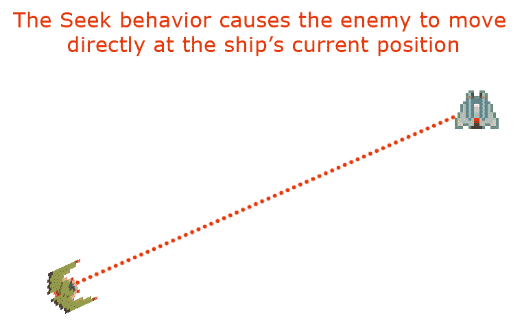

寻找行为

# 逃避行为

逃避是一种与寻找行为相反的转向行为。这种行为会接受一个位置或游戏对象，并试图尽可能远离它。

逃避是被熊追赶时所表现的行为。你的唯一目标是尽可能远离你和熊当前位置之间的距离。所以下次被熊追赶时，停下来想一想，“哇，我的大脑目前正在实施一种名为逃避的自主代理转向行为。”或者你可以继续奔跑。选择权在你手中。看一下下一个图表：

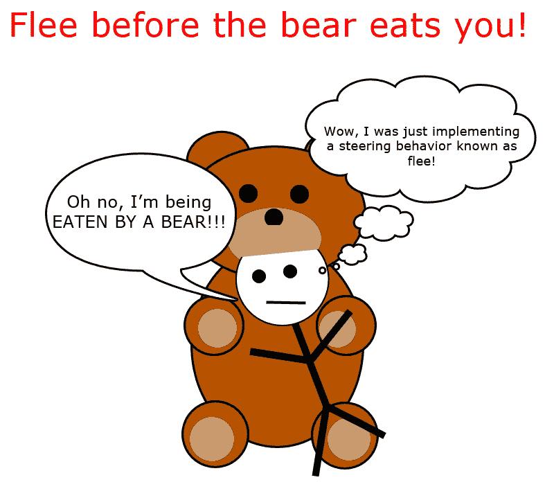

一位艺术家描绘了一只熊正在吃读者

你可以通过否定寻找行为的方向来编程逃避行为。换句话说，如果寻找行为产生一个方向向量力为 1,1，逃避转向行为将产生一个方向向量力为-1,-1。这张图表描述了逃避行为：

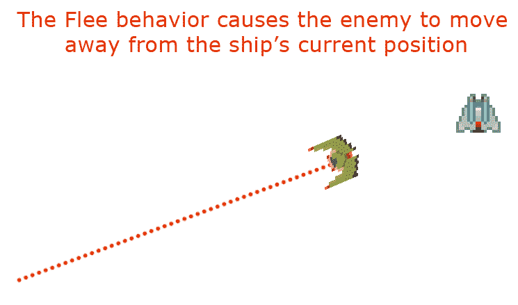

逃避行为

# 到达行为

寻找转向行为的问题在于，直到代理达到目标位置，它都不会满意。另一个问题是，因为它试图以最大速度到达该位置，它几乎总是会超过目标位置，导致在期望目的地周围振荡。到达转向行为允许寻找行为在到达目标的**到达范围**时开始减速，从而优雅地结束。只要目标位置在期望范围内，到达行为就会减少朝向寻找位置的移动。以下图表描述了到达行为：

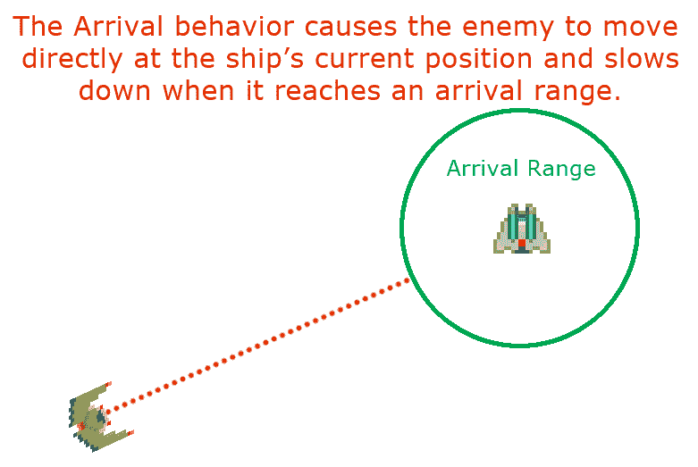

到达行为

# 追逐行为

我们在寻找行为的基础上构建了追逐行为。寻找行为试图到达一个静态点，而追逐行为假设目标在移动。因为我们的代理（敌船）希望追踪并摧毁通常在移动的玩家，我们将使用追逐转向行为。追逐行为查看目标的速度。它不是直接朝着目标的当前位置前进，而是试图找到一个拦截点，预测目标将在那里。寻找行为让我想起了一个儿童足球队。所有孩子都跑到球所在的地方，而不是球将要到达的地方。因此，足球场上的每个人都像一个大团体一样上下奔跑。总有一天，他们会长大，并将追逐转向行为纳入他们的足球战略中。

下一个图表描述了追逐行为：

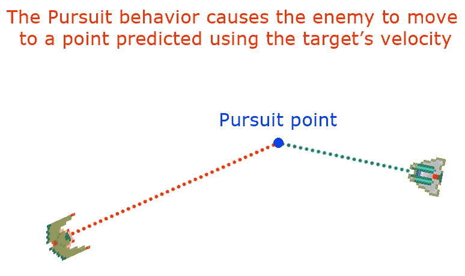

追逐行为

# 逃避行为

逃避就像追逐一样，逃避转向行为试图确定你要避免的障碍物将在哪里，并尽可能远离那个点。换句话说，它采用了我们在追逐行为中找到的相同点，然后远离那个点。下一个图表描述了逃避行为：

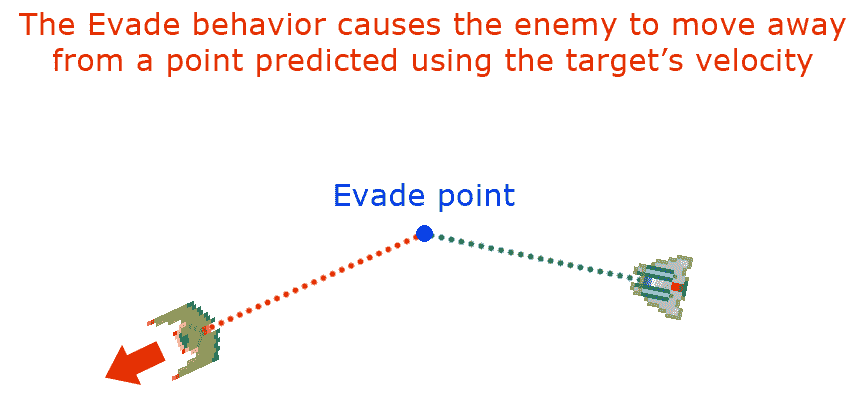

逃避行为

# 避障

避障与逃避行为和逃避行为不同，因为障碍物可能潜在地阻碍我们的代理在寻找新位置时。逃避和逃避会导致我们试图尽可能远离对象的位置或我们正在逃离的位置，而避障更多地是关于避免与前往目标途中的障碍物碰撞。在我们的游戏中，需要避免的障碍物包括小行星、抛射物和游戏屏幕中心的星星。避障通常只涉及寻找避免最具威胁（最近）的障碍物。我们的代理有一个给定的前瞻距离，它朝着移动的方向查看。如果当前位置和移动方向上的最大前瞻之间的线与对象发生碰撞，避障要求我们调整我们的方向。我们避免的区域应该比障碍物的碰撞检测区域大，以给我们一个避免的缓冲区，特别是因为小行星和抛射物在游戏中是移动的。

下一个图表描述了避障：

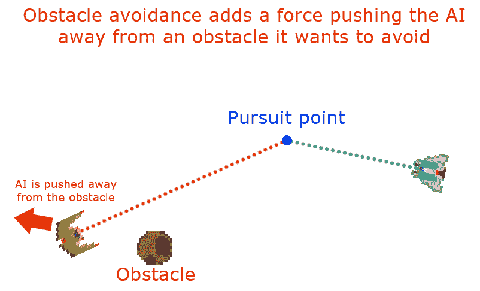

避障

# 漫游行为

漫游是一种状态，在这种状态下，代理在游戏屏幕周围有些随机移动。导致敌方飞船的方向每一帧都随机旋转会导致非常不稳定的行为。相反，应该有一个随机的毫秒数（200-2,000），在这段时间内飞船保持当前方向。当飞船经过随机的毫秒数后，它应该随机选择向左转或向右转，但应该有一个偏向于选择上次相同方向的概率，每次在初始选择后选择相同方向的偏向概率会减少。这将使漫游行为具有更多的一致性，看起来不那么抖动。

看看漫游行为如何随机选择一个点并朝着它移动：

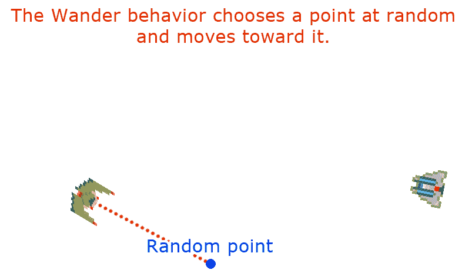

演示漫游行为

# 合并力量

我们之前讨论的读者使用逃避行为逃离熊的情况过于简化了。它假设你在一个大片开阔的地方逃离那只熊。如果你在树林里逃离熊，你需要避免撞到树，并尽可能远离那只熊。你必须无缝地融合这两种活动，否则会被那只熊吃掉。如果我们希望敌舰追逐或逃离玩家舰船，并同时避开障碍物，我们将需要结合转向力。最高优先级始终是避开障碍物。如果你在逃离那只熊时撞到了树，他最终还是会吃掉你。我们的转向行为将实现的一般策略是找到与玩家舰船的视线向量。由于我们的游戏级别在自身上环绕，我们有几次机会找到视线。如果那条视线比选择的距离长，我们将徘徊，直到我们的距离足够短，可以追逐玩家并向他射击。在我们徘徊时，我们将希望将任何徘徊力与帮助敌舰避免撞到小行星或恒星的力结合起来。一旦我们开始追逐，我们将希望继续避开障碍物。将有一个大的到达区域，我们的舰船将减速并朝着玩家方向开火。一旦玩家接近特定范围，我们的舰船将逃离。

# 修改 game.hpp

在我们深入新的代码之前，我想快速对`game.hpp`文件进行一些更改，以添加我们将在本章后面使用的一些功能。我想在`game.hpp`文件的顶部附近添加一些宏，让我们能够快速将角度从度转换为弧度，以及从弧度转换为度。我在使用 SDL 时经常这样做，因为 SDL 出于某种原因希望以度为单位旋转，而其他所有库都使用弧度。因此，让我们在`game.hpp`文件的顶部附近的某个地方添加以下两行代码：

```cpp
#define DEG_TO_RAD(deg) ((float)deg/180.0)*3.14159
#define RAD_TO_DEG(rad) ((float)rad*180.0)/3.14159
```

我们将把画布的大小从 320 x 200 改为 800 x 600。为了以后更容易切换，让我们先定义一些宏，用于画布的宽度和高度，并将其放在`game.hpp`文件的顶部附近的某个地方：

```cpp
#define CANVAS_WIDTH 800
#define CANVAS_HEIGHT 600
```

`rand()`函数，用于在 C 和 C++中获取随机数，只能用于返回整数。我将添加一个函数来获取落在最小和最大浮点值之间的随机数，因此我需要在我们的`game.hpp`文件中添加对该函数的外部引用：

```cpp
extern float get_random_float( float min, float max );
```

我们的类也开始需要循环引用。`FiniteStateMachine`类将需要引用`EnemyShip`类，而`EnemyShip`类将需要引用`FiniteStateMachine`类。不幸的是，我们需要先定义其中一个类。过去，我们可以按特定顺序定义类以避免这个问题，但现在我们需要在任何类定义之前添加一组类声明。这将允许编译器知道类将在定义之前被定义。在`game.hpp`文件的顶部附近添加这个类声明块：

```cpp
class Ship;
class Particle;
class Emitter;
class Collider;
class Asteroid;
class Star;
class PlayerShip;
class EnemyShip;
class Projectile;
class ProjectilePool;
class FiniteStateMachine;
```

我们将添加一个枚举来跟踪我们的 FSM 状态。正如我之前提到的，我们的 FSM 有四个状态：`APPROACH`，`ATTACK`，`FLEE`和`WANDER`。我们将在一个名为`FSM_STATE`的枚举中定义这些状态：

```cpp
enum FSM_STATE {
    APPROACH = 0,
    ATTACK = 1,
    FLEE = 2,
    WANDER = 3
};
```

我们在`game.hpp`中定义的第一个类之一是`Point`类。这个类有*x*和*y*属性，以及一些有用的函数，比如`Rotate`。我们需要大大扩展这个类的用途和功能。因此，称其为*point*已不再准确。我更愿意将这个类称为*vector*，因为我们将从现在开始使用它进行向量数学运算。我对这个名称唯一的问题是，它可能会让人困惑，因为我们在代码中使用`std::vector`来处理类似数组的数据。因此，我决定我们将把这个类称为`Vector2D`。我们将大大扩展这个类的功能，包括一个将向量归一化（即将其大小改为 1）的函数。我们需要两个函数来确定向量的大小和平方大小。我们需要一个函数来将向量投影到另一个向量上（以帮助我们进行视线碰撞检测）。我们需要能够找到两个向量的点积。我们还需要能够找到给定向量的旋转。除了这些新函数，我们还将重载我们的向量运算符，以便我们可以相加向量、相减向量，并用标量值相乘和相除向量。

继续删除`Point`类定义，并用新的`Vector2D`类定义替换该代码：

```cpp
class Vector2D {
    public:
        float x;
        float y;

        Vector2D();
        Vector2D( float X, float Y );

        void Rotate( float radians );
        void Normalize();
        float MagSQ();
        float Magnitude();
        Vector2D Project( Vector2D &onto );
        float Dot(Vector2D &vec);
        float FindRotation();

        Vector2D operator=(const Vector2D &vec);
        Vector2D operator*(const float &scalar);
        void operator+=(const Vector2D &vec);
        void operator-=(const Vector2D &vec);
        void operator*=(const float &scalar);
        void operator/=(const float &scalar);
 };
```

我们的新碰撞检测还需要一个`Range`类。范围表示最小值和最大值之间的一系列值。我们可以将两个范围相加。我们可以找到两个范围之间的重叠部分。我们可以通过给定的标量值扩展一个范围，或者将一个值夹在给定范围内。以下是新的`Range`类定义的样子：

```cpp
class Range {
    public:
        float min;
        float max;

        Range();
        Range( float min_val, float max_val );

        void operator+=(const Range& range);
        Range operator+(const Range& range);
        Range operator=(const Range& range);

        bool Overlap( Range &other );
        void Sort();
        void Extend( float ex );
        float Clamp( float value );
 };
```

如果您向下滚动到`Collider`类，我们将添加一些新函数和一些新属性。我想使用我们的`Collider`类来支持新的转向行为。因此，我们需要一些特定于转向的属性：

```cpp
float m_SteeringRadius;
float m_SteeringRadiusSQ;
```

`m_SteeringRadius`是一个新属性，是`m_Radius`的倍数。为了转向目的，我们希望确保我们想要避免的对象的大小小于对象的碰撞区域。这为我们的转向行为创建了额外的边距，这将帮助我们避开这些对象。`m_SteeringRadiusSQ`属性是转向半径的平方。这将使我们不必一遍又一遍地对转向半径进行碰撞检查。

我们还需要添加以下函数的声明：

```cpp
bool SteeringLineTest( Vector2D &p1, Vector2D &p2 );
bool SteeringRectTest( Vector2D &start_point, Vector2D &end_point );
void WrapPosition();
```

`SteeringLineTest`和`SteeringRecTest`函数将与真实的线和矩形碰撞测试不同。转向矩形测试（`SterringRectTest`）将用于限制我们必须测试以进行对象避让的对象数量。我们只希望我们的 AI 担心在敌舰周围的一个 200 x 200 像素的框内的对象。如果我们有大量对象要测试，这将非常有用。为了使这个测试快速，我们将检查该框内的对象，就好像它们是点，并且不考虑对象的半径。`SteeringLineTest`函数将测试这个碰撞体的转向半径是否击中了测试中由两个点定义的线。

在我们的游戏中，我们还没有添加命中点系统。与小行星或抛射物的单次碰撞会导致即时死亡。这使得游戏变得非常短暂。为了增加游戏时间，我们将为我们的飞船添加护盾。这些护盾将使玩家或敌人在护盾激活期间无敌。在使用护盾时，它们将从绿色慢慢变成红色，并且在某个时刻它们将停止工作。这将取决于您在给定游戏中使用护盾的时间长度，以鼓励玩家仅在需要时使用护盾。以下是`Shield`类定义的样子：

```cpp
class Shield : public Collider {
    public:
        bool m_Active;
        int m_ttl;
        int m_NextFrame;
        Uint32 m_CurrentFrame;
        Ship* m_Ship;
        SDL_Texture *m_SpriteTexture;

        SDL_Rect m_src = {.x = 0, .y = 0, .w = 32, .h = 32 };
        SDL_Rect m_dest = {.x = 0, .y = 0, .w = 32, .h = 32 };

        Shield( Ship* ship, const char* sprite_file );

        void Move();
        void Render();
        bool Activate();
        void Deactivate();
};
```

在`Shield`类定义之后，我们需要为我们的`Asteroid`类添加一个类定义。与 Atari 游戏*Asteroids*不同，我们不能通过射击来摧毁这些小行星。它们被设计为障碍物，但我们（暂时）允许玩家在他们的护盾激活时撞毁小行星。它们将在游戏屏幕周围缓慢移动，并为玩家和敌方 AI 在游戏过程中提供障碍。以下是代码：

```cpp
class Asteroid : public Collider {
    public:
        SDL_Texture *m_SpriteTexture;
        SDL_Rect m_src = {.x = 0, .y = 0, .w = 16, .h = 16 };
        SDL_Rect m_dest = {.x = 0, .y = 0, .w = 0, .h = 0 };

        bool m_Alive;
        Uint32 m_CurrentFrame = 0;
        int m_NextFrameTime;
        float m_Rotation;

        Vector2D m_Direction;
        Vector2D m_Velocity;

        Emitter* m_Explode;
        Emitter* m_Chunks;

        Asteroid( float x, float y,
                  float velocity,
                  float rotation );

        void Move();
        void Render();
        void Explode();
};
```

我们还将在游戏区域中心添加一个大星星。这类似于游戏*Spacewar!*中心的黑洞，我们的游戏是基于它的。这颗星星最终将提供引力吸引力，使游戏变得更具挑战性。我们将通过粒子发射器对星星图像进行动画处理，并添加一些太阳耀斑：

```cpp
class Star : public Collider {
    public:
        SDL_Texture *m_SpriteTexture;
        SDL_Rect m_src = {.x = 0, .y = 0, .w = 64, .h = 64 };
        SDL_Rect m_dest = {.x = 0, .y = 0, .w = 64, .h = 64 };

        std::vector<Emitter*> m_FlareList;
        Uint32 m_CurrentFrame = 0;
        int m_NextFrameTime;

        Star();

        void Move();
        void Render();
};
```

现在我们可以对我们的`Ship`类进行一些修改。完成后，它将如下所示：

```cpp
class Ship : public Collider {
    public:
        const float c_Acceleration = 10.0f;
        const float c_MaxVelocity = 50.0f;
        const int c_AliveTime = 2000;
        const Uint32 c_MinLaunchTime = 300;
        const int c_Width = 32;
        const int c_Height = 32;

        bool m_Accelerating = false;
        Uint32 m_LastLaunchTime;
        SDL_Texture *m_SpriteTexture;
        SDL_Rect src = {.x = 0, .y = 0, .w = 32, .h = 32 };

        Emitter* m_Explode;
        Emitter* m_Exhaust;
        Shield* m_Shield;
        std::vector<Collider*> m_Colliders;

        bool m_Alive = true;
        Uint32 m_CurrentFrame = 0;
        int m_NextFrameTime;
        float m_Rotation;

        Vector2D m_Direction;
        Vector2D m_Velocity;

        void RotateLeft();
        void RotateRight();
        void Accelerate();
        void Decelerate();
        void CapVelocity();
        void Shoot();
        virtual void Move() = 0;
        Ship();
        void Render();
        bool CompoundHitTest( Collider* collider );
};
```

我们要做的第一件事是添加`m_Shield`属性，这是一个指向`Shield`对象的指针：

```cpp
Shield* m_Shield;
```

之后，我们使用不同的变量来表示*x*方向和*y*方向，以及不同的变量来表示*x*速度和*y*速度，就像这样：

```cpp
double m_DX;  // x-direction variable
double m_DY;  // y-direction variable
double m_VX;  // x-velocity variable
double m_VY;  // y-velocity variable
```

让我们删除所有这些代码，并用一些`Vector2D`对象来替换，表示方向向量和速度向量，就像这样：

```cpp
Vector2D m_Direction;
Vector2D m_Velocity;
```

最后，为了防止我们的敌舰和玩家舰之间的代码重复，我们将添加一个`Shoot()`函数，从舰船发射抛射物：

```cpp
void Shoot();
```

我们需要修改的下一个类是我们的`EnemyShip`类。我们需要添加一个包含我们`Shield`精灵文件名的字符串。我们还需要删除旧的`AIStub()`函数，并用指向我们 FSM 的指针替换它。以下是`EnemyShip`类的新版本：

```cpp
class EnemyShip: public Ship {
    public:
        const char* c_SpriteFile = "/sprites/BirdOfAngerExp.png";
        const char* c_ShieldSpriteFile = "/sprites/shield-bird.png";
        const int c_AIStateTime = 2000;

        int m_AIStateTTL;
        FiniteStateMachine* m_FSM;

        EnemyShip();
        void Move();
};
```

我们将要添加的一个重要新类是`FiniteStateMachine`类。这个类将承担所有 AI 的繁重工作。以下是你必须添加到`game.hpp`的类定义：

```cpp
class FiniteStateMachine {
    public:
        const float c_AttackDistSq = 40000.0;
        const float c_FleeDistSq = 2500.0;
        const int c_MinRandomTurnMS = 100;
        const int c_RandTurnMS = 3000;
        const int c_ShieldDist = 20;
        const int c_AvoidDist = 80;
        const int c_StarAvoidDistSQ = 20000;
        const int c_ObstacleAvoidForce = 150;
        const int c_StarAvoidForce = 120;

        FSM_STATE m_CurrentState;
        EnemyShip* m_Ship;
        bool m_HasLOS;
        bool m_LastTurnLeft;
        int m_SameTurnPct;
        int m_NextTurnMS;
        int m_CheckCycle;
        float m_DesiredRotation;
        float m_PlayerDistSQ;

        FiniteStateMachine(EnemyShip* ship);

        void SeekState(Vector2D &seek_point);
        void FleeState(Vector2D &flee_point);
        void WanderState();
        void AttackState();
        void AvoidForce();
        bool ShieldCheck();
        bool LOSCheck();
        Vector2D PredictPosition();
        float GetPlayerDistSq();
        void Move();
};
```

在这个类定义的顶部有九个常量：

```cpp
 const float c_AttackDistSq = 40000.0;
 const float c_FleeDistSq = 2500.0;
 const int c_MinRandomTurnMS = 100;
 const int c_RandTurnMS = 3000;
 const int c_ShieldDist = 20;
 const int c_AvoidDist = 80;
 const int c_StarAvoidDistSQ = 20000;
 const int c_ObstacleAvoidForce = 150;
 const int c_StarAvoidForce = 120;
```

前两个常量`c_AttackDistSq`和`c_FleeDistSq`是 FSM 用来确定它是否会转换为`ATTACK`或`FLEE`状态的值；`c_MinRandomTurnMS`和`c_RandTurnMS`都是`WANDER`状态使用的常量，用于确定 AI 何时决定下一次随机改变方向。`c_ShieldDist`常量是障碍物会导致 AI 打开护盾的距离。`c_AvoidDist`常量给出了 AI 进行校正调整以避免对象的范围。`c_StarAvoidDistSQ`函数是 AI 将进行航向调整以避免游戏区域中心的星星的距离。`c_ObstacleAvoidForce`常量是添加到对象速度的转向力，以帮助它避开障碍物，`c_StarAvoidForce`是用于避开星星的类似力。

在常量之后，我们有一块由 FSM 用于基于状态做出决策的属性：

```cpp
 FSM_STATE m_CurrentState;
 EnemyShip* m_Ship;
 bool m_HasLOS;
 bool m_LastTurnLeft;
 int m_SameTurnPct;
 int m_NextTurnMS;
 int m_CheckCycle;
 float m_DesiredRotation;
 float m_PlayerDistSQ;
```

`m_CurrentState`属性保存了我们有限状态机的当前状态。`m_Ship`属性包含了指向飞船的指针。现在，这总是我们游戏中的单个敌人飞船，但在将来，您可能希望添加多个敌人飞船。`m_HasLOS`属性是一个布尔值，用于跟踪我们的飞船当前是否与玩家有无阻挡的视线。`m_LastTurnLeft`属性是一个布尔值，用于跟踪飞船在`WANDER`状态下上次转向的方向。`m_SameTurnPct`属性是飞船在`WANDER`状态下继续向同一方向转向的百分比几率。`m_NextTurnMS`属性是飞船在`WANDER`状态下继续进行方向改变之前的毫秒数。`m_CheckCycle`变量用于在不同的帧渲染周期中分解 AI 以执行不同的检查。如果您让 AI 在每次帧渲染之间做所有工作，可能会使系统陷入困境。通常最好将 AI 分解为多个部分，并且每次帧渲染只执行部分逻辑。`m_DesiredRotation`属性是 AI 的期望航向，最后，`m_PlayerDistSQ`是敌人飞船和玩家飞船之间的平方距离。

我们需要修改`Projectile`类，使用`Vector2D`来跟踪速度，而不是两个浮点变量`m_VX`和`m_VY`。这是修改后的`Projectile`类的新版本：

```cpp
class Projectile: public Collider {
    public:
        const char* c_SpriteFile = "sprites/ProjectileExp.png";
        const int c_Width = 16;
        const int c_Height = 16;
        const double velocity = 6.0;
        const double alive_time = 2000;

        SDL_Texture *m_SpriteTexture;
        SDL_Rect src = {.x = 0, .y = 0, .w = 16, .h = 16 };

        Uint32 m_CurrentFrame = 0;
        int m_NextFrameTime;
        bool m_Active;
        float m_TTL;
        float m_VX;
        float m_VY;

        Projectile();
        void Move();
        void Render();
        void Launch(double x, double y, double dx, double dy);
};
```

在`game.hpp`文件的末尾，我们应该添加一些新的小行星列表和将要放在游戏区域中心的星星的外部引用：

```cpp
extern std::vector<Asteroid*> asteroid_list;
extern Star* star;
```

现在我们已经处理了对`game.hpp`文件的修改，让我们开始添加我们正在添加的障碍物。

# 向我们的游戏中添加障碍物

现在，我们的游戏中还没有任何 AI 可以操纵。我们需要添加一些障碍物，可以妨碍我们的敌人飞船。我们希望我们的敌人飞船尽力避开这些障碍物，同时试图接近并攻击我们玩家的太空船。我们将首先添加的是一个大星星，就在我们游戏区域的中间。我们可以为这颗星星制作动画，并为它的日冕添加一些漂亮的粒子效果。在上一节中，我们在`game.hpp`文件中创建了这颗星星的类定义，它看起来像这样：

```cpp
class Star : public Collider {
    public:
        SDL_Texture *m_SpriteTexture;
        SDL_Rect m_src = {.x = 0, .y = 0, .w = 64, .h = 64 };
        SDL_Rect m_dest = {.x = 0, .y = 0, .w = 64, .h = 64 };

        std::vector<Emitter*> m_FlareList;

        Uint32 m_CurrentFrame = 0;
        int m_NextFrameTime;

        Star();

        void Move();
        void Render();
};
```

我们需要创建一个名为`star.cpp`的新文件来配合这个类定义。在其中，我们应该定义我们的构造函数和`Move`和`Render`函数。与我们所有的 CPP 文件一样，我们首先包含`game.hpp`文件：

```cpp
#include "game.hpp"
```

之后，我们有一些`#define`指令，用于定义我们将用来渲染星星和耀斑粒子系统的精灵文件：

```cpp
#define STAR_SPRITE_FILE "/sprites/rotating-star.png"
#define FLARE_FILE (char*)"/sprites/flare.png"
```

构造函数相当长，但其中很多部分应该看起来很熟悉：

```cpp
Star::Star() : Collider(32.0) {
    SDL_Surface *temp_surface = IMG_Load( STAR_SPRITE_FILE );

    if( !temp_surface ) {
        printf("failed to load image: %s\n", IMG_GetError() );
        return;
    }
    else {
        printf("success creating enemy ship surface\n");
    }
    m_SpriteTexture = SDL_CreateTextureFromSurface( renderer, 
    temp_surface );

    if( !m_SpriteTexture ) {
        printf("failed to create texture: %s\n", IMG_GetError() );
        return;
    }
    else {
        printf("success creating enemy ship texture\n");
    }
    SDL_FreeSurface( temp_surface );

    m_Radius = 36;

    m_Position.x = CANVAS_WIDTH / 2;
    m_Position.y = CANVAS_HEIGHT / 2;

    m_dest.x = m_Position.x - m_Radius / 2;
    m_dest.y = m_Position.y - m_Radius / 2;

    m_FlareList.push_back(new 
    Emitter(FLARE_FILE,100,160,220,1500,0.05,true,30,40, 1, 
    m_Position.x+8, m_Position.y+8, 10,0.1, 0.2,0.5, 1.0,0xffffff, 
    0xffffff, 0.1, 50,true, true, 4409, 1));

    m_FlareList.push_back(new 
    Emitter(FLARE_FILE,100,220,280,1500,0.05,true,30,40, 1, m_Position.x+8, 
    m_Position.y+8,10,0.1,0.2,0.5,1.0,0xffffff, 0xffffff, 0.0, 
    50,true,true,3571, 1));

    m_FlareList.push_back(new 
    Emitter(FLARE_FILE,100,280,360,1500,0.05,true,30,40, 1, 
    m_Position.x+8, m_Position.y+8, 10, 0.1, 0.2, 0.5, 1.0, 0xffffff, 
    0xffffff, 0.2, 50, true, true, 3989, 1));

    m_FlareList.push_back(new 
    Emitter(FLARE_FILE,100,0,60,1500,0.05,true,30,40, 1, m_Position.x+8, 
    m_Position.y+8, 10, 0.1, 0.2, 0.5, 1.0, 0xffffff, 0xffffff, 0.1, 50, 
    true, true, 3371, 1));

    m_FlareList.push_back(new 
    Emitter(FLARE_FILE,100,60,100,1500,0.05,true,30,40, 1, m_Position.x+8, 
    m_Position.y+8, 10, 0.1, 0.2, 0.5, 1.0, 0xffffff, 0xffffff, 0.3, 50, 
    true, true, 4637, 1));
}
```

这个构造函数首先通过继承`Collider`构造函数传递一个半径为`32`：

```cpp
Star::Star() : Collider(32.0) {
```

然后创建一个精灵纹理，用于渲染星星。这部分代码应该看起来很熟悉：

```cpp
SDL_Surface *temp_surface = IMG_Load( STAR_SPRITE_FILE );

if( !temp_surface ) {
    printf("failed to load image: %s\n", IMG_GetError() );
    return;
}
else {
    printf("success creating enemy ship surface\n");
}
m_SpriteTexture = SDL_CreateTextureFromSurface( renderer, temp_surface );
if( !m_SpriteTexture ) {
    printf("failed to create texture: %s\n", IMG_GetError() );
    return;
}
else {
    printf("success creating enemy ship texture\n");
}
SDL_FreeSurface( temp_surface );
```

设置好精灵纹理后，构造函数设置了一些属性，包括半径和位置：

```cpp
m_Radius = 36;
m_Position.x = CANVAS_WIDTH / 2;
m_Position.y = CANVAS_HEIGHT / 2;
m_dest.x = m_Position.x - m_Radius / 2;
m_dest.y = m_Position.y - m_Radius / 2;
```

最后，它向`m_FlareList`向量添加了发射器。这些将是一些太阳耀斑粒子系统。我使用了粒子系统配置工具来得出我们正在创建的值。您可以根据需要调整这些值，但我觉得这些值创造了一个漂亮的耀斑效果：

```cpp
m_FlareList.push_back(new Emitter(FLARE_FILE,100,160,220,1500,0.05,true,30,40, 1, m_Position.x+8, m_Position.y+8, 10,0.1, 0.2,0.5, 1.0,0xffffff, 0xffffff, 0.1, 50,true, true,4409, 1));

m_FlareList.push_back(new Emitter(FLARE_FILE,100,220,280,1500,0.05,true,30,40, 1, m_Position.x+8, m_Position.y+8,10,0.1,0.2,0.5,1.0,0xffffff, 0xffffff, 0.0, 50,true,true,3571, 1));

m_FlareList.push_back(new Emitter(FLARE_FILE,100,280,360,1500,0.05,true,30,40, 1, m_Position.x+8, m_Position.y+8, 10, 0.1, 0.2, 0.5, 1.0, 0xffffff, 0xffffff, 0.2, 50, true, true, 3989, 1));

m_FlareList.push_back(new Emitter(FLARE_FILE,100,0,60,1500,0.05,true,30,40, 1, m_Position.x+8, m_Position.y+8, 10, 0.1, 0.2, 0.5, 1.0, 0xffffff, 0xffffff, 0.1, 50, true, true, 3371, 1));

m_FlareList.push_back(new Emitter(FLARE_FILE,100,60,100,1500,0.05,true,30,40, 1, m_Position.x+8, m_Position.y+8, 10, 0.1, 0.2, 0.5, 1.0, 0xffffff, 0xffffff, 0.3, 50, true, true, 4637, 1));
```

星星的`Move`函数非常简单。它循环遍历星星动画序列的八个帧：

```cpp
void Star::Move() {
    m_NextFrameTime -= diff_time;
    if( m_NextFrameTime <= 0 ) {
        ++m_CurrentFrame;
        m_NextFrameTime = ms_per_frame;
        if( m_CurrentFrame >= 8 ) {
            m_CurrentFrame = 0;
        }
    }
}
```

星星的`Render`函数稍微复杂一些，因为它需要循环遍历耀斑发射器，并在渲染星星精灵纹理之前移动它们：

```cpp
void Star::Render() {
    Emitter* flare;
    std::vector<Emitter*>::iterator it;

    for( it = m_FlareList.begin(); it != m_FlareList.end(); it++ ) {
        flare = *it;
        flare->Move();
    }
    m_src.x = m_dest.w * m_CurrentFrame;

    SDL_RenderCopy( renderer, m_SpriteTexture,
                    &m_src, &m_dest );
}
```

接下来，我们需要定义`asteroid.cpp`文件。这将保存我们`Asteroid`类的函数定义。以下是`games.hpp`文件中`Asteroid`类的定义：

```cpp
class Asteroid : public Collider {
    public:
        SDL_Texture *m_SpriteTexture;
        SDL_Rect m_src = {.x = 0, .y = 0, .w = 16, .h = 16 };
        SDL_Rect m_dest = {.x = 0, .y = 0, .w = 0, .h = 0 };

        bool m_Alive;
        Uint32 m_CurrentFrame = 0;
        int m_NextFrameTime;
        float m_Rotation;
        Vector2D m_Direction;
        Vector2D m_Velocity;

        Emitter* m_Explode;
        Emitter* m_Chunks;

        Asteroid( float x, float y,
                  float velocity,
                  float rotation );

        void Move();
        void Render();
        void Explode();
};
```

在我们的`asteroid.cpp`文件中，我们需要定义`Asteroid`构造函数、`Move`函数、`Render`函数和`Explode`函数。在`asteroid.cpp`文件的顶部，我们需要`#include` `game.hpp`文件，并在虚拟文件系统中定义我们的小行星精灵文件的位置。以下是这些代码的前几行的样子：

```cpp
#include "game.hpp"
#define ASTEROID_SPRITE_FILE (char*)"/sprites/asteroid.png"
```

我们将定义的第一个函数是我们的构造函数。以下是构造函数的完整函数：

```cpp
Asteroid::Asteroid( float x, float y,
                    float velocity,
                    float rotation ): Collider(8.0) {
    SDL_Surface *temp_surface = IMG_Load( ADSTEROID_SPRITE_FILE );

    if( !temp_surface ) {
        printf("failed to load image: %s\n", IMG_GetError() );
        return;
    }
    else {
        printf("success creating asteroid surface\n");
    }

    m_SpriteTexture = SDL_CreateTextureFromSurface( renderer, temp_surface );

    if( !m_SpriteTexture ) {
        printf("failed to create texture: %s\n", IMG_GetError() );
        return;
    }
    else {
        printf("success creating asteroid texture\n");
    }

    SDL_FreeSurface( temp_surface );

    m_Explode = new Emitter((char*)"/sprites/Explode.png",
         100, 0, 360,     // int max_particles, float min_angle, float 
         max_angle,
         1000, 0.3, false, // Uint32 particle_lifetime, float acceleration, 
         bool alpha_fade,
         20.0, 40.0,     // float min_starting_velocity, float 
         max_starting_velocity,
         10, 0, 0, 5,     // Uint32 emission_rate, int x_pos, int y_pos, 
         float radius,
         1.0, 2.0,         // float min_start_scale, float max_start_scale,
         1.0, 2.0,         // float min_end_scale, float max_end_scale,
         0xffffff, 0xffffff,
         0.01, 10,         // float burst_time_pct, Uint32 burst_particles,
         false, false,     // bool loop, bool align_rotation,
         800, 8 );         // Uint32 emit_time_ms, Uint32 animation_frames
    m_Explode->m_parent_rotation_ptr = &m_Rotation;
    m_Explode->m_parent_x_ptr = &(m_Position.x);
    m_Explode->m_parent_y_ptr = &(m_Position.y);
    m_Explode->m_active = false;

    m_Chunks = new Emitter((char*)"/sprites/small-asteroid.png",
         40, 0, 360, // int max_particles, float min_angle, float 
         max_angle,
         1000, 0.05, false, // Uint32 particle_lifetime, float 
         acceleration, 
         bool alpha_fade,
         80.0, 150.0, // float min_starting_velocity, float 
         max_starting_velocity,
         5, 0, 0, 10, // Uint32 emission_rate, int x_pos, int y_pos, 
         float radius,
         2.0, 2.0, // float min_start_scale, float max_start_scale,
         0.25, 0.5, // float min_end_scale, float max_end_scale,
         0xffffff, 0xffffff,
         0.1, 10, // float burst_time_pct, Uint32 burst_particles,
         false, true, // bool loop, bool align_rotation,
         1000, 8 ); // Uint32 emit_time_ms, Uint32 animation_frames

    m_Chunks->m_parent_rotation_ptr = &m_Rotation;
    m_Chunks->m_parent_x_ptr = &m_Position.x;
    m_Chunks->m_parent_y_ptr = &m_Position.    
    m_Chunks->m_active = false;

    m_Position.x = x;
    m_Position.y = y;

    Vector2D direction;
    direction.x = 1;
    direction.Rotate( rotation );

    m_Direction = direction;
    m_Velocity = m_Direction * velocity;

    m_dest.h = m_src.h = m_dest.w = m_src.w = 16;

    m_Rotation = rotation;
    m_Alive = true;
    m_CurrentFrame = 0;
    m_NextFrameTime = ms_per_frame;
}
```

构造函数的定义调用了`Collider`类中的父构造函数，传入了`Collider`的半径为`8.0`：

```cpp
Asteroid::Asteroid( float x, float y,
                    float velocity,
                    float rotation ): Collider(8.0) {
```

之后，构造函数使用 SDL 加载和初始化精灵纹理，这是一个我们现在应该都非常熟悉的过程：

```cpp
SDL_Surface *temp_surface = IMG_Load( ADSTEROID_SPRITE_FILE );

if( !temp_surface ) {
    printf("failed to load image: %s\n", IMG_GetError() );
    return;
}
else {
    printf("success creating asteroid surface\n");
}

m_SpriteTexture = SDL_CreateTextureFromSurface( renderer, temp_surface );

if( !m_SpriteTexture ) {
    printf("failed to create texture: %s\n", IMG_GetError() );
    return;
}
else {
    printf("success creating asteroid texture\n");
}

SDL_FreeSurface( temp_surface );
```

然后，我们定义了我们的爆炸发射器。如果我们的小行星被摧毁，这个发射器将被激活：

```cpp
m_Explode = new Emitter((char*)"/sprites/Explode.png",
     100, 0, 360, // int max_particles, float min_angle, float max_angle,
     1000, 0.3, false, // Uint32 particle_lifetime, float acceleration, 
     bool alpha_fade,
     20.0, 40.0, // float min_starting_velocity, float 
     max_starting_velocity,
     10, 0, 0, 5, // Uint32 emission_rate, int x_pos, int y_pos, 
     float radius,
     1.0, 2.0, // float min_start_scale, float max_start_scale,
     1.0, 2.0, // float min_end_scale, float max_end_scale,
     0xffffff, 0xffffff,
     0.01, 10, // float burst_time_pct, Uint32 burst_particles,
     false, false, // bool loop, bool align_rotation,
     800, 8 ); // Uint32 emit_time_ms, Uint32 animation_frames

m_Explode->m_parent_rotation_ptr = &m_Rotation;
m_Explode->m_parent_x_ptr = &(m_Position.x);
m_Explode->m_parent_y_ptr = &(m_Position.y);
m_Explode->m_active = false;
```

之后，我们创建了第二个发射器，当我们的小行星被摧毁时会发射一些小块石头。这是为了补充`m_Explosion`发射器，并且它将在小行星爆炸时同时运行：

```cpp
m_Chunks = new Emitter((char*)"/sprites/small-asteroid.png",
     40, 0, 360, // int max_particles, float min_angle, float max_angle,
     1000, 0.05, false, // Uint32 particle_lifetime, float acceleration, 
     bool alpha_fade,
     80.0, 150.0, // float min_starting_velocity, float 
     max_starting_velocity,
     5, 0, 0, 10, // Uint32 emission_rate, int x_pos, int y_pos, 
     float radius,
     2.0, 2.0, // float min_start_scale, float max_start_scale,
     0.25, 0.5, // float min_end_scale, float max_end_scale,
     0xffffff, 0xffffff,
     0.1, 10, // float burst_time_pct, Uint32 burst_particles,
     false, true, // bool loop, bool align_rotation,
     1000, 8 ); // Uint32 emit_time_ms, Uint32 animation_frames

m_Chunks->m_parent_rotation_ptr = &m_Rotation;
m_Chunks->m_parent_x_ptr = &m_Position.x;
m_Chunks->m_parent_y_ptr = &m_Position.y;
m_Chunks->m_active = false;
```

最后几行设置了我们小行星属性的起始值：

```cpp
m_Position.x = x;
m_Position.y = y;

Vector2D direction;
direction.x = 1;
direction.Rotate( rotation );

m_Direction = direction;
m_Velocity = m_Direction * velocity;
m_dest.h = m_src.h = m_dest.w = m_src.w = 16;

m_Rotation = rotation;
m_Alive = true;
m_CurrentFrame = 0;
m_NextFrameTime = ms_per_frame;
```

我们将要定义的下一个函数是`Move`函数。以下是它的样子：

```cpp
void Asteroid::Move() {
m_NextFrameTime -= diff_time;
if( m_NextFrameTime <= 0 ) {
    m_NextFrameTime = ms_per_frame;
    m_CurrentFrame++;
    if( m_CurrentFrame >= 8 ) {
        m_CurrentFrame = 0;
    }
}
m_Position += m_Velocity * delta_time;
WrapPosition();
}
```

处理`m_NextFrameTime`和`m_CurrentFrame`的第一批代码只是根据经过的时间量交替切换精灵帧：

```cpp
m_NextFrameTime -= diff_time;
if( m_NextFrameTime <= 0 ) {
    m_NextFrameTime = ms_per_frame;
    m_CurrentFrame++;

    if( m_CurrentFrame >= 8 ) {
        m_CurrentFrame = 0;
    }
}
```

之后，我们根据时间增量和当前速度更新位置：

```cpp
m_Position += m_Velocity * delta_time;
```

最后，调用`WrapPosition`函数。这个函数会将我们的小行星移到屏幕的右侧，如果它偏离了屏幕的左侧，并且如果它偏离了底部，它会移到顶部。每当一个小行星朝着特定方向移出屏幕时，它的位置将被包裹到游戏区域的另一侧。

`Move`函数之后，我们定义了`Asteroid Render`函数。完整的函数如下所示：

```cpp
void Asteroid::Render() {
    m_Explode->Move();
    m_Chunks->Move();
    if( m_Alive == false ) {
        return;
    }
    m_src.x = m_dest.w * m_CurrentFrame;
    m_dest.x = m_Position.x + m_Radius / 2;
    m_dest.y = m_Position.y + m_Radius / 2;
    SDL_RenderCopyEx( renderer, m_SpriteTexture,
                        &m_src, &m_dest,
                        RAD_TO_DEG(m_Rotation), NULL, SDL_FLIP_NONE );
}
```

前两行移动了爆炸发射器和碎片发射器。如果小行星还没有被摧毁，这些函数将不会执行任何操作。如果小行星已经被摧毁，这些函数将运行粒子发射器。这些发射器不会循环，所以当它们的发射时间结束时，它们将停止：

```cpp
m_Explode->Move();
m_Chunks->Move();
```

之后，我们检查小行星是否存活，如果不是，我们退出这个函数。我们在移动我们的发射器之后执行这个操作的原因是，我们必须在小行星被摧毁后继续运行发射器：

```cpp
if( m_Alive == false ) {
    return;
}
```

在这个函数中，我们做的最后一件事是渲染我们的小行星精灵纹理，这个过程现在应该看起来非常熟悉：

```cpp
m_src.x = m_dest.w * m_CurrentFrame;
m_dest.x = m_Position.x + m_Radius / 2;
m_dest.y = m_Position.y + m_Radius / 2;
SDL_RenderCopyEx( renderer, m_SpriteTexture,
                  &m_src, &m_dest,
                  RAD_TO_DEG(m_Rotation), NULL, SDL_FLIP_NONE );
```

在我们的`asteroid.cpp`文件中的最后一个函数是`Explode`函数。这个函数将在小行星被摧毁时运行。该函数将运行我们设计的两个发射器，以创建爆炸效果。它还会将小行星的存活标志设置为`false`。以下是代码：

```cpp
void Asteroid::Explode() {
    m_Explode->Run();
    m_Chunks->Run();
    m_Alive = false;
}
```

现在我们已经定义了我们的游戏障碍，让我们来看看为我们的太空飞船创建一些护盾需要做些什么。

# 添加力场

目前，在我们的游戏中，我们的飞船在一次碰撞中被摧毁。这最终导致游戏很快就结束了。当即将发生碰撞时，希望有一个力场来防止飞船的破坏。这也会给我们的人工智能一些其他可以做的事情。当护盾启用时，使用它的飞船周围将有一个小的力场动画。护盾使用有时间限制。这将防止玩家或人工智能在整个游戏中保持护盾。当护盾激活时，护盾的颜色将从绿色过渡到红色。颜色越接近红色，护盾的能量就越接近耗尽。每次护盾受到打击时，玩家或人工智能的护盾都会减少额外的时间。我们已经在`game.hpp`文件中创建了类定义。它看起来像这样：

```cpp
class Shield : public Collider {
    public:
        bool m_Active;
        int m_ttl;
        int m_NextFrame;
        Uint32 m_CurrentFrame;
        Ship* m_Ship;
        SDL_Texture *m_SpriteTexture;

        SDL_Rect m_src = {.x = 0, .y = 0, .w = 32, .h = 32 };
        SDL_Rect m_dest = {.x = 0, .y = 0, .w = 32, .h = 32 };

        Shield( Ship* ship, const char* sprite_file );

        void Move();
        void Render();
        bool Activate();
        void Deactivate();
};
```

为了配合这个类定义，我们需要一个`shield.cpp`文件，在这里我们可以定义这个类使用的所有函数。我们将在`shield.cpp`文件中定义的第一个函数是`Shield`构造函数：

```cpp
Shield::Shield( Ship* ship, const char* sprite_string ) : Collider(12.0) {
    m_Active = false;
    m_ttl = 25500;
    m_Ship = ship;
    m_CurrentFrame = 0;
    m_NextFrame = ms_per_frame;
    SDL_Surface *temp_surface = IMG_Load( sprite_string );

    if( !temp_surface ) {
        printf("failed to load image: %s\n", IMG_GetError() );
        return;
    }

    m_SpriteTexture = SDL_CreateTextureFromSurface( renderer, 
   temp_surface );

    if( !m_SpriteTexture ) {
        printf("failed to create texture: %s\n", IMG_GetError() );
        return;
    }
    SDL_FreeSurface( temp_surface );
}
```

`Shield`构造函数将调用`Collider`构造函数，半径为`12.0`。这是比飞船半径更大的半径。如果护盾激活，我们希望击中这个`Collider`而不是飞船。在这个构造函数中的第一个代码块设置了这个类属性的起始值：

```cpp
m_Active = false;
m_ttl = 25500;
m_Ship = ship;
m_CurrentFrame = 0;
m_NextFrame = ms_per_frame;
```

请注意，我们将`m_ttl`设置为`25500`。这是你可以在毫秒内使用护盾的时间。这相当于 25.5 秒。我希望它是 255 的倍数，这样绿色就会根据剩余时间从 255 过渡到 0。

相反，红色将根据剩余时间从 0 过渡到 255。之后，我们以标准方式创建护盾的精灵纹理：

```cpp
SDL_Surface *temp_surface = IMG_Load( sprite_string );

if( !temp_surface ) {
    printf("failed to load image: %s\n", IMG_GetError() );
    return;
}

m_SpriteTexture = SDL_CreateTextureFromSurface( renderer, temp_surface );

if( !m_SpriteTexture ) {
    printf("failed to create texture: %s\n", IMG_GetError() );
return;
}

SDL_FreeSurface( temp_surface );
```

构造函数之后，我们需要定义我们的`Move`函数：

```cpp
void Shield::Move() {
    if( m_Active ) {
        m_NextFrame -= diff_time;
        m_ttl -= diff_time;

        if( m_NextFrame <= 0 ) {
            m_NextFrame = ms_per_frame;
            m_CurrentFrame++;

            if( m_CurrentFrame >= 6 ) {
                m_CurrentFrame = 0;
            }
        }
        if( m_ttl <= 0 ) {
            m_Active = false;
        }
    }
}
```

如果护盾未激活，此函数将不执行任何操作。如果激活了，根据自上一帧以来经过的毫秒数，将减少`m_ttl`参数。然后，如果已经过了适当数量的毫秒，我们会增加当前帧。如果护盾的剩余时间低于 0，护盾将被停用。

在我们定义了`Move`函数之后，我们将定义我们的`Render`函数：

```cpp
void Shield::Render() {
    if( m_Active ) {
        int color_green = m_ttl / 100 + 1;
        int color_red = 255 - color_green;
        m_src.x = m_CurrentFrame * m_dest.w;
        m_dest.x = m_Ship->m_Position.x;
        m_dest.y = m_Ship->m_Position.y;

        SDL_SetTextureColorMod(m_SpriteTexture,
                             color_red,
                             color_green,
                             0 );

        SDL_RenderCopyEx( renderer, m_SpriteTexture,
                             &m_src, &m_dest,
                             RAD_TO_DEG(m_Ship->m_Rotation),
                             NULL, SDL_FLIP_NONE );
    }
}
```

与`Move`函数一样，如果激活标志为 false，`Render`函数将不执行任何操作。我们使用以下公式根据剩余时间计算颜色：

```cpp
int color_green = m_ttl / 100 + 1;
int color_red = 255 - color_green;
```

这将平滑地将我们的护盾颜色从绿色过渡到红色。我们使用`SDL_SetTextureColorMod`来设置精灵纹理的颜色：

```cpp
SDL_SetTextureColorMod(m_SpriteTexture,
                     color_red,
                     color_green,
                     0 );
```

`Shield::Render`函数中的其他内容都很标准，现在应该看起来非常熟悉。

# 更多碰撞检测

让我们看看我们需要对`Collider`类进行的修改。正如我们之前讨论的，我们的人工智能将实现转向行为。这些转向行为将需要在我们的`Collider`类中添加一些新的属性和函数。新的`Collider`类将如下所示：

```cpp
class Collider {
    public:
        float* m_ParentRotation;
        float* m_ParentX;
        float* m_ParentY;
        Vector2D m_TempPoint;

        bool CCHitTest( Collider* collider );

        Vector2D m_Position;
        float m_Radius;
        float m_SteeringRadius;
        float m_SteeringRadiusSQ;

        void SetParentInformation( float* rotation, float* x, float* y );
        Collider(float radius);
        bool HitTest( Collider *collider );
        bool SteeringLineTest( Vector2D &p1, Vector2D &p2 );
        bool SteeringRectTest( Vector2D &start_point, Vector2D &end_point 
        );
        void WrapPosition();
 };
```

我们有三个新函数，其中两个是用于转向的。其中一个函数`WrapPosition()`将用于将移出屏幕的对象包裹到游戏屏幕的另一侧。让我们打开`collider.cpp`来看一看。我们需要改变的第一件事是构造函数。新版本的构造函数如下所示：

```cpp
Collider::Collider(float radius) {
    m_ParentRotation = NULL;
    m_ParentX = NULL;
    m_ParentY = NULL;

    m_Radius = radius;
    m_SteeringRadius = m_Radius * 1.5;
    m_SteeringRadiusSQ = m_SteeringRadius * m_SteeringRadius;
}
```

最后两行是唯一的修改。您会注意到我们将`m_SteeringRadius`属性设置为`1.5`倍的`m_Radius`值。这个额外的缓冲空间是为了防止我们的敌舰过于靠近小行星，特别是如果它们在移动。这个因素有效地使得转向行为更加警惕地避免与小行星的碰撞。`1.5`的倍数是相当任意地选择的，因为在我测试时效果很好。如果您希望您的 AI 对小行星碰撞不太关心，更有可能追逐玩家并置自己于危险之中，您可以减小这个值，也许到`1.1`之类的值。您也可以增加这个值，使 AI 更加警惕小行星。将值设置得太高将导致 AI 过于胆小。将它设置得太低将使它在几乎任何情况下都追逐玩家，仿佛是战斗的著名话语：“*该死的鱼雷——全速前进！*”

接下来，我们需要将新函数`SteeringLineText`添加到`collider.cpp`中。这个新函数将在我们的敌舰和玩家之间连接的线之间进行圆线碰撞检测，并检测我们的飞船沿着这条路径可能撞到的所有小行星和抛射物。这是一种视线测试，用于确定从我们的位置到玩家是否有一条清晰的路径。与圆圆或矩形矩形碰撞检测相比，圆线碰撞检测有点复杂。我在[embed.com](https://www.embed.com)上创建的解决方案中大量借鉴了以下地址：[`www.embed.com/typescript-games/multiple-type-collision-detection.html`](https://www.embed.com/typescript-games/multiple-type-collision-detection.html)。

# 圆线碰撞检测

确定圆和线是否相撞的第一步是最简单的：检查线的任一端点是否落在圆的半径内。这是通过使用毕达哥拉斯定理进行简单的距离检查来完成的。如果一个点与我们的圆的中心之间的距离小于半径，那么线就在圆内。这是一个点落在圆的半径内的图示：

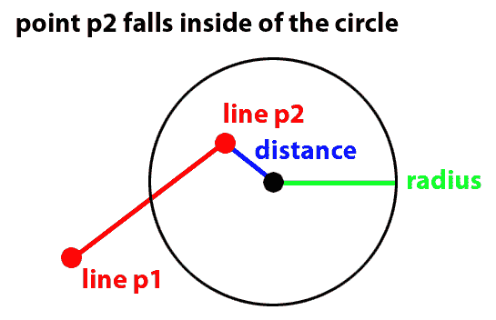

线的 p2 点落在圆的半径内

如果任一点落在圆的半径内，我们知道线和圆相撞。如果没有点落在圆的半径内，我们还没有完成。然后我们需要做的是找到线上距离圆心最近的点。让我稍微偏离一下，来更加技术化。从技术上讲，所有的线都是无限的。当我们有两个点并在这些点之间画一条“线”时，它是一条线段。要找到线和我们的圆之间的最近点，我们需要谈论一些叫做**向量投影**的东西。

# 向量投影

向量投影有点复杂。如果你将给定的向量 b 投影到向量*a*上，你会得到向量*a*的标量倍数（我们将称这个标量倍数为*c*），你可以添加一个垂直于向量*ca*的向量来得到向量*b*。

以下图示是将向量*b*投影到向量*a*的示例：

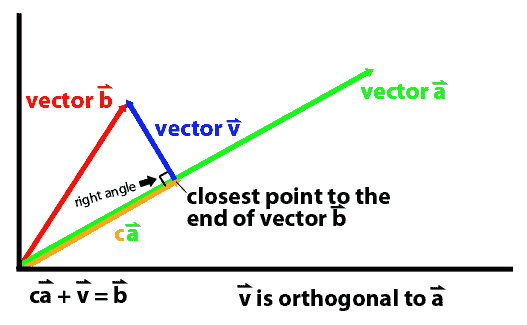

将向量 b 投影到向量 a 的示例

另一种看待这个问题的方式是，向量 b 在向量 a 上的投影给出了距离向量 b 的终点最近的点，该点位于由向量 a 的任意标量倍数定义的线段上。也许你会想知道这与检测圆和直线之间的碰撞有什么关系。如果我们假设向量 b 表示我们圆的中心点的位置，我们就可以找出我们直线上离圆的中心点最近的点。然后我们测试我们的投影找到的点与圆的中心之间是否发生碰撞。看看向量投影如何用于确定下图中直线上距离圆最近的点：

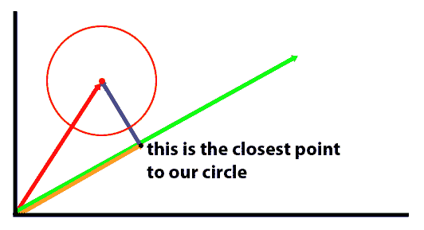

注意，将向量投影到我们的线上会给我们圆上最接近的点

你还需要考虑另一个潜在的问题。对向量 a 的投影可能会给你一个大于 1 的 c 值（标量倍数）。如果是这种情况，可能是我们的线段与圆发生了碰撞，超出了我们的结束点。因此，我们还需要进行一些范围检查，以查看我们是否超出了线段的末端：

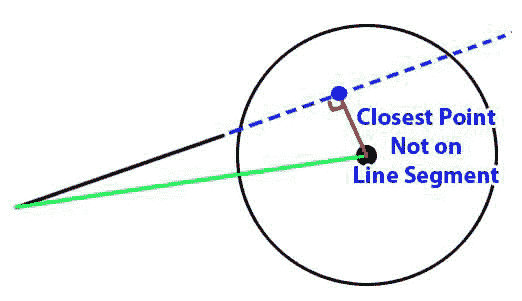

将圆的向量投影到我们的线上会给我们超出线段范围的最接近点

现在我已经解释了向量投影是什么，让我们来看看代码：

```cpp
bool Collider::SteeringLineTest( Vector2D &start, Vector2D &end ) {
    if( m_Active == false ) {
        return false;
    }
    Vector2D dist = start;
    dist -= m_Position;

    if( m_SteeringRadiusSQ > dist.MagSQ() ) {
        return true;
    }
    dist = end;
    dist -= m_Position;

    if( m_SteeringRadiusSQ > dist.MagSQ() ) {
        return true;
    }
    dist = end;
    dist -= start;

    Vector2D circle_vec = m_Position;
    circle_vec -= start;

    Vector2D near_point = circle_vec.Project( dist );
    near_point += start;

    Vector2D temp_vector = near_point;
    circle_vec += start;
    temp_vector -= circle_vec;

    Range x_range;
    x_range.min = start.x;
    x_range.max = end.x;
    x_range.Sort();
    Range y_range;
    y_range.min = start.y;
    y_range.max = end.y;
    y_range.Sort();

    if ((x_range.min <= near_point.x && near_point.x <= x_range.max &&
         y_range.min <= near_point.y && near_point.y <= y_range.max) == 
         false) {
        return false;
    }
    if( temp_vector.MagSQ() < m_SteeringRadiusSQ ) {
        return true;
    }
    return false;
}
```

正如我们之前讨论的，我们首先要做的是测试起点和终点到这个`Collider`对象位置的距离。如果距离的平方小于任一点的转向半径的平方，我们就知道该线段与我们的转向半径发生了碰撞：

```cpp
if( m_Active == false ) {
    return false;
}

Vector2D dist = start;
dist -= m_Position;

if( m_SteeringRadiusSQ > dist.MagSQ() ) {
    return true;
}

dist = end;
dist -= m_Position;
if( m_SteeringRadiusSQ > dist.MagSQ() ) {
    return true;
}
```

如果两个点都不在圆内，我们将需要对投影进行测试。我们需要将线段转换为通过原点的向量。为此，我们需要从结束点减去起始点，并且我们还需要调整圆的位置相同的量：

```cpp
dist = end;
dist -= start;

Vector2D circle_vec = m_Position;
circle_vec -= start;

Vector2D near_point = circle_vec.Project( dist );
near_point += start;

Vector2D temp_vector = near_point;
circle_vec += start;
temp_vector -= circle_vec;
```

我们需要确保距离碰撞器最近的点仍然在线段上。这可以通过对起始和结束的*x*和*y*值进行简单的范围测试来完成。如果*x*和*y*坐标都在我们的范围内，我们就知道该点必须位于线段上。如果不是，我们就知道该线段与圆不相交：

```cpp
Range x_range;
x_range.min = start.x;
x_range.max = end.x;
x_range.Sort();

Range y_range;
y_range.min = start.y;
y_range.max = end.y;
y_range.Sort();

if ((x_range.min <= near_point.x && near_point.x <= x_range.max &&
     y_range.min <= near_point.y && near_point.y <= y_range.max) == false) {
    return false;
}
```

如果我们此时还没有返回`false`值，我们就知道碰撞器最近的点在我们的线段上。现在我们可以测试从该点到我们的碰撞器的距离，以查看它是否足够接近与我们的转向半径发生碰撞；如果是，我们返回`true`，如果不是，我们返回`false`：

```cpp
if( m_SteeringRadiusSQ > dist.MagSQ() ) {
    return true;
}
return false;
```

# Vector2D 类

我之前提到，我们需要放弃旧的`Point`类，转而使用功能更多的东西。新的`Vector2D`类将为我们之前使用的`Point`类添加几个新的函数。让我们再次看看我们在`game.hpp`文件中的函数定义：

```cpp
class Vector2D {
    public:
        float x;
        float y;

        Vector2D();
        Vector2D( float X, float Y );

        void Rotate( float radians );
        void Normalize();
        float MagSQ();
        float Magnitude();

        Vector2D Project( Vector2D &onto );
        float Dot(Vector2D &vec);
        float FindAngle();

        Vector2D operator=(const Vector2D &vec);
        Vector2D operator*(const float &scalar);
        void operator+=(const Vector2D &vec);
        void operator-=(const Vector2D &vec);
        void operator*=(const float &scalar);
        void operator/=(const float &scalar);
};
```

与点不同，向量有一个大小。因为计算速度更快，我们还将添加一个平方大小，`MagSQ`函数。向量可以被标准化，这意味着它们可以被修改为大小为 1。我们之前讨论过向量投影，并创建了一个`Project`函数来允许我们这样做。找到两个向量的点积在游戏中是一个非常有用的操作。两个标准化向量的点积是一个标量值，取决于这两个向量之间的角度，范围在 1 到-1 之间。如果向量指向相同的方向，则该值为 1，如果它们指向相反的方向，则为-1，如果两个向量互相垂直，则为 0。

两个归一化向量的点积等同于这两个归一化向量之间的角度的余弦。得到任意两个向量 *a* 和 *b* 的点积，你会得到（*a* 的大小）*（*b* 的大小）* 余弦（*a* 和 *b* 之间的角度）。我们首先归一化这些向量的原因是为了将 *a* 和 *b* 的大小设置为 1，这会导致我们的归一化点积返回 *a* 和 *b* 之间的余弦角度。

我们还将添加一个 `FindAngle` 函数，它将告诉我们这个函数的方向角。我们将重载许多运算符，以便更容易地对向量进行操作。

让我们来看看 `vector.cpp` 的全部内容：

```cpp
#include "game.hpp"

Vector2D::Vector2D( float X, float Y ) {
    x = X;
    y = Y;
}
Vector2D::Vector2D() {
    y = x = 0.0;
}
Vector2D Vector2D::operator=(const Vector2D& p) {
    x = p.x;
    y = p.y;
    return *this;
}
void Vector2D::operator+=(const Vector2D& p) {
    x += p.x;
    y += p.y;
}
void Vector2D::operator-=(const Vector2D& p) {
    x -= p.x;
    y -= p.y;
}
void Vector2D::operator*=(const float& scalar) {
    x *= scalar;
    y *= scalar;
}
void Vector2D::operator/=(const float& scalar) {
    x /= scalar;
    y /= scalar;
}
Vector2D Vector2D::operator*(const float& scalar) {
    Vector2D vec = *this;
    vec *= scalar;
    return vec;
}
void Vector2D::Rotate( float radians ) {
    float sine = sin(radians);
    float cosine = cos(radians);
    float rx = x * cosine - y * sine;
    float ry = x * sine + y * cosine;
    x = rx;
    y = ry;
}
void Vector2D::Normalize() {
    float mag = Magnitude();
    x /= mag;
    y /= mag;
}
Vector2D Vector2D::Project(Vector2D &onto) {
    Vector2D proj = *this;
    float proj_dot_onto = proj.Dot(onto);
    proj *= proj_dot_onto;
    return proj;
}
float Vector2D::Dot(Vector2D &vec) {
    Vector2D this_norm;
    this_norm = *this;
    this_norm.Normalize();
    Vector2D vec_norm;
    vec_norm = vec;
    vec_norm.Normalize();

    return this_norm.x * vec_norm.x + this_norm.y * vec_norm.y;
}
float Vector2D::FindAngle() {
    if( x == 0.0 && y == 0.0 ) {
        return 0.0;
    }
    Vector2D this_norm;
    this_norm = *this;
    this_norm.Normalize();
    return atan2( this_norm.y, this_norm.x ) + PI / 2;
}
float Vector2D::MagSQ() {
    return x * x + y * y;
}
float Vector2D::Magnitude() {
    return sqrt( MagSQ() );
}
```

前两个函数是构造函数，它们本质上与 `Point` 类中的构造函数相同：

```cpp
Vector2D::Vector2D( float X, float Y ) {
    x = X;
    y = Y;
}
Vector2D::Vector2D() {
    y = x = 0.0;
}
```

之后，我们有了我们重载的运算符。这使我们能够轻松地对向量进行加法、减法、乘法和除法：

```cpp
Vector2D Vector2D::operator=(const Vector2D& p) {
    x = p.x;
    y = p.y;
    return *this;
}
void Vector2D::operator+=(const Vector2D& p) {
    x += p.x;
    y += p.y;
}
void Vector2D::operator-=(const Vector2D& p) {
    x -= p.x;
    y -= p.y;
}
void Vector2D::operator*=(const float& scalar) {
    x *= scalar;
    y *= scalar;
}
void Vector2D::operator/=(const float& scalar) {
    x /= scalar;
    y /= scalar;
}
Vector2D Vector2D::operator*(const float& scalar) {
    Vector2D vec = *this;
    vec *= scalar;
    return vec;
}
```

`Rotate` 函数是 `Point` 类上存在的少数函数之一。它与 `Point` 类版本没有变化：

```cpp
void Vector2D::Rotate( float radians ) {
    float sine = sin(radians);
    float cosine = cos(radians);
    float rx = x * cosine - y * sine;
    float ry = x * sine + y * cosine;
    x = rx;
    y = ry;
}
```

`Normalize` 函数将向量的大小更改为 1。它通过确定向量的大小并将 *x* 和 *y* 值除以该大小来实现这一点：

```cpp
void Vector2D::Normalize() {
    float mag = Magnitude();
    x /= mag;
    y /= mag;
}
```

`Project` 函数使用归一化角度的点积，并将标量值乘以向量来确定新的投影向量：

```cpp
Vector2D Vector2D::Project(Vector2D &onto) {
    Vector2D proj = *this;
    float proj_dot_onto = proj.Dot(onto);
    proj *= proj_dot_onto;
    return proj;
}
```

我们的 `Dot` 乘积函数实际上是归一化向量的点积。这给了我们关于两个向量之间角度的信息。我们首先进行归一化，因为我们只在我们的向量投影中使用这个点积：

```cpp
float Vector2D::Dot(Vector2D &vec) {
    Vector2D this_norm;
    this_norm = *this;
    this_norm.Normalize();

    Vector2D vec_norm;
    vec_norm = vec;
    vec_norm.Normalize();

    return this_norm.x * vec_norm.x + this_norm.y * vec_norm.y;
}
```

`FindAngle` 函数使用反正切来找到两个向量之间的弧度角度：

```cpp
float Vector2D::FindAngle() {
    if( x == 0.0 && y == 0.0 ) {
        return 0.0;
    }
    Vector2D this_norm;
    this_norm = *this;
    this_norm.Normalize();
    return atan2( this_norm.y, this_norm.x ) + PI / 2;
}
```

最后两个函数获取向量的大小和平方大小：

```cpp
float Vector2D::MagSQ() {
    return x * x + y * y;
}

float Vector2D::Magnitude() {
    return sqrt( MagSQ() );
}
```

# 编写有限状态机

现在我们在 `Collider` 和 `Vector2D` 类中有了我们需要的工具，我们可以构建我们的 FSM。`FiniteStateMachine` 类将管理我们的 AI。我们的 FSM 将有四种状态：`SEEK`、`FLEE`、`ATTACK` 和 `WANDER`。它将实现导航行为，并在尝试穿越如小行星等障碍物时添加一个避免力。AI 还需要检查敌舰是否应该升高或降低护盾。让我们再次看看我们在 `game.hpp` 文件中定义的 `FiniteStateMachine` 类的定义：

```cpp
class FiniteStateMachine {
    public:
        const float c_AttackDistSq = 40000.0;
        const float c_FleeDistSq = 2500.0;
        const int c_MinRandomTurnMS = 100;
        const int c_RandTurnMS = 3000;
        const int c_ShieldDist = 20;
        const int c_AvoidDist = 80;
        const int c_StarAvoidDistSQ = 20000;
        const int c_ObstacleAvoidForce = 150;
        const int c_StarAvoidForce = 120;

        FSM_STATE m_CurrentState;
        EnemyShip* m_Ship;

        bool m_HasLOS;
        bool m_LastTurnLeft;
        int m_SameTurnPct;
        int m_NextTurnMS;
        int m_CheckCycle;
        float m_DesiredRotation;
        float m_PlayerDistSQ;

        FiniteStateMachine(EnemyShip* ship);

        void SeekState(Vector2D &seek_point);
        void FleeState(Vector2D &flee_point);
        void WanderState();
        void AttackState();

        void AvoidForce();
        bool ShieldCheck();
        bool LOSCheck();

        Vector2D PredictPosition();

        float GetPlayerDistSq();
        void Move();
};
```

现在让我们花点时间来浏览我们在 `finite_state_machine.cpp` 文件中定义的所有函数。这个文件开头的构造函数并不复杂。它只做一些基本的初始化：

```cpp
FiniteStateMachine::FiniteStateMachine(EnemyShip* ship) {
    m_Ship = ship;
    m_CurrentState = APPROACH;
    m_HasLOS = false;
    m_DesiredRotation = 0.0;
    m_CheckCycle = 0;
    m_PlayerDistSQ = 0;
}
```

在构造函数之后，我们定义了四个状态函数：`SeekState`、`FleeState`、`WanderState` 和 `AttackState`。这四种状态中的第一种会导致我们的敌舰在游戏区域中寻找特定的点。这一点要么在我们的 `Move` 函数中计算，要么在我们的 `AttackState` 函数内部计算。代码如下：

```cpp
void FiniteStateMachine::SeekState(Vector2D &seek_point) {
    Vector2D direction = seek_point;
    direction -= m_Ship->m_Position;
    m_DesiredRotation = direction.FindAngle();
    float rotate_direction = m_Ship->m_Rotation - m_DesiredRotation;

    if( rotate_direction > PI ) {
        rotate_direction -= 2 * PI;
    }
    else if( rotate_direction < -PI ) {
        rotate_direction += 2 * PI;
    }

    if( rotate_direction < -0.05 ) {
        m_Ship->RotateRight();
        m_Ship->RotateRight();
    }
    else if( rotate_direction > 0.05 ) {
        m_Ship->RotateLeft();
        m_Ship->RotateLeft();
    }
    m_Ship->Accelerate();
    m_Ship->Accelerate();
    m_Ship->Accelerate();
    m_Ship->Accelerate();
}
```

函数的第一件事是确定飞船应该指向的角度，以寻找目的地点：

```cpp
Vector2D direction = seek_point;
direction -= m_Ship->m_Position;
m_DesiredRotation = direction.FindAngle();
float rotate_direction = m_Ship->m_Rotation - m_DesiredRotation;

if( rotate_direction > PI ) {
    rotate_direction -= 2 * PI;
}
else if( rotate_direction < -PI ) {
    rotate_direction += 2 * PI;
}
```

根据我们计算的 `rotate_direction` 值，AI 决定将飞船向左或向右旋转：

```cpp
if( rotate_direction < -0.05 ) {
    m_Ship->RotateRight();
    m_Ship->RotateRight();
}
else if( rotate_direction > 0.05 ) {
    m_Ship->RotateLeft();
    m_Ship->RotateLeft();
}
```

你可能想知道为什么有两次调用 `RotateRight()` 和 `RotateLeft()`。嗯，这有点作弊。我希望敌方飞船的旋转和加速比玩家更快，所以我们调用 `Rotate` 函数两次，`Accelerate` 函数四次。你作弊的程度取决于个人喜好，以及你的作弊有多明显。一般来说，你希望你的 AI 具有挑战性，但不要太具有挑战性。一个明显作弊的 AI 会让玩家感到不快。最重要的是，如果你作弊，确保你不被抓到！

旋转后，我们通过四次调用 `Accelerate()` 函数结束函数。

```cpp
m_Ship->Accelerate();
m_Ship->Accelerate();
m_Ship->Accelerate();
m_Ship->Accelerate();
```

在我们的`SEEK`状态之后，我们需要定义当我们处于`FLEE`状态时运行的函数。`FLEE`状态是`SEEK`状态的相反，即 AI 试图尽可能远离逃跑位置。在我们的`FLEE`状态版本中，我们作弊的少一些，但这可以根据个人口味进行更改：

```cpp
void FiniteStateMachine::FleeState(Vector2D& flee_point) {
    Vector2D direction = flee_point;
    direction -= m_Ship->m_Position;
    m_DesiredRotation = direction.FindAngle();
    float rotate_direction = m_DesiredRotation - m_Ship->m_Rotation;
    rotate_direction -= PI;

    if( rotate_direction > 0 ) {
        m_Ship->RotateRight();
    }
    else {
        m_Ship->RotateLeft();
    }
    m_Ship->Accelerate();
    m_Ship->Accelerate();
}
```

`WANDER`状态是 AI 在游戏区域中徘徊的状态。如果敌方飞船没有清晰的视线到玩家飞船，就会运行这个状态。AI 会在游戏区域中四处徘徊，寻找到玩家的无阻挡路径。在`WANDER`状态下，飞船更有可能继续朝上次转向的方向转向，而不是选择新的方向。以下是代码：

```cpp
void FiniteStateMachine::WanderState() {
    m_NextTurnMS -= delta_time;

    if( m_NextTurnMS <= 0 ) {
        bool same_turn = ( m_SameTurnPct >= rand() % 100 );
        m_NextTurnMS = c_MinRandomTurnMS + rand() % c_RandTurnMS;

        if( m_LastTurnLeft ) {
            if( same_turn ) {
                m_SameTurnPct -= 10;
                m_Ship->RotateLeft();
            }
            else {
                m_SameTurnPct = 80;
                m_Ship->RotateRight();
            }
        }
        else {
            if( same_turn ) {
                m_SameTurnPct -= 10;
                m_Ship->RotateRight();
            }
            else {
                m_SameTurnPct = 80;
                m_Ship->RotateLeft();
            }
        }
    }
    m_Ship->Accelerate();
}
```

`Attack`状态在向玩家射击时调用`Seek`状态：

```cpp
void FiniteStateMachine::AttackState() {
    Vector2D prediction = PredictPosition();
    SeekState( prediction );
    m_Ship->Shoot();
}
```

为了知道我们寻找和攻击时要去哪里，我们可以直接将敌方飞船指向玩家当前的位置。如果我们能预测到我们到达那里时玩家飞船的位置会更好。我们有一个`PredictPosition`函数，它将使用玩家当前的速度来预测玩家的位置。以下是我们的`PredictPosition`函数：

```cpp
Vector2D FiniteStateMachine::PredictPosition() {
    Vector2D dist = player->m_Position;
    dist -= m_Ship->m_Position;
    float mag = dist.Magnitude();
    Vector2D dir = player->m_Velocity;

    if( dir.MagSQ() > 0 ) {
        dir.Normalize();
    }
    dir *= (mag / 10);
    Vector2D prediction = player->m_Position;
    prediction += dir;
    return prediction;
}
```

这只是一个猜测，而且是不完美的。我们使用这个函数来预测我们将寻找和攻击的位置。如果我们正在寻找玩家，我们可能想要预测玩家将移动的距离，这将与敌方飞船和玩家飞船之间的当前距离大致相同。然而，更重要的是我们预测我们发射抛射物的位置。抛射物的移动速度比我们的飞船快得多，所以我们将敌方飞船和玩家飞船之间的距离除以 10 来进行预测。抛射物实际上并不是移动 10 倍快，但是，与我们 AI 选择的许多常数值一样，试错和外观优于实际数据。将多重值降低到 5 倍将使我们每次射击领先玩家飞船的距离加倍。将值设为 20 将使这个领先减半。当我测试 AI 时，值为 10 看起来对我来说是正确的，但你可以根据自己的口味调整这个数字。你甚至可以添加一个随机因素。

# AvoidForce 函数

`AvoidForce`函数也有点作弊。转向行为使用避免力来防止自主代理与障碍物碰撞。如果避免力值设置得太高，敌方飞船看起来会像是被障碍物神奇地排斥。如果太低，它会直接撞上它们。我们的`AvoidForce`函数将寻找离我们的敌方飞船最近的障碍物，并增加敌方飞船的速度以绕过任何障碍物。以下是该函数的样子：

```cpp
void FiniteStateMachine::AvoidForce() {
    Vector2D start_corner;
    Vector2D end_corner;
    Vector2D avoid_vec;
    Vector2D dist;

    float closest_square = 999999999999.0;
    float msq;
    Vector2D star_avoid;

    star_avoid.x = CANVAS_WIDTH / 2;
    star_avoid.y = CANVAS_HEIGHT / 2;
    star_avoid -= m_Ship->m_Position;

    msq = star_avoid.MagSQ();

    if( msq >= c_StarAvoidDistSQ ) {
        start_corner = m_Ship->m_Position;
        start_corner.x -= c_AvoidDist;
        start_corner.y -= c_AvoidDist;
        end_corner = m_Ship->m_Position;
        end_corner.x += c_AvoidDist;
        end_corner.y += c_AvoidDist;
        Asteroid* asteroid;
        std::vector<Asteroid*>::iterator it;
        int i = 0;

        for( it = asteroid_list.begin(); it != asteroid_list.end(); 
             it++ ) {
            asteroid = *it;
            if( asteroid->m_Active == true &&
                asteroid->SteeringRectTest( start_corner, end_corner ) ) {

                dist = asteroid->m_Position;
                dist -= m_Ship->m_Position;
                msq = dist.MagSQ();

                if( msq <= closest_square ) {
                    closest_square = msq;
                    avoid_vec = asteroid->m_Position;
                }
            }
        }

        // LOOP OVER PROJECTILES
        Projectile* projectile;
        std::vector<Projectile*>::iterator proj_it;

        for( proj_it = projectile_pool->m_ProjectileList.begin(); 
             proj_it != projectile_pool->m_ProjectileList.end(); 
             proj_it++ ) {

            projectile = *proj_it;

            if( projectile->m_Active == true &&
                projectile->SteeringRectTest( start_corner, end_corner ) 
                ) {

                dist = projectile->m_Position;
                dist -= m_Ship->m_Position;
                msq = dist.MagSQ();

                if( msq <= closest_square ) {
                    closest_square = msq;
                    avoid_vec = projectile->m_Position;
                }
            }
        }
        if( closest_square != 999999999999.0 ) {
            avoid_vec -= m_Ship->m_Position;
            avoid_vec.Normalize();
            float rot_to_obj = avoid_vec.FindAngle();

            if( std::abs( rot_to_obj - m_Ship->m_Rotation ) < 0.75 ) {
                if( rot_to_obj >= m_Ship->m_Rotation ) {
                    m_Ship->RotateLeft();
                }
                else {
                    m_Ship->RotateRight();
                }
            }
            m_Ship->m_Velocity -= avoid_vec * delta_time * 
            c_ObstacleAvoidForce;
        }
    }
    else {
        avoid_vec.x = CANVAS_WIDTH / 2;
        avoid_vec.y = CANVAS_HEIGHT / 2;
        avoid_vec -= m_Ship->m_Position;
        avoid_vec.Normalize();
        float rot_to_obj = avoid_vec.FindAngle();

        if( std::abs( rot_to_obj - m_Ship->m_Rotation ) < 0.75 ) {
            if( rot_to_obj >= m_Ship->m_Rotation ) {
                m_Ship->RotateLeft();
            }
            else {
                m_Ship->RotateRight();
            }
        }
        m_Ship->m_Velocity -= avoid_vec * delta_time * c_StarAvoidForce;
    }
}
```

这个函数中的第一个检查是我们离游戏区域中心的星星有多近。这颗星星是我们需要避免的最大的东西。即使我们的护盾打开，它也是唯一会摧毁我们的物体，所以 AI 需要特别确保它不会撞到星星。这个检查涉及找到游戏区域中心和敌方飞船之间的平方距离，并将该值与我们在类定义调用中设置的常数`c_StarAvoidDistSQ`进行比较：

```cpp
if( msq >= c_StarAvoidDistSQ ) {
```

你可以调整`c_StarAvoidDistSQ`的值，以允许敌方飞船靠近或远离游戏屏幕的中心。如果我们的敌方飞船离可视游戏区域不太近，我们会查看飞船附近是否有障碍物：

```cpp
if( msq >= c_StarAvoidDistSQ ) {
    start_corner = m_Ship->m_Position;
    start_corner.x -= c_AvoidDist;
    start_corner.y -= c_AvoidDist;

    end_corner = m_Ship->m_Position;
    end_corner.x += c_AvoidDist;
    end_corner.y += c_AvoidDist;

    Asteroid* asteroid;
    std::vector<Asteroid*>::iterator it;
    int i = 0;

    for( it = asteroid_list.begin(); it != asteroid_list.end(); it++ ) {
        asteroid = *it;
        if( asteroid->m_Active == true &&
            asteroid->SteeringRectTest( start_corner, end_corner ) ) {

            dist = asteroid->m_Position;
            dist -= m_Ship->m_Position;
            msq = dist.MagSQ();

            if( msq <= closest_square ) {
                closest_square = msq;
                avoid_vec = asteroid->m_Position;
            }
        }
    }
    // LOOP OVER PROJECTILES
    Projectile* projectile;
    std::vector<Projectile*>::iterator proj_it;

    for( proj_it = projectile_pool->m_ProjectileList.begin(); 
         proj_it != projectile_pool->m_ProjectileList.end(); proj_it++ 
         ) {

        projectile = *proj_it;

        if( projectile->m_Active == true &&
            projectile->SteeringRectTest( start_corner, end_corner 
            ) ) {
            dist = projectile->m_Position;
            dist -= m_Ship->m_Position;
            msq = dist.MagSQ();

            if( msq <= closest_square ) {
                closest_square = msq;
                avoid_vec = projectile->m_Position;
            }
        }
    }
    if( closest_square != 999999999999.0 ) {
        avoid_vec -= m_Ship->m_Position;
        avoid_vec.Normalize();
        float rot_to_obj = avoid_vec.FindAngle();
        if( std::abs( rot_to_obj - m_Ship->m_Rotation ) < 0.75 ) {
            if( rot_to_obj >= m_Ship->m_Rotation ) {
                m_Ship->RotateLeft();
            }
            else {
                m_Ship->RotateRight();
            }
        }
        m_Ship->m_Velocity -= avoid_vec * delta_time * 
        c_ObstacleAvoidForce;
    }
}
```

我们对游戏中的所有陨石和抛射物进行矩形测试。在`if`块的开始，我们设置了我们的矩形测试的角落：

```cpp
start_corner = m_Ship->m_Position;
start_corner.x -= c_AvoidDist;
start_corner.y -= c_AvoidDist;

end_corner = m_Ship->m_Position;
end_corner.x += c_AvoidDist;
end_corner.y += c_AvoidDist;
```

`c_AvoidDist`常数在`FiniteStateMachine`类定义中设置，可以根据你的喜好进行更改。增加避让距离会使 AI 保持与所有抛射物的更大距离。如果设置这个值太高，你的 AI 会变得相当胆小。减小距离，AI 将容忍飞得更接近障碍物。如果太低，它会经常撞上它们。确定了用于我们的矩形测试的值后，我们循环遍历所有的小行星，寻找一个既活跃又在我们的矩形测试范围内的小行星：

```cpp
Asteroid* asteroid;
std::vector<Asteroid*>::iterator it;
int i = 0;

for( it = asteroid_list.begin(); it != asteroid_list.end(); it++ ) 
{
    asteroid = *it;
    if( asteroid->m_Active == true &&
        asteroid->SteeringRectTest( start_corner, end_corner ) ) {

        dist = asteroid->m_Position;
        dist -= m_Ship->m_Position;
        msq = dist.MagSQ();

        if( msq <= closest_square ) {
             closest_square = msq;
             avoid_vec = asteroid->m_Position;
        }
    }
}
```

在添加避让力时，我们只避免最近的障碍物。你可以编写一个更复杂的版本，能够在我们的边界框内为几个对象添加避让力，但避免最近的障碍物效果还不错。在检查所有的小行星后，我们检查是否有一个抛射物是活跃的并且比最近的小行星更近：

```cpp
    // LOOP OVER PROJECTILES
    Projectile* projectile;
    std::vector<Projectile*>::iterator proj_it;
    for( proj_it = projectile_pool->m_ProjectileList.begin(); 
         proj_it != projectile_pool->m_ProjectileList.end(); proj_it++ ) {
        projectile = *proj_it;
        if( projectile->m_Active == true &&
            projectile->SteeringRectTest( start_corner, end_corner ) ) {
            dist = projectile->m_Position;
            dist -= m_Ship->m_Position;
            msq = dist.MagSQ();

            if( msq <= closest_square ) {
                closest_square = msq;
                avoid_vec = projectile->m_Position;
            }
        }
    }
```

如果我们在我们的边界框中找到至少一个物体，我们希望旋转我们的飞船，使其自然地避开它，就像玩家一样，并且我们还添加一个避让力，这有点作弊。避让力根据我们在类定义中设置的常数`c_ObstacleAvoidForce`将我们的敌方飞船推离物体。这个值可以进行上下调整。一般来说，我喜欢保持这个值较高，冒着玩家可能意识到这是作弊的风险。你可以根据自己的喜好修改`c_ObstacleAvoidForce`的值：

```cpp
if( closest_square != 999999999999.0 ) {
    avoid_vec -= m_Ship->m_Position;
    avoid_vec.Normalize();
    float rot_to_obj = avoid_vec.FindAngle();
    if( std::abs( rot_to_obj - m_Ship->m_Rotation ) < 0.75 ) {
        if( rot_to_obj >= m_Ship->m_Rotation ) {
            m_Ship->RotateLeft();
        }
        else {
            m_Ship->RotateRight();
        }
    }
    m_Ship->m_Velocity -= avoid_vec * delta_time * c_ObstacleAvoidForce;
}
```

如果敌舰离星球不太近，就会执行障碍物分支。如果物体离星球太近，代码就会跳到`else`块。这段代码创建了一个避让力，将飞船推离游戏区域中心。它有自己的避让力常数，我们在类定义中设置：

```cpp
else {
    avoid_vec.x = CANVAS_WIDTH / 2;
    avoid_vec.y = CANVAS_HEIGHT / 2;
    avoid_vec -= m_Ship->m_Position;
    avoid_vec.Normalize();
    float rot_to_obj = avoid_vec.FindAngle();

    if( std::abs( rot_to_obj - m_Ship->m_Rotation ) < 0.75 ) {
        if( rot_to_obj >= m_Ship->m_Rotation ) {
            m_Ship->RotateLeft();
        }
        else {
            m_Ship->RotateRight();
        }
    }
    m_Ship->m_Velocity -= avoid_vec * delta_time * c_StarAvoidForce;
}
```

`ShieldCheck`函数类似于避让力函数，它检查一个边界矩形，看看我们的飞船附近是否有障碍物。然后确定飞船是否不太可能避免碰撞。无论我们的转向力有多好，有时我们都无法避免撞上小行星或抛射物。如果是这种情况，我们希望提高我们的护盾。我们不需要检查是否靠近星球，因为星球无论我们的护盾是否升起，都会杀死我们，所以在`ShieldCheck`函数中不需要担心这个问题：

```cpp
bool FiniteStateMachine::ShieldCheck() {
    Vector2D start_corner;
    Vector2D end_corner;

    start_corner = m_Ship->m_Position;
    start_corner.x -= c_ShieldDist;
    start_corner.y -= c_ShieldDist;

    end_corner = m_Ship->m_Position;
    end_corner.x += c_ShieldDist;
    end_corner.y += c_ShieldDist;

    Asteroid* asteroid;
    std::vector<Asteroid*>::iterator it;
    int i = 0;

    for( it = asteroid_list.begin(); it != asteroid_list.end(); it++ ) {
        asteroid = *it;
        if( asteroid->m_Active &&
            asteroid->SteeringRectTest( start_corner, end_corner ) ) {
            return true;
        }
    }
    // LOOP OVER PROJECTILES
    Projectile* projectile;
    std::vector<Projectile*>::iterator proj_it;

    for( proj_it = projectile_pool->m_ProjectileList.begin(); 
         proj_it != projectile_pool->m_ProjectileList.end(); proj_it++ ) {
        projectile = *proj_it;
        if( projectile->m_Active &&
            projectile->SteeringRectTest( start_corner, end_corner ) ) {
            return true;
        }
    }
    return false;
}
```

就像避让力检查一样，我们用`c_ShieldDist`常数在我们的飞船周围设置一个边界矩形。这个值应该比避让力低。如果不是，我们将不必要地提高我们的护盾，而我们本来可以避开这个物体。就像我们 AI 中的其他一切一样，如果`c_ShieldDist`的值设置得太高，我们将在不需要的时候提高我们的护盾。我们的护盾使用次数有限，所以这会浪费我们本来可以在以后使用的护盾时间。如果我们将值设置得太低，我们会冒着在飞船加速向障碍物撞击之前没有机会升起护盾的风险。

`LOSCheck`函数是一个视线检查。这意味着它会查看敌舰和玩家舰之间是否可以画一条直线而不与任何障碍物相交。如果有清晰的视线，这个函数返回`true`。如果有障碍物挡住了视线，函数返回`false`。

```cpp
bool FiniteStateMachine::LOSCheck() { // LINE OF SIGHT CHECK
    // LOOP OVER ASTEROIDS
    Asteroid* asteroid;
    std::vector<Asteroid*>::iterator it;
    int i = 0;
    for( it = asteroid_list.begin(); it != asteroid_list.end(); it++ ) {
        asteroid = *it;
        if( asteroid->SteeringLineTest( m_Ship->m_Position, 
        player->m_Position ) ) {
            return false;
        }
    }

    // LOOP OVER PROJECTILES
    Projectile* projectile;
    std::vector<Projectile*>::iterator proj_it;
    for( proj_it = projectile_pool->m_ProjectileList.begin(); 
         proj_it != projectile_pool->m_ProjectileList.end(); proj_it++ ) {
        projectile = *proj_it;
        if( projectile->SteeringLineTest( m_Ship->m_Position, 
        player->m_Position ) ) {
            return false;
        }
    }
    return true;
}
```

我们经常需要检查的一件事是玩家到敌舰的距离。因为平方根是一个耗时的操作，我们通过检查平方距离来消除它。我们使用`GetPlayerDistSq`函数来获取敌舰和玩家舰之间的平方距离：

```cpp
float FiniteStateMachine::GetPlayerDistSq() {
    float x_diff = m_Ship->m_Position.x - player->m_Position.x;
    float y_diff = m_Ship->m_Position.y - player->m_Position.y;
    return x_diff * x_diff + y_diff * y_diff;
}
```

FSM 的`Move`函数是我们每帧运行 AI 的函数。它执行一系列检查来确定 AI 应该处于什么状态，并执行该状态的函数。它还检查 AI 是否应该提高或降低飞船的盾牌。以下是完整的函数：

```cpp
void FiniteStateMachine::Move() {
    m_CheckCycle++;
    if( m_CheckCycle == 0 ) {
        m_HasLOS = LOSCheck();
        if( !m_HasLOS ) {
            m_CurrentState = WANDER;
        }
        float player_dist_sq = 0.0f;
    }
    else if( m_CheckCycle == 1 ) {
        if( m_HasLOS ) {
            m_PlayerDistSQ = GetPlayerDistSq();
            if( m_PlayerDistSQ <= c_FleeDistSq ) {
                m_CurrentState = FLEE;
            }
            else if( m_PlayerDistSQ <= c_AttackDistSq ) {
                m_CurrentState = ATTACK;
            }
            else {
                m_CurrentState = APPROACH;
            }
        }
    }
    else {
        AvoidForce();
        m_CheckCycle = -1;
    }
    if( ShieldCheck() ) {
        m_Ship->m_Shield->Activate();
    }
    else {
        m_Ship->m_Shield->Deactivate();
    }
    if( m_CurrentState == APPROACH ) {
        Vector2D predict = PredictPosition();
        SeekState(predict);
    }
    else if( m_CurrentState == ATTACK ) {
        AttackState();
    }
    else if( m_CurrentState == FLEE ) {
        Vector2D predict = PredictPosition();
        FleeState(predict);
    }
    else if( m_CurrentState == WANDER ) {
        WanderState();
    }
}
```

我们使用`m_CheckCycle`属性来循环执行我们执行的不同状态检查，以减轻 CPU 的负担。对于这么简单的 AI 来说，这并不是真正必要的。在我们的游戏中只有一个代理执行这个 AI，但如果我们将来扩展到使用多个代理，我们可能会设置每个代理从不同的周期检查号开始，以分散我们的计算。现在，这个周期检查是为了演示目的而包含的：

```cpp
m_CheckCycle++;

if( m_CheckCycle == 0 ) {
    m_HasLOS = LOSCheck();
    if( !m_HasLOS ) {
        m_CurrentState = WANDER;
    }
    float player_dist_sq = 0.0f;
}
else if( m_CheckCycle == 1 ) {
    if( m_HasLOS ) {
        m_PlayerDistSQ = GetPlayerDistSq();
        if( m_PlayerDistSQ <= c_FleeDistSq ) {
            m_CurrentState = FLEE;
        }
        else if( m_PlayerDistSQ <= c_AttackDistSq ) {
            m_CurrentState = ATTACK;
        }
        else {
            m_CurrentState = APPROACH;
        }
    }
}
else {
    AvoidForce();
    m_CheckCycle = -1;
}
```

如您所见，如果我们在周期 0 上，我们运行视线检查，如果我们没有视线，我们将当前状态设置为`WANDER`。在周期 1 上，我们查看上一帧是否有视线，如果有，我们根据敌船和玩家船之间的距离来确定我们是要接近、逃离还是攻击。在周期 2 上，我们添加任何避免力，并重置我们的检查周期属性。

然后我们每个周期执行一次盾牌检查。最初我是在每四个周期执行一次盾牌检查，但是当敌船被抛射物正面击中时，它经常被击中。因此，我改变了代码，使得每个周期执行一次盾牌检查。这就是你在游戏 AI 中最终需要做的手动调整。这需要大量的试验和错误：

```cpp
if( ShieldCheck() ) {
    m_Ship->m_Shield->Activate();
}
else {
    m_Ship->m_Shield->Deactivate();
}
```

最后几个代码块只是一系列`if`和`else if`语句，用于查看当前状态，并根据该状态调用适当的函数：

```cpp
if( m_CurrentState == APPROACH ) {
    Vector2D predict = PredictPosition();
    SeekState(predict);
}
else if( m_CurrentState == ATTACK ) {
    AttackState();
}
else if( m_CurrentState == FLEE ) {
    Vector2D predict = PredictPosition();
    FleeState(predict);
}
else if( m_CurrentState == WANDER ) {
    WanderState();
}
```

# 编译 ai.html 文件

现在我们准备编译和测试我们的`ai.html`文件。这个游戏版本的屏幕截图看起来会和之前的版本有很大不同：

```cpp
em++ asteroid.cpp collider.cpp emitter.cpp enemy_ship.cpp finite_state_machine.cpp main.cpp particle.cpp player_ship.cpp projectile_pool.cpp projectile.cpp range.cpp shield.cpp ship.cpp star.cpp vector.cpp -o ai.html --preload-file sprites -std=c++17 -s USE_WEBGL2=1 -s USE_SDL=2 -s USE_SDL_IMAGE=2 -s SDL2_IMAGE_FORMATS=["png"] -s USE_SDL_IMAGE=2 -s SDL2_IMAGE_FORMATS=["png"] 
```

游戏的新版本将拥有一个更大的画布，中间有小行星和一颗星星。敌人的飞船将寻找玩家并发动攻击。这是一个屏幕截图：

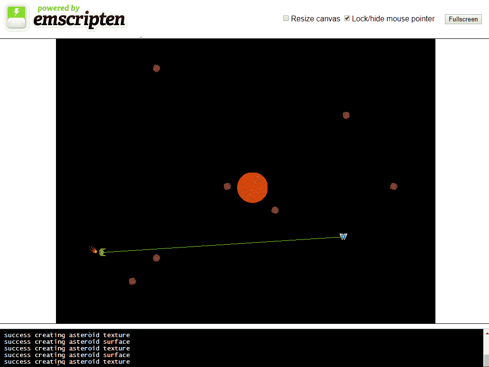

ai.html 的屏幕截图

请记住，您必须使用 Web 服务器或`emrun`来运行 WebAssembly 应用程序。如果您想使用`emrun`运行 WebAssembly 应用程序，您必须使用`--emrun`标志进行编译。Web 浏览器需要一个 Web 服务器来流式传输 WebAssembly 模块。如果您尝试直接从硬盘驱动器在浏览器中打开使用 WebAssembly 的 HTML 页面，那么 WebAssembly 模块将无法加载。

# 总结

在本章中，我们讨论了游戏 AI，它是什么，以及它与学术 AI 的不同之处。我们谈到了使用自主代理与自上而下的 AI，以及每种 AI 风格的好处，以及我们如何可以混合这两种风格。

我介绍了 FSM 的概念，并提到了在游戏中早期使用 FSM 的游戏，比如*PAC-MAN*，我们探讨了转向行为，以及我们将在游戏中用来引导代理的转向行为的种类。我们将小行星和一颗星星添加为游戏的障碍物，并增加了游戏区域的大小。我们添加了新形式的碰撞检测，以便我们的 AI 确定何时与玩家有视线。我们还添加了矩形碰撞检测，以确定是否有足够接近的障碍物供我们的 AI 使用避免力。我们将我们的`Point`类扩展为`Vector2D`类，并添加了新功能，包括投影、大小和点积计算。我们编写了一个 FSM，并用它来确定我们将使用的转向力，并在什么情况下使用。

在下一章中，我们将大大扩展我们的关卡大小，并添加一个摄像机，以便我们可以在游戏区域的更大版本中移动我们的飞船。
