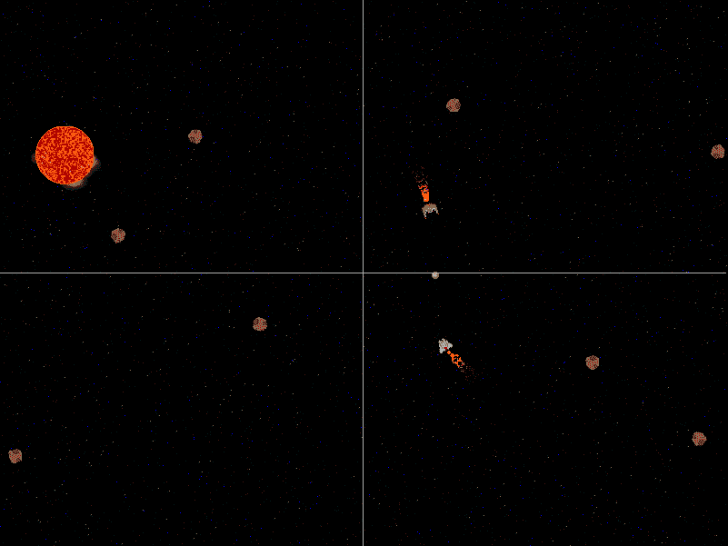

# 第十一章：设计 2D 相机

相机设计是新手游戏设计师经常忽视的事情之一。到目前为止，我们一直使用的是所谓的*固定位置相机*。屏幕上没有透视变化。在 20 世纪 70 年代，几乎所有早期的街机游戏都是这样设计的。我发现的最古老的带有相机的游戏是 Atari 的*Lunar Lander*，它于 1979 年 8 月发布。*Lunar Lander*是一个早期的基于矢量的游戏，当着陆器接近月球表面时，相机会放大，然后在着陆器接近表面时移动相机。

在 20 世纪 80 年代初，更多的游戏开始尝试一个比单个游戏屏幕更大的游戏世界的想法。*Rally X*是 Namco 于 1980 年发布的类似*Pac-Man*的迷宫游戏，其中迷宫比单个显示更大。*Rally X*使用了一个*位置捕捉相机*（有时称为*锁定相机*），无论如何都会将玩家的汽车保持在游戏屏幕的中心。这是你可以实现的最简单的 2D 滚动相机形式，许多新手游戏设计师会创建一个*2D 位置捕捉相机*然后就此结束，但是你可能希望在游戏中实现更复杂的相机，这是有原因的。

1981 年，Midway 发布了游戏*Defender*。这是一个横向卷轴射击游戏，允许玩家在任何方向移动他们的太空飞船。意识到玩家需要看到太空飞船面对的方向更多的关卡内容，*Defender*使用了第一个*双向前置焦点相机*。这个相机会移动视野区域，使得屏幕的三分之二在玩家太空飞船面对的方向前面，三分之一在后面。这更加关注了玩家当前面对的内容。相机不会在两个位置之间突然切换，那样会很令人不适。相反，当玩家改变方向时，相机位置会平稳过渡到新的位置（对于 1981 年来说相当酷）。

在 20 世纪 80 年代，许多新的相机设计开始被使用。Konami 开始在许多射击游戏中使用自动滚动相机，包括*Scramble*、*Gradius*和*1942*。1985 年，Atari 发布了*Gauntlet*，这是一个早期的多人游戏，允许四名玩家同时参与游戏。*Gauntlet*中的相机定位在所有玩家位置的平均值处。像*Super Mario Bros.*这样的平台游戏允许用户的位置推动相机向前移动。

你需要在构建中包含几个图像才能使这个项目工作。确保你从项目的 GitHub 中包含了`/Chapter11/sprites/`文件夹。如果你还没有下载 GitHub 项目，你可以在[`github.com/PacktPublishing/Hands-On-Game-Development-with-WebAssembly`](https://github.com/PacktPublishing/Hands-On-Game-Development-with-WebAssembly)上获取它。

如果你花时间寻找，会发现很多出色的 2D 相机示例。我们将专注（无意冒犯）于一些对我们的游戏有帮助的 2D 相机特性。

# 为我们的游戏创建相机

我们将分几个不同的阶段构建我们的摄像机。我们将从一个基本的**锁定摄像机**实现开始。这将为我们提供一个很好的起点，我们可以在此基础上添加新的摄像机功能。稍后，我们将修改这个摄像机，使其成为一个**投影焦点摄像机**。投影焦点摄像机会关注玩家飞船的速度，并调整摄像机，以便在玩家前方显示更多的游戏区域。这种技术基于这样的假设，即在这个游戏中，玩家通常更关注玩家飞船移动的方向上的游戏内容。对于我们摄像机的最终版本，我们将在我们的抛射物上添加*摄像机吸引器*。这种修改的想法是，当游戏中有射击时，摄像机应该吸引注意力到游戏的那个区域。

# 用于跟踪玩家移动的摄像机

我们摄像机的第一个实现将是一个锁定摄像机，它将锁定我们的玩家，并随着他们在关卡中移动而跟随。现在，我们的关卡和该关卡上的*固定摄像机*大小相同。我们不仅需要使我们的关卡更大，还需要修改我们的对象包裹，以使其与我们的摄像机配合。我们需要做的第一件事是修改我们的`game.hpp`文件以实现我们的锁定摄像机。我们将创建一个`Camera`类和一个`RenderManager`类，在其中移动所有我们特定于渲染的代码。我们还需要添加一些`#define`宏来定义我们关卡的高度和宽度，因为这将与我们已经定义的画布高度和宽度不同。我们还将向我们的`Vector2D`类添加一些额外的重载运算符。

# 投影焦点和摄像机吸引器

锁定摄像机并不是一件糟糕的事情，但更好的摄像机会显示玩家需要看到的更多内容。在我们的游戏中，玩家更有可能对他们移动方向前方的内容感兴趣。有时被称为投影焦点摄像机的摄像机会关注我们飞船当前移动的速度，并相应地调整我们的摄像机位置。

我们将采用的另一种摄像机技术称为**摄像机吸引器**。有时在游戏中，有一些感兴趣的对象可以用来吸引摄像机的焦点。这些对象会产生一种吸引力，会把我们的摄像机朝着那个方向拉动。我们摄像机的一个吸引力是敌人的飞船。另一个吸引力是抛射物。敌人的飞船代表潜在的行动，而抛射物代表对我们玩家的潜在威胁。在本节中，我们将结合投影焦点和摄像机吸引器来改善我们的摄像机定位。

我想要添加的最后一件事是一个指向敌人飞船的箭头。因为游戏区域现在比画布大，我们需要一个提示来帮助我们找到敌人。如果没有这个，我们可能会发现自己毫无目的地四处游荡，这并不好玩。我们还可以用小地图来实现这一点，但是因为只有一个敌人，我觉得箭头会更容易实现。让我们逐步了解我们需要添加的代码，以改善我们的摄像机并添加我们的定位箭头。

# 修改我们的代码

我们将需要为本章添加几个新的类。显然，如果我们想在游戏中有一个摄像头，我们将需要添加一个`Camera`类。在代码的先前版本中，渲染是通过直接调用 SDL 完成的。因为 SDL 没有摄像头作为 API 的一部分，我们将需要添加一个`RenderManager`类，作为我们渲染过程中的中间步骤。这个类将使用摄像机的位置来确定我们在画布上渲染游戏对象的位置。我们将扩大我们的游戏区域，使其为画布的四倍宽和四倍高。这会产生一个游戏问题，因为现在我们需要能够找到敌人飞船。为了解决这个问题，我们需要创建一个指向敌人飞船方向的定位器**用户界面**（**UI**）元素。

# 修改 game.hpp 文件

让我们来看看我们将对`game.hpp`文件进行的更改。我们首先添加了一些`#define`宏：

```cpp
#define LEVEL_WIDTH CANVAS_WIDTH*4
#define LEVEL_HEIGHT CANVAS_HEIGHT*4
```

这将定义我们的关卡的宽度和高度是画布宽度和高度的四倍。在我们的类列表的末尾，我们应该添加一个`Camera`类，一个`Locator`类和`RenderManager`类，如下所示：

```cpp
class Ship;
class Particle;
class Emitter;
class Collider;
class Asteroid;
class Star;
class PlayerShip;
class EnemyShip;
class Projectile;
class ProjectilePool;
class FiniteStateMachine;
class Camera;
class RenderManager;
class Locator;
```

您会注意到最后三行声明了一个名为`Camera`的类，一个名为`Locator`的类，以及一个名为`RenderManager`的类将在代码中稍后定义。

# Vector2D 类定义

我们将扩展我们的`Vector2D`类定义，为`Vector2D`类中的`+`和`-`运算符添加`operator+`和`operator-`重载。

如果您不熟悉运算符重载，这是允许类使用 C++运算符而不是函数的便捷方式。有一个很好的教程可以帮助您获取更多信息，可在[`www.tutorialspoint.com/cplusplus/cpp_overloading.htm`](https://www.tutorialspoint.com/cplusplus/cpp_overloading.htm)找到。

以下是`Vector2D`类的新定义：

```cpp
class Vector2D {
    public:
        float x;
        float y;

        Vector2D();
        Vector2D( float X, float Y );

        void Rotate( float radians );
        void Normalize();
        float MagSQ();
        float Magnitude();
        Vector2D Project( Vector2D &onto );
        float Dot(Vector2D &vec);
        float FindAngle();

        Vector2D operator=(const Vector2D &vec);
        Vector2D operator*(const float &scalar);
        void operator+=(const Vector2D &vec);
        void operator-=(const Vector2D &vec);
        void operator*=(const float &scalar);
        void operator/=(const float &scalar);
 Vector2D operator-(const Vector2D &vec);
 Vector2D operator+(const Vector2D &vec);
};
```

您会注意到定义的最后两行是新的：

```cpp
Vector2D operator-(const Vector2D &vec);
Vector2D operator+(const Vector2D &vec);
```

# Locator 类定义

`Locator`类是一个新的 UI 元素类，将指向玩家指向敌人飞船的箭头。当敌人飞船不出现在画布上时，我们需要一个 UI 元素来帮助玩家找到敌人飞船。以下是类定义的样子：

```cpp
class Locator {
    public:
        bool m_Active = false;
        bool m_LastActive = false;
        SDL_Texture *m_SpriteTexture;
        SDL_Rect m_dest = {.x = 0, .y = 0, .w = 32, .h = 32 };
        Vector2D m_Position;
        int m_ColorFlux;
        float m_Rotation;

        Locator();
        void SetActive();
        void Move();
        void Render();
};
```

前两个属性是布尔标志，与定位器的活动状态有关。`m_Active`属性告诉我们定位器当前是否活动并应该被渲染。`m_LastActive`属性是一个布尔标志，告诉我们上一帧渲染时定位器是否活动。接下来的两行是精灵纹理和目标矩形，这将由渲染管理器用于渲染游戏对象：

```cpp
        SDL_Texture *m_SpriteTexture;
        SDL_Rect m_dest = {.x = 0, .y = 0, .w = 32, .h = 32 };
```

之后，在`m_Position`属性中有一个`x`和`y`位置值，`m_ColorFlux`中有一个表示 RGB 颜色值的整数，以及`m_Rotation`属性中的精灵旋转值。我们将使用`m_ColorFlux`属性使箭头的颜色在敌人靠近时更红，敌人远离时更白。

这个类定义的最后四行是类函数。有一个构造函数，一个将定位器状态设置为活动的函数，以及`Move`和`Render`函数：

```cpp
        Locator();
        void SetActive();
        void Move();
        void Render();
```

# Camera 类定义

现在我们需要添加新的`Camera`类定义。这个类将用于定义我们的`viewport`和摄像机的位置。`Move`函数将在每一帧中调用。最初，`Move`将锁定到我们玩家的位置并跟随其在关卡中移动。稍后，我们将改变这个功能以创建一个更动态的摄像机。`Camera`类将如下所示：

```cpp
class Camera {
    public:
        Vector2D m_Position;
        float m_HalfWidth;
        float m_HalfHeight;

        Camera( float width, float height );
        void Move();
};
```

# RenderManager 类定义

在这段时间里，我们一直在没有背景的情况下移动我们的关卡。在以前的章节中，我们的关卡恰好适合画布元素。然而，现在我们正在用相机在我们的关卡周围滚动。如果背景中没有任何东西在移动，很难判断你的飞船是否在移动。为了在我们的游戏中创造移动的幻觉，我们需要添加一个背景渲染器。除此之外，我们希望我们游戏中的所有渲染都是使用我们刚刚创建的相机作为偏移量来完成的。因此，我们不再希望我们的游戏对象直接调用`SDL_RenderCopy`或`SDL_RenderCopyEx`。相反，我们创建了一个`RenderManager`类，它将负责在我们的游戏内部执行渲染。我们有一个`RenderBackground`函数，它将渲染星空作为背景，并且我们创建了一个`Render`函数，它将使用相机作为偏移量来渲染我们的精灵纹理。这就是`RenderManager`类定义的样子：

```cpp
class RenderManager {
    public:
        const int c_BackgroundWidth = 800;
        const int c_BackgroundHeight = 600;
        SDL_Texture *m_BackgroundTexture;
        SDL_Rect m_BackgroundDest = {.x = 0, .y = 0, .w = 
        c_BackgroundWidth, .h = c_BackgroundHeight };

        RenderManager();
        void RenderBackground();
        void Render( SDL_Texture *tex, SDL_Rect *src, SDL_Rect *dest, float 
        rad_rotation = 0.0, int alpha = 255, int red = 255, int green = 
        255, int blue = 255 );
};
```

在`game.hpp`文件中我们需要做的最后一件事是创建`Camera`和`RenderManager`类型的两个新对象指针的外部链接。这些将是我们在这个版本的游戏引擎中使用的相机和渲染管理器对象，并且是我们将在`main.cpp`文件中定义的变量的外部引用：

```cpp
extern Camera* camera;
extern RenderManager* render_manager;
extern Locator* locator;
```

# camera.cpp 文件

在我们的`Camera`类中我们定义了两个函数；一个是用于我们的`camera`对象的构造函数，另一个是`Move`函数，我们将用它来跟随我们的`player`对象。以下是我们在`camera.cpp`文件中的内容：

```cpp
#include "game.hpp"
Camera::Camera( float width, float height ) {
    m_HalfWidth = width / 2;
    m_HalfHeight = height / 2;
}

void Camera::Move() {
    m_Position = player->m_Position;
    m_Position.x -= CANVAS_WIDTH / 2;
    m_Position.y -= CANVAS_HEIGHT / 2;
}
```

在这个实现中，`Camera`构造函数和`Move`函数非常简单。构造函数根据传入的宽度和高度设置相机的半宽和半高。`Move`函数将相机的位置设置为玩家的位置，然后将相机的位置移动画布宽度和画布高度的一半来使玩家居中。我们刚刚建立了一个起始相机，并将在本章后面添加更多功能。

# render_manager.cpp 文件

我们将把我们在对象内部进行的所有呼叫渲染精灵的操作移动到`RenderManager`类中。我们需要这样做是因为我们将使用我们相机的位置来决定我们在画布上渲染精灵的位置。我们还需要一个函数来渲染我们的背景星空。我们`render_manager.cpp`文件的前几行将包括`game.hpp`文件，并定义我们背景图像的虚拟文件系统位置：

```cpp
#include "game.hpp"
#define BACKGROUND_SPRITE_FILE (char*)"/sprites/starfield.png"
```

之后，我们将定义我们的构造函数。构造函数将用于将我们的`starfield.png`文件加载为一个`SDL_Surface`对象，然后使用该表面创建一个`SDL_Texture`对象，我们将使用它来渲染我们的背景：

```cpp
RenderManager::RenderManager() {
    SDL_Surface *temp_surface = IMG_Load( BACKGROUND_SPRITE_FILE );

    if( !temp_surface ) {
        printf("failed to load image: %s\n", IMG_GetError() );
        return;
    }

    m_BackgroundTexture = SDL_CreateTextureFromSurface( renderer, 
    temp_surface );

    if( !m_BackgroundTexture ) {
        printf("failed to create texture: %s\n", IMG_GetError() );
        return;
    }
    SDL_FreeSurface( temp_surface );
}
```

`RenderBackground`函数将需要在我们在`main`循环中定义的`render()`函数的开头被调用。因此，`RenderBackground`的前两行将有两个函数，我们将使用它们来清除之前在`main.cpp`中从`render()`函数调用的渲染器到黑色：

```cpp
SDL_SetRenderDrawColor( renderer, 0, 0, 0, 255 );
SDL_RenderClear( renderer );
```

之后，我们将设置一个背景矩形作为我们的渲染目标。`starfield.png`的大小与我们的画布大小（800 x 600）相匹配，因此我们需要根据摄像头的位置渲染四次。因为这是一个重复的纹理，我们可以使用模运算符（`%`）在摄像头的位置上来确定我们想要如何偏移星空。举个例子，如果我们将摄像头定位在`*x* = 100`，`*y* = 200`，我们希望将我们的星空背景的第一份拷贝渲染在`-100`，`-200`。如果我们停在这里，我们会在画布的右侧有 100 像素的黑色空间，在画布的底部有 200 像素的黑色空间。因为我们希望在这些区域有一个背景，我们需要额外渲染三次我们的背景。如果我们在`700`，`-200`处再次渲染我们的背景（在原始渲染的*x*值上添加画布宽度），我们现在在画布底部有一个 200 像素的黑色条。然后我们可以在`-100`，`400`处渲染我们的星空（在原始渲染的*y*值上添加画布高度）。这样会在底角留下一个 100 x 200 像素的黑色。第四次渲染需要在原始渲染的*x*和*y*值上添加画布宽度和画布高度来填补那个角落。这就是我们在`RenderBackground`函数中所做的，我们用它来根据摄像头的位置将重复的背景渲染到画布上：

```cpp
void RenderManager::RenderBackground() {
    SDL_SetRenderDrawColor( renderer, 0, 0, 0, 255 );
    SDL_RenderClear( renderer );
    SDL_Rect background_rect = {.x = 0, .y=0, .w=CANVAS_WIDTH, 
                                .h=CANVAS_HEIGHT};
    int start_x = (int)(camera->m_Position.x) % CANVAS_WIDTH;
    int start_y = (int)(camera->m_Position.y) % CANVAS_HEIGHT;
    background_rect.x -= start_x;
    background_rect.y -= start_y;
    SDL_RenderCopy( renderer, m_BackgroundTexture, NULL, 
                    &background_rect );
    background_rect.x += CANVAS_WIDTH;
    SDL_RenderCopy( renderer, m_BackgroundTexture, NULL, 
                    &background_rect );
    background_rect.x -= CANVAS_WIDTH;
    background_rect.y += CANVAS_HEIGHT;
    SDL_RenderCopy( renderer, m_BackgroundTexture, NULL, 
                    &background_rect );
    background_rect.x += CANVAS_WIDTH;
    SDL_RenderCopy( renderer, m_BackgroundTexture, NULL, 
                    &background_rect );
 }
```

我们在`render_manager.cpp`中定义的最后一个函数是我们的`Render`函数。在定义完这个函数之后，我们需要找到我们之前在代码中调用`SDL_RenderCopy`和`SDL_RenderCopyEx`的每个地方，并将这些调用替换为对我们渲染管理器的`Render`函数的调用。这个函数不仅会根据我们摄像头的位置来渲染我们的精灵，还会用于设置颜色和 alpha 通道的修改。以下是`Render`函数的完整代码：

```cpp

void RenderManager::Render( SDL_Texture *tex, SDL_Rect *src, SDL_Rect *dest, float rad_rotation,int alpha, int red, int green, int blue ) {

    SDL_Rect camera_dest = *dest;
    if( camera_dest.x <= CANVAS_WIDTH &&
        camera->m_Position.x >= LEVEL_WIDTH - CANVAS_WIDTH ) {
        camera_dest.x += (float)LEVEL_WIDTH;
    }
    else if( camera_dest.x >= LEVEL_WIDTH - CANVAS_WIDTH &&
             camera->m_Position.x <= CANVAS_WIDTH ) {
             camera_dest.x -= (float)LEVEL_WIDTH;
    }
    if( camera_dest.y <= CANVAS_HEIGHT &&
        camera->m_Position.y >= LEVEL_HEIGHT - CANVAS_HEIGHT ) {
        camera_dest.y += (float)LEVEL_HEIGHT;
    }
    else if( camera_dest.y >= LEVEL_HEIGHT - CANVAS_HEIGHT &&
             camera->m_Position.y <= CANVAS_HEIGHT ) {
             camera_dest.y -= (float)LEVEL_HEIGHT;
    }
    camera_dest.x -= (int)camera->m_Position.x;
    camera_dest.y -= (int)camera->m_Position.y;

    SDL_SetTextureAlphaMod(tex,
                           (Uint8)alpha );

    SDL_SetTextureColorMod(tex,
                            (Uint8)red,
                            (Uint8)green,
                            (Uint8)blue );

    if( rad_rotation != 0.0 ) {
        float degree_rotation = RAD_TO_DEG(rad_rotation);
        SDL_RenderCopyEx( renderer, tex, src, &camera_dest,
                          degree_rotation, NULL, SDL_FLIP_NONE );
    }
    else {
        SDL_RenderCopy( renderer, tex, src, &camera_dest );
    }
}
```

这个函数的第一步是创建一个新的`SDL_Rect`对象，我们将用它来修改传递给`Render`函数的`dest`变量中的值。因为我们有一个包裹*x*和*y*坐标的级别，所以我们希望在级别的最左边渲染对象时，如果我们在级别的最右边，我们将希望将对象渲染到右边。同样，如果我们在级别的最左边，我们将希望将位于级别最右边的对象渲染到右边。这样可以使我们的飞船从级别的左侧环绕到级别的右侧，反之亦然。以下是调整摄像头位置以包裹级别左右对象的代码：

```cpp
if( camera_dest.x <= CANVAS_WIDTH &&
    camera->m_Position.x >= LEVEL_WIDTH - CANVAS_WIDTH ) {
    camera_dest.x += (float)LEVEL_WIDTH;
}
else if( camera_dest.x >= LEVEL_WIDTH - CANVAS_WIDTH &&
         camera->m_Position.x <= CANVAS_WIDTH ) {
    camera_dest.x -= (float)LEVEL_WIDTH;
}
```

完成这些之后，我们将做类似的事情，以便在级别的顶部和底部包裹对象的位置：

```cpp
if( camera_dest.y <= CANVAS_HEIGHT &&
    camera->m_Position.y >= LEVEL_HEIGHT - CANVAS_HEIGHT ) {
    camera_dest.y += (float)LEVEL_HEIGHT;
}
else if( camera_dest.y >= LEVEL_HEIGHT - CANVAS_HEIGHT &&
         camera->m_Position.y <= CANVAS_HEIGHT ) {
    camera_dest.y -= (float)LEVEL_HEIGHT;
}
```

接下来，我们需要从`camera_dest`的*x*和*y*坐标中减去摄像头的位置，并设置我们的`alpha`和`color`修改的值：

```cpp
camera_dest.x -= (int)camera->m_Position.x;
camera_dest.y -= (int)camera->m_Position.y;
SDL_SetTextureAlphaMod(tex,
                        (Uint8)alpha );

SDL_SetTextureColorMod(tex,
                       (Uint8)red,
                       (Uint8)green,
                       (Uint8)blue );
```

在函数的结尾，如果我们的精灵被旋转，我们将调用`SDL_RenderCopyEx`，如果没有旋转，我们将调用`SDL_RenderCopy`：

```cpp
if( rad_rotation != 0.0 ) {
    float degree_rotation = RAD_TO_DEG(rad_rotation);
    SDL_RenderCopyEx( renderer, tex, src, &camera_dest,
                      degree_rotation, NULL, SDL_FLIP_NONE );
}
else {
    SDL_RenderCopy( renderer, tex, src, &camera_dest );
}
```

# 修改 main.cpp

为了实现我们的摄像头，我们需要对`main.cpp`文件进行一些修改。我们需要为我们的摄像头、渲染管理器和定位器添加一些新的全局变量。我们需要修改我们的`move`函数，以包括移动我们的摄像头和定位器的调用。我们将修改我们的`render`函数来渲染我们的背景和定位器。最后，我们需要在我们的`main`函数中添加更多的初始化代码。

# 新的全局变量

我们需要在`main.cpp`文件的开头附近创建三个新的全局变量。我们将需要指向`RenderManager`、`Camera`和`Locator`的对象指针。这是这些声明的样子：

```cpp
Camera* camera;
RenderManager* render_manager;
Locator* locator;
```

# 修改 move 函数

我们需要修改我们的`move`函数来移动我们的摄像头和我们的定位器对象。我们需要在我们的`move`函数的结尾添加以下两行：

```cpp
 camera->Move();
 locator->Move();
```

以下是`move`函数的全部内容：

```cpp
void move() {
    player->Move();
    enemy->Move();
    projectile_pool->MoveProjectiles();
    Asteroid* asteroid;
    std::vector<Asteroid*>::iterator it;
    int i = 0;

    for( it = asteroid_list.begin(); it != asteroid_list.end(); it++ ) {
        asteroid = *it;
        if( asteroid->m_Active ) {
            asteroid->Move();
        }
    }
    star->Move();
    camera->Move();
    locator->Move();
}
```

# 修改渲染函数

我们将在`render`函数的开头添加一行新代码。这行代码将渲染背景星空，并根据摄像机位置移动它：

```cpp
 render_manager->RenderBackground();
```

之后，我们需要在`render`函数的末尾添加一行代码。这行代码需要立即出现在`SDL_RenderPresent`调用之前，而`SDL_RenderPresent`调用仍然需要是该函数中的最后一行：

```cpp
 locator->Render();
```

以下是`render()`函数的全部内容：

```cpp
void render() {
 render_manager->RenderBackground();
    player->Render();
    enemy->Render();
    projectile_pool->RenderProjectiles();

    Asteroid* asteroid;
    std::vector<Asteroid*>::iterator it;
    for( it = asteroid_list.begin(); it != asteroid_list.end(); it++ ) {
        asteroid = *it;
        asteroid->Render();
    }
    star->Render();
 locator->Render();

    SDL_RenderPresent( renderer );
}
```

# 修改主函数

最后的修改将是在`main`函数中发生的初始化。我们需要为之前定义的`camera`、`render_manager`和`locator`指针创建新对象：

```cpp
camera = new Camera(CANVAS_WIDTH, CANVAS_HEIGHT);
render_manager = new RenderManager();
locator = new Locator();
```

在我们的代码的先前版本中，我们有七个调用`new Asteroid`并使用`asteroid_list.push_back`将这七个新小行星推入我们的小行星列表中。现在我们需要创建比七个更多的小行星，所以我们将使用双重`for`循环来创建并分散我们的小行星遍布整个游戏区域。为此，我们首先需要删除所有那些早期的调用来创建和推入小行星：

```cpp
asteroid_list.push_back( new Asteroid(
                            200, 50, 0.05, 
                            DEG_TO_RAD(10) ) );
asteroid_list.push_back( new Asteroid(
                            600, 150, 0.03, 
                            DEG_TO_RAD(350) ) );
asteroid_list.push_back( new Asteroid(
                            150, 500, 0.05, 
                            DEG_TO_RAD(260) ) );
asteroid_list.push_back( new Asteroid(
                            450, 350, 0.01, 
                            DEG_TO_RAD(295) ) );
asteroid_list.push_back( new Asteroid(
                            350, 300, 0.08, 
                            DEG_TO_RAD(245) ) );
asteroid_list.push_back( new Asteroid(
                            700, 300, 0.09, 
                            DEG_TO_RAD(280) ) );
asteroid_list.push_back( new Asteroid(
                            200, 450, 0.03, 
                            DEG_TO_RAD(40) ) );
```

一旦您删除了所有前面的代码，我们将添加以下代码来创建新的小行星，并在整个游戏区域中将它们半随机地分布：

```cpp
int asteroid_x = 0;
int asteroid_y = 0;
int angle = 0;

// SCREEN 1
for( int i_y = 0; i_y < 8; i_y++ ) {
    asteroid_y += 100;
    asteroid_y += rand() % 400;
    asteroid_x = 0;

    for( int i_x = 0; i_x < 12; i_x++ ) {
        asteroid_x += 66;
        asteroid_x += rand() % 400;
        int y_save = asteroid_y;
        asteroid_y += rand() % 400 - 200;
        angle = rand() % 359;
        asteroid_list.push_back( new Asteroid(
                        asteroid_x, asteroid_y,
                        get_random_float(0.5, 1.0),
                        DEG_TO_RAD(angle) ) );
        asteroid_y = y_save;
    }
}
```

# 修改 asteroid.cpp

现在我们正在使用渲染管理器来渲染所有游戏对象，我们需要遍历各种游戏对象并修改它们以通过渲染管理器而不是直接渲染。我们将首先修改`asteroid.cpp`文件。在`asteroid.cpp`中，我们有`Asteroid::Render()`函数。在之前的章节中，这个函数会直接通过 SDL 渲染小行星精灵，使用`SDL_RenderCopyEx`调用。现在我们有了在`main.cpp`文件中定义的`render_manager`对象，我们将使用该渲染管理器间接地渲染我们的精灵。`RenderManager::Render`函数将使用摄像机来调整在画布上渲染精灵的位置。我们需要对`Asteroid::Render()`函数进行的第一个修改是删除以下行：

```cpp
 SDL_RenderCopyEx( renderer, m_SpriteTexture, 
                   &m_src, &m_dest, 
                   RAD_TO_DEG(m_Rotation), NULL, SDL_FLIP_NONE );
```

删除对`SDL_RenderCopyEX`的调用后，我们需要在`render_manager`对象的`Render`函数中添加以下调用：

```cpp
 render_manager->Render( m_SpriteTexture, &m_src, &m_dest, m_Rotation );
```

`Asteroid::Render`函数的新版本现在看起来像这样：

```cpp
void Asteroid::Render() {
    m_Explode->Move();
    m_Chunks->Move();
    if( m_Active == false ) {
        return;
    }
    m_src.x = m_dest.w * m_CurrentFrame;
    m_dest.x = m_Position.x + m_Radius / 2;
    m_dest.y = m_Position.y + m_Radius / 2;
    render_manager->Render( m_SpriteTexture, &m_src, &m_dest, m_Rotation );
}
```

# 修改 collider.cpp

我们需要修改`collider.cpp`文件中的一个函数。`WrapPosition`函数的先前版本检查`Collider`对象是否移出画布的一侧，如果是，则该函数将移动碰撞器到相反的一侧。这模仿了经典的 Atari 街机游戏*Asteroids*的行为。在 Atari *Asteroids*中，如果一个小行星或玩家的太空船从屏幕的一侧移出，那个小行星（或太空船）将出现在游戏屏幕的对面。这是我们`wrap`代码的先前版本：

```cpp
void Collider::WrapPosition() {
    if( m_Position.x > CANVAS_WIDTH + m_Radius ) {
        m_Position.x = -m_Radius;
    }
    else if( m_Position.x < -m_Radius ) {
        m_Position.x = CANVAS_WIDTH;
    }

    if( m_Position.y > CANVAS_HEIGHT + m_Radius ) {
        m_Position.y = -m_Radius;
    }
    else if( m_Position.y < -m_Radius ) {
        m_Position.y = CANVAS_HEIGHT;
    }
}
```

因为我们的游戏现在扩展到超出单个画布，所以我们不再希望在对象移出画布时进行包装。相反，我们希望在对象超出级别的边界时将其包装。这是`WrapPosition`函数的新版本：

```cpp
void Collider::WrapPosition() {
    if( m_Position.x > LEVEL_WIDTH ) {
        m_Position.x -= LEVEL_WIDTH;
    }
    else if( m_Position.x < 0 ) {
        m_Position.x += LEVEL_WIDTH;
    }

    if( m_Position.y > LEVEL_HEIGHT ) {
        m_Position.y -= LEVEL_HEIGHT;
    }
    else if( m_Position.y < 0 ) {
        m_Position.y += LEVEL_HEIGHT;
    }
}
```

# 修改 enemy_ship.cpp

需要对`enemy_ship.cpp`文件进行一些小修改。`EnemyShip`构造函数现在将设置`m_Position`属性上的`x`和`y`值。我们需要将位置设置为`810`和`800`，因为级别现在比画布大小大得多。我们将在`EnemyShip`构造函数的最顶部设置`m_Position`属性。在更改后，构造函数的开头将如下所示：

```cpp
EnemyShip::EnemyShip() {
    m_Position.x = 810.0;
    m_Position.y = 800.0;
```

# 修改 finite_state_machine.cpp

我们需要对`finite_state_machine.cpp`文件进行小的修改。在`FiniteStateMachine::AvoidForce()`函数内部，有几个引用画布尺寸的地方必须更改为引用级别尺寸，因为我们的级别尺寸和画布尺寸不同。以前，我们将`star_avoid`变量的`x`和`y`属性设置为以下基于画布的值：

```cpp
star_avoid.x = CANVAS_WIDTH / 2;
star_avoid.y = CANVAS_HEIGHT / 2;
```

这些行必须更改为引用`LEVEL_WIDTH`和`LEVEL_HEIGHT`：

```cpp
star_avoid.x = LEVEL_WIDTH / 2;
star_avoid.y = LEVEL_HEIGHT / 2;
```

我们必须对`avoid_vec`变量做同样的事情。这是我们以前的内容：

```cpp
avoid_vec.x = CANVAS_WIDTH / 2;
avoid_vec.y = CANVAS_HEIGHT / 2;
```

这也必须更改为引用`LEVEL_WIDTH`和`LEVEL_HEIGHT`：

```cpp
avoid_vec.x = LEVEL_WIDTH / 2;
avoid_vec.y = LEVEL_HEIGHT / 2;
```

`FiniteState::AvoidForce`函数的新版本完整内容如下：

```cpp
void FiniteStateMachine::AvoidForce() {
    Vector2D start_corner;
    Vector2D end_corner;
    Vector2D avoid_vec;
    Vector2D dist;
    float closest_square = 999999999999.0;
    float msq;
    Vector2D star_avoid;
 star_avoid.x = LEVEL_WIDTH / 2;
 star_avoid.y = LEVEL_HEIGHT / 2;
    star_avoid -= m_Ship->m_Position;
    msq = star_avoid.MagSQ();

    if( msq >= c_StarAvoidDistSQ ) {
        start_corner = m_Ship->m_Position;
        start_corner.x -= c_AvoidDist;
        start_corner.y -= c_AvoidDist;
        end_corner = m_Ship->m_Position;
        end_corner.x += c_AvoidDist;
        end_corner.y += c_AvoidDist;

        Asteroid* asteroid;
        std::vector<Asteroid*>::iterator it;

        int i = 0;
        for( it = asteroid_list.begin(); it != asteroid_list.end(); it++ ) {
            asteroid = *it;
            if( asteroid->m_Active == true &&
                asteroid->SteeringRectTest( start_corner, end_corner ) ) {
                dist = asteroid->m_Position;
                dist -= m_Ship->m_Position;
                msq = dist.MagSQ();

                if( msq <= closest_square ) {
                    closest_square = msq;
                    avoid_vec = asteroid->m_Position;
                }
            }
        }
        // LOOP OVER PROJECTILES
        Projectile* projectile;
        std::vector<Projectile*>::iterator proj_it;

        for( proj_it = projectile_pool->m_ProjectileList.begin(); 
             proj_it != projectile_pool->m_ProjectileList.end(); proj_it++ ) {
            projectile = *proj_it;
            if( projectile->m_Active == true &&
                projectile->SteeringRectTest( start_corner, end_corner ) ) {
                dist = projectile->m_Position;
                dist -= m_Ship->m_Position;
                msq = dist.MagSQ();

                if( msq <= closest_square ) {
                    closest_square = msq;
                    avoid_vec = projectile->m_Position;
                }
            }
        }
        if( closest_square != 999999999999.0 ) {
            avoid_vec -= m_Ship->m_Position;
            avoid_vec.Normalize();
            float rot_to_obj = avoid_vec.FindAngle();

            if( std::abs( rot_to_obj - m_Ship->m_Rotation ) < 0.75 ) {
                if( rot_to_obj >= m_Ship->m_Rotation ) {
                    m_Ship->RotateLeft();
                }
                else {
                    m_Ship->RotateRight();
                }
            }
            m_Ship->m_Velocity -= avoid_vec * delta_time * 
            c_ObstacleAvoidForce;
        }
    }
    else {
        avoid_vec.x = LEVEL_WIDTH / 2;
 avoid_vec.y = LEVEL_HEIGHT / 2;
        avoid_vec -= m_Ship->m_Position;
        avoid_vec.Normalize();
        float rot_to_obj = avoid_vec.FindAngle();
        if( std::abs( rot_to_obj - m_Ship->m_Rotation ) < 0.75 ) {
            if( rot_to_obj >= m_Ship->m_Rotation ) {
                m_Ship->RotateLeft();
            }
            else {
                m_Ship->RotateRight();
            }
        }
        m_Ship->m_Velocity -= avoid_vec * delta_time * c_StarAvoidForce; 
    }
}
```

# 修改 particle.cpp

我们需要修改`particle.cpp`文件中的`Render`函数，以便通过`render_manager`而不是直接通过调用 SDL 来渲染粒子。`Particle::Render`函数的旧版本如下：

```cpp
void Particle::Render() {
    SDL_SetTextureAlphaMod(m_sprite_texture,
                            (Uint8)m_alpha );

    if( m_color_mod == true ) {
        SDL_SetTextureColorMod(m_sprite_texture,
                                m_current_red,
                                m_current_green,
                                m_current_blue );
    }

    if( m_align_rotation == true ) {
        SDL_RenderCopyEx( renderer, m_sprite_texture, &m_src, &m_dest, 
                            m_rotation, NULL, SDL_FLIP_NONE );
    }
    else {
        SDL_RenderCopy( renderer, m_sprite_texture, &m_src, &m_dest );
    }
}
```

新的`Particle::Render`函数将通过`render_manager`对象对`Render`函数进行一次调用：

```cpp
void Particle::Render() {
 render_manager->Render( m_sprite_texture, &m_src, &m_dest, m_rotation,
 m_alpha, m_current_red, m_current_green, m_current_blue );
}
```

# 修改 player_ship.cpp

我们需要对`player_ship.cpp`文件进行一些小的修改。与我们对`enemy_ship.cpp`文件所做的更改一样，我们需要添加两行来设置`m_Position`属性中的`x`和`y`值。

我们需要删除`PlayerShip::PlayerShip()`构造函数的前两行：

```cpp
m_Position.x = CANVAS_WIDTH - 210.0;
m_Position.y = CANVAS_HEIGHT - 200.0;
```

这些是我们需要对`PlayerShip::PlayerShip()`构造函数进行的更改：

```cpp
PlayerShip::PlayerShip() {
 m_Position.x = LEVEL_WIDTH - 810.0;
 m_Position.y = LEVEL_HEIGHT - 800.0;
```

# 修改 projectile.cpp

我们需要对`projectile.cpp`文件进行一些小的修改。与其他游戏对象一样，`Render`函数以前直接调用 SDL 函数来渲染游戏对象。我们需要通过`render_manager`对象进行调用，而不是直接调用 SDL。我们需要从`Projectile::Render()`函数中删除以下行：

```cpp
int return_val = SDL_RenderCopy( renderer, m_SpriteTexture, 
                                 &src, &dest );
if( return_val != 0 ) {
    printf("SDL_Init failed: %s\n", SDL_GetError());
}
```

我们需要在`render_manager`对象上添加一个对`Render`函数的调用来替换这些行：

```cpp
 render_manager->Render( m_SpriteTexture, &src, &dest );
```

`Projectile::Render()`函数的新版本将如下所示：

```cpp
void Projectile::Render() {
    dest.x = m_Position.x + 8;
    dest.y = m_Position.y + 8;
    dest.w = c_Width;
    dest.h = c_Height;

    src.x = 16 * m_CurrentFrame;

 render_manager->Render( m_SpriteTexture, &src, &dest );
}
```

# 修改 shield.cpp

与许多其他游戏对象一样，`Shield::Render()`函数将需要修改，以便不再直接调用 SDL，而是调用`render_manager`对象的`Render`函数。在`Shield::Render()`函数内部，我们需要删除对 SDL 的以下调用：

```cpp
SDL_SetTextureColorMod(m_SpriteTexture,
                        color_red,
                        color_green,
                        0 );

SDL_RenderCopyEx( renderer, m_SpriteTexture, 
                    &m_src, &m_dest, 
                    RAD_TO_DEG(m_Ship->m_Rotation), 
                    NULL, SDL_FLIP_NONE );
```

我们将用一个对`Render`的单一调用来替换这些行：

```cpp
render_manager->Render( m_SpriteTexture, &m_src, &m_dest, m_Ship->m_Rotation,
                        255, color_red, color_green, 0 );
```

这是`Shield::Render`函数的新版本的完整内容：

```cpp
void Shield::Render() {
    if( m_Active ) {
        int color_green = m_ttl / 100 + 1;
        int color_red = 255 - color_green;

        m_src.x = m_CurrentFrame * m_dest.w;

        m_dest.x = m_Ship->m_Position.x;
        m_dest.y = m_Ship->m_Position.y;
 render_manager->Render( m_SpriteTexture, &m_src, &m_dest, m_Ship->m_Rotation,
 255, color_red, color_green, 0 );
    }
}
```

# 修改 ship.cpp

修改我们游戏对象内的`Render`函数变得相当常规。与我们修改了`Render`函数的其他对象一样，我们需要删除所有直接调用 SDL 的部分。这是我们需要从`Render`函数中删除的代码：

```cpp
float degrees = (m_Rotation / PI) * 180.0;
int return_code = SDL_RenderCopyEx( renderer, m_SpriteTexture, 
                                    &src, &dest, 
                                    degrees, NULL, SDL_FLIP_NONE );
if( return_code != 0 ) {
    printf("failed to render image: %s\n", IMG_GetError() );
}
```

删除这些行后，我们需要添加一行调用`render_manager->Render`函数：

```cpp
 render_manager->Render( m_SpriteTexture, &src, &dest, m_Rotation );
```

# 修改 star.cpp

我们需要修改`star.cpp`文件内的两个函数。首先，我们需要修改`Star::Star()`构造函数中星星的位置。在上一章的`Star`构造函数版本中，我们将星星的位置设置为画布的中间。现在，它必须设置为级别的中间。以下是原始版本构造函数中的行：

```cpp
m_Position.x = CANVAS_WIDTH / 2;
m_Position.y = CANVAS_HEIGHT / 2;
```

现在，我们将更改这些位置，使其相对于`LEVEL_WIDTH`和`LEVEL_HEIGHT`而不是`CANVAS_WIDTH`和`CANVAS_HEIGHT`：

```cpp
m_Position.x = LEVEL_WIDTH / 2;
m_Position.y = LEVEL_HEIGHT / 2;
```

在对`Star::Star`构造函数进行上述更改后，我们需要对`Star::Render`函数进行更改。我们需要删除对`SDL_RenderCopy`的调用，并将其替换为对`render_manager`对象上的`Render`函数的调用。这是以前版本的`Render`函数的样子：

```cpp
void Star::Render() {
    Emitter* flare;
    std::vector<Emitter*>::iterator it;
    for( it = m_FlareList.begin(); it != m_FlareList.end(); it++ ) {
        flare = *it;
        flare->Move();
    }
    m_src.x = m_dest.w * m_CurrentFrame;
    SDL_RenderCopy( renderer, m_SpriteTexture, 
                    &m_src, &m_dest );
}
```

我们将修改为以下内容：

```cpp
void Star::Render() {
    Emitter* flare;
    std::vector<Emitter*>::iterator it;
    for( it = m_FlareList.begin(); it != m_FlareList.end(); it++ ) {
        flare = *it;
        flare->Move();
    }
    m_src.x = m_dest.w * m_CurrentFrame;
    render_manager->Render( m_SpriteTexture, &m_src, &m_dest );
}
```

# 修改 vector.cpp

我们需要向我们的`Vector2D`类添加两个新的重载运算符。我们需要重载`operator-`和`operator+`。这段代码非常简单。它将使用已经重载的`operator-=`和`operator+=`来允许我们对彼此的向量进行加法和减法。以下是这些重载运算符的新代码：

```cpp
Vector2D Vector2D::operator-(const Vector2D &vec) {
 Vector2D return_vec = *this;
 return_vec -= vec;
 return return_vec;
}

Vector2D Vector2D::operator+(const Vector2D &vec) {
 Vector2D return_vec = *this;
 return_vec += vec;
 return return_vec;
}
```

# 编译并使用锁定摄像头进行游戏

如果我们现在编译和测试我们所拥有的东西，我们应该能够在我们的关卡中移动并看到一个直接跟踪玩家位置的摄像头。我们应该有一个定位箭头，帮助我们找到敌人的太空船。以下是我们可以用来构建项目的 Emscripten 的命令行调用：

```cpp
em++ asteroid.cpp camera.cpp collider.cpp emitter.cpp enemy_ship.cpp finite_state_machine.cpp locator.cpp main.cpp particle.cpp player_ship.cpp projectile_pool.cpp projectile.cpp range.cpp render_manager.cpp shield.cpp ship.cpp star.cpp vector.cpp -o index.html --preload-file sprites -std=c++17 -s USE_WEBGL2=1 -s USE_SDL=2 -s USE_SDL_IMAGE=2 -s SDL2_IMAGE_FORMATS=["png"] -s USE_SDL_IMAGE=2 -s SDL2_IMAGE_FORMATS=["png"] 
```

在 Windows 或 Linux 命令提示符上运行上述命令。运行后，从 Web 服务器提供`index.html`文件，并在 Chrome 或 Firefox 等浏览器中打开它。

# 更高级的摄像头

我们当前的摄像头是功能性的，但有点无聊。它专注于玩家，这样做还行，但可以显著改进。首先，正如*Defender*的设计者意识到的那样，将摄像头的焦点放在玩家移动的方向上更为重要，而不是直接对准玩家。为了实现这一点，我们将在我们的摄像头中添加*投影焦点*。它将查看玩家飞船的当前速度，并将摄像头向前移动到该速度的方向。然而，有时您可能仍希望摄像头的焦点在玩家后面。为了帮助解决这个问题，我们将添加一些摄像头吸引器。摄像头吸引器是吸引摄像头注意力的对象。如果敌人出现在玩家后面，将摄像头稍微移回以帮助保持敌人在屏幕上。如果敌人向你射击，将摄像头吸引到向你飞来的弹丸可能更为重要。

# 对 games.hpp 的更改

我们需要做的第一个更改是修改我们的`games.hpp`文件。让摄像头跟随我们的玩家很容易。摄像头没有任何抖动或突然移动，因为玩家的飞船不是那样移动的。如果我们要使用更高级的功能，比如吸引器和前置焦点，我们需要计算摄像头的期望位置，然后平稳过渡到该位置。为了支持这一点，我们需要在我们的`Camera`类中添加一个`m_DesiredPosition`属性。以下是我们必须添加的新行：

```cpp
 Vector2D m_DesiredPosition;
```

这是我们在添加了期望位置属性后`games.hpp`文件中的`Camera`类的样子：

```cpp
class Camera {
    public:
        Vector2D m_Position;
 Vector2D m_DesiredPosition;

        float m_HalfWidth;
        float m_HalfHeight;

        Camera( float width, float height );
        void Move();
};
```

# 对 camera.cpp 的更改

现在我们已经在类定义中添加了期望位置属性，我们需要更改我们的`camera.cpp`文件。我们需要修改构造函数，将摄像头的位置设置为玩家飞船的位置。以下是我们需要添加到构造函数的行：

```cpp
m_Position = player->m_Position;
m_Position.x -= CANVAS_WIDTH / 2;
m_Position.y -= CANVAS_HEIGHT / 2;
```

在我们添加了这些行之后，构造函数如下：

```cpp
Camera::Camera( float width, float height ) {
    m_HalfWidth = width / 2;
    m_HalfHeight = height / 2;

 m_Position = player->m_Position;
 m_Position.x -= CANVAS_WIDTH / 2;
 m_Position.y -= CANVAS_HEIGHT / 2;
}
```

我们的`Camera::Move`函数将完全不同。你可能要删除当前版本的`Camera::Move`中的所有代码行，因为它们都不再有用。我们的新期望位置属性将在`Move`函数的开头设置，就像之前设置位置一样。为此，请在您通过删除该函数中的所有内容创建的空版本的`Camera::Move`中添加以下行：

```cpp
m_DesiredPosition = player->m_Position;
m_DesiredPosition.x -= CANVAS_WIDTH / 2;
m_DesiredPosition.y -= CANVAS_HEIGHT / 2;
```

如果玩家死亡，我们希望我们的摄像头停留在这个位置。玩家死亡后，我们不希望任何吸引器影响摄像头的位置。在玩家死亡后过度移动玩家摄像头看起来有点奇怪，因此添加以下代码行，检查玩家飞船是否活跃，如果不活跃，则将摄像头的位置移向期望位置，然后从`Move`函数返回：

```cpp
if( player->m_Active == false ) {
    m_Position.x = m_Position.x + (m_DesiredPosition.x - m_Position.x) 
    * delta_time;
    m_Position.y = m_Position.y + (m_DesiredPosition.y - m_Position.y) 
    * delta_time;
    return;
}
```

我们将使游戏中的所有活动抛射物成为吸引器。如果敌人向我们射击，它对我们的飞船构成威胁，因此应该吸引摄像头的注意。如果我们射出抛射物，这也表明了我们的关注方向。我们将使用`for`循环来遍历游戏中的所有抛射物，如果该抛射物是活动的，我们将使用它的位置来移动摄像头的期望位置。以下是代码：

```cpp
Projectile* projectile;
std::vector<Projectile*>::iterator it;
Vector2D attractor;
for( it = projectile_pool->m_ProjectileList.begin(); it != projectile_pool->m_ProjectileList.end(); it++ ) {
    projectile = *it;
    if( projectile->m_Active ) {
        attractor = projectile->m_Position;
        attractor -= player->m_Position;
        attractor.Normalize();
        attractor *= 5;
        m_DesiredPosition += attractor;
    }
}
```

在使用吸引器来移动摄像头的期望位置后，我们将根据玩家飞船的速度修改`m_DesiredPosition`变量，使用以下代码行：

```cpp
m_DesiredPosition += player->m_Velocity * 2;
```

由于我们的关卡是环绕的，如果您从关卡的一侧退出，您会重新出现在另一侧，我们需要调整摄像头的期望位置以适应这一点。如果没有以下代码行，当玩家移出关卡边界并出现在另一侧时，摄像头会突然发生剧烈的转变：

```cpp
if( abs(m_DesiredPosition.x - m_Position.x) > CANVAS_WIDTH ) {
    if( m_DesiredPosition.x > m_Position.x ) {
        m_Position.x += LEVEL_WIDTH;
    }
    else {
        m_Position.x -= LEVEL_WIDTH;
    }
}
if( abs(m_DesiredPosition.y - m_Position.y) > CANVAS_HEIGHT ) {
    if( m_DesiredPosition.y > m_Position.y ) {
        m_Position.y += LEVEL_HEIGHT;
    }
    else {
        m_Position.y -= LEVEL_HEIGHT;
    }
}
```

最后，我们将添加几行代码，使摄像头的当前位置平稳过渡到期望的位置。我们使用`delta_time`使这个过渡大约需要一秒钟。直接设置摄像头位置而不使用期望位置和过渡会导致新吸引器进入游戏时出现抖动。以下是过渡代码：

```cpp
m_Position.x = m_Position.x + (m_DesiredPosition.x - m_Position.x) * 
delta_time;
m_Position.y = m_Position.y + (m_DesiredPosition.y - m_Position.y) * 
delta_time;
```

现在我们已经分别看到了`Move`函数的所有行，让我们来看一下函数的完成新版本：

```cpp
void Camera::Move() {
    m_DesiredPosition = player->m_Position;
    m_DesiredPosition.x -= CANVAS_WIDTH / 2;
    m_DesiredPosition.y -= CANVAS_HEIGHT / 2;

    if( player->m_Active == false ) {
        m_Position.x = m_Position.x + (m_DesiredPosition.x - m_Position.x) 
        * delta_time;
        m_Position.y = m_Position.y + (m_DesiredPosition.y - m_Position.y) 
        * delta_time;
        return;
    }

    Projectile* projectile;
    std::vector<Projectile*>::iterator it;
    Vector2D attractor;

    for( it = projectile_pool->m_ProjectileList.begin(); 
        it != projectile_pool->m_ProjectileList.end(); it++ ) {
        projectile = *it;
            if( projectile->m_Active ) {
            attractor = projectile->m_Position;
            attractor -= player->m_Position;
            attractor.Normalize();
            attractor *= 5;
            m_DesiredPosition += attractor;
        }
    }
    m_DesiredPosition += player->m_Velocity * 2;

    if( abs(m_DesiredPosition.x - m_Position.x) > CANVAS_WIDTH ) {
        if( m_DesiredPosition.x > m_Position.x ) {
            m_Position.x += LEVEL_WIDTH;
        }
        else {
            m_Position.x -= LEVEL_WIDTH;
        }
    }

    if( abs(m_DesiredPosition.y - m_Position.y) > CANVAS_HEIGHT ) {
        if( m_DesiredPosition.y > m_Position.y ) {
            m_Position.y += LEVEL_HEIGHT;
        }
        else {
            m_Position.y -= LEVEL_HEIGHT;
        }
    }

    m_Position.x = m_Position.x + (m_DesiredPosition.x - m_Position.x) * 
    delta_time;
    m_Position.y = m_Position.y + (m_DesiredPosition.y - m_Position.y) * 
    delta_time;
}
```

# 编译并玩弄高级摄像头

当您构建了这个版本后，您会注意到摄像头会朝着您的飞船移动的方向前进。如果您开始射击，它会进一步向前移动。当敌方飞船靠近并向您射击时，摄像头也应该朝着这些抛射物的方向漂移。与以前一样，您可以通过在 Windows 或 Linux 命令提示符中输入以下行来编译和测试代码：

```cpp
em++ asteroid.cpp camera.cpp collider.cpp emitter.cpp enemy_ship.cpp finite_state_machine.cpp locator.cpp main.cpp particle.cpp player_ship.cpp projectile_pool.cpp projectile.cpp range.cpp render_manager.cpp shield.cpp ship.cpp star.cpp vector.cpp -o camera.html --preload-file sprites -std=c++17 -s USE_WEBGL2=1 -s USE_SDL=2 -s USE_SDL_IMAGE=2 -s SDL2_IMAGE_FORMATS=["png"] -s USE_SDL_IMAGE=2 -s SDL2_IMAGE_FORMATS=["png"]
```

现在我们已经有了我们应用程序的编译版本，我们应该运行它。新版本应该看起来像这样：



图 11.1：添加了分割屏幕的新摄像头版本

正如您所看到的，摄像头并没有将玩家的飞船置于中心。摄像头的焦点主要是根据玩家飞船的速度投影在前方，由于敌方飞船和抛射物的原因稍微向右上方拖动。

不要忘记，您必须使用 Web 服务器或`emrun`来运行 WebAssembly 应用程序。如果您想使用`emrun`运行 WebAssembly 应用程序，您必须使用`--emrun`标志进行编译。Web 浏览器需要一个 Web 服务器来流式传输 WebAssembly 模块。如果您尝试直接从硬盘驱动器上的浏览器打开使用 WebAssembly 的 HTML 页面，那么 WebAssembly 模块将无法加载。

# 总结

我们开始本章是通过了解视频游戏中摄像头的历史。我们讨论的第一个摄像头是最简单的摄像头类型，有时被称为锁定摄像头。这是一种精确跟踪玩家位置的摄像头。之后，我们了解了 2D 空间中锁定摄像头的替代方案，包括引导玩家的摄像头。我们谈到了投影焦点摄像头，以及它们如何预测玩家的移动并根据玩家移动的方向向前投影摄像头的位置。然后我们讨论了摄像头吸引器，以及它们如何吸引摄像头的焦点到感兴趣的对象。在讨论了摄像头类型之后，我们创建了一个摄像头对象，并设计它来实现投影焦点和摄像头吸引器。我们实现了一个渲染管理器，并修改了所有的游戏对象，使其通过`RenderManager`类进行渲染。然后我们创建了一个`locator`对象，以帮助我们在画布上找到敌方飞船。

在下一章中，我们将学习如何为我们的游戏添加音效。
