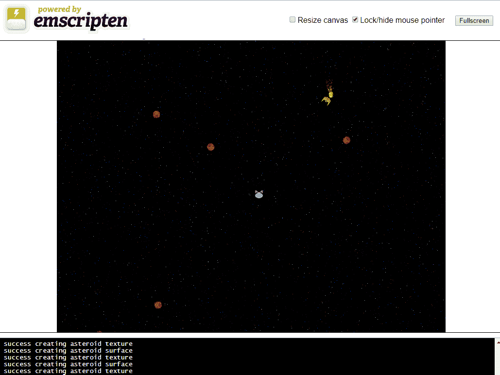

# 游戏物理学

我们的游戏中已经有一些物理学。我们的每艘飞船都有速度和加速度。它们也至少遵守了牛顿的一些定律并保持动量。所有这些早些时候都添加了，没有引起太多轰动。计算机游戏中的物理学可以追溯到最初的计算机游戏《太空战！》，这个游戏启发了我们目前正在编写的游戏。在《太空战！》的原始版本中，太空飞船保持了动量，就像我们现在在游戏中做的那样。黑洞通过引力吸引太空飞船到游戏区域的中心。在创造经典游戏《乒乓球》之前，诺兰·布什内尔创造了《太空战！》的街机克隆版，名为《计算机太空》。《计算机太空》不像《乒乓球》那样受欢迎，诺兰·布什内尔将游戏的商业失败归咎于牛顿定律和公众对基本物理学的理解不足等原因之一。

根据史蒂文·肯特的《视频游戏的终极历史：从乒乓球到宝可梦及其后》，“计算机太空遵守第一定律——动量守恒。（布什内尔可能指的是艾萨克·牛顿的第一定律——物体保持恒定速度，除非受到外力作用。）这对于不理解这一点的人来说确实很困难。”

- 诺兰·布什内尔

物理学在游戏中很常见，但远非普遍。游戏所需的物理学类型高度依赖于游戏的类型。有一个名为“Bullet Physics”的 3D 物理库，但由于它是 3D 的，Bullet 对于我们在这个游戏中将使用的物理学来说是一个相当庞大的库。因此，我们将在游戏中集成一些简单的牛顿物理学，以增加一些额外的风味。我们的游戏中已经有牛顿第一定律的简单实现。当我们加速我们的太空飞船时，它会朝着同样的方向移动，直到我们通过使用向下箭头减速它，或者通过将飞船转向并加速到当前速度的相反方向来“翻转和燃烧”。

您需要在构建中包含几个图像和音频文件，以使此项目正常工作。确保您从项目的 GitHub 中包括`/Chapter13/sprites/`文件夹以及`/Chapter13/audio/`文件夹。如果您还没有下载 GitHub 项目，可以在[`github.com/PacktPublishing/Hands-On-Game-Development-with-WebAssembly`](https://github.com/PacktPublishing/Hands-On-Game-Development-with-WebAssembly)上获取它。

在本章中，我们将应用物理学的以下方面：

+   小行星、抛射物和太空飞船之间的弹性碰撞。

+   当我们的太空飞船射击时，应该有一个反冲（牛顿第三定律）。

+   恒星的引力应该吸引玩家的太空飞船。

# 牛顿第三定律

牛顿第三定律通常陈述为，“对于每一个动作，都有一个相等和相反的反作用力”。这意味着当物体 A 对物体 B 施加力时，物体 B 会以同样的力反作用于物体 A。一个例子是从枪中发射子弹。当持枪的人发射子弹时，枪会以子弹离开枪的同样力量产生反冲。这可能听起来违反直觉，因为子弹可以杀死人，但是枪的反冲并不会杀死开枪的人。这是因为枪比子弹大得多，而牛顿第一定律规定了“F = ma”，即力等于质量乘以加速度。换句话说，如果枪比子弹大 50 倍，那么同样的力只会使其加速到 1/50 的速度。我们将修改我们的太空飞船，使其在射出抛射物时，根据太空飞船和抛射物的相对质量，以相反方向加速。这将给我们的飞船炮筒一个反冲。

# 添加重力

在我们为飞船的火炮添加后坐力之后，我还想在我们的游戏中为飞船添加一个引力效应，当它们在星球附近一定距离内时，会将飞船吸引向星球。引力随着两个物体之间距离的平方减小。这很方便，因为这意味着我们可以用`MagSQ`函数计算引力效应，这比`Magnitude`函数运行得快得多。出于个人偏好，我选择不在抛射物和小行星上添加引力效应。如果你选择这样做，添加这种效应并不难。

# 改进碰撞

我们将改进游戏中飞船与小行星和抛射物之间的碰撞。为了简化事情，我们将使用弹性碰撞。弹性碰撞是指保持所有动能的碰撞。实际上，碰撞总是会损失一些能量，转化为热量或摩擦，即使是接近弹性碰撞的碰撞，比如台球。然而，使我们的碰撞完全弹性化简化了数学。在游戏中，简单的数学通常意味着更快的算法。

有关弹性碰撞的更多信息，维基百科有一篇很好的文章([http](https://en.wikipedia.org/wiki/Elastic_collision)[s://en.wikipedia.org/wiki/Elastic_collision](https://en.wikipedia.org/wiki/Elastic_collision))，讨论了我们将用来实现弹性碰撞函数的数学。

# 修改代码

在这一部分，我们将对我们的游戏对象进行一些更改。我们需要在我们的“碰撞器”类中添加质量和弹性碰撞。我们的星星应该能够产生引力，并以与距离的平方成反比的力吸引玩家和敌人的飞船。我们需要修改我们的碰撞函数，以在我们的飞船、小行星和抛射物之间添加弹性碰撞。

# 更改 game.hpp 文件

为了将物理学引入我们的游戏，我们需要修改几个类定义并添加新的`#define`宏。让我们从更新我们的`game.hpp`文件开始。我们需要添加的第一件事是`#define`，以设置星球质量的常量值。我希望在我们的`ElasticCollision`函数中检查星球质量的大常量值。如果我们弹性碰撞中的任一对象的质量与`STAR_MASS`相同，我们不希望加速该对象。实际上，如果你把一块岩石扔进太阳，你会在你扔岩石的方向上微微加速太阳。相对于太阳来说，这个量是如此之小，以至于不可检测。我们将为星球的质量设定一个固定值，任何质量与该值相同的物体在游戏中被击中时都不会加速。为此，我们需要添加以下`#define`：

```cpp
#define STAR_MASS 9999999
```

在添加了`#define`之后，我们需要修改我们的`Collider`类，给它一个新的`ElasticCollision`函数。这个函数将接收第二个`Collider`对象，并使用这两个对象的速度和质量来确定它们的新速度。我们还需要添加一个名为`m_Mass`的质量属性。最后，我们需要将两个属性移到我们的`Collider`类中，这些属性以前在`Collider`的子类中。这些变量是 2D`m_Direction`和`m_Velocity`向量，因为我们的弹性碰撞函数将需要这些数据来计算新的速度。这是新版本的`Collider`类的样子：

```cpp
class Collider {
    public:
        bool m_Active;
        float* m_ParentRotation;
        float* m_ParentX;
        float* m_ParentY;
        Vector2D m_TempPoint;

        bool CCHitTest( Collider* collider );

 void ElasticCollision( Collider* collider );
 float m_Mass;
 Vector2D m_Direction;
 Vector2D m_Velocity;
 Vector2D m_Position;

        float m_Radius;
        float m_SteeringRadius;
        float m_SteeringRadiusSQ;
        void SetParentInformation( float* rotation, float* x, float* y );

        Collider(float radius);
        bool HitTest( Collider *collider );
        bool SteeringLineTest( Vector2D &p1, Vector2D &p2 );
        bool SteeringRectTest( Vector2D &start_point, Vector2D 
                               &end_point );
        void WrapPosition();
};
```

我们添加的四行代码位于这个新版本的类的中心附近：

```cpp
void ElasticCollision( Collider* collider );
float m_Mass;
Vector2D m_Direction;
Vector2D m_Velocity;
```

在将`m_Direction`和`m_Velocity`添加到我们的`Collider`类之后，我们需要从三个子类中删除`m_Velocity`，这些子类在我们游戏的先前版本中有这些代码。我们需要从`Asteroid`、`Ship`和`Projectile`类中删除这些属性。以下是我们需要删除的两行：

```cpp
Vector2D m_Direction;
Vector2D m_Velocity;
```

在下面的代码片段中，我们有删除了那两行后的`Asteroid`类：

```cpp
class Asteroid : public Collider {
    public:
        SDL_Texture *m_SpriteTexture;
        SDL_Rect m_src = {.x = 0, .y = 0, .w = 16, .h = 16 };
        SDL_Rect m_dest = {.x = 0, .y = 0, .w = 0, .h = 0 };

        Uint32 m_CurrentFrame = 0;
        int m_NextFrameTime;
        float m_Rotation;

        Emitter* m_Explode;
        Emitter* m_Chunks;

        Asteroid( float x, float y,
                  float velocity,
                  float rotation );

        void Move();
        void Render();
        void Explode();
};
```

在删除了那两行后，`Ship`类将会是什么样子：

```cpp
class Ship : public Collider {
    public:
        const float c_Acceleration = 10.0f;
        const float c_MaxVelocity = 100.0f;
        const int c_AliveTime = 2000;
        const Uint32 c_MinLaunchTime = 300;

        bool m_Accelerating = false;
        Uint32 m_LastLaunchTime;
        const int c_Width = 32;
        const int c_Height = 32;
        SDL_Texture *m_SpriteTexture;
        SDL_Rect src = {.x = 0, .y = 0, .w = 32, .h = 32 };

        Emitter* m_Explode;
        Emitter* m_Exhaust;
        Shield* m_Shield;
        std::vector<Collider*> m_Colliders;

        Uint32 m_CurrentFrame = 0;
        int m_NextFrameTime;
        float m_Rotation;

        void RotateLeft();
        void RotateRight();
        void Accelerate();
        void Decelerate();
        void CapVelocity();
        void Shoot();
        virtual void Move() = 0;
        Ship();
        void Render();
        bool CompoundHitTest( Collider* collider );
};
```

最后，在删除了那两行后，`Projectile`类将会是什么样子：

```cpp
class Projectile: public Collider {
    public:
        const char* c_SpriteFile = "sprites/ProjectileExp.png";
        const int c_Width = 16;
        const int c_Height = 16;
        SDL_Texture *m_SpriteTexture;
        SDL_Rect src = {.x = 0, .y = 0, .w = 16, .h = 16 };

        Uint32 m_CurrentFrame = 0;
        int m_NextFrameTime;
        const float c_Velocity = 300.0;
        const float c_AliveTime = 2000;
        float m_TTL;

        Projectile();
        void Move();
        void Render();
        void Launch(Vector2D &position, Vector2D &direction);
};
```

我们必须改变的最后一个类是我们的`Star`类。`Star`类现在将能够通过引力吸引我们游戏中的飞船。为了做到这一点，我们将添加一个常量属性，定义引力作用的最大范围。实际上，重力是无限延伸的，但是对于我们的游戏，当星星不在屏幕上（或者至少离得很远）时，我们不希望重力影响我们的飞船。因此，我们将限制引力效应的距离为 500 像素。我们还将在我们的类中添加一个名为`ShipGravity`的新函数。我们将把一个`Ship`对象传递给这个函数，该函数将根据到`Star`对象的平方距离来修改飞船的速度。这是新版本的`Star`类定义将会是什么样子的：

```cpp
class Star : public Collider {
    public:
        const float c_MaxGravityDistSQ = 250000.0; // 300 squared

        SDL_Texture *m_SpriteTexture;
        SDL_Rect m_src = {.x = 0, .y = 0, .w = 64, .h = 64 };
        SDL_Rect m_dest = {.x = 0, .y = 0, .w = 64, .h = 64 };

        std::vector<Emitter*> m_FlareList;

        Uint32 m_CurrentFrame = 0;
        int m_NextFrameTime;

        Star();

        void Move();
        void Render();

        void ShipGravity( Ship* s );
};
```

# 更改 collider.cpp

我们将要更改的下一个文件是`collider.cpp`文件，其中包含我们在`Collider`类定义中声明的函数。唯一的变化将是添加一个名为`ElasticCollision`的函数。该函数根据这些对象的质量和起始速度修改我们两个碰撞器的位置和速度。`ElasticCollision`函数看起来是这样的：

```cpp
void Collider::ElasticCollision( Collider* collider ) {
    if( collider->m_Mass == STAR_MASS || m_Mass == STAR_MASS ) {
        return;
    }

    Vector2D separation_vec = collider->m_Position - m_Position;

    separation_vec.Normalize();
    separation_vec *= collider->m_Radius + m_Radius;

    collider->m_Position = m_Position + separation_vec;

    Vector2D old_v1 = m_Velocity;
    Vector2D old_v2 = collider->m_Velocity;

    m_Velocity = old_v1 * ((m_Mass - collider->m_Mass)/(m_Mass + 
    collider->m_Mass)) +
    old_v2 * ((2 * collider->m_Mass) / (m_Mass + collider->m_Mass));

    collider->m_Velocity = old_v1 * ((2 * collider->m_Mass)/(m_Mass + 
    collider->m_Mass)) +
    old_v2 * ((collider->m_Mass - m_Mass)/(m_Mass + collider->m_Mass));
}
```

函数的第一件事是检查两个碰撞器中是否有一个的质量是星星。如果有一个是星星，我们就不改变它们的速度。星星的速度不会改变，因为它太庞大而无法移动，而与星星碰撞的对象也不会改变其质量，因为它在碰撞中被摧毁：

```cpp
if( collider->m_Mass == STAR_MASS || m_Mass == STAR_MASS ) {
    return;
}
```

在质量检查之后，我们需要调整碰撞器的位置，以使它们不重叠。重叠可能发生是因为我们的对象的位置每一帧都在变化，并不是连续的。因此，我们需要移动其中一个对象的位置，使其与另一个对象轻微接触。更准确的做法是修改两个对象的位置，每个对象修改的量是另一个对象的一半，但是方向不同。为简单起见，我们只会改变一个碰撞器的位置：

```cpp
separation_vec.Normalize();
separation_vec *= collider->m_Radius + m_Radius;

collider->m_Position = m_Position + separation_vec;
```

之后，我们将使用这两个对象的质量和起始速度来修改这两个碰撞器对象的速度：

```cpp
Vector2D old_v1 = m_Velocity;
Vector2D old_v2 = collider->m_Velocity;

m_Velocity = old_v1 * ((m_Mass - collider->m_Mass)/(m_Mass + collider->m_Mass)) +
old_v2 * ((2 * collider->m_Mass) / (m_Mass + collider->m_Mass));

collider->m_Velocity = old_v1 * ((2 * collider->m_Mass)/(m_Mass + collider->m_Mass)) +
old_v2 * ((collider->m_Mass - m_Mass)/(m_Mass + collider->m_Mass));
```

如果您想了解我们用来计算新速度的公式，可以查看维基百科关于弹性碰撞的文章[`en.wikipedia.org/wiki/Elastic_collision`](https://en.wikipedia.org/wiki/Elastic_collision)。

# 对 star.cpp 的更改

在我们的`star.cpp`文件中，我们需要修改我们的`Star`类的构造函数，以及它的`Move`函数。我们还需要添加一个名为`ShipGravity`的新函数。我们将首先在我们的`Star`类构造函数的某处添加以下行：

```cpp
m_Mass = STAR_MASS;
```

之后，我们需要定义我们的`ShipGravity`函数。以下代码定义了该函数：

```cpp
void Star::ShipGravity( Ship* s ) {
    Vector2D dist_vec = m_Position - s->m_Position;
    float dist_sq = dist_vec.MagSQ();

    if( dist_sq < c_MaxGravityDistSQ ) {
        float force = (c_MaxGravityDistSQ / dist_sq) * delta_time;
        dist_vec.Normalize();
        dist_vec *= force;
        s->m_Velocity += dist_vec;
    }
}
```

第一行创建了一个`dist_vec`向量，它是表示星星位置和飞船位置之间距离的向量。第二行得到了星星和飞船之间的平方距离。之后，我们有一个`if`块，看起来是这样的：

```cpp
if( dist_sq < c_MaxGravityDistSQ ) {
    float force = (c_MaxGravityDistSQ / dist_sq) * delta_time;
    dist_vec.Normalize();
    dist_vec *= force;
    s->m_Velocity += dist_vec;
}
```

这个`if`块正在检查与引力影响飞船的最大距离的平方距离，我们在`c_MaxGravityDistSQ`常量中定义了这个距离。因为引力随着星球和我们飞船之间的距离的平方减小，我们通过将最大引力距离除以 50 倍距离的平方来计算标量力。50 的值是相当任意选择的，是我在数字上摸索直到引力感觉合适的结果。如果您希望引力的力量不同，可以选择不同的值。您还可以通过更改我们在`game.hpp`中定义的`c_MaxGravityDistSQ`的值来修改最大引力距离。以下行用于将我们的标量力值转换为指向我们星球的矢量力值：

```cpp
dist_vec.Normalize();
dist_vec *= force;
```

现在我们已经将`dist_vec`转换为一个指向我们星球的力向量，我们可以将该力向量添加到我们飞船的速度上，以在我们的飞船上创建引力效应：

```cpp
s->m_Velocity += dist_vec;
```

我们需要做的最后一个更改是`Move`函数。我们需要添加两个对`ShipGravity`函数的调用；一个用于在玩家身上创建引力效应，另一个用于在敌方飞船上创建引力效应。以下是`Move`函数的新版本：

```cpp
void Star::Move() {
    m_NextFrameTime -= diff_time;

    if( m_NextFrameTime <= 0 ) {
        ++m_CurrentFrame;
        m_NextFrameTime = ms_per_frame;
        if( m_CurrentFrame >= 8 ) {
            m_CurrentFrame = 0;
        }
    }

 ShipGravity( player );
 ShipGravity( enemy );
}
```

最后两行是新的。确保将这两行添加到`Move`函数中：

```cpp
ShipGravity( player );
ShipGravity( enemy );
```

# 更改`main.cpp`文件

在更新我们的`star.cpp`文件之后，我们需要更改`main.cpp`文件以整合我们的弹性碰撞。我们需要对`collisions()`函数进行所有这些更改。以下是`collisions`的完整新版本：

```cpp
void collisions() {
 Asteroid* asteroid;
 std::vector<Asteroid*>::iterator ita;
    if( player->m_CurrentFrame == 0 && player->CompoundHitTest( star ) ) {
        player->m_CurrentFrame = 1;
        player->m_NextFrameTime = ms_per_frame;
        player->m_Explode->Run();
        large_explosion_snd->Play();
    }
    if( enemy->m_CurrentFrame == 0 && enemy->CompoundHitTest( star ) ) {
        enemy->m_CurrentFrame = 1;
        enemy->m_NextFrameTime = ms_per_frame;
        enemy->m_Explode->Run();
        large_explosion_snd->Play();
    }
    Projectile* projectile;
    std::vector<Projectile*>::iterator it;
    for(it=projectile_pool->m_ProjectileList.begin(); 
    it!=projectile_pool->m_ProjectileList.end();
    it++) {
        projectile = *it;
        if( projectile->m_CurrentFrame == 0 && projectile->m_Active ) {
            for( ita = asteroid_list.begin(); ita != asteroid_list.end(); 
                 ita++ 
            ) {
                asteroid = *ita;
                if( asteroid->m_Active ) {
                    if( asteroid->HitTest( projectile ) ) {
 asteroid->ElasticCollision( projectile );
                        projectile->m_CurrentFrame = 1;
                        projectile->m_NextFrameTime = ms_per_frame;
                        small_explosion_snd->Play();
                    }
                }
            }
            if( projectile->HitTest( star ) ){
                projectile->m_CurrentFrame = 1;
                projectile->m_NextFrameTime = ms_per_frame;
                small_explosion_snd->Play();
            }
            else if( player->m_CurrentFrame == 0 && ( projectile->HitTest( 
            player ) ||
                      player->CompoundHitTest( projectile ) ) ) {
                if( player->m_Shield->m_Active == false ) {
                    player->m_CurrentFrame = 1;
                    player->m_NextFrameTime = ms_per_frame;
                    player->m_Explode->Run();
                    large_explosion_snd->Play();
                }
                else {
                    hit_snd->Play();
 player->ElasticCollision( projectile );
                }
                projectile->m_CurrentFrame = 1;
                projectile->m_NextFrameTime = ms_per_frame;
            }
            else if( enemy->m_CurrentFrame == 0 && ( projectile-
            >HitTest( enemy ) || enemy->CompoundHitTest( projectile ) ) 
             ) {
                if( enemy->m_Shield->m_Active == false ) {
                    enemy->m_CurrentFrame = 1;
                    enemy->m_NextFrameTime = ms_per_frame;
                    enemy->m_Explode->Run();
                    large_explosion_snd->Play();
                }
                else {
                    enemy->ElasticCollision( projectile );
                    hit_snd->Play();
                }
                projectile->m_CurrentFrame = 1;
                projectile->m_NextFrameTime = ms_per_frame;
            }
        }
    }
    for( ita = asteroid_list.begin(); ita != asteroid_list.end(); ita++ ) {
        asteroid = *ita;
        if( asteroid->m_Active ) {
            if( asteroid->HitTest( star ) ) {
                asteroid->Explode();
                small_explosion_snd->Play();
            }
        }
        else { continue; }
        if( player->m_CurrentFrame == 0 && asteroid->m_Active &&
            ( asteroid->HitTest( player ) || player->CompoundHitTest( 
            asteroid ) ) ) {
            if( player->m_Shield->m_Active == false ) {
                player->m_CurrentFrame = 1;
                player->m_NextFrameTime = ms_per_frame;
                player->m_Explode->Run();
                large_explosion_snd->Play();
            }
            else {
 player->ElasticCollision( asteroid );
                small_explosion_snd->Play();
            }
        }
        if( enemy->m_CurrentFrame == 0 && asteroid->m_Active &&
            ( asteroid->HitTest( enemy ) || enemy->CompoundHitTest( 
            asteroid ) ) ) {
            if( enemy->m_Shield->m_Active == false ) {
                enemy->m_CurrentFrame = 1;
                enemy->m_NextFrameTime = ms_per_frame;
                enemy->m_Explode->Run();
                large_explosion_snd->Play();
            }
            else {
 enemy->ElasticCollision( asteroid );
                small_explosion_snd->Play();
            }
        }
    }
    Asteroid* asteroid_1;
    Asteroid* asteroid_2;
    std::vector<Asteroid*>::iterator ita_1;
    std::vector<Asteroid*>::iterator ita_2;
    for( ita_1 = asteroid_list.begin(); ita_1 != asteroid_list.end(); 
         ita_1++ ) {
        asteroid_1 = *ita_1;
        if( !asteroid_1->m_Active ) { continue; }
        for( ita_2 = ita_1+1; ita_2 != asteroid_list.end(); ita_2++ ) {
            asteroid_2 = *ita_2;
            if( !asteroid_2->m_Active ) { continue; }
            if( asteroid_1->HitTest( asteroid_2 ) ) {
 asteroid_1->ElasticCollision( asteroid_2 );
            }
        }
    }
}
```

在此函数的第一部分中，我们循环遍历抛射物并检查它们是否击中了小行星或飞船。如果抛射物在飞船启用护盾时击中了小行星或飞船，我们希望创建一个弹性碰撞。抛射物仍将被摧毁，但飞船或小行星的速度将根据碰撞进行修改。以下是`projectile`循环的代码：

```cpp
for( it = projectile_pool->m_ProjectileList.begin(); it != projectile_pool->m_ProjectileList.end(); it++ ) {
    projectile = *it;
    if( projectile->m_CurrentFrame == 0 && projectile->m_Active ) {
        for( ita = asteroid_list.begin(); ita != asteroid_list.end(); 
        ita++ ) {
            asteroid = *ita;
            if( asteroid->m_Active ) {
                if( asteroid->HitTest( projectile ) ) {
 asteroid->ElasticCollision( projectile );
                    projectile->m_CurrentFrame = 1;
                    projectile->m_NextFrameTime = ms_per_frame;
                    small_explosion_snd->Play();
                }
            }
        }
        if( projectile->HitTest( star ) ){
            projectile->m_CurrentFrame = 1;
            projectile->m_NextFrameTime = ms_per_frame;
            small_explosion_snd->Play();
        }
        else if( player->m_CurrentFrame == 0 &&
                ( projectile->HitTest( player ) ||
                  player->CompoundHitTest( projectile ) ) ) {
            if( player->m_Shield->m_Active == false ) {
                player->m_CurrentFrame = 1;
                player->m_NextFrameTime = ms_per_frame;

                player->m_Explode->Run();
                large_explosion_snd->Play();
            }
            else {
                hit_snd->Play();
 player->ElasticCollision( projectile );
            }
            projectile->m_CurrentFrame = 1;
            projectile->m_NextFrameTime = ms_per_frame;
        }
        else if( enemy->m_CurrentFrame == 0 &&
                ( projectile->HitTest( enemy ) ||
                  enemy->CompoundHitTest( projectile ) ) ) {
            if( enemy->m_Shield->m_Active == false ) {
                enemy->m_CurrentFrame = 1;
                enemy->m_NextFrameTime = ms_per_frame;
                enemy->m_Explode->Run();
                large_explosion_snd->Play();
            }
            else {
 enemy->ElasticCollision( projectile );
                hit_snd->Play();
            }
            projectile->m_CurrentFrame = 1;
            projectile->m_NextFrameTime = ms_per_frame;
        }
    }
}
```

此循环执行的第一系列检查是针对每颗小行星。它寻找当前正在碰撞的活动小行星。如果这些条件为真，它首先调用`ElasticCollision`函数，传入抛射物：

```cpp
for( ita = asteroid_list.begin(); ita != asteroid_list.end(); ita++ ) {
    asteroid = *ita;
    if( asteroid->m_Active ) {
        if( asteroid->HitTest( projectile ) ) {
 asteroid->ElasticCollision( projectile );
            projectile->m_CurrentFrame = 1;
            projectile->m_NextFrameTime = ms_per_frame;
            small_explosion_snd->Play();
        }
    }
```

这段代码与早期版本相同，但增加了对`ElasticCollision`的调用：

```cpp
asteroid->ElasticCollision( projectile );
```

在我们循环遍历每个活动抛射物时，如果抛射物击中玩家飞船的护盾已经启用，我们将添加一个对`ElasticCollision`函数的调用：

```cpp
else if( player->m_CurrentFrame == 0 &&
        ( projectile->HitTest( player ) ||
          player->CompoundHitTest( projectile ) ) ) {
    if( player->m_Shield->m_Active == false ) {
        player->m_CurrentFrame = 1;
        player->m_NextFrameTime = ms_per_frame;
        player->m_Explode->Run();
        large_explosion_snd->Play();
    }
    else {
        hit_snd->Play();
 player->ElasticCollision( projectile );
    }
    projectile->m_CurrentFrame = 1;
    projectile->m_NextFrameTime = ms_per_frame;
}
```

当敌方飞船在护盾启用时被抛射物击中时，我们也会做同样的处理：

```cpp
    else if( enemy->m_CurrentFrame == 0 &&
            ( projectile->HitTest( enemy ) ||
              enemy->CompoundHitTest( projectile ) ) ) {
        if( enemy->m_Shield->m_Active == false ) {
            enemy->m_CurrentFrame = 1;
            enemy->m_NextFrameTime = ms_per_frame;
            enemy->m_Explode->Run();
            large_explosion_snd->Play();
        }
        else {
 enemy->ElasticCollision( projectile );
            hit_snd->Play();
        }
        projectile->m_CurrentFrame = 1;
        projectile->m_NextFrameTime = ms_per_frame;
    }
}
```

在循环遍历所有活动抛射物之后，`collisions`函数会循环遍历所有小行星，寻找小行星与飞船之间的碰撞。如果飞船没有启用护盾，飞船将被摧毁。我们不对代码的这部分进行任何修改。在我们的代码的早期版本中，如果飞船启用了护盾，我们会摧毁小行星。现在，我们将进行弹性碰撞，这将导致飞船和小行星相互弹开。这就是这个`asteroid`循环的样子：

```cpp
for( ita = asteroid_list.begin(); ita != asteroid_list.end(); ita++ ) {
    asteroid = *ita;
    if( asteroid->m_Active ) {
        if( asteroid->HitTest( star ) ) {
            asteroid->Explode();
            small_explosion_snd->Play();
        }
    }
    else {
        continue;
    }

    if( player->m_CurrentFrame == 0 &&
        asteroid->m_Active &&
        ( asteroid->HitTest( player ) ||
          player->CompoundHitTest( asteroid ) ) ) {
        if( player->m_Shield->m_Active == false ) {
            player->m_CurrentFrame = 1;
            player->m_NextFrameTime = ms_per_frame;

            player->m_Explode->Run();
            large_explosion_snd->Play();
        }
        else {
 player->ElasticCollision( asteroid );
            small_explosion_snd->Play();
        }
    }
    if( enemy->m_CurrentFrame == 0 &&
        asteroid->m_Active &&
        ( asteroid->HitTest( enemy ) ||
          enemy->CompoundHitTest( asteroid ) ) ) {
        if( enemy->m_Shield->m_Active == false ) {
            enemy->m_CurrentFrame = 1;
            enemy->m_NextFrameTime = ms_per_frame;

            enemy->m_Explode->Run();
            large_explosion_snd->Play();
        }
        else {
            enemy->ElasticCollision( asteroid );
            small_explosion_snd->Play();
        }
    }
}
```

现在有两个对`ElasticCollision`的调用。一个是当玩家飞船与小行星碰撞且玩家飞船的护盾已经启用时。另一个是当敌方飞船与小行星碰撞且敌方飞船的护盾已经启用时。

我们必须对我们的`collisions()`函数进行的最后一个修改是添加一个新的双重`asteroid`循环，它将循环遍历我们所有的小行星，寻找它们之间的碰撞。这会产生一个有趣的效果，小行星会像台球一样弹开。如果检测到两个小行星之间的碰撞，我们调用`ElasticCollision`：

```cpp
Asteroid* asteroid_1;
Asteroid* asteroid_2;

std::vector<Asteroid*>::iterator ita_1;
std::vector<Asteroid*>::iterator ita_2;

for( ita_1 = asteroid_list.begin(); ita_1 != asteroid_list.end(); ita_1++ ) {
    asteroid_1 = *ita_1;
    if( !asteroid_1->m_Active ) {
        continue;
    }

    for( ita_2 = ita_1+1; ita_2 != asteroid_list.end(); ita_2++ ) {
        asteroid_2 = *ita_2;
        if( !asteroid_2->m_Active ) {
            continue;
        }

        if( asteroid_1->HitTest( asteroid_2 ) ) {
 asteroid_1->ElasticCollision( asteroid_2 );
        }
    }
}
```

# 对 asteroid.cpp 和 projectile.cpp 的更改

我们需要对`asteroid.cpp`和`projectile.cpp`进行小的修改。我们为`Collider`类添加了一个名为`m_Mass`的新属性，因此所有从`Collider`派生的类都继承了这个属性。`m_Mass`属性被我们的`ElasticCollision`函数使用，以确定这些物体在弹性碰撞后将如何移动。飞船的质量与抛射物的质量之间的比率将用于计算飞船射击抛射物时发生的后坐力的大小。第一个修改是对`Projectile`类构造函数的修改。以下是该构造函数的新版本：

```cpp
Projectile::Projectile(): Collider(4.0) {
    m_Active = false;

    SDL_Surface *temp_surface = IMG_Load( c_SpriteFile );

    if( !temp_surface ) {
        printf("failed to load image: %s\n", IMG_GetError() );
        return;
    }

    m_SpriteTexture = SDL_CreateTextureFromSurface( renderer, temp_surface 
    );

    if( !m_SpriteTexture ) {
        printf("failed to create texture: %s\n", IMG_GetError() );
        return;
    }

    SDL_FreeSurface( temp_surface );

 m_Mass = 1.0;
}
```

唯一的修改是最后一行，我们将`m_Mass`设置为`1.0`：

```cpp
m_Mass = 1.0;
```

需要修改的下一个构造函数位于`asteroid.cpp`文件中。我们需要修改`Asteroid`类的构造函数。以下是`Asteroid`构造函数的新版本：

```cpp
Asteroid::Asteroid( float x, float y, float velocity, float rotation ): Collider(8.0) {
    SDL_Surface *temp_surface = IMG_Load( ADSTEROID_SPRITE_FILE );
    if( !temp_surface ) {
        printf("failed to load image: %s\n", IMG_GetError() );
        return;
    }
    else { printf("success creating asteroid surface\n"); }
    m_SpriteTexture = SDL_CreateTextureFromSurface( renderer, temp_surface 
    );
    if( !m_SpriteTexture ) {
        printf("failed to create texture: %s\n", IMG_GetError() );
        return;
    }
    else { printf("success creating asteroid texture\n"); }
    SDL_FreeSurface( temp_surface );
    m_Explode = new Emitter((char*)"/sprites/Explode.png", 100, 0, 360, 
    1000, 0.3, false, 20.0, 40.0, 10, 0, 0, 5, 1.0, 2.0, 1.0, 2.0,
    0xffffff, 0xffffff, 0.01, 10, false, false, 800, 8 ); 
    m_Explode->m_parent_rotation_ptr = &m_Rotation;
    m_Explode->m_parent_x_ptr = &(m_Position.x);
    m_Explode->m_parent_y_ptr = &(m_Position.y);
    m_Explode->m_Active = false;
    m_Chunks = new Emitter((char*)"/sprites/small-asteroid.png",40,0,360, 
    1000, 0.05, false, 80.0, 150.0, 5,0,0,10,2.0,2.0,0.25, 0.5, 0xffffff, 
    0xffffff, 0.1, 10, false, true, 1000, 8 ); 
    m_Chunks->m_parent_rotation_ptr = &m_Rotation;
    m_Chunks->m_parent_x_ptr = &m_Position.x;
    m_Chunks->m_parent_y_ptr = &m_Position.y;
    m_Chunks->m_Active = false;
    m_Position.x = x;
    m_Position.y = y;
    Vector2D direction;
    direction.x = 1;
    direction.Rotate( rotation );
    m_Direction = direction;
    m_Velocity = m_Direction * velocity;
    m_dest.h = m_src.h = m_dest.w = m_src.w = 16;
    m_Rotation = rotation;
    m_Active = true;
    m_CurrentFrame = 0;
    m_NextFrameTime = ms_per_frame;

    m_Mass = 100.0;
}
```

再次，我们要添加的唯一一行是最后一行，我们将`m_Mass`设置为`100.0`：

```cpp
m_Mass = 100.0;
```

# 对 ship.cpp 文件的更改

对`ship.cpp`文件的第一个更改将是对`Ship`构造函数的更改。这是一个简单的更改，我们需要在构造函数的最后进行设置飞船的质量为`50.0`。以下是`Ship`类构造函数的新版本：

```cpp
Ship::Ship() : Collider(8.0) {
    m_Rotation = PI;

    m_LastLaunchTime = current_time;

    m_Accelerating = false;

    m_Exhaust = new Emitter((char*)"/sprites/ProjectileExpOrange.png", 200,
                             -10, 10,
                             400, 1.0, true,
                             0.1, 0.1,
                             30, 0, 12, 0.5,
                             0.5, 1.0,
                             0.5, 1.0,
                             0xffffff, 0xffffff,
                             0.7, 10,
                             true, true,
                             1000, 6 );

    m_Exhaust->m_parent_rotation_ptr = &m_Rotation;
    m_Exhaust->m_parent_x_ptr = &(m_Position.x);
    m_Exhaust->m_parent_y_ptr = &(m_Position.y);
    m_Exhaust->m_x_adjustment = 10;
    m_Exhaust->m_y_adjustment = 10;
    m_Exhaust->m_Active = false;

    m_Explode = new Emitter((char*)"/sprites/Explode.png", 100,
                             0, 360,
                             1000, 0.3, false,
                             20.0, 40.0,
                             10, 0, 0, 5,
                             1.0, 2.0,
                             1.0, 2.0,
                             0xffffff, 0xffffff,
                             0.0, 10,
                             false, false,
                             800, 8 );

    m_Explode->m_parent_rotation_ptr = &m_Rotation;
    m_Explode->m_parent_x_ptr = &(m_Position.x);
    m_Explode->m_parent_y_ptr = &(m_Position.y);
    m_Explode->m_Active = false;

    m_Direction.y = 1.0;

    m_Active = true;
 m_Mass = 50.0;
}
```

唯一更改的是最后一行：

```cpp
m_Mass = 50.0;
```

我们还需要改变`Shoot`函数以添加后坐力。将添加几行代码来修改飞船的速度，通过添加一个与飞船面对的方向相反的向量，并且其大小基于发射的抛射物的速度和相对质量。以下是新的`Shoot`函数：

```cpp
void Ship::Shoot() {
    Projectile* projectile;
    if( current_time - m_LastLaunchTime >= c_MinLaunchTime ) {
        m_LastLaunchTime = current_time;
        projectile = projectile_pool->GetFreeProjectile();
        if( projectile != NULL ) {
            projectile->Launch( m_Position, m_Direction );
            player_laser_snd->Play();
            m_Velocity -= m_Direction * (projectile->c_Velocity * projectile->m_Mass / 
                                                                              m_Mass);
            CapVelocity();
        }
    }
}
```

这是我们要添加到函数中的两行代码：

```cpp
m_Velocity -= m_Direction * (projectile->c_Velocity * projectile->m_Mass / m_Mass);
CapVelocity();
```

# 编译 physics.html 文件

现在我们已经添加了物理效果，是时候编译我们的代码了。我们可以使用以下`em++`命令构建`physics.html`文件：

```cpp
em++ asteroid.cpp audio.cpp camera.cpp collider.cpp emitter.cpp enemy_ship.cpp finite_state_machine.cpp locator.cpp main.cpp particle.cpp player_ship.cpp projectile_pool.cpp projectile.cpp range.cpp render_manager.cpp shield.cpp ship.cpp star.cpp vector.cpp -o physics.html --preload-file audio --preload-file sprites -std=c++17 -s USE_WEBGL2=1 -s USE_SDL=2 -s USE_SDL_IMAGE=2 -s SDL2_IMAGE_FORMATS=["png"] -s USE_SDL_IMAGE=2 -s SDL2_IMAGE_FORMATS=["png"] 
```

以下的屏幕截图可能看起来与早期版本相似，但当你发射抛射物时，飞船将向后加速。如果你的护盾打开时与小行星碰撞，你将像台球一样弹开。离太阳太近，引力将开始吸引你的飞船：



图 13.1：physics.html 截图

# 总结

在本章中，我们讨论了计算机游戏中物理学的历史，以及这一历史可以追溯到第一个计算机游戏*SpaceWar!*。我们谈到了我们游戏中已经有的物理学，其中包括动量守恒。我们简要讨论了牛顿第三定律及其在游戏中的应用，然后通过使用第三定律在我们的游戏中添加了更多的牛顿物理学。我们为我们的星球添加了一个引力场，并使其以与两个物体之间距离的平方成反比的力吸引我们游戏中的飞船。最后，我们为我们的飞船、抛射物和小行星添加了弹性碰撞。

在下一章中，我们将为我们的游戏添加**用户界面**（**UI**）。我们还将把游戏分成多个屏幕，并添加鼠标界面。
