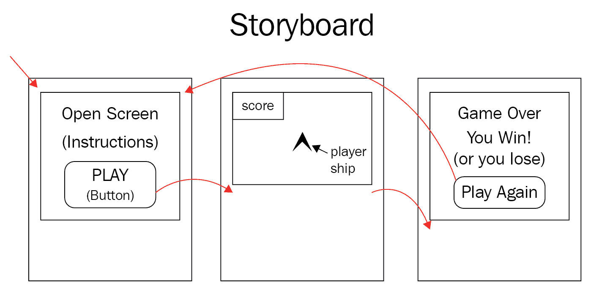
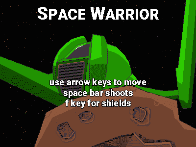
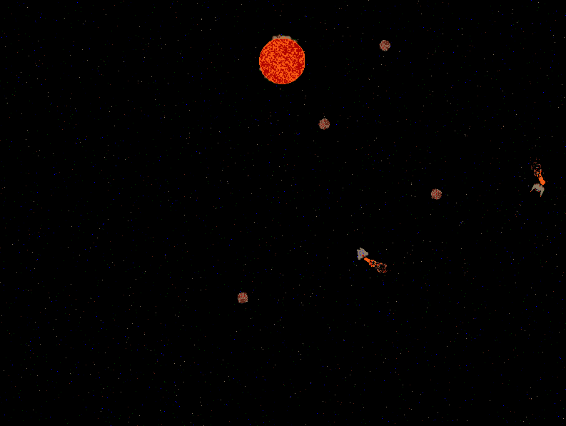
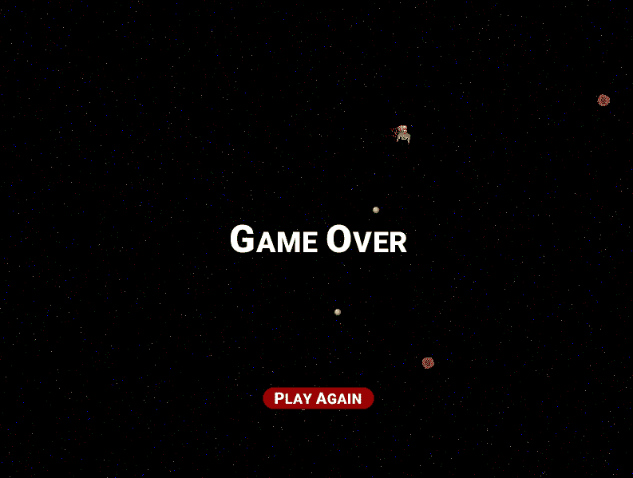
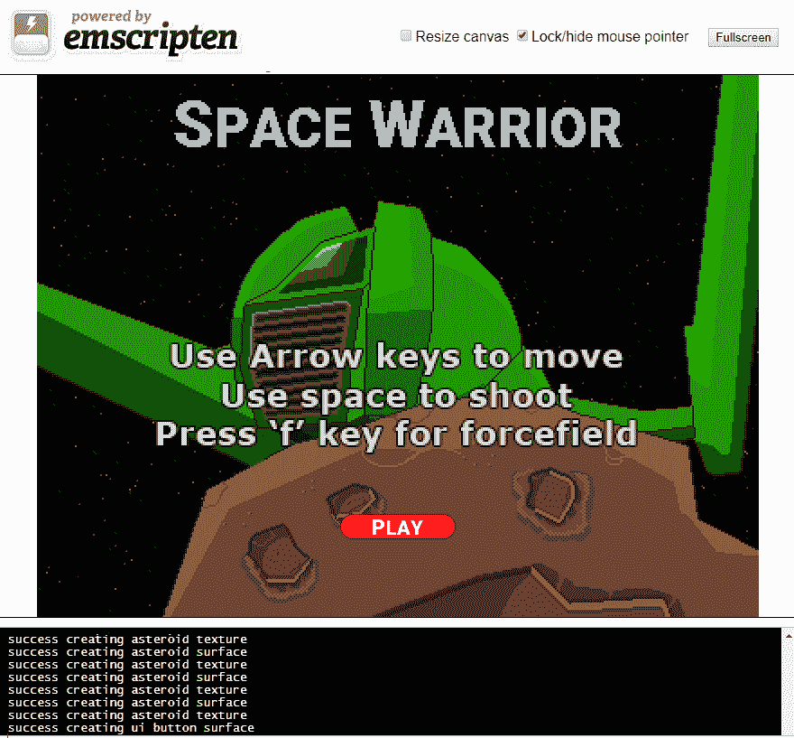

# 第十四章：UI 和鼠标输入

**用户界面**（**UI**）定义了计算机程序与用户之间的交互。在我们的游戏中，到目前为止，我们的交互仅限于控制玩家飞船的键盘界面。当我们编写粒子系统配置应用程序时，我们使用 HTML 来定义更强大的用户界面，这使我们能够输入值来配置我们的粒子系统。从该用户界面，我们的代码必须间接地与 WebAssembly 代码进行交互。这是一种您可以继续在游戏中使用的技术，如果您想利用 HTML 来定义您的用户界面，但它有一些缺点。首先，我们可能希望用户界面元素覆盖我们游戏内容。通过 DOM 进行此类效果的效率不是很高。如果 UI 元素在游戏引擎内部呈现，游戏内的 UI 和对象之间的交互也更容易。此外，您可能正在开发 C/C++代码以用于平台以及 Web 发布。如果是这种情况，您可能不希望 HTML 在用户界面中扮演太大的角色。

在本章中，我们将在游戏中实现一些 UI 功能。我们需要实现一个`Button`类，这是最简单和最常见的 UI 元素之一。我们还需要实现一个单独的屏幕和游戏状态，以便我们可以有一个开始和结束游戏画面。

您需要在构建中包含几个图像和音频文件，以使此项目正常工作。确保您从此项目的 GitHub 存储库中包含`/Chapter14/sprites/`和`/Chapter14/audio/`文件夹。如果您还没有下载 GitHub 项目，可以在这里在线获取：[`github.com/PacktPublishing/Hands-On-Game-Development`](https://github.com/PacktPublishing/Hands-On-Game-Development-with-WebAssembly)。

在本章中，我们将涵盖以下主题：

+   UI 需求

+   获取鼠标输入

+   创建一个按钮

+   开始游戏画面

+   游戏结束画面

# UI 需求

在实现 UI 时，我们需要做的第一件事是确定一些需求。我们的用户界面到底需要什么？其中的第一部分是决定我们游戏需要哪些游戏画面。这通常是游戏设计过程中早期就要做的事情，但因为我正在写一本关于 WebAssembly 的书，所以我把这一步留到了后面的章节。决定游戏需要哪些画面通常涉及故事板和一个过程，通过这个过程，您可以通过讨论（如果有多人在游戏上工作）或者思考用户将如何与您的网页以及网页上的游戏进行交互的方式来决定：



图 14.1：我们用户界面的故事板示例

您不必绘制故事板，但我发现在思考游戏 UI 所需的内容时很有用。当您需要将这些信息传达给另一名团队成员或艺术家时，它甚至更有用。在思考我们在这个游戏中需要什么之前的故事板时，我列出了以下需求清单：

+   开场画面

+   说明

+   播放按钮

+   游戏游玩画面

+   得分文本

+   游戏结束画面

+   你赢了的消息

+   你输了的消息

+   再玩一次按钮

# 开场画面

我们的游戏需要一个开场画面，原因有几个。首先，我们不希望用户加载网页后立即开始游戏。用户加载网页并不立即开始玩游戏有很多原因。如果他们的连接速度慢，他们可能在游戏加载时离开电脑，可能不会注意到游戏加载完成的那一刻。如果他们通过点击链接来到这个页面，他们可能还没有准备好在游戏加载完成后立即开始玩。在将玩家投入游戏之前，让玩家确认他们已经准备好是一个很好的做法。开场画面还应包括一些基本游戏玩法的说明。街机游戏在街机柜上放置简单的说明，告诉玩家他们必须做什么才能玩游戏。众所周知，游戏 Pong 在柜子上印有说明*避免错过球以获得高分*。不幸的是，我们没有街机柜来打印我们的说明，所以使用开场游戏画面是下一个最好的选择。我们还需要一个按钮，让用户在点击时开始玩游戏，如下所示：



图 14.2：开场画面图像

# 游戏画面

游戏画面是我们一直拥有的画面。这是玩家在其中移动他们的太空飞船，试图摧毁敌人飞船的画面。我们可能不需要改变这个画面的工作方式，但我们需要根据游戏状态添加到这个画面的过渡。游戏需要在玩家点击按钮时从开场画面过渡到我们的游戏画面。如果任何一艘飞船被摧毁，玩家还需要从这个画面过渡到游戏结束画面。如下所示：



图 14.3：原始画面现在是游戏画面

# 游戏结束画面

如果其中一艘飞船被摧毁，游戏就结束了。如果玩家的飞船被摧毁，那么玩家就输了游戏。如果敌人的飞船被摧毁，那么玩家就赢了游戏。*游戏结束画面*告诉我们游戏结束了，并告诉我们玩家是赢了还是输了。它还需要提供一个按钮，让我们的玩家如果愿意的话可以再次玩游戏。游戏结束画面如下所示：



图 14.4：游戏结束画面

# 鼠标输入

在我们实现按钮之前，我们需要学习如何在 SDL 中使用鼠标输入。我们用来获取键盘输入的代码在我们的`main.cpp`文件中。在`input`函数内，您会找到对`SDL_PollEvent`的调用，然后是几个不同的 switch 语句。第一个 switch 语句检查`event.type`是否为`SDL_KEYDOWN`。第二个 switch 检查`event.key.keysym.sym`来查看我们按下了哪个键：

```cpp
if( SDL_PollEvent( &event ) ){
    switch( event.type ){
        case SDL_KEYDOWN:
            switch( event.key.keysym.sym ){
                case SDLK_LEFT:
                    left_key_down = true;
                    break;
                case SDLK_RIGHT:
                    right_key_down = true;
                    break;
                case SDLK_UP:
                    up_key_down = true;
                    break;
                case SDLK_DOWN:
                    down_key_down = true;
                    break;
                case SDLK_f:
                    f_key_down = true;
                    break;
                case SDLK_SPACE:
                    space_key_down = true;
                    break;
                default:
                    break;
            }
            break;
```

当我们寻找鼠标输入时，我们需要使用相同的`SDL_PollEvent`函数来检索我们的鼠标事件。我们关心的三个鼠标事件是`SDL_MOUSEMOTION`，`SDL_MOUSEBUTTONDOWN`和`SDL_MOUSEBUTTONUP`。一旦我们知道我们正在处理的鼠标事件的类型，我们就可以使用`SDL_GetMouseState`来找到鼠标事件发生时的`x`和`y`坐标：

```cpp
if(SDL_PollEvent( &event ) )
{
    switch (event.type)
    {
        case SDL_MOUSEMOTION:
        {
            int x_val = 0;
            int y_val = 0;
            SDL_GetMouseState( &x_val, &y_val );
            printf(”mouse move x=%d y=%d\n”, x_val, y_val);
        }
        case SDL_MOUSEBUTTONDOWN:
        {
            switch (event.button.button)
            {
                case SDL_BUTTON_LEFT:
                {
                    int x_val = 0;
                    int y_val = 0;
                    SDL_GetMouseState( &x_val, &y_val );
                    printf(”mouse down x=%d y=%d\n”, x_val, y_val);
                    break;
                }
                default:
                {
                    break;
                }
            }
            break;
        }
        case SDL_MOUSEBUTTONUP:
        {
            switch (event.button.button)
            {
                case SDL_BUTTON_LEFT:
                {
                    int x_val = 0;
                    int y_val = 0;
                    SDL_GetMouseState( &x_val, &y_val );
                    printf(”mouse up x=%d y=%d\n”, x_val, y_val);
                    break;
                }
                default:
                {
                    break;
                }
            }
            break;
        }
```

现在我们可以接收鼠标输入，让我们创建一个简单的用户界面按钮。

# 创建一个按钮

现在我们知道如何在 WebAssembly 中使用 SDL 捕获鼠标输入，我们可以利用这些知识创建一个可以被鼠标点击的按钮。我们需要做的第一件事是在`game.hpp`文件中创建一个`UIButton`类定义。我们的按钮将有多个与之关联的精灵纹理。按钮通常有悬停状态和点击状态，因此如果用户将鼠标悬停在按钮上或点击按钮，我们将希望显示我们精灵的另一个版本：


图 14.5：按钮状态

为了捕获这些事件，我们将需要函数来检测鼠标是否点击了我们的按钮或悬停在其上。以下是我们类定义的样子：

```cpp
class UIButton {
    public:
        bool m_Hover;
        bool m_Click;
        bool m_Active;
        void (*m_Callback)();

        SDL_Rect m_dest = {.x = 0, .y = 0, .w = 128, .h = 32 };
        SDL_Texture *m_SpriteTexture;
        SDL_Texture *m_ClickTexture;
        SDL_Texture *m_HoverTexture;

        UIButton( int x, int y,
        char* file_name, char* hover_file_name, char* click_file_name,
        void (*callback)() );

        void MouseClick(int x, int y);
        void MouseUp(int x, int y);
        void MouseMove( int x, int y );
        void KeyDown( SDL_Keycode key );
        void RenderUI();
};
```

前三个属性是按钮状态属性，告诉我们的渲染函数要绘制什么精灵，或者如果按钮处于非活动状态，则不要绘制任何内容。如果`m_Hover`属性为`true`，则会导致我们的渲染器绘制`m_HoverTexture`。如果`m_Click`属性为`true`，则会导致我们的渲染器绘制`m_ClickTexture`。最后，如果将`m_Active`设置为`false`，则会导致我们的渲染器不绘制任何内容。

以下一行是指向我们回调函数的函数指针：

```cpp
void (*m_Callback)();
```

这个函数指针在我们的构造函数中设置，是我们在有人点击按钮时调用的函数。在函数指针之后，我们有我们的目标矩形，它将在构造函数运行后具有按钮图像文件的位置、宽度和高度：

```cpp
SDL_Rect m_dest = {.x = 0, .y = 0, .w = 128, .h = 32 };
```

然后，我们有三个纹理。这些纹理用于根据我们之前讨论的状态标志在渲染时绘制图像：

```cpp
SDL_Texture *m_SpriteTexture;
SDL_Texture *m_ClickTexture;
SDL_Texture *m_HoverTexture;
```

接下来，我们有构造函数。此函数获取我们按钮的`x`和`y`屏幕坐标。之后，有三个字符串，它们是我们将用来加载纹理的三个 PNG 文件的位置。最后一个参数是回调函数的指针：

```cpp
UIButton( int x, int y,
         char* file_name, char* hover_file_name, char* click_file_name,
         void (*callback)() );
```

然后，根据鼠标的当前状态，我们将需要在调用`SDL_PollEvent`之后调用三个函数：

```cpp
void MouseClick(int x, int y);
void MouseUp(int x, int y);
void MouseMove( int x, int y );
```

`KeyDown`函数将在按下键时获取键码，如果键码与我们的热键匹配，我们希望将其用作使用鼠标点击按钮的替代方法：

```cpp
void KeyDown( SDL_Keycode key );
```

`RenderUI`函数类似于我们为其他对象创建的`Render`函数。`RenderUI`和`Render`之间的区别在于，当将精灵渲染到屏幕时，`Render`函数将考虑摄像机位置。`RenderUI`函数将始终在画布空间中进行渲染：

```cpp
void RenderUI();
```

在下一节中，我们将创建用户界面状态信息以跟踪当前屏幕。

# 屏幕状态

在我们开始向游戏添加新屏幕之前，我们需要创建一些屏幕状态。我们将在`main.cpp`文件中管理这些状态的大部分内容。不同的屏幕状态将需要不同的输入，将运行不同的逻辑和不同的渲染函数。我们将在我们代码的最高级别管理所有这些，作为我们游戏循环调用的函数。我们将在`game.hpp`文件中作为枚举定义可能的状态列表：

```cpp
enum SCREEN_STATE {
    START_SCREEN = 0,
    PLAY_SCREEN = 1,
    PLAY_TRANSITION = 2,
    GAME_OVER_SCREEN = 3,
    YOU_WIN_SCREEN = 4
};
```

您可能会注意到，即使只有三个不同的屏幕，我们总共有五种不同的屏幕状态。`START_SCREEN`和`PLAY_SCREEN`分别是开始屏幕和播放屏幕。`PLAY_TRANSITION`状态通过淡入游戏来在`START_SCREEN`和`PLAY_SCREEN`之间过渡屏幕，而不是突然切换到播放。我们将为游戏结束屏幕使用两种不同的状态。这些状态是`GAME_OVER_SCREEN`和`YOU_WIN_SCREEN`。这两种状态之间唯一的区别是游戏结束时显示的消息。

# 对 games.hpp 的更改

我们将需要对我们的`game.hpp`文件进行一些额外的更改。除了我们的`UIButton`类，我们还需要添加一个`UISprite`类定义文件。`UISprite`只是一个普通的在画布空间中绘制的图像。它除了作为 UI 元素呈现的精灵之外，不具有任何功能。定义如下：

```cpp
class UISprite {
    public:
        bool m_Active;
        SDL_Texture *m_SpriteTexture;
        SDL_Rect m_dest = {.x = 0, .y = 0, .w = 128, .h = 32 };
        UISprite( int x, int y, char* file_name );
        void RenderUI();
};
```

与按钮类似，它具有一个由`m_Active`属性表示的活动状态。如果此值为 false，则精灵将不会渲染。它还具有精灵纹理和目标属性，告诉渲染器要绘制什么以及在哪里绘制它：

```cpp
SDL_Texture *m_SpriteTexture;
SDL_Rect m_dest = {.x = 0, .y = 0, .w = 128, .h = 32 };
```

它有一个简单的构造函数，接受我们将在画布上呈现精灵的`x`和`y`坐标，以及虚拟文件系统中图像的文件名，我们将从中加载精灵：

```cpp
UISprite( int x, int y, char* file_name );
```

最后，它有一个名为`RenderUI`的渲染函数，将精灵呈现到画布上：

```cpp
void RenderUI();
```

# 修改 RenderManager 类

`RenderManager`类将需要一个新属性和一个新函数。在我们游戏的先前版本中，我们可以呈现一种类型的背景，那就是我们的滚动星空。当我们呈现我们的开始屏幕时，我想使用一个包含一些游戏玩法说明的新自定义背景。

这是`RenderManager`类定义的新版本：

```cpp
class RenderManager {
    public:
        const int c_BackgroundWidth = 800;
        const int c_BackgroundHeight = 600;
        SDL_Texture *m_BackgroundTexture;
        SDL_Rect m_BackgroundDest = {.x = 0, .y = 0, .w = 
        c_BackgroundWidth, .h = c_BackgroundHeight };
        SDL_Texture *m_StartBackgroundTexture;

        RenderManager();
        void RenderBackground();
        void RenderStartBackground(int alpha = 255);
        void Render( SDL_Texture *tex, SDL_Rect *src, SDL_Rect *dest, 
        float rad_rotation = 0.0,
                     int alpha = 255, int red = 255, int green = 255, 
                     int blue = 255 );
        void RenderUI( SDL_Texture *tex, SDL_Rect *src, SDL_Rect *dest, 
        float rad_rotation = 0.0,
                       int alpha = 255, int red = 255, int green = 255, 
                       int blue = 255 );
};
```

我们添加了一个新的`SDL_Texture`，我们将使用它在开始屏幕上呈现背景图像：

```cpp
SDL_Texture *m_StartBackgroundTexture;
```

除了新属性之外，我们还添加了一个新函数，在开始屏幕激活时呈现该图像：

```cpp
void RenderStartBackground(int alpha = 255);
```

传入此函数的 alpha 值将用于在`PLAY_TRANSITION`屏幕状态期间淡出开始屏幕。该过渡状态将在玩家点击“播放”按钮时开始，并持续约一秒钟。

# 新的外部变量

我们需要添加三个新的`extern`变量定义，这些变量将引用我们在`main.cpp`文件中声明的变量。其中两个变量是指向`UISprite`对象的指针，其中一个变量是指向`UIButton`的指针。以下是三个`extern`定义：

```cpp
extern UISprite *you_win_sprite;
extern UISprite *game_over_sprite;
extern UIButton* play_btn;
```

我们在游戏结束屏幕上使用这两个`UISprite`指针。第一个`you_win_sprite`是玩家赢得游戏时将显示的精灵。第二个精灵`game_over_sprite`是玩家失败时将显示的精灵。最后一个变量`play_btn`是在开始屏幕上显示的播放按钮。

# 对 main.cpp 的更改

我们从游戏循环内管理新的屏幕状态。因此，我们将在`main.cpp`文件中进行大部分更改。我们需要将`input`函数分解为三个新函数，分别用于我们的游戏屏幕中的每一个。我们需要将我们的`render`函数分解为`start_render`和`play_render`函数。我们不需要`end_render`函数，因为在显示结束屏幕时，我们将继续使用`play_render`函数。

我们还需要一个函数来显示开始屏幕和游戏屏幕之间的过渡。在游戏循环内，我们需要添加逻辑以根据当前屏幕执行不同的循环逻辑。

# 添加全局变量

我们需要对`main.cpp`文件进行的第一个更改是添加新的全局变量。我们将需要新的全局变量来表示我们的用户界面精灵和按钮。我们将需要一个新的全局变量来表示当前屏幕状态，状态之间的过渡时间，以及告诉我们玩家是否赢得了游戏的标志。以下是我们在`main.cpp`文件中需要的新全局变量：

```cpp
UIButton* play_btn;
UIButton* play_again_btn;
UISprite *you_win_sprite;
UISprite *game_over_sprite;
SCREEN_STATE current_screen = START_SCREEN;
int transition_time = 0;
bool you_win = false;
```

前两个变量是`UIButton`对象指针。第一个是`play_btn`，这是用户将点击以开始玩游戏的开始屏幕按钮。第二个是`play_again_btn`，这是玩家可以点击以重新开始游戏的游戏结束屏幕上的按钮。在 UIButtons 之后，我们有两个`UISprite`对象：

```cpp
UISprite *you_win_sprite;
UISprite *game_over_sprite;
```

这些是显示在游戏结束屏幕上的精灵。显示哪个精灵取决于玩家是否摧毁了敌舰还是相反。在这些精灵之后，我们有一个`SCREEN_STATE`变量，用于跟踪当前屏幕状态：

```cpp
SCREEN_STATE current_screen = START_SCREEN;
```

`transition_time`变量用于跟踪开始屏幕和游戏屏幕之间过渡状态中剩余的时间量。`you_win`标志在游戏结束时设置，并用于跟踪谁赢得了游戏。

# 输入函数

我们游戏的先前版本有一个单一的`input`函数，它使用`SDL_PollEvent`来轮询按键。在这个版本中，我们希望为三个屏幕状态中的每一个都有一个输入函数。我们应该做的第一件事是将原始的`input`函数重命名为`play_input`。这将不再是一个通用的输入函数，它只会执行游戏屏幕的输入功能。现在我们已经重命名了原始的输入函数，让我们定义开始屏幕的输入函数并称之为`start_input`：

```cpp
void start_input() {
    if(SDL_PollEvent( &event ) )
    {
        switch (event.type)
        {
            case SDL_MOUSEMOTION:
            {
                int x_val = 0;
                int y_val = 0;
                SDL_GetMouseState( &x_val, &y_val );
                play_btn->MouseMove(x_val, y_val);
            }
            case SDL_MOUSEBUTTONDOWN:
            {
                switch (event.button.button)
                {
                    case SDL_BUTTON_LEFT:
                    {
                        int x_val = 0;
                        int y_val = 0;
                        SDL_GetMouseState( &x_val, &y_val );
                        play_btn->MouseClick(x_val, y_val);
                        break;
                    }
                    default:
                    {
                        break;
                    }
                }
                break;
            }
            case SDL_MOUSEBUTTONUP:
            {
                switch (event.button.button)
                {
                    case SDL_BUTTON_LEFT:
                    {
                        int x_val = 0;
                        int y_val = 0;
                        SDL_GetMouseState( &x_val, &y_val );
                        play_btn->MouseUp(x_val, y_val);
                        break;
                    }
                    default:
                    {
                        break;
                    }
                }
                break;
            }
            case SDL_KEYDOWN:
            {
                play_btn->KeyDown( event.key.keysym.sym );
            }
        }
    }
}
```

与我们的`play_input`函数一样，`start_input`函数将调用`SDL_PollEvent`。除了检查`SDL_KEYDOWN`来确定是否按下了键，我们还将检查三个鼠标事件：`SDL_MOUSEMOTION`，`SDL_MOUSEBUTTONDOWN`和`SDL_MOUSEBUTTONUP`。在检查这些鼠标事件时，我们将根据我们检索到的`SDL_GetMouseState`值来调用`play_btn`函数。鼠标事件将触发以下代码：

```cpp
case SDL_MOUSEMOTION:
{
    int x_val = 0;
    int y_val = 0;
    SDL_GetMouseState( &x_val, &y_val );
    play_btn->MouseMove(x_val, y_val);
}
```

如果`event.type`是`SDL_MOUSEMOTION`，我们创建`x_val`和`y_val`整数变量，并使用`SDL_GetMouseState`来检索鼠标光标的`x`和`y`坐标。然后我们调用`play_btn->MouseMove(x_val, y_val)`。这将鼠标 x 和 y 坐标传递给播放按钮，按钮使用这些值来确定按钮是否处于悬停状态。如果`event.type`是`SDL_MOUSEBUTTONDOWN`，我们会做类似的事情：

```cpp
case SDL_MOUSEBUTTONDOWN:
{
    switch (event.button.button)
    {
        case SDL_BUTTON_LEFT:
        {
            int x_val = 0;
            int y_val = 0;

            SDL_GetMouseState( &x_val, &y_val );
            play_btn->MouseClick(x_val, y_val);
            break;
        }
        default:
        {
            break;
        }
    }
    break;
}
```

如果鼠标按钮被按下，我们会查看`event.button.button`来确定被点击的按钮是否是左鼠标按钮。如果是，我们将使用`x_val`和`y_val`与`SDL_GetMouseState`结合来找到鼠标光标的位置。我们使用这些值来调用`play_btn->MouseClick(x_val, y_val)`。`MouseClick`函数将确定按钮点击是否落在按钮内，如果是，它将调用按钮的回调函数。

当事件是`SDL_MOUSEBUTTONUP`时执行的代码与`SDL_MOUSEBUTTONDOWN`非常相似，唯一的区别是它调用`play_btn->MouseUp`而不是`play_btn->MouseClick`：

```cpp
case SDL_MOUSEBUTTONUP:
{
    switch (event.button.button)
    {
        case SDL_BUTTON_LEFT:
        {
            int x_val = 0;
            int y_val = 0;

            SDL_GetMouseState( &x_val, &y_val );
            play_btn->MouseUp(x_val, y_val);
            break;
        }
        default:
        {
            break;
        }
    }
    break;
}
```

除了鼠标事件，我们还将把键盘事件传递给我们的按钮。这样做是为了我们可以创建一个热键来触发回调函数：

```cpp
case SDL_KEYDOWN:
{
    play_btn->KeyDown( event.key.keysym.sym );
}
```

# 结束输入函数

在`start_input`函数之后，我们将定义`end_input`函数。`end_input`函数与`start_input`函数非常相似。唯一的显著区别是`play_btn`对象被`play_again_btn`对象替换，它将有一个不同的回调和与之关联的 SDL 纹理：

```cpp
void end_input() {
    if(SDL_PollEvent( &event ) )
    {
        switch(event.type)
        {
            case SDL_MOUSEMOTION:
            {
                int x_val = 0;
                int y_val = 0;
                SDL_GetMouseState( &x_val, &y_val );
                play_again_btn->MouseMove(x_val, y_val);
            }
            case SDL_MOUSEBUTTONDOWN:
            {
                switch(event.button.button)
                {
                    case SDL_BUTTON_LEFT:
                    {
                        int x_val = 0;
                        int y_val = 0;
                        SDL_GetMouseState( &x_val, &y_val );
                        play_again_btn->MouseClick(x_val, y_val);
                        break;
                    }
                    default:
                    {
                        break;
                    }
                }
                break;
            }
            case SDL_MOUSEBUTTONUP:
            {
                switch(event.button.button)
                {
                    case SDL_BUTTON_LEFT:
                    {
                        int x_val = 0;
                        int y_val = 0;
                        SDL_GetMouseState( &x_val, &y_val );
                        play_again_btn->MouseUp(x_val, y_val);
                        break;
                    }
                    default:
                    {
                        break;
                    }
                }
                break;
            }
            case SDL_KEYDOWN:
            {
                printf("SDL_KEYDOWN\n");
                play_again_btn->KeyDown( event.key.keysym.sym );
            }
        }
    }
}
```

# 渲染函数

在我们游戏的先前版本中，我们有一个单一的渲染函数。现在，我们必须为我们的开始屏幕和游戏屏幕分别设置渲染函数。现有的渲染器将成为我们新的游戏屏幕渲染器，因此我们必须将`render`函数重命名为`play_render`。我们还需要为我们的开始屏幕添加一个名为`start_render`的渲染函数。这个函数将渲染我们的新背景和`play_btn`。以下是`start_render`的代码：

```cpp
void start_render() {
    render_manager->RenderStartBackground();
    play_btn->RenderUI();
}
```

# 碰撞函数

`collisions()`函数需要进行一些小的修改。当玩家飞船或敌人飞船被摧毁时，我们需要将当前屏幕更改为游戏结束屏幕。根据哪艘飞船被摧毁，我们将需要将其更改为胜利屏幕或失败屏幕。以下是我们碰撞函数的新版本：

```cpp
void collisions() {
 Asteroid* asteroid;
 std::vector<Asteroid*>::iterator ita;
    if( player->m_CurrentFrame == 0 && player->CompoundHitTest( star ) ) {
        player->m_CurrentFrame = 1;
        player->m_NextFrameTime = ms_per_frame;
        player->m_Explode->Run();
        current_screen = GAME_OVER_SCREEN;
        large_explosion_snd->Play();
    }
    if( enemy->m_CurrentFrame == 0 && enemy->CompoundHitTest( star ) ) {
        enemy->m_CurrentFrame = 1;
        enemy->m_NextFrameTime = ms_per_frame;
        current_screen = YOU_WIN_SCREEN;
        enemy->m_Explode->Run();
        large_explosion_snd->Play();
    }
    Projectile* projectile;
    std::vector<Projectile*>::iterator it;
    for(it=projectile_pool->m_ProjectileList.begin(); 
    it!=projectile_pool->m_ProjectileList.end();it++){
        projectile = *it;
        if( projectile->m_CurrentFrame == 0 && projectile->m_Active ) {
            for( ita = asteroid_list.begin(); ita!=asteroid_list.end(); 
            ita++ ) {
                asteroid = *ita;
                if( asteroid->m_Active ) {
                    if( asteroid->HitTest( projectile ) ) {
                        asteroid->ElasticCollision( projectile );
                        projectile->m_CurrentFrame = 1;
                        projectile->m_NextFrameTime = ms_per_frame;
                        small_explosion_snd->Play();
                    }
                }
            }
            if( projectile->HitTest( star ) ){
                projectile->m_CurrentFrame = 1;
                projectile->m_NextFrameTime = ms_per_frame;
                small_explosion_snd->Play();
            }
            else if( player->m_CurrentFrame == 0 &&
                ( projectile->HitTest( player ) || player->CompoundHitTest( 
                 projectile ) ) ) {
                if( player->m_Shield->m_Active == false ) {
                    player->m_CurrentFrame = 1;
                    player->m_NextFrameTime = ms_per_frame;
                    current_screen = GAME_OVER_SCREEN;
                    player->m_Explode->Run();
                    large_explosion_snd->Play();
                }
                else {
                    hit_snd->Play();
                    player->ElasticCollision( projectile );
                }
                projectile->m_CurrentFrame = 1;
                projectile->m_NextFrameTime = ms_per_frame;
            }
            else if( enemy->m_CurrentFrame == 0 &&
                ( projectile->HitTest( enemy ) || enemy->CompoundHitTest( 
                 projectile ) ) ) {
                if( enemy->m_Shield->m_Active == false ) {
                    enemy->m_CurrentFrame = 1;
                    enemy->m_NextFrameTime = ms_per_frame;
                    current_screen = YOU_WIN_SCREEN;
                    enemy->m_Explode->Run();
                    large_explosion_snd->Play();
                    enemy->m_Shield->m_ttl -= 1000;
                }
                else {
                    enemy->ElasticCollision( projectile );
                    hit_snd->Play();
                }
                projectile->m_CurrentFrame = 1;
                projectile->m_NextFrameTime = ms_per_frame;
            }
        }
    }
    for( ita = asteroid_list.begin(); ita != asteroid_list.end(); ita++ ) {
        asteroid = *ita;
        if( asteroid->m_Active ) {
            if( asteroid->HitTest( star ) ) {
                asteroid->Explode();
                small_explosion_snd->Play();
            }
        }
        else { continue; }
        if( player->m_CurrentFrame == 0 && asteroid->m_Active &&
          ( asteroid->HitTest( player ) || player->CompoundHitTest( 
           asteroid ) ) ) {
            if( player->m_Shield->m_Active == false ) {
                player->m_CurrentFrame = 1;
                player->m_NextFrameTime = ms_per_frame;

                player->m_Explode->Run();
                current_screen = GAME_OVER_SCREEN;
                large_explosion_snd->Play();
            }
            else {
                player->ElasticCollision( asteroid );
                small_explosion_snd->Play();
            }
        }
        if( enemy->m_CurrentFrame == 0 && asteroid->m_Active &&
          ( asteroid->HitTest( enemy ) || enemy->CompoundHitTest( asteroid 
           ) ) ) {
            if( enemy->m_Shield->m_Active == false ) {
                enemy->m_CurrentFrame = 1;
                enemy->m_NextFrameTime = ms_per_frame;

                enemy->m_Explode->Run();
                current_screen = YOU_WIN_SCREEN;
                large_explosion_snd->Play();
            }
            else {
                enemy->ElasticCollision( asteroid );
                small_explosion_snd->Play();
            }
        }
    }
    Asteroid* asteroid_1;
    Asteroid* asteroid_2;
    std::vector<Asteroid*>::iterator ita_1;
    std::vector<Asteroid*>::iterator ita_2;
    for( ita_1 = asteroid_list.begin(); ita_1 != asteroid_list.end(); 
    ita_1++ ) {
        asteroid_1 = *ita_1;
        if( !asteroid_1->m_Active ) { continue; }
        for( ita_2 = ita_1+1; ita_2 != asteroid_list.end(); ita_2++ ) {
            asteroid_2 = *ita_2;
            if( !asteroid_2->m_Active ) { continue; }
            if(asteroid_1->HitTest(asteroid_2)) { 
            asteroid_1->ElasticCollision( asteroid_2 ); }
        }
    }
}
```

您会注意到每次玩家被销毁时，都会调用`player->m_Explode->Run()`。现在我们会在这行代码后面调用`current_screen = GAME_OVER_SCREEN`，将屏幕设置为玩家失败画面。我们还可以通过向`Ship`类添加一个函数来完成此操作，该函数既运行爆炸动画又设置游戏画面，但我选择通过在`main`函数内部进行更改来修改更少的文件。如果我们将此项目用于除演示目的之外的其他用途，我可能会选择另一种方式。

我们对碰撞所做的其他更改类似。每当敌人被`enemy->m_Explode->Run()`函数销毁时，我们会跟着一行代码将当前画面设置为“你赢了”画面，就像这样：

```cpp
current_screen = YOU_WIN_SCREEN;
```

# 过渡状态

从开始画面突然过渡到游戏画面可能有点令人不适。为了使过渡更加平滑，我们将创建一个名为`draw_play_transition`的过渡函数，它将使用 alpha 淡入淡出来将我们的画面从开始画面过渡到游戏画面。该函数如下所示：

```cpp
void draw_play_transition() {
    transition_time -= diff_time;
    if( transition_time <= 0 ) {
        current_screen = PLAY_SCREEN;
        return;
    }
    render_manager->RenderStartBackground(transition_time/4);
}
```

此函数使用我们之前创建的`transition_time`全局变量，并减去自上一帧以来的毫秒数。它使用该值除以 4 作为 alpha 值，用于绘制开始画面背景，使其在过渡到游戏画面时淡出。当过渡时间降至 0 以下时，我们将当前画面设置为播放画面。过渡开始时，我们将`transition_time`设置为 1,020 毫秒，稍多于一秒。将该值除以 4 会得到一个从 255（完全不透明）到 0（完全透明）的值。

# 游戏循环

`game_loop`函数将需要修改以执行每个画面的不同逻辑。以下是游戏循环的新版本：

```cpp
void game_loop() {
    current_time = SDL_GetTicks();
    diff_time = current_time - last_time;
    delta_time = diff_time / 1000.0;
    last_time = current_time;
    if( current_screen == START_SCREEN ) {
        start_input();
        start_render();
    }
    else if( current_screen == PLAY_SCREEN || current_screen == 
             PLAY_TRANSITION ) {
        play_input();
        move();
        collisions();
        play_render();
        if( current_screen == PLAY_TRANSITION ) {
            draw_play_transition();
        }
    }
    else if( current_screen == YOU_WIN_SCREEN || current_screen == 
             GAME_OVER_SCREEN ) {
        end_input();
        move();
        collisions();
        play_render();
        play_again_btn->RenderUI();
        if( current_screen == YOU_WIN_SCREEN ) {
            you_win_sprite->RenderUI();
        }
        else {
            game_over_sprite->RenderUI();
        }
    }
}
```

我们有新的分支逻辑，根据当前画面进行分支。第一个`if`块在当前画面是开始画面时运行`start_input`和`start_render`函数：

```cpp
if( current_screen == START_SCREEN ) {
    start_input();
    start_render();
}
```

游戏画面和游戏过渡与原始游戏循环逻辑相同，除了代码块末尾的`PLAY_TRANSITION`周围的`if`块。这通过调用我们之前定义的`draw_play_transition()`函数来绘制游戏过渡：

```cpp
else if( current_screen == PLAY_SCREEN || current_screen == PLAY_TRANSITION ) {
    play_input();
    move();
    collisions();
    play_render();
    if( current_screen == PLAY_TRANSITION ) {
        draw_play_transition();
    }
}
```

函数中的最后一块代码是游戏结束画面。如果当前画面是`YOU_WIN_SCREEN`，它将渲染`you_win_sprite`，如果当前画面是`GAME_OVER_SCREEN`，它将渲染`game_over_sprite`：

```cpp
else if( current_screen == YOU_WIN_SCREEN || current_screen == 
         GAME_OVER_SCREEN ) {
    end_input();
    move();
    collisions();
    play_render();
    play_again_btn->RenderUI();
    if( current_screen == YOU_WIN_SCREEN ) {
        you_win_sprite->RenderUI();
    }
    else {
        game_over_sprite->RenderUI();
    }
}
```

# 播放和再玩一次回调

在对游戏循环进行更改后，我们需要为我们的按钮添加一些回调函数。其中之一是`play_click`函数。这是当玩家在开始画面上点击播放按钮时运行的回调。此函数将当前画面设置为播放过渡，并将过渡时间设置为 1,020 毫秒：

```cpp
void play_click() {
    current_screen = PLAY_TRANSITION;
    transition_time = 1020;
}
```

之后，我们将定义`play_again_click`回调。当玩家在游戏结束画面上点击再玩一次按钮时，此函数将运行。因为这是一个网络游戏，我们将使用一个小技巧来简化这个逻辑。在几乎任何其他平台上编写的游戏中，您需要创建一些重新初始化逻辑，需要回到游戏中并重置所有内容的状态。我们将通过使用 JavaScript 简单地重新加载网页来*作弊*：

```cpp
void play_again_click() {
    EM_ASM(
        location.reload();
    );
}
```

这种作弊方法并不适用于所有游戏。重新加载某些游戏会导致无法接受的延迟。对于某些游戏，可能有太多的状态信息需要保留。但是，对于这个游戏，重新加载页面是一个快速简单的方法来完成任务。

# 主函数的更改

我们在应用程序中使用`main`函数来执行所有游戏初始化。这是我们需要添加一些代码来初始化游戏结束画面和新按钮所使用的精灵的地方。

在以下代码片段中，我们有我们的新精灵初始化行：

```cpp
game_over_sprite = new UISprite( 400, 300, (char*)"/sprites/GameOver.png" );
game_over_sprite->m_Active = true;
you_win_sprite = new UISprite( 400, 300, (char*)"/sprites/YouWin.png" );
you_win_sprite->m_Active = true;
```

您可以看到，我们将`game_over_sprite`坐标和`you_win_sprite`坐标设置为`400, 300`。这将使这些精灵位于屏幕中央。我们设置两个精灵都处于活动状态，因为它们只会在游戏结束屏幕上呈现。在代码的后面，我们将调用我们的`UIButton`对象的构造函数：

```cpp
play_btn = new UIButton(400, 500,
                     (char*)"/sprites/play_button.png",
                     (char*)"/sprites/play_button_hover.png",
                     (char*)"/sprites/play_button_click.png",
                     play_click );

play_again_btn = new UIButton(400, 500,
                     (char*)"/sprites/play_again_button.png",
                     (char*)"/sprites/play_again_button_hover.png",
                     (char*)"/sprites/play_again_button_click.png",
                     play_again_click );
```

这将两个按钮都放置在`400, 500`，在 x 轴上居中，但靠近游戏屏幕底部的 y 轴。回调设置为`play_click`和`play_again_click`，我们之前定义过。以下是整个`main`函数的样子：

```cpp
int main() {
    SDL_Init( SDL_INIT_VIDEO | SDL_INIT_AUDIO );
    int return_val = SDL_CreateWindowAndRenderer( CANVAS_WIDTH, 
    CANVAS_HEIGHT, 0, &window, &renderer );
    if( return_val != 0 ) {
        printf("Error creating renderer %d: %s\n", return_val, 
        IMG_GetError() );
        return 0;
    }
    SDL_SetRenderDrawColor( renderer, 0, 0, 0, 255 );
    SDL_RenderClear( renderer );
    game_over_sprite = new UISprite( 400, 300, 
    (char*)"/sprites/GameOver.png" );
    game_over_sprite->m_Active = true;
    you_win_sprite = new UISprite( 400, 300, 
    (char*)"/sprites/YouWin.png" );
    you_win_sprite->m_Active = true;
    last_frame_time = last_time = SDL_GetTicks();
    player = new PlayerShip();
    enemy = new EnemyShip();
    star = new Star();
    camera = new Camera(CANVAS_WIDTH, CANVAS_HEIGHT);
    render_manager = new RenderManager();
    locator = new Locator();
    enemy_laser_snd = new Audio(ENEMY_LASER, false);
    player_laser_snd = new Audio(PLAYER_LASER, false);
    small_explosion_snd = new Audio(SMALL_EXPLOSION, true);
    large_explosion_snd = new Audio(LARGE_EXPLOSION, true);
    hit_snd = new Audio(HIT, false);
    device_id = SDL_OpenAudioDevice(NULL, 0, &(enemy_laser_snd->spec), 
    NULL, 0);
    if (device_id == 0) {
        printf("Failed to open audio: %s\n", SDL_GetError());
    }
    SDL_PauseAudioDevice(device_id, 0);
    int asteroid_x = 0;
    int asteroid_y = 0;
    int angle = 0;
    // SCREEN 1
    for( int i_y = 0; i_y < 8; i_y++ ) {
        asteroid_y += 100;
        asteroid_y += rand() % 400;
        asteroid_x = 0;
        for( int i_x = 0; i_x < 12; i_x++ ) {
            asteroid_x += 66;
            asteroid_x += rand() % 400;
            int y_save = asteroid_y;
            asteroid_y += rand() % 400 - 200;
            angle = rand() % 359;
            asteroid_list.push_back(
            new Asteroid( asteroid_x, asteroid_y,
                          get_random_float(0.5, 1.0),
                          DEG_TO_RAD(angle) ) );
            asteroid_y = y_save;
        }
    }
    projectile_pool = new ProjectilePool();
    play_btn = new UIButton(400, 500,
                     (char*)"/sprites/play_button.png",
                     (char*)"/sprites/play_button_hover.png",
                     (char*)"/sprites/play_button_click.png",
                     play_click );
    play_again_btn = new UIButton(400, 500,
                     (char*)"/sprites/play_again_button.png",
                     (char*)"/sprites/play_again_button_hover.png",
                     (char*)"/sprites/play_again_button_click.png",
                     play_again_click );
    emscripten_set_main_loop(game_loop, 0, 0);
    return 1;
}
```

在下一节中，我们将在我们的`ui_button.cpp`文件中定义函数。

# ui_button.cpp

`UIButton`对象有几个必须定义的函数。我们创建了一个新的`ui_button.cpp`文件，将保存所有这些新函数。我们需要定义一个构造函数，以及`MouseMove`、`MouseClick`、`MouseUp`、`KeyDown`和`RenderUI`。

首先，我们将包括我们的`game.hpp`文件：

```cpp
#include "game.hpp"
```

现在，我们将定义我们的构造函数：

```cpp
UIButton::UIButton( int x, int y, char* file_name, char* hover_file_name, char* click_file_name, void (*callback)() ) {
    m_Callback = callback;
    m_dest.x = x;
    m_dest.y = y;
    SDL_Surface *temp_surface = IMG_Load( file_name );

    if( !temp_surface ) {
        printf("failed to load image: %s\n", IMG_GetError() );
        return;
    }
    else {
        printf("success creating ui button surface\n");
    }
    m_SpriteTexture = SDL_CreateTextureFromSurface( renderer, 
    temp_surface );
    if( !m_SpriteTexture ) {
        return;
    }
    SDL_QueryTexture( m_SpriteTexture,
                        NULL, NULL,
                        &m_dest.w, &m_dest.h );
    SDL_FreeSurface( temp_surface );

     temp_surface = IMG_Load( click_file_name );
    if( !temp_surface ) {
        printf("failed to load image: %s\n", IMG_GetError() );
        return;
    }
    else {
        printf("success creating ui button click surface\n");
    }
    m_ClickTexture = SDL_CreateTextureFromSurface( renderer, 
    temp_surface );

    if( !m_ClickTexture ) {
        return;
    }
    SDL_FreeSurface( temp_surface );

    temp_surface = IMG_Load( hover_file_name );
    if( !temp_surface ) {
        printf("failed to load image: %s\n", IMG_GetError() );
        return;
    }
    else {
        printf("success creating ui button hover surface\n");
    }
    m_HoverTexture = SDL_CreateTextureFromSurface( renderer, 
    temp_surface );

    if( !m_HoverTexture ) {
        return;
    }
    SDL_FreeSurface( temp_surface );

    m_dest.x -= m_dest.w / 2;
    m_dest.y -= m_dest.h / 2;

    m_Hover = false;
    m_Click = false;
    m_Active = true;
}
```

构造函数从传入的参数设置回调函数开始：

```cpp
m_Callback = callback;
```

然后，它从我们传递的参数设置了`m_dest`矩形的`x`和`y`坐标：

```cpp
m_dest.x = x;
m_dest.y = y;
```

之后，它将三个不同的图像文件加载到三个不同的纹理中，用于按钮、按钮的悬停状态和按钮的点击状态：

```cpp
SDL_Surface *temp_surface = IMG_Load( file_name );

if( !temp_surface ) {
    printf("failed to load image: %s\n", IMG_GetError() );
    return;
}
else {
    printf("success creating ui button surface\n");
}
m_SpriteTexture = SDL_CreateTextureFromSurface( renderer, temp_surface );

if( !m_SpriteTexture ) {
    return;
}
SDL_QueryTexture( m_SpriteTexture,
                  NULL, NULL,
                  &m_dest.w, &m_dest.h );
SDL_FreeSurface( temp_surface );

temp_surface = IMG_Load( click_file_name );

if( !temp_surface ) {
    printf("failed to load image: %s\n", IMG_GetError() );
    return;
}
else {
    printf("success creating ui button click surface\n");
}
m_ClickTexture = SDL_CreateTextureFromSurface( renderer, temp_surface );

if( !m_ClickTexture ) {
    return;
}
SDL_FreeSurface( temp_surface );

temp_surface = IMG_Load( hover_file_name );
if( !temp_surface ) {
    printf("failed to load image: %s\n", IMG_GetError() );
    return;
}
else {
    printf("success creating ui button hover surface\n");
}
m_HoverTexture = SDL_CreateTextureFromSurface( renderer, temp_surface );

if( !m_HoverTexture ) {
    return;
}
SDL_FreeSurface( temp_surface );
```

前面的代码应该看起来很熟悉，因为在这一点上，将图像文件加载到`SDL_Texture`对象中是我们经常做的事情。之后，我们使用之前查询的宽度和高度值来居中目标矩形：

```cpp
m_dest.x -= m_dest.w / 2;
m_dest.y -= m_dest.h / 2;
```

然后，我们设置悬停、点击和活动状态标志：

```cpp
m_Hover = false;
m_Click = false;
m_Active = true;
```

# MouseMove 功能

我们需要一个函数来确定鼠标光标是否移动到我们的按钮上。我们从我们的输入函数中调用`MouseMove`函数，并传入当前鼠标光标的`x`和`y`坐标。我们检查这些坐标是否与我们的`m_dest`矩形重叠。如果是，我们将悬停标志设置为`true`。如果不是，我们将悬停标志设置为`false`：

```cpp
void UIButton::MouseMove(int x, int y) {
    if( x >= m_dest.x && x <= m_dest.x + m_dest.w &&
        y >= m_dest.y && y <= m_dest.y + m_dest.h ) {
        m_Hover = true;
    }
    else {
        m_Hover = false;
    }
}
```

# MouseClick 功能

`MouseClick`函数与`MouseMove`函数非常相似。当用户按下鼠标左键时，也会从我们的输入函数中调用。鼠标光标的`x`和`y`坐标被传入，函数使用`m_dest`矩形来查看鼠标光标在点击时是否在按钮上。如果是，我们将单击标志设置为`true`。如果不是，我们将单击标志设置为`false`：

```cpp
void UIButton::MouseClick(int x, int y) {
    if( x >= m_dest.x && x <= m_dest.x + m_dest.w &&
        y >= m_dest.y && y <= m_dest.y + m_dest.h ) {
        m_Click = true;
    }
    else {
        m_Click = false;
    }
}
```

# 鼠标弹起功能

当释放鼠标左键时，我们调用此功能。无论鼠标光标坐标如何，我们都希望将单击标志设置为`false`。如果鼠标在释放按钮时位于按钮上，并且按钮被点击，我们需要调用回调函数：

```cpp
void UIButton::MouseUp(int x, int y) {
    if( m_Click == true &&
        x >= m_dest.x && x <= m_dest.x + m_dest.w &&
        y >= m_dest.y && y <= m_dest.y + m_dest.h ) {
        if( m_Callback != NULL ) {
            m_Callback();
        }
    }
    m_Click = false;
}
```

# KeyDown 功能

我本可以使按键按下功能更加灵活。最好将热键设置为对象中设置的值。这将支持屏幕上不止一个按钮。目前，如果有人按下*Enter*键，屏幕上的所有按钮都将被点击。这对我们的游戏不是问题，因为我们不会在屏幕上放置多个按钮，但是如果您想改进热键功能，这应该不难。因为该函数将其检查的键硬编码为`SDLK_RETURN`。以下是我们的函数版本：

```cpp
void UIButton::KeyDown( SDL_Keycode key ) {
    if( key == SDLK_RETURN) {
        if( m_Callback != NULL ) {
            m_Callback();
        }
    }
}
```

# RenderUI 功能

`RenderUI`函数检查按钮中的各种状态标志，并根据这些值呈现正确的精灵。如果`m_Active`标志为`false`，函数将不呈现任何内容。以下是函数：

```cpp
void UIButton::RenderUI() {
    if( m_Active == false ) {
        return;
    }
    if( m_Click == true ) {
        render_manager->RenderUI( m_ClickTexture, NULL, &m_dest, 0.0,
                                    0xff, 0xff, 0xff, 0xff );
    }
    else if( m_Hover == true ) {
        render_manager->RenderUI( m_HoverTexture, NULL, &m_dest, 0.0,
                                    0xff, 0xff, 0xff, 0xff );
    }
    else {
        render_manager->RenderUI( m_SpriteTexture, NULL, &m_dest, 0.0,
                                    0xff, 0xff, 0xff, 0xff );
    }
}
```

在下一节中，我们将在我们的`ui_sprite.cpp`文件中定义函数。

# ui_sprite.cpp

`UISprite`类非常简单。它只有两个函数：一个构造函数和一个渲染函数。与项目中的每个其他 CPP 文件一样，我们必须首先包含`game.hpp`文件：

```cpp
#include "game.hpp"
```

# 定义构造函数

构造函数非常熟悉。它将`m_dest`矩形的`x`和`y`值设置为传入构造函数的值。它使用我们传入的`file_name`变量从虚拟文件系统加载纹理。最后，它使用`SDL_QueryTexture`函数检索的宽度和高度值来居中`m_dest`矩形。以下是构造函数的代码：

```cpp
UISprite::UISprite( int x, int y, char* file_name ) {
    m_dest.x = x;
    m_dest.y = y;
    SDL_Surface *temp_surface = IMG_Load( file_name );

    if( !temp_surface ) {
        printf("failed to load image: %s\n", IMG_GetError() );
        return;
    }
    else {
        printf("success creating ui button surface\n");
    }

    m_SpriteTexture = SDL_CreateTextureFromSurface( renderer, 
    temp_surface );

    if( !m_SpriteTexture ) {
        return;
    }
    SDL_QueryTexture( m_SpriteTexture,
                      NULL, NULL,
                      &m_dest.w, &m_dest.h );
    SDL_FreeSurface( temp_surface );
    m_dest.x -= m_dest.w / 2;
    m_dest.y -= m_dest.h / 2;
}
```

# RenderUI 函数

我们精灵的`RenderUI`函数也很简单。它检查精灵是否处于活动状态，如果是，则调用渲染管理器的`RenderUI`函数。以下是代码：

```cpp
void UISprite::RenderUI() {
    if( m_Active == false ) {
        return;
    }
    render_manager->RenderUI( m_SpriteTexture, NULL, &m_dest, 0.0,
                              0xff, 0xff, 0xff, 0xff );
}
```

# 编译 ui.html

现在我们已经为我们的游戏添加了用户界面，让我们编译它，从我们的 Web 服务器或 emrun 中提供它，并在 Web 浏览器中打开它。以下是我们需要编译`ui.html`文件的`em++`命令：

```cpp
em++ asteroid.cpp audio.cpp camera.cpp collider.cpp emitter.cpp enemy_ship.cpp finite_state_machine.cpp locator.cpp main.cpp particle.cpp player_ship.cpp projectile_pool.cpp projectile.cpp range.cpp render_manager.cpp shield.cpp ship.cpp star.cpp ui_button.cpp ui_sprite.cpp vector.cpp -o ui.html --preload-file audio --preload-file sprites -std=c++17 -s USE_WEBGL2=1 -s USE_SDL=2 -s USE_SDL_IMAGE=2 -s SDL2_IMAGE_FORMATS=["png"] -s USE_SDL_IMAGE=2 -s SDL2_IMAGE_FORMATS=["png"] 
```

新版本将打开到我们的开始屏幕。如果您想玩游戏，现在需要点击*播放*按钮。这是一个截图：



图 14.6：开场画面

您会注意到*开场画面*上有关于如何玩游戏的说明。在面向动作的网络游戏中通常很好有一个开场画面，因为玩家加载页面时并不总是准备好玩。并非所有网络游戏都需要开场画面。我的网站[classicsolitaire.com](https://www.classicsolitaire.com/)没有一个。这是因为纸牌是一种回合制游戏，玩家并不会立即投入行动。您的游戏的用户界面需求可能与我们为本书编写的游戏不同。因此，请绘制一个故事板，并花时间收集需求。您会为此感到高兴的。

# 摘要

在本章中，我们花了一些时间收集用户界面的要求。我们创建了一个故事板，帮助我们思考我们的游戏需要哪些屏幕以及它们可能的外观。我们讨论了开场画面的布局，以及为什么我们需要它。然后，我们将原本是整个游戏的屏幕分解为播放屏幕。然后，我们讨论了游戏结束屏幕的布局以及我们需要的 UI 元素，并学习了如何使用 SDL 检索鼠标输入。我们还创建了一个按钮类作为我们用户界面的一部分，以及一个用于我们屏幕状态的枚举，并讨论了这些状态之间的转换。然后，我们添加了一个精灵用户界面对象，然后修改了我们的渲染管理器，以便我们可以渲染开始屏幕的背景图像。最后，我们对代码进行了更改，以支持多个游戏屏幕。

在下一章中，我们将学习如何编写新的着色器并使用 WebAssembly 的 OpenGL API 实现它们。
