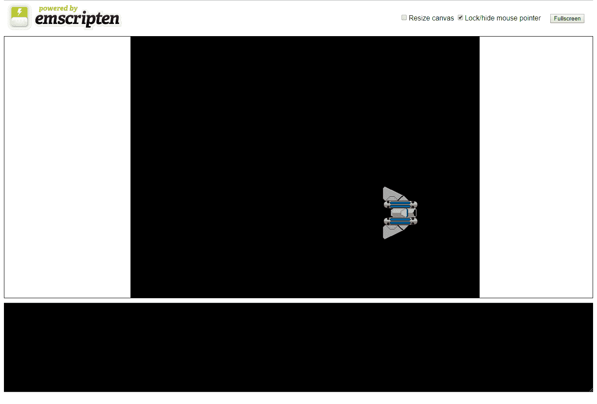
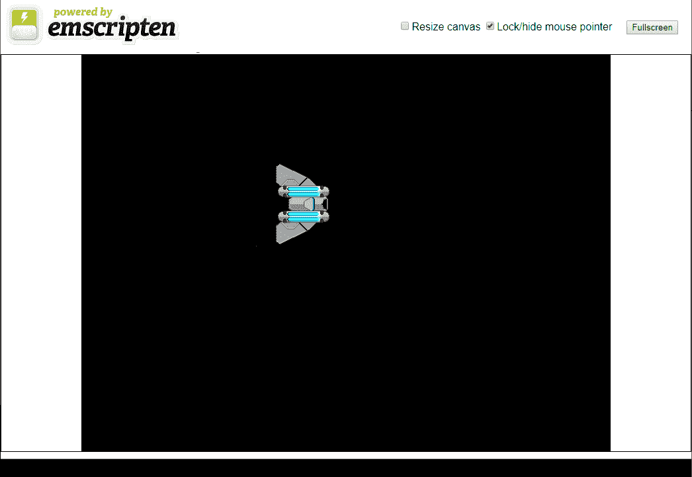
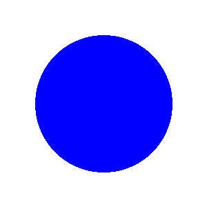
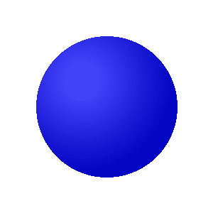
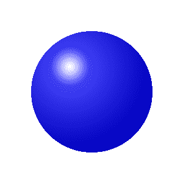
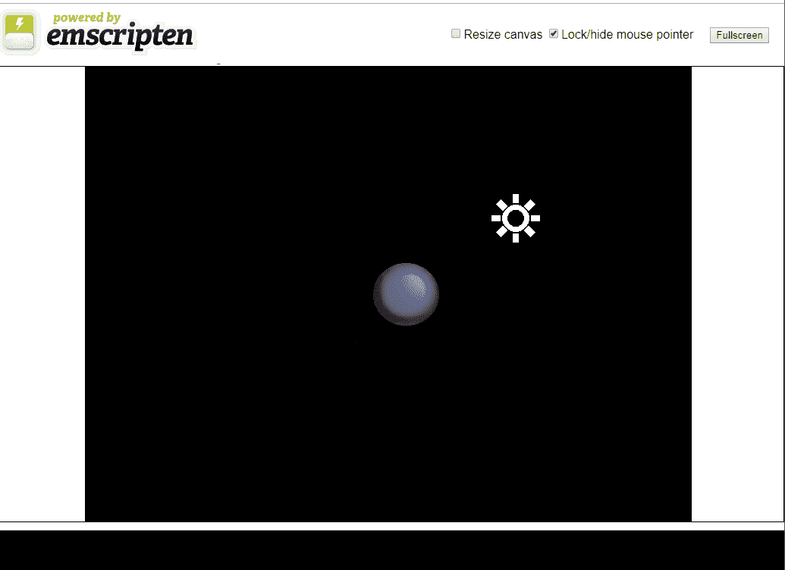

# 着色器和 2D 光照

我们已经在第三章中介绍了着色器，*WebGL 简介*。不幸的是，SDL 不允许用户在不深入库的源代码并在那里修改的情况下自定义其着色器。这种修改超出了本书的范围。

本书的范围。在使用 SDL 与 OpenGL 的组合是很常见的。SDL 可用于渲染游戏的用户界面，而 OpenGL 则渲染游戏对象。本章将与之前的许多章节有所不同，因为我们将不会直接在我们一直在编写的游戏中混合 SDL 和 OpenGL。更新游戏以支持 OpenGL 2D 渲染引擎将需要对游戏进行完全的重新设计。然而，我想为那些有兴趣创建更高级的 2D 渲染引擎的人提供一个章节，让他们尝试结合 OpenGL 和 SDL，并为该引擎编写着色器。

您需要在构建中包含几个图像才能使这个项目工作。确保您包含了这个项目的 GitHub 存储库中的`/Chapter15/sprites/`文件夹。如果您还没有下载 GitHub 项目，可以在这里在线获取：[`github.com/PacktPublishing/Hands-On-Game-Development-with-WebAssembly`](https://github.com/PacktPublishing/Hands-On-Game-Development-with-WebAssembly)。

在本章中，我们将做以下事情：

+   使用 SDL 和 OpenGL 为 WebAssembly 重新创建我们在[第三章](https://cdp.packtpub.com/hands_on_game_development_with_webassembly/wp-admin/post.php?post=38&action=edit#post_26)中制作的应用程序，*WebGL 简介*。

+   学习如何创建一个新的着色器，加载并渲染多个纹理到一个四边形

+   了解法向图以及它们如何用于在 2D 游戏对象上创建深度的错觉

+   学习如何在 OpenGL 和 WebAssembly 中使用法向图来近似 2D 中的冯氏光照模型

# 使用 OpenGL 和 WebAssembly

Emscripten 能够编译使用 OpenGL ES 2.0 或 OpenGL ES 3.0 的 C/C++代码，通过将这些调用映射到 WebGL 或 WebGL 2 调用来实现。因此，Emscripten 只支持与您使用的 WebGL 库内可用的 OpenGL ES 命令的子集。例如，如果您想使用 OpenGL ES 3.0，您需要在编译时通过向 Emscripten 编译器传递`-s USE_WEBGL2=1`参数来包含 WebGL 2。在本章中，我们将使用 OpenGL ES 2.0 与 SDL 结合使用着色器来渲染精灵，稍后我们将使用 SDL 来渲染代表应用程序中光源位置的图标。SDL 提供了许多 OpenGL 所没有的功能，如音频库、图像加载库以及鼠标和键盘输入库。在许多方面，SDL 更适合于渲染游戏的用户界面，因为它将对象渲染到屏幕坐标而不是 OpenGL 剪辑空间。在幕后，WebAssembly 版本的 SDL 也使用了 Emscripten 的 OpenGL ES 实现，依赖于 WebGL。因此，更好地了解 WebAssembly 的 OpenGL 实现可以帮助我们将游戏开发技能提升到更高的水平，即使我们在本书中开发的游戏中不会使用这些技能。

# 更多关于着色器的知识

我们在《HTML5 和 WebAssembly》的第二章中简要介绍了着色器的概念。着色器是现代 3D 图形渲染的关键部分。在计算机和视频游戏的早期，图形都是 2D 的，图形渲染的速度取决于系统能够将像素从一个数据缓冲区移动到另一个数据缓冲区的速度。这个过程称为*blitting*。在早期，一个重要的进步是任天堂在他们的任天堂娱乐系统中添加了一个**图片处理单元**（**PPU**）。这是一个早期的硬件，旨在通过在不使用游戏系统 CPU 的情况下移动像素来加速图形处理。康柏 Amiga 也是这些早期 2D 图形协处理器的先驱，到了 20 世纪 90 年代中期，blitting 的硬件成为了计算机行业的标准。1996 年，像《奇兵》这样的游戏开始对消费者 3D 图形处理提出需求，早期的图形卡开始提供具有固定功能管线的 GPU。这允许应用程序加载几何数据并在该几何体上执行不可编程的纹理和光照功能。在 21 世纪初，Nvidia 推出了 GeForce 3。这是第一个支持可编程管线的 GPU。最终，这些可编程管线的 GPU 开始围绕*统一着色器模型*进行标准化，这允许程序员为支持该语言的所有图形卡编写 GLSL 等着色器语言。

# GLSL ES 1.0 和 3.0

我们将使用的语言来编写我们的着色器是 GLSL 着色器语言的一个子集，称为 GLSL ES。这个着色器语言恰好适用于 WebGL，因此受到了被移植到 WebAssembly 的 OpenGL ES 版本的支持。我们编写的代码将在 GLSL ES 1.0 和 3.0 上运行，这是 WebAssembly 支持的 GLSL ES 的两个版本。

如果你想知道为什么不支持 GLSL ES 2.0，那是因为它根本不存在。OpenGL ES 1.0 使用了固定功能管线，因此没有与之相关的着色器语言。当 Khronos Group 创建了 OpenGL ES 2.0 时，他们创建了 GLSL ES 1.0 作为与之配套的着色器语言。当他们发布了 OpenGL ES 3.0 时，他们决定希望着色器语言的版本号与 API 的版本号相同。因此，所有新版本的 OpenGL ES 都将配备与之版本号相同的 GLSL 版本。

GLSL 是一种非常类似于 C 的语言。每个着色器都有一个`main`函数作为其入口点。GLSL ES 2.0 只支持两种着色器类型：*顶点着色器*和*片段着色器*。这些着色器的执行是高度并行的。如果你习惯于单线程思维，你需要调整你的思维方式。着色器通常同时处理成千上万个顶点和像素。

我在《WebGL 入门》的第三章中简要讨论了顶点和片段的定义。顶点是空间中的一个点，一组顶点定义了我们的图形卡用来渲染屏幕的几何形状。片段是像素候选。通常需要多个片段来确定像素输出。

传递给顶点着色器的几何图形的每个顶点都由该着色器处理。然后使用*varying 变量*传递值给大量处理单个像素的线程，通过片段着色器。片段着色器接收一个值，该值在多个顶点着色器的输出之间进行插值。片段着色器的输出是一个*片段*，它是一个像素候选。并非所有片段都成为像素。有些片段被丢弃，这意味着它们根本不会渲染。其他片段被混合以形成完全不同的像素颜色。在第三章中，*WebGL 简介*中，我们为我们的 WebGL 应用程序创建了一个顶点着色器和一个片段着色器。让我们开始将该应用程序转换为一个 OpenGL/WebAssembly 应用程序。一旦我们有一个工作的应用程序，我们可以进一步讨论着色器和我们可以编写这些着色器的新方法，以改进我们的 2D WebAssembly 游戏。

# WebGL 应用程序重现

现在我们将逐步介绍如何重写我们在第三章中制作的 WebGL 应用程序，使用 SDL 和 OpenGL。如果你不记得了，这是一个非常简单的应用程序，每帧都在我们的画布上绘制一艘飞船，并将其向左移动 2 个像素，向上移动一个像素。我们制作这个应用程序的原因是，这是我能想到的在 WebGL 中做的比绘制一个三角形更有趣的最简单的事情。出于同样的原因，这将是我们将使用 OpenGL 进行 WebAssembly 的第一件事情。现在，创建一个名为`webgl-redux.c`的新文件并打开它。现在，让我们开始添加一些代码。我们需要的第一部分代码是我们的`#include`命令，以引入我们这个应用程序所需的所有库：

```cpp
#include <SDL2/SDL.h>
#include <SDL2/SDL_image.h>
#include <SDL_opengl.h>
#include <GLES2/gl2.h>
#include <stdlib.h>
#include <emscripten.h>
```

第一行包括标准的 SDL2 库。第二个库`SDL_image.h`是我们用来加载图像文件的库。这个文件的第三行包括`SDL_opengl.h`，这是一个允许我们混合 SDL 和 OpenGL 调用的库。包括`GLES2/gl2.h`让我们可以使用 OpenGL ES 2.0 的所有 OpenGL 命令。和往常一样，我们包括`stdlib.h`让我们可以使用`printf`命令，`emscripten.h`为我们提供了使用 Emscripten 编译器编译为 WebAssembly 目标所需的函数。

在我们的`#include`命令之后，我们有一系列`#define`宏，用于定义我们游戏所需的常量：

```cpp
#define CANVAS_WIDTH 800
#define CANVAS_HEIGHT 600
#define FLOAT32_BYTE_SIZE 4
#define STRIDE FLOAT32_BYTE_SIZE*4
```

前两个定义了我们画布的宽度和高度。其余的`#define`调用用于设置我们在定义顶点缓冲区时将要使用的值。在这些`#define`宏之后，我们定义了我们着色器的代码。

# 着色器代码

接下来我将要展示的几个代码块将定义我们需要创建 2D 光照效果的着色器。以下是顶点着色器代码：

```cpp
const GLchar* vertex_shader_code[] = {
    "precision mediump float; \n"
    "attribute vec4 a_position; \n"
    "attribute vec2 a_texcoord; \n"

    "uniform vec4 u_translate; \n"

    "varying vec2 v_texcoord; \n"

    "void main() { \n"
        "gl_Position = u_translate + a_position; \n"
        "v_texcoord = a_texcoord; \n"
    "} \n"
};
```

这是我们创建 WebGL 版本应用时使用的相同着色器代码。它在 C 中看起来有点不同，因为 JavaScript 可以使用多行字符串，使得代码更加清晰易读。与 WebGL 版本一样，我们使用精度调用将浮点精度设置为中等。我们设置属性来接收位置和 UV 纹理坐标数据作为向量。我们将使用顶点缓冲对象传递这些向量。我们定义一个 uniform 变量`translate`，它将是所有顶点使用的相同值，这通常不是我们在游戏中做的方式，但对于这个应用来说完全可以。最后，我们定义一个 varying `v_texcoord`变量。这个变量将代表我们从顶点着色器传递到片段着色器的纹理坐标值。这个顶点着色器中的`main()`函数非常简单。它将`u_translate` uniform 变量传递到顶点着色器中，将通过`a_position`传递的顶点属性位置添加到最终顶点位置，然后使用`gl_Position`变量设置。之后，通过将`v_texcoord` varying 变量设置为`a_texcoord`，我们将顶点的纹理坐标传递到片段着色器中。

在定义了我们的顶点着色器之后，我们创建了定义我们片段着色器的字符串。片段着色器接收到了`v_texcoord`的插值版本，这是从我们的顶点着色器传递出来的 varying 变量。你需要暂时戴上并行处理的帽子来理解这是如何工作的。当 GPU 处理我们的顶点着色器和片段着色器时，它不是一次处理一个，而是可能一次处理成千上万个顶点和片段。片段着色器也不是接收来自单个线程的输出，而是来自当前正在处理的多个顶点的混合值。

例如，如果你的顶点着色器有一个名为 X 的 varying 变量作为输出，并且你的片段着色器处于 X 为 0 和 X 为 10 的两个顶点之间的中间位置，那么进入片段的 varying 变量中的值将是 5。这是因为 5 是 0 和 10 两个顶点值之间的中间值。同样，如果片段在两个点之间的 30%位置，X 中的值将是 3。

以下是我们片段着色器代码的定义：

```cpp
const GLchar* fragment_shader_code[] = {
    "precision mediump float; \n"
    "varying vec2 v_texcoord; \n"

    "uniform sampler2D u_texture; \n"

    "void main() { \n"
        "gl_FragColor = texture2D(u_texture, v_texcoord); \n"
    "} \n"
 };
```

与我们的顶点着色器一样，我们首先设置精度。之后，我们有一个 varying 变量，这是我们纹理坐标的插值值。这个值存储在`v_texcoord`中，并将用于将纹理映射到像素颜色上。最后一个变量是一个`sampler2D`类型的 uniform 变量。这是一个内存块，我们在其中加载了我们的纹理。这个片段着色器的主要功能是使用内置的`texture2D`函数，使用我们传递到片段着色器中的纹理坐标来获取纹理中的像素颜色。

# OpenGL 全局变量

在定义了我们的着色器之后，我们需要在 C 中定义几个变量，用于与它们进行交互：

```cpp
GLuint program = 0;
GLuint texture;

GLint a_texcoord_location = -1;
GLint a_position_location = -1;

GLint u_texture_location = -1;
GLint u_translate_location = -1;

GLuint vertex_texture_buffer;
```

OpenGL 使用引用变量与 GPU 进行交互。这些变量中的前两个是`GLuint`类型。`GLuint`是无符号整数，使用`GLuint`类型只是 OpenGL 类型的一种。看到`GLuint`而不是`unsigned int`是给阅读你的代码的人一个提示，表明你正在使用这个变量与 OpenGL 进行交互。程序变量最终将保存一个由你的着色器定义的程序的引用，而纹理变量将保存一个已加载到 GPU 中的纹理的引用。在对程序和纹理的引用之后，我们有两个变量，用于引用着色器程序属性。`a_texcoord_location`变量将是对`a_texcoord`着色器属性的引用，而`a_position_location`变量将是对`a_position`着色器属性值的引用。属性引用后面是两个统一变量引用。如果你想知道统一变量和属性变量之间的区别，统一变量对于所有顶点保持相同的值，而属性变量是特定于顶点的。最后，我们在`vertex_texture_buffer`变量中有一个对顶点纹理缓冲区的引用。

在定义这些值之后，我们需要定义我们的四边形。你可能还记得，我们的四边形由六个顶点组成。这是因为它由两个三角形组成。我在第三章中讨论了为什么我们以这种方式设置顶点数据，*WebGL 入门*。如果你觉得这很困惑，你可能需要回到那一章进行一些复习。以下是`vertex_texture_data`数组的定义：

```cpp
float vertex_texture_data[] = {
    // x,   y,        u,   v
    0.167,  0.213,    1.0, 1.0,
   -0.167,  0.213,    0.0, 1.0,
    0.167, -0.213,    1.0, 0.0,
   -0.167, -0.213,    0.0, 0.0,
   -0.167,  0.213,    0.0, 1.0,
    0.167, -0.213,    1.0, 0.0
};
```

# SDL 全局变量

我们仍然将使用 SDL 来初始化我们的 OpenGL 渲染画布。我们还将使用 SDL 从虚拟文件系统加载图像数据。因此，我们需要定义以下与 SDL 相关的全局变量：

```cpp
SDL_Window *window;
SDL_Renderer *renderer;
SDL_Texture* sprite_texture;
SDL_Surface* sprite_surface;
```

之后，当我们使用 SDL 加载图像时，我们需要变量来保存我们的精灵宽度和高度值：

```cpp
int sprite_width;
int sprite_height;
```

当我们将飞船绘制到画布上时，我们将需要该飞船的`x`和`y`坐标，因此我们将创建一些全局变量来保存这些值：

```cpp
float ship_x = 0.0;
float ship_y = 0.0;
```

最后，我们将创建一个游戏循环的函数原型。我想在定义主函数之后定义我们的游戏循环，因为我想先逐步进行初始化。以下是我们游戏循环的函数原型：

```cpp
void game_loop();
```

# 主函数

现在，我们来到了我们的`main`函数。我们需要做一些初始化工作。我们不仅需要像创建游戏时那样初始化 SDL，还需要对 OpenGL 进行几个初始化步骤。以下是完整的`main`函数：

```cpp
int main() {
 SDL_Init( SDL_INIT_VIDEO );
 SDL_CreateWindowAndRenderer( CANVAS_WIDTH, CANVAS_HEIGHT, 0, &window, &renderer );
    SDL_SetRenderDrawColor( renderer, 0, 0, 0, 255 );
    SDL_RenderClear( renderer );
    GLuint vertex_shader = glCreateShader(GL_VERTEX_SHADER);
    glShaderSource( vertex_shader,1,vertex_shader_code,0);
    glCompileShader(vertex_shader);
    GLint compile_success = 0;
    glGetShaderiv(vertex_shader, GL_COMPILE_STATUS, &compile_success);
    if(compile_success == GL_FALSE)
    {
        printf("failed to compile vertex shader\n");
        glDeleteShader(vertex_shader);
        return 0;
    }
    GLuint fragment_shader = glCreateShader(GL_FRAGMENT_SHADER);
    glShaderSource( fragment_shader,1,fragment_shader_code,0);
    glCompileShader(fragment_shader);
    glGetShaderiv(fragment_shader, GL_COMPILE_STATUS,&compile_success);
    if(compile_success == GL_FALSE)
    {
        printf("failed to compile fragment shader\n");
        glDeleteShader(fragment_shader);
        return 0;
    }
    program = glCreateProgram();
    glAttachShader( program,vertex_shader);
    glAttachShader( program,fragment_shader);
    glLinkProgram(program);
    GLint link_success = 0;
    glGetProgramiv(program, GL_LINK_STATUS, &link_success);
    if (link_success == GL_FALSE)
    {
        printf("failed to link program\n");
        glDeleteProgram(program);
        return 0;
    }
    glUseProgram(program);
    u_texture_location = glGetUniformLocation(program, "u_texture");
    u_translate_location = glGetUniformLocation(program,"u_translate");
    a_position_location = glGetAttribLocation(program, "a_position");
    a_texcoord_location = glGetAttribLocation(program, "a_texcoord");
    glGenBuffers(1, &vertex_texture_buffer);
    glBindBuffer( GL_ARRAY_BUFFER, vertex_texture_buffer );
    glBufferData(GL_ARRAY_BUFFER, 
    sizeof(vertex_texture_data),vertex_texture_data, GL_STATIC_DRAW);
    sprite_surface = IMG_Load( "/sprites/spaceship.png" );
    if( !sprite_surface ) {
        printf("failed to load image: %s\n", IMG_GetError() );
        return 0;
    }
    sprite_texture = SDL_CreateTextureFromSurface( renderer, 
    sprite_surface );
    if( !sprite_texture ) {
        printf("failed to create texture: %s\n", IMG_GetError() );
        return 0;
    }
    SDL_QueryTexture( sprite_texture,NULL, NULL,&sprite_width, &sprite_height );
    glTexImage2D( GL_TEXTURE_2D,0,GL_RGBA,sprite_width,sprite_height,
                  0,GL_RGBA,GL_UNSIGNED_BYTE,sprite_surface );
    SDL_FreeSurface( sprite_surface );
    glBlendFunc(GL_SRC_ALPHA, GL_ONE_MINUS_SRC_ALPHA);
    glEnable(GL_BLEND);
    glEnableVertexAttribArray(a_position_location);
    glEnableVertexAttribArray(a_texcoord_location);
    glVertexAttribPointer(a_position_location,2,GL_FLOAT,GL_FALSE,4 * 
    sizeof(float),(void*)0 );
    glVertexAttribPointer(a_texcoord_location,2,GL_FLOAT,GL_FALSE,
                          4 * sizeof(float),(void*)(2 * sizeof(float)));
    emscripten_set_main_loop(game_loop, 0, 0);
}
```

让我把它分成一些更容易理解的部分。在我们的`main`函数中，我们需要做的第一件事是标准的 SDL 初始化工作。我们需要初始化视频模块，创建一个渲染器，并设置绘制和清除颜色。到现在为止，这段代码应该对你来说已经很熟悉了：

```cpp
SDL_Init( SDL_INIT_VIDEO );
SDL_CreateWindowAndRenderer( CANVAS_WIDTH, CANVAS_HEIGHT, 0, &window, &renderer );
SDL_SetRenderDrawColor( renderer, 0, 0, 0, 255 );
SDL_RenderClear( renderer );
```

接下来，我们需要创建和编译我们的顶点着色器。这需要几个步骤。我们需要创建我们的着色器，将源代码加载到着色器中，编译着色器，然后检查编译时是否出现错误。基本上，这些步骤将你的代码编译，然后将编译后的代码加载到视频卡中以便以后执行。以下是编译顶点着色器所需执行的所有步骤：

```cpp
GLuint vertex_shader = glCreateShader(GL_VERTEX_SHADER);
glShaderSource( vertex_shader,
                1,
                vertex_shader_code,
                0);

glCompileShader(vertex_shader);

GLint compile_success = 0;1
glGetShaderiv(vertex_shader, GL_COMPILE_STATUS, &compile_success);
if(compile_success == GL_FALSE)
{
    printf("failed to compile vertex shader\n");
    glDeleteShader(vertex_shader);
    return 0;
}
```

在编译顶点着色器之后，我们需要编译片段着色器。这是相同的过程。我们首先调用`glCreateShader`来创建一个片段着色器。然后，我们使用`glShaderSource`加载我们的片段着色器源代码。之后，我们调用`glCompileShader`来编译我们的片段着色器。最后，我们调用`glGetShaderiv`来查看在尝试编译我们的片段着色器时是否发生了编译器错误：

```cpp
GLuint fragment_shader = glCreateShader(GL_FRAGMENT_SHADER);
glShaderSource( fragment_shader,
                1,
                fragment_shader_code,
                0);

glCompileShader(fragment_shader);
glGetShaderiv(fragment_shader, GL_COMPILE_STATUS, &compile_success);

if(compile_success == GL_FALSE)
{
    printf("failed to compile fragment shader\n");
    glDeleteShader(fragment_shader);
    return 0;
}
```

为了简单起见，当着色器编译失败时，我保持了错误消息的模糊性。它只告诉你哪个着色器编译失败了。在本章的后面，我将向你展示如何从着色器编译器中获取更详细的错误消息。

现在我们已经编译了我们的着色器，我们需要将我们的着色器链接到一个程序中，然后告诉 OpenGL 这是我们想要使用的程序。如果你正在使用 OpenGL 编写游戏，很有可能你会使用多个程序。例如，你可能希望在游戏中的某些对象上使用光照效果，而在其他对象上不使用。一些游戏对象可能需要旋转和缩放，而其他对象可能不需要。

正如你将在下一章中学到的那样，在 WebGL 中使用多个程序比在本机 OpenGL 应用程序中有更高的 CPU 负担。这与 Web 浏览器的安全检查有关。

对于这个应用程序，我们将使用一个单独的程序，并使用以下代码来附加我们的着色器并将它们链接到程序中：

```cpp
program = glCreateProgram();
glAttachShader( program,
                vertex_shader);

glAttachShader( program,
                fragment_shader);

glLinkProgram(program);

GLint link_success = 0;

glGetProgramiv(program, GL_LINK_STATUS, &link_success);

if (link_success == GL_FALSE)
{
    printf("failed to link program\n");
    glDeleteProgram(program);
    return 0;
}
glUseProgram(program);
```

`glCreateProgram`函数创建一个新的程序并返回一个引用 ID。我们将把这个引用 ID 存储在我们的程序变量中。我们调用`glAttachShader`两次，将我们的顶点着色器和片元着色器附加到我们刚刚创建的程序上。然后我们调用`glLinkProgram`将程序着色器链接在一起。我们调用`glGetProgramiv`来验证程序成功链接。最后，我们调用`glUseProgram`告诉 OpenGL 这是我们想要使用的程序。

现在我们正在使用一个特定的程序，我们可以使用以下代码来检索该程序中属性和统一变量的引用：

```cpp
u_texture_location = glGetUniformLocation(program, "u_texture");
u_translate_location = glGetUniformLocation(program, "u_translate");

a_position_location = glGetAttribLocation(program, "a_position");
a_texcoord_location = glGetAttribLocation(program, "a_texcoord");
```

第一行检索到`u_texture`统一变量的引用，第二行检索到`u_translate`统一变量的引用。我们可以稍后使用这些引用在我们的着色器中设置这些值。之后的两行用于检索到我们着色器中的`a_position`位置属性和`a_texcoord`纹理坐标属性的引用。像统一变量一样，我们稍后将使用这些引用来设置着色器中的值。

现在，我们需要创建并加载数据到一个顶点缓冲区。顶点缓冲区保存了我们将要渲染的每个顶点的属性数据。如果我们要渲染一个 3D 模型，我们需要用从外部检索到的模型数据加载它。幸运的是，对于我们来说，我们只需要渲染一些二维的四边形。四边形足够简单，我们之前能够在一个数组中定义它们。

在我们可以将数据加载到缓冲区之前，我们需要使用`glGenBuffers`来生成该缓冲区。然后我们需要使用`glBindBuffer`来*绑定*缓冲区。绑定缓冲区只是告诉 OpenGL 你当前正在处理哪些缓冲区。以下是生成然后绑定我们的顶点缓冲区的代码：

```cpp
glGenBuffers(1, &vertex_texture_buffer);
glBindBuffer( GL_ARRAY_BUFFER, vertex_texture_buffer );
```

现在我们已经选择了一个缓冲区，我们可以使用`glBufferData`来向缓冲区中放入数据。我们将传入我们之前定义的`vertex_texture_data`。它定义了我们四边形顶点的`x`和`y`坐标以及这些顶点的 UV 映射数据。

```cpp
glBufferData(GL_ARRAY_BUFFER, sizeof(vertex_texture_data),
                vertex_texture_data, GL_STATIC_DRAW);
```

在缓冲我们的数据之后，我们将使用 SDL 来加载一个精灵表面。然后，我们将从该表面创建一个纹理，我们可以用它来找到刚刚加载的图像的宽度和高度。之后，我们调用`glTexImage2D`从 SDL 表面创建一个 OpenGL 纹理。以下是代码：

```cpp
sprite_surface = IMG_Load( "/sprites/spaceship.png" );

if( !sprite_surface ) {
    printf("failed to load image: %s\n", IMG_GetError() );
    return 0;
}

sprite_texture = SDL_CreateTextureFromSurface( renderer, sprite_surface );

if( !sprite_texture ) {
    printf("failed to create texture: %s\n", IMG_GetError() );
    return 0;
}

SDL_QueryTexture( sprite_texture,
                    NULL, NULL,
                    &sprite_width, &sprite_height );

glTexImage2D( GL_TEXTURE_2D,
                0,
                GL_RGBA,
                sprite_width,
                sprite_height,
                0,
                GL_RGBA,
                GL_UNSIGNED_BYTE,
                sprite_surface );

SDL_FreeSurface( sprite_surface );
```

大部分之前的代码应该看起来很熟悉。我们已经使用`IMG_Load`一段时间从虚拟文件系统中加载 SDL 表面。然后我们使用`SDL_CreateTextureFromSurface`创建了一个 SDL 纹理。一旦我们有了纹理，我们使用`SDL_QueryTexture`来找出图像的宽度和高度，并将这些值存储在`sprite_width`和`sprite_height`中。下一个函数调用是新的。`GlTexImage2D`函数用于创建一个新的 OpenGL 纹理图像。我们将`sprite_surface`作为我们的图像数据传入，这是我们几行前加载的图像数据。最后一行使用`SDL_FreeSurface`释放表面。

然后我们添加了两行代码在游戏中启用 alpha 混合：

```cpp
glBlendFunc(GL_SRC_ALPHA, GL_ONE_MINUS_SRC_ALPHA);
glEnable(GL_BLEND);
```

启用 alpha 混合后，我们有几行代码在着色器中设置属性：

```cpp
glEnableVertexAttribArray(a_position_location);
glEnableVertexAttribArray(a_texcoord_location);

glVertexAttribPointer(
        a_position_location,     // set up the a_position attribute
        2,                       // how many attributes in the position
        GL_FLOAT,                // data type of float
        GL_FALSE,                // the data is not normalized
        4 * sizeof(float),       // stride (how many array items until 
                                 //the next position)
        (void*)0                 // starting point for attribute
);

glVertexAttribPointer(
        a_texcoord_location,         // set up the a_texcoord attribute
        2,                           // how many attributes in the 
                                     //texture coordinates
        GL_FLOAT,                    // data type of float
        GL_FALSE,                    // the data is not normalized
        4 * sizeof(float),           // stride (how many array items 
                                     //until the next position)
        (void*)(2 * sizeof(float))   // starting point for attribute
);
```

游戏循环的前两行启用了着色器中的`a_position`和`a_texcoord`属性。之后，我们调用了两次`glVertexAttribPointer`。这些调用用于告诉着色器每个特定属性分配的数据在顶点缓冲区中的位置。我们用 32 位浮点变量填充了顶点缓冲区。第一次调用`glVertexAttribPointer`设置了`a_position`属性分配的值的位置，使用了我们在`a_position_location`中创建的引用变量。然后我们传入了用于此属性的值的数量。在位置的情况下，我们传入了`x`和`y`坐标，所以这个值是 2。我们传入了缓冲区数组的数据类型，即浮点数据类型。我们告诉函数我们不对数据进行归一化。`stride`值是倒数第二个参数。这是在此缓冲区中用于一个顶点的字节数。因为缓冲区中的每个顶点都使用了四个浮点值，所以我们传入了`4 * sizeof(float)`作为我们的 stride。最后，我们传入的最后一个值是字节偏移量，用于填充此属性的数据。对于`a_position`属性，这个值是`0`，因为位置位于开头。对于`a_texcoord`属性，这个值是`2 * sizeof(float)`，因为在我们的`a_texcoord`数据之前使用了两个浮点值来填充`a_position`。

`main`函数中的最后一行设置了游戏循环回调：

```cpp
emscripten_set_main_loop(game_loop, 0, 0);
```

# 游戏循环

我们的游戏循环非常简单。在游戏循环中，我们将使用 OpenGL 清除画布，移动我们的飞船，并将我们的飞船渲染到画布上。以下是代码：

```cpp
void game_loop() {
    glClearColor( 0, 0, 0, 1 );
    glClear( GL_COLOR_BUFFER_BIT|GL_DEPTH_BUFFER_BIT );

    ship_x += 0.002;
    ship_y += 0.001;

    if( ship_x >= 1.16 ) {
        ship_x = -1.16;
    }

    if( ship_y >= 1.21 ) {
        ship_y = -1.21;
    }

    glUniform4f(u_translate_location,
                ship_x, ship_y, 0, 0 );

    glDrawArrays(GL_TRIANGLES, 0, 6);
}
```

游戏循环的前两行清除画布：

```cpp
glClearColor( 0, 0, 0, 1 );
glClear( GL_COLOR_BUFFER_BIT|GL_DEPTH_BUFFER_BIT );
```

之后，我们有几行代码更新飞船的`x`和`y`坐标，然后在着色器中设置新的坐标：

```cpp
ship_x += 0.002;
ship_y += 0.001;

if( ship_x >= 1.16 ) {
    ship_x = -1.16;
}

if( ship_y >= 1.21 ) {
    ship_y = -1.21;
}

glUniform4f(u_translate_location,
            ship_x, ship_y, 0, 0 );
```

最后，游戏循环使用`glDrawArrays`将我们的飞船绘制到画布上：

```cpp
glDrawArrays(GL_TRIANGLES, 0, 6);
```

# 编译和运行我们的代码

您需要从 GitHub 项目中下载 sprites 文件夹，以便包含我们编译和运行此项目所需的图像文件。一旦您拥有这些图像并将我们刚刚编写的代码保存到`webgl-redux.c`文件中，我们就可以编译和测试这个新应用程序。如果成功，它应该看起来就像第三章中的*WebGL 简介*，WebGL 版本。运行以下`emcc`命令来编译应用程序：

```cpp
emcc webgl-redux.c -o redux.html --preload-file sprites -s USE_WEBGL2=1 -s USE_SDL=2 -s USE_SDL_IMAGE=2 -s SDL2_IMAGE_FORMATS=["png"]
```

如果应用程序成功运行，您应该会看到一艘飞船从左到右并上升到 HTML 画布上。以下是应用程序的工作版本的屏幕截图：



图 15.1：OpenGL 和 SDL 应用程序的屏幕截图

在下一节中，我们将学习如何在着色器中混合纹理。

# 混合纹理以产生发光效果

现在，我们将花一些时间学习如何将多个纹理加载到我们的程序中。我们将添加这两个纹理的颜色以创建脉动的光晕效果。为此，我们需要修改我们的片段着色器，以接收第二个纹理和一个时间统一变量。我们将把该变量传递给一个正弦波函数，该函数将用它来计算我们发光引擎的强度。我们需要添加一些代码来跟踪经过的时间，以及一些新的初始化代码来加载第二个纹理。我们可以通过将`webgl-redux.c`复制到一个名为`glow.c`的新文件来开始。现在我们有了新的`glow.c`文件，我们可以逐步了解我们需要做的更改，以实现我们发光引擎的效果。第一个代码更改是添加一个新的`#define`宏，用于定义`2π`的值。

我们将使用一个从`0`到`2π`循环的值，并将其输入正弦波函数，以在我们的引擎光晕上创建脉动效果。以下是我们应该在`glow.c`文件开头附近添加的`#define`：

```cpp
#define TWOPI 6.2831853 // 2π
```

# 片段着色器更改

在添加了新的宏之后，我们需要对我们的片段着色器代码进行一些更改。我们的顶点着色器代码将保持不变，因为确定顶点位置的过程与应用程序先前版本中的过程没有任何不同。以下是片段着色器的更新版本：

```cpp
const GLchar* fragment_shader_code[] = {
    "precision mediump float; \n"
    "varying vec2 v_texcoord; \n"

    "uniform float u_time; \n"
    "uniform sampler2D u_texture; \n"
    "uniform sampler2D u_glow; \n"

    "void main() { \n"
        "float cycle = (sin(u_time) + 1.0) / 2.0; \n"
        "vec4 tex = texture2D(u_texture, v_texcoord); \n"
        "vec4 glow = texture2D(u_glow, v_texcoord); \n"
        "glow.rgb *= glow.aaa; \n"
        "glow *= cycle; \n"
        "gl_FragColor = tex + glow; \n"
    "} \n"
};
```

我们添加了一个名为`u_time`的新统一变量，用于传递一个基于时间的变量，该变量将在`0`和`2π`之间循环。我们还添加了第二个`sampler2D`统一变量，称为`u_glow`，它将保存我们的新光晕纹理。`main`函数的第一行根据`u_time`中的值计算出`0.0`到`1.0`之间的值。我们使用内置的`texture2D`函数从`u_texture`和`u_glow`中检索采样值。这一次，我们不是直接将纹理的值存储到`gl_FragColor`中，而是将这两个值保存到名为`tex`和`glow`的`vec4`变量中。我们将这两个值相加，为了避免所有地方都变得太亮，我们将`glow`样本颜色中的`rgb`（红绿蓝）值乘以 alpha 通道。之后，我们将`glow`颜色中的所有值乘以我们之前计算的`cycle`值。

`cycle`中的值将遵循一个正弦波，在`0.0`和`1.0`之间振荡。这将导致我们的`glow`值随时间上下循环。然后，我们通过将`tex`颜色添加到`glow`颜色来计算我们的片段颜色。然后，我们将输出值存储在`gl_FragColor`中。

# OpenGL 全局变量更改

接下来，我们需要更新与 OpenGL 相关的变量，以便我们可以添加三个新的全局变量。我们需要一个名为`glow_tex`的新变量，我们将用它来存储对光晕纹理的引用。我们还需要两个新的引用变量，用于我们着色器中的两个新的统一变量，称为`u_time_location`和`u_glow_location`。一旦我们添加了这三行，新的 OpenGL 变量块将如下所示：

```cpp
GLuint program = 0;
GLuint texture;
GLuint glow_tex;

GLint a_texcoord_location = -1;
GLint a_position_location = -1;
GLint u_texture_location = -1;
GLint u_glow_location = -1;
GLint u_time_location = -1;

GLint u_translate_location = -1;
GLuint vertex_texture_buffer;
```

# 其他全局变量更改

在我们的 OpenGL 全局变量之后，我们需要添加一个新的与时间相关的全局变量块。我们需要它们来使我们的着色器循环通过值来实现引擎光晕。这些与时间相关的变量应该看起来很熟悉。我们在开发的游戏中使用了类似于我们即将在游戏中使用的技术。以下是这些全局时间变量：

```cpp
float time_cycle = 0;
float delta_time = 0.0;
int diff_time = 0;

Uint32 last_time;
Uint32 last_frame_time;
Uint32 current_time;
```

我们需要添加一个与 SDL 相关的全局表面变量，我们将用它来加载我们的光晕纹理。在`main`函数之前的全局变量块附近添加以下行：

```cpp
SDL_Surface* glow_surface;
```

# `main`函数的更改

我们将对我们在`main`函数中进行的初始化进行一些重大修改。让我先展示整个函数。然后，我们将逐一讲解所有的更改：

```cpp
int main() {
    last_frame_time = last_time = SDL_GetTicks();

    SDL_Init( SDL_INIT_VIDEO );

    SDL_CreateWindowAndRenderer( CANVAS_WIDTH, CANVAS_HEIGHT, 0, 
    &window, &renderer );

    SDL_SetRenderDrawColor( renderer, 0, 0, 0, 255 );
    SDL_RenderClear( renderer );

    GLuint vertex_shader = glCreateShader(GL_VERTEX_SHADER);

    glShaderSource( vertex_shader,
                    1,
                    vertex_shader_code,
                    0);

    glCompileShader(vertex_shader);

    GLint compile_success = 0;
    glGetShaderiv(vertex_shader, GL_COMPILE_STATUS, &compile_success);

    if(compile_success == GL_FALSE)
    {
        printf("failed to compile vertex shader\n");
        glDeleteShader(vertex_shader);
        return 0;
    }

    GLuint fragment_shader = glCreateShader(GL_FRAGMENT_SHADER);

    glShaderSource( fragment_shader,
                    1,
                    fragment_shader_code,
                    0);

    glCompileShader(fragment_shader);
    glGetShaderiv(fragment_shader, GL_COMPILE_STATUS, 
    &compile_success);

    if(compile_success == GL_FALSE)
    {
        printf("failed to compile fragment shader\n");
        glDeleteShader(fragment_shader);
        return 0;
    }

    program = glCreateProgram();
    glAttachShader( program,
                    vertex_shader);

    glAttachShader( program,
                    fragment_shader);

    glLinkProgram(program);

    GLint link_success = 0;

    glGetProgramiv(program, GL_LINK_STATUS, &link_success);

    if (link_success == GL_FALSE)
    {
        printf("failed to link program\n");
        glDeleteProgram(program);
        return 0;
    }

    glUseProgram(program);

    u_glow_location = glGetUniformLocation(program, "u_glow");
    u_time_location = glGetUniformLocation(program, "u_time");

    u_texture_location = glGetUniformLocation(program, "u_texture");
    u_translate_location = glGetUniformLocation(program, 
    "u_translate");

    a_position_location = glGetAttribLocation(program, "a_position");
    a_texcoord_location = glGetAttribLocation(program, "a_texcoord");

    glGenBuffers(1, &vertex_texture_buffer);

glBindBuffer( GL_ARRAY_BUFFER, vertex_texture_buffer );
 glBufferData(GL_ARRAY_BUFFER, sizeof(vertex_texture_data),
 vertex_texture_data, GL_STATIC_DRAW);

sprite_surface = IMG_Load( "/sprites/spaceship.png" );

    if( !sprite_surface ) {
        printf("failed to load image: %s\n", IMG_GetError() );
        return 0;
    }

    sprite_texture = SDL_CreateTextureFromSurface( renderer, 
    sprite_surface );

    if( !sprite_texture ) {
        printf("failed to create texture: %s\n", IMG_GetError() );
        return 0;
    }

    SDL_QueryTexture( sprite_texture,
                        NULL, NULL,
                        &sprite_width, &sprite_height );

    glTexImage2D( GL_TEXTURE_2D,
                    0,
                    GL_RGBA,
                    sprite_width,
                    sprite_height,
                    0,
                    GL_RGBA,
                    GL_UNSIGNED_BYTE,
                    sprite_surface );

    SDL_FreeSurface( sprite_surface );

    glGenTextures( 1,
                    &glow_tex);

    glActiveTexture(GL_TEXTURE1);
    glEnable(GL_TEXTURE_2D);
    glBindTexture(GL_TEXTURE_2D, glow_tex);

    glow_surface = IMG_Load( "/sprites/glow.png" );

    if( !glow_surface ) {
        printf("failed to load image: %s\n", IMG_GetError() );
        return 0;
    }

    glTexImage2D( GL_TEXTURE_2D,
                    0,
                    GL_RGBA,
                    sprite_width,
                    sprite_height,
                    0,
                    GL_RGBA,
                    GL_UNSIGNED_BYTE,
                    glow_surface );

    glGenerateMipmap(GL_TEXTURE_2D);

    SDL_FreeSurface( glow_surface );

    glUniform1i(u_texture_location, 0);
    glUniform1i(u_glow_location, 1);

    glBlendFunc(GL_SRC_ALPHA, GL_ONE_MINUS_SRC_ALPHA);
    glEnable(GL_BLEND);

    glEnableVertexAttribArray(a_position_location);
    glEnableVertexAttribArray(a_texcoord_location);

    glVertexAttribPointer(
        a_position_location,     // set up the a_position attribute
        2,                       // how many attributes in the position
        GL_FLOAT,                // data type of float
        GL_FALSE,                // the data is not normalized
        4 * sizeof(float),       // stride (how many array items until 
                                 //the next position)
        (void*)0                 // starting point for attribute
    );

    glVertexAttribPointer(
        a_texcoord_location,       // set up the a_texcoord attribute
        2,                         // how many attributes in the 
                                   //texture coordinates
        GL_FLOAT,                  // data type of float
        GL_FALSE,                  // the data is not normalized
        4 * sizeof(float),         // stride (how many array items 
                                   //until the next position)
        (void*)(2 * sizeof(float)) // starting point for attribute
    );

    emscripten_set_main_loop(game_loop, 0, 0);
}
```

我们`main`函数中的第一行是新的。我们使用该行将`last_frame_time`和`last_time`设置为系统时间，我们使用`SDL_GetTicks()`来获取系统时间：

```cpp
last_frame_time = last_time = SDL_GetTicks();
```

之后，直到我们到达检索统一位置的代码部分之前，我们将不进行任何更改。我们需要从我们的程序中检索另外两个统一位置，因此在我们调用`glUseProgram`之后，我们应该进行以下调用以获取`u_glow`和`u_time`的统一位置：

```cpp
u_glow_location = glGetUniformLocation(program, "u_glow");
u_time_location = glGetUniformLocation(program, "u_time");
```

在我们调用`SDL_FreeSurface`释放`sprite_surface`变量之后必须添加以下代码块。此代码块将生成一个新的纹理，激活它，绑定它，并将`glow.png`图像加载到该纹理中。然后释放 SDL 表面并为我们的纹理生成 mipmaps。最后，我们使用`glUniform1i`设置纹理的统一位置。以下是我们用来加载新纹理的代码：

```cpp
glGenTextures( 1,
                &glow_tex);

glActiveTexture(GL_TEXTURE1);
glEnable(GL_TEXTURE_2D);
glBindTexture(GL_TEXTURE_2D, glow_tex);

glow_surface = IMG_Load( "/sprites/glow.png" );

if( !glow_surface ) {
    printf("failed to load image: %s\n", IMG_GetError() );
    return 0;
}

glTexImage2D( GL_TEXTURE_2D,
                0,
                GL_RGBA,
                sprite_width,
                sprite_height,
                0,
                GL_RGBA,
                GL_UNSIGNED_BYTE,
                glow_surface );

SDL_FreeSurface( glow_surface );

glGenerateMipmap(GL_TEXTURE_2D);

glUniform1i(u_texture_location, 0);
glUniform1i(u_glow_location, 1);
```

如果您对 Mipmaps 不熟悉，您可能会想知道`glGenerateMipmap(GL_TEXTURE_2D);`这一行是做什么的。当您使用 OpenGL 缩放纹理时，这些纹理需要时间来生成。 Mipmaps 是一种通过在游戏初始化时执行一些二次幂缩放版本的图像来加速缩放的方法。这将减少在运行时缩放这些图像所需的时间。

# 更新 game_loop()

为了循环飞船引擎的发光效果，我们需要在我们的游戏循环中添加一些代码，该代码将从`0.0`循环到`2π`。然后，我们将这个值作为`u_time`统一变量传递到着色器中。我们需要将这个新的代码块添加到游戏循环函数的开头：

```cpp
current_time = SDL_GetTicks();

diff_time = current_time - last_time;

delta_time = diff_time / 1000.0;
last_time = current_time;

time_cycle += delta_time * 4;

if( time_cycle >= TWOPI ) {
    time_cycle -= TWOPI;
}

glUniform1f( u_time_location, time_cycle );
```

第一行使用`SDL_GetTicks()`来检索当前时钟时间。然后我们从当前时间中减去上次时间以获得`diff_time`变量的值。这将告诉我们在此帧和上一帧之间生成的毫秒数。之后，我们计算`delta_time`，这将是此帧和上一帧之间的秒数。在我们计算出`diff_time`和`delta_time`之后，我们将`last_time`变量设置为`current_time`。

我们这样做是为了在下次循环游戏时，我们将知道此帧的运行时间。所有这些行都在我们代码的先前版本中。现在，让我们获取`time_cycle`的值，然后将其传递到我们的片段着色器中的`u_time`统一变量中。首先，使用以下行将`delta-time * 4`添加到时间周期中：

```cpp
time_cycle += delta_time * 4;
```

您可能想知道为什么我要将其乘以`4`。最初，我没有添加倍数，这意味着引擎的发光大约每 6 秒循环一次。这感觉循环时间太长。尝试不同的数字，4 的倍数对我来说感觉刚刚好，但如果您希望引擎的循环速度更快或更慢，您无需坚持使用这个特定的倍数。

因为我们使用正弦函数来循环我们的发光级别，所以当我们的时间周期达到`TWOPI`时，我们需要从我们的`time_cycle`变量中减去`TWOPI`：

```cpp
if( time_cycle >= TWOPI ) {
    time_cycle -= TWOPI;
}
```

现在我们已经计算出周期的值，我们使用`u_time_location`引用变量通过调用`glUniform1f`来设置该值：

```cpp
glUniform1f( u_time_location, time_cycle );
```

# 编译和运行我们的代码

现在我们已经做出了所有需要的代码更改，我们可以继续编译和运行我们应用的新版本。通过运行以下`emcc`命令来编译`glow.c`文件：

```cpp
emcc glow.c -o glow.html --preload-file sprites -s USE_WEBGL2=1 -s USE_SDL=2 -s USE_SDL_IMAGE=2 -s SDL2_IMAGE_FORMATS=["png"]
```

如果构建成功，在 Web 浏览器中运行`glow.html`应该显示飞船移动的方式与之前相同。但是现在，引擎上会有一个发光效果。这种发光会上下循环，并在引擎达到最大发光时如下所示：



图 15.2：发光着色器应用的屏幕截图

在下一节中，我们将讨论 Phong 3D 光照模型。

# 3D 光照

我想简要讨论一下 3D 光照，因为我们将用 2D 光照效果来近似它。冯氏光照模型是计算机图形学中三维光照模型的标准。它是由 Bui Tuong Phong 于 1975 年在犹他大学创建的光照模型，但直到 20 世纪 90 年代末，台式电脑才足够快速地实现该模型在游戏中的应用。自那时起，这种光照模型已成为 3D 游戏开发的标准。它结合了环境光、漫反射光和镜面光来渲染几何图形。我们无法实现光照模型的正确版本，因为我们不是在写一个 3D 游戏。然而，我们可以通过使用 2D 精灵和法线贴图来近似该模型。

# 环境光

在现实世界中，有一定量的光会随机地反射到周围的表面上。这会产生均匀照亮一切的光线。如果没有环境光，一个物体在另一个物体的阴影下会完全变黑。环境光的数量根据环境而异。在游戏中，环境光的数量通常是根据游戏设计师试图实现的情绪和外观来决定的。对于 2D 游戏，环境光可能是我们唯一有效的光照。在 3D 游戏中，完全依赖环境光会产生看起来平坦的模型：



图 15.3：只有环境光的球

# 漫反射光

漫反射光是来自特定方向的光。如果你在现实世界中看一个三维物体，朝向光源的一面会比背对光源的一面看起来更亮。这给了 3D 环境中的物体一个真正的 3D 外观。在许多 2D 游戏中，漫反射光不是通过着色器创建的，而是由创建精灵的艺术家包含在精灵中。例如，在平台游戏中，艺术家可能会假设游戏对象上方有一个光源。艺术家会通过改变艺术作品中像素的颜色来设计游戏对象具有一种漫反射光。对于许多 2D 游戏来说，这样做完全没问题。然而，如果你想在游戏中加入一个火炬，让它在移动时改变游戏对象的外观，你需要设计能够完成这项工作的着色器：



图 15.4：有漫反射光的球

# 镜面光

一些物体是有光泽的，并且有反射区域，会产生明亮的高光。当光线照射到表面上时，会有一个基于光线照射表面的角度相对于表面法线的反射向量。镜面高光的强度取决于表面的反射性，以及相对于反射光角度的视角。游戏对象上的镜面高光可以使其看起来光滑或抛光。并非所有游戏对象都需要这种类型的光照，但它在你想要发光的物体上看起来很棒：



图 15.5：有镜面光的球

在下一节中，我们将讨论法线贴图及其在现代游戏中的应用。

# 法线贴图

法线贴图是一种在 3D 游戏中使用相对较低的多边形数量创建非常详细模型的方法。其思想是，游戏引擎可以使用一个法线贴图的低多边形模型，其中法线贴图中的每个像素都包含使用图像的红色、绿色和蓝色值的法线的 x、y 和 z 值，而不是创建一个具有大量多边形的表面。在着色器内部，我们可以像对其他纹理贴图进行采样一样采样法线贴图纹理。然而，我们可以使用法线数据来帮助我们计算精灵的光照效果。如果在我们的游戏中，我们希望我们的太空飞船始终相对于游戏区域中心的星星照亮，我们可以为我们的太空飞船创建一个法线贴图，并在游戏中心创建一个光源。我们现在将创建一个应用程序来演示 2D 照明中法线贴图的使用。

# 创建一个 2D 照明演示应用程序

我们可以通过创建一个名为`lighting.c`的新 C 文件来启动我们的照明应用程序。`lighting.c`开头的宏与我们在`glow.c`中使用的宏相同，但我们可以删除`#define TWOPI`宏，因为它不再需要。以下是我们将在`lighting.c`文件中使用的宏：

```cpp
#include <SDL2/SDL.h>
#include <SDL2/SDL_image.h>
#include <SDL_opengl.h>

#include <GLES3/gl3.h>
#include <stdlib.h>
#include <emscripten.h>

#define CANVAS_WIDTH 800
#define CANVAS_HEIGHT 600
#define FLOAT32_BYTE_SIZE 4
#define STRIDE FLOAT32_BYTE_SIZE*4
```

此文件中的顶点着色器代码将与我们在`glow.c`文件中的顶点着色器代码非常相似。我们将做出的一个改变是删除`u_translate`统一变量。我们这样做是因为我们将把我们的阴影精灵图像居中，并允许用户在画布上移动光源。以下是顶点着色器的新版本：

```cpp
const GLchar* vertex_shader_code[] = {
    "precision mediump float; \n"
    "attribute vec4 a_position; \n"
    "attribute vec2 a_texcoord; \n"
    "varying vec2 v_texcoord; \n"

    "void main() { \n"
        "gl_Position = a_position; \n"
        "v_texcoord = a_texcoord; \n"
    "} \n"
};
```

# 片段着色器更新

现在，我们需要创建我们的片段着色器的新版本。这个着色器将加载一个法线贴图以及原始加载的纹理。这个法线贴图将用于计算我们游戏对象的光照法线。这个着色器版本将使用 Phong 光照模型的 2D 形式，我们将计算我们正在渲染的精灵的环境、漫反射和法线光照。以下是我们新片段着色器的代码：

```cpp
const GLchar* fragment_shader_code[] = {
    "precision mediump float; \n"

    "varying vec2 v_texcoord; \n"

    "uniform sampler2D u_texture; \n"
    "uniform sampler2D u_normal; \n"
    "uniform vec3 u_light_pos; \n"

    "const float ambient = 0.6; \n"
    "const float specular = 32.0; \n"
    "const vec3 view_pos = vec3(400, 300,-100); \n"
    "const vec4 light_color = vec4( 0.6, 0.6, 0.6, 0.0); \n"

    "void main() { \n"
        "vec4 tex = texture2D(u_texture, v_texcoord); \n"

        "vec4 ambient_frag = tex * ambient; \n"
        "ambient_frag.rgb *= light_color.rgb; \n"

        "vec3 norm = vec3(texture2D(u_normal, v_texcoord)); \n"
        "norm.xyz *= 2.0; \n"
        "norm.xyz -= 1.0; \n"

        "vec3 light_dir = normalize(gl_FragCoord.xyz - u_light_pos); \n"

        "vec3 view_dir = normalize(view_pos - gl_FragCoord.xyz); \n"
        "vec3 reflect_dir = reflect(light_dir, norm); \n"

        "float reflect_dot = max( dot(view_dir, reflect_dir), 0.0 ); \n"
        "float spec = pow(reflect_dot, specular); \n"
        "vec4 specular_frag = spec * light_color; \n"

        "float diffuse = max(dot(norm, light_dir), 0.0); \n"
        "vec4 diffuse_frag = vec4( diffuse*light_color.r, 
         diffuse*light_color.g, "
                                    "diffuse*light_color.b,  0.0);    \n"
        "gl_FragColor = ambient_frag + diffuse_frag + specular_frag; \n"
    "} \n"
};
```

让我们分解一下新版本片段着色器内部发生的事情。你会注意到的第一件事是，我们有两个`sampler2D`统一变量；第二个称为`u_normal`，用于对我们图像的法线贴图进行采样：

```cpp
"uniform sampler2D u_texture; \n"
"uniform sampler2D u_normal; \n"
```

在我们的采样器之后，我们需要一个`uniform vec3`变量，它保存我们光源的位置。我们称之为`u_light_pos`：

```cpp
"uniform vec3 u_light_pos; \n"
```

在我们的新片段着色器中，我们将使用几个常量。我们将需要环境和镜面光照的因子，以及视图位置和光颜色。我们将在以下四行代码中定义这些常量：

```cpp
"const float ambient = 0.6; \n"
"const float specular = 0.8; \n"
"const vec3 view_pos = vec3(400, 300,-100); \n"
"const vec4 light_color = vec4( 0.6, 0.6, 0.6, 0.0); \n"
```

在我们的`main`函数内，我们需要做的第一件事是获取环境片段颜色。确定环境颜色非常容易。你只需要将纹理颜色乘以环境因子，然后再乘以光颜色。以下是计算片段环境分量值的代码：

```cpp
"vec4 tex = texture2D(u_texture, v_texcoord); \n"
"vec4 ambient_frag = tex * ambient; \n"

"ambient_frag.rgb *= light_color.rgb; \n"
```

计算完我们的环境颜色分量后，我们需要计算我们片段的法线，从我们传递到着色器的法线贴图纹理中。纹理使用红色表示法线的`x`值。绿色表示`y`值。最后，蓝色表示`z`值。颜色都是从`0.0`到`1.0`的浮点数，所以我们需要修改法线的`x`、`y`和`z`分量，使其从`-1.0`到`+1.0`。以下是我们用来定义法线的代码：

```cpp
"vec3 norm = vec3(texture2D(u_normal, v_texcoord)); \n"
"norm.xyz *= 2.0; \n"
"norm.xyz -= 1.0; \n"
```

为了将`norm`向量中的值从`0.0`转换为`1.0`，`-1.0`和`+1.0`，我们需要将法线向量中的值乘以 2，然后减去 1。计算法线值后，我们需要找到我们光源的方向：

```cpp
"vec3 light_dir = normalize(gl_FragCoord.xyz - u_light_pos); \n"
```

我们使用 normalize GLSL 函数对值进行归一化，因为在这个应用程序中我们不会有任何光线衰减。如果你有一个带火炬的游戏，你可能希望基于与光源距离的平方的尖锐衰减。对于这个应用程序，我们假设光源具有无限范围。对于我们的镜面光照，我们需要计算我们的视图方向：

```cpp
"vec3 view_dir = normalize(view_pos - gl_FragCoord.xyz); \n"
```

我们将`view_pos`向量设置为画布的中心，因此当我们的光源也在画布的中心时，我们的镜面光照应该最大。当您编译应用程序时，您将能够测试这一点。在计算视图方向之后，我们需要计算反射向量，这也将用于我们的镜面光照计算：

```cpp
"vec3 reflect_dir = reflect(light_dir, norm); \n"
```

然后我们可以计算这两个向量的点积，并将它们提升到我们的镜面因子（之前定义为 32）的幂，以计算我们需要为这个片段的镜面光照的数量：

```cpp
"float reflect_dot = max( dot(view_dir, reflect_dir), 0.0 ); \n"
"float spec = pow(reflect_dot, specular); \n"
"vec4 specular_frag = spec * light_color; \n"
```

之后，我们使用法线和光线方向的点积来计算片段的漫反射分量。我们将其与光颜色结合以获得我们的漫反射分量值：

```cpp
"float diffuse = max(dot(norm, light_dir), 0.0); \n"
"vec4 diffuse_frag = vec4(diffuse*light_color.r, diffuse*light_color.g, diffuse*light_color.b, 0.0); \n"
```

最后，我们将所有这些值相加以找到我们的片段值：

```cpp
"gl_FragColor = ambient_frag + diffuse_frag + specular_frag; \n"
```

# OpenGL 全局变量

在定义了我们的片段着色器之后，我们需要定义一系列与 OpenGL 相关的全局变量。这些变量应该对你来说是熟悉的，因为它们来自这个应用程序的前两个版本。有一些新变量需要注意。我们将不再只有一个程序 ID。SDL 使用自己的程序，我们也需要一个该程序的 ID。我们将称这个变量为`sdl_program`。我们还需要新的纹理引用。此外，我们还需要新的引用传递给我们的着色器的统一变量。以下是我们的 OpenGL 全局变量代码的新版本：

```cpp
GLuint program = 0;
GLint sdl_program = 0;
GLuint circle_tex, normal_tex, light_tex;
GLuint normal_map;

GLint a_texcoord_location = -1;
GLint a_position_location = -1;
GLint u_texture_location = -1;
GLint u_normal_location = -1;
GLint u_light_pos_location = -1;

GLint u_translate_location = -1;
GLuint vertex_texture_buffer;

float vertex_texture_data[] = {
    // x,    y,         u,   v
     0.167,  0.213,     1.0, 1.0,
    -0.167,  0.213,     0.0, 1.0,
     0.167, -0.213,     1.0, 0.0,
    -0.167, -0.213,     0.0, 0.0,
    -0.167,  0.213,     0.0, 1.0,
     0.167, -0.213,     1.0, 0.0
};
```

# SDL 全局变量

一些 SDL 变量与我们在本章为此创建的先前应用程序中使用的变量相同。用于光照和法线的其他变量是这一部分的新内容。以下是我们在这个应用程序中需要的与 SDL 相关的全局变量：

```cpp
SDL_Window *window;
SDL_Renderer *renderer;

SDL_Texture* light_texture;

SDL_Surface* surface;

int light_width;
int light_height;

int light_x = 600;
int light_y = 200;
int light_z = -300;
```

我们需要声明一个名为`light_texture`的`SDL_Texture`变量，我们将使用它来保存我们光标图标的 SDL 纹理。我们将使用 SDL 来绘制我们的光标图标，而不是使用 OpenGL 来绘制它。我们将使用一个表面指针变量来加载所有的纹理，然后立即释放该表面。我们需要宽度和高度值来跟踪我们光标图标的宽度和高度。我们还需要值来跟踪我们光源的`x`、`y`和`z`坐标。

# 函数原型

因为我想把`main`函数的代码放在其他函数之前，我们需要一些函数原型。在这个应用程序中，我们将有一个游戏循环函数，一个通过 SDL 检索鼠标输入的函数，以及一个使用 SDL 绘制我们的光标图标的函数。以下是这些函数原型的样子：

```cpp
void game_loop();
void input();
void draw_light_icon();
```

# 主函数

就像我们在本章中创建的其他应用程序一样，我们的`main`函数将需要初始化 SDL 和 OpenGL 变量。`main`函数的开头与我们的 glow 应用程序的开头相同。它初始化 SDL，然后编译和链接 OpenGL 着色器并创建一个新的 OpenGL 程序：

```cpp
int main() {
    SDL_Init( SDL_INIT_VIDEO );
    SDL_CreateWindowAndRenderer( CANVAS_WIDTH, CANVAS_HEIGHT, 0, 
    &window, &renderer );
    SDL_SetRenderDrawColor( renderer, 0, 0, 0, 255 );
    SDL_RenderClear( renderer );

    GLuint vertex_shader = glCreateShader(GL_VERTEX_SHADER);

    glShaderSource( vertex_shader,
                    1,
                    vertex_shader_code,
                    0);

    glCompileShader(vertex_shader);

    GLint compile_success = 0;
    glGetShaderiv(vertex_shader, GL_COMPILE_STATUS, &compile_success);

    if(compile_success == GL_FALSE)
    {
        printf("failed to compile vertex shader\n");
        glDeleteShader(vertex_shader);
        return 0;
    }

    GLuint fragment_shader = glCreateShader(GL_FRAGMENT_SHADER);

    glShaderSource( fragment_shader,
                    1,
                    fragment_shader_code,
                    0);

    glCompileShader(fragment_shader);
    glGetShaderiv(fragment_shader, GL_COMPILE_STATUS, 
    &compile_success);

    if(compile_success == GL_FALSE)
    {
        printf("failed to compile fragment shader\n");

        GLint maxLength = 0;
        glGetShaderiv(fragment_shader, GL_INFO_LOG_LENGTH, &maxLength);

        GLchar* errorLog = malloc(maxLength);
        glGetShaderInfoLog(fragment_shader, maxLength, &maxLength, 
        &errorLog[0]);
        printf("error: %s\n", errorLog);

        glDeleteShader(fragment_shader);
        return 0;
    }

    program = glCreateProgram();
    glAttachShader( program,
                    vertex_shader);

    glAttachShader( program,
                    fragment_shader);

    glLinkProgram(program);

    GLint link_success = 0;

    glGetProgramiv(program, GL_LINK_STATUS, &link_success);

    if (link_success == GL_FALSE)
    {
        printf("failed to link program\n");
        glDeleteProgram(program);
        return 0;
    }

    glDeleteShader(vertex_shader);
    glDeleteShader(fragment_shader);
    glUseProgram(program);
```

在初始化 SDL 并创建 OpenGL 着色器程序之后，我们需要获取我们的 OpenGL 着色器程序的统一变量引用。其中两个引用是这个程序版本的新内容。`u_normal_location`变量将是对`u_normal`采样器统一变量的引用，`u_light_pos_location`变量将是对`u_light_pos`统一变量的引用。这是我们引用的新版本：

```cpp
u_texture_location = glGetUniformLocation(program, "u_texture");
u_normal_location = glGetUniformLocation(program, "u_normal");
u_light_pos_location = glGetUniformLocation(program, "u_light_pos");
u_translate_location = glGetUniformLocation(program, "u_translate");
```

在获取了我们统一变量的引用之后，我们需要对我们的属性做同样的事情：

```cpp
a_position_location = glGetAttribLocation(program, "a_position");
a_texcoord_location = glGetAttribLocation(program, "a_texcoord");
```

然后，我们需要生成顶点缓冲区，绑定它，并缓冲我们之前创建的数组中的数据。这应该是我们在`glow.c`文件中的相同代码：

```cpp
glGenBuffers(1, &vertex_texture_buffer);

glBindBuffer( GL_ARRAY_BUFFER, vertex_texture_buffer );
glBufferData( GL_ARRAY_BUFFER, sizeof(vertex_texture_data),
              vertex_texture_data, GL_STATIC_DRAW);
```

接下来，我们需要设置所有的纹理。其中两个将使用 OpenGL 进行渲染，而另一个将使用 SDL 进行渲染。以下是这三个纹理的初始化代码：

```cpp
glGenTextures( 1,
                &circle_tex);

glActiveTexture(GL_TEXTURE0);
glBindTexture(GL_TEXTURE_2D, circle_tex);

surface = IMG_Load( "/sprites/circle.png" );
if( !surface ) {
    printf("failed to load image: %s\n", IMG_GetError() );
    return 0;
}

glTexImage2D( GL_TEXTURE_2D,
                0,
                GL_RGBA,
                128, // sprite width
                128, // sprite height
                0,
                GL_RGBA,
                GL_UNSIGNED_BYTE,
                surface );

glUniform1i(u_texture_location, 1);
glGenerateMipmap(GL_TEXTURE_2D);

SDL_FreeSurface( surface );

glGenTextures( 1,
                &normal_tex);

glActiveTexture(GL_TEXTURE1);
glBindTexture(GL_TEXTURE_2D, normal_tex);

surface = IMG_Load( "/sprites/ball-normal.png" );

if( !surface ) {
    printf("failed to load image: %s\n", IMG_GetError() );
    return 0;
}

glTexImage2D( GL_TEXTURE_2D,
                0,
                GL_RGBA,
                128, // sprite width
                128, // sprite height
                0,
                GL_RGBA,
                GL_UNSIGNED_BYTE,
                surface );

glUniform1i(u_normal_location, 1);
glGenerateMipmap(GL_TEXTURE_2D);

SDL_FreeSurface( surface );

surface = IMG_Load( "/sprites/light.png" );

if( !surface ) {
    printf("failed to load image: %s\n", IMG_GetError() );
    return 0;
}

light_texture = SDL_CreateTextureFromSurface( renderer, surface );

if( !light_texture ) {
    printf("failed to create light texture: %s\n", IMG_GetError() );
    return 0;
}

SDL_QueryTexture( light_texture,
                    NULL, NULL,
                    &light_width, &light_height );

SDL_FreeSurface( surface );
```

这是一个相当大的代码块，让我一步一步地解释。前三行生成、激活和绑定圆形纹理，以便我们可以开始更新它：

```cpp
glGenTextures( 1,
                &circle_tex);

glActiveTexture(GL_TEXTURE0);
glBindTexture(GL_TEXTURE_2D, circle_tex);
```

现在我们已经准备好更新圆形纹理，我们可以使用 SDL 加载图像文件：

```cpp
surface = IMG_Load( "/sprites/circle.png" );

if( !surface ) {
    printf("failed to load image: %s\n", IMG_GetError() );
    return 0;
}
```

接下来，我们需要将数据加载到我们绑定的纹理中：

```cpp
glTexImage2D( GL_TEXTURE_2D,
                0,
                GL_RGBA,
                128, // sprite width
                128, // sprite height
                0,
                GL_RGBA,
                GL_UNSIGNED_BYTE,
                surface );
```

然后，我们可以激活该纹理，生成 mipmaps，并释放表面：

```cpp
glUniform1i(u_texture_location, 1);
glGenerateMipmap(GL_TEXTURE_2D);

SDL_FreeSurface( surface );
```

在为我们的圆形纹理做完这些之后，我们需要为我们的法线贴图做同样一系列的步骤：

```cpp
glGenTextures( 1,
                &normal_tex);

glActiveTexture(GL_TEXTURE1);
glBindTexture(GL_TEXTURE_2D, normal_tex);
surface = IMG_Load( "/sprites/ball-normal.png" );

if( !surface ) {
    printf("failed to load image: %s\n", IMG_GetError() );
    return 0;
}

glTexImage2D( GL_TEXTURE_2D,
    0,
    GL_RGBA,
    128, // sprite width
    128, // sprite height
    0,
    GL_RGBA,
    GL_UNSIGNED_BYTE,
    surface );

glUniform1i(u_normal_location, 1);
glGenerateMipmap(GL_TEXTURE_2D);

SDL_FreeSurface( surface );
```

我们将以不同的方式处理最终的纹理，因为它只会使用 SDL 进行渲染。现在你应该对这个很熟悉了。我们需要从图像文件加载表面，从表面创建纹理，查询该纹理的大小，然后释放原始表面：

```cpp
surface = IMG_Load( "/sprites/light.png" );

if( !surface ) {
    printf("failed to load image: %s\n", IMG_GetError() );
    return 0;
}

light_texture = SDL_CreateTextureFromSurface( renderer, surface );

if( !light_texture ) {
    printf("failed to create light texture: %s\n", IMG_GetError() );
    return 0;
}

SDL_QueryTexture( light_texture,
                    NULL, NULL,
                    &light_width, &light_height );

SDL_FreeSurface( surface );
```

现在我们已经创建了我们的纹理，我们应该设置我们的 alpha 混合：

```cpp
glBlendFunc(GL_SRC_ALPHA, GL_ONE_MINUS_SRC_ALPHA);
glEnable(GL_BLEND);
```

`main`函数的最后一行使用 Emscripten 调用游戏循环：

```cpp
emscripten_set_main_loop(game_loop, 0, 0);
```

# 游戏循环函数

现在我们已经定义了`main`函数，我们需要定义我们的`game_loop`。因为`game_loop`函数同时使用 SDL 和 OpenGL 进行渲染，所以我们需要在每次循环之前设置顶点属性指针，然后在 OpenGL 中进行渲染。我们还需要在多个 OpenGL 程序之间切换，因为 SDL 使用的着色程序与我们用于 OpenGL 的着色程序不同。让我先向您展示整个函数，然后我们可以一步一步地解释它：

```cpp
void game_loop() {
    input();

    glGetIntegerv(GL_CURRENT_PROGRAM,&sdl_program);
    glUseProgram(program);

    glClearColor( 0, 0, 0, 1 );
    glClear( GL_COLOR_BUFFER_BIT|GL_DEPTH_BUFFER_BIT );

    glBindBuffer(GL_ARRAY_BUFFER, vertex_texture_buffer);
    glVertexAttribPointer(
        a_position_location,       // set up the a_position attribute
        2,                         // how many attributes in the 
                                   //position
        GL_FLOAT,                  // data type of float
        GL_FALSE,                  // the data is not normalized
        4 * sizeof(float),         // stride (how many array items 
                                   //until the next position)
        (void*)0                   // starting point for attribute
     );

    glEnableVertexAttribArray(a_texcoord_location);
    glBindBuffer(GL_ARRAY_BUFFER, vertex_texture_buffer);
    glVertexAttribPointer(
        a_texcoord_location,     // set up the a_texcoord attribute
        2,                       // how many attributes in the texture 
                                 //coordinates
        GL_FLOAT,                // data type of float
        GL_FALSE,                // the data is not normalized
        4 * sizeof(float),       // stride (how many array items until 
                                 //the next position)
        (void*)(2 * sizeof(float)) // starting point for attribute
    );

    glUniform3f( u_light_pos_location,
                (float)(light_x), (float)(600-light_y), (float)(light_z) );

    glDrawArrays(GL_TRIANGLES, 0, 6);

    glUseProgram(sdl_program);
    draw_light_icon();
}

```

游戏循环的第一行调用了`input`函数。这个函数将使用鼠标输入来设置光源位置。第二和第三行检索 SDL 着色程序并将其保存到`sdl_program`变量中。然后，它通过调用`glUseProgram`切换到自定义的 OpenGL 着色程序。以下是我们调用以保存当前程序并设置新程序的两行代码：

```cpp
glGetIntegerv(GL_CURRENT_PROGRAM,&sdl_program);
glUseProgram(program);
```

之后，我们调用 OpenGL 来清除画布：

```cpp
glClearColor( 0, 0, 0, 1 );
glClear( GL_COLOR_BUFFER_BIT|GL_DEPTH_BUFFER_BIT );
```

接下来，我们需要设置我们的几何形状：

```cpp
glBindBuffer(GL_ARRAY_BUFFER, vertex_texture_buffer);
glVertexAttribPointer(
            a_position_location,   // set up the a_position attribute
            2,                     // how many attributes in the 
                                   //position
            GL_FLOAT,              // data type of float
            GL_FALSE,              // the data is not normalized
            4 * sizeof(float),     // stride (how many array items 
                                   //until the next position)
            (void*)0               // starting point for attribute
);

glEnableVertexAttribArray(a_texcoord_location);
glBindBuffer(GL_ARRAY_BUFFER, vertex_texture_buffer);
glVertexAttribPointer(
    a_texcoord_location,          // set up the a_texcoord attribute
    2,                            // how many attributes in the texture 
                                  //coordinates
    GL_FLOAT,                     // data type of float
    GL_FALSE,                     // the data is not normalized
    4 * sizeof(float),            // stride (how many array items until 
                                  //the next position)
    (void*)(2 * sizeof(float))    // starting point for attribute
);
```

然后，我们使用`glUniform3f`调用将`vec3 uniform u_light_pos`变量设置为我们之前定义的`light_x`、`light_y`和`light_z`全局变量。这些光源位置可以通过鼠标移动。允许用户移动光源的代码将在我们编写`input`函数时定义。设置完光源位置的值后，我们可以使用 OpenGL 绘制我们的三角形：

```cpp
glDrawArrays(GL_TRIANGLES, 0, 6);
```

最后，我们需要切换回我们的 SDL 程序并调用`draw_light_icon`函数，这将使用 SDL 绘制我们的光标图标：

```cpp
glUseProgram(sdl_program);
draw_light_icon();
```

# 输入函数

现在我们已经定义了我们的游戏循环，我们需要编写一个函数来捕获鼠标输入。我希望能够点击我们的画布，让光标图标和光源移动到我刚刚点击的位置。我还希望能够按住鼠标按钮并拖动光标图标在画布上移动，以查看光源在画布上不同位置时阴影的效果。大部分代码看起来都很熟悉。我们使用`SDL_PollEvent`来检索事件，并查看左鼠标按钮是否按下，或用户是否移动了滚轮。如果用户转动了滚轮，`light_z`变量会改变，进而改变我们光源的`z`位置。我们使用`static int mouse_down`变量来跟踪用户是否按下了鼠标按钮。如果用户按下了鼠标按钮，我们将调用`SDL_GetMouseState`来检索`light_x`和`light_y`变量，这将修改我们光源的 x 和 y 位置。以下是输入函数的完整代码：

```cpp
void input() {
    SDL_Event event;
    static int mouse_down = 0;

    if(SDL_PollEvent( &event ) )
    {
        if(event.type == SDL_MOUSEWHEEL )
        {
            if( event.wheel.y > 0 ) {
                light_z+= 100;
            }
            else {
                light_z-=100;
            }

            if( light_z > 10000 ) {
                light_z = 10000;
            }
            else if( light_z < -10000 ) {
                light_z = -10000;
            }
        }
        else if(event.type == SDL_MOUSEMOTION )
        {
            if( mouse_down == 1 ) {
                SDL_GetMouseState( &light_x, &light_y );
            }
        }
        else if(event.type == SDL_MOUSEBUTTONDOWN )
        {
            if(event.button.button == SDL_BUTTON_LEFT)
            {
                SDL_GetMouseState( &light_x, &light_y );
                mouse_down = 1;
            }
        }
        else if(event.type == SDL_MOUSEBUTTONUP )
        {
            if(event.button.button == SDL_BUTTON_LEFT)
            {
                mouse_down = 0;
            }
        }
    }
}
```

# 绘制光标图标函数

我们需要在`lighting.c`文件中定义的最后一个函数是`draw_light_icon`函数。该函数将使用 SDL 根据`light_x`和`light_y`变量的值来绘制我们的光源图标。我们创建一个名为`dest`的`SDL_Rect`变量，并设置该结构的`x`、`y`、`w`和`h`属性。然后，我们调用`SDL_RenderCopy`在适当的位置渲染我们的光源图标。以下是该函数的代码：

```cpp
void draw_light_icon() {
    SDL_Rect dest;
    dest.x = light_x - light_width / 2 - 32;
    dest.y = light_y - light_height / 2;
    dest.w = light_width;
    dest.h = light_height;

    SDL_RenderCopy( renderer, light_texture, NULL, &dest );
}
```

# 编译和运行我们的照明应用

当我们编译和运行我们的照明应用时，我们应该能够在画布上单击并拖动我们的光源。我们有一个与法线贴图相关联的小圆圈。结合我们的着色和照明，它应该使得该圆圈看起来更像一个闪亮的按钮。在命令行上执行以下命令来编译`lighting.html`文件：

```cpp
emcc lighting.c -o lighting.html --preload-file sprites -s USE_SDL=2 -s USE_SDL_IMAGE=2 -s SDL2_IMAGE_FORMATS=["png"]
```

现在，您应该能够从 Web 服务器或 emrun 中提供`lighting.html`文件。如果一切顺利，应用程序应该如下所示：



图 15.6：2D 照明应用的屏幕截图

# 摘要

在本章中，我们在第三章 *WebGL 简介*中介绍了着色器的概念后，更深入地研究了着色器。当我们构建了一个 WebGL 应用时，了解 WebGL 是有帮助的。当您在使用 OpenGL for WebAssembly 时，因为每次从 WebAssembly 调用 OpenGL 时，内部都会调用相应的 WebGL 函数。我们首先使用 OpenGL ES 和 C++中的 SDL 重新构建了该 WebGL 应用，并将其编译为 WebAssembly。然后，我们学习了如何使用 OpenGL 和着色器以有趣的方式混合不同的纹理。我们利用这些知识创建了一个围绕飞船引擎的脉动发光效果。最后，我们讨论了 3D 照明和法线贴图，然后开发了一个 2D 照明模型，并创建了一个允许我们使用该照明模型照亮简单圆圈的应用程序。该应用程序通过允许我们在 2D 圆圈上移动光源并使用法线贴图来展示 2D 照明的可能性，法线贴图用于赋予该 2D 表面深度的外观。

在下一章中，我们将讨论调试我们的 WebAssembly 应用程序以及我们可以用于性能测试的工具。
