# 调试和优化

在这最后一章中，我们将讨论两个话题，这些话题将有助于您继续使用 Emscripten 创建游戏并构建 WebAssembly。我们将讨论调试和优化的话题。我们将在优化之前进行调试，因为构建代码以输出更多调试信息会阻止优化。我们将从一些基本的调试技术开始，比如打印堆栈跟踪和定义调试宏，我们可以通过更改编译标志来删除。然后，我们将转向一些更高级的调试技术，比如使用 Emscripten 标志进行编译，这允许我们在 Firefox 和 Chrome 中跟踪代码。我们还将讨论使用 Firefox 和 Chrome 开发者工具进行调试的一些区别。

您需要在构建中包含几个图像才能使此项目正常工作。确保您从该项目的 GitHub 存储库中包含`/Chapter16/sprites/`文件夹。如果您还没有下载 GitHub 项目，可以在这里在线获取：[`github.com/PacktPublishing/Hands-On-Game-Development-with-WebAssembly`](https://github.com/PacktPublishing/Hands-On-Game-Development-with-WebAssembly)。

在讨论调试结束后，我们将转向优化。我们将讨论您可以在 Emscripten 中使用的优化标志，以及使用性能分析器来确定您的游戏或应用可能存在性能问题的位置。我们将讨论优化代码以进行 WebAssembly 部署的一般技术。最后，我们将讨论与 Web 游戏和 WebAssembly 模块发出的 WebGL 调用相关的优化。

# 调试宏和堆栈跟踪

调试代码的一种方法是使用`#define`创建调试宏，我们可以通过将标志传递给 Emscripten 编译器来激活它。但是，如果我们不传递该标志，这将解析为空。宏很容易添加，我们可以创建一个调用，如果我们使用调试标志运行，它将打印一行，但如果我们不运行，它不会减慢性能。如果您不熟悉预处理器命令，它们是在代码编译时而不是在运行时评估的命令。例如，如果我使用了`#ifdef PRINT_ME`命令，只有在我们的源代码中定义了`PRINT_ME`宏时，才会将该行代码编译到我们的源代码中，或者如果我们在运行编译器时传递了`-DPRINT_ME`标志。假设我们在`main`函数中有以下代码块：

```cpp
#ifdef PRINT_ME
    printf("PRINT_ME was defined\n");
#else
    printf("nothing was defined\n");
#endif
```

如果我们这样做了，我们将编译并运行该代码。Web 浏览器的控制台将打印以下内容：

```cpp
"nothing was defined"
```

如果我们使用`-DPRINT_ME`标志进行编译，然后在命令行上运行代码，我们将看到以下内容被打印出来：

```cpp
"PRINT_ME was defined"
```

如果您将代码反汇编为 WebAssembly 文本，那么您将看不到最初打印“未定义任何内容”的`printf`语句的任何迹象。在编译时，代码被移除。这使得预处理宏在创建我们希望在开发阶段包含的代码时非常有用。

如果您正在使用`-D`标志在代码中包含调试宏，请确保在编译发布时不要包含该标志，因为这将在您不想要它们的情况下继续包含所有调试宏。您可能需要考虑在为一般发布编译代码时，使用`-DRELEASE`标志来覆盖您的`-DDEBUG`标志。

将所有的`printf`调用限制在一个宏中是确保在发布应用时删除所有会减慢应用速度的`printf`调用的好方法。让我们通过以`webgl-redux.c`文件作为基准开始尝试一下。从我们在上一章中创建的代码中，将`webgl-redux.c`复制并粘贴到一个名为`debug.cpp`的文件中。我们将在这个文件的开头添加我们的调试宏。在包含`emscripten.h`的行之后，但在定义画布宽度的代码行之前，添加以下代码块：

```cpp
#ifdef DEBUG
    void run_debug(const char* str) {
        EM_ASM (
            console.log(new Error().stack);
        );
        printf("%s\n", str);
    }

    #define DBG(str) run_debug(str)
#else
    #define DBG(str)
#endif
```

如果我们向编译器传递`-DDEBUG`标志，这段代码将只编译`run_debug`函数。用户不应直接运行`run_debug`函数，因为如果我们不使用`-DDEBUG`标志，它将不存在。相反，我们应该使用`DBG`宏函数。无论我们是否使用`-DDEBUG`标志，这个宏都存在。如果我们使用这个标志，该函数调用`run_debug`函数。如果我们不使用这个标志，对`DBG`的调用会神奇地消失。`run_debug`函数不仅使用`printf`打印字符串，还使用`EM_ASM`将堆栈跟踪转储到 JavaScript 控制台。堆栈跟踪记录当前在 JavaScript 堆栈上的每个函数。让我们添加一些最终会调用我们的`DBG`宏的函数调用。这些应该在`main`函数之前立即添加：

```cpp
extern "C" {
    void inner_call_1() {
        DBG("check console log for stack trace");
    }
    void inner_call_2() {
        inner_call_1();
    }
    void inner_call_3() {
        inner_call_2();
    }
}
```

在我们的`main`函数内，我们应该添加对`inner_call_3()`的调用，如下所示：

```cpp
int main() {
    inner_call_3();
```

现在，让我们使用以下命令编译我们的`debug.cpp`文件：

```cpp
emcc debug.cpp -o index.html -DDEBUG --preload-file sprites -s USE_SDL=2 -s USE_SDL_IMAGE=2 -s SDL2_IMAGE_FORMATS=["png"]
```

这将`debug.cpp`文件编译成一个`index.html`文件。如果我们从 Web 服务器提供该文件并在浏览器中打开它，我们将在 JavaScript 控制台中看到以下内容：

```cpp
Error
 at Array.ASM_CONSTS (index.js:1901)
 at _emscripten_asm_const_i (index.js:1920)
 at :8080/wasm-function[737]:36
 at :8080/wasm-function[738]:11
 at :8080/wasm-function[739]:7
 at :8080/wasm-function[740]:7
 at :8080/wasm-function[741]:102
 at Object.Module._main (index.js:11708)
 at Object.callMain (index.js:12096)
 at doRun (index.js:12154)

(index):1237 check console log for stack trace
```

您会注意到我们有一个堆栈跟踪，后面是我们的消息，“检查控制台日志以获取堆栈跟踪”，这是我们传递给`DBG`宏的字符串。如果您仔细观察，您可能会注意到的一件事是，这个堆栈跟踪并不是很有用。堆栈跟踪中的大多数函数都标记为`wasm-function`，从调试的角度来看，这有点无用。这是因为我们在编译过程中丢失了函数名称。为了保留这些名称，我们需要在编译时向 Emscripten 传递`-g4`标志。`-g`标志后面跟着一个数字，告诉编译器在编译过程中保留多少调试信息，`-g0`表示最少的信息，`-g4`表示最多的信息。如果我们想要创建将我们的 WebAssembly 映射到创建它的 C/C++源代码的源映射，我们需要传入`-g4`命令，如果我们想知道堆栈跟踪调用的函数，我们也需要`-g4`。让我们尝试使用`-g4`标志重新编译。这是`emcc`命令的新版本：

```cpp
emcc debug.cpp -o index.html -g4 -DDEBUG --preload-file sprites -s USE_SDL=2 -s USE_SDL_IMAGE=2 -s SDL2_IMAGE_FORMATS=["png"]
```

现在，重新加载页面并检查控制台。在下面的片段中，我们有新的堆栈跟踪：

```cpp
Error
 at Array.ASM_CONSTS (index.js:1901)
 at _emscripten_asm_const_i (index.js:1920)
 at __Z9run_debugPKc (:8080/wasm-function[737]:36)
 at _inner_call_1 (:8080/wasm-function[738]:11)
 at _inner_call_2 (:8080/wasm-function[739]:7)
 at _inner_call_3 (:8080/wasm-function[740]:7)
 at _main (:8080/wasm-function[741]:102)
 at Object.Module._main (index.js:11708)
 at Object.callMain (index.js:12096)
 at doRun (index.js:12154)
 (index):1237 check console log for stack trace
```

这样更容易阅读。您可以看到我们定义的所有内部调用函数，以及`main`函数。但`run_debug`发生了什么？它看起来像这样：

```cpp
 __Z9run_debugPKc
```

这里发生的情况被称为 C++名称混编，在前几章中我们简要讨论过。因为 C++允许函数重载，编译器会对函数的名称进行*混编*，以便每个函数版本都有不同的名称。我们通过将它们放在标记为`extern "C"`的块中来防止这种情况发生在对`inner_call_1`、`inner_call_2`和`inner_call_3`的调用中。这告诉编译器不要混编这些函数的名称。这对于调试并不是绝对必要的，但我想演示如何将函数添加到这个块中可以更容易地在堆栈跟踪中识别我们的函数。如果我删除`extern "C"`块，那么相同的堆栈跟踪看起来是这样的：

```cpp
Error
 at Array.ASM_CONSTS (index.js:1901)
 at _emscripten_asm_const_i (index.js:1920)
 at __Z9run_debugPKc (:8080/wasm-function[737]:36)
 at __Z12inner_call_1v (:8080/wasm-function[738]:11)
 at __Z12inner_call_2v (:8080/wasm-function[739]:7)
 at __Z12inner_call_3v (:8080/wasm-function[740]:7)
 at _main (:8080/wasm-function[741]:102)
 at Object.Module._main (index.js:11708)
 at Object.callMain (index.js:12096)
 at doRun (index.js:12154)
 (index):1237 check console log for stack trace
```

正如您所看到的，我们所有的内部调用函数都被搅乱了。在下一节中，我们将讨论源映射。

# 源映射

现在，让我们简要讨论源映射。在 Web 的早期，人们决定用户应该能够查看每个网页上的所有源代码。早期，这总是 HTML，但后来添加了 JavaScript，并成为用户可以查看以尝试理解给定网页工作原理的内容。今天，在大多数情况下，这是不可能的。今天的一些代码，如 TypeScript，是从另一种语言转译为 JavaScript。如果您正在编写 JavaScript，可以使用 Babel 将最新的 JavaScript 转换为在旧的 Web 浏览器上运行。Uglify 或 Minify 可用于删除空格并缩短变量名。如果您需要调试原始源代码，源映射是您可以使用的工具，将在浏览器中运行的 JavaScript 映射回原始源代码。

源映射是一个包含数据映射的 JSON 文件，用于将机器生成的 JavaScript 输出代码指回手写的 JavaScript 或另一种语言，如 TypeScript 或 CoffeeScript。应用程序可以通过两种方式告诉 Web 浏览器给定代码有一个源映射文件。我们可以在代码中包含一个带有`sourceMappingURL`指令的注释，或者我们可以在该文件的 HTTP 标头中包含一个`SourceMap`。如果我们使用`sourceMappingURL`注释方法，请在输出 JavaScript 文件的末尾添加以下行：

```cpp
//# sourceMappingURL=http://localhost:8080/debug.wasm.map
```

这通常是在构建过程中以编程方式完成的。另一种方法是将以下行添加到 HTTP 标头中：

```cpp
SourceMap: http://localhost:8080/debug.wasm.map
```

在下一节中，我们将讨论基于浏览器的 WebAssembly 调试工具。

# 浏览器调试

在 Web 浏览器中调试 WebAssembly 仍然相当粗糙。例如，在撰写本文时，仍然不可能直接使用调试器*观察*变量。在 Firefox 和 Chrome 中，您必须偶尔刷新浏览器才能看到 CPP 源文件。与调试 JavaScript 不同，WebAssembly 调试器感觉（讽刺地）很有 bug。在 Chrome 中，您经常不得不多次单击步进按钮才能推进代码行。在两个浏览器中，断点有时会失效。

我经常不得不删除然后重新添加断点才能使它们再次工作。WebAssembly 源映射和浏览器调试仍处于早期阶段，因此希望情况很快会有所改善。在这之前，尝试将浏览器中的调试与添加调试语句结合使用，正如我之前建议的那样。

# 为调试编译您的代码

正如我之前提到的，我们需要编译我们的应用程序以支持我们可以在 Firefox 和 Chrome 中进行浏览器调试的源映射。目前，唯一支持浏览器调试的浏览器是 Firefox、Chrome 和 Safari。在本书中，我只会涵盖 Firefox 和 Chrome。您可以使用以下`emcc`命令编译`debug.cpp`文件以供 WebAssembly 调试器使用：

```cpp
emcc -g4 debug.cpp -o debug.html --source-map-base http://localhost:8080/ --preload-file sprites -s USE_SDL=2 -s USE_SDL_IMAGE=2 -s SDL2_IMAGE_FORMATS=["png"] -s MAIN_MODULE=1 -s WASM=1
```

第一个新标志是`-g4`，它指示编译器生成最多的调试数据，并为我们的 WebAssembly 创建源映射文件。接下来是`--source-map-base http://localhost:8080/`标志，它告诉编译器将`sourceMappingURL$http://localhost:8080/debug.wasm.map`字符串添加到`debug.wasm`文件的末尾。这允许浏览器找到与`debug.wasm`文件关联的源映射文件。最后两个新标志是`-s MAIN_MODULE=1`和`-s WASM=1`。我不确定为什么需要这两个标志来使源映射工作。这两个标志都明确告诉编译器运行默认行为。但是，在撰写本文时，如果不包括这些标志，浏览器调试将无法工作。对我来说，这感觉像是一个错误，所以可能在您阅读本文时，`emcc`将不需要这最后两个标志。使用上述命令编译将允许您在 Chrome 和 Firefox 上使用 WebAssembly 调试器进行测试。如果您真的想在 Opera、Edge 或其他尚不支持 WebAssembly 调试的调试器上进行调试，您还有另一种选择。

# 使用 asm.js 作为调试的替代方法

出于某种原因，您可能认为使用 Edge 或 Opera 进行调试是必要的。如果您觉得必须在没有 WebAssembly 调试器的浏览器中进行调试，您可以将编译目标更改为 asm.js 作为替代方法。如果是这样，将`-s WASM=1`标志更改为`-s WASM=0`，然后就可以了。这将创建一个 JavaScript 文件而不是 WASM 文件，但是这两个文件（理论上）应该表现相同。

# 使用 Chrome 进行调试

Chrome 有一些很好的工具用于调试 JavaScript，但在调试 WebAssembly 方面仍然比较原始。构建应用程序后，将其在 Chrome 中打开，然后打开 Chrome 开发者工具：

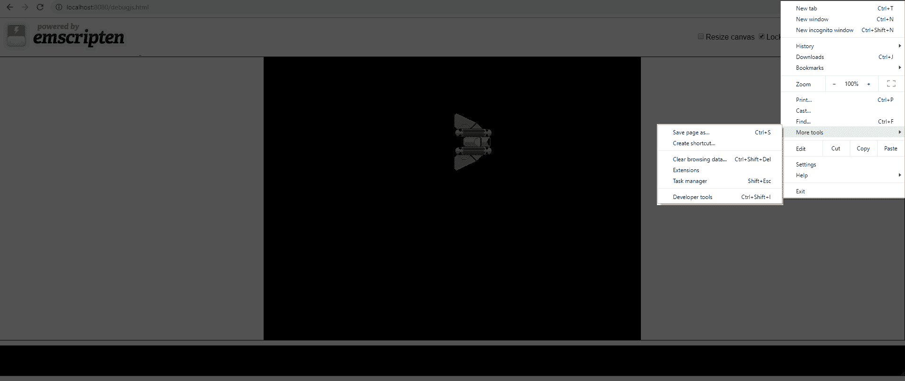

图 16.1：使用菜单打开 Chrome 开发者工具的屏幕截图

您可以通过浏览器左上角的菜单打开它，就像前面的屏幕截图中所示，或者您可以通过键盘上的*Ctrl* + *Shift* + *I*组合键打开开发者工具。在 Chrome 中加载您的`debug.html`文件时，您需要在开发者窗口中点击“源”选项卡。如果您在“源”选项卡上，应该看起来像这样：

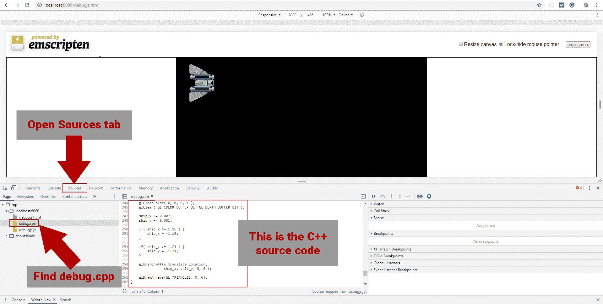

图 16.2：在 Chrome 开发者工具中使用源选项卡的屏幕截图

如果在“源”选项卡中看不到`debug.cpp`，可能需要点击顶部 URL 旁边的浏览器重新加载按钮来重新加载页面。正如我之前所说，界面感觉有点小问题，有时候 CPP 文件第一次加载不出来。希望在你阅读这篇文章时已经改变了。一旦选择了 CPP 文件，你应该能够在开发者工具窗口中间的代码窗口中看到我们的`debug.cpp`文件中的 C++代码。您可以通过单击代码行旁边的行号来在 C++代码中设置断点。然后，您可以使用“观察”变量上方的按钮逐步执行代码。尽管在撰写本文时观察变量不起作用，但您可能还是想尝试一下。WebAssembly 几乎每天都在改进，不断进行错误修复，所以在您阅读本文时，情况可能已经发生了变化。如果没有，您可以使用“本地”变量来了解一些值的变化。

您可以观察这些变量在您逐步执行源代码时被填充，经常可以确定哪些变量通过观察这些值的变化而更新。看一下下面的屏幕截图：

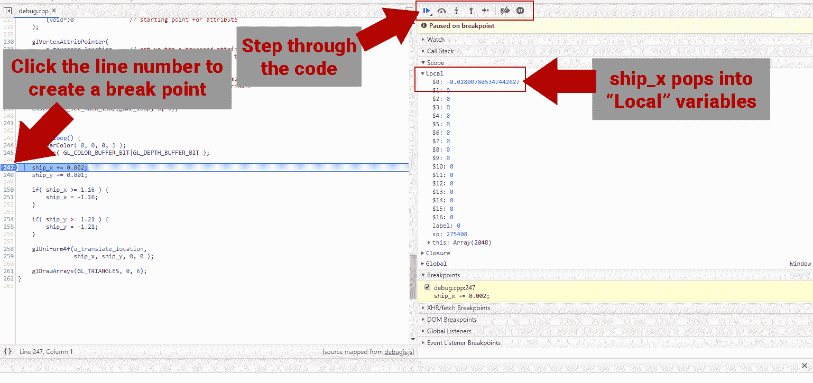

图 16.3：Chrome 浏览器中调试工具的屏幕截图

在撰写本文时，你需要点击“步过”按钮多次才能使 C++代码窗口中的行前进。在 Chrome 中，“步过”按钮每次点击会前进一个 WebAssembly 指令，而不是一个 C++指令。这可能在你阅读本文时已经改变，但如果你需要多次点击“步过”来前进代码，也不要感到惊讶。

# 使用 Firefox 进行调试

Firefox 与 Chrome 相比有一些优势和劣势。优势是，在 Firefox 中，你可以在 C++代码中每行点击一次“步过”按钮。劣势是，这使得跟踪响应你执行的行的本地变量更加困难。这些“本地”变量有点像寄存器，因此同一个变量可能会在几个寄存器中移动。如果你更关心跟踪代码流程而不是知道每个 WebAssembly 指令的值变化，那么 Firefox 在这方面要好得多。

要打开 Firefox 开发者工具，点击浏览器窗口右上角的菜单按钮，然后选择 Web 开发者：

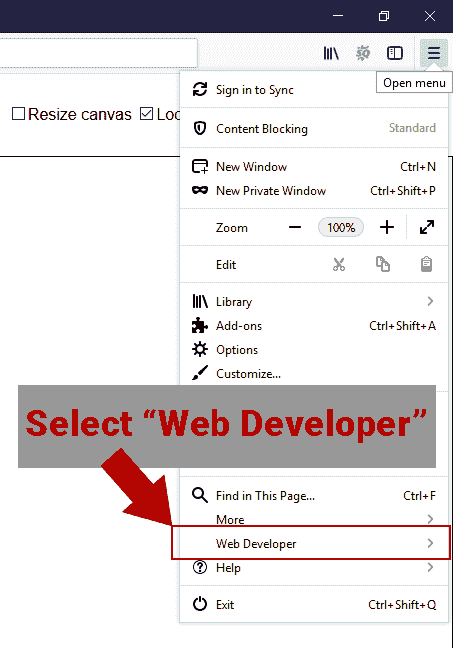

图 16.4：Firefox 浏览器中的 Web 开发者工具

在 Web 开发者菜单中，点击调试器菜单项打开调试器窗口：

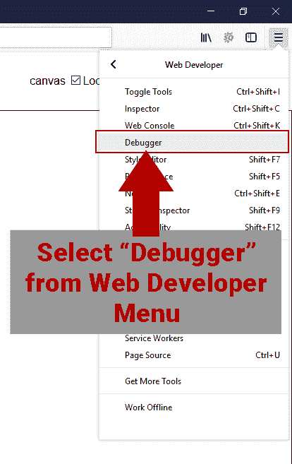

图 16.5：在 Firefox 中打开调试器的屏幕截图

不要通过菜单系统选择调试器，你可以使用快捷键*Ctrl* + *Shift* + *C*来打开检查器，然后从 Web 开发者窗口中选择调试器选项卡。当你在 Firefox 调试器中时，它看起来是这样的：

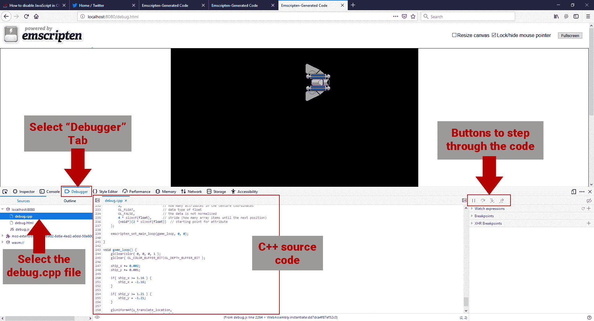

图 16.6：在 Firefox 浏览器中使用调试器的屏幕截图

目前，调试将需要结合使用调试宏和浏览器完全理解正在发生的情况。

# Firefox 开发者版

我简要提一下 Firefox 开发者版。如果你喜欢将 Firefox 作为你的主要 WebAssembly 开发浏览器，你可能会考虑使用 Firefox 开发者版。开发者版比标准版的 Firefox 更快地推出更新的 Web 开发者工具。因为 WebAssembly 是如此新颖，改进开发体验的更新可能会比标准版提前几周甚至几个月出现在开发者版中。在撰写本文时，两个版本之间没有显著差异，但如果你有兴趣尝试，可以在以下网址找到：[`www.mozilla.org/en-US/firefox/developer/`](https://www.mozilla.org/en-US/firefox/developer/)。

# 为 WebAssembly 进行优化

优化你的 WebAssembly 代码部分取决于决策和实验。它是关于发现对你的特定游戏或应用有效的方法。例如，当设计 WebAssembly 时，决定让 WebAssembly 字节码在虚拟堆栈机上运行。WebAssembly 的设计者做出了这个选择，因为他们认为可以通过显著减小字节码下载大小来证明性能的小损失。每段代码都有瓶颈。在 OpenGL 应用程序中，瓶颈将是与 GPU 的接口。你的应用程序的瓶颈可能是内存，也可能是 CPU 限制。一般来说，优化代码是关于确定瓶颈在哪里，并决定你想要做出什么权衡来改进事情。如果你优化下载大小，你可能会失去一些运行时性能。如果你优化运行时性能，你可能需要增加内存占用。

# 优化标志

Emscripten 为我们提供了大量的标志，以优化不同的潜在瓶颈。所有的优化标志都会导致不同程度的较长编译时间，因此在开发周期的后期才应该使用这些标志。

# 优化性能

我们可以使用`-O`标志进行一般优化。`-O0`、`-O1`、`-O2`和`-O3`提供了不同级别的编译时间和代码性能之间的权衡。`-O0`和`-O1`标志提供了最小的优化。`-O2`标志提供了大部分来自`-O3`标志的优化，但编译时间明显更短。最后，`-O3`提供了最高级别的优化，但编译时间比任何其他标志都要长得多，因此最好在接近开发结束时开始使用它。除了`-O`标志，`-s AGGRESSIVE_VARIABLE_ELIMINATION=1`也可以用于增加性能，但可能会导致更大的字节码下载大小。

# 优化大小

在前面的部分中我没有提到另外两个`-O`标志。这些标志用于优化字节码下载大小，而不是纯粹地优化性能。`-Os`标志所花费的时间大约和`-O3`一样长，并提供尽可能多的性能优化，但是为了更小的下载大小而牺牲了一些`-O3`的优化。`-Oz`类似于`-Os`，但通过牺牲更多的性能优化来进一步优化更小的下载大小，从而导致更小的字节码。另一种优化大小的方法是包括`-s ENVIRONMENT='web'`标志。只有在编译网页时才应该使用这个标志。它会删除用于支持其他环境（如 Node.js）的任何源代码。

# 不安全的标志

除了我们到目前为止一直在使用的安全优化标志之外，Emscripten 还允许使用两个*不安全*标志来提高性能，但可能会破坏您的代码。这些标志是高风险/高回报的优化，只有在大部分测试完成之前才应该使用。使用`--closure 1`标志会运行 Closure JavaScript 编译器，它会对我们应用程序中的 JavaScript 进行非常激进的优化。但是，除非您已经熟悉使用闭包编译器以及该编译器可能对 JavaScript 产生的影响，否则不应该使用`--closure 1`标志。第二个*不安全*标志是`--llvm-lto 1`标志，它在 LLVM 编译步骤中启用*链接时优化*。这个过程可能会破坏您的代码，因此在使用这个标志时要非常小心。

# 分析

分析是确定源代码中存在的瓶颈的最佳方法。当您对 WebAssembly 模块进行分析时，我建议在编译时使用`--profiling`标志。您也可以不使用它进行分析，但是您调用的所有模块函数都将被标记为`wasm-function`，这可能会使您的生活比必要的更加困难。在使用`--profile`标志编译代码后，在 Chrome 中打开一个新的*隐身*窗口。

您可以通过按下*CTRL + SHIFT + N*键，或者通过浏览器右上角的菜单来执行此操作：

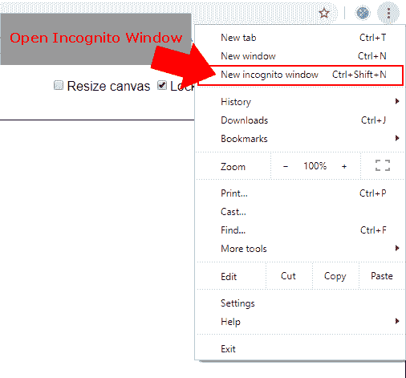

图 16.7：在 Chrome 浏览器中打开隐身窗口

在打开隐身窗口时，将阻止任何 Chrome 扩展在分析您的应用程序时运行。这将防止您不得不浏览这些扩展中的代码以找到您应用程序中的代码。打开隐身窗口后，按下*Ctrl* + *Shift* + *I*来检查页面。这将在浏览器窗口底部打开 Chrome 开发者工具。在 Chrome 开发者工具中，选择性能选项卡，如下面的截图所示：

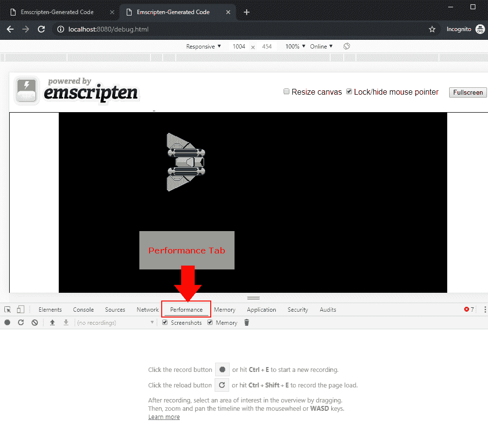

图 16.8：Chrome 浏览器中的性能选项卡

现在，点击记录按钮，让它运行几秒钟。记录了五六秒钟后，点击停止按钮停止分析：

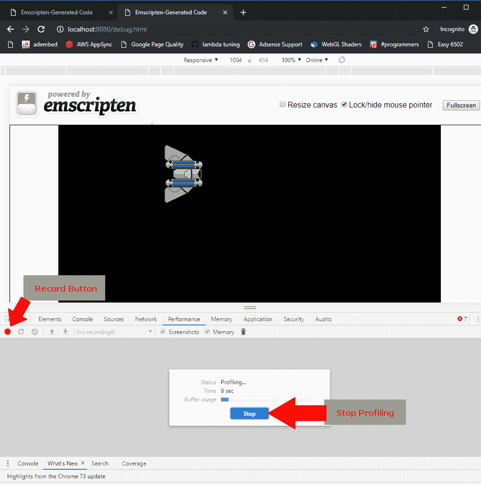

图 16.9：Chrome 浏览器中性能指标的录制屏幕截图

停止分析后，您将在性能窗口中看到数据。这称为摘要选项卡，并以饼图的形式显示应用程序在各种任务上花费的毫秒数。

正如您所看到的，我们的应用程序绝大部分时间都是空闲的：

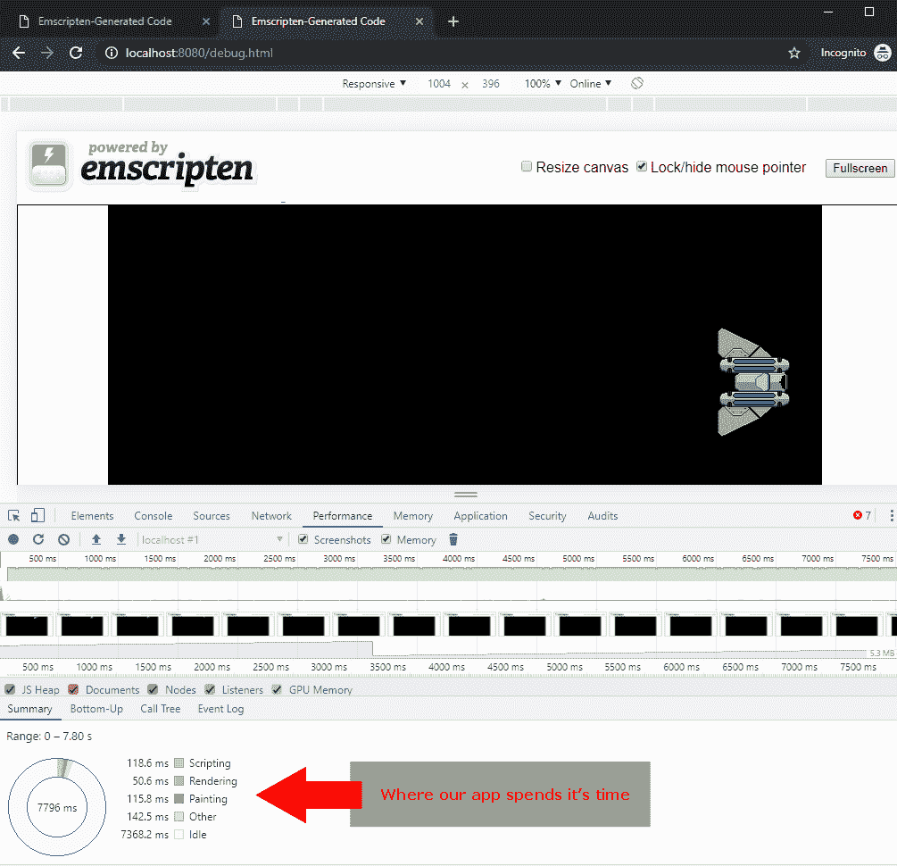

图 16.10：Chrome 浏览器中的性能概述

摘要很有趣。它可以告诉您在非常高的层次上瓶颈在哪里，但要评估我们的 WebAssembly，我们需要查看调用树选项卡。点击调用树选项卡，您将看到以下窗口：

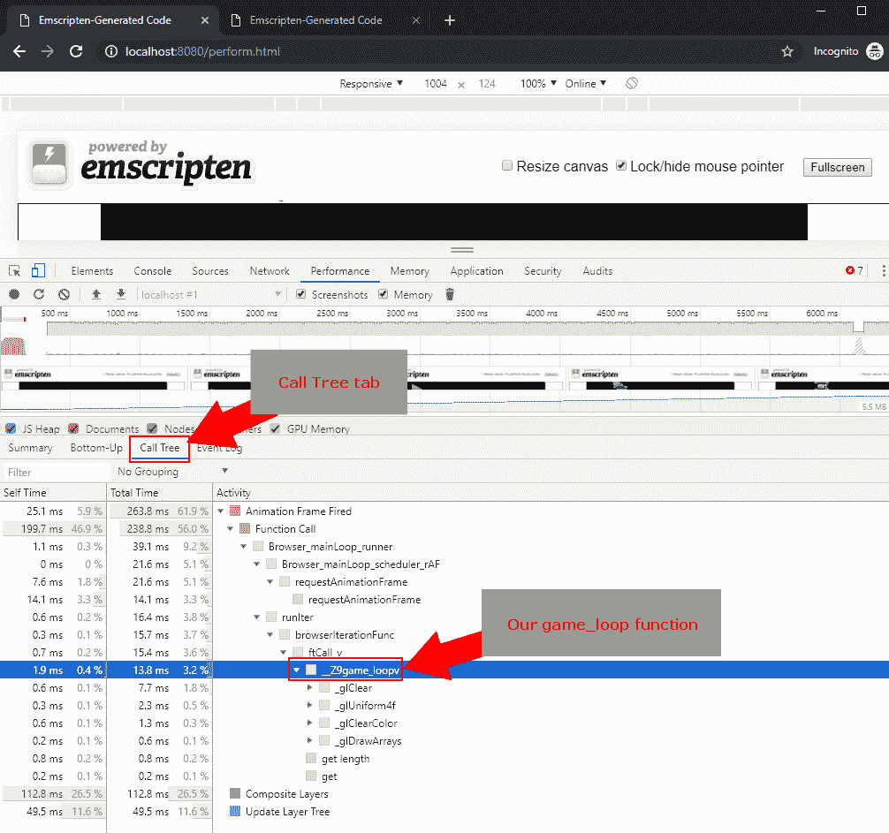

图 16.11：Chrome 浏览器中的调用树屏幕截图

因为我们的`game_loop`函数在每一帧都被调用，所以我们可以在`Animation Frame Fired`树中找到这个调用。向下钻取，寻找`game_loop`。当我们找到这个函数时，它被搞乱了，因为它是一个 C++函数。所以，我们看到的不是`_game_loop`，而是`_Z9game_loopv`，尽管你可能看到的搞乱的形式不同。如果你想要防止这种搞乱，你可以将这个函数包装在一个`extern "C"`块中。

您可以看到这个函数的执行总共占据了浏览器 CPU 时间的 3.2%。您还可以查看这个函数中的每个 OpenGL 调用。如果您看一下我们的游戏循环，超过一半的 CPU 时间都花在了`_glClear`上。对于这个应用程序来说，这不是问题，因为绝大多数的浏览器 CPU 时间都是空闲的。然而，如果我们的游戏循环函数占用了大部分 CPU 时间，我们就需要看看在这个函数中我们花费了多少时间。

# try/catch 块的问题

在撰写本文时，已知 try/catch 块会导致 WebAssembly 模块的显著性能问题，因此只有在绝对必要时才使用它们。您可能希望在开发阶段使用它们，并在发布时将它们移除。一些`-O`优化标志将删除 try/catch 块，如果您打算在生产中使用它们，您需要注意这一点。如果您想在生产版本中使用 try/catch 块，您需要使用`-s DISABLE_EXCEPTION_CATCHING=0`标志进行编译。这将告诉编译器不要从优化版本的字节码中删除 try/catch 块。如果您想从未优化的开发代码中删除 try/catch 块，您可以使用`-s DISABLE_EXCEPTION_CATCHING=1`标志。

# 为 WebAssembly 优化 OpenGL

重要的是要记住，从 WebAssembly 调用 OpenGL 时都是通过函数表调用 WebGL 的。这很重要的部分原因是因为每当您使用 OpenGL ES 和 WebGL 不可用的 OpenGL 功能时，Emscripten 必须对这些功能进行一些非常慢的软件模拟。还要记住，WebGL 调用比本地平台上的 OpenGL 调用更昂贵，因为 WebGL 是受沙箱保护的，浏览器在调用 WebGL 时会执行各种安全检查。Emscripten 为您提供了几个标志，允许您模拟 WebGL 中不可用的 OpenGL 和 OpenGL ES 调用。然而出于性能原因，除非绝对必要，不要使用这些功能。

# 尽可能使用 WebGL 2.0

WebGL 2.0 比 WebGL 1.0 更快，但在撰写本文时，支持它的浏览器要少得多。将您的 WebGL 1.0 代码编译为 WebGL 2.0 将使您获得约 7%的性能提升。但是，在选择这样做之前，您可能希望参考[`caniuse.com/#search=webgl2`](https://caniuse.com/#search=webgl2)来查看您的目标浏览器是否支持 WebGL 2.0。

# 最小化 OpenGL 调用次数

从 WebAssembly 调用 OpenGL 不像从本机编译的应用程序中进行相同调用那样快。从 WebAssembly 调用 OpenGL 相当于调用 WebGL 的模拟。WebGL 是为在 Web 浏览器中执行而构建的，并执行一些安全检查以验证我们没有要求 WebGL 执行任何恶意操作。这意味着在编写针对 WebAssembly 的 OpenGL 时，我们必须考虑到额外的开销。有些情况下，本机应用程序对 OpenGL 的两三次调用可能比将这些调用合并为单个 OpenGL 调用更快。然而，在 WebAssembly 中，将相同的代码压缩为单个 OpenGL 调用可能会更快。在优化 WebAssembly 时，尽量减少 OpenGL 调用，并使用分析器验证新代码是否更快。

# Emscripten OpenGL 标志

几个 Emscripten 链接器标志可能会对性能产生重大影响。其中一些标志是为了简化代码移植到 WebAssembly，但可能会导致性能问题。其他标志在适当条件下可以提高性能。

`-s FULL_ES2=1`和`-s FULL_ES3=1`链接器标志模拟整个 OpenGL ES 2.0/3.0 API。正如我之前提到的，默认情况下，WebAssembly 中的 OpenGL ES 2/3 实现仅支持与 WebGL 兼容的 OpenGL ES 2/3 的子集。这是因为 WebGL 在 WebAssembly 中进行渲染。您可能绝对需要 OpenGL ES 2/3 的某个默认不可用的功能。如果是这样，您可以使用`-s FULL_ES2=1`或`-s FULL_ES3=1`标志在软件中模拟该功能。这将会影响性能，因此在决定使用时要考虑这一点。

`-s LEGACY_GL_EMULATION=1`标志用于模拟使用固定功能管线的旧版本 OpenGL。也不建议使用此标志，因为会导致性能不佳。这个标志是为那些希望将旧代码移植到 WebAssembly 的人准备的。

如果您想要使用 WebGL 2 来获得与之相关的性能提升，请使用`-s USE_WEBGL2=1`链接器标志。如果您有为 WebGL 1.0 编写的代码，但想要获得 WebGL 2.0 的性能提升，您可以尝试编译为 WebGL 2.0，以查看您是否使用了在 WebGL 2.0 中不向后兼容的任何代码。如果使用此标志无法编译，则可以尝试`-s WEBGL2_BACKWARDS_COMPATIBILITY_EMULATION=1`链接器标志，这将允许您编译您的 WebGL 1.0 代码，以便您可以在 WebGL 2.0 中使用它。

# 总结

在本章中，我们讨论了不同的策略，可以用来调试和优化我们的 WebAssembly 代码。我们讨论了编写 C 宏，它们可以让我们在从开发转入生产时轻松地删除对控制台的打印调用。我们谈到了源映射，它们是什么，以及它们如何帮助我们在浏览器中调试我们的 WebAssembly 代码。我们讨论了如何在 Chrome 和 Firefox 中使用调试器来逐步执行 WebAssembly 的源代码。最后，我们讨论了 WebAssembly 中的优化，Emscripten 中可用的编译器选项，以及我们如何改进 WebGL 性能。

# 这就是结尾

恭喜！您应该已经在开发自己的 WebAssembly 游戏或应用程序的路上了。我希望您喜欢学习如何使用 WebGL 来构建 Web 游戏。如果您有任何问题、评论或只是想打个招呼，您可以在以下平台找到我：

+   **推特**: [`twitter.com/battagline`](https://twitter.com/battagline)

+   **领英**: [`www.linkedin.com/in/battagline/`](https://www.linkedin.com/in/battagline/)

+   **YouTube**: [`www.youtube.com/channel/UCaJYTBKp0vM1rLT82PcXwKQ`](https://www.youtube.com/channel/UCaJYTBKp0vM1rLT82PcXwKQ)
