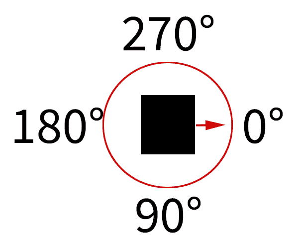
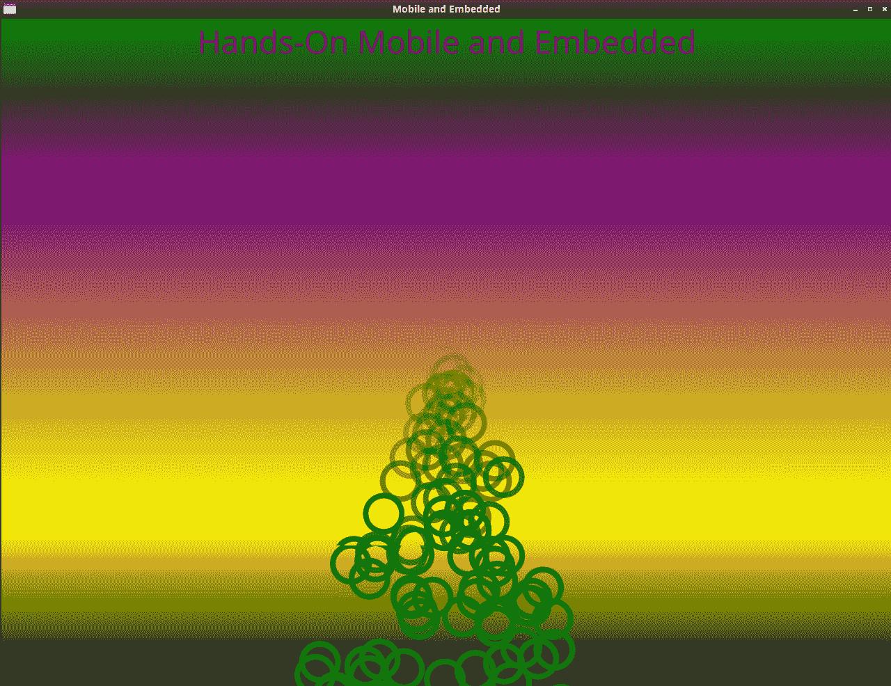
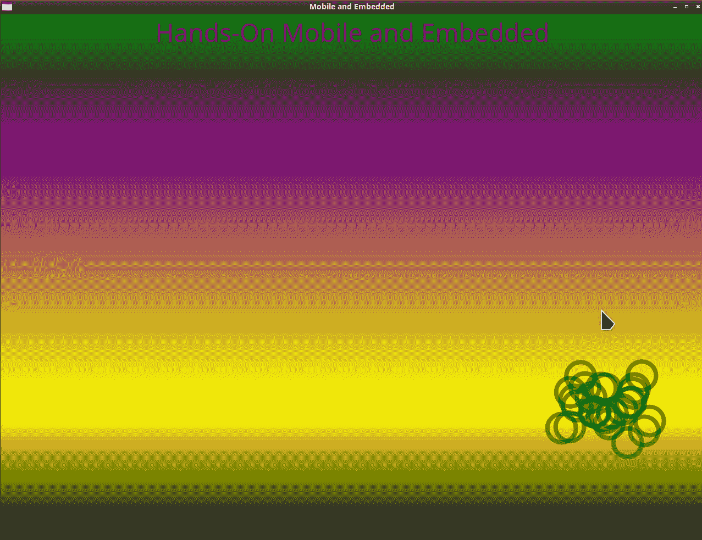
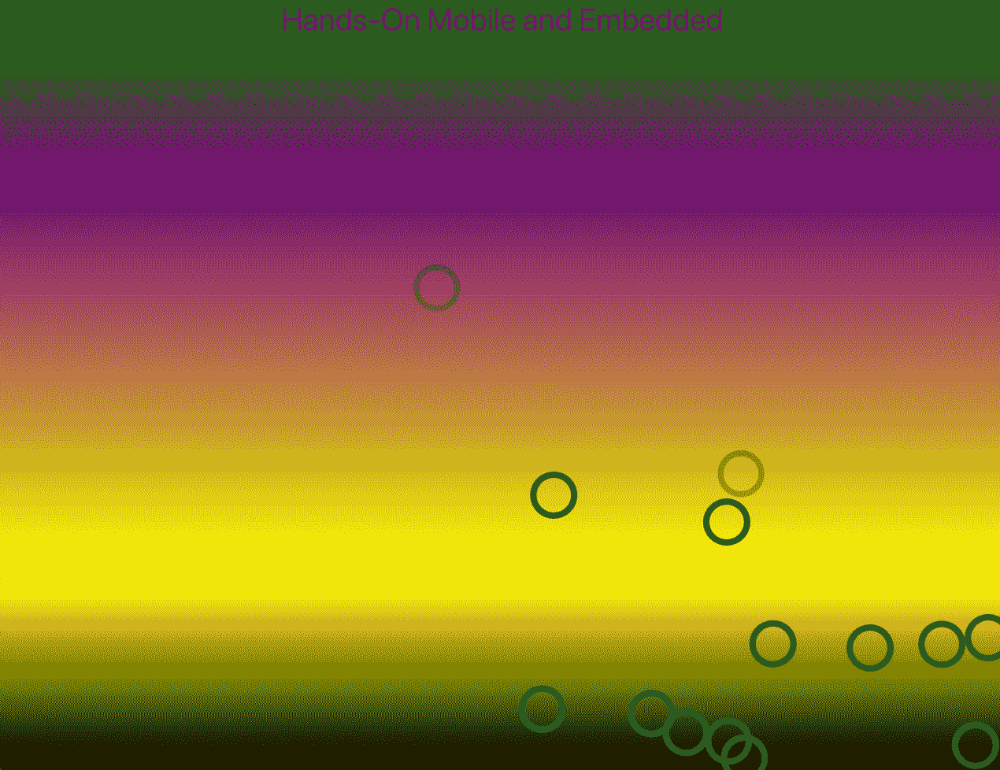
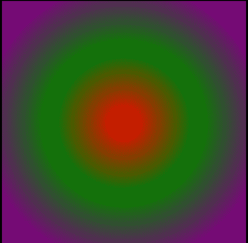
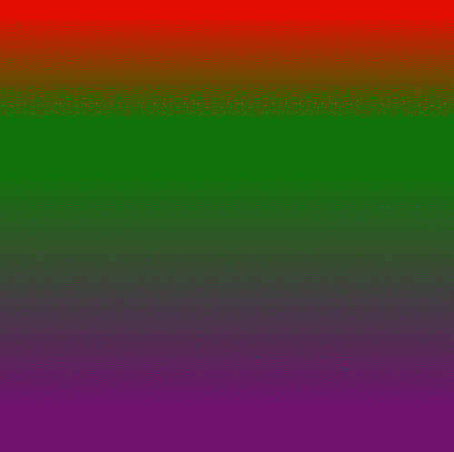
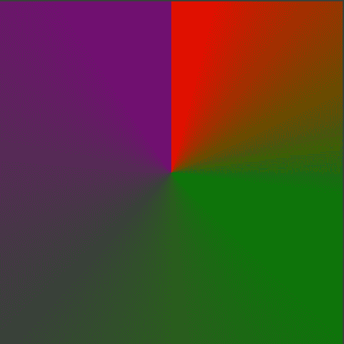

# 第三章：图形和特效

Qt Quick 通过使用粒子扩展了动画和特效。粒子和 Qt 图形特效可以使用户界面（**UI**）生动活泼，并在众多界面中脱颖而出。

Qt Quick 中的粒子系统允许大量图像或其他图形对象模拟高度活跃和混乱的动画和效果。使用粒子系统模拟下雪或爆炸着火变得更容易。这些元素的动态属性使动画更加生动。

使用 Qt 图形特效可以帮助使 UI 在视觉上更具吸引力，并使用户更容易区分图形组件。阴影、发光和模糊使二维对象看起来更像三维对象。

在本章中，我们将涵盖以下主题：

+   粒子宇宙

+   粒子 `画家`、`发射器` 和 `影响器`

+   Qt Quick 的图形特效

# 粒子宇宙

最后！我们终于到达了书中最有趣的部分，魔法就在这里发生。使用矩形、文本和按钮已经很好了，但粒子增加了活力和动感，同时为游戏增添了光影。它们还可以用来突出和强调感兴趣的项目。

粒子是一种由众多图形元素组成的动画，所有元素都以模糊的方式移动。有四个主要的 QML 组件可以使用：

+   `ParticleSystem`：维护粒子动画时间线

+   `发射器`：将粒子辐射到系统中

+   `画家`：这些组件绘制粒子。以下是各种组件：

    +   `ImageParticle`：使用图像的粒子

    +   `ItemParticle`：使用 QML 项目作为代理的粒子

    +   `CustomParticle`：使用着色器的粒子

+   `影响器`：改变粒子的属性

要了解我们如何管理所有这些项目，让我们看看主要的粒子管理器，即 `ParticleSystem`。

# ParticleSystem

`ParticleSystem` 组件维护粒子动画时间线。它是将所有其他元素连接在一起并作为操作中心的元素。您可以`暂停`、`恢复`、`重启`、`重置`、`开始`和`停止`粒子动画。

`画家`、`发射器` 和 `影响器` 都通过 `ParticleSystem` 相互交互。

在您的应用程序中可以存在多个 `ParticleSystem` 组件，每个组件都有一个 `Emitter` 组件。

让我们更深入地探讨一下关于粒子 `画家`、`发射器` 和 `影响器的细节。

# 粒子画家、发射器和影响器

Qt Quick 中的粒子是图形元素，如图像、QML 项目和 OpenGL 着色器。

它们可以被制作成以无数种方式移动和流动。

每个粒子都是 `ParticleGroup` 的一部分，默认情况下，它有一个空名称。`ParticleGroup` 是一组粒子画家，允许对分组粒子画家进行定时动画转换。

粒子发射的方向由 `Direction` 项目控制，这些项目由以下组件组成：`AngleDirection`、`PointDirection` 和 `TargetDirection`。

你可以使用的粒子画家类型只有几种，但它们几乎涵盖了你想用它们做的所有事情。Qt Quick 中可用的粒子类型如下：

+   `CustomParticle`：基于 OpenGL 着色器的粒子

+   `ImageParticle`：基于图像文件的粒子

+   `ItemParticle`：基于 QML 项目的粒子

`ImageParticle` 可能是最常见且最容易使用的，可以从 QML 支持的任何图像中创建。如果将要有很多粒子，最好使用小而优化的图像。

让我们检查一个简单的 `ItemParticle` 动画。我们将首先定义一个 `ParticleSystem` 组件，它有一个作为透明 `Rectangle` 元素定义的子 `ItemParticle` 动画，该元素有一个小的绿色边框和半径 65，这意味着它看起来像一个绿色圆圈。

实际上有两种类型的发射器——标准的 `Emitter` 类型，还有一种特殊的 `TrailEmitter` 类型，它从 `Emitter` 项目派生出来，但它的粒子是从其他粒子而不是其边界区域发射的。

使用 `SystemParticle` 组件将其 `system` 属性绑定到一个 `Emitter` 项目上，定义了一个 `Emitter` 项目。对于 `Emitter` 项目的 `velocity` 属性，我们使用 `AngleDirection`。`AngleDirection` 将发射的粒子指向一定角度。

QML 元素中的角度是顺时针方向的，从元素的右侧开始。以下是它的表示：



例如，设置 `AngleDirection` 为 90 将使粒子向下移动。

让我们深入一个粒子示例：

源代码可以在 Git 仓库的 `Chapter03-1` 目录下的 `cp3` 分支中找到。

1.  我们首先定义一个 `ParticleSystem`：

```cpp
    ParticleSystem {
        id: particelSystem
        anchors.fill: parent
```

1.  我们添加一个 `ItemParticle` 并将 `delegate` 定义为透明的 `Rectangle`。我们定义一个 `radius`，使其具有圆角，并指定它有一个小的绿色边框：

```cpp
        ItemParticle {
            delegate: Rectangle {
                height: 30; width: 30
                id: particleSquare
                color: "transparent"
                radius: 65
                border.color: "green"
                border.width: 4
            }
        }
    }
```

1.  我们定义一个 `Emitter` 并将其分配给 `ParticleSystem`：

```cpp
    Emitter {
        id: particles
        system: particleSystem
        anchors { horizontalCenter: parent.horizontalCenter; }
        y: parent.height / 2
        width: 10
        height: 10
        lifeSpan: 5000
        velocityFromMovement: 60
        sizeVariation: 15
        emitRate: 50

        enabled: false
```

1.  我们给 `Emitter` 一个 `AngleDirection` `velocity` 以增加方向上的变化：

```cpp
       velocity: AngleDirection {
            angle: 90
            magnitude: 150
            angleVariation: 25
            magnitudeVariation: 50
        }
    }
```

到目前为止，应用程序看起来是这样的：



让我们看看当发射器未居中时的样子：

1.  我们将 `Emitter` 属性，称为 `enabled`，绑定到 `false` 的值，以停止粒子持续发射。

1.  然后，我们将 `burst` 属性绑定到动画，通过鼠标点击来产生 `25` 个粒子的脉冲，如下所示：

```cpp
MouseArea {
    id: mousey
    anchors.fill: parent
    onClicked: {particles.burst(25) }
    hoverEnabled: true
 }
```

`Emitter` 组件的属性是动画开始时粒子的属性。

1.  我们将 `Emitter` 属性的 `x` 和 `y` 属性绑定到鼠标位置：

```cpp
        y: mousey.mouseY
        x: mousey.mouseX
```

1.  我们也可以移除 `horizontalCenter` 锚点，除非你希望粒子爆发始终在水平方向上居中。

这张图片显示了`Emitter`在水平方向未居中的情况：



要影响粒子在场景中发射时的行为，你需要一个`Affector`。让我们看看如何在下一节中如何使用`Affector`。

# 影响器

影响器是一种属性，它影响粒子流的模式。有几种类型的`affectors`可供选择：

+   `Age`：将提前终止粒子

+   `Attractor`：吸引粒子向一个点

+   `Friction`：根据粒子的速度减慢粒子

+   `Gravity`：以角度应用加速度

+   `Turbulence`：以流体方式应用噪声

+   `Wander`：随机粒子轨迹

还有`GroupGoal`和`SpriteGoal``affectors`。

`Affectors`是可选的，但在粒子发射后会增加其效果。

让我们考察一种使用这些项目的方法。

1.  我们将一个`Turbulence`项目作为子组件添加到`ParticleSystem`组件中。现在，粒子将随机飞舞，就像被风吹散的落叶：

```cpp
      Turbulence {
            anchors.fill: parent
            strength: 32
        }
```

1.  你可以有多个影响器。让我们添加一些`Gravity`，也！我们将使这个`Gravity`向上。`Gravity`有点像给一个项目在某个方向上施加重量：

```cpp
        Gravity {
            anchors.fill: parent
            angle: 270
            magnitude: 4
        }
```

这里是我们的`Turbulence`圆形示例的样子：



你可以在这里尝试 Qt for WebAssembly 版本：[`lpotter.github.io/particles/ch3-1.html`](https://lpotter.github.io/particles/ch3-1.html)。

我们也可以使粒子以特定方向流动，或以特定形状行动。

# 形状和方向

形状是一种可以用来影响影响器如何作用于特定区域的方法。

+   `EllipseShape`：作用于椭圆形状区域

+   `LineShape`：作用于一条线

+   `MaskShape`：作用于图像形状区域

+   `RectangleShape`：作用于矩形区域

粒子可以在某个方向上具有速度。有三种方法可以引导粒子：

+   `AngleDirection`

+   `PointDirection`

+   `TargetDirection`

从发射点开始，`AngleDirection`有四个属性——`angle`、`angleVariation`、`magnitude`和`magnitudeVariation`。正如我之前提到的，角度是以顺时针方向测量的，从`Emitter`项的右侧开始。`magnitude`属性指定每秒移动的速度（以像素为单位）。

`PointDirection`将`velocity`属性指向场景中的某个点，或者如果你喜欢，可以指向屏幕外。它需要`x`、`y`、`xVariation`和`yVariation`属性。

使用`TargetDirection`，你可以指示粒子向目标项发射，或者向目标`x`、`y`点发射。`TargetDirection`有一个新属性称为`proportionalMagnitude`，这使得`magnitude`和`magnitudeVariation`属性作为起始点和目标点之间距离的每秒倍数来操作。

粒子可以非常有趣，并为应用程序增添科幻元素。要使它们表现出你心中所想，需要进行一些实验，因为它们具有很大的随机性。

现在，让我们看看如何添加其他类型的图形效果。

# Qt Quick 的图形效果

当你通常想到模糊、对比度和发光等效果时，你可能会想到图像编辑软件，因为它们倾向于将这些效果应用于图像。Qt 图形效果可以将这些相同类型的效应应用于 QML UI 组件。

如果你使用 Qt Quick Scene Graph 软件渲染器，这些效果将不可用或不可用，因为该软件不支持这些效果。

Qt 图形效果有多种类型，每种类型都有各种子效果：

+   `Blend`

+   `Color`:

    +   `BrightnessContrast`

    +   `` `ColorOverlay` ``

    +   `Colorize`

    +   `Desaturate`

    +   `GammaAdjust`

    +   `HueSaturation`

    +   `LevelAdjust`

+   `Gradients`:

    +   `ConicalGradient`

    +   `LinearGradient`

    +   `RadialGradient`

+   `Displace`

+   `DropShadows`:

    +   `DropShadow`

    +   `InnerShadow`

+   `Blurs`:

    +   `FastBlur`

    +   `GaussianBlur`

    +   `MaskedBlur`

    +   `RecursiveBlur`

+   `MotionBlurs`:

    +   `DirectionalBlur`

    +   `RadialBlur`

    +   `ZoomBlur`

+   `Glows`:

    +   `Glow`

    +   `RectangularGlow`

+   `Masks`:

    +   `OpacityMask`

    +   `ThresholdMask`

现在，让我们继续探讨 `DropShadow` 作为最有用的效果之一是如何工作的。

# DropShadow

`DropShadow` 效果是一种可以使事物突出并看起来更有生命力的效果。它的用途在于，它将为原本平面的物体增加深度。

我们可以在上一个例子中的 `Text` 项上添加一个 `DropShadow` 效果。`horizontalOffset` 和 `verticalOffset` 属性描述了阴影在场景中的感知位置。`radius` 属性描述了阴影的焦点，而 `samples` 属性决定了模糊时每像素的样本数。

使用以下代码添加 `DropShadow` 并将其应用于 `Text` 组件：

```cpp
        Text {
            id: textLabel
            text: "Hands-On Mobile and Embedded"
            color: "purple"
            font.pointSize: 20
            anchors.top: parent.top
            anchors.horizontalCenter: parent.horizontalCenter
        }
        DropShadow {
            anchors.fill: textLabel
            horizontalOffset: 2
            verticalOffset: 2
            radius: 10
            samples: 25
            color: "white"
            source: textLabel
        }

```

源代码可以在 Git 仓库的 `Chapter03-2` 目录下的 `cp3` 分支中找到。

在这里，你可以看到字母现在下面有一个白色阴影：


它还有一个控制阴影锐度的 `spread` 属性。这仍然有点难以阅读，所以让我们试试别的。怎么样，一个 `Glow` 效果？

# Glow

`Glow` 是一种通过以下代码产生物体周围扩散颜色的效果：

```cpp
        Glow {
            anchors.fill: textLabel
            radius: 10
            samples: 25
            color: "lightblue"
            source: textLabel
        }
```

效果在下面的屏幕截图中显示。注意漂亮的浅蓝色发光效果：


现在更像了！我们甚至可以给 `Glow` 效果添加自己的阴影！将 `DropShadow`、`anchors.fill` 和 `source` 属性更改为 `glow`：

```cpp
        DropShadow {
            anchors.fill: glow
            horizontalOffset: 5
            verticalOffset: 5
            radius: 10
            samples: 25
            color: "black"
            source: glow
        }
```

让我们把 `horizontalOffset` 和 `verticalOffset` 属性也稍微调大一些。

我们现在的横幅看起来是这样的：


`DropShadows` 对于使某物从场景中脱颖而出非常出色。渐变是另一种要使用的效果。

# 渐变

`梯度`可以吸引用户的注意力，将他们引入 UI 界面，并与他们的情感相连接。Qt 图形效果内置了对三种类型的梯度支持——`锥形`、`线性`和`径向`。

`径向梯度`，或者更确切地说，任何 QML 梯度，由一系列`GradientStop`项目组成，这些项目指定了颜色以及在梯度周期中从哪里开始，数字零代表开始点，而一代表终点。

下面是表示`径向梯度`的代码：

```cpp
    Item {
        width: 250; height: 250
        anchors.horizontalCenter: parent.horizontalCenter
        anchors.verticalCenter: parent.verticalCenter
        RadialGradient {
            anchors.fill: parent
            gradient: Gradient {
                GradientStop { position: 0.0; color: "red" }
                GradientStop { position: 0.3; color: "green" }
                GradientStop { position: 0.6; color: "purple" }
            }
        }
    }
```

源代码可以在 Git 仓库的`Chapter03-4`目录下的`cp3`分支中找到。

以下是我们`径向梯度`的图示：



这个`径向梯度`使用三个`GradientStop`项目来告诉梯度某种颜色应该从哪里开始。`position`属性是一个从`0.0`到`1.0`的`qreal`值；尽管大于`1.0`的数字不会产生错误，但它将简单地不会绘制在边界项中。

使用与`径向梯度`相同的颜色停止方案，我们看到`线性梯度`和`锥形梯度`的外观。

以下是对`线性梯度`的表示：



以下是对`锥形梯度`的表示：



您可以看到这些梯度之间的差异。

# 模糊

`模糊`效果可以帮助降低或强调静态图像。最快的`模糊`效果是名为`FastBlur`的效果，但`高斯模糊`效果质量最高，因此渲染速度最慢。

所有的`模糊`效果都有`radius`、`samples`和`source`属性。`Radius`代表影响`模糊`效果的像素距离，数值越大，`模糊`效果越强。`samples`属性代表应用效果时每个像素使用的样本数。数值越大意味着质量越好，但渲染时间会变慢。`Source`是应用`模糊`效果的目标项。

`Displace`是一种`模糊`效果，但具有更多可能的水印效果。`displacementSource`属性是放置在源项上的项。`displacement`属性是一个介于-1.0 和 1.0 之间的`qreal`值，其中 0 表示没有像素位移。

# 摘要

Qt Quick 提供了非常容易开始使用的图形和特殊效果。特别是粒子，非常适合游戏应用。您现在知道如何使用`ParticleSystem`通过`AngleDirection`在特定角度发射`ImageParticle`。我们探讨了`Affectors`（如`Turbulence`）如何通过向粒子流添加变化来影响`Emitter`。

`梯度`、`发光`和`阴影`对于强调某些项目非常有用。`模糊`效果用于模拟运动动作或向图像添加水印。

在下一章中，我们将深入探讨在手机上现在无处不在的功能——触摸输入。我还会涉及到（字面意义上的“触及”）使用其他形式的输入，例如当没有硬件键盘时，你的应用需要启动的情况。
