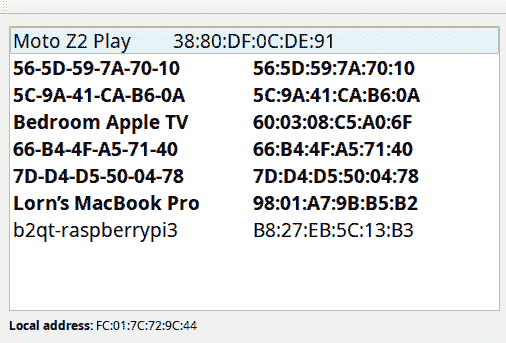
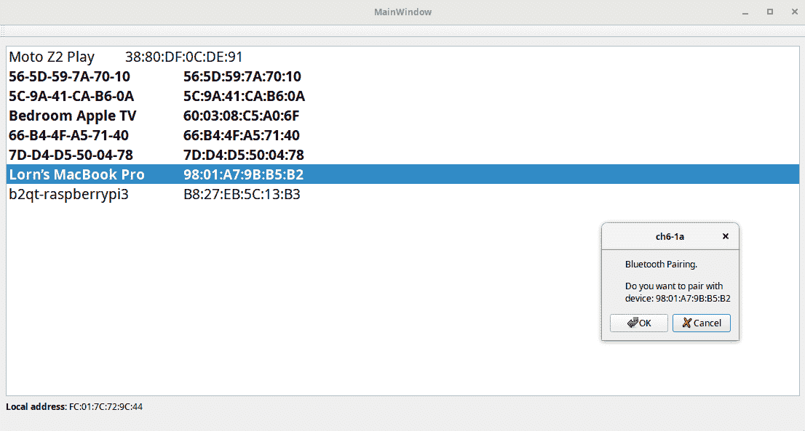

# 第六章：使用 Qt 蓝牙 LE 进行连接

您将学习如何使用 Qt 蓝牙**低功耗**（**LE**）来建立与具有 LE 蓝牙无线电的设备的连接。蓝牙不仅仅是鼠标、键盘和音频。设备发现、数据交换以及涉及蓝牙低功耗的其他任务将被检查。我们将使用`QBluetoothUuid`、`QBluetoothCharacteristic`、`QLowEnergyController`和`QLowEnergyService`类。

本章将涵盖以下主题：

+   什么是蓝牙低功耗

+   发现和连接设备

+   广播服务

+   从远程设备检索传感器数据

# 什么是低功耗蓝牙？

**蓝牙低功耗**（**BLE**），也称为蓝牙智能，最初由诺基亚在 Wibree 的名称下开发，并于 2006 年首次发布。它集成到蓝牙 4.0 规范中，并于 2010 年发布。

蓝牙是一种无线连接技术，它工作在 2.4 GHz 频段的 2,400-2,483.5 MHz 范围内。它可以选择 79 个数据通道来传输数据包。BLE 将数据通道限制为 40 个。

BLE 针对的是需要低功耗的移动和嵌入式设备。与蓝牙不同，BLE 是为定期交换少量数据的设备设计的，而常规蓝牙是为连续数据流设计的。最重要的是，BLE 有一个睡眠模式，用于节省电力。

Qt 在 Qt Connectivity 模块中支持 BLE，同时还有**近场通信**（NFC）。BLE 有许多配置文件和服务：

+   提醒

+   电池

+   健身

+   健康

+   HID

+   互联网

+   网状网络

+   传感器

**通用属性**（**GATT**）用于存储配置文件、服务、特性和其他数据。每个条目都有一个唯一的 16 位 ID。BLE 连接是专一的，它一次只能连接到一台计算机。BLE 外围设备被称为 GATT 服务器，与之连接的计算机是 GATT 客户端。

每个配置文件可以有多个服务。每个服务可以有多个特性。配置文件只是规范中预定义服务的集合。

服务是一组由唯一的 16 或 128 位 ID 定义的特性。特性是一个单一的数据点，可能包含一个数据数组，例如加速度计。

现在您已经了解了一些背景知识，让我们开始吧。

# 实现 BLE GATT 服务器

我想我们真的需要一个 BLE 服务器了。

假设您有一个带有几个环境传感器（如湿度和温度）的嵌入式设备。您需要偶尔通过蓝牙将此数据发送到另一台手持设备。在嵌入式传感器设备上，您需要设置设备。设置 BLE 服务器的基本步骤如下：

1.  提供广告数据（`QLowEnergyAdvertisingData`）

1.  提供特性数据（`QLowEnergyCharacteristicData`）

1.  设置服务数据（`QLowEnergyServiceData`）

1.  开始广告并监听连接

# QLowEnergyAdvertisingData

`QLowEnergyAdvertisingData`是用于告诉服务器数据和数据如何呈现的类。

这是我们如何使用`QLowEnergyAdvertisingData`的方式。

构造一个`QLowEnergyAdvertisingData`对象：

```cpp
QLowEnergyAdvertisingData *leAdd = new QLowEnergyAdvertisingData;
```

设置`Discoverability`选项:

```cpp
leAdd->setDiscoverability(
QLowEnergyAdvertisingData::DiscoverabilityGeneral);
```

为我们的服务设置一个`Name`:

```cpp
leAdd->setLocalName("SensorServer");
```

添加我们感兴趣的服务的列表：

```cpp
QList<QBluetoothUuid> servicesList 
<< QBluetoothUuid::EnvironmentalSensing;
leAdd->setServices(servicesList);
```

源代码可以在 Git 仓库的`Chapter06-1`目录下的`cp6`分支中找到。

现在我们需要创建一些特征数据。让我们创建一个处理温度的`Characteristic`，因此我们将它的`uuid`设置为`TemperatureMearurement`。我们还需要让它能够配置通知。

# QLowEnergyCharacteristicData

`QLowEnergyCharacteristicData`代表一个**通用属性配置文件**（**GATT**）特征，它定义了蓝牙传输中的单个数据点。你用它来设置服务数据：

```cpp
QLowEnergyCharacteristicData chData;
chData.setUuid(QBluetoothUuid::TemperatureMeasurement);
chData.setValue(QByteArray(2,0));
chData.setProperties(QLowEnergyCharacteristic::Notify);
const QLowEnergyDescriptorData descriptorData(QBluetoothUuid::ClientCharacteristicConfiguration, QByteArray(2, 0));
chData.addDescriptor(descriptorData);
```

# QLowEnergyServiceData

在这里，我们将`Temperature`服务数据设置为`Primary`服务，并将`Characteristic`添加到`service`中：

```cpp
QLowEnergyServiceData serviceData;
serviceData.setUuid(QBluetoothUuid::Temperature);
serviceData.setType(QLowEnergyServiceData::ServiceTypePrimary);
serviceData.addCharacteristic(chData);
```

现在，让我们提供温度数据。我们使用`TemperatureMeasurement`类型构造`QLowEnergyCharacteristic`，并向它提供一些数据。第一个位指定我们提供的是摄氏度的`temperature`单位：

```cpp
QLowEnergyCharacteristic characteristic = service->characteristic(QLowEnergyCharacteristic::TemperatureMeasurement);
quint8 temperature = 35;

QByteArray currentTempValue;
value.append(char(0));
value.append(char(temperature));
service->writeCharacteristic(characteristic, currentTempValue);
```

我们现在已经设置好了，现在我们只需要开始`Advertising`来监听连接：

```cpp
controller->startAdvertising(QLowEnergyAdvertisingParameters(), leAdd, leAdd);
```

# 发现和配对性 - 搜索和连接 BLE 设备

你需要做的第一件事是搜索设备，这被称为发现。它包括将蓝牙设备置于搜索或发现模式。然后你会收到一个设备地址列表，你可以通过连接或配对来访问和共享数据。

让我们看看在 Qt 中使用`QBluetoothDeviceDiscoveryAgent`是如何实现的。

# QBluetoothDeviceDiscoveryAgent

`QBluetoothDeviceDiscoveryAgent`类负责设备发现搜索。当找到任何蓝牙设备时，它将发出`deviceDiscovered`信号：

```cpp
QBluetoothDeviceDiscoveryAgent *discoveryAgent = new QBluetoothDeviceDiscoveryAgent(this); connect(discoveryAgent, SIGNAL(deviceDiscovered(QBluetoothDeviceInfo)),
          this, SLOT(newDevice(QBluetoothDeviceInfo)));
discoveryAgent->start(QBluetoothDeviceDiscoveryAgent::LowEnergyMethod));
```

源代码可以在 Git 仓库的`Chapter06-1a`目录下的`cp6`分支中找到。

调用`start()`将启动发现过程。`QBluetoothDeviceDiscoveryAgent::LowEnergyMethod`参数将设置一个过滤器，仅发现`LowEnergy`设备。一旦找到你想要的设备，你可以调用`stop()`来停止设备搜索。

你可以通过连接到错误信号（`QBluetoothDeviceDiscoveryAgent::Error error`）来等待错误。

`QBluetoothDeviceDiscoveryAgent`类中的`error`信号是重载的，因此需要特别注意才能连接到该信号。Qt 提供了`QOverload`，可以像这样实现：

```cpp
connect(discoveryAgent, QOverload<QBluetoothDeviceDiscoveryAgent::Error>::of(&QBluetoothDeviceDiscoveryAgent::error), this, &SomeClass::deviceDiscoveryError);
```

如果你希望一次性获取所有设备的列表，请连接到`Finished`信号并使用`discoveryDevices()`调用，该调用返回`QList <QBluetoothDeviceInfo>`:



你可能想要检查远程设备的配对状态，因此调用`QLocalBluetoothDevice`的`pairingStatus`。

你可以通过调用`QBluetoothLocalDevice`的`requestPairing`函数，并传入远程蓝牙设备的`QBluetoothAddress`来与设备配对：

```cpp
SomeClass::newDevice(const QBluetoothDeviceInfo &info)
{
    QBluetoothLocalDevice::Pairing pairingStatus = localDevice->pairingStatus(info.address()); 
    if (pairingStatus == QBluetoothLocalDevice::Unpaired) {
        QMessageBox msgBox; 
        msgBox.setText("Bluetooth Pairing."); 
        msgBox.setInformativeText("Do you want to pair with device: " + item->data(Qt::UserRole).toString()); 
        msgBox.setStandardButtons(QMessageBox::Ok | QMessageBox::Cancel); 
        msgBox.setDefaultButton(QMessageBox::Cancel); 
        int ret = msgBox.exec(); 
        if (ret == QMessageBox::Ok) { 
            qDebug() << Q_FUNC_INFO << "Pairing..."; 
            localDevice->requestPairing(address, QBluetoothLocalDevice::Paired); 
     } 

    }
}
```

我们的示例应用在执行`requestPairing`过程之前要求配对设备：



你可以调用`QBluetoothLocalDevice`上的`requestPairing`，并传入你想要配对的设备的`QBluetoothAddress`。让我们看看`QBluetoothLocalDevice`。

# QBluetoothLocalDevice

`QBluetoothLocalDevice`代表设备上的蓝牙。你使用这个类来启动与其他设备的配对，同时也用于处理来自远程蓝牙设备的配对请求。它有几个信号来帮助完成这些操作：

+   `pairingDisplayConfirmation`：这是一个远程设备请求显示 PIN 并询问两个设备上是否相同的信号。你必须在使用`QBluetoothLocalDevice`时调用`pairingConfirmation`并传入`true`或`false`。

+   `pairingDisplayPinCode`：这是一个请求输入 PIB。

+   `pairingFinished`：配对成功完成。

我们然后连接到这些信号，如果用户在点击 OK 按钮时允许这样做：

```cpp
        if (ret == QMessageBox::Ok) { 

            connect(localDevice, &QBluetoothLocalDevice::pairingDisplayPinCode, this, &MainWindow::displayPin);     
            connect(localDevice, &QBluetoothLocalDevice::pairingDisplayConfirmation, this, &MainWindow::displayConfirmation);     
            connect(localDevice, &QBluetoothLocalDevice::pairingFinished, this, &MainWindow::pairingFinished);     
            connect(localDevice, &QBluetoothLocalDevice::error, this, &MainWindow::pairingError);

            localDevice->requestPairing(address, QBluetoothLocalDevice::Paired); 
        }
```

当远程设备只需要 PIN 确认时，会调用`pairingDisplayConfirmation`信号：

```cpp
SomeClass::displayConfirmation(const QBluetoothAddress &address, const QString &pin)
{
    QMessageBox msgBox; 
    msgBox.setText("Confirm pin"); 
    msgBox.setInformativeText("Confirm the pin is the same as on the device.");
    msgBox.setStandardButtons(QMessageBox::Ok | QMessageBox::Cancel);
    msgBox.setDefaultButton(QMessageBox::Cancel);
    int ret = msgBox.exec(); 
    if (ret == QMessageBox::Ok) {
        localDevice->pairingConfirmed(true);
     } else {
        localDevice->pairingConfirmed(false);
    }
}
```

当远程设备需要用户输入 PIN 时，会调用`pairingDisplayPinCode`信号，并带上要在远程设备上显示和输入的 PIN：

```cpp
SomeClass::displayPin(const QBluetoothAddress &address, const QString &pin) {
{
    QMessageBox msgBox; 
    msgBox.setText(pin);
    msgBox.setInformativeText("Enter pin on remote device"); 
    msgBox.setStandardButtons(QMessageBox::Ok); 
    msgBox.exec(); 
}
```

在另一边，为了接收配对，你需要将`QBluetoothLocalDevice`置于`Discoverable`模式：

```cpp
   localDevice->setHostMode(QBluetoothLocalDevice::HostDiscoverable);
```

设备可以被处于蓝牙`Discovery`模式的其他设备看到。

# 指定和获取客户端数据

一旦你连接到 BLE 设备的外围设备，你需要发现其特性才能读取和写入它们。你可以通过使用`QLowEnergyController`来完成这个操作。让我们看看`QLowEnergyController`是什么。

# QLowEnergyController

`QLowEnergyController`是访问本地和远程 BLE 设备的中心位置。

可以通过使用静态函数`QLowEnergyController::createPeripheral(QObject *parent)`来创建本地的`QLowEnergyController`。

通过调用静态类`QLowEnergyController::createCentral`并使用你在发现远程设备时收到的`QBluetoothDeviceInfo`对象来创建表示远程设备的`QLowEnergyController`对象：

`QLowEnergyController`对象有几个信号：

+   `discoveryFinished`

+   `serviceDiscovered`

+   `connected`

+   `disconnected`

连接到`connected`信号，并通过调用`connectToDevice()`开始连接：

```cpp
SomeClass::newDevice(const QBluetoothDeviceInfo &device) 
{
    QLowEnergyController *controller = new QLowEnergyController(device.address());
    connect(controller, &QLowEnergyController::connected, this, &SomeClass::controllerConnected);

    controller->connectToDevice();
}

SomeClass::controllerConnected()
{
    QLowEnergyController *controller = qobject_cast<QLowEnergyController *>(sender());
    if (controller) {
        connect(controller, &QLowEnergyController::serviceDiscovered, this, &SomeClass::newServiceFound);
        controller->discoverServices();
}
```

一旦设备连接成功，就是时候发现它的服务了，因此我们连接到`serviceDiscovered`信号，并通过调用`discoverServices()`来启动服务发现。

# QLowEnergyService

您还可以连接到 `discoveryFinished()` 信号，该信号通过调用 `services()` 返回发现的服务的列表。使用这两种方法中的任何一种，您都将获得属于该服务的 `QBluetoothUuid`，然后您可以使用它创建一个 `QLowEnergyService` 对象：

```cpp
SomeClass::newServiceFound(const QBluetoothUuid &gatt)
{
    QLowEnergyController *controller = qobject_cast<QLowEnergyController *>(sender());
    QLowEnergyService *myLEService = controller->createServiceObject(gatt, this);
}
```

我们现在有一个 `QLowEnergyService` 对象，它提供了关于它的详细信息。我们只能在它的状态变为 `ServiceDiscovered` 时读取其服务详情，因此现在调用服务的 `discoverDetails()` 函数以启动发现过程：

```cpp
   QLowEnergyService *myLEService = controller->createServiceObject(gatt, this);
    connect(myLEService, &QLowEnergyService::stateChanged, this, &SomeClass::serviceStateChanged);
    myLEService->discoverDetails();
```

让我们看看 `QLowEnergyCharacteristic`。

# QLowEnergyCharacteristic

一旦发现服务详情或 `characteristics`，我们就可以使用 `QLowEnergyCharacteristic` 来执行操作，例如启用通知：

```cpp
void SomeClass::serviceStateChanged(QLowEnergyService::ServiceState state))
{
    if (state != QLowEnergyService::ServiceDiscovered)
        return;
    QLowEnergyService *myLEService = qobject_cast<QLowEnergyService *>(sender());
    QList <QLowEnergyCharacteristic> characteristics = myLEService->characteristics();

}
```

使用 `QLowEnergyCharacteristic`，我们可以获取一个 `QLowEnergyDescriptor`，我们用它来启用或禁用通知。

有时，远程设备上的 `characteristic` 也需要被写入，例如启用特定的传感器。在这种情况下，您需要使用服务的 `writeCharacteristic` 函数，其中 `characteristic` 作为第一个参数，要写入的值作为第二个参数：

```cpp
QLowEnergyCharacteristic *movementCharacteristic = myLEService->characteristic(someUuid);
myLEService->writeCharacteristic(movementCharacteristic, QLowEnergyCharacteristic::Read);
```

写入 `QLowEnergyDescriptor` 与此类似；让我们看看。

# QLowEnergyDescriptor

根据蓝牙规范，描述符被定义为描述特征值的属性。它包含有关特征的一些附加信息。`QLowEnergyDescriptor` 封装了一个 GATT 描述符。当发生变化时，描述符和特征可以具有通知。

要启用通知，我们可能需要向描述符写入一个值。这里有一些可能的值：

| **GATT 术语** | **描述** | **值** | **Qt 常量** |
| --- | --- | --- | --- |
| 广播 | 允许广播 | `0x01` | `QLowEnergyCharacteristic::Broadcasting` |
| 读取 | 允许读取 | `0x02` | `QLowEnergyCharacteristic::Read` |
| 无响应写入 | 允许带任何响应的写入 | `0x04` | `QLowEnergyCharacteristic::WriteNoResponse` |
| 写入 | 允许带响应的写入 | `0x08` | `QLowEnergyCharacteristic::Write` |
| 通知 | 允许通知 | `0x10` | `QLowEnergyCharacteristic::Notify` |
| 指示 | 允许带客户端确认的通知 | `0x20` | `QLowEnergyCharacteristic::Indicate` |
| 认证签名写入 | 允许签名写入 | `0x40` | `QLowEnergyCharacteristic::WriteSigned` |
| 扩展属性 | 排队写入和可写辅助设备 | `0x80` | `QLowEnergyCharacteristic::ExtendedProperty` |

通知和指示之间的区别在于，使用指示时，服务器要求客户端确认它已收到消息，而使用通知时，服务器不关心客户端是否收到。

Qt 目前不支持使用带认证的签名写入 (`0x40`) 与 Qt 一起使用，也不支持使用指示 (`0x20`)。

我们希望在特征值改变时得到通知。为了启用此功能，我们需要将 `0x10` 或 `QLowEnergyCharacteristic::Notify` 的值写入 `descriptor`：

```cpp
for ( const QLowEnergyCharacteristic character :  characteristics) {
    QLowEnergyDescriptor descriptor = character.descriptor(QBluetoothUuid::ClientCharacteristicConfiguration);
    connect(myLEService, &QLowEnergyService::characteristicChanged, this, &SomeClass::characteristicUpdated);
    myLEService->writeDescriptor(descriptor, QByteArrayLiteral("\x01\x00"));
}
```

或者我们可以使用预定义的 `QLowEnergyCharacteristic::Notify`，如下所示：

```cpp
myLEService->writeDescriptor(descriptor, QLowEnergyCharacteristic::Notify));
```

现在，我们终于可以从我们的蓝牙低功耗设备中获取值了：

```cpp
void SomeClass::characteristicUpdated(const QLowEnergyCharacteristic &ch, const QByteArray &value)
{
    qWarning() << ch.name() << "value changed!" << value;
}
```

# Bluetooth QML

有一些蓝牙 QML 组件可以作为客户端使用，用于扫描和连接到蓝牙设备。它们简单但功能性强。

源代码可以在 Git 仓库的 `Chapter06-2` 目录下的 `cp6` 分支中找到。

1.  将 `bluetooth` 模块添加到你的 `pro` 文件中：

```cpp
QT += bluetooth
```

1.  在你的 `qml` 文件中，使用 `QtBluetooth` 导入：

```cpp
import QtBluetooth 5.12
```

最重要的元素是 `BluetoothDiscoveryModel`。

# BluetoothDiscoveryModel

`BluetoothDiscoveryModel` 提供了附近可用蓝牙设备的数据模型。您可以在各种基于模型的 Qt Quick 组件中使用它，例如 `GridView`、`ListView` 和 `PathView`。设置 `discoveryMode` 属性告诉本地蓝牙设备服务发现的级别，这以下是以下之一：

+   `FullServiceDiscovery`: 发现所有设备的所有服务

+   `MinimalServiceDiscovery`: 最小发现仅包括设备和 UUID 信息

+   `DeviceDiscovery`: 仅发现设备，不发现服务

根据需要发现的服务的数量，发现过程将需要各种不同的时间。为了加快特定设备的发现速度，你可以将 `discoveryMode` 属性设置为 `BluetoothDiscoveryModel.DeviceDiscovery`，这将允许你发现目标设备地址。在下面的示例中，我已经注释掉了设备的蓝牙地址，这样当你运行它时至少会显示一些设备：

```cpp
BluetoothDiscoveryModel {
    id: discoveryModel
    discoveryMode: BluetoothDiscoveryModel.DeviceDiscovery
    onDeviceDiscovered: {
        if (/*device == "01:01:01:01:01:01" && */ discoveryMode == BluetoothDiscoveryModel.DeviceDiscovery) {
            discoveryModel.running = false
            discoveryModel.discoveryMode = BluetoothDiscoveryModel.FullServiceDiscovery
            discoveryModel.remoteAddress = device
            discoveryModel.running = true     
        }
    }   
}
```

要发现所有附近设备的所有服务，将 `discoveryMode` 设置为 `BluetoothDiscoveryModel.FullServiceDiscovery`。如果你使用设备地址设置了 `remoteAddress` 属性，你可以针对该特定设备。然后你必须切换 `running` 属性从关闭到打开以启动新的扫描。

我们有一个基本的数据模型，但我们需要一个地方来显示它。Qt Quick 有几个选项用于查看模型数据：

+   `GridView`

+   `ListView`

+   `PathView`

`PathView` 最好使用 Qt Creator QML 设计器编写，因为你可以直观地调整其路径。

为了简单起见，我们选择 `ListView`，尽管我真的很想使用 `PathView`：

```cpp
ListView {
    id: mainList
    anchors.top: busy.bottom
    anchors.fill: parent
    model: discoveryModel   
}
```

如果没有定义 `delegate`，它将不会显示任何内容：

```cpp
delegate: Rectangle {
    id: btDelegate
    width: parent.width
    height: column.height + 10
    focus: true
    Column {
        id: column
        anchors.horizontalCenter: parent.horizontalCenter
        Text {
            id: btText
            text: deviceName ? deviceName : name
            font.pointSize: 14
        }
    }
}
```

扫描设备有时可能需要一段时间才能完成，所以我想要添加一个忙碌指示器。Qt Quick Control 2 有 `BusyIndicator`：

```cpp
BusyIndicator {
    id: busy
    width: mainWindow.width *.6
    anchors.horizontalCenter: parent.horizontalCenter
    anchors.top: mainWindow.top
    height: mainWindow.height / 8
    running: discoveryModel.running
}
```

当你发现远程服务时，你会得到一个 `BluetoothService` 对象。

# BluetoothService

当你指定 `BluetoothDiscoveryModel.FullServiceDiscovery` 作为发现扫描，并且当 `BluetoothDiscoveryModel` 定位到一个新服务时，`serviceDiscovered` 信号将被发出。当我们连接到该信号时，我们将在槽中接收到 `BluetoothService` 对象。

我们可以获取 **通用唯一标识符**（**uuid**）、设备和服务名称、服务描述以及其他详细信息。您可以使用此 `BluetoothService` 连接到 `BluetoothSocket`。

# BluetoothSocket

`BluetoothSocket` 组件可用于发送和接收 `String` 消息。

要实现此组件，最简单的方法如下：

```cpp

BluetoothSocket {
    id: btSocket
}
```

`BluetoothSocket` 不处理二进制数据。为此，您将不得不使用 C++ 的 `QBluetoothSocket` 类。

在 `BluetoothDiscoveryModel` 中处理 `serviceDiscovered` 信号。您将获得一个名为 `service` 的 `BluetoothService` 对象。然后您可以使用 `setService` 方法设置 `Socket` 以使用该服务：

```cpp

onServiceDiscovered {
    if (service.serviceName == "Magical Service")
       btSocket.setService(service)

}
```

首先，您可能想要处理 `stateChanged` 信号：

```cpp
onSocketStateChanged: {
 switch (socketState) {
 case BluetoothSocket.Unconnected:
 case BluetoothSocket.NoServiceSet:
 break;
 case BluetoothSocket.Connected:
 console.log("Connected");
 break;
 case BluetoothSocket.Connecting:
 console.log("Connecting...");
 break;
 case BluetoothSocket.ServiceLookup:
 console.log("Looking up Service");
 break;
 case BluetoothSocket.Closing:
 console.log("Closing connection");
 break;
 case BluetoothSocket.Listening:
 console.log("Listening for incoming connections");
 break;
 case BluetoothSocket.Bound:
 console.log("Bound to local address")
 break;
 }
 }
```

要连接到服务，将 `true` 写入 `connected` 属性：

```cpp
btSocket.connected = true
```

一旦 `socketState` 属性为 `Connected`，您可以使用 `stringData` 属性发送消息或字符串数据：

```cpp
btSocket.stringData = "Message Ok"
```

Qt Quick 提供了一种简单的方法来通过蓝牙发送字符串消息。

# 概述

低功耗蓝牙旨在为移动和嵌入式设备降低能耗。Qt 提供了 C++ 和 QML 类和组件来使用它。现在您应该能够发现并连接到蓝牙低能耗设备。

广告 GATT 服务，以便用户和客户端可以接收和发送数据，也已被涵盖。

在下一章中，我们将介绍物联网（**IoT**）的一些主要组件，例如传感器和自动化通信协议。
