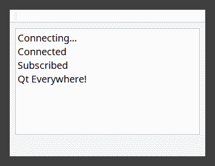

# 第七章：机器对话

机器自动化和物联网使用各种 API 进行相互通信。

我喜欢说，没有传感器就无法实现物联网。它们真正定义了物联网。如今，传感器无处不在。汽车、灯光和移动电话都有无数的传感器。笔记本电脑有亮度、光线、触摸和接近传感器。

MQTT 和 WebSockets 是通信和消息协议。它们的一个用途是将传感器发送到远程位置。

你将学习如何使用 Qt API 进行机器到机器的自动化和通信，使用`QWebSocket`和`QWebSocketServer`类与 Web 应用程序进行通信。

MQTT 是基于发布和订阅的 TCP/IP 协议，用于通过`QMqttMessage`将传感器数据发送到有限带宽网络中的`QMqttClient`和`QMqttSubscription`。

我们将涵盖以下主题：

+   **感官控制** – QtSensor 数据

+   **WebSockets** - 双向 Web 通信

+   **QMqtt** - 机器对话的代理

# 感官控制 – QtSensor 数据

Qt Sensors API 始于 Qt Mobility，Qt Mobility 本身又源于 Qtopia，后来更名为 Qt Extended。

Qt Mobility 是一组适用于移动和嵌入式设备的 API 集合。它专门用于诺基亚手机。一些 Mobility API 已集成到 Qt 4，后来集成到 Qt 5。

与此同时，当 Qt 5 拆分为模块时，Qt Sensors 被放入了自己的仓库。Qt Sensors 最初针对的是移动电话平台，但随着笔记本电脑和树莓派等计算机获得了传感器，后端得到了扩展。你可以找到 iOS、Android、WinRT、通用 Linux、Sensorfw 以及德州仪器的 SensorTag 的后端。在我的 GitHub 仓库中，你可以找到 Raspberry Pi Sense HAT 和 Raspberry Pi 的 MATRIX Creator 的附加传感器后端。

**传感器框架**（**SensorFW**）是一个用于以多种方式配置和读取传感器数据的框架和后端。它已在一些最好的替代移动设备上经过测试和验证。它支持 Hybris（用于 Sailfish OS），Linux IIO 传感器，以及直接从 Linux 文件系统中读取。如果你正在集成新设备并需要读取各种传感器，我建议使用 Sensor Framework，可在[`git.merproject.org/mer-core/sensorfw/`](https://git.merproject.org/mer-core/sensorfw/)找到[. ](https://git.merproject.org/mer-core/sensorfw/)

有数十种不同的传感器用于监控环境。Qt Sensors 处理在移动电话和平板电脑中最常见的传感器，并提供工具以帮助实现可能开发并变得流行的新的传感器类型。

不仅用于监控环境的传感器可以用作系统的输入。Qt Sensor API 包括一个临时的`QSensorGestures`，这是一个用于各种设备手势的 API，如摇晃、自由落体、悬停、覆盖、翻转和拾取。

Qt Sensors 具有 C++和 QML API。让我们从 C++ API 开始。

实际上，有三种使用此 API 的方法。第一种是通用方式。所有传感器类都是 `QSensor` 的派生类。使用它们的一个更通用的方式是直接使用 `QSensor`。

# `QSensor`

`QSensor` 有两个静态函数我们可以使用。`QSensor::sensorTypes()` 返回一个传感器类型的 `QList`；例如，它可能是 `QLightSensor` 或 `QOrientationSensor`。然后你可以使用 `QSensor::sensorForType` 或 `defaultSensorForType`。通常一个类型只有一个传感器，所以，使用后者就足够了。

但首先，我们需要告诉 `qmake` 我们想要使用 `sensors` 模块，因此，在 `.pro` 文件中，执行以下操作：

源代码可以在 Git 仓库的 `Chapter07-1` 目录下的 `cp7` 分支中找到。

```cpp
QT += sensors
```

要包含所有 `QSensors` 头文件，包含文件行是 `#include <QtSensors>`，因此让我们将其添加到我们的文件中。

通过使用 `QSensor::sensorTypes()` 获取系统已知的所有传感器类型列表：

```cpp
 for (const QByteArray &type : QSensor::sensorTypes()) {
        const QByteArray &identifier = QSensor::defaultSensorForType(type);
```

`QSensor` 是通过提供一个 `QSensor::type` 参数创建的，然后你调用 `setIdentifier` 函数，使用一个 `String` 指示你想要使用的传感器。

```cpp
        QSensor* sensor = new QSensor(type, this);
        sensor->setIdentifier(identifier);

```

我们现在有一个 `QSensor`。如果你直接使用 `QSensor`，那么你必须调用 `connectToBackend()`：

```cpp
if (!sensor->connectToBackend())
    qWarning() << "Could not connect to sensor backend";
```

然后，你可以连接到 `readingChanged()` 信号并从那里读取值。要获取 `QSensor`，你可以在任何槽中使用 `sender()` 函数，然后使用 `qobject_cast` 来转换到 `QSensor`：

```cpp
connect(sensor, &QSensor::readingChanged, this, &SomeClass::readingChanged);
```

`readingChanged()` 槽看起来像这样：

```cpp
void SomeClass::readingChanged()
{
    QSensor *sensor = qobject_cast<QSensor *>(sender());
    QSensorReading *reading = sensor->reading()
    QString values;
    for (int i = 0; i < reading->valueCount(); i++) {
        values += QString::number(reading->value(i).toReal()) + " ";
    }
  ui->textEdit->insertPlainText(sensor->type() +" " + sensor->identifier() + " "+ values + "\n");
}
```

我们使用 `sender()` 函数将 `QSensor` 进行转换，该函数返回槽连接到的对象。然后我们使用它通过 `reading()` 函数获取 `QSensorReading`。从读取中，我们可以获取传感器向我们发出的值。

我们仍然需要在传感器上调用 `start()`，因此我们将在连接到 `readingChanged()` 信号之后将其添加到某个地方。这将激活传感器的后端并开始从设备读取数据。

```cpp
if (!sensor->isActive())
  sensor->start();
```

访问传感器的另一种方式是使用 `QSensor` 子类。让我们看看我们将如何使用 `QSensor` 作为子类：

# `QSensor` 子类

使用 Qt Sensors 的更流行的方式是使用标准 `QSensors` 派生类，例如 `QLightSensor` 或 `QAccelerometer`。如果你确切知道你的设备有哪些传感器或你打算使用什么，这很有用。它还减少了类型转换的需要。以这种方式，它也更容易使用类的特定于传感器的属性：

```cpp
QLightSensor *lightSensor = new QLightSensor(this);
if (!lightSensor->connectToBackend()) {
    qWarning() << "Could not connect to light sensor backend";
    return;
}
connect(lightSensor, &QLightSensor::readingChanged, &SomeClass::lightSensorChanged);

```

与通用的 `QSensorReading` 不同，我们得到一个特定于传感器的读取，例如 `QLightReading`，以及一个特定于传感器的值访问器：

```cpp
SomeClass::lightSensorChanged(const QLightReading *reading)
{
    qWarning() << reading->lux();
}
```

访问传感器数据的另一种方式是使用 `QSensorFilter`。让我们看看那里。

# `QSensorFilter`

在 C++中访问传感器数据还有第三种方法，即使用传感器特定的过滤器类。当信号和槽可能太慢时，这提供了一种有效的回调，例如在`QAccelerometer`和其他可能以每秒 200 次周期运行的动态传感器的情况下。它还提供了一种在传感器读取信号发出之前应用一个或多个影响值的过滤器的方式。您可以提供额外的平滑和噪声减少，或者放大信号到一个更大的范围。

在我们的案例中，我们的类将继承自`QLightFilter`。

```cpp
class LightFilter : public QLightFilter
{
public:
```

我们接着实现过滤器覆盖。

如果`filter`函数返回`true`，它将存储`QLightSensor`的`QLightReading`，并且新值将由我们的`QLightSensor`类发出。让我们对我们的光传感器数据应用一个简单的移动平均滤波器：

```cpp

 bool filter(QLightReading *reading)
 { 
      int lux = 0;
        int averageLux = 0; 
        if (averagingList.count() <= 4) {
            averagingList.append(reading->lux());
        } else {
            for (int i = 0; i < averagingList.count(); i++) {
                lux += averagingList.at(i);
            }
            averageLux = lux / (averagingList.count());
            reading->setLux(averageLux);
            averagingList.append(averageLux);
            return true; // store the reading in the sensor
        }
        return false;
    };
    QList<int> averagingList;

};
```

然后，您可以创建一个新的`LightFilter`对象，并将`QLightSensor`设置为使用它。在调用`start()`之前添加此代码：

```cpp
            if (type == QByteArray("QLightSensor")) {
                LightFilter *filter = new LightFilter();
                sensor->addFilter(filter);
            }
```

现在我们来了解一下`QSensor`数据以及如何访问它。

# QSensor 数据

`QSensor`具有各自传感器特有的值。您可以通过`QSensor`以通用方式访问它们，或者通过传感器值访问。

# QSensorReading

如果您使用更通用的`QSensor`类，则有一个相应的`QSensorReading`类，您可以使用它来检索通用数据。对于获取任何特定传感器数据，您需要使用相应的传感器`QSensorReading`子类，例如`QAccelerometerReading`。例如，如果我们使用`QSensor`来获取加速度计数据，我们可以这样做：

```cpp
QSensorReading reading;
QList <qreal> data;
qreal x = reading.at(0);
qreal y = reading.at(1);
if (reading.valueCount() == 3)
    qreal z = reading.at(2);
qreal timestamp = reading.timestamp;
```

然而，使用`QAccelerometer`和`QAccelerometerReading`类做同样的事情，看起来是这样的。

```cpp
QAccelerometer accel;
QAccelerometerReading accelReading = accel.reading();
qreal x = accelReading.x();
qreal y = accelReading.y();
qreal z = accelReading.z();
```

这里是一些常见传感器的数据解释：

| **传感器读取** | **值** | **单位** | **描述** |
| --- | --- | --- | --- |
| `QAccelerometerReading` | `x`, `y`, `z` | m²/s², 米每平方秒 | 沿 x、y、z 轴的线性加速度 |
| `QAltimeterReading` | `altitude` | 米 | 海拔高度 |
| `QAmbientLightReading` | `lightLevel` | Dark, Twilight, Light, Bright, Sunny | 一般光级 |
| `QAmbientTemperatureReading` | `temperature` | 摄氏度 | 摄氏度 |
| `QCompassReading` | `azimuth` | 度 | 从磁北方向的角度 |
| `QGyroscopeReading` | `x`, `y`, `z` | 每秒度 | 绕轴的角速度 |
| `QHumidityReading` | `absoluteHumidity`,`relativeHumidty` | g/m³, 克每立方米 | 空气中的水蒸气 |
| `QIrProximityReading` | `reflectance` | 十进制分数 0 - 1 | 反射回来的红外光量 |
| `QLidReading` | `backLidClosed`,`frontLidClosed` | 布尔值 | 笔记本电脑盖 |
| `QLightReading` | `lux` | Lux | 以勒克斯为单位测量的光 |
| `QMagnetometerReading` | `x`, `y`, `z` | 磁通密度 | 原始磁通 |
| `QOrientationReading` | `orientation` | TopUp, TopDown, LeftUp, RightUp, FaceUp, FaceDown | 枚举设备方向 |
| `QPressureReading` | `pressure`, `temperature` | 帕斯卡，摄氏度 | 大气压力 |
| `QProximityReading` | `close` | 布尔值 | 靠近或远离 |
| `QRotationReading` | `x`, `y`, `z` | 度 | 绕轴旋转的度数 |

一些这些传感器具有特定的读数，例如`QCompass`和`QMagnetometer`——两者都包含校准级别。

当然，C++不是实现 Qt 传感器的唯一方式；你同样可以在 QML 中使用它们。让我们来看看如何实现。

# QML 传感器

当然，你也可以从 QML 中使用 Qt Sensors。在许多方面，这种方式实现起来更简单，因为 Qt Quick API 已经被优化和简化，因此启动传感器所需的时间更少。继我们之前对光传感器的使用之后，我们将继续这样做。首先是一个始终存在的`import`语句：不是通过调用一个`start()`函数来启动，而是一个`active`属性。不是`Lux`值，属性是`illuminance`。不确定为什么有这种差异，但就是这样：

```cpp
import QtSensors 5.12
LightSensor {    
    id: lightSensor
    active: true
    onReadingChanged {
        console.log("Lux "+ illuminance);
 }
```

这已经非常简单了。`QtSensors` QML 没有过滤器，所以如果你需要过滤任何内容，你将不得不使用 C++。

# 自定义 QSensor 和后端引擎

我想简要地谈谈如何创建自定义传感器和引擎后端。如果你在一个嵌入式设备上，Qt Sensors 可能不支持你的传感器，如果它是一个湿度或空气质量传感器。你需要实现自己的`QSensor`和`QSensorBackend`引擎。

在该目录中有一个脚本`src/sensors/make_sensor.pl`，你可以运行它来生成一个简单的`QSensor`派生类，但此脚本还会生成从`QmlSensor`派生的 Qt Quick 类。`make_sensor.pl`脚本需要从`src/sensors`目录中运行。在这个练习中，我们将创建一个用于监测盐水游泳池中盐浓度的传感器，因此其名称将是`QSaltSensor`。

你可以打开这些文件在一个编辑器中，例如 Qt Creator，并添加你需要的内容。拥有一个新的`QSensor`类型也将需要一个从传感器读取的新后端。

# 自定义 QSensor

有一个名为`QtSensors/src/sensors/make_sensor.pl`的辅助脚本，它将为新的`QSensor`和`QSensorReading`创建一个基本模板。它生成一个简单的`QSensor`派生类，同时也为`QmlSensor`派生类生成类。

如果在你的源目录中没有，它可以在 Git 仓库中找到，网址为[`code.qt.io/cgit/qt/qtsensors.git/tree/src/sensors/make_sensor.pl`](https://code.qt.io/cgit/qt/qtsensors.git/tree/src/sensors/make_sensor.pl)。

`make_sensor.pl`脚本需要从`src/sensors`目录中运行。

你将需要编辑生成的文件并填写一些内容。在这个例子中，我选择了`QSaltSensor`作为类名。使用类名作为第一个参数执行脚本：`make_sensor.pl QSaltSensor`。

它会创建以下文件：

+   `<sensorname>.h`

+   `<sensorname>.cpp`

+   `<sensorname>_p.h`

+   `imports/sensors/<sensorname>.h`

+   `imports/sensors/<sensorname>.cpp`

使用`make_sensor.pl`命令的输出将如下所示：

```cpp
cd src/sensors
$perl ./make_sensor.pl QSaltSensor 
Creating ../imports/sensors/qmlsaltsensor.h 
Creating ../imports/sensors/qmlsaltsensor.cpp 
Creating qsaltsensor_p.h 
Creating qsaltsensor.h 
Creating qsaltsensor.cpp
You will need to add qsaltsensor to the src/sensors.pro file to the SENSORS and the qmlsaltsensor files to src/imports/sensors/sensors.pro
```

正如输出所示，你需要将`qsaltsensor`添加到`src/sensors.pro`文件中的`SENSORS`变量中。在文件`src/imports/sensors/sensors.pro`中添加`qmlsaltsensor`的文件路径。

首先，编辑`qsaltsensor.cpp`，这是我们用作`QSensorBackend`的类。我们用来创建模板的`perl`脚本已经添加了注释，你应该在这里编辑以进行自定义。你还需要添加任何属性。

# 自定义 QSensorBackend

你可能有很多原因想要实现自己的传感器后端。其中一个可能是因为你有一种新的传感器类型。

你需要开始实现你新的`QSensor`类型的后端引擎。首先，从`QSensorBackend`派生：

```cpp
#ifndef LINUXSALT_H
#define LINUXSALT_H

#include <qsensorbackend.h>
#include <qsaltsensor.h>

class LinuxSaltSensor : public QSensorBackend
{
```

类`QSensorBackend`有两个纯虚函数需要实现：`start()`和`stop()`：

```cpp

public:
    static char const * const id;
    LinuxSaltSensor(QSensor *sensor);
    ~LinuxSaltSensor();
    void start() override;
    void stop() override;
private:
    QSaltReading m_reading;
};
#endif // LINUXSALT_H
```

源代码可以在 Git 仓库的`Chapter07-2`目录下的`cp7`分支中找到。

实现后端功能取决于你是否有想要使用的盐传感器设备。当然，当你这样做时，你将不得不编译和部署自己的 Qt Sensors。

关于自定义`QSensors`和后端的信息，请查看 Qt 传感器的 Grue 传感器示例。有关如何实现自定义传感器的文档可以在[`doc.qt.io/qt-5/qtsensors-grue-example.html`](https://doc.qt.io/qt-5/qtsensors-grue-example.html)找到。

有时一个系统上可能会有多个传感器插件，针对任何传感器都可能有多个。在这种情况下，我们需要告诉系统使用哪个传感器。让我们看看如何配置`QSensors`。

# Sensors.conf

如果一个特定传感器有多个后端，你可能需要指定哪个是默认的。

你可以将`qsaltsensor`添加到`Sensors.conf`配置文件中，以便系统可以确定某个传感器的默认传感器类型。当然，开发者可以自由选择系统上注册的任何传感器。配置文件的格式是`SensorType = sensor.id`，其中`SensorType`是基本传感器类名，例如`QLightSensor`，而`sensor.id`是特定传感器后端的`String`标识符。以下代码使用 Linux 后端的`saltsensor`和`sensorfw`后端中的列表传感器：

```cpp
[Default]
QSaltSensor = linux.saltsensor
QLightSensor = sensorfw.lightsensor
```

# QSensorGesture

`QSensorGesture`是一个用于设备手势的传感器 API。正如我在介绍中提到的，它们使用临时的手势，也就是说没有涉及机器学习。Qt Sensors 提供了以下预定义的手势：

+   `cover`

+   `doubletap`

+   `freefall`

+   `hover`

+   `pickup`

+   `slam`

+   `shake`

+   `turnover`

+   `twist`

+   `whip`

在 Qt Sensors 中执行特定手势的说明可以在[`doc.qt.io/qt-5/sensorgesture-plugins-topics.html`](http://doc.qt.io/qt-5/sensorgesture-plugins-topics.html)中找到。

值得注意的是，`QSensorGesture`使用识别器特定的信号。`slam`手势有`slam()`信号，当检测到`slam`手势时发出。它还有标准的`detected("<gesture>")`信号。`shake2`手势有`shakeLeft`、`shakeRight`、`shakeUp`和`shakeDown`信号，但还有相应的`detected`信号。

`QSensorGesture`类没有`Q_OBJECT`宏，并且直接在`meta`对象上在运行时创建其信号。因此，在使用`Q_OBJECT`的同时使用`qobject_cast`和子类化`QSensorGesture`将不会工作。

`QSensorGestureManager`有`recognizerSignals`函数，它接受一个`gestureId`，这样你就可以发现特定于手势的信号，如果你需要的话。

源代码可以在 Git 仓库的`Chapter07-3`目录下的`cp7`分支中找到。

要使用`QSensorGestures`，创建一个`QSensorGesture`对象，它接受一个包含你想要使用的手势 ID 列表的`QStringList`参数。你可以使用这样的`QStringList`直接指定你想要的手势：

```cpp
QSensorGesture *gesture = new QSensorGesture(QStringList() << "QtSensors.slam", this);
connect(gesture, SIGNAL(detected(QString)), this, SLOT(detectedGesture(QString)));

```

或者，你也可以使用`QSensorGestureManager`来获取所有已注册手势的列表，调用`gestureIds()`。

由于`QSensorGesture`的实现不典型（因为信号在运行时动态创建），使用新的连接语法`connect(gesture, &QSensorGesture::detected, this, &SomeClass::detectedGesture);`将导致编译器错误，因为新的语法有编译时检查。

一旦正确连接了这些信号，你就可以为`QSensorGesture`调用`startDetection()`：

```cpp
gesture->startDetection();
```

# QSensorGestureManager

你可以通过使用`QSensorGestureManager`来获取系统上注册的所有传感器手势的列表：

```cpp
QSensorGestureManager manager;

    for (const QString gestureId :  manager.gestureIds()) {
        qDebug() << gestureId;

       QStringList recognizerSignals = manager.recognizerSignals(gestureId);

        for (const QString signalId : recognizerSignals ) {
            qDebug() << " Has signal " << signalId;
        }
 }
```

你可以使用前一段代码中的`gestureId`来创建一个新的`QSensorGesture`对象，并将其连接到检测到的信号：

```cpp
QSensorGesture *gesture = new QSensorGesture(QStringList() << gestureId, this);
        connect(gesture,SIGNAL(detected(QString)), this,SLOT(detectedGesture(QString)));
```

# SensorGesture

当然，传感器手势也可以在 QML 中使用。API 略有不同，因为只有一个类型，即`SensorGesture`，所以它就像使用通用的`QSensor`类一样，除了`SensorGesture`可以表示一个或多个手势，而不是每个对象一个手势。

`SensorGesture`没有自己的导入，而是包含在`QtSensors`中，因此我们需要使用它来表示我们正在使用`QtSensors`模块：

```cpp
import QtSensors 5.12
```

你可以通过写入`gestures`属性来指定你想要的手势，该属性接受一个字符串列表的`id`识别器：

```cpp
SensorGesture {
    id: sensorGesture
    gestures : [ "QtSensors.slam", "QtSensors.pickup" ]
}
```

由于只有一个通用的`SensorGesture`，因此没有特定于手势的信号。手势信号是`onDetected`，在`gesture`属性中设置检测到的手势字符串。如果你使用该组件进行多个手势，你将不得不使用一些逻辑来过滤特定手势：

```cpp
onDetected: {
    if (gesture == "slam") {
        console.log("slam gesture detected!")
    }
} 
```

要开始检测，将`true`写入`SensorGesture`的启用属性：

```cpp
sensor.gesture.enabled
```

您可以拿起您的设备，按照 Qt 文档中概述的方式执行 slam 手势[`doc.qt.io/qt-5/sensorgesture-plugins-topics.html`](http://doc.qt.io/qt-5/sensorgesture-plugins-topics.html)。根据您的设备，它将检测到 slam。

# WebSockets – 双向 Web 通信

现在我们开始进入网络和互联网的领域。WebSockets 是一种协议，允许在 Web 浏览器或客户端和服务器之间进行双向数据交换，而不需要轮询。您可以流式传输数据或随时发送数据。Qt 通过使用`QWebSocket` API 支持 WebSockets。像正常的 TCP 套接字一样，`QWebSockets`需要一个服务器。

# QWebSocketServer

`QWebSocketServer`可以在两种模式下工作：非安全和 SSL。我们首先将`websockets`添加到`.pro`文件中，这样`qmake`就会设置正确的库和头文件路径：

```cpp
QT += websockets
```

然后包含`QWebSocketServer`头文件：

```cpp
#include <QtWebSockets/QWebSocketServer>

```

源代码可以在 Git 仓库的`Chapter07-3`目录下的`cp7`分支中找到。

要创建一个`QWebSocketServer`，需要一个字符串形式的服务器名称、一个模式和父对象。模式可以是`SecureMode`或`NonSecureMode`。

`SecureMode`类似于 HTTPS，使用 SSL，协议是 wss。`NonSecureMode`类似于使用 ws 协议的 HTTPS：

```cpp
const QWebSocketServer *socketServer = new QWebSocketServer("MobileSocketServer",
                                                            QWebSocketServer::NonSecureMode,this);
connect(sockerServer, &QWebSocketServer::newConnection, this, &SomeClass::newConnection);
connect(sockerServer, &QWebSocketServer::closed, this, &SomeClass::closed);
```

与`QSocket`类似，有一个`newConnection`信号，当客户端尝试连接到该服务器时会发出。如果您使用`SecureMode`，您将想要连接到`sslErrors(const QList<QSslError> &errors)`信号。一旦连接了您想要使用的信号，调用`listen`来启动服务器，并指定`QHostAddress`和端口号。`QHostAddress::Any`将监听所有网络接口。您可以指定一个接口的地址。端口号是可选的，端口号为 0 将自动分配端口号：

```cpp
socketServer->listen(QHostAddress::Any, 7532);
```

现在我们有一个监听传入连接的`QWebSocketServer`对象。我们可以像处理`QSocketServer`一样处理它，使用`nextPendingConnection`在相应的槽中连接到`newConnection`信号。这将给我们一个代表连接客户端的`QWebSocket`对象。

# QWebSocket

当一个新的连接到来时，`QWebSocketServer`会发出`newConnection`信号，在这里，它调用`newConnection`槽。我们使用服务器对象的`nextPendingConnection`来获取`QWebSocket`。有了这个，我们就连接到`QWebSocket`的信号：

```cpp
QWebSocket *socket = socketServer->nextPendingConnection();
```

我最喜欢连接的第一个信号是错误信号，因为它可以帮助调试。像`QBluetooth`类一样，错误函数是重载的，因此需要特殊的语法来使用此信号。

`QWebSocket`的`error`信号是重载的，因此需要独特的处理才能编译。`QOverload`是您需要使用的。

```cpp
connect(socket, QOverload<QAbstractSocket::SocketError>::of(&QWebSocket::error),
           this, &SomeClass::socketError);
```

可以发送和接收两种类型的消息：`text`和`binary`。我们必须分别处理这些，因此每种类型都有自己的信号。当客户端发送`text`或`binary`消息时，服务器会发出这些信号：

```cpp
connect(socket, &QWebSocket::textMessageReceived, 
    this, &SomeClass::textMessageReceived);
connect(socket, &QWebSocket::binaryMessageReceived, 
    this, &SomeClass::binaryReceived);
```

WebSocket 中 `binary` 和 `text` 消息之间的一个区别是，`text` 消息以 `0xFF` 字符结尾。

`textMessageReceived` 信号发送 `QString`，而 `binaryMessageReceived` 发送 `QByteArray`：

```cpp
SomeClass:binaryMessageReceived(const QByteArray &message) {
}
SomeClass:textMessageReceived(const QString &message) {
}
```

它们也在帧级别上工作，但我们只是处理整个消息。如果您有某种类型的连续流数据，您可能会选择 `textFrameReceived` 或 `binaryFrameReceived` 信号。

# 客户端

WebSocket 客户端会简单地使用 `QWebSocket` 并连接到一个支持 WebSocket 的服务器。一个用例是一个网页（客户端），它显示通过 `QWebSocketServer` 发送的传感器数据。

# QtQuick

当然，`QWebSockets` API 提供了 QML 组件——确切地说，是 `WebSocket` 和 `WebSocketServer`。像往常一样，使用它比使用 C++ 更快。

# WebSocketServer

在您的 `qml` 文件中添加以下导入行以使用 WebSocket：

源代码可以在 Git 仓库的 `Chapter07-4` 目录下的 `cp7` 分支中找到。

```cpp
import QtWebSockets 1.0
```

要使用 `WebSocketServer` 开始监听，将 `listen` 属性设置为 `true`。`url` 属性接受一个字符串，可以设置为客户端将要连接的地址：

```cpp
WebSocketServer {
    id: socketServer
    url : "ws://127.0.0.1:33343"
    listen: true
}
```

当客户端连接时，会发出 `onClientConnected` 信号，其 `webSocket` 属性表示传入的 WebSocket 客户端。您还希望能够进行错误检查，因此 `WebSocketServer` 有 `onErrorStringChanged` 信号，带有 `errorString` 属性。为此，在 `WebSocketServer` 组件中实现如下。

```cpp
onClientConnected {
  ...
}

onErrorStringChanged {
    console.log(errorString)
}
```

让我们看看如何处理服务器和客户端的 WebSocket。

# WebSocket

客户端和服务器都使用 WebSocket 元素。在服务器端，正如我在 *WebSocketServer* 部分概述的那样，可以通过 `onClientConnect` 信号获取客户端的 `WebSocket` 对象。

检查 `WebSocketServer` 组件中的工作方式，与客户端相比：

```cpp
WebSocketServer {
      id: socketServer
      host : "127.0.0.1"
      port: 33343
      listen: false
      onClientConnected {
         webSocket.onTextMessageReceived.connect(function(message)         {
              console.log(message)
         });
      }
  }
```

客户端需要填充 `url` 属性，以便知道它将连接到哪个服务器：

```cpp

WebSocket {
    id: webSocket
    url: "ws://localhost"

    onTextMessageReceived {
        console.log(message)

    }
}
```

收到的消息会出现在 `onTextMessageReceived` 信号中，带有 `message` 属性。

要向服务器或客户端发送消息，`WebSocket` 有 `sendMessage` 函数。如果是服务器，可以使用 `webSocket` 发送类似文本的消息。

```cpp
webSocket.sendTextMessage("socket connected ok!")
```

对于 Qt Quick 的 WebSocket，并不真正处理二进制消息。它确实有一个 `onBinaryMessageReceived` 信号，但接收到的 `message` 对象是一个 `String`。我建议如果您的二进制消息在转换为 UTF16 编码的 `QString` 时会出错，您可能需要考虑使用 C++ API。

# QMqtt – 机器对话的代理

MQTT 是一种发布和订阅的消息传输。Qt Mobility 栈中有一个类似的框架，称为发布和订阅，现在它是官方不支持的 `QSystems` API 框架的一部分，该框架还包括 `QSystemInfo` 和 `QSystemFramework`。

`QMqtt` 是编写 MQTT 客户端的框架。您需要安装并运行一个 MQTT 代理，如 Mosquitto 或 HiveMQ，或者使用基于互联网的服务。出于我的开发和测试目的，我选择了 HiveMQ。您可以从 [`www.hivemq.com/`](https://www.hivemq.com/) 下载它。

他们还有一个公共代理在 [`www.mqtt-dashboard.com/index.html`](http://www.mqtt-dashboard.com/index.html)。

MQTT 有一个代理，或服务器，一个或多个客户端连接到。然后客户端可以发布和/或订阅不同的主题。

您可以使用 `QWebSockets` 访问代理，Qt 中有一个示例，它使用 `examples/mqtt/websocketsubscription` 目录中的 `WebSocketIODevice` 类。

# QMqttClient

要开始开发 `QMqttClient`，您必须自己构建它，因为它本身并不与 Qt 一起分发，除非您获得商业 Qt for Automation。

您可以从 `git://code.qt.io/qt/qtmqtt.git` 下载开源许可版本。

幸运的是，这是一个简单且容易构建的过程。一旦您运行 `qmake; make && make install;`，您就可以使用它了。

在您的 `pro` 文件中，我们需要添加 `mqtt` 模块。

```cpp
QT += mqtt
```

头文件命名为 `QtMqtt/QMqttClient`，所以让我们包含它：

```cpp
#include <QtMqtt/QMqttClient>
```

源代码可以在 Git 仓库的 `Chapter07-5` 目录下的 `cp7` 分支中找到。

我们用来访问代理的主要类名为 `QMqttClient`。它可以被认为是管理者。它有一个简单的构造。您需要使用 `setHostname` 和 `setPort` 函数指定主机和端口。我们将使用 `hivemq` 公共代理和端口 `1883`：

```cpp
mqttClient = new QMqttClient(this);
mqttClient->setHostname(broker.hivemq.com);
mqttClient->setPort(1883);

```

当事情出错时，连接到任何错误信号以帮助调试是个好主意；让我们先这么做：

```cpp
connect(mqttClient, &QMqttClient::errorChanged, this, &SomeClass::errorChanged);
connect(mqttClient, &QMqttClient::stateChanged, this, &SomeClass::stateChanged);
connect(mqttClient, &QMqttClient::messageReceived, this, &SomeClass::messageReceived);
```

要连接到 `mqtt` 代理，请调用 `connectToHost();`：

```cpp
mqttClient->connectToHost();
```

由于我们连接到了 `stateChanged` 信号，我们可以等待我们连接到代理后再订阅任何主题：

```cpp
void SomeClass::stateChanged(QMqttClient::ClientState state)
{
   switch(state) {
    case QMqttClient::Connecting:
        qDebug() << "Connecting...";
        break;
    case QMqttClient::Connected:
        qDebug() << "Connected.";
        subscribe();
        break;
    case QMqttClient::Disconnected:
        qDebug() << "Disconnected."
        break;
    }
}
```

`QMqttClient::subscribe` 函数接收一个以 `QMqttTopicFilter` 形式的主题。在这里，我将其分配给 `"Qt"` 字符串。

它返回一个 `QMqttSubscription` 指针，我们可以用它来连接到 `stateChanged` 信号。然后我们将简单地订阅我们刚刚发布的主题。

我们的 `subscribe` 函数看起来像这样：

```cpp
void MainWindow::subscribe()
{
    QMqttTopicFilter topicName("Qt");
    subscription = mqttClient->subscribe(topicName, 0);
    connect(subscription, &QMqttSubscription::stateChanged,this,    
            &SomeClass::subscriptionStateChanged);
    publish();
}
```

我们只是调用我们的函数，然后就会向该主题发布一些内容。

`QMqttClient::publish` 接收一个以 `QMqttTopicName` 形式的主题名称，消息只是一个标准的 `QByteArray`。

`publish` 函数看起来像这样：

```cpp
void MainWindow::publish()
{
    QMqttTopicName topicName("Qt");
    QByteArray topicMessage("Everywhere!");
    mqttClient->publish(topicName, topicMessage);
}
```

您应该会看到我们在 `messageReceived` 插槽中发布的消息：



# 将所有这些放在一起

我有一个 Raspberry Pi 和一个 Sense HAT 板，可以用它来收集传感器数据。幸运的是，我之前为 Sense HAT 编写了一个 Qt Sensors 插件。它恰好在一个独立的 Git 仓库中，而不是任何 Qt Sensors 版本中，与 TI SensorTag 后端插件不同。

如果你不想编写自己的 Sense HAT 传感器插件，你可以从 [`github.com/lpotter/qsensors-sensehatplugin.git`](https://github.com/lpotter/qsensors-sensehatplugin.git) 获取我的独立 Sense HAT 插件。

Raspbian 分发版上的 Qt Sensors 版本为 5.7，它没有 Sense HAT 所具有的压力和湿度传感器。这些传感器是在后续的 Qt Sensors 版本中添加的。

在桌面上的交叉编译比在设备上编译要快得多——在 **Raspberry Pi**（**rpi**） 上需要几天时间，而在一个好的开发机上只需要几分钟。我在设置交叉编译 `toolchain` 时遇到了一些麻烦，所以我不得不选择在板载上使用原生编译，这在 Raspberry Pi 上当然需要非常长的时间。最简单的方法是获取 Qt 的商业 `Boot2Qt` 和 `Automation` 软件包，因为它们打包得很好，并提供二进制文件和支持。

由于本书使用 Qt 5.12，我们需要使用以下 Git 命令获取以下 Qt 模块仓库的显式版本：

+   Qt Base: `git clone http://code.qt.io/qt/qtbase.git -b 5.12`

+   Qt WebSockets: `git clone http://code.qt.io/qt/qtwebsockets.git -b 5.12`

+   Qt MQTT: `git clone http://code.qt.io/qt/qtmqtt -b 5.12`

+   Qt Sensors: `git clone http://code.qt.io/qt/qtsensors -b 5.12`

我们将创建一个适用于 Raspberry Pi 的应用程序，该应用程序抓取 Sense HAT 的温度和压力数据，并通过 `QMqtt` 和 `QWebSockets` 将其分发到运行在 HiveMQ 上的代理。

源代码可以在 Git 仓库的 `Chapter07-6` 目录下的 `cp7` 分支中找到。

首先实现一个 `SensorServer` 类，这通常是一个从 `QObject` 派生的类。

```cpp
SensorServer::SensorServer(QObject *parent)
   : QObject(parent),
      humiditySensor(new QHumiditySensor(this)),
      temperatureSensor(new QAmbientTemperatureSensor(this))
{
    initSensors();
    initWebsocket();
}
```

然后，我们实现我们声明的 `QWebSockeIODevice` 并连接到其 `socketConnected` 信号。

```cpp
void SensorServer::initWebsocket() 
{ 
    mDevice.setUrl("broker.hivemq.com:8000"); 
    mDevice.setProtocol("mqttv3.1"); 

    connect(&mDevice, &WebSocketIODevice::socketConnected, this, &SensorServer::websocketConnected); 
} 

```

接下来，我们调用我们想要使用的传感器的 `connectToBackend()` 函数。

```cpp
void SensorServer::initSensors() 
{ 
    if (!humiditySensor->connectToBackend()) { 
        qWarning() << "Could not connect to humidity backend"; 
    } else { 
        humiditySensor->setProperty("alwaysOn",true); 
        connect(humiditySensor,SIGNAL(readingChanged()), 
                this, SLOT(humidityReadingChanged())); 
    }    
    if (!temperatureSensor->connectToBackend()) { 
        qWarning() << "Could not connect to humidity backend"; 
    } else { 
        temperatureSensor->setProperty("alwaysOn",true); 
        connect(temperatureSensor,SIGNAL(readingChanged()), 
                this, SLOT(temperatureReadingChanged())); 
    } 
}

```

调用 `initSensors()` 连接到传感器的后端并设置 `readingChanged` 信号连接。

要使用 `QWebSockets` 为 `QMqtt` 客户端，我们需要创建一个使用 `QWebSockets` 的 `QIODevice`。幸运的是，在 `QMqtt` 的 `examples/mqtt/websocketssubscription` 目录中已经有一个名为 `websocketsiodevice` 的现成代码，所以我们将将其导入到项目中：

```cpp
SOURCES += websocketiodevice.cpp
HEADERS += websocketiodevice.h
```

在我们的头文件中，我们包含 `websocketdevice.h`。

```cpp
#include "websocketiodevice.h"
```

在类声明中，我们将 `WebSocketIODevice` 实例化为一个类成员。

```cpp
WebSocketIODevice mDevice;
```

要实际使用 `WebSocketIODevice`，我们需要将其设置为 `QMqttClient` 传输。

我们首先设置我们的 `WebSocketIODevice` 并连接到其 `socketConnected` 信号以设置 `QMqtt`。

`hivemq` 上的 `mqtt` 代理使用不同的端口号，所以我们将其设置在 URL 中：

```cpp
void SensorServer::initWebsocket()
{
    mDevice.setUrl(QUrl("broker.hivemq.com:8000"));
    connect(&mDevice, &WebSocketIODevice::socketConnected, this, &SensorServer::websocketConnected);
    mDevice.open(QIODevice::ReadWrite);
}
```

现在我们设置 `QMqtt` 并将其传输设置为使用 `WebSocketIODevice`。我们使用一个具有自己连接的传输，因此我们不需要为 `QMqtt` 对象设置 URL，而是依赖于 `websocket` 进行连接。然后我们像往常一样设置 `mqttClient`：

```cpp
void SensorServer::websocketConnected()
{
    mqttClient = new QMqttClient(this);
    mqttClient->setProtocolVersion(QMqttClient::MQTT_3_1);
    mqttClient->setTransport(&mDevice, QMqttClient::IODevice);
    connect(mqttClient, &QMqttClient::errorChanged,
            this, &SensorServer::errorChanged);
    connect(mqttClient, &QMqttClient::stateChanged,
            this, &SensorServer::stateChanged);
    connect(mqttClient, &QMqttClient::messageReceived,
            this, &SensorServer::messageReceived);

    mqttClient->connectToHost();
}
```

我们监控状态的变化，并在它变为 `Connected` 时采取行动。我们将启动 `humidity` 和 `temperature` 传感器，然后调用订阅以监控 `mqtt` 代理发布消息：

```cpp
void SensorServer::stateChanged(QMqttClient::ClientState state)
{
    switch(state) {
    case QMqttClient::Connecting:
        qDebug() << "Connecting...";
        break;
    case QMqttClient::Connected:
        qDebug() << "Connected.";
        humiditySensor->start();
        temperatureSensor->start();
        subscribe();
        break;
    case QMqttClient::Disconnected:
        qDebug() << "Disconnected.";
        break;
    }
}
```

在我们传感器的 `readingChanged` 插槽中，我们将数据发布到 `mqtt` 代理：

```cpp
void SensorServer::humidityReadingChanged()
{
    qDebug() << Q_FUNC_INFO << __LINE__;
    QHumidityReading *humidityReading = humiditySensor->reading();
    QByteArray data;
    data.setNum(humidityReading->relativeHumidity());
    QMqttTopicName topicName("Humidity");
    QByteArray topicMessage(data);
    mqttClient->publish(topicName, topicMessage);
}

void SensorServer::temperatureReadingChanged()
{
    qDebug() << Q_FUNC_INFO << __LINE__;
    QAmbientTemperatureReading *tempReading = temperatureSensor
>reading();
    QByteArray data;
    data.setNum(tempReading->temperature());
    QMqttTopicName topicName("Temperature");
    QByteArray topicMessage(data);
    mqttClient->publish(topicName, topicMessage);
}
```

最后，让我们看看任何已订阅的消息：

```cpp
void SensorServer::messageReceived(const QByteArray &message, const QMqttTopicName &topic)
{
    qDebug() << Q_FUNC_INFO  << topic << message;
}
```

# 摘要

在本章中，我们探讨了使用 `QSensors` 读取设备传感器数据的多种方式。Qt 传感器支持许多平台：Android、iOS、WinRT、SensorTag、Sensorfw、Linux 通用和 Linux iio-sensor-proxy。Sensorfw 还支持 Linux 的 IIO 传感器。

我描述了如何实现自定义的 `QSensor` 和 `QSensorBackend` 以添加对 Qt 传感器当前不支持传感器的支持。

我们回顾了使用 `QtMqtt` 与 `mqtt` 代理通信的步骤，并探讨了如何使用 `QWebsockets` 与网页服务器进行通信。

然后，我将它们全部组合起来，从 Sense HAT 获取传感器数据，并通过 WebSocket 将它们发布到 `mqtt` 代理。

在下一章中，我们将讨论使用包含位置和位置的 GPS 数据以及地图绘制。
