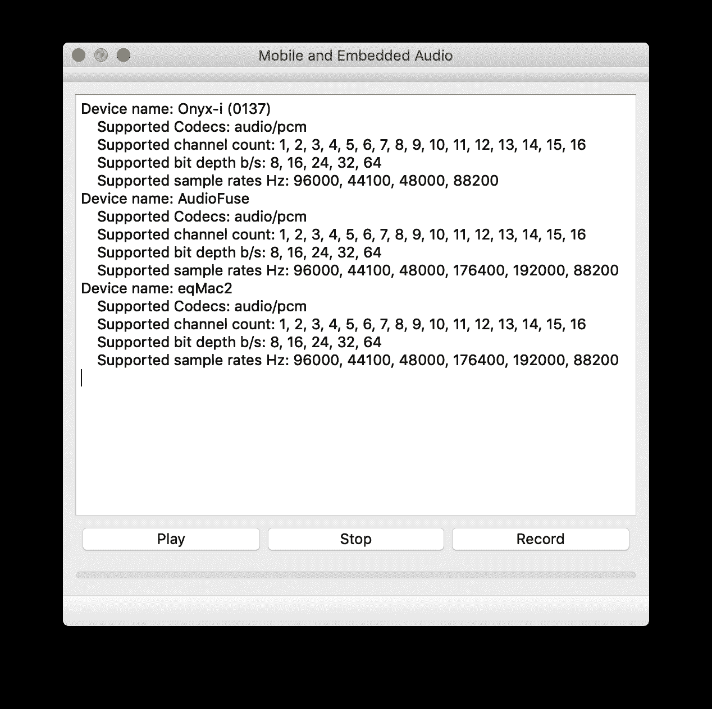
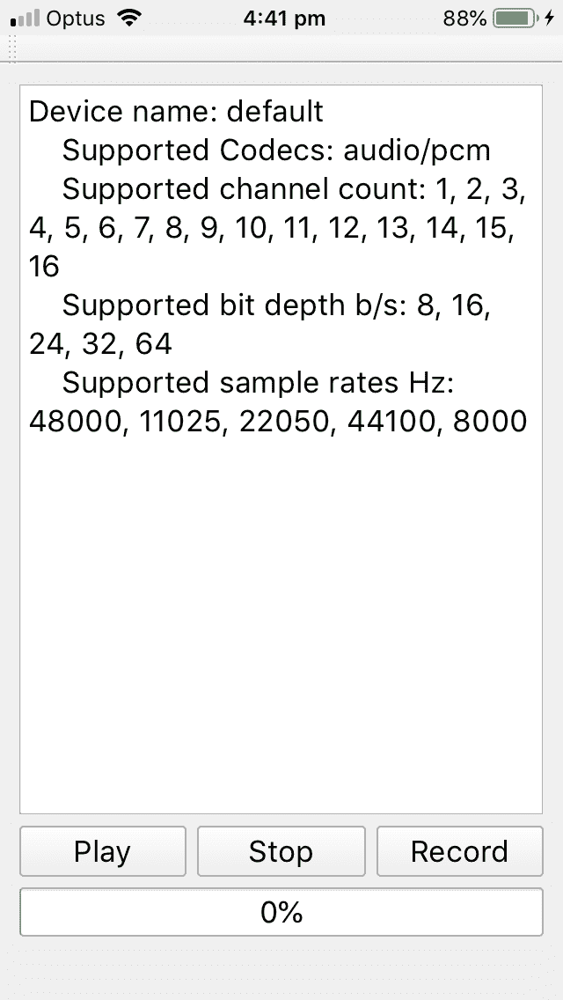

# 第九章：声音与视觉 - Qt Multimedia

需要播放声音或显示视频的应用程序通常是游戏，而其他则是完整的多媒体应用程序。Qt Multimedia 可以处理这两者。

Qt Multimedia 可以与 Qt Widgets 和 Qt Quick 一起使用，甚至在没有 GUI 界面的情况下使用。它具有 C++ 和 QML API，但 QML API 有一些特殊的特性和技巧。一个鲜为人知的事实是，Qt 还可以在 Qt Quick 中播放 3D 位置音频。你可以用三个维度来控制增益和音调。

本章我们将涵盖以下主题：

+   声音振动 - 音频

+   图像传感器 - 相机

+   视觉媒体 - 播放视频

+   调谐它 - FM 收音机调谐器

# 声音振动 - 音频

我与音频的关系可以追溯到很久以前——在计算机成为家庭用品之前，当 Mylar 磁带和磁铁统治着声音领域的时候。从那时起，事物已经进步了。现在，移动电话可以放入我们的口袋，灯泡可以播放音乐。

Qt 中的 3D 音频通过 OpenAL API 支持。如果你使用的是 Linux，Qt 公司提供的默认 Qt 二进制文件不包含所需的 Qt 音频引擎 API。你必须安装 OpenAL 开发包，然后自行编译 Qt Multimedia。OpenAL 在 Android 上不受支持，所以在这方面没有乐趣。幸运的是，它在 Apple Mac 和 iOS 上默认支持。所以，我将在下一个部分进行开发。让我们拿起最近的 MacBook，前往那里。

3D 音频是三维空间中的音频，就像 3D 图形一样——不仅仅是左右，还有上下、前后位置。术语 *位置音频* 可能能更好地解释这一点。

在 Qt 中，3D 音频仅通过 Qt Quick 支持。

本章的源代码可以在 Git 仓库的 `Chapter09-3dAudio` 目录下的 `cp9` 分支中找到。

要使用 Qt Multimedia，你需要编辑项目的 `.pro` 文件并添加以下行：

```cpp
QT += multimedia
```

编辑你想要在 3D 音频中使用的 `qml` 文件，并添加 `import` 行：

```cpp
import QtAudioEngine 1.0
```

3D 空间由三个轴组成，分别命名为 x、y 和 z，它们对应于三维空间中的水平/垂直和上下方向。

`AudioEngine` 和其他相关类使用 `Qt.vector3d` 值类型。理解这个元素对于使用 3D 音频至关重要。

# Qt.vector3d

`Qt.vector3d` 是一个表示 x、y 和 z 轴的值数组——x 表示水平，y 表示垂直，z 表示向上或向下。每个值都是一个单精度 `qreal`。

它可以使用如 `Qt.vector3d(15, -5, 0)` 或 `"15, -5, 0"` 作为 `String`。

音频的位置是通过使用 `vector3d` 属性值来控制的。

`Qt.vector3d` 用于在三维空间中定位音频。

在 QML 中使用 3D 音频的主要组件称为 `AudioEngine`。我们将使用的其他组件可以是此组件的子组件。

# 音频引擎

`AudioEngine` 是你将使用的其他 3D 音频项的中心容器。

我们可以轻松设置组件：

```cpp
    AudioEngine {
        id: audioEngine
        dopplerFactor: 1
        speedOfSound: 343.33
}
```

`dopplerFactor` 属性创建多普勒频移效果。`speedOfSound` 值反映了计算多普勒效应时声音的速度。

您可以通过 `listener` 属性分配一个 `listener`。我们将在 *AudioListener* 部分中稍后讨论。

我们有一个想要加载并使用的音频样本，因此至少声明一个 `AudioSample`。

# AudioSample

`AudioSample` 可以定义为 `AudioEngine` 组件的子组件：

```cpp
 AudioEngine {
        id: audioEngine
        dopplerFactor: 1
        speedOfSound: 343.33
        AudioSample {
            name:"plink"
            source: "thunder.wav"
            preloaded: true
        }
}
```

它也可以使用 `AudioEngine.addAudioSample()` 方法添加：

```cpp
 AudioEngine {
        id: audioEngine
        dopplerFactor: 1
        speedOfSound: 343.33
        addAudioSample(plinkSound)
}
AudioSample {
    id: plinkSound
    name:"plink"
    source: "thunder.wav"
    preloaded: true
}
```

`source` 属性包含样本的文件名和一个用于引用它的名称。

现在，我们准备好使用 `Sound` 组件播放声音。

# Sound

`Sound` 元素是一个容器，可以包含一个或多个样本，这些样本将以不同的参数和变化播放。换句话说，您可以定义一个 `PlayVariation` 项目，它定义了 `Sound` 如何播放 `AudioSample`，包括音调和增益的最大值和最小值。您还可以声明样本为 `looping`，这意味着它会反复播放：

```cpp
Sound {
    name: "thunderengine"
    attenuationModel: "thunderModel"
    PlayVariation {
        looping: true
        sample: "plink"
        maxGain: 0.5
        minGain: 0.3
     }
}
```

`attenuationModel` 属性控制声音音量水平下降的方式，或者随时间淡出。它可以取以下值之一：

+   线性是直线下降

+   反向是一个更自然、非线性的曲线

您可以使用 `start`、`end` 和 `rolloff` 属性来控制这一点。

# AudioListener

`AudioListener` 组件代表 `listener` 以及其在 3D 空间的位置。只有一个 `listener`。它可以构建为 `AudioEngine` 组件的 `listener` 属性，或者作为一个可定义的元素：

```cpp
    AudioListener {
        engine: audioEngine
        position: Qt.vector3d(0, 0, 0)
    }
```

`SoundInstance` 是 `Sound` 用于播放样本的组件。

# SoundInstance

`SoundInstance` 有一些属性，您可以使用它们来调整声音：

+   `direction`

+   `gain`

+   `pitch`

+   `position`

这些属性接受一个 `vector3d` 值。

`SoundInstance` 元素的 `sound` 属性接受一个字符串，表示 `Sound` 组件的名称：

```cpp
    SoundInstance {
        id: plinkSound
        engine: audioEngine
        sound: "thunderengine"
        position: Qt.vector3d(leftRightValue, forwardBacktValue,
upDownValue)
        Component.onCompleted: plinkSound.play()
    }

```

在这里，我在组件完成时开始播放声音。

现在，我们只需要一些机制来移动声音位置。如果我们设备上有加速度计，我们可以使用加速度计的值。我只会使用鼠标。记住，在触摸屏上，`MouseArea` 也包括触摸输入。

我们必须启用 `hover` 才能跟踪鼠标而不点击：

```cpp
    MouseArea {
        anchors.fill: parent
        hoverEnabled: true
        propagateComposedEvents: true
        onPositionChanged: {
            leftRightValue = -((window.width / 2) - mouse.x)
            forwardBacktValue = (window.height / 2) - mouse.y
        }
```

当使用 `MouseArea` 时，为了将鼠标点击传播到按钮或其他项目，请将 `MouseArea` 放在文件顶部，因为 Qt Quick 会按照从文件顶部到底部的组件顺序设置 z 轴顺序。您也可以设置按钮的 `z` 属性，并将 `MouseArea` 的 `z` 属性设置为最低值。

我之前在 `Window` 组件中声明了三个值，用于音频的位置：

```cpp
property real leftRightValue: 0;
property real forwardBacktValue: 0;
property real upDownValue: 0;
```

现在，当您移动鼠标时，音频将看起来在移动。

但手机上没有鼠标。有一个触摸点，但没有滚动。我可以使用`加速度计`，因为它有 z 轴，或者使用`PinchArea`来控制上下位置。

让我们看看处理音频的几种其他方法。

# 音频

`Audio`元素可能是播放音频最简单的方法。它只需要几行代码。它非常适合播放音效。

源代码也可以在本书的 Git 仓库中找到，位于`Chapter09-1`目录下的`cp9`分支。

我们将使用以下`import`语句：

```cpp
import QtMultimedia 5.12
```

这是一个简单的段落，将播放名为`sample.mp3`的`.mp3`文件：

```cpp
Audio {
    id: audioPlayer
    source: "sample.mp3"
}
```

`source`属性是声明要播放哪个文件的地方。现在，你只需要调用`play()`方法来播放这个`sample.wav`文件：

```cpp
Component.onCompleted: audioPlayer.play()
```

你也可以将`autoPlay`属性设置为`true`，而不是调用`play`，这样组件完成后就会播放文件。

设置音量就像声明`volume`属性并设置一个介于 0 和 1 之间的十进制值一样——1 表示全音量，0 表示静音：

```cpp
volume: .75
```

从文件中获取元数据或 ID 标签并不明显，因为它们只有在`metaDataChanged`信号发出后才会可用。这个信号只由`Audio`元素的`metaData`对象发出。

有时，你可能需要显示文件的元数据，或者可以包含在音频文件头部的额外数据。`Audio`组件有一个`metaData`属性，可以像这样使用：

```cpp
metaData {
    onMetaDataChanged: {
        titleLabel.text = "Title: " + metaData.title
        artistLabel.text = "Artist: " + metaData.contributingArtist
        albumLabel.text = "Album: " + metaData.albumTitle
    }
}
```

如果你需要访问麦克风并录制音频，你需要深入到 C++，让我们看看`QAudioRecorder`。

# QAudioRecorder

录制音频是我的一项爱好。录制音频，或者更具体地说使用麦克风，在某些平台上可能需要用户权限。

音频的录制，在我那个时代被称为录音，可以通过使用`QAudioRecorder`类来实现。录制属性由`QAudioEncoderSettings`类控制，你可以从中控制使用的编解码器、通道数、比特率和采样率。你可以显式设置比特率和采样率，或者使用更通用的`setQuality`函数。

源代码可以在本书的 Git 仓库中找到，位于`Chapter09-2`目录下的`cp9`分支。

你可能想查询输入设备并查看哪些设置可用。为此，你会使用`QAudioDeviceInfo`进行查询，遍历`QAudioDeviceInfo::availableDevices(QAudio::AudioInput)`：

```cpp

void MainWindow::listAudioDevices() 
{ 
    for (const QAudioDeviceInfo &deviceInfo : 
         QAudioDeviceInfo::availableDevices(QAudio::AudioInput)) { 
        ui->textEdit->insertPlainText( 
                    QString("Device name: %1\n") 
                    .arg(deviceInfo.deviceName())); 

        ui->textEdit->insertPlainText( 
                    "    Supported Codecs: " 
                    + deviceInfo.supportedCodecs() 
                    .join(", ") + "\n"); 
        ui->textEdit->insertPlainText( 
                    QString("    Supported channel count: %1\n") 
                    .arg(stringifyIntList(deviceInfo.supportedChannelCounts()))); 
        ui->textEdit->insertPlainText( 
                    QString("    Supported bit depth b/s: %1\n") 
                    .arg(stringifyIntList(deviceInfo.supportedSampleSizes()))); 
        ui->textEdit->insertPlainText( 
                    QString("    Supported sample rates Hz: %1\n") 
                    .arg(stringifyIntList(deviceInfo.supportedSampleRates()))); 
    }    
} 

```

Qt 多媒体使用“样本大小”这个术语来指代更常见的“位深度”。

如从我笔记本电脑上所见，我有几个不同的音频输入设备。笔记本电脑的内置音频芯片因电涌而损坏，这就是为什么它在这里没有显示：



对于 iPhone，情况不同。它只有一个音频设备，名为`default`：



我的 Linux 桌面因为 ALSA 驱动程序报告了大量的音频输入设备，这里不包括在内。

我们需要设置录音编码设置，包括我们想要录制的音频文件的类型、通道数、编码、采样率和比特率：

```cpp
QAudioEncoderSettings audioSettings;
audioSettings.setCodec("audio/pcm");
audioSettings.setChannelCount(2);
audioSettings.setBitRate(16);
audioSettings.setSampleRate(44100);
```

如果您想让系统决定各种设置，使用`setQuality`函数会更快捷，代码也更少，该函数可以接受以下值之一：

+   `QMultimedia::VeryLowQuality`

+   `QMultimedia::LowQuality`

+   `QMultimedia::NormalQuality`

+   `QMultimedia::HighQuality`

+   `QMultimedia::VeryHighQuality`

让我们选择`NormalQuality`，这将给出相同的结果：

```cpp
audioSettings.setQuality(QMultimedia::NormalQuality);
```

`QAudioRecorder`类用于录音，所以让我们构建一个`QAudioRecorder`并设置编码设置：

```cpp
QAudioRecorder *audioRecorder = new QAudioRecorder(this);
audioRecorder->setEncodingSettings(audioSettings);
```

您还可以指定要使用的音频输入，但首先您需要获取可用音频输入的列表：

```cpp
QStringList inputs = audioRecorder->audioInputs();
```

如果您不想麻烦选择哪个音频设备，您可以使用`defaultAudioInput()`函数指定默认设备：

```cpp
   audioRecorder->setAudioInput(audioRecorder->defaultAudioInput());
```

我们可以将它保存到文件，甚至网络位置，因为`setOutputLocation`函数接受一个`QUrl`。我们只需指定一个本地文件来保存：

```cpp
audioRecorder->setOutputLocation(QUrl::fromLocalFile("record1.wav"));
```

如果文件是相对的，就像这里一样，一旦开始录音，您可以使用`outputLocation()`获取实际输出位置。

最后，我们可以开始录音过程：

```cpp
audioRecorder->record();
```

还有一些方法来控制录音操作，比如`stop()`和`pause()`。

当然，您会想连接到错误信号，因为错误有时会发生。再次注意在错误报告信号中使用的`QOverload`语法：

```cpp
connect(audioRecorder, QOverload<QMediaRecorder::Error>::of(&QMediaRecorder::error),
           ={ 
                ui->textEdit->insertPlainText("QAudioRecorder Error: " + audioRecorder->errorString()); 
               on_stopButton_clicked(); 
            }); 
```

因此，现在我们已经录制了一些音频，我们可能想听听它。这就是`QMediaPlayer`发挥作用的地方。

# QMediaPlayer

`QMediaPlayer`相当简单。它可以播放音频和视频，但在这里我们只会播放音频。首先，我们需要通过调用`setMedia`来设置要播放的媒体。

我们可以使用`QAudioRecorder`获取输出文件并使用它来播放：

```cpp
player = new QMediaPlayer(this);
player->setMedia(audioRecorder->outputLocation());
```

我们将不得不监控当前播放位置，因此我们将`positionChanged`信号连接到一个进度条：

```cpp
connect(player, &QMediaPlayer::positionChanged,
         this, &MainWindow::positionChanged);
```

连接错误信号及其`QOverload`语法：

```cpp
connect(player, QOverload<QMediaPlayer::Error>::of(&QMediaPlayer::error),
            ={ 
            ui->textEdit->insertPlainText("QMediaPlayer Error: " + player->errorString());
           on_stopButton_clicked();
   });
```

然后，只需在`QMediaPlayer`对象上调用`play()`即可：

```cpp
player->play();
```

您甚至可以设置播放音量：

```cpp
player->setVolume(75);
```

如果您需要访问媒体数据，比如说获取播放时的音量级别，您可能需要使用除了`QMediaPlayer`之外的其他方式来播放您的文件。

# QAudioOutput

`QAudioOutput`提供了一种将音频发送到音频输出设备的方式：

```cpp
QAudioOutput *audio;
```

使用`QAudioOutput`，您需要设置文件的精确格式。要获取文件的格式，您可以使用`QMediaResource`。

抱歉，`QMediaResource`在 Qt 6.0 中被弃用，并且它并没有按照文档所说的那样工作，也没有像预期的那样工作。我们需要硬编码数据格式，因此我们将使用基本的优质立体声格式。`QAudioFormat`是这样做的方式：

```cpp
    QAudioFormat format;
    format.setSampleRate(44100);
    format.setChannelCount(2);
    format.setSampleSize(16);
    format.setCodec("audio/pcm");
    format.setByteOrder(QAudioFormat::LittleEndian);
    format.setSampleType(QAudioFormat::UnSignedInt);
```

我们将遍历音频设备并检查`QAudioDeviceInfo`是否支持此格式：

```cpp
    for (const QAudioDeviceInfo &deviceInfo : QAudioDeviceInfo::availableDevices(QAudio::AudioOutput)) {
        if (deviceInfo.isFormatSupported(format)) {
            audio = new QAudioOutput(deviceInfo, format, this);
            connect(audio, &QAudioOutput::stateChanged, [=] (QAudio::State
state) {
            qDebug() << Q_FUNC_INFO << "state" << state;
            if (state == QAudio::StoppedState) {
                if (audio->error() != QAudio::NoError) {
                    qDebug() << Q_FUNC_INFO << audio->error();
                }
            }
        });
 }
```

在这里，我连接到了`stateChanged`信号并测试了状态是否为`StoppedState`；我们知道可能存在错误，因此我们检查`QAudioOutput`对象的`error()`。否则，我们可以播放文件：

```cpp
QFile sourceFile;
sourceFile.setFileName(file);
sourceFile.open(QIODevice::ReadOnly);
audio->start(&sourceFile);
```

现在，我们看到 Qt 多媒体有各种播放音频的方式。现在，让我们来看看相机和录制视频。

# 图像传感器 - 相机

首先，我们应该确定设备是否有任何相机。这有助于我们确定相机使用的具体细节以及其他相机规格，例如设备上的方向或位置。

对于此操作，我们将使用`QCameraInfo`。

# QCameraInfo

我们可以使用`QCameraInfo::availableCameras()`函数获取相机列表：

源代码可以在本书的 Git 仓库的`Chapter09-4`目录下的`cp9`分支中找到。

```cpp
    QList<QCameraInfo> cameras = QCameraInfo::availableCameras();
    foreach (const QCameraInfo &cameraInfo, cameras)
        ui->textEdit->insertPlainText(cameraInfo.deviceName() + "\n");
```

在我的 Android 设备上，我看到了两个相机，分别命名为`back`和`front`。您也可以使用`QCameraInfo::position()`检查`front`和`back`相机，它将返回以下之一：

+   `QCamera::UnspecifiedPosition`

+   `QCamera::BackFace`

+   `QCamera::FrontFace`

`FrontFace`表示相机镜头与屏幕在同一侧。然后您可以使用`QCameraInfo`来构建`QCamera`对象：

```cpp
QCamera *camera;
if (cameraInfo.position() == QCamera::BackFace) {
    camera = new QCamera(cameraInfo);
}
```

现在，检查相机支持的捕获模式，这可以是以下之一：

+   `QCamera::CaptureViewfinder`

+   `QCamera::CaptureStillImage`

+   `QCamera::CaptureVideo`

首先，让我们先进行一次快速静态图像拍摄。我们需要告诉相机使用`QCamera::CaptureStillImage`模式：

```cpp
camera->setCaptureMode(QCamera::CaptureStillImage);
```

`statusChanged`信号用于监控状态，可以是以下值之一：

+   `QCamera::UnavailableStatus`

+   `QCamera::UnloadedStatus`

+   `QCamera::UnloadingStatus`

+   `QCamera::LoadingStatus`

+   `QCamera::LoadedStatus`

+   `QCamera::StandbyStatus`

+   `QCamera::StartingStatus`

+   `QCamera::StoppingStatus`

+   `QCamera::ActiveStatus`

让我们连接到`statusChanged`信号，这样我们就可以看到状态变化：

```cpp
connect(camera, &QCamera::statusChanged, [=] (QCamera::Status status) {
    ui->textEdit->insertPlainText(QString("Status changed %1").arg(status) + "\n");
});
```

如果您需要调整任何相机设置，您必须在获取对`QCameraImageProcessing`对象的访问权限之前先`load()`它：

```cpp
camera->load();
QCameraImageProcessing *imageProcessor = camera->imageProcessing();

```

使用`QCameraImageProcessing`类，您可以设置配置，例如亮度、对比度、饱和度和锐化。

在我们对相机调用`start`之前，我们需要为相机设置一个`QMediaRecorder`对象。由于`QCamera`是从`QMediaObject`继承的，我们可以将其馈送到`QMediaRecorder`对象。

Qt 多媒体小部件在 Android 上不受支持。

我在 Mac 和 iOS 上尝试了`QCamera`版本 5.12，但在尝试`start()`相机时它总是崩溃。在 Linux 桌面上我成功了。在 Android 上，由于多媒体小部件不受支持，相机取景器小部件无法工作，但我仍然可以从图像传感器捕获图像。

也许你在 QML 方面会有更好的运气。QML API 通常针对易于使用进行了优化。

# Camera

是的，QML 的`Camera`实现起来要容易得多。实际上，您只需要两个组件来拍照：`Camera`和`VideoOutput`。

`VideoOutput`是用于取景器的元素。在您录制视频时也会使用它：

```cpp
    Camera {
        id: camera
        position: Camera.BackFace
        onCameraStateChanged: console.log(cameraState)
        imageCapture {
            onImageCaptured: {
                console.log("Image captured")
            }
        }
    }
```

`position`属性控制使用哪个相机，尤其是在可能具有前置和后置相机的移动设备上。在这里，我不仅使用后置相机。您可以使用`FrontFace`位置来拍摄自拍。

`imageCaptured`与`CameraCapture`子元素相关。我们可以处理`onImageCaptured`信号来预览图像或提醒用户已拍照。

`Camera`对象的其余属性可以通过它们相应的组件进行控制：

+   `focus : CameraFocus`

+   `flash : CameraFlash`

+   `曝光 : CameraExposure`

+   `imageProcessing : CameraImageProcessing`

+   `imageCapture : CameraCapture`

+   `videoRecorder: CameraRecorder`

`CameraRecorder`是您用来控制饱和度、亮度、颜色滤镜、对比度和其他设置的元素。

`CameraExposure`控制诸如光圈、曝光补偿和快门速度等事项。

`CameraFlash`可以打开、关闭闪光灯或使用自动模式。它还可以设置红眼消除和视频（恒定）模式。

我们需要一个取景器来查看我们试图捕捉的是什么，让我们看看`VideoOutput`元素。

# 视频输出

`VideoOutput`是我们用来查看相机所感知内容的组件。

源代码可以在 Git 仓库的`Chapter09-5`目录下的`cp9`分支中找到。

要实现`VideoOutput`组件，您需要定义`source`属性。在这里，我们使用的是相机：

```cpp
    VideoOutput {
        id: viewfinder
        source: camera
        autoOrientation: true
}
```

`autoOrientation`属性用于允许`VideoOutput`组件补偿图像传感器的设备方向。如果没有这个属性为真，图像可能会以错误的方向显示在取景器中，从而混淆用户，使得拍摄好照片或视频变得更加困难。

让我们通过添加一个`MouseArea`来使这个`VideoOutput`可点击，我将使用`onClicked`和`onPressAndHold`信号来聚焦并实际捕捉图像：

```cpp
MouseArea {
    anchors.fill: parent
    onPressAndHold: {
        captureMode: captureSwitch.position === 0 ?Camera.CaptureStillImage : Camera.CaptureVideo
        camera.imageCapture.capture()
    }
    onClicked: {
        if (camera.lockStatus == Camera.Unlocked)
            camera.unlock();
            camera.searchAndLock();
    }
 }
```

我还添加了来自 Qt Quick Controls 的`Switch`组件来控制用户是否想要记录静态照片或视频。

要聚焦相机，请调用`searchAndLock()`方法，它将启动聚焦、白平衡和曝光计算。

让我们添加录制视频的支持。我们将向`Camera`组件添加一个`CameraRecorder`容器：

```cpp
VideoRecorder {
    audioEncodingMode: CameraRecorder.ConstantBitrateEncoding;
    audioBitRate: 128000
    mediaContainer: "mp4"
}
```

我们可以为视频设置某些方面，例如比特率、帧率、音频通道数以及要使用的容器。

我们还需要更改`onPressAndHold`信号的工作方式，以确保当用户通过开关指定时，我们记录视频。

```cpp
onPressAndHold: {
    captureMode: captureSwitch.position === 0 ? Camera.CaptureStillImage : Camera.CaptureVideo
    if (captureSwitch.position === 0)
        camera.imageCapture.capture()
    else
        camera.videoRecorder.record()
}
```

我们需要一种停止录制的方法，所以让我们修改`onClicked`信号处理程序，以便在`RecordingState`时停止录制。

```cpp
onClicked: {
    if (camera.videoRecorder.recorderState === CameraRecorder.RecordingState) {
        camera.videoRecorder.stop()
     } else {
         if (camera.lockStatus == Camera.Unlocked)
             camera.unlock();
         camera.searchAndLock();
     }
}
```

现在，我们需要真正看到我们刚刚录制的视频。让我们继续并看看如何播放视频。

# 视觉媒体 - 播放视频

使用 QML 播放视频与使用`MediaPlayer`播放音频类似，只是使用`VideoOutput`组件代替`AudioOutput`组件。

源代码可以在 Git 仓库的`Chapter09-6`目录下的`cp9`分支中找到。

我们首先实现一个`MediaPlayer`组件：

```cpp
MediaPlayer {
    id: player
```

命名为`autoPlay`的属性将控制组件完成后自动开始视频。

在这里，`source`属性设置为我们的视频文件名：

```cpp

    autoPlay: true
    source: "hellowindow.m4v"
    onStatusChanged: console.log("Status " + status)
    onError: console.log("Error: " + errorString)
}
```

然后我们创建一个`VideoOutput`组件，源为我们的`MediaPlayer`：

```cpp

VideoOutput {
    source: player
    anchors.fill : parent
 }

MouseArea {
    id: playArea
    anchors.fill: parent
    onPressed: player.play();
}
```

这里使用的`MouseArea`，即整个应用程序，用于在您点击应用程序的任何地方时开始播放视频。

使用 C++，您会使用`QMediaPlayer`类与`QGraphicsVideoItem`、`QVideoWidget`或其他类似的东西。

由于`QMultimediaWidgets`在移动设备上的支持有限，我将把这留作读者的练习。

Qt 多媒体也支持 FM、AM 以及一些其他收音机，前提是您的设备中也有收音机。

# 调谐它 – FM 收音机调谐器

一些安卓手机有 FM 收音机接收器。我的手机就有！它需要插入有线耳机才能作为天线工作。

我们首先实现一个`Radio`组件：

```cpp
Radio {
    id: radio
```

`Radio`元素有一个`band`属性，您可以使用它来配置收音机的频率波段使用。它们是以下之一：

+   `Radio.AM` : 520 - 1610 kHz

+   `Radio.FM` : 87.5 - 108 MHz，日本 76 - 90 MHz

+   `Radio.SW` : 1.711 到 30 MHz

+   `Radio.LW` : 148.5 到 283.5 kHz

+   `Radio.FM2` : 范围未定义

```cpp

    band: Radio.FM
    Component.onCompleted {
        if (radio.availability == Radio.Available)
            console.log("Good to go!")
        else 
           console.log("Sad face. No radio found. :(")
    }
}
```

`availability`属性可以返回以下不同的值：

+   `Radio.Available`

+   `Radio.Busy`

+   `Radio.Unavailable`

+   `Radio.ResourceMissing`

用户首先会用收音机搜索电台，这可以通过使用`searchAllStations`方法完成，该方法接受以下值之一：

+   `Radio.SearchFast`

+   `Radio.SearchGetStationId`: 与`SearchFast`类似，它发出`stationFound`信号

`stationsFound`信号为每个调谐的电台返回一个`int`类型的`frequency`和一个`stationId`字符串。您可以在基于模型的组件中收集这些信息，例如`ListView`，使用`ListModel`。`ListView`将使用`ListModel`作为其模型。

您可以通过调用`cancelScan()`方法取消扫描。`scanUp()`和`scanDown()`方法与`searchAllStations`类似，但不会记住它找到的电台。`tuneUp`和`tuneDown`方法将根据`frequencyStep`调整频率上下一个步长。

这里有一些其他有趣的属性：

+   `antennaConnected`: 如果连接了天线则为 True

+   `signalStrength`: 信号强度，百分比%

+   `frequency`: 保存和设置收音机调谐到的频率

# 摘要

在本章中，我们讨论了 Qt 多媒体大 API 的不同方面。你现在应该能够以三维方式定位声音，用于三维游戏。我们学习了如何录制和播放音频和视频，以及如何控制和使用摄像头来拍摄自拍。我们还简要介绍了如何使用 QML 来收听电台。

在下一章中，我们将深入探讨如何使用 `QSqlDatabase` 访问数据库。
