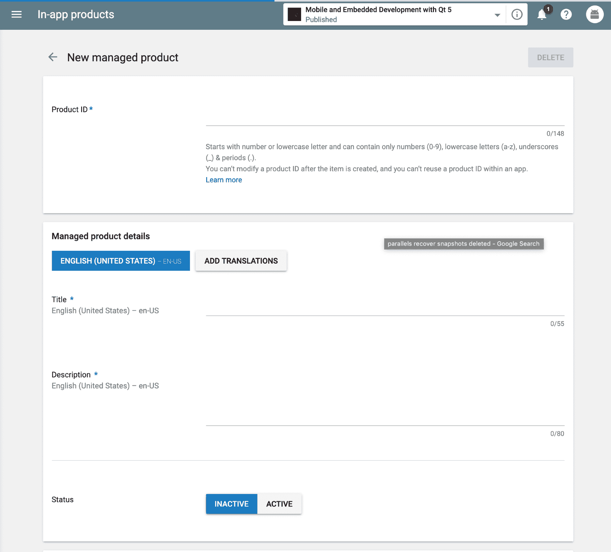
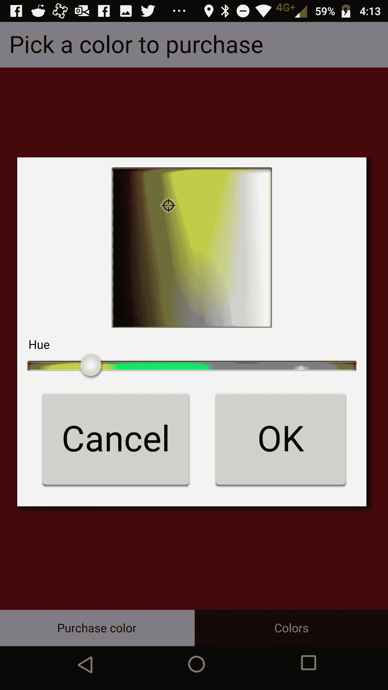
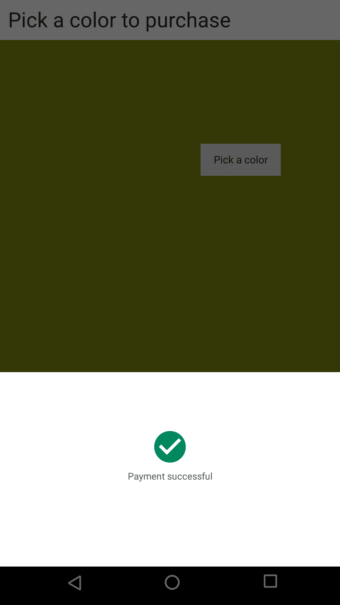
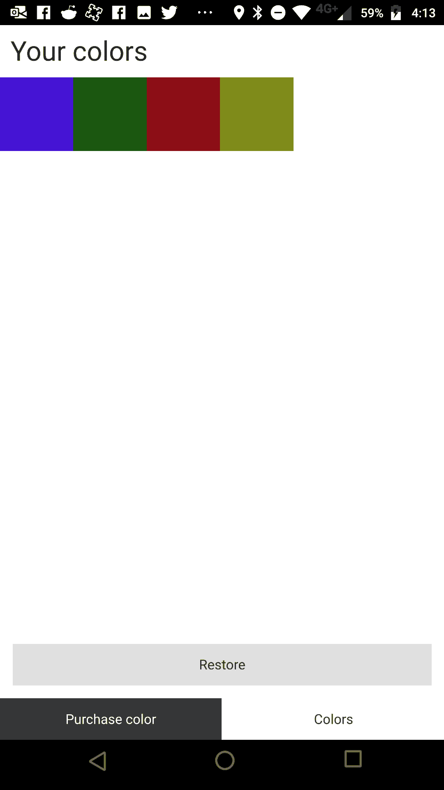

# 第十一章：使用 Qt 购买启用应用内购买

在手机上应用内购买对于生成更多收入至关重要。Qt 利用系统 API 将应用内购买引入 Qt 应用。Android 和 iOS 都有自己的应用商店，每个商店都有自己的产品注册方法。这就是 Qt 购买发挥作用的地方！

在本章中，我们将涵盖以下主题：

+   在 Android 和 iOS 商店注册

+   创建应用内产品

+   恢复购买

# 在 Android Google Play 上注册

销售移动应用程序往往是不稳定的；只有少数可供购买的应用程序实际上能赚钱。目前赚钱的最好方法之一是让您的应用程序免费下载，但包含应用内购买。这样，人们可以尝试您的应用程序，同时也有机会在需要增强体验时进行购买。本节假设您已经将应用程序注册到相关的移动商店。要激活应用内购买，您首先需要注册您打算出售的商品。这有其自身的优势，因为它允许测试人员 *购买* 并安装您打算出售的商品。

首先，让我们看看如何在 Android 设备上完成这项操作：

1.  您首先需要注册一个 Google 开发者账户，以便创建可在 Google Play 商店中使用的应用程序，[`developer.android.com`](https://developer.android.com)。

1.  您还需要添加和编辑 `AndroidManifest.xml` 文件。

在 Qt Creator 中，导航到：

项目 | 构建 | 构建设置 | 构建 Android APK | 创建模板。在这里，您需要编辑包名，理想情况下使用约定，`com.<公司>.<应用程序名称>`。当然，还有其他命名约定可供选择，您可以将其命名为任何您想要的名称。

1.  当您在 Google Play 商店更新您的包时，版本号必须递增。最简单的方法是勾选名为“包含 Qt 模块默认权限”的复选框。如果不勾选，您需要确保添加 `uses-permission android:name="com.android.vending.BILLING"` 权限。

1.  您还需要使用您的证书签名此包，因此如果您还没有这样做，请创建一个密钥库。

1.  在 Google 的应用内购买被称为 **Google Play Billing**，而 **Google Play Console** 是您发布应用到 Google Play 商店时访问的网站名称。您需要注册为开发者并支付注册费。（对我来说，是 25 澳元。）一旦支付了费用，您就可以设置一个商户账户。

1.  之后，是时候提供有关您应用程序的信息并上传商店图形，如截图和宣传视频。这也是您需要提供客户联系详情的地方。

1.  您可以通过仅向组织内的开发者提供内部测试来开发应用内购买。一旦解决了问题，并且您的应用进入 alpha 阶段，您可以扩大测试并执行封闭测试。之后，在 beta 开发期间，您可以进行公开测试。

1.  在 Google Play Console 网站上，点击您的应用并导航到商店展示 | 应用内产品 | 管理产品。

1.  然后，点击蓝色按钮**创建管理产品**，如下截图所示：


这将打开一个名为**新管理产品**的新表单，如下截图所示：



1.  在此表单中，完成以下字段：

+   产品 ID：这将用于 Qt 应用程序标识符

+   标题

+   描述

+   状态：活动或非活动

+   价格：此价格限制在$0.99 和$550.00 之间

1.  然后，点击保存。您将在 Google Play 上注册。

如果您为 Android 和 iOS 使用相同的产品 ID，将使开发应用内购买的过程更容易。

# 注册 iOS 应用商店

您应该已经注册在 Apple 开发者计划中，并已接受所有与税务、银行和其他数据相关的必要协议。

本节假设您已经注册了应用 ID，已签署相关协议等。在 iOS 上注册应用内购买相对简单：

1.  导航到您的 Apple App Store Connect 账户并登录。点击**应用**，因为我们将要注册应用的内置产品。

1.  点击您的应用，然后选择功能。在页面顶部，点击包含加号标记的蓝色圆圈，标记为**应用内购买（0）**，如下截图所示：


您可以从以下选项中选择：

| 可消耗 | 应用一次使用后需要重新购买的项目 |
| --- | --- |
| 非消耗性 | 一次性购买但不失效的项目 |
| 自动续订订阅 | 自动续订的订阅内容 |
| 非续订订阅 | 不再续订的订阅内容 |

1.  您将需要填写此过程的部分表格，因此事先决定以下标记项的值：

+   参考名称

+   产品 ID

+   价格

+   分级价格（起价$1.49）

+   开始日期

+   结束日期

+   显示名称

+   描述

+   截图

+   审查备注

一旦您有了产品 ID，请记住此信息以备后用。您在 Qt Creator 创建应用内购买产品时将需要它。

# 创建应用内产品

现在，真正的乐趣开始了！假设您设计了一个寻宝游戏，用户在地图上移动并寻找宝藏。在这种情况下，您可能希望提供加速游戏玩法，用户可以购买提示来帮助他们找到游戏的隐藏宝藏。

在我们的例子中，我们将出售颜色。颜色真的很好，因为它们是可收集的，并且用户可以相互之间出售和交易。

当你根据上一节中提到的在*iOS App Store*和*Android Google Play*上注册的说明开发并注册了你的应用后，你现在可以开发并测试 Qt 购买。我们将从使用 QML 开始。

在你的 QML 应用中使用 Qt 购买时的导入行如下所示：

```cpp
import QtPurchasing 1.0
```

将以下行添加到配置文件中：

```cpp
QT += purchasing
```

现在，决定你的应用内购买将是什么。请注意，Qt 购买有以下两种产品类型：

+   消耗品

+   可解锁

消耗品购买是一些一次性使用且可以多次购买的东西，例如游戏代币。一个例子是游戏货币。

可解锁购买是诸如额外角色、广告移除和关卡解锁等特性，这些特性可以被重新下载、恢复，甚至转移。

我们的颜色产品是一种消耗品购买，使用户能够购买他们想要的任意数量的颜色。

在 QtPurchasing 中，有以下三个 QML 组件：

+   `产品`

+   `存储`

+   `交易`

# 存储

`存储`组件代表平台默认的市场；在 Android 上，它是 Google Play 商店，而在 iOS 上则是 Apple App Store。一个`存储`元素有一个方法，`restorePurchases()`，当用户想要恢复他们的购买时使用。

你可以将`产品`作为`存储`的子组件，或者作为独立组件，其中`存储`对象由 ID 指定。

# 产品

`产品`组件代表应用内购买产品。`identifier`属性对应于你在相关商店注册应用内购买产品时使用的产品 ID。

关于`产品`组件，有以下几点需要注意：

+   `产品`可以是`存储`的子组件，或者可以使用`存储`的`id`属性来引用

+   `产品`可以有两种类型之一：`Product.Consumable`或`Product.Unlockable`

+   一个`Product.Consumable`产品可以购买多次，前提是购买已经完成

+   一个`Product.Unlockable`产品一旦购买就可以恢复

以下代码演示了一个具有`Product.Consumable`类型的`产品`组件：

```cpp
Store {
    id: marketPlace
}

Product {
    id: colorProduct
    store:marketPlace
    identifier: "some.store.id"
    type: Product.Consumable
}

Button {
    text: "Buy this color"
    onClicked: {
        colorProduct.purchase()
   }
}
```

现在，是时候继续我们的购买选项了。看看下面的截图：



要开始购买流程，请使用`purchase()`方法，OK 按钮调用该方法以从 Google Play 商店弹出以下对话框：


注意到前面截图中的付款不是真实的，而是使用 Google 测试卡进行的。没有进行货币交换。

你现在将想要处理`onPurchaseSucceeded`和`onPurchaseFailed`信号。如果你有可恢复的产品，请在`onPurchaseRestored`信号中恢复，如下所示：

```cpp
onPurchaseSucceeded: {
    console.log("sale succeeeded " +  transaction.orderId)
// do something like fill a model view

    transaction.finalize()
}
```

您还应该保存交易。当应用启动时，它会查询商店中的任何购买。如果用户已购买产品，`onPurchaseSucceeded` 信号将被调用，并带有每个购买的过渡 ID，这样应用就知道已经完成了哪些购买，并可以相应地采取行动。

以下截图说明了 Google Play 商店上的成功购买：



如果购买因任何原因失败，将调用 `onPurchaseFailed`，如下所示：

```cpp
onPurchaseFailed: {
    console.log("product purchase failed " + transaction.errorString)
    transaction.finalize()
}
```

您可能希望为这里查看的任何事件提供用户通知，仅为了提供清晰并避免用户混淆。

# 交易

`Transaction` 代表市场商店中购买的产品，并包含有关购买的信息，包括 `status`、`orderId` 以及描述可能发生的任何错误的字符串。以下表格解释了这些属性：

| `errorString` | 描述错误的特定平台字符串 |
| --- | --- |
| `failureReason` | 可以是 `NoFailure`、`CanceledByUser` 或 `ErrorOccurred` |
| `orderId` | 由平台商店发出的唯一 ID |
| `product` | `product` 对象 |
| `status` | 可以是 `PurchaseApproved`、`PurchaseFailed` 或 `PurchaseRestored` |
| `timestamp` | 交易发生的时间 |

`Transaction` 有一个方法：`finalize()`。所有交易无论成功与否都需要最终化。

一旦用户成功购买了一种颜色，他们应该会看到如下截图所示的内容：



注意可解锁产品可以恢复。让我们继续前进，看看如何处理这一点。

# 恢复购买

用户可能出于多种原因想要恢复购买。也许他们重新安装了应用，切换到了新手机，或者甚至重置了现有的手机。

只有可解锁产品才能恢复。

恢复购买通过 `restorePurchases()` 方法初始化，然后将为每个恢复的购买调用 `onPurchaseRestored` 信号，如下所示：

```cpp
Button {
    text: "Restore Purchases"
    onClicked: {
        colorProduct.restorePurchases()
    }
}
```

在 `product` 组件中，它看起来如下所示：

```cpp
onPurchaseRestored: {
    // handle product
    console.log("Product restored "+ transaction.orderId)

}
```

如您所见，QML 使得添加内购以及必要时恢复它们变得非常简单。

# 摘要

Qt 使得实现内购相当简单。大部分工作将涉及整理您的应用，并在您平台的应用商店中注册内购产品。

您现在应该能够将内购产品注册到相关的应用商店。您还应该知道如何使用 QML 实现内购产品并执行商店转换。我们还探讨了如何恢复任何可解锁产品的购买。

这章全部关于手机应用和购买。在下一章中，我们将探讨各种交叉编译方法以及如何使用嵌入式设备进行远程调试。
