# 第十二章：交叉编译和远程调试

由于在嵌入式设备上使用 Linux 系统的可能性很大，我们将介绍在 Linux 上设置交叉编译器的步骤。手机平台有自己的开发方式，这也会被讨论。你将学习如何为不同设备编译跨平台应用，并通过网络或 USB 连接进行远程调试。我们将探讨各种移动平台。

在本节中，我们将涵盖以下主题：

+   交叉编译

+   连接到远程设备

+   远程调试

# 交叉编译

交叉编译是一种在宿主机上为不同于宿主机运行架构的应用程序和库构建的方法。当你使用 Android 或 iOS SDKs 为手机构建时，你正在进行交叉编译。

做这件事的一个简单方法就是使用 Qt for Device Creation，或者 Qt 的 Boot to Qt 商业工具。它可用于评估或购买。

你不必自己构建任何工具和设备系统镜像。我为我使用的树莓派使用了 Boot to Qt。这使得设置变得更快、更简单。还有更多传统的为不同设备构建的方法，除了目标机器之外，它们大致相同。

如果你使用的是 Windows，交叉编译可能会有些棘手。你可以安装 MinGW 或 Cygwin 来构建自己的交叉编译器，安装 Windows Subsystem for Linux，或者安装预构建的交叉`toolchain`，例如来自 Sysprogs。

# 传统交叉工具

获取交叉编译器有许多方法。设备制造商可以与其软件栈一起发布交叉`toolchain`。当然，如果你正在构建自己的硬件，或者只是想创建自己的交叉`toolchain`，还有其他选择。你可以为你的设备架构下载预构建的交叉`toolchain`，或者自己构建它。如果你最终决定编译`toolchain`，你需要一台快速且健壮的机器，并且有大量的磁盘空间，因为它将花费相当长的时间来完成，并且会使用大量的文件系统——如果你构建整个系统，可能需要 50 GB。

# DIY 工具链

对于某些项目，你可能需要或者必须（如果没有提供`toolchain`）自己构建自己的`toolchain`。以下是一些较为知名的交叉工具：

+   **Buildroot**：[`buildroot.org/`](https://buildroot.org/)

+   **Crosstool-NG**：[`crosstool-ng.github.io/`](http://crosstool-ng.github.io/)

+   **OpenEmbedded**：[`www.openembedded.org`](http://www.openembedded.org)

+   **Yocto**：[`www.yoctoproject.org/`](https://www.yoctoproject.org/)

+   **Ångström**：[`wp.angstrom-distribution.org/`](http://wp.angstrom-distribution.org/)

BitBake 被 OpenEmbedded、Yocto 和 Ångström（以及 Boot to Qt）使用，因此从其中之一开始可能最容易。您可以说它是 *Buildroot 2.0*，因为它是原始 Buildroot 的第二次版本。尽管如此，它是一个完全不同的构建。Buildroot 更简单，没有包的概念，因此升级系统可能更困难。

我将在第十五章 构建 Linux 系统中描述使用 BitBake 构建 `toolchain`，本质上它与构建系统镜像非常相似；事实上，它必须在构建系统镜像之前构建 `toolchain`。

# Buildroot

Buildroot 是一个帮助构建完整系统的工具。它可以构建交叉 `toolchain` 或使用外部的一个。它传统上使用 ncurses 接口进行配置，就像 Linux 内核一样。它还有一个新的 ncurses 配置器，但还有一个基于 Qt 的配置器。让我们使用那个吧！

在您解压缩 Buildroot 的目录中，运行以下命令：

```cpp
make xconfig
```

哎！它使用 Qt 4。如果您不想安装 Qt 4，您始终可以使用 `make menuconfig` 或 `make nconfig`。

这是 Qt 接口的外观：

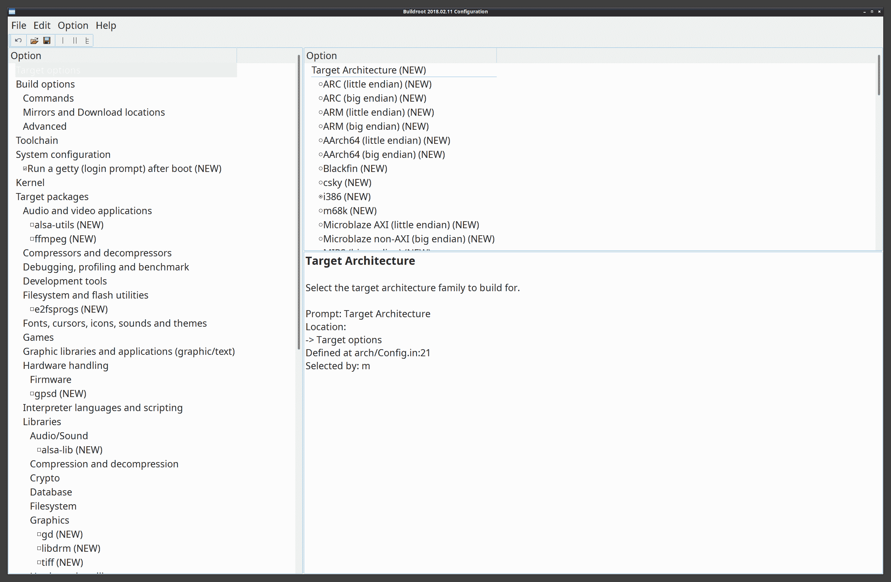

默认情况下，Buildroot 将创建一个基于 BusyBox 的系统，而不是 glibc。

一旦您已配置好系统，保存配置并关闭配置器。然后运行 `make`，坐下来，让它构建。它将文件放入一个名为 `output/` 的目录中，其中您的系统镜像位于一个名为 image 的目录中。

# Crosstool-NG

Crosstool-NG 是用于构建工具链的，而不是系统镜像。您可以使用用 crosstools 构建的 `toolchain` 来构建系统，尽管您可能需要手动完成。

Crosstool-NG 与 Buildroot 类似，因为它使用 ncurses 配置要构建的 `toolchain`。一旦您解压缩它，您需要运行以下 `bootstrap` 脚本：

```cpp
./bootstrap
```

要安装它，您需要使用以下 `--prefix` 参数调用配置器：

```cpp
./configure --prefix=/path/to/output
```

您也可以按照以下方式本地运行它：

```cpp
./configure --enable-local
```

它将告诉您需要安装的任何缺失的包。在我的 Ubuntu Linux 上，我必须安装 `flex`、`lzip`、`help2man`、`libtool-bin` 和 `ncurses-dev`。

然后运行 `make` 和 `make install`，如果您配置了前缀。

您需要将 `/path/to/output/bin` 添加到您的 `$PATH` 中。

`export PATH=$PATH:/path/to/output/bin`。

现在您可以运行以下配置：

```cpp
./ct-ng menuconfig
```

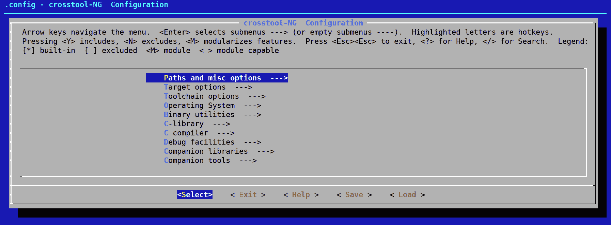

然后运行 `make`，这将构建交叉 `toolchain`。

# 预构建工具

有公司为各种设备和架构提供了以下预构建的交叉工具链：

+   **Code Sourcery**: [`www.codesourcery.com/`](http://www.codesourcery.com/)

+   **Bootlin**: [`toolchains.bootlin.com/toolchains.html`](https://toolchains.bootlin.com/toolchains.html)

+   **Linaro, Debian, Fedora**：从软件包管理器下载

+   **Boot to Qt**: [`doc.qt.io/QtForDeviceCreation/qtb2-index.html`](https://doc.qt.io/QtForDeviceCreation/qtb2-index.html)

+   **Sysprogs**: [`gnutoolchains.com/`](http://gnutoolchains.com/)

这些是一些较好的选择。我大多数都体验过，并且一度使用过。每个都附带安装和使用说明。Linaro、Debian 和 Fedora 都制作 ARM 交叉编译器。这是一本关于 Qt 开发的书籍，所以我将描述 Qt 公司的产品——Boot to Qt。

# Boot to Qt

Qt 公司的 Boot to Qt 产品包含开发工具和预构建的操作系统镜像，你可以将其写入微 SD 卡或烧录到设备上运行。除了 Raspberry Pi 之外，他们还支持以下其他设备：

+   Boundary Devices i.MX6 Boards

+   Intel NUC

+   NVIDIA Jetson TX2

+   NXP i.MX 8QMax LPDDR4

+   Raspberry Pi 3

+   Toradex Apalis iMX6 和 iMX8

+   Toradex Colibri iMX6, iMX6ULL, 和 iMX7

+   WaRP7

我选择了 RPI，因为我已经有一个带有触摸屏的 3 型模型在身边。

当你运行系统镜像时，你会启动一个 Qt 应用程序，该应用程序充当示例应用程序的启动器。它还设置 Qt Creator 以便能够在设备上运行交叉编译的应用程序。你可以在 Qt Creator 中点击运行按钮来在设备上运行它。

Boot to Qt 是一种快速且简单的方法，可以在相对较小的系统上快速将原型运行在触摸屏上。Qt 公司目前正在努力让 Qt 在更小的设备上运行良好，例如微控制器。

你可以直接运行 Boot to Qt 的`toolchain`；你只需要源环境文件。在 Raspberry Pi 和 Boot to Qt 的情况下，它被称为`environment-setup-cortexa7hf-neon-vfpv4-poky-linux-gnueabi`。你也可以直接调用`toolchain`的 qmake 并在你的配置文件`/path/to/x86_64-pokysdk-linux/usr/bin/qmake myApp.pro`上运行它。

这里还有一个选择是直接使用 Qt Creator 并选择 Raspberry Pi 作为目标。

如果你使用 Windows，有几个选项你可以使用来获取交叉编译`toolchain`。

# Windows 上的交叉工具链

你可以在 Windows 上以几种方式交叉编译，我们可以简要地介绍一下。它们如下，但无疑还有其他未涵盖的：

+   Sysrogs 为 Windows 提供了预构建的交叉`toolchain`。

+   Windows Subsystem for Linux.

# Sysprogs

Sysprogs 是一家为在 Windows 上运行针对 Linux 设备的交叉工具链的公司。他们的`toolchain`可以从[`gnutoolchains.com/`](http://gnutoolchains.com/)下载

1.  安装完成后，启动一个 Qt 5.12.1（MinGW 7.3.0 64 位）控制台终端

1.  你需要按照以下方式将`toolchain`添加到你的路径中：

```cpp
set PATH=C:\SysGCC\raspberry\bin;%PATH%
```

1.  按照以下方式将`PATH`添加到 Qt 的`mingw`中：

```cpp
set PATH=C:\Qt\Tools\mingw730_64\bin;%PATH%
```

你还必须构建 OpenGL 和其他 Qt 的要求。

按照以下方式配置 Qt 以交叉编译：

```cpp
..\qtbase/configure -opengl es2 -device linux-rasp-pi-g++ -device-option CROSS_COMPILE=C:\SysGCC\raspberry\bin\arm-linux-gnueabihf- -sysroot C:\SysGCC\raspberry\arm-linux-gnueabihf\sysroot -prefix /usr/local/qt5pi -opensource -confirm-license -nomake examples -make libs -v -platform win32-g++
```

# Windows Subsystem for Linux

您可以安装 Windows Subsystem for Linux 来安装交叉编译器，您可以从 [`docs.microsoft.com/en-us/windows/wsl/install-win10`](https://docs.microsoft.com/en-us/windows/wsl/install-win10) 下载。

然后，您可以选择所需的 Linux 发行版——Ubuntu、OpenSUSE 或 Debian。一旦安装完成，您就可以使用内置的包管理器来安装 Linux 的 `toolchain`。

# 移动平台特定工具

iOS 和 Android 都提供了预构建的交叉工具和 SDK，可供下载。如果您打算在移动平台上使用 Qt，则需要其中之一，因为 Qt Creator 依赖于原生平台构建工具。

# iOS

Xcode 是您想要下载的 IDE 巨兽，它只能在 macOS X 上运行。如果您还没有，可以从桌面上的 App Store 下载它。您需要注册为 iOS 开发者。从那里，您可以选择要下载和设置的 iOS 构建工具。一旦开始下载，这个过程就相当自动化了。

您还可以从命令行使用这些工具，但您需要从 Xcode 内安装命令行工具。对于 Sierra，您只需在终端中输入 `gcc` 命令即可。在这种情况下，系统将打开一个对话框询问您是否想要安装命令行工具。或者，您可以通过运行 `xcode-select --install` 来安装它。

我不知道有任何嵌入式系统工具可以与 Xcode 一起使用，除非您将 iWatch 或 iTV SDKs 计算在内。这两个 SDK 您都可以通过 Xcode 下载。

您当然可以使用 Darwin，因为它开源且基于 **伯克利软件发行版**（**BSD**）。您也可以使用 BSD。这远远达不到在任意嵌入式硬件上运行苹果操作系统的能力，因此您的选择有限。

# Android

Android 为其 IDE 开发包提供了 Android Studio，并且适用于 macOS X、Windows 和 Linux 系统。

与 Xcode 一样，Android Studio 也提供了命令行工具，您可以通过 SDK 管理器或 `sdkmanager` 命令进行安装。

`~/Android/Sdk/tools/bin/sdkmanager --list` 将列出所有可用的包。如果您想下载 `adb` 和 `fastboot` 命令，可以执行以下操作：

`~/Android/Sdk/tools/bin/sdkmanager install "platform-tools"`

Android 为其不同版本提供了吸引人的代码名称，这与它们的 API 级别完全不同。在安装 Android SDKs 时，您应该坚持使用 API 级别。我有一部运行 Android 版本 8.0.0 的手机，其代码名称为 Oreo。我需要安装 API 级别 26 或 27 的 SDK。如果我想安装 SDK，我可能会执行以下操作：

```cpp
~/Android/Sdk/tools/bin/sdkmanager install "platforms;android-26"
```

在使用 Qt 进行开发时，您还需要安装 Android NDK。我使用的是 NDK 版本 10.4.0，或者称为 r10e，Qt Creator 与之配合工作得很好。我在运行较新版本的 NDK 时遇到了问题。正如他们所说，您的体验可能会有所不同。

# QNX

QNX 是一个商业化的类 UNIX 操作系统，目前由 Blackberry 拥有。它不是开源的，但我认为在这里提一下是合适的，因为 Qt 在 QNX 上运行，并且在市场上被商业使用。

# 连接到远程设备

这是一本关于 Qt 开发的书，我将坚持使用 Qt Creator。连接到任何设备的方法几乎相同，只有一些细微的差别。你也可以通过终端使用 **Secure Shell** (**SSH**) 和其他相关工具进行连接。我经常使用这两种方法，因为每种方法都有其自身的优缺点。

# Qt Creator

我记得当现在被称为 Qt Creator 的版本首次在诺基亚内部进行测试时，它被称为 Workbench。当时，它基本上是一个好的文本编辑器。从那时起，它获得了大量的优秀功能，并且它是我 Qt 项目的首选 IDE。

Qt Creator 是一个多平台 IDE，它可以在 macOS X、Windows 和 Linux 上运行。它可以连接到 Android、iOS 或通用的 Linux 设备。你甚至可以获得 UBports（开源 Ubuntu 手机）或 Jolla 手机等设备的 SDK。

要配置您的设备，在 Qt Creator 中导航到 工具 | 选项... | 设备 | 设备。

# 通用的 Linux

一个通用的 Linux 设备可能是一个定制的嵌入式 Linux 设备，甚至是一个树莓派。它应该运行一个 SSH 服务器。由于我使用了一个 RPI，我将使用它进行演示。

以下是在设备选项卡中显示的连接细节，用于树莓派：

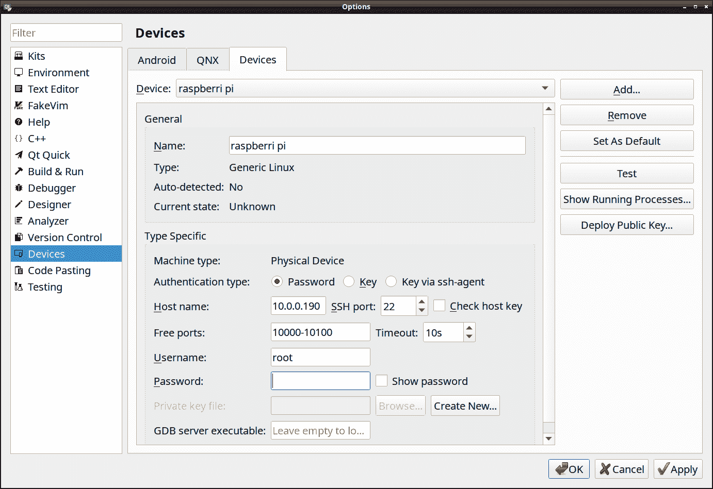

如您所见，最重要的可能就是主机名。请确保主机名配置中的 IP 地址与设备的实际 IP 地址相匹配。其他设备可能使用常规网络而不是直接 USB 连接。

# Android

您需要安装 Android SDK 和 NDK。

Android 是一个使用直接 USB 连接的设备，因此当运行应用程序时，复制应用程序二进制文件将更容易：

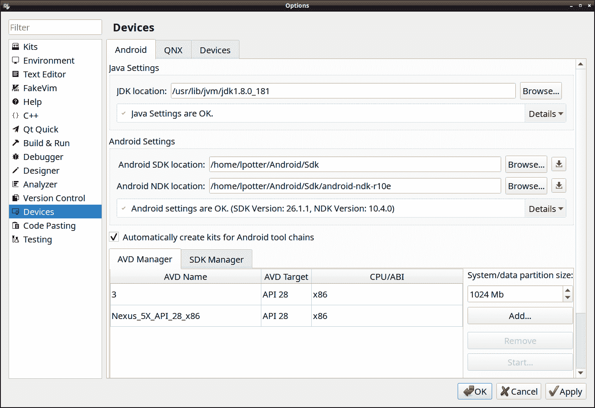

Qt Creator 大概会自动配置这个连接。

# iOS

确保您的设备首先被 Xcode 发现，然后 Qt Creator 将自动识别并使用它。

它看起来可能像这张图片：

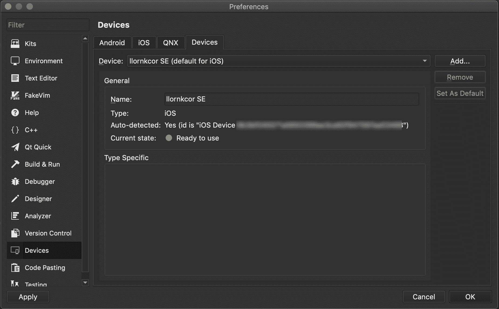

注意到那个类似绿色 LED 的图标吗？是的，一切正常！

# 硬件裸机

如果您的设备没有运行 SSH 服务器，您可以使用 `gdb/gdbserver` 或硬件服务器通过它进行连接。您首先需要启用插件。在 Qt Creator 中，导航到 **帮助** | **关于插件** | **设备支持**，然后选择裸机。裸机连接使用您可以从 `http://openocd.org` 获取的 OpenOCD。OpenOCD 不是一个新的焦虑症，而是一个通过 JTAG 接口运行的片上调试器。Qt Creator 还支持 ST-LINK 调试器。两者都使用 JTAG 接口。有 USB JTAG 接口以及传统的 JTAG 接口，它们不需要任何设备驱动程序即可连接。

写这部分内容让我想起了当 Trolltech 推出 Trolltech Greenphone 并使其运行，以及在其他设备上工作，比如 OpenMoko 手机时的情景。美好的时光！

现在我们已经连接了设备，我们可以开始调试。

# 远程调试

开发软件很困难。所有软件都有 bug。有些 bug 比其他 bug 更痛苦。最糟糕的情况可能是当你遇到一个随机崩溃，需要特定的触发事件序列，这些事件序列位于一个只读文件系统的远程设备上，而这个设备是在发布模式下构建的。我经历过。做过。甚至得到了一件 T 恤。（我还有许多来自过去的 Trolltech 和诺基亚 T 恤。）

传统上，远程调试涉及在设备上运行`gdbserver`命令。在非常小的机器上，由于没有足够的 RAM 直接运行 gdb，所以在远程设备上运行`gdbserver`可能是使用 gdb 的唯一方法。让我们播放一些 groove salad，开始工作吧！

# gdbserver

你可能想体验没有 UI 的远程调试，或者类似的东西。这将帮助你开始。`gdbserver`命令需要在远程设备上运行，并且需要有一个串行或 TCP 连接。

在*远程*设备上，运行以下命令：

```cpp
gdbserver host:1234 <target> <app args>
```

使用`host`参数将在端口`1234`上启动`gdbserver`。你也可以通过运行以下命令将调试器附加到正在运行的应用程序：

```cpp
gdbserver host:1234 --attach <pid>
```

`pid`是你试图调试的已运行应用程序的进程 ID，你可以通过运行`ps`、top 或类似的命令来获取。

在*主机*设备上，运行以下命令：

```cpp
gdb target remote <host ip/name>:1234
```

然后，你将通过运行`gdb`的控制台在主机设备上`issue`命令。

如果你遇到崩溃，崩溃发生后，你可以输入`bt`来获取一个回溯列表。如果你在远程设备上有崩溃内存转储，或者称为核心转储，`gdbserver`不支持远程调试核心内存转储。你必须远程运行`gdb`本身才能完成这项工作。

通过命令行使用`gdb`可能对某些人来说很有趣，但我更喜欢 UI，因为它更容易记住要完成的事情。拥有一个可以进行远程调试的 GUI 可以帮助你，如果你不太熟悉运行`gdb`命令，因为这可能是一项艰巨的任务。Qt Creator 可以进行远程调试，所以让我们继续使用 Qt Creator 进行调试。

# Qt Creator

Qt Creator 在设备上使用`gdbserver`，所以它本质上只是一个 UI 界面。你需要为设备上的`gdbserver`提供 Python 脚本支持；否则，你会看到一条消息“Selected build of GDB does not support Python scripting”，并且它将无法工作。

对于大多数情况，使用 Qt Creator 进行调试对于 Android、iOS 和任何支持的 Boot to Qt 设备来说都是即插即用的。

在 Qt Creator 中加载任何项目，它都可以处理 C++ 调试，以及调试 Qt Quick 项目。请确保在 Qt Creator 的运行设置页面中正确配置了设置，在下面的调试器设置中，以启用所需的 `qml` 调试和/或 C++ 调试。

将以下内容添加到您的项目中并重新构建：

```cpp
CONFIG+=debug qml_debug
```

将以下内容添加到应用程序启动参数 `-qmljsdebugger=port:<port>, host:<ip>`。

要中断应用程序的执行，请单击工具栏上提示为 '中断 GDB for "yourapp"' 的图标。然后您可以检查变量的值并逐行执行代码。

在某处设置一个断点——在相关的行上右键单击并选择在行上设置断点。

按 *F5* 开始应用程序构建（如果需要）。一旦成功构建，它将被传输并在设备上执行，同时远程调试服务启动。当然，如果设置了断点，它将在断点处停止执行。要继续正常执行，请按 *F5* 直到遇到那个痛苦的崩溃，然后您可以检查那个美妙的回溯！从这里，您可能希望收集足够的线索来修复它。

Qt Creator 默认支持的其他键命令如下：

+   *F5*：开始/继续执行

+   *F9*：切换断点

+   *F10*：跳过

+   *Ctrl* + *F10*：运行到当前行

+   *F11*：进入

+   *Shift* + *F11*：跳出

让我们试试。加载本章的源代码。

要在 Qt Creator 编辑器中的当前行切换断点，请按 Linux 和 Windows 上的 *F9*，或在 macOS 上按 *F8*，如下所示：

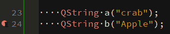

现在通过按 *F5* 运行调试器中的应用程序来启动调试器。它将在我们的行上停止执行，如下所示：

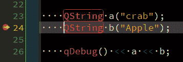

看到那个小黄色箭头吗？它告诉我们执行在执行语句之前停止了。

您将能够看到变量的以下值：

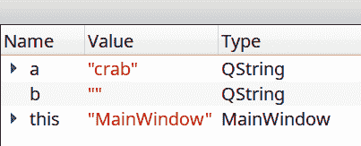

如您所见，断点在 `QString` `b` 被初始化之前就停止了执行，所以其值是 `""`。如果您按 *F10* 或跳过，`QString` `b` 将被初始化，您可以看到新的值如下：

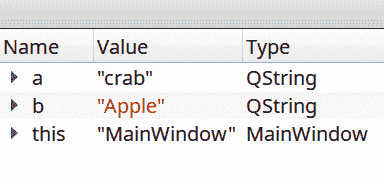

您可以从下面的屏幕截图注意到，执行行也会移动到下一行：

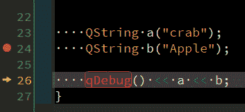

您还可以通过在编辑器中右键单击断点并选择编辑断点来编辑断点。让我们在 for 循环的第 20 行设置一个断点，如下所示：

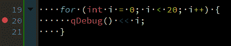

右键单击并选择编辑断点以打开以下编辑断点属性对话框：


编辑条件字段并添加 `i == 15`，然后点击确定：

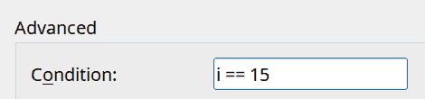

通过点击 *F5* 运行调试器中的应用程序。点击字符串按钮。当它遇到断点时，你可以看到它停止时 i 包含的值是 15：

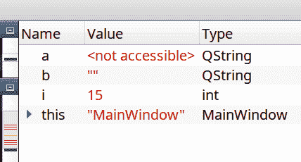

你可以接着进入或跳过。

让我们现在看看一个崩溃错误，当你点击崩溃按钮时，它是一个除以零的崩溃。

在第 *31* 行设置断点。运行调试器，它将在崩溃前停止。现在执行下一步。你应该会看到一个如下所示的对话框弹出：

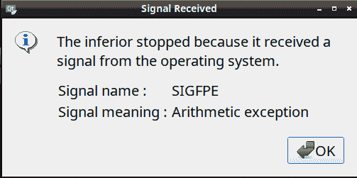

哇，现在看起来真丑。

在以下屏幕截图所示的堆栈视图中，你可以看到程序崩溃的位置：

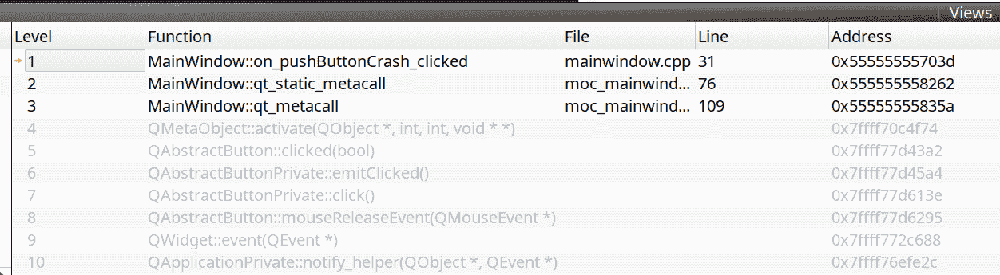

是的，它就在我放的地方！在 C++ 中除以零会发生糟糕的事情。

# 摘要

调试是一个强大的过程，通常需要修复错误。你可以从命令行运行调试器，例如 `gdb`，或者你应该能够将 `gdb` 连接到在远程设备上运行的调试服务器。使用基于 GUI 的调试器会更有趣。你应该能够通过远程连接从 Qt Creator 调试运行在您的移动或嵌入式设备上的 Qt 应用程序。

下一步是部署你的应用程序。我们将探讨在几个不同的移动和嵌入式平台上部署你的应用程序的多种方法。
