# 第十五章：构建 Linux 系统

在嵌入式设备上构建自己的 Linux 系统可能是一项令人望而生畏的任务。了解需要哪些软件才能使堆栈启动并运行；了解软件依赖项；找到要下载的软件并下载它；配置、构建和打包所有这些软件——这实际上可能需要几周的时间。在过去的好日子里是这样的。现在，有一些优秀的工具可以简化构建自定义 Linux 文件系统的过程。如果您有一台足够强大的机器，您可以在一天之内启动并运行嵌入式设备。

原型设计始终是设备创建的第一步。拥有正确的工具将使此过程更加流畅。嵌入式系统需要快速且直接地启动到 Qt 应用程序，例如汽车仪表盘。在本章中，您将学习如何使用 Yocto 和 Boot to Qt for Device Creation 创建嵌入式 Linux 系统的完整软件栈。将使用 Raspberry Pi 设备作为目标来演示如何构建操作系统。

我们将探讨以下内容：

+   Bootcamp – Boot to Qt

+   DIY – 定制嵌入式 Linux

+   部署到嵌入式系统

# Bootcamp – Boot to Qt

我们已经在第十二章中讨论了 Qt 公司的 Boot to Qt 系统，*交叉编译和远程调试*。Boot to Qt 提供了配置文件，供您使用以创建自定义操作系统。它需要 BitBake 软件 和 Yocto 项目，这是一个开源项目，旨在帮助构建基于 Linux 的自定义系统，该项目本身基于我的老朋友 OpenEmbedded。

在本书的 `/path/to/install/dir/<Qtversion>/Boot2Qt/sources/meta-boot2qt/b2qt-init-build-env` 文件中有一个名为 `b2qt-init-build-env` 的脚本，该脚本将为 Raspberry Pi 初始化构建。您可以从您选择的构建目录中运行该命令。

要获取支持设备的列表，请使用 `list-devices` 参数。我的系统输出如下：

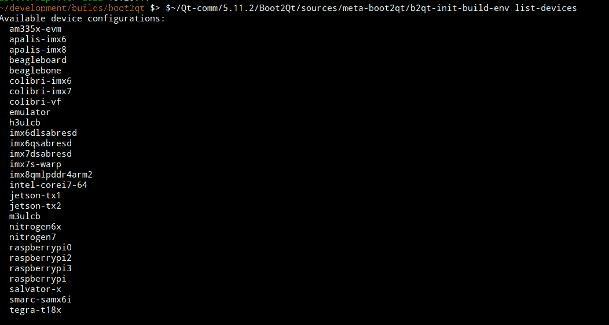

您需要初始化构建系统和构建环境，因此请运行名为 `b2qt-init-build-env` 的脚本，该脚本位于 Boot to Qt 安装目录中：

```cpp
/path/to/install/dir/<Qtversion>/Boot2Qt/sources/meta-boot2qt/b2qt-init-build-env init --device raspberrypi3
```

将 `/path/to/install/dir` 替换为 `Boot2Qt` 所在的目录路径，通常是 `~/Qt`。同时，将 `<Qtversion>` 替换为安装的 Qt 版本。如果您使用的是不同的设备，将 `raspberrypi3` 更改为 `Boot2Qt` 支持的设备列表中的一个。

Yocto 提供了脚本和配置，以便您可以构建自己的系统并对其进行自定义，也许还可以添加 MySQL 数据库支持。`B2Q` 脚本 `setup-environment.sh` 将帮助设置开发环境。

您需要将设备类型导出到 `MACHINE` 环境变量中，并源 `environment` 设置脚本：

```cpp
export MACHINE=raspberrypi3
source ./setup-environment.sh
```

现在，您可以使用以下命令构建默认镜像：

```cpp
 bitbake b2qt-embedded-qt5-image
```

您可以先通过添加默认情况下不存在的所需软件包来自定义它——比如说添加`mysql`插件，这样我们就可以远程访问数据库了！让我们看看如何做到这一点。

# 滚动自己的——定制嵌入式 Linux

Yocto 有一个历史，它起源于 OpenEmbedded 项目。OpenEmbedded 项目在编程世界中的名字来源于 OpenZaurus 项目。当时，我参与了 OpenZaurus 及其相关项目，最初的焦点是运行 Trolltech 的 Qtopia 的 Sharp Zaurus，使用的是不同的操作系统。OpenZaurus 是一个开源的替代操作系统，用户可以将它刷到他们的设备上。构建系统的演变从基于 Makefile 的 Buildroot 到被 BitBake 取代。

您当然可以为此部分构建 Poky 或 Yocto。我将使用`Boot2Qt`配置。

要开始使用 Yocto 并进行定制，请使用以下命令创建基本映像：

```cpp
bitbake core-image-minimal
```

这将需要相当多的时间。

基本定制过程将与定制 Boot to Qt 相同，包括添加层和配方，以及定制现有配方。

# 系统定制

默认情况下，`Boot2Qt rpi`映像不包含 MySQL Qt 插件，所以我之前提到的 MySQL 示例将无法工作。我通过自定义映像构建添加了它。

Yocto 和所有基于 BitBake 的系统使用`conf/local.conf`文件，以便您可以自定义映像构建。如果您还没有，在运行`setup-environment.sh file`之后，创建一个`local.conf`文件并添加以下代码行：

```cpp
 PACKAGECONFIG_append_pn-qtbase = " sql-mysql"
```

`sql-mysql`部分来自 Qt 的配置参数，因此这是告诉`bitbake`将`-sql-mysql`参数添加到配置参数中，这将构建 MySQL 插件并将其包含在系统映像中。还有其他选项，但您需要查看`meta-qt5/recipes-qt/qt5/qtbase_git.bb`文件中以`PACKAGECONFIG`开头的行。

我还需要进行一项其他定制，这与 Qt 无关。OpenEmbedded 使用`www.example.com` URL 来测试连通性。由于某种原因，我的 ISP 的 DNS 没有`https://www.example.com`的条目，所以我最初无法访问它，构建立即失败。我可以在计算机的网络配置中添加一个新的 DNS，但告诉`bitbake`使用另一个服务器进行在线检查更快，所以我将以下行添加到我的`conf/local.conf`文件中：

```cpp
CONNECTIVITY_CHECK_URIS ?= "https://www.google.com/
```

如果您需要进行更广泛的定制，您可以创建自己的`bitbake`层，这是一个配方集合。

# local.conf 文件

`conf/local.conf`文件是您可以进行本地更改以构建映像的地方。就像我们在上一节中提到的`PACKAGECONFIG_append_pn-`一样，还有其他方法可以添加软件包和发布其他配置命令。模板化的`local.conf`包含大量注释，以指导您完成这个过程。

`IMAGE_INSTALL_append` 允许您将包添加到镜像中。

`PACKAGECONFIG_append_pn-<package>` 允许您将特定于包的配置追加到包中。在`qtbase`的情况下，它允许您向配置过程添加参数。每个配方都将具有特定的配置。

# meta-<layer> 目录

层是一种向包添加功能或向现有包添加功能的方式。要创建自己的层，您需要在`sources/`目录中创建一个模板目录结构，在那里您初始化了`bitbake`构建。将`<layer>`更改为您打算使用的名称：

```cpp
sources/meta-<layer>/
sources/meta-<layer>/licenses/
sources/meta-<layer>/recipes/
sources/meta-<layer>/conf/layer.conf
sources/meta-<layer>/README
```

`licenses/`目录是放置任何许可证文件的位置。

您可能添加的任何配方都直接放入`recipes/`中。关于这一点稍后会有更多说明。

`layer.conf`文件是层的控制配置。使用此文件的起点可以是以下内容，其中包含通用条目：

```cpp
BBPATH .= ":${LAYERDIR}"
BBFILES += "${LAYERDIR}/recipes-*/*/*.bb \
${LAYERDIR}/recipes-*/*/*.bbappend"
BBFILE_COLLECTIONS += "meta-custom"
BBFILE_PATTERN_meta-custom = "^${LAYERDIR}/"
BBFILE_PRIORITY_meta-custom = "5"
LAYERVERSION_meta-custom = "1"
LICENSE_PATH += "${LAYERDIR}/licenses"
```

将`meta-custom`更改为您想要的任何名称。

一旦创建了层，您需要将其添加到`conf/bblayers.conf`文件中，该文件位于您在`Boot2Qt`构建中初始化的目录中。在我的情况下，这是`~/development/b2qt/build-raspberrypi3/`。

我们现在可以向我们的自定义层添加一个或多个包。

# `<recipe>.bb`文件

如果您有现有的代码，或者如果某个软件项目需要包含在系统镜像中，您也可以创建自己的配方。

在自定义层中，我们创建了一个`recipes/`目录，我们的新配方可以在这里存在。

为了了解如何编写配方，请查看 Boot2Qt 或 Yocto 中包含的一些配方。

有一些脚本可以帮助创建配方文件，即`devtool`和`recipetool`。`devtool`和`recipetool`命令在执行功能上相当相似。`Devtool`在需要应用补丁和修改代码时会使事情变得更容易。有时，您的软件需要在实际设备上进行开发或调试，例如，如果您正在开发使用任何传感器的产品。`Devtool`还可以构建配方，这样您就可以解决其中的问题。

# devtool 命令

`devtool --help`的输出如下：

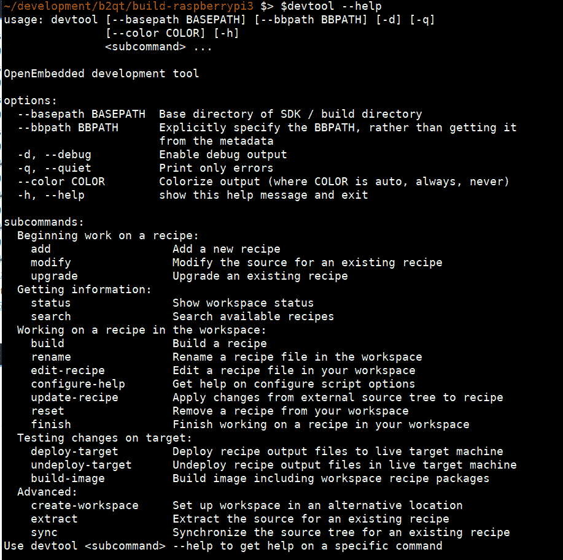

最重要的参数将是`add`、`modify`和`upgrade`。

对于`devtool`，我将使用 Git 仓库 URL 来添加我的`sensors-examples`仓库：

```cpp
devtool add sensors-examples https://github.com/lpotter/sensors-examples.git
```

运行前面的命令将输出类似以下内容：

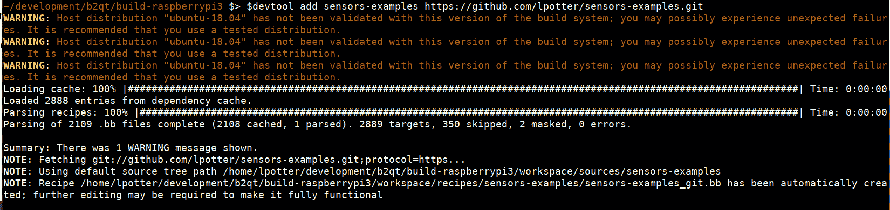

我们需要尝试构建包以查看它是否成功或失败，这可以通过运行以下命令来完成：

```cpp
devtool build sensors-examples

```

如果构建失败，我们可能需要编辑这个`.bb`文件来使其构建成功。

在`sensors-examples`的情况下，我们将得到以下输出：

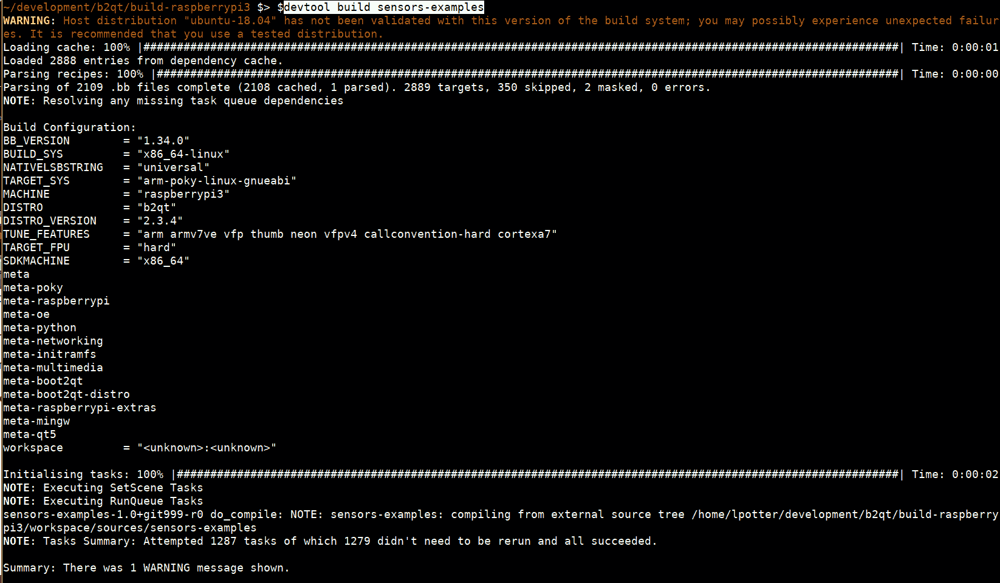

我们已经构建完成了！

您可以在`tmp/work/cortexa7hf-neon-vfpv4-poky-linux-gnueabi/sensors-examples/1.0+git999-r0`中找到这个构建。

如果你想要编辑一个食谱，你可以使用 `devtool` 并创建一个补丁，这样你就可以使用了：

```cpp
devtool modify qtsensors
```

运行前面的命令后，我们得到以下输出：

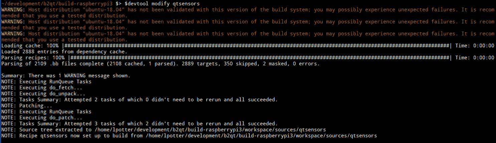

这将在你的本地工作区中复制食谱，这样你就可以编辑它，而不用担心在更新 `bitbake` 时丢失。现在，你可以编辑源代码，在这个例子中，是 `qtsensors`。我有一个补丁，用于添加 Raspberry Pi Sense HAT 的 `qtsensors` 插件，所以我现在将手动应用它：

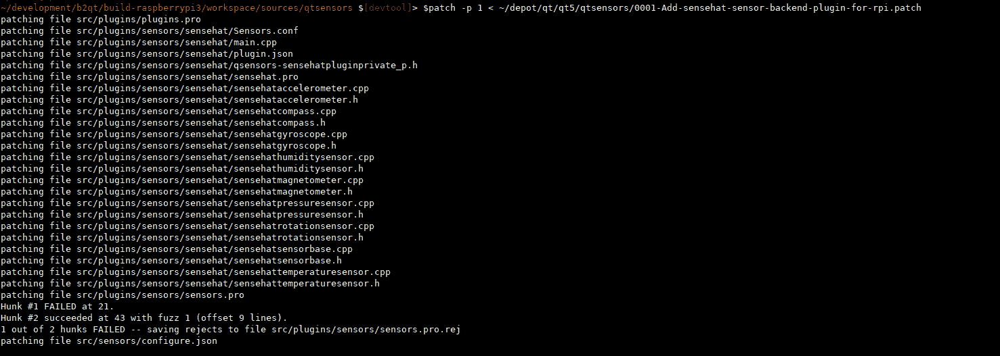

我的补丁已经过时了，我需要修复它。你可以通过运行以下命令单独构建它：

```cpp
devtool build qtsensors
```

这最初无法找到 `rtimulib.h`，因此我们需要添加对该库的依赖。

在 OpenEmbedded 层索引中，有一个 `python-rtimu` 食谱，但它没有导出头文件或构建库，所以我将基于 Git 仓库创建一个新的食谱，如下所示：

```cpp
devtool add rtimulib https://github.com/RPi-Distro/RTIMULib.git
```

这是一个基于 `cmake` 的项目，我需要修改食谱来添加一些 `cmake` 参数。为了编辑这个，我可以简单地运行以下命令：

```cpp
devtool edit-recipe rtimulib

```

我添加了以下行，这些行使用 `EXTRA_OECMAKE` 来禁用一些依赖于 Qt 4 的演示。我认为曾经有一个补丁将其移植到 Qt 5，但我找不到它。最后的 `EXTRA_OEMAKE` 告诉 `cmake` 在 Linux 目录中构建。然后，我们告诉 `bitbake` 它需要继承 `cmake` 相关的内容：

```cpp
EXTRA_OECMAKE = "-DBUILD_GL=OFF"
EXTRA_OECMAKE += "-DBUILD_DRIVE=OFF"
EXTRA_OECMAKE += "-DBUILD_DRIVE10=OFF"
EXTRA_OECMAKE += "-DBUILD_DEMO=OFF"
EXTRA_OECMAKE += "-DBUILD_DEMOGL=OFF"
EXTRA_OECMAKE += "Linux"
inherit  cmake
```

然后，我们需要编辑我们的 `qtsensors_git.bb` 文件，以便我们可以添加对这个新包的依赖。这将允许它找到头文件：

```cpp
DEPENDS += "rtimulib"

```

当我运行构建命令 `bitbake qtsensors` 时，它将确保我的 `rtimulib` 包被构建，然后应用我的 `sensehat` 补丁到 `qtsensors`，然后构建并打包它！

`Recipetool` 是另一种创建新食谱的方法。它的设计和使用比 `devtool` 更简单。

# recipetool 命令

使用 `recipetool create --help` 命令的输出如下：

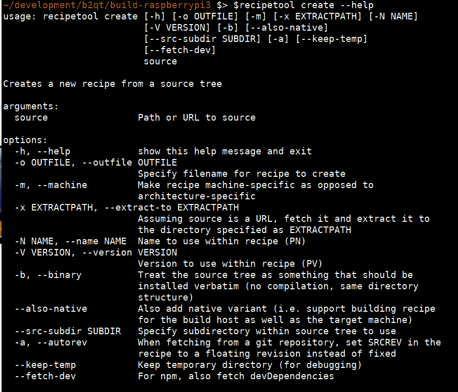

例如，我运行了 `recipetool -d create -o rotationtray_1.bb https://github.com/lpotter/rotationtray.git`：

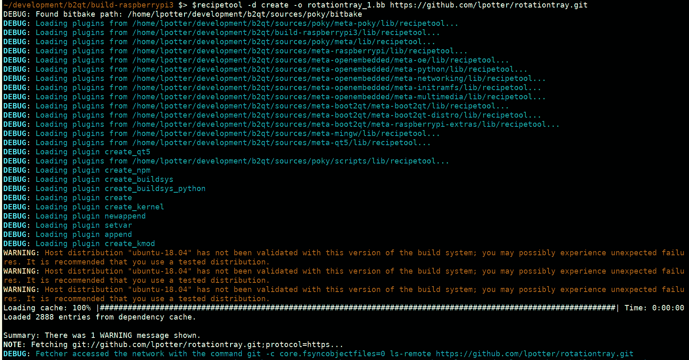

使用 `-d` 参数意味着它将更加详细，所以我排除了部分输出：

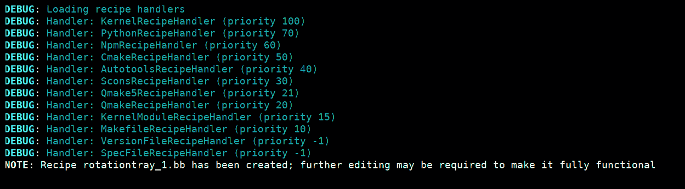

现在，你可能想要编辑生成的文件。了解 `bitbake` 的一个好方法是查看其他食谱，看看它们是如何做的。

# bitbake-layers

OpenEmbedded 随带一个名为 `bitbake-layers` 的脚本，你可以用它来获取有关可用层的详细信息。你还可以使用它来添加新层或从配置文件中删除一个层。

运行 `bblayers --help` 将给出以下输出：

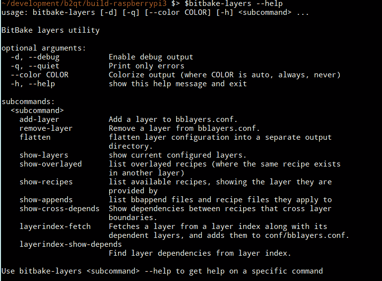

运行 `bitbake-layers show-recipes` 将输出所有可用的食谱。这个列表可能相当长。

# yocto-layer

Yocto 有一个名为`yocto-layer`的脚本，它将创建一个空的层目录结构，然后你可以使用`bitbake-layers`将其添加。你还可以添加一个示例配方和一个`bbappend`文件。

要创建一个新的层，使用`create`参数运行`yocto-layer`：

```cpp
yocto-layer create mylayer
```

这将交互式运行并询问你几个问题。我告诉它两个问题都回答“是”以创建示例：

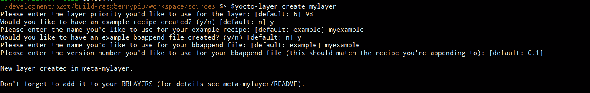

你将看到一个新的名为`meta-mylayer`的目录树。然后你可以使用`bitbake-layers`将新层提供给`bitbake`，如下所示：

```cpp
bitbake-layers add-layer meta-mylayer
```

使用以下命令查看新层运行情况：

```cpp
bitbake-layers show-layers
```

# bbappend 文件

当我将`qtsensors`配方导入我的工作区时，我可以用一个`bbappend`文件。当你将配方导入你的工作区时，它实际上是被复制的。请注意，然而，你将无法使用`devtool`构建它。

我还提到，`yocto-layer`脚本可以创建一个包含补丁的示例`bbappend`文件，这样我们可以看到它是如何工作的。你选择的文件名必须与你要修改的配方相匹配。名称的唯一区别将是扩展名，对于`bbappend`文件来说是`.bbappend`。

在`workspace/conf/local.conf`文件中，有一行关于 BBFILES 的说明，告诉我它在寻找`bbappend`文件的位置。当然，你可以将它们放在任何地方，只要告诉`bitbake`它们在哪里。我的配置是它们位于`${LAYERDIR}/appends/*.bbappend`。

我们的系统很简单——它只应用补丁。只需在`bbappend`文件中包含以下几行，我们就可以让它启动并运行：

+   `SUMMARY`：简单字符串解释补丁

+   `FILESEXTRAPATHS_prepend`：补丁文件路径的字符串

+   `SRC_URI`：补丁文件的 URL 字符串

如果我们想要创建一个`bbappend`文件来使用`sensehat`补丁修补`qtsensors`，这将是一个四行编辑，包括实际的补丁。简单的`bbappends`文件看起来像这样：

```cpp
SUMMARY = "Sensehat plugin for qtsensors"
DEPENDS += "rtimulib"
FILESEXTRAPATHS_prepend := "${THISDIR}:"
SRC_URI += "file://0001-Add-sensehat-plugin.patch"
```

将补丁放置在目录中是一种良好的实践，但这个补丁与`bbappend`文件处于同一级别。

在我们能够构建附加的配方之前，我们需要从工作区中移除导入的`qtsensors`配方：

```cpp
devtool reset qtsensors
```

将`qtsensors_git.bbappend`和补丁文件放入`appends`目录。要构建它，只需运行以下命令：

```cpp
bitbake qtsensors
```

现在我们可以自定义我们的 OpenEmbedded/Yocto 镜像，我们可以将设备部署到设备上。

# 将部署到嵌入式系统

我们已经构建了一个自定义的系统镜像，系统可以以几种不同的方式部署到设备上。通常，嵌入式设备有特定的部署方式。可以使用 dd 或类似工具将系统镜像文件直接写入存储磁盘来部署到 Raspberry Pi。其他设备可能需要将文件系统写入格式化的磁盘，甚至使用 JTAG 进行低级部署。

# OpenEmbedded

如果您计划使用 Qt 与 OpenEmbedded，您应该了解`meta-qt5-extra`层，它包含 LXQt 和甚至 KDE5 等桌面环境。我个人使用这两个环境，并在我的桌面上在这两个之间来回切换，但大多数时候我更喜欢 LXQt，因为它轻量级。

使用 LXQt 构建 OpenEmbedded 镜像相当直接，与构建 Boot to Qt 镜像类似。

要查看可用的镜像目标，您可以运行以下命令：

```cpp
bitbake-layers show-recipes | grep image

```

如果您有 Boot to Qt，您应该看到`b2qt-embedded-qt5-image`层，我们将使用它来为 Raspberry Pi 创建镜像。您还应该看到 OpenEmbedded 的`core-image-base`和`core-image-x11`，这可能也很有趣。

还有其他可用的层，您可以在[`layers.openembedded.org/layerindex/branch/master/layers/`](https://layers.openembedded.org/layerindex/branch/master/layers/)中搜索并下载。

部署方法实际上取决于您的目标设备。让我们看看如何将系统镜像部署到 Raspberry Pi。

# Raspberry Pi

本节中的示例针对 Raspberry Pi。您可能有不同的设备，这里的流程可能类似。

如果您打算只创建一个可以在 Qt Creator 中使用的交叉`toolchain`，您可以运行以下命令：

```cpp
bitbake meta-toolchain-b2qt-embedded-qt5-sdk
```

要创建要复制到 SD 卡上的系统镜像，请运行以下命令：

```cpp
bitbake b2qt-embedded-qt5-image
```

`b2qt-embedded-qt5-image`目标还会在需要时创建 SDK。当您让它运行一天左右时，您将有一个新鲜出炉的 Qt 镜像！我建议使用您拥有的最快机器，并具有最多的内存和存储空间，因为完整的发行版构建可能需要数小时，即使在快速机器上也是如此。

然后，您可以将系统镜像用于设备的闪存程序或它使用的任何方法来制作文件系统。对于 RPI，您将 micro SD 卡放入 USB 读卡器中，然后运行`dd`命令来写入镜像文件。

我需要写入 SD 卡的文件位于以下位置：

```cpp
tmp/deploy/images/raspberrypi3/b2qt-embedded-qt5-image-raspberrypi3-20190224202855.rootfs.rpi-sdimg
```

要将其写入 SD 卡，请使用以下命令：

```cpp
sudo dd if=/path/to/sdimg of=/dev/path/to/usb/drive bs=4M status=progress
```

我的确切命令如下：

```cpp
sudo dd if=tmp/deploy/images/raspberrypi3/b2qt-embedded-qt5-image-raspberrypi3-20190224202855.rootfs.rpi-sdimg of=/dev/sde bs=4M status=progress
```

现在，等待直到所有内容都已写入磁盘。将其插入 Raspberry Pi 的 SD 卡槽中，打开电源，然后您就可以开始了！

# 摘要

在本章中，我们学习了如何使用`bitbake`构建自定义系统镜像，从 Qt 的 Boot to Qt 配置文件开始。这个过程与构建 Yocto、Poky 或Ångström 类似。我们还学习了如何使用`devtool`自定义 Qt 的构建以添加更多功能。然后，我们讨论了如何使用`recipetool`将您自己的配方添加到镜像中。通过这样做，您还可以将此配方添加到一个新层中。最后，我们将镜像部署到 SD 卡上，以便在 Raspberry Pi 上运行。
