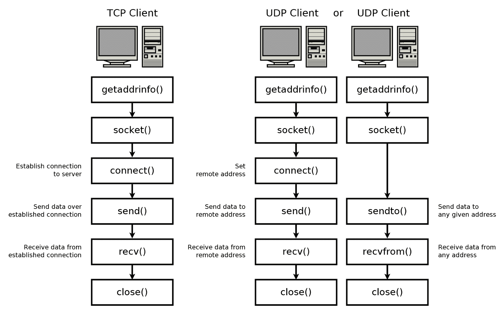
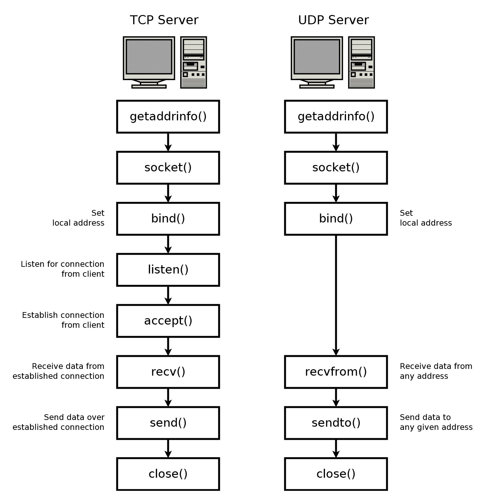
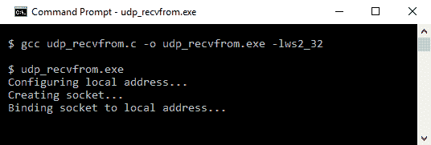
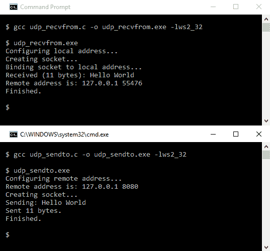
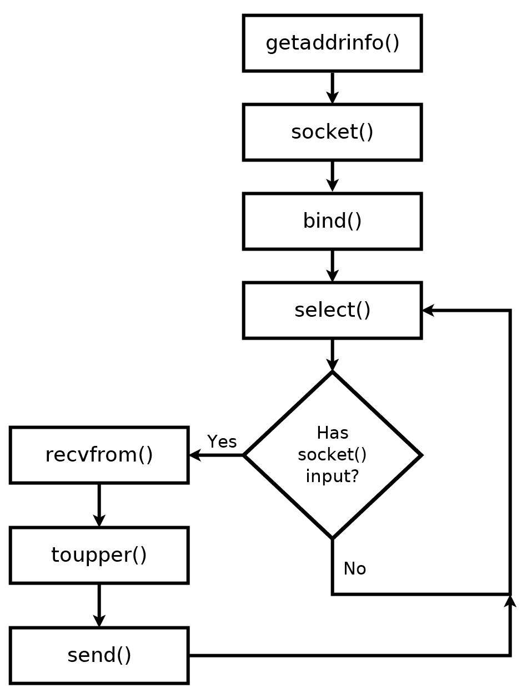
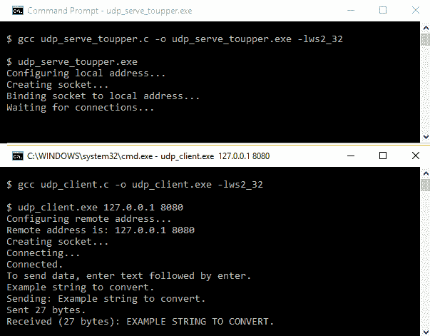

# 第四章：建立 UDP 连接

在本章中，我们将探讨如何发送和接收**用户数据报协议**（**UDP**）数据包。UDP 套接字编程与**传输控制协议**（**TCP**）套接字编程非常相似，因此建议你在开始本章之前阅读并理解第三章，“TCP 连接的深入概述”。

本章涵盖了以下主题：

+   TCP 套接字编程与 UDP 套接字编程之间的区别

+   `sendto()`和`recvfrom()`函数

+   `connect()`在 UDP 套接字上的工作方式

+   仅使用一个套接字实现 UDP 服务器

+   使用`select()`来告知何时 UDP 套接字有数据准备好

# 技术要求

本章的示例程序可以用任何现代 C 编译器编译。我们推荐在 Windows 上使用 MinGW，在 Linux 和 macOS 上使用 GCC。有关编译器的设置，请参阅附录 B，“在 Windows 上设置您的 C 编译器”，附录 C，“在 Linux 上设置您的 C 编译器”，和附录 D，“在 macOS 上设置您的 C 编译器”。

本书代码可在本书的 GitHub 仓库中找到：[`github.com/codeplea/Hands-On-Network-Programming-with-C`](https://github.com/codeplea/Hands-On-Network-Programming-with-C)。

您可以使用以下命令从命令行下载本章的代码：

```cpp
git clone https://github.com/codeplea/Hands-On-Network-Programming-with-C
cd Hands-On-Network-Programming-with-C/chap04
```

本章中的每个示例程序都在 Windows、Linux 和 macOS 上运行。在 Windows 上编译时，每个示例程序都需要与 Winsock 库链接。这可以通过将`-lws2_32`选项传递给`gcc`来实现。

我们在介绍每个示例时都提供了编译每个示例所需的精确命令。

本章中所有示例程序都需要与我们在第二章，“掌握 Socket API”中开发的相同头文件和 C 宏。为了简洁，我们将这些语句放在一个单独的头文件`chap04.h`中，我们可以在每个程序中包含它。有关这些语句的解释，请参阅第二章，“掌握 Socket API”。

`chap04.h`的内容如下所示：

```cpp
#if defined(_WIN32)
#ifndef _WIN32_WINNT
#define _WIN32_WINNT 0x0600
#endif
#include <winsock2.h>
#include <ws2tcpip.h>
#pragma comment(lib, "ws2_32.lib")

#else
#include <sys/types.h>
#include <sys/socket.h>
#include <netinet/in.h>
#include <arpa/inet.h>
#include <netdb.h>
#include <unistd.h>
#include <errno.h>

#endif

#if defined(_WIN32)
#define ISVALIDSOCKET(s) ((s) != INVALID_SOCKET)
#define CLOSESOCKET(s) closesocket(s)
#define GETSOCKETERRNO() (WSAGetLastError())

#else
#define ISVALIDSOCKET(s) ((s) >= 0)
#define CLOSESOCKET(s) close(s)
#define SOCKET int
#define GETSOCKETERRNO() (errno)
#endif

#include <stdio.h>
#include <string.h>
```

# UDP 套接字的区别

UDP 套接字的 socket API 与我们之前学习的 TCP 套接字 API 只有非常细微的差别。实际上，它们足够相似，以至于我们可以将上一章的 TCP 客户端代码仅通过更改一行代码就转换成一个完全功能的 UDP 客户端：

1.  从第三章，“TCP 连接的深入概述”中获取`tcp_client.c`，并找到以下代码行：

```cpp
hints.ai_socktype = SOCK_STREAM;
```

1.  将前面的代码更改为以下内容：

```cpp
hints.ai_socktype = SOCK_DGRAM;
```

这种修改包含在本章的代码中，作为`udp_client.c`。

你可以使用之前相同的命令重新编译程序，你将得到一个完全功能的 UDP 客户端。

不幸的是，将上一章的 TCP 服务器更改为 UDP 不会那么容易。TCP 和 UDP 服务器代码的差异足够大，需要稍微不同的方法。

此外，不要假设我们只更改了一行代码，客户端的行为就完全相同——这种情况不会发生。毕竟，这两个程序使用的是不同的协议。

记住从第二章，*掌握套接字 API*，UDP 并不试图成为一个可靠的协议。丢失的数据包不会自动重传，数据包可能以与发送时不同的顺序接收。甚至可能有一个数据包错误地到达两次！TCP 试图解决所有这些问题，但 UDP 让你自己解决问题。

你知道 UDP 笑话最好的地方是什么吗？我不在乎你是否能理解它。

尽管 UDP（缺乏）可靠性，但它仍然适用于许多应用。让我们看看 UDP 客户端和服务器使用的方法。

# UDP 客户端方法

使用 TCP 发送数据需要调用`connect()`来设置远程地址并建立 TCP 连接。因此，我们使用 TCP 套接字上的`send()`，如下面的代码所示：

```cpp
connect(tcp_socket, peer_address, peer_address_length);
send(tcp_socket, data, data_length, 0);
```

UDP 是一个无连接协议。因此，在发送数据之前不会建立任何连接。UDP 连接永远不会建立。在 UDP 中，数据只是发送和接收。我们可以调用`connect()`然后`send()`，就像我们之前提到的，但套接字 API 为 UDP 套接字提供了一个更简单的方式，即`sendto()`函数。它的工作方式如下：

```cpp
sendto(udp_socket, data, data_length, 0,
        peer_address, peer_address_length);
```

在 UDP 套接字上，`connect()`的工作方式略有不同。对于 UDP 套接字，`connect()`所做的只是关联一个远程地址。因此，虽然 TCP 套接字上的`connect()`涉及在网络发送数据包时的握手，但 UDP 套接字上的`connect()`只会在本地存储一个地址。

因此，UDP 客户端可以根据是否使用`connect()`、`send()`和`recv()`，或者使用`sendto()`和`recvfrom()`来以两种不同的方式构建。

以下图表比较了使用两种方法时**TCP 客户端**和**UDP 客户端**的程序流程：



注意，在使用`connect()`时，**UDP 客户端**只接收来自具有给定 IP 地址和端口的对等方的数据。然而，当不使用`connect()`时，`recvfrom()`函数会从任何向我们发送地址的数据对等方返回数据！当然，那个对等方需要知道我们的地址和端口。除非我们调用`bind()`，否则操作系统会自动分配我们的本地地址和端口。

# UDP 服务器方法

编程 UDP 服务器与 TCP 略有不同。TCP 需要为每个对等连接管理一个套接字。对于 UDP，我们的程序只需要一个套接字。这个套接字可以与任何数量的对等方通信。

虽然 TCP 程序流程需要我们使用`listen()`和`accept()`来等待和建立新的连接，但这些函数在 UDP 中并不使用。我们的 UDP 服务器只需绑定到本地地址，然后就可以立即开始发送和接收数据。

与**UDP 服务器**相比，**TCP 服务器**的程序流程如下：



无论使用 TCP 还是 UDP 服务器，当需要检查/等待传入数据时，我们都会使用`select()`。区别在于使用`select()`的**TCP 服务器**可能正在监控多个独立的套接字，而**UDP 服务器**通常只需要监控一个套接字。如果你的程序同时使用 TCP 和 UDP 套接字，你只需调用一次`select()`就可以监控它们所有。

# 第一个 UDP 客户端/服务器

为了使这些要点更加清晰，通过一个完整的 UDP 客户端和 UDP 服务器程序来实践将是有用的。

为了保持简单，我们将创建一个 UDP 客户端程序，该程序简单地发送`Hello World`字符串到`127.0.0.1`的`8080`端口。我们的 UDP 服务器监听在`8080`。它打印接收到的任何数据，以及发送者的地址和端口号。

我们将首先实现这个简单的 UDP 服务器。

# 一个简单的 UDP 服务器

我们将从服务器开始，因为我们已经有一个可用的 UDP 客户端，即`udp_client.c`。

就像我们所有的网络程序一样，我们将从包含必要的头文件开始，从`main()`函数开始，并初始化 Winsock，如下所示：

```cpp
/*udp_recvfrom.c*/

#include "chap04.h"

int main() {

#if defined(_WIN32)
    WSADATA d;
    if (WSAStartup(MAKEWORD(2, 2), &d)) {
        fprintf(stderr, "Failed to initialize.\n");
        return 1;
    }
#endif
```

如果你按照顺序阅读这本书，现在这段代码应该对你来说非常熟悉。如果没有，请参阅第二章，*掌握套接字 API*。

然后，我们必须配置服务器监听的本地地址。我们使用`getaddrinfo()`来完成此操作，如下所示：

```cpp
/*udp_recvfrom.c continued*/

    printf("Configuring local address...\n");
    struct addrinfo hints;
    memset(&hints, 0, sizeof(hints));
    hints.ai_family = AF_INET;
    hints.ai_socktype = SOCK_DGRAM;
    hints.ai_flags = AI_PASSIVE;

    struct addrinfo *bind_address;
    getaddrinfo(0, "8080", &hints, &bind_address);
```

这与我们之前的方法略有不同。值得注意的是，我们设置了`hints.ai_socktype = SOCK_DGRAM`。回想一下，那里使用`SOCK_STREAM`进行 TCP 连接。我们在这里仍然设置`hints.ai_family = AF_INET`。这使得我们的服务器监听 IPv4 连接。我们可以将其更改为`AF_INET6`，使服务器监听 IPv6 连接。

在我们有了本地地址信息之后，我们可以创建套接字，如下所示：

```cpp
/*udp_recvfrom.c continued*/

    printf("Creating socket...\n");
    SOCKET socket_listen;
    socket_listen = socket(bind_address->ai_family,
            bind_address->ai_socktype, bind_address->ai_protocol);
    if (!ISVALIDSOCKET(socket_listen)) {
        fprintf(stderr, "socket() failed. (%d)\n", GETSOCKETERRNO());
        return 1;
    }
```

这段代码与 TCP 的情况完全相同。`socket()`调用使用从`getaddrinfo()`获取的地址信息来创建适当的套接字类型。

然后，我们必须将新套接字绑定到从`getaddrinfo()`获取的本地地址。如下所示：

```cpp
/*udp_recvfrom.c continued*/

    printf("Binding socket to local address...\n");
    if (bind(socket_listen,
                bind_address->ai_addr, bind_address->ai_addrlen)) {
        fprintf(stderr, "bind() failed. (%d)\n", GETSOCKETERRNO());
        return 1;
    }
    freeaddrinfo(bind_address);
```

再次强调，这段代码与 TCP 的情况完全相同。

这里是 UDP 服务器与 TCP 服务器不同的地方。一旦本地地址绑定，我们就可以简单地开始接收数据。不需要调用`listen()`或`accept()`。我们使用`recvfrom()`来监听传入的数据，如下所示：

```cpp
/*udp_recvfrom.c continued*/

    struct sockaddr_storage client_address;
    socklen_t client_len = sizeof(client_address);
    char read[1024];
    int bytes_received = recvfrom(socket_listen,
            read, 1024,
            0,
            (struct sockaddr*) &client_address, &client_len);
```

在前面的代码中，我们创建了一个 `struct sockaddr_storage` 来存储客户端的地址。我们还定义了 `socklen_t client_len` 来保存地址的大小。这使我们的代码在从 IPv4 更改为 IPv6 时更加健壮。最后，我们创建了一个缓冲区 `char read[1024]` 来存储传入的数据。

`recvfrom()` 的使用方式与 `recv()` 类似，但它除了返回接收到的数据外，还会返回发送者的地址。你可以将 `recvfrom()` 视为 TCP 服务器 `accept()` 和 `recv()` 的组合。

一旦我们接收到了数据，我们就可以将其打印出来。请注意，数据可能不是以空字符终止的。可以使用 `%.*s` 的 `printf()` 格式说明符安全地打印数据，如下面的代码所示：

```cpp
/*udp_recvfrom.c continued*/

    printf("Received (%d bytes): %.*s\n",
            bytes_received, bytes_received, read);
```

打印发送者的地址和端口号可能也有用。我们可以使用 `getnameinfo()` 函数将此数据转换为可打印的字符串，如下面的代码所示：

```cpp
/*udp_recvfrom.c continued*/

    printf("Remote address is: ");
    char address_buffer[100];
    char service_buffer[100];
    getnameinfo(((struct sockaddr*)&client_address),
            client_len,
            address_buffer, sizeof(address_buffer),
            service_buffer, sizeof(service_buffer),
            NI_NUMERICHOST | NI_NUMERICSERV);
    printf("%s %s\n", address_buffer, service_buffer);
```

`getnameinfo()` 的最后一个参数 (`NI_NUMERICHOST | NI_NUMERICSERV`) 告诉 `getnameinfo()` 我们希望客户端地址和端口号都采用数字形式。如果没有这个参数，它会尝试返回一个主机名或协议名，如果端口号与已知协议匹配。如果你确实需要一个协议名，可以通过传递 `NI_DGRAM` 标志来告诉 `getnameinfo()` 你正在处理一个 UDP 端口。这对于那些 TCP 和 UDP 使用不同端口的少数协议来说非常重要。

还值得注意的是，客户端很少会显式设置其本地端口号。因此，`getnameinfo()` 返回的端口号很可能是客户端操作系统随机选择的一个高数字。即使客户端设置了本地端口号，我们在这里看到的端口号也可能已经被网络地址转换（NAT）所更改。

在任何情况下，如果我们的服务器需要发送数据回客户端，它需要将数据发送到存储在 `client_address` 中的地址和端口。这可以通过将 `client_address` 传递给 `sendto()` 来完成。

一旦数据被接收，我们将通过关闭连接、清理 Winsock 和结束程序来结束我们的简单 UDP 服务器：

```cpp
/*udp_recvfrom.c continued*/

    CLOSESOCKET(socket_listen);

#if defined(_WIN32)
    WSACleanup();
#endif

    printf("Finished.\n");
    return 0;
}
```

你可以使用以下命令在 Linux 和 macOS 上编译和运行 `udp_recvfrom.c`：

```cpp
gcc udp_recvfrom.c -o udp_recvfrom
./udp_recvfrom
```

使用 MinGW 在 Windows 上编译和运行的操作如下：

```cpp
gcc udp_recvfrom.c -o udp_recvfrom.exe -lws2_32
udp_recvfrom.exe
```

在运行时，它只是等待传入的连接：



你可以使用 `udp_client` 连接到 `udp_recvfrom` 进行测试，或者你可以实现 `udp_sendto`，这是我们接下来要做的。

# 一个简单的 UDP 客户端

尽管我们已经展示了一个功能较为齐全的 UDP 客户端 `udp_client.c`，但构建一个非常简单的 UDP 客户端也是值得的。这个客户端仅展示了获取一个可工作的 UDP 客户端所需的最小步骤，并且它使用 `sendto()` 而不是 `send()`。

让我们以开始每个程序相同的方式开始，通过包含必要的头文件，开始 `main()`，并初始化 Winsock，如下所示：

```cpp
/*udp_sendto.c*/

#include "chap04.h"

int main() {

#if defined(_WIN32)
    WSADATA d;
    if (WSAStartup(MAKEWORD(2, 2), &d)) {
        fprintf(stderr, "Failed to initialize.\n");
        return 1;
    }
#endif
```

我们随后使用 `getaddrinfo()` 配置远程地址。在这个最小示例中，我们使用 `127.0.0.1` 作为远程地址，`8080` 作为远程端口。这意味着它仅在服务器运行在同一台计算机上时才会连接到 UDP 服务器。

下面是如何配置远程地址的：

```cpp
/*udp_sendto.c continued*/

    printf("Configuring remote address...\n");
    struct addrinfo hints;
    memset(&hints, 0, sizeof(hints));
    hints.ai_socktype = SOCK_DGRAM;
    struct addrinfo *peer_address;
    if (getaddrinfo("127.0.0.1", "8080", &hints, &peer_address)) {
        fprintf(stderr, "getaddrinfo() failed. (%d)\n", GETSOCKETERRNO());
        return 1;
    }
```

注意，我们在 `getaddrinfo()` 的调用中硬编码了 `127.0.0.1` 和 `8080`。另外，注意我们已将 `hints.ai_socktype = SOCK_DGRAM` 设置。这告诉 `getaddrinfo()` 我们正在通过 UDP 连接。注意我们没有设置 `AF_INET` 或 `AF_INET6`。这允许 `getaddrinfo()` 返回 IPv4 或 IPv6 的适当地址。在这种情况下，它是 IPv4，因为地址 `127.0.0.1` 是一个 IPv4 地址。我们将在第五章[3d80e3b8-07d3-49f4-b60f-b006a17f7213.xhtml]中更详细地介绍 `getaddrinfo()`，*主机名解析和 DNS*。

我们可以使用 `getnameinfo()` 打印配置的地址。`getnameinfo()` 的调用与之前的 UDP 服务器 `udp_recvfrom.c` 中的调用相同。它的工作方式如下：

```cpp
/*udp_sendto.c continued*/

    printf("Remote address is: ");
    char address_buffer[100];
    char service_buffer[100];
    getnameinfo(peer_address->ai_addr, peer_address->ai_addrlen,
            address_buffer, sizeof(address_buffer),
            service_buffer, sizeof(service_buffer),
            NI_NUMERICHOST  | NI_NUMERICSERV);
    printf("%s %s\n", address_buffer, service_buffer);
```

现在我们已经存储了远程地址，我们就可以通过调用 `socket()` 创建我们的套接字了。我们通过 `peer_address` 中的字段来创建适当的套接字类型。相应的代码如下：

```cpp
/*udp_sendto.c continued*/

    printf("Creating socket...\n");
    SOCKET socket_peer;
    socket_peer = socket(peer_address->ai_family,
            peer_address->ai_socktype, peer_address->ai_protocol);
    if (!ISVALIDSOCKET(socket_peer)) {
        fprintf(stderr, "socket() failed. (%d)\n", GETSOCKETERRNO());
        return 1;
    }
```

一旦创建套接字，我们就可以直接使用 `sendto()` 发送数据。不需要调用 `connect()`。以下是向我们的 UDP 服务器发送 `Hello World` 的代码：

```cpp
/*udp_sendto.c continued*/

    const char *message = "Hello World";
    printf("Sending: %s\n", message);
    int bytes_sent = sendto(socket_peer,
            message, strlen(message),
            0,
            peer_address->ai_addr, peer_address->ai_addrlen);
    printf("Sent %d bytes.\n", bytes_sent);
```

注意，`sendto()` 与 `send()` 非常相似，除了我们需要将地址作为最后一个参数传递。

值得注意的是，如果发送失败，我们不会收到错误。`send()` 只是尝试发送消息，但如果它在途中丢失或误递送，我们无能为力。如果消息很重要，那么实现纠正措施的责任就落在应用协议上。

在我们发送数据后，我们可以重用相同的套接字向另一个地址发送数据（只要它是同一类型的地址，在这个例子中是 IPv4）。我们也可以尝试通过调用 `recvfrom()` 从 UDP 服务器接收回复。注意，如果我们在这里调用 `recvfrom()`，我们可能会从任何向我们发送数据的人那里获取数据——并不一定是我们刚刚传输到的服务器。

当我们发送数据时，操作系统会分配一个临时的本地端口号给我们的套接字。这个本地端口号被称为 **临时端口号**。从那时起，我们的套接字基本上是在这个本地端口上监听回复。如果本地端口很重要，你可以在调用 `send()` 之前使用 `bind()` 将特定端口关联起来。

如果同一系统上的多个应用程序正在同一端口连接到远程服务器，操作系统将使用本地临时端口号来保持回复的分离。没有这个，我们就无法知道哪个应用程序应该接收哪个回复。

我们将通过释放 `peer_address` 的内存、关闭套接字、清理 Winsock 和完成 `main()` 来结束我们的示例程序，如下所示：

```cpp
/*udp_sendto.c continued*/

    freeaddrinfo(peer_address);
    CLOSESOCKET(socket_peer);

#if defined(_WIN32)
    WSACleanup();
#endif

    printf("Finished.\n");
    return 0;
}
```

您可以使用以下命令在 Linux 和 macOS 上编译 `udp_sendto.c`：

```cpp
gcc udp_sendto.c -o udp_sendto
```

使用 MinGW 在 Windows 上编译的方式如下：

```cpp
gcc udp_sendto.c -o udp_sendto.exe -lws2_32
```

为了测试它，首先，在一个单独的终端中启动 `udp_recvfrom`。在 `udp_recvfrom` 已经运行的情况下，您可以启动 `udp_sendto`。它应该看起来如下：



如果端口 `8080` 上没有运行服务器，`udp_sendto` 仍然会产生相同的输出。`udp_sendto` 并不知道数据包没有被送达。

# 一个 UDP 服务器

研究一个设计用来服务多个连接的 UDP 服务器将是有用的。幸运的是，UDP 套接字 API 使这变得非常简单。

我们将从前一章的激励示例开始，即提供一个将所有文本转换为上档的服务。这很有用，因为您可以直接比较这里的 UDP 代码和第三章中的 TCP 服务器代码。

我们的服务器首先设置套接字并将其绑定到本地地址。然后它等待接收数据。一旦它接收到了一个数据字符串，它将字符串转换成全部大写并发送回去。

程序流程如下：



如果您将这个程序的流程与上一章的 TCP 服务器进行比较（[第三章](https://cdp.packtpub.com/hands_on_network_programming_with_c/wp-admin/post.php?post=27&action=edit#post_26)，*TCP 连接的深入概述*），您会发现它要简单得多。在 TCP 中，我们必须使用 `listen()` 和 `accept()`。在 UDP 中，我们跳过这些调用，直接使用 `recvfrom()` 接收数据。在我们的 TCP 服务器中，我们必须同时监控一个监听套接字以寻找新的连接，并监控每个已连接客户端的额外套接字。我们的 UDP 服务器只使用一个套接字，因此需要跟踪的内容要少得多。

我们的 UDP 服务器程序首先包括必要的头文件，启动 `main()` 函数，并初始化 Winsock，如下所示：

```cpp
/*udp_serve_toupper.c*/

#include "chap04.h"
#include <ctype.h>

int main() {

#if defined(_WIN32)
    WSADATA d;
    if (WSAStartup(MAKEWORD(2, 2), &d)) {
        fprintf(stderr, "Failed to initialize.\n");
        return 1;
    }
#endif
```

然后我们找到我们应该监听的本地地址，创建套接字，并将其绑定。这和我们在之前的服务器 `udp_recvfrom.c` 中的操作完全一样。这段代码和第三章中的 TCP 服务器代码的唯一区别是，我们使用 `SOCK_DGRAM` 而不是 `SOCK_STREAM`。回想一下，`SOCK_DGRAM` 指定了我们想要一个 UDP 套接字。

这是设置地址和创建新套接字的代码：

```cpp
/*udp_serve_toupper.c continued*/

    printf("Configuring local address...\n");
    struct addrinfo hints;
    memset(&hints, 0, sizeof(hints));
    hints.ai_family = AF_INET;
    hints.ai_socktype = SOCK_DGRAM;
    hints.ai_flags = AI_PASSIVE;

    struct addrinfo *bind_address;
    getaddrinfo(0, "8080", &hints, &bind_address);

    printf("Creating socket...\n");
    SOCKET socket_listen;
    socket_listen = socket(bind_address->ai_family,
            bind_address->ai_socktype, bind_address->ai_protocol);
    if (!ISVALIDSOCKET(socket_listen)) {
        fprintf(stderr, "socket() failed. (%d)\n", GETSOCKETERRNO());
        return 1;
    }

```

将新的套接字绑定到本地地址的方式如下：

```cpp
/*udp_serve_toupper.c continued*/

    printf("Binding socket to local address...\n");
    if (bind(socket_listen,
                bind_address->ai_addr, bind_address->ai_addrlen)) {
        fprintf(stderr, "bind() failed. (%d)\n", GETSOCKETERRNO());
        return 1;
    }
    freeaddrinfo(bind_address);
```

由于我们的服务器使用 `select()`，我们需要创建一个新的 `fd_set` 来存储我们的监听套接字。我们使用 `FD_ZERO()` 将集合清零，然后使用 `FD_SET()` 将我们的套接字添加到这个集合中。我们还使用 `max_socket` 维护集合中的最大套接字：

```cpp
/*udp_serve_toupper.c continued*/

    fd_set master;
    FD_ZERO(&master);
    FD_SET(socket_listen, &master);
    SOCKET max_socket = socket_listen;

    printf("Waiting for connections...\n");
```

注意，我们实际上并不需要在这个程序中使用`select()`，省略它会使程序更简单（参见`udp_server_toupper_simple.c`）。然而，我们将使用`select()`因为它使我们的代码更灵活。如果我们需要监听多个端口，例如，我们可以轻松地添加一个额外的套接字，并且如果我们程序需要执行其他功能，我们可以添加一个`select()`超时。当然，我们的程序不做这些事情，所以我们不需要`select()`，但我认为大多数程序都需要，所以我们将以这种方式展示。

现在，我们准备好进入主循环。它将套接字集复制到一个新的变量`reads`中，然后使用`select()`等待我们的套接字准备好读取。回想一下，如果我们想为下一次读取设置最大等待时间，可以将超时值作为`select()`的最后一个参数传递。有关`select()`的更多信息，请参阅[第三章](https://cdp.packtpub.com/hands_on_network_programming_with_c/wp-admin/post.php?post=27&action=edit#post_26)，*TCP 连接的深入概述*，*使用 select()的同步多路复用*部分。

一旦`select()`返回，我们使用`FD_ISSET()`来判断我们的特定套接字`socket_listen`是否准备好读取。如果我们有额外的套接字，我们需要为每个套接字使用`FD_ISSET()`。

如果`FD_ISSET()`返回 true，我们使用`recvfrom()`从套接字读取。`recvfrom()`提供了发送者的地址，因此我们必须首先分配一个变量来保存地址，即`client_address`。一旦我们使用`recvfrom()`从套接字读取了一个字符串，我们使用 C 的`toupper()`函数将字符串转换为大写。然后我们使用`sendto()`将修改后的文本发送回发送者。请注意，`sendto()`的最后两个参数是我们从`recvfrom()`得到的客户端地址。

主程序循环可以在以下代码中看到：

```cpp
/*udp_serve_toupper.c continued*/

    while(1) {
        fd_set reads;
        reads = master;
        if (select(max_socket+1, &reads, 0, 0, 0) < 0) {
            fprintf(stderr, "select() failed. (%d)\n", GETSOCKETERRNO());
            return 1;
        }

        if (FD_ISSET(socket_listen, &reads)) {
            struct sockaddr_storage client_address;
            socklen_t client_len = sizeof(client_address);

            char read[1024];
            int bytes_received = recvfrom(socket_listen, read, 1024, 0,
                    (struct sockaddr *)&client_address, &client_len);
            if (bytes_received < 1) {
                fprintf(stderr, "connection closed. (%d)\n",
                        GETSOCKETERRNO());
                return 1;
            }

            int j;
            for (j = 0; j < bytes_received; ++j)
                read[j] = toupper(read[j]);
            sendto(socket_listen, read, bytes_received, 0,
                    (struct sockaddr*)&client_address, client_len);

        } //if FD_ISSET
    } //while(1)
```

然后，我们可以关闭套接字，清理 Winsock，并终止程序。请注意，此代码永远不会运行，因为主循环永远不会终止。我们仍然包含此代码作为良好实践；以防程序将来被修改以包含退出函数。

清理代码如下：

```cpp
/*udp_serve_toupper.c continued*/

    printf("Closing listening socket...\n");
    CLOSESOCKET(socket_listen);

#if defined(_WIN32)
    WSACleanup();
#endif

    printf("Finished.\n");

    return 0;
}
```

这就是我们的完整 UDP 服务器程序。你可以在 Linux 和 macOS 上编译和运行它，如下所示：

```cpp
gcc udp_serve_toupper.c -o udp_serve_toupper
./udp_serve_toupper
```

使用 MinGW 在 Windows 上编译和运行的方法如下：

```cpp
gcc udp_serve_toupper.c -o udp_serve_toupper.exe -lws2_32
udp_serve_toupper.exe
```

你可以使用*Ctrl* + *C*来终止程序的执行。

一旦程序开始运行，你应该打开另一个终端窗口，并运行之前提到的`udp_client`程序来连接到它，如下所示：

```cpp
udp_client 127.0.0.1 8080
```

你在`udp_client`中输入的任何内容都应该以大写形式发送回它。这可能看起来是这样的：



你也可以尝试打开额外的终端窗口，并使用`udp_client`进行连接。

查看`udp_serve_toupper_simple.c`以获取一个不使用`select()`但仍然可以正常工作的实现。

# 摘要

在本章中，我们了解到使用 UDP 套接字编程比使用 TCP 套接字要简单一些。我们了解到 UDP 套接字不需要 `listen()`、`accept()` 或 `connect()` 函数调用。这主要是因为 `sendto()` 和 `recvfrom()` 直接处理地址。对于更复杂的程序，我们仍然可以使用 `select()` 函数来查看哪些套接字已准备好进行 I/O。

我们还了解到 UDP 套接字是无连接的。这与面向连接的 TCP 套接字形成对比。在使用 TCP 时，我们必须在发送数据之前建立连接，但使用 UDP，我们只需将单个数据包直接发送到目标地址。这使 UDP 套接字编程变得简单，但它可能会使应用程序协议设计复杂化，UDP 不会自动重试通信失败，也不能确保数据包按顺序到达。

下一章，第五章，*主机名解析和 DNS*，全部关于主机名。主机名是通过 DNS 协议解析的，该协议在 UDP 上工作。继续阅读 第五章，*主机名解析和 DNS*，了解实现现实世界 UDP 协议的方法。

# 问题

尝试回答这些问题以测试你对本章知识的掌握：

1.  `sendto()` 和 `recvfrom()` 与 `send()` 和 `recv()` 有何不同？

1.  `send()` 和 `recv()` 是否可以在 UDP 套接字上使用？

1.  在 UDP 套接字的情况下，`connect()` 函数做什么？

1.  与 TCP 相比，什么使得使用 UDP 的多路复用更简单？

1.  与 TCP 相比，UDP 的缺点是什么？

1.  同一个程序可以使用 UDP 和 TCP 吗？

答案可以在 附录 A 中找到，*问题解答*。
