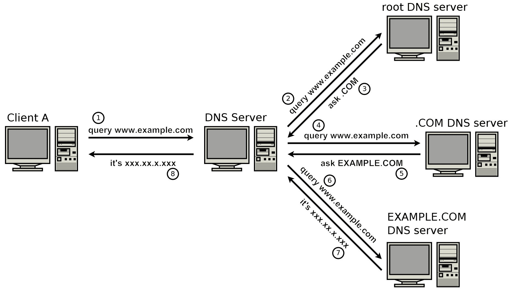
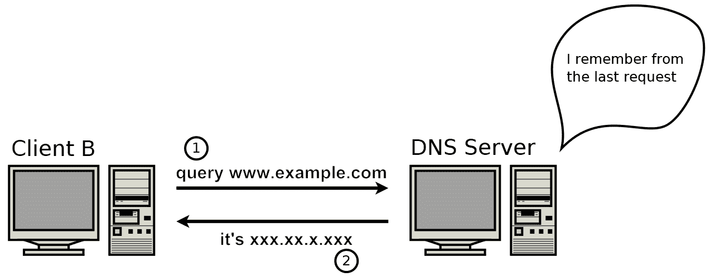
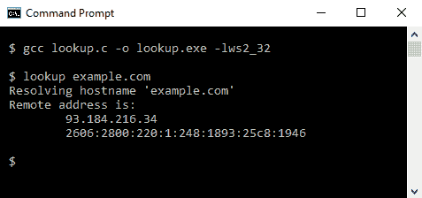
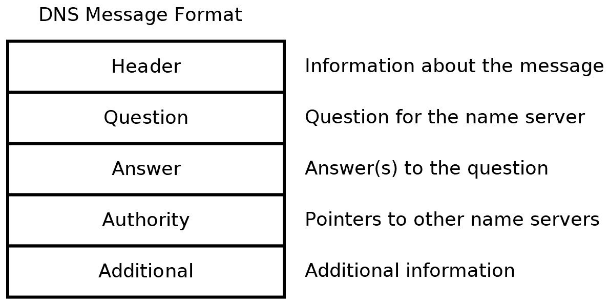
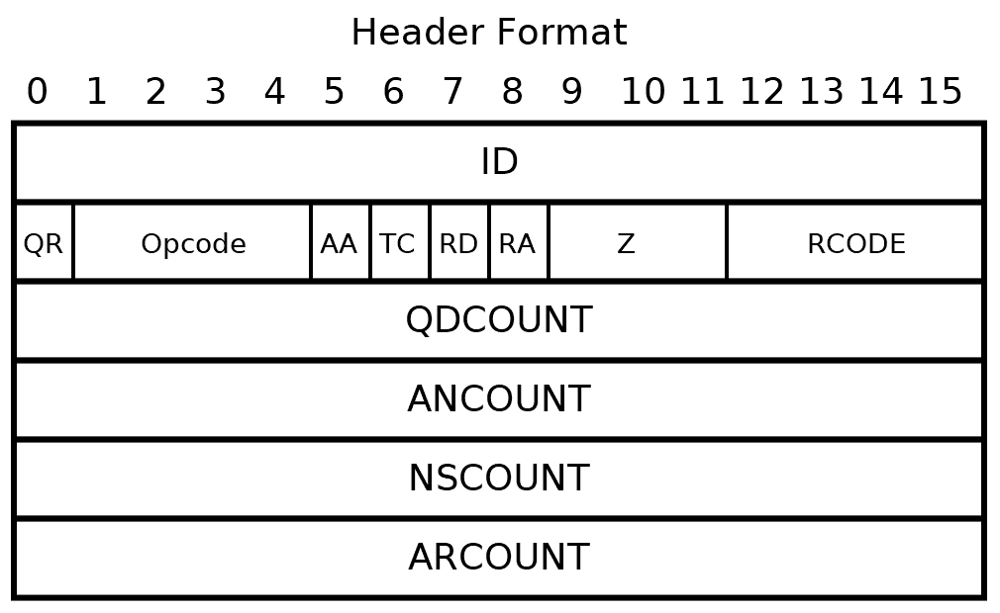
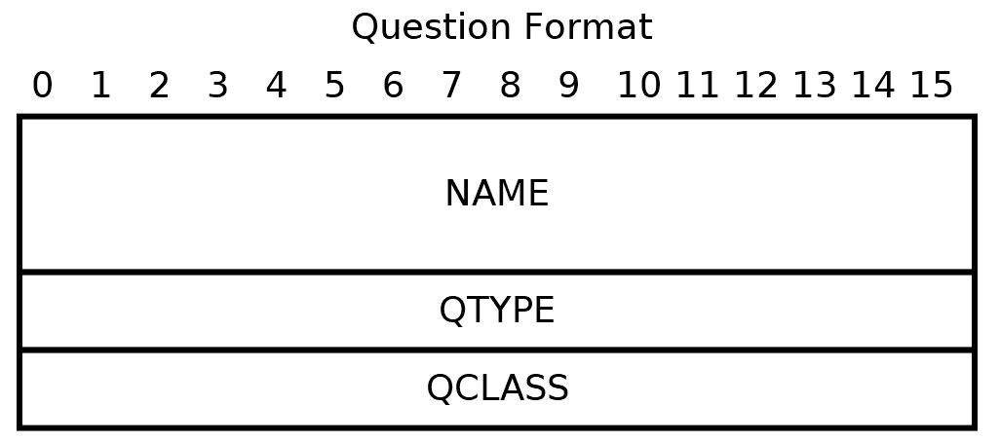
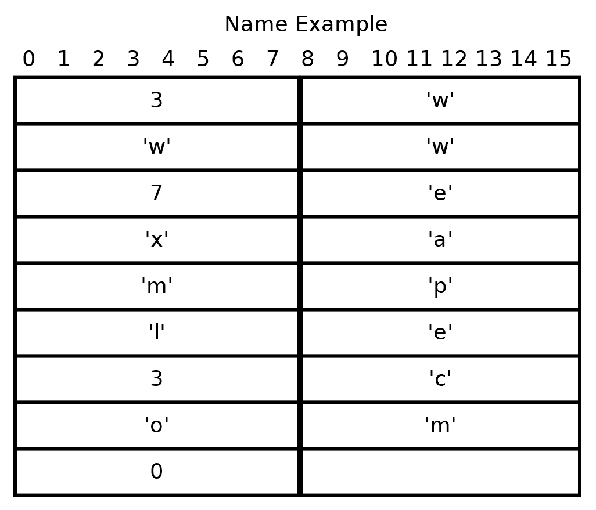
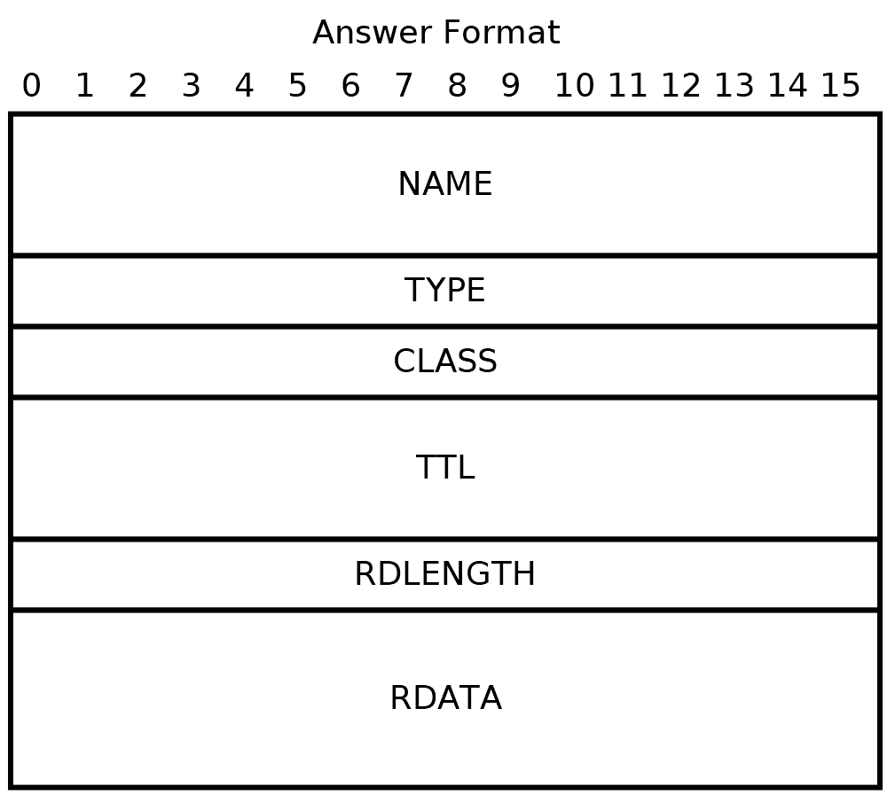
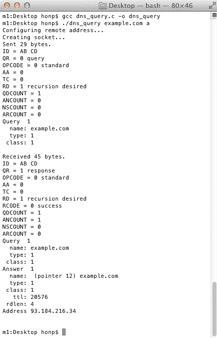
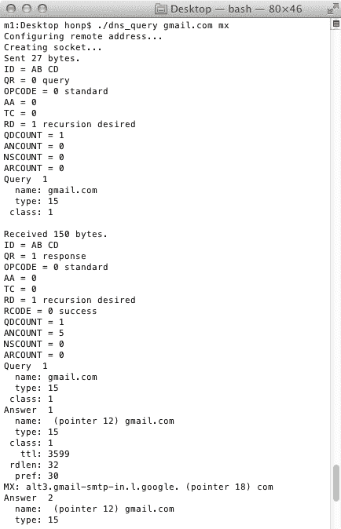

# 第五章：主机名解析和 DNS

主机名解析是网络编程的一个关键部分。它允许我们使用简单的名称，如 `www.example.com`，而不是像 `::ffff:192.168.212.115` 这样繁琐的地址。将主机名解析为 IP 地址以及将 IP 地址解析为主机名的机制是 **域名系统** (**DNS**)。

在本章中，我们首先深入介绍内置的 `getaddrinfo()` 和 `getnameinfo()` 网络套接字函数。稍后，我们将从头开始构建一个使用 **用户数据报协议** (**UDP**) 进行 DNS 查询的程序。

本章我们将涵盖以下主题：

+   DNS 的工作原理

+   常见的 DNS 记录类型

+   `getaddrinfo()` 和 `getnameinfo()` 函数

+   DNS 查询数据结构

+   DNS UDP 协议

+   DNS TCP 回退

+   实现一个 DNS 查询程序

# 技术要求

本章的示例程序可以用任何现代 C 编译器编译。我们推荐在 Windows 上使用 MinGW，在 Linux 和 macOS 上使用 GCC。有关编译器设置，请参阅附录 B、C 和 D。

本书代码可以在 [`github.com/codeplea/Hands-On-Network-Programming-with-C`](https://github.com/codeplea/Hands-On-Network-Programming-with-C) 找到。

从命令行，你可以使用以下命令下载本章的代码：

```cpp
git clone https://github.com/codeplea/Hands-On-Network-Programming-with-C
cd Hands-On-Network-Programming-with-C/chap05
```

本章中的每个示例程序都在 Windows、Linux 和 macOS 上运行。在 Windows 上编译时，每个示例程序都应该与 Winsock 库链接。这可以通过将 `-lws2_32` 选项传递给 `gcc` 来实现。

我们将在介绍每个示例时提供编译每个示例所需的精确命令。

本章中所有的示例程序都需要我们在 第二章 中开发的相同头文件和 C 宏，即 *掌握 Socket API*。为了简洁起见，我们将这些语句放在一个单独的头文件 `chap05.h` 中，我们可以在每个程序中包含它。有关这些语句的解释，请参阅 第二章 的 *掌握 Socket API*。

`chap05.h` 的内容如下：

```cpp
/*chap05.h*/

#if defined(_WIN32)
#ifndef _WIN32_WINNT
#define _WIN32_WINNT 0x0600
#endif
#include <winsock2.h>
#include <ws2tcpip.h>
#pragma comment(lib, "ws2_32.lib")

#else
#include <sys/types.h>
#include <sys/socket.h>
#include <netinet/in.h>
#include <arpa/inet.h>
#include <netdb.h>
#include <unistd.h>
#include <errno.h>

#endif

#if defined(_WIN32)
#define ISVALIDSOCKET(s) ((s) != INVALID_SOCKET)
#define CLOSESOCKET(s) closesocket(s)
#define GETSOCKETERRNO() (WSAGetLastError())

#else
#define ISVALIDSOCKET(s) ((s) >= 0)
#define CLOSESOCKET(s) close(s)
#define SOCKET int
#define GETSOCKETERRNO() (errno)
#endif

#include <stdio.h>
#include <stdlib.h>
#include <string.h>
```

在 `chap05.h` 头文件就绪的情况下，编写可移植的网络程序变得更加容易。现在让我们继续解释 DNS 的工作原理，然后我们将转到实际的示例程序。

# 主机名解析是如何工作的

DNS 用于为连接到互联网的计算机和系统分配名称。类似于电话簿可以用来将电话号码与姓名联系起来，DNS 允许我们将主机名与 IP 地址联系起来。

当你的程序需要连接到远程计算机，例如 `www.example.com`，它首先需要找到 `www.example.com` 的 IP 地址。在这本书到目前为止的内容中，我们一直使用内置的 `getaddrinfo()` 函数来完成这个目的。当你调用 `getaddrinfo()` 时，你的操作系统会经过一系列步骤来解析域名。

首先，您的操作系统检查它是否已经知道`www.example.com`的 IP 地址。如果您最近使用过该主机名，操作系统允许它在本地缓存中记住一段时间。这段时间被称为**生存时间**（**TTL**），由负责该主机名的 DNS 服务器设置。

如果主机名在本地缓存中没有找到，那么您的操作系统将需要查询一个 DNS 服务器。这个 DNS 服务器通常由您的**互联网服务提供商**（**ISP**）提供，但也有许多公开可用的 DNS 服务器。当 DNS 服务器收到一个查询时，它也会检查其本地缓存。这很有用，因为许多系统可能依赖于一个 DNS 服务器。如果一个 DNS 服务器在一分钟内收到 1,000 次对`gmail.com`的请求，它只需要在第一次解析主机名。对于其他 999 次请求，它可以直接从其本地缓存中返回已记住的答案。

如果 DNS 服务器在其缓存中没有找到请求的 DNS 记录，那么它需要查询其他 DNS 服务器，直到它直接连接到负责目标系统的 DNS 服务器。以下是一个逐步分解的查询解析示例：

客户端 A 的 DNS 服务器正在尝试以下方式解析`www.example.com`：

1.  它首先连接到根 DNS 服务器，并请求`www.example.com`。

1.  根 DNS 服务器将其引导到询问`.com`服务器。

1.  然后，我们的 DNS 服务器连接到负责`.com`的服务器，并请求`www.example.com`。

1.  `.com` DNS 服务器给我们服务器另一个服务器的地址——`example.com` DNS 服务器。

1.  我们的 DNS 服务器最终连接到那个服务器，并询问`www.example.com`的记录。

1.  `example.com`服务器然后分享`www.example.com`的地址。

1.  我们的 DNS 服务器将请求转回我们的客户端。

以下图表直观地说明了这一点：



在这个例子中，你可以看到解析`www.example.com`涉及发送八条消息。查找可能需要更长的时间。这就是为什么 DNS 服务器实现缓存至关重要。假设**客户端 B**在**客户端 A**之后不久尝试相同的查询；DNS 服务器很可能已经缓存了该值：



当然，如果**客户端 A**上的程序再次解析`www.example.com`，它很可能根本不需要联系 DNS 服务器——运行在**客户端 A**上的操作系统应该已经缓存了结果。

在 Windows 上，您可以使用以下命令显示您的本地 DNS 缓存：

```cpp
ipconfig /displaydns
```

在 Linux 或 macOS 上，显示本地 DNS 的命令取决于您的确切系统设置。

为域名记录设置较大的 TTL 值的一个缺点是，您必须至少等待这么长时间才能确保所有客户端都在使用新记录，而不仅仅是检索旧的缓存记录。

除了将主机名链接到 IP 地址的 DNS 记录外，还有其他用于各种目的的 DNS 记录类型。我们将在下一节中回顾一些这些类型。

# DNS 记录类型

DNS 有五种主要记录类型——`A`、`AAAA`、`MX`、`TXT`、`CNAME`和`*`（`ALL`/`ANY`）。

正如我们所学的，DNS 的主要目的是将主机名转换为 IP 地址。这是通过两种记录类型——类型`A`和类型`AAAA`来完成的。这些记录以相同的方式工作，但`A`记录返回 IPv4 地址，而`AAAA`记录返回 IPv6 地址。

`MX`记录类型用于返回邮件服务器信息。例如，如果您想给`larry@example.com`发送电子邮件，则`example.com`的`MX`记录将指示哪些邮件服务器接收该域的电子邮件。

`TXT`记录可以用于存储主机名的任意信息。实际上，这些有时被设置为证明域名所有权或发布电子邮件发送指南。**发送者策略框架（SPF**）标准使用`TXT`记录来声明哪些系统可以发送给定域名的邮件。您可以在[`www.openspf.org/`](http://www.openspf.org/)了解更多关于 SPF 的信息。

`CNAME`记录可以用于为给定名称提供别名。例如，许多网站既可以通过其根域名访问，例如`example.com`，也可以通过`www`子域名访问。如果`example.com`和`www.example.com`应指向同一地址，则可以为`example.com`添加`A`和`AAAA`记录，而为`www.example.com`添加指向`example.com`的`CNAME`记录。请注意，DNS 客户端不会直接查询`CNAME`记录；相反，客户端会请求`www.example.com`的`A`或`AAAA`记录，DNS 服务器会回复指向`example.com`的`CNAME`记录。然后 DNS 客户端会继续使用`example.com`进行查询。

在进行 DNS 查询时，还有一个名为`*`或`ALL`或`ANY`的伪记录类型。如果从 DNS 服务器请求此记录，则 DNS 服务器返回当前查询的所有已知记录类型。请注意，DNS 服务器可以仅响应其缓存中的记录，并且此查询不能保证（甚至可能）实际获取请求域名的所有记录。

在发送 DNS 查询时，每种记录类型都有一个关联的类型 ID。迄今为止讨论的记录的 ID 如下：

| **记录类型** | **类型 ID（十进制）** | **描述** |
| --- | --- | --- |
| `A` | 1 | IPv4 地址记录 |
| `AAAA` | 28 | IPv6 地址记录 |
| `MX` | 15 | 邮件交换记录 |
| `TXT` | 16 | 文本记录 |
| `CNAME` | 5 | 规范名称 |
| `*` | 255 | 所有缓存记录 |

有许多其他记录类型正在使用中。请参阅本章末尾的*进一步阅读*部分以获取更多信息。

应该注意的是，一个主机名可能与多个同类型的记录相关联。例如，`example.com`可能有几个`A`记录，每个记录都有不同的 IPv4 地址。如果多个服务器可以提供相同的服务，这很有用。

值得一提的 DNS 协议的另一个方面是安全性。现在让我们来看看这一点。

# DNS 安全

尽管如今大多数网络流量和电子邮件都是加密的，但 DNS 仍然广泛以未加密的方式使用。确实存在一些协议可以提供 DNS 的安全性，但它们尚未得到广泛采用。希望这种情况在不久的将来会有所改变。

**域名系统安全扩展**（**DNSSEC**）是 DNS 扩展，它提供了数据认证。这种认证允许 DNS 客户端知道给定的 DNS 回复是真实的，但它不能防止窃听。

**DNS over HTTPS**（**DoH**）是一种在 HTTPS 上提供名称解析的协议。HTTPS 提供了强大的安全保证，包括抵抗拦截的能力。我们在第九章《使用 HTTPS 和 OpenSSL 加载安全网页》和第十章《实现安全 Web 服务器》中介绍了 HTTPS。

使用不安全的 DNS 有哪些影响？首先，如果 DNS 没有进行认证，那么它可能允许攻击者对域名 IP 地址进行欺骗。这可能会诱骗受害者连接到一个他们认为的`example.com`服务器，但实际上是一个由攻击者控制的恶意服务器，该服务器位于不同的 IP 地址。如果用户通过安全的协议连接，例如 HTTPS，那么这种攻击将失败。HTTPS 提供了额外的认证来证明服务器身份。然而，如果用户使用不安全的协议连接，例如 HTTP，那么 DNS 攻击可能会成功欺骗受害者连接到错误的服务器。

如果 DNS 进行了认证，那么这些劫持攻击就会被阻止。然而，如果没有加密，DNS 查询仍然容易受到窃听。这可能会让窃听者了解到你访问了哪些网站以及你连接到的其他服务器（例如，你使用的电子邮件服务器）。这并不让攻击者知道你在每个网站上做了什么。例如，如果你对`example.com`进行 DNS 查询，攻击者会知道你打算访问`example.com`，但攻击者无法确定你从`example.com`请求了哪些资源——假设你使用安全的协议（例如 HTTPS）来检索这些资源。具有窃听能力的攻击者无论如何都能看到你与`example.com`的 IP 地址建立了连接，所以他们在你之前进行 DNS 查找并不会提供太多额外信息。

在解决了某些安全问题之后，让我们看看如何进行实际的 DNS 查找。Winsock 和伯克利套接字提供了一种简单的函数来进行地址查找，称为`getaddrinfo()`，我们在本书的前几章中已经使用过它。我们将在下一节中从这方面开始。

# 名称/地址转换函数

对于网络程序来说，通常需要将地址或主机名的基于文本的表示转换为套接字编程 API 所需的地址结构。我们一直在使用的常用函数是`getaddrinfo()`。这是一个有用的函数，因为它高度可移植（在 Windows、Linux 和 macOS 上可用），并且适用于 IPv4 和 IPv6 地址。

将二进制地址转换回文本格式也是常见的需求。我们使用`getnameinfo()`来完成这个任务。

# 使用`getaddrinfo()`

虽然我们已经在之前的章节中使用过`getaddrinfo()`，但我们将在这里更详细地讨论它。

`getaddrinfo()`的声明如下所示：

```cpp
int getaddrinfo(const char *node,
                const char *service,
                const struct addrinfo *hints,
                struct addrinfo **res);
```

以下代码片段的解释如下：

+   `node`指定一个主机名或地址作为字符串。有效的示例可以是`example.com`、`192.168.1.1`或`::1`。

+   `service`指定一个服务或端口号作为字符串。有效的示例可以是`http`或`80`。或者，可以将空指针传递给`service`，在这种情况下，结果地址将被设置为端口号`0`。

+   `hints`是一个指向`struct addrinfo`的指针，它指定了选择地址的选项。`addrinfo`结构具有以下字段：

```cpp
struct addrinfo {
    int              ai_flags;
    int              ai_family;
    int              ai_socktype;
    int              ai_protocol;
    socklen_t        ai_addrlen;
    struct sockaddr *ai_addr;
    char            *ai_canonname;
    struct addrinfo *ai_next;
};
```

您不应假设字段是按照之前代码中列出的顺序存储的，或者认为没有其他字段存在。不同操作系统之间存在一些差异。

`getaddrinfo()`的调用只查看`*hints`中的四个字段。其余的结构应该为零。相关的字段是`ai_family`、`ai_socktype`、`ai_protocol`和`ai_flags`：

+   `ai_family`指定所需的地址族。它可以是为 IPv4 的`AF_INET`，为 IPv6 的`AF_INET6`，或为任何地址族的`AF_UNSPEC`。`AF_UNSPEC`定义为`0`。

+   `ai_socktype`可以是用于 TCP 的`SOCK_STREAM`（见第三章，*TCP 连接的深入概述*），或用于 UDP 的`SOCK_DGRAM`（见第四章，*建立 UDP 连接*）。将`ai_socktype`设置为`0`表示地址可以用于两者。

+   `ai_protocol`应保留为`0`。严格来说，TCP 并不是唯一由套接字接口支持的流协议，UDP 也不是唯一支持的报文协议。`ai_protocol`用于消除歧义，但对我们来说不是必需的。

+   `ai_flags`指定关于`getaddrinfo()`应如何工作的附加选项。可以通过按位或操作将多个标志组合在一起使用。在 C 中，按位或操作符使用管道符号`|`。因此，将两个标志按位或操作在一起将使用`(flag_one | flag_two)`代码。

您可能用于 `ai_flags` 字段的常见标志包括：

+   `AI_NUMERICHOST` 可以用于防止名称查找。在这种情况下，`getaddrinfo()` 预期 `node` 是一个地址，如 `127.0.0.1`，而不是一个主机名，如 `example.com`。`AI_NUMERICHOST` 可能很有用，因为它可以防止 `getaddrinfo()` 执行 DNS 记录查找，这可能会很慢。

+   `AI_NUMERICSERV` 可以用于仅接受 `service` 参数的端口号。如果使用，则此标志会导致 `getaddrinof()` 拒绝服务名称。

+   `AI_ALL` 可以用于请求 IPv4 和 IPv6 地址。在某些 Windows 设置中，`AI_ALL` 的声明似乎缺失。在这些平台上，它可以定义为 `0x0100`。

+   `AI_ADDRCONFIG` 强制 `getaddrinfo()` 只返回与本地机器上配置的接口的族类型匹配的地址。例如，如果您的机器仅使用 IPv4，则使用 `AI_ADDRCONFIG | AI_ALL` 防止返回 IPv6 地址。如果您计划将套接字连接到 `getaddrinfo()` 返回的地址，通常使用此标志是一个好主意。

+   `AI_PASSIVE` 可以与 `node = 0` 一起使用来请求通配符地址。这是接受主机任何网络地址上连接的本地地址。它在带有 `bind()` 的服务器上使用。如果 `node` 不是 `0`，则 `AI_PASSIVE` 无效。例如，请参阅第三章，*TCP 连接的深入概述*，了解用法。

`hints` 中的所有其他字段应设置为 `0`。您也可以为 `hints` 参数传递 `0`，但在不同操作系统中，这种情况下的默认值可能会有所不同。

`getaddrinfo()` 的最后一个参数 `res` 是指向 `struct addrinfo` 指针的指针，并返回 `getaddrinfo()` 找到的地址（或地址）。

如果 `getaddrinfo()` 调用成功，则其返回值是 `0`。在这种情况下，当您完成使用地址后，应在 `*res` 上调用 `freeaddrinfo()`。以下是一个使用 `getaddrinfo()` 查找 `example.com` 地址（或地址）的示例：

```cpp
struct addrinfo hints;
memset(&hints, 0, sizeof(hints));
hints.ai_flags = AI_ALL;
struct addrinfo *peer_address;
if (getaddrinfo("example.com", 0, &hints, &peer_address)) {
    fprintf(stderr, "getaddrinfo() failed. (%d)\n", GETSOCKETERRNO());
    return 1;
}
```

注意，我们首先使用 `memset()` 调用来将 `hints` 清零。然后设置 `AI_ALL` 标志，指定我们希望返回 IPv4 和 IPv6 地址。这甚至返回我们没有网络适配器的地址。如果您只想获取机器可以实际连接的地址，则使用 `AI_ALL | AI_ADDRCONFIG` 作为 `ai_flags` 字段。我们可以将 `hints` 的其他字段保留为默认值。

然后，我们声明一个指针来保存返回的地址列表：`struct addrinfo *peer_address`。

如果 `getaddrinfo()` 调用成功，则 `peer_address` 包含第一个地址结果。如果有下一个结果，它将在 `peer_address->ai_next` 中。

我们可以使用以下代码遍历所有返回的地址：

```cpp
struct addrinfo *address = peer_address;
do {
    /* Work with address... */
} while ((address = address->ai_next));
```

当我们完成使用 `peer_address` 后，我们应该使用以下代码来释放它：

```cpp
freeaddrinfo(peer_address);
```

现在我们可以将文本地址或名称转换为 `addrinfo` 结构，那么查看如何将 `addrinfo` 结构转换回文本格式就很有用了。现在让我们看看这一点。

# 使用 getnameinfo()

`getnameinfo()` 可以用于将 `addrinfo` 结构转换回文本格式。它适用于 IPv4 和 IPv6。它还可以可选地将端口号转换为文本格式的数字或服务名称。

`getnameinfo()` 的声明可以在以下代码中看到：

```cpp
int getnameinfo(const struct sockaddr *addr, socklen_t addrlen,
        char *host, socklen_t hostlen,
        char *serv, socklen_t servlen, int flags);
```

前两个参数是从 `struct addrinfo` 的 `ai_addr` 和 `ai_addrlen` 字段传递的。

下两个参数 `host` 和 `hostlen` 指定用于存储主机名或 IP 地址文本的字符缓冲区和缓冲区长度。

以下两个参数 `serv` 和 `servlen` 指定用于存储服务名称的缓冲区和长度。

如果您不需要主机名和服务名称，您可以可选地只传递 `host` 或 `serv` 中的一个。

标志可以是以下标志的按位或组合：

+   `NI_NAMEREQD` 要求 `getnameinfo()` 返回主机名而不是地址。默认情况下，`getnameinfo()` 尝试返回主机名，但如果无法确定则返回地址。如果无法确定主机名，`NI_NAMEREQD` 将导致返回错误。

+   `NI_DGRAM` 指定服务基于 UDP 而不是 TCP。这对于具有不同标准服务的 UDP 和 TCP 端口很重要。如果设置了 `NI_NUMERICSERV`，则忽略此标志。

+   `NI_NUMERICHOST` 请求 `getnameinfo()` 返回 IP 地址而不是主机名。

+   `NI_NUMERICSERV` 请求 `getnameinfo()` 返回端口号而不是服务名称。

例如，我们可以如下使用 `getnameinfo()`：

```cpp
char host[100];
char serv[100];
getnameinfo(address->ai_addr, address->ai_addrlen,
        host, sizeof(host),
        serv, sizeof(serv),
        0);

printf("%s %s\n", host, serv);
```

在前面的代码中，`getnameinfo()` 尝试执行逆向 DNS 查询。这就像我们在本章中迄今为止所做的 DNS 查询一样，但方向相反。DNS 查询询问该主机名指向哪个 IP 地址？逆向 DNS 查询则相反，询问该 IP 地址指向哪个主机名？请记住，这不是一对一的关系。许多主机名可以指向一个 IP 地址，但一个 IP 地址只能存储一个主机名的 DNS 记录。事实上，许多 IP 地址甚至没有设置逆向 DNS 记录。

如果 `address` 是 `struct addrinfo`，其中包含 `example.com` 的地址 `80`（`http`）端口，那么前面的代码可能打印如下：

```cpp
example.com http
```

如果代码为您打印了不同的内容，那么它可能按预期工作。这取决于 `address` 字段中的地址以及该 IP 地址的逆向 DNS 设置。尝试使用不同的地址进行测试。

如果我们想要 IP 地址而不是主机名，我们可以修改我们的代码如下：

```cpp
char host[100];
char serv[100];
getnameinfo(address->ai_addr, address->ai_addrlen,
        host, sizeof(host),
        serv, sizeof(serv),
        NI_NUMERICHOST | NI_NUMERICSERV);

printf("%s %s\n", host, serv);
```

在前一段代码的情况下，它可能打印以下内容：

```cpp
93.184.216.34 80
```

使用 `NI_NUMERICHOST` 通常运行得更快，因为它不需要 `getnameinfo()` 发送任何逆向 DNS 查询。

# 其他函数

两个广泛使用的、可以复制`getaddrinfo()`功能的函数是`gethostbyname()`和`getservbyname()`。`gethostbyname()`函数已经过时，并被从较新的 POSIX 标准中删除。此外，我建议不要在新代码中使用这些函数，因为它们引入了 IPv4 依赖。完全有可能以这种方式使用`getaddrinfo()`，使得你的程序不需要知道 IPv4 与 IPv6 的区别，但仍然支持两者。

# IP 查找示例程序

为了演示`getaddrinfo()`和`getnameinfo()`函数，我们将实现一个简短的程序。此程序接受一个名称或 IP 地址作为其唯一参数。然后它使用`getaddrinfo()`将名称或 IP 地址解析为地址结构，并使用`getnameinfo()`进行文本转换来打印该 IP 地址。如果与名称关联了多个地址，它将打印每个地址。它还指示任何错误。

首先，我们需要包含本章所需的头文件。我们还为缺少它的系统定义了`AI_ALL`。代码如下所示：

```cpp
/*lookup.c*/

#include "chap05.h"

#ifndef AI_ALL
#define AI_ALL 0x0100
#endi
```

我们可以开始调用`main()`函数，并检查用户是否传递了一个用于查找的主机名。如果用户没有传递主机名，我们将打印一条有用的提示信息。这段代码如下所示：

```cpp
/*lookup.c continued*/

int main(int argc, char *argv[]) {

    if (argc < 2) {
        printf("Usage:\n\tlookup hostname\n");
        printf("Example:\n\tlookup example.com\n");
        exit(0);
    }
```

我们需要以下代码来在 Windows 平台上初始化 Winsock：

```cpp
/*lookup.c continued*/

#if defined(_WIN32)
    WSADATA d;
    if (WSAStartup(MAKEWORD(2, 2), &d)) {
        fprintf(stderr, "Failed to initialize.\n");
        return 1;
    }
#endif
```

然后，我们可以调用`getaddrinfo()`将主机名或地址转换为`struct addrinfo`。以下是该代码：

```cpp
/*lookup.c continued*/

    printf("Resolving hostname '%s'\n", argv[1]);
    struct addrinfo hints;
    memset(&hints, 0, sizeof(hints));
    hints.ai_flags = AI_ALL;
    struct addrinfo *peer_address;
    if (getaddrinfo(argv[1], 0, &hints, &peer_address)) {
        fprintf(stderr, "getaddrinfo() failed. (%d)\n", GETSOCKETERRNO());
        return 1;
    }
```

之前的代码首先打印作为第一个命令行参数传递的主机名或地址。此参数存储在`argv[1]`中。然后我们将`hints.ai_flags = AI_ALL`设置为指定我们想要所有类型的可用地址，包括 IPv4 和 IPv6 地址。

使用`argv[1]`调用`getaddrinfo()`。我们将服务参数传递为`0`，因为我们不关心端口号。我们只是尝试解析一个地址。如果`argv[1]`包含一个名称，例如`example.com`，那么我们的操作系统将执行 DNS 查询（假设主机名尚未在本地缓存中）。如果`argv[1]`包含一个地址，例如`192.168.1.1`，那么`getaddrinfo()`将根据需要简单地填充结果`struct addrinfo`。

如果用户传递了一个无效的地址或找不到记录的主机名，那么`getaddrinfo()`将返回一个非零值。在这种情况下，我们之前的代码将打印出错误。

现在，`peer_address`包含所需的地址（或地址），我们可以使用`getnameinfo()`将它们转换为文本。以下代码实现了这一点：

```cpp
/*lookup.c continued*/

    printf("Remote address is:\n");
    struct addrinfo *address = peer_address;
    do {
        char address_buffer[100];
        getnameinfo(address->ai_addr, address->ai_addrlen,
                address_buffer, sizeof(address_buffer),
                0, 0,
                NI_NUMERICHOST);
        printf("\t%s\n", address_buffer);
    } while ((address = address->ai_next));
```

此代码通过首先将`peer_address`存储在一个新变量`address`中来实现。然后我们进入一个循环。`address_buffer[]`被声明为存储文本地址，我们调用`getnameinfo()`来填充该地址。`getnameinfo()`的最后一个参数`NI_NUMERICHOST`表示我们希望它将 IP 地址放入`address_buffer`而不是主机名。然后可以使用`printf()`简单地打印出地址缓冲区。

如果 `getaddrinfo()` 返回多个地址，则下一个地址由 `address->ai_next` 指向。我们将 `address->ai_next` 赋值给 `address` 并在它非零时循环。这是一个遍历链表的简单示例。

在我们打印了我们的地址之后，我们应该使用`freeaddrinfo()`来释放`getaddrinfo()`分配的内存。在 Windows 上，我们还应该调用 Winsock 清理函数。我们可以使用以下代码来完成这两件事：

```cpp
/*lookup.c continued*/

    freeaddrinfo(peer_address);

#if defined(_WIN32)
    WSACleanup();
#endif

    return 0;
}
```

这就结束了我们的`lookup`程序。

你可以使用以下命令在 Linux 和 macOS 上编译和运行`lookup.c`：

```cpp
gcc lookup.c -o lookup
./lookup example.com
```

在 Windows 上使用 MinGW 编译和运行的方式如下：

```cpp
gcc lookup.c -o lookup.exe -lws2_32
lookup.exe example.com
```

以下截图是使用`lookup`打印`example.com`的 IP 地址的示例：



虽然`getaddrinfo()`使执行 DNS 查找变得容易，但了解幕后发生的事情是有用的。现在我们将更详细地查看 DNS 协议。

# DNS 协议

当客户端想要将主机名解析为 IP 地址时，它会向 DNS 服务器发送 DNS 查询。这通常是通过 UDP 使用端口`53`完成的。然后 DNS 服务器执行查找（如果可能的话），并返回一个答案。以下图示说明了这个事务：


如果查询（或更常见的是，答案）太大而无法放入一个 UDP 数据包中，那么查询可以通过 TCP 而不是 UDP 进行。在这种情况下，查询的大小以 16 位值的形式通过 TCP 发送，然后发送查询本身。这被称为**TCP 回退**或**通过 TCP 的 DNS 传输**。然而，UDP 适用于大多数情况，DNS 在绝大多数情况下都是通过 UDP 使用的。

还需要注意的是，客户端必须知道至少一个 DNS 服务器的 IP 地址。如果客户端不知道任何 DNS 服务器，那么它就有一个类似“鸡生蛋，蛋生鸡”的问题。DNS 服务器通常由你的 ISP 提供。

实际的 UDP 数据格式简单，对于查询和答案都遵循相同的基本格式。

# DNS 消息格式

下图描述了 DNS 消息格式：



每个 DNS 消息都遵循该格式，尽管查询会留空**答案**、**授权**和**附加**部分。DNS 响应通常不使用**授权**或**附加**。我们不会关注**授权**或**附加**部分，因为它们对于典型的 DNS 查询不是必需的。

# DNS 消息头格式

头部长度正好是 12 字节，对于 DNS 查询或 DNS 响应都是相同的。**头格式**在以下图中以图形方式展示：



如前图所示，DNS 消息头包含 13 个字段——**ID**、**QR**、**OPCODE**、**AA**、**TC**、**RD**、**RA**、**Z**、**RCODE**、**QDCOUNT**、**ANCOUNT**、**NSCOUNT** 和 **ARCOUNT**：

+   **ID** 是用于标识 DNS 消息的任何 16 位值。客户端允许将任何 16 位放入 DNS 查询中，DNS 服务器将相同的 16 位复制到 DNS 响应的 **ID** 中。这在客户端发送多个查询的情况下，允许客户端匹配哪个响应是对哪个查询的回复非常有用。

+   **QR** 是一个 1 位字段。它设置为 `0` 表示 DNS 查询，或设置为 `1` 表示 DNS 响应。

+   **Opcode** 是一个 4 位字段，它指定查询的类型。`0` 表示标准查询。`1` 表示将 IP 地址解析为名称的逆向查询。`2` 表示服务器状态请求。其他值（`3` 通过 `15`）是保留的。

+   **AA** 表示权威答案。

+   **TC** 表示消息已被截断。在这种情况下，应使用 TCP 重新发送。

+   **RD** 应当设置为期望递归。我们保留此位设置为指示我们希望 DNS 服务器联系其他服务器，直到它能够完成我们的请求。

+   **RA** 表示在响应中 DNS 服务器是否支持递归。

+   **Z** 未使用，应设置为 `0`。

+   **RCODE** 在 DNS 响应中设置，以指示错误条件。其可能的值如下：

| **RCODE** | **描述** |
| --- | --- |
| `0` | 无错误 |
| `1` | 格式错误 |
| `2` | 服务器故障 |
| `3` | 名称错误 |
| `4` | 未实现 |
| `5` | 被拒绝 |

请参阅本章 *进一步阅读* 部分的 **RFC 1035**：*域名系统 – 实现 和 规范*，以获取有关这些值含义的更多信息。

+   **QDCOUNT**、**ANCOUNT**、**NSCOUNT** 和 **ARCOUNT** 表示它们对应部分中的记录数。**QDCOUNT** 表示 DNS 查询中的问题数。有趣的是，**QDCOUNT** 是一个 16 位值，可以存储大量数字，但现实中的 DNS 服务器不允许每条消息中超过一个问题。**ANCOUNT** 表示答案的数量，DNS 服务器通常在一条消息中返回多个答案。

# 问题格式

DNS **问题格式** 由一个名称后跟两个 16 位值组成——`QTYPE` 和 `QCLASS`。以下是这样表示 **问题格式**：



**QTYPE** 表示我们请求的记录类型，**QCLASS** 应设置为 `1` 以表示互联网。

名称字段涉及一种特殊编码。首先，应将主机名分解为其单个标签。例如，`www.example.com` 将被分解为 `www`、`example` 和 `com`。然后，每个标签应前面加上 1 个字节，表示标签长度。最后，整个名称以 0 字节结束。

从视觉上看，名称 `www.example.com` 被编码如下：



如果将 **QTYPE** 和 **QCLASS** 字段附加到前面的名称示例中，那么它可以组成一个完整的 DNS 问题。

有时 DNS 响应需要多次重复相同的名称。在这种情况下，DNS 服务器可能会编码一个指向早期名称的指针，而不是多次发送相同的名称。指针由一个 16 位值表示，其中最高两位被设置。最低 14 位指示指针值。这个 14 位值指定名称的位置，作为从消息开始处的偏移量。保留最高两位的额外副作用是限制标签长度为 63 个字符。一个更长的名称需要设置标签长度指定符中的两个高位，但如果两个高位都被设置，则表示这是一个指针，而不是标签长度！

答案格式与问题格式类似，但有一些额外的字段。让我们接下来看看这些字段。

# 答案格式

DNS 答案格式由与问题相同的三个字段组成；即名称后跟一个 16 位的 `TYPE` 和一个 16 位的 `CLASS`。然后答案格式有一个 32 位的 `TTL` 字段。该字段指定答案允许缓存的秒数。`TTL` 后跟一个 16 位的长度指定符，`RDLENGTH`，然后是数据。数据长度为 `RDLENGTH`，数据的解释取决于 `TYPE` 指定的类型。

从视觉上看，答案格式在以下图中展示：



请记住，大多数 DNS 服务器在其答案名称中使用名称指针。这是因为 DNS 响应已经在问题部分中包含了相关的名称。答案可以直接指向该名称，而不是再次编码整个名称（第二次或第三次）。

每当在网络上发送二进制数据时，字节序的问题就变得相关了。现在让我们考虑这个问题。

# 字节序

术语 **端序** 指的是单个字节在内存中存储或通过网络发送的顺序。

每当我们从 DNS 消息中读取多字节数字时，我们应该意识到它是以大端格式（或所谓的网络字节序）存储的。你使用的计算机可能使用的是小端格式，尽管我们在整本书中都非常小心地以端无关的方式编写代码。我们通过避免直接将多个字节直接转换为整数，而是逐个解释字节来实现这一点。

例如，考虑一个包含单个 8 位值的消息，例如 `0x05`。我们知道该消息的值是 `5`。字节以原子方式通过网络链路发送，所以我们还知道接收我们消息的任何人都可以明确地将该消息解释为 `5`。

当我们需要多个字节来存储我们的数字时，字节序的问题就会出现。想象一下，我们想要发送数字`999`。这个数字太大，无法放入 1 个字节中，所以我们必须将其拆分为 2 个字节——一个 16 位值。因为`999 = (3 * 2⁸) + 231`，我们知道高位字节存储`3`，而低位字节存储`231`。在十六进制中，数字`999`是`0x03E7`。问题是先发送高位字节还是低位字节。

DNS 协议使用的网络字节序指定高位字节首先发送。因此，数字`999`在网络上是作为`0x03`后跟`0xE7`发送的。

有关更多信息，请参阅本章的*进一步阅读*部分。

现在我们来看看如何编码整个 DNS 查询。

# 一个简单的 DNS 查询

要执行一个简单的 DNS 查询，我们将任意数字放入`ID`，将`RD`位设置为`1`，并将`QDCOUNT`设置为`1`。然后我们在头部之后添加一个问题。这些数据将作为 UDP 数据包发送到 DNS 服务器的端口`53`。

用 C 语言编写的`example.com`的 DNS 查询如下：

```cpp
char dns_query[] = {0xAB, 0xCD,                           /* ID */
                    0x01, 0x00,                           /* Recursion */
                    0x00, 0x01,                           /* QDCOUNT */
                    0x00, 0x00,                           /* ANCOUNT */
                    0x00, 0x00,                           /* NSCOUNT */
                    0x00, 0x00,                           /* ARCOUNT */
                    7, 'e', 'x', 'a', 'm', 'p', 'l', 'e', /* label */
                    3, 'c', 'o', 'm',                     /* label */
                    0,                                    /* End of name */
                    0x00, 0x01,                           /* QTYPE = A */
                    0x00, 0x01                            /* QCLASS */
                    };
```

这些数据可以直接发送到 DNS 服务器的端口`53`。

DNS 服务器，如果成功，会发送一个 UDP 数据包作为响应。这个数据包将`ID`设置为与我们的查询匹配。`QR`设置为指示一个响应。`QDCOUNT`设置为`1`，并包含我们的原始问题。`ANCOUNT`是一个小的正整数，表示消息中包含的答案数量。

在下一节中，我们将实现一个程序来发送和接收 DNS 消息。

# DNS 查询程序

现在我们将实现一个实用工具，用于向 DNS 服务器发送 DNS 查询并接收 DNS 响应。

在实际应用中通常不需要这个函数。然而，这是一个更好地理解 DNS 协议并获得发送二进制 UDP 数据包经验的好机会。

我们从一个 DNS 消息中打印名称的函数开始。

# 打印 DNS 消息名称

DNS 以特定方式编码名称。通常，每个标签由其长度指示，后跟其文本。可以重复多个标签，然后使用单个 0 字节终止名称。

如果一个长度的两个最高位被设置（即`0xc0`），那么它和下一个字节应该被解释为一个指针。

我们必须始终意识到，DNS 服务器返回的 DNS 响应可能是格式不正确或损坏的。我们必须尽量编写我们的程序，以便在接收到坏消息时不会崩溃。说起来容易做起来难。

我们名称打印函数的声明如下：

```cpp
/*dns_query.c*/

const unsigned char *print_name(const unsigned char *msg,
        const unsigned char *p, const unsigned char *end);
```

我们将`msg`视为消息开始的指针，`p`视为打印名称的指针，`end`视为消息结束之后的指针。`end`是必需的，这样我们就可以检查我们是否没有读取到接收到的消息的末尾。`msg`也是必需的，但也是为了我们可以解释名称指针。

在 `print_name` 函数内部，我们的代码检查一个合适的名称是否可能。因为一个名称应该至少包含一个长度和一些文本，如果 `p` 已经在末尾两个字符之内，我们可以返回一个错误。该检查的代码如下：

```cpp
/*dns_query.c*/

    if (p + 2 > end) {
        fprintf(stderr, "End of message.\n"); exit(1);}
```

我们然后检查 `p` 是否指向一个名称指针。如果是，我们解释该指针并递归调用 `print_name` 来打印指向的名称。该代码如下：

```cpp
/*dns_query.c*/

    if ((*p & 0xC0) == 0xC0) {
        const int k = ((*p & 0x3F) << 8) + p[1];
        p += 2;
        printf(" (pointer %d) ", k);
        print_name(msg, msg+k, end);
        return p;
```

注意，二进制中的 `0xC0` 是 `0b11000000`。我们使用 `(*p & 0xC0) == 0xC0` 来检查名称指针。在这种情况下，我们取 `*p` 的低 6 位和 `p[1]` 的所有 8 位来表示指针。由于我们之前检查 `p` 至少在消息末尾 2 个字节处，我们知道 `p[1]` 仍然在消息内。知道了名称指针后，我们可以将新的 `p` 值传递给 `print_name()`。

如果名称不是一个指针，我们简单地逐个标签打印它。打印名称的代码如下：

```cpp
/*dns_query.c*/

    } else {
        const int len = *p++;
        if (p + len + 1 > end) {
            fprintf(stderr, "End of message.\n"); exit(1);}

        printf("%.*s", len, p);
        p += len;
        if (*p) {
            printf(".");
            return print_name(msg, p, end);
        } else {
            return p+1;
        }
    }
```

在前面的代码中，`*p` 被读取到 `len` 中以存储当前标签的长度。我们小心地检查读取 `len + 1` 字节不会使我们超出缓冲区的末尾。然后我们可以打印出控制台上的下一个 `len` 个字符。如果下一个字节不是 `0`，那么名称将继续，我们应该打印一个点来分隔标签。我们递归调用 `print_name()` 来打印名称的下一个标签。

如果下一个字节是 `0`，那么这意味着名称已结束，我们返回。

这就完成了 `print_name()` 函数。

现在我们将设计一个函数来打印整个 DNS 消息。

# 打印 DNS 消息

使用我们刚刚定义的 `print_name()`，我们现在可以构建一个函数来将整个 DNS 消息打印到屏幕上。DNS 消息在请求和响应中都使用相同的格式，所以我们的函数能够打印出任何一种。

我们函数的声明如下：

```cpp
/*dns_query.c*/

void print_dns_message(const char *message, int msg_length);
```

`print_dns_message()` 接收一个指向消息开始的指针，以及一个 `int` 数据类型来指示消息的长度。

在 `print_dns_message()` 函数内部，我们首先检查消息是否足够长，以成为有效的 DNS 消息。回想一下，DNS 头部长度为 12 字节。如果一个 DNS 消息小于 12 字节，我们可以轻松地将其拒绝为无效消息。这也确保了我们至少可以读取头部，而不用担心读取到接收数据的末尾。

检查 DNS 消息长度的代码如下：

```cpp
/*dns_query.c*/

    if (msg_length < 12) {
        fprintf(stderr, "Message is too short to be valid.\n");
        exit(1);
    }
```

然后，我们将 `message` 指针复制到一个新变量 `msg` 中。我们定义 `msg` 为一个 `unsigned char` 指针，这使得某些计算更容易处理。

```cpp
/*dns_query.c*/

    const unsigned char *msg = (const unsigned char *)message;
```

如果你想打印出整个原始 DNS 消息，你可以使用以下代码：

```cpp
/*dns_query.c*/

    int i;
    for (i = 0; i < msg_length; ++i) {
        unsigned char r = msg[i];
        printf("%02d:   %02X  %03d  '%c'\n", i, r, r, r);
    }
    printf("\n");
```

注意，运行前面的代码将打印出许多行。这可能会很烦人，所以我建议只有在你好奇想看到原始 DNS 消息时才使用它。

消息 ID 可以非常容易地打印出来。回想一下，消息 ID 只是消息的前两个字节。以下代码以良好的十六进制格式打印它：

```cpp
/*dns_query.c*/

    printf("ID = %0X %0X\n", msg[0], msg[1]);
```

接下来，我们从消息头中获取 `QR` 位。这个位是 `msg[2]` 的最高有效位。我们使用掩码 `0x80` 来查看它是否被设置。如果是，我们知道这是一个响应消息；否则，它是一个查询。以下代码读取 `QR` 并打印相应的消息：

```cpp
/*dns_query.c*/

    const int qr = (msg[2] & 0x80) >> 7;
    printf("QR = %d %s\n", qr, qr ? "response" : "query");
```

`OPCODE`、`AA`、`TC` 和 `RD` 字段与 `QR` 的读取方式几乎相同。打印它们的代码如下：

```cpp
/*dns_query.c*/

    const int opcode = (msg[2] & 0x78) >> 3;
    printf("OPCODE = %d ", opcode);
    switch(opcode) {
        case 0: printf("standard\n"); break;
        case 1: printf("reverse\n"); break;
        case 2: printf("status\n"); break;
        default: printf("?\n"); break;
    }

    const int aa = (msg[2] & 0x04) >> 2;
    printf("AA = %d %s\n", aa, aa ? "authoritative" : "");

    const int tc = (msg[2] & 0x02) >> 1;
    printf("TC = %d %s\n", tc, tc ? "message truncated" : "");

    const int rd = (msg[2] & 0x01);
    printf("RD = %d %s\n", rd, rd ? "recursion desired" : "");
```

最后，我们可以读取响应类型消息的 `RCODE`。由于 `RCODE` 可以有多个不同的值，我们使用 `switch` 语句来打印它们。以下是相应的代码：

```cpp
/*dns_query.c*/

    if (qr) {
        const int rcode = msg[3] & 0x07;
        printf("RCODE = %d ", rcode);
        switch(rcode) {
            case 0: printf("success\n"); break;
            case 1: printf("format error\n"); break;
            case 2: printf("server failure\n"); break;
            case 3: printf("name error\n"); break;
            case 4: printf("not implemented\n"); break;
            case 5: printf("refused\n"); break;
            default: printf("?\n"); break;
        }
        if (rcode != 0) return;
    }
```

标头中的下一个四个字段是问题计数、答案计数、名称服务器计数和附加计数。我们可以在以下代码中读取并打印它们：

```cpp
/*dns_query.c*/

    const int qdcount = (msg[4] << 8) + msg[5];
    const int ancount = (msg[6] << 8) + msg[7];
    const int nscount = (msg[8] << 8) + msg[9];
    const int arcount = (msg[10] << 8) + msg[11];

    printf("QDCOUNT = %d\n", qdcount);
    printf("ANCOUNT = %d\n", ancount);
    printf("NSCOUNT = %d\n", nscount);
    printf("ARCOUNT = %d\n", arcount);
```

这就完成了 DNS 消息头（前 12 个字节）的读取。

在读取消息的其余部分之前，我们定义了两个新变量，如下所示：

```cpp
/*dns_query.c*/

    const unsigned char *p = msg + 12;
    const unsigned char *end = msg + msg_length;
```

在前面的代码中，`p` 变量用于遍历消息。我们将 `end` 变量设置为消息结束之后的一个位置。这是为了帮助我们检测是否即将读取到消息的末尾——这是一个我们当然希望避免的情况！

我们使用以下代码读取并打印 DNS 消息中的每个问题：

```cpp
/*dns_query.c*/

    if (qdcount) {
        int i;
        for (i = 0; i < qdcount; ++i) {
            if (p >= end) {
                fprintf(stderr, "End of message.\n"); exit(1);}

            printf("Query %2d\n", i + 1);
            printf("  name: ");

            p = print_name(msg, p, end); printf("\n");

            if (p + 4 > end) {
                fprintf(stderr, "End of message.\n"); exit(1);}

            const int type = (p[0] << 8) + p[1];
            printf("  type: %d\n", type);
            p += 2;

            const int qclass = (p[0] << 8) + p[1];
            printf(" class: %d\n", qclass);
            p += 2;
        }
    }
```

尽管没有实际的 DNS 服务器会接受包含多个问题的消息，但 DNS RFC 明确定义了编码多个问题的格式。因此，我们使我们的代码通过 `for` 循环遍历每个问题。首先，调用我们之前定义的 `print_name()` 函数来打印问题名称。然后，读取并打印问题类型和类别。

打印答案、授权和附加部分比打印问题部分稍微困难一些。这些部分以与问题部分相同的方式开始——有一个名称、一个类型和一个类别。读取名称、类型和类别的代码如下：

```cpp
/*dns_query.c*/

    if (ancount || nscount || arcount) {
        int i;
        for (i = 0; i < ancount + nscount + arcount; ++i) {
            if (p >= end) {
                fprintf(stderr, "End of message.\n"); exit(1);}

            printf("Answer %2d\n", i + 1);
            printf("  name: ");

            p = print_name(msg, p, end); printf("\n");

            if (p + 10 > end) {
                fprintf(stderr, "End of message.\n"); exit(1);}

            const int type = (p[0] << 8) + p[1];
            printf("  type: %d\n", type);
            p += 2;

            const int qclass = (p[0] << 8) + p[1];
            printf(" class: %d\n", qclass);
            p += 2;
```

注意，在前面提到的代码中，我们将类别存储在一个名为 `qclass` 的变量中。这是为了对 C++ 朋友友好，他们不允许将 `class` 作为变量名。

然后，我们期望找到一个 16 位的 TTL 字段和一个 16 位的长度字段。TTL 字段告诉我们可以缓存答案多少秒。数据长度字段告诉我们答案中包含多少字节的附加数据。我们在以下代码中读取 TTL 和数据长度：

```cpp
/*dns_query.c*/

            const unsigned int ttl = (p[0] << 24) + (p[1] << 16) +
                (p[2] << 8) + p[3];
            printf("   ttl: %u\n", ttl);
            p += 4;

            const int rdlen = (p[0] << 8) + p[1];
            printf(" rdlen: %d\n", rdlen);
            p += 2;
```

在读取 `rdlen` 长度的数据之前，我们应该检查我们不会读取到消息的末尾。以下代码实现了这一点：

```cpp
/*dns_query.c*/

            if (p + rdlen > end) {
                fprintf(stderr, "End of message.\n"); exit(1);}
```

然后，我们可以尝试解释答案数据。每种记录类型存储不同的数据。我们需要编写代码来显示每种类型。就我们的目的而言，我们限制这仅限于 `A`、`MX`、`AAAA`、`TXT` 和 `CNAME` 记录。打印每种类型的代码如下：

```cpp
/*dns_query.c*/

            if (rdlen == 4 && type == 1) { /* A Record */
                printf("Address ");
                printf("%d.%d.%d.%d\n", p[0], p[1], p[2], p[3]);

            } else if (type == 15 && rdlen > 3) { /* MX Record */
                const int preference = (p[0] << 8) + p[1];
                printf("  pref: %d\n", preference);
                printf("MX: ");
                print_name(msg, p+2, end); printf("\n");

            } else if (rdlen == 16 && type == 28) { /* AAAA Record */
                printf("Address ");
                int j;
                for (j = 0; j < rdlen; j+=2) {
                    printf("%02x%02x", p[j], p[j+1]);
                    if (j + 2 < rdlen) printf(":");
                }
                printf("\n");

            } else if (type == 16) { /* TXT Record */
                printf("TXT: '%.*s'\n", rdlen-1, p+1);

            } else if (type == 5) { /* CNAME Record */
                printf("CNAME: ");
                print_name(msg, p, end); printf("\n");
            }
            p += rdlen;
```

我们可以完成循环。我们检查是否读取了所有数据，如果没有，则打印一条消息。如果我们的程序是正确的，并且 DNS 消息格式正确，我们应该已经读取了所有数据而没有剩余。以下代码检查这一点：

```cpp
/*dns_query.c*/

        }
    }

    if (p != end) {
        printf("There is some unread data left over.\n");
    }

    printf("\n");
```

这就完成了`print_dns_message()`函数。

我们现在可以定义我们的`main()`函数来创建 DNS 查询，将其发送到 DNS 服务器，并等待响应。

# 发送查询

我们从以下代码开始`main()`：

```cpp
/*dns_query.c*/

int main(int argc, char *argv[]) {

    if (argc < 3) {
        printf("Usage:\n\tdns_query hostname type\n");
        printf("Example:\n\tdns_query example.com aaaa\n");
        exit(0);
    }

    if (strlen(argv[1]) > 255) {
        fprintf(stderr, "Hostname too long.");
        exit(1);
    }
```

上述代码检查用户是否传递了要查询的域名和记录类型。如果没有，它将打印一条有用的消息。它还检查域名长度是否不超过 255 个字符。超过这个长度的域名不被 DNS 标准允许，现在检查它确保我们不需要分配太多的内存。

然后，我们尝试解释用户请求的记录类型。我们支持以下选项 - `a`，`aaaa`，`txt`，`mx`和`any`。读取这些类型并存储它们对应的 DNS 整数值的代码如下：

```cpp
/*dns_query.c*/

    unsigned char type;
    if (strcmp(argv[2], "a") == 0) {
        type = 1;
    } else if (strcmp(argv[2], "mx") == 0) {
        type = 15;
    } else if (strcmp(argv[2], "txt") == 0) {
        type = 16;
    } else if (strcmp(argv[2], "aaaa") == 0) {
        type = 28;
    } else if (strcmp(argv[2], "any") == 0) {
        type = 255;
    } else {
        fprintf(stderr, "Unknown type '%s'. Use a, aaaa, txt, mx, or any.",
                argv[2]);
        exit(1);
    }
```

就像我们之前所有的程序一样，我们需要初始化 Winsock。以下是其代码：

```cpp
/*dns_query.c*/

#if defined(_WIN32)
    WSADATA d;
    if (WSAStartup(MAKEWORD(2, 2), &d)) {
        fprintf(stderr, "Failed to initialize.\n");
        return 1;
    }
#endif
```

我们程序连接到`8.8.8.8`，这是一个由 Google 运行的可公开 DNS 服务器。请参阅第一章，《网络和协议简介》中的《域名》部分，以获取您可以使用的一些其他公共 DNS 服务器列表。

记住，我们正在连接 UDP 端口`53`。我们使用`getaddrinfo()`通过以下代码设置套接字所需的结构：

```cpp
/*dns_query.c*/

    printf("Configuring remote address...\n");
    struct addrinfo hints;
    memset(&hints, 0, sizeof(hints));
    hints.ai_socktype = SOCK_DGRAM;
    struct addrinfo *peer_address;
    if (getaddrinfo("8.8.8.8", "53", &hints, &peer_address)) {
        fprintf(stderr, "getaddrinfo() failed. (%d)\n", GETSOCKETERRNO());
        return 1;
    }
```

我们接着使用`getaddrinfo()`返回的数据创建我们的套接字。以下代码实现了这一点：

```cpp
/*dns_query.c*/

    printf("Creating socket...\n");
    SOCKET socket_peer;
    socket_peer = socket(peer_address->ai_family,
            peer_address->ai_socktype, peer_address->ai_protocol);
    if (!ISVALIDSOCKET(socket_peer)) {
        fprintf(stderr, "socket() failed. (%d)\n", GETSOCKETERRNO());
        return 1;
    }
```

然后，我们的程序构建 DNS 查询消息的数据。前 12 个字节组成头部，在编译时已知。我们可以用以下代码存储它们：

```cpp
/*dns_query.c*/

    char query[1024] = {0xAB, 0xCD, /* ID */
                        0x01, 0x00, /* Set recursion */
                        0x00, 0x01, /* QDCOUNT */
                        0x00, 0x00, /* ANCOUNT */
                        0x00, 0x00, /* NSCOUNT */
                        0x00, 0x00 /* ARCOUNT */};
```

上述代码将我们的查询 ID 设置为`0xABCD`，设置递归请求，并指示我们附加`1`个问题。如前所述，`1`是现实世界中 DNS 服务器支持的唯一问题数量。

我们需要将用户想要的域名编码到查询中。以下代码实现了这一点：

```cpp
/*dns_query.c*/

    char *p = query + 12;
    char *h = argv[1];

    while(*h) {
        char *len = p;
        p++;
        if (h != argv[1]) ++h;

        while(*h && *h != '.') *p++ = *h++;
        *len = p - len - 1;
    }

    *p++ = 0;
```

上述代码首先将一个新指针`p`设置为查询头部的末尾。我们将从`p`开始添加到查询中。我们还定义了一个指针`h`，我们用它来遍历域名。

我们可以循环直到`*h != 0`，因为当我们完成读取域名时`*h`等于零。在循环内部，我们使用`len`变量来存储标签开始的位臵。这个位置的值需要设置为指示即将到来的标签的长度。然后我们从`*h`复制字符到`*p`，直到找到一个点或域名的末尾。如果找到任何一个，代码将`*len`设置为标签长度。然后代码进入下一个标签的循环。

最后，在循环外部，我们添加一个终止的 0 字节来完成问题的名称部分。

然后，我们使用以下代码将问题类型和问题类别添加到查询中：

```cpp
/*dns_query.c*/

    *p++ = 0x00; *p++ = type; /* QTYPE */
    *p++ = 0x00; *p++ = 0x01; /* QCLASS */
```

然后，我们可以通过比较`p`与查询开始处来计算查询大小。计算总查询大小的代码如下：

```cpp
/*dns_query.c*/

    const int query_size = p - query;
```

现在，查询消息已经形成，其长度已知，我们可以使用`sendto()`将 DNS 查询发送到 DNS 服务器。发送查询的代码如下：

```cpp
/*dns_query.c*/

    int bytes_sent = sendto(socket_peer,
            query, query_size,
            0,
            peer_address->ai_addr, peer_address->ai_addrlen);
    printf("Sent %d bytes.\n", bytes_sent);
```

为了调试目的，我们还可以使用以下代码显示我们发送的查询：

```cpp
/*dns_query.c*/

    print_dns_message(query, query_size);
```

上述代码有助于查看我们是否在编码查询时犯了任何错误。

现在查询已经发送，我们使用`recvfrom()`等待 DNS 响应消息。在实际程序中，您可能希望在这里使用`select()`来超时。如果首先收到无效消息，监听额外消息可能也是明智的。

接收和显示 DNS 响应的代码如下：

```cpp
/*dns_query.c*/

    char read[1024];
    int bytes_received = recvfrom(socket_peer,
            read, 1024, 0, 0, 0);

    printf("Received %d bytes.\n", bytes_received);

    print_dns_message(read, bytes_received);
    printf("\n");
```

我们可以通过从`getaddrinfo()`释放地址并清理 Winsock 来完成我们的程序。完成`main()`函数的代码如下：

```cpp
/*dns_query.c*/

    freeaddrinfo(peer_address);
    CLOSESOCKET(socket_peer);

#if defined(_WIN32)
    WSACleanup();
#endif

    return 0;
}
```

这就完成了`dns_query`程序。

您可以通过运行以下命令在 Linux 和 macOS 上编译和运行`dns_query.c`：

```cpp
gcc dns_query.c -o dns_query
./dns_query example.com a
```

使用 MinGW 在 Windows 上编译和运行可以通过以下命令完成：

```cpp
gcc dns_query.c -o dns_query.exe -lws2_32
dns_query.exe example.com a
```

尝试使用不同的域名和不同的记录类型运行`dns_query`。特别是，尝试使用`mx`和`txt`记录。如果你有勇气，可以尝试使用`any`记录类型。你可能会发现结果很有趣。

以下截图是使用`dns_query`查询`example.com`的`A`记录的示例：



下一张截图显示了`dns_query`正在查询`gmail.com`的`mx`记录：



注意，UDP 并不总是可靠的。如果我们的 DNS 查询在传输过程中丢失，那么`dns_query`将无限期地挂起，等待永远不会到来的回复。这可以通过使用`select()`函数超时并重试来修复。

# 摘要

本章主要介绍了主机名和 DNS 查询。我们了解了 DNS 的工作原理，并了解到解析主机名可能涉及在网络中发送许多 UDP 数据包。

我们更深入地研究了`getaddrinfo()`，并展示了为什么它通常是进行主机名查找的首选方式。我们还研究了其姐妹函数`getnameinfo()`，该函数可以将地址转换为文本，甚至执行反向 DNS 查询。

最后，我们实现了一个从头开始发送 DNS 查询的程序。这个程序是一个很好的学习经验，有助于更好地理解 DNS 协议，并给了我们实现二进制协议的机会。在实现二进制协议时，我们必须特别注意字节序。对于简单的 DNS 消息格式，这是通过逐个仔细解释字节来实现的。

现在我们已经与二进制协议 DNS 一起工作，接下来几章我们将转向基于文本的协议。在下一章，我们将学习 HTTP，这是请求和检索网页所使用的协议。

# 问题

尝试这些问题来测试你对本章知识的掌握：

1.  哪个函数以可移植和协议无关的方式填充套接字编程所需的地址？

1.  哪个套接字编程函数可以将 IP 地址转换回域名？

1.  DNS 查询将域名转换为地址，而反向 DNS 查询将地址转换回域名。如果你对一个域名执行 DNS 查询，然后对结果地址执行反向 DNS 查询，你是否总是能回到最初的域名？

1.  使用哪些 DNS 记录类型来为域名返回 IPv4 和 IPv6 地址？

1.  哪种 DNS 记录类型存储有关电子邮件服务器的特殊信息？

1.  `getaddrinfo()` 总是立即返回吗？或者它可以阻塞？

1.  当 DNS 响应太大而无法放入单个 UDP 数据包时会发生什么？

答案在 附录 A，*问题解答* 中。

# 进一步阅读

想了解更多关于 DNS 的信息，请参考：

+   **RFC 1034**：*域名 – 概念和设施 ([`tools.ietf.org/html/rfc1034`](https://tools.ietf.org/html/rfc1034))

+   **RFC 1035**：*域名 – 实现和规范 ([`tools.ietf.org/html/rfc1035`](https://tools.ietf.org/html/rfc1035))

+   **RFC 3596**：*支持 IP 版本 6 的 DNS 扩展 ([`tools.ietf.org/html/rfc3596`](https://tools.ietf.org/html/rfc3596))
