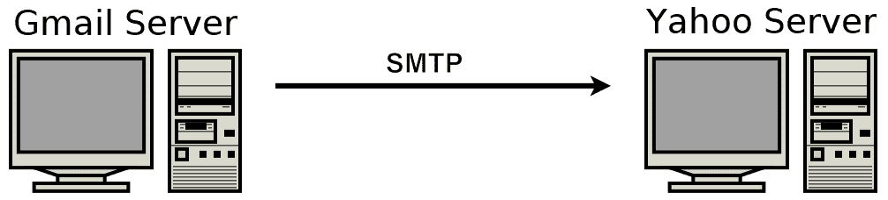
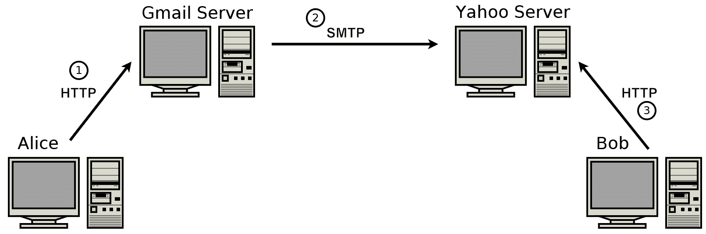
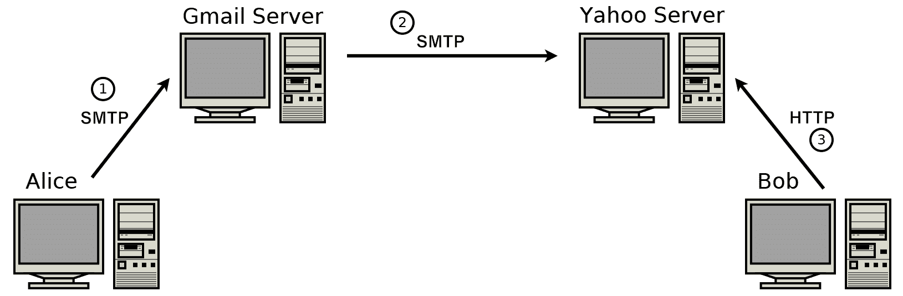
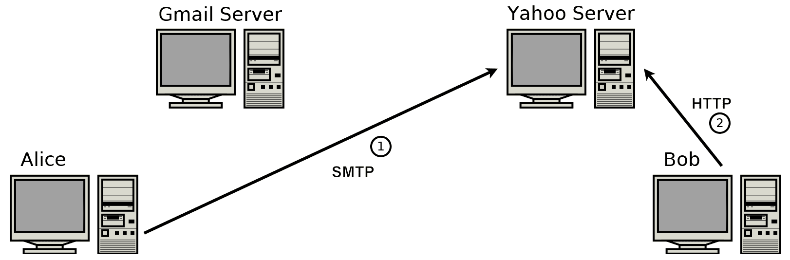
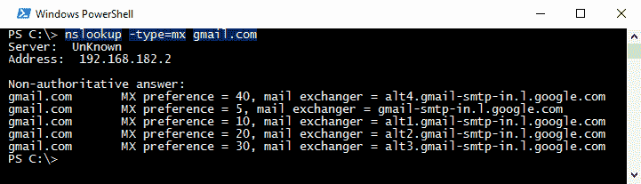
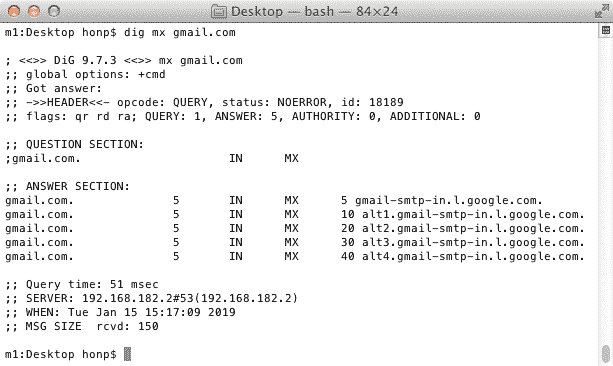
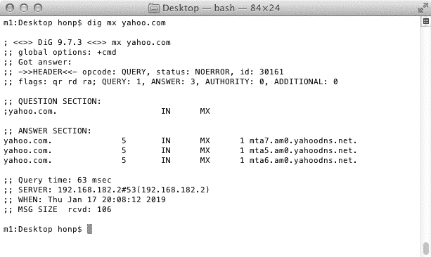
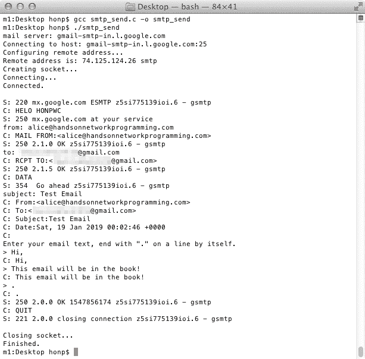

# 第八章：使您的程序能够发送电子邮件

在本章中，我们将考虑负责在互联网上发送电子邮件的协议。这个协议被称为**简单邮件传输协议**（**SMTP**）。

在阐述电子邮件传输的内部工作原理之后，我们将构建一个简单的 SMTP 客户端，能够发送简短的电子邮件。

本章涵盖以下主题：

+   SMTP 服务器的工作原理

+   确定负责特定域的邮件服务器

+   使用 SMTP

+   电子邮件编码

+   防垃圾邮件和发送电子邮件的陷阱

+   SPF、DKIM 和 DMARC

# 技术要求

本章的示例程序可以用任何现代 C 编译器编译。我们推荐 Windows 上的 MinGW 和 Linux 及 macOS 上的 GCC。有关编译器设置的详细信息，请参阅附录 B，*在 Windows 上设置您的 C 编译器*，附录 C，*在 Linux 上设置您的 C 编译器*，以及附录 D，*在 macOS 上设置您的 C 编译器*。

本书代码可在[`github.com/codeplea/Hands-On-Network-Programming-with-C`](https://github.com/codeplea/Hands-On-Network-Programming-with-C)找到。

从命令行，您可以使用以下命令下载本章的代码：

```cpp
git clone https://github.com/codeplea/Hands-On-Network-Programming-with-C
cd Hands-On-Network-Programming-with-C/chap08
```

本章中的每个示例程序都在 Windows、Linux 和 macOS 上运行。在 Windows 上编译时，每个示例程序都需要与 Winsock 库链接。这可以通过将`-lws2_32`选项传递给`gcc`来实现。

我们在介绍每个示例时提供编译每个示例所需的精确命令。

本章中的所有示例程序都需要我们在第二章，*掌握套接字 API*中开发的相同头文件和 C 宏。为了简洁，我们将这些语句放在一个单独的头文件`chap08.h`中，我们可以在每个程序中包含它。有关这些语句的详细解释，请参阅[第二章](https://cdp.packtpub.com/hands_on_network_programming_with_c/wp-admin/post.php?post=31&action=edit#post_25)，*掌握套接字 API*。

`chap08.h`的第一部分包括每个平台所需的网络头文件。以下是相应的代码：

```cpp
/*chap08.h*/

#if defined(_WIN32)
#ifndef _WIN32_WINNT
#define _WIN32_WINNT 0x0600
#endif
#include <winsock2.h>
#include <ws2tcpip.h>
#pragma comment(lib, "ws2_32.lib")

#else
#include <sys/types.h>
#include <sys/socket.h>
#include <netinet/in.h>
#include <arpa/inet.h>
#include <netdb.h>
#include <unistd.h>
#include <errno.h>

#endif
```

我们还定义了一些宏，以便更容易编写可移植的代码，并且我们将包括我们的程序所需的附加头文件：

```cpp
/*chap08.h continued*/

#if defined(_WIN32)
#define ISVALIDSOCKET(s) ((s) != INVALID_SOCKET)
#define CLOSESOCKET(s) closesocket(s)
#define GETSOCKETERRNO() (WSAGetLastError())

#else
#define ISVALIDSOCKET(s) ((s) >= 0)
#define CLOSESOCKET(s) close(s)
#define SOCKET int
#define GETSOCKETERRNO() (errno)
#endif

#include <stdio.h>
#include <stdlib.h>
#include <string.h>
```

这就完成了`chap08.h`。

# 电子邮件服务器

SMTP 是负责在服务器之间传递电子邮件的协议。它是一个基于文本的协议，在 TCP 端口`25`上运行。

并非所有电子邮件都需要在系统之间传递。例如，假设您有一个 Gmail 账户。如果您给同样拥有 Gmail 账户的朋友发送电子邮件，那么 SMTP 不一定被使用。在这种情况下，Gmail 只需要将您的电子邮件复制到他们的收件箱（或执行等效的数据库更新）。

另一方面，考虑一下你向你的朋友 Yahoo!邮箱发送电子邮件的情况。如果你的电子邮件是从你的 Gmail 账户发送的，那么很清楚，Gmail 和 Yahoo!服务器必须进行通信。在这种情况下，你的电子邮件将通过 SMTP 从 Gmail 服务器传输到 Yahoo!服务器。

这种连接关系在以下图中得到了说明：



从你的邮件服务提供商检索电子邮件与在服务提供商之间发送电子邮件是不同的问题。现在，使用网页邮箱从你的邮件服务提供商发送和接收邮件非常流行。网页邮箱服务提供商允许通过网页浏览器访问邮箱。网页浏览器使用 HTTP（或 HTTPS）进行通信。

让我们考虑一封从**爱丽丝**到**鲍勃**的电子邮件的完整路径。在这个例子中，爱丽丝使用**Gmail**作为她的邮件服务提供商，而鲍勃使用**Yahoo!**作为他的邮件服务提供商。爱丽丝和鲍勃都使用标准的网页浏览器来访问他们的邮箱。电子邮件从鲍勃到爱丽丝的路径在以下图中得到了说明：



如前图所示，**SMTP**仅在邮件服务提供商之间发送邮件时使用。这种 SMTP 的使用方式被称为**邮件传输**。

实际上，这个例子中的电子邮件可以采取其他路径。让我们考虑一下，如果爱丽丝使用桌面电子邮件客户端而不是网页邮箱。尽管这些客户端正在过时，但 Gmail 仍然支持桌面电子邮件客户端，并且它们提供了许多优良的功能。一个典型的桌面客户端会通过**Internet Message Access Protocol**（**IMAP**）或**Post Office Protocol**（**POP**）以及 SMTP 连接到邮件服务提供商。在这种情况下，SMTP 被爱丽丝用来将她的邮件发送到她的邮件服务提供商（Gmail）。这种 SMTP 的使用方式被称为**邮件提交**。

Gmail 服务提供商随后再次使用 SMTP 将电子邮件发送到**Yahoo!**邮件服务器。以下图进行了说明：



在前图中，Gmail 服务器将被视为一个**SMTP 中继**。一般来说，SMTP 服务器应该只为可信用户中继邮件。如果 SMTP 服务器中继所有邮件，它很快就会被垃圾邮件发送者淹没。

许多邮件服务提供商有一组用于接收传入邮件的邮件服务器，以及一组用于接收用户发出的邮件的邮件服务器。

重要的是要理解 SMTP 用于发送邮件。SMTP 不用于从服务器检索邮件。IMAP 和 POP 是桌面邮件程序从服务器检索邮件的常用协议。

爱丽丝不需要通过她的服务提供商的 SMTP 服务器发送她的邮件。相反，她可以直接将邮件发送到鲍勃的邮件服务提供商，以下图进行了说明：



实际上，人们通常将邮件投递责任委托给他们的邮件提供商。这有几个优点；即，如果目标邮件服务器不可用，邮件提供商可以尝试重新投递。其他优点将在本章后面讨论。

本章中我们开发的程序用于直接将邮件发送到收件人的电子邮件提供商。将邮件发送到中继服务器是没有用的，因为我们不打算实现身份验证技术。通常，SMTP 服务器在没有验证发件人是否拥有他们账户的情况下不会中继邮件。

本章中我们描述的 SMTP 协议是不安全的且未加密的。这对于解释和学习来说很方便，但在现实世界中，你可能希望加密你的电子邮件传输。

# SMTP 安全

我们在本章中描述了不安全的 SMTP。在实际应用中，如果通信服务器都支持，SMTP 应该被加密。并非所有服务器都支持。

通过将 SMTP 连接从端口`25`开始作为明文，然后 SMTP 客户端发出`STARTTLS`命令以升级到安全、加密的连接来加密 SMTP。这个安全连接通过仅通过 TLS 层运行 SMTP 命令来实现；因此，本章中涵盖的所有内容也适用于安全 SMTP。有关 TLS 的更多信息，请参阅第九章，*使用 HTTPS 和 OpenSSL 加载**安全网页*。

服务器之间的邮件传输总是在端口`25`上进行的。

许多桌面电子邮件客户端使用 TCP 端口`465`或`587`进行 SMTP 邮件提交。**互联网服务提供商（ISPs）**更喜欢这些替代端口进行邮件提交，这允许他们完全阻止端口`25`。这通常被合理化为一种反垃圾邮件技术。

接下来，让我们看看如何确定哪个邮件服务器接收特定电子邮件地址的邮件。

# 寻找电子邮件服务器

考虑电子邮件地址`bob@example.com`。在这种情况下，`bob`标识用户，而`example.com`标识服务提供商的域名。这些部分由`@`符号分隔。

一个域名可能使用多个邮件服务器。同样，一个邮件服务器可以为多个域名提供服务。因此，识别负责接收`bob@example.com`邮件的邮件服务器或服务器并不像连接到`example.com`那样简单。相反，必须通过执行 MX 记录的 DNS 查找来识别邮件服务器。

DNS 在第五章中进行了深入探讨，*主机名解析和 DNS*。我们本章开发的程序可以用来查询 MX 记录。

否则，大多数操作系统都提供用于 DNS 查找的命令行工具。Windows 提供`nslookup`，而 Linux 和 macOS 提供`dig`。

在 Windows 上，我们可以使用以下命令找到负责接收`@gmail.com`邮件的服务器：

```cpp
nslookup -type=mx gmail.com
```

以下截图显示了此查找：



在 Linux 或 macOS 上，使用以下命令对`@gmail.com`账户进行 MX 记录查找：

```cpp
dig mx gmail.com
```

以下屏幕截图显示了`dig`的使用：



如前两个屏幕截图所示，Gmail 使用五个邮件服务器。当找到多个 MX 记录时，应首先将邮件发送到具有最低 MX 优先级的邮件服务器。如果邮件无法发送到该服务器，则应尝试发送到具有下一个最低优先级的邮件服务器，依此类推。在撰写本文时，Gmail 的主要邮件服务器，优先级为`5`，是`gmail-smtp-in.l.google.com`。这是您连接以发送`@gmail.com`地址邮件的 SMTP 服务器。

MX 记录也可能具有相同的优先级。雅虎使用具有相同优先级的邮件服务器。以下屏幕截图显示了`yahoo.com`的 MX 记录：



在前面的屏幕截图中，我们可以看到雅虎使用三个邮件服务器。每个服务器都有一个优先级`1`。这意味着邮件可以发送到其中的任何一个，没有特别的优先顺序。如果邮件无法发送到第一个选择的邮件服务器，那么应该随机选择另一个服务器重试。

以跨平台方式编程获取 MX 记录可能很困难。请参阅第五章，*主机名解析和 DNS*，其中对这一主题进行了深入探讨。我们本章开发的 SMTP 客户端假设邮件服务器是事先已知的。

现在我们知道了要连接的服务器，让我们更详细地考虑 SMTP 协议本身。

# SMTP 对话

SMTP 是一种基于文本的 TCP 协议，在端口`25`上工作。SMTP 以锁步、逐个命令的方式工作，客户端发送命令，服务器对每个命令发送响应。

在典型会话中，对话如下：

1.  客户端首先建立与 SMTP 服务器的连接。

1.  服务器以问候开始。这个问候表明服务器已准备好接收命令。

1.  客户端随后发出自己的问候。

1.  服务器响应。

1.  客户端发送一个命令，表明邮件的发送者是谁。

1.  服务器响应以表明发送者已被接受。

1.  客户端发出另一个命令，指定邮件的接收者。

1.  服务器响应表明接收者已被接受。

1.  客户端随后发出一个`DATA`命令。

1.  服务器响应要求客户端继续。

1.  客户端传输电子邮件。

该协议非常简单。在以下 SMTP 会话示例中，`mail.example.net`是客户端，服务器是`mail.example.com`（`C`和`S`分别表示客户端或服务器是否发送）：

```cpp
S: 220 mail.example.com SMTP server ready
C: HELO mail.example.net
S: 250 Hello mail.example.net [192.0.2.67]
C: MAIL FROM:<alice@example.net>
S: 250 OK
C: RCPT TO:<bob@example.com>
S: 250 Accepted
C: DATA
S: 354 Enter message, ending with "." on a line by itself
C: Subject: Re: The Cake
C: Date: Fri, 03 May 2019 02:31:20 +0000
C:
C: Do NOT forget to bring the cake!
C: .
S: 250 OK
C: QUIT
S: 221 closing connection
```

服务器发送的每一项内容都是对客户端命令的回应，除了第一行。第一行仅仅是响应客户端的连接。

你可能会注意到客户端的每个命令都以四个字母的单词开头。每个服务器的响应都以三位数字代码开头。

我们常用的客户端命令如下：

+   `HELO`用于客户端向服务器标识自己。

+   `MAIL`用于指定谁在发送邮件。

+   `RCPT`用于指定一个收件人。

+   `DATA`用于启动实际电子邮件的传输。这封电子邮件应包括头部和正文。

+   `QUIT`用于结束会话。

在成功的电子邮件传输中使用的服务器响应代码如下：

+   `220`: 服务就绪

+   `250`: 请求的命令已被接受并成功完成

+   `354`: 开始发送消息

+   `221`: 连接正在关闭

错误代码因提供商而异，但通常在 500 范围内。

SMTP 服务器也可以发送跨越多行的回复。在这种情况下，最后一行以响应代码后跟一个空格开始。所有前面的行都以响应代码后跟一个破折号开始。以下是一个尝试投递到不存在的邮箱后的多行响应示例：

```cpp
C: MAIL FROM:<alice@example.net>
S: 250 OK
C: RCPT TO:<not-a-real-user@example.com>
S: 550-The account you tried to deliver to does not
S: 550-exist. Please double-check the recipient's
S: 550 address for typos and try again.
```

注意，一些服务器在回复`RCPT`命令之前会验证收件人地址是否有效，但许多服务器仅在客户端使用`DATA`命令发送电子邮件后验证收件人地址。

虽然这解释了发送邮件所使用的协议的基本原理，但我们仍然必须考虑电子邮件本身的格式。这将在下一部分介绍。

# 电子邮件的格式

如果我们将物理邮件进行类比，SMTP 命令`MAIL FROM`和`RCPT TO`指向信封。这些命令向 SMTP 服务器提供了关于邮件如何投递的信息。在这个类比中，`DATA`命令将是信封内的信件。由于通常在信封内写上物理信件地址，所以在电子邮件中重复投递信息也很常见，即使这些信息已经通过`MAIL`和`RCPT`命令发送给了 SMTP 服务器。

一个简单的电子邮件可能看起来像以下这样：

```cpp
From: Alice Doe <alice@example.net>
To: Bob Doe <bob@example.com>
Subject: Re: The Cake
Date: Fri, 03 May 2019 02:31:20 +0000

Hi Bob,

Do NOT forget to bring the cake!

Best,
Alice
```

整个电子邮件在`DATA`命令之后被发送到 SMTP 服务器。在一行空白中加一个点表示电子邮件的结束。如果电子邮件中任何行以点开头，SMTP 客户端应将其替换为两个连续的点。这防止客户端过早地表示电子邮件结束。SMTP 服务器知道以两个点开头的任何行应替换为单个点。

电子邮件本身可以分为两部分——头部和正文。这两部分由第一行空白分隔。

头部部分由各种头部组成，这些头部指示电子邮件的属性。`From`、`To`、`Subject`和`Date`是最常见的头部。

电子邮件的正文部分就是发送的消息。

在对电子邮件格式有基本了解之后，我们现在可以开始编写一个简单的 C 程序来发送电子邮件。

# 一个简单的 SMTP 客户端程序

在对 SMTP 和电子邮件格式有基本理解之后，我们就可以编写一个简单的电子邮件客户端程序了。我们的客户端接受以下输入：目标电子邮件服务器、收件人地址、发件人地址、电子邮件主题行和电子邮件正文文本。

我们的程序首先通过以下语句包含必要的头文件：

```cpp
/*smtp_send.c*/

#include "chap08.h"
#include <ctype.h>
#include <stdarg.h>
```

我们还定义了以下两个常量，以便于缓冲区分配和检查：

```cpp
/*smtp_send.c continued*/

#define MAXINPUT 512
#define MAXRESPONSE 1024
```

我们的程序需要多次提示用户输入。这是为了获取电子邮件服务器的域名、收件人地址等等。C 提供了 `gets()` 函数来完成这个目的，但 `gets()` 在最新的 C 标准中已被弃用。因此，我们实现了自己的函数。

以下函数 `get_input()` 用于提示用户输入：

```cpp
/*smtp_send.c continued*/

void get_input(const char *prompt, char *buffer)
{
    printf("%s", prompt);

    buffer[0] = 0;
    fgets(buffer, MAXINPUT, stdin);
    const int read = strlen(buffer);
    if (read > 0)
        buffer[read-1] = 0;
}
```

`get_input()` 函数使用 `fgets()` 从 `stdin` 读取。传递给 `get_input()` 的缓冲区假定是 `MAXINPUT` 字节，我们在文件顶部定义了这个值。

`fgets()` 函数不会从接收到的输入中删除换行符；因此，我们将输入的最后一个字符覆盖为一个终止的空字符。

也有一个函数可以直接通过网络发送格式化的字符串非常有帮助。我们为此实现了一个名为 `send_format()` 的函数。它接受一个套接字、一个格式化字符串以及要发送的附加参数。你可以把 `send_format()` 看作是非常类似于 `printf()` 的。区别在于 `send_format()` 通过网络传递格式化的文本而不是打印到屏幕上。

`send_format()` 的代码如下：

```cpp
/*smtp_send.c continued*/

void send_format(SOCKET server, const char *text, ...) {
    char buffer[1024];
    va_list args;
    va_start(args, text);
    vsprintf(buffer, text, args);
    va_end(args);

    send(server, buffer, strlen(buffer), 0);

    printf("C: %s", buffer);
}
```

上述代码首先预留一个缓冲区。然后使用 `vsprintf()` 将文本格式化到该缓冲区中。调用者需要确保格式化的输出不超过预留的缓冲区空间。我们假设在这个程序中用户是可信的，但在一个生产程序中，你想要添加检查以防止在这里发生缓冲区溢出。

在将输出文本格式化为 `buffer` 后，我们使用 `send()` 发送它。我们还打印出发送的文本到屏幕上。在它前面打印一个 `C:` 来表示文本是由我们，即客户端发送的。

我们 SMTP 客户端比较棘手的部分之一是解析 SMTP 服务器响应。这很重要，因为 SMTP 客户端必须在收到第一个命令的响应之前不发出第二个命令。如果 SMTP 客户端在服务器准备好之前发送新的命令，那么服务器很可能会终止连接。

回想一下，每个 SMTP 响应都以三位数字代码开始。我们想要解析出这个代码来检查错误。每个 SMTP 响应通常后面跟着我们忽略的文本。SMTP 响应通常是单行长，但有时可以跨越多行。在这种情况下，直到倒数第二行的每一行都包含一个破折号字符 `-`，直接跟在三位响应代码后面。

为了说明多行响应是如何工作的，考虑以下两个响应是等效的：

```cpp
/*response 1*/

250 Message received!
/*response 2*/

250-Message
250 received!
```

确保我们的程序识别多行响应很重要；它不能错误地将单个多行响应视为单独的响应。

为了实现这个目的，我们实现了一个名为`parse_response()`的函数。它接受一个以空字符终止的响应字符串，并返回解析后的响应代码。如果没有找到代码或响应不完整，则返回`0`。此函数的代码如下：

```cpp
/*smtp_send.c continued*/

int parse_response(const char *response) {
    const char *k = response;
    if (!k[0] || !k[1] || !k[2]) return 0;
    for (; k[3]; ++k) {
        if (k == response || k[-1] == '\n') {
            if (isdigit(k[0]) && isdigit(k[1]) && isdigit(k[2])) {
                if (k[3] != '-') {
                    if (strstr(k, "\r\n")) {
                        return strtol(k, 0, 10);
                    }
                }
            }
        }
    }
    return 0;
}
```

`parse_response()`函数首先检查响应的前三个字符中是否有空终止符。如果在那里找到空字符，那么函数可以立即返回，因为`response`不足以构成有效的 SMTP 响应。

然后它遍历`response`输入字符串。循环直到在三个字符外找到一个空终止字符。在每次循环中，使用`isdigit()`检查当前字符和下一个两个字符是否都是数字。如果是这样，则检查第四个字符`k[3]`。如果`k[3]`是一个破折号，则响应继续到下一行。然而，如果`k[3]`不是一个破折号，则`k[0]`代表 SMTP 响应的最后一行的开始。在这种情况下，代码检查是否已经接收到行结束；`strstr()`用于此目的。如果接收到行结束，则代码使用`strtol()`将响应代码转换为整数。

如果代码在遍历`response()`而没有返回时，则返回`0`，并且客户端需要等待从 SMTP 服务器接收更多输入。

在`parse_response()`函数处理完毕后，有一个函数等待网络接收到特定的响应代码是有用的。为此，我们实现了一个名为`wait_on_response()`的函数，其开始如下：

```cpp
/*smtp_send.c continued*/

void wait_on_response(SOCKET server, int expecting) {
    char response[MAXRESPONSE+1];
    char *p = response;
    char *end = response + MAXRESPONSE;

    int code = 0;
```

在前面的代码中，为存储 SMTP 服务器的响应预留了一个`response`缓冲区变量。一个指针`p`被设置为这个缓冲区的开始；`p`将被增加以指向接收到的数据的末尾，但因为它还没有收到数据，所以它从`response`开始。一个指向缓冲区末尾的`end`指针变量被设置，这对于确保我们不会尝试写入缓冲区末尾是有用的。

最后，我们将`code`设置为`0`以指示尚未接收到任何响应代码。

`wait_on_response()`函数随后通过以下循环继续：

```cpp
/*smtp_send.c continued*/

    do {
        int bytes_received = recv(server, p, end - p, 0);
        if (bytes_received < 1) {
            fprintf(stderr, "Connection dropped.\n");
            exit(1);
        }

        p += bytes_received;
        *p = 0;

        if (p == end) {
            fprintf(stderr, "Server response too large:\n");
            fprintf(stderr, "%s", response);
            exit(1);
        }

        code = parse_response(response);

    } while (code == 0);
```

上述循环的开始使用`recv()`从 SMTP 服务器接收数据。接收到的数据被写入`response`数组中的`p`点。我们小心地使用`end`确保接收到的数据不会写入`response`的末尾。

在`recv()`返回后，`p`被增加以指向接收到的数据的末尾，并设置一个空终止字符。检查`p == end`确保我们没有写入响应缓冲区的末尾。

我们之前定义的函数 `parse_response()` 用于检查是否已接收到完整的 SMTP 响应。如果是，则将 `code` 设置为该响应。如果不是，则 `code` 等于 `0`，循环将继续接收更多的数据。

循环结束后，`wait_on_response()` 函数会检查接收到的 SMTP 响应代码是否符合预期。如果是，则将接收到的数据打印到屏幕上，并返回函数。以下是该代码：

```cpp
/*smtp_send.c continued*/

    if (code != expecting) {
        fprintf(stderr, "Error from server:\n");
        fprintf(stderr, "%s", response);
        exit(1);
    }

    printf("S: %s", response);
}
```

这就完成了 `wait_on_response()` 函数。这个函数非常有用，并且需要在向 SMTP 服务器发送的每个命令之后使用。

我们还定义了一个名为 `connect_to_host()` 的函数，该函数尝试打开到指定主机名和端口号的 TCP 连接。这个函数与我们在前几章中使用的代码非常相似。

首先，使用 `getaddrinfo()` 解析主机名，然后使用 `getnameinfo()` 打印服务器 IP 地址。以下代码实现了这两个目的：

```cpp
/*smtp_send.c continued*/

SOCKET connect_to_host(const char *hostname, const char *port) {
    printf("Configuring remote address...\n");
    struct addrinfo hints;
    memset(&hints, 0, sizeof(hints));
    hints.ai_socktype = SOCK_STREAM;
    struct addrinfo *peer_address;
    if (getaddrinfo(hostname, port, &hints, &peer_address)) {
        fprintf(stderr, "getaddrinfo() failed. (%d)\n", GETSOCKETERRNO());
        exit(1);
    }

    printf("Remote address is: ");
    char address_buffer[100];
    char service_buffer[100];
    getnameinfo(peer_address->ai_addr, peer_address->ai_addrlen,
            address_buffer, sizeof(address_buffer),
            service_buffer, sizeof(service_buffer),
            NI_NUMERICHOST);
    printf("%s %s\n", address_buffer, service_buffer);
```

然后使用 `socket()` 创建一个套接字，如下所示：

```cpp
/*smtp_send.c continued*/

    printf("Creating socket...\n");
    SOCKET server;
    server = socket(peer_address->ai_family,
            peer_address->ai_socktype, peer_address->ai_protocol);
    if (!ISVALIDSOCKET(server)) {
        fprintf(stderr, "socket() failed. (%d)\n", GETSOCKETERRNO());
        exit(1);
    }
```

一旦创建了套接字，就使用 `connect()` 来建立连接。以下代码展示了 `connect()` 的使用和 `connect_to_host()` 函数的结束：

```cpp
/*smtp_send.c continued*/

    printf("Connecting...\n");
    if (connect(server,
                peer_address->ai_addr, peer_address->ai_addrlen)) {
        fprintf(stderr, "connect() failed. (%d)\n", GETSOCKETERRNO());
        exit(1);
    }
    freeaddrinfo(peer_address);

    printf("Connected.\n\n");

    return server;
}
```

不要忘记调用 `freeaddrinfo()` 来释放为服务器地址分配的内存，如前述代码所示。

最后，当那些辅助函数不再需要时，我们可以开始编写 `main()` 函数。以下代码定义了 `main()` 函数并在需要时初始化 Winsock：

```cpp
/*smtp_send.c continued*/

int main() {

#if defined(_WIN32)
    WSADATA d;
    if (WSAStartup(MAKEWORD(2, 2), &d)) {
        fprintf(stderr, "Failed to initialize.\n");
        return 1;
    }
#endif
```

请参阅 第二章，*掌握 Socket API*，以获取有关初始化 Winsock 和建立连接的更多信息。

我们的程序可以通过提示用户输入 SMTP 主机名来继续执行。这个主机名存储在 `hostname` 中，我们的 `connect_to_host()` 函数用于打开连接。以下代码展示了这一点：

```cpp
    /*smtp_send.c continued*/

    char hostname[MAXINPUT];
    get_input("mail server: ", hostname);

    printf("Connecting to host: %s:25\n", hostname);

    SOCKET server = connect_to_host(hostname, "25");
```

连接建立后，我们的 SMTP 客户端必须等待服务器响应 `220` 代码后才能发出任何命令。我们使用 `wait_on_response()` 函数通过以下代码来等待响应：

```cpp
/*smtp_send.c continued*/

    wait_on_response(server, 220);
```

一旦服务器准备好接收命令，我们必须发出 `HELO` 命令。以下代码发送 `HELO` 命令并等待 `250` 响应代码：

```cpp
/*smtp_send.c continued*/

    send_format(server, "HELO HONPWC\r\n");
    wait_on_response(server, 250);
```

`HELO` 应该跟随着 SMTP 客户端的主机名；然而，由于我们可能是在开发机器上运行此客户端，所以我们可能没有设置主机名。因此，我们简单地发送 `HONPWC`，尽管可以使用任何任意的字符串。如果你是从服务器上运行此客户端，那么你应该将 `HONPWC` 字符串更改为指向你的服务器的域名。

此外，请注意前述代码中使用的行结束符。SMTP 使用的行结束符是一个回车符后跟一个换行符。在 C 语言中，这表示为 `"\r\n"`。

然后我们的程序会提示用户输入发送和接收地址，并发出相应的 SMTP 命令。这是通过`get_input()`来提示用户，`send_format()`来发出 SMTP 命令，以及`wait_on_response()`来接收 SMTP 服务器的响应来完成的：

```cpp
/*smtp_send.c continued*/

    char sender[MAXINPUT];
    get_input("from: ", sender);
    send_format(server, "MAIL FROM:<%s>\r\n", sender);
    wait_on_response(server, 250);

    char recipient[MAXINPUT];
    get_input("to: ", recipient);
    send_format(server, "RCPT TO:<%s>\r\n", recipient);
    wait_on_response(server, 250);
```

在指定了发送者和接收者之后，SMTP 的下一步是发出`DATA`命令。`DATA`命令指示服务器监听实际电子邮件。它通过以下代码发出：

```cpp
/*smtp_send.c continued*/

    send_format(server, "DATA\r\n");
    wait_on_response(server, 354);
```

我们的客户端程序接着会提示用户输入电子邮件的主题行。在指定主题行之后，它可以发送电子邮件头：`From`，`To`，和`Subject`。以下代码执行此操作：

```cpp
/*smtp_send.c continued*/

    char subject[MAXINPUT];
    get_input("subject: ", subject);

    send_format(server, "From:<%s>\r\n", sender);
    send_format(server, "To:<%s>\r\n", recipient);
    send_format(server, "Subject:%s\r\n", subject);
```

添加日期头也很有用。电子邮件使用特殊的日期格式。我们可以使用`strftime()`函数正确地格式化日期。以下代码将日期格式化为正确的电子邮件头：

```cpp
/*smtp_send.c continued*/

    time_t timer;
    time(&timer);

    struct tm *timeinfo;
    timeinfo = gmtime(&timer);

    char date[128];
    strftime(date, 128, "%a, %d %b %Y %H:%M:%S +0000", timeinfo);

    send_format(server, "Date:%s\r\n", date);
```

在前面的代码中，`time()`函数用于获取当前日期和时间，而`gmtime()`用于将其转换为`timeinfo`结构。然后，调用`strftime()`将日期和时间格式化到临时缓冲区`date`中。然后，将格式化后的字符串作为电子邮件头发送到 SMTP 服务器。

在发送电子邮件头之后，电子邮件正文由一个空行分隔。以下代码发送这个空行：

```cpp
/*smtp_send.c continued*/

    send_format(server, "\r\n");
```

然后，我们可以使用`get_input()`提示用户输入电子邮件正文。正文逐行传输。当用户完成他们的电子邮件后，他们应该在单独的一行上输入一个句点。这既向我们的客户端也向 SMTP 服务器表明电子邮件已结束。

以下代码将用户输入发送到服务器，直到输入单个句点为止：

```cpp
/*smtp_send.c continued*/

    printf("Enter your email text, end with \".\" on a line by itself.\n");

    while (1) {
        char body[MAXINPUT];
        get_input("> ", body);
        send_format(server, "%s\r\n", body);
        if (strcmp(body, ".") == 0) {
            break;
        }
    }
```

如果邮件被 SMTP 服务器接受，它将发送`250`响应代码。然后，我们的客户端发出`QUIT`命令并检查`221`响应代码。`221`响应代码表示连接正在终止，如下面的代码所示：

```cpp
/*smtp_send.c continued*/

    wait_on_response(server, 250);

    send_format(server, "QUIT\r\n");
    wait_on_response(server, 221);
```

我们的 SMTP 客户端通过关闭套接字，清理 Winsock（如果需要），并按以下方式退出：

```cpp
/*smtp_send.c continued*/

    printf("\nClosing socket...\n");
    CLOSESOCKET(server);

#if defined(_WIN32)
    WSACleanup();
#endif

    printf("Finished.\n");
    return 0;
}
```

这就完成了`smtp_send.c`。

你可以使用以下方式在 Windows 上使用 MinGW 编译和运行`smtp_send.c`：

```cpp
gcc smtp_send.c -o smtp_send.exe -lws2_32
smtp_send.exe
```

在 Linux 或 macOS 上，编译和运行`smtp_send.c`的方式如下：

```cpp
gcc smtp_send.c -o smtp_send
./smtp_send
```

以下截图显示了使用`smtp_send.c`发送简单电子邮件的过程：



如果你正在进行大量测试，你可能觉得每次都输入电子邮件地址很麻烦。在这种情况下，你可以通过将文本放入文件并使用`cat`实用程序将其读取到`smtp_send`中来自动化它。例如，你可能有一个如下所示的`email.txt`文件：

```cpp
/*email.txt*/

mail-server.example.net
bob@example.com
alice@example.net
Re: The Cake
Hi Alice,

What about the cake then?

Bob
.
```

使用存储在`email.txt`中的程序输入，你可以使用以下命令发送电子邮件：

```cpp
cat email.txt | ./smtp_send
```

希望您可以使用`smtp_send`发送一些测试电子邮件。然而，您可能会遇到一些障碍。您的 ISP 可能会阻止从您的连接发送的出站电子邮件，并且许多电子邮件服务器不接受来自住宅 IP 地址块的邮件。请参阅本章后面的*垃圾邮件阻止陷阱*部分以获取更多信息。

虽然`smtp_send`对于发送基于文本的消息很有用，但您可能想知道如何给电子邮件添加格式。也许您想发送作为附件的文件。下一节将解决这些问题。

# 增强型电子邮件

我们迄今为止所查看的电子邮件只是简单的文本。现代电子邮件的使用往往需要更复杂的格式化电子邮件。

我们可以使用`Content-Type`标题来控制电子邮件的内容类型。这与我们在第七章中介绍的 HTTP 使用的`Content-Type`标题非常相似，即*构建一个简单的 Web 服务器*。

如果缺少内容类型标题，默认假设内容类型为`text/plain`。因此，以下电子邮件中的`Content-Type`标题是多余的：

```cpp
From: Alice Doe <alice@example.net>
To: Bob Doe <bob@example.com>
Subject: Re: The Cake
Date: Fri, 03 May 2019 02:31:20 +0000
Content-Type: text/plain

Hi Bob,

Do NOT forget to bring the cake!

Best,
Alice
```

如果您想在电子邮件中添加格式支持，这在当今是很常见的，您应该使用`text/html`内容类型。在下面的电子邮件中，HTML 被用来添加强调：

```cpp
From: Alice Doe <alice@example.net>
To: Bob Doe <bob@example.com>
Subject: Re: The Cake
Date: Fri, 03 May 2019 02:31:20 +0000
Content-Type: text/html

Hi Bob,<br>
<br>
Do <strong>NOT</strong> forget to bring the cake!<br>
<br>
Best,<br>
Alice<br>
```

并非所有电子邮件客户端都支持 HTML 电子邮件。因此，将您的消息编码为纯文本和 HTML 两种格式可能很有用。以下电子邮件使用了这种技术：

```cpp
From: Alice Doe <alice@example.net>
To: Bob Doe <bob@example.com>
Subject: Re: The Cake
Date: Fri, 03 May 2019 02:31:20 +0000
MIME-Version: 1.0
Content-Type: multipart/alternative; boundary="SEPARATOR"

This is a message with multiple parts in MIME format.
--SEPARATOR
Content-Type: text/plain

Hi Bob,

Do NOT forget to bring the cake!

Best,
Alice
--SEPARATOR
Content-Type: text/html

Hi Bob,<br>
<br>
Do <strong>NOT</strong> forget to bring the cake!<br>
<br>
Best,<br>
Alice<br>
--SEPARATOR--
```

上述电子邮件示例使用两个标题来指示它是一个多部分消息。第一个标题`MIME-Version: 1.0`指示我们正在使用哪个版本的**多用途互联网邮件扩展**（**MIME**）。MIME 用于所有不是纯文本的电子邮件。

第二个标题`Content-Type: multipart/alternative; boundary="SEPARATOR"`指定了我们正在发送一个多部分消息。它还指定了一个特殊的边界字符序列，用于界定电子邮件的各个部分。在我们的例子中，`SEPARATOR`被用作边界。确保边界不会出现在电子邮件文本或附件中。在实践中，边界指定符通常是长随机生成的字符串。

一旦设置了边界，电子邮件的每一部分都以单独一行上的`--SEPARATOR`开始。电子邮件以`--SEPARATOR--`结束。请注意，消息的每一部分都有自己的标题部分，仅针对该部分。这些标题部分用于指定每一部分的内容类型。

将文件附加到电子邮件中也是非常有用的，我们现在就来介绍这一点。

# 电子邮件文件附件

如果正在发送多部分电子邮件，可以使用`Content-Disposition`标题将部分指定为附件。请参阅以下示例：

```cpp
From: Alice Doe <alice@example.net>
To: Bob Doe <bob@example.com>
Subject: Re: The Cake
Date: Fri, 03 May 2019 02:31:20 +0000
MIME-Version: 1.0
Content-Type: multipart/alternative; boundary="SEPARATOR"

This is a message with multiple parts in MIME format.
--SEPARATOR
Content-Type: text/plain

Hi Bob,

Please see the attached text file.

Best,
Alice
--SEPARATOR
Content-Disposition: attachment; filename=my_file.txt;
  modification-date="Fri, 03 May 2019 02:26:51 +0000";
Content-Type: application/octet-stream
Content-Transfer-Encoding: base64

VGhpcyBpcyBhIHNpbXBsZSB0ZXh0IG1lc3NhZ2Uu
--SEPARATOR--
```

上述示例中包含一个名为 `my_file.txt` 的文件。SMTP 是一个纯文本协议；因此，任何可能包含二进制数据的附件都需要编码成文本格式。Base64 编码通常用于此目的。在这个例子中，头部 `Content-Transfer-Encoding: base64` 指定了我们将使用 Base64 编码。

`my_file.txt` 的内容是 `This is a simple text message`。这句话编码成 Base64 为 `VGhpcyBpcyBhIHNpbXBsZSB0ZXh0IG1lc3NhZ2Uu`，如前述代码所示。

# 垃圾邮件拦截陷阱

现在发送电子邮件可能比过去要困难得多。垃圾邮件已经成为一个主要问题，每个服务提供商都在采取措施来遏制它。不幸的是，许多这些措施也可能使得发送合法电子邮件变得更加困难。

许多住宅互联网服务提供商不允许在端口 `25` 上进行出站连接。如果你的住宅服务提供商阻止了端口 `25`，那么你将无法建立 SMTP 连接。在这种情况下，你可能需要考虑租用一个虚拟专用服务器来运行本章的代码。

即使你的 ISP 允许在端口 `25` 上进行出站连接，许多 SMTP 服务器也不会接受来自住宅 IP 地址的邮件。在这些接受邮件的服务器中，许多会将这些邮件直接发送到垃圾邮件文件夹。

例如，如果你尝试将电子邮件发送到 Gmail，你可能会收到以下类似的响应：

```cpp
550-5.7.1 [192.0.2.67] The IP you're using to send mail is not authorized
550-5.7.1 to send email directly to our servers. Please use the SMTP
550-5.7.1 relay at your service provider instead. Learn more at
550 5.7.1  https://support.google.com/mail/?p=NotAuthorizedError
```

另一个可能会让你陷入困境的垃圾邮件拦截措施是 **发送者策略框架**（**SPF**）。SPF 通过列出哪些服务器可以为特定域发送邮件来工作。如果一个发送服务器不在 SPF 列表中，那么接收 SMTP 服务器将拒绝它们的邮件。

**域密钥识别邮件**（**DKIM**）是一种使用数字签名验证电子邮件的措施。许多流行的电子邮件服务提供商更有可能将非 DKIM 邮件视为垃圾邮件。DKIM 签名非常复杂，超出了本书的范围。

**基于域的消息身份验证、报告和一致性**（**DMARC**）是一种技术，用于域发布是否需要 SPF 和/或 DKIM 来验证从它们发出的邮件，以及其他事项。

大多数商业电子邮件服务器使用 SPF、DKIM 和 DMARC。如果你发送电子邮件没有这些，你的电子邮件很可能会被视为垃圾邮件。如果你发送的电子邮件违反了这些规定，你的电子邮件可能会被直接拒绝或被标记为垃圾邮件。

最后，许多流行的服务提供商会给发送域和服务器分配一个声誉。这使潜在的电子邮件发送者陷入了一个两难境地。没有建立声誉，电子邮件就无法投递，但没有成功发送大量电子邮件，声誉也无法建立。随着垃圾邮件继续成为一个主要问题，我们可能很快就会来到一个只有知名、可信的 SMTP 服务器才能相互操作的时代。让我们希望这种情况不会发生！

如果你的程序需要可靠地发送电子邮件，你可能会考虑使用电子邮件服务提供商。一个选项是允许 SMTP 中继进行最终投递。一个可能更容易的选项是使用一个运行 HTTP API 的邮件发送服务。

# 摘要

在本章中，我们探讨了电子邮件如何在互联网上投递。我们深入研究了负责电子邮件投递的协议 SMTP。然后我们构建了一个简单的程序，使用 SMTP 发送简短的电子邮件。

我们还研究了电子邮件格式。我们看到了如何使用 MIME 发送带有文件附件的多部分电子邮件。

我们还看到了在现代互联网上发送电子邮件充满了陷阱。其中许多源于阻止垃圾邮件的尝试。提供商使用的技巧，如封锁住宅 IP 地址、SPF、DKIM、DMARC 和 IP 地址声誉监控，可能会使我们的简单程序难以可靠地投递邮件。

在下一章，第九章，*使用 HTTPS 和 OpenSSL 加载安全网页*，我们将探讨使用 HTTPS 的加密网络连接。

# 问题

尝试以下问题来测试你对本章知识的掌握：

1.  SMTP 运行在哪个端口上？

1.  你如何确定哪个 SMTP 服务器为特定域名接收邮件？

1.  你如何确定哪个 SMTP 服务器为特定提供商发送邮件？

1.  为什么 SMTP 服务器在没有身份验证的情况下不会中继邮件？

1.  当 SMTP 是一个基于文本的协议时，如何将二进制文件作为电子邮件附件发送？

答案可以在附录 A，*问题解答*中找到。

# 进一步阅读

关于 SMTP 和电子邮件格式的更多信息，请参阅以下链接：

+   **RFC 821**: *简单邮件传输协议* ([`tools.ietf.org/html/rfc821`](https://tools.ietf.org/html/rfc821))

+   **RFC 2822**: *互联网* *消息格式* ([`tools.ietf.org/html/rfc2822`](https://tools.ietf.org/html/rfc2822))
