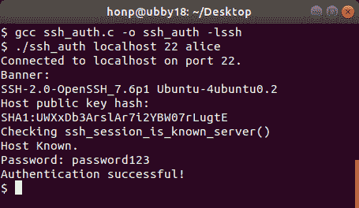
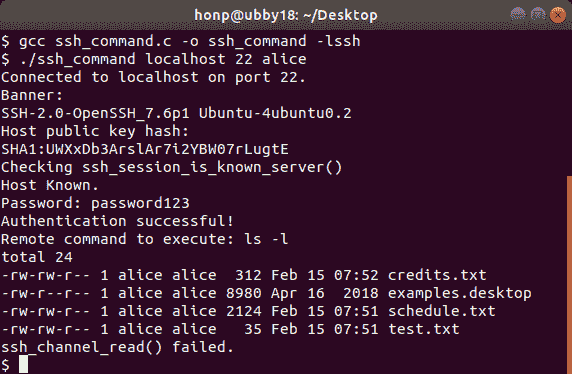
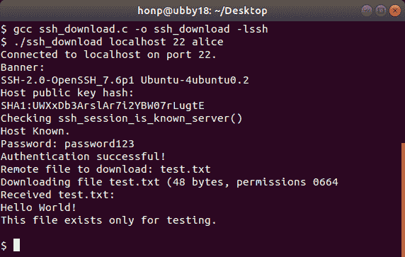

# 第十一章：使用 libssh 建立 SSH 连接

本章全部关于使用**安全外壳协议**（**SSH**）进行编程。SSH 是一种安全的网络协议，用于与远程服务器进行身份验证、授予命令行访问权限以及安全地传输文件。

SSH 广泛用于远程服务器的配置和管理。很多时候，Web 服务器并没有连接到显示器或键盘。对于这些服务器中的许多，SSH 提供了唯一的命令行访问和管理方法。

本章涵盖了以下主题：

+   SSH 协议概述

+   `libssh`库

+   建立连接

+   SSH 认证方法

+   执行远程命令

+   文件传输

# 技术要求

本章的示例程序可以使用任何现代的 C 编译器进行编译。我们推荐 Windows 上的**MinGW**和 Linux 及 macOS 上的**GCC**。您还需要安装`libssh`库。请参阅附录 B，*在 Windows 上设置您的 C 编译器*，附录 C，*在 Linux 上设置您的 C 编译器*，以及附录 D，*在 macOS 上设置您的 C 编译器*，以了解编译器和`libssh`的安装设置。

本书代码可在[`github.com/codeplea/Hands-On-Network-Programming-with-C`](https://github.com/codeplea/Hands-On-Network-Programming-with-C)找到。

从命令行，您可以使用以下命令下载本章的代码：

```cpp
git clone https://github.com/codeplea/Hands-On-Network-Programming-with-C
cd Hands-On-Network-Programming-with-C/chap11
```

本章中的每个示例程序都可在 Windows、Linux 和 macOS 上运行。

每个示例都需要链接到`libssh`库。这是通过向`gcc`传递`-lssh`选项来实现的。

我们提供了编译每个示例所需的精确命令，就像它被介绍时一样。

为了简洁，我们为每个示例程序使用了一个标准的头文件。这个头文件将其他需要的头文件放在一个地方。其内容如下：

```cpp
/*chap11.h*/

#include <stdio.h>
#include <stdlib.h>
#include <string.h>

#include <libssh/libssh.h>
```

# SSH 协议

在现代互联网上提供服务的多数服务器（如网站和电子邮件）并没有连接键盘或显示器。即使服务器确实有本地输入/输出硬件，远程访问通常也更为方便。

已使用各种协议提供对服务器的远程命令行访问。其中第一个这样的协议是**Telnet**。使用 Telnet，客户端通过 TCP 端口`23`上的明文远程连接到服务器。服务器通过这个**传输控制协议**（**TCP**）连接提供对操作系统命令行的更多或更少的直接访问。客户端向服务器发送明文命令，服务器执行这些命令。命令行输出从服务器发送回客户端。

Telnet 有一个重大的安全缺陷：它不会加密通过网络发送的任何数据。即使在使用 Telnet 时，用户密码也会以明文形式发送。这意味着任何网络窃听者都可能获取用户凭据！

SSH 协议现在已经很大程度上取代了 Telnet。SSH 协议通过 TCP 使用端口 `22` 进行工作。SSH 使用强加密来防止窃听。

SSH 允许客户端使用 **公钥认证** 来验证服务器的身份。如果没有对服务器进行公钥认证，冒充者可以伪装成合法的服务器并试图欺骗客户端连接。一旦连接成功，客户端会将其凭证发送给冒充的服务器。

SSH 还提供了许多用于客户端与服务器认证的方法。这包括发送密码或使用公钥认证。我们将在稍后详细探讨这些方法。

SSH 是一个复杂的协议。因此，我们不是尝试自己实现它，而是使用现有的库来提供所需的功能。

# libssh

`libssh` 是一个广泛使用的开源 C 库，实现了 SSH 协议。它允许我们使用 SSH 协议远程执行命令和传输文件。

`libssh` 以一种抽象网络连接的方式构建。我们不需要担心到目前为止所使用的低级网络 API。`libssh` 库为我们处理主机名解析和创建所需的 TCP 套接字。

# 测试 libssh

在继续本章内容之前，确保你已经安装并可用 `libssh` 库是非常重要的。请参阅附录 B，*在 Windows 上设置您的 C 编译器*，附录 C，*在 Linux 上设置您的 C 编译器*，以及附录 D，*在 macOS 上设置您的 C 编译器*，以了解 `libssh` 的安装。

我们使用 `libssh` 的第一个程序旨在确保它已正确安装。此程序仅打印 `libssh` 库版本。程序如下：

```cpp
/*ssh_version.c*/

#include "chap11.h"

int main()
{
    printf("libssh version: %s\n", ssh_version(0));
    return 0;
}
```

你可以使用以下命令在 Windows 上使用 MinGW 编译和运行 `ssh_version.c`：

```cpp
gcc ssh_version.c -o ssh_version.exe -lssh
ssh_version
```

在 Linux 和 macOS 上，编译和运行 `ssh_version.c` 的命令如下：

```cpp
gcc ssh_version.c -o ssh_version -lssh
./ssh_version
```

以下截图显示了 `ssh_version.c` 在 Linux 上成功编译和运行的情况：


如果你收到关于 `libssh.h` 未找到的错误消息，你应该检查是否在你的编译器的 `include` 目录搜索路径中包含了 `libssh` 库的头文件。如果你看到关于 `ssh_version` 未定义引用的错误消息，那么请检查你是否忘记将 `-lssh` 选项传递给你的编译器。

理解 `libssh` 的下一步是建立实际的 SSH 连接。

# 建立连接

现在我们已经确保 `libssh` 正确安装，是时候尝试实际的 SSH 连接了。

在继续之前，您需要访问一个 SSH 服务器。OpenSSH 是一个流行的服务器，适用于 Linux、macOS 和 Windows 10。它适用于测试，但在您的设备上安装之前，请确保您了解其安全实现。有关更多信息，请参阅您操作系统的文档。

如果您想使用远程系统进行测试，许多提供商都提供运行 OpenSSH 的 Linux **虚拟专用服务器**（**VPS**）。它们通常每月只需几美元。

让我们继续实现一个使用`libssh`打开 SSH 连接的程序。

我们将本章的其余程序结构为接受 SSH 服务器的 hostname 和端口号作为命令行参数。我们的程序从以下代码开始，该代码检查这些参数：

```cpp
/*ssh_connect.c*/

#include "chap11.h"

int main(int argc, char *argv[])
{
    const char *hostname = 0;
    int port = 22;
    if (argc < 2) {
        fprintf(stderr, "Usage: ssh_connect hostname port\n");
        return 1;
    }
    hostname = argv[1];
    if (argc > 2) port = atol(argv[2]);
```

在上述代码中，`argc`被检查以确定是否至少传递了主机名作为命令行参数。如果没有，则显示用法消息。否则，服务器的主机名存储在`hostname`变量中。如果传递了端口号，则存储在`port`变量中。否则，将存储默认端口`22`。

SSH 通常提供对服务器的完全和全面访问。因此，一些网络犯罪分子会随机扫描 IP 地址以寻找 SSH 连接。当他们成功建立连接时，他们会尝试猜测登录凭证，如果成功，他们将控制服务器。这些攻击针对安全设置得当的服务器不会成功，但它们仍然是一个常见的麻烦。在非默认端口（`22`）上使用 SSH 通常可以避免这些自动攻击。这就是我们想要确保我们的程序与非默认端口号良好工作的一个原因。

一旦我们的程序获得了主机名和连接端口号，我们继续创建一个 SSH 会话对象。这通过调用`ssh_new()`来完成，如下所示：

```cpp
/*ssh_connect.c continued*/

    ssh_session ssh = ssh_new();
    if (!ssh) {
        fprintf(stderr, "ssh_new() failed.\n");
        return 1;
    }
```

上述代码创建了一个新的 SSH 会话对象，并将其存储在`ssh`变量中。

一旦创建了 SSH 会话，在完成连接之前，我们需要指定一些选项。`ssh_options_set()`函数用于设置选项。以下代码展示了设置远程主机名和端口：

```cpp
/*ssh_connect.c continued*/

    ssh_options_set(ssh, SSH_OPTIONS_HOST, hostname);
    ssh_options_set(ssh, SSH_OPTIONS_PORT, &port);
```

`libssh`包括有用的调试工具。通过设置`SSH_OPTIONS_LOG_VERBOSITY`选项，我们告诉`libssh`打印出它几乎所做的一切。以下代码导致`libssh`记录了大量关于它采取哪些行动的信息：

```cpp
/*ssh_connect.c continued*/

    int verbosity = SSH_LOG_PROTOCOL;
    ssh_options_set(ssh, SSH_OPTIONS_LOG_VERBOSITY, &verbosity);
```

这种日志记录很有用，但它也可能令人分心。我建议您试一次，然后除非遇到问题，否则禁用它。本章的其余示例将不会使用它。

我们现在可以使用`ssh_connect()`来初始化 SSH 连接。以下代码展示了这一点：

```cpp
/*ssh_connect.c continued*/

    int ret = ssh_connect(ssh);
    if (ret != SSH_OK) {
        fprintf(stderr, "ssh_connect() failed.\n%s\n", ssh_get_error(ssh));
        return -1;
    }
```

注意，`ssh_connect()`在成功时返回`SSH_OK`。在失败时，我们使用`ssh_get_error()`函数来详细说明出了什么问题。

接下来，我们的代码会打印出连接成功的消息：

```cpp
/*ssh_connect.c continued*/

    printf("Connected to %s on port %d.\n", hostname, port);
```

SSH 协议允许服务器在连接时向客户端发送一条消息。这条消息被称为**横幅**。它通常用于识别服务器或提供简短的访问规则。我们可以使用以下代码来打印横幅：

```cpp
/*ssh_connect.c continued*/

    printf("Banner:\n%s\n", ssh_get_serverbanner(ssh));
```

我们的`ssh_connect.c`示例就到这里。我们的程序在终止前简单地断开连接并释放 SSH 会话。以下代码总结了`ssh_connect.c`：

```cpp
/*ssh_connect.c continued*/

    ssh_disconnect(ssh);
    ssh_free(ssh);

    return 0;
}
```

你可以使用以下命令在 Windows 上使用 MinGW 编译`ssh_connect.c`：

```cpp
gcc ssh_connect.c -o ssh_connect.exe -lssh
```

在 Linux 和 macOS 上，编译`ssh_connect.c`的命令如下：

```cpp
gcc ssh_connect.c -o ssh_connect -lssh
```

以下截图显示了`ssh_connect.c`在 Linux 上成功编译和运行的情况：


在前面的截图中，你可以看到`ssh_connect`能够连接到本地运行的 OpenSSH 服务器。

现在我们已经建立了连接，接下来让我们通过服务器认证来继续操作。

# SSH 认证

SSH 为服务器（主机）和客户端（用户）提供了认证方法。显然，服务器必须认证客户端的原因是服务器只想授权给授权用户。否则，任何人都可以接管服务器。

然而，客户端也需要认证服务器。如果客户端未能正确认证服务器，那么客户端可能会被欺骗向冒充者发送其密码！

在 SSH 中，服务器使用公钥加密进行认证。从概念上讲，这与 HTTPS 提供服务器认证非常相似。然而，SSH 通常不依赖于证书颁发机构。相反，当使用 SSH 时，大多数客户端只是简单地保留一个它们信任的公钥（或公钥哈希）列表。客户端最初是如何获得这个列表的各不相同。一般来说，如果一个客户端在受信任的环境下连接到服务器，那么它也可以信任该公钥在未来的使用。

`libssh`实现了记住受信任服务器公钥的功能。这样，一旦服务器被连接并信任一次，`libssh`就会记住它在未来的信任状态。

一些 SSH 部署还使用其他方法来验证 SSH 主机的公钥。例如，**Secure Shell 指纹**（**SSHFP**）记录是一种 DNS 记录，用于验证 SSH 公钥。其使用需要安全的 DNS 访问。

无论你决定是否信任（或不信任）服务器的公钥，你首先都需要获取服务器的公钥。让我们看看`libssh`是如何提供服务器认证功能的访问的。

# 服务器认证

一旦建立了 SSH 会话，我们可以使用`ssh_get_server_publickey()`函数来获取服务器的公钥。以下代码展示了这个函数调用：

```cpp
/*ssh_auth.c excerpt*/

    ssh_key key;
    if (ssh_get_server_publickey(ssh, &key) != SSH_OK) {
        fprintf(stderr, "ssh_get_server_publickey() failed.\n%s\n",
                ssh_get_error(ssh));
        return -1;
    }
```

获取并显示服务器 SSH 公钥的哈希值通常很有用。用户可以查看哈希值并将这些值与已知密钥进行比较。`libssh`库提供了`ssh_get_publickey_hash()`函数来实现这个目的。

以下代码打印出之前获得的公钥的 `SHA1` 哈希：

```cpp
/*ssh_auth.c excerpt*/

    unsigned char *hash;
    size_t hash_len;
    if (ssh_get_publickey_hash(key, SSH_PUBLICKEY_HASH_SHA1,
                &hash, &hash_len) != SSH_OK) {
        fprintf(stderr, "ssh_get_publickey_hash() failed.\n%s\n",
                ssh_get_error(ssh));
        return -1;
    }

    printf("Host public key hash:\n");
    ssh_print_hash(SSH_PUBLICKEY_HASH_SHA1, hash, hash_len);
```

`libssh` 使用 Base64 打印 `SHA1` 哈希。它还会首先添加哈希类型。例如，前面的代码可能会打印以下内容：

```cpp
Host public key hash:
SHA1:E348CMNeCGGec/bQqEX7aocDTfI
```

当你完成公钥和哈希的处理后，使用以下代码释放它们的资源：

```cpp
/*ssh_auth.c excerpt*/

    ssh_clean_pubkey_hash(&hash);
    ssh_key_free(key);
```

`libssh` 提供了 `ssh_session_is_known_server()` 函数来确定服务器的公钥是否已知。以下代码展示了如何使用此代码：

```cpp
/*ssh_auth.c excerpt*/

    enum ssh_known_hosts_e known = ssh_session_is_known_server(ssh);
    switch (known) {
        case SSH_KNOWN_HOSTS_OK: printf("Host Known.\n"); break;

        case SSH_KNOWN_HOSTS_CHANGED: printf("Host Changed.\n"); break;
        case SSH_KNOWN_HOSTS_OTHER: printf("Host Other.\n"); break;
        case SSH_KNOWN_HOSTS_UNKNOWN: printf("Host Unknown.\n"); break;
        case SSH_KNOWN_HOSTS_NOT_FOUND: printf("No host file.\n"); break;

        case SSH_KNOWN_HOSTS_ERROR:
            printf("Host error. %s\n", ssh_get_error(ssh)); return 1;

        default: printf("Error. Known: %d\n", known); return 1;
    }
```

如果服务器的公钥已知（之前已信任），则 `ssh_session_is_known_server()` 返回 `SSH_KNOWN_HOSTS_OK`。否则，`ssh_session_is_known_server()` 可以返回其他具有不同含义的值。

`SSH_KNOWN_HOSTS_UNKNOWN` 表示服务器未知。在这种情况下，用户应验证服务器的哈希值。

`SSH_KNOWN_HOSTS_NOT_FOUND` 表示 `libssh` 没有找到主机文件，并自动创建一个。这通常应与 `SSH_KNOWN_HOSTS_UNKNOWN` 以相同方式处理。

`SSH_KNOWN_HOSTS_CHANGED` 表示服务器返回的密钥与之前所知的密钥不同，而 `SSH_KNOWN_HOSTS_OTHER` 表示服务器返回的密钥类型与之前使用的不同。这些可能都表明潜在的攻击！在实际应用中，你应该更明确地通知用户这些风险。

如果用户已验证主机是可信任的，请使用 `ssh_session_update_known_hosts()` 允许 `libssh` 保存服务器的公钥哈希。这允许 `ssh_session_is_known_server()` 在下一次连接时返回 `SSH_KNOWN_HOSTS_OK`。

以下代码说明了提示用户信任连接并使用 `ssh_session_update_known_hosts()` 的示例：

```cpp
/*ssh_auth.c excerpt*/

    if (known == SSH_KNOWN_HOSTS_CHANGED ||
            known == SSH_KNOWN_HOSTS_OTHER ||
            known == SSH_KNOWN_HOSTS_UNKNOWN ||
            known == SSH_KNOWN_HOSTS_NOT_FOUND) {
        printf("Do you want to accept and remember this host? Y/N\n");
        char answer[10];
        fgets(answer, sizeof(answer), stdin);
        if (answer[0] != 'Y' && answer[0] != 'y') {
            return 0;
        }

        ssh_session_update_known_hosts(ssh);
    }
```

请参阅本章代码库中的 `ssh_auth.c` 以获取一个工作示例。有关更多信息，请参阅 `libssh` 文档。

在客户端认证服务器之后，服务器需要认证客户端。

# 客户端认证

SSH 提供了多种客户端认证方法。这些方法包括以下几种：

+   **无认证**：这允许任何用户连接

+   **密码认证**：这要求用户提供用户名和密码

+   **公钥**：这使用公钥加密方法进行认证

+   **键盘交互式**：通过让用户回答几个提示进行认证

+   **通用安全服务应用程序接口**（**GSS-API**）：这允许通过各种其他服务进行认证

密码认证是最常见的方法，但它确实有一些缺点。如果冒充服务器欺骗用户发送他们的密码，那么该用户的密码实际上就受到了损害。公钥用户认证不会像密码认证那样容易受到这种攻击。使用公钥认证时，服务器为每次认证尝试发出一个独特的挑战。这阻止了恶意冒充服务器重新播放之前的认证到合法服务器。

一旦设置了公钥认证，`libssh`使得使用它变得非常简单。在许多情况下，只需调用`ssh_userauth_publickey_auto()`函数即可。然而，设置公钥认证本身可能是一个繁琐的过程。

虽然公钥认证更安全，但密码认证仍然很常见。密码认证也更直接，更容易测试。出于这些原因，我们继续在本章中使用密码认证的示例。

无论使用哪种用户认证方法，SSH 服务器都必须知道你试图认证的用户是谁。`libssh`库允许我们使用之前看到的`ssh_set_options()`函数提供此信息。在使用`ssh_connect()`之前应该调用它。要设置用户，可以使用以下代码中的`ssh_options_set()`函数，并传入`SSH_OPTIONS_USER`：

```cpp
ssh_options_set(ssh, SSH_OPTIONS_USER, "alice");
```

在 SSH 会话建立之后，可以使用`ssh_userauth_password()`函数提供密码。以下代码提示输入密码并将其发送到已连接的 SSH 服务器：

```cpp
/*ssh_auth.c excerpt*/

    printf("Password: ");
    char password[128];
    fgets(password, sizeof(password), stdin);
    password[strlen(password)-1] = 0;

    if (ssh_userauth_password(ssh, 0, password) != SSH_AUTH_SUCCESS) {
        fprintf(stderr, "ssh_userauth_password() failed.\n%s\n",
                ssh_get_error(ssh));
        return 0;
    } else {
        printf("Authentication successful!\n");
    }
```

上述代码使用`fgets()`函数从用户那里获取密码。`fgets()`函数总是将换行符与输入一起包含，而我们不希望这样。`password[strlen(password)-1] = 0`代码实际上将密码缩短一个字符，从而移除了换行符。

注意，使用`fgets()`会导致输入的密码在屏幕上显示。这并不安全，最好在输入密码时隐藏它。不幸的是，没有跨平台的方法可以实现这一点。如果你使用 Linux，可以考虑用`getpass()`函数代替`fgets()`。

在本章的代码仓库中查看`ssh_auth.c`，以获取使用用户密码认证与服务器进行认证的工作示例。

你可以使用以下命令在 Windows 上使用 MinGW 编译和运行`ssh_auth.c`：

```cpp
gcc ssh_auth.c -o ssh_auth.exe -lssh
ssh_auth example.com 22 alice
```

在 Linux 和 macOS 上，编译和运行`ssh_auth.c`的命令如下：

```cpp
gcc ssh_auth.c -o ssh_auth -lssh
./ssh_auth example.com 22 alice
```

以下截图显示了编译`ssh_auth`并使用它连接到 Linux 上本地运行的 SSH 服务器：



在前面的截图中，`ssh_auth` 被用来成功认证本地运行的 SSH 服务器。`ssh_auth` 程序使用用户名 `alice` 和密码 `password123` 进行密码认证。不用说，你需要根据你的 SSH 服务器更改用户名和密码。只有当你使用连接到的服务器上实际用户账户的用户名和密码时，认证才会成功。

在认证后，我们就可以通过 SSH 运行命令了。

# 执行远程命令

SSH 协议通过通道工作。在我们建立 SSH 连接后，必须打开一个通道才能进行任何实际的工作。其优势是可以在一个连接上打开多个通道。这潜在地允许应用程序同时执行多项操作（看似）。

在 SSH 会话打开并且用户认证后，可以打开一个通道。通过调用 `ssh_channel_new()` 函数可以打开一个新的通道。以下代码说明了这一点：

```cpp
/*ssh_command.c excerpt*/

    ssh_channel channel = ssh_channel_new(ssh);
    if (!channel) {
        fprintf(stderr, "ssh_channel_new() failed.\n");
        return 0;
    }
```

SSH 协议实现了许多类型的通道。**会话**通道类型用于执行远程命令和传输文件。使用 `libssh`，我们可以通过 `ssh_channel_open_session()` 函数请求会话通道。以下代码展示了调用 `ssh_channel_open_session()`：

```cpp
/*ssh_command.c excerpt*/

    if (ssh_channel_open_session(channel) != SSH_OK) {
        fprintf(stderr, "ssh_channel_open_session() failed.\n");
        return 0;
    }
```

一旦会话通道打开，我们可以使用 `ssh_channel_request_exec()` 函数发出命令。以下代码使用 `fgets()` 提示用户输入命令，并使用 `ssh_channel_request_exec()` 将命令发送到远程主机：

```cpp
/*ssh_command.c excerpt*/

    printf("Remote command to execute: ");
    char command[128];
    fgets(command, sizeof(command), stdin);
    command[strlen(command)-1] = 0;

    if (ssh_channel_request_exec(channel, command) != SSH_OK) {
        fprintf(stderr, "ssh_channel_open_session() failed.\n");
        return 1;
    }
```

命令发送后，我们的程序使用 `ssh_channel_read()` 接收命令输出。以下代码循环直到读取整个输出：

```cpp
/*ssh_command.c excerpt*/

    char output[1024];
    int bytes_received;
    while ((bytes_received =
                ssh_channel_read(channel, output, sizeof(output), 0))) {
        if (bytes_received < 0) {
            fprintf(stderr, "ssh_channel_read() failed.\n");
            return 1;
        }
        printf("%.*s", bytes_received, output);
    }
```

上述代码首先分配一个缓冲区 `output` 来存储命令输出的接收数据。`ssh_channel_read()` 函数返回读取的字节数，但在读取完成或发生错误时返回 `0`。我们的代码在 `ssh_channel_read()` 返回数据时循环。

在收到命令的全部输出后，客户端应在通道上发送一个 **文件结束符** (**EOF**)，关闭通道，并释放通道资源。以下代码展示了这一过程：

```cpp
/*ssh_command.c excerpt*/

    ssh_channel_send_eof(channel);
    ssh_channel_close(channel);
    ssh_channel_free(channel);
```

如果你的程序也完成了 SSH 会话，请务必调用 `ssh_disconnect()` 和 `ssh_free()`。

本章代码库中包含的 `ssh_command.c` 程序是一个简单的实用程序，它连接到远程 SSH 主机并执行单个命令。

你可以使用以下命令在 Windows 上使用 MinGW 编译 `ssh_command.c`：

```cpp
gcc ssh_command.c -o ssh_command.exe -lssh
```

在 Linux 和 macOS 上，编译 `ssh_command.c` 的命令如下：

```cpp
gcc ssh_command.c -o ssh_command -lssh
```

以下截图显示了在 Linux 上编译和运行 `ssh_command.c`：



之前的截图显示了连接到本地 OpenSSH 服务器并执行 `ls -l` 命令。`ssh_command` 代码忠实地打印了该命令的输出（这是用户主目录的文件列表）。

`libssh` 库中的函数 `ssh_channel_request_exec()` 适用于执行单个命令。然而，SSH 也支持打开一个完全交互式远程 shell 的方法。通常，会话通道会按照之前所示的方式打开。然后调用 `libssh` 库函数 `ssh_channel_request_pty()` 来初始化远程 shell。`libssh` 库提供了许多函数用于以这种方式发送和接收数据。请参阅 `libssh` 文档以获取更多信息。

现在您能够执行远程命令并接收其输出，也可能需要传输文件。让我们考虑一下下一步。

# 下载文件

**安全复制协议**（**SCP**）提供了一种文件传输的方法。它支持上传和下载文件。

`libssh` 使使用 SCP 变得简单。本章的代码仓库包含一个示例，`ssh_download.c`，它展示了使用 `libssh` 在 SCP 上下载文件的基本方法。

在 SSH 会话启动并用户认证后，`ssh_download.c` 使用以下代码提示用户输入远程文件名：

```cpp
/*ssh_download.c excerpt*/

    printf("Remote file to download: ");
    char filename[128];
    fgets(filename, sizeof(filename), stdin);
    filename[strlen(filename)-1] = 0;
```

通过调用 `libssh` 库函数 `ssh_scp_new()` 可以初始化一个新的 SCP 会话，如下所示：

```cpp
/*ssh_download.c excerpt*/

    ssh_scp scp = ssh_scp_new(ssh, SSH_SCP_READ, filename);
    if (!scp) {
        fprintf(stderr, "ssh_scp_new() failed.\n%s\n",
                ssh_get_error(ssh));
        return 1;
    }
```

在前面的代码中，将 `SSH_SCP_READ` 传递给 `ssh_scp_new()`。这指定我们将使用新的 SCP 会话来下载文件。`SSH_SCP_WRITE` 选项将用于上传文件。`libssh` 库还提供了 `SSH_SCP_RECURSIVE` 选项，以帮助上传或下载整个目录树。

成功创建 SCP 会话后，必须调用 `ssh_scp_init()` 来初始化 SCP 通道。以下代码展示了这一过程：

```cpp
/*ssh_download.c excerpt*/

    if (ssh_scp_init(scp) != SSH_OK) {
        fprintf(stderr, "ssh_scp_init() failed.\n%s\n",
                ssh_get_error(ssh));
        return 1;
    }
```

必须调用 `ssh_scp_pull_request()` 来开始文件下载。此函数返回 `SSH_SCP_REQUEST_NEWFILE` 以指示远程主机将开始发送新文件。以下代码展示了这一过程：

```cpp
/*ssh_download.c excerpt*/

    if (ssh_scp_pull_request(scp) != SSH_SCP_REQUEST_NEWFILE) {
        fprintf(stderr, "ssh_scp_pull_request() failed.\n%s\n",
                ssh_get_error(ssh));
        return 1;
    }
```

`libssh` 提供了一些我们可以使用的方法来检索远程文件名、文件大小和权限。以下代码检索这些值并将它们打印到控制台：

```cpp
/*ssh_download.c excerpt*/

    int fsize = ssh_scp_request_get_size(scp);
    char *fname = strdup(ssh_scp_request_get_filename(scp));
    int fpermission = ssh_scp_request_get_permissions(scp);

    printf("Downloading file %s (%d bytes, permissions 0%o\n",
            fname, fsize, fpermission);
    free(fname);
```

一旦知道文件大小，我们就可以使用 `malloc()` 分配空间来在内存中存储它。以下代码展示了这一过程：

```cpp
/*ssh_download.c excerpt*/

    char *buffer = malloc(fsize);
    if (!buffer) {
        fprintf(stderr, "malloc() failed.\n");
        return 1;
    }
```

然后我们的程序使用 `ssh_scp_accept_request()` 接受新的文件请求，并使用 `ssh_scp_read()` 下载文件。以下代码展示了这一过程：

```cpp
/*ssh_download.c excerpt*/

    ssh_scp_accept_request(scp);
    if (ssh_scp_read(scp, buffer, fsize) == SSH_ERROR) {
        fprintf(stderr, "ssh_scp_read() failed.\n%s\n",
                ssh_get_error(ssh));
        return 1;
    }
```

可以通过简单的 `printf()` 调用来将下载的文件打印到屏幕上。当我们完成文件数据后，释放分配的空间也很重要。以下代码打印出文件内容并释放分配的内存：

```cpp
/*ssh_download.c excerpt*/

    printf("Received %s:\n", filename);
    printf("%.*s\n", fsize, buffer);
    free(buffer);
```

对`ssh_scp_pull_request()`的额外调用应返回`SSH_SCP_REQUEST_EOF`。这表示我们已经从远程主机接收了整个文件。以下代码检查来自远程主机的文件结束请求：

```cpp
/*ssh_download.c excerpt*/

    if (ssh_scp_pull_request(scp) != SSH_SCP_REQUEST_EOF) {
        fprintf(stderr, "ssh_scp_pull_request() unexpected.\n%s\n",
                ssh_get_error(ssh));
        return 1;
    }
```

上述代码略有简化。远程主机也可能返回其他值，这些值不一定是错误。例如，如果`ssh_scp_pull_request()`返回`SSH_SCP_REQUEST_WARNING`，则远程主机已发送警告。这个警告可以通过调用`ssh_scp_request_get_warning()`来读取，但无论如何，都应该再次调用`ssh_scp_pull_request()`。

文件接收后，应使用`ssh_scp_close()`和`ssh_scp_free()`来释放资源，如下述代码片段所示：

```cpp
/*ssh_download.c excerpt*/

    ssh_scp_close(scp);
    ssh_scp_free(scp);
```

在你的程序完成 SSH 会话后，别忘了调用`ssh_disconnect()`和`ssh_free()`。

整个文件下载示例包含在本章代码中的`ssh_download.c`文件。

你可以在 Windows 上使用 MinGW 通过以下命令编译`ssh_download.c`：

```cpp
gcc ssh_download.c -o ssh_download.exe -lssh
```

在 Linux 和 macOS 上，编译`ssh_download.c`的命令如下：

```cpp
gcc ssh_download.c -o ssh_download -lssh
```

以下截图显示了在 Linux 上成功编译并使用`ssh_download.c`下载文件的情况：



如前述截图所示，使用 SSH 和 SCP 下载文件非常简单。这可以是一种在计算机之间安全传输数据的有用方式。

# 摘要

本章简要概述了 SSH 协议及其使用`libssh`的方式。我们了解了很多关于 SSH 协议的身份验证知识，以及服务器和客户端都必须进行身份验证以确保安全。一旦建立连接，我们就实现了一个简单的程序来在远程主机上执行命令。我们还看到了`libssh`如何使使用 SCP 下载文件变得非常简单。

SSH 提供了一个安全的通信通道，有效地阻止了窃听者获取截获通信的意义。

在下一章，第十二章，*网络监控与安全*，我们继续探讨安全主题，通过查看能够有效监听非安全通信通道的工具。

# 问题

尝试以下问题来测试你对本章知识的掌握：

1.  使用 Telnet 的一个显著缺点是什么？

1.  SSH 通常运行在哪个端口上？

1.  为什么客户端验证 SSH 服务器是至关重要的？

1.  服务器通常是如何进行身份验证的？

1.  SSH 客户端通常是如何进行身份验证的？

这个问题的答案可以在附录 A，*问题答案*中找到。

# 进一步阅读

关于 Telnet、SSH 和`libssh`的更多信息，请参考以下内容：

+   SSH 库[`www.libssh.org`](https://www.libssh.org)

+   **RFC 15**：*时分共享主机网络子系统*（Telnet）([`tools.ietf.org/html/rfc15`](https://tools.ietf.org/html/rfc15))

+   **RFC 855**: *Telnet Option Specifications* ([`tools.ietf.org/html/rfc855`](https://tools.ietf.org/html/rfc855))

+   **RFC 4250**: *The **Secure Shell** (**SSH**) Protocol Assigned Numbers* ([`tools.ietf.org/html/rfc4250`](https://tools.ietf.org/html/rfc4250))

+   **RFC 4251**: *The **Secure Shell** (**SSH**) Protocol Architecture* ([`tools.ietf.org/html/rfc4251`](https://tools.ietf.org/html/rfc4251))

+   **RFC 4252**: *The **Secure Shell** (**SSH**) Authentication Protocol* ([`tools.ietf.org/html/rfc4252`](https://tools.ietf.org/html/rfc4252))

+   **RFC 4253**: *The **Secure Shell** (**SSH**) Transport Layer Protocol* ([`tools.ietf.org/html/rfc4253`](https://tools.ietf.org/html/rfc4253))

+   **RFC 4254**: *The **Secure Shell** (**SSH**) Connection Protocol* ([`tools.ietf.org/html/rfc4254`](https://tools.ietf.org/html/rfc4254))

+   **RFC 4255**: *Using DNS to Securely Publish **Secure Shell** (**SSH**) Key Fingerprints* ([`tools.ietf.org/html/rfc4255`](https://tools.ietf.org/html/rfc4255))

+   **RFC 4256**: *Generic Message Exchange Authentication for the **Secure Shell** Protocol (**SSH**)* ([`tools.ietf.org/html/rfc4256`](https://tools.ietf.org/html/rfc4256))
