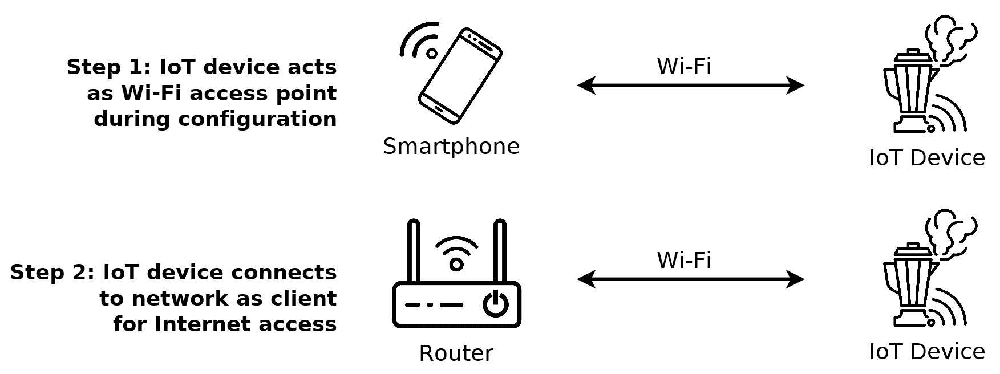
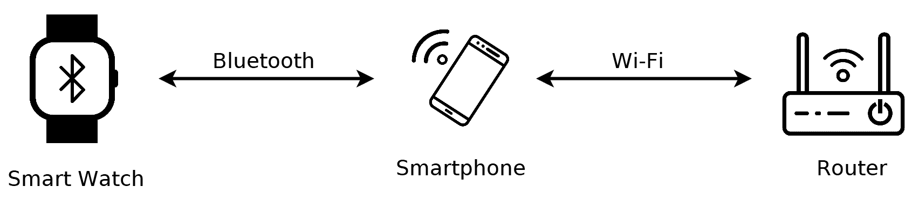
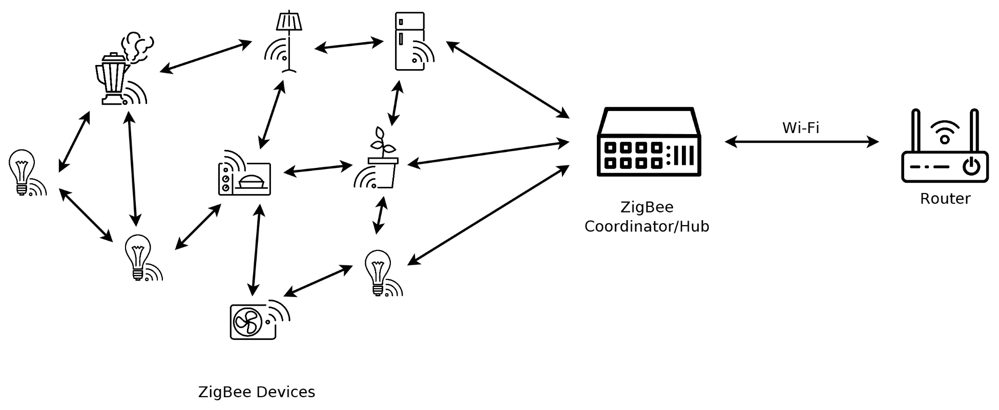
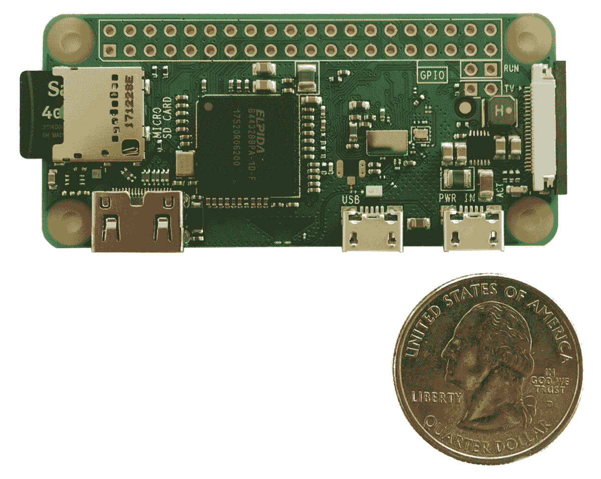
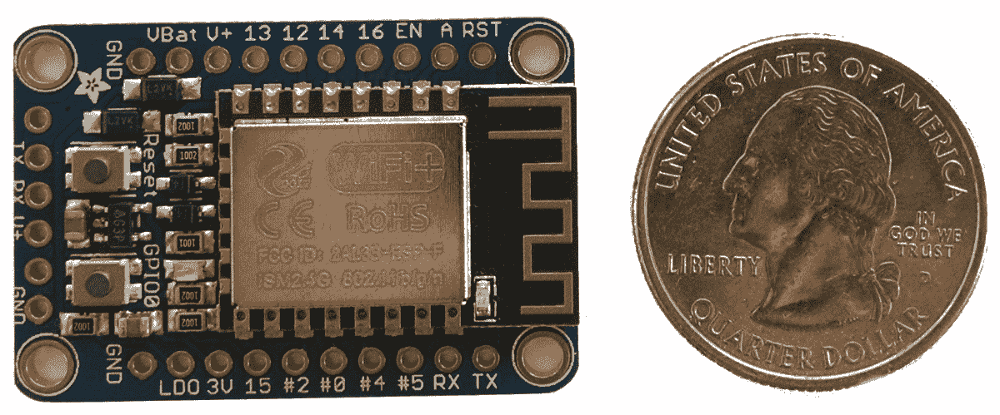
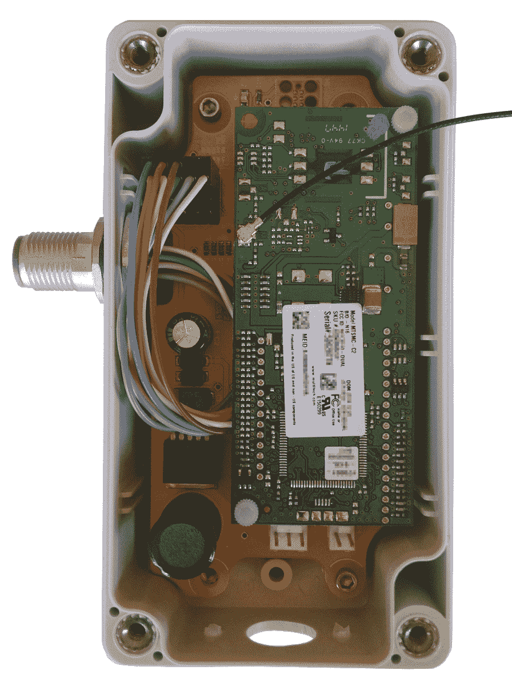
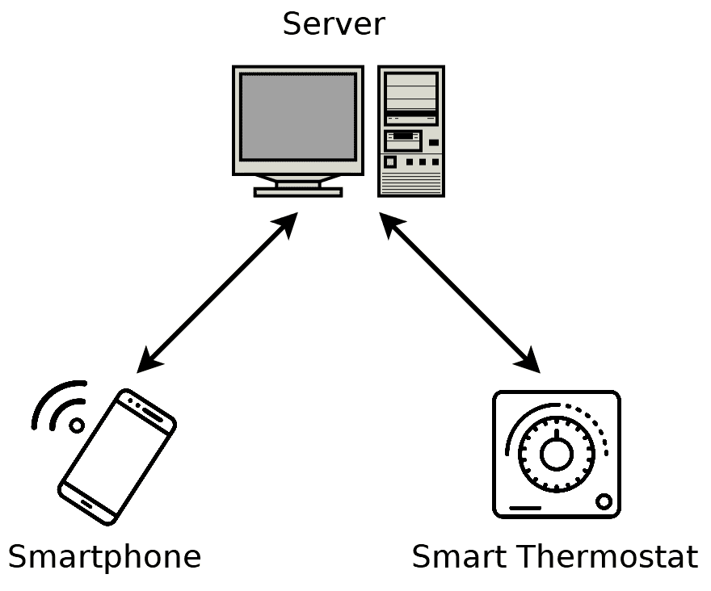

# 第十四章：物联网的 Web 编程

在本章中，我们将注意力转向**物联网**（**IoT**）。物联网是一个令人兴奋的新趋势，其中互联网连接被添加到日常物理对象中。当与嵌入式电子设备和传感器结合时，互联网访问允许物理对象相互交互，并可以从世界任何地方进行控制和监控。

本章节涵盖了以下主题：

+   定义物联网

+   连接类型

+   带宽考虑

+   控制器类型

+   物联网的伦理

+   物联网的安全

# 技术要求

本章不包含 C 代码。相反，它侧重于物联网领域使用的理论、技术和实践。

# 什么是物联网？

我们现在生活在一个几乎任何可以连接到互联网的东西都已经连接的世界。这些设备构成了物联网，它们存在于我们生活的方方面面。

在家里的厨房里，具有互联网连接的设备包括冰箱、微波炉、传统烤箱、食品秤、洗碗机、咖啡机，甚至榨汁机。

在家里的其他地方，我们有智能电视、游戏机、恒温器、锅炉、洗衣机、开关、灯泡、瑜伽垫、闹钟、摄像头、门铃、浴室秤、婴儿监视器、音响系统和扬声器——所有这些设备都连接到互联网。当然，你的整个房子可能由网络智能电表供电，提供电力、水和天然气。当你离开家时，你会通过物联网车库门进入你的始终连接的内置 Wi-Fi 汽车吗？许多人都是这样做的。

在工业领域，物联网设备是**工业 4.0**的核心，通常被认为是第四次工业革命。利用互联网连接将制造供应链中的每个设备相互连接，实现了前所未有的效率优化。

物联网甚至影响了我们种植食物的方式。在农业领域，物联网设备允许农民监控相关的天气条件，如温度、湿度、阳光、降雨和风速。这些信息有助于做出提高产量和质量的决策。

当然，这只是物联网应用的几个例子。这个概念也应用于环境、医疗保健、基础设施、交通等方面的关注。

当向设备添加互联网连接时，你有几个选择。每种连接选项都有其优缺点。我们将在下面进行回顾。

# 连接选项

一旦你弄清楚你的设备能做什么，并且它从互联网连接中受益，你仍然需要决定如何连接它。有许多选项，各有其权衡。

# Wi-Fi

或许 Wi-Fi 不需要过多介绍。几乎每个有互联网接入的现代家庭都提供了 Wi-Fi。这在很大程度上是因为住宅**互联网服务提供商**（**ISP**）通常使用内置 Wi-Fi 的调制解调器。如果你的物联网设备部署在室内，那么很可能有一个 Wi-Fi 网络可用。这一点对于住宅和商业设备尤其如此。

Wi-Fi 是最受欢迎的**无线局域网**（**WLAN**）技术，基于 IEEE 802.11 标准。它通常在 2.4 GHz 或 5 GHz 的无线电频率上运行。

Wi-Fi 提供了两种主要的操作模式。在**对等**（**ad hoc**）模式下，设备直接相互通信。然而，**基础设施**（**infrastructure**）模式更为常见。在基础设施模式下，WLAN 上的设备都连接到一个**无线接入点**（**WAP**）。然后 WAP 通常为整个 WLAN 提供互联网接入。

Wi-Fi 提供良好的带宽、低延迟和基本的安全功能，但它的功耗比其他短距离无线标准要高。尽管 Wi-Fi 的新版本可以实现 1 Gbps 的速度，但在实际应用中这些速度还不常见。无论如何，对于物联网设备的应用，我们通常关注的是互联网接入。物联网设备连接到本地路由器的 Wi-Fi 性能通常不是瓶颈，而是路由器可用的互联网服务。

在你的物联网设备中使用 Wi-Fi 连接的一个缺点是设置难度。大多数 Wi-Fi 网络都使用密码进行保护，因此你的设备需要以某种方式获取网络名称和密码，才能连接。如果你的设备内置了屏幕和键盘（或触摸屏），那么输入网络密码是微不足道的。

然而，对于没有大屏幕的物联网设备，配置网络密码有时可能会很复杂。一种解决方案是让您的最终用户将配置信息放在 SD 卡或 USB 存储设备上。然后您的设备从这个存储中读取密码，并可以连接到网络。这种解决方案的问题在于它很繁琐，许多用户可能没有技术能力完成这个设置。

一种替代的设置方法是首先通过计算机或智能手机（可能通过蓝牙）将设备连接起来进行初始配置。这种方法的不利之处在于需要用户获得这样的设置设备（并非每个人都有智能手机），以及需要额外的工作来开发设置应用程序。

第三种设置方法是让物联网设备最初提供自己的 Wi-Fi 网络。换句话说，该设备充当临时的接入点。然后，用户使用笔记本电脑或智能手机直接连接到设备。用户打开浏览器，设备会提供一个网页，用户可以在该网页上配置设备。一旦输入了参数，物联网设备就会连接到本地 Wi-Fi 热点，现在已配置好用于互联网访问。

以下图表说明了这种设置方法：

这种设置方法的优点是无需为设置开发特殊软件。任何可以连接到 Wi-Fi 网络并具有标准网络浏览器的设备都可以工作。

请记住，Wi-Fi 网络偶尔会发生变化。定期更改 Wi-Fi 密码是良好的安全实践，每次更改密码时，物联网设备都需要重新配置。

虽然 Wi-Fi 很方便，但如果有线连接可用，通常更容易、更好。

# 以太网

如果可用，有线以太网连接对任何物联网设备来说都是理想的。以太网提供简单的设置和极高的可靠性。最新的标准允许带宽达到 400 Gbps，其低延迟是无与伦比的。在某些情况下，甚至可以通过以太网提供电力，进一步简化部署。

以太网连接的缺点当然是需要物理电缆。许多办公室已经将以太网布线到每个房间，以太网连接的物联网设备在那里运行良好。然而，在住宅和工业环境中，铺设新电缆可能会很繁琐。因此，在这些环境中，无线连接通常更容易。

当可用时，以太网设置很简单。很多时候，设备只需插入即可开始工作。

请记住，与以太网和 Wi-Fi 一样，您依赖于您的物联网设备安装地点有互联网接入。这种互联网接入通常比您在本地网络上的以太网连接要慢得多。由于这种互联网接入是由您的客户提供的，其质量可能会有很大差异。

如果 Wi-Fi 和以太网都不可用怎么办？如果您的设备需要移动怎么办？在这些情况下，蜂窝互联网接入可能是您的最佳选择。

# 细胞网络

细胞网络（移动网络）可以是一个很好的物联网设备连接选项。它尤其有两个原因很有用。首先，蜂窝服务几乎无处不在可用。这使得蜂窝网络非常适合移动物联网设备。其次，所有网络设置都可以在制造时完成。这使得部署变得简单、无烦恼，并且与其他选项相比，可以降低持续支持成本。

细胞连接的缺点是成本较高。首先，物联网设备必须包含一个细胞调制解调器。细胞调制解调器的成本比 Wi-Fi 调制解调器和以太网收发器要高。此外，在设备被允许进入运营商网络之前，还需要进行某些测试和认证。

细胞设备也必须付费获取接入。使用 Wi-Fi 或以太网时，物联网设备被认为能够从本地互联网接入中获取流量。使用细胞网络时，必须有人为每个特定设备支付账单。通常，物联网设备制造商为每个设备提供和维持服务是有意义的。对于需要低带宽的设备，LTE 细胞连接可以每月低于 1.00 美元（美元）的价格维持。任何需要大量带宽的设备，其服务成本都要高得多。

细胞网络的一个额外好处是许多移动网络提供商可以通过**虚拟私人网络**（**VPN**）路由您的流量。这是由网络运营商完成的，您不会为 VPN 额外带宽的费用付费。VPN 将您的物联网设备与互联网隔离开来，并允许仅与您信任的服务器进行通信。这很方便，因为许多安全担忧都由移动网络提供商解决。

我们已经介绍了三种直接互联网接入的选项，但许多物联网设备不需要直接访问互联网。一些设备与计算机或智能手机协同工作以获取接入。与这种方法一起常用的无线技术之一是蓝牙。

# 蓝牙

蓝牙是一种流行的短距离无线技术标准，用于**无线个人区域网络**（**WPAN**）。与 Wi-Fi 一样，蓝牙在 2.4 GHz 无线电频段上运行。

蓝牙可以用于直接互联网接入，但在实践中这是不常见的。蓝牙通常用于将物联网设备连接到另一个具有互联网接入的设备。例如，许多智能手表使用蓝牙与智能手机配对。然后，智能手机通过 Wi-Fi 或细胞连接获得互联网接入。

以下图显示了蓝牙**智能手表**的连接：

这对于智能手表来说非常有效，因为它通常预期会与智能手机保持近距离。

当然，您可能从哲学上反对将智能手表视为物联网设备。在这种情况下，它更多的是智能手机应用程序的传感器，而不是独立的物联网设备。尽管如此，它还是符合物联网的生态系统。这种搭便车的连接方式可以是一个好选择，不应被忽视。

作为与蓝牙类似的技术，基于**IEEE 802.15.4**的无线网络通常被部署以允许整个物联网设备网络进行相互通信。

# IEEE 802.15.4 WPANs

**IEEE 802.15.4**是**低速率无线个人区域网络**（**LR-WPAN**）的技术标准。该标准首次于 2003 年定义，为其他协议提供了基础。例如，**Zigbee**、**6LoWPAN**、**Thread**、**ISA100.1**、**WirelessHART**、**WiSUN**和**MiFi**协议都是基于 IEEE 802.15.4 标准的，仅举几个例子。

基于 IEEE 802.15.4 的协议适用于低功耗、有限范围的场景。典型的范围可扩展到大约 10 米，传输速率为 250 Kbps。由于功耗低，电池供电的设备通常可以在单次充电的情况下运行多年。

一些基于 IEEE 802.15.4 的协议，如 6LoWPAN，允许设备直接使用 IP 进行通信，类似于 Wi-Fi 通常的使用方式。其他协议通常仅用于将数据发送到中心节点设备。该中心节点负责处理物联网设备数据，并在需要时通过互联网进行通信。

作为具体例子，家庭自动化网络通常基于 IEEE 802.15.4 标准。在许多情况下，这些网络很少用于为每个物联网设备提供直接互联网访问。相反，通常使用中心节点来允许设备网络进行通信。该中心节点协调数据并将其转发到互联网。

**网状网络拓扑**在基于 IEEE 802.15.4 的设置中很常见。这允许远离中心节点的设备通过较近的设备进行通信。

下图展示了家庭自动化中的网状网络：

在前面的图中，我们看到一个用于家庭自动化设置的基于 IEEE 802.15.4 的网络。各种物联网设备，如灯具和厨房小工具，与**协调器/中心节点**通信。该中心节点控制和协调连接的设备。该中心节点本身使用 Wi-Fi 连接到本地网络，这种互联网连接允许远程控制和监控物联网设备。

现在我们已经介绍了一些最受欢迎的连接选项，让我们将注意力转向物联网硬件选择。

# 硬件选择

在设计物联网设备时，有许多硬件选择。在许多情况下，这些选择最终必须基于设备的功能，而不是它们的连接选项。记住，物联网设备除了连接到互联网之外，还需要有有用的目的。

让我们来看看三种硬件选择——单板计算机、微控制器和**现场可编程门阵列**（**FPGA**）。

# 单板计算机

**单板计算机**（**SBC**）是在单个电路板上构建的完整计算机。它们包括功能计算机的所有常用部件——**中央处理器**（**CPU**）、**随机存取存储器**（**RAM**）、非易失性存储器和输入/输出端口。

SBCs 能够运行全功能的操作系统。Linux 被广泛使用。

例如，**树莓派 Zero W** 的尺寸仅为 2.6 英寸 x 1.2 英寸。它内置 512 MB 的 RAM，并使用 micro SD 卡进行存储。还包含 Wi-Fi 和蓝牙连接功能。目前，树莓派 Zero W 的零售价约为 10 美元（美元）。

以下照片展示了树莓派 Zero W：

由于 SBCs 运行正常的桌面操作系统，如 Linux，因此编程它们很容易。事实上，本书中我们开发的所有网络程序都适用。

除了视频、音频和 USB 的标准计算机连接器外，SBCs 通常还有一些 **通用输入/输出** （**GPIO**）引脚以进行工作。这赋予了它们一些基本的微控制器类似功能。这些 GPIO 引脚能够读取数字输入信号并提供数字输出信号。在树莓派上，一些引脚还能够提供 **脉冲宽度调制** （**PWM**） 输出，以及各种板级串行协议——**串行外围接口** （**SPI**）、**集成电路间** （**I2C**）和 **异步串行**。

虽然 SBCs 非常容易入门，但它们确实有一些缺点。它们相对较贵，需要大量电力，并且它们使用的通用操作系统并不总是适合嵌入式系统。相比之下，微控制器要便宜得多，并且针对处理实时性能约束进行了优化。

# 微控制器

**微控制器** 是一个包含在单个集成电路上的小型计算机。微控制器包含一个功能计算机所需的所有部件，包括 CPU、RAM 和非易失性存储。

虽然 SBCs 通常具有数百或数千兆赫的处理器速度，但微控制器的时钟频率通常低于 100 兆赫。看到时钟频率仅为 1 兆赫或更低的微控制器并不罕见。微控制器通常具有从几十字节到几兆字节的 RAM。这些朴实的规格也意味着微控制器可以在非常少的电力下运行。在睡眠模式下，看到微控制器仅需几纳安培的情况并不少见。

微控制器通常带有大量的 GPIO 引脚和有用的外围设备，例如计时器、实时时钟、通信接口、**脉冲宽度调制** （**PWM**） 输出、**模拟到数字** （**A/D**） 转换器比较器、**数字到模拟转换器** （**DAC**）、**看门狗定时器** （**WDT**）、串行收发器等等。

这些微控制器外围设备对于物联网设备的核心功能至关重要。例如，PWM 生成器外围设备可用于精确的电机控制，而 ADC 可能需要读取传感器。记住，物联网设备的互联网部分在很大程度上是次要的；设备必须首先执行一些有用的功能。如果无法感知温度，互联网连接的恒温器有什么用？

微控制器有多种架构和总线宽度。8 位、16 位和 32 位控制器都很常见。尽管对于物联网设备来说，8 位控制器可能功率不足。

现代台式电脑几乎总是使用冯·诺依曼架构，但许多微控制器使用哈佛架构。

在冯·诺依曼架构中，这种架构主导着桌面处理器市场，内存存储数据和指令。这需要处理器指令的宽度与它们处理的数据相同。相比之下，哈佛架构机器使用完全独立的内存来存储指令和数据。哈佛架构微控制器使用与数据不同的字大小来存储指令是很常见的。例如，一个 16 位的哈佛架构微控制器可能以 16 位字处理数据，但其指令可能编码为 24 位字。当数据存储在 RAM 中时，指令直接从非易失性存储器读取，例如**FLASH**或**EEPROM**。

还可以找到具有内置网络功能的微控制器，包括对 Wi-Fi、以太网、蓝牙、IEEE 802.15.4 等的支持。

以 Espressif Systems 生产的 ESP8266 32 位微控制器为例，它内置了 Wi-Fi 收发器和 TCP/IP 堆栈。

以下图显示了 ESP8266 微控制器在扩展板上的情况：

没有内置收发器的微控制器可以通过外部调制解调器连接到具有这些功能的设备。

微控制器通常直接编程，而不需要操作系统。一些程序员更喜欢操作系统，并且有许多不同的微控制器操作系统可供选择。这些操作系统通常使微控制器执行各种任务变得更加容易，同时简化程序布局并保留实时能力。需要注意的是，这些微控制器操作系统通常缺乏桌面操作系统中被视为理所当然的内存分段和其他安全特性。

当你不需要太多处理能力，但确实需要实时处理保证时，微控制器非常出色。那么当你需要处理能力和实时保证时怎么办？看看 FPGAs。

# FPGAs

**现场可编程门阵列**（**FPGAs**）是包含可编程逻辑块数组的集成电路。这些逻辑块可以被编程和组合以实现复杂功能。本质上，任何**专用集成电路**（**ASIC**）可以执行的操作也可以在 FPGA 上完成。

FPGAs 对于需要实时保证的高度要求处理任务非常有用，特别是那些从高度并行处理中受益的任务。例如，一个对单板计算机来说过于苛刻的视频处理算法，更不用说微控制器了，对于 FPGA 来说可能微不足道。

FPGA 使用**硬件描述语言**（**HDL**）进行编程。最常用的两种语言是**Verilog**和**VHSIC 硬件描述语言**（**VHDL**）。这些语言与 C 语言大不相同。虽然 C 是一种命令式语言，它提供了完成计算所需的步骤，但 HDL 是声明性语言，它提供了逻辑门应该如何连接的描述。

在实践中，通常会在 FPGA 中实现一个软微处理器核心。这个软处理器可以像任何其他微处理器一样编程，并用于各种不需要太多处理能力的任务。例如，处理视频的 FPGA 可能实现了一个负责系统设置和配置功能的微处理器。这些软处理器通常用 C 语言编程。

无论你的物联网设备使用哪种类型的硬件，如果没有合适的内置通信，你将需要一个外置收发器或调制解调器。

# 外置收发器和调制解调器

外置收发器和调制解调器可用于 Wi-Fi、蜂窝、以太网、蓝牙以及任何你能想到的协议。

以下照片显示了一个使用蜂窝调制解调器的工业物联网设备：

在前面的图中，下方的电路板实现了设备的功能（在本例中是监控低温液体）。在这个板上，你可以找到电源系统、传感器电子设备和一款低成本、16 位的微控制器。一个蜂窝调制解调器位于顶部的电路板上，该电路板插入到下方电路板上的一个插座中。

外置调制解调器通常通过异步串行与主机（微控制器）通信。所使用的协议在系统之间差异很大。

与调制解调器通信的一个常见协议族是**Hayes 命令集**，也称为**AT 命令**。这些命令由简短基于文本的消息组成。AT 命令在某种程度上标准化了拨打电话，但已扩展到管理互联网连接。不幸的是，几乎每个调制解调器制造商对扩展的方式都不同。

如果你正在使用外置调制解调器，你需要查阅该调制解调器的文档以获取与其通信的确切协议。通常没有提供套接字风格的驱动程序，但本书中探讨的许多核心网络概念仍然适用。

在解决了连接问题之后，让我们将注意力转向**物联网设备协议**。

# 物联网协议

大多数物联网设备通过将数据发送到几个中央服务器——云来工作。这些服务器处理和存储物联网设备数据，并允许远程访问和配置。

例如，以智能恒温器为例。它持续向中央服务器发送温度数据。该服务器存储这些数据。如果用户想查看数据，他们可以将个人电脑或智能手机连接到该中央服务器。他们不会直接连接到物联网设备本身。当他们想更改恒温器设置时，他们向中央服务器发送这个更改，然后服务器将其转发到物联网恒温器。

下面的图示说明了这个概念：

在前面的图中，请注意所有通信都通过服务器进行。智能手机与物联网设备之间没有直接的通信。

使用中央服务器有几个优点。它允许物联网设备进行更少的处理。服务器可以进一步处理这些数据并将其格式化为图表等。服务器还可以发送电子邮件或其他警报，并且服务器能够存储比物联网设备能够存储的更多数据。此外，服务器为物联网设备和用户的设备（如笔记本电脑或智能手机）提供了一个连接的地方。如果没有中央服务器，让用户的设备连接到物联网设备将是一项挑战。

物联网设备实际使用的协议各不相同。许多设备使用 HTTPS。在这种情况下，设备通常会请求一个 HTTPS 页面，同时传递收集到的数据。然后，网络服务器将收集数据并将所需信息返回给物联网设备。

有一些协议标准专门针对物联网设备，例如**受限应用协议**（**CoAP**）和**消息队列遥测传输**（**MQTT**）。

然而，定制的 TCP 和 UDP 协议也很常见。这些定制协议在带宽受限的情况下可以实现更高的效率。

也许在未来的几年里，我们将看到更多的协议标准化。这将为设备更好地互操作带来巨大的优势。目前，设备很少与不同制造商的设备互操作。

在部署物联网设备时，另一个重要的考虑因素是设备发货后如何更新代码。

# 固件更新

物联网设备连接到互联网，这为我们提供了产品更新的优势。当开发新的功能或错误修复时，我们可以利用互联网将更新推送到我们的物联网设备。

使用 SBC（单板计算机）时，这个过程很简单。你只需像更新任何软件一样推送更新。

如果你的产品使用微控制器或 FPGA，那么事情会变得稍微复杂一些。您的设备需要下载固件映像，然后根据需要将其传输到非易失性存储器中。

如果在固件更新阶段设备电源中断，设备可能会处于无法使用状态。这可以通过精心设计来预防。如果设备有足够的内存来存储固件两次，则可以在不覆盖原始固件的情况下下载整个固件更新。在这种情况下，设备可以检测到失败的更新（通过使用校验和、看门狗定时器或其他机制）并恢复到之前的状态。

在任何情况下，任何进行远程更新的物联网设备都应该遵循一些实践。

首先，为了安全起见，任何固件更新都必须经过认证。如果这一步被遗漏，那么攻击者可以向您的设备发送虚假更新。一旦您的设备运行了攻击者的代码，您所做的任何其他安全措施都将无关紧要。我们将在本章后面更详细地讨论安全问题。

尽管关注认证，但您应该考虑允许设备所有者安装未经认证的固件。运行他们自己设备上想要运行的代码是基本用户自由，有些人认为试图阻止这种做法是不道德的。无论如何，技术上不可能控制那些不在您物理控制下的设备。换句话说，如果您试图通过**数字版权管理**（**DRM**）阻止用户安装自己的固件，您应该预期您的努力最终会被击败。

通常认为允许设备返回其原始出厂配置是一个好的做法。这通常意味着将出厂固件存储在单独的非易失性存储器中，例如低成本闪存芯片。在固件更新失败这种罕见情况下，这一点很重要。如果固件更新失败，设备可能无法启动。如果存储了冗余的固件副本，则可以通过某种物理重置机制将设备回滚到其原始出厂状态。从这个状态开始，可以重试更新。

现在我们已经讨论了一些物联网设计的技术考虑因素，让我们将注意力转向一些伦理问题。

# 物联网伦理

关于物联网（IoT）的概念，在隐私、安全和其他伦理问题上，已经受到了很多批评。考虑到这些设备在我们生活中的普遍存在，这并不令人惊讶。

大多数物联网设备与中央服务器协同工作。该服务器从它服务的物联网设备中获取几乎所有收集到的数据。这引发了关于数据所有权和隐私的问题。

# 隐私和数据收集

许多物联网设备在其操作过程中收集大量数据。例如，智能恒温器收集其环境中的温度数据。这对于其功能是必需的。乍一看，这些数据可能看似无害，但一旦您考虑到人们如何使用智能恒温器，您就会意识到这些数据比最初看起来更重要。

在智能恒温器的例子中，人们会根据他们预计何时醒来、何时入睡或何时外出设置不同的温度。从这个数据中，你可以推断出某人早上何时出门上班以及何时回家。当一个人外出度假一周时，这将在数据中清楚地反映出来。

即使一个看似无害的智能恒温器也能深入了解一个人的行为，想象一下智能手机或家庭助手收集了多少数据！

如果我们接受这种数据收集是设备功能固有的，那么其收集似乎是合理的。那么，考虑一下，物联网公司是否有义务保护用户的数据安全或保密。那么，谁拥有这些数据？是收集这些数据的公司拥有的，还是提供这些数据的客户拥有的？传统的理解是，数据完全是收集这些数据的公司的财产，但最近有重新分类的趋势。法律意见不一，这仍然是大部分未知领域。

无论如何，如果您正在收集数据，即使是看似无害的数据，也请尊重它。也请允许您的用户查看和下载存储在他们身上的数据的副本。

# 生命周期规划

设计物联网设备时的另一个考虑因素是，当该设备不再生产时会发生什么？许多物联网公司会在一段时间后停止支持他们的旧设备，然后这些设备就变得无用。这是因为它们通常需要连接到中央服务器才能运行，一旦这个中央服务器离线，它们实际上就无法运行。

有一个替代方案。在设计物联网设备时，即使没有互联网连接，也可以使其以降低的容量运行。例如，可以设计一个智能恒温器，即使它无法与其中央服务器建立连接，也能继续作为手动恒温器工作。

当您设计您的物联网设备时，请考虑一下，即使您的公司停止对该设备提供支持，它是否还能保持其有用性。在某些情况下，这可能是不可能的，但在许多情况下，似乎公司故意限制他们的设备，只是为了得罪他们的客户。不要成为那些公司的一员。

# 安全性

近年来，许多物联网设备在安全方面考虑不足。随着公司急于将设备推向市场，安全往往甚至没有进入等式。情况已经变得如此糟糕，以至于现在有一个常见的说法：“*物联网中的* S *代表*安全*。”

安全问题可能因不安全的物联网设备很少使设备开发者面临责任而加剧。例如，如果你开发了一个不安全的服务器，那么你的公司就会受到攻击。然而，如果你开发了一个不安全的物联网设备，你的公司就没有问题；只是你的客户容易受到攻击。

如果你正在开发一个物联网设备，我恳求你——做正确的事情，尽早并经常考虑安全问题。

根据**开放网络应用安全项目**（**OWASP**），前十位物联网安全问题如下：

1.  弱、可猜测或硬编码的密码

1.  不安全网络服务

1.  不安全生态系统接口

1.  缺乏安全更新机制

1.  使用不安全或过时的组件

1.  隐私保护不足

1.  不安全的数据传输和存储

1.  缺乏设备管理

1.  不安全默认设置

1.  缺乏物理加固

你可以从 OWASP 基金会获取更多信息，请访问[`owasp.org/`](https://owasp.org/)。

许多前面提到的问题只需关心就能轻易解决。例如，许多设备仍然带有硬编码的密码或后门。从技术角度来看，关于这个问题没有太多可说的——只是不要将产品发货时带有硬编码的密码或后门*。*

一些倡导者认为所有物联网设备都应该使用 HTTPS 来提供基本的安全级别——所谓的**安全超文本物联网**（**SHIoT**）。请参阅第九章，*使用 HTTPS 和 OpenSSL 加载安全网页*，了解从客户端视角的 HTTPS 信息。

对于嵌入式 HTTPS，你可能发现 OpenSSL 库过于庞大。考虑使用专为嵌入式使用设计的 TLS 实现。这些以嵌入式为首要的库也能够利用内置到常见微控制器中的加密硬件。**wolfSSL**就是这样一个开源库。除了 TCP 的 TLS 外，wolfSSL 还支持用于保护基于 UDP 协议的 DTLS。

使用 TLS 可以在很大程度上确保物联网设备的安全，但它不是万能的。特别是，证书必须谨慎管理。不要犯下认为加密就足够好的错误。加密只能保护免受被动攻击；为了保护免受主动攻击，需要加密和认证。

有时，最小化带宽是首要任务。这在蜂窝连接中尤其如此。在许多用例中，带宽有限的物联网设备会发现 TLS 和 DTLS 过于庞大。建立新的 TLS 或 DTLS 连接平均需要几个千字节。

如果你的移动网络提供商能够通过不计量 VPN 开销的加密 VPN 隧道你的流量，你可能可以免除在应用级别实现安全通信。在这种情况下，你的设备可以直接使用 TCP 或 UDP，VPN 连接确保这种流量永远不会在互联网上可见。这种级别的安全性并不适用于所有用例，因为你的流量仍然对你的网络提供商可见。

如果您必须自己确保协议的安全，您可以利用这样一个事实：您控制着您的物联网设备的制造。在制造时，可以为每个设备分配一个独特的加密密钥。这种技术称为**预共享密钥**（**PSK**）。使用 PSK，设备可以使用对称加密来确保其通信安全，从而避免了 TLS、DTLS 和其他重量级解决方案所需的大部分开销。如果进行对称加密，请记住，如果没有同时实施身份验证，加密对主动攻击者来说是无用的。这是通过使用**消息认证码**（**MAC**）来完成的。

如果你确实使用**PSK**，请确保为每个设备使用一个独特的密钥。重复使用相同的密钥是不恰当的。

在任何情况下，在实施前后由安全专家运行您的安全方案都是明智的。即使是在加密或身份验证中犯下的微小、几乎可以忽略不计的错误也可能危及整个系统。

# 摘要

在本章中，我们探讨了物联网设备的高级设计。我们探讨了物联网设备可以构建的不同类型的硬件——单板计算机、微控制器和 FPGA。我们考虑了这些设备连接到互联网的各种方式，包括有线和无线连接，并权衡了与每种方式相关的某些权衡。

我们还考虑了物联网设备可以使用的某些协议选择，并重申了安全的重要性。

# 问题

尝试这些问题来测试您对本章知识的掌握：

1.  使用 Wi-Fi 连接的缺点是什么？

1.  使用以太网连接的缺点是什么？

1.  使用蜂窝连接的缺点是什么？

1.  使用带嵌入式 Linux 的单板计算机有哪些优点？缺点是什么？

1.  在您的物联网设备中使用微控制器有哪些优点？

1.  在物联网设备通信中，使用 HTTPS 是否总是合适的？

这些问题的答案可以在附录 A，*问题解答*中找到。
