# 第一章：Raspberry Pi 简介

最初的想法是在英国各地的学校教授和推广基本的计算机编程，**Raspberry Pi**（**RPi**）立即成为了一大热门。最初发布时的价格仅为 25 美元，因此受到了开发人员、爱好者和工程师的欢迎，并且至今仍然被全世界广泛使用。

在本章中，您将探索 Raspberry Pi 的基本概念。然后，您将学习在设备上安装操作系统。最后，您将配置 Raspberry Pi 上的 Wi-Fi，并学习如何通过 Wi-Fi 将其连接到笔记本电脑并设置远程桌面。

通过以下主题，您将实现这些目标：

+   了解 Raspberry Pi

+   在 Raspberry Pi 3B+上安装 Raspbian OS

+   通过 Wi-Fi 将 Raspberry Pi 3B+连接到笔记本电脑

+   在 Raspberry Pi Zero W 上安装 Raspbian OS

+   通过 Wi-Fi 将 Raspberry Pi Zero W 连接到笔记本电脑

# 技术要求

对于本章，需要以下软件和硬件。

# 所需软件

如果您想按照本章的说明进行操作，请下载以下软件：

+   **Raspbian Stretch**：Raspbian Stretch 是我们将写入 microSD 卡的**操作系统**（**OS**）。Stretch 是将运行我们的 Raspberry Pi 的操作系统。可以从[`www.raspberrypi.org/downloads/raspbian/`](https://www.raspberrypi.org/downloads/raspbian/)下载。这个操作系统是专门为 Raspberry Pi 开发的。

+   **Balena Etcher**：此软件将格式化 microSD 卡并将 Raspbian Stretch 镜像写入 microSD 卡。可以从[`www.balena.io/etcher/`](https://www.balena.io/etcher/)下载。

+   **PuTTY**：我们将使用 PuTTY 将 Raspberry Pi 连接到 Wi-Fi 网络，并找到 Wi-Fi 网络分配给它的 IP 地址。可以从[`www.chiark.greenend.org.uk/~sgtatham/putty/latest.html`](https://www.chiark.greenend.org.uk/~sgtatham/putty/latest.html)下载。

+   **VNC Viewer**：使用 VNC Viewer，我们将能够在笔记本电脑上查看 Raspberry Pi 的显示。可以从[`www.realvnc.com/en/connect/download/viewer/`](https://www.realvnc.com/en/connect/download/viewer/)下载。

+   **Bonjour**：通常用于通过 Wi-Fi 将打印机连接到计算机。可以从[`support.apple.com/kb/DL999?viewlocale=en_MY&locale=en_MY`](https://support.apple.com/kb/DL999?viewlocale=en_MY&locale=en_MY)下载。

+   **Notepad++**：我们需要 Notepad++来编辑 Raspbian Stretch 镜像中的代码。可以从[`notepad-plus-plus.org/download/v7.5.9.html`](https://notepad-plus-plus.org/download/v7.5.9.html)下载。

+   **Brackets**：Brackets 允许使用 macOS 的用户编辑 Rapbian Stretch 镜像中的代码。要下载 Brackets，请访问[`www.brackets.io/`](http://www.brackets.io/)。

所有这些软件的安装都非常简单。保持默认设置选中，点击几次“下一步”按钮，然后在安装完成后点击“完成”按钮。

# 硬件要求

我们需要以下硬件来按照本章的说明进行操作。

# 适用于 Raspberry Pi 3B+和 Raspberry Pi Zero W

如果您使用 Raspberry Pi 3B+或 Raspberry Pi Zero W，您将需要以下硬件：

+   键盘

+   鼠标

+   SD 卡——应具有至少 8GB 的存储空间，但建议使用 32GB

+   MicroSD 卡读卡器

+   显示器——具有 HDMI 端口的计算机显示器或电视

+   HDMI 电缆

+   5V 移动充电器或移动电源。这将为 Raspberry Pi 供电

# Raspberry Pi 3B+的额外硬件

Raspberry Pi 3B+需要以下额外的硬件：

+   一根以太网电缆

# Raspberry Pi Zero W 的额外硬件要求

由于 Raspberry Pi Zero 具有微型 USB 端口和 Micro HDMI 端口，因此需要以下额外的硬件：

+   USB 集线器

+   一根微型 USB B 到 USB 连接器（也称为 OTG 连接器）

+   一个 HDMI 到迷你 HDMI 连接器

# 了解树莓派

树莓派是一款信用卡大小的基于 Linux 的微型计算机，由树莓派基金会于 2012 年发明。第一款树莓派型号被称为树莓派 1B，随后推出了 A 型。树莓派板最初是为了推广学校的计算机科学课程。然而，它们廉价的硬件和免费的开源软件，很快使树莓派在黑客和机器人开发者中流行起来。

树莓派可以用作完全功能的计算机。它可以用于浏览互联网，玩游戏，观看高清视频，以及创建 Excel 和 Word 文档等任务。但它与普通计算机的真正区别在于其可编程的 GPIO 引脚。树莓派由**40 个数字 I/O GPIO 引脚**组成，可以进行编程。

简单来说，树莓派可以被认为是**微型计算机**和**电子硬件板**的结合，因为它既可以用作完全功能的计算机，也可以用来创建电子和机器人项目。

有不同的树莓派型号。在本书中，我们将使用以下两个型号：

+   树莓派 3B+

+   树莓派 Zero W

# 树莓派 3B+

树莓派 3B+于 2018 年 2 月发布。其规格如下所示：

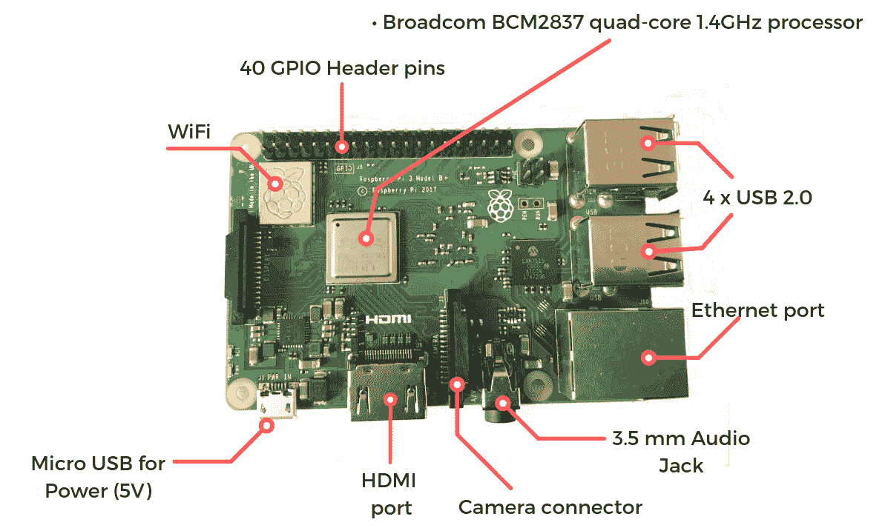

树莓派 3B+的规格如下：

+   Broadcom BCM2837 四核 1.4 GHz 处理器

+   1 GB RAM

+   Broadcom VideoCore GPU

+   蓝牙 4.2

+   双频 2.4 GHz 和 5 GHz Wi-Fi

+   一个以太网端口

+   通过 microSD 插槽使用 microSD 卡进行存储

+   40 个可编程的 GPIO 引脚

+   四个 USB 2.0 端口

+   一个 HDMI 端口

+   3.5 毫米音频插孔

+   **摄像头串行接口**（**CSI**），用于将树莓派摄像头直接连接到树莓派

# 树莓派 Zero W

如果我们正在寻找一个更小尺寸的树莓派版本，我们可以选择树莓派 Zero W。**W**代表**无线**，因为树莓派 Zero W 具有内置 Wi-Fi。以下是树莓派 Zero W 的规格：

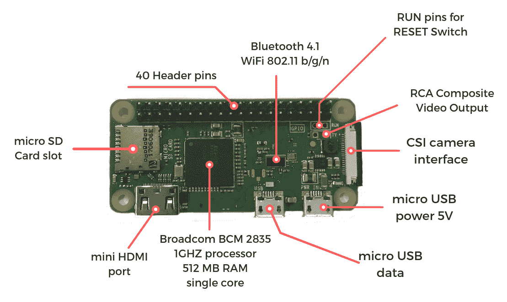

树莓派 Zero W 型号的成本约为 10 美元。还有一个没有**W**的树莓派 Zero，成本约为 5 美元，但它没有内置 Wi-Fi，这使得它非常难以连接到互联网。2017 年发布的树莓派 Zero W 基本上是 2015 年发布的树莓派 Zero 的升级版本。

在本书的后面，当我们设计我们的机器人时，我们将学习如何通过 Wi-Fi 网络从笔记本电脑无线上传程序到我们的树莓派。如果你选择购买树莓派的较小版本，我建议你选择树莓派 Zero W，而不是树莓派 Zero，以便使用更加方便。

树莓派 Zero W 由于尺寸较小，有一些缺点。首先，它比树莓派 3B+慢一些。其次，如果我们想将其用作微型计算机，我们需要购买不同的扩展设备来连接外围设备，如键盘、鼠标或显示器。然而，如果我们打算将树莓派 Zero W 用于构建电子和机器人项目，我们就不需要担心这个缺点。在本书的后面，我们将学习如何通过 Wi-Fi 将树莓派 Zero W 连接到笔记本电脑，并如何使用笔记本电脑来控制它。

树莓派 Zero W 的规格如下：

+   Broadcom ARM11 1 GHz 处理器

+   512 MB RAM

+   Broadcom VideoCore GPU

+   蓝牙 4.0

+   双频 2.4 GHz 和 5 GHz Wi-Fi

+   通过 microSD 插槽使用 microSD 卡进行存储

+   40 个可编程的 GPIO 引脚

+   一个迷你 HDMI 端口

+   **摄像头串行接口**（**CSI**），用于将树莓派摄像头直接连接到树莓派

# 设置树莓派 3B+作为台式电脑

为了在树莓派 3B+上设置和安装 Raspbian OS，我们需要各种硬件和软件组件。硬件组件包括以下内容：

+   一台笔记本电脑，用于在 microSD 卡上安装 Raspbian OS。

+   一个键盘。

+   一只老鼠。

+   一个 SD 卡-至少 8GB 的存储卡就足够了，但是使用 8GB 卡，默认 OS 将占据存储卡空间的 50%。在本章后面，我们还将在树莓派上安装 OpenCV，由于 OpenCV 也会占用存储卡上的大量空间，因此您需要卸载一些默认软件。因此，我建议您使用 16GB 或 32GB 存储卡-使用 32GB 存储卡，默认 OS 仅占据卡空间的 15%。

+   一个 SD 卡读卡器。

+   显示单元-这可以是计算机显示器或电视，只要它具有 HDMI 端口。

+   一个 HDMI 电缆。

+   移动充电器或移动电源为树莓派供电。

所需的软件组件包括以下内容：

+   刻录机

+   带桌面的 Raspbian Stretch 操作系统

现在我们知道需要安装 OS，让我们开始安装。

# 在 SD 卡上安装 Raspbian OS

要在 microSD 卡上安装 Raspbian OS，我们首先将在计算机上安装**Etcher**。之后，我们将把 microSD 卡插入 microSD 卡读卡器，并将其连接到计算机上。

# 下载和安装 Etcher

Etcher 将首先格式化 microSD 卡，然后将 Raspbian Stretch 图像写入其中。让我们开始安装 Etcher：

1.  在浏览器中，转到[`www.etcher.io/`](http://www.etcher.io/)[.](https://etcher.io/)

1.  从下拉菜单中选择您的操作系统。Etcher 将开始下载，如下面的屏幕截图所示：

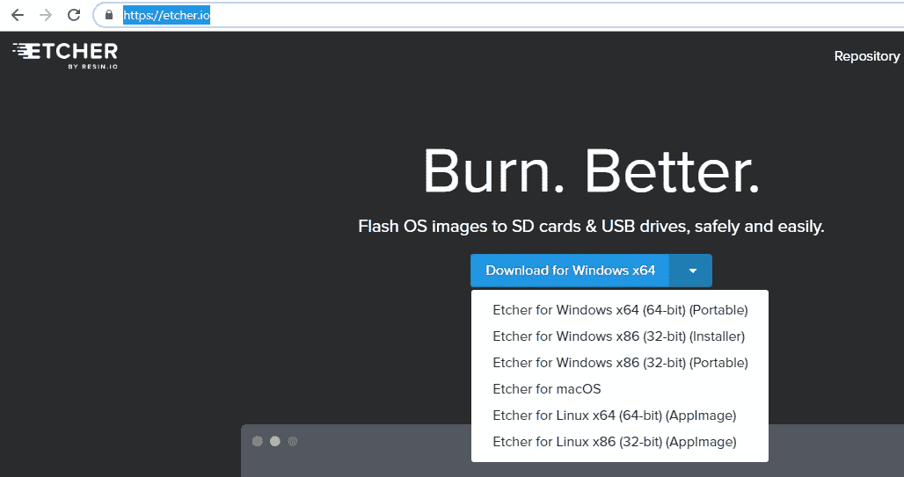

1.  下载完成后，打开安装文件并安装 Etcher。

现在 Etcher 已经设置好了，让我们继续进行 Raspbian 的安装。

# 下载 Raspbian Stretch 图像

现在我们必须下载一个 OS 来在树莓派上运行。虽然有许多第三方树莓派 OS 可用，但我们将安装 Raspbian OS。这个 OS 基于 Debian，专门为树莓派开发。最新版本称为**Raspbian Stretch**。

要下载 Raspbian Stretch 图像，请访问[`www.raspberrypi.org/downloads/raspbian/`](https://www.raspberrypi.org/downloads/raspbian/)，查找 RASPBIAN STRETCH WITH DESKTOP ZIP 文件，并单击“下载 ZIP”按钮，如下面的屏幕截图所示：

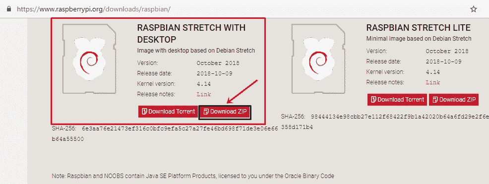

现在我们在笔记本电脑上有了 Raspbian Stretch 的副本，让我们继续将其写入我们的 microSD 卡。

# 将 Raspbian Stretch 图像写入 microSD 卡

下载 Etcher 和 Raspbian Stretch 图像后，让我们将 Raspbian Stretch 写入我们的 microSD 卡：

1.  将 microSD 卡插入 microSD 卡读卡器，然后通过 USB 将读卡器连接到笔记本电脑：

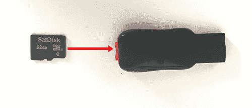

1.  接下来，打开 Etcher 并单击“选择图像”按钮。然后，选择 Raspbian Stretch ZIP 文件并单击“打开”：

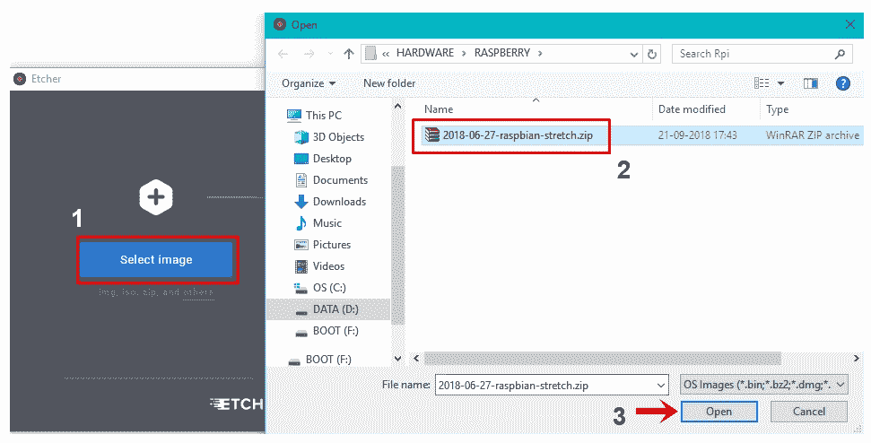

1.  之后，请确保选择了 microSD 卡读卡器驱动器，如下面的屏幕截图所示。如果错误地选择了其他驱动器，请单击“更改”按钮并选择 microSD 卡驱动器。单击“闪存！”按钮将 Raspbian OS 写入 microSD 卡：

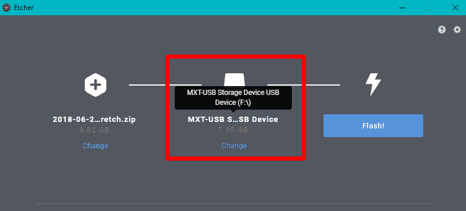

将图像写入 SD 卡的过程也称为**启动**。

Etcher 将花大约 15-20 分钟来用 Raspbian OS 刷写您的 SD 卡：

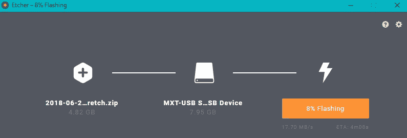

一旦 OS 被写入 SD 卡，Etcher 将自动弹出 microSD 卡读卡器。

现在我们已经将 Raspbian Stretch 写入我们的 microSD 卡，让我们开始设置树莓派 3B+。

# 设置树莓派 3B+

从 microSD 卡引导 Raspbian 操作系统后，我们将通过连接不同的外围设备来设置树莓派，如下所示：

1.  将 microSD 卡插入位于树莓派 3B+背面的 SD 卡槽中：

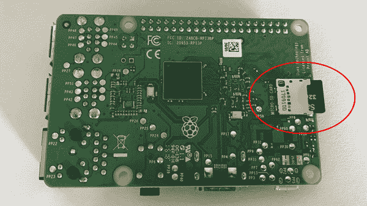

1.  将键盘和鼠标连接到树莓派 3B+的 USB 端口。也可以使用无线键盘和鼠标：

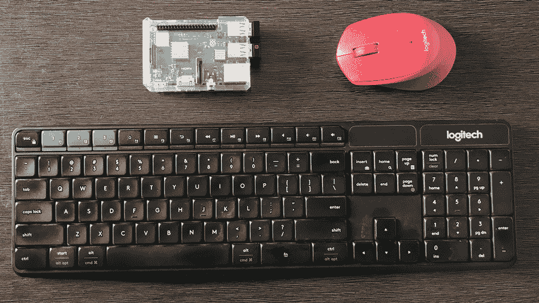

1.  树莓派 3B+包含一个 HDMI 端口，我们可以用它连接 RPi 到显示单元，比如计算机显示器或电视。将 HDMI 电缆的一端连接到树莓派的 HDMI 端口，另一端连接到显示单元：

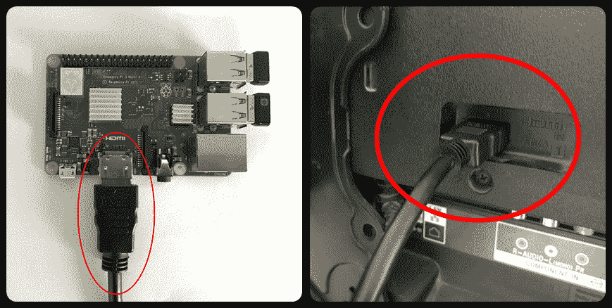

1.  最后，为了打开树莓派，我们需要提供电源。一个典型的树莓派需要 5V 的电压和理想情况下 2.5A 的电流。我们可以使用两种方法为树莓派提供电源：

+   +   **智能手机充电器**：大多数智能手机充电器提供 5V 的电压输出和 2.5A 的电流输出。如果你仔细看一下你的智能手机充电器，你会发现最大电压和电流输出值印在上面，如下图所示。在我的充电器上，3A 的电流输出表示最大电流输出。然而，充电器只会根据 RPi 的需求提供电流输出，而不是最大电流 3A。请注意，树莓派包含一个 micro **USB B**端口，因此，为了连接到树莓派的电源端口，我们需要用 micro **USB B**线连接到我们的充电器：

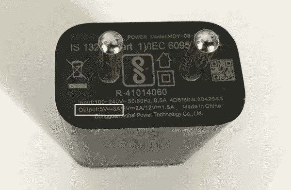

+   +   **移动电源或电池组**：另外，我们可以使用移动电源或电池组。如前所述，我们需要通过 micro USB B 端口将移动电源连接到树莓派，并且我们还需要确保它提供 5V 的电压输出和大约 2.5A 的电流输出：

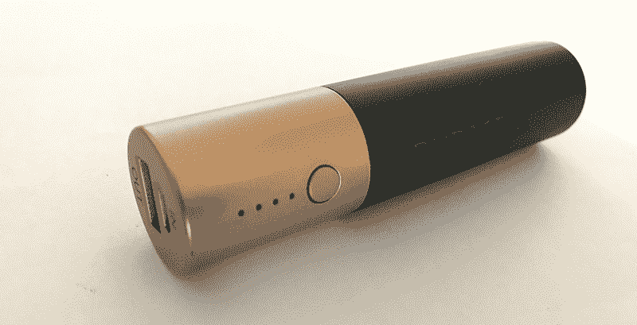

1.  一切都插好后，打开显示单元，确保选择了正确的 HDMI 选项。

1.  接下来，打开电源。你会看到树莓派上的红色 LED 灯亮起。等待大约 10-20 秒，等待树莓派启动。一旦完成，你会看到以下屏幕：

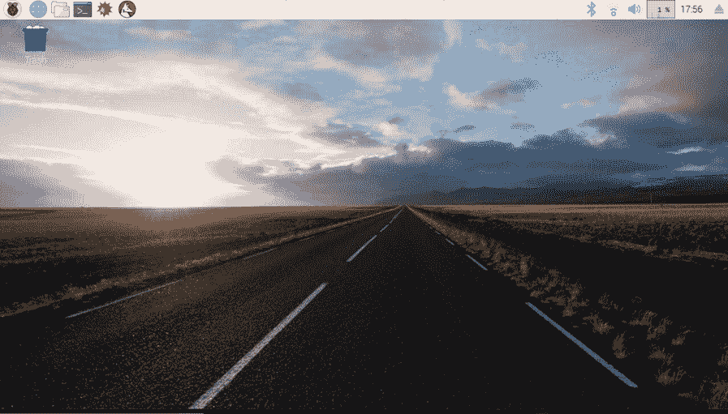

现在我们的树莓派 3B+已经运行起来了，让我们把它连接到互联网。

# 连接树莓派 3B+到互联网

我们可以使用两种方法为树莓派提供互联网连接：

+   **以太网电缆**：树莓派 3B+包含一个以太网端口。要通过以太网端口提供互联网连接，只需将以太网电缆连接到它。

+   **Wi-Fi**：通过 Wi-Fi 连接树莓派也非常简单。点击任务栏中的 Wi-Fi 图标。选择你的 Wi-Fi 网络，输入正确的密码，树莓派将连接到所需的 Wi-Fi 网络：


在将树莓派 3B+设置为桌面电脑后，我们可以简单地打开任何代码编辑器，开始编写程序来控制树莓派的电机或 LED。

由于我们将使用树莓派创建一个可移动的机器人，因此桌面电脑设置将无法使用。这是因为显示器、键盘和鼠标都直接连接到 Pi，将限制其移动。在下一节中，为了能够在没有这些外围设备的情况下使用它，我们将看看如何通过 Wi-Fi 将树莓派 3B+无线连接到笔记本电脑。

# 通过 Wi-Fi 将树莓派 3B+连接到笔记本电脑

要通过 Wi-Fi 将树莓派 3B+无线连接到笔记本电脑，我们首先需要使用一个名为 PuTTY 的软件将 RPi 连接到 Wi-Fi 网络。之后，我们可以找出树莓派的 IP 地址，并将其输入到一个名为**VNC Viewer**的软件中，以将树莓派连接到笔记本电脑。为了成功执行此任务，树莓派和笔记本电脑必须连接到同一个 Wi-Fi 网络。

所需的硬件包括以下内容：

+   **以太网电缆**：以太网电缆将直接连接到树莓派 3B+的以太网端口和笔记本电脑的以太网端口。如果您的笔记本电脑不包含以太网端口，则需要为您的笔记本电脑购买一个**USB 到以太网**连接器。

+   **Micro USB B 电缆**：这是连接树莓派 3B+和笔记本电脑的标准 Micro USB B 电缆。

所需的软件是**PuTTY**，VNC Viewer 和 Bonjour。

# 在 microSD 卡上创建一个 SSH 文件

安装了上述软件后，我们需要在 microSD 卡上创建一个 SSH 文件，以启用树莓派 3B+的 SSH。为此，请执行以下步骤：

1.  打开分配给 SD 卡的驱动器。在我们的案例中，这是`boot (F:)`驱动器。如下面的截图所示，microSD 卡上有一些文件：

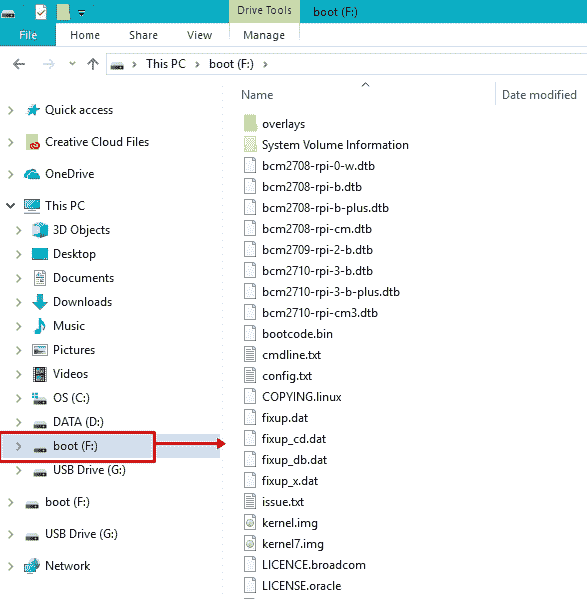

1.  要创建 SSH 文件，请在驱动器中右键单击，然后单击**新建**，选择**文本文档**，如此处所示：

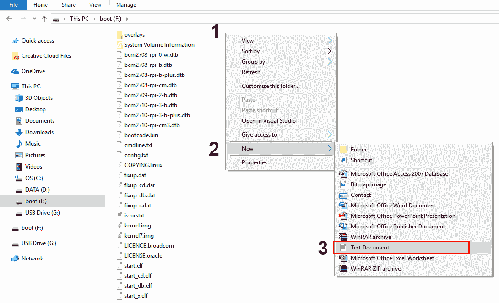

1.  给这个文本文件命名为`ssh`，但不要包括`.txt`扩展名。我们会收到一个警告，指出这个文件将变得不稳定，因为它没有扩展名。点击**是**按钮：

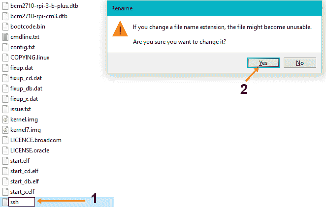

1.  接下来，右键单击`ssh`文件，然后选择**属性**选项。在属性中，点击**常规**选项卡。我们应该看到**文件类型**设置为文件。点击确定：

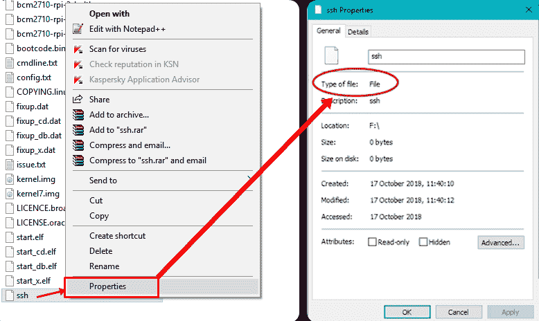

在 microSD 卡上创建一个 SSH 文件后，从笔记本电脑中取出读卡器，并将 microSD 卡插入树莓派 3B+。

在下一节中，我们将看看如何将 RPi 3B+连接到 Wi-Fi 网络。设置是在 Windows 系统上完成的。如果你有一台 Mac，那么你可以按照以下教程视频之一进行操作：

+   **在 Mac 上访问 Raspbian OS**：**[`www.youtube.com/watch?v=-v88m-HYeys`](https://www.youtube.com/watch?v=-v88m-HYeys)**

+   **在 VNC Viewer 上访问树莓派显示**：**[`www.youtube.com/watch?v=PYunvpwSwGY`](https://www.youtube.com/watch?v=PYunvpwSwGY)**

# 使用 PuTTY 将树莓派 3B+连接到 Wi-Fi 网络

将 microSD 卡插入 RPi 后，让我们看看如何使用 PuTTY 将树莓派连接到 Wi-Fi 网络：

1.  首先，将以太网电缆的一端连接到树莓派的以太网端口，另一端连接到笔记本电脑的以太网端口。

1.  接下来，通过使用 Micro USB B 电缆将树莓派 3B+连接到笔记本电脑来启动树莓派 3B+。我们会看到红色的电源 LED 灯亮起。我们还会看到以太网端口的黄色 LED 灯亮起并持续闪烁。

1.  之后，打开 PuTTY 软件。在主机名框中，输入`raspberrypi.local`，然后点击**打开**按钮：


1.  然后我们会看到一个 PuTTY 安全警告消息。点击**是**：

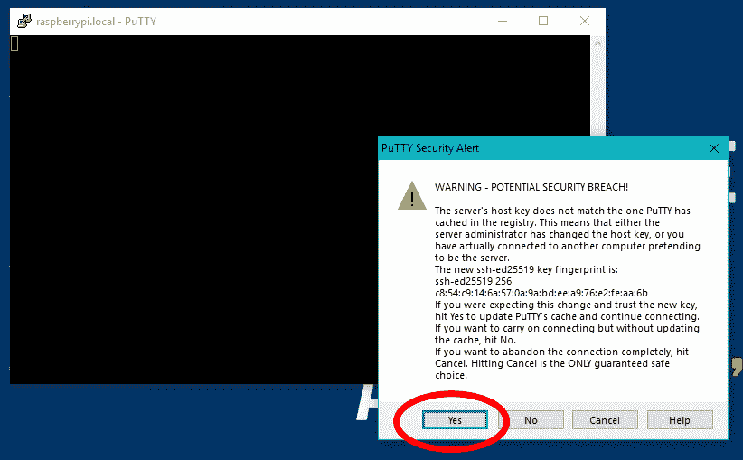

1.  在 PuTTY 中，我们需要输入树莓派的凭据。默认登录名是`pi`，密码是`raspberry`。输入密码后，按*Enter*：

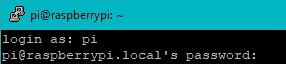

1.  之后，要将树莓派 3B+连接到特定的 Wi-Fi 网络，请输入`sudo nano /etc/wpa_supplicant/wpa_supplicant.conf`命令，如此截图所示：

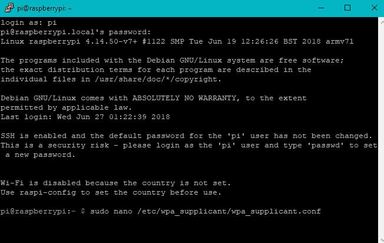

1.  这个命令将打开 nano 编辑器，看起来如下：

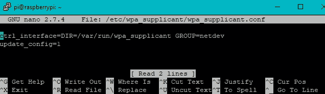

1.  在`update_config=1`行下，按照以下语法输入您的 Wi-Fi 名称和密码：

```cpp
network={
*ssid="*Wifi name*"* psk="Wifi password"
}
```

确保将前面的代码精确地添加到`update_config=1`行下方。Wi-Fi 名称和密码应该用双引号(`""`)括起来，如此处所示：

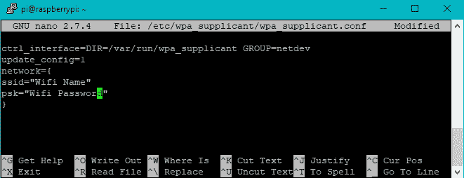

输入 Wi-Fi 名称和密码后，按下*Ctrl* + *O*键保存更改。然后按*Enter*。之后，按下*Ctrl* + *X*键退出 nano 编辑器。

1.  要重新配置并将树莓派连接到 Wi-Fi 网络，请输入以下命令：`sudo wpa_cli reconfigure`。如果连接成功，您将看到接口类型和`OK`消息：

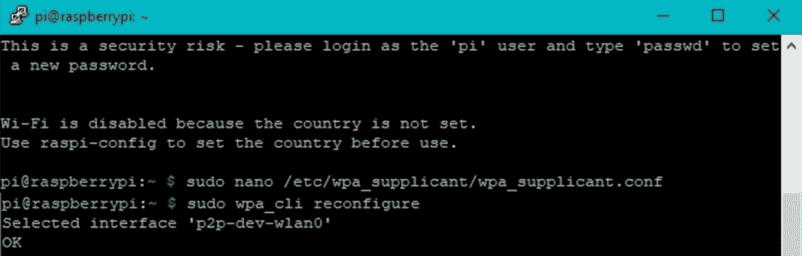

1.  然后我们需要重新启动树莓派。要做到这一点，输入`sudo shutdown now`。一旦树莓派关闭，关闭 PuTTY 软件。

1.  接下来，从笔记本电脑上拔下 USB 电缆。

1.  之后，拔下连接到树莓派和笔记本电脑的以太网电缆。

1.  重新连接 USB 电缆，以便树莓派开机。

1.  打开 PuTTY。在主机名字段中再次输入`raspberrypi.local`，然后按打开按钮：

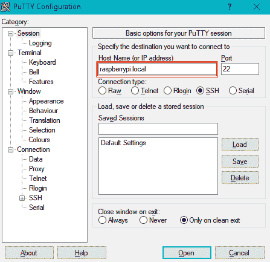

1.  输入我们之前使用的用户名和密码。

1.  一旦树莓派连接到 Wi-Fi 网络，Wi-Fi 网络将为其分配一个 IP 地址。要查找 IP 地址，请输入`ifconfig wlan0`命令并按*Enter*。您会注意到现在已经分配了一个 IP 地址：

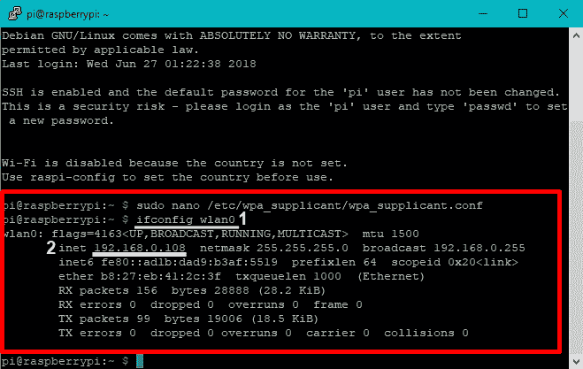

在我的情况下，IP 地址是`192.168.0.108`。请在某处记下您的 IP 地址，因为在使用 VNC Viewer 软件时需要输入它。

# 启用 VNC 服务器

要查看树莓派显示，我们需要从树莓派配置窗口启用 VNC 服务器：

1.  要打开配置窗口，我们需要在 PuTTY 终端中键入`sudo raspi-config`并按*Enter*。然后我们可以打开接口选项，如下所示：

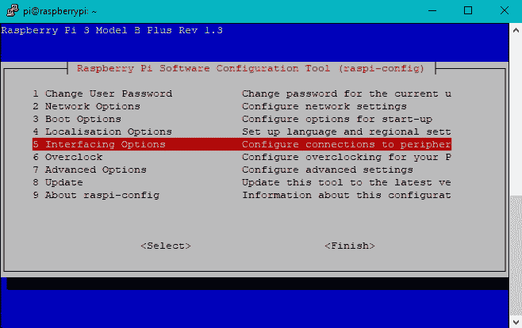

1.  然后我们可以打开**VNC**选项：

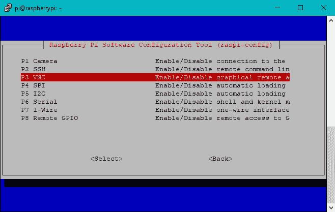

1.  要启用 VNC 服务器，请导航到“Yes”选项并按*Enter*：

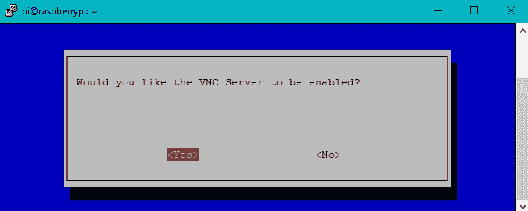

1.  启用 VNC 服务器后，按 OK：

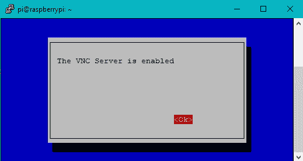

1.  按 Finish 退出树莓派配置窗口：

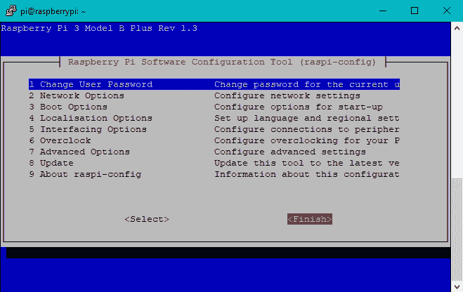

启用 VNC 服务器后，我们将打开 VNC Viewer 软件，以便可以看到树莓派显示屏。

# 在 VNC Viewer 上查看树莓派输出

要在 VNC Viewer 上查看树莓派输出，请按照以下说明操作：

1.  打开 VNC Viewer 软件后，在 VNC Viewer 中输入您的树莓派 IP 地址，然后按*Enter*：

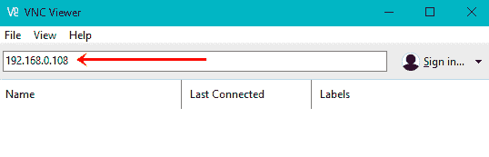

1.  您将收到一个弹出消息，指出 VNC Viewer 没有此 VNC 服务器的记录。按继续：

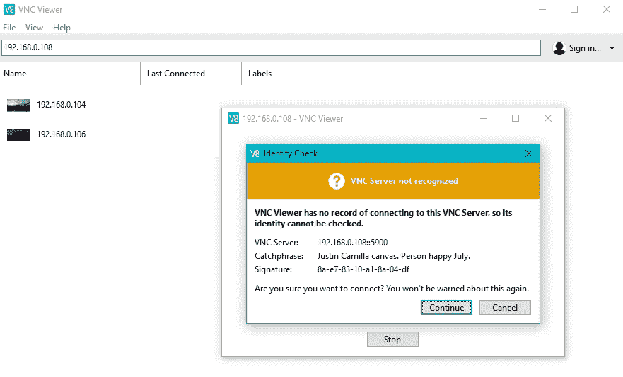

1.  输入用户名`pi`和密码`raspberry`**。** 选择记住密码选项，然后按 OK：

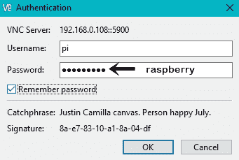

现在我们应该能够在 VNC Viewer 软件中查看树莓派显示输出：

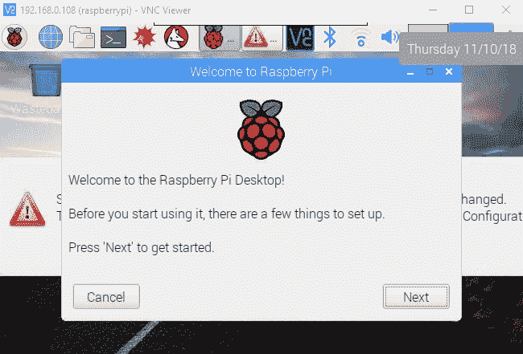

现在我们已经通过 Wi-Fi 将树莓派连接到笔记本电脑，就不需要再通过 USB 电缆将树莓派连接到笔记本电脑了。下次，我们可以简单地使用移动电源或移动充电器为树莓派供电。当我们选择我们的树莓派的 IP 地址时，我们可以使用 VNC Viewer 软件查看树莓派显示输出。

如前所述，请确保在使用笔记本电脑进行远程桌面访问时，树莓派和笔记本电脑都连接到同一 Wi-Fi 网络。

# 增加 VNC 的屏幕分辨率

在 VNC Viewer 中查看 RPi 的显示输出后，你会注意到 VNC Viewer 的屏幕分辨率很小，没有覆盖整个屏幕。为了增加屏幕分辨率，我们需要编辑`config.txt`文件：

1.  在终端窗口中输入以下命令：

```cpp
sudo nano /boot/config.txt
```

1.  接下来，在`#hdmi_mode=1`代码下面，输入以下三行：

```cpp
hdmi_ignore_edid=0xa5000080
hdmi_group=2
hdmi_mode=85
```

1.  之后，按下*Ctrl* + *O*，然后按*Enter*保存文件。按下*Ctrl* + *X*退出：

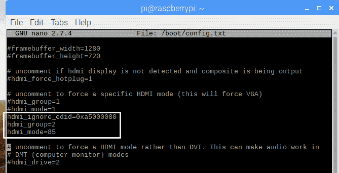

1.  接下来，重新启动你的 RPi 以应用这些更改：

```cpp
sudo reboot
```

重新启动后，你会注意到 VNC 的屏幕分辨率已经增加，现在覆盖了整个屏幕。

# 处理 VNC 和 PuTTY 错误

在 VNC Viewer 中，有时当你选择 RPi 的 IP 地址时，你可能会看到以下弹出错误消息，而不是 RPi 的显示：

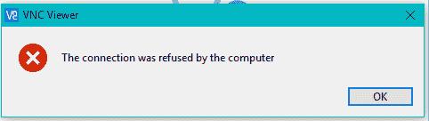

你可能还会看到以下消息：

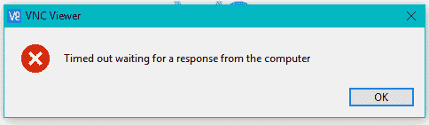

如果你遇到以上任何错误，请点击笔记本电脑上的 Wi-Fi 图标，并确保你连接到与 RPi 连接的相同的 Wi-Fi 网络。如果是这种情况，你的 RPi 的 IP 地址在 Wi-Fi 网络中可能已经改变，这在新设备连接到 Wi-Fi 网络时有时会发生。

要找到新的 IP 地址，请按照以下步骤操作：

1.  打开 PuTTY，输入`raspberrypi.local`到主机名框中。

1.  在 PuTTY 的终端窗口中输入命令`ifconfig wlan0`。如果你的 IP 地址已经改变，你会在`inet`选项中看到新的 IP 地址。

1.  在 VNC Viewer 中输入新的 IP 地址以查看 RPi 的显示输出。

有时，你可能也无法连接到 Putty，并且会看到以下错误：

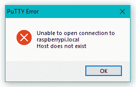

要解决 PuTTY 中的前述错误，请按照以下步骤操作：

1.  将 LAN 电缆连接到 RPi 和笔记本电脑。

1.  打开你的 RPi 并尝试通过在主机名框中输入`raspberrypi.local`来连接 putty。通过 LAN 电缆连接到 RPi 和笔记本电脑，你应该能够访问 PuTTY 终端窗口。

1.  按照之前的步骤找到 RPi 的新 IP 地址。

1.  一旦你在 VNC Viewer 中看到 RPi 的显示，你可以拔掉 LAN 电缆。

# 设置树莓派 Zero W 为台式电脑

正如我们所说，树莓派 Zero W 是树莓派 3B+的简化版本。树莓派 Zero W 的连接非常有限，因此为了连接不同的外围设备，我们需要购买一些额外的组件。我们需要以下硬件组件：

+   一个键盘

+   一个鼠标

+   一个至少 8GB 的 microSD 卡（推荐 32GB）

+   一个 microSD 卡读卡器

+   一个 HDMI 电缆

+   一个显示单元，最好是带有 HDMI 端口的 LED 屏幕或电视

+   一个移动充电器或移动电源来为树莓派供电

+   一个 micro USB B 到 USB 连接器（也称为 OTG 连接器），看起来像这样：

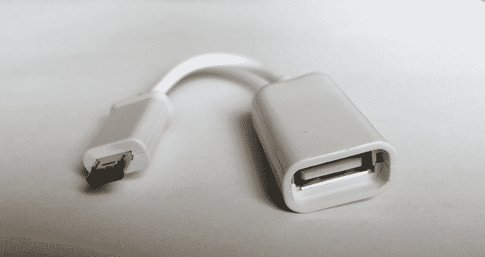

+   一个迷你 HDMI 到 HDMI 连接器，如下所示：

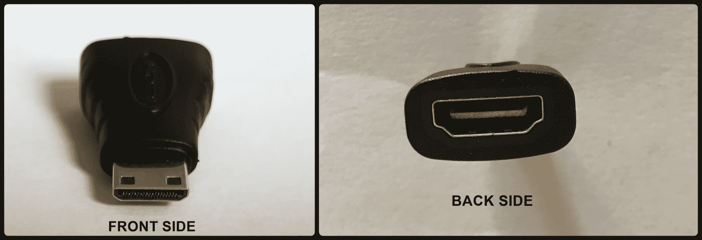

+   一个 USB 集线器，如图所示：

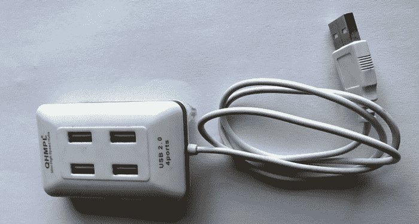

现在我们知道需要哪些硬件，让我们设置我们的树莓派 Zero W。

# 设置树莓派 Zero W

将 Raspbian OS 安装到 microSD 卡上的步骤与在“在 SD 卡上安装 Raspbian OS”部分中已经列出的树莓派 3B+完全相同。一旦你的 SD 卡准备好了，按照以下步骤设置树莓派 Zero W：

1.  首先，将 microSD 卡插入树莓派 Zero W 的 SD 卡槽中。

1.  将**mini HDMI 到 HDMI 连接器**（H2HC）的一端插入树莓派 Zero W 的 HDMI 端口，将 H2HC 连接器的另一端插入 HDMI 电缆。

1.  将 OTG 连接器连接到 Micro USB 数据端口（而不是电源端口），并将 USB 集线器连接到 OTG 连接器。

1.  将键盘和鼠标连接到 USB 集线器。

1.  将移动充电器或电池组连接到电源单元的 Micro USB 端口。

1.  接下来，将 HDMI 电缆连接到电视或监视器的 HDMI 端口。

1.  将移动充电器连接到主电源以为树莓派 Zero W 供电。然后，当树莓派 Zero W 开机时，您将看到绿色 LED 闪烁一段时间。

1.  如果您已将 HDMI 电缆连接到电视，请选择正确的 HDMI 输入通道。以下有注释的照片显示了这里提到的连接：

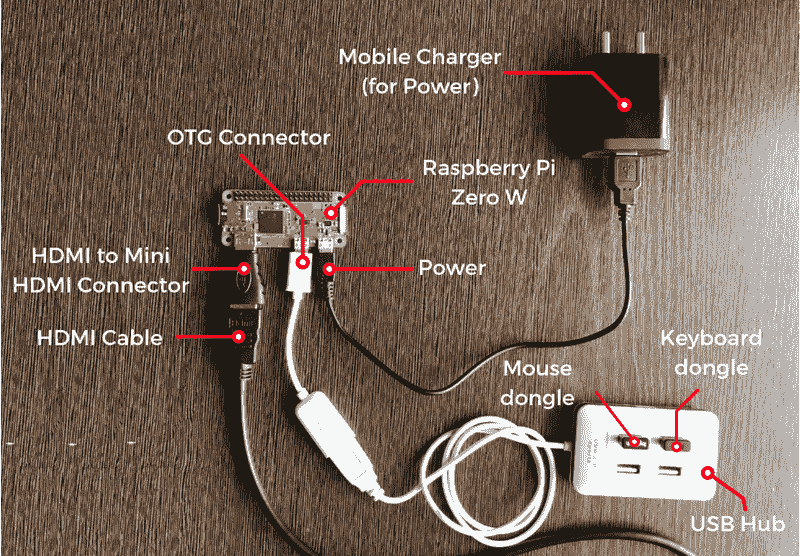

树莓派 Zero W 连接

1.  树莓派 Zero W 启动大约需要两到三分钟。一旦准备好，您将在电视或监视器屏幕上看到以下窗口：


1.  要关闭树莓派，按树莓派图标，然后单击关闭。

现在设置好了，让我们将树莓派 Zero W 连接到笔记本电脑。

# 通过 Wi-Fi 将树莓派 Zero W 连接到笔记本电脑

当树莓派 Zero 于 2015 年首次推出时，它没有内置的 Wi-Fi 模块，这使得连接到互联网变得困难。一些树莓派开发人员想出了有用的黑客技巧，以连接树莓派到互联网，一些公司也为树莓派 Zero 创建了以太网和 Wi-Fi 模块。

然而，2017 年，树莓派 Zero W 推出。这款产品具有内置的 Wi-Fi 模块，这意味着树莓派开发人员不再需要执行任何 DIY 黑客或购买单独的组件来添加互联网连接。具有内置 Wi-Fi 还有助于我们将树莓派 Zero W 无线连接到笔记本电脑。让我们看看如何做到这一点。

将树莓派 Zero W 连接到笔记本电脑的 Wi-Fi 的过程与树莓派 3B+类似。但是，由于树莓派 Zero W 没有以太网端口，因此我们将不得不在`cmdline.txt`和`config.txt`文件中写入一些代码。

尽管`cmdline.txt`和`config.txt`是**文本**（**TXT**）文件，但这些文件中的代码在 Microsoft 的记事本软件中无法正确打开。要编辑这些文件，我们需要使用代码编辑器软件，例如 Notepad++（仅适用于 Windows）或 Brackets（适用于 Linux 和 macOS）。

安装其中一个后，让我们按以下方式自定义 microSD 卡：

1.  在树莓派 Zero W 中，我们还需要在 microSD 卡上创建一个 SSH 文件。有关如何在 microSD 卡上创建 SSH 文件的说明，请参阅*在 microSD 卡上创建 SSH 文件*部分。

1.  创建 SSH 文件后，右键单击`config.txt`文件，并在 Notepad++或 Brackets 中打开它。在这种情况下，我们将在 Notepad++中打开它：

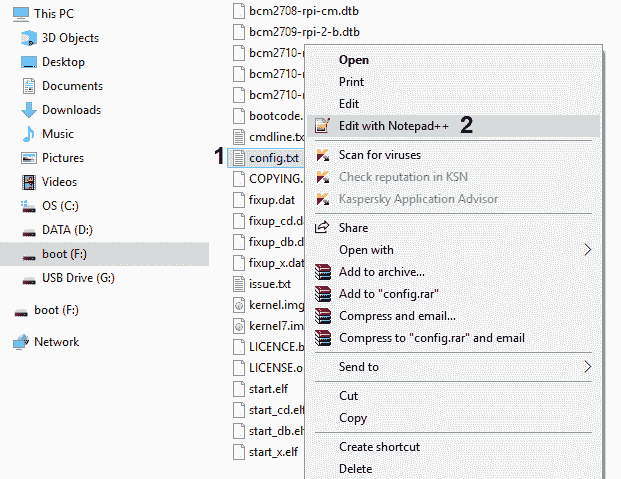

向下滚动到此代码的底部，并在末尾添加行`dtoverlay=dwc2`。添加代码后，保存并关闭文件。

1.  接下来，打开 Notepad++中的`cmdline.txt`文件。`cmdline`文件中的整个代码将显示在一行上。接下来，请确保在`consoles`和`modules`之间只添加一个空格。

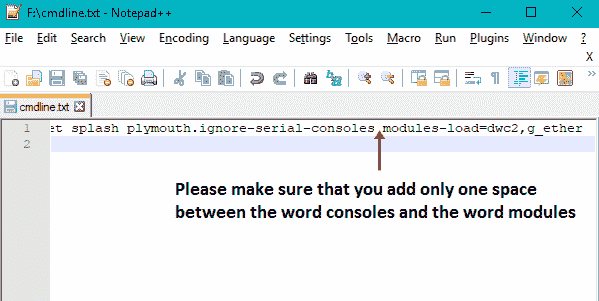

在`plymouth.ignore-serial-consoles`代码旁边输入行`modules-load=dwc2,g_ether`：

1.  接下来，使用**数据传输 USB 电缆**将树莓派 Zero W 连接到笔记本电脑。将 USB 电缆连接到树莓派 Zero W 的数据端口，而不是电源端口。

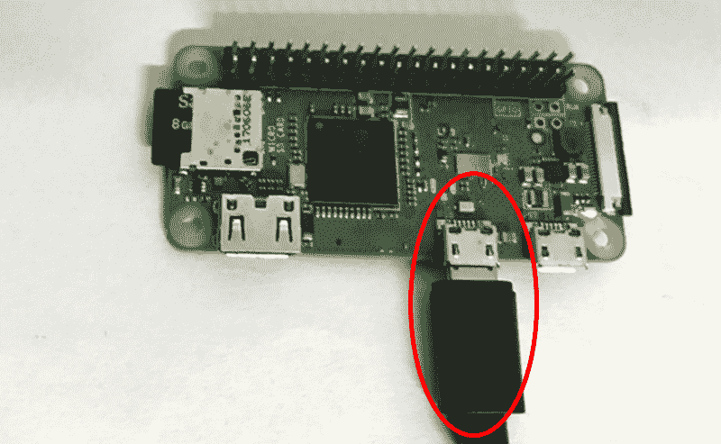

1.  确保您连接到树莓派 Zero W 和笔记本电脑的 USB 电缆支持数据传输。例如，查看以下照片：

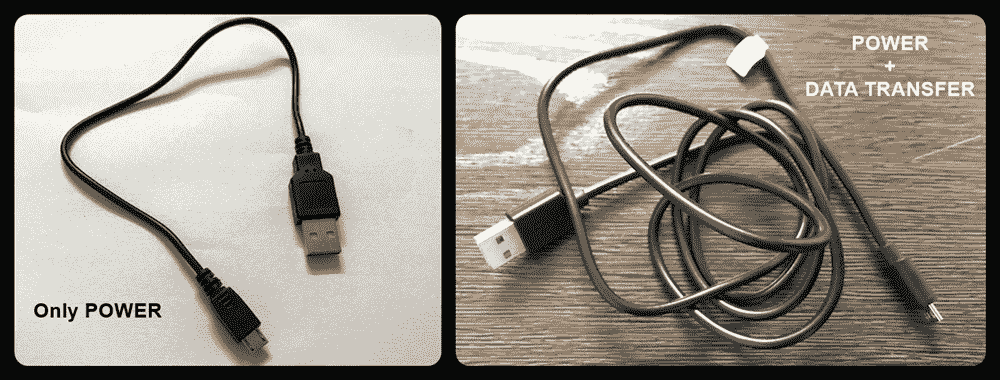

在上面的照片中，有两根相似但重要不同的电缆：

+   +   左侧的小型 USB 电缆是随我的移动电源套件一起提供的。这个 USB 电缆提供电源，但不支持数据传输。

+   右侧的 USB 电缆是随新的安卓智能手机一起购买的。这些支持数据传输。

检查您的 USB 是否支持数据传输的一个简单方法是将其连接到智能手机和笔记本电脑上。如果您的智能手机被检测到，这意味着您的 USB 电缆支持数据传输。如果没有，您将需要购买一根支持数据传输的 USB 电缆。以下截图显示了 PC 检测到智能手机，这意味着正在使用的电缆是数据电缆：

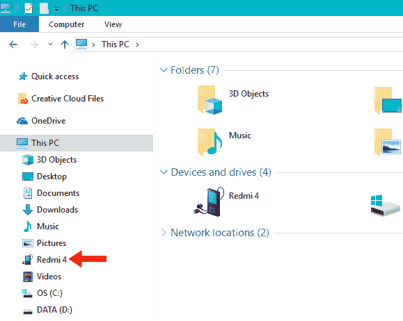

如果您的 USB 电缆被检测到但经常断开连接，我建议您购买一根新的 USB 电缆。有时，由于磨损，旧的 USB 电缆可能无法正常工作。

# 使用 PuTTY 将树莓派 Zero W 连接到 Wi-Fi 网络

要将树莓派 Zero W 连接到 Wi-Fi 网络，请参阅*使用 PuTTY 将树莓派 3B+连接到 Wi-Fi 网络*部分。连接树莓派 Zero W 到 Wi-Fi 网络的步骤完全相同。

# 为树莓派 Zero W 启用 VNC Viewer

要为树莓派 Zero W 启用 VNC Viewer，请参阅*启用 VNC 服务器*部分。

# 在 VNC Viewer 上查看树莓派 Zero W 的输出

要在 VNC Viewer 中查看树莓派 Zero W 的输出，请参阅*在 VNC Viewer 上查看树莓派输出*部分*。*

# 总结

在本章中，我们已经学习了如何将树莓派 3B+和树莓派 Zero W 设置为普通的台式电脑。我们还学会了如何通过 Wi-Fi 网络将树莓派连接到笔记本电脑。现在，您可以在不需要连接键盘、鼠标和显示器的情况下，通过笔记本电脑远程控制树莓派。

在下一章中，我们将首先了解一些在树莓派 OS 中操作的基本命令。我们将在树莓派上安装一个名为 Wiring Pi 的 C++库，并了解该库的引脚配置。最后，我们将编写我们的第一个 C++程序，并将其无线上传到我们的树莓派。

# 问题

1.  树莓派 3B+上有哪种处理器？

1.  树莓派 3B+上有多少个 GPIO 引脚？

1.  我们用于在笔记本电脑上查看树莓派显示输出的软件是什么？

1.  树莓派的默认用户名和密码是什么？

1.  用于访问树莓派内部配置的命令是什么？
