# 第二章：使用 wiringPi 实现 Blink

设置树莓派后，现在是时候连接不同的电子元件并使用 C++编程语言对其进行编程了。要使用 C++，我们首先需要下载并安装一个名为**wiringPi**的库。

在本章中，我们将涵盖以下主题：

+   在树莓派内安装`wiringPi`库

+   让 LED 闪烁

+   智能灯—使用数字传感器

+   使用 softPwm 进行脉宽调制

# 技术要求

本章的硬件要求如下：

+   1 个 LED（任何颜色）

+   1 **LDR**（**光敏电阻**）传感器模块

+   树莓派 3B+

+   5-6 个母对母连接线

本章的代码文件可以从以下网址下载：[`github.com/PacktPublishing/Hands-On-Robotics-Programming-with-Cpp/tree/master/Chapter02`](https://github.com/PacktPublishing/Hands-On-Robotics-Programming-with-Cpp/tree/master/Chapter02)。

# 在树莓派中安装 wiringPi 库

wiringPi 是一个基于引脚的 GPIO 访问库，用 C 语言编写。使用这个库，你可以用 C/C++编程控制树莓派。`wiringPi`库很容易设置。一旦安装，树莓派 GPIO 引脚将具有 wiringPi 引脚编号。让我们看看如何下载和安装 wiringPi：

1.  首先，点击任务栏上的图标打开终端窗口：

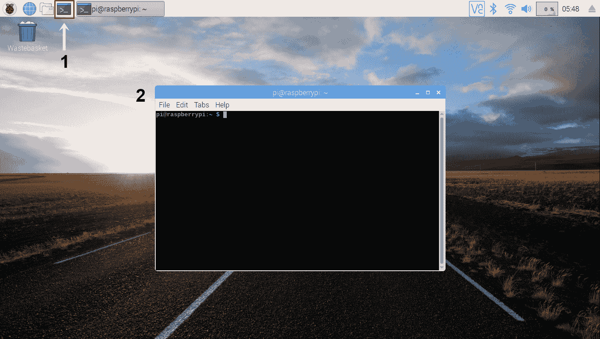

1.  在安装`wiringPi`库之前，我们首先需要验证我们的树莓派是否有更新。如果你的树莓派没有更新，安装`wiringPi`库时可能会出现错误。要更新你的树莓派，输入以下命令：

```cpp
$ sudo apt-get update 
```

上述命令的输出如下：

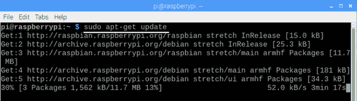

根据你的互联网速度，更新下载和安装需要大约 10-15 分钟。确保你将树莓派放在 Wi-Fi 路由器附近。

1.  更新后，输入以下命令升级树莓派：

```cpp
$ sudo apt-get upgrade
```

在升级过程中，你可能会收到一个要求下载特定组件的消息。输入`Y`然后按*Enter*。升级需要大约 30-40 分钟。升级完成后，你会看到以下消息：

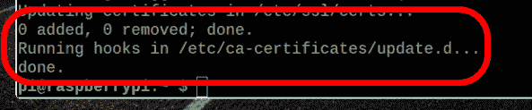

1.  更新树莓派后，你需要在树莓派内下载和安装`git-core`。要安装 Git，输入以下命令：

```cpp
$ sudo apt-get install git-core
```

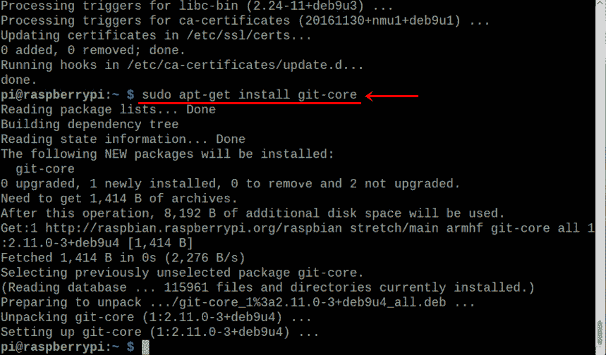

1.  之后，要从`git`下载`wiringPi`库，输入以下命令：

```cpp
git clone git://git.drogon.net/wiringPi
```

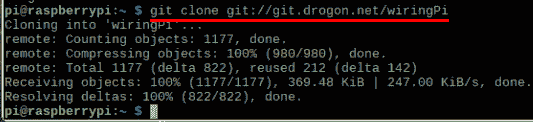

1.  现在，如果你点击文件管理器选项并点击`pi`文件夹，你应该会看到`wiringPi`文件夹：

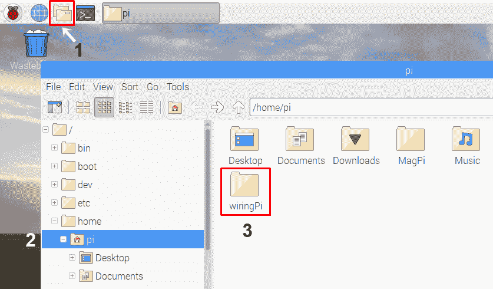

1.  接下来，更改目录到`wiringPi`，以便 wiringPi 文件被下载并安装到这个特定文件夹内。更改目录的命令是`cd`：

```cpp
$ cd ~/wiringPi (The ~ symbol is above the Tab key and it points to pi directory)
```

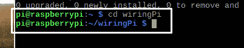

现在你应该看到指向`wiringPi`文件夹的目录。

1.  接下来，为了从`origin`目录获取 Git 文件，输入以下命令：

```cpp
$ git pull origin
```

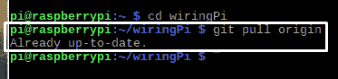

1.  最后，为了构建文件，输入以下命令：

```cpp
$ ./build 
```

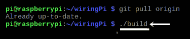

一切都完成后，你会看到一个`All done`消息：

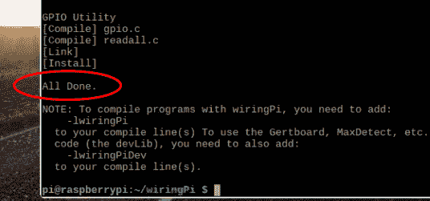

现在我们已经安装了 wiringPi 库，我们可以继续了解 RPi 上的 wiringPi 引脚配置。

# 通过 wiringPi 访问树莓派 GPIO 引脚

由于我们已经安装了 wiringPi，现在我们可以看一下 wiringPi 引脚编号，如下截图所示：

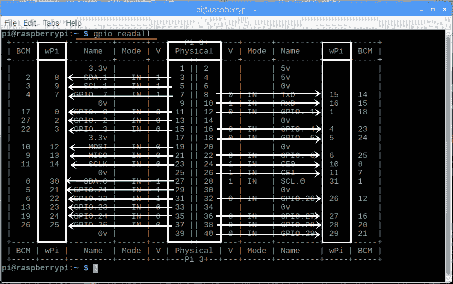

`物理`列代表树莓派编号从`1-40`。在`物理`列的两侧，您将看到 wiringPi（`wPi`）列。从`物理`列指向`wPi`的箭头代表树莓派的特定物理引脚的 wiringPi 引脚编号。

看一下以下示例：

+   物理引脚号 3 的 wiringPi 引脚号为 8

+   物理引脚号 5 的 wiringPi 引脚号为 9

+   物理引脚号 8 的 wiringPi 引脚号为 15

+   物理引脚号 11 的 wiringPi 引脚号为 0

+   物理引脚号 40 的 wiringPi 引脚号为 29

通过查阅这个表，您可以找出剩下的物理引脚对应的 wiringPi 引脚。

wiringPi 引脚号从 17 到 20 不存在。在 wPi 引脚 16 之后，我们直接跳到 wPi 引脚 21。

为了更好地理解 wiringPi 引脚和物理引脚之间的关系，您可以参考以下图表：

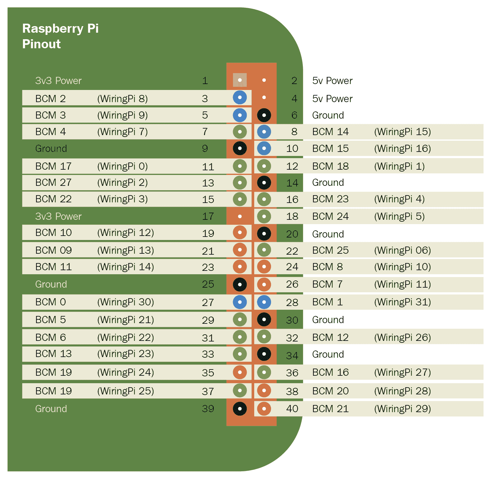

wiringPi 引脚编号是编程时需要记住的。我们可以使用总共 28 个 wiringPi 引脚进行编程。除此之外，我们还有以下引脚，可以用于提供电源并可用作接地引脚：

+   物理引脚号 6、9、14、20、25、30、34 和 39 是接地引脚

+   物理引脚号 2 和 4 提供+5V 电源

+   物理引脚号 1 和 17 提供+3.3V 电源

让我们继续编写我们的第一个树莓派 C++程序。

# 让 LED 闪烁

我们要创建的第一个项目是让 LED 闪烁。对于这个项目，我们需要以下硬件组件：

+   树莓派

+   1 个 LED

+   两根母对母导线

# 接线连接

将 LED 连接到树莓派非常简单。不过，在这之前，让我们仔细看一下 LED 的引脚：

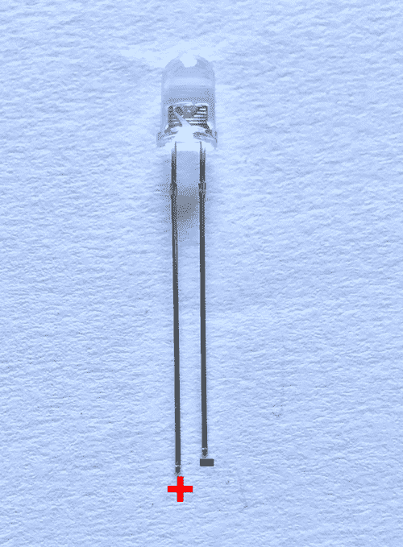

LED 包含一个正极引脚和一个负极引脚。长引脚是正极引脚，可以连接到树莓派的任何数据引脚上。短引脚是负极引脚，可以连接到树莓派的接地引脚上。

让我们连接它。首先，将 LED 的负极引脚连接到树莓派的接地引脚（物理引脚号 6）。接下来，将 LED 的正极引脚连接到 wiringPi 引脚号 15：

**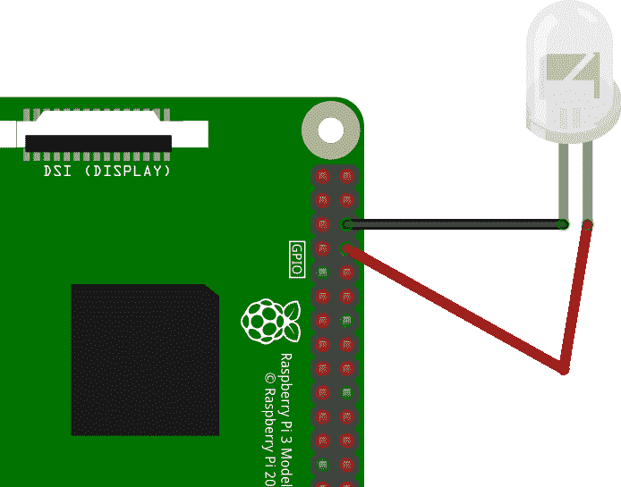 **

现在我们已经将 LED 连接到树莓派，让我们编写一个程序让 LED 闪烁。

# 闪烁程序

要编写我们的第一个 C++程序，我们将使用 Geany 程序编辑器。要打开 Geany，点击**树莓**图标，转到**编程**，然后选择**Geany 程序编辑器**：

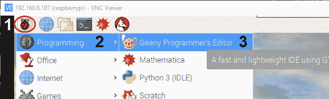

打开 Geany 后，您会看到一个名为`Untitled`的未保存文件。我们需要做的第一件事是保存文件。点击文件|另存为，并将此文件命名为`Blink.cpp`。

在这个文件中，写入以下代码使 LED 闪烁。您可以从 GitHub 存储库的`Chapter02`文件夹中下载`Blink.cpp`程序：

```cpp
#include <iostream>
#include <wiringPi.h>

int main(void)
{
wiringPiSetup();
pinMode(15,OUTPUT);

 for(;;)
 {
digitalWrite(15,HIGH);
delay(1000);
digitalWrite(15,LOW);
delay(1000);
 }
return 0;
 }
```

如果您以前做过 Arduino 编程，您可能已经理解了这段代码的大约 90%。这是因为 wiringPi 允许我们以 Arduino 格式编写 C++程序：

1.  在上面的代码中，我们首先导入了`iostream`和`wiringPi`库。

1.  接下来，我们有主函数，称为`int main`。由于这个函数没有任何参数，我们在圆括号内写入`void`语句。

1.  之后，`wiringPisetup()`函数初始化了`wiringPi`。它假定这个程序将使用 wiringPi 编号方案。

1.  接下来，使用`pinMode(15, OUTPUT)`命令，我们将 wiringPi 引脚号 15 设置为`OUTPUT`引脚。这是我们连接到 LED 正极引脚的引脚。

1.  之后，我们有一个无限的`for`循环。其中写入的代码将无限运行，除非我们从编码编辑器手动停止它。

1.  通过`digitalWrite(15,HIGH)`命令，我们在 LED 上写入`HIGH`信号，这意味着 LED 将打开。我们也可以使用数字`1`代替`HIGH`。

1.  接下来，通过`delay(1000)`命令，我们确保 LED 只亮**一秒**。

1.  接下来，通过`digitalWrite(15,LOW)`命令，在 LED 上写入`LOW`信号。这意味着 LED 将**关闭**一秒钟。

1.  由于此代码位于 for 循环中，LED 将保持**开**和**关**，直到我们另行指示为止。

# 将代码上传到树莓派

由于我们使用的是 wiringPi 编号约定，我们将在 Build 命令中添加`-lwiringPi`命令，以便我们的 C++程序能够成功编译和构建`wiringPi`库。要打开 Build 命令，点击 Build | Set Build Commands。在 Compile 和 Build 按钮旁的命令框中，添加`-lwiringPi`，然后点击 OK：

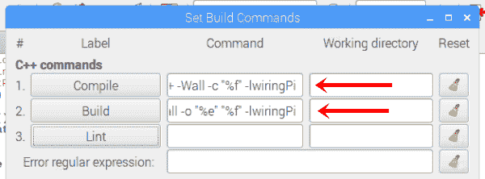

接下来，要编译代码，请点击**编译按钮**（棕色图标）。最后，要将代码上传到树莓派，请按**构建按钮**（飞机图标）：


编译图标将检查代码中的错误。如果没有错误，点击构建图标以测试闪烁输出。构建代码后，构建图标将变成红色圆圈。点击红色圆圈停止程序。

# 智能灯 - 与数字传感器一起工作

在为树莓派编写我们的第一个 C/C++程序之后，我们现在可以编写一个程序，该程序将从 LDR 传感器接收输入并控制 LED 的开关。对于这个项目，您将需要以下硬件组件：

+   1 个 LDR 传感器模块

+   1 个 LED

+   树莓派

+   5 根母对母连接线

首先，让我们探讨一下 LDR 传感器的工作原理。

# LDR 传感器及其工作原理

LDR 传感器是一种模拟输入传感器，由可变电阻器组成，其电阻取决于其表面上落下的光线数量。当房间里没有光时，LDR 传感器的电阻很高（高达 1 兆欧姆），而在有光的情况下，LDR 传感器的电阻很低。LDR 传感器由两个引脚组成。这些引脚没有正负极性。我们可以使用任何引脚作为数据或地引脚，因此 LDR 传感器有时被称为特殊类型的电阻器。LDR 传感器的图像如下图所示：

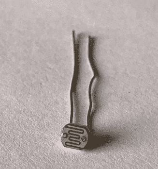

由于 LDR 是模拟传感器，我们不能直接将其连接到 RPi，因为 RPi 不包含**模拟到数字转换器**（**ADC**）电路。因此，RPi 无法读取来自 LDR 传感器的模拟数据。因此，我们将使用 LDR 数字传感器模块，而不是 LDR 传感器，该模块将向 RPi 提供数字数据：

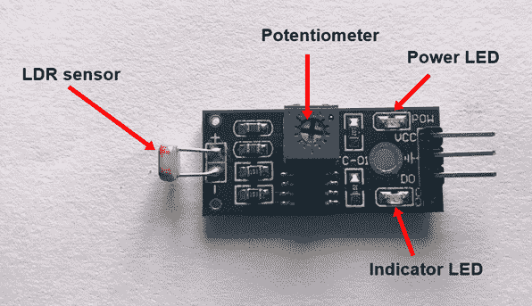

LDR 传感器模块将读取来自 LDR 传感器的模拟数据，并以高电平或低电平的形式提供数字数据作为输出。LDR 传感器模块由 3 个引脚组成：**D0**（**数据输出**）、地和 Vcc。D0 将提供数字数据作为输出，然后作为输入提供给 RPi 引脚。在光线较暗时，D0 引脚将为高电平，在有光时，D0 引脚将为低电平。传感器模块还包括一个电位器传感器，可用于改变 LDR 传感器的电阻。

LDR 传感器模块的实际用途可见于街灯，它们在白天自动关闭，在夜晚自动打开。我们将要编写的智能灯程序与此应用有些类似，但我们将使用 LED 来简化事情，而不是街灯。

现在我们已经了解了 LDR 传感器的基本工作原理，接下来让我们将 LDR 传感器模块连接到树莓派。

# 接线连接

通过接线连接，我们可以将 LDR 传感器模块和 LED 连接到 RPi：

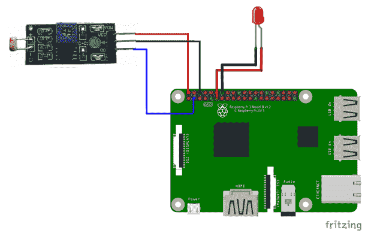

接线连接如下：

+   RPi 的 wiringPi 引脚 8 连接到 LDR 传感器模块的 D0 引脚

+   RPi 的物理引脚 2 连接到 LDR 传感器模块的 Vcc 引脚

+   RPi 的物理引脚 6 连接到 LDR 传感器模块的 Gnd 引脚

+   wiringPi 引脚 0 连接到 LED 的正极

+   物理引脚 14 连接到 LED 的负极

现在我们已经连接了 LDR 传感器模块和 LED 到 RPi，让我们编写程序，通过从 LDR 传感器获取输入来控制 LED 的开关。

# 智能灯程序

在这个智能灯程序中，我们将首先从 LDR 传感器读取输入，并根据输入值来控制 LED 的开关。智能灯的程序描述如下。您可以从本书的 GitHub 存储库的`Chapter02`文件夹中下载`SmartLight.cpp`程序：

```cpp
#include <iostream>
#include <wiringPi.h>

int main(void)
{

wiringPiSetup();

pinMode(0,OUTPUT); 
pinMode(8,INPUT); 

for(;;)
{
int ldrstate = digitalRead(8); 
if(ldrstate == HIGH) 
{
digitalWrite(0,HIGH); 
}
else
{
digitalWrite(0,LOW); 
}
 }
return 0;
 }
```

上述程序的解释如下：

+   在`main`函数中，我们将 wiringPi 引脚 8 设置为输入引脚，将 wiringPi 引脚 0 设置为输出引脚。

+   接下来，在`for`循环中，使用`digitalRead(8)`函数，我们从 LDR 传感器的数字引脚(D0)读取传入的数字数据，并将其存储在`ldrstate`变量中。从 LDR 传感器，我们将接收 HIGH(1)数据或 LOW(0)数据。当没有光时，`ldrstate`变量将为 HIGH，当有光时，`ldrstate`变量将为 LOW。

+   接下来，我们将检查`ldrstate`变量内的数据是 HIGH 还是 LOW，使用`if...else`条件。

+   使用`if(ldrstate == HIGH)`，我们比较`ldrstate`变量内的数据是否为 HIGH。如果是 HIGH，我们使用`digitalWrite(0,HIGH)`来打开 LED。

+   如果`ldrstate`为 LOW，则`else`条件将执行，并且通过使用`digitalWrite(0,LOW)`，我们将关闭 LED。接下来，您可以单击“编译”按钮来编译代码，然后单击“构建”按钮来测试代码。

现在我们了解了 SmartLight 程序，我们将探讨**脉宽调制**（**PWM**）的概念，并使用一个名为 softPWM 的库来改变 LED 的亮度。

# 使用 softPWM 的脉宽调制

PWM 是一种强大的技术，可以用来控制传递给 LED 和电机等电子元件的电源。使用 PWM，我们可以执行控制 LED 亮度或减速电机速度等操作。在本节中，我们将首先了解 PWM 的工作原理，然后逐步编写一个简单的 PWM 程序来增加 LED 的亮度。

# PWM 的工作原理

在之前的`Blink.cpp`程序中，我们将数字信号从 RPi 应用到 LED。数字信号可以处于 HIGH 状态或 LOW 状态。在 HIGH 状态下，树莓派引脚产生 3.3V 的电压，在 LOW 状态下，引脚产生 0V 的电压。因此，在 3.3V 时，LED 以全亮度开启，在 0V 时，LED 关闭：

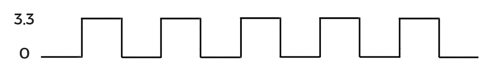

为了降低 LED 的亮度，我们需要降低电压。为了降低电压，我们使用 PWM。在 PWM 中，一个完整的重复波形称为一个周期，完成一个周期所需的时间称为周期。在下图中，红线代表一个完整的周期。完成该周期所需的时间称为周期：

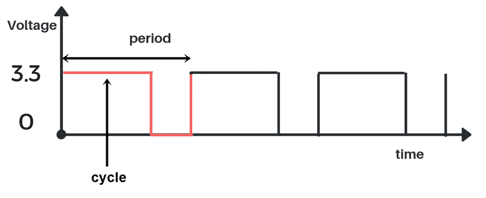

信号保持高电平的时间称为占空比，如下图所示：

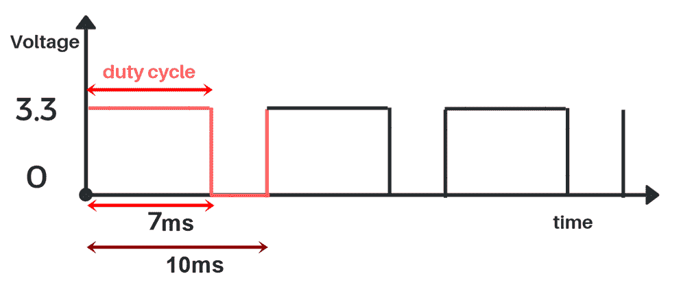

占空比以百分比格式表示，计算占空比的公式如下：

*占空比 =（高信号的时间持续时间/总时间）X 100*

在上图中，信号保持高电平 7 毫秒，单个周期的总时间为 10 毫秒：


占空比 = 70% 或 0.7

因此，占空比为 0.7 或 70%。接下来，为了找到新的电压值，我们需要将占空比乘以最大电压值 3.3V：

*Vout = 占空比 X Vmax*

*Vout = 0.7 X 3.3*

*Vout = 2.31V*

在 70%的占空比下，提供给 LED 的电压将为 2.31V，LED 的亮度将略有降低。

现在，如果我们将占空比降低到 40%，那么提供给 LED 的电压将为 1.32V，如下图所示：

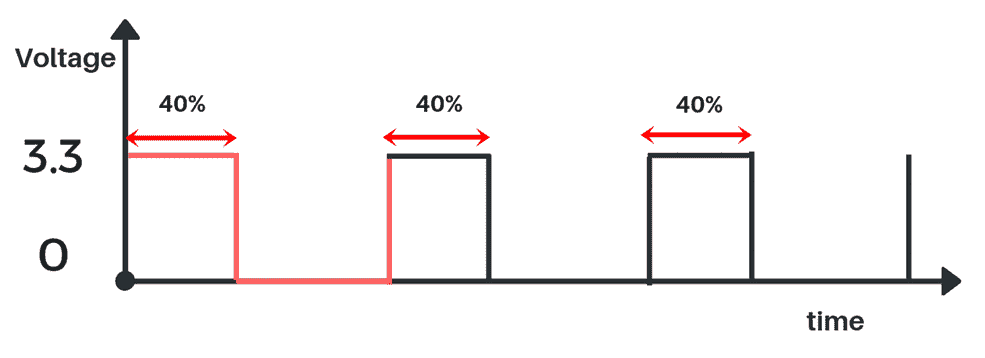

现在我们已经了解了 PWM 如何用于降低 RPi 数据引脚的电压，让我们来看看 softPWM 库，使用该库可以将数据引脚用作 PWM 引脚。

# softPWM 库

wiringPi 包含一个 softPWM 库，使用该库可以从 RPi 的任何数据引脚获得 PWM 信号输出。softPWM 库包含两个主要函数：`softPwmCreate`和`softPwmWrite`。这两个函数的工作原理如下：

```cpp
softPwmCreate(pin number, initial duty cycle value, max duty cycle value);
```

`softPwmCreate`函数用于创建 PWM 引脚。它包括三个主要参数：

+   `引脚编号`：引脚编号表示我们要设置为 PWM 引脚的 wiringPi 引脚。

+   `初始占空比值`：在初始占空比值中，我们必须提供作为占空比最小值的值。初始占空比值理想情况下设置为`0`。

+   `最大占空比值`：在最大占空比值中，我们必须提供占空比的最大值。此值必须设置为`100`：

```cpp
softPwmWrite(pin number, duty cycle value);
```

`softPwmWrite`函数用于在输出设备（例如 LED）上写入 PWM 数据。它包括两个参数：

+   `引脚编号`：引脚编号表示我们必须在其上写入 PWM 数据的 wiringPi 引脚。

+   `占空比值`：在此参数中，我们必须提供占空比值。占空比值必须在初始占空比值和最大占空比值之间，即在 0 到 100 的范围内。

现在我们了解了 softPWM 库中的两个函数，我们将编写一个简单的 C++程序，以使 LED 以不同的强度闪烁。

# 使用 softPWM 库使 LED 闪烁

对于使用 softPWM 的 LED 闪烁程序，您将需要一个 LED。在我的情况下，我已将 LED 的负极连接到 RPi 的物理引脚 6（地引脚），LED 的正极连接到 wiringPi 引脚 15。连接方式如下图所示：

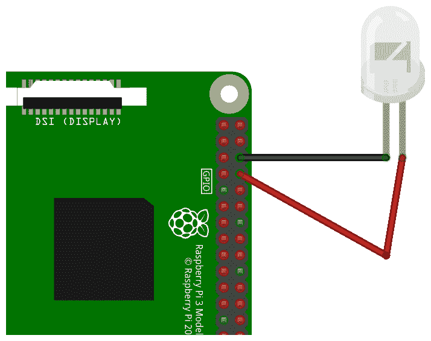

将 LED 连接到 RPi 后，是时候编写程序了。使用 softPWM 库闪烁 LED 的程序如下。此程序称为`Soft_PWM_Blink.cpp`，您可以从本书的 GitHub 存储库的`Chapter02`文件夹中下载此程序：

```cpp
#include <iostream>
#include <wiringPi.h>
#include <softPwm.h>
int main(void)
{
 wiringPiSetup();
 softPwmCreate (15, 0, 100) ;
 for(;;)
 {
 softPwmWrite (15, 25);
 delay(1000);
 softPwmWrite (15, 0);
 delay(1000);
 softPwmWrite (15, 50);
 delay(1000);
 softPwmWrite (15, 0);
 delay(1000);
 softPwmWrite (15, 100);
 delay(1000);
 softPwmWrite (15, 0);
 delay(1000);
 }
return 0;
 }
```

前面程序的解释如下：

+   在此程序中，我们首先导入了`wiringPi`和`iostream`库，以及`softPwm`库。

+   接下来，在`main`函数中，使用`softPwmCreate`函数，我们将 wiringPi 引脚 15 设置为 PWM 引脚。初始占空比值设置为`0`，最大占空比值设置为`100`。

+   之后，在`for`循环内，我们有六个`softPwmWrite`函数，通过使用这些函数，我们以不同的亮度级别打开 LED。

+   使用`softPwmWrite(15,25)`函数代码，LED 将以 25%的亮度保持高电平。由于延迟设置为 1,000，LED 将保持高电平 1 秒。

+   之后，由于占空比值设置为`0`，LED 将在`softPwmWrite(15 , 0)`函数代码中保持低电平 1 秒。

+   接下来，使用`softPwmWrite(15,50)`命令，LED 将以 50%的亮度保持高电平 1 秒。之后，我们再次将 LED 设置为低电平 1 秒。

+   最后，使用`softPwmWrite(15 , 100)`函数代码，LED 将以 100%的亮度保持高电平 1 秒。接下来，我们再次将 LED 关闭 1 秒。

+   编写代码后，您可以单击编译按钮来编译代码，然后点击构建按钮来测试代码。

这就是我们如何使用 softPWM 库来控制 LED 亮度的方法。

# 摘要

恭喜您成功地编写了您的第一个 C++程序并在树莓派上运行！在本章中，我们首先安装了`wiringPi`库，并了解了树莓派的 wiringPi 引脚连接。接下来，我们编写了一个简单的 C++程序来让 LED 闪烁。之后，我们了解了 LDR 传感器模块的工作原理，并根据 LDR 传感器模块的输入打开/关闭 LED。之后，我们了解了 PWM，并使用 softPWM 库编写了一个程序来改变 LED 的亮度。

在下一章中，我们将看看创建汽车机器人所需的不同部件。接下来，我们将了解直流电机和电机驱动器的工作原理，并学习如何创建汽车机器人。之后，我们将编写一个 C++程序来控制机器人朝不同方向移动。

# 问题

1.  树莓派上有多少个接地针脚？

1.  在黑暗环境中，LDR 传感器的电阻是高还是低？

1.  用于从传感器读取值的命令是什么？

1.  使 LED 闪烁六次的 for 循环命令是什么？

1.  假设最大电压为 5V，占空比为 20%时的输出电压是多少？
