# 第三章：编程机器人

在树莓派上编写了几个 C++程序并测试了它们的输出后，现在是时候创建我们自己的小车机器人，并使其向前、向后、向左和向右移动了。

在本章中，我们将涵盖以下主题：

+   选择一个好的机器人底盘

+   构建和连接机器人

+   使用 H 桥

+   移动机器人

# 技术要求

本章的主要硬件要求如下：

+   机器人底盘（机器人底盘中包含的零件在“构建和连接机器人”部分中有解释）

+   两个直流电机

+   L298N 电机驱动器

+   母对母连接线

本章的代码文件可以从[`github.com/PacktPublishing/Hands-On-Robotics-Programming-with-Cpp/tree/master/Chapter03`](https://github.com/PacktPublishing/Hands-On-Robotics-Programming-with-Cpp/tree/master/Chapter03)下载。

# 选择机器人底盘

在开始制作机器人之前，选择一个好的机器人底盘是最重要的活动之一。机器人的底盘就像人的骨架。我们的骨架由提供适当支撑我们器官的骨骼组成。同样，一个好的底盘将为电子元件提供适当的支撑并将它们固定在一起。

您可以从亚马逊和 eBay 等电子商务网站购买机器人底盘，也可以直接从处理机器人设备的供应商那里购买。在亚马逊上快速搜索“机器人底盘”将为您提供不同变体的机器人底盘列表。如果您以前没有制作过机器人，从所有这些选项中进行选择可能是一项艰巨的任务。在选择机器人底盘时，请记住以下要点：

+   确保机器人底盘包括两块板（一个**上板**和一个**下板**），这样您可以将电子元件放在两块板之间以及在**上板**上，如下图所示：

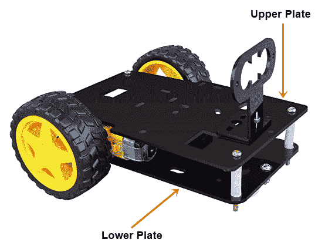

+   选择一个仅支持两个直流电机的机器人底盘，就像前面的照片中所示的那样。也有支持四个直流电机的机器人底盘，但您需要额外的电机驱动器来驱动四轮机器人。

+   最后，选择一个具有直流电机（两个单位）、车轮（两个单位）和一个脚轮的机器人底盘作为完整套件的一部分，这样您就不必单独购买这些组件。

在前面的照片中显示的机器人底盘是我将用于创建我的小车机器人的底盘，因为它由两块板组成，并包括必要的组件（直流电机、车轮、脚轮、螺丝和间隔柱）作为完整套件的一部分。

# 构建和连接机器人

正确构建机器人是最重要的步骤之一。一个正确构建的机器人将能够平稳移动而不会受到任何阻碍。在构建机器人之前，让我们看一下您将需要的所有组件的完整清单。

构建机器人所需的零件包括以下内容：

+   机器人底盘，必须包括以下组件：

+   一个上板和一个下板

+   两个 BO 直流电机（BO 是一种通常为黄色的直流电机）

+   **两个**车轮

+   **一个**脚轮

+   间隔柱

+   连接不同部件的螺丝

+   **一个**螺丝刀

+   **一个**L298N 电机驱动器

+   **七到八**根连接线

+   **一个**电池夹

+   **一个**9V 电池

由于这些机器人底盘是由小规模公司制造的，并且没有国际上可用的标准机器人底盘，我用于此项目的机器人底盘将与您国家可用的机器人底盘不同。

在网上购买机器人底盘时，请检查产品的用户评论。

# 制作机器人

当包括上下板、直流电机、车轮、万向轮和间隔器在内的组件都包含在一个单一的机器人底盘套件中时，构建机器人变得更加容易。如果您单独购买这些组件，有可能某些组件不会合适，这会使整个机器人的组装变得不稳定。虽然我使用的底盘可能与您使用的不同，但大多数双轮机器人的构造都是相似的。

您可以在 GitHub 存储库的`Chapter03`文件夹中查看机器人的构建。

# 将电机驱动器连接到树莓派

构建完机器人后，是时候将树莓派连接到电机驱动器，这样我们就可以对机器人进行编程并使其朝不同方向移动。然而，在这之前，让我们先了解一下电机驱动器是什么。

# 什么是电机驱动器？

电机驱动器是一个包含电机驱动**集成电路**（**IC**）的分立板。电机驱动器基本上与电流放大器相同，其主要目的是接收低电流信号并转换为高电流信号以驱动电机。下图显示了 L298N 电机驱动器：

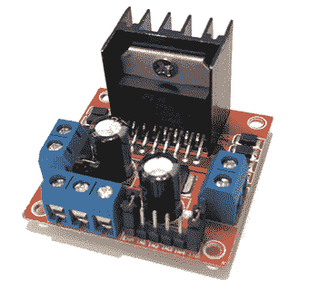

我们需要电机驱动器的主要原因是，诸如电机之类的组件不能直接连接到树莓派，因为它们无法从树莓派获得足够的电流，如下图所示：

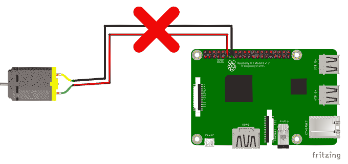

这就是为什么我们首先将电机连接到电机驱动器并使用电池为电机供电的原因，如下图所示：

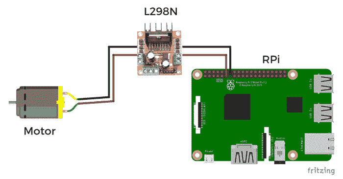

# 接线连接

L298N 电机驱动器由**四个**输入引脚，**四个**输出插座（每个电机两个插座），以及**两个**电源插座组成。树莓派引脚连接到电机驱动器的输入引脚。直流电机线连接到电机驱动器的输出插座，电池夹连接到电源插座。L298N 电机驱动器的四个输入引脚标有**IN1**，**IN2**，**IN3**和**IN4**。输出插座标有**OUT1**，**OUT2**，**OUT3**和**OUT4**。下图显示了树莓派、电机驱动器和电机的接线连接：

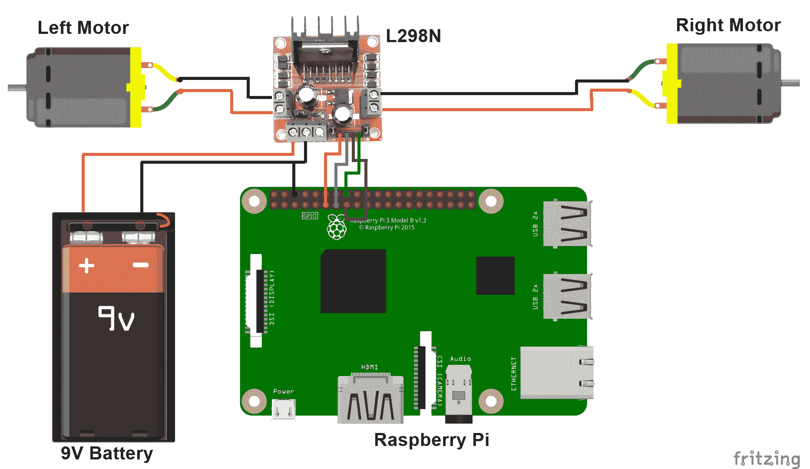

如前图所示，wiringPi 引脚编号**0**，**2**，**3**和**4**连接到电机驱动器的输入插座，如下所示：

+   wiringPi no **0**连接到**IN1**

+   wiringPi no **2**连接到**IN2**

+   wiringPi no **3**连接到**IN3**

+   wiringPi no **4**连接到**IN4**

+   左电机线连接到**OUT1**和**OUT2**插座

+   右电机线连接到**OUT3**和**OUT4**插座

+   电池夹的红线连接到电机驱动器的**VCC**插座，黑线连接到地面插座

+   树莓派的地针连接到地面插座

# 使用 H 桥

L298N 电机驱动 IC 可以同时控制两个电机。它由双 H 桥电路组成。这意味着它由两个电路组成，每个电路看起来像下图所示的电路，每个电机一个：

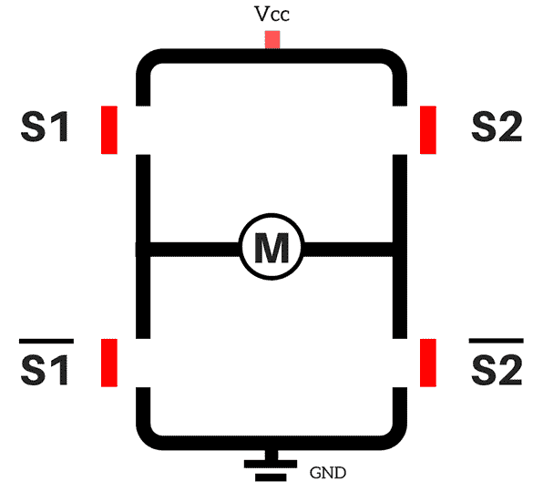

H 桥电路由四个开关**S1**，**S2**，和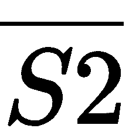组成。这些开关将根据我们提供给 L298N IC 的输入而打开和关闭。

现在，由于我们有两个电机，我们可以向 L298N IC 提供四种可能的输入组合，如下所示：

+   高 高（1, 1）

+   高 低（1, 0）

+   低 高（0, 1）

+   低 低（0, 0）

我们将向**S1**和**S2**开关提供高（1）和低（0）信号，如下所示：

1.  首先，当*S1 = 1*和*S2 =0*时，**S1**开关将关闭，**S2**开关将保持打开。，或，将为 0，因此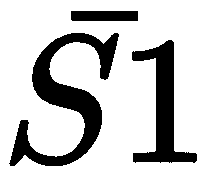开关将打开。，或，将为 1，因此开关将关闭。现在，由于**S1**和开关都关闭，电流将从**Vcc**流向**S1**，然后流向电机，然后流向，最后到达 GND。电机将以顺时针方向旋转，如下图所示：

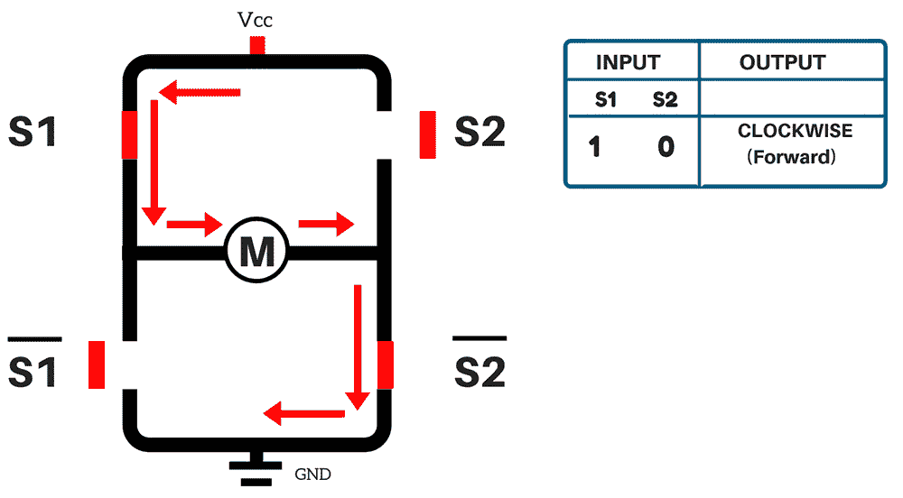

1.  当*S1 = 0*和*S2 = 1*时，**S1**开关将打开，**S2**开关将关闭，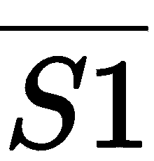将关闭，将打开。现在，由于**S2**和开关关闭，电流将从**Vcc**流向**S2**，然后流向电机，然后流向，最后到达**GND**。电机将以逆时针方向旋转，如下图所示：

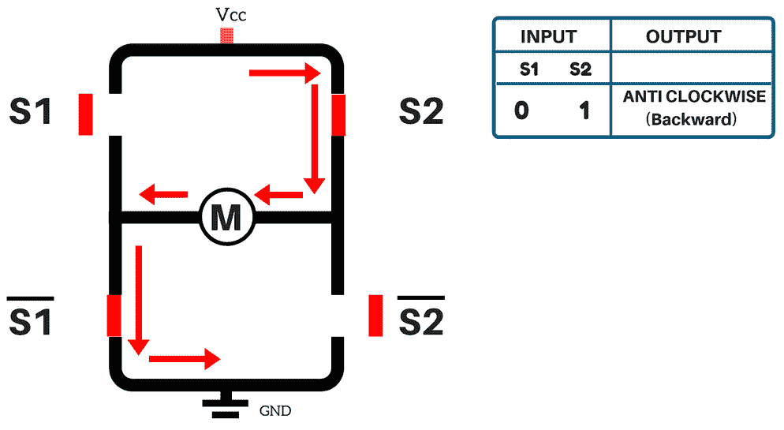

1.  当*S1 = 0*和*S2 = 0*时，**S1**开关将打开，**S2**开关将打开，开关将关闭，开关将关闭。现在，由于**S1**和**S2**开关都打开，电流无法流向电机。在这种情况下，电机将停止，如下图所示：

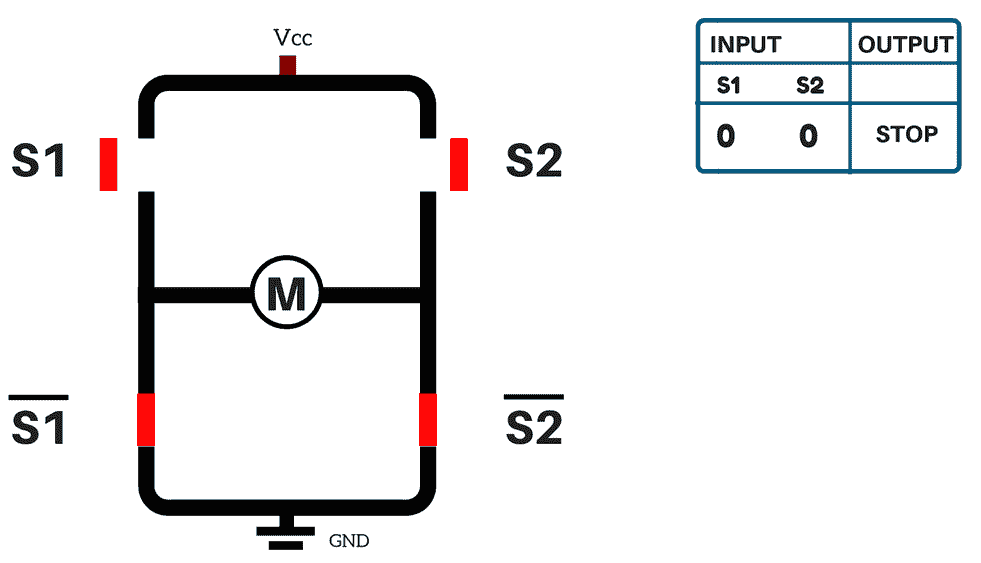

1.  当*S1 = 1*和*S2 = 1*时，**S1**和**S2**开关将关闭，而和开关将打开。由于**S1**和**S2**开关都关闭，这将产生短路条件，电流将无法通过电机。在这种情况下，电机将停止，与之前的情况一样：

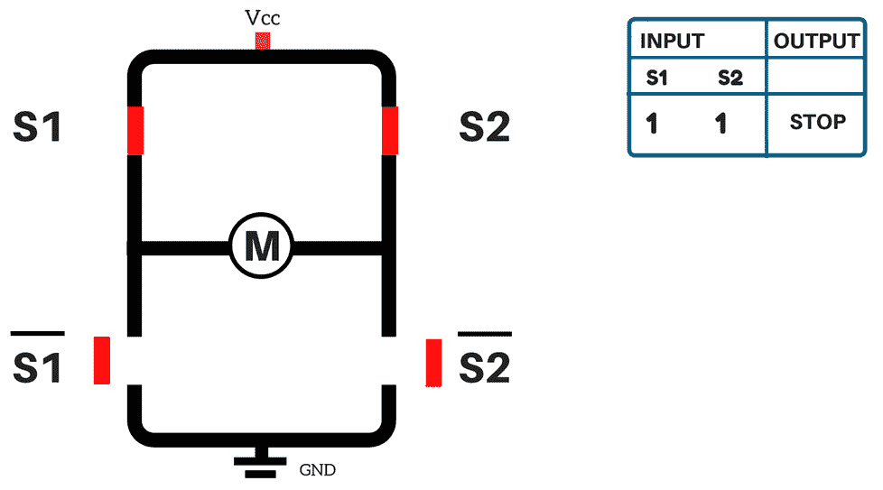

如前所述，由于 L298N IC 由两个 H 桥组成，当我们提供高低信号时，另一个 H 桥将发生相同的过程。第二个 H 桥将控制另一个电机。

# 移动机器人

现在我们已经了解了 H 桥电路，我们将编写一个名为`Forward.cpp`的程序来使我们的机器人向前移动。之后，我们将编写一个程序来使机器人向后、向左、向右移动，然后停止。您可以从 GitHub 存储库的`Chapter03`下载`Forward.cpp`程序。

移动机器人向前的程序如下：

```cpp
#include <stdio.h>
#include <wiringPi.h>

int main(void)
{
wiringPiSetup();
pinMode(0,OUTPUT); 
pinMode(2,OUTPUT); 
pinMode(3,OUTPUT);
pinMode(4,OUTPUT); 

 for(int i=0; i<1;i++)
 {
digitalWrite(0,HIGH); //PIN O & 2 will move the Left Motor
digitalWrite(2,LOW);
digitalWrite(3,HIGH); //PIN 3 & 4 will move the Right Motor
digitalWrite(4,LOW);
delay(3000);
 }
return 0;
 }
```

让我们看看这个程序是如何工作的：

1.  首先，我们将 wiringPi 引脚（编号 0、1、2 和 3）设置为输出引脚。

1.  接下来，使用以下两行，左电机向前移动：

```cpp
digitalWrite(0,HIGH);
digitalWrite(2,LOW);
```

1.  然后，接下来的两行使右电机向前移动：

```cpp
digitalWrite(3,HIGH);
digitalWrite(4,LOW);
```

1.  之后，`delay`命令意味着电机将向前移动三秒。由于我们目前在一个`for`循环中，电机将持续旋转。

1.  编译程序以检查是否有任何错误。

1.  接下来，将 9V 电池连接到电池夹子并上传程序。但在这之前，请确保将机器人的轮子抬起。这是因为当机器人开始移动时，您可能会得到以下三种输出中的一种：

+   两个电机都向前移动。如果您得到这个输出，这意味着您的机器人将在放在地面上后向前移动。

+   一个电机向前移动，另一个电机向后移动。如果您得到这种输出，请交换在电机驱动器上向后移动的电机的电线。例如，如果右电机向后移动，请将**M3-OUT**线插入**M4-OUT**插座，将**M4-OUT**线插入**M3-OUT**插座，如下图所示：

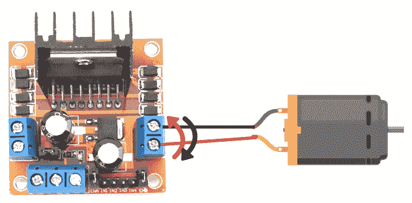

+   +   两个电机都向后移动。在这种情况下，您的机器人将向后移动。如果您得到这种输出，请交换电机驱动器上左右两个电机的电线。要为左电机执行此操作，请将**M1-OUT**插座线连接到**M2-OUT**插座，将**M2-OUT**插座线连接到**M1-OUT**插座。对于右电机，将**M3-OUT**插座线连接到**M4-OUT**插座，将**M4-OUT**插座线连接到**M3-OUT**插座，如下图所示：

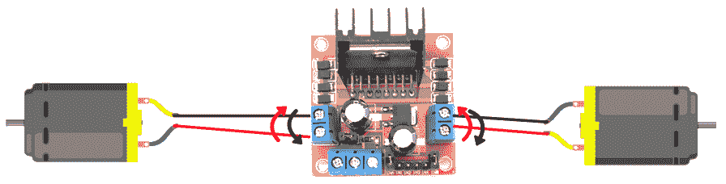

或者，您也可以交换 RPi 上的引脚以使机器人向前移动；将引脚 0 连接到左电机的引脚 2 的位置，将引脚 2 连接到引脚 0 的位置。同样，将引脚 3 连接到右电机的引脚 4 的位置，将引脚 4 连接到引脚 3 的位置。

1.  点击上传按钮并检查最终输出。由于这个程序在一个`for`循环中，电机将持续运转。在测试输出后，断开电池与电池夹的连接，以便通过电机驱动器关闭电机的电源，停止电机运动。

# 使机器人向后移动

要使机器人向后移动，我们只需要交换`HIGH`信号和`LOW`信号。以这种方式移动机器人的完整程序编写在`RobotMovement.cpp`文件中，可以从 GitHub 存储库的`Chapter03`中下载：

```cpp
digitalWrite(0,LOW);           //PIN O & 2 will move the Left Motor
digitalWrite(2,HIGH);
digitalWrite(3,LOW);          //PIN 3 & 4 will move the Right Motor
digitalWrite(4,HIGH);
delay(3000);
```

前两行将使左电机向后移动，而接下来的两行将使右电机向后移动。最后一行表示机器人将移动三秒钟。

# 停止机器人

要停止机器人移动，可以向引脚提供`HIGH`信号或`LOW`信号。在使机器人向后移动的代码中，添加以下命令以停止电机三秒钟：

```cpp
digitalWrite(0,HIGH);           //PIN O & 2 will STOP the Left Motor
digitalWrite(2,HIGH);
digitalWrite(3,HIGH);          //PIN 3 & 4 will STOP the Right Motor
digitalWrite(4,HIGH);
delay(3000);
```

# 不同类型的转弯

机器人可以进行两种类型的转弯：

+   轴向转动

+   径向转动

轴向和径向转弯的代码已添加到`RobotMovement.cpp`程序中。

# 轴向转动

在轴向转动中，机器人的一个车轮向后移动，另一个车轮向前移动。机器人可以在原地转弯而不移动。如果机器人在转弯时有空间限制，例如在迷宫中移动，通常会进行轴向转弯。机器人可以进行轴向左转或轴向右转。

# 轴向左转

在轴向左转中，机器人的左电机向后移动，右电机向前移动，因此机器人向左转，如下图所示：

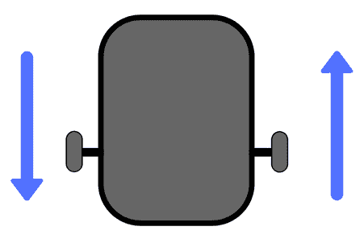

如果您已经了解了 H 桥的工作原理，您可能能够猜出进行轴向转弯的代码。如果不是，代码如下：

```cpp
digitalWrite(0,LOW);
digitalWrite(2,HIGH);
digitalWrite(3,HIGH);
digitalWrite(4,LOW);
delay(500);
```

您需要稍微调整延迟值，以确保机器人向左正确转向。如果延迟值较高，机器人将转过 90°以上，而如果延迟值较低，机器人将转过 90°以下。

# 轴向右转

在轴向左转中，机器人的左电机向前移动，右电机向后移动，从而向右转，如下图所示：

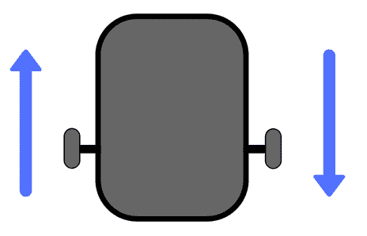

轴向右转的代码如下：

```cpp
digitalWrite(0,HIGH);
digitalWrite(2,LOW);
digitalWrite(3,LOW);
digitalWrite(4,HIGH);
delay(500);
```

# 径向转动

在径向转弯中，机器人的一个电机停止，另一个电机向前移动。停止的轮子作为圆的中心，移动的轮子作为圆周。电机之间的距离代表半径，这就是为什么这种转弯被称为径向转弯。机器人可以进行径向左转或径向右转。

# 径向左转

在径向左转中，左侧电机停止，右侧电机向前移动，因此机器人向左转，如下图所示：

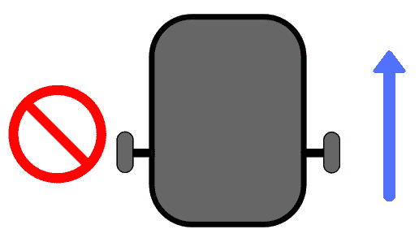

进行径向左转的代码如下：

```cpp
digitalWrite(0,HIGH);
digitalWrite(2,HIGH);
digitalWrite(3,HIGH);
digitalWrite(4,LOW);
delay(1000);
```

# 径向右转

在径向右转中，左侧电机向前移动，右侧电机停止，因此机器人向右转，如下图所示：

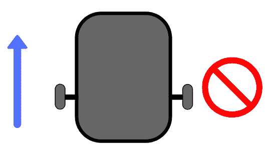

进行径向右转的代码如下：

```cpp
digitalWrite(0,HIGH);
digitalWrite(2,LOW);
digitalWrite(3,HIGH);
digitalWrite(4,HIGH);
delay(1000);
```

# 总结

在本章中，我们已经查看了选择机器人底盘的某些标准。之后，我们构建了我们的小车，将电机驱动器连接到树莓派，并了解了 H 桥电路的工作原理。最后，我们编写程序使机器人向前、向后、向左和向右移动。

在下一章中，在了解了本章中移动机器人的基本原理之后，我们将首先编写一个程序来使用超声波传感器测量距离。接下来，我们将使用这些距离值来避开障碍物，也就是说，如果机器人靠近墙壁，超声波传感器将感应到并命令机器人转弯，从而避开障碍物。

# 问题

1.  我们使用哪种电机驱动器来控制机器人？

1.  L298N 电机驱动 IC 包括哪个桥？

1.  将机器人向前移动的 C 程序是什么？

1.  *S1 = 0*（低）和*S2 = 1*（高），将使机器人向哪个方向移动？

1.  进行径向左转的代码是什么？

1.  轴向右转的代码是什么？
