# 第四章：构建避障机器人

现在我们可以让机器人以多个方向移动指定的时间，让我们考虑如何从超声波传感器中读取数值，以创建一个可以避开障碍物的机器人。我们还将使用 LCD 显示器，并用它来打印距离数值。

在本章中，我们将涵盖以下主题：

+   使用超声波传感器

+   使用 LCD

+   创建一个避障机器人

# 技术要求

本章的主要硬件要求如下：

+   一个 HC-SR04 超声波传感器

+   一个 16x2 LCD 或带有 I2C LCD 模块的 16x2 LCD

+   一个面包板

+   一个 1KΩ的电阻

+   一个 2KΩ的电阻

+   12-13 根连接线

本章的代码文件可以从[`github.com/PacktPublishing/Hands-On-Robotics-Programming-with-Cpp/tree/master/Chapter04`](https://github.com/PacktPublishing/Hands-On-Robotics-Programming-with-Cpp/tree/master/Chapter04)下载。

# 使用超声波传感器

超声波传感器用于测量障碍物或物体之间的距离。超声波传感器由发射换能器和接收换能器组成。发射换能器（触发）发出**超声脉冲**（也称为**超声波**），与附近的障碍物碰撞并被接收换能器（回波）接收。传感器通过测量超声波发送和接收之间的时间差来确定目标之间的距离。下图说明了这个过程：

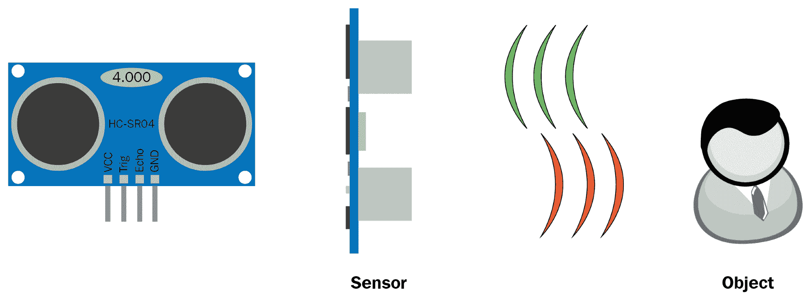

我们将用于此项目的超声波传感器称为**HC-SR04 超声波传感器**，这是最广泛使用的超声波传感器之一。它可以测量 0-180 厘米范围内的距离，分辨率约为 0.3 厘米。它的频率约为 40 千赫。HC-SR04 传感器由以下四个引脚组成：

+   VCC 引脚

+   一个地线引脚

+   一个触发引脚

+   一个回波引脚

触发引脚连接到发射换能器，发射脉冲，回波引脚连接到接收换能器，接收脉冲，如 HC-SR04 超声波传感器的照片所示：

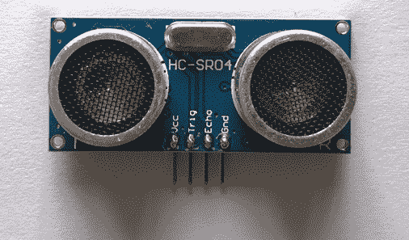

# 超声波传感器如何测量距离

现在我们已经了解了超声波传感器的基本工作原理，让我们思考一下超声波传感器如何测量距离：

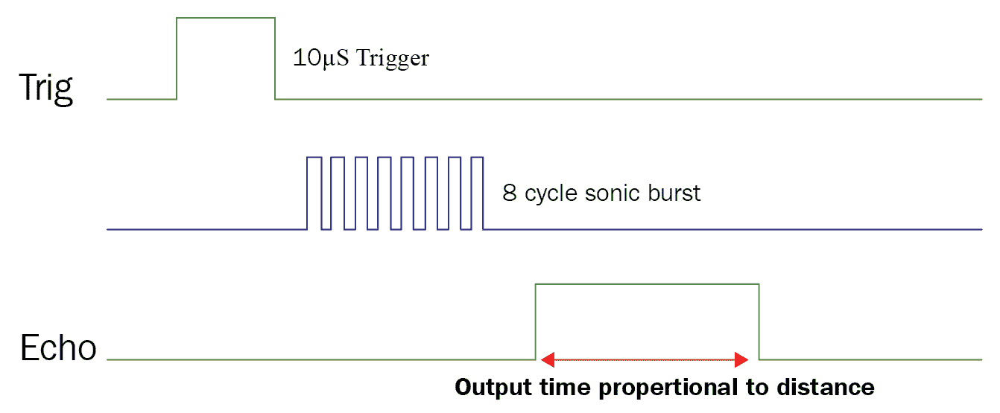

为了测量距离，超声波传感器会产生超声脉冲。为了产生这个超声脉冲，触发引脚被设置为**高**状态，持续**10 微秒**。这产生了一个以*声速*传播的*八周期声波*，在与物体碰撞后被回波引脚接收。当接收到这个*八周期声波*时，回波将变高，并且会保持高电平一段时间，这段时间与超声脉冲到达回波引脚的时间成比例。如果超声脉冲到达回波引脚花费了 20 微秒，回波引脚将保持高电平 20 微秒。

# 确定所花时间的算术方程

让我们首先看一下计算距离的算术方程，如下图所示：

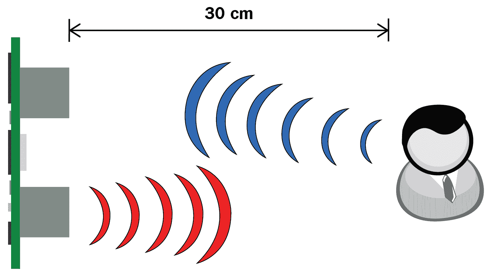

如前图所示，假设传感器和物体之间的距离为 30 厘米。超声波传感器的传播速度为 340 米/秒，或 0.034 厘米/微秒。

为了计算时间，我们将使用以下方程：

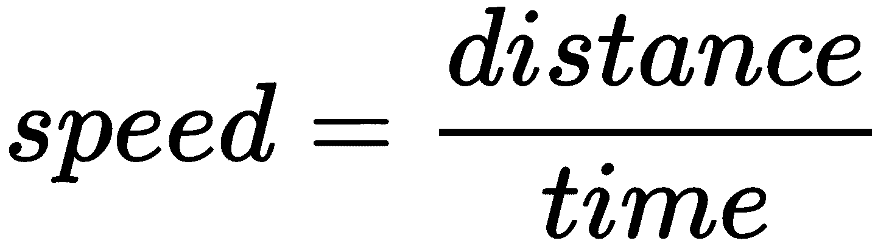

如果我们将时间移到左边，速度移到右边，我们得到以下方程：

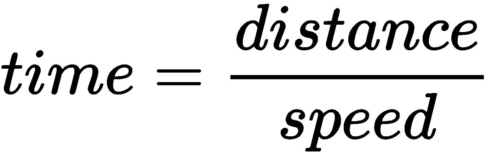

如果我们输入前面的数字，我们得到以下结果：

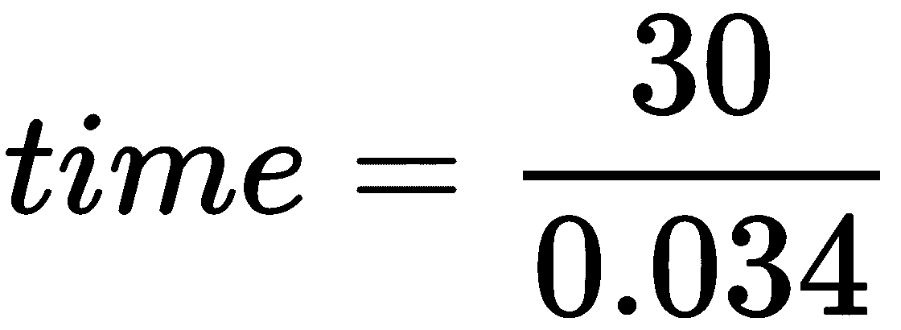

这个方程的结果是所花时间为 882.35 微秒。

尽管时间值为 882.35μs，但回波引脚保持高电平的时间持续值实际上将是 882.35μs 的两倍，即 1764.70μs。这是因为超声波首先朝着物体传播，然后从物体反射回来后被回波接收。它传播的距离是相同的：首先从传感器到物体，然后从物体到传感器。如果时间值加倍，距离值也将加倍。我们可以修改上述方程来找到距离，如下所示：

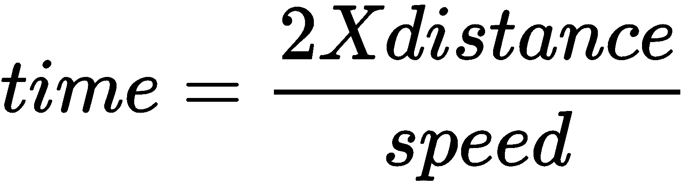

请记下这个方程，因为我们稍后将使用它来找到距离，一旦我们得到时间持续值。

# 将超声波传感器连接到树莓派

HC-SRO4 传感器由四个引脚组成：**VCC**、**GND**、**trigger**（**Trig**）和**echo**，因此 RPi 和超声波传感器的接线连接应如下所示：

+   将传感器的**VCC**引脚连接到引脚编号 4。

+   将传感器的**GND**引脚连接到引脚编号 9。

+   将传感器的**Trig**引脚连接到 wiringPi 引脚编号 12。

+   传感器的**echo**引脚通过电压分压器连接到 wiringPi 引脚编号 13。电压分压器电路中使用的两个电阻的电阻值分别为 1KΩ（**R1**）和 2KΩ（**R2**）。电压分压器电路用于将来自回波引脚（到 RPi）的输入 5V 信号降低到 3.3V。RPi 和 HC-SR04 的接线连接如下图所示：

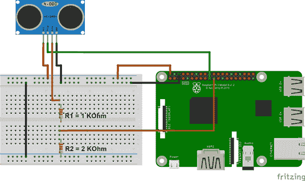

将传入电压转换为 3.3V 的公式如下：

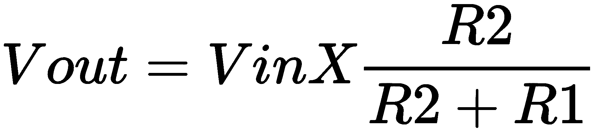

**Vin**是来自回波引脚的输入电压，**R1**是第一个电阻，**R2**是第二个电阻。**Vin**为 5V，**R1**为 1KΩ，**R2**为 2KΩ：

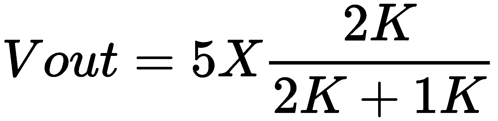

# HC-SR04 传感器程序

将 HC-SR04 传感器连接到树莓派后，让我们编写一个程序来测量超声波传感器到物体之间的距离。距离测量程序名为`DistanceMeasurement.cpp`，您可以从 GitHub 存储库的`Chapter04`文件夹中下载。

测量距离的代码如下：

```cpp
#include <stdio.h>
#include <iostream>
#include <wiringPi.h>

using namespace std;

#define trigger 12
#define echo 13

long startTime;
long stopTime;

int main()
{

 wiringPiSetup();

 pinMode(trigger,OUTPUT);
 pinMode(echo, INPUT); 

for(;;){
 digitalWrite(trigger,LOW);
 delay(500);

 digitalWrite(trigger,HIGH);
 delayMicroseconds(10);

 digitalWrite(trigger,LOW); 

 while(digitalRead(echo) == LOW);
 startTime = micros();

 while(digitalRead(echo) == HIGH);
 stopTime = micros(); 

long totalTime= stopTime - startTime; 
 float distance = (totalTime * 0.034)/2;

 cout << "Distance is: " << distance << " cm"<<endl;
 delay(2000);
}
return 0;
}
```

在上述代码中，我们声明了`wiringPi`、`stdio`和`iostream`库。之后，我们声明了`std`命名空间：

1.  之后，使用`#define trigger 12`和`#define echo 13`这两行，我们将 wiringPi 引脚编号 12 声明为触发引脚，将 wiringPi 引脚编号 13 声明为回波引脚。

1.  然后，我们声明了两个名为`startTime`和`stopTime`的变量，它们的数据类型为`Long`。`startTime`变量将记录触发引脚发送超声波脉冲的时间，`stopTime`变量将记录回波引脚接收超声波脉冲的时间。

1.  在主函数内，将触发引脚设置为`OUTPUT`，因为它将产生超声波脉冲。将回波引脚设置为`INPUT`，因为它将接收超声波脉冲。

1.  在一个`for`循环内，将触发引脚设置为 500 毫秒或 0.5 秒的`LOW`。

1.  为了产生超声波脉冲，将触发引脚设置为`HIGH`（`digitalWrite(trigger,HIGH)`）持续 10 微秒（`delayMicroseconds(10)`）。产生了 10 微秒的脉冲后，我们再次将触发引脚设置为`LOW`。

1.  接下来，我们有两个`while`循环，在这两个循环内，有两个`micros()`函数。`micros()`将以毫秒为单位返回当前时间值。第一个`while`循环（`digitalRead(echo) == LOW`）将记录脉冲开始时的时间，并将回波引脚为`LOW`的时间持续值存储在`startTime`变量中。

1.  当回波引脚接收到脉冲时，第二个`while`循环(`digitalRead(echo) == HIGH`*)*将执行。此`while`循环中的`micros()`函数将返回超声脉冲到达回波引脚所花费的时间值。这个时间值将被存储在`stopTime`变量中。

1.  接下来，为了找到总时间，我们将从`stopTime`中减去`startTime`，并将这个时间值存储在`totalTime`变量中。

1.  找到`totalTime`后，我们使用以下公式来计算距离：

*float distance = (totalTime x 0.034)/2*

1.  为了显示距离值，我们将使用`cout`语句。调用`delay(2000);`命令，以便每两秒打印一次距离值。

完成代码后，您可以编译和构建它以检查最终输出。您可以将一个物体放在传感器前面，物体距离传感器的距离将显示在控制台内。

在我的机器人底盘上，有一个额外的部件，我已经固定了超声波传感器。

# 使用 LCD

**液晶显示器**（LCD）是一种电子显示单元，通常用于计算机、电视、智能手机和相机。16x2 LCD 是一个基本的 LCD 模块，通常用于电子或 DIY 项目。顾名思义，16x2 LCD 由 16 列和 2 行组成。这意味着它有两行，每行最多可以显示 16 个字符。16x2 LCD 由从**VSS**到**K**标记的 16 个引脚组成，如下图所示：

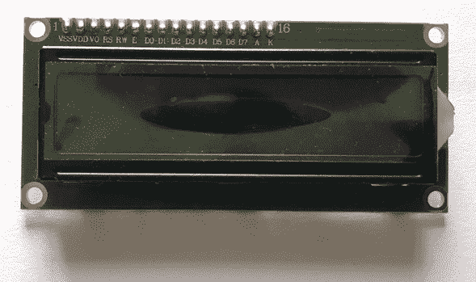

LCD 上的每个引脚可以描述如下：

| **引脚号** | **名称** | **工作原理** |
| --- | --- | --- |
| 1  | VSS (GND) | 地线引脚。 |
| 2 | VCC | VCC 引脚需要 5V 电源才能打开 LCD 模块。 |
| 3 | Vo | 使用此引脚，我们可以调整 LCD 的对比度。我们可以将它连接到 GND 以获得最大对比度。如果您想要改变对比度，将其连接到电位器的数据引脚。 |
| 4 | RS (RegisterSelect) | LCD 由两个寄存器组成：命令寄存器和数据寄存器。RS 引脚用于在命令寄存器和数据寄存器之间切换。它被设置为高电平（1）以用于命令寄存器，低电平（0）用于数据寄存器。 |
| 5 | R/W (Read Write) | 将此引脚设置为低电平以写入寄存器，或将其设置为高电平以从寄存器中读取。 |
| 6 | E (Enable) | 此引脚使 LCD 的时钟启用，以便 LCD 可以执行指令。 |
| 7 | D0 | 尽管 LCD 有八个数据引脚，我们可以将其用于八位模式或四位模式。在八位模式中，所有八个数据引脚（D0-D7）都连接到 RPi 引脚。在四位模式中，只有四个引脚（D4-D7）连接到 RPi。在这种情况下，我们将使用四位模式的 LCD，以便占用更少的 wiringPi 引脚。 |
| 8 | D1 |
| 9 | D2 |
| 10 | D3 |
| 11 | D4 |
| 12 | D5 |
| 13 | D6 |
| 14 | D7 |
| 15 | A (Anode) | LCD 背光的+5V 引脚。 |
| 16 | K (Cathode) | LCD 背光的 GND 引脚。 |

由于 16x2 LCD 有 16 个引脚，正确连接所有引脚到树莓派有时可能会有问题。如果您犯了一个错误，例如将需要连接到 D0 的引脚连接到 D1，您可能会得到不正确的输出。

为了避免这种潜在的混淆，您可以选择购买一个 16x2 LCD 的**I2C LCD 适配器模块**。该模块将 LCD 的 16 个引脚作为输入，并提供 4 个引脚作为输出（VCC、GND、SDA、SCL）。这意味着您只需要连接 4 个引脚到树莓派，而不是 16 个引脚。

还有带有 I2C LCD 适配器焊接的 16x2 LCD，这可以节省一些时间。我用于这个项目的 16x2 LCD 已经焊接了 I2C LCD 适配器，如下图所示：

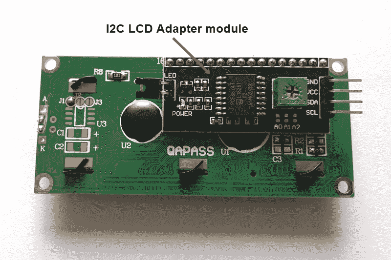

在接下来的章节中，我们将了解接线连接以及如何编程普通 LCD 和带有 I2C LCD 适配器的 LCD。

我将**16x2 LCD 与 I2C LCD 适配器**称为**I2C LCD**，以避免复杂化。

# 将 16x2 LCD 连接到 Raspberry Pi

要将 16x2 LCD 连接到 Raspberry Pi，您将需要一个迷你面包板，因为有几个引脚需要连接到 VCC 和 GND。 RPi 和 16x2 LCD 的接线连接如下：

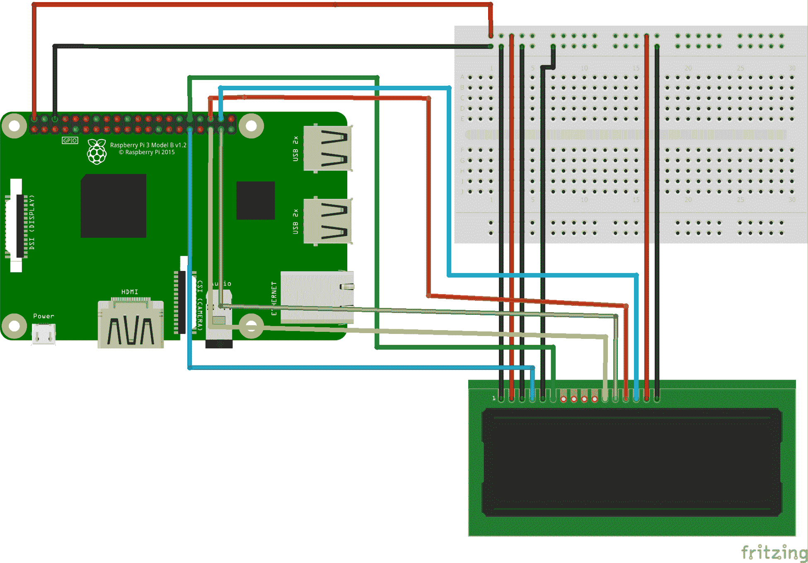

首先，将 Raspberry Pi 的引脚号 2 或引脚号 4 连接到面包板的一个水平引脚，以便我们可以将该行用作 VCC 行。同样，将 Raspberry Pi 的一个地引脚连接到面包板的一个水平引脚，以便我们可以将该行用作地行。接下来，按照以下说明进行操作：

1.  将 VSS（GND）引脚连接到面包板的地行

1.  将 VCC 引脚连接到面包板的 VCC 行

1.  将 V0 引脚连接到面包板的地行

1.  将**寄存器选择**（RS）引脚连接到 RPi 的 wiringPi 引脚号 22

1.  将 R/W 引脚连接到面包板的地行，因为我们将关闭 LCD 的寄存器

1.  将使能引脚连接到 RPi 的 wiringPi 引脚号 26

1.  我们将使用四位模式的 LCD，因此 D0 到 D3 引脚将保持未连接状态

1.  引脚 D4 应连接到 RPi 的 wiringPi 引脚号 24

1.  引脚 D5 应连接到 RPi 的 wiringPi 引脚号 25

1.  引脚 D6 应连接到 RPi 的 wiringPi 引脚号 27

1.  引脚 D7 应连接到 RPi 的 wiringPi 引脚号 28

1.  将阳极引脚连接到面包板的 VCC 行

1.  将阴极引脚连接到面包板的地行

为了测试 LCD 程序，在“Build | Set Build Commands”中打开 Build 选项，并在 Compile and Build 选项中添加`-lwiringPiDev`命令，如下截图所示：

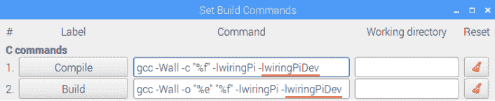

将 16X2 LCD 连接到 RPi 后，让我们编程 LCD。

# 编程 LCD

我们将使用普通的 16x2 LCD 编写两个程序。在第一个程序中，我们将在 16x2 LCD 上打印一个值。在第二个程序中，我们将在 LCD 屏幕上打印超声波传感器值。第一个程序称为`LCDdisplay.cpp`，您可以从`Chapter04`的 GitHub 存储库中下载。

# LCD 程序

将 LCD 连接到 Raspberry Pi 后，让我们检查在 LCD 上打印值的程序，如下所示：

```cpp
#include <wiringPi.h> 
#include <lcd.h> 

#define RS 22 //Register Select
#define E 26 //Enable

#define D4 24 //Data pin 4
#define D5 25 //Data pin 5
#define D6 27 //Data pin 6
#define D7 28 //Data pin 7

int main()
{

int fd; 
wiringPiSetup(); 
fd= lcdInit (2, 16, 4, RS, E, D4, D5, D6, D7, 0, 0, 0, 0); 
lcdPuts(fd, "LCD OUTPUT"); 

}
```

以下是前面程序的详细信息：

1.  首先，我们调用`LCD.h`库。`LCD.h`库包含了我们可以用来打印、定位和移动文本以及清除 LCD 屏幕的所有重要函数。

1.  接下来，我们定义引脚号 RS、E、D4、D5、D6 和 D7。

1.  在`lcdInit`函数内部，第一个数字`2`代表 LCD 中的行数，而数字`16`代表列数。数字`4`表示我们正在使用四位模式的 LCD。接下来是 RS 和 E 引脚，最后是四个数据引脚。由于我们没有将 D0、D1、D2 和 D3 数据引脚连接到 RPi，因此在末尾有四个零。

1.  `lcdPuts`用于在 LCD 上打印数据。它有两个输入参数：`fd`变量和需要显示的文本值。

1.  完成此代码后，您可以编译和构建代码以测试最终输出。

1.  在输出中，您会注意到文本输出将从第一列开始，而不是从第零列开始。

1.  为了将文本定位在极左侧，或列`0`，行`0`，我们需要使用`lcdPosition()`函数。`lcdPosition(fd,列位置,行位置)`函数由三个参数组成，并且应该在`lcdPuts`函数之前写入，如下所示：

```cpp
fd= lcdInit (2, 16, 4, RS, E, D4, D5, D6, D7, 0, 0, 0, 0);
lcdPosition(fd, 0, 0); 
lcdPuts(fd, "LCD OUTPUT");
```

如果文本未定位在列 0 和行 0，请重新启动 RPi 并再次测试代码。

# LCD 和超声波传感器程序

在 LCD 上打印简单的文本值后，让我们看看如何在 LCD 屏幕上查看超声波距离值。HC-SR04 超声波传感器、16x2 LCD 和 RPi 的接线连接如下：

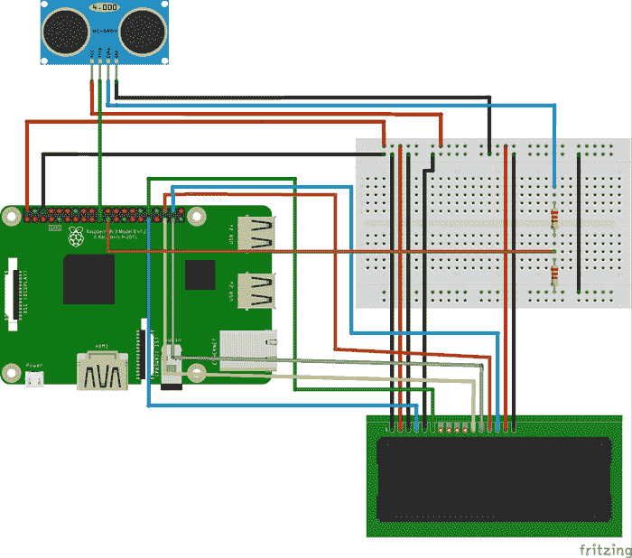

LCD 连接到 RPi 保持不变。超声波触发引脚连接到 wiringPi 引脚 12 号，回波引脚连接到 wiringPi 引脚 13 号。现在让我们看看程序。该程序称为`LCDdm.cpp`（**dm**代表**距离测量**），您可以从`Chapter04`的 GitHub 存储库中下载。`LCDdm.cpp`程序是`LCDdisplay.cpp`和`DistanceMeasurement.cpp`程序的组合：

```cpp
int main()
{
...
for(;;)
{
...
cout << "Distance is: " << distance << " cm"<<endl;
lcdPosition(fd, 0, 0);           //position the cursor on column 0, row 0
lcdPuts(fd, "Distance: ");      //this code will print Distance text
lcdPosition(fd, 0, 1);          //position the cursor on column 0, row 1
lcdPrintf(fd, distance);        // print the distance value
lcdPuts(fd, " cm");
delay(2000);
clear();                     
}
return 0
}
```

在上述代码中，找到距离值后，我们使用`lcdPosition(fd, 0, 0);`命令将光标定位在第零行，第零列。接下来，使用`lcdPuts(fd, "Distance: ")`代码，我们显示距离文本。然后，我们将光标定位在第一行的第零列。最后，使用`lcdPrintf(fd, distance);`命令打印距离值。由于我们将延迟设置为两秒，因此每两秒将打印一次距离值。然后它将被清除（`clear()`）并替换为新值。

# I2C 协议是什么？

I2C 协议用于许多电子设备。我们用它来连接一个主设备到多个从设备，或者多个主设备到多个从设备。I2C 协议的主要优势在于主设备只需要两个引脚与多个从设备通信。

在 I2C 总线中，所有设备都并行连接到相同的双线总线。我们可以使用 7 位寻址连接总共 128 个设备，使用 10 位寻址连接总共 1,024 个设备，如下图所示：

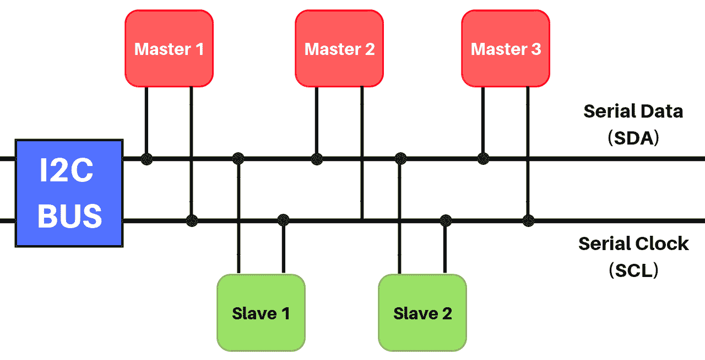

使用 I2C 协议连接的每个设备都有一个唯一的 ID，这使得可以与多个设备通信。I2C 协议中的两个主要引脚是**串行数据**（SDA）引脚和**串行时钟**（SCA）引脚：

+   **SDA**：SDA 线用于传输数据。

+   **SCL**：SCL 由主设备生成。它是一个时钟信号，用于同步连接在 I2C 中的设备之间的数据传输。

现在我们已经了解了 I2C 协议的基础知识，让我们看看如何连接 I2C LCD 和树莓派。

# 连接 I2C LCD 和树莓派

在树莓派上，物理引脚 3 是 SDA 引脚，而物理引脚 5 是 SCA 引脚，如下图所示：

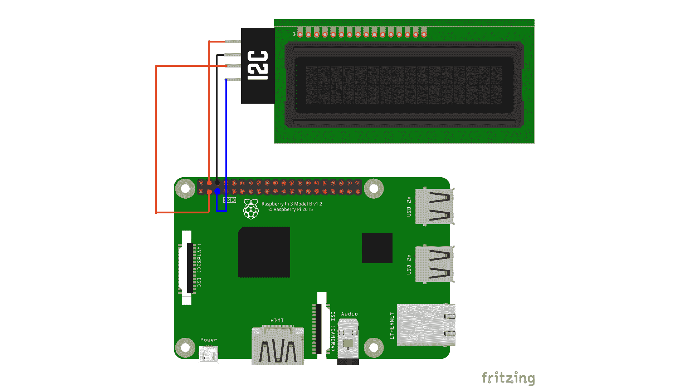

以下是连接 LCD 与 RPi 的详细信息：

1.  将树莓派的 3 号引脚连接到 LCD 的 SDA 引脚

1.  将树莓派的 5 号引脚连接到 LCD 的 SCA 引脚

1.  将 LCD 的 GND 引脚连接到 RPi 的 GND 引脚

1.  将 LCD 的 VCC 引脚连接到树莓派的 2 号引脚或 4 号引脚

# 使用 I2C LCD 模块编程 LCD

在编写程序之前，我们首先需要从树莓派配置中启用 I2C 协议。为此，请打开命令窗口并输入以下命令：

```cpp
sudo raspi-config
```

在配置中，打开接口选项，如下所示：

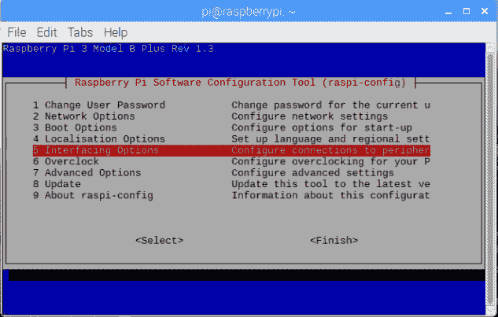

接下来，打开 I2C 选项，如下面的屏幕截图所示：

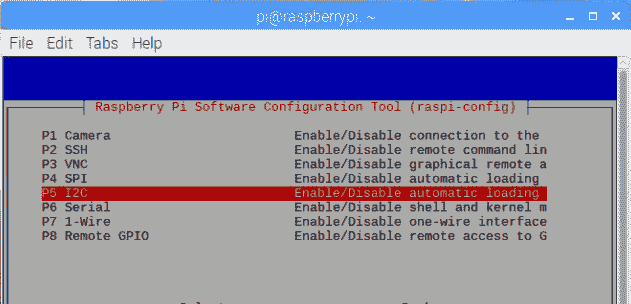

选择“是”选项并按*Enter*键启用 I2C，如下所示：

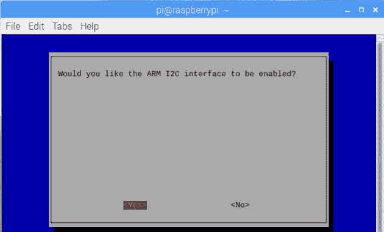

启用 I2C 后，选择“确定”选项并退出配置，如下所示：

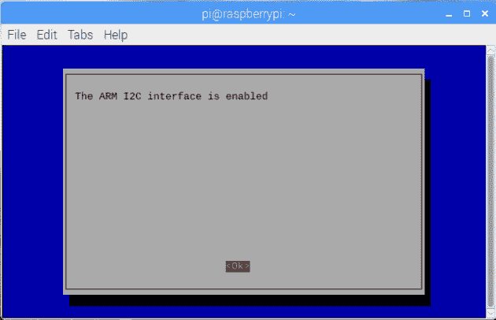

在树莓派内部启用 I2C 协议后，让我们编写程序将值打印到 LCD 上。该程序称为`I2CLCD.cpp`，您可以从`Chapter04`的 GitHub 存储库中下载。

由于这个 LCD 连接了一个 I2C 模块，我们之前用过的`LCD.h`库在这个程序中将无法使用。相反，我创建了五个主要函数，用于初始化 LCD，打印消息和清除 LCD 屏幕，如下所示：

+   `init_lcd()`: 该函数将初始化（设置）LCD

+   `printmessage()`: 该函数用于在 LCD 上打印字符串

+   `printInt()`: 该函数用于显示整数值

+   `printfloat()`: 该函数用于显示浮点值

+   `clear()`: 该函数将清除 LCD 屏幕

```cpp
#include <wiringPiI2C.h>
#include <wiringPi.h>
#include <stdlib.h>
#include <stdio.h>

#define I2C_DEVICE_ADDRESS 0x27 
#define firstrow 0x80 // 1st line
#define secondrow 0xC0 // 2nd line
int lcdaddr;
```

1.  我们通过声明`wiringPiI2C.h`库来启动程序。接下来，我们有`wiringPi`库和另外两个标准 C 库。

1.  然后，使用`#define I2C_DEVICE_ADDRESS 0x27`命令，我们定义了 I2C 设备地址，即`0x27`。

1.  `0x80`命令代表第一行：第零行，第零列。使用`#define firstrow 0x80`命令，我们初始化 LCD 的第一行。

1.  同样，`0xC0`代表 LCD 的第二行：第一行，第零列。使用`#define secondrow 0xC0`命令，我们初始化 LCD 的第二行。

1.  接下来，在`lcdaddr`变量内，我们将存储 I2C LCD 的地址，如下所示：

```cpp
int main() {

 wiringPiSetup();

 lcdaddr = wiringPiI2CSetup(I2C_DEVICE_ADDRESS);

 init_lcd(); // initializing OR setting up the LCD 
 for(;;) {

 moveCursor(firstrow);
 printmessage("LCD OUTPUT");
 moveCursor(secondrow);
 printmessage("USING I2C");
 delay(2000);
 clear();

 moveCursor(firstrow);
 printmessage("Integer: ");
 int iNumber = 314;
 printInt(iNumber);

 moveCursor(secondrow);
 printmessage("Float: ");
 float fNumber= 3.14;
 printFloat(fNumber);
 delay(2000);
 clear();
 }
 return 0;
}
```

1.  在`main()`函数内，我们将设备地址存储在`lcdaddr`变量中。

1.  然后，我们使用`init_lcd();`命令初始化 LCD。

1.  接下来，在`for`循环中，我们使用`moveCursor(firstrow);`命令将光标移动到第一行。

1.  现在，由于光标在第一行，所以在`printmessage("LCD OUTPUT"`代码中的`LCD OUTPUT`文本将被打印在第一行。

1.  然后，使用`moveCursor(secondrow)`命令将光标移动到第二行。在该行上打印`USING I2C`文本。

1.  第一行和第二行的文本将在两秒内可见，之后 LCD 屏幕将被`clear()`命令清除。

1.  之后，使用接下来的四行，在第一行上打印一个整数`314`。`printInt(iNumber)`函数用于显示整数值。

1.  同样，`printFloat(iFloat)`函数用于显示浮点值。在接下来的四行中，将在第二行上打印`float 3.14`。

1.  之后，我们再次清除 LCD。

这就是我们如何在 I2C LCD 内显示字符串，数字和浮点值。

# I2C LCD 和超声波传感器程序

要在 I2C LCD 内读取超声波传感器值，请将超声波传感器和 I2C LCD 连接到 RPi。您可以从`Chapter04`的 GitHub 存储库中下载名为`I2CLCDdm.cpp`的完整程序。I2C LCD，超声波传感器和 RPi 的接线连接如下图所示：

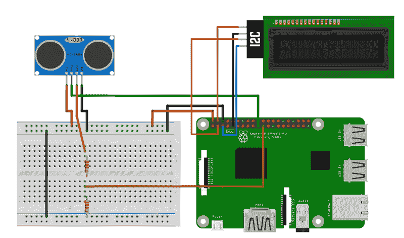

这个`I2CLCDdm.cpp`程序基本上是`DistanceMeasurement.cpp`和`I2CLCD.cpp`程序的组合。在这个程序中，在`cout << "Distance: "<<distance << "cm" << endl`行下面声明了与超声波传感器和 I2C LCD 相关的所有必要库和变量，我们需要添加以下代码：

```cpp
 moveCursor(firstrow);
 printmessage("DISTANCE");
 moveCursor(secondrow);
 printFloat(distance);
 printmessage(" cm");
 delay(2000);
 clear();
```

使用`printmessage("DISTANCE")`命令将在第一行上打印文本`DISTANCE`。之后，在第二行上，使用`printFloat(distance)`命令将打印距离值，因为代码仍在第二行上。使用`printmessage(" cm")`命令，`cm`文本将在距离值旁边打印出来。

控制台内的距离值和 I2C LCD 将在两秒内可见。接下来，使用`clear()`函数，旧的距离值将被清除并替换为新值。然而，在控制台中，新值将显示在下一行。

# 构建避障机器人

在这种情况下，我们的机器人将在给定空间内自由移动，但一旦靠近物体或障碍物，它将转向或向后移动，从而避开障碍物。在这种项目中，我们通常使用超声波传感器。当机器人移动时，超声波传感器不断测量它与物体的距离。当传感器检测到距离值非常低，并且机器人可能与附近物体碰撞时，它将命令机器人改变方向，从而避开障碍物。

要创建一个避障机器人，您首先需要将超声波传感器安装在机器人上。在我的机器人套件中，已经有一个附件可以让我将超声波传感器安装在机器人上。这个附件如下所示：

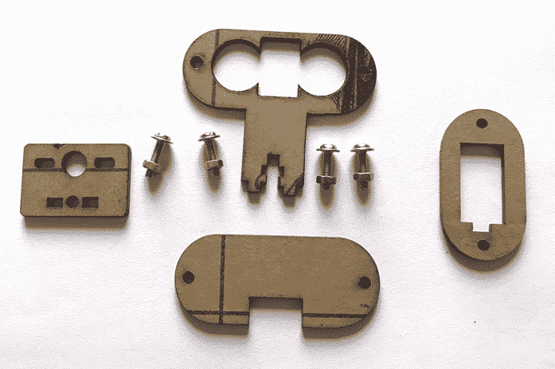

在机器人上安装超声波传感器后，最终装配如下所示：

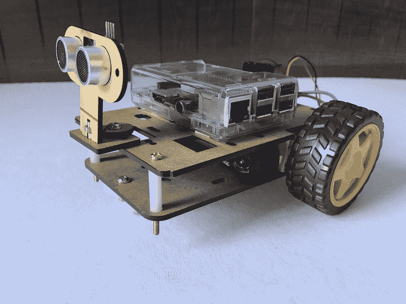

# 接线连接

超声波传感器的触发引脚连接到 wiringPi 引脚号 12，而回波引脚通过电压分压电路连接到 wiringPi 引脚号 13。超声波传感器的 VCC 引脚连接到 RPi 的物理引脚 2（5V），超声波传感器的地线引脚连接到 RPi 的物理引脚 6。其余连接如下：

+   **WiringPi 引脚 0**连接到 L298N 电机驱动器的**IN1 引脚**。

+   **WiringPi 引脚 2**连接到 L298N 电机驱动器的**IN2 引脚**。

+   **WiringPi 引脚 3**连接到 L298N 电机驱动器的**IN3 引脚**。

+   **WiringPi 引脚 4**连接到 L298N 电机驱动器的**IN4 引脚**。

+   **电机驱动器的地线引脚**连接到 RPi 的**物理引脚 3**。

+   我正在使用 I2C LCD，因此 I2C LCD 的**SDA 引脚**连接到**RPi 的物理引脚 3**，**SCL 引脚**连接到**物理引脚 5**。**I2C LCD 的地线引脚**连接到**物理引脚 9**，**I2C LCD 的 VCC 引脚**连接到 RPi 的**物理引脚 4**。

将 LCD 显示器连接到机器人完全取决于您。如果机器人上有足够的空间可以放置 LCD，那就加上去。如果没有，这不是必需的。

# 编程避障机器人

在这个程序中，我们将首先使用超声波传感器找出附近物体的距离。接下来，我们将创建一个`if`条件来监测距离数值。如果距离低于某个数值，我们将命令机器人转向。否则，机器人将继续向前移动。您可以从 GitHub 存储库的`Chapter04`中下载名为`ObstacleAvoiderRobot.cpp`的完整代码：

```cpp
int main()
{
...
for(;;)
{
...
if(distance < 7)
{
digitalWrite(0,LOW);
digitalWrite(2,HIGH);
digitalWrite(3,HIGH);
digitalWrite(4,LOW);
delay(500);
moveCursor(firstrow);
printmessage("Obstacle Status");
moveCursor(secondrow);
printmessage("Obstacle detected");
clear();
}
else
{
digitalWrite(0,HIGH);
digitalWrite(2,LOW);
digitalWrite(3,HIGH);
digitalWrite(4,LOW);
moveCursor(firstrow);
printmessage("Obstacle Status");
moveCursor(secondrow);
printmessage("No Obstacle");
clear();
}
}
return 0;
}
```

在这段代码中，如果**距离**大于**7 厘米**，机器人将继续向前移动。只要障碍物不存在，LCD 将在第二行显示`No Obstacle`的消息。如果检测到障碍物，机器人将首先进行 0.5 秒的径向左转，I2C LCD 将在第二行显示`Obstacle detected`的文本。您可以根据电机速度增加或减少延迟值。

# 总结

在本章中，我们看了超声波传感器的工作原理，并编写了一个程序来测量距离值。接下来，我们编程 16x2 LCD，并使用它读取超声波距离值。我们还研究了 I2C LCD，它将 16 个 LCD 引脚作为输入，并提供四个引脚作为输出，从而简化了接线连接。最后，我们将超声波传感器安装在我们的机器人上，创建了我们的避障机器人。这个机器人在附近没有障碍物时自由移动，如果靠近障碍物，它将通过转向来避开。

在下一章中，我们将创建两种不同类型的 PC 控制机器人。在第一个 PC 控制机器人中，我们将使用一个叫做**ncurses**的库，并使用键盘作为输入。在第二个 PC 控制机器人中，我们将使用 QT 创建 UI 按钮，然后使用它们来移动机器人。

# 问题

1.  超声波传感器发送什么类型的脉冲？

1.  LCD 代表什么？

1.  HC-SR04 超声波传感器可以测量到多远的距离？

1.  `lcdPosition(fd, 4,1)`命令会从哪一行和哪一列开始打印文本？

1.  LCD 的阳极引脚（引脚 15）和阴极引脚（引脚 16）在 LCD 上有什么功能？
