# 第五章：使用笔记本电脑控制机器人

使用计算机控制机器人是一件迷人的事情。计算机成为遥控器，机器人根据键盘提供的命令移动。在本章中，我们将介绍使用笔记本电脑无线控制机器人的两种技术。

我们将涵盖以下主题：

+   安装`ncurses`库

+   使用`ncurses`控制 LED 和蜂鸣器

+   使用笔记本电脑键盘控制一辆漫游车（RPi 机器人）

+   安装和设置 QT5

+   使用 GUI 按钮控制 LED

+   使用 QT5 在笔记本电脑上控制漫游车

# 技术要求

您需要此项目的主要硬件组件如下：

+   两个 LED

+   一个蜂鸣器

+   一个 RPi 机器人

本章的代码文件可以从[`github.com/PacktPublishing/Hands-On-Robotics-Programming-with-Cpp/tree/master/Chapter05`](https://github.com/PacktPublishing/Hands-On-Robotics-Programming-with-Cpp/tree/master/Chapter05)下载。

# 安装`ncurses`库

**New curses**（**ncurses**）是一个编程库，允许开发人员创建基于文本的用户界面。它通常用于创建基于 GUI 的应用程序或软件。`ncurses`库的一个关键特性是我们可以用它来从键盘键获取输入，并在输出端控制硬件设备。我们将使用`ncurses`库编写程序来检测键以相应地控制我们的机器人。例如，如果我们按上箭头，我们希望我们的机器人向前移动。如果我们按左箭头，我们希望我们的机器人向左转。

要安装`ncurses`库，我们首先必须打开命令窗口。要安装`ncurses`，请输入以下命令并按*Enter*：

```cpp
sudo apt-get install libncurses5-dev libncursesw5-dev 
```

接下来，您将被问及是否要安装该库。输入*Y*（表示是）并按*Enter*。`ncurses`库将需要大约三到五分钟的时间下载并安装到您的 RPi 中。

确保您的 RPi 靠近 Wi-Fi 路由器，以便库文件可以快速下载。

# ncurses 函数

安装`ncurses`库后，让我们探索一些属于该库的重要函数：

+   `initscr()`: `initscr()`函数初始化屏幕。它设置内存，并清除命令窗口屏幕。

+   `refresh()`: 刷新函数刷新屏幕。

+   `getch()`: 此函数将检测用户的触摸，并返回该特定键的 ASCII 编号。然后将 ASCII 编号存储在整数变量中，以供后续比较使用。

+   `printw()`: 此函数用于在命令窗口中打印字符串值。

+   `keypad()`: 如果键盘函数设置为 true，则我们还可以从功能键和箭头键中获取用户的输入。

+   `break`: 如果程序在循环中运行，则使用此函数退出程序。

+   `endwin()`: `endwin()`函数释放内存，并结束`ncurses`。

整个`ncurses`程序必须在`initscr()`和`endwin()`函数之间编写：

```cpp
#include <ncurses.h>
...
int main()
{
...
initscr();
...
...
endwin();
return 0;
}
```

# 使用`ncurses`编写 HelloWorld 程序

现在让我们编写一个简单的`ncurses`程序来打印`Hello World`。我将这个程序命名为`HelloWorld.cpp`。`HelloWorld.cpp`程序可以从 GitHub 存储库的`Chapter05`文件夹中下载：

```cpp
#include <ncurses.h>
#include <stdio.h>

int main()
{
initscr(); //initializes and clear the screen
int keypressed = getch(); 
if(keypressed == 'h' || keypressed == 'H')
{
printw("Hello World"); //will print Hello World message
}
getch();
refresh(); 

endwin(); // frees up memory and ends ncurses
return 0;
}
```

使用`ncurses`库编译和运行 C++程序的程序与其他程序不同。首先，我们需要理解程序。之后，我们将学习如何编译和运行它。

在上面的代码片段中，我们首先声明了`ncurses`库和`wiringPi`库。接下来，我们执行以下步骤：

1.  在`main`函数中，我们声明`initscr()`函数来初始化和清除屏幕。

1.  接下来，当用户按下一个键时，将调用`getch`函数，并将该键的 ASCII 数字存储在`keypressed`变量中，该变量是`int`类型。

1.  之后，使用`for`循环，我们检查按下的键是否为`'h'`或(`||`)`'H'`。确保将字母 H 放在单引号中。当我们将字母放在单引号中时，我们会得到该字符的 ASCII 数字。例如，`'h'`返回 ASCII 数字**104**，而`'H'`返回 ASCII 数字**72**。您也可以写入*h*和*H*键按下的 ASCII 数字，分别为 104 和 72。这将如下所示：`if(keypressed == 72 || keypressed == 104)`。数字不应该在引号内。

1.  然后，如果您按下`'h'`或`'H'`键，`Hello World`将在命令窗口内打印出来：

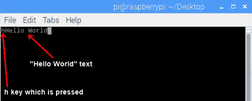

1.  如果要在下一行上打印`Hello World`，您可以在`Hello World`文本之前简单地放置`\n`。这将如下所示：`printw("\nHello World")`。

1.  之后，当您按下一个键时，在`if`条件下方的`getch()`函数将被调用，程序将终止。

# 编译和运行程序

要编译和运行`HelloWorld.cpp`程序，请打开终端窗口。在终端窗口内，输入`ls`并按*Enter*。现在您将看到您的 RPi 内所有文件夹名称的列表：

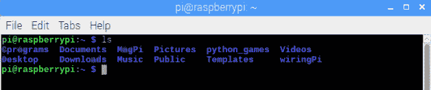

`HelloWorld.cpp`存储在`Cprograms`文件夹中。要打开`Cprograms`文件夹，输入`cd`（更改目录）后跟文件夹名称，然后按*Enter*：

```cpp
cd Cprograms
```

可以看到上一个命令的输出如下：

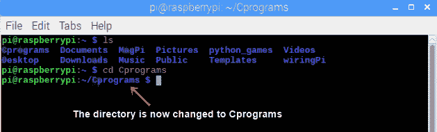

接下来，要查看`Cprograms`文件夹的内容，我们将再次输入`ls`：

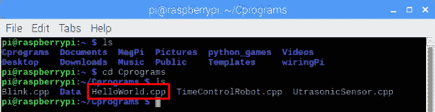

在`Cprograms`文件夹中，有一个`Data`文件夹和一些`.cpp`程序。我们感兴趣的程序是`HelloWorld.cpp`程序，因为我们想要编译和构建这个程序。要执行此操作，请输入以下命令并按*Enter*：

```cpp
gcc -o HelloWorld -lncurses HelloWorld.cpp 
```

以下屏幕截图显示编译成功：

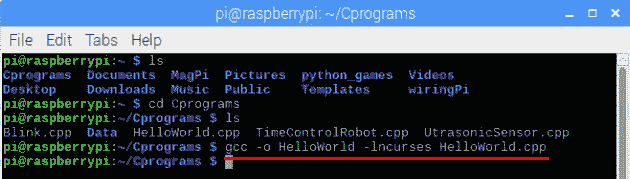

对于任何使用`ncurses`库的代码进行编译，代码如下：

```cpp
gcc -o Programname -lncurses Programname.cpp
```

之后，输入`./HelloWorld`并按*Enter*运行代码：

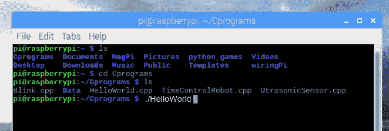

按下*Enter*后，整个终端窗口将被清除：

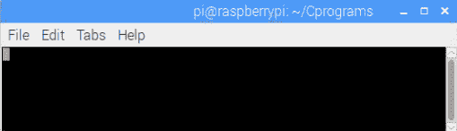

接下来，按下*h*或*H*键，`Hello World`文本将在终端窗口中打印出来。要退出终端窗口，请按任意键：

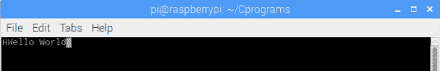

现在我们已经创建了一个简单的`HelloWorld`程序，并测试了`ncurses`库在终端窗口内的工作，让我们编写一个程序来控制 LED 和蜂鸣器。

# 使用 ncurses 控制 LED 和蜂鸣器

在编译和测试您的第一个`ncurses`程序之后，让我们编写一个程序，通过从键盘提供输入来控制 LED 和蜂鸣器。

# 接线连接

对于这个特定的例子，我们将需要两个 LED 和一个蜂鸣器。LED 和蜂鸣器与 RPi 的接线连接如下：

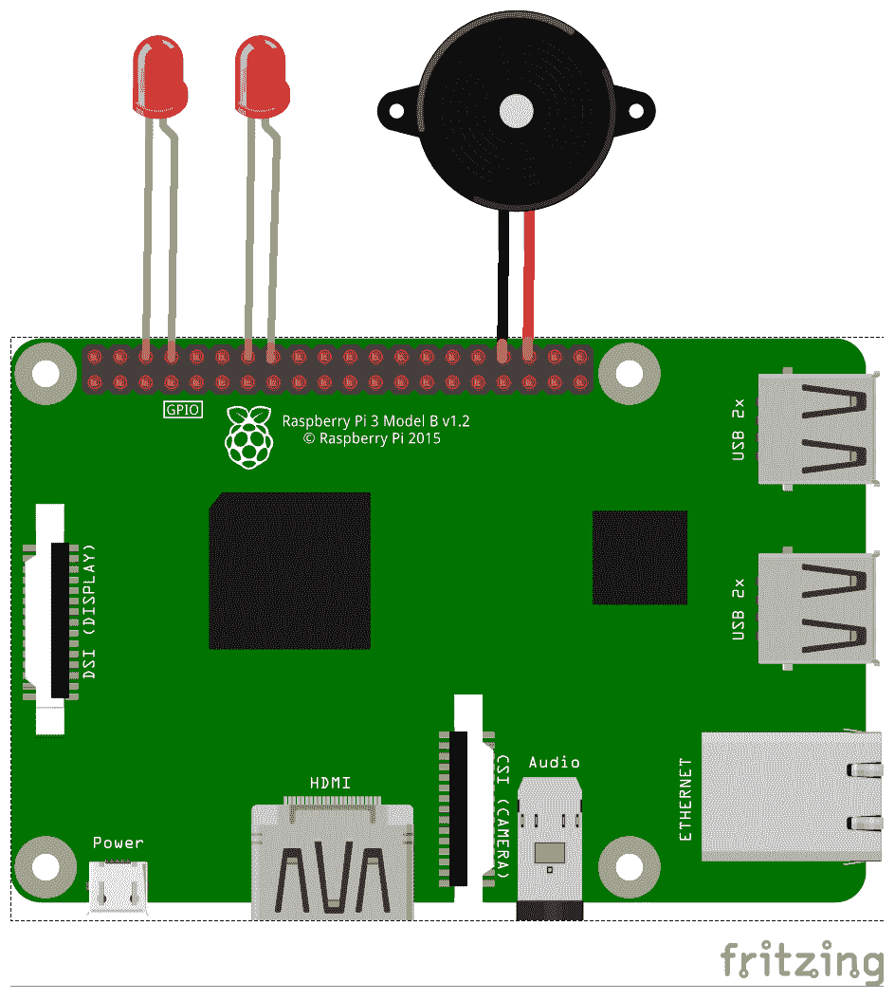

我们可以从连接图中看到以下内容：

+   第一个 LED 的正极（阳极）引脚连接到 wiringPi 引脚号 15，负极（阴极）引脚连接到物理引脚号 6（地引脚）。

+   第二个 LED 的正极引脚连接到 wiringPi 引脚号 4，负极引脚连接到物理引脚号 14（地引脚）。

+   蜂鸣器的一根引脚连接到 wiringPi 引脚号 27，另一根引脚连接到物理引脚号 34（地引脚）。

# 编写 LEDBuzzer.cpp 程序

我们的程序名为`LEDBuzzer.cpp`。`LEDBuzzer.cpp`程序可以从 GitHub 存储库的`Chapter05`文件夹中下载。`LEDBuzzer`程序如下：

```cpp
#include <ncurses.h>
#include <wiringPi.h>
#include <stdio.h>
int main()
{
 wiringPiSetup();

 pinMode(15,OUTPUT); //LED 1 pin
 pinMode(4, OUTPUT); //LED 2 pin
 pinMode(27,OUTPUT); //Buzzer pin

for(;;){

initscr();

int keypressed = getch();

if(keypressed=='L' || keypressed=='l')
{
 digitalWrite(15,HIGH);
 delay(1000);
 digitalWrite(15,LOW);
 delay(1000);
}

if(keypressed== 69 || keypressed=='e')       // 69 is ASCII number for E.
{
 digitalWrite(4,HIGH);
 delay(1000);
 digitalWrite(4,LOW);
 delay(1000);
}

if(keypressed=='D' || keypressed=='d')
{
 digitalWrite(15,HIGH);
 delay(1000);
 digitalWrite(15,LOW);
 delay(1000);
 digitalWrite(4,HIGH);
 delay(1000);
 digitalWrite(4,LOW);
 delay(1000);
}

if(keypressed=='B' || keypressed== 98)        //98 is ASCII number for b
{
 digitalWrite(27,HIGH);
 delay(1000);
 digitalWrite(27,LOW);
 delay(1000);
 digitalWrite(27,HIGH);
 delay(1000);
 digitalWrite(27,LOW);
 delay(1000);
}

if(keypressed=='x' || keypressed =='X')
{
break; 
}

refresh();
}
endwin(); // 
return 0; 
}
```

编写程序后，让我们看看它是如何工作的：

1.  在上述程序中，我们首先声明了`ncurses`和`wiringPi`库，以及`stdio` C 库

1.  接下来，引脚编号`15`，`4`和`7`被声明为输出引脚

1.  现在，当按下*L*或*l*键时，LED 1 将分别在一秒钟内变为`HIGH`和`LOW`

1.  同样，当按下*E*或*e*键时，LED 2 将分别在一秒钟内变为`HIGH`和`LOW`

1.  如果按下*D*或*d*键，LED 1 将分别在一秒钟内变为`HIGH`和`LOW`，然后 LED 2 将分别在一秒钟内变为`HIGH`和`LOW`

1.  如果按下*b*或*B*键，蜂鸣器将响两次

1.  最后，如果按下*x*或*X*键，C++程序将被终止

在编译代码时，您还必须包括`wiringPi`库的名称，即`lwiringPi`。最终的编译命令如下：

```cpp
gcc -o LEDBuzzer -lncurses -lwiringPi LEDBuzzer.cpp
```

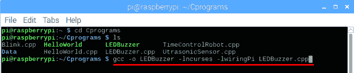

编译代码后，键入`./LEDBuzzer`来运行它：

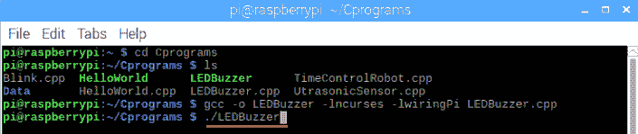

接下来，按下*L*，*E*，*D*和*B*键，LED 和蜂鸣器将相应地打开和关闭。

# 使用笔记本键盘控制一辆漫游车

在控制 LED 和蜂鸣器之后，让我们编写一个程序，从笔记本控制我们的漫游车（机器人）：

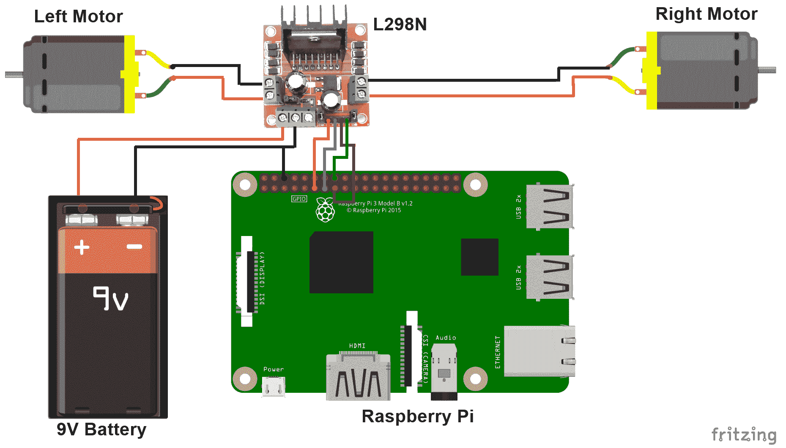

我保持了与第三章中相同的接线连接，*编程机器人*：

+   wiringPi 引脚编号 0 和 2 连接到电机驱动器的**IN1**和**IN2**引脚

+   wiringPi 引脚编号 3 和 4 连接到**IN3**和**IN4**引脚

+   左电机引脚连接到电机驱动器的**OUT1**和**OUT2**引脚

+   右电机引脚连接到电机驱动器的**OUT3**和**OUT4**引脚

+   树莓派的引脚 6 连接到电机驱动器的地线插座

# 构建一个由笔记本控制的漫游车程序

如果您已经理解了前两个程序，那么现在您可能已经找到了我们笔记本控制的漫游车代码。在这个程序中，我们将使用上、下、左和右箭头键以及*A*、*S*、*X*、*W*和*D*键将机器人向前、向后、向左和向右移动。为了识别来自箭头键的输入，我们需要在程序中包含`keypad()`函数。`Laptop_Controlled_Rover.cpp`程序可以从`GitHub`存储库的`Chapter05`文件夹中下载：

```cpp

int main()
{
...
for(;;)
{
initscr(); 
keypad(stdscr,TRUE);
refresh(); 
int keypressed = getch(); 
if(keypressed==KEY_UP || keypressed == 'W' || keypressed == 'w') 
//KEY_UP command is for UP arrow key
{
printw("FORWARD");
digitalWrite(0,HIGH);
digitalWrite(2,LOW);
digitalWrite(3,HIGH);
digitalWrite(4,LOW);
}
if(keypressed==KEY_DOWN || keypressed == 'X' || keypressed == 'x')
//KEY_DOWN is for DOWN arrow key
{
printw("BACKWARD")
digitalWrite(0,LOW);
digitalWrite(2,HIGH);
digitalWrite(3,LOW);
digitalWrite(4,HIGH);
}

if(keypressed==KEY_LEFT || keypressed == 'A' || keypressed == 'a')
{
//KEY_LEFT is for LEFT arrow key
printw("LEFT TURN");
digitalWrite(0,LOW);
digitalWrite(2,HIGH);
digitalWrite(3,HIGH);
digitalWrite(4,LOW);
}

if(keypressed==KEY_RIGHT || keypressed == 'D' || keypressed == 'd')
{
//KEY_RIGHT is for right arrow keys
printw("RIGHT TURN");
digitalWrite(0,HIGH);
digitalWrite(2,LOW);
digitalWrite(3,LOW);
digitalWrite(4,HIGH);
}

if(keypressed=='S' || keypressed=='s')
{
printw("STOP");
digitalWrite(0,HIGH);
digitalWrite(2,HIGH);
digitalWrite(3,HIGH);
digitalWrite(4,HIGH);
}

if(keypressed=='E' || keypressed=='e')
{
break; 
}
}
endwin(); 
return 0; 
}
```

上述程序可以解释如下：

1.  在上述程序中，如果按下上箭头键，这将被`if`条件内的`KEY_UP`代码识别。如果条件为`TRUE`，机器人将向前移动，并且终端中将打印`FORWARD`。类似地，如果按下*W*或*w*键，机器人也将向前移动。

1.  如果按下下箭头键（`KEY_DOWN`）或*X*或*x*键，机器人将向后移动，并且终端中将打印`BACKWARD`。

1.  如果按下左箭头键（`KEY_LEFT`）或*A*或*a*键，机器人将向左转，终端中将打印`LEFT TURN`。

1.  如果按下右箭头键（`KEY_RIGHT`）或*D*或*d*键，机器人将向右转，终端中将打印`RIGHT TURN`。

1.  最后，如果按下*S*或*s*键，机器人将停止，并且终端中将打印`STOP`。

1.  要终止代码，我们可以按下*E*或*e*键。由于我们没有提供任何时间延迟，机器人将无限期地保持移动，除非您使用*S*或*s*键停止机器人。

在测试代码时，将树莓派连接到移动电源，这样你的机器人就完全无线，可以自由移动。

# 追踪一个正方形路径

在将机器人移动到不同方向后，让我们让机器人追踪一个正方形路径。为此，我们的机器人将按以下方式移动：向前->右转->向前->右转->向前->右转->向前->停止：

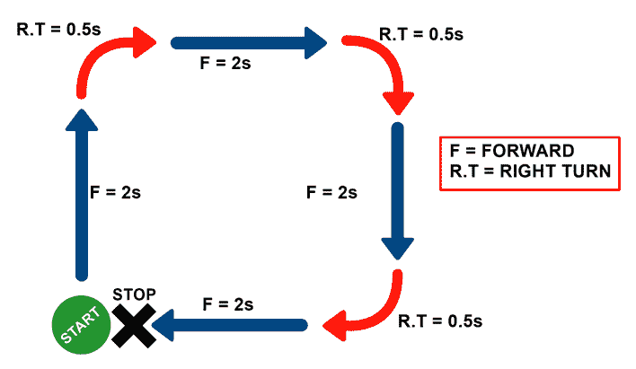

在`LaptopControlRover`程序中，我们将创建另一个`if`条件。在这个`if`条件内，我们将编写一个程序来使机器人追踪一个正方形路径。`if`条件将如下所示：

```cpp
if(keypressed == 'r' || keypressed == 'R')
{
forward(); //first forward movement
delay(2000);
rightturn(); //first left turn
delay(500); //delay needs to be such that the robot takes a perfect 90º right turn

forward(); //second forward movement
delay(2000);
rightturn(); //second right turn
delay(500);

forward(); //third forward movement
delay(2000);
rightturn(); //third and last left turn
delay(500);

forward(); //fourth and last forward movement
delay(2000);
stop(); //stop condition
}
```

为了追踪正方形路径，机器人将向前移动四次。它将右转三次，最后停下来。在`main`函数之外，我们需要创建`forward()`，`rightturn()`和`stop()`函数，这样，我们可以简单地调用必要的函数，而不是在主函数中多次编写`digitalWrite`代码。

| **向前条件** | **右转** | **停止** |
| --- | --- | --- |

|

```cpp
void forward()
{
digitalWrite(0,HIGH);
 digitalWrite(2,LOW);
 digitalWrite(3,HIGH);
 digitalWrite(4,LOW);
}
```

|

```cpp
void rightturn()
{
digitalWrite(0,HIGH); 
 digitalWrite(2,LOW); 
 digitalWrite(3,LOW); 
 digitalWrite(4,HIGH);
}
```

|

```cpp
void stop()
{
digitalWrite(0,HIGH); 
 digitalWrite(2,HIGH); 
 digitalWrite(3,HIGH); 
 digitalWrite(4,HIGH);
}
```

|

这是我们如何使用笔记本电脑控制机器人，借助键盘按键的帮助。接下来，让我们看看第二种技术，我们将使用 QT5 创建 GUI 按钮。当按下这些按钮时，机器人将朝不同的方向移动。

# 安装和设置 QT5

QT 是一个跨平台应用程序框架，通常用于嵌入式图形用户界面。QT 的最新版本是 5，因此也被称为 QT5。要在我们的 RPi 内安装 QT5 软件，打开终端窗口并输入以下命令：

```cpp
sudo apt-get install qt5-default
```

上述命令的输出如下截图所示：

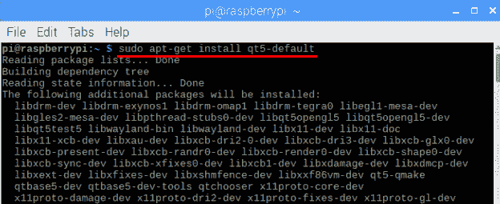

这个命令将下载在后台运行的必要的`qt5`文件。接下来，要下载和安装 QT5 IDE，输入以下命令：

```cpp
sudo apt-get install qtcreator
```

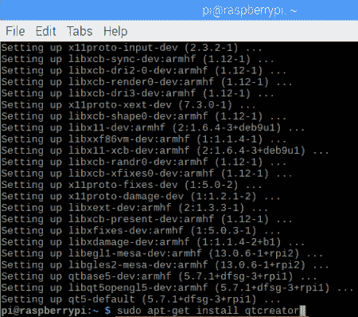

QT5 IDE 的安装将需要大约 10 到 15 分钟，具体取决于您的互联网速度。如果在安装 QT5 时遇到任何问题，请尝试更新和升级您的 RPi。要做到这一点，请在终端窗口中输入以下命令：

```cpp
sudo apt-get update
sudo apt-get upgrade -y
```

# 设置 QT5

在 QT5 中编写任何程序之前，我们首先需要设置它，以便它可以运行 C++程序。要打开 QT5，点击树莓图标，转到“编程”，然后选择“Qt Creator”：

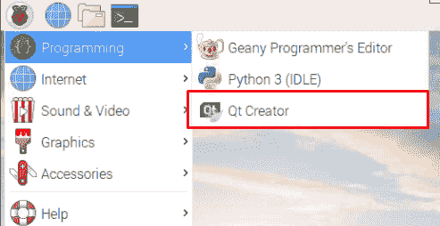

QT5 在 RPi 上运行速度较慢，因此打开 IDE 需要一些时间。点击工具，然后选择“选项...”：

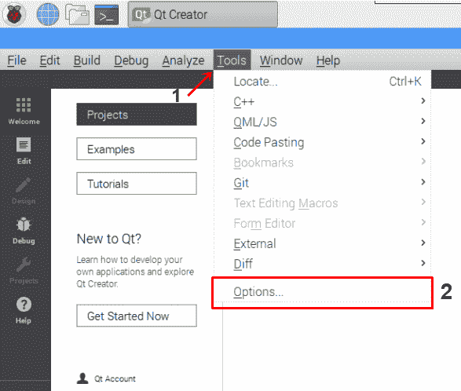

在“选项...”中，点击设备，确保类型设置为桌面。名称应为“本地 PC”，这是指 RPi：

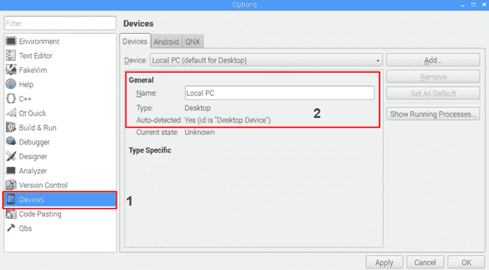

之后，点击“构建和运行”选项。接下来，选择“工具包”选项卡，点击“桌面”（默认）选项：

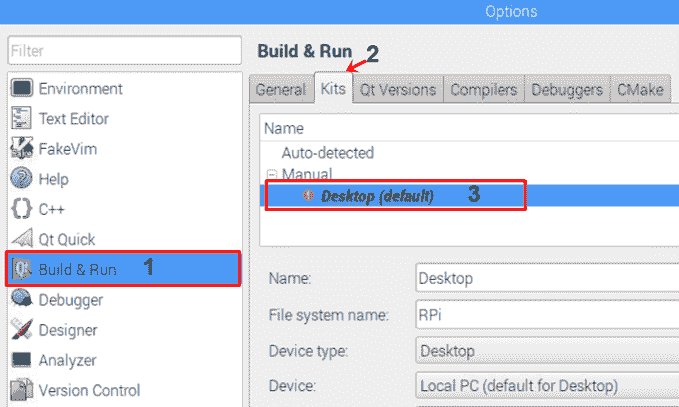

选择“构建和运行”选项后，我们需要进行一些修改：

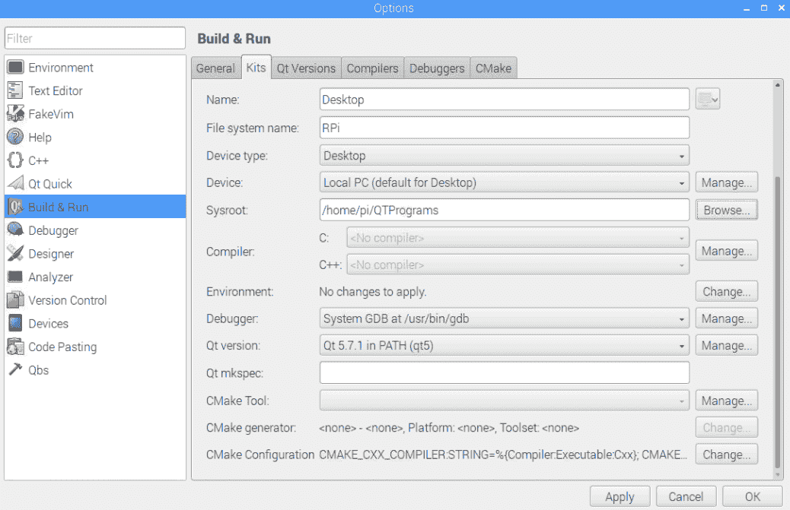

让我们逐步看修改：

1.  保持名称为“桌面”。

1.  将文件系统的名称设置为`RPi`。

1.  在设备类型中，选择桌面选项。

1.  系统根（系统根）默认设置为`/home/pi`，这意味着当我们创建新的 QT5 应用程序时，它将被创建在`pi`文件夹内。现在，我们将在`pi`文件夹内创建一个名为`QTPrograms`的新文件夹，而不是在`pi`文件夹中创建我们的 QT 项目。要更改文件夹目录，点击“浏览”按钮。之后，点击文件夹选项。将此文件夹命名为`QTPrograms`，或者您想要的任何其他名称。选择`QTPrograms`文件夹，然后选择“选择”按钮：

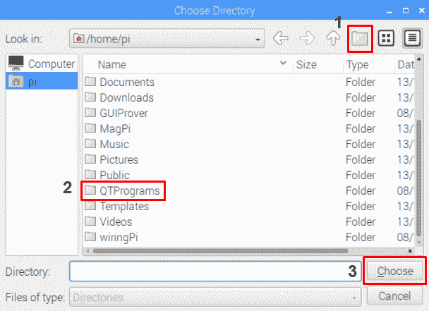

1.  接下来，我们必须将编译器设置为 GCC。要做到这一点，点击编译器选项卡。在里面，点击“添加”下拉按钮。转到 GCC 并选择 C++选项：

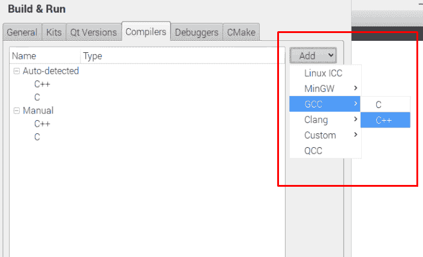

现在，在 C++选项下，您将看到 GCC 编译选项：

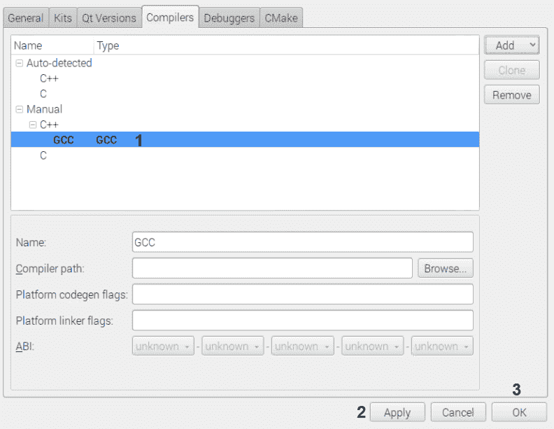

之后，点击 Apply 按钮应用更改，然后点击 OK 按钮。接下来，再次点击 Tools，打开 Options。在 Build and run 选项内，选择 Kits 选项卡，再次选择 Desktop 选项。这次，在 C++选项旁边，您将看到一个下拉选项。点击这个选项，选择 GCC 编译器：

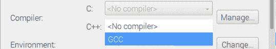

1.  接下来，检查调试器选项。它应该设置为位于/usr/bin/gdb 的 System GDB。

1.  最后，检查 QT5 版本。目前，我正在使用最新版本的 QT，即 5.7.1。当您阅读到这一章时，最新版本可能已经更新。

进行这些更改后，点击 Apply，然后点击 OK。在设置 QT5 之后，让我们编写我们的第一个程序，使用 GUI 按钮来打开和关闭 LED。

# 使用 GUI 按钮控制 LED

在本节中，我们将创建一个简单的 QT5 程序，通过 GUI 按钮来控制 LED 的开关。对于这个项目，您将需要两个 LED：

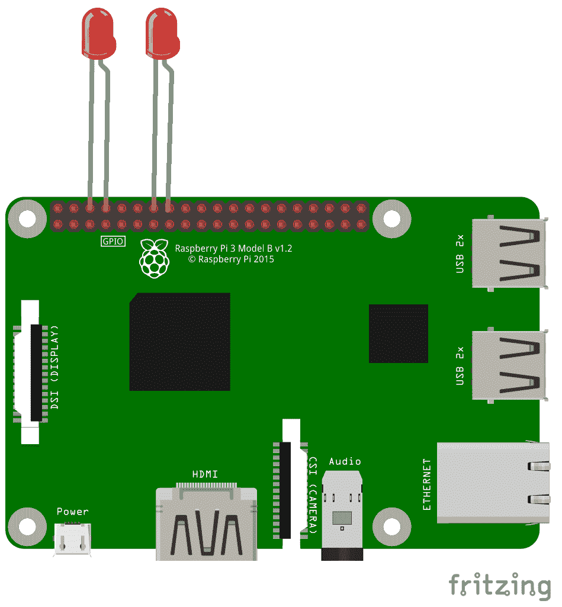

LED 的接线与`LEDBuzzer`项目中的完全相同：

+   第一个 LED 的阳极（正极）引脚连接到 wiringPi 引脚号 0，阴极（负极）引脚连接到物理引脚号 9（地线引脚）

+   第二个 LED 的阳极引脚连接到 wiringPi 引脚号 2，阴极引脚连接到物理引脚号 14（地线引脚）

# 创建 QT 项目

用于打开和关闭 LED 的 QT5 项目称为`LedOnOff`。您可以从 GitHub 存储库的`Chapter05`文件夹中下载此项目。下载`LedOnOff`项目文件夹后，打开`LedOnOff.pro`文件以在 QT5 IDE 中查看项目。

按照以下步骤在 QT5 IDE 中创建项目：

1.  点击 File 选项，然后点击 New File or Project...：

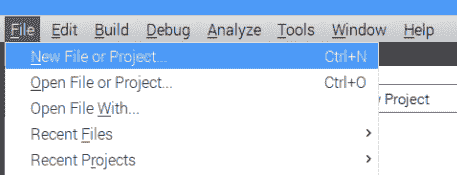

1.  接下来，选择 QT Widgets Application 选项，然后点击 Choose 按钮：

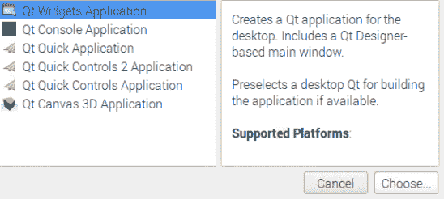

1.  之后，给您的项目命名。我将我的项目命名为`LEDOnOff`。之后，将目录更改为`QTPrograms`，以便在此文件夹中创建项目，然后点击 Next：

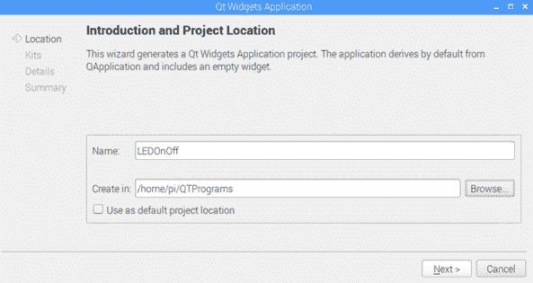

1.  保持 Desktop 选项选中，然后点击 Next：

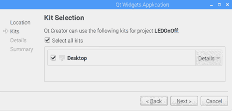

1.  现在您应该看到某些文件名，这些是项目的一部分。保持名称不变，然后点击 Next：

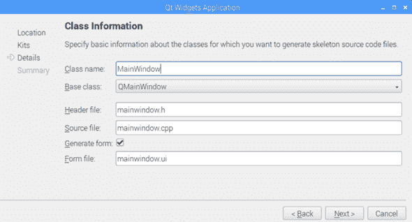

1.  最后，您将看到一个摘要窗口，其中将显示将要创建的所有文件的摘要。我们不需要在此窗口中进行任何更改，因此点击 Finish 创建项目：

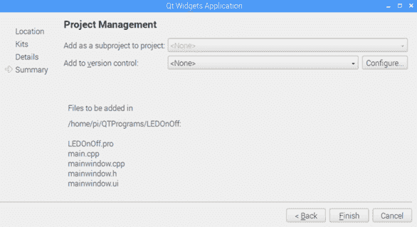

在 IDE 的左侧，您将看到设计、C++和头文件。首先，我们将打开`LEDOnOff.pro`文件并添加`wiringPi`库的路径。在文件底部，添加以下代码：

```cpp
LIBS += -L/usr/local/lib -lwiringPi
```

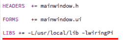

接下来，打开`Forms`文件夹内的`mainwindow.ui`文件。`mainwindow.ui`文件是设计文件，我们将在其中设计 GUI 按钮：

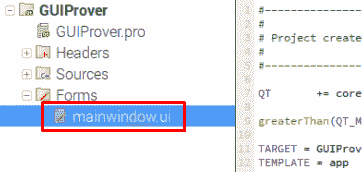

`mainwindow.ui`文件将在 Design 选项卡中打开。在 Design 选项卡的左侧是小部件框，其中包含按钮、列表视图和布局等小部件。中间是设计区域，我们将在其中拖动 UI 组件。在右下角，显示所选 UI 组件的属性：

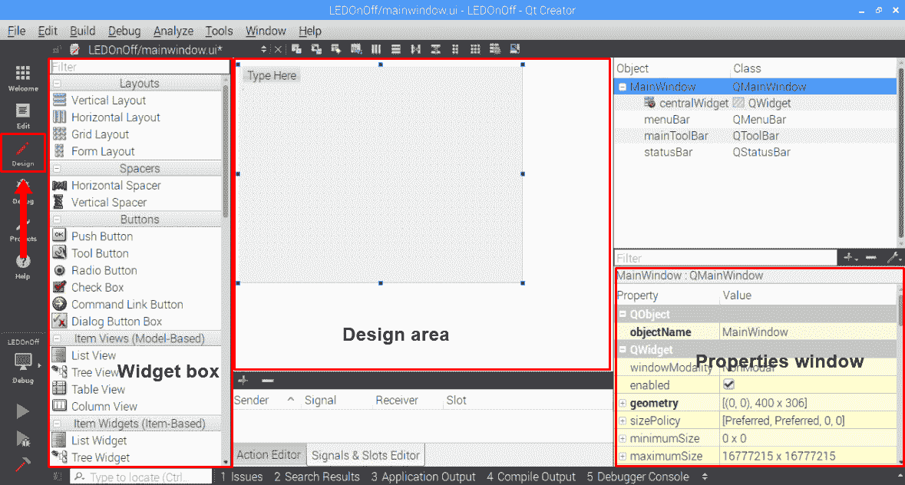

接下来，要创建 GUI 按钮，将 Push Button 小部件拖到设计区域内。双击按钮，将文本更改为`ON`。之后，选中 Push Button，将 objectName（在属性窗口内）更改为`on`：

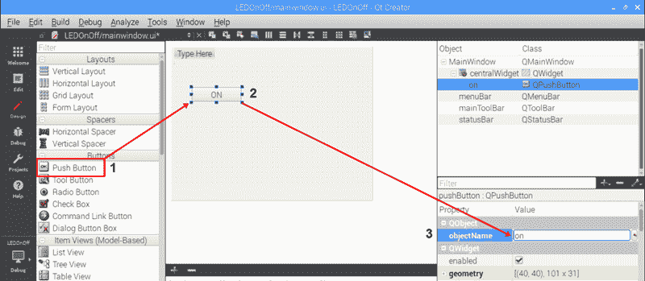

之后，添加两个按钮。将一个按钮的名称设置为`OFF`，**objectName**设置为`off`。将另一个按钮的名称设置为`ON / OFF`，**objectName**设置为`onoff`：

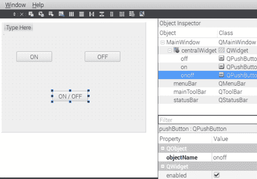

我们可以使用两种不同类型的按钮函数来打开和关闭 LED：

+   `clicked()`: `clicked`按钮函数将在按钮被点击时立即执行。

+   `pressed()`和`released()`: `pressed`按钮函数会在您按住或按住按钮时一直执行。当我们使用`pressed`函数时，我们还必须使用`released()`函数。释放的函数包含指示按钮释放时应发生的操作的代码。

我们将把`clicked()`函数链接到**ON**和**OFF**按钮，并将`pressed()`和`released()`函数链接到**ON/OFF**按钮。接下来，要将`clicked()`函数链接到**ON**按钮，右键单击**ON**按钮，选择 Go to slot...选项，然后选择`clicked()`函数。然后，按下 OK：

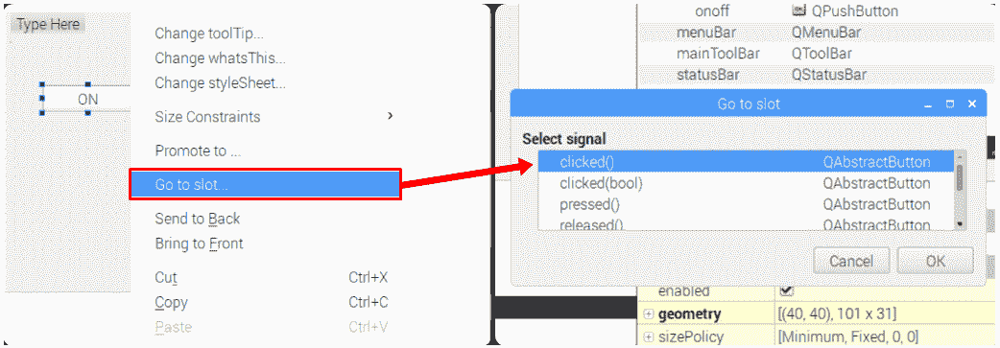

现在，一旦您选择`clicked()`函数，`mainwindow.cpp`文件（此文件位于`Sources`文件夹中）中将创建一个名为`on_on_clicked()`（`on_buttonsobjectname_clicked`）的点击函数。在此函数中，我们将编写打开 LED 的程序。但在此之前，我们需要在`mainwindow.h`文件中声明`wiringPi`库和引脚。此文件位于`Headers`文件夹中：

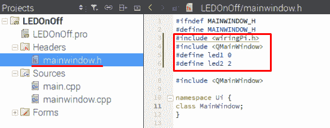

我们还需要声明`QMainWindow`库，它将创建一个包含我们按钮的窗口。接下来，我已将`led1`引脚设置为引脚`0`，将`led2`引脚设置为引脚`2`。之后，再次打开`mainwindow.cpp`文件。然后我们将执行以下操作：

1.  首先，我们将声明`wiringPiSetup();`函数

1.  接下来，我们将把`led1`和`led2`设置为`OUTPUT`引脚

1.  最后，在`on_on_clicked()`函数中，将`led1`和`led2`引脚设置为`HIGH`：

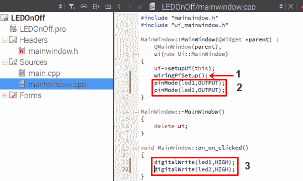

接下来，要关闭 LED 灯，再次打开`mainwindow.ui`文件，右键单击关闭按钮，选择 Go to slot...，然后再次选择`clicked()`函数。在`mainwindow.cpp`文件中，将创建一个名为`on_off_clicked`的新函数。在此函数中，我们将编写关闭 LED 灯的程序。

要编程 ON/OFF 按钮，右键单击它，选择 Go to slot...，然后选择`pressed()`函数。将在`mainwindow.ui`文件中创建一个名为`on_onoff_pressed()`的新函数。接下来，右键单击**ON/OFF**按钮，选择 Go to slot...，然后选择`released()`函数。现在将创建一个名为`on _onoff_released()`的新函数。

在`on_onoff_pressed()`函数中，我们将编写一个程序来打开 LED 灯。在`on_onoff_released()`函数中，我们将编写一个程序来关闭 LED 灯：

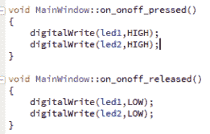

在运行代码之前，单击文件，然后单击全部保存。接下来，要构建和运行代码，请单击构建，然后单击运行选项。MainWindow 出现需要大约 30 到 40 秒，在主窗口中，您将看到以下 GUI 按钮：

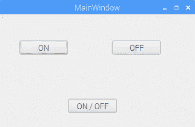

现在，当您点击 ON 按钮时，LED 将打开。当您点击 OFF 按钮时，LED 将关闭。最后，当您按住**ON / OFF**按钮时，LED 将一直打开，直到您松开为止，然后它们将关闭。

# 处理错误

在控制台中，您可能会看到一些次要错误。如果主窗口已打开，您可以忽略这些错误：

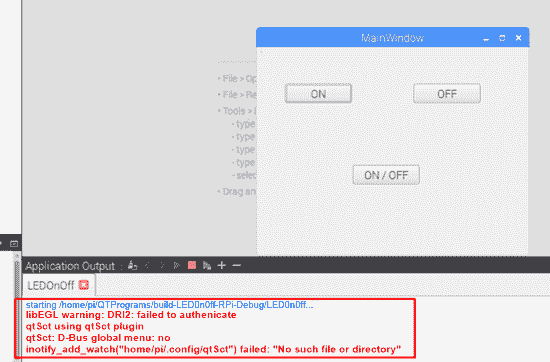

当您打开 Qt Creator IDE 时，GCC 编译器可能会不断重置。因此，在运行项目后，您将收到以下错误：

```cpp
Error while building/deploying project LEDOnOff (kit: Desktop)
 When executing step "qmake"
```

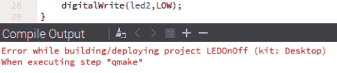

如果您遇到此错误，请转到工具，然后选项，并将 C++编译器设置为 GCC，如“设置 QT5”部分的*步骤 5*中所示。

# 使用 QT5 控制笔记本电脑的小车

现在我们可以控制 LED 灯，让我们看看如何使用 QT5 控制小车。在 Qt Creator IDE 中，创建一个新项目并命名为`QTRover`。您可以从本章的 GitHub 存储库中下载`QTRover`项目文件夹。我们现在可以使用`clicked()`函数和`pressed()`和`released()`函数来创建这个`QTRover`项目。为此，我们有以下选项：

1.  如果我们只使用`clicked()`函数创建这个项目，我们需要创建五个按钮：前进、后退、左转、右转和停止。在这种情况下，我们需要每次按下停止按钮来停止机器人。

1.  如果我们只使用`pressed()`和`released()`函数创建这个项目，我们只需要创建四个按钮：前进、后退、左转和右转。在这种情况下，我们不需要停止按钮，因为当按钮释放时，小车会停止。

1.  或者，我们也可以使用`clicked()`、`pressed()`和`released()`函数的组合，其中前进、后退和停止按钮将链接到`clicked()`函数，左右按钮将链接到`pressed()`和`released()`函数。

在这个项目中，我们将选择第三个选项，即`clicked()`、`pressed()`和`released()`函数的组合。在创建这个项目之前，我们将关闭`LEDOnOff`项目，因为如果`LEDOnOff`和`QTRover`项目都保持打开状态，有可能如果您在一个项目中进行 UI 更改，代码可能会在另一个项目中更改，从而影响到您的两个项目文件。要关闭`LEDOnOff`项目，请右键单击它，然后选择关闭项目`LEDOnOff`选项。

接下来，在`QTRover.pro`文件中添加`wiringPi`库路径：

```cpp
LIBS += -L/usr/local/lib -lwiringPi
```

之后，打开`mainwindow.ui`文件并创建五个按钮。将它们标记为`FORWARD`、`BACKWARD`、`LEFT`、`RIGHT`和`STOP`：

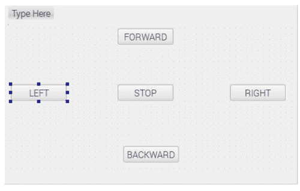

将按钮对象的名称设置如下：

+   将`FORWARD`按钮对象名称设置为 forward

+   将`BACKWARD`按钮对象名称设置为 backward

+   将`LEFT`按钮对象名称设置为 left

+   将`RIGHT`按钮对象名称设置为 right

+   将`STOP`按钮对象名称设置为 stop

之后，右键单击前进、后退和停止按钮，并将`clicked()`函数添加到这三个按钮。同样，右键单击左和右按钮，并将`pressed()`和`released()`函数添加到这些按钮。

接下来，打开`mainwindow.h`文件并声明`wiringPi`和`QMainWindow`库。还要声明四个`wiringPi`引脚号。在我的情况下，我使用引脚号`0`、`2`、`3`和`4`：

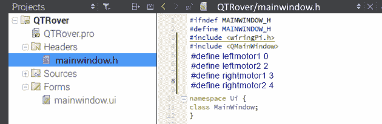

在`mainwindow.cpp`文件内，我们将有三个`on_click`函数来向前移动（`on_forward_clicked`）、向后移动（`on_backward_clicked`）和停止（`on_stop_clicked`）。

我们还有两个`on_pressed`和`on_released`函数用于左（`on_left_pressed`和`on_left_released`）和右（`on_right_pressed`和`on_right_released`）按钮。

以下步骤描述了移动机器人在不同方向上所需的步骤：

1.  在`on_forward_clicked()`函数内，我们将编写程序来使机器人向前移动：

```cpp
digitalWrite(leftmotor1, HIGH);
digitalWrite(leftmotor2, LOW);
digitalWrite(rightmotor1, HIGH);
digitalWrite(rightmotor2, LOW);
```

1.  接下来，在`on_backward_clicked()`函数内，我们将编写程序来使机器人向后移动：

```cpp
digitalWrite(leftmotor1, HIGH);
digitalWrite(leftmotor2, LOW);
digitalWrite(rightmotor1, HIGH);
digitalWrite(rightmotor2, LOW);
```

1.  之后，在`on_left_pressed()`函数内，我们将编写程序来进行轴向左转或径向左转：

```cpp
digitalWrite(leftmotor1, LOW);
digitalWrite(leftmotor2, HIGH);
digitalWrite(rightmotor1, HIGH);
digitalWrite(rightmotor2, LOW);
```

1.  然后，在`on_right_pressed()`函数内，我们将编写程序来进行轴向右转或径向右转：

```cpp
digitalWrite(leftmotor1, HIGH);
digitalWrite(leftmotor2, LOW);
digitalWrite(rightmotor1, LOW);
digitalWrite(rightmotor2, HIGH);
```

1.  在`on_stop_clicked()`函数内，我们将编写程序来停止机器人：

```cpp
digitalWrite(leftmotor1, HIGH);
digitalWrite(leftmotor2, HIGH);
digitalWrite(rightmotor1, HIGH);
digitalWrite(rightmotor2, HIGH);
```

完成代码后，保存所有文件。之后，运行程序并测试最终输出。运行代码后，您将看到带有向前、向后、向左、向右和停止按钮的主窗口。按下每个 GUI 按钮以使机器人朝所需方向移动。

# 总结

在本章中，我们看了两种不同的技术来使用笔记本电脑控制机器人。在第一种技术中，我们使用`ncurses`库从键盘接收输入，以相应地移动机器人。在第二种技术中，我们使用 QT Creator IDE 创建 GUI 按钮，然后使用这些按钮来使机器人朝不同方向移动。

在下一章中，我们将在树莓派上安装 OpenCV 软件。之后，我们将使用树莓派摄像头记录图片和视频。

# 问题

1.  `ncurses`程序应该在哪两个函数之间编写？

1.  `initscr()`函数的目的是什么？

1.  如何在终端窗口中编译`ncurses`代码？

1.  我们在 QT Creator 中使用了哪个 C++编译器？

1.  你会使用哪个按钮功能或功能来在按下按钮时使机器人向前移动？
