# 第六章：使用 OpenCV 访问 RPi 相机

我们可以使用树莓派连接到外部 USB 网络摄像头或**树莓派相机**（**RPi 相机**）来识别对象和人脸，这是树莓派最令人兴奋的事情之一。

为了处理来自相机的输入，我们将使用 OpenCV 库。由于安装 OpenCV 需要很长时间并涉及多个步骤，本章将专门用于让您开始运行。

在本章中，您将探索以下主题：

+   在树莓派上安装 OpenCV 4.0.0

+   启用并连接 RPi 相机到 RPi

+   使用 RPi 相机捕获图像和视频

+   使用 OpenCV 读取图像

# 技术要求

在本章中，您将需要以下内容：

+   树莓派相机模块-截至 2019 年，最新的 RPi 相机模块称为**RPi 相机 V2 1080P**

+   树莓派相机外壳（安装支架）

本章的代码文件可以从[`github.com/PacktPublishing/Hands-On-Robotics-Programming-with-Cpp/tree/master/Chapter06`](https://github.com/PacktPublishing/Hands-On-Robotics-Programming-with-Cpp/tree/master/Chapter06)下载。

# 在树莓派上安装 OpenCV 4.0.0

**开源计算机视觉库**（**OpenCV**）是一个开源的计算机视觉和机器学习库。OpenCV 库包括 2500 多个计算机视觉和机器学习算法，可用于识别对象、检测颜色和跟踪现实生活中或视频中的运动物体。OpenCV 支持 C++、Python 和 Java 编程语言，并可以在 Windows、macOS、Android 和 Linux 上运行。

在树莓派上安装 OpenCV 是一个耗时且冗长的过程。除了 OpenCV 库，我们还必须安装多个库和文件，以使其正常工作。安装 OpenCV 的步骤将在我运行 Raspbian Stretch 的树莓派 3B+型号上执行。我们要安装的 OpenCV 版本是 OpenCV 4.0.0。

在安装 OpenCV 时，我们将下载多个文件。如果您住在大房子里，请确保您坐在 Wi-Fi 路由器附近，以便 RPi 接收良好的信号强度。如果 RPi 离 Wi-Fi 很远，下载速度可能会受到影响，安装 OpenCV 可能需要更长的时间。我在我的 RPi 3B+上安装 OpenCV 大约花了 3 个小时，下载速度大约为 500-560 Kbps。

# 卸载 Wolfram 和 LibreOffice

如果您使用 32GB 的 microSD 卡，Raspbian Stretch 将只占用存储空间的 15%，但如果您使用 8GB 的 microSD 卡，它将占用 50%的空间。如果您使用 8GB 的 microSD 卡，您需要释放一些空间。您可以通过卸载一些未使用的应用程序来实现。其中两个应用程序是 Wolfram 引擎和 LibreOffice。

在 Raspbian Stretch 上卸载应用程序很容易。您只需要在终端窗口中输入一个命令。让我们从卸载 Wolfram 引擎开始：

```cpp
sudo apt-get purge wolfram-engine -y
```

接下来，使用相同的命令卸载 LibreOffice：

```cpp
sudo apt-get purge libreoffice* -y
```

卸载两个软件后，我们可以使用两个简单的命令进行清理：

```cpp
sudo apt-get clean
sudo apt-get autoremove -y
```

现在我们已经释放了一些空间，让我们更新 RPi。

# 更新您的 RPi

更新您的 RPi 涉及一些简单的步骤：

1.  打开终端窗口，输入以下命令：

```cpp
sudo apt-get update 
```

1.  通过输入以下命令升级 RPi：

```cpp
sudo apt-get upgrade -y
```

1.  重新启动 RPi：

```cpp
sudo shutdown -r now
```

一旦您的 RPi 重新启动，再次打开终端窗口。

在终端窗口运行某些命令时，您可能会收到提示，询问您是否要继续。在此过程的命令中，我们已经添加了`-y`命令（在行的末尾），它将自动应用**yes**命令到提示。

# 安装 cmake、image、video 和 gtk 软件包

`cmake`是一个配置实用程序。使用`cmake`，我们可以在安装后配置不同的 OpenCV 和 Python 模块。要安装`cmake`软件包，请输入以下命令：

```cpp
sudo apt-get install build-essential cmake pkg-config -y
```

接下来，要安装图像 I/O 软件包，请输入以下命令：

```cpp
sudo apt-get install libjpeg-dev libtiff5-dev libjasper-dev libpng12-dev -y
```

之后，我们将通过输入以下命令安装两个视频 I/O 软件包：

```cpp
sudo apt-get install libavcodec-dev libavformat-dev libswscale-dev libv4l-dev -y
sudo apt-get install libxvidcore-dev libx264-dev -y
```

接下来，我们将下载并安装**Gimp Toolkit**（**GTK**）软件包。此工具包用于为我们的程序制作图形界面。我们将执行以下命令来下载和安装 GTK 软件包：

```cpp
sudo apt-get install libgtk2.0-dev libgtk-3-dev -y
sudo apt-get install libatlas-base-dev gfortran -y
```

# 下载和解压 OpenCV 4.0 及其贡献存储库

安装了这些软件包后，我们可以继续进行 OpenCV。让我们开始下载 Open CV 4.0：

1.  在终端窗口中输入以下命令：

```cpp
wget -O opencv.zip https://github.com/opencv/opencv/archive/4.0.0.zip
```

1.  下载包含一些附加模块的`opencv_contrib`存储库。输入以下命令：

```cpp
wget -O opencv_contrib.zip https://github.com/opencv/opencv_contrib/archive/4.0.0.zip
```

*步骤 1*和*步骤 2*中的命令都是单行命令。

1.  使用以下命令解压`opencv.zip`文件：

```cpp
unzip opencv.zip
```

1.  解压`opencv_contrib.zip`文件：

```cpp
unzip opencv_contrib.zip
```

解压`opencv`和`opencv_contrib`后，您应该在`pi`文件夹中看到`opencv-4.0.0`和`opencv_contrib-4.0.0`文件夹。

# 安装 Python

接下来，我们将安装 Python 3 及其一些支持工具。即使我们将使用 C++编程 OpenCV，安装并链接 Python 包与 OpenCV 仍然是一个好主意，这样您就可以选择使用 OpenCV 编写或编译 Python 代码。

要安装 Python 及其开发工具，请输入以下命令：

```cpp
sudo apt-get install python3 python3-setuptools python3-dev -y
wget https://bootstrap.pypa.io/get-pip.py
sudo python3 get-pip.py
sudo pip3 install numpy
```

安装 Python 软件包后，我们可以编译和构建 OpenCV。

# 编译和安装 OpenCV

要编译和安装 OpenCV，我们需要按照以下步骤进行：

1.  进入`opencv-4.0.0`文件夹。使用以下命令更改目录到`opencv-4.0.0`文件夹：

```cpp
cd opencv-4.0.0
```

1.  在此文件夹中创建一个`build`文件夹。为此，请输入以下命令：

```cpp
mkdir build
```

1.  要打开`build`目录，请输入以下命令：

```cpp
cd build
```

1.  更改目录到`build`后，输入以下命令：

```cpp
cmake -D CMAKE_BUILD_TYPE=RELEASE \
-D CMAKE_INSTALL_PREFIX=/usr/local \
-D BUILD_opencv_java=OFF \
-D BUILD_opencv_python2=OFF \
-D BUILD_opencv_python3=ON \
-D PYTHON_DEFAULT_EXECUTABLE=$(which python3) \
-D INSTALL_C_EXAMPLES=ON \
-D INSTALL_PYTHON_EXAMPLES=ON \
-D BUILD_EXAMPLES=ON\
-D OPENCV_EXTRA_MODULES_PATH=~/opencv_contrib-4.0.0/modules \
-D WITH_CUDA=OFF \
-D BUILD_TESTS=OFF \
-D BUILD_PERF_TESTS= OFF ..
```

在输入此命令时，请确保在终端窗口中输入两个点`..`。

1.  要启用 RPi 的所有四个内核，请在 nano 编辑器中打开`swapfile`文件：

```cpp
sudo nano /etc/dphys-swapfile
```

1.  在此文件中，搜索`CONF_SWAPSIZE=100`代码，并将值从`100`更改为`1024`：

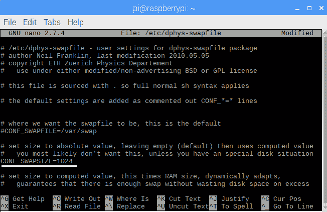

1.  按下*Ctrl* + *O*保存此文件。您将在文件底部收到提示，询问您是否要保存此文件。按*Enter*，然后按*Ctrl *+ *X*退出。

1.  要应用这些更改，请输入以下两个命令：

```cpp
sudo /etc/init.d/dphys-swapfile stop
sudo /etc/init.d/dphys-swapfile start
```

1.  要使用 RPi 的所有四个内核编译 OpenCV，请输入以下命令：

```cpp
make -j4
```

这是最耗时的步骤，需要 1.5 到 2 小时。如果在编译时遇到任何错误，请尝试使用单个内核进行编译。

要使用单个内核进行编译，请输入以下命令：

```cpp
sudo make install
make
```

只有在使用`make -j4`命令时遇到错误时才使用前面的两个命令。

1.  要安装 OpenCV 4.0.0，请输入以下命令：

```cpp
sudo make install
sudo ldconfig 
```

我们现在已经编译并安装了 OpenCV。让我们将其连接到 Python。

# 将 OpenCV 链接到 Python

让我们按照以下步骤将 OpenCV 链接到 Python：

1.  打开`python 3.5`文件夹(`/usr/local/python/cv2/python-3.5`)：

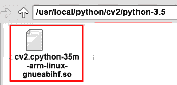

在此文件夹中，您应该看到一个名为`cv2.so`或`cv2.cpython-35m-arm-linux-gnueabihf.so`的文件。如果文件名是`cv2.so`，则无需进行任何更改。如果文件名是`cv2.cpython-35m-arm-linux-gnueabihf.so`，则必须将其重命名为`cv2.so`。要重命名此文件，请输入以下命令更改目录到`python 3.5`：

```cpp
cd /usr/local/python/cv2/python-3.5
```

将此文件从`cv2.cpython-35m-arm-linux-gnueabihf.so`重命名为`cv2.so`，输入以下命令：

```cpp
sudo mv /usr/local/python/cv2/python3.5/cv2.cpython-35m-arm-linux-gnueabihf.so cv2.so
```

1.  使用以下命令将此文件移动到`dist-package`文件夹(`/usr/local/lib/python3.5/dist-packages/`)：

```cpp
sudo mv /usr/local/python/cv2/python-3.5/cv2.so /usr/local/lib/python3.5/dist-packages/cv2.so
```

1.  要测试 OpenCV 4.0.0 是否正确链接到 Python 3，请在终端窗口中输入`cd ~`进入`pi`目录。接下来，输入`python3`：

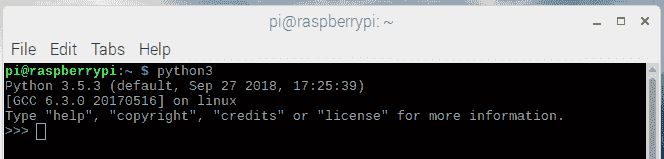

1.  您应该看到一个三角括号。输入`import cv2`。

1.  要检查 OpenCV 版本，请输入`cv2.__version__`。如果看到`opencv 4.0.0`，这意味着 OpenCV 已成功安装并与 Python 软件包链接：

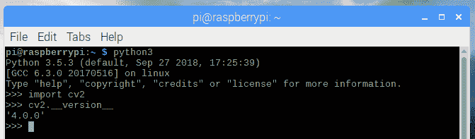

1.  输入`exit()`并按*Enter*：

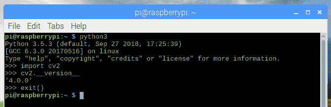

安装 OpenCV 后，我们需要将`CONF_SWAPSIZE`重置为`100`：

1.  打开`swapfile`：

```cpp
sudo nano /etc/dphys-swapfile
```

1.  将`CONF_SWAPSIZE`更改为`100`：

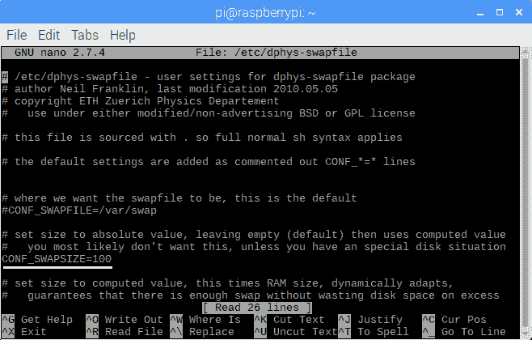

1.  要应用这些更改，请输入以下命令：

```cpp
sudo /etc/init.d/dphys-swapfile stop
sudo /etc/init.d/dphys-swapfile start
```

您已成功在树莓派上安装了 OpenCV 4.0.0。我们现在准备将 RPi 相机连接到 RPi。

# 启用并连接 RPi 相机到 RPi

在连接 RPi 相机到 RPi 之前，我们需要从 RPi 配置中启用相机选项：

1.  打开一个终端窗口并输入`sudo raspi-config`打开 RPi 配置。

1.  选择“高级选项”并按*Enter*打开它：

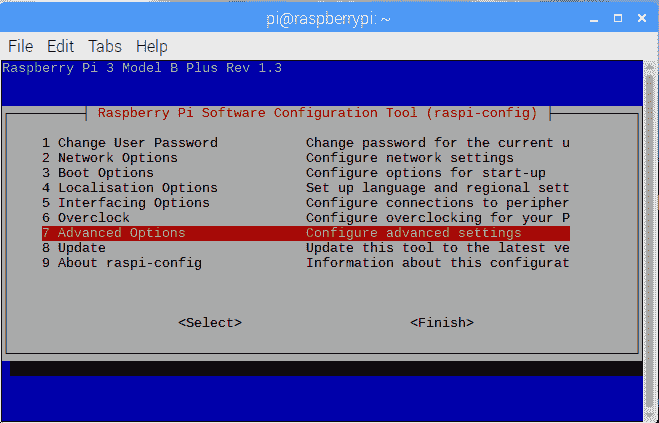

1.  选择相机选项并按*Enter*打开它：

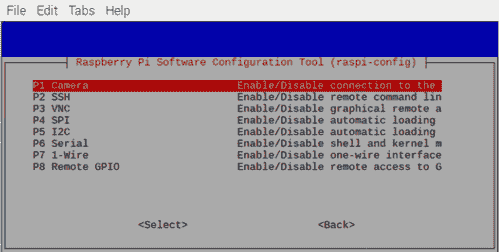

1.  选择“是”并按*Enter*启用相机选项：

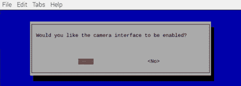

1.  选择确定并按*Enter*：

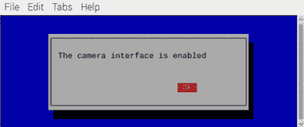

1.  退出 RPi 配置并关闭 RPi。

在连接 RPi 相机到 RPi 时，请确保 RPi 已关闭。

现在我们已经完成了设置，让我们连接相机。

# 连接 RPi 相机到 RPi

连接 RPi 相机到 RPi 是一个简单但又微妙的过程。RPi 相机有一根连接的带线。我们必须将这根带线插入 RPi 的相机插槽中，该插槽位于 LAN 端口和 HDMI 端口之间：

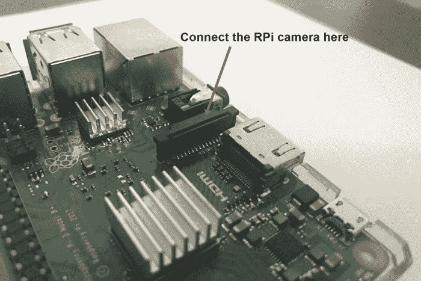

RPi 相机上的带线由前面的蓝色条组成，后面没有：

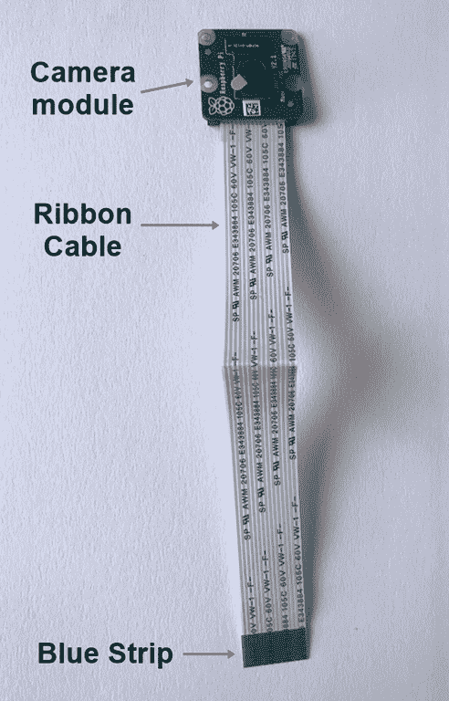

现在我们了解了组件和端口，让我们开始连接它们：

1.  轻轻抬起相机插槽的盖子：

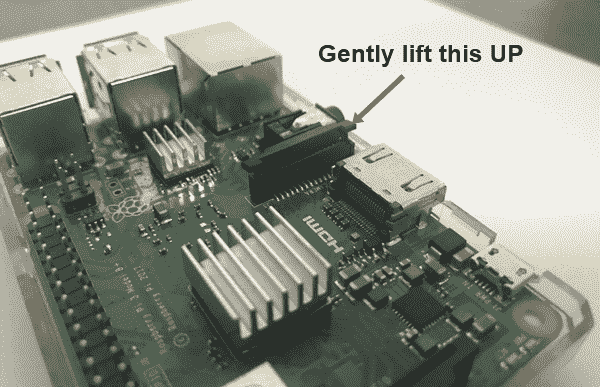

1.  将相机带插入插槽，确保带子上的蓝色胶带面向 LAN 端口。

1.  按下盖子锁定相机带线：

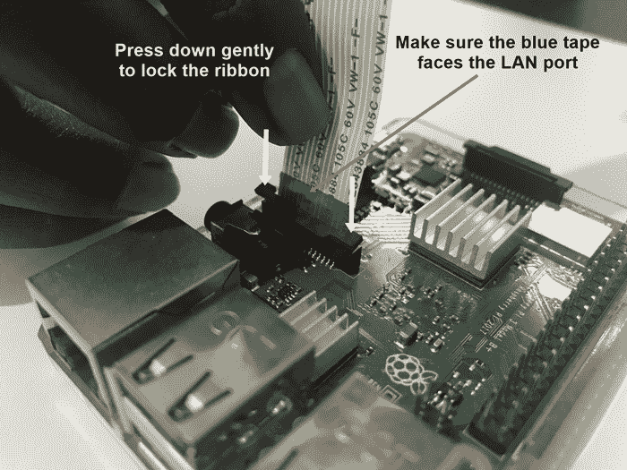

就是这样——您的 RPi 相机现在已准备好拍照和录制视频。

# 安装 RPi 相机在机器人上

让我们在机器人上安装 RPi 相机；您需要一个 RPi 相机盒子。在[amazon.com](http://amazon.com)上快速搜索`RPi 相机盒子`将显示以下情况：

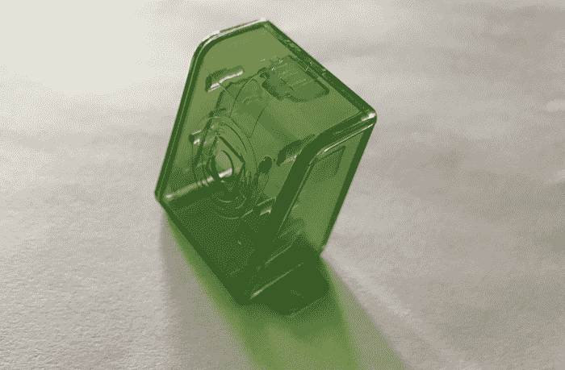

我不推荐这个特定的情况，因为它没有正确安装我的 RPi 相机模块。当盒子关闭时，我的 RPi 相机的镜头没有正确对齐这个相机盒子的小孔。

由于我住在印度，在亚马逊印度网站([www.amazon.in](http://www.amazon.in))上找不到好的 RPi 相机盒子，而且可用的盒子价格昂贵。我最终使用的盒子来自一个名为[www.robu.in](http://www.robu.in)的印度电子商务网站，只花了我 90 卢比（不到 2 美元）。在从电子商务网站购买相机盒子或相机支架之前，请检查评论以确保它不会损坏您的 RPi 相机。

我使用的 RPi 相机盒子的图像显示在以下图像中。我从一个名为[www.robu.in](http://www.robu.in)的印度网站购买了这个盒子。在这个网站上，搜索`树莓派相机支架模块`以找到这个相机支架：

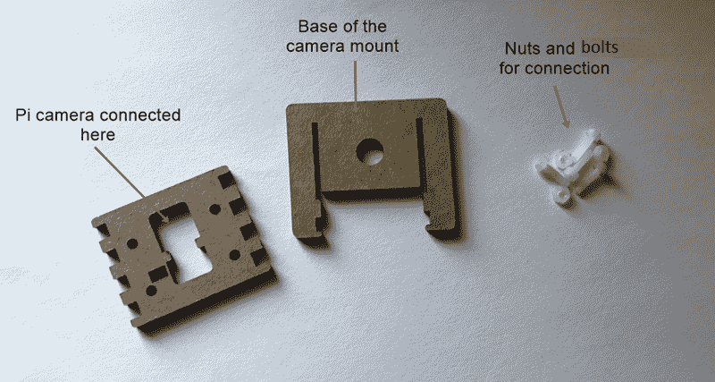

尽管此摄像头支架包含四个小螺母和螺栓将 RPi 摄像头固定到摄像头支架上，但我发现螺母和螺栓的螺纹不准确，并且将 RPi 摄像头固定到摄像头支架上非常困难。因此，我使用了四小块双面胶带，并将其粘贴到 RPi 摄像头的孔中：

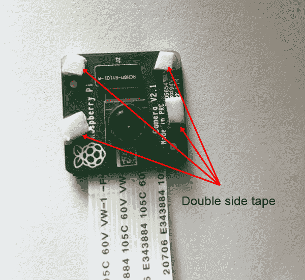

接下来，我将 RPi 摄像头安装到摄像头支架上。在下图中，RPi 摄像头被倒置安装。因此，当我们捕获图像时，图像将呈倒置状态，为了正确查看图像，我们需要翻转它（在 OpenCV 中解释了在第七章中水平和垂直翻转图像的过程，*使用 OpenCV 构建对象跟随机器人*）：

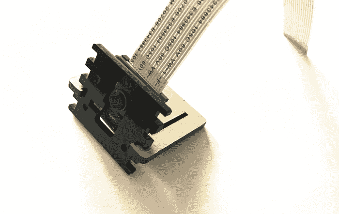

之后，我使用双面胶带在 RPi 外壳顶部安装了摄像头支架，从而将 RPi 摄像头安装在机器人上：

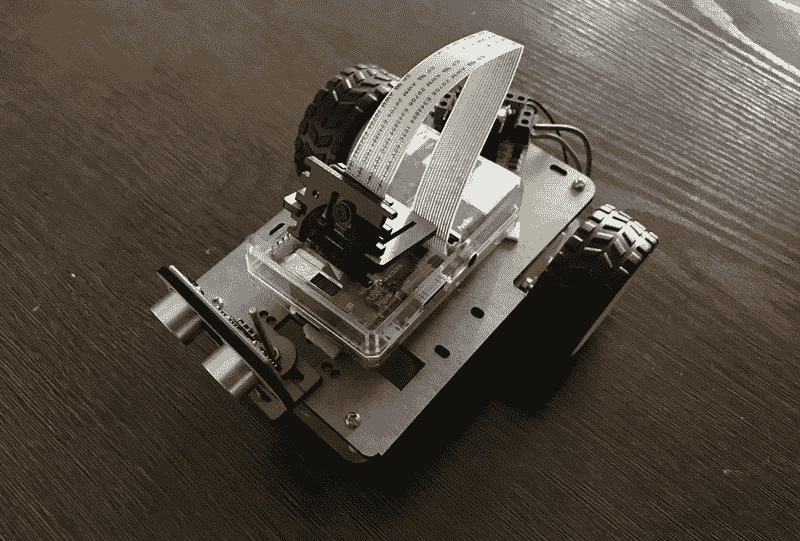

现在我们已经将摄像头外壳安装到机器人上，让我们看看如何使用 RPi 摄像头捕获图像和视频。

# 使用 RPi 摄像头捕获图像和视频

让我们看看如何在 RPi 上拍照和录制视频。打开终端窗口，输入以下命令：

```cpp
raspistill -o image1.jpg
```

在此命令中，我们使用`raspistill`拍摄静态图片，并将其保存为`image1.jpg`。

由于终端窗口指向`pi`目录，因此此图像保存在`pi`文件夹中。要打开此图像，请打开`pi`文件夹，在其中您将看到`image1.jpg`。使用 RPi 摄像头捕获的图像具有本机分辨率为 3,280 x 2,464 像素：

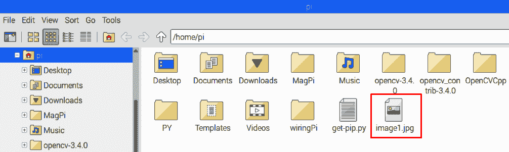

`image1`的输出如下截图所示：

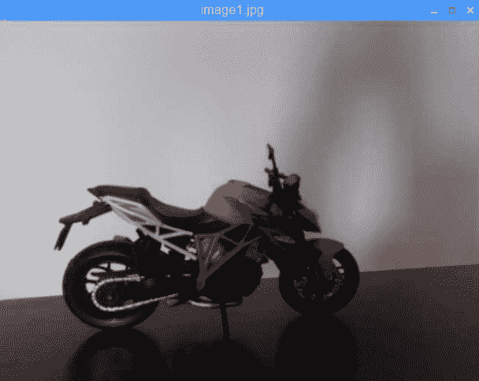

如果我们想水平翻转图像，可以添加`-hf`命令，如果要垂直翻转图像，可以在`raspistill`代码中添加`-vf`命令：

```cpp
raspistill -hf -vf -o image2.jpg
```

`image2.jpg`文件也保存在`pi`文件夹中，其输出如下截图所示：

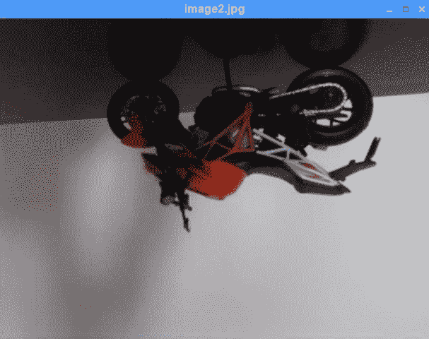

现在我们已经使用 RPi 摄像头捕获了图像，让我们录制并查看视频。

# 使用 RPi 摄像头录制视频

现在我们知道如何使用 RPi 摄像头拍照，让我们看看如何录制视频。录制视频剪辑的命令如下：

```cpp
raspivid -o video1.h264 -t 5000 
```

如下截图所示，上述命令不会产生任何输出：

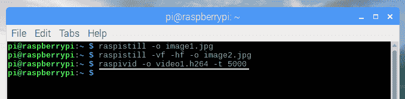

在我们的命令中，我们使用`raspivid`录制视频，并将其命名为`video1`。我们以`h264`格式录制了视频。数字`5000`代表 5000 毫秒，也就是说，我们录制了一个 5 秒的视频。您可以打开`pi`文件夹，双击视频文件以打开它：

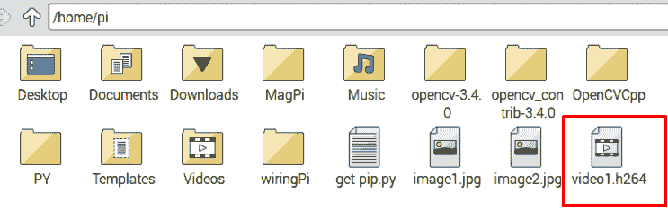

现在我们知道如何拍照和录制视频，让我们安装`v4l2`驱动程序，以便 OpenCV 库可以检测到 RPi 摄像头。

# 安装 v4l2 驱动程序

OpenCV 库默认可以识别连接到 RPi USB 端口的 USB 摄像头，但无法直接检测 RPi 摄像头。要识别我们的 RPi 摄像头，我们需要在模块文件中加载`v4l2`驱动程序。要打开此文件，请在终端窗口中输入以下命令：

```cpp
sudo nano /etc/modules
```

要加载`v4l2`驱动程序，请在以下文件中添加`bcm2835-v4l2`：

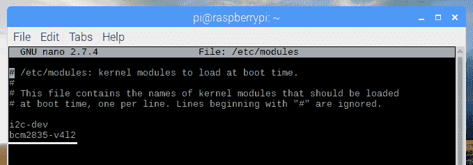

按下*Ctrl* + *O*，然后按*Enter*保存此文件，按下*Ctrl* + *X*退出文件，然后重新启动您的 RPi。重新启动后，OpenCV 库将识别 RPi 摄像头。

# 使用 OpenCV 读取图像

在 RPi 相机上玩了一会儿之后，让我们使用 OpenCV 函数编写一个简单的 C++程序来显示图像。在这个程序中，我们首先从一个特定的文件夹中读取图像，然后在新窗口中显示这个图像：

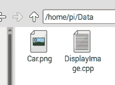

要显示图像，我们首先需要一张图像。在`pi`文件夹中，我创建了一个名为`Data`的新文件夹，在其中，我复制了一张名为`Car.png`的图像。在同一个文件夹中，我创建了`DisplayImage.cpp`文件，我们将在其中编写显示图像的程序。`DisplayImage.cpp`程序可以从本书的 GitHub 存储库的`Chapter06`文件夹中下载。代码如下：

```cpp
#include <iostream>
#include <stdio.h>
#include <opencv2/opencv.hpp>

using namespace cv;
using namespace std;
int main()
{

Mat img;

img = imread("Car.jpg");

imshow("Car Image", img);

waitKey(0);

return 0;
}
```

在上述代码中，我们首先声明了`opencv.hpp`库，以及基本的 C++库。然后声明了`cv`命名空间，它是 OpenCV 库的一部分。在`main`函数内部，我们声明了一个名为`img`的矩阵（`Mat`）变量。

接下来，使用`imread（）`函数读取`Car.jpg`图像，并将值存储在`img`变量中。如果图像和`.cpp`文件在同一个文件夹中，只需在`imread（）`函数中写入图像名称。如果图像在不同的文件夹中，则应在`imread`函数中提及图像的位置。

`imshow（）`函数用于在新窗口中显示汽车图像。`imshow（）`函数接受两个参数作为输入。第一个参数是窗口文本（`"Car Image"`），第二个参数是要显示的图像的变量名（`img`）。

`waitKey（0）`函数用于创建无限延迟，也就是说，`waitKey（0）`将无限地显示汽车图像，直到您按下任意键。按下键后，将执行下一组代码。由于在`waitKey（0）`函数之后没有任何代码，程序将终止，汽车图像窗口将关闭。

要在 RPi 内部编译和构建 OpenCV 代码，我们需要在编译和构建框内添加以下行：

1.  单击**构建选项**，然后选择**设置构建命令**。在编译框内，输入以下命令：

```cpp
g++ -Wall $(pkg-config --cflags opencv) -c "%f" -lwiringPi
```

1.  在构建框内，输入以下命令，然后单击“确定”：

```cpp
g++ -Wall $(pkg-config --libs opencv) -o "%e" "%f" -lwiringPi
```

1.  单击编译按钮编译代码，然后单击构建按钮测试输出。在输出中，将创建一个新窗口，在其中将显示汽车图像：

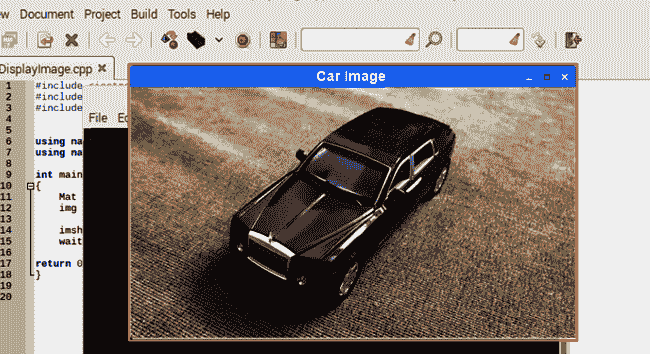

1.  如果按任意键，程序将终止，汽车图像窗口将关闭。

# 总结

在本章中，我们专注于在树莓派上安装 OpenCV。您已经了解了 RPi 相机模块。设置 RPi 相机后，您使用 RPi 相机拍摄了照片并录制了一个短视频剪辑。

在下一章中，我们将使用 OpenCV 库编写 C++程序。您将学习不同的图像处理概念，以便可以扫描、阈值化和识别对象。在识别对象之后，我们将为机器人编写程序，使其跟随该对象。

# 问题

1.  OpenCV 的全称是什么？

1.  RPi 相机拍摄的图像分辨率是多少？

1.  使用 RPi 相机拍摄图像的命令是什么？

1.  使用 RPi 相机录制视频的命令是什么？

1.  Raspbian OS 在 8GB 和 32GB SD 卡上占用的内存百分比是多少？
