# 第七章：使用 OpenCV 构建一个目标跟随机器人

在上一章中安装了 OpenCV 之后，现在是时候使用 OpenCV 库执行图像处理操作了。在本章中，我们将涵盖以下主题：

+   使用 OpenCV 进行图像处理

+   查看来自 Pi 摄像头的视频源

+   构建一个目标跟随机器人

# 技术要求

对于本章没有新的技术要求，但是您需要以下内容来执行示例：

+   用于检测红色、绿色或蓝色的球

+   安装在机器人上的 Pi 摄像头和超声波传感器

本章的代码文件可以从[`github.com/PacktPublishing/Hands-On-Robotics-Programming-with-Cpp/tree/master/Chapter07`](https://github.com/PacktPublishing/Hands-On-Robotics-Programming-with-Cpp/tree/master/Chapter07)下载。

# 使用 OpenCV 进行图像处理

在本节中，我们将查看 OpenCV 库的重要函数。之后，我们将使用 OpenCV 库编写一个简单的 C++程序，并对图像执行不同的图像处理操作。

# OpenCV 中的重要函数

在编写任何 OpenCV 程序之前，了解 OpenCV 中的一些主要函数以及这些函数可以给我们的输出是很重要的。让我们从查看这些函数开始：

+   **`imread()`**: `imread()`函数用于从 Pi 摄像头或网络摄像头读取图像或视频。在`imread()`函数内部，我们必须提供图像的位置。如果图像和程序文件在同一个文件夹中，我们只需要提供图像的名称。但是，如果图像存储在不同的文件夹中，那么我们需要在`imread`函数内提供图像的完整路径。我们将从`imread()`函数中存储的图像值存储在一个矩阵（`Mat`）变量中。

如果图像和`.cpp`文件在同一个文件夹中，代码如下所示：

```cpp
Mat img = imread("abcd.jpg"); //abcd.jpg is the image name
```

如果图像和`.cpp`文件在不同的文件夹中，代码如下所示：

```cpp
Mat img = imread("/home/pi/abcd.jpg"); //abcd image is in 
                                      // the Pi folder

```

+   `imshow()`: `imshow()`函数用于显示或查看图像：

```cpp
imshow("Apple Image", img);
```

`imshow()`函数包括两个参数，如下：

+   +   第一个参数是窗口文本

+   第二个参数是要显示的图像的变量名

`imshow()`函数的输出如下：

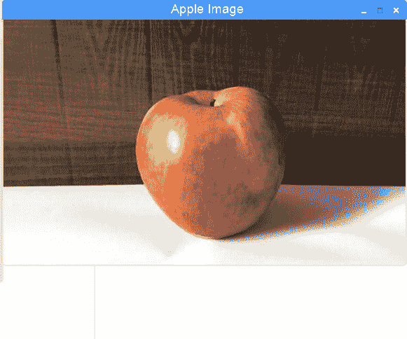

+   `resize()`: `resize()`函数用于调整图像的尺寸。当用户同时使用多个窗口时，通常会使用此函数：

```cpp
resize(img, rzimg, cvSize(400,400));  //new width is 400 
                                     //and height is 400
```

此函数包括三个参数：

+   +   第一个参数是要调整大小的原始图像（`img`）的变量名。

+   第二个参数是将调整大小的新图像（`rzimg`）的变量名。

+   第三个参数是`cvSize`，在其中输入**新宽度**和**高度值**。

`resize()`函数的输出如下：

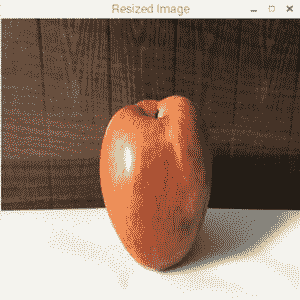

+   `flip()`: 此函数用于水平翻转、垂直翻转或同时进行两者：

```cpp
flip(img, flipimage, 1)
```

此函数包括三个参数：

+   +   第一个参数（`img`）是原始图像的变量名。

+   第二个参数（`flipimage`）是翻转后的图像的变量名。

+   第三个参数是翻转类型；`0`表示垂直翻转，`1`表示水平翻转，`-1`表示图像应同时水平和垂直翻转。

`flip()`函数的输出如下：

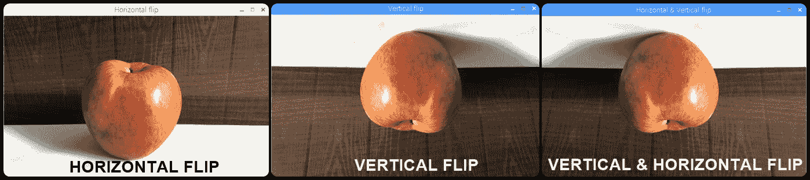

+   `cvtColor()`: 此函数用于将普通的 RGB 彩色图像转换为灰度图像：

```cpp
cvtColor(img, grayimage, COLOR_BGR2GRAY)
```

此函数包括三个参数：

+   +   第一个参数（`img`）是原始图像的变量名

+   第二个参数（`grayimage`）是将转换为灰度的新图像的变量

+   第三个参数，`COLOR_BGR2GRAY`，是转换类型；BGR 是 RGB 倒过来写的

`cvtColor()`函数的输出如下：

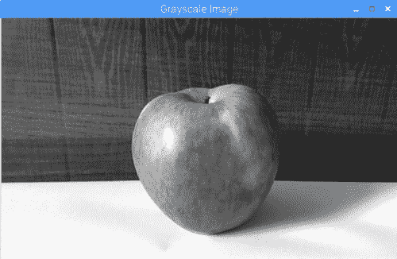

+   `threshold()`: 阈值化方法用于分离代表对象的图像区域。简单来说，阈值化用于识别图像中的特定对象。阈值化方法接受源图像（`src`）、阈值和最大阈值（`255`）作为输入。它通过比较源图像的像素值与阈值来生成输出图像（`thresimg`）：

```cpp
threshold(src, thresimg, threshold value, max threshold value, threshold type);
```

阈值函数由五个参数组成：

+   +   第一个参数（`src`）是要进行阈值化的图像的变量名。

+   第二个参数（`thresimg`）是阈值化图像的变量名。

+   第三个参数（`阈值`）是阈值（从 0 到 255）。

+   第四个参数（`最大阈值`）是最大阈值（`255`）。

+   第五个参数（`阈值类型`）是阈值化类型。

一般来说，有五种类型的阈值化，如下所示：

+   +   **0-二进制**：二进制阈值化是阈值化的最简单形式。在这种阈值化中，如果源图像（`src`）上的任何像素值大于阈值，则在输出图像（`thresimg`）中，该像素将被设置为最大阈值（`255`），并且将变为白色。另一方面，如果源图像上的任何像素值小于阈值，则在输出图像中，该像素值将被设置为`0`，并且将变为黑色。

例如，在以下代码中，阈值设置为`85`，最大阈值为`255`，阈值类型为用数字`0`表示的二进制：

```cpp
threshold(src, thresimg,85, 255, 0);
```

因此，如果苹果图像源图像上的任何像素值大于阈值（即大于`85`），那么这些像素将在输出图像中变为白色。同样，源图像上值小于阈值的像素将在输出图像中变为黑色。

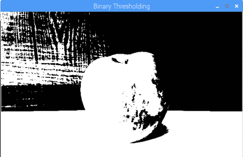

二进制阈值化

+   +   **1-二进制反转**：二进制反转阈值化正好与二进制阈值化相反。在这种类型的阈值化中，如果源图像的像素值大于阈值，则输出图像的像素将变为黑色（`0`），如果源图像的像素值小于阈值，则输出图像的像素将变为白色（`255`）：

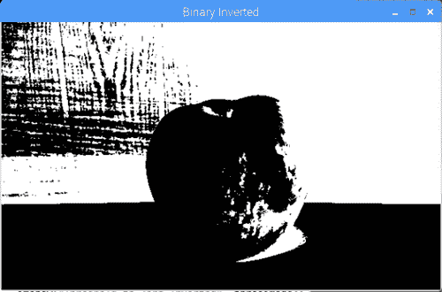

二进制反转阈值化

+   +   **2-截断** **阈值化**：在截断阈值化中，如果`src`源图像上的任何像素值大于阈值，则在输出图像中，该像素将被设置为阈值。另一方面，如果`src`源图像上的任何像素值小于阈值，则在输出图像中，该像素将保留其原始颜色值：

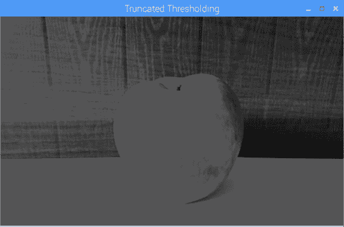

截断阈值化

+   +   **3-阈值为零**：在这种阈值化中，如果`src`源图像上的任何像素值大于阈值，则在输出图像中，该像素将保留其原始颜色值。另一方面，如果`src`源图像上的任何像素值小于阈值，则在输出图像中，该像素将被设置为`0`（即黑色）：

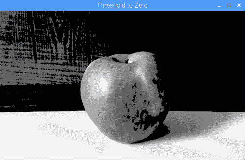

阈值为零

+   +   **4-阈值为零反转**：在这种阈值化中，如果`src`上的任何像素值大于阈值，则在输出图像中，该像素将被设置为`0`。如果`src`上的任何像素值小于阈值，则在输出图像中，该像素将保留其原始颜色值：

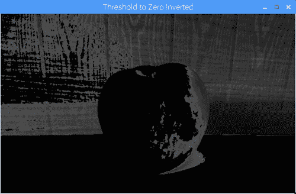

阈值为零反转

+   `inRange()`: `inRange()`函数是阈值函数的高级形式。在这个函数内部，我们必须输入我们想要识别的对象的最小和最大 RGB 颜色值。`inRange()`函数由四个参数组成：

+   第一个参数（`img`）是要进行阈值处理的图像的变量名。

+   有两个`Scalar`函数。在第一个`Scalar`函数中的第二个参数中，我们必须输入对象的最小 RGB 颜色。

+   在第三个参数中，也就是第二个`Scalar`函数中，我们将输入对象的最大 RGB 颜色值。

+   第四个参数（`thresImage`）代表阈值图像的输出：

```cpp
inRange(img, Scalar(min B,min G,min R), Scalar(max B,max G,max R),thresImage)
```

**图像矩**——图像矩的概念源自**矩**，它在力学和统计学中用于描述一组点的空间分布。在图像处理或计算机视觉中，图像矩用于找到形状的**质心**，即形状中所有点的平均值。简单来说，图像矩用于在我们从整个图像中分割出对象后找到任何对象的中心。例如，在我们的情况下，我们可能想要找到苹果的中心。从图像计算对象的中心的**图像矩公式**如下：

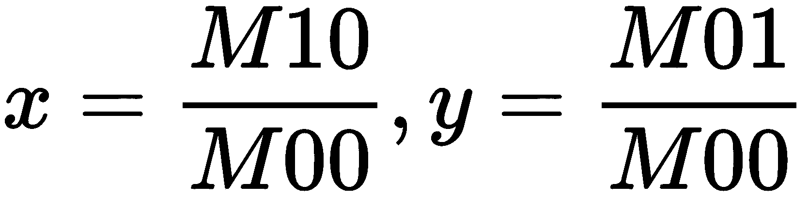

+   +   *x*代表图像的宽度

+   *y*代表图像的高度

+   *M10*代表图像中所有*x*值的总和

+   *M01*代表图像中所有*y*值的总和

+   *M00*代表图像的整个区域

+   `circle`: 正如其名，这个函数用于画圆。它有五个参数作为输入：

+   第一个参数（`img`）是你要在其上画圆的图像的变量名。

+   第二个参数（`point`）是圆的中心（*x*，*y*位置）点。

+   第三个参数（`radius`）是圆的半径。

+   第四个参数（`Scalar(B,G,R)`）是为圆着色的；我们使用`Scalar()`函数来做到这一点。

+   第五个参数（`thickness`）是圆的厚度：

```cpp
circle(img, point, radius, Scalar(B,G,R),thickness);
```

# 使用 OpenCV 进行对象识别

现在我们已经了解了 OpenCV 的重要功能，让我们编写一个程序来从图像中检测一个有颜色的球。在我们开始之前，我们必须做的第一件事是拍摄球的合适照片。你可以用任何球来做这个项目，但要确保球是单色的（红色、绿色或蓝色的球是强烈推荐的），并且不是多色的。我在这个项目中使用了一个绿色的球：

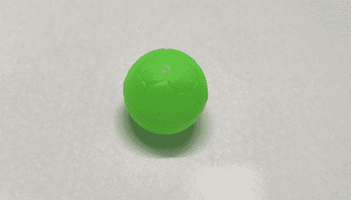

# 拍摄图像

为了捕捉你的球的图像，把它放在一些黑色的表面上。我把我的绿色球放在一个黑色的手机壳上：

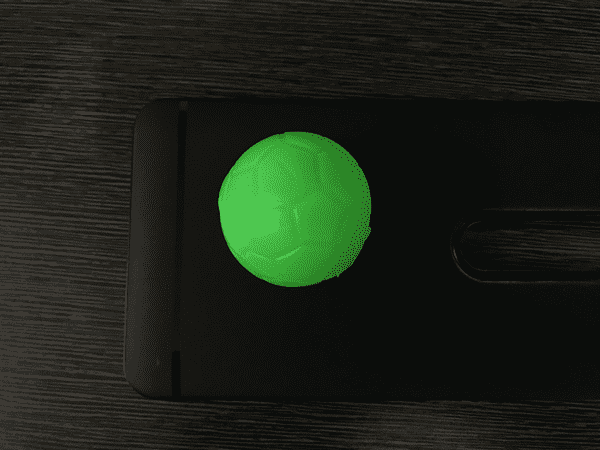

如果你的球是黑色，或者颜色较暗，你可以把球放在一个颜色较浅的表面上。这是为了确保球的颜色和背景的颜色之间有很高的对比度，这将有助于我们后面的阈值处理。

在拍摄图像时，确保球上没有白色斑块，因为这可能会在后面的阈值处理中造成问题：

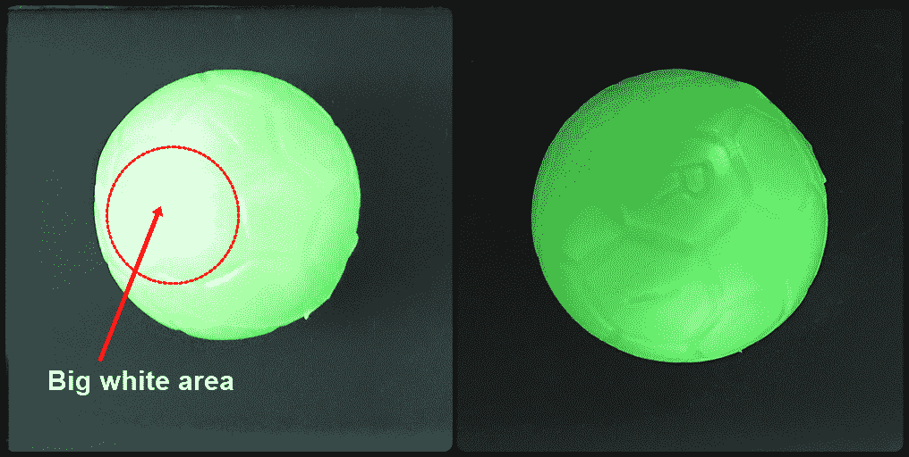

左边的照片有一个大的白色区域，因为光线太亮。右边，球被适当照亮。

一旦你对拍摄的图像满意，将其传输到你的笔记本电脑上。

# 找到 RGB 像素值

现在我们将通过以下步骤检查球上不同点的 RGB 像素值来找到球的 RGB 像素值：

1.  打开画图并打开保存的球的图像，如下：

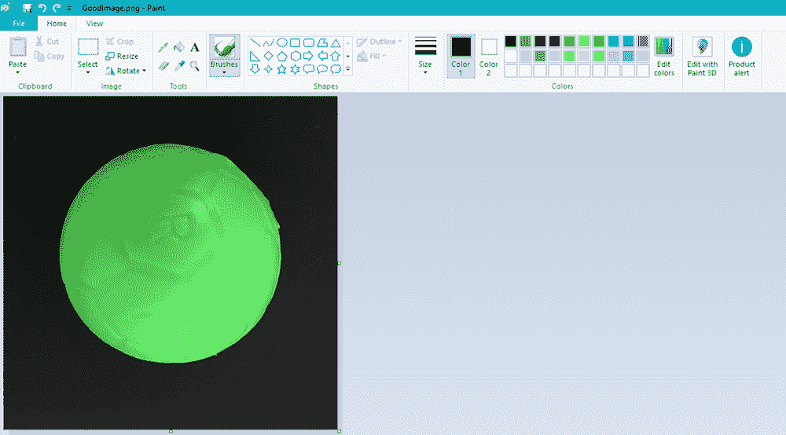

1.  接下来，使用取色器工具，在球的任何位置单击取样颜色：

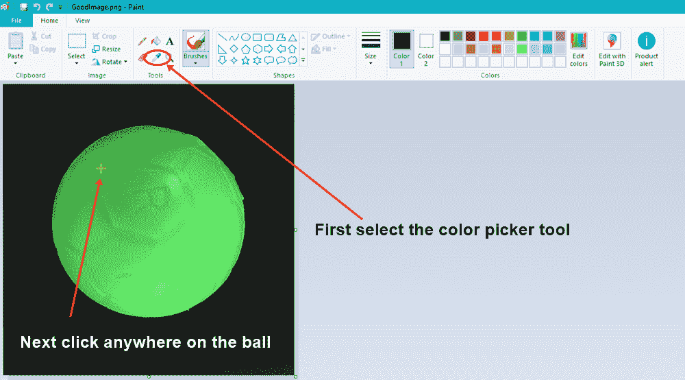

颜色 1 框将显示被点击的颜色的样本。在我的情况下，这是绿色：

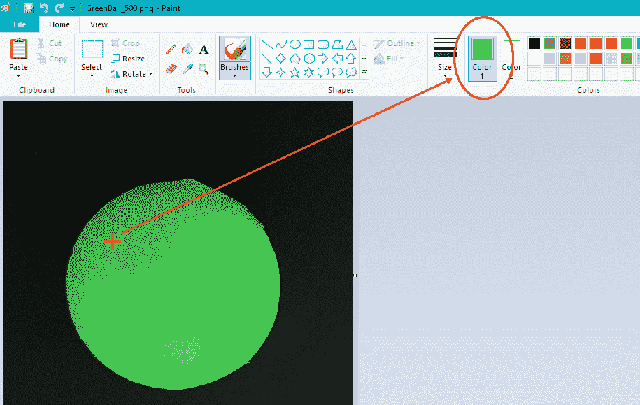

1.  如果您点击“编辑颜色”选项，您将看到该像素的 RGB 颜色值。在我的情况下，绿色像素的 RGB 颜色值为红色：`61`，绿色：`177`，蓝色：`66`。记下这些值，以备后用：

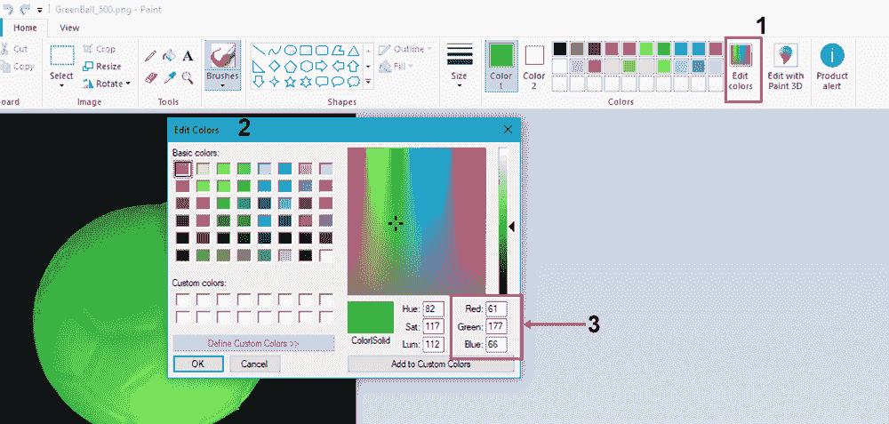

1.  现在，再次选择取色器选项，点击球的另一个彩色区域，找出该像素的 RGB 颜色值。再次记录这个值。重复 13 到 14 次，确保包括球上最浅和最暗的颜色：

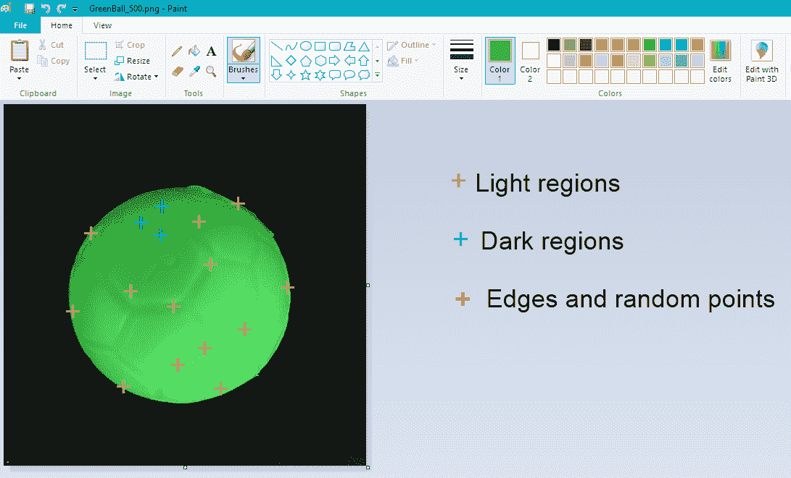

我已经记录了球边缘六个点的 RGB 值，球周围随机位置的四个点的 RGB 值，以及颜色为浅绿色或深绿色的六个点的 RGB 值。找到 RGB 值后，突出显示最低的红色、绿色和蓝色值，以及最高的红色、绿色和蓝色值。我们将在程序中稍后使用这些值来对图像进行阈值处理。

1.  现在，您需要将这个图像传输到您的 RPi。我通过**Google Drive**传输了我的图像。我通过将图像上传到 Google Drive，然后在我的 RPi 内打开默认的 Chromium 网络浏览器，登录我的 Gmail 账户，打开 Google Drive，并下载图像来完成这一步。

# 物体检测程序

用于检测绿色球的程序名为`ObjectDetection.cpp`，我将其保存在`OpenCV_codes`文件夹中。我还将`greenball.png`图像复制到了这个文件夹中。您可以从 GitHub 存储库的`Chapter07`文件夹中下载`ObjectDetection.cpp`程序。因此，用于检测绿色球的程序如下：

```cpp
#include <iostream>
#include<opencv2/opencv.hpp>
#include<opencv2/core/core.hpp>
#include<opencv2/highgui/highgui.hpp>
#include<opencv2/imgproc/imgproc.hpp>

using namespace cv;
using namespace std;

int main()
{

 Mat img, resizeimg,thresimage;
 img = imread("greenball.png");
 imshow("Green Ball Image", img);
 waitKey(0);

 resize(img, resizeimg, cvSize(640, 480));
 imshow("Resized Image", resizeimg);
 waitKey(0);

 inRange(resizeimg, Scalar(39, 140, 34), Scalar(122, 245, 119), thresimage);
 imshow("Thresholded Image", thresimage);
 waitKey(0);

 Moments m = moments(thresimage,true);
 int x,y;
 x = m.m10/m.m00;
 y = m.m01/m.m00;
 Point p(x,y);
 circle(img, p, 5, Scalar(0,0,200), -1);
 imshow("Image with center",img);
 waitKey(0);

 return 0;
}
```

在前面的程序中，我们导入了四个 OpenCV 库，它们是`opencv.hpp`、`core.hpp`、`highgui.hpp`和`imgproc.hpp`。然后我们声明了 OpenCV 库的`cv`命名空间。

以下是前面程序的解释：

1.  在`main`函数内，我们声明了三个矩阵变量，分别为`img`、`resizeimg`和`thresimage`。

1.  接下来，`imread()`函数读取`greenball.png`文件，并将其存储在`img`变量中。

1.  `imshow("Green Ball Image", img)`行将在新窗口中显示图像，如下面的屏幕截图所示：

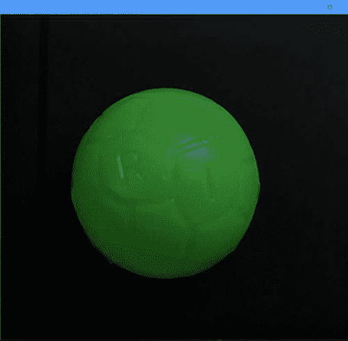

1.  之后，`waitKey(0)`函数将等待键盘输入。然后执行下一组代码。一旦按下任意键，将执行调整图像大小的下两行代码。

1.  `resize`函数将调整图像的宽度和高度，使得图像的新宽度为`640`，高度为`480`：

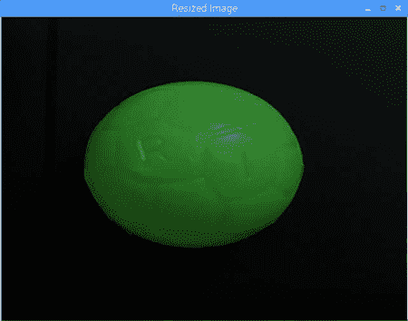

1.  然后使用`inRange`函数执行阈值处理操作。在第一个`Scalar`函数内，我输入了我的球的绿色的最小 RGB 值，在第二个`Scalar`函数内，我输入了最大 RGB 值。阈化后的图像存储在`thresimage`变量中。

在`Scalar`函数内，我们首先输入蓝色值，然后是绿色，最后是红色。

1.  阈值处理后，球的颜色将变为白色，图像的其余部分将变为黑色。球中间的一些部分将呈现为黑色，这是正常的。如果白色内部出现大面积黑色，这意味着阈值处理没有正确进行。在这种情况下，您可以尝试修改`Scalar`函数内的 RGB 值：

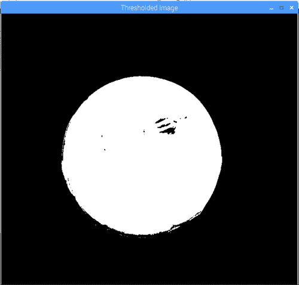

1.  接下来，使用`moments`函数，我们找到对象的中心。

1.  在`moments(thresimage,true)`行，我们将`thresimage`变量作为输入。

1.  在接下来的三行代码中，我们找到白色区域的中心并将该值存储在点变量`p`中。

1.  之后，为了显示球的中心，我们使用`circle`函数。在圆函数内部，我们使用`img`变量，因为我们将在原始图像上显示圆点。接下来，点变量`p`告诉函数我们在哪里显示点。圆形点的宽度设置为`5`，圆形点的颜色将是红色，因为我们只填充了`Scalar`函数的最后一个参数，表示颜色为红色。如果要设置其他颜色，可以更改`Scalar`函数内的颜色值：

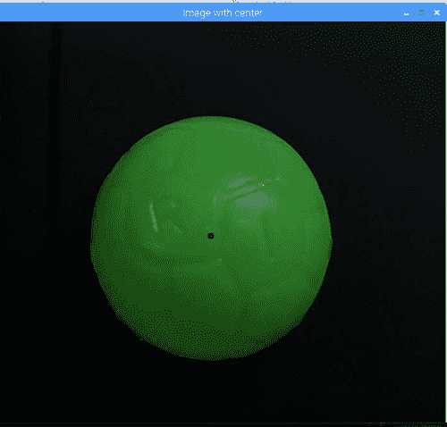

1.  按任意键再次按下`waitKey(0)`函数，将关闭除终端窗口之外的所有窗口。要关闭终端窗口，请按*Enter*。

通过上述程序，我们已经学会了如何调整大小、阈值处理，并在绿色球的图像上生成一个点（红点）。在下一节中，我们将对实时视频反馈执行一些图像识别操作。

# OpenCV 相机反馈程序

现在，我们将编写一个简单的 C++程序来查看来自 Pi 相机的视频反馈。视频查看程序如下。该程序名为`Camerafeed.cpp`，您可以从 GitHub 存储库的`Chaper07`文件夹中下载：

```cpp
int main()
{
 Mat videoframe;

VideoCapture vid(0);

if (!vid.isOpened())
 {
cout<<"Error opening camera"<<endl;
 return -1;
 }
 for(;;)
 {
 vid.read(videoframe);
 imshow("Frame", videoframe);
 if (waitKey(1) > 0) break;
 }
 return 0;
}
```

OpenCV 库和命名空间声明与先前程序类似：

1.  首先，在`main`函数内部，我们声明了一个名为`videoframe`的矩阵变量。

1.  接下来，使用`VideoCapture`数据类型从 Pi 相机捕获视频反馈。它有一个名为`vid(0)`的变量。`vid(0)`变量内的`0`数字表示相机的索引号。目前，由于我们只连接了一个相机到 RPi，Pi 相机的索引将为`0`。如果您将 USB 相机连接到树莓派，那么 USB 相机的索引将为`1`。通过更改索引号，您可以在 Pi 相机和 USB 相机之间切换。

1.  接下来，我们指定如果相机无法捕获任何视频反馈，则应调用`!vid.isOpened()`条件。在这种情况下，终端将打印出`"Error opening camera"`消息。

1.  之后，`vid.read(videoframe)`命令将读取相机反馈。

1.  使用`imshow("Video output", videoframe)`行，我们现在可以查看相机反馈。

1.  `waitKey`命令将等待键盘输入。一旦按下任意键，它将退出代码。

这就是您可以使用 Pi 相机查看视频反馈的方法。

# 构建一个目标跟踪机器人

在对图像进行阈值处理并从 Pi 相机查看视频反馈之后，我们将结合这两个程序来创建我们的目标跟踪机器人程序。

在本节中，我们将编写两个程序。在第一个程序中，我们将球放在相机前面，并通过在球的中心创建一个点（使用矩形）来追踪它。接下来，我们将移动球**上**、**下**、**左**和**右**，并记录相机上不同位置的点值。

在第二个程序中，我们将使用这些点值作为输入，并使机器人跟随球对象。

# 使用矩形进行球追踪

在跟踪球之前，机器人应首先能够使用 Pi 相机追踪它。在编写程序之前，让我们看看我们将如何追踪球。

# 编程逻辑

首先，我们将相机分辨率调整为 640 x 480，如下所示：

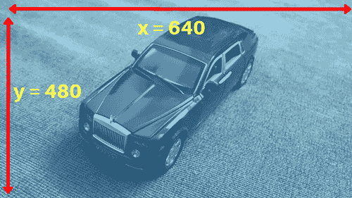

调整宽度和高度后，我们将相机屏幕水平分为三个相等的部分：

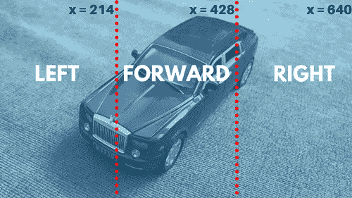

从 0 到 214 的**x 坐标值**代表左侧部分。从 214 到 428 的**x 坐标值**代表前进部分，而从 428 到 640 的**x 坐标值**代表右侧部分。我们不需要编写任何特定的程序来将摄像头屏幕划分为这三个不同的部分，我们只需要记住每个部分的最小和最大**x 点值**。

接下来，我们将对球对象进行阈值处理。之后，我们将使用矩和在球的中心生成一个点。我们将在控制台中打印点值，并检查屏幕特定部分的*x*和*y*点值：

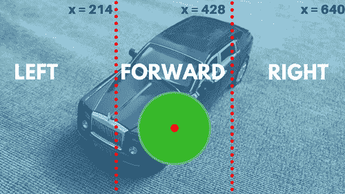

如果球在**前进**部分，**x 坐标值**必须在**214**和**428**之间。由于我们不是垂直地划分屏幕，所以不需要考虑*y*值。现在让我们开始球追踪程序。

# 球追踪程序

`BallTracing.cpp`程序如下。您可以从 GitHub 存储库的`Chapter07`文件夹中下载此程序：

```cpp
int main()
{
  Mat videofeed,resizevideo,thresholdvideo;
  VideoCapture vid(0);
  if (!vid.isOpened())
  {
    return -1;
  } 
  for (;;)
  { 
    vid.read(videofeed);
  resize(videofeed, resizevideo, cvSize(640, 480));
  flip(resizevideo, resizevideo, 1);

  inRange(resizevideo, Scalar(39, 140, 34), Scalar(122, 245, 119), thresholdvideo); 

  Moments m = moments(thresholdvideo,true);
  int x,y;
  x = m.m10/m.m00;
  y = m.m01/m.m00; 
  Point p(x,y);

  circle(resizevideo, p, 10, Scalar(0,0,128), -1);

  imshow("Image with center",resizevideo);
    imshow("Thresolding Video",thresholdvideo);

  cout<<Mat(p)<< endl;

  if (waitKey(33) >= 0) break;
  }
  return 0;
}
```

在`main`函数内，我们有三个矩阵变量，名为`videofeed`、`resizevideo`和`thresholdvideo`。我们还声明了一个名为`vid(0)`的`VideoCapture`变量来捕获视频。

以下步骤详细说明了`BallTracing.cpp`程序：

1.  在`for`循环中，`vid.read(videofeed)`代码将读取摄像头视频。

1.  使用`resize`函数，我们将摄像头分辨率调整为 640 x 480。调整大小后的视频存储在`resizevideo`变量中。

1.  然后，使用`flip`函数，我们水平翻转调整大小后的图像。翻转后的视频输出再次存储在`resizevideo`变量中。如果我们不水平翻转视频，当你向左移动时，球会看起来好像在右侧移动，反之亦然。如果您将树莓派相机倒置安装，则需要垂直翻转调整大小后的图像。要垂直翻转，将第三个参数设置为`0`。

1.  接下来，使用`inRange`函数，我们对视频进行阈值处理，使彩色球从图像的其余部分中脱颖而出。阈值化后的视频输出存储在`thresholdvideo`变量中。

1.  使用`moments`，我们找到了存储在点变量`p`中的球的中心。

1.  使用`circle`函数，在`resizevideo`视频中显示一个红点在球上。

1.  第一个`imshow`函数将显示调整大小后的(`resizedvideo`)视频，而第二个`imshow`函数将显示阈值化后的(`thresholdvideo`)视频：

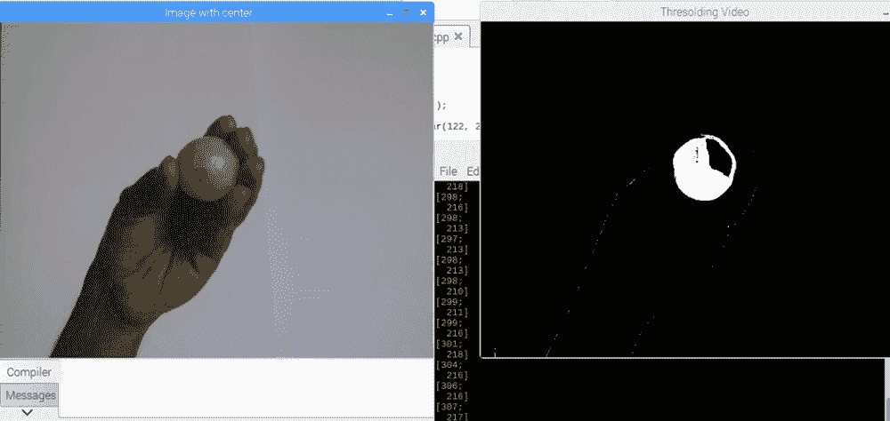

在上面的屏幕截图中，左窗口显示了`resizevideo`的视频，我们看到绿色球上的红点。右窗口显示了阈值视频，其中只有球的区域是白色的。

1.  最后，`cout<<Mat(p)<<endl;`代码将在控制台内显示红点的*x*和*y*点值。当您移动球时，红点也会随之移动，并且红点的*x*和*y*位置将显示在控制台内。

从上面的屏幕截图中，方括号内的值`[298 ; 213]`是点值。因此，我的情况下红点的*x*值在 298 到 306 的范围内，*y*值在 216 到 218 的范围内。

# 设置物体跟随机器人

跟踪球的位置后，剩下的就是让我们的机器人跟随球。我们将使用`x`和`y`坐标值作为输入。然而，在跟随球的同时，我们还必须确保机器人与球的距离适当，以免与球或拿着球的人发生碰撞。为此，我们还将把超声波传感器连接到我们的机器人上。对于这个项目，我已经通过电压分压电路将超声波传感器的`trigger`引脚连接到`wiringPi pin no 12`，将`echo`引脚连接到`wiringPi pin no 13`。

# 物体跟随机器人程序

物体跟随机器人程序基本上是第四章中的避障程序和前面的球追踪程序的组合。该程序名为`ObjectFollowingRobot.cpp`，您可以从 GitHub 存储库的`Chapter07`文件夹中下载：

```cpp
int main()
 { 
...
 float distance = (totalTime * 0.034)/2;

 if(distance < 15)
 {
 cout<<"Object close to Robot"<< " " << Mat(p)<< " " <<distance << " cm" << endl;
 stop();
 }

 else{ 
      if(x<20 && y< 20)
      {
      cout<<"Object not found"<< " " << Mat(p)<< " " <<distance << " cm" << endl;
      stop();
      }
      if(x > 20 && x < 170 && y > 20 )
      {
      cout<<"LEFT TURN"<< " " << Mat(p)<< " " <<distance << " cm" << endl;
      left();
      }
      if(x > 170 && x < 470)
      {
      cout<<"FORWARD"<< " " << Mat(p)<< " " <<distance << " cm" << endl;
      forward();
      }
      if(x > 470 && x < 640)
      {
      cout<<"RIGHT TURN"<< " " << Mat(p)<< " " <<distance << " cm" << endl;
      right();
      }

      }
      if (waitKey(33) >= 0) break;
      }
       return 0;
}
```

在`main`函数中，计算距离、对视频进行阈值处理并将点放在球的中心后，让我们来看看程序的其余部分：

1.  第一个`if`条件（`if(distance < 15)`）将检查机器人距离物体是否为 15 厘米。如果距离小于 15 厘米，机器人将停止。前进、左转、右转和停止功能在`main`函数上方声明。

1.  在`stop()`函数下，`cout`语句将首先打印消息`"Object close to Robot"`。之后，它将打印点（x，y）值（`Mat(p)`），然后是`distance`值。在每个`if`条件内，`cout`语句将打印区域（如`LEFT`，`FORWARD`或`RIGHT`），点值和`distance`值。

1.  如果距离大于 15 厘米，将执行`else`条件。在`else`条件内，有三个`if`条件来找到球的位置（使用上面的红点作为参考）。

1.  现在，一旦摄像头被激活，或者当球移出摄像头的视野时，红点（点）将重置到屏幕的极左上角的位置`x:0`，`y:0`。`else`块内的第一个`if`条件（`if(x<20 && y< 20)`）将检查红点的位置在`x`和`y`轴上是否都小于 20。如果是，机器人将停止。

1.  如果`x`位置在 20 和 170 之间，`y`位置大于 20，红点将在`LEFT`区域，机器人将向`LEFT`转动。

1.  在这个程序中，我已经减小了`LEFT`和`RIGHT`区域的宽度，并增加了`FORWARD`区域的宽度，如下图所示。您可以根据需要修改每个区域的宽度：

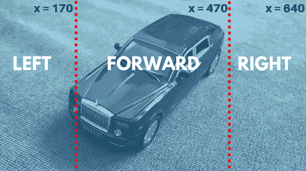

1.  如果`x`位置在 170 和 470 之间，红点在`FORWARD`区域，机器人将向`FORWARD`移动。

1.  如果`x`位置在 470 和 640 之间，红点在`RIGHT`区域，机器人将向`RIGHT`转动。

使用移动电源为您的机器人供电，以便它可以自由移动。接下来，编译程序并在您的 RPi 机器人上构建它。只要球不在机器人面前，红点将保持在屏幕的极左上角，机器人将不会移动。如果您将球移动到摄像头前，并且距离机器人 15 厘米，机器人将开始跟随球。

随着机器人跟随球，球的颜色会因外部因素（如阳光或房间内的光线）而变化。如果房间里的光线较暗，球对机器人来说会显得稍暗。同样，如果房间里的光线太亮，球的某些部分也可能显得白色。这可能导致阈值处理无法正常工作，这可能意味着机器人无法顺利跟随球。在这种情况下，您需要调整 RGB 值。

# 总结

在本章中，我们研究了 OpenCV 库中的一些重要函数。之后，我们对这些函数进行了测试，并从图像中识别出了一个物体。接下来，我们学习了如何从树莓派摄像头读取视频，如何对彩色球进行阈值处理，以及如何在球的顶部放置一个红点。最后，我们使用了树莓派摄像头和超声波传感器来检测球并跟随它。

在下一章中，我们将通过使用 Haar 级联来扩展我们的 OpenCV 知识，检测人脸。之后，我们将识别微笑并让机器人跟随人脸。

# 问题

1.  从图像中分离出一个物体的过程叫什么？

1.  垂直翻转图像的命令是什么？

1.  如果 x>428 且 y>320，红点会在哪个区块？

1.  用于调整摄像头分辨率的命令是什么？

1.  如果物体不在摄像头前方，红点会放在哪里？
