# 第八章：使用 Haar 分类器进行面部检测和跟踪

在上一章中，我们编程机器人来检测一个球体并跟随它。在本章中，我们将通过检测和跟踪人脸、检测人眼和识别微笑，将我们的检测技能提升到下一个水平。

在本章中，您将学习以下主题：

+   使用 Haar 级联进行面部检测

+   检测眼睛和微笑

+   面部跟踪机器人

# 技术要求

在本章中，您将需要以下内容：

+   三个 LED 灯

+   一个**树莓派**（RPi）机器人（连接到 RPi 的树莓派摄像头模块）

本章的代码文件可以从[`github.com/PacktPublishing/Hands-On-Robotics-Programming-with-Cpp/tree/master/Chapter08`](https://github.com/PacktPublishing/Hands-On-Robotics-Programming-with-Cpp/tree/master/Chapter08)下载。

# 使用 Haar 级联进行面部检测

Paul Viola 和 Micheal Jones 在他们的论文《使用增强级联简单特征的快速目标检测》中于 2001 年提出了基于 Haar 特征的级联分类器。Haar 特征的级联分类器是使用面部图像以及非面部图像进行训练的。Haar 级联分类器不仅可以检测正面人脸，还可以检测人的眼睛、嘴巴和鼻子。Haar 特征的分类器也被称为 Viola-Jones 算法。

# Viola-Jones 算法的基本工作

因此，简而言之，Viola-Jones 算法使用 Haar 特征来检测人脸。Haar 通常包括两个主要特征：**边缘特征**和**线特征**。我们将首先了解这两个特征，然后我们将看到这些特征如何用于检测人脸：

+   **边缘特征**：通常用于检测边缘。边缘特征由白色和黑色像素组成。边缘特征可以进一步分为水平边缘特征和垂直边缘特征。在下图中，我们可以看到左侧块上的垂直边缘特征和右侧块上的水平边缘特征：

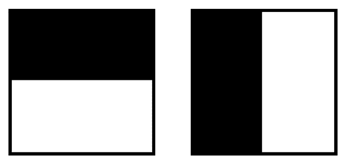

+   **线特征**：通常用于检测线条。在线特征中，一个白色像素被夹在两个黑色像素之间，或者一个黑色像素被夹在两个白色像素之间。在下图中，您可以看到左侧的两个水平线特征，一个在另一个下方，以及右侧的垂直线特征，相邻在一起：

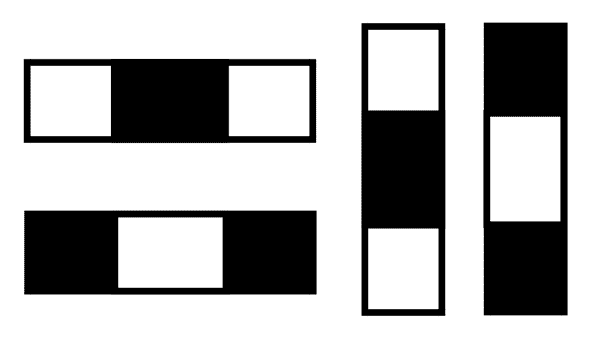

面部检测始终在灰度图像上执行，但这意味着在灰度图像中，我们可能没有完全黑色和白色的像素。因此，让我们将白色像素称为较亮的像素，黑色像素称为较暗的像素。如果我们看下面的灰度人脸图片，额头区域较亮（较亮的像素）与眉毛区域（较暗的像素）相比：

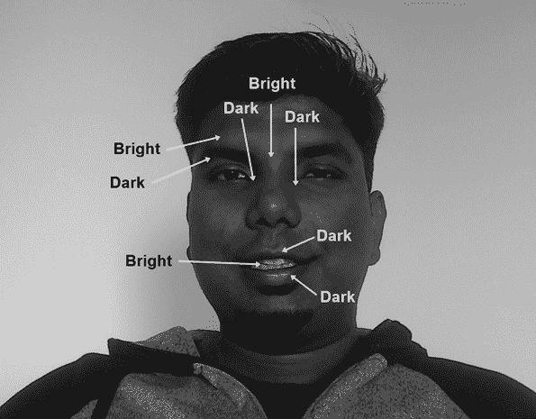

与眼睛和脸颊区域相比，鼻线区域更亮。同样，如果我们看口部区域，上唇区域较暗，牙齿区域较亮，下唇区域再次较暗：

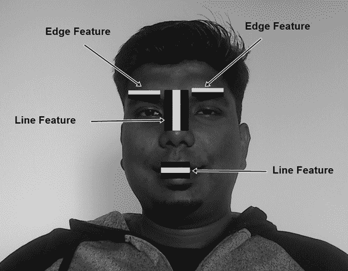

这就是通过使用 Haar 级联的边缘和线特征，我们可以检测人脸中最相关的特征点，如眼睛、鼻子和嘴巴。

OpenCV 4.0 包括不同的预训练 Haar 检测器，可以用于检测人脸，包括眼睛、鼻子、微笑等。在`Opencv-4.0.0`文件夹中，有一个`Data`文件夹，在`Data`文件夹中，您会找到`haarcascades`文件夹。在这个文件夹中，您会找到不同的 Haar 级联分类器。对于正面人脸检测，我们将使用`haarcascade_frontalface_alt2.xml`检测器。在下面的截图中，您可以看到`haarcascades`文件夹的路径，其中包含不同的 Haar 级联分类器：

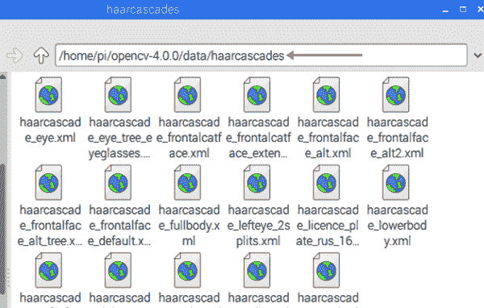

现在我们了解了 Viola-Jones 特征的基础知识，我们将编写程序，使我们的机器人使用 Haar 级联检测人脸。

# 人脸检测程序

让我们编写一个程序来检测人脸。我将这个程序命名为`FaceDetection.cpp`，您可以从本书的 GitHub 存储库的`Chapter08`文件夹中下载。

由于我们将使用`haarcascade_frontalface_alt2.xml`来检测人脸，请确保`FaceDetection.cpp`和`haarcascade_frontalface_alt2.xml`文件在同一个文件夹中。

要编写人脸检测程序，请按照以下步骤进行：

1.  在`FaceDetection.cpp`程序中，使用`CascadeClassifier`类加载 Haar 的预训练正面脸 XML，如下面的代码片段所示：

```cpp
CascadeClassifier faceDetector("haarcascade_frontalface_alt2.xml");
```

1.  声明两个矩阵变量，称为`videofeed`和`grayfeed`，以及一个名为`vid(0)`的`VideoCapture`变量，以从 RPi 相机捕获视频：

```cpp
Mat videofeed, grayfeed;
VideoCapture vid(0);
```

1.  在`for`循环内，读取相机视频。然后，水平翻转相机视频。使用`cvtColor`函数，我们可以将我们的`videofeed`转换为`grayscale`。如果您的 Pi 相机放置颠倒，将`flip`函数内的第三个参数设置为`0`。`grayscale`输出存储在`grayfeed`变量中。以下代码显示了如何完成此步骤：

```cpp
vid.read(videofeed);
flip(videofeed, videofeed, 1);
cvtColor(videofeed, grayfeed, COLOR_BGR2GRAY);
```

1.  让我们执行直方图均衡化，以改善`videofeed`的亮度和对比度。直方图均衡化是必需的，因为有时在光线较暗时，相机可能无法检测到人脸。为了执行直方图均衡化，我们将使用`equalizeHist`函数：

```cpp
equalizeHist(grayfeed, grayfeed);
```

1.  让我们检测一些人脸。为此，使用`detectMultiScale`函数，如下所示：

```cpp
detectMultiScale(image, object, scalefactor, min neighbors,flags, min size, max size);
```

在前面的代码片段中显示的`detectMultiScale`函数由以下七个参数组成：

+   +   `image`：表示输入视频源。在我们的情况下，它是`grayfeed`，因为我们将从灰度视频中检测人脸。

+   `object`：表示矩形的向量，其中每个矩形包含检测到的人脸。

+   `scalefactor`：指定图像大小必须缩小多少。比例因子的理想值在 1.1 和 1.3 之间。

+   `flags`：此参数可以设置为`CASCADE_SCALE_IMAGE`、`CASCADE_FIND_BIGGEST_OBJECT`、`CASCADE_DO_ROUGH_SEARCH`或`CASCADE_DO_CANNY_PRUNING`：

+   `CASCADE_SCALE_IMAGE`：这是最流行的标志；它通知分类器，用于检测人脸的 Haar 特征应用于视频或图像。

+   `CASCADE_FIND_BIGGEST_OBJECT`：此标志将告诉分类器在图像或视频中找到最大的脸

+   `CASCADE_DO_ROUGH_SEARCH`：此标志将在检测到人脸后停止分类器。

+   `CASCADE_DO_CANNY_PRUNNING`：此标志通知分类器不要检测锐利的边缘，从而增加检测到人脸的机会。

+   `min neighbors`：最小邻居参数影响检测到的人脸的质量。较高的**最小邻居值**将识别较少的人脸，但无论它检测到什么都一定是人脸。较低的`min neighbors`值可能会识别多个人脸，但有时也可能识别不是人脸的对象。检测人脸的理想`min neighbors`值在 3 和 5 之间。

+   `min size`：最小尺寸参数将检测最小的人脸尺寸。例如，如果我们将最小尺寸设置为 50 x 50 像素，分类器将只检测大于 50 x 50 像素的人脸，忽略小于 50 x 50 像素的人脸。理想情况下，我们可以将最小尺寸设置为 30 x 30 像素。

+   `max size`：最大尺寸参数将检测最大的人脸尺寸。例如，如果我们将最大尺寸设置为 80 x 80 像素，分类器将只检测小于 80 x 80 像素的人脸。因此，如果您离相机太近，您的脸的尺寸超过了最大尺寸，分类器将无法检测到您的脸。

1.  由于`detectMultiScale`函数提供矩形的向量作为其输出，我们必须声明一个`Rect`类型的向量。变量名为`face`。`scalefactor`设置为`1.1`，`min neighbors`设置为`5`，最小比例大小设置为 30 x 30 像素。最大大小在这里被忽略，因为如果您的脸部尺寸变得大于最大尺寸，您的脸部将无法被检测到。要完成此步骤，请使用以下代码：

```cpp
vector<Rect> face;
 faceDetector.detectMultiScale(grayfeed, faces, 1.3, 5, 0 | CASCADE_SCALE_IMAGE, Size(30, 30));
```

检测到脸部后，我们将在检测到的脸部周围创建一个矩形，并在矩形的左上方显示文本，指示“检测到脸部”：

```cpp
for (size_t f = 0; f < face.size(); f++) 
 {
rectangle(videofeed, face[f], Scalar(255, 0, 0), 2);
putText(videofeed, "Face Detected", Point(face[f].x, face[f].y), FONT_HERSHEY_PLAIN, 1.0, Scalar(0, 255, 0), 2.0);
}
```

在`for`循环内，我们使用`face.size()`函数来确定检测到了多少张脸。如果检测到一张脸，`face.size()`等于`1`，`for`循环就会满足条件。在`for`循环内，我们有矩形和`putText`函数。

矩形函数将在检测到的脸部周围创建一个矩形。它由四个参数组成：

+   第一个参数表示我们要在其上绘制矩形的图像或视频源，在我们的例子中是`videofeed`

+   `face[f]`的第二个参数表示我们要在其上绘制矩形的检测到的脸部

+   第三个参数表示矩形的颜色（在此示例中，我们将颜色设置为蓝色）

+   第四个和最后一个参数表示矩形的厚度

`putText`函数用于在图像或视频源中显示文本。它由七个参数组成：

+   第一个参数表示我们要在其上绘制矩形的图像或视频源。

+   第二个参数表示我们要显示的文本消息。

+   第三个参数表示我们希望文本显示的位置。`face[f].x`和`face[f].y`函数表示矩形的左上点，因此文本将显示在矩形的左上方。

+   第四个参数表示字体类型，我们设置为`FONT_HERSHEY_PLAIN`。

+   第五个参数表示文本的字体大小，我们设置为`1`。

+   第六个参数表示文本的颜色，设置为绿色（`Scalar(0,255,0)`）。

+   第七个和最后一个参数表示字体的厚度，设置为`1.0`。

最后，使用`imshow`函数，我们将查看视频源，以及矩形和文本：

```cpp
imshow("Face Detection", videofeed);
```

使用上述代码后，如果您已经编译和构建了程序，您将看到在检测到的脸部周围画了一个矩形：

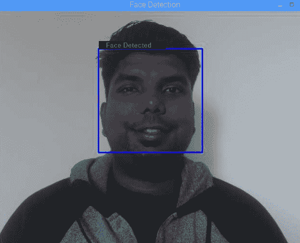

接下来，我们将检测人眼并识别微笑。一旦眼睛和微笑被识别出来，我们将在它们周围创建圆圈。

# 检测眼睛和微笑

用于检测眼睛和微笑的程序名为`SmilingFace.cpp`，您可以从本书的 GitHub 存储库的`Chapter08`文件夹中下载。

# 检测眼睛

`SmilingFace.cpp`程序基本上是`FaceDetection.cpp`程序的扩展，这意味着我们将首先找到感兴趣的区域，即脸部。接下来，使用 Haar 级联分类器检测眼睛，然后在它们周围画圆圈。

在编写程序之前，让我们首先了解不同的可用的眼睛`CascadeClassifier`。OpenCV 4.0 有三个主要的眼睛级联分类器：

+   `haarcascade_eye.xml`：此分类器将同时检测两只眼睛

+   `haarcascade_lefteye_2splits.xml`：此分类器将仅检测左眼

+   `haarcascade_righteye_2splits.xml`：此分类器将仅检测右眼

根据您的要求，您可以使用`haarcascade_eye`分类器来检测两只眼睛，或者您可以使用`haarcascade_lefteye_2splits`分类器仅检测左眼和`haarcascade_righteye_2splits`分类器仅检测右眼。在`SmilingFace.cpp`程序中，我们将首先使用`haarcascade_eye`分类器测试输出，然后我们将使用`haarcascade_lefteye_2splits`和`haarcascade_righteye_2splits`分类器测试输出。

# 使用`haarcascade_eye`进行眼睛检测

要测试`haarcascade_eye`的输出，观察以下步骤：

1.  在我们的程序中加载这个分类器：

```cpp
CascadeClassifier eyeDetector("haarcascade_eye.xml");
```

1.  要检测眼睛，我们需要在图像（视频源）中找到脸部区域（感兴趣区域）。在脸部检测的`for`循环中，我们将创建一个名为`faceroi`的`Mat`变量。`videofeed(face[f])`，这将在`videofeed`中找到脸部并将它们存储在`faceroi`变量中：

```cpp
Mat faceroi = videofeed(face[f]);
```

1.  创建一个名为`eyes`的`Rect`类型的向量，然后使用`detectMultiScale`函数来检测眼睛区域：

```cpp
vector<Rect> eyes;
eyeDetector.detectMultiScale(faceroi, eyes, 1.3, 5, 0 |CASCADE_SCALE_IMAGE,Size(30, 30));
```

在`detectMultiScale`函数中，第一个参数设置为`faceroi`，这意味着我们只想从脸部区域检测眼睛，而不是从整个视频源检测。检测到的眼睛将存储在 eyes 变量中。

1.  为了在眼睛周围创建圆圈，我们将使用一个`for`循环。让我们找到眼睛的中心。为了找到眼睛的中心，我们将使用`Point`数据类型，并且`eyecenter`变量中的方程将给出眼睛的中心：

```cpp
for (size_t e = 0; e < eyes.size(); e++)
 {
 Point eyecenter(face[f].x + eyes[e].x + eyes[e].width/2, face[f].y + eyes[e].y + eyes[e].height/2);
 int radius = cvRound((eyes[e].width + eyes[e].height)*0.20);
 circle(videofeed, eyecenter, radius, Scalar(0, 0, 255), 2);
 }
```

这的结果可以在这里看到：

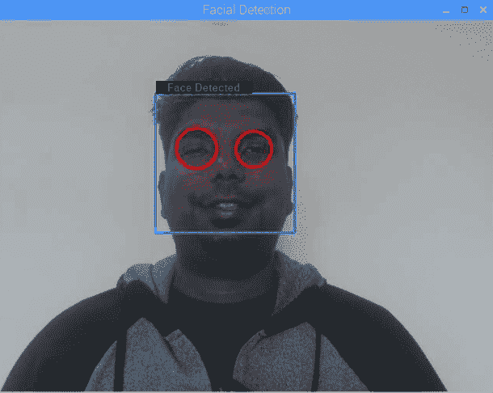

使用`radius`变量，我们计算了圆的半径，然后使用`circle`函数在眼睛周围创建红色的圆圈。

# 使用`haarcascade_lefteye_2splits`和`haarcascade_righteye_2splits`进行眼睛检测

使用`haarcascade_eye`分类器检测两只眼睛后，让我们尝试仅使用`haarcascade_lefteye_2splits`和`haarcascade_righteye_2splits`分类器分别检测左眼或右眼。

# 检测左眼

要检测左眼，执行以下步骤：

1.  在我们的程序中加载`haarcascade_lefteye_2splits`级联分类器：

```cpp
CascadeClassifier eyeDetectorleft("haarcascade_lefteye_2splits.xml");
```

1.  由于我们想要在脸部区域检测左眼，我们将创建一个名为`faceroi`的`Mat`变量，并在其中存储脸部区域的值：

```cpp
Mat faceroi = videofeed(face[f]);
```

1.  使用`detectMultiScale`函数创建一个名为`lefteye`的`Rect`类型的向量来检测左眼区域。`min neighbors`参数设置为`25`，以便分类器只检测左眼。如果我们将`min neighbors`设置为低于 25，`haarcascade_lefteye_2splits`分类器也可能检测到右眼，这不是我们想要的。要完成此步骤，请使用以下代码：

```cpp
vector<Rect> lefteye;
eyeDetectorleft.detectMultiScale(faceROI, lefteye, 1.3, 25, 0 |CASCADE_SCALE_IMAGE,Size(30, 30));
 for (size_t le = 0; le < lefteye.size(); le++)
 {
 Point center(face[f].x + lefteye[le].x + lefteye[le].width*0.5, face[f].y + lefteye[le].y + lefteye[le].height*0.5);
 int radius = cvRound((lefteye[le].width + lefteye[le].height)*0.20);
 circle(videofeed, center, radius, Scalar(0, 0, 255), 2);
 }
```

上述代码的输出如下：

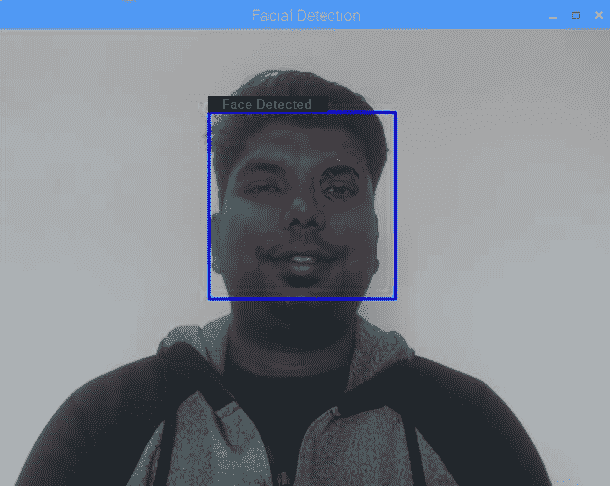

检测左右眼分开的`for`循环代码是`SmilingFace.cpp`程序的一部分，但是被注释掉了。要测试代码，首先注释掉同时检测两只眼睛的`for`循环，然后取消注释检测左眼和右眼的另外两个`for`循环。

# 检测右眼

检测右眼的编程逻辑与检测左眼非常相似。我们唯一需要改变的是分类器名称和一些变量名称，以区分左眼和右眼。要检测右眼，执行以下步骤：

1.  加载`haarcascade_righteye_2splits`级联分类器：

```cpp
CascadeClassifier eyeDetectorright("haarcascade_righteye_2splits.xml");
```

1.  在脸部检测的`for`循环中，找到脸部区域。然后，使用`detectMultiScale`函数来检测右眼。使用`circle`函数在右眼周围创建一个绿色的圆圈。为此，请使用以下代码：

```cpp
Mat faceroi = videofeed(face[f]); 
vector<Rect>  righteye;
eyeDetectorright.detectMultiScale(faceROI, righteye, 1.3, 25, 0 |CASCADE_SCALE_IMAGE,Size(30, 30));

for (size_t re = 0; re < righteye.size(); re++)
 {
 Point center(face[f].x + righteye[re].x + righteye[re].width*0.5, face[f].y + righteye[re].y + righteye[re].height*0.5);
 int radius = cvRound((righteye[re].width + righteye[re].height)*0.20);
 circle(videofeed, center, radius, Scalar(0, 255, 0), 2);
 }
```

上述代码的输出如下：

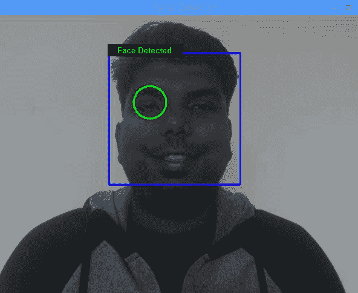

如果我们结合左眼和右眼的检测器代码，最终输出将如下所示：

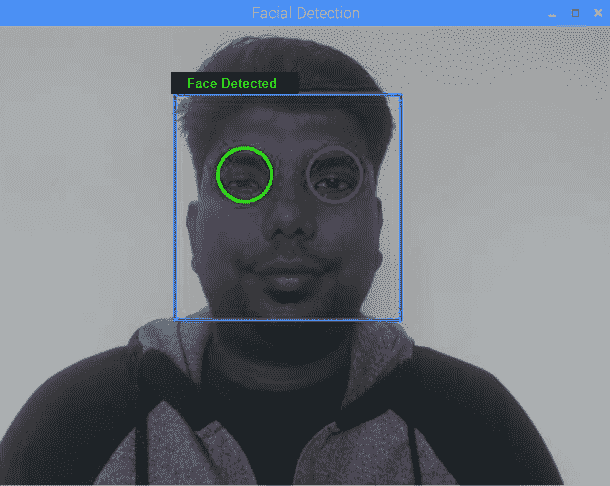

正如我们所看到的，图片中的左眼被红色圆圈包围，右眼被绿色圆圈包围。

# 识别微笑

在从面部区域检测到眼睛后，让我们编写程序来识别笑脸。当网络摄像头检测到嘴巴周围的黑白黑线特征时，即上下嘴唇通常比牙齿区域略暗时，网络摄像头将识别出一个微笑的脸：

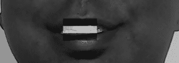

# 微笑识别的编程逻辑

微笑识别的编程逻辑与眼睛检测类似，我们还将在面部检测的`for`循环内编写微笑识别程序。要编写微笑识别程序，请按照以下步骤进行：

1.  加载微笑`CascadeClassifier`：

```cpp
CascadeClassifier smileDetector("haarcascade_smile.xml");
```

1.  我们需要检测面部区域，它位于面部区域内。面部区域再次是我们的感兴趣区域，为了从视频源中找到面部区域，我们将使用以下命令：

```cpp
Mat faceroi = videofeed(face[f]);
```

1.  声明一个`smile`变量，它是`Rect`类型的向量。然后使用`detectMultiScale`函数。在`detectMultiScale`函数中，将`min neighbors`设置为`25`，以便只有在人微笑时才创建一个圆圈（如果我们将最小邻居设置为低于 25，即使人没有微笑，也可能在嘴周围创建一个圆圈）。您可以在 25-35 之间变化`min neighbors`的值。接下来，在`for`循环内，我们编写了在嘴周围创建绿色圆圈的程序。要完成此步骤，请使用以下代码：

```cpp
vector<Rect> smile; 
smileDetector.detectMultiScale(faceroi, smile, 1.3, 25, 0 |CASCADE_SCALE_IMAGE,Size(30, 30));
 for (size_t sm = 0; sm <smile.size(); sm++)
 {
 Point scenter(face[f].x + smile[sm].x + smile[sm].width*0.5, face[f].y + smile[sm].y + smile[sm].height*0.5);
 int sradius = cvRound((smile[sm].width + smile[sm].height)*0.20);
 circle(videofeed, scenter, sradius, Scalar(0, 255, 0), 2);
 }
```

前面代码的输出如下：

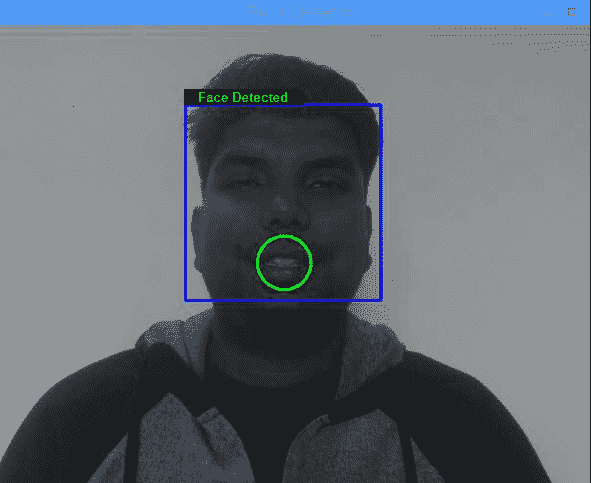

在接下来的部分中，当检测到眼睛和微笑时，我们将打开不同的 LED。当面部移动时，我们还将使我们的机器人跟随检测到的面部。

# 面部跟踪机器人

用于打开/关闭 LED 和跟踪人脸的程序称为`Facetrackingrobot.cpp`，您可以从本书的 GitHub 存储库的`Chapter08`文件夹中下载。

在`Facetrackingrobot`程序中，我们将首先检测面部，然后是左眼、右眼和微笑。一旦检测到眼睛和微笑，我们将打开/关闭 LED。之后，我们将在面部矩形的中心创建一个小点，然后使用这个点作为移动机器人的参考。

# 接线

对于`Facetrackingrobot`程序，我们至少需要三个 LED：一个用于左眼，一个用于右眼，一个用于微笑识别。这三个 LED 显示在以下图表中：

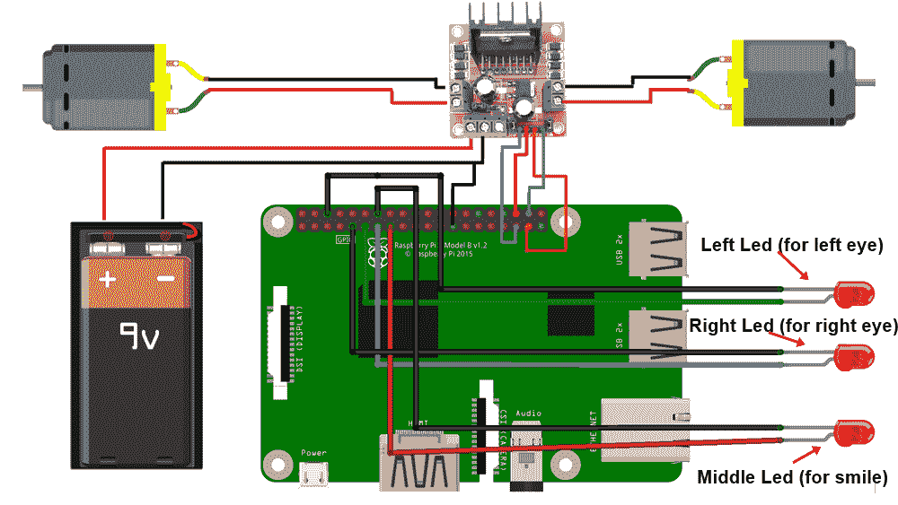

LED 和机器人的接线如下：

+   对应**左眼**的左 LED 连接到**wiringPi pin 0**

+   对应**右眼**的右 LED 连接到**wiringPi pin 2**

+   对应**微笑**的中间 LED 连接到**wiringPi pin 3**

+   电机驱动器的**IN1**引脚连接到**wiringPi pin 24**

+   电机驱动器的**IN2**引脚连接到**wiringPi pin 27**

+   电机驱动器的**IN3**引脚连接到**wiringPi pin 25**

+   电机驱动器的**IN4**引脚连接到**wiringPi pin 28**

在我的机器人上，我已经把左右 LED 贴在机器人的顶部底盘上。第三个 LED（中间 LED）贴在机器人的底盘上。我使用绿色 LED 作为眼睛，红色 LED 作为微笑：

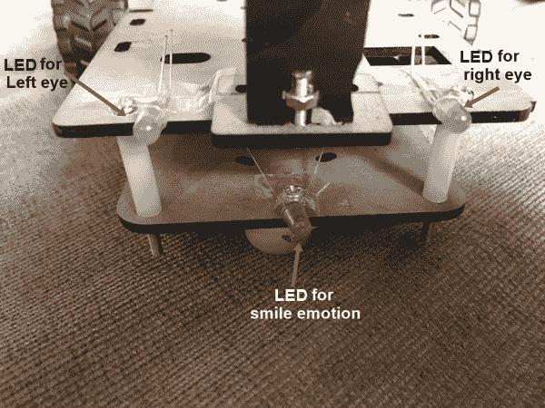

# 编程逻辑

在`Facetrackingrobot`程序中，将 wiringPi 引脚 0、2 和 3 设置为输出引脚：

```cpp
 pinMode(0,OUTPUT);
 pinMode(2,OUTPUT);
 pinMode(3,OUTPUT);
```

从面部检测程序中，您可能已经注意到面部跟踪过程非常缓慢。因此，当您将脸部向左或向右移动时，必须确保电机不要移动得太快。为了减慢电机的速度，我们将使用`softPwm.h`库，这也是我们在第二章中使用的*使用 wiringPi 实现眨眼*：

1.  从`softPwm.h`库中，使用`softPwmCreate`函数声明四个电机引脚（`24`，`27`，`25`和`28`）：

```cpp
softPwmCreate(24,0,100); //pin 24 is left Motor pin
softPwmCreate(27,0,100); //pin 27 is left motor pin 
softPwmCreate(25,0,100); //pin 25 is right motor pin
softPwmCreate(28,0,100); //pin 28 is right motor pin
```

`softPwmCreate`函数中的第一个参数表示 RPi 的 wiringPi 引脚。第二个参数表示我们可以移动电机的最小速度，第三个参数表示我们可以移动电机的最大速度。

1.  加载面部、左眼、右眼和微笑`CascadeClassifiers`：

```cpp
CascadeClassifier faceDetector("haarcascade_frontalface_alt2.xml");
CascadeClassifier eyeDetectorright("haarcascade_righteye_2splits.xml");
CascadeClassifier eyeDetectorleft("haarcascade_lefteye_2splits.xml");
CascadeClassifier smileDetector("haarcascade_smile.xml");
```

1.  在`for`循环内，声明三个布尔变量，称为`lefteyedetect`、`righteyedetect`和`isSmiling`。将这三个变量都设置为`false`。使用这三个变量，我们将检测左眼、右眼和微笑是否被检测到。声明`facex`和`facey`变量，用于找到脸部矩形的中心。要完成此步骤，请使用以下代码：

```cpp
bool lefteyedetect = false;
bool righteyedetect = false;
bool isSmiling = false;
int facex, facey;
```

1.  使用`detectMultiScale`函数检测面部，然后在`for`循环内编写程序创建检测到的面部周围的矩形：

```cpp
vector<Rect> face;
faceDetector.detectMultiScale(grayfeed, face, 1.1, 5, 0 | CASCADE_SCALE_IMAGE,Size(30, 30)); 
 for (size_t f = 0; f < face.size(); f++) 
 {
 rectangle(videofeed, face[f], Scalar(255, 0, 0), 2);

 putText(videofeed, "Face Detected", Point(face[f].x, face[f].y), FONT_HERSHEY_PLAIN, 1.0, Scalar(0, 255, 0), 1.0); 

facex = face[f].x +face[f].width/2;
facey = face[f].y + face[f].height/2; 

Point facecenter(facex, facey);
circle(videofeed,facecenter,5,Scalar(255,255,255),-1);
```

`face[f].x + face[f].width/2`将返回矩形的*x*中心值，`face[f].y + face[f].height/2`将返回矩形的*y*中心值。 *x*中心值存储在`facex`变量中，*y*中心值存储在`facey`变量中。

1.  提供`facex`和`facey`作为`Point`变量的输入，以找到矩形的中心，称为`facecenter`。在圆函数中，使用`facecenter`点变量作为输入，在脸部矩形的中心创建一个点：

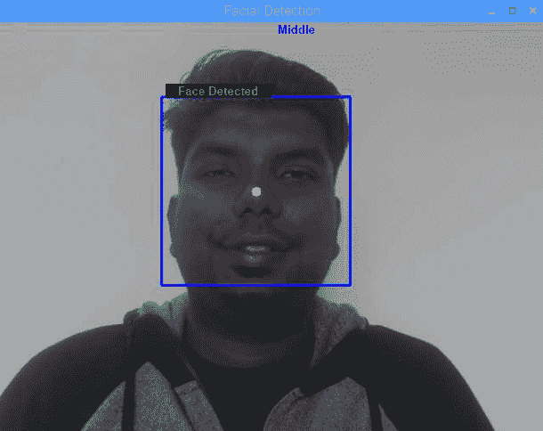

1.  当检测到左眼时，我们将在其周围创建一个红色圆圈，并将`lefteyedetect`变量设置为`true`：

```cpp
eyeDetectorleft.detectMultiScale(faceroi, lefteye, 1.3, 25, 0 |CASCADE_SCALE_IMAGE,Size(30, 30));
 for (size_t le = 0; le < lefteye.size(); le++)
 {
 Point center(face[f].x + lefteye[le].x + lefteye[le].width*0.5, face[f].y + lefteye[le].y + lefteye[le].height*0.5);
 int radius = cvRound((lefteye[le].width + lefteye[le].height)*0.25);
 circle(videofeed, center, radius, Scalar(0, 0, 255), 2);
 lefteyedetect = true;
 }
```

1.  当检测到右眼时，我们将在其周围创建一个浅蓝色圆圈，并将`righteyedetect`变量设置为`true`：

```cpp
 eyeDetectorright.detectMultiScale(faceroi, righteye, 1.3, 25, 0 |CASCADE_SCALE_IMAGE,Size(30, 30));
 for (size_t re = 0; re < righteye.size(); re++)
 {
 Point center(face[f].x + righteye[re].x + righteye[re].width*0.5, face[f].y + righteye[re].y + righteye[re].height*0.5);
 int radius = cvRound((righteye[re].width + righteye[re].height)*0.25);
 circle(videofeed, center, radius, Scalar(255, 255, 0), 2);
 righteyedetect = true;
 }
```

1.  当检测到微笑时，我们将在嘴周围创建一个绿色圆圈，并将`isSmiling`设置为`true`：

```cpp
 smileDetector.detectMultiScale(faceroi, smile, 1.3, 25, 0 |CASCADE_SCALE_IMAGE,Size(30, 30));
 for (size_t sm = 0; sm <smile.size(); sm++)
 {
 Point scenter(face[f].x + smile[sm].x + smile[sm].width*0.5, face[f].y + smile[sm].y + smile[sm].height*0.5);
 int sradius = cvRound((smile[sm].width + smile[sm].height)*0.25);
 circle(videofeed, scenter, sradius, Scalar(0, 255, 0), 2, 8, 0);
 isSmiling = true;
 }
```

在下面的屏幕截图中，您可以看到左眼周围画了一个红色圆圈，右眼周围画了一个浅蓝色圆圈，嘴周围画了一个绿色圆圈，并且在围绕脸部的蓝色矩形的中心有一个白点：

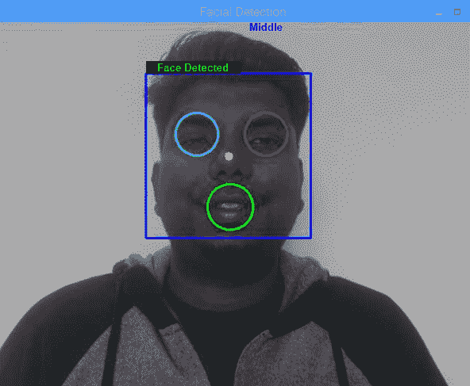

使用三个`if`条件，我们将检查`lefteyedetect`、`righteyedetect`和`isSmiling`变量何时为`true`，并在它们为`true`时打开它们各自的 LED：

+   当检测到左眼时，`lefteyedetect`变量将为`true`。当检测到左眼时，我们将打开连接到 wiringPi 引脚 0 的机器人上的左 LED，如下面的代码所示：

```cpp
if(lefteyedetect == true){
digitalWrite(0,HIGH);
}
else
{
digitalWrite(0,LOW);
}
```

+   当检测到右眼时，`righteyedetect`变量将为`true`。当检测到右眼时，我们将打开连接到 wiringPi 引脚 2 的机器人上的右 LED：

```cpp
if(righteyedetect == true){
digitalWrite(2,HIGH);
}
else
{
digitalWrite(2,LOW);
}
```

+   最后，当识别到微笑时，`isSmiling`变量将为 true。当识别到微笑时，我们将打开连接到 wiringPi 引脚 3 的中间 LED：

```cpp
if(isSmiling == true){
 digitalWrite(3,HIGH);
 }
 else
 {
 digitalWrite(3,LOW);
 }
```

接下来，我们将使用脸部矩形上的白点（点）将机器人向左和向右移动。

# 使用脸部三角形上的白点移动机器人

与第七章类似，*使用 OpenCV 构建一个目标跟踪机器人*，我们将摄像头屏幕分为三个部分：左侧部分、中间部分和右侧部分。当白点位于左侧或右侧部分时，我们将向左或向右转动机器人，从而跟踪脸部。即使我没有调整`videofeed`的大小，`videofeed`的分辨率设置为 640 x 480（宽度为 640，高度为 480）。

您可以根据需要变化范围，但如下图所示，左侧部分设置为 x 范围从 0 到 280，中间部分设置为 280-360 的范围，右侧部分设置为 360 到 640 的范围：

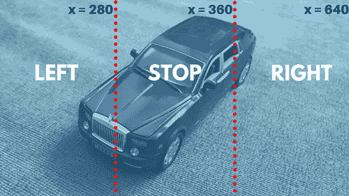

当我们移动我们的脸时，脸部矩形将移动，当脸部矩形移动时，矩形中心的白点也会移动。当点移动时，`facex`和`facey`的值将发生变化。将摄像头屏幕分为三个部分时，我们将使用`facex`变量作为参考，然后我们将使用三个 if 条件来检查白点位于哪个部分。用于比较`facex`值的代码如下：

```cpp
if(facex > 0 && facex < 280)
 {
 putText(videofeed, "Left", Point(320,10), FONT_HERSHEY_PLAIN, 1.0, CV_RGB(0, 0, 255), 2.0); 
 softPwmWrite(24, 0);
 softPwmWrite(27, 30);
 softPwmWrite(25, 30);
 softPwmWrite(28, 0); 
 } 

 if(facex > 360 && facex < 640)
 {
 putText(videofeed, "Right", Point(320,10), FONT_HERSHEY_PLAIN, 1.0, CV_RGB(0, 0, 255), 2.0); 
 softPwmWrite(24, 30);
 softPwmWrite(27, 0);
 softPwmWrite(25, 0);
 softPwmWrite(28, 30);

 }
 if(facex > 280 && facex < 360)
 {
 putText(videofeed, "Middle", Point(320,10), FONT_HERSHEY_PLAIN, 1.0, CV_RGB(0, 0, 255), 2.0); 
 softPwmWrite(24, 0);
 softPwmWrite(27, 0);
 softPwmWrite(25, 0);
 softPwmWrite(28, 0);
 }
```

如果满足第一个`if`条件，这意味着白点位于 0 到 280 之间。在这种情况下，我们在`videofeed`上打印`Left`文本，然后使用`softPwmWrite`函数，使机器人进行轴向左转。在`softPwmWrite`函数内，第一个参数代表引脚号，第二个参数代表我们的电机移动的速度。由于 wiringPi 引脚 24 设置为 0（低），wiringPi 引脚 27 设置为 30，左电机将以 30 的速度向后移动。同样，由于 wiringPi 引脚 25 设置为 30，wiringPi 引脚 28 设置为 0（低），右电机将以 30 的速度向前移动。

30 的速度值在 0 到 100 的范围内，我们在`softPwmCreate`函数中设置。您也可以改变速度值。

如果白点位于 360 到 640 之间，将打印`Right`文本，并且机器人将以 30 的速度进行轴向右转。

最后，当白点位于 280 到 360 之间时，将打印`Middle`文本，机器人将停止移动。

这就是我们如何让机器人跟踪脸部并跟随它。

# 摘要

在本章中，我们使用 Haar 面部分类器从视频源中检测面部，然后在其周围画一个矩形。接下来，我们从给定的面部检测眼睛和微笑，并在眼睛和嘴周围画圈。之后，利用我们对面部、眼睛和微笑检测的知识，当检测到眼睛和微笑时，我们打开和关闭机器人的 LED。最后，通过在脸部矩形中心创建一个白点，我们使机器人跟随我们的脸。

在下一章中，我们将学习如何使用我们的声音控制机器人。我们还将创建一个 Android 应用程序，用于识别我们所说的内容。当 Android 应用程序检测到特定关键词时，Android 智能手机的蓝牙将向树莓派蓝牙发送数据位。一旦我们的机器人识别出这些关键词，我们将使用它们来使机器人朝不同方向移动。

# 问题

1.  我们用于检测面部的分类器的名称是什么？

1.  当我们张开嘴时，会创建哪种类型的特征？

1.  哪个级联可以用于仅检测左眼？

1.  从面部检测眼睛时，该区域通常被称为什么？

1.  `equalizeHist`函数的用途是什么？
