# 第九章：构建一个语音控制的机器人

2012 年，我想创建一个可以由 Android 智能手机控制的机器人。然而，当时我对 Android 编程并不了解。令我惊讶的是，我发现了一个名为 App Inventor 的神奇网站（[`www.appinventor.org/`](http://www.appinventor.org/)），它允许用户通过将编程块连接在一起的方式来开发 Android 应用，就像拼图一样。

在这最后一章中，我们将使用 App Inventor 网站，并学习如何使用我们的声音作为输入，用 Android 智能手机来控制我们的机器人。我们将涵盖以下主题：

+   App Inventor 简介

+   创建语音应用

+   通过蓝牙将 Android 智能手机和树莓派（RPi）配对

+   为 RPi 开发蓝牙程序

# 技术要求

+   运行 Android 版本 Lollipop（版本号 5.0-5.1.1）或更高版本的 Android 智能手机

+   树莓派机器人

本章的代码文件可以从[`github.com/PacktPublishing/Hands-On-Robotics-Programming-with-Cpp/tree/master/Chapter09`](https://github.com/PacktPublishing/Hands-On-Robotics-Programming-with-Cpp/tree/master/Chapter09)下载。

# App Inventor 简介

App Inventor 是一个由 Google 最初开发的开源基于 Web 的应用程序。目前由麻省理工学院（MIT）维护。它允许用户使用类似于 Scratch 的最先进的图形编程界面开发 Android 应用程序。开发人员必须拖放可视块来创建一个 App Inventor 的 Android 应用。App Inventor 的当前版本被称为 App Inventor 2（版本 2）或 AI2。

在下图中，您可以看到每个编程块如何连接在一起，就像拼图一样：

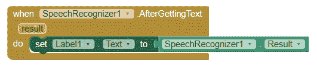

在本节中，我们将看看如何创建 App Inventor 帐户，然后使用 App Inventor 创建我们的第一个 Android 应用。

# 创建 Talking Pi Android 应用

Talking Pi 是一个简单的 Android 应用程序，您可以在文本框中输入文本，智能手机会显示并朗读文本。在创建此 Android 应用程序之前，我们首先需要访问 App Inventor 2 仪表板。Talking Pi 应用程序的最终布局将如下所示：

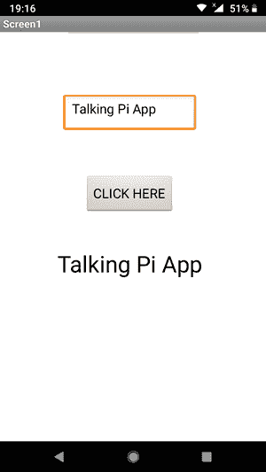

要使用 App Inventor 2 创建 Android 应用程序，您必须拥有一个 Gmail 帐户。如果您已经有一个，请在您选择的浏览器上登录。如果没有，请创建一个。现在让我们看看将 App Inventor 2 与您的 Gmail 帐户链接的步骤：

1.  登录后，转到以下链接：[ai2.appinventor.mit.edu/](http://ai2.appinventor.mit.edu/)。如果您在浏览器中使用多个 Gmail 帐户登录，您需要选择一个特定的 ID：


1.  接下来，您需要同意 AI2 的服务条款。然后，您将准备好创建 Talking Pi 应用程序。要创建一个新的 Android 应用程序项目，请单击“开始新项目”按钮，如下所示：

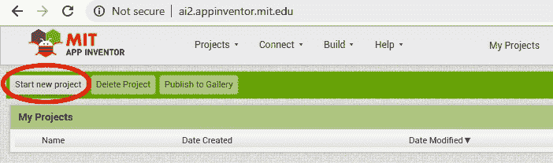

1.  接下来，将项目命名为`TalkingPi`，然后单击确定：

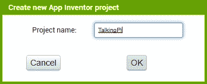

创建项目后，您将在 App Inventor 中看到以下四个主要面板，称为 Palette、Viewer、Components 和 Properties：

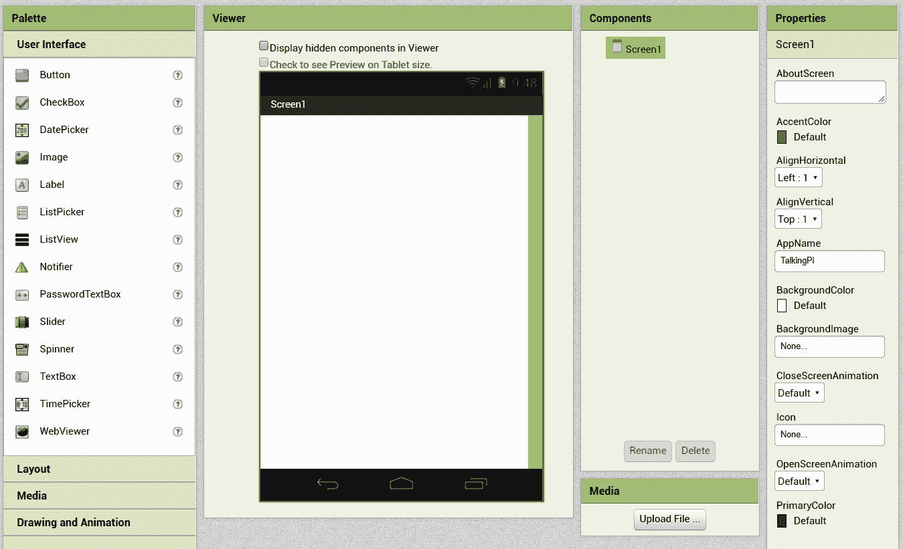

现在让我们了解每个面板的工作原理：

+   Palette 面板包括不同的组件，如按钮、文本框、画布、蓝牙、视频播放器等。

+   Viewer 面板由一个屏幕组成，我们可以从 Palette 中拖放 UI 组件。

+   组件面板显示了添加到屏幕内的可见和不可见组件的列表。例如，按钮是一个可见组件，因为它在屏幕上可见。另一方面，蓝牙是一个不可见组件，因为它在屏幕上不可见，但它在后台起作用。所有不可见组件都显示在屏幕下方。

+   属性面板允许我们修改组件的属性，这些组件在组件面板中被选中。

现在让我们继续设计应用程序。

# 设计应用程序

在我们的 Talking Pi 应用程序中，我们将添加四个主要组件：TextBox、Button、Label 和 TextToSpeech。TextBox、Button 和 Label 组件位于用户界面选项中。按照以下步骤：

1.  您可以依次将 TextBox、Button 和 Label 组件拖放到屏幕上，如下所示：

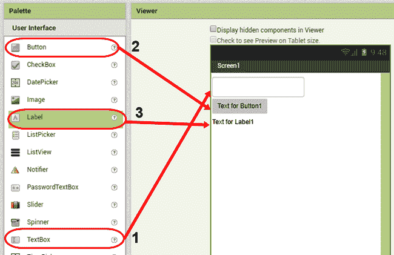

1.  添加这三个组件后，您会注意到它们都对齐到屏幕的左上角，看起来有点奇怪。为了将它们水平定位在屏幕的中心，从组件面板中选择**Screen1**，并将**AlignHorizontal**更改为**Center**，如下截图所示：

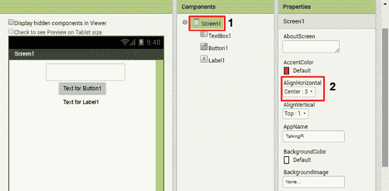

1.  接下来，为了在三个组件之间添加一些间距，我们可以在 TextBox、Button 和 Label 组件之间添加布局组件。例如，您可以选择 HorizontalArrangement 或 VerticalArrangement：

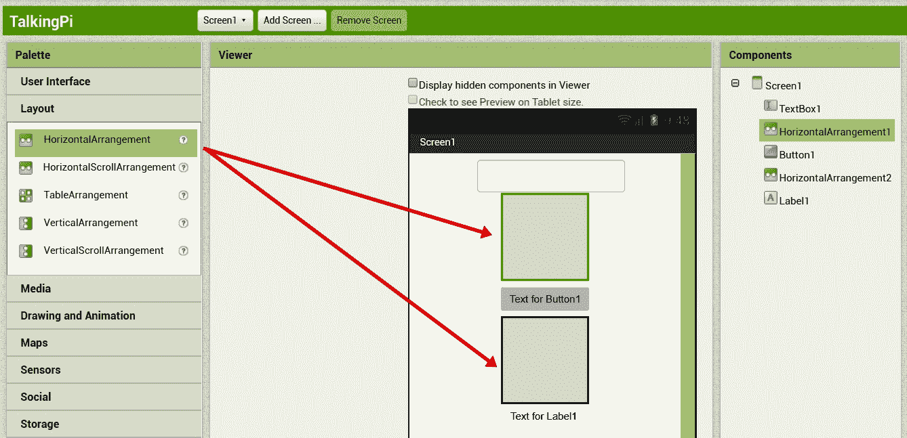

1.  如果要改变两个组件之间的距离，您需要更改 HorizontalArrangement 的高度。为此，请选择高度属性，并在 HorizontalArrangement 上设置特定的像素值，如下所示：

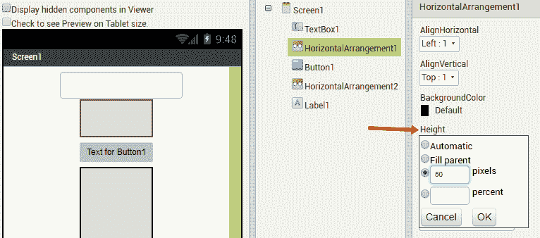

1.  接下来，选择**Button1**组件，并将其文本更改为`CLICK HERE`：

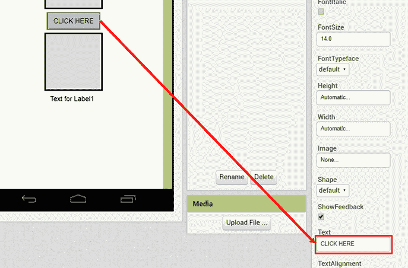

1.  同样，选择**Label1**组件，将其文本更改为`TalkingPi`，并将其**FontSize**增加到`24`：

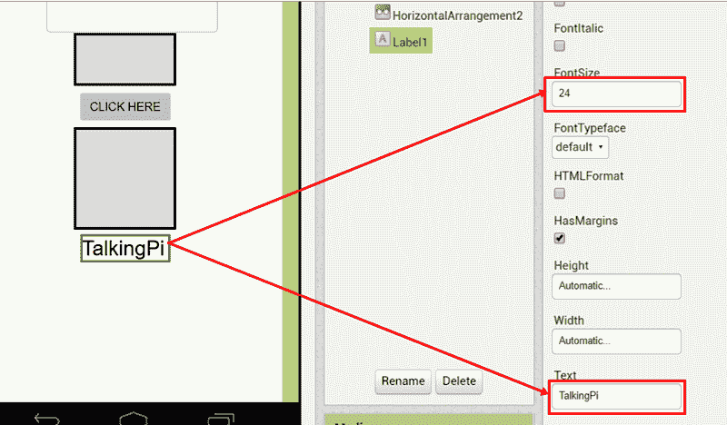

1.  最后，打开媒体选项并将 TextToSpeech 组件拖到屏幕上。由于 TextToSpeech 组件是一个不可见组件，它将显示在屏幕下方，如下所示：

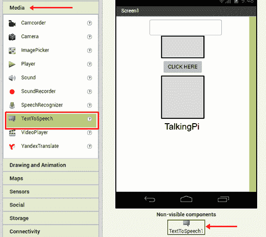

我们现在基本上已经完成了 Talking Pi 应用程序的设计。现在让我们进入 Blocks 选项，并为显示文本并在点击按钮时将其转换为语音创建编程块。

# 编程块

设计应用程序的 UI 后，点击 Blocks 按钮，该按钮位于 Design 按钮旁边，如下截图所示：


在块部分，左侧将看到**Screen1**，其中包含我们拖放到屏幕上的所有组件（可见和不可见）。如果点击任何组件，您将注意到每个组件的以下类型的块：

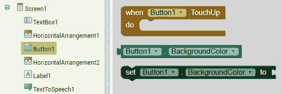

我们将主要关注构成每个组件的三种类型的块。我们将这些称为**主块**、**中间块**和**最终块**。这些块中的每一个必须按正确的顺序连接以获得一个正常工作的程序，如下图所示：

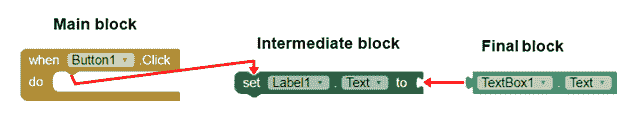

让我们看看每个块。

# 主块

App Inventor 2 中的**主块**类似于**when**循环，表示发生某事时要执行的操作。**主块**始终连接到**中间块**。我们不能直接将**最终块**连接到**主块**。主块包括一个下拉菜单，我们可以从中选择多个相同类型的组件。例如，看下面的截图：

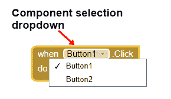

您可以看到，在有多个按钮的情况下，可以从下拉列表中选择特定的按钮。

# 中间块

**中间块**包括一个**输入插座**和一个**输出插座**。**输入插座**连接到**主块**，**输出插座**连接到**最终块**，如下图所示：

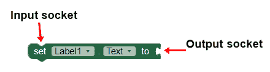

**中间块**包括两个下拉菜单。第一个下拉菜单代表相同类型的组件。例如，如果有多个标签，可以从第一个下拉菜单中选择特定的标签。第二个下拉菜单代表组件的属性。例如，对于**Label1**，我们有**Text**、**BackgroundColor**、**Width**等，如下图所示：

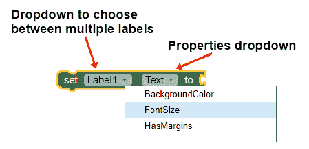

例如，**Label1** . **Text**表示我们要设置或更改**Label1**的文本。

# 最终块

**最终块**连接到**中间块**。它还包括两个下拉菜单，我们可以从中选择特定的组件及其特定属性，如下图所示：

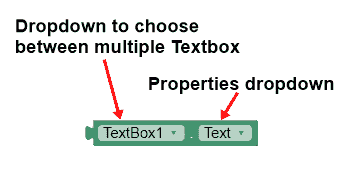

我们将使用这三种类型的块来创建我们的 Talking Pi 程序。让我们从块编程开始。

# Talking Pi 程序

Talking Pi 编程逻辑非常简单。当按下**Button1**时，**Label1**必须显示在**Textbox1**内键入的文本，并且**TextToSpeech1**必须朗读该文本。执行此块程序的步骤如下：

1.  首先，点击**Button1**组件并选择**when Button1.Click**主块：

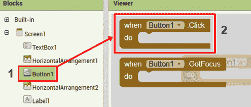

1.  接下来，由于我们希望在单击**Button1**时更改**Label1**的文本，因此选择**Label1**组件中的**Label1.Text**块：

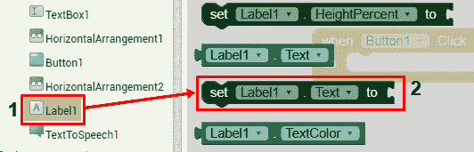

1.  接下来，将**Label1.Text**块拖到**Button1.Click**块内以连接这两个块。一旦连接了两个块，就会听到点击声音：

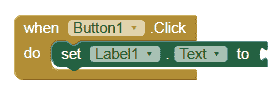

1.  现在，我们希望在标签组件中显示文本框内的文本。从**TextBox1**组件中，选择如下**TextBox1.Text**块：

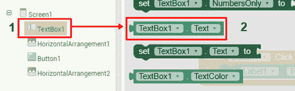

1.  接下来，将**TextBox1.Text**块连接到**Label1.Text**块。现在，当您按下按钮时，标签将显示文本框内的文本。**Label1**现在设置为显示**TextBox1**内的文本，如下所示：


1.  之后，要朗读文本框内的文本，点击**TextToSpeech1**组件并选择**call TextToSpeech1.Speak**块，如下所示：

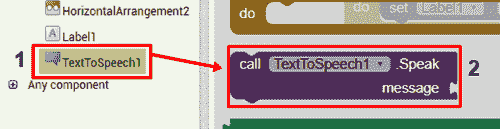

1.  将此块连接到**Label1.Text**块下方。在消息插座内，连接**TextBox1.Text**最终块。这意味着文本框内键入的任何文本都将被**TextToSpeech1**块朗读，例如：

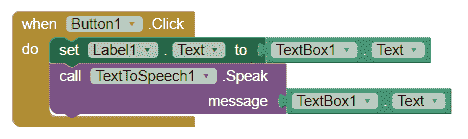

我们现在已经完成了设计我们的块程序。要在 Android 智能手机内构建和运行此应用程序，请单击“构建”下拉菜单，并在两种构建类型之间进行选择，如下图所示：

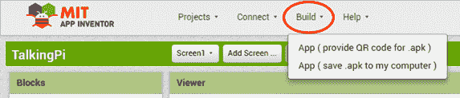

第一个选项，应用程序（为.apk 提供 QR 码），将生成一个 QR 码，您可以使用 Android 智能手机（使用 QR 扫描器应用程序）扫描。扫描 QR 码后，应用程序的`.apk`文件将下载到您的 Android 智能手机内。安装`.apk`文件以测试应用程序的输出。

第二个选项，应用程序（将.apk 保存到我的计算机），将在您的计算机内生成并下载一个`.apk`文件。您需要将`.apk`文件从计算机传输到智能手机并安装`.apk`文件。我个人更喜欢第一个选项，因为`.apk`文件直接下载到智能手机内。

您还可以从 Android 应用商店下载 MIT AI2 Companion 应用程序，并将其安装在您的 Android 智能手机上，以实时测试应用程序。因此，在应用商店中搜索**MIT AI2 Companion**，然后点击安装按钮安装该应用程序。应用程序页面如下截图所示：


在您的 Android 智能手机内安装 MIT AI2 Companion 应用程序后，点击**扫描 QR 码**按钮或输入 MIT AI2 Companion 应用程序内的六位字母代码（在 QR 码旁边），然后点击**用代码连接**按钮。要生成 QR 码或六位数，请点击**连接**，然后选择**AI Companion**，如下所示：

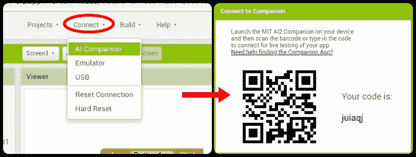

# 导入和导出应用程序的.aia 文件

您可以通过生成其`.aia`文件导出您的 Android 应用程序。要创建`.aia`文件，请执行以下任一步骤：

+   点击**项目**，然后选择**将选定的项目导出（.aia）到我的计算机**：

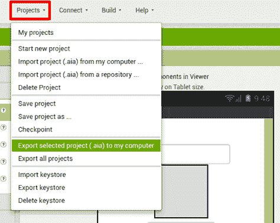

+   同样，您可以点击**项目**，然后选择**从我的计算机导入项目（.aia）**：

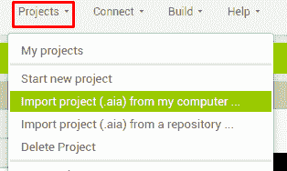

您可以从 GitHub 存储库的`Chapter09`文件夹中下载 Talking Pi 和语音控制机器人应用程序文件的`.aia`文件。

# 创建一个语音控制机器人应用

语音控制机器人应用程序是本章的主要焦点。创建语音控制机器人涉及以下三个主要部分：

+   **语音识别应用程序**：语音识别应用程序将识别我们的声音，并在识别特定单词时发送数据为文本。例如，如果我们说**向前**，应用程序将向机器人发送**F**。

+   **蓝牙连接**：这涉及在智能手机的蓝牙和 RPi 的蓝牙之间建立工作连接。

+   **RPi 机器人程序**：在这一部分，我们将解码从智能手机传输的文本信息，并相应地移动机器人。例如，如果传入的文本是**F**，那么我们将编写一个程序来使机器人向前移动。

在这一部分，我们将创建一个语音识别应用程序。在后面的部分，我们将研究建立蓝牙连接和编程我们的机器人。您可以从 GitHub 存储库的`Chapter09`文件夹中下载`VoiceControlBot.aia`文件。

要创建`VoiceControlBot`应用程序，请点击**项目**，然后选择**开始新项目：**

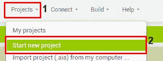

将其命名为`VoiceControlBot`，然后按下**确定**按钮：

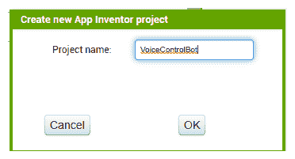

现在让我们继续进行设计部分。

# 设计应用程序

设计语音控制机器人应用程序非常容易。最终应用程序将如下所示：

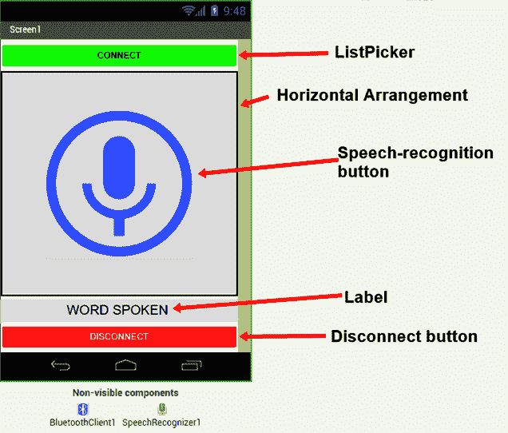

以下组件将用于设计应用程序：

+   **ListPicker**：ListPicker 将显示连接到我们智能手机的蓝牙设备列表。

+   **语音识别器**：语音识别器组件将听取我们说的话。

+   **语音识别按钮**：单击语音识别按钮时，将调用语音识别器组件，该组件将听取我们说的话。

+   **断开按钮**：断开按钮用于将智能手机与 RPi 断开连接。

+   **标签**：标签组件将显示用户说的文本。

+   **蓝牙客户端**：蓝牙客户端组件激活了我们智能手机的蓝牙连接。

+   **水平或垂直排列**：我们有一个水平排列组件，将语音识别按钮正确放置在屏幕中央。

接下来让我们看看如何添加和自定义组件。

# 添加和自定义组件

为了设计`VoiceControlBot`应用程序，将**ListPicker**（不是 ListView）组件拖到屏幕中。接下来，拖一个**水平排列**，在里面拖一个**按钮**。在**水平排列**下方，拖一个**标签**，然后再拖一个**按钮**。如果你已经正确拖动了所有组件，你的屏幕应该如下所示：

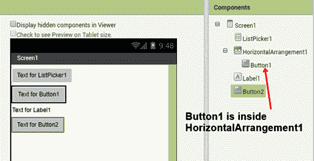

在接下来的步骤中，我根据自己的需求定制了应用程序中的每个组件。您可以按照以下步骤自定义组件：

1.  首先，选择**ListPicker1**，将**背景颜色**更改为绿色，将**宽度**设置为`填充父级`，并将**文本**更改为`连接`，如下所示：

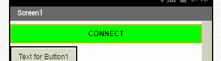

1.  接下来，选择**HorizontalArrangement1**，将其**高度**和**宽度**都更改为`填充父级`。将**AlignHorizontal**和**AlignVertical**更改为`Center`，以便 Button1 位于 HorizontalArrangement1 的中心，如下所示：

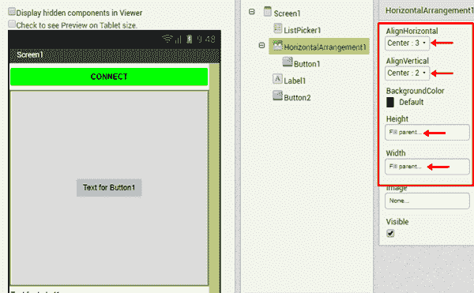

1.  之后，选择**Button1**，单击重命名按钮，并将 Button1 重命名为`SRButton`。**SR**是**语音识别**的缩写：

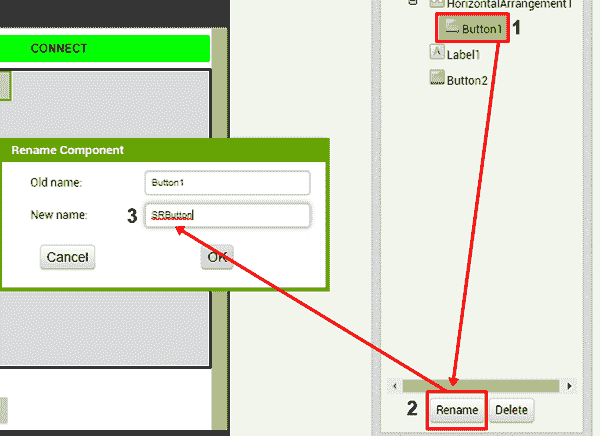

1.  接下来，我们将在**SRButton**的背景中添加一个麦克风图像。您可以从 GitHub 存储库的`Chapter09`文件夹中下载此图像。要添加背景图像，将按钮的**宽度**和**高度**更改为`200 像素`，使按钮成为正方形。接下来，从文本框中删除默认文本，如下所示：

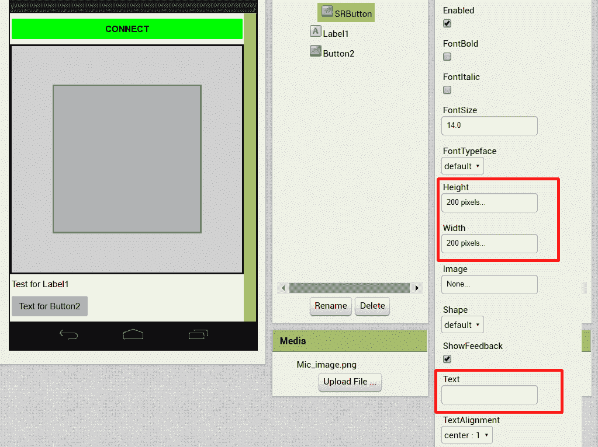

1.  之后，点击图像选项，然后选择麦克风图像将其设置为 SRButton 的背景图像：

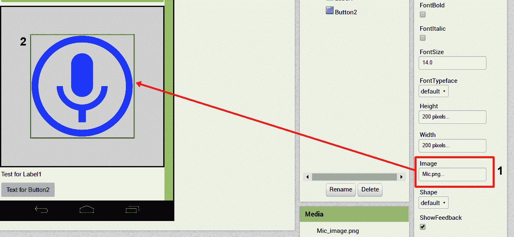

1.  接下来，选择**Label1**，将**字体大小**更改为`20`，**文本**更改为`WORD SPOKEN`，如下所示：


1.  之后，为了将 Label1 水平居中在屏幕上，选择 Screen1 并将**AlignHorizontal**设置为`Center`。

1.  最后，选择**Button2**并将其重命名为`DeleteButton`。将其**背景颜色**更改为`红色`，**宽度**更改为`填充父级`，**文本**更改为`删除`，**文本颜色**更改为`白色`，如下所示：

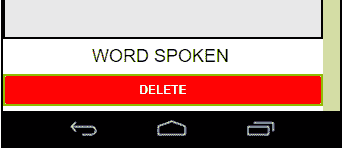

1.  设计应用程序的用户界面后，我们需要将蓝牙客户端和语音识别器组件拖到我们的屏幕上。蓝牙客户端在连接选项中，语音识别器组件在媒体选项中：

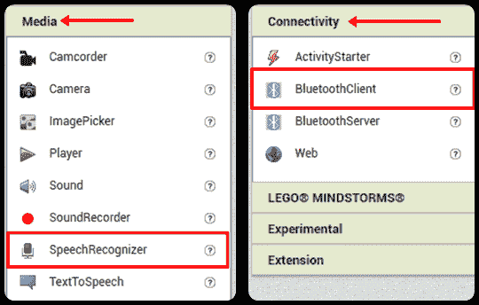

1.  一旦您添加了所有必要的组件，您的屏幕应该如下所示：

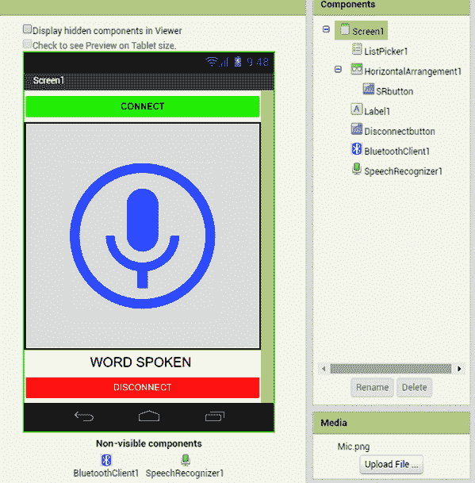

现在让我们继续编程语音控制机器人块。

# 编程语音控制机器人块

设计应用程序后，是时候编程语音控制机器人应用程序了：

1.  首先，我们将使用**ListPicker1.BeforePicking**块从**ListPicker1**中，并在列表中显示连接到我们智能手机的蓝牙设备。将此块连接到**ListPicker1.Elements**块。接下来，从**BluetoothClient1**组件中，将**BluetoothClient1.AddressAndNames**块连接到**ListPicker1.Elements**块，如下截图所示：


**ListPicker1.Elements**代表列表中的元素（列表项），这些元素是配对到我们智能手机蓝牙的设备的地址和名称。如果我们从列表中选择一个元素，**ListPicker1.AfterPicking**块就会起作用。

1.  **ListPicker1.AfterPicking**块用于连接到从列表中选择的**AddressesAndNames**蓝牙，如下截图所示：

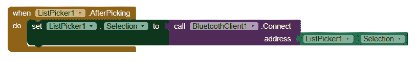

1.  一旦两台设备使用蓝牙连接，就从**SRbutton**中选择**SRbutton.Click**块。然后，从**SpeechRecognizer1**块中选择**SpeechRecognizer1.GetText**，并将其连接到**SRbutton.Click**块，如下所示：


**SpeechRecognizer1.GetText**块将激活 Google 语音识别器，并尝试识别您说的话。它将把您说的话转换成文本。

1.  接下来，使用**SpeechRecognizer1.AfterGettingText**块，我们将在标签内显示口头文本，例如：

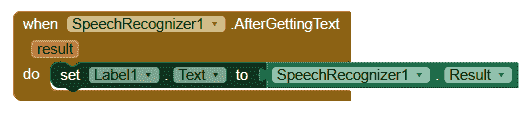

1.  之后，使用`if...then`块，我们将确定口头词是前进、后退、左转、右转还是停止。如果检测到任何这些词，我们将使用 BluetoothClient 组件向我们的 RPi 机器人发送一个字母字符。`if...then`块位于**Control**选项内，如下截图所示：

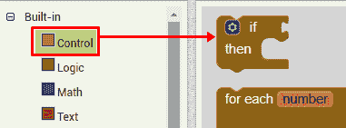

1.  选择`if...then`块，并将其放置在**SpeechRecognizer1.AfterGettingText**块内的**Label1.Text**块下方，如下所示：

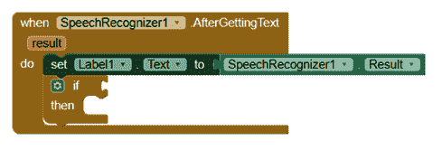

1.  接下来，为了理解口头词，我们将使用比较运算符，该运算符位于**Logic**选项内，如下截图所示：

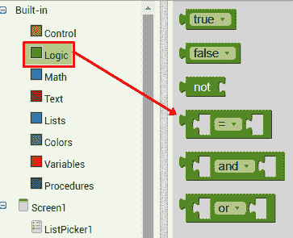

1.  将比较块连接到`if...then`块的`if`插座中，如下所示：

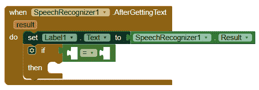

1.  在比较运算符的左插座中，连接**SpeechRecognizer1.Result**块：

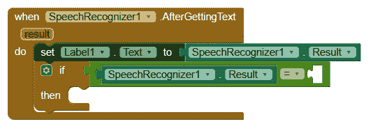

1.  在比较运算符的右插座中，连接一个空的文本字符串框。文本字符串框位于 Text 选项内：

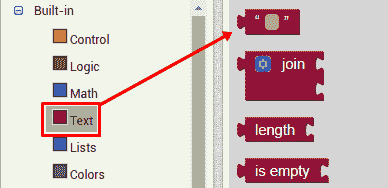

1.  将文本字符串框连接到比较运算符后，如下输入文本`forward`：

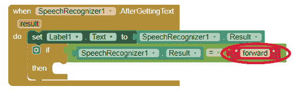

1.  这意味着如果**SpeechRecognizer1.Result**等于**forward**，那么在 then 插座内，我们将添加一个**BluetoothClient1.SendText**块。之后，我们将连接一个文本框到**BluetoothClient1.SendText**块，并输入字母`F`，如下所示：

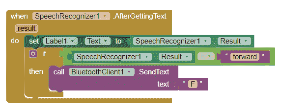

这意味着当检测到单词 forward 时，将从智能手机的蓝牙发送字符**F**到 RPi 的蓝牙。

右键单击`if...then`块并复制它，创建四个额外的块，用于单词**back**、**left**、**right**和**stop**。当检测到单词**back**时，应发送字母**B**；当检测到单词**left**时，应发送**L**；当检测到单词**right**时，应发送**R**；最后，当检测到单词**stop**时，应发送**S**。如下截图所示：


1.  之后，将**BluetoothClient1.Disconnect**块连接到**Disconnectbutton**，这样当按下此按钮时，蓝牙连接将断开：


我们现在已经完成了设计和编程我们的`VoiceControlBot`应用程序。您可以在 Android 智能手机上下载并安装此应用程序。在下一节中，我们将把我们的智能手机的蓝牙与 RPi 的蓝牙配对。启动您的 RPi，让我们开始配对过程。

# 通过蓝牙配对 Android 智能手机和 RPi

在本节中，我们将使用终端窗口将 Android 的蓝牙与 RPi 的蓝牙配对。在开始配对过程之前，我们需要在 RPi 内安装蓝牙软件包并对某些文件进行修改。为此，请按以下步骤操作：

1.  首先，要安装蓝牙软件包，请在终端窗口中输入以下命令：

```cpp
sudo apt-get install libbluetooth-dev 
```

可以在以下截图中看到上述命令的输出：


1.  接下来，我们将打开`bluetooth.service`文件并进行一些小的修改。要打开文件，请输入以下命令：

```cpp
sudo nano /lib/systemd/system/bluetooth.service
```

1.  接下来，在/bluetoothd 后键入`-C`。这将打开 RPi 蓝牙的兼容模式如下：


1.  之后，按下*Ctrl* + *O*，然后按*Enter*来**保存**文件。接下来，按*Ctrl* + *X*退出文件。使用以下命令重新启动您的 RPi：

```cpp
sudo reboot
```

1.  RPi 重新启动后，输入以下命令检查其状态：

```cpp
sudo service bluetooth status
```

现在，您应该在`bluetoothhd`旁看到`-C`。如果在输入上述命令后，您看到`lines 1-19/19(END)`并且无法在终端窗口中输入任何新命令，请关闭终端窗口，然后再次打开：


1.  接下来，要将 RPi 的蓝牙与智能手机的蓝牙配对，我们首先需要使 RPi 的蓝牙可发现。要配对设备，请输入以下命令：

```cpp
sudo bluetoothctl
```

1.  现在，您应该看到您的蓝牙的**媒体访问控制**（**MAC**）地址以及其名称。MAC 地址是一个 12 位地址，对于每个蓝牙设备都是唯一的。您的 RPi 的蓝牙将具有默认名称`raspberrypi`，如下截图所示：


1.  在输入下一组代码之前，**打开您的 Android 设备的蓝牙**并点击**配对新设备**选项如下：


1.  之后，逐一输入以下五个命令，将 RPi 的蓝牙置于可发现模式：

```cpp
power on     //turns on the Bluetooth

pairable on  //Bluetooth is ready to pair with other Bluetooth 
 discoverable on  //Bluetooth is now in discoverable mode

agent on      //Bluetooth agent is the one which 
 //manages Bluetooth pairing 
 //code. It can respond to incoming pairing 
              //code and it can also 
 //send out pairing code default-agent
```

1.  打开可发现模式后，您应该在“可用设备”选项中看到名称为 raspberrypi。选择此选项：


1.  选择**raspberrypi**选项后，您将看到一个弹出框，询问您是否要与 Raspberry Pi 的蓝牙配对。点击 PAIR 按钮：


1.  接下来，在终端窗口中，您将看到一条消息，询问您是否要与智能手机的蓝牙配对。键入`yes`（小写字母）并按*Enter*：


1.  接下来，您将在终端窗口中看到一个小弹出框，询问您是否要接受配对请求。点击**OK**：


1.  然后，您可能会看到另一个弹出框，指出连接失败。忽略此错误并点击 OK：


1.  之后，键入`exit`。您现在可以通过输入`sudo bluetoothctl`来检查设备是否已与 RPi 配对：


因此，我们已经完成了将 RPi 的蓝牙与 Android 智能手机的蓝牙配对。接下来，我们将启用 RPi 蓝牙的串行端口。

# 启用蓝牙串行端口

配对设备后，我们需要创建一个启用蓝牙串行端口的脚本。我们将命名此脚本为`bt_serial`（**bt**代表**蓝牙**）。按照以下说明创建此脚本：

1.  输入以下命令：

```cpp
sudo nano bt_serial
```

1.  在这个脚本中，输入以下行：

```cpp
hciconfig hci0 piscan
sdptool add SP
```


1.  接下来，保存（*Ctrl* + *O*）并退出（*Ctrl* + *X*）此脚本。

1.  然后需要执行并运行此脚本。输入以下命令：`sudo chmod +x bt_serial`（这是执行命令）和`sudo ./bt_serial`（这是运行命令）：


运行脚本后，您将看到消息`Serial Port service registered`。

# 为 RPi 开发蓝牙程序

设计完 Android 应用程序，配对设备并启用串行端口后，现在是时候对 RPi 进行编程，以便它可以从 Android 智能手机接收文本数据。为了从智能手机接收传入的文本数据，我们将使用套接字编程中的套接字。

# 套接字编程

套接字是网络中双向通信系统的端点。我们创建套接字以便通过它们发送信息位。为了在设备之间建立蓝牙通信，我们需要创建一个套接字。一个套接字将位于服务器端，另一个将位于客户端。在我们的情况下，Android 智能手机是客户端，RPi 是服务器。

客户端套接字尝试与服务器套接字建立连接，而服务器套接字尝试监听来自客户端套接字的传入连接请求。在蓝牙编程中，我们可以在 RFCOMM 和 L2CAP 之间进行选择，如下图所示：


在套接字程序中，以下连接步骤必须依次从客户端和服务器端进行。每个步骤代表一个函数，该函数在客户端、服务器或两个脚本中声明。按照以下步骤进行：

1.  **套接字创建（客户端/服务器）**：在客户端和服务器程序中创建套接字如下：

```cpp
socket(int domain, int type, int protocol)
```

在这个函数中，第一个参数是指通信域。在我们的情况下，通信域是蓝牙（`AF_BLUETOOTH`）。第二个参数是指通信类型（`SOCK_STREAM`）。第三个参数是指通信协议。在蓝牙编程中，我们可以选择**无线电频率通信**（**RFCOMM**）协议或**逻辑链路控制和适配协议**（**L2CAP**）。

1.  **连接（客户端）**：此函数尝试与服务器套接字建立连接：

```cpp
connect(int sock, const struct sockaddr *server_address, socklen_t info)
```

在这个函数中，第一个参数是指套接字，第二个参数是指服务器的地址，第三个参数用于查找设备地址的大小。在我们的情况下，设备地址是树莓派的地址。

1.  **绑定（服务器）**：`bind`函数绑定服务器设备的地址和端口号。RPi 的 MAC 地址将存储在绑定函数内，如下所示：

```cpp
bind(int sock, const struct sockaddr *address, socklen_t info);
```

在这个函数中，第一个参数是指套接字，第二个参数是指服务器设备（树莓派）的地址，第三个参数用于查找设备地址的大小。

1.  **监听（服务器）**：使用`listen`函数，服务器套接字等待客户端接近以建立连接：

```cpp
listen(int sock, int backlog);
```

第一个参数是指套接字。等待队列通常设置为`1`。

1.  **接受（服务器）**：`accept`函数等待传入的连接请求并创建一个新的套接字：

```cpp
int new_socket = accept(int sock, struct sock_address *clientaddress, socklen_t info);
```

在这个函数中，第二个参数是指客户端的地址，即 Android 智能手机。

1.  **发送（客户端/服务器）**：`send`函数用于从客户端向服务器发送数据，反之亦然。

1.  **读取（客户端/服务器）**：`read`函数用于从客户端向服务器读取数据，反之亦然。

1.  **关闭（客户端/服务器）**：`close`函数关闭套接字并释放分配给套接字的内存。

现在，由于我们已经使用 App Inventor 创建了`VoiceControlBot`安卓应用程序，因此无需编写客户端程序。剩下的就是为我们的 RPi 机器人编写服务器程序。

# VoiceBot 服务器程序

在这个`VoiceBot`服务器程序中，我们将首先使用套接字程序在设备之间建立套接字连接。接下来，我们将接收来自安卓智能手机发送的传入数据。最后，我们将根据发送的数据移动机器人。`VoiceBot.c`程序可以从 GitHub 存储库的`Chapter09`文件夹中下载。请按照以下步骤进行：

1.  首先，声明所有必要的头文件如下：

```cpp
#include <stdio.h>
#include <unistd.h>
#include <sys/socket.h>               //Socket header file
#include <bluetooth/bluetooth.h>      //Bluetooth header file
#include <bluetooth/rfcomm.h>         //Radio frequency communication header file
#include <wiringPi.h>
```

1.  接下来，在`main()`函数内，声明 wiringPi 引脚编号 0、2、3 和 4 为输出引脚如下：

```cpp
 pinMode(0,OUTPUT);
 pinMode(2,OUTPUT);
 pinMode(3,OUTPUT);
 pinMode(4,OUTPUT);
```

为了与其他设备建立 RFCOMM，声明`sockaddr_rc`以及`server_address`和`client_address`。`data`变量将存储和显示传入的数据。`s`和`clientsocket`分别用于存储服务器和客户端套接字的值。`bytes`变量将读取传入的字节信息。`socklen_t opt`包含`client_address`的大小。这在以下代码行中显示：

```cpp
struct sockaddr_rc server_address = { 0 }, client_address = { 0 };
char data[1024] = { 0 };
int s, clientsocket, bytes;
socklen_t opt = sizeof(client_address);
```

1.  接下来，创建`s`，通信域设置为`AF_BLUETOOTH`，通信类型设置为`SOCK_STREAM`，通信协议设置为`BTPROTO_RFCOMM`：

```cpp
s = socket(AF_BLUETOOTH, SOCK_STREAM, BTPROTO_RFCOMM);
```

1.  然后，使用`bind`函数将 RPi 的蓝牙 MAC 地址绑定到服务器套接字，并使`s`（服务器套接字）进入监听模式如下：

```cpp
bind(s, (struct sockaddr *)&server_address, sizeof(server_address));
listen(s, 1);
```

1.  一旦连接被接受，将使用`accept`函数创建一个新的客户端套接字如下：

```cpp
clientsocket = accept(s, (struct sockaddr *)&client_address, &opt);
```

1.  然后，使用`ba2str`函数将传入的字节数据转换为字符串。之后，显示连接的蓝牙的 MAC 地址如下：

```cpp
 ba2str( &client_address.rc_bdaddr, data );
 fprintf(stderr, "Connected to %s\n", data);
```

1.  之后，在`for`循环内，使用`read`函数读取传入的数据。如果字节变量中的值大于`0`，我们将按以下方式打印数据：

```cpp
 for(;;){
 bytes = read(clientsocket, data, sizeof(data));
 if( bytes > 0 ) {
 printf("Alphabet: %s\n", data);
```

现在，我们将使用五个`if`条件来检查传入的数据是否包含字母`F`、`B`、`L`、`R`或`S`，如下所示：

```cpp
 if(*data=='F')
 {
----Forward Code----
 }
 else if(*data=='B')
 {
----Backward Code----
 }
 else if(*data=='L')
 {
----Axial Left Turn Code----
 }
 else if(*data=='R')
 {
----Axial Right Turn Code----
 }
 else if(*data=='S')
 {
----Stop Code----
 }
```

上述代码可以解释如下：

+   `*data == 'F'`：机器人将向前移动

+   `*data == 'S'`：机器人将向后移动

+   `*data == 'L'`：机器人将进行轴向左转

+   `*data == 'R'`：机器人将进行轴向右转

+   `*data == 'S'`：机器人将停止

1.  最后，为了断开设备的连接，使用`close`函数关闭`clientsocket`和`s`如下：

```cpp
 close(clientsocket);
 close(s);
```

1.  接下来，由于此代码包含套接字和蓝牙头文件，因此在编译此代码时，您需要在构建命令中添加`-lbluetooth`命令。由于这是一个 C 程序而不是 C++程序，因此您还需要添加`-lwiringPi`命令来编译 wiringPi 代码，如下所示：


接下来让我们测试代码并检查最终输出。

# 测试代码

现在，在编译和构建程序之前，请确保您已经配对了安卓智能手机的蓝牙和 RPi 的蓝牙。如果它们没有配对，那么当您运行`VoiceControlBot`应用程序时，RPi 蓝牙名称（`raspberrypi`）将不会出现在蓝牙列表中。配对设备的步骤在*通过蓝牙配对安卓智能手机和 RPi*部分中列出。

完成此操作后，您需要在终端窗口内执行和运行我们之前创建的`bt_serial`脚本。执行和运行此脚本的命令如下：

```cpp
sudo chmod +x bt_serial            //Execution code
sudo ./bt_serial                   //Run Code
```

你不需要每次运行程序都执行这个脚本，但是当你启动一个新的 RPi 会话并想要测试`VoiceBot.c`程序时，你需要执行和运行这个脚本。接下来，编译和构建`VoiceBot.c`程序。之后，打开`VoiceControlBot` Android 应用程序并按下**CONNECT**列表选择器。你将在蓝牙列表中看到树莓派的名称以及其 MAC 地址。选择树莓派选项以连接设备，如下所示：


一旦它们连接，你将在终端窗口内收到一个通知，显示`Connected to:`和 Android 蓝牙 MAC 地址，如下面的屏幕截图所示：


如果你收到以下**错误 507：无法连接。设备是否打开？**错误，请不要担心。点击连接按钮并再次选择树莓派蓝牙：


一旦设备连接，你可以点击语音识别器按钮并开始说话。如果你说单词*forward*，这应该显示在屏幕上，如下面的屏幕截图所示，并且字母**F**将被发送到 RPi：


同样，当你说单词*back*、*left*、*right*和*stop*时，字母**B**、**L**、**R**和**S**，如下面的屏幕截图所示，将被发送到 RPi 的蓝牙，机器人将朝适当的方向移动：


如果你说任何其他单词，语音识别器应该识别这个单词并在屏幕上显示出来，但不会发送任何文本数据到 RPi。

# 摘要

我们通过创建我们的第一个 Android 应用程序 Talking Pi 开始了这一章，其中文本框内的文本被显示在标签上，并由智能手机朗读出来。然后，我们开发了一个声控机器人 Android 应用程序，它可以识别我们的声音并通过蓝牙将文本发送到 RPi。之后，使用终端窗口，我们将 Android 智能手机的蓝牙与 RPi 的蓝牙配对。最后，我们研究了套接字编程，并编写了`VoiceBot`程序，以与 Android 智能手机的蓝牙建立连接来控制机器人。

# 问题

1.  我们使用哪种通信协议通过蓝牙连接发送数据？

1.  蓝牙设备有什么样的地址？

1.  在`VoiceControlBot`应用程序中 ListPicker 的用途是什么？

1.  在客户端，用什么函数将客户端套接字连接到服务器套接字？

1.  你的 RPi 的默认蓝牙名称是什么？
