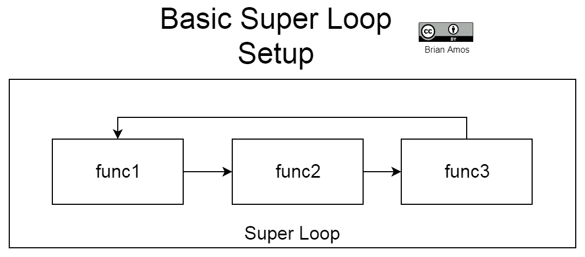
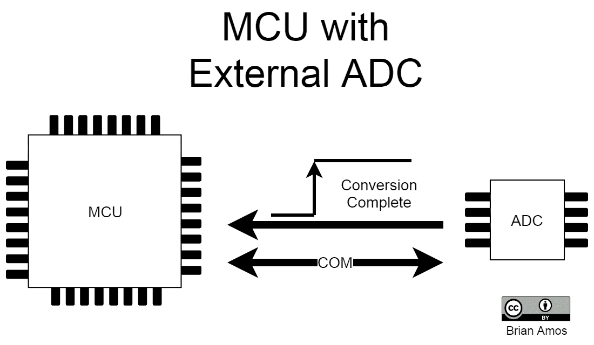
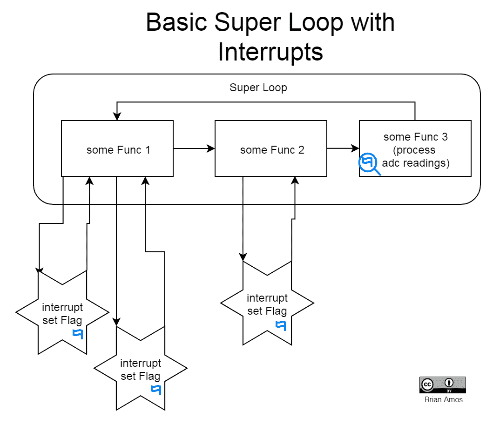
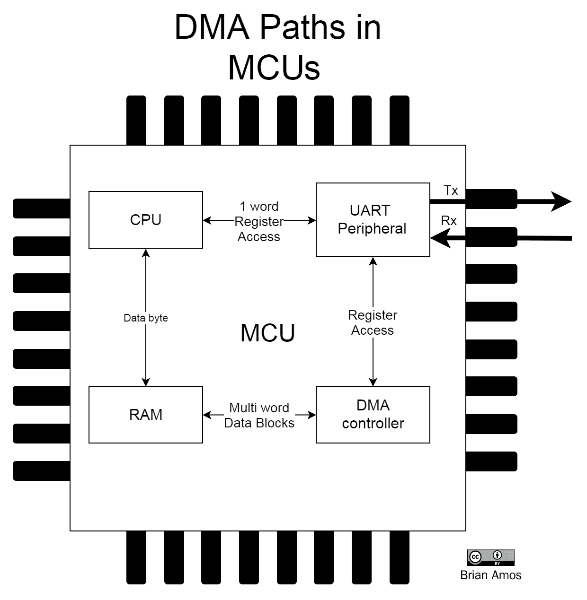
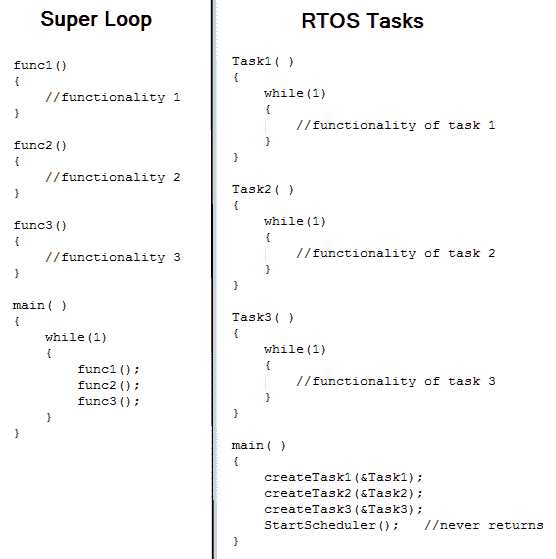
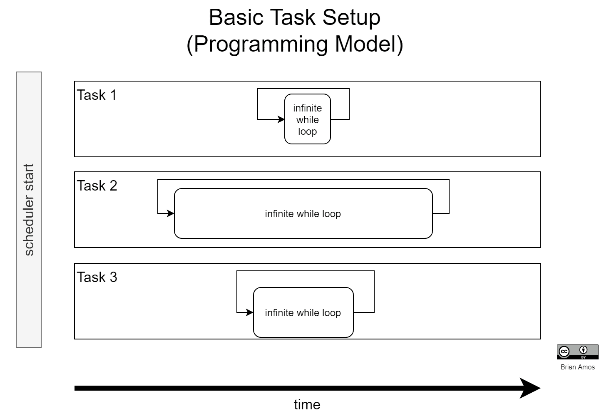
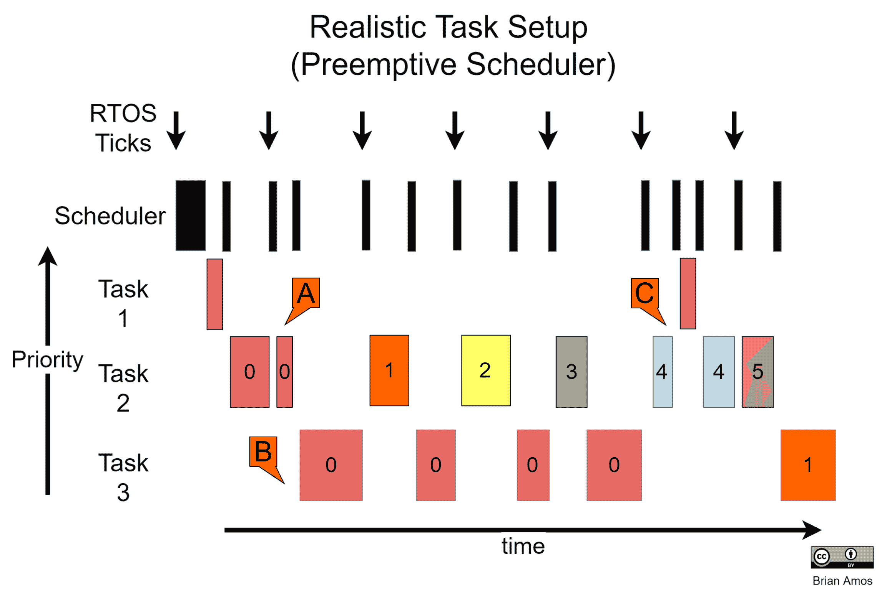

# 第二章：理解 RTOS 任务

超级循环编程范式通常是嵌入式系统工程师遇到的第一个编程方法之一。使用超级循环实现的程序有一个顶层循环，该循环遍历系统需要执行的各种函数。这些简单的 `while` 循环易于创建和理解（当它们很小的时候）。在 FreeRTOS 中，任务与超级循环非常相似——主要区别是系统可以有多个任务，但只有一个超级循环。

在本章中，我们将更深入地研究超级循环以及使用它们实现一定程度的并行性的不同方法。之后，将比较超级循环和任务，并介绍关于任务执行的理论思考方式。最后，我们将探讨如何在 RTOS 内核中实际执行任务，并比较两种基本的调度算法。

本章将涵盖以下主题：

+   介绍超级循环编程

+   使用超级循环实现并行操作

+   比较 RTOS 任务与超级循环

+   使用 RTOS 任务实现并行操作

+   RTOS 任务与超级循环——优点和缺点

# 技术要求

本章没有软件或硬件要求。

# 介绍超级循环编程

所有嵌入式系统都共享的一个共同特性是——它们没有退出点。由于其本质，嵌入式代码通常预期始终可用——在后台默默运行，处理日常维护任务，并随时准备接收用户输入。与旨在启动和停止程序的桌面环境不同，如果微控制器退出 `main()` 函数，它就没有任何事情可做。如果发生这种情况，整个设备可能已经停止工作。因此，嵌入式系统中的 `main()` 函数永远不会返回。与应用程序不同，应用程序由其宿主操作系统启动和停止，大多数基于嵌入式 MCU 的应用程序在电源开启时启动，在系统断电时突然结束。由于这种突然关闭，嵌入式应用程序通常没有与应用程序通常关联的任何关闭任务，例如释放内存和资源。

以下代码代表了超级循环的基本思想。在继续更详细的解释之前，请先看看这个：

```cpp
void main ( void )
{
    while(1)
    {
        func1();
        func2();
        func3();
        //do useful stuff, but don't return
        //(otherwise, where would we go. . what would we do. . .?!)
    }
}
```

尽管非常简单，前面的代码有几个值得注意的特性。`while` 循环永远不会返回——它会永远执行相同的三个函数（这是预期的）。这三个看似无辜的函数调用在实时系统中可能隐藏一些令人惊讶的问题。

# 基本超级循环

这个永远不会返回的主循环通常被称为**超级循环**。思考**超级**这个词总是很有趣，因为它控制着系统中的大多数事物——在下图中，除非超级循环使其发生，否则什么都不会完成。这种设置非常适合非常简单的系统，这些系统只需要执行几个耗时不太多的任务。基本的超级循环结构非常容易编写和理解；如果你试图解决的问题可以用简单的超级循环完成，那么就使用简单的超级循环。以下是之前展示的代码的执行流程——每个函数都是顺序调用的，循环永远不会退出：



现在，让我们看看在实时系统中这种执行看起来是什么样子，以及与这种方法相关的一些缺点。

# 实时系统中的超级循环

当简单的超级循环快速运行时（通常是因为它们的功能/责任有限），它们非常响应。然而，超级循环的简单性既是祝福也是诅咒。由于每个函数总是跟随前一个函数，它们总是以相同的顺序调用，并且完全依赖于彼此。任何一个函数引入的延迟都会传播到下一个函数，这会导致执行该循环迭代的总时间增加（如下图所示）。如果 `func1` 在循环中执行一次需要 10 us，而下一次需要 100 ms，那么 `func2` 在第二次通过循环时不会像第一次那样快地被调用：


让我们更深入地看看这个问题。在先前的图中，`func3` 负责检查表示外部事件的标志的状态（此事件表示信号的上升沿）。`func3` 检查标志的频率取决于 `func1` 和 `func2` 执行所需的时间。设计良好且响应迅速的超级循环通常会非常快速地执行，比事件发生的频率检查得更频繁（见标注 B）。当外部事件发生时，循环直到 `func3` 下一次执行时才会检测到该事件（见标注 A、C 和 D）。请注意，事件生成和 `func3` 检测到事件之间存在延迟。此外，延迟并不总是恒定的：这种时间差异被称为抖动。

在许多基于超级循环的系统里，超级循环的执行速度与缓慢发生的事件轮询相比极高。我们无法在页面上展示在检测到事件之间执行数百（或数千）次迭代的循环！

如果一个系统在响应事件时有一个已知的最大抖动量，那么它被认为是确定的。也就是说，它将在事件发生后的一段时间内可靠地响应事件。在实时系统中，高确定度对于时间关键组件至关重要，因为没有它，系统可能无法及时响应重要事件。

考虑一个循环不断检查硬件标志以等待事件的情况（这被称为轮询）。循环越紧密，标志检查的速度越快——当标志频繁检查时，代码对感兴趣事件的响应性会更强。如果我们有一个需要及时处理的事件，我们可以编写一个非常紧密的循环并等待重要事件发生。这种方法是可行的——但*仅*当该事件是系统唯一感兴趣的事情时。如果整个系统的唯一责任就是监视该事件（没有后台 I/O、通信等），那么这是一种有效的方法。这种类型的情形在当今复杂的现实世界系统中很少见。仅轮询的系统响应性差是其局限性。接下来，我们将探讨如何在超级循环中实现更多的并行性。

# 使用超级循环实现并行操作

即使基本超级循环只能按顺序执行函数，仍然有方法实现并行性。微控制器（MCU）有几类专门的硬件，旨在从 CPU 中分担一些负担，同时仍然使系统保持高度响应。本节将介绍这些系统以及如何在超级循环风格的程序中使用它们。

# 介绍中断

对单个事件进行轮询不仅浪费 CPU 周期和电力，而且还会导致系统对其他任何事情都没有响应，这通常应该避免。那么，我们如何让单核处理器并行处理事情呢？好吧，我们做不到——毕竟能力有限。但是，由于我们的处理器每秒可能运行数百万条指令，因此有可能让它执行接近并行的事情。微控制器还包括用于生成中断的专用硬件。中断向微控制器提供信号，允许它在事件发生时直接跳转到**中断服务例程（ISR**）。这是如此关键的功能，以至于 ARM Cortex-M 核心为此提供了一个标准的外设，称为**嵌套向量中断控制器（NVIC**）。NVIC 提供了一种处理中断的通用方式。这个术语中的*嵌套*部分表示即使中断也可以被具有更高优先级的中断中断。这非常方便，因为它允许我们最小化系统中最关键部分延迟和抖动的数量。

那么，中断如何适应超级循环以更好地实现并行活动的错觉呢？ISR 内部的代码通常尽可能保持简短，以最小化中断中花费的时间。这有几个原因。如果中断非常频繁，且 ISR 包含大量指令，ISR 可能在没有再次被调用之前就返回。对于 UART 或 SPI 等通信外设，这意味着丢失数据（这显然是不希望的）。保持代码简短的另一个原因是其他中断也需要服务，这就是为什么推迟非 ISR 上下文中的代码执行是一个好主意。

为了快速了解 ISR 如何影响抖动，让我们看看一个简单的例子，外部**模拟到数字转换器**（ADC）向 MCU 发出信号，表示已读取并准备好将转换传输到 MCU（请参考此处所示的硬件图）：



在 ADC 硬件中，一个引脚被专门用于表示已将模拟值转换为数字表示，并准备好传输到 MCU。然后 MCU 将在通信介质（图中为 COM）上启动传输。

接下来，让我们看看 ISR 调用如何在时间上相互堆叠，相对于转换就绪线的上升沿。以下图表显示了在响应信号上升沿时被调用的六个不同 ISR 实例。硬件中上升沿发生时与固件中 ISR 被调用之间的小段时间是最小延迟。ISR 响应的抖动是许多不同周期中延迟的差异：


对于关键的中断服务例程（ISR），有不同方法来最小化延迟和抖动。在基于 ARM Cortex-M 的微控制器（MCU）中，中断优先级是灵活的——可以在运行时为单个中断源分配不同的优先级。能够重新排序中断是一种确保系统最重要的部分在需要时获得 CPU 的方法。

如前所述，保持中断中执行的代码量尽可能短是很重要的，因为 ISR 内部的代码将优先于任何非 ISR 的代码（例如`main()`）。此外，较低优先级的中断只有在所有较高优先级 ISR 中的代码都已执行且 ISR 退出后才会执行——这就是为什么保持 ISR 简短很重要的原因。始终尝试限制 ISR 的责任（以及因此的代码）是一个好主意。

当多个中断嵌套时，它们不会完全返回——实际上，ARM Cortex M 处理器有一个非常有用的特性，称为中断尾链。如果处理器检测到即将退出的中断，但另一个中断正在等待，则下一个 ISR 将在没有处理器完全恢复中断前的状态的情况下执行，这进一步减少了延迟。

# 中断和超级循环

在中断服务例程（ISR）中实现最小指令和责任的一种方法是在 ISR 中完成尽可能少的工作，然后设置一个由超级循环中的代码检查的标志。这样，中断可以尽快得到处理，而无需整个系统都致力于等待该事件。在下面的图中，注意中断是如何被多次生成，最终由 `func3` 处理的。

根据中断试图实现的确切内容，它通常会从一个相关的外设取一个值并将其推入一个数组（或者从一个数组中取一个值并将其馈送到外设寄存器）。在我们的外部 ADC 的情况下，ISR（每次 ADC 执行转换时都会触发）会输出到 ADC，传输数字读数，并将其存储在 RAM 中，设置一个标志以指示一个或多个值已准备好处理。这允许中断被多次处理，而不涉及高级代码：



对于正在传输大量数据块的通信外设，可以使用数组作为存储要传输项目的队列。在整个传输结束时，可以设置一个标志来通知主循环完成。有许多情况下使用队列值是合适的。例如，如果需要对数据块执行一些处理，通常先收集数据，然后在中断之外一起处理整个块是有利的。中断驱动的方法不是实现这种阻塞数据方法的唯一方式。在下一节中，我们将查看一个可以使移动大量数据对程序员来说更容易，对处理器来说更高效的硬件。

# 介绍 DMA

记得那个处理器**真正**不能并行处理事务的断言吗？这依然成立。然而……现代微控制器不仅仅包含一个处理核心。当我们的处理核心正在处理指令时，MCU 内部还有许多其他硬件子系统正在努力工作。其中一个努力工作的子系统被称为**直接内存访问控制器**（**DMA**）：



上述图示展示了一个非常简化的硬件模块图，展示了从 RAM 到 UART 外设的两种不同数据路径的视图。

在没有 DMA 的情况下从 UART 接收字节流的情况下，UART 的信息将移动到 UART 寄存器中，由 CPU 读取，然后推送到 RAM 中存储：

1.  CPU 必须检测到单个字节（或字）已被接收，无论是通过轮询 UART 寄存器标志，还是通过设置一个当字节准备好时会被触发的中断服务例程。

1.  在 UART 传输字节之后，CPU 可以将其放入 RAM 以进行进一步处理。

1.  步骤 1 和步骤 2 会重复，直到整个消息接收完成。

在相同场景下使用 DMA 时，会发生以下情况：

1.  CPU 配置 DMA 控制器和外围设备以进行传输。

1.  DMA 控制器负责处理 UART 外围设备和 RAM 之间的所有传输。这不需要 CPU 的干预。

1.  当整个传输完成时，CPU 会收到通知，可以直接处理整个字节流。

大多数程序员如果习惯了处理超级循环和中断服务例程（ISRs），会发现直接内存访问（DMA）几乎像魔法一样神奇。控制器被配置为在需要时将内存块传输到外围设备，并在传输完成后提供通知（通常是中断）——这就完成了！

当然，这种便利性是有代价的。设置 DMA 传输最初确实需要一些时间，因此对于小传输，实际上可能需要比使用中断或轮询方法更多的时间来设置传输。

还有一些需要注意的注意事项：每个 MCU 都有特定的限制，因此在依赖 DMA 作为系统关键设计组件的可用性之前，务必阅读数据表、参考手册和勘误表：

+   MCU 内部总线的带宽限制了可以可靠地放置在单个总线上的带宽密集型外围设备的数量。

+   有时，映射到外围设备的 DMA 通道的有限可用性也会使设计过程复杂化。

正是因为这些原因，让所有团队成员参与嵌入式系统早期阶段的设计非常重要，而不仅仅是“扔过墙”。

DMA 对于高效访问大量外围设备非常出色，它使我们能够向系统添加更多和更多的功能。然而，当我们开始向超级循环添加越来越多的代码模块时，子系统之间的相互依赖关系也会变得更加复杂。在下一节中，我们将讨论扩展超级循环以适应复杂系统的挑战。

# 扩展超级循环

因此，我们现在有一个响应迅速的系统，能够可靠地处理中断。也许我们还配置了一个 DMA 控制器来处理通信外设的繁重工作。我们为什么还需要 RTOS 呢？好吧，完全有可能你不需要！如果系统只处理有限的责任，并且它们都不是特别复杂或耗时，那么可能不需要比超级循环更复杂的东西。

然而，如果系统还负责生成 **用户界面**（**UI**），运行复杂耗时算法，或处理复杂的通信堆栈，那么这些任务很可能需要相当多的时间。如果因为 MCU 正在处理从关键传感器收集数据，一个花哨的、引人注目的 UI 开始出现一点卡顿，那也不是什么大问题。动画可以被降低或消除，而实时系统的重要部分仍然保持完好。但如果是动画看起来仍然完美无瑕，尽管传感器有数据丢失呢？

在我们的行业中，每天都会以各种不同的方式出现这个问题。有时，如果系统设计得足够好，丢失的数据会被检测并标记（但无法恢复：它永远消失了）。如果设计团队真的很幸运，它甚至可能在内部测试中失败。然而，在许多情况下，丢失的传感器数据可能完全未被注意到，直到有人注意到其中一个读数似乎有点不对……有时候。如果每个人都足够幸运，关于可疑读数的错误报告可能包括一个提示，表明它似乎只在有人在前面板上（玩那些花哨的动画）时发生。这至少会给被分配调试问题的可怜的固件工程师一个提示——但我们通常甚至没有这么幸运。

这些就是需要 RTOS 的系统类型。确保最关键的任务在必要时始终运行，并将低优先级任务安排在有空闲时间时运行，这是抢占式调度器的优势所在。在这种配置中，关键传感器的读数可以被推入它们自己的任务，并分配高优先级——在处理传感器的时候，实际上会中断系统中的任何其他任务（除了中断服务例程）。那个复杂的通信堆栈可以分配比关键传感器更低的优先级。最后，花哨的 UI 和那些花哨的动画得到剩余的处理器周期。它可以自由地执行尽可能多的滑动 alpha 混合动画，但只有在处理器没有其他更好的事情可做的时候。

# 将 RTOS 任务与超级循环进行比较

到目前为止，我们只是非常随意地提到了任务，但任务到底是什么呢？一个简单的方式来思考任务就是，它只是另一个主循环。在抢占式 RTOS 中，任务与超级循环之间有两个主要区别：

+   每个任务都有自己的私有栈。与主循环中的超级循环不同，它共享系统栈，任务拥有自己的栈，系统中的其他任务都不会使用这个栈。这允许每个任务都有自己独立的调用栈，而不会干扰其他任务。

+   每个任务都被分配了一个优先级。这个优先级允许调度器做出决定，确定哪个任务应该运行（目标是确保系统中优先级最高的任务始终在进行有用的工作）。

考虑到这两个特性，每个任务都可以像它是处理器唯一要执行的事情一样进行编程。你有没有一个想监控的单个标志，以及一些用于闪亮动画的计算？没问题：只需编程任务并为其分配一个合理的优先级，相对于系统功能的其余部分。抢占式调度器将始终确保当有工作要做时，最重要的任务正在执行。当一个高优先级任务不再有有用的工作可执行，并且它在等待系统中的其他事情时，一个低优先级任务将被切换到上下文并允许运行。

FreeRTOS 调度器将在第七章 FreeRTOS 调度器中更详细地讨论。

# 使用 RTOS 任务实现并行操作

之前，我们查看了一个循环遍历三个函数的超级循环。现在，作为一个非常简单的例子，让我们将这三个函数中的每一个移动到它自己的任务中。我们将使用这三个简单的任务来检查以下内容：

+   **理论任务编程模型**：如何从理论上描述三个任务

+   **实际的循环调度**：使用循环调度算法执行任务时的样子

+   **实际的抢占式调度**：使用抢占式调度执行任务时的样子

在现实世界的程序中，几乎每个任务都不是一个单独的函数；我们只是用它作为之前过度简化的超级循环的类比。

# 理论任务编程模型

这里有一些使用超级循环执行三个函数的伪代码。同样的三个函数也包含在基于任务的系统中——每个 RTOS 任务（在右侧）包含的功能与左侧超级循环中的函数相同。在讨论使用超级循环与使用带有调度器的任务驱动方法执行代码时的差异时，我们将继续使用这一点：



你可能会立即注意到超级循环实现和实时操作系统（RTOS）实现之间的一个区别是无限`while`循环的数量。超级循环实现只有一个无限`while`循环（在`main()`中），但每个任务都有自己的无限`while`循环。

在超级循环中，由超级循环执行的三个函数在调用下一个函数之前都会运行到完成，然后循环继续到下一个迭代（以下图所示）：


在 RTOS 实现中，每个任务本质上都是一个小的无限`while`循环。而超级循环中的函数总是依次顺序调用（由超级循环中的逻辑编排），任务可以简单地被视为在调度器启动后并行执行。以下是一个 RTOS 执行三个任务的图示：



在图中，你会注意到每个`while`循环的大小并不相同。这是使用执行任务在*并行*的调度器而不是超级循环的许多好处之一——程序员不需要立即担心最长执行循环的长度会减慢其他更紧密循环的速度。图中显示了`Task 2`的循环比`Task 1`长得多。在超级循环系统中，这会导致`func1`的功能执行频率降低（因为超级循环需要先执行`func1`，然后是`func2`，最后是`func3`）。在基于任务的编程模型中，情况并非如此——每个任务的循环可以被视为与系统中的其他任务隔离——并且它们都并行运行。

这种隔离和感知到的并行执行是使用 RTOS 的一些好处；它减轻了程序员的一些复杂性。所以——这是概念化任务的最简单方法——它们只是简单地独立的无穷`while`循环，所有这些循环都并行执行……在理论上。在现实中，事情并不这么简单。在接下来的两个部分中，我们将一瞥幕后发生的事情，以使其看起来像任务正在并行执行。

# 轮询调度

概念化实际任务执行的最简单方法之一是轮询调度。在轮询调度中，每个任务都会得到一小段时间来使用处理器，这由调度器控制。只要任务有工作要做，它就会执行。对任务来说，它似乎拥有整个处理器。调度器负责处理切换到下一个任务所需的所有上下文复杂性：


这与之前显示的三个任务相同，只是这次不是理论上的概念化，而是按时间顺序枚举任务循环的每次迭代。因为轮询调度程序为每个任务分配相等的时间片，所以最短的任务（`任务 1`）几乎执行了其循环的六次迭代，而具有最慢循环的任务（`任务 2`）只完成了第一次迭代。`任务 3` 执行了其循环的三次迭代。

在一个超级循环执行相同的功能与一个轮询调度例程执行它们之间有一个极其重要的区别：`任务 3` 在 `任务 2` 完成之前就完成了它相对紧凑的循环。当超级循环以串行方式运行函数时，`函数 3` 甚至在 `函数 2` 完成之前都不会开始。因此，虽然调度程序没有提供真正的并行性，但每个任务都能获得其应有的 CPU 周期。因此，在这种调度方案中，如果一个任务的循环较短，它将比循环较长的任务执行得更频繁。

所有这些切换都会带来（轻微的）成本——每当发生上下文切换时，都需要调用调度程序。在这个例子中，任务并没有明确调用调度程序来运行。在 FreeRTOS 运行在 ARM Cortex-M 上的情况下，调度程序将从 SysTick 中断中调用（更多细节可以在第七章*，《FreeRTOS 调度程序》*中找到）。为了确保调度程序内核非常高效，尽可能减少运行时间，投入了大量的努力。然而，事实仍然是它将运行，并消耗 CPU 周期。在大多数系统中，这种少量开销通常不会引起注意（或显著），但在某些系统中可能会成为问题。例如，如果一个设计处于可行性的极限边缘，因为它有非常严格的时序要求，并且几乎没有多余的 CPU 周期，那么如果超级循环/中断方法已经被仔细表征和优化，那么额外的开销可能不是所希望的（或完全必要的）。然而，最好尽可能避免这种情况，因为即使在中等复杂度的系统中，忽略中断堆栈组合（或嵌套条件偶尔需要更长的时间）并导致系统错过截止日期的可能性非常高。

# 基于抢占的调度

预先调度提供了一种确保系统始终在执行其最重要任务的机制。一个预先调度算法将优先考虑最重要的任务，无论系统中其他部分发生什么情况——除了中断，因为它们发生在调度程序“之下”，并且总是具有更高的优先级。这听起来非常直接——确实如此——但是还有一些细节需要考虑。

让我们来看看这三个相同的任务。这三个任务都具有相同的功能：一个简单的`while`循环，不断地增加一个易变的变量。

现在，考虑以下三种情况，以确定三个任务中哪一个将获得上下文。以下图表具有与之前相同的任务，采用轮询调度。每个任务都有足够多的工作要做，这将防止任务失去上下文：


那么，当设置了三个不同优先级（A、B 和 C）的三个不同任务时会发生什么呢？

+   **A（左上角）**：`任务 1`在系统中具有最高的优先级——它获得了**所有**的处理器时间！无论`任务 1`执行多少次迭代，如果它是系统中优先级最高的任务，并且它有工作要做（不需要等待系统中的其他任何东西），它将获得上下文并运行。

+   **B（右上角）**：`任务 2`是系统中优先级最高的任务。由于它有足够多的工作要做，不需要等待系统中的其他任何东西，`任务 2`将获得上下文。由于`任务 2`被配置为系统中的最高优先级，它将执行，直到它需要等待系统中的其他东西。

+   **C（左下角）**：`任务 3`被配置为系统中优先级最高的任务。没有其他任务运行，因为它们的优先级较低。

现在，显然，如果你实际上设计了一个需要多个任务并行运行的系统，如果系统中的所有任务都需要 100%的 CPU 时间并且不需要等待任何东西，抢占式调度器就没有什么用处了。这种设置对于实时系统来说也不是一个好的设计，因为它完全超载（并且忽略了系统旨在执行的三项主要功能中的两项）！所描述的情况被称为**任务饥饿**，因为只有系统中优先级最高的任务获得了 CPU 时间，而其他任务则被**剥夺**了处理器时间。

另一个值得指出的是，调度器仍然按照预定的间隔运行。无论系统发生什么，调度器都会勤奋地以预定的滴答速度运行。

这有一个例外。FreeRTOS 有一个专为极低功耗设备设计的**无滴答**调度器模式，它防止调度器在相同的预定间隔上运行。

这里展示了使用抢占式调度器的更实际的使用案例：



在这种情况下，`任务 1`是系统中优先级最高的任务（它也恰好执行得非常快）——`任务 1`唯一被从上下文中移除的时间是当调度器需要运行时；否则，它将保持上下文直到它没有更多的工作要执行。

`任务 2` 是下一个最高优先级——你也会注意到这个任务被设置为在 RTOS 调度器滴答时执行一次（由向下箭头表示）。`任务 3` 是系统中的最低优先级任务：它只有在系统中没有其他值得做的事情时才会获得上下文。在这个图中有三个主要点值得注意：

+   **A**: `任务 2` 有上下文。即使它被调度器中断，但在调度器运行后，它会立即再次获得上下文（因为它仍然有工作要执行）。

+   **B**: `任务 2` 已经完成了迭代 0 的工作。调度器已经运行并确定（因为系统中没有其他任务需要运行）`任务 3` 可以获得处理器时间。

+   **C**: `任务 2` 已经开始运行第 4 次迭代，但 `任务 1` 现在有一些工作要做——即使 `任务 2` 还未完成该迭代的任务。调度器立即将 `任务 1` 切换进来执行其更高优先级的工作。在 `任务 1` 完成它需要做的事情后，`任务 2` 被切换回来完成第 4 次迭代。这次，迭代一直运行到下一个滴答，`任务 2` 再次运行（迭代 5）。在 `任务 2` 完成迭代 5 后，没有更高优先级的工作要做，因此系统中的最低优先级任务（`任务 3`）再次运行。看起来 `任务 3` 终于完成了迭代 0，因此它继续到迭代 1 并继续前进……

希望你还在这里！如果不在，那也行，鉴于这是一个非常抽象的例子。关键要点是系统中最高优先级的任务具有优先权。

这只是对第七章[2fa909fe-91a6-48c1-8802-8aa767100b8f.xhtml]中详细介绍的相关的调度概念的简要介绍，*《FreeRTOS 调度器》*，以将任务的概念置于上下文中，展示它们可以以不同的方式运行和调度。那里讨论了许多更多细节和实现所需系统性能的策略，以及实际世界的例子。

# RTOS 任务与超级循环——优点和缺点

超级循环非常适合具有有限责任的简单系统。如果一个系统足够简单，它们可以提供非常低的响应事件抖动，但前提是循环足够紧凑。随着系统变得更加复杂并承担更多责任，轮询率降低。这种降低的轮询率会导致对事件响应的更大抖动。可以通过引入中断来对抗增加的抖动。随着基于超级循环的系统变得更加复杂，跟踪和保证对事件的响应变得更加困难。

在具有不仅耗时任务，而且需要对外部事件有良好响应的更复杂系统中，RTOS 非常有价值。使用 RTOS，系统复杂性的增加、ROM、RAM 和初始设置时间的增加是换取一个更容易理解的系统，该系统可以更容易地及时保证对外部事件的响应。

# 摘要

我们在本章中涉及了许多与超级循环和任务相关的概念。到现在为止，你应该对如何将超级循环与中断和 DMA 结合使用以提供并行处理，从而保持系统响应性，而不使用 RTOS 有很好的理解。我们在理论上介绍了基于任务的架构，以及在使用 FreeRTOS 时你将遇到的两种主要调度类型（轮询和抢占）。你还非常简要地看到了抢占式调度器如何调度不同优先级的任务。所有这些概念都很重要，所以在我们继续前进并讨论更高级的主题时，请随时参考这些简单的例子。

在下一章中，你将了解到各种任务间通信机制，这些机制将导致与本章中覆盖的类似上下文切换。随着我们通过本书并转向中断和任务通信机制，我们将讨论许多现实世界的例子，并深入探讨你需要编写的代码，以创建可靠的实时系统。

# 问题

在我们总结的时候，这里有一份问题列表，供你测试你对本章内容的了解。你将在附录的*评估*部分找到答案：

1.  什么是超级循环？

    +   一个无限`while`循环

    +   一个监控嵌入式系统中所有函数调用的循环

    +   上述两种选项

1.  RTOS 任务应该*始终*优先于超级循环。

    +   真的

    +   假的

1.  列举复杂超级循环的一个缺点。

1.  如何提高基于超级循环的应用的响应性？

1.  列举两种超级循环与 RTOS 任务不同的方式。

1.  RTOS 任务具有哪些特性，可以帮助确保最关键的任务在时间不那么关键的任务之前获得 CPU 时间？

    +   时间切片

    +   优先级

    +   轮询调度

1.  哪种类型的调度器试图在执行不那么关键的任务之前先执行最关键的任务？

# 进一步阅读

如果你对于中断和 DMA 还不太熟悉，这里有两个资源很好地描述了它们的使用（相对于 MCU）：

+   对于中断：[`www.renesas.com/eu/en/support/technical-resources/engineer-school/mcu-programming-peripherals-04-interrupts.html`](https://www.renesas.com/eu/en/support/technical-resources/engineer-school/mcu-programming-peripherals-04-interrupts.html)

+   STM 应用笔记 AN4031 – 在 STM32F7 上使用 DMA: [`www.st.com/content/ccc/resource/technical/document/application_note/27/46/7c/ea/2d/91/40/a9/DM00046011.pdf/files/DM00046011.pdf/jcr:content/translations/en.DM00046011.pdf`](https://www.st.com/content/ccc/resource/technical/document/application_note/27/46/7c/ea/2d/91/40/a9/DM00046011.pdf/files/DM00046011.pdf/jcr:content/translations/en.DM00046011.pdf)
