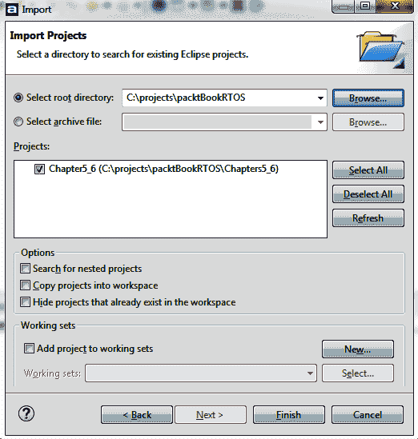
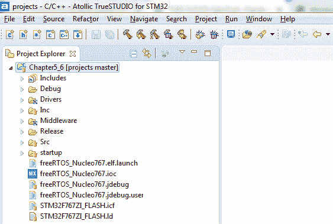
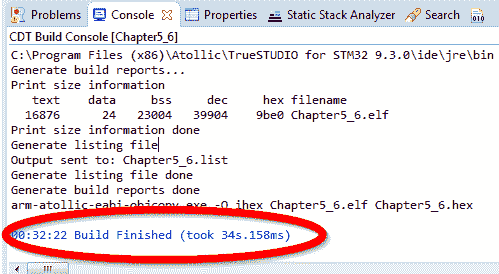

# 第五章：选择 IDE

**集成开发环境**（**IDE**）有能力极大地帮助或阻碍开发。根据项目的具体目标，IDE 可能非常容易集成到工作流程中，或者简单地成为障碍。IDE 旨在具有较小的学习曲线，并且通常会提供一种简单的方法来从现有的驱动程序和中间件构建解决方案。

在本章中，我们将讨论如何选择 IDE，探讨不同类型的 IDE，并选择一个用于创建本书中使用的代码包中所有源代码的 IDE。

这里是一个我们将涵盖的主要主题的快速列表：

+   理想中的 IDE 选择标准

+   平台抽象化 IDE

+   开源/免费 IDE

+   专有 IDE

+   选择本书的 IDE

# 技术要求

本章没有软件或硬件要求（软件将在最后安装）。

# 理想中的 IDE 选择标准

选择 IDE 的决定可以在组织的许多不同层面上进行。单个工程师可能只使用 IDE 来完成一个项目。在这种情况下，他们可能会简单地选择他们熟悉的东西，或者该项目附带的东西是**微控制器单元**（**MCU**）。在光谱的另一端，整个部门可能会将 IDE 集成到他们的开发工作流程中。在这种情况下，这个决定可能会影响数十名工程师，并在未来几年内解决多个目标平台。

一些工程师根本不需要 IDE——相反，他们会使用他们最喜欢的文本编辑器和命令行编译器或链接器（例如 GCC 或 Clang），手工制作一些 makefile，然后开始编码。这也是一种完全可行的做法——这将带来极大的灵活性，减少对专有工具的依赖，当然应该加以考虑。

下面的章节中列出的 IDE 列表并非详尽无遗。列表的目的是提供各种 IDE 的广泛示例以及每个 IDE 的不同焦点。以下是一些需要考虑的快速要点：

+   **语言支持**：现在嵌入式 MCU 上的代码不再全部使用 C99（或汇编）；有许多语言选项可供选择。

+   **调试支持**：除非你计划每次都切换到不同的工具，否则调试是必要的。你的 IDE 应该具备一些调试能力。许多 IDE 将依赖于**GNU 调试器**（**GDB**）作为底层调试协议，这意味着它们应该与支持 GDB 接口的任何调试硬件兼容。

+   **线程感知调试**：理想情况下，IDE 将具有线程感知调试功能。记住，每个任务都有自己的堆栈。默认情况下，大多数调试功能只会显示与当前程序计数器关联的堆栈，当尝试分析当前未运行的任何任务时，这会成为一个问题。

+   **设备支持**：选择一个可以识别您设备中硬件寄存器的 IDE（除非您不会用它进行调试）。

+   **平台操作系统**：即 Windows、Linux 或 macOS——您始终可以运行虚拟机，但通常在您首选的操作系统上本地运行 IDE 更为方便。

+   **成本**：工具的初始成本应考虑货币价格和将其集成到团队工作流程中所需的时间量。这个初始成本与组织/个人的当前状态紧密相关。例如，将熟悉的 IDE 设置起来并运行所需的时间（成本）通常非常低，但这种成本取决于团队熟悉的内容。高总拥有成本可能由许多不同的因素引起。一些 IDE 是免费提供的，但可用性波动（供应商提供的 IDE 通常属于此类）。如果 IDE 有很多错误，由于生产力下降，拥有成本可能会很高。最后，付费的专有解决方案通常需要年度维护协议以获得支持、最新硬件的更新和新版本。 

+   **与其他工具的集成**：开发嵌入式系统由许多组件组成。拥有尽可能集成的 IDE 是有帮助的，但需要考虑的一些项目包括目标硬件、测试夹具、调试硬件、RTOS 固件、用户固件、目标中间件、辅助主机软件以帮助配置硬件（即 STM32Cube）、帮助您分析和调试代码的软件（即静态分析工具），以及测试框架。

+   **易用性**：理想情况下，IDE 将提供一个愉快的编码环境，并通过自动化交叉引用（如 IntelliSense）使代码创建更容易，从而提高生产力。

+   **可用性**：在一个完美的世界里，原始 IDE 应该是可用的、完全受支持的，并提供更新以充分利用整个产品或项目生命周期中的新硬件目标。对于长期项目，检查您计划使用的 IDE 的历史（以及许可模式）是一个好主意。如果 IDE 仅通过订阅提供（没有永久许可选项），那么总有一天它可能不再可用。确保始终有永久许可在手，可以使您无限期地运行 IDE，并确保您始终能够从源代码重新生成二进制文件。

+   **生态系统**：大多数 IDE 不仅包含 IDE 本身，还包括插件、中间件、论坛，有时甚至还有与之相关的整个开发者社区。

在接下来的几节中，我们将介绍几个不同的 IDE 概念组。以这种方式对 IDE 进行分组并不特别严格，但它确实有助于设定对它们的动机和用例的期望。有时，一个 IDE 可以放入多个组中，这也是完全可以接受的。我们将用来分类 IDE 的组如下：

+   免费微控制器供应商 IDE 和以硬件为中心的 IDEs

+   平台抽象化 IDEs

+   开源/免费 IDEs

+   专有集成开发环境（IDEs）

本章中展示的示例 IDE 追溯到 2019 年。虽然嵌入式系统固件开发工具的变化速度并不像其他软件学科那么快，但预计随着时间的推移，这个领域的外观会有所不同！

# 免费微控制器供应商 IDEs 和以硬件为中心的 IDEs

现在，较大的微控制器制造商通常会提供免费 IDE 的访问权限，以帮助降低潜在开发者的入门门槛。从历史上看，这些 IDE 提供的功能并不多，如果你每天使用它们，通常很难使用。然而，在过去的几年里，由于芯片制造商试图与竞争对手区分开来，IDE 的质量有了提升。有时，它们集成了额外的功能，可以帮助配置硬件和/或供应商提供的驱动程序，这在硬件开发、初始板级启动和早期固件开发期间很有帮助，此时硬件外设正在被锻炼并与系统其他部分集成。

由于这些工具不是硬件制造商的核心业务关注点，它们经常会随意更改。这使得供应商 IDE 成为长期项目的风险选择。

几乎为了证明这一点，STM 在撰写本书时更改了他们的 IDE 产品。所有示例都需要导入到新的软件中：STM32CubeIDE。

由于我们的目标是使用 STM32 微控制器，我们将查看 STM 提供的 IDE（截至撰写本文时，这是 STM32CubeIDE）。对于不同的微控制器供应商，你可以考虑他们的专有 IDE——例如，如果你在 NXP 微控制器上进行开发，你可能会考虑 MCUXpresso。

# STM32CubeIDE

在 STM 的情况下，同一微控制器供应商提供了多个 IDE。在收购 Atollic 之后不久，STM 将 Atollic TrueStudio 的完全定制版本整合到他们的 STMCubeMX 应用程序中，从而产生了 STM32CubeIDE。尽管 Atollic TrueStudio 仍然可用，但它已被弃用，不推荐用于新设计。

这里是 STM32CubeIDE 的快速统计数据：

| **网站** | [`www.st.com/en/development-tools/stm32cubeide.html`](https://www.st.com/en/development-tools/stm32cubeide.html) |
| --- | --- |
| **主机操作系统** | Windows、Linux 或 macOS |
| **调试器支持** | GDB、STLink、JLink、JTrace 等 |
| **IDE 框架** | Eclipse |
| **编译器** | GCC、可扩展 |
| **成本** | 免费 |
| **许可类型** | 专有——免费软件 |

现在我们已经了解了仅针对一个微控制器设计的集成开发环境（IDEs），接下来我们将看看与供应商提供的 IDEs 极为相反的：平台抽象化的 IDEs。

# 平台抽象化的 IDEs

随着越来越复杂的微控制器（MCUs）的融合、对设备功能的期望不断膨胀以及开发周期的缩短，许多软件开发工具公司不得不专注于在硬件之上创建抽象，目的是使复杂设备的开发更加容易和快速。在市场上经过几年的发展后，最成功的平台和抽象往往能够独立生存。Mbed 和 Arduino 都拥有庞大的用户社区，许多用户创建的网站和博客都致力于每个平台。

由于平台一致性对于易用性至关重要，实现时通常会包括许多专注于易用性的功能，有时可能会牺牲性能和良好的设计实践。例如，一些硬件目标会暴露一个 API，例如 PWM 输出，尽管底层微控制器硬件没有支持该功能的外围设备。这为许多不同的硬件目标提供了更快的原型设计体验，因为 API 将无缝地将功能映射到软件例程。然而，这可能会对设备性能产生负面影响。有时程序员甚至没有意识到他们简单 API 调用背后所做出的复杂权衡。

有许多不同的因素决定了围绕平台进行项目是否是一个好主意。

在以下情况下，在平台上进行设计可能是好的：

+   **平台几乎包含了您所需的所有功能**：如果平台已经包含了所有主要部分，那么不确定性很小；所需的就是一些特定领域的代码。

+   **您打算目标设备有一个满足您确切要求的开发板**：这比尝试添加许多缺失的子电路并将其正确集成到现有平台代码中要减少许多不确定性。

+   **团队中的大多数工程师都已经对该平台有深入的经验**：**深入**的经验意味着他们已经添加了与项目所需定制类似的功能。

在以下情况下，在平台上进行设计可能会出现问题：

+   **很少有团队成员有使用所需平台的经验**：有些平台比其他平台更复杂——没有第一手经验可能会存在风险。

+   **您打算使用的微控制器尚未被平台支持**：通常有许多辅助要求需要添加微控制器支持到平台中，这些要求对您的项目没有价值。将新设备支持添加到现有的复杂平台中，对于一个非常简单的项目来说，比在裸金属或使用最小供应商提供的库上创建项目需要更多的努力。

+   **黑盒调试困难**：随着嵌入式工程师越来越远离硬件，理解系统为何以这种方式运行变得越来越困难，尤其是在需要挖掘多层**他人代码**（OPC）的情况下。

一个年轻的实时嵌入式工程师的专业发展可能会因为早期过多地投入时间和精力到平台上而受到严重影响。随着所有这些额外复杂性的增加，在实时系统中可靠地满足截止日期的风险和不确定性也随之增加。深入复杂的代码库以尝试追踪复杂的间歇性错误确实是一个挑战。如果没有坚实的基础的低级知识可以借鉴，这个挑战会变得更加严峻。

在接下来的几节中，我们将介绍一些平台抽象化 IDE 的选项。

# ARM Mbed Studio

ARM Mbed 是一个专注于物联网的平台，提供非常庞大的中间件库和跨许多不同硬件供应商的一致开发环境。最初，Mbed 平台仅通过网站提供，但现在他们已经增加了 Mbed Studio——一个适用于 Windows 和 macOS 的离线 IDE。

这里是 ARM Mbed Studio 的简要统计信息：

| **网站** | [`os.mbed.com/studio/`](https://os.mbed.com/studio/) |
| --- | --- |
| **主机操作系统** | Windows，macOS，或在线（Mbed 在线） |
| **调试器支持** | pyOCD 用于有限的图形调试或 GDB（仅控制台） |
| **IDE 框架** | Theia |
| **编译器** | ARM Compiler 6，GCC，和 IAR |
| **成本** | 免费 |
| **许可类型** | Apache 2.0 |

由于 Mbed 是面向平台的，项目可以使用 Mbed IDE 设置，然后导出到各种离线 IDE，例如 ARM Keil uVision，或者基于 makefile 的项目，这些项目可以导入到 Eclipse 和 Visual Studio Code。如果你的项目需要包含的中间件提供的功能，并且实现良好，那么不需要重新发明轮子可以节省大量时间。

# Arduino IDE

Arduino 平台是一个极其普及的平台，拥有庞大的硬件和软件生态系统。通常用于向新入门者介绍电子和编程，Arduino IDE 使用严格结构的库，为用户提供了 C/C++方言来编写草图。Arduino 的目标是让非程序员能够快速、轻松地进行原型设计。因此，它尽可能在库中隐藏了底层硬件的细节。

这里是 Arduino IDE 的简要统计信息：

| **网站** | [`www.arduino.cc/en/main/software`](https://www.arduino.cc/en/main/software) |
| --- | --- |
| **主机操作系统** | Windows，macOS，Linux，和在线 |
| **调试器支持** | 无 |
| **IDE 框架** | 专有 Java，处理 |
| **编译器** | avg-gcc，板级特定 |
| **成本** | 免费 |
| **许可类型** | GNU |

还有许多其他非 Arduino 提供的 IDE 可以用来编程 Arduino 平台。其中一些将具有额外的功能，并暴露更多底层 C/C++实现。

现在我们已经涵盖了完全抽象的 IDE，我们将转向更传统导向的 IDE，这些 IDE 是开源的和/或免费提供的。

# 开源/免费 IDE

自从 IBM 创建了 Eclipse 基金会以推广一个开源、高度可扩展的 IDE 以来，许多基于 Eclipse 的 IDE 已经出现。在本节中，我们将探讨其中两个这样的 IDE。近年来，微软开始高度重视开源项目，创建了免费的开源 Visual Studio Code 文本编辑器，该编辑器也包含在本节中。

# AC6 System Workbench for STM32 (S4STM32)

AC6 是一家咨询公司，它贡献了一个针对 STM32 微控制器的基于 Eclipse 的 IDE。System Workbench 添加了一些对基于 STM 的发现板的支持，以帮助快速设置项目。AC6 还提供了适用于 Linux 的 System Workbench，如果你正在使用 STM32MP1 系列的多核设备之一开发应用程序，这可能很有用。

这里是 AC6 System Workbench for STM32 的快速统计数据：

| **网站** | [`ac6-tools.com/content.php/content_SW4MCU.xphp`](http://ac6-tools.com/content.php/content_SW4MCU.xphp) |
| --- | --- |
| **主机操作系统** | Windows、macOS 或 Linux |
| **调试器支持** | GDB |
| **IDE 框架** | Eclipse |
| **编译器** | GCC |
| **成本** | 免费 |
| **许可证类型** | 商业免费 |

System Workbench 的另一个替代方案是从裸 Eclipse CDT 安装开始。

# Eclipse CDT 和 GCC

你也可以选择从头开始自己构建基于 Eclipse 的 IDE。Eclipse CDT 是 C/C++开发的既定标准。你还需要提供一个编译器。ARM 提供了一个完整的 GCC 网站，用于从 Windows、Linux 和 macOS 交叉编译到 ARM Cortex-M 设备。它可以在[`developer.arm.com/tools-and-software/open-source-software/developer-tools/gnu-toolchain/gnu-rm`](https://developer.arm.com/tools-and-software/open-source-software/developer-tools/gnu-toolchain/gnu-rm)找到。

这里是 Eclipse CDT 的快速统计数据：

| **网站** | [`www.eclipse.org/cdt/`](https://www.eclipse.org/cdt/) |
| --- | --- |
| **主机操作系统** | Windows、macOS 或 Linux |
| **调试器支持** | GDB |
| **IDE 框架** | Eclipse |
| **编译器** | GCC |
| **成本** | 免费 |
| **许可证类型** | **Eclipse 公共许可证** (**EPL**) |

对于那些不关心 Eclipse IDE 的人来说，另一个替代方案存在，并且越来越受欢迎：Visual Studio Code。

# Microsoft Visual Studio Code

2015 年，微软发布了 Visual Studio Code，这是一个提供添加扩展功能的文本编辑器。虽然表面上听起来相当直接，但可用的扩展足够多，可以提供非常令人尊重的 IDE 体验，包括 IntelliSense 和完整的调试功能。如果你习惯了基于 Visual Studio 的 IntelliSense 和调试，那么这个环境将会非常熟悉。

这里是 Visual Studio Code 的快速统计数据：

| **网站** | [`code.visualstudio.com/`](https://code.visualstudio.com/) |
| --- | --- |
| **主机操作系统** | Windows、macOS 或 Linux |
| **调试器支持** | GDB、ST-Link 和其他 |
| **IDE 框架** | Visual Studio Code |
| **编译器** | 许多 |
| **成本** | 免费 |
| **许可类型** | MIT |

与 Eclipse CDT 类似，Visual Studio Code 将需要安装 GCC 以及一个扩展。为了正确设置 Visual Studio，请按照以下步骤操作：

1.  要安装 Cortex-M 的 GCC，请访问[`developer.arm.com/tools-and-software/open-source-software/developer-tools/gnu-toolchain/gnu-rm`](https://developer.arm.com/tools-and-software/open-source-software/developer-tools/gnu-toolchain/gnu-rm)。

1.  要安装 JLink 工具（用于连接调试探针），请访问[`www.segger.com/downloads/jlink`](https://www.segger.com/downloads/jlink)。

1.  要安装`cortex-debug`扩展，请访问[`marketplace.visualstudio.com/items?itemName=marus25.cortex-debug`](https://marketplace.visualstudio.com/items?itemName=marus25.cortex-debug)。

到目前为止，我们讨论的所有 IDE 都是免费的（在某些情况下，是开源的）。下一节将包括需要付费且主要闭源的 IDE。你可能会问：“为什么有人会想要这样的东西？”继续阅读，了解这些解决方案能提供什么。

# 专有 IDE

一度是用于为 MCU 交叉编译应用程序的规范，付费的专有 IDE 开始被免费的开源解决方案所超越。然而，免费选项的存在并不立即使付费选项过时。专有 IDE 的卖点在于它们提供了最广泛的设备支持，并且需要开发者最少关注。

设计即用即装，付费的专业级解决方案的卖点在于节省开发者时间。这些时间节省通常以三种主要形式出现：用于设置 MCU 的统一环境、统一的调试环境以及多个 MCU 供应商通用的供应商提供的中间件。

现在让 MCU 启动运行比以往任何时候都要容易，但一旦项目足够高级，开始定义 RAM 和 ROM 中的特定内存区域或在基于 Quad-SPI 的闪存中添加额外的可执行空间时，就需要进行一些额外的配置。最好的专业 IDE 将提供一些帮助（通过 GUI），这使得这些配置比需要深入研究 scatter 文件和基于汇编的启动代码要容易一些（尽管这些是**优秀**的技能！）

与通过 GUI 快速配置 MCU 的能力相似，专业级 IDE 中的调试器支持通常也非常简单，通常限于从下拉列表中选择调试器，并可能微调一些设置。

如果您阅读了不同 MCU 可能拥有的所有选项，那么相同的 MCU 可能不会适合您进行的每一个项目，这也许并不令人惊讶。能够在保持统一界面的同时快速在 MCU 系列（甚至供应商）之间切换是一个巨大的优势。然而，陷入基于平台的方法，其中硬件接口开始被定义（以及固件 API），也可能有所限制（即 Arduino 或 MBed 硬件定义）。

使用知名公司的精心编写的中间件可以让你摆脱硬件平台只关注日间外围设备的倾向。它将重点从访问特定平台的引脚转移到访问正确抽象的 MCU 外围设备。这种区别虽然微妙但非常重要，尤其是在设计灵活性方面。精心编写的中间件将提供一致的 MCU 外围设备抽象，以及更复杂的中间件。

使用付费工具的缺点是货币成本，这需要与延迟产品发布的开发时间、劳动力和机会成本进行评估。您是否有使用中间件而不是重新发明固件轮子所能节省的时间的想法？拥有一个对任何您选择的处理器都能一致工作的 IDE 能节省多少时间？一些基本的**投资回报率**（**ROI**）计算，将现金支出与开发者时间的**诚实**和**准确**估计进行比较，通常会将中等复杂项目的天平倾向于购买中间件。当然，这是假设有现金购买软件工具。

# ARM/Keil uVision

Keil 最初在 20 世纪 80 年代开发了第一个针对 8 位 8051 架构的 C 编译器。公司后来转向支持其他核心，并最终被 ARM 收购。他们目前提供 ARM Cortex-M 设备中最高效的编译器之一（Clang/LLVM）。uVision IDE 的免费版本可用，但代码空间限制为 32 KB。IDE 的各个级别可通过多种许可选项（如永久许可、基于订阅的许可等）获得。通过*软件包*添加代码模块，这简化了快速设置项目的过程。作为顶级产品，提供了一套非常全面的中间件堆栈，其中包括对不同实时操作系统的抽象以及所有支持的微控制器上的统一 API。

下面是 uVision 的快速统计数据：

| **网站** | [`www2.keil.com/mdk5/uvision/`](http://www2.keil.com/mdk5/uvision/) |
| --- | --- |
| **宿主操作系统** | Windows |
| **调试器支持** | 许多 |
| **IDE 框架** | 专有 |
| **编译器** | armcc, armClang, GCC |
| **成本** | 免费-$$$ |
| **许可类型** | 专有 |

FreeRTOS 任务感知调试不可用——Keil uVision 对其免费提供的 CMSIS RTX RTOS 有详尽的支撑。uVision MDK 中的代码编辑器也亟需更新。

与 Keil uVision 类似，IAR 嵌入式工作台是另一个长期存在的嵌入式 IDE。

# IAR 嵌入式工作台

通常，IAR 嵌入式工作台与 Keil uVision 具有非常相似的功能集。一个主要区别是 IAR 没有集成模块化软件包的高级功能。与 uVision 相比，IAR 的高级调试功能更容易访问和直观。代码编辑器同样令人失望。

下面是 IAR 嵌入式工作台的快速统计数据：

| **网站** | [`www.iar.com/iar-embedded-workbench/`](https://www.iar.com/iar-embedded-workbench/) |
| --- | --- |
| **宿主操作系统** | Windows |
| **调试器支持** | 许多 |
| **IDE 框架** | 专有 |
| **编译器** | 专有 |
| **成本** | $$–$$$ |
| **许可类型** | 专有 |

现在我们已经涵盖了老牌产品，接下来我们将探讨最近可用的产品，从 Rowley CrossWorks 开始。

# Rowley CrossWorks

Rowley Crossworks 是比 Keil 和 IAR 略便宜的入门级产品。中间件许可与 IDE 分开。IDE 内部不支持 FreeRTOS 感知的任务调试；相反，支持**CrossWorks 任务库**（**CTL**）RTOS 解决方案。

下面是 CrossWorks 的快速统计数据：

| **网站** | [`www.rowley.co.uk/`](https://www.rowley.co.uk/) |
| --- | --- |
| **宿主操作系统** | Windows、macOS 或 Linux |
| **调试器支持** | 许多 |
| **IDE 框架** | 专有 |
| **编译器** | GCC, LLVM |
| **成本** | $–$$$ |
| **许可类型** | 专有 |

接下来是一个由以调试硬件闻名的公司创建的 IDE：SEGGER 嵌入式工作室。

# SEGGER 嵌入式工作室

SEGGER——我们将使用的调试探针制造商——也提供许多软件产品，包括他们自己的 IDE（和 RTOS）。它对非商业用途免费提供，没有任何限制。他们还提供完整的中间件堆栈，该堆栈的许可证是独立于 IDE 的。FreeRTOS 感知调试可以直接在 IDE 中通过适当的插件进行。

这里是嵌入式工作室的快速统计数据：

| **网站** | [`www.segger.com/products/development-tools/embedded-studio/`](https://www.segger.com/products/development-tools/embedded-studio/) |
| --- | --- |
| **主机操作系统** | Windows、macOS 或 Linux |
| **调试器支持** | SEGGER |
| **IDE 框架** | 专有 |
| **编译器** | GCC、LLVM |
| **成本** | 非商业用途免费或$$-$$$ |
| **许可证类型** | 专有，JLink 作为许可证狗 |

我们将以一个有趣的观点结束付费 IDE 的列表：SysProgs Visual GDB。

# SysProgs Visual GDB

Visual GDB 实际上不是一个 IDE。它是 Microsoft Visual Studio 和 Visual Studio Code 的插件。它已经存在了一段时间（自 2012 年以来）。Visual GDB 的主要目的是为与 GDB 启用调试器和 GNU make 实用程序交互提供一个一致的 UI（Visual Studio）。其主要目标用户是熟悉 Visual Studio 作为开发环境并希望在嵌入式工作中继续使用该环境的程序员。

这里是 Visual GDB 的快速统计数据：

| **网站** | [`sysprogs.com/`](https://sysprogs.com/) |
| --- | --- |
| **主机操作系统** | Windows、macOS 或 Linux |
| **调试器支持** | 是 |
| **IDE 框架** | Visual Studio、Visual Studio Code |
| **编译器** | GCC、ARM |
| **多核调试** | 是 |
| **成本** | $ |
| **许可证类型** | 专有 |

Visual GDB 提供与图形配置实用程序 STM Cube 以及 Arduino 项目的集成，因此从不同的开发框架迁移可能更容易一些。

接下来，我们将选择一个专门用于我们用例的 IDE，即开发编码练习。

# 选择本书中使用的 IDE

现在我们已经对几个不同的 IDE 进行了分类，是时候考虑哪一种将被用于本书剩余部分涵盖的示例代码了。为了保持低成本的主题，以降低入门门槛，我们将关注那些不需要任何货币投资的 IDE——任何免费提供给非专业使用（无时间或代码限制）的东西都可以考虑。这立即排除了 Keil uVision、IAR 嵌入式工作台和 SysProgs Visual GDB。Keil 有一个免费版本，但代码限制在 32 KB，但我们可能会很快用完，这取决于我们选择在示例中包含多少中间件。

由于本书的大部分内容也涵盖了使用 J-Link 探针进行调试，我们希望有一个支持 J-Link 或 GDB 的 IDE，在理想的世界里，IDE 还应支持任务意识 FreeRTOS 调试、实时变量监视等。FreeRTOS 内核意识调试并不是决定性的，正如我们将在下一章中看到的，因为 SEGGER Ozone 包含这一功能。

最后，IDE 应该是跨平台的，以促进任何勇敢尝试这段旅程的人的易于采用。考虑到这一套标准，我们只剩下有限的选择，如下所示：

| 潜在的 IDE | 可用免费版本 | 无代码大小限制 | 支持 SEGGER J-Link | FreeRTOS 内核意识调试 | 跨平台 |
| --- | --- | --- | --- | --- | --- |
| Keil uVision | ✓ | X | ✓ | X | X |
| IAR | X | N/A | ✓ | X |
| Visual GDB | X | N/A | ✓ | ✓ | ✓ |
| Rowley CrossWorks | X | N/A | ✓ | ✓ | ✓ |
| VS Code | ✓ | ✓ | ✓ | ✓ | ✓ |
| Eclipse CDT | ✓ | ✓ | ✓ | ✓ | ✓ |
| AC6 S4STM32 | ✓ | ✓ | ✓ | ✓ | ✓ |
| Arduino IDE | ✓ | ✓ | ✓ | X | ✓ |
| ARM MBed Studio | ✓ | ✓ | ✓ | X | ✓ |
| STM32CubeIDE | ✓ | ✓ | ✓ | ✓ | ✓ |
| SEGGER Embedded Studio | ✓ | ✓ | ✓ | ✓ | ✓ |

那么，我们可以从这张表和之前的观察中得出哪些主要观点？

+   Eclipse CDT 是一个潜在的选择，但由于与其他解决方案相比需要额外的设置，因此它稍微不那么受欢迎。

+   VS Code 是一个可扩展的代码编辑器（开箱即用），类似于 Eclipse。需要额外的插件。

+   STM32But IDE 承诺提供专业级的调试能力和多任务 RTOS 意识的调试。

+   SEGGER Embedded Studio 承诺提供与 STM32CubeIDE 非常相似的功能集。

我们将使用 STM32CubeIDE 进行代码示例。由于 STM32CubeIDE 还包含 STM32 系列微控制器的代码生成器，让我们看看使用代码生成工具的一些优点，以及需要做出的权衡。

# 考虑 STM32Cube

STM32CubeIDE 是两个组件的合并——IDE 和 STM32 微控制器的 STMCubeMX 图形配置和代码生成工具。*CubeMX* 组件在开发周期的几个不同点可能很有用。让我们谈谈相关的开发周期阶段，确定 CubeMX 如何帮助，以及权衡是什么。

# 设备选择

大多数现代微控制器（MCU）都有将外设映射到多个不同引脚的选项。然而，每个引脚通常由几个不同的外设共享。因此，在一个引脚受限的设备上，可能存在所需的外设*可用*（存在于微控制器上），但不可*访问*（无法映射到物理引脚）。硬件设计师可以快速评估 STM32 微控制器的各个型号是否提供了特定应用所需的必要外设组合。能够在多个芯片上快速准确地执行这些评估可以节省大量时间。通常，设计师在做出此类决定之前需要熟悉每个芯片的数据表。CubeMX 绝对不能替代适当的尽职调查，但它确实有助于快速缩小潜在设备的范围。

STM32 微控制器上的每个外设都可以单独关闭，这可以节省电力。随着电池供电（以及能量收集）物联网设备的普及，降低功耗是一个热门话题。降低功耗的另一种方法是降低芯片的时钟频率。CubeMX 允许工程师快速计算芯片在特定配置下的功耗。在调查潜在微控制器时，速度和准确性都很重要。通过在 CubeMX 中输入外设/时钟配置来获取准确的功耗估计，比翻阅数据表并从头创建电子表格要快得多。

一旦选择了目标微控制器并制造了定制硬件，就到了启动那块新硬件的时候了。

# 硬件启动

硬件*启动*是指首次开启定制设计的硬件，并在其上进行一定程度的验证。与开发/评估板相比，定制硬件通常会有很多不同之处（毕竟它是定制的！）。可能不同的一个领域是时钟硬件。STM32 的时钟树相当复杂——单个时钟源为许多不同的子系统供电。时钟频率在过程中通过乘法和除法器被修改。CubeMX 包含一个图形向导，可以帮助正确配置 STM32 时钟树并生成初始化代码，以便快速启动芯片。

还需要早期的固件工作来验证硬件是否正常工作。始终检查微控制器是否可以配置为访问板上存在的所有所需的外部电路是一个好主意。通常，快速评估硬件的可行性比等待固件的所有方面都完全完善更有利于每个人。

当需要使用 STM32 微控制器上包含的复杂外设时，CubeMX 可以用来快速设置从内部外设到微控制器外部引脚的引脚映射。它还包含简单的菜单驱动界面，用于选择外设应该如何配置。初始化代码会自动生成，使用 STM 的**硬件抽象层**（**HAL**）驱动程序。相关外设中断也会被配置和为用户提供占位符。这使得嵌入式工程师能够尽可能快地完成验证。

在所有硬件都经过验证之后，将是时候添加位于底层驱动程序和应用固件之间的额外固件层（中间件）了。

# 中间件设置

STM 多年来与许多不同的中间件提供商合作，使客户引入额外功能的过程更加直接。例如，在 CubeMX 中可以通过几个下拉菜单选择 FreeRTOS 原语。可以设置 FAT 文件系统，以及 TCP/IP 堆栈、JPEG 图像库和 Mbed TLS。不要误解，这个工具不会像熟练的程序员那样执行高级配置，但作为最低限度，它为评估不熟悉的库提供了一个坚实的起点。一些工程师可能会发现初始配置直接符合他们的需求，这意味着有更多时间专注于解决方案的其他部分。

因此，既然我们已经选定了设备，验证了硬件，并设置了某些中间件堆栈，那么现在应该是时候开始编写最终应用程序的代码了！嗯……还不完全是。使用提供的所有这些代码会带来一些问题——让我们来看看。

# 代码生成权衡

虽然所有这些功能在理论上听起来都很令人难以置信，但开发人员对 CubeMX 及其在现实世界中的应用有着混合的感觉。这些担忧和权衡大多涉及工具如何融入工作流程；有时，挑战源于可用性问题。

从可用性的角度来看，CubeMX**通常**工作得很好；有时，它会生成无效的代码，根本无法按预期工作。这似乎是在它最初发布时更多的问题。偶尔，会发货的版本会创建无法编译的项目。然而，作为最低限度，它始终为配置较新 STM32 设备上可用的高级外设提供了一个出色的参考点。

工程师在将 CubeMX 集成到工作流程中时面临的挑战，是任何生成与用户代码紧密耦合的代码的实用工具的典型问题。最初，该工具可以用来创建一个庞大的代码库，可以快速搭建并提供所需功能的大部分。然而，随着项目的进展，调整几乎是不可避免的；将自定义用户代码与自动生成的 CubeMX 代码分开可能会变得很麻烦。您可能会发现自己陷入复制粘贴的循环，不断地从一边复制到另一边的有效代码片段。这是我们行业中的一个普遍做法。嵌入式固件工程师迫切需要摆脱复制粘贴的无穷循环。第十二章，*创建良好抽象架构的技巧*，讨论了在采用这些类型的工作流程时正在做出哪些权衡。它还提供了一些关于如何设置代码库以实现长期增长的建议，而不是腐烂。

就像上面所说的，我们示例中使用的代码部分将使用 STMCubeMX 生成的代码作为起点进行实现。STM32 HAL 在行业中广泛使用，因此之前编写过 STM32 的人很可能熟悉它。请记住，本书中的示例代码旨在易于理解。它旨在突出如何实现 RTOS 概念，而不是作为未来扩展的基础。使用接近 STM32 CubeMX 生成的代码的主要目的是让您更容易开始自己的实验。

# 设置我们的 IDE

为了编译和运行以下章节中的示例代码，需要安装 STM32CubeIDE 并将源代码库导入。STM32CubeIDE 需要安装，源代码库也需要导入。

# 安装 STM32CubeIDE

要安装 STM32CubeIDE，请遵循以下两个简单步骤：

1.  从[`www.st.com/en/development-tools/stm32cubeide.html`](https://www.st.com/en/development-tools/stm32cubeide.html)下载 STM32CubeIDE。

1.  使用默认选项进行安装。

现在 STM32CubeIDE 已经安装，我们需要导入源树。让我们看看如何做。

# 将源树导入 STM32CubeIDE

在安装 STM32CubeIDE 后，您需要将源树导入到 Eclipse 工作区。工作区是 Eclipse 术语，用于表示相关项目的集合：

由于 STM32CubeIDE 基于 Eclipse IDE，如果您以前使用过 Eclipse，您会发现以下说明很熟悉。

1.  从[`github.com/PacktPublishing/Hands-On-RTOS-with-Microcontrollers`](https://github.com/PacktPublishing/Hands-On-RTOS-with-Microcontrollers)下载或克隆 GitHub 仓库：

    +   最好的做法是将仓库的路径保持得尽可能短，不要有空格；即，`c:\projects`。

    +   示例中使用的基 git 路径是`c:\projects\packBookRTOS`。

1.  打开 STM32CubeIDE。

1.  导入整个仓库：

    1.  转到菜单：文件 | 导入。

    1.  选择“通用”|“将现有项目导入工作区”|“下一步”。

    1.  浏览并选择包含仓库的文件夹（`c:\projects\packBookRTOS`），选择后应类似于以下内容：

1.  +   点击完成。下一步按钮始终是灰色。

1.  在这一点上，项目资源管理器面板将显示所有导入的章节（以下截图仅显示第五章，*选择 IDE*和第六章，*实时系统调试工具*的代码，因为它们是目前唯一编写的示例）：

1.  为了确保一切安装正确，右键点击`Chapter5_6`并选择构建。控制台窗口中的输出应类似于以下内容：

恭喜！现在您应该能够构建本书中包含的 FreeRTOS 示例项目了！

您可能已经注意到，Eclipse 项目并不完全以与磁盘上组织方式相同的方式包含文件夹（即，驱动程序和中间件不是文件系统上 Chapter5_6 的子文件夹）。这是故意为之，以便在项目/章节之间重用通用代码。这一概念在第十二章，《创建良好抽象架构的建议》中有更深入的介绍。

# 摘要

在本章中，我们介绍了 IDE 的概念以及为什么您可能选择使用它。我们列出了一些考虑因素，以及 IDE 的分类和最佳使用建议。所有这些材料都用于选择本书中使用的 IDE。最后，我们审视了 STMCubeMX，并讨论了它在项目不同阶段的使用。

在设计嵌入式系统代码开发的工作流程（包括选择软件工具）时，对可能做出的权衡有良好的理解，将帮助您做出明智的决定，这可以极大地影响生产力。

在下一章中，我们将继续探讨用于提高基于 FreeRTOS 的嵌入式固件项目生产力的工具。下一组工具允许您以极其方便的方式实际*看到*您的代码是如何运行的。

# 问题

1.  对于每个 MCU/语言组合，都有一个最佳的 IDE：

    +   真的

    +   假的

1.  专业级工作必须使用付费 IDE：

    +   真的

    +   假的

1.  供应商提供的 IDE 总是用于该供应商硬件的最佳 IDE：

    +   真的

    +   假的

1.  软件生成的代码总是优于人工编写的代码：

    +   真的

    +   假的

1.  本书所选的 IDE 是因为它具有最佳的长久可用性和最广泛的设备兼容性：

    +   真的

    +   假的

1.  列出三个 STMCubeMX 在开发过程中有帮助的发展阶段。

# 进一步阅读

+   STM32CubeIDE 用户指南可在[ https://www.st.com/resource/en/user_manual/dm00598966-stm32cubeide-quick-start-guide-stmicroelectronics.pdf](https://www.st.com/resource/en/user_manual/dm00598966-stm32cubeide-quick-start-guide-stmicroelectronics.pdf)找到。
