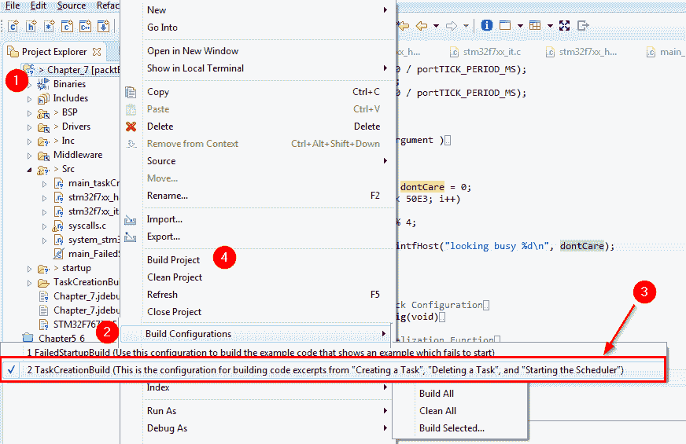
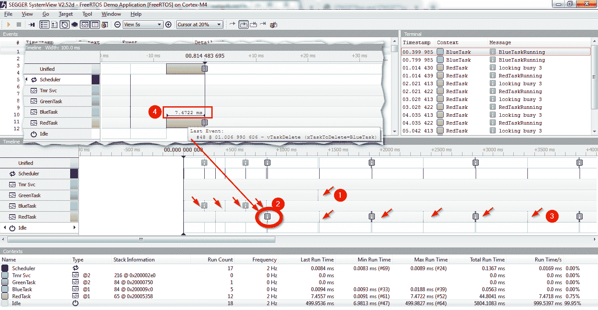
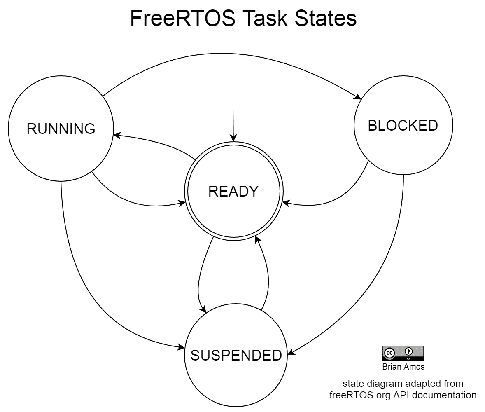

# 第七章：FreeRTOS 调度器

FreeRTOS 调度器负责处理所有任务切换决策。您可以使用 RTOS 做的最基本的事情包括创建几个任务然后启动调度器——这正是本章我们将要做的。经过一些练习后，创建任务和启动调度器将变得您非常熟悉的事情。尽管这很简单，但并不总是顺利进行（尤其是在您的前几次尝试中），因此我们还将介绍一些常见问题和解决方法。到那时，您将能够从头开始设置自己的 RTOS 应用程序，并了解如何排除常见问题。

我们将首先介绍创建 FreeRTOS 任务的两种不同方法以及每种方法的优势。然后，我们将介绍如何启动调度器以及确保其运行时需要注意的事项。接下来，我们将简要介绍内存管理选项。之后，我们将更详细地探讨任务状态，并介绍一些优化应用程序以有效使用任务状态的技巧。最后，将提供一些故障排除技巧。

本章我们将涵盖以下内容：

+   创建任务并启动调度器

+   删除任务

+   尝试运行代码

+   任务内存分配

+   理解 FreeRTOS 任务状态

+   解决启动问题

# 技术要求

为了执行本章的练习，您需要以下内容：

+   Nucleo F767 开发板

+   Micro USB 线

+   STM32CubeIDE 及其源代码

+   SEGGER JLink、Ozone 和 SystemView 已安装

关于 STM32CubeIDE 及其源代码的安装说明，请参阅 第五章，*选择 IDE*。对于 SEGGER JLink、Ozone 和 SystemView，请参阅 第六章，*实时系统调试工具*。

您可以在此处找到本章的代码文件：[`github.com/PacktPublishing/Hands-On-RTOS-with-Microcontrollers/tree/master/Chapter_7`](https://github.com/PacktPublishing/Hands-On-RTOS-with-Microcontrollers/tree/master/Chapter_7)。对于文本中可找到的代码片段的单独文件，请访问 `src` 文件夹。

您可以通过下载整个树并将其导入 Eclipse 项目来构建可以与 STM32F767 Nucleo 一起运行的实时项目。为此，请访问 [`github.com/PacktPublishing/Hands-On-RTOS-with-Microcontrollers`](https://github.com/PacktPublishing/Hands-On-RTOS-with-Microcontrollers)。

# 创建任务并启动调度器

为了使 RTOS 应用程序运行起来，需要发生几件事情：

1.  MCU 硬件需要初始化。

1.  需要定义任务函数。

1.  需要创建 RTOS 任务并将它们映射到在 *步骤 2* 中定义的函数。

1.  RTOS 调度器必须启动。

在启动调度器之后，可以创建额外的任务。如果你不确定任务是什么，或者为什么你想使用它，请查阅 第二章，*理解 RTOS 任务*。

让我们逐一分析这些步骤。

# 硬件初始化

在我们可以对 RTOS 做任何事情之前，我们需要确保我们的硬件配置正确。这通常包括确保 GPIO 线处于正确的状态、配置外部 RAM、配置关键外设和外部电路、执行内置测试等活动。在我们的所有示例中，可以通过调用 `HWInit()` 来执行 MCU 硬件初始化，它执行所有基本硬件初始化所需的操作：

```cpp
int main(void)
{
    HWInit();
```

在本章中，我们将开发一个闪烁几个 LED 灯的应用程序。让我们定义我们将要编程的行为，并查看我们的各个任务函数的样子。

# 定义任务函数

每个任务，即 `RedTask`、`BlueTask` 和 `GreenTask`，都与一个函数相关联。记住——任务实际上只是一个具有自己的堆栈和优先级的无限循环 `while`。让我们逐一介绍它们。

`GreenTask` 在绿色 LED 亮起的情况下睡眠一段时间（1.5 秒），然后删除自己。这里有几个值得注意的事项，其中一些如下：

+   通常，一个任务将包含一个无限循环 `while`，这样它就不会返回。`GreenTask` 仍然不返回，因为它会删除自己。

+   你可以通过查看 Nucleo 板来轻松确认 `vTaskDelete` 不允许在函数调用之后执行。绿灯只会亮起 1.5 秒，然后永久关闭。请看以下示例，这是 `main_taskCreation.c` 的摘录：

```cpp
void GreenTask(void *argument)
{
  SEGGER_SYSVIEW_PrintfHost("Task1 running \
                 while Green LED is on\n");
  GreenLed.On();
  vTaskDelay(1500/ portTICK_PERIOD_MS);
  GreenLed.Off();

  //a task can delete itself by passing NULL to vTaskDelete
  vTaskDelete(NULL);

  //task never get's here
  GreenLed.On();
}
```

`main_taskCreation.c` 的完整源代码可在 [`github.com/PacktPublishing/Hands-On-RTOS-with-Microcontrollers/blob/master/Chapter_7/Src/main_taskCreation.c`](https://github.com/PacktPublishing/Hands-On-RTOS-with-Microcontrollers/blob/master/Chapter_7/Src/main_taskCreation.c) 获取。

`BlueTask` 由于无限循环 `while`，会无限期地快速闪烁蓝色 LED。然而，由于 `RedTask` 在 1 秒后删除 `BlueTask`，蓝色 LED 的闪烁会被截断。这可以在以下示例中看到，这是 `Chapter_7/Src/main_taskCreation.c` 的摘录：

```cpp
void BlueTask( void* argument )
{
  while(1)
  {
    SEGGER_SYSVIEW_PrintfHost("BlueTaskRunning\n");
    BlueLed.On();
    vTaskDelay(200 / portTICK_PERIOD_MS);
    BlueLed.Off();
    vTaskDelay(200 / portTICK_PERIOD_MS);
  }
}
```

`RedTask` 在第一次运行时删除 `BlueTask`，然后无限期地闪烁红色 LED。这可以在以下 `Chapter_7/Src/main_taskCreation.c` 的摘录中看到：

```cpp
void RedTask( void* argument )
{
  uint8_t firstRun = 1;

  while(1)
  {
    lookBusy();

    SEGGER_SYSVIEW_PrintfHost("RedTaskRunning\n");
    RedLed.On();
    vTaskDelay(500/ portTICK_PERIOD_MS);
    RedLed.Off();
    vTaskDelay(500/ portTICK_PERIOD_MS);

    if(firstRun == 1)
    {
      vTaskDelete(blueTaskHandle);
      firstRun = 0;
    }
  }
}
```

因此，前面的函数看起来并不特别——它们确实不特别。它们只是标准的 C 函数，其中有两个包含无限循环 `while`。我们如何将这些普通的旧函数转换为 FreeRTOS 任务呢？

# 创建任务

这是 FreeRTOS 任务创建的原型：

```cpp
BaseType_t xTaskCreate( TaskFunction_t pvTaskCode,
                        const char * const pcName,    
                        configSTACK_DEPTH_TYPE  usStackDepth,
                        void *pvParameters,
                        UBaseType_t uxPriority,
                        TaskHandle_t *pxCreatedTask);

```

在我们的例子中，对前面的原型的调用如下所示：

```cpp

retVal = xTaskCreate(Task1, "task1", StackSizeWords, NULL, tskIDLE_PRIORITY + 2, tskHandlePtr);
```

这个函数调用可能比预期的要长一些——让我们将其分解：

+   `Task1`：实现组成任务的无限`while`循环的函数名称。

+   `"task1"`：这是一个用于在调试期间引用任务的友好名称（这是在 Ozone 和 SystemView 等工具中显示的字符串）。

+   `StackSizeWords`：为任务栈保留的*字*数。

+   `NULL`：可以传递给底层函数的指针。确保在调度器启动后任务最终运行时，指针仍然有效。

+   `tskIDLE_PRIORITY + 2`：这是正在创建的任务的优先级。这个特定的调用将优先级设置为比 IDLE 任务的优先级高两级（当没有其他任务运行时运行的任务）。

+   `TaskHandlePtr`：这是一个指向`TaskHandle_t`数据类型的指针（这是一个可以传递给其他任务的*句柄*，以便程序化地引用任务）。

+   **返回值**：`**x**TaskCreation`的`x`前缀表示它返回某些内容。在这种情况下，根据堆空间是否成功分配，返回`pdPASS`或`errCOULD_NOT_ALLOCATE_REQUIRED_MEMORY`。**你必须检查这个返回值**！

在启动调度器之前，至少需要创建一个任务。因为启动调度器的调用不会返回，所以在调用启动调度器之后，将无法从`main`中启动任务。一旦调度器启动，任务就可以根据需要创建新的任务。

现在我们已经对创建任务所需的输入参数有了很好的了解，让我们来看看为什么检查返回值是如此重要。

# 检查返回值

在`main`函数中创建一些任务并在启动调度器之前，检查每个任务创建时的返回值是必要的。当然，有许多方法可以实现这一点。让我们看看其中的两种：

1.  第一种方法是使用包含内联无限`while`循环的`if`语句包裹调用：

```cpp
if( xTaskCreate(GreenTask, "GreenTask", STACK_SIZE, NULL, 
                tskIDLE_PRIORITY + 2, NULL) != pdPASS){ while(1) }
```

1.  第二种方法是使用 ASSERT 而不是无限`while`循环。如果你的项目有 ASSERT 支持，那么使用 ASSERT 会比使用无限`while`循环更好。由于我们的项目已经包含了 HAL，我们可以使用`assert_param`宏：

```cpp
retVal = xTaskCreate(BlueTask, "BlueTask", STACK_SIZE, NULL, tskIDLE_PRIORITY + 1, &blueTaskHandle);
assert_param(retVal == pdPASS);
```

`assert_param`是一个 STM 提供的宏，用于检查条件是否为真。如果条件评估为假，则调用`assert_failed`。在我们的实现中，`assert_failed`会打印出失败的函数名称和行号，并进入一个无限`while`循环：

```cpp
void assert_failed(uint8_t *file, uint32_t line)
{ 
  SEGGER_SYSVIEW_PrintfHost("Assertion Failed:file %s \
                            on line %d\r\n", file, line);
  while(1);
}
```

你将在第十七章“故障排除技巧和下一步”中了解更多关于使用断言以及如何配置它们的信息。

现在我们已经创建了一些任务，让我们启动调度器，让我们的硬件上的代码运行，并观察一些灯光闪烁！

# 启动调度器

在我们有这么多创建任务选项的情况下，你可能认为启动调度器会是一件复杂的事情。但你会发现它非常简单：

```cpp
//starts the FreeRTOS scheduler - doesn't
//return if successful
vTaskStartScheduler();
```

是的，只需一行代码，没有输入参数！

函数名前的`v`表示它返回 void。实际上，这个函数永远不会返回——除非有问题。这是`vTaskStartScheduler()`被调用的时候，程序从传统的单超级循环过渡到多任务实时操作系统（RTOS）。

在启动调度器后，我们需要考虑和理解任务的不同状态，以便我们可以正确地调试和调整我们的系统。

以下是我们通过各种示例构建的`main()`函数的全部内容。此摘录来自`main_taskCreation.c`：

```cpp
int main(void)
{
 HWInit();

 if (xTaskCreate(GreenTask, "GreenTask", 
 STACK_SIZE, NULL,
 tskIDLE_PRIORITY + 2, NULL) != pdPASS)
 { while(1); }

 assert_param(xTaskCreate(BlueTask, "BlueTask", STACK_SIZE,NULL,
 tskIDLE_PRIORITY + 1, &blueTaskHandle) == pdPASS);

  xTaskCreateStatic( RedTask, "RedTask", STACK_SIZE, NULL,
                     tskIDLE_PRIORITY + 1,
                     RedTaskStack, &RedTaskTCB);

  //start the scheduler - shouldn't return unless there's a problem
  vTaskStartScheduler();

  while(1){}
}
```

现在我们已经学会了如何创建任务并启动调度器，在这个例子中需要覆盖的最后细节是如何删除任务。

# 删除任务

在某些情况下，让一个任务运行，并在它完成所有需要做的事情后从系统中移除，可能是有利的。例如，在一些具有相当复杂的启动例程的系统中，可能有利于在任务内部运行一些后期初始化代码。在这种情况下，初始化代码会运行，但不需要无限循环。如果任务被保留，它仍然会有其栈和 TCB，浪费 FreeRTOS 堆空间。删除任务将释放任务的栈和 TCB，使 RAM 可用于重用。

所有关键的初始化代码都应该在调度器启动之前运行。

# 任务会自行删除

在任务完成有用工作后删除任务的最简单方法是，在任务内部调用`vTaskDelete()`并传递一个`NULL`参数，如下所示：

```cpp
void GreenTask(void *argument)
{
  SEGGER_SYSVIEW_PrintfHost("Task1 running \
                             while Green LED is on\n");
  GreenLed.On();
  vTaskDelay(1500/ portTICK_PERIOD_MS);
  GreenLed.Off();

  //a task can delete itself by passing NULL to vTaskDelete
  vTaskDelete(NULL);

  //task never get's here
  GreenLed.On();
}
```

这将立即终止任务代码。当 IDLE 任务运行时，与 TCB 和任务栈关联的 FreeRTOS 堆上的内存将被释放。

在这个例子中，绿色 LED 将开启 1.5 秒然后关闭。如代码中所述，`vTaskDelete()`之后的指令永远不会被执行。

# 从另一个任务中删除任务

为了从另一个任务中删除任务，需要将`blueTaskHandle`传递给`xTaskCreate`并填充其值。然后，`blueTaskHandle`可以被其他任务用来删除`BlueTask`，如下所示：

```cpp
TaskHandle_t blueTaskHandle;
int main(void)
{
    HWInit();
    assert_param( xTaskCreate(BlueTask, "BlueTask", STACK_SIZE,
                  NULL, tskIDLE_PRIORITY + 1, &blueTaskHandle) == 
                  pdPASS);
    xTaskCreateStatic( RedTask, "RedTask", STACK_SIZE, NULL,
                       tskIDLE_PRIORITY + 1, RedTaskStack,
                       &RedTaskTCB);
    vTaskStartScheduler();
    while(1);
}

void RedTask( void* argument )
{
    vTaskDelete(blueTaskHandle);
}
```

在`main.c`中的实际代码会导致蓝色 LED 闪烁约 1 秒，然后被`RedTask`删除。此时，蓝色 LED 停止闪烁（因为控制 LED 开关的任务不再运行）。

在决定删除任务之前，有一些事情需要记住：

+   使用的堆实现必须支持释放内存（有关详细信息，请参阅第十五章，*FreeRTOS 内存管理*）。

+   任何嵌入式堆实现，如果不断添加和删除不同大小的元素，高度使用的堆可能会变得碎片化。

+   `#define configTaskDelete` 必须在 `FreeRTOSConfig.h` 中设置为 `true`。

就这样！我们现在有一个 FreeRTOS 应用程序。让我们编译一切并将程序映像编程到 Nucleo 板上。

# 尝试运行代码

现在你已经学会了如何设置几个任务，让我们来看看如何在我们的硬件上运行它们。运行示例，使用断点观察执行，并在 SystemView 中筛选跟踪将大大增强你对实时操作系统行为的直觉。

让我们实验一下前面的代码：

1.  打开 `Chapter_7 STM32CubeIDE` 项目并将 `TaskCreationBuild` 设置为活动构建：



1.  右键单击项目并选择“构建配置”。

1.  选择所需的构建配置（`TaskCreationBuild` 包含 `main_taskCreation.c`）。

1.  选择“构建项目”以构建活动配置。

之后，尝试使用 Ozone 加载和单步执行程序（有关如何操作的详细信息已在 第六章，*实时系统调试工具* 中介绍）。SystemView 也可以用来实时观察任务的运行。以下是一个快速查看正在发生什么的鸟瞰图示例：



让我们一步一步地过一遍：

1.  `GreenTask` 睡眠 1.5 秒，然后删除自己，以后不再运行（注意 `GreenTask` 行中没有额外的滴答线）。

1.  `BlueTask` 在被 `RedTask` 删除之前执行 1 秒。

1.  `RedTask` 持续闪烁红色 LED。

1.  `RedTask` 删除 `BlueTask`。删除不是微不足道的——我们可以从注释中看到删除 `BlueTask` 需要 7.4 毫秒。

恭喜你，你刚刚完成了编写、编译、加载和分析实时操作系统应用程序！什么？！你还没有在硬件上实际运行应用程序？！真的吗？如果你真的想学习，你应该认真考虑购买一块 Nucleo 板，这样你就可以在实际硬件上运行示例。本书中的所有示例都是完整的项目，可以直接使用！

我们在这里略过的一件事是为什么对 `xTaskCreate()` 的调用可能会失败。这是一个非常好的问题——让我们来找出答案！

# 任务内存分配

`xTaskCreate()` 的一个参数定义了任务的堆栈大小。但用于此堆栈的 RAM 从哪里来？有两种选择——*动态分配*的内存和*静态分配*的内存。

动态内存分配通过堆实现。FreeRTOS 端口包含有关堆如何实现的几个不同选项。第十五章，*FreeRTOS 内存管理*提供了如何为特定项目选择合适的堆实现的详细信息。目前，假设堆可用即可。

静态分配在程序生命周期内永久为变量保留 RAM。让我们看看每种方法的样子。

# 堆分配的任务

本节开头的调用使用了堆来存储栈：

```cpp
xTaskCreate(Task1, "task1", StackSizeWords, TaskHandlePtr, tskIDLE_PRIORITY + 2, NULL);
```

`xTaskCreate()` 是两种调用方法中较简单的一种。它将为 Task1 的栈和 **任务控制块**（**TCB**）使用 FreeRTOS 堆中的内存。

# 静态分配的任务

不使用 FreeRTOS 堆创建的任务需要程序员在创建任务之前为任务的栈和 TCB 进行分配。任务创建的静态版本是 `xTaskCreateStatic()`。

`xTaskCreateStatic()` 的 FreeRTOS 原型如下：

```cpp
TaskHandle_t xTaskCreateStatic( TaskFunction_t pxTaskCode,
                                 const char * const pcName,
                                 const uint32_t ulStackDepth,
                                 void * const pvParameters,
                                 UBaseType_t uxPriority,
                                 StackType_t * const puxStackBuffer,
                                 StaticTask_t * const pxTaskBuffer );

```

让我们看看在我们的示例中如何使用它，它创建了一个具有静态分配栈的任务：

```cpp
static StackType_t RedTaskStack[STACK_SIZE];
static StaticTask_t RedTaskTCB;
xTaskCreateStatic( RedTask, "RedTask", STACK_SIZE, NULL,
                   tskIDLE_PRIORITY + 1,
                   RedTaskStack, &RedTaskTCB);
```

与 `xTaskCreate()` 不同，只要 `RedTaskStack` 或 `RedTaskTCB` 不是 `NULL`，`xTaskCreateStatic()` 就会保证总是创建任务。只要你的工具链的链接器能在 RAM 中找到空间来存储变量，任务就会成功创建。

如果你想使用前面的代码，必须在 `FreeRTOSConfig.h` 中将 `configSUPPORT_STATIC_ALLOCATION` 设置为 `1`。

# 内存保护任务创建

任务也可以在内存保护环境中创建，这保证了任务只能访问为其专门分配的内存。FreeRTOS 的实现可以利用板载的 MPU 硬件。

请参阅第四章，*选择合适的 MCU*，以获取有关 MPU 的详细信息。你还可以在第十五章，*FreeRTOS 内存管理*中找到如何使用 MPU 的详细示例。

# 任务创建总结

由于创建任务有多种不同的方式，你可能想知道应该使用哪一种。所有实现都有其优点和缺点，并且这确实取决于几个因素。下表展示了创建任务的三种方式的总结，其相对优点通过箭头表示——⇑ 表示更好，⇓ 表示更差，⇔ 表示中性：

| **特性** | **堆** | **MPU 堆** | **静态** |
| --- | --- | --- | --- |
| 易用性 | ⇑ | ⇓ | ⇔ |
| 灵活性 | ⇑ | ⇓ | ⇔ |
| 安全性 | ⇓ | ⇑ | ⇔ |
| 法规遵从性 | ⇓ | ⇑ | ⇔ |

如我们所见，没有明确的答案来决定使用哪个系统。然而，如果你的微控制器（MCU）没有板载的 MPU，那么将无法选择使用 MPU 变体。

FreeRTOS 基于堆的方法是三种选择中最容易编码的，也是最具灵活性的。这种灵活性来自于任务可以被删除，而不仅仅是被遗忘。静态创建的任务是下一个最容易的，只需要额外两行代码来指定 TCB 和任务堆栈。由于无法释放由静态变量定义的内存，因此它们不如前者灵活。在某些法规环境中，静态创建可能更受欢迎，因为这些环境完全禁止使用堆，尽管在大多数情况下，最常用的 FreeRTOS 基于堆的方法是可以接受的——特别是堆实现 1、2 和 3。

*什么是堆实现？* 不要担心，我们将在第十五章 FreeRTOS 内存管理中详细学习 FreeRTOS 的堆选项。

MPU（内存保护单元）变体是三种中最复杂的，但也是最安全的，因为 MPU 保证了任务不会超出其允许的内存范围。

使用静态定义的堆栈和 TCB（任务控制块）的优点是，链接器可以分析整个程序的内存占用。这确保了如果程序编译并适应了 MCU 的硬件限制，它不会因为堆空间不足而无法运行。基于堆的任务创建可能导致程序编译成功，但在运行时出现错误，导致整个应用程序无法运行。在其他情况下，应用程序可能运行一段时间后，由于堆内存不足而失败。

# 理解 FreeRTOS 任务状态

如第二章理解 RTOS 任务中所述，所有任务之间的上下文切换都是在*后台*进行的，这对负责实现任务的开发者来说非常方便。这是因为它使他们免于在每个试图平衡系统负载的任务中添加代码。虽然任务代码并没有*明确地*执行任务状态转换，但它确实与内核交互。对 FreeRTOS API 的调用会导致内核调度器运行，负责在必要的状态之间转换任务。

# 理解不同的任务状态

下面的状态图中显示的每个转换都是由你的代码发出的 API 调用或调度器采取的行动引起的。这是一个简化的图形概述，包括可能的状态和转换，以及每个状态的描述：



让我们逐一来看。

# 运行中

运行状态的任务正在执行工作；它是唯一处于上下文中的任务。它将一直运行，直到它调用一个 API 导致其进入`Blocked`状态，或者由于优先级更高（或具有相同优先级的分时任务）而被调度器切换出上下文。可能导致任务从`Running`状态移动到`Blocked`状态的 API 调用示例包括尝试从空队列中读取或尝试获取不可用的互斥锁。

# 准备就绪

处于就绪状态的任务只是在等待调度器赋予它们处理器上下文，以便它们可以运行。例如，如果*任务 A*已经进入`Blocked`状态，等待它所等待的队列中添加一个项目，那么*任务 A*将进入`Ready`状态。调度器将评估*任务 A*是否是系统中最高的优先级且准备就绪的任务。如果*任务 A*是准备就绪的最高优先级任务，它将被赋予处理器上下文并转换为`Running`状态。请注意，任务可以具有相同的优先级。在这种情况下，调度器将通过使用轮询调度方案在`Ready`和`Running`状态之间切换它们（有关此示例，请参阅第二章，*理解 RTOS 任务*）。

# 阻塞

`Blocked`状态的任务是正在等待某物的任务。任务从`Blocked`状态退出有两种方式：要么一个事件触发任务从`Blocked`状态到`Ready`状态的转换，要么发生超时，将任务置于`Ready`状态。

这是 RTOS 的一个非常重要的特性：*每个阻塞调用都有时间限制*。也就是说，任务在等待事件时只会阻塞，直到程序员指定它可以阻塞的时间。这是 RTOS 固件编程和通用应用程序编程之间的重要区别。例如，*尝试获取一个互斥锁，如果在该指定时间内互斥锁不可用，则该尝试将失败*。对于接受并推送数据到队列的 API 调用以及 FreeRTOS 中所有其他非中断 API 调用也是如此。

当任务处于`Blocked`状态时，它不会消耗任何处理器时间。当调度器将任务从`Blocked`状态转换出来时，它将被移动到`Ready`状态，允许调用任务在它成为系统中最高的优先级任务时运行。

# 暂停

`Suspended`状态是一个有点特殊的情况，因为它需要显式调用 FreeRTOS API 来进入和退出。一旦任务进入`Suspended`状态（通过`vTaskSuspend()` API 调用），它将被调度器忽略，直到执行`vTaskResume()` API 调用。这种状态导致调度器实际上忽略任务，直到通过显式 API 调用将其移动到`Ready`状态。就像`Blocked`状态一样，`Suspended`状态不会消耗任何处理器时间。

现在我们已经了解了各种任务状态以及它们如何与 RTOS 的不同部分交互，我们可以学习如何优化应用程序，使其能够高效地使用任务。

# 优化任务状态

通过深思熟虑的优化可以最小化任务在`运行`状态的时间。由于任务只有在`运行`状态下才会消耗显著的 CPU 时间，因此通常最好将时间花在合法的工作上。

正如你所看到的，轮询事件是有效的，但通常是不必要的 CPU 周期浪费。如果与任务优先级平衡得当，系统可以设计为对重要事件做出响应，同时最大限度地减少 CPU 时间。以这种方式优化应用程序可能有几个不同的原因。

# 优化以减少 CPU 时间

通常，RTOS 被用于许多不同的活动几乎同时发生。当一个任务需要因为事件发生而采取行动时，有几种方法可以监控该事件。

轮询是指连续读取一个值以捕获一个转换。一个例子就是等待新的 ADC 读数。一个*轮询*读取可能看起来像这样：

```cpp
uint_fast8_t freshAdcReading = 0;
while(!freshAdcReading)
{
    freshAdcReading = checkAdc();
}
```

虽然这段代码*会*检测到新的 ADC 读数发生，但它也会使任务持续处于`运行`状态。如果这成为系统中优先级最高的任务，这将*饿死*其他任务对 CPU 时间的获取。这是因为没有任何东西能迫使任务离开`运行`状态——它持续检查新的值。

为了最小化任务在`运行`状态（持续轮询以检测变化）所花费的时间，我们可以使用 MCU 中包含的硬件来执行相同的检查，而不需要 CPU 干预。例如，**中断服务例程**（**ISR**）和**直接内存访问**（**DMA**）都可以用来将 CPU 的一些工作卸载到 MCU 中包含的不同硬件外设。一个 ISR 可以与 RTOS 原语接口，以便在有价值的工作需要完成时通知任务，从而消除对 CPU 密集型轮询的需求。第八章，*保护数据和同步任务*，将更详细地介绍轮询，以及多个高效的替代方案。

# 优化以提高性能

有时，有严格的时序要求需要低量的抖动。其他时候，可能需要使用需要大量吞吐量的外设。虽然可能在高优先级任务中轮询以满足这些时序要求，但通常在 ISR 中实现所需的功能更可靠（也更高效）。也可能通过使用 DMA 完全不涉及处理器。这两种选项都防止任务在轮询循环上浪费无用的 CPU 周期，并允许它们有更多时间用于有用的工作。

请查看第二章中的“*DMA 介绍*”部分，以复习 DMA。中断也包含在内。

由于中断和 DMA 可以在 RTOS 完全以下运行（不需要任何内核干预），它们可以对创建确定性系统产生显著积极的影响。我们将在第十章“*驱动器和中断服务例程*”中详细探讨如何编写这些类型的驱动程序。

# 优化以最小化功耗

由于电池供电和能量收集应用的普遍存在，程序员有另一个确保系统使用尽可能少的 CPU 周期的理由。在创建节能解决方案时，也存在类似的想法，但重点通常不是最大化确定性，而是节省 CPU 周期并以较慢的时钟速率运行。

FreeRTOS 中有一个额外的功能，可用于在此空间进行实验——无滴答的 IDLE 任务。这是以牺牲时间精度为代价，减少内核运行的频率。通常，如果内核被设置为 1 ms 的滴答率（等待最多每毫秒检查一次下一次活动），它将以 1 kHz 的频率唤醒并运行代码。在无滴答 IDLE 任务的情况下，内核仅在必要时唤醒。

现在我们已经讨论了一些如何改进已运行系统的起点，让我们将注意力转向更严重的事情：一个根本无法启动的系统！

# 故障排除启动问题

假设你正在做一个项目，事情并没有按计划进行。你并没有得到闪烁的灯光作为奖励，而是被迫盯着一个非常不闪烁的硬件设备。在这个阶段，通常最好是启动调试器，而不是随意猜测可能的问题并随机更改代码部分。

# 我的所有任务都没有运行！

在开发的早期阶段，大多数启动问题都是由 FreeRTOS 堆中未分配足够空间引起的。通常会有两种症状由此产生。

# 任务创建失败

在以下情况下，代码在运行调度器之前会*卡住*（没有灯光闪烁）。执行以下步骤以确定原因：

1.  使用调试器，逐步执行任务创建，直到找到有问题的任务。这很容易做到，因为所有创建任务的尝试只有在任务成功创建的情况下才会进展。

1.  在这种情况下，你会看到在创建`BlueTask`时`xTaskCreate`没有返回`pdPASS`。以下代码请求为`BlueTask`分配 50 KB 的堆栈：

```cpp
int main(void)
{
  HWInit();

  if (xTaskCreate(GreenTask, "GreenTask", 
                  STACK_SIZE, NULL,
                  tskIDLE_PRIORITY + 2, NULL) != pdPASS)
      { while(1); }

  //code won't progress past assert_failed (called by
  //assert_param on failed assertions)
  retval = (xTaskCreate(BlueTask, "BlueTask",
               STACK_SIZE*100,NULL,
               tskIDLE_PRIORITY + 1, &blueTaskHandle);
  assert_param(retVal == pdPASS);
```

你可以在这里找到此示例的完整源代码：[`github.com/PacktPublishing/Hands-On-RTOS-with-Microcontrollers/blob/master/Chapter_7/Src/main_FailedStartup.c`](https://github.com/PacktPublishing/Hands-On-RTOS-with-Microcontrollers/blob/master/Chapter_7/Src/main_FailedStartup.c)。

这是`assert_failed`的代码。无限`while`循环使得使用调试探针追踪有问题的行变得非常容易，并查看调用堆栈：

```cpp
void assert_failed(uint8_t *file, uint32_t line)
{ 
  SEGGER_SYSVIEW_PrintfHost("Assertion Failed:file %s \
                            on line %d\r\n", file, line);
  while(1);    
}
```

1.  使用 Ozone 调用堆栈，失败的断言可以追溯到在`main_FailedStartup.c`的第 37 行创建`BlueTask`：


1.  在确定失败的原因是未能创建的任务后，是时候考虑通过修改`FreeRTOSConfig.h`来增加 FreeRTOS 的堆空间了。这是通过修改`configTOTAL_HEAP_SIZE`来完成的（目前设置为 15 KB）。此摘录取自`Chapter_7/Inc/FreeRTOSConfig.h`***：

```cpp
#define configTOTAL_HEAP_SIZE ((size_t)15360)
```

与以*单词*（例如，`configMINIMAL_STACK_SIZE`）指定的堆栈大小规范不同，它作为参数传递给`xTaskCreate`，`configTOTAL_HEAP_SIZE`是以字节为单位的。

在增加`configTOTAL_HEAP_SIZE`时需要小心。请参阅*重要注意事项*部分，了解需要考虑的事项。

# 调度器意外返回

也可能出现`vStartScheduler`返回此问题的情况：

```cpp
//start the scheduler - shouldn't return unless there's a problem
vTaskStartScheduler();

//if you've wound up here, there is likely
//an issue with overrunning the freeRTOS heap
while(1)
{
}
```

这只是同一潜在问题的另一个症状——堆空间不足。调度器定义了一个需要`configMINIMAL_STACK_SIZE`个堆空间单词的 IDLE 任务（加上 TCB 的空间）。

如果你正在阅读这一部分，因为你*实际上*有一个无法启动的程序，并且你*没有*遇到这些症状中的任何一种，请不要担心！这本书的后面有一个专门的章节，专门为你准备。查看第十七章，*故障排除技巧和下一步行动*。它实际上是从这本书示例代码创建过程中遇到的真实问题中创建出来的。

如果你的应用程序拒绝启动，还有一些其他考虑因素需要考虑。

# 重要注意事项

基于 MCU 的嵌入式系统中的 RAM 通常是一种稀缺资源。当增加 FreeRTOS 可用的堆空间（`configTOTAL_HEAP_SIZE`）时，你将减少非 RTOS 代码可用的 RAM 量。

在考虑通过`configTOTAL_HEAP_SIZE`增加 FreeRTOS 可用的堆空间时，有几个因素需要注意：

+   如果已经定义了一个较大尺寸的非 RTOS 堆栈——即任何不在任务内部运行的代码所使用的堆栈（通常在启动文件中配置）。初始化代码将使用这个堆栈，所以如果有任何深层函数调用，这个堆栈将无法特别小。在调度器启动之前初始化的 USB 堆栈可能是罪魁祸首。在内存受限的系统上，一个可能的解决方案是将膨胀的初始化代码移动到一个具有足够大堆栈的任务中。这可能允许进一步最小化非 RTOS 堆栈。

+   中断服务例程（ISRs）也将使用非实时操作系统（RTOS）堆栈，但它们在整个程序运行期间都需要它。

+   考虑使用静态分配的任务，因为在程序运行时可以保证有足够的 RAM。

关于内存分配的更深入讨论可以在第十五章*，FreeRTOS 内存管理*中找到。

# 摘要

在本章中，我们介绍了定义任务的不同方式以及如何启动 FreeRTOS 调度器。在这个过程中，我们还介绍了一些使用 Ozone、SystemView 和 STM32CubeIDE（或任何基于 Eclipse CDT 的 IDE）的示例。所有这些信息都被用来创建一个实时演示，将有关任务创建的 RTOS 概念与在嵌入式硬件上实际加载和分析代码的机制联系起来。还有一些关于如何*不*监控事件的建议（轮询）。

在下一章中，我们将介绍您*应该*用于事件监控的内容。我们将通过示例涵盖实现任务间信号和同步的多种方式。将会有大量的代码和许多使用 Nucleo 板进行的手动分析。将有大量的代码和许多使用 Nucleo 板进行的手动分析。

# 问题

在我们结束本章内容时，这里有一份问题列表，以便您可以测试自己对本章材料的了解。您将在附录的*评估*部分找到答案：

1.  启动 FreeRTOS 任务时有哪些选项可用？

1.  调用`xTaskCreate()`时需要检查返回值。

    +   正确

    +   错误

1.  调用`vTaskStartScheduler()`时需要检查返回值。

    +   正确

    +   错误

1.  因为 RTOS 是臃肿的中间件，FreeRTOS 需要巨大的堆来存储所有任务栈，无论任务执行什么功能。

    +   正确

    +   错误

1.  一旦任务启动，就无法将其移除。

    +   正确

    +   错误

# 进一步阅读

+   Free RTOS 定制（`FreeRTOSConfig.h`）: [`www.freertos.org/a00110.htm`](https://www.freertos.org/a00110.html)
