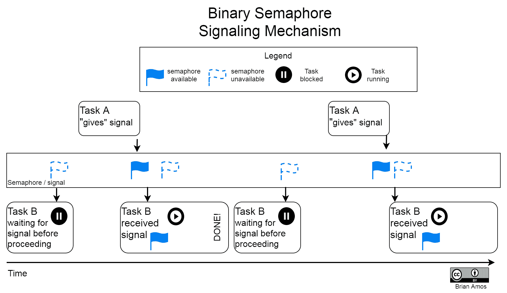
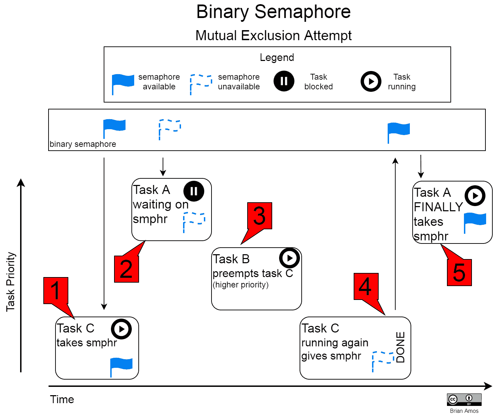
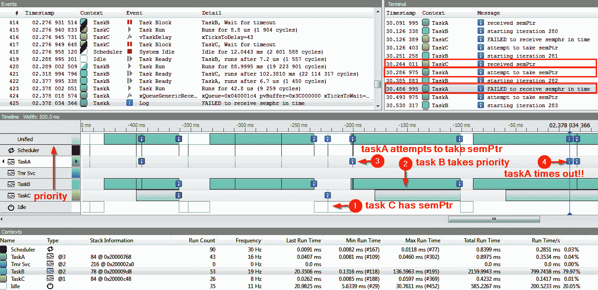
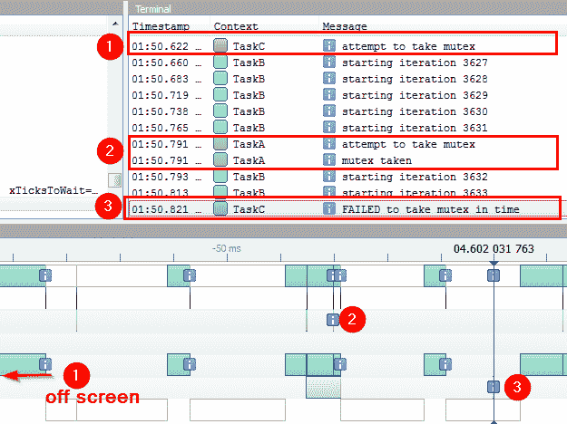
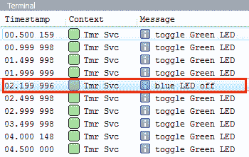

# 第八章：保护数据和同步任务

竞态条件、数据损坏和错过实时截止日期有什么共同之处？好吧，首先，它们都是在并行操作时容易犯的错误。这些错误（部分）可以通过使用正确的工具来避免。

本章涵盖了用于同步任务和保护共享数据的一些机制。本章中的所有解释都将包含使用 Ozone 和 SystemView 执行的示例代码和分析。

首先，我们将探讨信号量和互斥锁之间的区别。然后，您将了解何时、如何以及为什么使用信号量。您还将了解竞态条件和了解互斥锁如何避免此类情况。示例代码将贯穿始终。将使用可以在 Nucleo 开发板上运行和分析的实时代码引入并修复竞态条件概念。最后，将介绍 FreeRTOS 软件定时器，并讨论基于 RTOS 的软件定时器和 MCU 硬件外围定时器的常见实际应用案例。

本章我们将涵盖以下主题：

+   使用信号量

+   使用互斥锁

+   避免竞态条件

+   使用软件定时器

# 技术要求

要完成本章的动手练习，您将需要以下内容：

+   Nucleo F767 开发板

+   Micro USB 线

+   ST/Atollic STM32CubeIDE 及其源代码（有关这些说明，请参阅第五章*，选择 IDE – 设置我们的 IDE*)

+   SEGGER JLink、Ozone 和 SystemView (第六章，*实时系统调试工具*)

构建本章中的示例最简单的方法是一次性构建所有 Eclipse *配置*，然后使用 Ozone 加载和查看它们。为此，请按照以下步骤操作：

1.  在 STM32CubeIDE 中，右键单击项目。

1.  选择构建。

1.  选择构建所有。所有示例都将构建到它们自己的命名子目录中（这可能需要一段时间）。

1.  在 Ozone 中，您现在可以快速加载每个`<exampleName>.elf`文件。有关如何操作的说明，请参阅第六章，*实时系统调试工具*。链接到可执行文件的正确源文件将自动显示。

本章的所有源代码都可以在[`github.com/PacktPublishing/Hands-On-RTOS-with-Microcontrollers/tree/master/Chapter_8`](https://github.com/PacktPublishing/Hands-On-RTOS-with-Microcontrollers/tree/master/Chapter_8)找到。

# 使用信号量

我们已经多次提到，任务应该被编程为并行运行。这意味着，默认情况下，它们在时间上没有相互关系。不能假设任务相对于彼此的执行位置——除非它们被显式同步。信号量是用于在任务之间提供同步的一种机制。

# 通过信号量进行同步

以下是我们之前在第二章中讨论的抽象示例的图示，*任务信号和通信机制*：



上述图示显示了`TaskB`正在等待来自`TaskA`的信号量。每次`TaskB`获取到所需的信号量时，它将继续其循环。`TaskA`会重复地`give`信号量，这实际上同步了`TaskB`的运行。现在我们已经搭建了完整的发展环境，让我们看看实际的代码是什么样的。然后，我们将在硬件上运行它，闪烁几个 LED，以了解在现实世界中这种行为是什么样的。

# 设置代码

首先，需要创建信号量，并存储其句柄（或指针），以便在任务之间使用。以下摘录来自`mainSemExample.c`：

```cpp
//create storage for a pointer to a semaphore
SemaphoreHandle_t semPtr = NULL;

int main(void)
{
    //.... init code removed.... //

    //create a semaphore using the FreeRTOS Heap
 semPtr = xSemaphoreCreateBinary(); //ensure pointer is valid (semaphore created successfully)
 assert_param(semPtr != NULL);
```

信号量指针，即`semPtr`，需要放置在一个可以被需要访问信号量的其他函数访问的位置。例如，不要在函数内部将`semPtr`声明为局部变量——它将无法被其他函数访问，并且一旦函数返回，它就会超出作用域。

为了查看源代码的情况以及了解系统是如何反应的，我们将几个不同的 LED 与任务 A 和任务 B 关联起来。

`Task A`将在闪烁循环中每运行五次时切换绿色 LED 并`give`信号量，如下面的`mainSemExample.c`摘录所示：

```cpp
void GreenTaskA( void* argument )
{
  uint_fast8_t count = 0;
  while(1)
  {
    //every 5 times through the loop, give the semaphore
    if(++count >= 5)
    {
      count = 0;
      SEGGER_SYSVIEW_PrintfHost("Task A (green LED) gives semPtr");
 xSemaphoreGive(semPtr);
    }
    GreenLed.On();
    vTaskDelay(100/portTICK_PERIOD_MS);
    GreenLed.Off();
    vTaskDelay(100/portTICK_PERIOD_MS);
  }
}
```

另一方面，`Task B`在成功`take`到信号量后，将快速闪烁蓝色 LED 三次，如下面的`mainSemExample.c`摘录所示：

```cpp
/**
 * wait to receive semPtr and triple blink the Blue LED
 */
void BlueTaskB( void* argument )
{
  while(1)
  {
 if(xSemaphoreTake(semPtr, portMAX_DELAY) == pdPASS)
    {   
        //triple blink the Blue LED
        for(uint_fast8_t i = 0; i < 3; i++)
        {
            BlueLed.On();
            vTaskDelay(50/portTICK_PERIOD_MS);
            BlueLed.Off();
            vTaskDelay(50/portTICK_PERIOD_MS);
        }
    }
    else
    {
        // This is the code that will be executed if we time out
        // waiting for the semaphore to be given
    }
  }
}
```

太好了！现在我们的代码准备好了，让我们看看这种行为是什么样的。

FreeRTOS 通过使用`portMAX_DELAY`允许在某些情况下进行无限期延迟。只要`FreeRTOSConfig.h`中存在`#define INCLUDE_vTaskSuspend 1`，调用任务将被无限期挂起，并且可以安全地忽略`xSemaphoreTake()`的返回值。当`vTaskSuspend()`未定义为 1 时，`portMAX_DELAY`将导致非常长的延迟（在我们的系统中为 0xFFFFFFF RTOS 滴答，约 49.7 天），但不是无限期。

# 理解行为

这是使用 SystemView 查看时的示例外观：


注意以下内容：

+   使用信号量进行阻塞是高效的，因为每个任务只使用了 0.01%的 CPU 时间。

+   由于任务正在等待信号量而阻塞的任务，将不会运行，直到它可用。即使它是系统中优先级最高的任务，并且没有其他任务处于`READY`状态，也是如此。

既然你已经看到了使用信号量同步任务的效率方法，让我们看看另一种使用轮询实现相同行为的方法。

# 浪费周期——通过轮询进行同步

以下示例与从板外观察 LED 时的行为完全相同——LED 的可观察模式与上一个示例完全相同。区别在于连续读取相同变量所使用的 CPU 时间量。

# 设置代码

下面是更新后的`GreenTaskA()`——只有一行发生了变化。这段摘录来自`mainPolledExample.c`：

```cpp
void GreenTaskA( void* argument )
{
  uint_fast8_t count = 0;
  while(1)
  {
    //every 5 times through the loop, set the flag
    if(++count >= 5)
    {
      count = 0;
      SEGGER_SYSVIEW_PrintfHost("Task A (green LED) sets flag");
 flag = 1; //set 'flag' to 1 to "signal" BlueTaskB to run
```

我们不是调用`xSemaphoreGive()`，而是简单地设置`flag`变量为`1`。

对`BlueTaskB()`也进行了类似的微小更改，用轮询`flag`的`while`循环替换了`xSemaphoreTake()`。这可以在以下来自`mainPolledExample.c`的摘录中看到：

```cpp
void BlueTaskB( void* argument )
{
  while(1)
  {
      SEGGER_SYSVIEW_PrintfHost("Task B (Blue LED) starts "\
                                "polling on flag");

    //repeateadly poll on flag. As soon as it is non-zero,
    //blink the blue LED 3 times
 while(!flag);    SEGGER_SYSVIEW_PrintfHost("Task B (Blue LED) received flag");
```

这些就是所需的唯一更改。`BlueTaskB()`将等待（无限期地）直到`flag`被设置为非`0`的值。

要运行此示例，请使用`Chapter_8/polledExample`文件中的构建配置。

# 理解行为

由于更改很少，我们可能不会期望在新的代码下，MCU 的行为会有太大的差异。然而，SystemView 的输出告诉我们一个不同的故事：


注意以下内容：

+   `BlueTaskB`现在正在使用 100%的 CPU 时间来轮询`flag`（70%的 CPU 负载较低，因为任务在闪烁 LED 时处于睡眠状态）。

+   即使`BlueTaskB`正在占用 CPU，`GreenTaskA`仍然持续运行，因为它具有更高的优先级。如果`GreenTaskA`的优先级低于`BlueTaskB`，它将无法获得 CPU。

因此，通过轮询变量来同步任务确实按预期工作，但有一些副作用：CPU 利用率增加，对任务优先级的强烈依赖。当然，有方法可以减少`BlueTaskB`的 CPU 负载。我们可以在轮询之间添加延迟，如下所示：

```cpp
while(!flag)
{
    vTaskDelay(1);
}
```

这将把`BlueTaskB`的 CPU 负载降低到大约 5%。但是，请注意，这个延迟也保证了`BlueTaskB`在最坏情况下的延迟至少为 1 个 RTOS 滴答周期（在我们的设置中为 1 毫秒）。

# 时间限制信号量

之前，我们提到 RTOS 的一个重要方面是它们提供了一种时间限制操作的方法；也就是说，它们可以保证调用不会使任务执行超过期望的时间。RTOS *不保证操作的成功及时性*。它只承诺调用将在一定时间内返回。让我们再次看看获取信号量的调用：

```cpp
BaseType_t xSemaphoreTake( SemaphoreHandle_t xSemaphore,
                            TickType_t xTicksToWait );

```

从前面的代码中，我们可以看到以下内容：

+   `semPtr` 只是一个指向信号量的指针。

+   `maxDelay` 是这个调用中有趣的部分——它指定了等待信号量的最大时间（以 RTOS *tick* 单位计）。

+   返回值是 `pdPASS`（信号量及时获取）或 `pdFALSE`（信号量未及时获取）。*检查这个返回值非常重要*。

如果成功获取信号量，返回值将是 `pdPASS`。这是任务将继续的唯一情况，因为给出了信号量。如果返回值不是 `pdPASS`，则 `xSemaphoreTake()` 调用失败，可能是由于超时或编程错误（例如传递无效的 `SemaphoreHandle_t`）。让我们通过一个例子更深入地了解这一点。

# 设置代码

在这个例子中，我们将使用开发板上的所有三个 LED 来指示不同的状态：

+   **绿色 LED**：`GreenTaskA()` 以稳定的 5 赫兹频率闪烁，占空比为 50%。

+   **蓝色 LED**：当 `TaskB()` 在 500 毫秒内收到信号量时，快速闪烁三次。

+   **红色 LED**：在 `xSemaphoreTake()` 超时后开启。只要在开始等待信号量后的 500 毫秒内收到信号量，它就会保持开启状态，直到被 `TaskB()` 重置。

在许多系统中，错过截止日期可能是一个（重大）关注的问题。这完全取决于你正在实施的内容。这个例子只是一个简单的循环，当错过截止日期时会有红灯亮起。然而，其他系统可能需要采取（紧急）程序来防止错过截止日期导致重大故障/损坏。

`GreenTaskA()` 有两个职责：

+   闪烁绿色 LED

+   *在伪随机间隔内发出* 信号量

这些职责可以在以下代码中看到：

```cpp
void GreenTaskA( void* argument )
{
    uint_fast8_t count = 0;
    while(1)
    {
        uint8_t numLoops = StmRand(3,7);
        if(++count >= numLoops)
        {
            count = 0;
 xSemaphoreGive(semPtr);
        }
 greenBlink();
    }
}
```

`TaskB()` 也具有两个职责：

+   闪烁蓝色 LED（只要信号量在 500 毫秒内出现）。

+   如果信号量在 500 毫秒内没有出现，则开启红色 LED。红色 LED 将保持开启状态，直到在开始等待信号量后的 500 毫秒内成功获取信号量：

```cpp
void TaskB( void* argument )
{
    while(1)
    {
 //'take' the semaphore with a 500mS timeout                    
        if(xSemaphoreTake(semPtr, 500/portTICK_PERIOD_MS) == pdPASS)
        {
 //received semPtr in time
            RedLed.Off();
            blueTripleBlink();
        }
        else
 {
 //this code is called when the 
 //semaphore wasn't taken in time 
            RedLed.On();
        }
    }
}
```

这种设置保证了 `TaskB()` 至少每 500 毫秒会采取一些行动。

# 理解行为

当使用 SystemView 构建和加载 `semaphoreTimeBound` 构建配置中包含的固件时，你会看到以下类似的内容：


注意以下内容：

1.  **标记 1**表示`TaskB`在 500 ms 内没有接收到信号量。注意，`TaskB`没有后续执行——它立即返回再次获取信号量。

1.  **标记 2**表示`TaskB`在 500 ms 内接收到了信号量。从图表中我们可以看到实际上是在大约 200 ms。`TaskB`通道中的周期性线条（在前面的图像中圈出）是蓝色 LED 的开启和关闭。

1.  在闪烁蓝色 LED 后，`TaskB`返回等待信号量。

日志消息由时序中的蓝色*i*图标表示，这有助于在可视化行为的同时将代码中的描述性注释关联起来。双击蓝色框会自动将终端跳转到相关的日志消息。

你会注意到蓝色 LED 并不总是闪烁——偶尔，红色 LED 会闪烁。每次红色 LED 闪烁，这表明在 500 ms 内没有获取到`semPtr`。这表明代码正在尝试获取一个信号量，将其作为在放弃信号量之前可接受的最高时间上限，这可能会触发一个错误条件。

作为练习，看看你是否能捕获红色闪烁并使用终端输出（在右侧）和时序输出（在底部）跟踪超时发生的位置——从`TaskB`尝试**获取信号量**到红色 LED 闪烁之间经过了多少时间？现在，修改源代码中的 500 ms 超时，使用 Ozone 编译并上传，观察 SystemView 中的变化。

# 计数信号量

虽然二进制信号量只能有 0 到 1 之间的值，但计数信号量可以有更宽的范围。计数信号量的某些用例包括通信堆栈中的同时连接或内存池中的静态缓冲区。

例如，假设我们有一个支持多个同时 TCP 会话的 TCP/IP 堆栈，但 MCU 只有足够的 RAM 来支持三个同时 TCP 会话。这将是一个计数信号量的完美用例。

此应用程序的计数信号量需要定义为最大计数为`3`，初始值为`3`（有三个 TCP 会话可用）：

```cpp
SemaphoreHandle_t semPtr = NULL;
semPtr = xSemaphoreCreateCounting( /*max count*/3, /*init count*/ 3);
if(semPtr != NULL)
```

请求打开 TCP 会话的代码会**获取**`semPtr`，将其计数减少 1：

```cpp
if(xSemaphoreTake( semPtr, /*timeoutTicks*/100) == pdPASS)
{
    //resources for TCP session are available
}
else
{
    //timed out waiting for session to become available
}
```

每当关闭一个 TCP 会话时，关闭会话的代码会**释放**`semPtr`，将其计数增加 1：

```cpp
xSemaphoreGive( semPtr );
```

通过使用计数信号量，你可以控制对有限数量的可用 TCP 会话的访问。通过这样做，我们实现了两个目标：

+   限制同时 TCP 会话的数量，从而控制资源使用。

+   为创建 TCP 会话提供时间限制的访问。这意味着代码能够指定它将等待会话可用多长时间。

计数信号量在控制对多个实例可用的共享资源的访问时非常有用。

# 优先级反转（如何不使用信号量）

由于信号量用于同步多个任务并保护共享资源，这意味着我们可以使用它们来保护两个任务之间共享的数据吗？由于每个任务都需要知道何时可以安全地访问数据，因此任务需要同步，对吧？这种方法的危险在于信号量没有任务优先级的概念。一个高优先级任务在等待一个被低优先级任务持有的信号量时将会等待，无论系统中可能发生什么。这里将展示一个*为什么*这可能会成为问题的例子。

这里是我们之前在第三章*，任务信号和通信机制*中讨论的概念示例：



这个序列的主要问题是*步骤 3*和*步骤 4*。如果有一个高优先级（`TaskA`）的任务正在等待信号量，`TaskB`不应该能够抢占`TaskC`。让我们通过一些真实的代码和观察其行为来查看这个例子！

# 设置代码

对于实际示例，我们将保持与之前讨论的理论示例完全相同的函数名。*共享资源*将是用于闪烁 LED 的函数。

*共享 LED*只是一个例子。在实践中，你经常会发现任务之间共享的数据需要被保护。还有可能多个任务尝试使用相同的硬件外设，在这种情况下，可能需要保护对该资源的访问。

为了提供一些视觉反馈，我们还将一些 LED 分配给各种任务。让我们看看代码。

# 任务 A（最高优先级）

任务 A 负责闪烁绿色 LED，但只有在`semPtr`被获取之后（在请求后的 200 毫秒内）。以下摘录来自`mainSemPriorityInversion.c`：

```cpp
while(1)
{
    //'take' the semaphore with a 200mS timeout
    SEGGER_SYSVIEW_PrintfHost("attempt to take semPtr");
 if(xSemaphoreTake(semPtr, 200/portTICK_PERIOD_MS) == pdPASS)
    {
        RedLed.Off();
        SEGGER_SYSVIEW_PrintfHost("received semPtr");
 blinkTwice(&GreenLed);
 xSemaphoreGive(semPtr);
    }
    else
    {
        //this code is called when the 
 //semaphore wasn't taken in time
        SEGGER_SYSVIEW_PrintfHost("FAILED to receive "
                                    "semphr in time");
        RedLed.On();
    }
    //sleep for a bit to let other tasks run
    vTaskDelay(StmRand(10,30));
}
```

这个任务是本例的主要焦点，所以请确保你对在指定时间内获取信号量的条件语句有扎实的理解。信号量并不总是能及时获取。

# 任务 B（中等优先级）

任务 B 定期使用 CPU。以下摘录来自`mainSemPriorityInversion.c`：

```cpp
uint32_t counter = 0;
while(1)
{
    SEGGER_SYSVIEW_PrintfHost("starting iteration %ui", counter);
    vTaskDelay(StmRand(75,150));
    lookBusy(StmRand(250000, 750000));
}
```

这个任务在 75 到 150 个 tick 之间睡眠（这不会消耗 CPU 周期），然后使用`lookBusy()`函数进行可变周期的忙等待。请注意，`TaskB`是中等优先级任务。

# 任务 C（低优先级）

任务 C 负责闪烁蓝色 LED，但只有在`semPtr`被获取之后（在请求后的 200 毫秒内）。以下摘录来自`mainSemPriorityInversion.c`：

```cpp
while(1)
  {
    //'take' the semaphore with a 200mS timeout
    SEGGER_SYSVIEW_PrintfHost("attempt to take semPtr");
 if(xSemaphoreTake(semPtr, 200/portTICK_PERIOD_MS) == pdPASS)
    {
      RedLed.Off();
      SEGGER_SYSVIEW_PrintfHost("received semPtr");
      blinkTwice(&BlueLed);
 xSemaphoreGive(semPtr);
    }
    else
    {
 //this code is called when the semaphore wasn't taken in time
      SEGGER_SYSVIEW_PrintfHost("FAILED to receive "
                                    "semphr in time");
      RedLed.On();
    }
  }
```

`TaskC()`依赖于与`TaskA()`相同的信号量。唯一的区别是`TaskC()`正在闪烁蓝色 LED 以指示信号量已被成功获取。

# 理解行为

使用 Ozone，加载`Chapter8_semaphorePriorityInversion.elf`并启动处理器。然后，打开 SystemView 并观察运行时行为，这将在下面进行分析。

在查看这个跟踪时，有几个关键方面需要记住：

+   `TaskA`是系统中的最高优先级任务。理想情况下，如果`TaskA`准备好运行，它应该正在运行。因为`TaskA`与一个低优先级任务（`TaskC`）共享资源，所以当`TaskC`运行时（如果`TaskC`持有资源），它将被延迟。

+   当`TaskA`*可以*运行时，`TaskB`不应该运行，因为`TaskA`具有更高的优先级。

+   我们使用了 SystemView 的终端输出（以及打开了红色 LED）来提供通知，当`TaskA`或`TaskC`未能及时获取`semPtr`时：

```cpp
SEGGER_SYSVIEW_PrintfHost("FAILED to receive "
"semphr in time");
```

这在 SystemView 中的样子如下：



这张图中的数字与理论示例相匹配，所以如果你一直密切跟踪，你可能已经知道预期结果是什么：

1.  `TaskC`（系统中的最低优先级任务）获取了一个二进制信号量并开始做一些工作（闪烁蓝色 LED）。

1.  在`TaskC`完成其工作之前，`TaskB`做一些工作。

1.  最高优先级任务（`TaskA`）中断并尝试获取相同的信号量，但被迫等待，因为`TaskC`已经获取了信号量。

1.  `TaskA`在 200 毫秒后超时，因为`TaskC`没有机会运行（更高优先级的任务`TaskB`正在运行）。由于失败，它点亮了红色 LED。

当一个低优先级任务（`TaskB`）正在运行，而一个高优先级任务（`TaskA`）准备运行但正在等待共享资源时，这种情况被称为*优先级反转*。这是避免使用信号量来保护共享资源的原因之一。

如果你仔细查看示例代码，你会意识到信号量被获取了，然后持有信号量的任务被置于睡眠状态...永远不要在真实系统中这样做。记住，这是一个为了明显失败而设计的*人为的例子*。有关临界区的更多信息，请参阅*使用互斥锁*部分。

幸运的是，有一个 RTOS 原语是专门设计用来保护共享资源，同时最大限度地减少优先级反转的影响——互斥锁。

# 使用互斥锁

**互斥锁**代表**互斥**——它们被明确设计用于在应该互斥访问共享资源的情况下使用——这意味着共享资源一次只能被一段代码使用。在本质上，互斥锁是具有一个（非常重要）区别的二进制信号量：优先级继承。在先前的例子中，我们看到最高优先级任务在等待两个低优先级任务完成，这导致了优先级反转。互斥锁通过所谓的*优先级继承*来解决这个问题。

当一个高优先级任务尝试获取互斥锁并被阻塞时，调度器会将持有互斥锁的任务的优先级提升到与阻塞任务相同的级别。这保证了高优先级任务将尽快获取互斥锁并运行。

# 解决优先级反转问题

让我们再次尝试保护共享资源，但这次，我们将使用互斥锁而不是信号量。使用互斥锁应该有助于 *最小化* 优先级反转，因为它将有效地防止中等优先级任务运行。

# 设置代码

在这个示例中只有两个显著的不同点：

+   我们将使用 `xSemaphoreCreateMutex()` 而不是 `xSemaphoreCreateBinarySemaphore()`。

+   不需要初始的 `xSemaphoreGive()` 调用，因为互斥锁将初始化为值 1。互斥锁的设计是为了在需要时获取，然后返回。

这是我们的更新示例，唯一的重大变化。这段摘录可以在 `mainMutexExample.c` 中找到：

```cpp
mutexPtr = xSemaphoreCreateMutex();
assert_param(mutexPtr != NULL);
```

与 `semPtr` 到 `mutexPtr` 变量名更改相关的某些名称更改，但在功能上没有不同。

# 理解行为

使用 Ozone，加载 `Chapter8_mutexExample.elf` 并运行 MCU。查看板子时可以期待以下情况：

+   你会看到绿色和蓝色 LED 双重闪烁。由于互斥锁的存在，每种颜色的 LED 闪烁不会相互重叠。

+   时不时地只会出现几个红色 LED 闪烁。这种减少是由于 `TaskB` 不被允许优先于 `TaskC`（并阻塞 `TaskA`）。这比之前好多了，但为什么我们偶尔还会看到红色？

通过打开 SystemView，我们会看到以下类似的内容：



通过查看终端消息，你会注意到 `TaskA` —— 系统中优先级最高的任务 —— 从未错过任何互斥锁。这是我们所期待的，因为它在系统中的优先级高于其他所有任务。为什么 `TaskC` 偶尔会错过互斥锁（导致红色 LED）？

1.  `TaskC` 尝试获取互斥锁，但它被 `TaskA` 持有。

1.  `TaskA` 返回互斥锁，但它立即又被拿走。这是由于 `TaskA` 在调用互斥锁之间的延迟量是可变的。当没有延迟时，`TaskC` 不被允许在 `TaskA` 返回互斥锁并尝试再次获取它之间运行。这是合理的，因为 `TaskA` 的优先级更高（尽管这可能在你的系统中不是所希望的）。

1.  `TaskC` 超时，等待互斥锁。

因此，我们已经改进了我们的条件。最高优先级的任务 `TaskA` 不再错过任何互斥锁。但使用互斥锁时有哪些最佳实践要遵循？继续阅读以了解详情。

# 避免互斥锁获取失败

虽然互斥锁*有助于*提供对某些优先级反转的保护，但我们可以采取额外的步骤来确保互斥锁不会成为一个不必要的拐杖。被互斥锁保护的代码部分被称为*临界区*：

```cpp
if(xSemaphoreTake(mutexPtr, 200/portTICK_PERIOD_MS) == pdPASS)
{
    //critical section is here
 //KEEP THIS AS SHORT AS POSSIBLE
    xSemaphoreGive(mutexPtr);
}
```

采取措施确保这个临界区尽可能短，将在几个方面有所帮助：

+   临界区的时间越短，共享数据就越容易访问。互斥锁被持有的时间越短，另一个任务在时间上获得访问权限的可能性就越大。

+   最小化低优先级任务持有互斥锁的时间，也可以最小化它们在高优先级（如果它们有高优先级）时花费的时间。

+   如果低优先级任务阻止了高优先级任务运行，高优先级任务在快速响应事件方面将具有更多的可变性（也称为抖动）。

避免在长函数的开始处获取互斥锁的诱惑。相反，在整个函数中访问数据，并在退出之前返回互斥锁：

```cpp
if(xSemaphoreTake(mutexPtr, 200/portTICK_PERIOD_MS) == pdPASS)
{
    //critical section starts here
    uint32_t aVariable, returnValue;
    aVariable = PerformSomeOperation(someOtherVarNotProtectedbyMutexPtr);
    returnValue = callAnotherFunction(aVariable);

    protectedData = returnValue; //critical section ends here
    xSemaphoreGive(mutexPtr);
}
```

之前的代码可以被重写以最小化临界区。这仍然实现了与为`protectedData`提供互斥相同的目标，但减少了互斥锁被持有的时间：

```cpp
uint32_t aVariable, returnValue;
aVariable = PerformSomeOperation(someOtherVarNotProtectedbyMutexPtr);
returnValue = callAnotherFunction(aVariable);

if(xSemaphoreTake(mutexPtr, 200/portTICK_PERIOD_MS) == pdPASS)
{
    //critical section starts here
    protectedData = returnValue; //critical section ends here
    xSemaphoreGive(mutexPtr);
}
```

在先前的示例中，没有列出`else`语句，以防操作没有及时完成。记住，理解错过截止日期的后果并采取适当的行动是极其重要的。如果你对所需的时序（以及错过它的影响）没有很好的理解，那么是时候召集团队进行讨论了。

现在我们对互斥锁有了基本的了解，我们将看看它们如何被用来保护多个任务之间共享的数据。

# 避免竞争条件

那么，我们在什么时候需要使用互斥锁和信号量呢？只要多个任务之间存在共享资源，就应该使用互斥锁或信号量。标准二进制信号量*可以*用于资源保护，所以在某些特殊情况下（例如从中断服务例程访问信号量），信号量可能是可取的。然而，你必须理解等待信号量将如何影响系统。

我们将在第十章中看到一个使用信号量保护共享资源的示例，*驱动程序和中断服务例程*。

我们在之前的示例中看到了互斥锁的作用，但如果没有互斥锁，我们只想让蓝色或绿色 LED 中的一个在任意时刻亮起，会是什么样子？

# 失败的共享资源示例

在我们之前的互斥锁示例中，LED 是互斥锁保护的共享资源。一次只能有一个 LED 闪烁——绿色或蓝色。它会在下一次双闪烁之前完成整个双闪烁。

让我们通过一个更现实的例子来看看为什么这很重要。在现实世界中，你经常会发现共享数据结构和硬件外围设备是需要保护的最常见的资源。

当结构体包含多个必须相互关联的数据时，以原子方式访问数据结构非常重要。一个例子是多轴加速度计提供 X、Y 和 Z 轴的三个读数。在高速环境中，确保所有三个读数相互关联对于准确确定设备随时间的变化非常重要：

```cpp
struct AccelReadings
{
    uint16_t X;
    uint16_t Y;
    uint16_t Z;
};
struct AccelReadings sharedData;
```

`Task1()` 负责更新结构体中的数据：

```cpp
void Task1( void* args)
{
    while(1)
    {
        updateValues();
        sharedData.X = newXValue;
        sharedData.Y = newYValue;
        sharedData.Z = newZValue;
    }
}

```

另一方面，`Task2()` 负责从结构体中读取数据：

```cpp
void Task2( void* args)
{
    uint16_t myX, myY, myZ;
    while(1)
    {
        myX = sharedData.X;
        myY = sharedData.Y;
        myZ = sharedData.Z;
        calculation(myX, myY, myZ);
    }
}
```

如果其中一个读数与其他读数没有正确关联，我们最终会得到设备运动的错误估计。`Task1` 可能正在尝试更新所有三个读数，但在获取访问权限的过程中，`Task2` 出现并尝试读取值。因此，由于数据正在更新中，`Task2` 收到的数据表示是错误的：


可以通过将所有对共享数据的访问放在临界区中来保护对数据结构的访问。我们可以通过在访问周围包装互斥锁来实现这一点：

```cpp
void Task1( void* args)
{
    while(1)
    {
        updateValues();
        if(xSemaphoreTake(mutexPtr, timeout) == pdPASS)
        {
            sharedData.X = newXValue;    //critical section start
            sharedData.Y = newYValue;
            sharedData.Z = newZValue;    //critical section end
            xSemaphoreGive(mutexPtr);
        }
        else { /* report failure */}
    }
}
```

包装读访问也很重要：

```cpp

void Task2( void* args)
{
    uint16_t myX, myY, myZ;
    while(1)
    {
        if(xSemaphoreTake(mutexPtr, timeout) == pdPASS)
        {
            myX = sharedData.X; //critical section start
            myY = sharedData.Y;
            myZ = sharedData.Z; //critical section end
 xSemaphoreGive(mutexPtr);

            //keep the critical section short
            calculation(myX, myY, myZ);
        }
        else{ /* report failure */ }
    }
}
```

现在数据保护已经介绍完毕，我们将再次审视任务间的同步问题。之前曾使用信号量来完成这项任务，但如果你需要以一致的速度执行操作，FreeRTOS 软件定时器可能是一个解决方案。

# 使用软件定时器

正如其名所示，软件定时器是使用软件实现的定时器。在 MCU 中，拥有许多不同的硬件外围定时器是非常常见的。这些定时器通常具有高分辨率，并且具有许多不同的模式和功能，用于从 CPU 中卸载工作。然而，硬件定时器有两个缺点：

+   由于它们是 MCU 的一部分，你需要创建一个抽象层来防止你的代码与底层 MCU 硬件紧密耦合。不同的 MCU 将会有略微不同的定时器实现。正因为如此，代码很容易依赖于底层硬件。

+   它们通常需要比使用 RTOS 已经提供的基于软件的定时器更多的开发时间来设置。

软件定时器通过软件实现多个定时器通道来减轻这种耦合，因此，应用程序不需要依赖于特定的硬件，它可以在 RTOS 支持的任何平台上使用（无需修改），这非常方便。

我们可以使用一些技术来减少固件与底层硬件的紧密耦合。*第十二章，创建良好抽象架构的技巧*将概述一些可以用来消除硬件和固件之间紧密耦合的技术。

您可能已经注意到了 SystemView 截图中的一个名为`TmrSvc`的任务。这是软件定时器服务任务。软件定时器作为 FreeRTOS 任务实现，使用了许多相同的底层原语。它们有一些配置选项，所有这些都可以在`FreeRTOSConfig.h`中设置：

```cpp
/* Software timer definitions. */
#define configUSE_TIMERS 1
#define configTIMER_TASK_PRIORITY ( 2 )
#define configTIMER_QUEUE_LENGTH 10
#define configTIMER_TASK_STACK_DEPTH 256
```

为了能够访问软件定时器，`configUSE_TIMERS`必须定义为`1`。如前所述的片段所示，定时器任务的优先级、队列长度（可用定时器的数量）和堆栈深度都可以通过`FreeRTOSConfig.h`进行配置。

*但是软件定时器是 FreeRTOS 的功能——为什么我需要担心堆栈深度？！*

在使用软件定时器时，需要注意的一点是：定时器触发时执行的代码是在软件定时器任务上下文中执行的。这意味着两件事：

+   每个回调函数都在`TmrSvc`任务的堆栈上执行。在回调中使用任何 RAM（即局部变量）都将来自`TmrSvc`任务。

+   任何执行较长时间的操作都会阻塞其他软件定时器的运行，因此将传递给软件定时器的回调函数视为中断服务例程（ISR）一样处理——不要故意延迟任务，并尽可能保持一切尽可能简短。

熟悉软件定时器的最佳方式是实际在一个真实系统中使用它们。

# 设置代码

让我们看看几个简单的例子，看看软件定时器是如何工作的。使用软件定时器主要有两种方式：单次触发和重复触发。我们将通过示例来介绍每种方式。

# 单次触发定时器

*单次触发*的定时器只会触发一次。这类定时器在硬件和软件中都很常见，当需要固定延迟时非常有用。当您希望在固定延迟后执行一小段代码，而不通过`vTaskDelay()`阻塞调用代码时，可以使用单次触发定时器。要设置单次触发定时器，必须指定定时器回调并创建定时器。

以下是从`mainSoftwareTimers.c`的摘录：

1.  声明一个`Timer`回调函数，该函数可以传递给`xTimerCreate()`。当定时器触发时，将执行此回调。请注意，回调在定时器任务中执行，因此它需要是非阻塞的！

```cpp
void oneShotCallBack( TimerHandle_t xTimer );
```

1.  创建一个定时器。参数定义定时器是单次触发定时器还是重复定时器（在 FreeRTOS 中，重复定时器会*自动重载*）。

1.  进行一些尽职调查检查，以确保定时器创建成功，方法是检查句柄是否不是`NULL`。

1.  发出一个对`xTimerStart()`的调用，并确保`uxAutoReload`标志设置为`false`（再次，`xTimerCreate()`的原型如下）：

```cpp
TimerHandle_t xTimerCreate (    const char * const pcTimerName, 
                                const TickType_t xTimerPeriod, 
                                const UBaseType_t uxAutoReload,
                                void * const pvTimerID, 
                                TimerCallbackFunction_t pxCallbackFunction );
```

1.  因此，要创建一个*单次*定时器，我们需要将`uxAutoReload`设置为`false`：

```cpp
TimerHandle_t oneShotHandle = 
xTimerCreate(   "myOneShotTimer",        //name for timer
                2200/portTICK_PERIOD_MS, //period of timer in ticks
                pdFALSE,                 //auto-reload flag
                NULL,                    //unique ID for timer
                oneShotCallBack);        //callback function
assert_param(oneShotHandle != NULL);     //ensure creation
xTimerStart(oneShotHandle, 0);           //start with scheduler
```

1.  `oneShotCallBack()`将在 1 秒后简单地关闭蓝色 LED：

```cpp

void oneShotCallBack( TimerHandle_t xTimer )
{
    BlueLed.Off();
}
```

记住，在软件定时器内部执行的代码必须保持简短。所有软件定时器回调都是序列化的（如果一个回调执行长时间操作，可能会延迟其他回调的执行）。

# 重复定时器

重复定时器与单次定时器类似，但它们不是只被调用一次，而是被反复调用。重复定时器启动后，其回调函数将在启动后的每个`xTimerPeriod`周期后重复执行。由于重复定时器是在`TmrSvc`任务中执行的，因此它们可以为需要定期运行的短的非阻塞函数提供一个轻量级的任务替代方案。关于堆栈使用和执行时间方面的考虑与单次定时器相同。

对于重复定时器，步骤基本上是相同的：只需将自动重载标志的值设置为`pdTRUE`。

让我们看看`mainSoftwareTimers.c`中的代码：

```cpp
TimerHandle_t repeatHandle = 
xTimerCreate(   "myRepeatTimer",         //name for timer
                500 /portTICK_PERIOD_MS, //period of timer in ticks
                pdTRUE,                  //auto-reload flag
                NULL,                    //unique ID for timer
                repeatCallBack);          //callback function
assert_param(repeatHandle != NULL);
xTimerStart(repeatHandle , 0);
```

重复定时器将切换绿色 LED：

```cpp
void repeatCallBack( TimerHandle_t xTimer )
{
    static uint32_t counter = 0;
    if(counter++ % 2)
    {
        GreenLed.On();
    }
    else
    {
        GreenLed.Off();
    }
}
```

在前面的代码中，使用静态变量来为`counter`变量赋值，以便其值在函数调用之间保持不变，同时仍然隐藏该变量，使其不在`repeatCallBack()`函数之外的所有代码中可见。

# 理解行为

执行复位操作后，你会看到蓝色 LED 点亮。要启动 FreeRTOS 调度器和定时器，请按下位于板子左下角的蓝色*USER*按钮，即*B1*。2.2 秒后，蓝色 LED 会熄灭。这只会发生一次，因为蓝色 LED 已被设置为单次定时器。绿色 LED 每 500 毫秒切换一次，因为它被设置为重复定时器。

让我们看看 SystemView 终端的输出。在终端中，所有时间都是相对于 RTOS 调度器的开始。蓝色 LED 单次定时器只执行一次，在 2.2 秒时执行，而绿色 LED 每 500 毫秒切换一次：



同样的信息也显示在时间轴上。请注意，时间相对于时间轴上的光标；它们不是绝对时间，就像在终端中那样：


现在我们已经知道了如何设置软件定时器并理解了它们的行为，让我们讨论一下它们何时可以使用。

# 软件定时器指南

软件定时器非常有用，尤其是它们设置起来非常简单。由于它们在 FreeRTOS 中的编码方式，它们相当轻量级——在使用时不需要大量的代码或 CPU 资源。

# 示例用例

这里有一些用例可以帮助你：

+   为了定期执行一个动作（自动重载模式）。例如，定时器回调函数可以向报告任务发送信号量，以提供有关系统的定期更新。

+   在未来的某个时刻仅执行一次事件，同时不阻塞调用任务（如果使用`vTaskDelay()`则会发生这种情况）。

# 考虑因素

请记住以下考虑因素：

+   定时器服务任务优先级可以通过在`FreeRTOSConfig.h`中设置`configTIMER_TASK_PRIORITY`来配置。

+   定时器创建后可以修改，可以重新启动，也可以删除。

+   定时器可以创建为静态（类似于静态任务创建）以避免从 FreeRTOS 堆中动态分配。

+   所有回调都在软件定时器服务任务中执行 —— 它们必须保持简短且不阻塞！

# 局限性

那么，软件定时器有什么不好呢？只要记住以下几点，就不会太多：

+   **抖动**：由于回调是在任务上下文中执行的，它们的精确执行时间将取决于系统中的所有中断以及任何更高优先级的任务。FreeRTOS 允许通过调整所使用的定时器任务的优先级来调整这一点（这必须与其他任务的响应性相平衡）。

+   **单优先级**：所有软件定时器回调都在同一任务中执行。

+   **分辨率**：软件定时器的分辨率仅与 FreeRTOS 滴答率（在大多数端口中定义为 1 ms）一样精确。

如果需要更低的抖动或更高的分辨率，可能使用带有中断服务例程（ISRs）的硬件定时器而不是软件定时器是有意义的。

# 摘要

在本章中，我们讨论了同步任务和保护任务之间共享数据的许多不同方面。我们还介绍了信号量、互斥锁和软件定时器。然后，我们通过为这些类型编写一些代码并使用我们的 Nucleo 开发板和 SystemView 深入分析代码行为来亲自动手。

现在，您已经掌握了一些解决同步问题的工具，例如一个任务通知另一个任务事件已发生（信号量）。这意味着您可以通过在互斥锁中正确封装访问来安全地在任务之间共享数据。您也知道如何在执行简单操作时节省一些 RAM，即通过使用软件定时器进行小周期性操作，而不是专用任务。

在下一章中，我们将介绍更多用于任务间通信和为许多基于 RTOS 的应用程序提供基础的至关重要的 RTOS 原语。

# 问题

在我们结束本章内容之际，这里有一系列问题供您测试对本章内容的理解。您将在附录的*评估*部分找到答案：

1.  信号量最有用的用途是什么？

1.  为什么使用信号量进行数据保护是危险的？

1.  mutex 代表什么？

1.  为什么互斥锁更适合保护共享数据？

1.  在实时操作系统（RTOS）中，由于许多软件定时器的实例可用，因此不需要任何其他类型的定时器。

    +   正确

    +   错误

# 进一步阅读

+   一篇微软论文，提供了关于信号量问题的更多细节：[`www.microsoft.com/en-us/research/publication/implementing-condition-variables-with-semaphores/`](https://www.microsoft.com/en-us/research/publication/implementing-condition-variables-with-semaphores/)

+   彼得·库普曼关于竞态条件的内容：[`course.ece.cmu.edu/~ece642/lectures/26_raceconditions.pdf`](http://course.ece.cmu.edu/~ece642/lectures/26_raceconditions.pdf)
