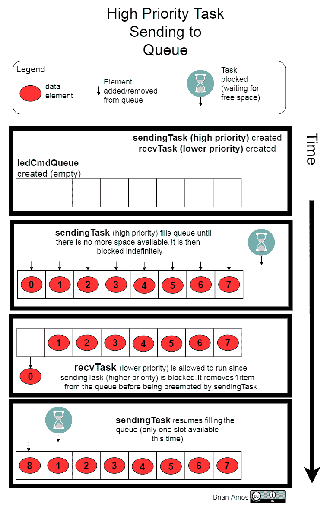
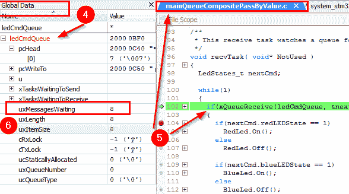
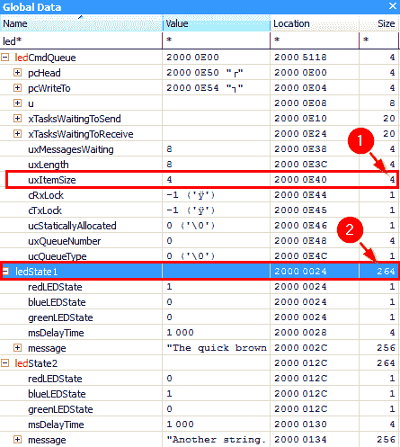
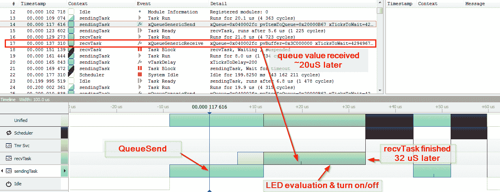
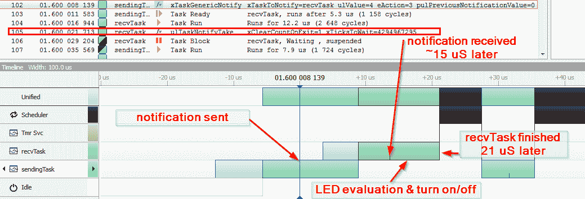

# 第九章：任务间通信

现在我们能够创建任务，是时候开始在它们之间传递数据了。毕竟，你很少会遇到完全独立运行的并行任务系统；通常，你需要在系统中的不同任务之间传递一些数据。这就是任务间通信发挥作用的地方。

在 FreeRTOS 中，可以使用队列和直接任务通知来实现任务间通信。在本章中，我们将通过示例介绍队列的几个不同用例，并讨论每个用例的优缺点。我们将查看有关在队列中等待项目出现时阻塞的任务的所有细节，以及超时。在查看队列之后，我们将转向任务通知，并了解为什么我们应该使用它们以及何时使用。

简而言之，我们将涵盖以下主题：

+   通过值传递数据通过队列

+   通过引用传递数据

+   直接任务通知

# 技术要求

要完成本章的练习，你需要以下内容：

+   Nucleo F767 开发板

+   Micro-USB 线

+   STM32CubeIDE 和源代码（见第五章，*选择 IDE – 设置我们的 IDE*）

+   SEGGER JLink、Ozone 和 SystemView（见第六章，*实时系统调试工具*）

构建示例的最简单方法是同时构建所有 Eclipse 配置，然后使用 Ozone 加载和查看它们：

1.  在*STM32CubeIDE*中，右键单击项目。

1.  选择“构建”。

1.  选择“构建所有”。所有示例都将构建到它们自己的命名子目录中（这可能需要一段时间）。

1.  在 Ozone*中，你现在可以快速加载每个`<exampleName>.elf`文件——见`Chapter6`中的说明，了解如何进行此操作。正确链接到可执行文件中的源文件将自动显示。

本章中的所有示例代码都可以从[`https://github.com/PacktPublishing/Hands-On-RTOS-with-Microcontrollers/tree/master/Chapter_9`](https://github.com/PacktPublishing/Hands-On-RTOS-with-Microcontrollers/tree/master/Chapter_9)下载。每个`main*.c`文件都在`Chapter_9`项目内部有自己的基于 Eclipse 的配置，准备好编译并加载到 Nucleo 板上。

# 通过值传递数据通过队列

就像信号量和互斥锁一样，队列是在跨多个异步执行的任务操作时最广泛使用（和实现）的结构之一。它们几乎可以在每个操作系统中找到，因此了解如何使用它们是非常有益的。我们将探讨几种不同的使用队列和与之交互的方法，以影响任务的状态。

在以下示例中，我们将学习如何将队列用作向 LED 状态机发送*命令*的手段。首先，我们将检查一个非常简单的用例，将单个单字节值传递到队列中并对其操作。

# 通过值传递一个字节

在这个例子中，设置了一个单个`uint8_t`来传递单个枚举，`(LED_CMDS)`，一次定义一个 LED 的状态或所有 LED 的状态（开/关）。以下是本例中涵盖的内容摘要：

+   `ledCmdQueue`：一个单字节值（`uint8_t`）的队列，表示定义 LED 状态的枚举。

+   `recvTask`：这个任务从队列中接收一个字节，执行所需的操作，然后立即尝试从队列中接收下一个字节。

+   `sendingTask`：这个任务通过一个简单的循环将枚举值发送到队列中，每次发送之间有 200 毫秒的延迟（这样 LED 的开关动作就可见了）。

那么，让我们开始吧：

1.  设置一个`enum`来帮助我们描述传递到队列中的值：

以下是从`mainQueueSimplePassByValue.c`中摘录的内容：

```cpp
typedef enum
{
  ALL_OFF = 0,
  RED_ON = 1,
  RED_OFF = 2,
  BLUE_ON = 3,
  BLUE_OFF= 4,
  GREEN_ON = 5,
  GREEN_OFF = 6,
  ALL_ON = 7

}LED_CMDS;
```

1.  与信号量的初始化范例类似，队列必须首先创建并存储其句柄，以便以后可以使用它来访问队列。定义一个句柄，用于指向用于传递`uint8_t`实例的队列：

```cpp
static QueueHandle_t ledCmdQueue = NULL;
```

1.  使用`xQueueCreate()`函数创建队列（在继续之前验证其成功创建）：

```cpp
QueueHandle_t xQueueCreate( UBaseType_t uxQueueLength,
                             UBaseType_t uxItemSize );
```

快速概述一下我们在这里看到的内容：

+   `uxQueueLength`：队列可以容纳的最大元素数

+   `uxItemSize`：队列中每个元素的大小（以字节为单位）

+   返回值：创建的队列的句柄（或错误时返回`NULL`）

我们对`xQueueCreate`的调用将如下所示：

```cpp
ledCmdQueue = xQueueCreate(2, sizeof(uint8_t));
assert_param(ledCmdQueue != NULL);
```

让我们概述一下我们在这里看到的内容：

+   队列最多可以容纳`2`个元素。

+   每个元素的大小足以存储`uint8_t`（一个字节足以存储我们明确定义的任何枚举的值）。

+   `xQueueCreate`返回创建的队列的句柄，该句柄存储在`ledCmdQueue`中。这个“句柄”是一个全局变量，将被各种任务在访问队列时使用。

`recvTask()`的开始如下所示：

```cpp
void recvTask( void* NotUsed )
{
  uint8_t nextCmd = 0;

  while(1)
  {
    if(xQueueReceive(ledCmdQueue, &nextCmd, portMAX_DELAY) == pdTRUE)
    {
      switch(nextCmd)
      {
        case ALL_OFF:
          RedLed.Off();
          GreenLed.Off();
          BlueLed.Off();
        break;
        case GREEN_ON:
          GreenLed.On();
        break;
```

让我们仔细看看前面代码中突出显示的实际队列接收行：

`if(xQueueReceive(ledCmdQueue, &nextCmd, portMAX_DELAY) == pdTRUE)`

+   使用句柄`ledCmdQueue`来访问队列。

+   在栈上定义了一个局部`uint8_t`，`nextCmd`。传递这个变量的地址（一个指针）。`xQueueReceive`将下一个`LED_CMD`枚举（存储在队列中的字节）复制到`nextCmd`中。

+   对于此访问使用无限超时——也就是说，如果队列中没有添加任何内容，此函数将永远不会返回（这与互斥锁和信号量 API 调用的超时相同）。

由于延迟时间是无限的，所以`if( <...> == pdTRUE)`是多余的；然而，提前设置错误处理是一个好主意，这样如果以后定义了非无限超时，就不会忘记错误状态。`xQueueReceive()`也可能因其他原因失败（例如，无效的队列句柄）。

`sendingTask`是一个简单的`while`循环，它使用对枚举值的先验知识将不同的`LED_CMDS`值传递到`ledCmdQueue`中：

```cpp
void sendingTask( void* NotUsed )
{
  while(1)
  {
    for(int i = 0; i < 8; i++)
    {
      uint8_t ledCmd = (LED_CMDS) i;
 xQueueSend(ledCmdQueue, &ledCmd, portMAX_DELAY);
      vTaskDelay(200/portTICK_PERIOD_MS);
    }
  }
}
```

发送方的 `xQueueSend()` 的参数几乎与接收方的 `xQueueReceive()` 相同，唯一的区别是我们这次是向队列发送数据：

`xQueueSend(ledCmdQueue, &ledCmd, portMAX_DELAY);`

+   `ledCmdQueue`：发送数据的队列句柄

+   `&ledCmd`：要传递到队列中的数据的地址

+   `portMax_DELAY`：等待队列空间变为可用（如果队列已满）的 RTOS 指针数

类似于在达到超时值之前队列中没有内容时 `xQueueReceive` 的超时，如果队列在指定的超时时间内仍然满载且项目未添加到队列中，`xQueueSend` 的调用可能会超时。如果你的应用程序有一个非无限的超时（在几乎所有情况下都应该是这样），你需要考虑在这种情况下应该发生什么。可能的行动方案包括简单地丢弃数据项（它将永远丢失）到抛出一个断言并进入某种紧急/恐慌状态，并执行紧急关闭。在某些情况下，重启也很流行。确切的行为通常将由你正在工作的项目/产品的类型决定。

随意构建并下载 `queueSimplePassByValue` 到 Nucleo 开发板上。你会注意到 LED 会遵循由 `LED_CMDS` 枚举定义的模式：`ALL_OFF`、`RED_ON`、`RED_OFF`、`BLUE_ON`、`BLUE_OFF`、`GREEN_ON`、`GREEN_OFF`、`ALL_ON`，每个状态转换之间间隔 200 毫秒。

但如果我们决定我们想要同时操作多个 LED，我们可以向现有的 `LED_CMDS` 枚举中添加更多值，例如 `RED_ON_BLUE_ON_GREEN_OFF`，但这将涉及大量的容易出错的输入，特别是如果我们有超过 3 个 LED（8 个 LED 需要覆盖每个 LED 开/关的所有组合，枚举值达到 256）。相反，让我们看看我们如何使用 struct 来描述 LED 命令并通过我们的队列传递它。

# 通过值传递复合数据类型

FreeRTOS 队列（以及大多数其他 FreeRTOS API 函数）接受 `void*` 作为操作的数据类型的参数。这样做是为了尽可能高效地为应用程序编写者提供灵活性。由于 `void*` 只是一个指向 *任何事物* 的指针，并且队列中元素的大小在创建时就已经定义，因此队列可以用来在任务之间传递任何东西。

使用 `void*` 与队列交互就像一把双刃剑。它提供了最大的灵活性，但也提供了你将错误的数据类型传递到队列中的真实可能性，而且编译器可能不会发出警告。你必须跟踪每个队列中存储的数据类型！

我们将利用这种灵活性，传递一个由 `uint8_t` 实例的 struct 组成的复合数据类型，每个实例只有一位宽，以描述所有三个 LED 的状态：

来自 `mainQueueCompositePassByValue.c` 的摘录：

```cpp
typedef struct
{
  uint8_t redLEDState : 1; //specify this variable as 1 bit wide 
  uint8_t blueLEDState : 1; //specify this variable as 1 bit wide 
  uint8_t greenLEDState : 1; //specify this variable as 1 bit wide 
  uint32_t msDelayTime; //min number of mS to remain in this state
}LedStates_t;
```

我们还将创建一个能够容纳整个 `LedStates_t` 结构体八份副本的队列：

`ledCmdQueue = xQueueCreate(8, sizeof(LedStates_t));`

与上一个示例类似，`recvTask` 等待从 `ledCmdQueue` 队列中可用一个项目，然后对其进行操作（根据需要打开/关闭 LED）：

`mainQueueCompositePassByValue.c recvTask`：

```cpp
if(xQueueReceive(ledCmdQueue, &nextCmd, portMAX_DELAY) == pdTRUE)
{
    if(nextCmd.redLEDState == 1)
        RedLed.On();
    else
        RedLed.Off();
    if(nextCmd.blueLEDState == 1)
        BlueLed.On();
    else
        BlueLed.Off();
    if(nextCmd.greenLEDState == 1)
        GreenLed.On();
    else
        GreenLed.Off();
}
vTaskDelay(nextCmd.msDelayTime/portTICK_PERIOD_MS);
```

下面是 `recvTask` 的主要循环的职责：

+   每次从队列中可用一个元素时，都会评估结构体的每个字段，并采取适当的操作。所有三个 LED 都通过发送到队列的单个命令进行更新。

+   新创建的 `msDelayTime` 字段也被评估（它用于在任务再次尝试从队列接收之前添加延迟）。这就是使系统足够慢，以便 LED 状态可见的原因。

`mainQueueCompositePassByValue.c sendingTask`：

```cpp
while(1)
  {
    nextStates.redLEDState = 1;
    nextStates.greenLEDState = 1;
    nextStates.blueLEDState = 1;
    nextStates.msDelayTime = 100;

    xQueueSend(ledCmdQueue, &nextStates, portMAX_DELAY);

    nextStates.blueLEDState = 0; //turn off just the blue LED
    nextStates.msDelayTime = 1500;
    xQueueSend(ledCmdQueue, &nextStates, portMAX_DELAY);

    nextStates.greenLEDState = 0;//turn off just the green LED
    nextStates.msDelayTime = 200;
    xQueueSend(ledCmdQueue, &nextStates, portMAX_DELAY);

    nextStates.redLEDState = 0;
    xQueueSend(ledCmdQueue, &nextStates, portMAX_DELAY);
  }
```

`sendingTask` 的循环向 `ledCmdQueue` 发送几个命令——以下是详细信息：

+   `sendingTask` 看起来与之前略有不同。现在，由于传递了一个结构体，我们可以访问每个字段，在将 `nextStates` 发送到队列之前设置多个字段。

+   每次调用 `xQueueSend` 时，都会将 `nextStates` 的内容复制到队列中，然后再继续。一旦 `xQueueSend()` 成功返回，`nextStates` 的值就会被复制到队列存储中；`nextStates` 不需要保留。

为了说明 `nextStates` 的值被复制到队列中的这一点，此示例更改了任务的优先级，以便在 `recvTask` 清空队列之前，由 `sendingTask` 将队列填满。这是通过给 `sendingTask` 比 `revcTask` 更高的优先级来实现的。以下是我们的任务定义的外观（断言在代码中存在但在此处未显示以减少混乱）：

```cpp
xTaskCreate(recvTask, "recvTask", STACK_SIZE, NULL, tskIDLE_PRIORITY + 1, 
            NULL);
xTaskCreate(sendingTask, "sendingTask", STACK_SIZE, NULL, 
            configMAX_PRIORITIES – 1, NULL);

```

`sendingTask` 被配置为系统中的最高优先级。`configMAX_PRIORITIES` 在 `Chapter9/Inc/FreeRTOSConfig.h` 中定义，并且是可用的优先级数量。FreeRTOS 任务优先级被设置为 `0` 是系统中的最低优先级任务，而系统中的最高优先级是 `configMAX_PRIORITIES - 1`。

这种优先级设置允许 `sendingTask` 重复向队列发送数据，直到它填满（因为 `sendingTask` 具有更高的优先级）。队列填满后，`sendingTask` 将阻塞，并允许 `recvTask` 从队列中移除一个项目。让我们更详细地看看这是如何实现的。

# 理解队列如何影响执行

任务优先级与队列等原语协同工作，以定义系统的行为。这在抢占式实时操作系统应用中尤为重要，因为上下文总是基于优先级给出的。程序化的队列交互需要考虑任务优先级以实现所需的操作。优先级需要仔细选择，以便与单个任务的设计协同工作。

在这个例子中，为`sendingTask`选择了无限等待时间，以便它可以填满队列。

下面是一个描述前面设置动作的图示：



看一下这个使用 Ozone 逐步执行代码并理解其行为的示例。我们可以逐步通过`sendingTask while`循环的几个迭代，观察每个任务中的`ledCmdQueue`数据结构和断点设置：

1.  确保你已经构建了`queueCompositePassByValue`配置。

1.  双击`Chapter_9\Chapter_9.jdebug`打开 Ozone。

1.  前往文件 | 打开 | Chapter_9\queueCompositePassByValue\Chapter9_QueuePassCompositeByValue.elf。

1.  打开全局变量视图，在逐步执行代码时观察`ledCmdQueue`。

1.  在`recvTask`中设置断点，以便在从队列中移除项目时停止调试器。

1.  当`recvTask`第一次运行时，你会注意到`uxMessagesWaiting`的值将是`8`（队列已满）：



在遇到严重问题之前熟悉你正在使用的任何调试器总是一个好主意。一种第二本能的熟悉程度可以让你将注意力集中在手头的问题上，而不是使用的工具。

# 关于示例的重要注意事项

之前示例的主要目的是说明以下要点：

+   队列可以用来存储任意数据。

+   队列以有趣的方式与任务优先级交互。

为了简化行为并使示例更容易理解，我们做出了一些权衡：

+   **从队列接收任务的优先级较低**：在实践中，你需要平衡从队列接收任务的优先级（以保持低延迟并防止队列填满）与系统中其他事件的优先级。

+   **使用了长队列来执行命令**：深度队列与从其接收的低优先级任务结合将创建系统中的延迟。由于低任务优先级和长队列长度的组合，这个例子包含了几个秒的队列命令。由于深度/优先级的组合，添加到队列中的元素将在添加后几秒钟才执行。

+   **向队列发送项目时使用了无限超时**：这将导致`sendTask()`无限期地等待一个槽位变得可用。在这种情况下，这是我们想要的（为了简单起见），但在实际的时间关键系统中，你需要记住任务在发生错误之前能够等待多长时间。

我们还没有完全探索队列的灵活性。接下来，我们将查看通过引用向队列传递数据的特殊情况。

# 通过引用通过队列传递数据

由于队列的数据类型是任意的，我们也有能力通过引用而不是通过值传递数据。这与通过引用传递函数参数的方式类似。

# 何时通过引用传递

由于队列会复制其持有的任何内容，如果被队列化的数据结构很大，按值传递它将是不高效的：

+   从队列中发送和接收数据会强制复制队列元素。

+   如果队列中包含大量结构，则结果队列对于大型数据项会变得非常大。

因此，当需要队列化大型项目时，通过引用传递项目是一个好主意。以下是一个较大结构体的示例。在编译器填充此结构体后，它最终的大小为 264 字节：

`mainQueueCompositePassByReference.c`:

```cpp
#define MAX_MSG_LEN 256
typedef struct
{
  uint32_t redLEDState : 1;
  uint32_t blueLEDState : 1;
  uint32_t greenLEDState : 1;
  uint32_t msDelayTime; //min number of mS to remain in this state
  //an array for storing strings of up to 256 char
  char message[MAX_MSG_LEN];
}LedStates_t;
```

而不是每次向`ledCmdQueue`添加或从其中移除项目时都复制 264 字节，我们可以将`ledCmdQueue`定义为保存指向`LedStates_t`的指针（在 Cortex-M 上为 4 字节）：

`ledCmdQueue = xQueueCreate(8, **sizeof(LedStates_t*****)**);`

让我们看看按值传递和通过引用传递之间的区别：

**按值传递：**

+   `ledCmdQueue` **大小：** ~ 2 KB（264 字节 * 8 个元素）。

+   每次调用`xQueueSend()`或`xQueueReceive()`时，会复制 264 字节。

+   添加到队列中的`LedStates_t`原始副本可以立即丢弃（队列内已存在完整的副本）。

**通过引用传递：**

+   `ledCmdQueue` **大小：** 32 字节（4 字节 * 8 个元素）。

+   每次调用`xQueueSend()`或`xQueueReceive()`时，会复制 4 字节（指针的大小）。

+   添加到队列中的`LedStates_t`原始副本*必须保留*，直到不再需要（这是系统中的唯一副本；只有原始结构的指针被队列化）。

当通过引用传递时，我们是在提高效率、（可能）减少 RAM 消耗和更复杂的代码之间做出权衡。额外的复杂性来自于确保原始值在整个需要的时间内保持有效。这种方法与将结构体作为参数传递给函数的引用传递非常相似。

可以创建一些`LedStates_t`的实例：

```cpp
static LedStates_t ledState1 = {1, 0, 0, 1000, 
  "The quick brown fox jumped over the lazy dog.
  The Red LED is on."};
static LedStates_t ledState2 = {0, 1, 0, 1000,
  "Another string. The Blue LED is on"};
```

使用 Ozone，我们可以轻松查看我们创建的内容：

1.  `ledCmdQeue`的`uxItemSize`是 4 字节，正如我们预期的那样，因为队列正在保存指向`LedStates_t`的指针。

1.  `ledState1`和`ledState2`的实际大小都是 264 字节，正如预期的那样：



要向队列发送项目，请按照以下步骤操作：

1.  创建变量的指针并将其地址传递进去：

```cpp
void sendingTask( void* NotUsed )
{
  LedStates_t* state1Ptr = &ledState1;
  LedStates_t* state2Ptr = &ledState2;

  while(1)
  {
    xQueueSend(ledCmdQueue, &state1Ptr, portMAX_DELAY);
    xQueueSend(ledCmdQueue, &state2Ptr, portMAX_DELAY);
  }
}
```

1.  要从工作队列接收项目，只需定义正确数据类型的指针并传递指针的地址：

```cpp
void recvTask( void* NotUsed )
{
    LedStates_t* nextCmd;

    while(1)
    {
        if(xQueueReceive(ledCmdQueue, &nextCmd, portMAX_DELAY) == 
                                                           pdTRUE)
        {
            if(nextCmd->redLEDState == 1)
            RedLed.On();
```

当操作从队列中取出的项目时，请记住你有一个需要解引用的指针（即`nextCmd->redLEDState`）。

现在来说说**注意点**...

# 重要注意事项

通过引用传递数据结构在移动大数据结构时可能比按值传递更高效，但需要注意以下几点：

+   **保持数据类型一致**：由于队列的参数是`void*`数据类型，编译器将无法警告你正在提供一个结构体的地址而不是指针的地址。

+   **保留队列中的数据**：与通过值传递数据不同，当队列持有数据的指针时，传递给队列的底层数据需要保留直到它被使用。这有以下影响：

    +   数据不能存在于栈上——没有局部函数变量！虽然这*可以*实现，但在调用链的*中间*定义变量并将指针推入队列通常是一个坏主意。当接收任务从队列中拉出指针时，发送任务的栈可能已经改变。即使你能在某些情况下（例如，当接收任务比发送任务具有更高的优先级时）实现这一点，你也将创建一个非常脆弱的系统，它可能在未来的某个微妙的方式上崩溃。

    +   对于底层变量，必须有一个稳定的存储位置。全局和静态分配的变量都是可接受的。如果你想要限制对变量的访问，可以在函数内部使用静态分配。这将使变量保持在内存中，就像它是全局变量一样，但限制对其的访问：

```cpp
void func( void ) 
{
    static struct MyBigStruct myVar;
```

+   +   你应该为变量动态分配空间（如果应用程序中接受动态分配）。有关内存管理（包括动态分配）的详细信息，请参阅第十五章*，FreeRTOS 内存管理*。

+   **谁拥有数据？**当队列有一个结构体的副本时，队列拥有这个副本。一旦项目从队列中移除，它就会消失。这与持有数据*指针*的队列形成对比。当指针从队列中移除时，数据仍然存在于其原始位置。数据所有权需要非常明确。接收队列指针的任务将成为新的所有者（并负责释放如果使用过的话动态分配的内存）吗？原始发送指针的任务仍然保持所有权吗？这些都是需要提前考虑的重要问题。

既然我们已经讨论了传递大量数据（尽可能避免！），让我们谈谈传递少量数据的高效方法。

# 直接任务通知

由于其灵活性，队列是实时操作系统（RTOS）的一个优秀的工作马。有时，所有这些灵活性都不需要，我们更希望有一个更轻量级的替代方案。直接任务通知与其他讨论的通信机制类似，不同之处在于它们不需要在 RAM 中首先实例化通信对象。它们也比信号量或队列（快 35%到 45%）更快。

它们确实有一些限制，最大的两个限制是每次只能通知一个任务，并且通知可以由中断服务例程（ISR）发送但不能接收。

直接任务通知有两个主要组成部分：通知本身（它在解除任务阻塞时的行为非常类似于信号量或队列）和一个 32 位通知值。通知值是可选的，有几个不同的用途。通知器可以选择覆盖整个值或使用通知值作为位字段并设置单个位。设置单个位对于在不依赖基于队列的更复杂命令驱动实现的情况下，让任务意识到不同的行为非常有用。

以我们的 LED 为例。如果我们想创建一个简单的 LED 处理程序，它能快速响应更改请求，那么就不需要多元素队列；我们可以利用内置的 32 位宽通知值。

如果你认为*任务通知听起来有点像信号量*，你就对了！任务通知也可以用作比信号量更快的替代品。

让我们通过一个示例来看看任务通知如何被用来发布命令并将信息传递给一个任务。

# 使用任务通知传递简单数据

在这个例子中，我们的目标是让`recvTask`设置 LED 状态，它在这一章的整个过程中一直在做这件事。这次，`recvTask`将一次只执行一个状态更改，而不是允许未来 LED 状态的多个副本堆积起来并在将来某个时间执行。

由于通知值是内置在任务中的，因此不需要创建额外的队列——我们只需要确保我们存储了`recvTask`的任务句柄，这将在我们发送通知时使用。

让我们通过查看一些`mainTaskNotifications.c`的摘录来看看我们是如何做到这一点的***：***

1.  在`main`函数外部，我们将定义一些位掩码和一个任务句柄：

```cpp
#define RED_LED_MASK 0x0001
#define BLUE_LED_MASK 0x0002
#define GREEN_LED_MASK 0x0004
static xTaskHandle recvTaskHandle = NULL; 
```

1.  在`main`函数内部，我们将创建`recvTask`并传递一个句柄来填充：

```cpp
retVal = xTaskCreate(recvTask, "recvTask", STACK_SIZE, NULL, 
                     tskIDLE_PRIORITY + 2, &recvTaskHandle);
assert_param( retVal == pdPASS);
assert_param(recvTaskHandle != NULL);
```

1.  接收通知的任务被设置为等待下一个传入的通知，然后评估每个 LED 的掩码，相应地打开/关闭 LED：

```cpp
void recvTask( void* NotUsed )
{
    while(1)
    {
        uint32_t notificationvalue = ulTaskNotifyTake( pdTRUE, 
                                              portMAX_DELAY );
        if((notificationvalue & RED_LED_MASK) != 0)
            RedLed.On();
        else
            RedLed.Off();
```

1.  发送任务被设置为发送一个通知，覆盖可能存在的任何现有通知。这导致`xTaskNotify`始终返回`pdTRUE`：

```cpp
void sendingTask( void* NotUsed )
{
    while(1)
    {
 xTaskNotify( recvTaskHandle, RED_LED_MASK,
 eSetValueWithOverwrite);
        vTaskDelay(200);
```

这个例子可以使用`directTaskNotification`配置构建并上传到 Nucleo。当通知被发送到`recvTask`时，它将依次闪烁每个 LED。

# 任务通知的其他选项

从`task.h`中的`eNotifyAction`枚举中，我们可以看到通知任务的其他选项包括以下内容：

```cpp
eNoAction = 0, /* Notify the task without updating its notify value. */
 eSetBits, /* Set bits in the task's notification value. */
 eIncrement, /* Increment the task's notification value. */
 eSetValueWithOverwrite, /* Set the task's notification value to a specific value even if the previous value has not yet been read by the task. */
 eSetValueWithoutOverwrite /* Set the task's notification value if the previous value has been read by the task. */
```

使用这些选项可以创建一些额外的灵活性，例如使用通知作为二进制和计数信号量。请注意，这些选项中的一些会改变`xTaskNotify`的返回方式，因此在某些情况下需要检查返回值。

# 比较直接任务通知与队列

与队列相比，任务通知具有以下特性：

+   它们总是有正好一个 32 位整数的存储容量。

+   它们不提供等待将通知推送到忙碌任务的方法；它将覆盖现有的通知或立即返回而不写入。

+   它们只能与一个接收器一起使用（因为通知值存储在接收任务中）。

+   它们更快。

让我们看看一个使用 SystemView 的实际例子，比较我们刚刚编写的直接通知代码和第一个队列实现。

当执行`xQueueSend`时，`mainQueueSimplePassByValue.c`中的队列实现看起来是这样的：



当调用`xTaskNotify`时，直接任务通知看起来是这样的：



从前面的截图我们可以看出，在特定用例中，直接任务通知比使用队列快 25-35%。使用直接任务通知时，存储队列也没有 RAM 开销。

# 摘要

你现在已经学会了如何在各种场景下使用队列，例如通过值和引用传递简单和复合元素。你了解使用队列存储对象引用的优缺点，以及何时适合使用这种方法。我们还涵盖了队列、任务和任务优先级之间的一些详细交互。最后，我们通过一个简单的现实世界例子展示了如何使用任务通知来高效地驱动一个小型状态机。

随着你越来越习惯于使用 RTOS 解决各种问题，你会发现使用队列和任务通知的新颖和创造性的方法。任务、队列、信号量和互斥锁确实是 RTOS 应用程序的构建块，并将帮助你走得很远。

尽管如此，我们还没有完全完成这些元素——关于在 ISR 上下文中使用所有这些原语还有很多更高级的材料要介绍，这正是接下来的内容！

# 问题

在我们总结之前，这里有一份问题列表，供你测试对本章材料的理解。你将在附录的*评估*部分找到答案：

1.  可以将哪些数据类型传递给队列？

1.  当任务在等待时尝试操作队列会发生什么？

1.  在将引用传递给队列时，需要考虑哪些因素？

1.  任务通知可以完全替代队列：

    +   真的

    +   假的

1.  任务通知可以发送任何类型的数据：

    +   真的

    +   假的

1.  与队列相比，任务通知的优点是什么？

# 进一步阅读

+   **`FreeRTOSConfig.h`中所有常量的解释**：[`www.freertos.org/a00110.html`](https://www.freertos.org/a00110.html)

+   **FreeRTOS 直接任务通知**：[`www.freertos.org/RTOS-task-notifications.html`](https://www.freertos.org/RTOS-task-notifications.html)
