# 第十章：驱动程序和中断服务例程（ISRs）

与**微控制器单元**（**MCU**）的外设交互在许多应用中非常重要。在本章中，我们将讨论几种不同的实现外设驱动程序的方法。到目前为止，我们一直使用闪烁的 LED 作为与我们的开发板交互的手段。这即将改变。随着我们寻求对外设驱动程序有更深入的了解，我们将开始关注实现通用通信外设——**通用异步收发传输器**（**UART**）驱动程序的不同方式。当我们从一个 UART 向另一个 UART 传输数据时，我们将揭示外设和**直接内存访问**（**DMA**）硬件在创建高效驱动程序实现时的重要作用。

我们将首先通过在任务中实现一个极其简单的轮询只接收驱动程序来探索 UART 外设。在查看该驱动程序的性能后，我们将仔细研究**中断服务例程**（**ISRs**）以及它们与 RTOS 内核交互的不同方式。驱动程序将使用中断重新实现。之后，我们将添加对基于 DMA 的驱动程序的支持。最后，我们将探讨几种不同的方法，了解驱动程序如何与系统其他部分交互，并查看 FreeRTOS 的新功能——流缓冲区。在本章中，我们将使用 SystemView 密切关注整体系统性能。到本章结束时，你应该对编写可以利用 RTOS 功能来提高可用性的驱动程序时需要做出的权衡有一个稳固的理解。

本章将涵盖以下主题：

+   介绍 UART

+   创建轮询 UART 驱动程序

+   区分任务和中断服务例程

+   创建基于中断服务例程的驱动程序

+   创建基于 DMA 的驱动程序

+   FreeRTOS 流缓冲区

+   选择驱动程序模型

+   使用第三方库（STM HAL）

# 技术要求

要完成本章的练习，你需要以下内容：

+   Nucleo F767 开发板

+   跳线——20 到 22 AWG（约 0.65 毫米）实心线

+   Micro-USB 线缆

+   STM32CubeIDE 和源代码（在第五章的*设置我们的 IDE*部分中的说明，*选择 IDE*）

+   SEGGER J-Link、Ozone 和 SystemView（在第六章的*实时系统调试工具*部分中的说明）

本章中使用的所有源代码均可在[`github.com/PacktPublishing/Hands-On-RTOS-with-Microcontrollers/tree/master/Chapter_10`](https://github.com/PacktPublishing/Hands-On-RTOS-with-Microcontrollers/tree/master/Chapter_10)找到。

# 介绍 UART

正如我们在第四章中简要介绍的，*选择合适的 MCU*，缩写 **UART** 代表 **通用异步收发器/发送器**。UART 硬件通过在预定速率下调制信号线的电压来传输数据字节：

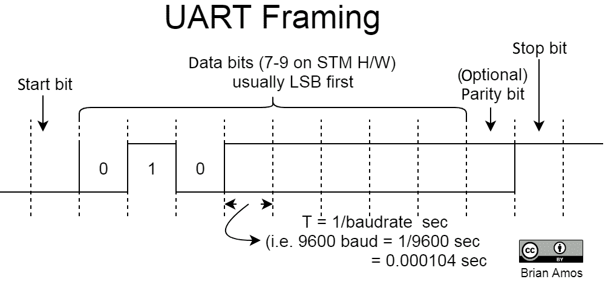

UART 的 **异步** 特性意味着不需要额外的时钟线来监控单个位转换。相反，硬件被设置为以特定频率（波特率）转换每个位。UART 硬件还在每个传输的数据包的开始和结束处添加一些额外的帧。起始位和停止位表示数据包的开始和结束。这些位（以及可选的奇偶校验位）由硬件用于帮助保证数据包的有效性（通常长度为 8 位）。

UART 硬件的更通用形式是 **USART**（通用同步/异步接收发送器）。USARTs 能够以同步（添加时钟信号）或异步（不添加时钟信号）的方式传输数据。

UARTs 常常用于不同芯片和系统之间的通信。它们构成了许多不同通信解决方案的基础，例如 RS232、RS422、RS485、Modbus 等。UARTs 也可以用于多处理器通信以及与同一系统中的不同芯片通信——例如，WiFi 和蓝牙收发器。

在本章中，我们将开发几个 UART 驱动程序的迭代版本。为了能够观察系统行为，我们将把 Nucleo 开发板上的两个 UART 连接起来，如下面的图所示。图中的两个连接将把 UART4 的发送信号连接到 USART2 的接收信号。同样，它们将 USART2 的 Tx 连接到 UART4 的 Rx。这将允许 UARTs 之间的双向通信。连接应使用预接线的 **跳线** 或 20-22 AWG (~0.65 mm) 实心线：

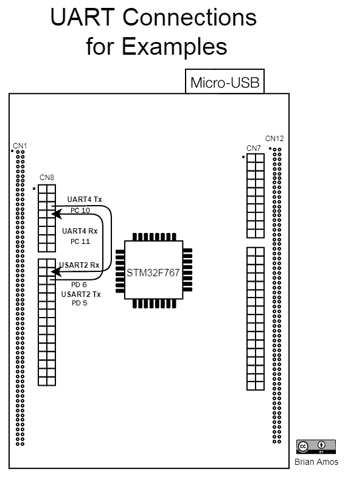

现在连接已经完成，让我们更详细地看看在我们可以考虑在这个芯片上的外设之间传输数据之前还需要发生什么。

# 设置 UART

如以下简化框图所示，设置 UART 进行通信时涉及一些组件。UART 需要正确配置以在正确的波特率、奇偶校验设置、流量控制和停止位下传输。与 UART 交互的其他硬件也需要正确配置：

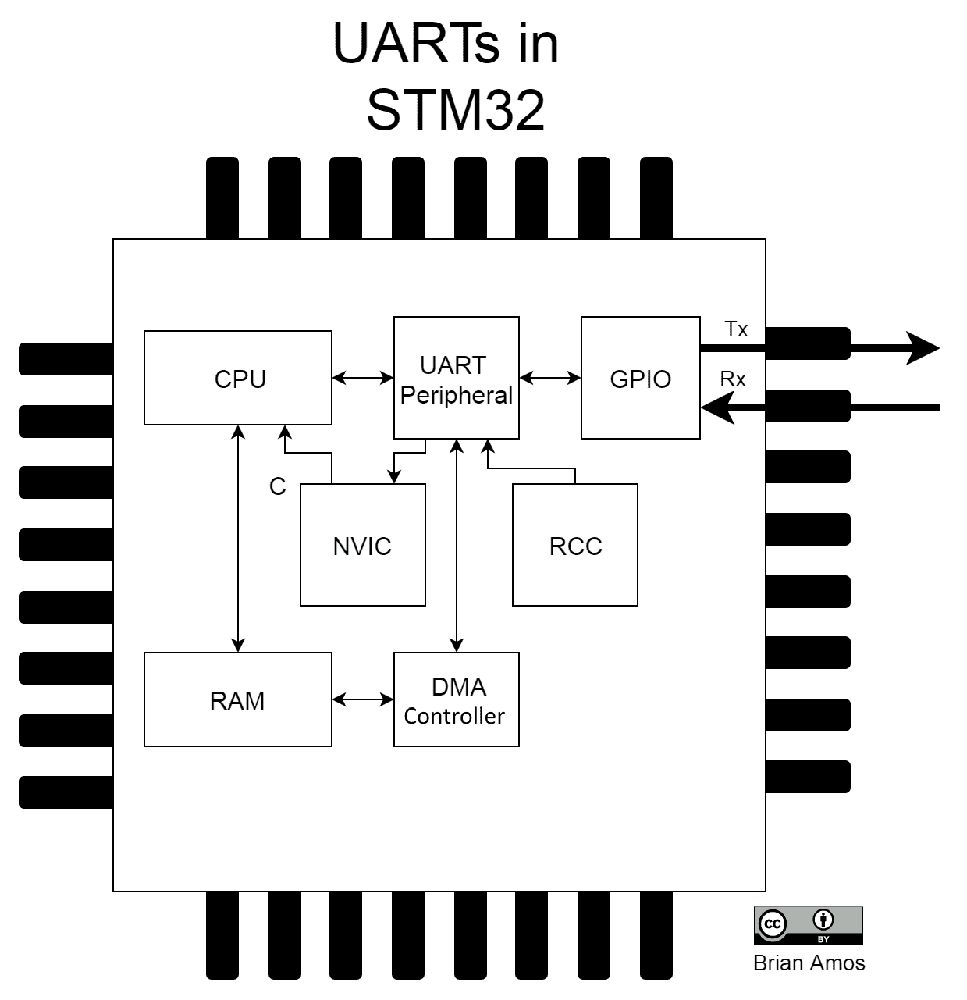

这里有一份需要执行的步骤列表，以设置 UART4。虽然我们以 UART4 为例，但相同的步骤将适用于大多数其他连接到 MCU 引脚的外设：

1.  配置 GPIO 线。由于 MCU 上的每个 GPIO 引脚都可以与许多不同的外设共享，因此它们必须配置为连接到所需的外设（在这种情况下，是 UART）。在这个例子中，我们将介绍将 PC10 和 PC11 连接到 UART4 信号的过程：

你可以在 STM 的 STM32F767xx 数据手册*第三部分，引脚配置和引脚描述*中了解更多关于 STM32F7xx 系列 MCU 引脚的信息*DoCID 029041*。数据手册通常包含特定 MCU 型号的信息，而参考手册将包含整个 MCU 系列的一般信息。以下摘录来自数据表中的一个表格，显示了交替功能引脚映射：

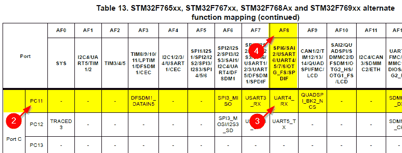

1.  引用所需的端口和位。（在这种情况下，我们将设置端口`C`位`11`以映射到`UART4_Rx`功能）。

1.  找到所需的引脚交替功能（`UART4_Rx`）。

1.  找到配置 GPIO 寄存器时使用的交替功能号（`AF8`）。

1.  设置适当的 GPIO 寄存器以正确配置硬件并将所需的 UART 外设映射到物理引脚。

为了简单起见，这里使用了 STM 提供的`HAL`函数。当调用`HAL_GPIO_Init`时，将写入适当的 GPIO 寄存器。我们只需要填写一个`GPIO_InitTypeDef`结构体，并传递`HAL_GPIO_Init`的引用；在下面的代码中，端口`C`上的`10`GPIO 引脚和`11`GPIO 引脚都被初始化为交替推挽功能。它们还通过将交替功能成员设置为`AF8`（在第 4 步中确定）映射到`UART4`：

```cpp
GPIO_InitTypeDef GPIO_InitStruct = {0};
//PC10 is UART4_TX PC11 is UART4_RX
GPIO_InitStruct.Pin = GPIO_PIN_10 | GPIO_PIN_11;
GPIO_InitStruct.Mode = GPIO_MODE_AF_PP;
GPIO_InitStruct.Pull = GPIO_NOPULL;
GPIO_InitStruct.Alternate = GPIO_AF8_UART4;
HAL_GPIO_Init(GPIOC, &GPIO_InitStruct);
```

1.  启用必要的外设时钟。由于每个外设时钟默认关闭（为了节能），必须通过写入**复位和时钟控制**（**RCC**）寄存器来打开 UART 的外设时钟。以下行也来自`HAL`：

```cpp
__UART4_CLK_ENABLE();
```

1.  通过配置**嵌套向量中断控制器**（**NVIC**）中的设置（如果使用它们）来配置中断——适当的情况下，将在示例中包含详细信息。

1.  配置 DMA（如果使用它）——适当的情况下，将在示例中包含详细信息。

1.  配置外设所需的设置，例如波特率、奇偶校验、流量控制等。

以下代码是从`BSP/UartQuickDirtyInit.c`中的`STM_UartInit`函数的摘录，其中**`Baudrate`**和**`STM_UART_PERIPH`**是`STM_UartInit`的输入参数，这使得配置具有类似设置的多个 UART 外设变得非常容易，无需每次都重复以下代码：

```cpp
HAL_StatusTypeDef retVal;
UART_HandleTypeDef uartInitStruct;
uartInitStruct.Instance = STM_UART_PERIPH;
uartInitStruct.Init.BaudRate = Baudrate;
uartInitStruct.Init.WordLength = UART_WORDLENGTH_8B;
uartInitStruct.Init.StopBits = UART_STOPBITS_1;
uartInitStruct.Init.Parity = UART_PARITY_NONE;
uartInitStruct.Init.Mode = UART_MODE_TX_RX;
uartInitStruct.Init.HwFlowCtl = UART_HWCONTROL_NONE;
uartInitStruct.Init.OverSampling = UART_OVERSAMPLING_16;
uartInitStruct.Init.OneBitSampling = UART_ONE_BIT_SAMPLE_DISABLE;
uartInitStruct.hdmatx = DmaTx;
uartInitStruct.hdmarx = DmaRx;
uartInitStruct.AdvancedInit.AdvFeatureInit = UART_ADVFEATURE_NO_INIT;
retVal = HAL_UART_Init(&uartInitStruct);
assert_param(retVal == HAL_OK);
```

1.  根据所需的传输方法（例如轮询、中断驱动或 DMA），可能需要一些额外的设置；这种设置通常在开始传输之前立即执行。

让我们通过创建一个简单的驱动程序来读取进入 USART2 的数据，看看这一切是如何发挥作用的。

# 创建轮询 UART 驱动程序

在编写低级驱动程序时，必须阅读数据手册以了解外设的工作方式。即使你不是从头开始编写低级驱动程序，了解你将要工作的硬件也是一个好主意。你对硬件的了解越多，诊断意外行为以及创建高效解决方案就越容易。

你可以在*STM32F76xxx*参考手册（*USART*）的第三十四章中了解更多关于我们正在工作的 UART 外设的信息。

我们的第一个**驱动程序**将采取极其简单的方法从 UART 获取数据并将其放入一个可以轻松监控和由系统中的任何任务消费的队列中。通过监控 UART 外设的**接收未空**（`RXNE`）位和**中断状态寄存器**（`ISR`），驱动程序可以确定何时一个新字节准备好从 UART 的**接收数据寄存器**（`RDR`）传输到队列中。为了使这个过程尽可能简单，`while`循环被放置在一个任务（`polledUartReceive`）中，这将允许其他更高优先级的任务运行。

以下是从`Chapter_10/Src/mainUartPolled.c`摘录的内容：

```cpp
void polledUartReceive( void* NotUsed )
{
    uint8_t nextByte;
    //setup UART
    STM_UartInit(USART2, 9600, NULL, NULL);
    while(1)
    {
        while(!(USART2->ISR & USART_ISR_RXNE_Msk)); nextByte = USART2->RDR; xQueueSend(uart2_BytesReceived, &nextByte, 0); }
}
```

在这个例子中还有一个简单的任务；它监控队列并打印出接收到的任何内容：

```cpp
void uartPrintOutTask( void* NotUsed)
{
    char nextByte;    
    while(1)
    {
        xQueueReceive(uart2_BytesReceived, &nextByte, portMAX_DELAY);
        SEGGER_SYSVIEW_PrintfHost("%c", nextByte);    
    }
}
```

现在我们已经准备好了驱动程序，让我们看看它的性能如何。

# 分析性能

之前的代码（`uartPolled`）可以编程到 MCU 中，我们可以使用 SEGGER SystemView 查看性能：

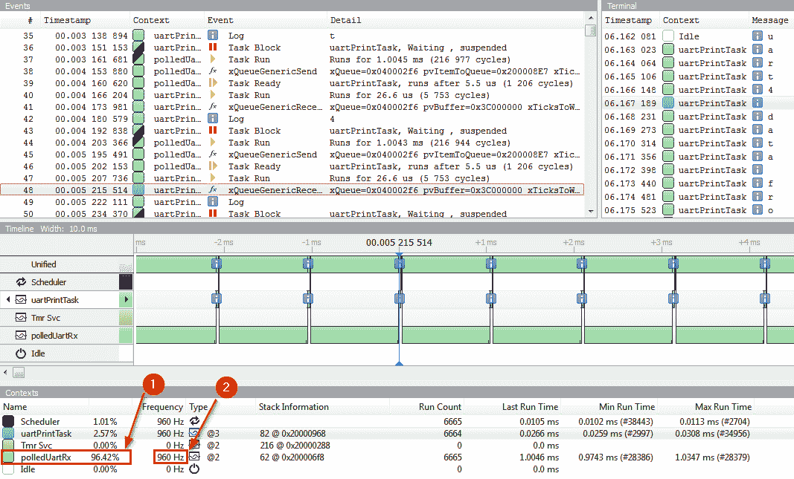

在使用 SystemView 查看执行后，我们很快意识到——尽管易于编程，但这个驱动程序的效率极其低下：

1.  SystemView 报告称，此驱动程序正在使用超过 96%的 CPU 资源。

1.  队列在 960 Hz 的频率下被调用（考虑到初始波特率为 9,600 波特，这是完全合理的）。

我们可以看到，虽然易于实现，但这个解决方案带来了显著的性能损失——而这一切都是在服务一个相当慢的外设。通过轮询服务外设的驱动程序有权衡之处。

# 轮询驱动程序的优缺点

使用轮询驱动程序的一些优点如下：

+   它很容易编程。

+   任何任务都可以立即访问队列中的数据。

同时，这种方法也存在许多问题：

+   它必须是系统中优先级最高的任务之一。

+   如果不在高优先级下执行，数据丢失的可能性很高。

+   这对 CPU 周期来说极其浪费。

在这个例子中，我们只以 9,600 波特率传输数据。诚然，大部分时间都花在了`RXNE`位上，但将每个字节作为接收到的队列中的数据传输也是相当昂贵的（与将字节推入简单的基于数组的缓冲区相比）。为了更直观地说明这一点，STM32F767 上的 USART2 在 216 MHz 的频率下运行，其最大波特率为 27 Mbaud，这意味着我们几乎需要每秒将每个字符添加到共享队列中近 300 万次（目前每秒添加不到 1,000 个字符）。由于队列添加需要 7 µS（即使 CPU 不做其他任何事情，我们每秒也最多能将 143,000 个字符传输到队列中），因此在这种硬件上通过队列快速传输这么多数据是不可行的。

更重要的是，由于我们可能每毫秒只接收一个新字符，因此几乎没有机会加快这种轮询方法。如果任何其他任务执行时间超过 2 ms，外围设备可能会被溢出（新字节在读取前被接收并覆盖缓冲区）。由于这些限制，轮询驱动程序在非常特定的环境中最有用。

# 轮询驱动程序的使用

在某些情况下，轮询驱动程序特别有用：

+   **系统验证**：在进行初始系统验证时，这是完全可以接受的，但在那个开发阶段，是否应该使用实时操作系统（RTOS）还有待商榷。如果应用程序确实是单一用途的，在等待数据传输的过程中没有其他事情可做，并且没有考虑电源问题，这也是一种可接受的方法。

+   **特殊情况**：偶尔，可能需要为有限的范围编写非常特殊用途的代码。例如，外围设备可能需要以极低的延迟进行服务。在其他情况下，轮询的事件可能发生得非常快。当事件以纳秒或微秒（ns 或µs）的顺序发生（而不是像上一个例子中的毫秒 ms），简单地轮询事件通常比创建更复杂的同步方案更有意义。在事件驱动系统中，添加阻塞调用必须仔细考虑并明确记录。

相反，如果某个事件发生得非常频繁，并且没有特定的时序限制，轮询方法也可能完全可行。

虽然这个示例中的驱动程序专注于接收端，在基于轮询的驱动程序很少被接受的情况下，但它们更常用于传输数据。这是因为字符之间的空间通常是可接受的，因为它不会导致数据丢失。这允许驱动程序以较低的优先级运行，以便系统中的其他任务有机会运行。在某些情况下，使用轮询传输驱动程序是有合理理由的，该驱动程序在传输过程中会阻塞：

+   使用驱动程序的代码必须在传输完成之前阻塞。

+   传输是一小部分数据。

+   数据速率相当高（因此传输所需时间相对较短）。

如果所有这些条件都满足，那么简单地使用轮询方法而不是更复杂的基于中断或 DMA 的方法可能是有意义的，后者将需要使用回调和可能的任务同步机制。然而，根据您选择如何构建您的驱动程序，也可能同时拥有阻塞调用的便利性，但又不至于有轮询传输浪费 CPU 周期的低效性。为了利用任何非轮询方法，我们需要开发另一项技能——编程 ISRs。

# 区分任务和 ISRs

在我们开始编写利用中断的外设驱动程序之前，让我们快速看一下中断与 FreeRTOS 任务相比如何。

任务和 ISRs 之间有许多相似之处：

+   它们都提供了一种实现 **并行** 代码执行的方法。

+   它们都只在需要时运行。

+   两种情况都可以用 C/C++ 编写（ISRs 通常不再需要用汇编代码编写）。

但任务和 ISRs 之间也有很多不同之处：

+   **ISRs 由硬件引入上下文；任务通过 RTOS 内核获得上下文**：任务总是由 FreeRTOS 内核引入上下文。另一方面，中断是由 MCU 中的硬件生成的。通常有几种不同的方式来配置中断的生成（和屏蔽）。

+   **ISRs 必须尽可能快地退出；任务则更加宽容**：FreeRTOS 任务通常被设置为以类似无限 `while` 循环的方式运行——它们将使用原语（如队列和信号量）与系统同步，并根据它们的优先级切换上下文。在光谱的另一端是 ISRs，它们应该通常被编码为快速退出。这种 *快速退出* 确保系统可以响应其他 ISRs，从而保持系统的响应性，并确保不会因为单个例程占用 CPU 而错过任何中断。

+   **ISR 函数不接受输入参数；任务可以**：与任务不同，ISR 永远不会接受输入参数。由于中断是由硬件状态触发的，ISR 最重要的任务是读取硬件状态（通过内存映射寄存器）并采取适当的行动。例如，当 UART 接收一个字节的数据时，可以生成中断。在这种情况下，ISR 将读取状态寄存器，读取（并存储）接收到的字节到一个静态变量中，并清除中断。

大多数（但并非全部）STM32 硬件上的外设，在读取某些寄存器时将自动清除中断标志。无论中断是如何被清除的，确保中断不再挂起是很重要的——否则，中断将连续触发，你将始终在执行相关的中断服务例程（ISR）！

+   **ISR 只能访问 FreeRTOS API 的有限 ISR 特定子集**：FreeRTOS 是以一种提供灵活性同时平衡便利性、安全性和性能的方式编写的。从任务中访问数据结构，如队列，非常灵活（例如，向队列发出 API 调用的任务可以轻松地阻塞任何时间段）。ISR 有一组额外的函数可用于在队列上操作，但这些函数的功能有限（例如，不能阻塞——调用总是立即返回）。这提供了一定程度的安全性，因为程序员不能在 ISR 内部调用一个会阻塞的函数。在 ISR 内部调用非 ISR API 函数将导致 FreeRTOS 触发`configASSERT`。

+   **ISR 可以完全独立于所有 RTOS 代码运行**：有许多情况下，ISR 在如此低级别上运行，它甚至不需要访问任何 FreeRTOS API。在这种情况下，ISR 将像通常没有 RTOS 存在时那样执行。内核永远不会介入（并且没有任务会中断执行）。这使得创建灵活的解决方案变得非常方便，这些解决方案将高性能 ISR（完全在 RTOS 之下运行）与极其方便的任务相结合。

+   **所有 ISR 共享相同的系统堆栈；每个任务都有一个专用的堆栈**：每个任务都接收一个私有堆栈，但所有 ISR 共享相同的系统堆栈。这值得注意，因为当你编写 ISR 时，你需要确保为它们保留足够的堆栈空间，以便它们可以运行（可能同时运行），如果它们是嵌套的。

既然我们已经讨论了任务和 ISR 之间的区别，让我们看看它们如何结合使用来创建非常强大的事件驱动代码。

# 从中断中使用 FreeRTOS API

到目前为止，大多数 FreeRTOS 原语都有它们 API 的中断安全版本。例如，`xQueueSend()`有一个等效的中断安全版本，`xQueueSendFromISR()`。ISR 安全版本和标准调用之间有一些差异：

+   `FromISR` 变体不会阻塞。例如，如果 `xQueueSendFromISR` 遇到满队列，它将立即返回。

+   `FromISR` 变体需要额外的参数，`BaseType_t *pxHigherPriorityTaskWoken`，这将指示是否需要在中断之后立即将更高优先级的任务切换到上下文中。

+   只有优先级低于 `FreeRTOSConfig.h` 中定义的 `configMAX_API_CALL_INTERRUPT_PRIORITY` 的中断才能调用 FreeRTOS API 函数（以下图示为例）。

以下是对 `FreeRTOSConfig.h` 和 `main_XXX.c` 文件如何配置本书中示例中断的概述。以下是一些值得注意的项目：

+   `main_XXX.c` 在执行所有 STM HAL 初始化后调用 `NVIC_SetPriorityGrouping(0)`（`HAL` 在初始化时设置优先级分组）。这允许使用所有 4 位来设置优先级，从而产生 16 个优先级级别。

+   `FreeRTOSConfig.h` 用于设置 FreeRTOS API 调用与 NVIC 优先级之间的关系。Cortex-M7 将 `255` 定义为最低优先级，而 `0` 为最高优先级。由于 STM32F7 只实现了 4 位，这 4 位将被移位到 4 个最高有效位；较低的 4 位不会影响操作（见以下图示）：

    +   `configKERNEL_INTERRUPT_PRIORITY` 定义了我们系统中最低优先级的中断（以及 FreeRTOS 任务的 ISR 优先级，因为调度器是在 SysTick 中断内被调用的）。由于 4 位可以产生从 `0`（最高优先级）到 `15`（最低优先级）的可能范围，因此使用的最低 NVIC 优先级将是 `15`。在设置 `configKERNEL_INTERRUPT_PRIORITY` 时，`15` 需要左移到 8 位表示（直接用于 CortexM 寄存器）中，即 `(15 << 4) | 0x0F = 0xFF` 或 `255`。由于最低 4 位是无关紧要的，`0xF0`（十进制 240）也是可接受的。

    +   `configMAX_SYSCALL_INTERRUPT_PRIORITY` 定义了允许调用 FreeRTOS API 的（逻辑上）最高优先级中断。在我们的示例中，这被设置为 `5`。左移以填充 8 位给出值为 `0x50` 或 `0x5F`（十进制 80 或 95）：

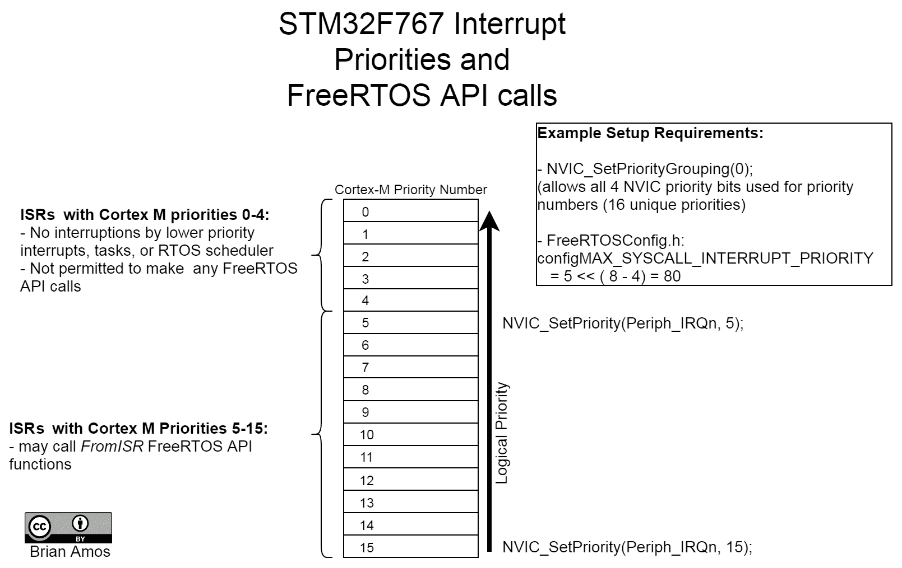

如前图所示，有些情况下中断服务例程（ISR）可以配置为以高于 RTOS 可能执行的所有操作的优先级执行。当配置为 `0` 到 `4` NVIC 优先级时，ISR 与传统的“裸机”ISR 相同。

在通过调用`NVIC_SetPriority`（优先级为<= 5）启用中断之前，确保正确配置中断优先级是非常重要的。如果一个优先级逻辑上高于`configMAX_SYSCALL_INTERRUPT_PRIORITY`的中断调用 FreeRTOS API 函数，你将遇到`configASSERT`失败（有关`configASSERT`的更多详细信息，请参阅第十七章，*故障排除提示和下一步操作*）。

现在我们已经了解了任务和中断服务例程（ISR）之间的区别，以及在使用 FreeRTOS API 函数时的一些基本规则，让我们再次审视轮询驱动程序，看看它如何能更有效地实现。

# 创建基于 ISR 的驱动程序

在 UART 驱动程序的第一迭代中，一个任务轮询 UART 外设寄存器以确定是否已接收到新的字节。这种持续的轮询导致任务消耗了> 95%的 CPU 周期。基于任务的驱动程序所做的最有意义的工作是将数据字节从 UART 外设传输到队列中。

在这个驱动程序的这一迭代中，我们不会使用任务来持续轮询 UART 寄存器，而是设置`UART2`外设和 NVIC，以便在接收到新字节时提供中断。

# 基于队列的驱动程序

首先，让我们看看如何更有效地实现轮询驱动程序（之前是通过在任务中轮询 UART 寄存器来实现的）。在这个实现中，我们不会使用任务来重复轮询 UART 寄存器，而是使用一个函数来设置外设使用中断并启动传输。完整的 ISR 函数原型可以在启动文件中找到（对于我们在示例中使用的 STM32F767，此文件是`Chapter_10/startup_stm32f767xx.s`）。

在`startup_stm32f767xx.s`中的每个`*_IRQHandler`实例都用于将函数名映射到中断向量表中的一个地址。在 ARM Cortex-M0+、-M3、-M4 和-M7 设备上，这个向量表可以在运行时通过偏移量重新定位。有关这些概念更多信息的链接，请参阅*进一步阅读*。

此示例有四个主要组件：

+   `uartPrintOutTask`：此函数初始化 USART2 和相关硬件，启动接收，然后打印放入`uart2_BytesReceived`队列中的任何内容。

+   `startReceiveInt`：为 USART2 设置基于中断的接收。

+   `USART2_IRQHandler`：当 USART2 外设发生中断时发出 ISR。

+   `startUart4Traffic`：启动从 UART4 发送的连续数据流，由 USART2 接收（前提是跳线设置正确）。

让我们详细看看每个组件。本节中的所有摘录均来自`Chapter_10/Src/mainUartInterruptQueue.c`。

# uartPrintOutTask

本例中唯一的任务是`uartPrintOutTask`：

```cpp
void uartPrintOutTask( void* NotUsed)
{
  char nextByte;
  STM_UartInit(USART2, 9600, NULL, NULL);
  startReceiveInt();

  while(1)
  {
    xQueueReceive(uart2_BytesReceived, &nextByte, portMAX_DELAY);
    SEGGER_SYSVIEW_PrintfHost("%c", nextByte);
  }
}
```

`uartPrintOutTask`执行以下操作：

+   通过调用`STM_UartInit`执行所有外设硬件初始化。

+   通过调用 `startReceiveInt` 开始基于中断的接收。

+   *消费* 并打印每个字符，当它通过调用 `xQueueReceive` 添加到 `uart2_BytesReceived` 队列时。

# `startReceiveInt`

`startReceiveInt` 函数启动了一个基于中断的接收：

```cpp
static bool rxInProgress = false;

void startReceiveInt( void )
{
    rxInProgress = true;
    USART2->CR3 |= USART_CR3_EIE; //enable error interrupts
    //enable peripheral and Rx not empty interrupts
    USART2->CR1 |= (USART_CR1_UE | USART_CR1_RXNEIE);  

    NVIC_SetPriority(USART2_IRQn, 6);
    NVIC_EnableIRQ(USART2_IRQn);
}
```

`startReceiveInt` 设置了接收 USART2 数据所需的所有内容：

+   `rxInProgress` 是一个由中断服务例程 (ISR) 使用的标志，用于指示接收正在进行。ISR (`USART2_IRQHandler()`) 不会尝试向队列写入，直到 `rxInProgress` 为真。

+   USART2 被配置为生成 `接收` 和 `错误` 中断，然后被启用。

+   `NVIC_SetPriority` 函数（由 CMSIS 在 `Drivers/CMSIS/Include/corex_cm7.h` 中定义）用于设置中断优先级。由于此中断将调用 FreeRTOS API 函数，因此此优先级必须设置在 `FreeRTOSConfig.h` 中定义的 `configLIBRARY_MAX_SYSCALL_INTERRUPT_PRIORITY` 的或以下。在 ARM CortexM 处理器上，较小的数字表示较高的逻辑优先级——在本例中，`#define configLIBRARY_MAX_SYSCALL_INTERRUPT_PRIORITY 5`，因此将优先级 `6` 分配给 `USART2_IRQn` 将足够允许 ISR 调用 FreeRTOS 提供的 ISR 安全函数 (`xQueueSendFromISR`)。

+   最后，通过调用 `NVIC_EnableIRQ` 启用 USART2 生成的中断请求。如果未调用 `NVIC_EnableIRQ`，USART2 仍然会生成请求，但中断控制器（NVIC 中的“IC”）不会将程序计数器向量到 ISR（`USART2_IRQHandler` 将永远不会被调用）。

在本例中，与本章中几乎所有代码一样，我们直接写入硬件外设寄存器，而不是使用大量的抽象。这样做是为了保持关注 RTOS 如何与 MCU 交互。如果你将代码重用作为目标之一，你需要提供一定程度的抽象层（或者如果你使用 STM HAL 代码，则需要提供抽象层）。有关这方面的指南可以在 第十二章，*创建良好抽象架构的技巧* 中找到。

# `USART2_IRQHandler`

下面是 `USART2_IRQHandler` 的代码：

```cpp
void USART2_IRQHandler( void )
{
    portBASE_TYPE xHigherPriorityTaskWoken = pdFALSE;
    SEGGER_SYSVIEW_RecordEnterISR();

    //error flag clearing omitted for brevity

    if( USART2->ISR & USART_ISR_RXNE_Msk)
    {
        uint8_t tempVal = (uint8_t) USART2->RDR;

        if(rxInProgress)
        {
            xQueueSendFromISR(uart2_BytesReceived, &tempVal, 
                              &xHigherPriorityTaskWoken);
      }
      SEGGER_SYSVIEW_RecordExitISR();
      portYIELD_FROM_ISR(xHigherPriorityTaskWoken);
}
```

让我们更详细地看看 ISR 的每个组成部分：

+   通过直接读取 USART 寄存器来确定接收是否为空 (`RXNE`) 是否被设置。如果是，接收数据寄存器 (`RDR`) 的内容将被存储到一个临时变量 (`tempVal`) 中——这次读取会清除中断标志。如果接收正在进行，`tempVal` 将被发送到队列中。

+   在进入和退出时调用 `SEGGER_SYSVIEW_RecordEnterISR` 和 `SEGGER_SYSVIEW_RecordExitISR`，这使 SEGGER SystemView 能够看到中断，并在系统中显示与其他任务一起的所有任务。

+   `xHigherPriorityTaskWoken`变量初始化为 false。这个变量传递给`xQueueSendFromISR`函数，用于确定一个高优先级任务（高于当前的非 ISR 上下文中的任务）是否因为正在等待一个空队列而阻塞。在这种情况下，`xHigherPriorityTaskWoken`将被设置为 true，表示在 ISR 退出后应立即唤醒一个高优先级任务。当调用`portYIELD_FROM_ISR`时，如果`xHigherPriorityTaskWoken`为 true，调度器将立即切换到高优先级任务。

现在 ISR 已经编写好了，我们需要确保它实际上会在适当的时间被硬件调用。

# 链接 ISR 的技巧

当从头开始编写中断服务例程（ISR）（就像我们在上一个示例中所做的那样）时，可能会成为意外麻烦来源的一个区域是确保你的 ISR 被正确链接（并执行）。也就是说，即使你已经正确设置了外设以生成中断，你的新 ISR 可能永远不会被调用，因为它没有被正确命名（相反，默认实现，定义在启动文件中，可能会被调用）。以下是一些确保这个闪亮的新 ISR 可以被找到并与应用程序的其他部分正确链接的技巧：

+   STM32 的`*_IRQHandler`函数名称*通常*包含数据表中的*确切*外设名称作为子字符串。例如，USART2 映射到`USART2_IRQHandler`（注意"S"），而 UART4 映射到`UART4_IRQHandler`（外设或函数名称中没有"S"）。

+   当为 ISR 编写新实现时，复制并粘贴启动文件中的确切`_IQRHandler`名称是一个好主意。这减少了打字错误的可能性，这可能会引起调试困难！

+   STM 启动文件为每个中断实现默认处理程序作为一个无限循环。如果你注意到你的应用程序变得无响应，可能是因为你已启用了一个中断，而你的`*_IRQHandler`定义没有被正确链接。

+   如果你碰巧在一个 C++文件中实现`*_IRQHandler`，请确保使用`extern "C"`以防止*名称修饰*。例如，USART2 的定义将写成`extern "C" void USART2_IRQHandler(void)`。这也意味着 ISR 定义必须*不在*类内部。

在实现 ISR 时，请花时间并确保细节（如确切的名称）正确无误。在确保 ISR 在预期时被调用之前，不要急于尝试调试应用程序的其他部分。在 ISR 中使用断点是完成这一点的绝佳方式。

# startUart4Traffic

在本例中需要探索的最后一个组件是如何将数据发送到 UART2。这些示例旨在模拟外部数据被 USART2 接收。为了在不添加额外硬件的情况下实现这一点，我们在本章早期将 UART4 的 Tx 和 USART2 的 RX 引脚连接在一起。对`startUart4Traffic()`的调用是一个`TimerHandler`原型。一个单次定时器被启动并设置为在应用程序启动后 5 秒触发。

执行所有繁重工作的函数是`SetupUart4ExternalSim()`。它设置了一个连续的循环 DMA 传输（无需 CPU 干预）来重复传输字符串`data from uart4`。本章稍后将详细介绍使用 DMA 的完整示例——目前，我们只需要意识到数据正在发送到 USART2，而不涉及 CPU。

`startUart4Traffic()`创建了一个*连续*的字节流，这些字节将从 UART4 的 Tx 引脚传输到 UART2 的 Rx 引脚（没有流量控制）。根据所选的波特率和接收代码执行所需的时间，我们预计在某些示例中，接收端最终会丢失一个字节。在运行自己的示例时请记住这一点。有关选择适当驱动程序类型更详细的信息，请参阅*选择驱动程序模型*部分。

# 性能分析

现在，让我们通过编译`mainUartInterruptQueue`，将其加载到 MCU 上，并使用 SystemView 分析实际执行来查看此实现的性能：

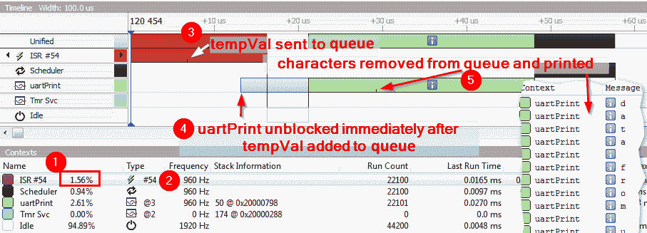

这次，情况看起来好得多。以下是前一个屏幕截图中的几个值得注意的项目：

1.  负责处理 USART2 Rx 接收到的数据的 ISR 仅消耗大约 1.6%的 CPU（比我们使用轮询方法时看到的 96%要好得多）。

1.  我们仍然以每秒 960 字节的速度接收数据——与之前相同。

1.  这里显示的小刻度是`tempVal`通过调用 FreeRTOS API 函数`xQueueSendFromISR`添加到`uart2_BytesReceived`的确切时间点。

1.  我们可以在这里看到`portYIELD_FROM_ISR`的效果。`uartPrint`任务中的浅蓝色部分表示任务准备就绪。这是因为`uartPrint`任务由于队列中有项目而准备就绪。对`portYIELD_FROM_ISR`的调用迫使调度器立即评估哪个任务应该被带入上下文。绿色部分（从大约 21 uS 开始）是 SystemView 表示任务处于**运行**状态的方式。

1.  在`uartPrint`任务开始运行后，它从队列中移除下一个字符，并使用`SEGGER_SYSVIEW_PrintfHost`打印它。

通过从基于轮询的驱动程序切换到基于中断的驱动程序，我们显著降低了 CPU 的负载。此外，使用基于中断的驱动程序的系统可以在通过 USART2 接收数据的同时运行其他任务。此驱动程序还使用基于队列的方法，提供了一个非常方便的环形缓冲区，允许字符连续接收并添加到队列中，然后在高层任务方便时读取。

接下来，我们将通过一个类似但不使用队列的驱动程序的例子来进行分析。

# 基于缓冲区的驱动程序

有时，传输的确切大小可以提前知道。在这种情况下，可以传递一个现有的缓冲区给驱动程序，并用它来代替队列。让我们看看一个基于缓冲区的驱动程序的例子，其中确切的字节数是提前知道的。这个例子中的硬件设置与前面的例子相同——我们将专注于通过 USART2 接收数据。

与使用队列不同，`uartPrintOutTask` 将为其 `startReceiveInt` 函数提供自己的缓冲区。通过 USART2 接收到的数据将直接放置在本地缓冲区中，直到添加了所需数量的字节，然后中断服务例程（ISR）将通过信号量提供完成通知。整个信息将作为一个字符串打印出来，而不是像接收时那样逐字节打印（这在上一个例子中已经这样做过）。

就像前面的例子一样，有四个主要组件。然而，它们的责任略有不同：

+   `startReceiveInt`：为 USART2 设置基于中断的接收并配置用于传输的中断服务例程所需的相关变量。

+   `uartPrintOutTask`：此函数初始化 USART2 及相关硬件，启动接收，并等待完成（截止时间为 100 毫秒）。完整的信息要么被打印出来，要么发生超时并打印错误。

+   `USART2_IRQHandler`：当 USART2 外设发生中断时发出中断服务例程（ISR）。

+   `startUart4Traffic`：启动从 UART4 发送并由 USART2 接收的连续数据流（前提是跳线设置正确）。

让我们详细查看每个组件。本节中所有摘录均来自 `Chapter_10/Src/mainUartInterruptBuffer.c`。

# startReceiveInt

`startReceiveInt` 函数与用于基于队列的驱动程序的函数非常相似：

```cpp
static bool rxInProgress = false;
static uint_fast16_t rxLen = 0;
static uint8_t* rxBuff = NULL;
static uint_fast16_t rxItr = 0;

int32_t startReceiveInt( uint8_t* Buffer, uint_fast16_t Len )
{
    if(!rxInProgress && (Buffer != NULL))
    {
        rxInProgress = true;
        rxLen = Len;
        rxBuff = Buffer;
        rxItr = 0;
        USART2->CR3 |= USART_CR3_EIE; //enable error interrupts
        USART2->CR1 |= (USART_CR1_UE | USART_CR1_RXNEIE);
        NVIC_SetPriority(USART2_IRQn, 6);
        NVIC_EnableIRQ(USART2_IRQn);
        return 0;
    }
    return -1;
}
```

在此设置中，以下是一些显著的不同点：

+   此变体接受一个指向缓冲区（`Buffer`）的指针以及所需的传输长度（`Len`）。使用这些参数初始化了几个全局变量 `rxBuff` 和 `rxLen`（这些将由中断服务例程使用）。

+   `rxInProgress` 用于确定接收是否已经在进行中（如果是，则返回 `-1`）。

+   用于索引缓冲区的迭代器（`rxItr`）初始化为 `0`。

`startReceiveInt` 函数的所有剩余功能与本章前面 *基于队列的驱动* 部分中介绍的示例完全相同。

# uartPrintOutTask

负责打印 USART2 接收到的数据的`uartPrintOutTask`函数在这个例子中稍微复杂一些。此示例还可以比较接收到的数据与预期长度，以及一些基本的错误检测：

1.  缓冲区和长度变量被初始化，UART 外设被设置：

```cpp
void uartPrintOutTask( void* NotUsed)
{
  uint8_t rxData[20];
  uint8_t expectedLen = 16;
  memset((void*)rxData, 0, 20);

  STM_UartInit(USART2, 9600, NULL, NULL);
```

1.  然后，`while`循环的主体通过调用`startReceiveInt`开始接收，并等待`rxDone`信号量，最多等待 100 个 RTOS tick 以完成传输。

1.  如果传输及时完成，接收到的总字节数将与`expectedLen`进行比较：

1.  如果存在正确的字节数量，`rxData`的内容将被打印。否则，将打印一条消息，解释差异的原因：

```cpp
while(1)
{
    startReceiveInt(rxData, expectedLen);
    if(xSemaphoreTake(rxDone, 100) == pdPASS)
    {
        if(expectedLen == rxItr)
        {
            SEGGER_SYSVIEW_PrintfHost("received: ");
            SEGGER_SYSVIEW_Print((char*)rxData);
        }
        else
        {
            SEGGER_SYSVIEW_PrintfHost("expected %i bytes received" 
                                      "%i", expectedLen, rxItr);
```

`while`循环的其余部分和函数简单地打印`timeout`，如果信号量在 100 个 tick 内没有被获取。

# USART2_IRQHandler

由于需要跟踪队列中的位置，这个 ISR 也稍微复杂一些：

1.  `USART2_IRQHandler`使用私有全局变量，因为它们需要被 ISR 访问，并且由`USART2_IRQHandler`和`startReceiveInt`使用：

```cpp
static bool rxInProgress = false;
static uint_fast16_t rxLen = 0;
static uint8_t* rxBuff = NULL;
static uint_fast16_t rxItr = 0;
```

1.  在这个 ISR 中，存储`xHigherPriorityTaskWoken`和 SEGGER SystemView 跟踪的范式与上一个例子相同：

```cpp
void USART2_IRQHandler( void )
{
     portBASE_TYPE xHigherPriorityTaskWoken = pdFALSE;
     SEGGER_SYSVIEW_RecordEnterISR();
```

1.  接下来，通过读取中断状态寄存器（`USART2->ISR`）中的溢出（`ORE`）、噪声错误（`NE`）、帧错误（`FE`）和奇偶校验错误（`PE`）位来检查错误。

如果存在错误，它将通过写入中断清除寄存器（`USART2->ICR`）和释放`rxDone`信号量来清除。调用者代码的责任是通过查看`rxItr`变量（如下一代码块所示）来检查缓冲区中的位数，以确保成功接收了正确的位数：

```cpp

 if( USART2->ISR & ( USART_ISR_ORE_Msk |
                     USART_ISR_NE_Msk |
                     USART_ISR_FE_Msk |
                     USART_ISR_PE_Msk ))
{
    USART2->ICR |= (USART_ICR_FECF |
                    USART_ICR_PECF |
                    USART_ICR_NCF |
                    USART_ICR_ORECF);
    if(rxInProgress)
    {
        rxInProgress = false;
        xSemaphoreGiveFromISR(rxDone,
        &xHigherPriorityTaskWoken);
    }
}
```

1.  接下来，ISR 检查是否接收到了新的字节（通过读取`USART2->ISR`中的`RXNE`位）。如果有一个新的字节可用，它将被推入`rxBuff`缓冲区，并且`rxItr`迭代器递增。

在缓冲区中添加了所需数量的字节后，释放`rxDone`信号量以通知`uartPrintOutTask`：

```cpp
if( USART2->ISR & USART_ISR_RXNE_Msk)
{
    uint8_t tempVal = (uint8_t) USART2->RDR;
    if(rxInProgress)
    {
        rxBuff[rxItr++] = tempVal;
        if(rxItr >= rxLen)
        {
            rxInProgress = false;
            xSemaphoreGiveFromISR(rxDone, &xHigherPriorityTaskWoken);
        }
    }
}
SEGGER_SYSVIEW_RecordExitISR();
portYIELD_FROM_ISR(xHigherPriorityTaskWoken);
```

不要忘记在 ISR 中设置断点，以确保它被调用。

# startUart4Traffic

与上一个例子相同，这个函数设置 DMA 传输，将数据从 UART4 的 Tx 引脚推送到 USART2 的 Rx 引脚。

# 性能分析

现在，让我们看看这个驱动程序实现的表现。有几个方面需要考虑。除非传输完成，否则 ISR 通常只会将一个字节传输到`rxBuff`。在这种情况下，中断非常短，完成时间不到 3 微秒：

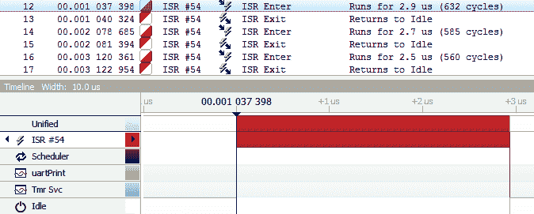

在接收所有 16 个字节之后，ISR 的执行变得更有趣，看起来与上一个例子有些相似：

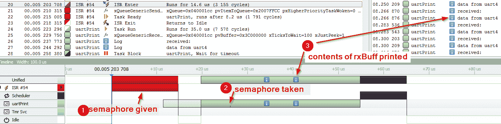

下面是从前面的屏幕截图中的几个值得注意的点：

1.  在所有字节都放入`rxBuff`之后，ISR 使用`xSemaphoreGiveFromISR`从 ISR 中释放`rxDone`信号量。

1.  在中断执行后，通过获取可用的信号量（`xSemaphoreTake(rxDone,100)`）来解除任务阻塞。

1.  打印出`rxBuff`的确切内容。请注意，每一行都包含整个字符串，而不是单个字符。这是因为这个实现收集了一个完整的缓冲区数据，然后使用信号量来指示完成。

最后，让我们看一下 CPU 使用的完整统计：

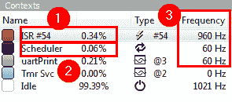

下面是从前面的屏幕截图中的几个值得注意的项目：

1.  对于这个实现，ISR 使用了 CPU 的 0.34%（而不是在 ISR 内部将每个字符推入队列时的 1.56%）。

1.  FreeRTOS 调度器现在只使用 CPU 的 0.06%，而不是 0.94%（每次向队列添加项目时，调度器都会运行以确定是否应该解除任务阻塞）。

1.  USART2 ISR 的频率保持在 960 Hz，与之前的例子完全相同，但现在`print`任务的频率已经降低到只有 60 Hz，因为只有当 16 个字节被传输到`rxBuff`后，`uartPrint`任务才会运行。

如我们所见，这个驱动程序的 ISR 实现比基于队列的方法使用的 CPU 周期更少。根据使用情况，它可能是一个有吸引力的替代方案。这类驱动程序通常在非 RTOS（实时操作系统）系统中找到，其中回调函数将用于代替信号量。这种方法足够灵活，可以通过在回调中放置一个信号量来与或没有 RTOS 一起使用。虽然稍微复杂一些，但这对于代码库来说，是看到大量不同应用中重用的一种最灵活的方法。

总结一下，到目前为止，使用 ISR 实现的两种驱动程序变体如下：

+   **基于队列的驱动程序**：通过逐个字符将接收到的数据推入队列，将传入的数据传递给任务。

+   **基于缓冲区的驱动程序**：将传入的数据传递给由调用函数预先分配的单个缓冲区。

表面上看，似乎很荒谬，有两个不同的实现，它们都从外围设备接收传入的数据并将其呈现给代码的更高层。重要的是要认识到，对于同一硬件的这两种不同的驱动程序变体，在实现、效率和最终提供给更高层代码的接口方面都存在差异。它们可能都在从 UART 外围设备移动字节，但它们为更高层代码提供了截然不同的编程模型。这些不同的编程模型各自适合解决不同类型的问题。

接下来，我们将看看如何使用 MCU 内部的另一块硬件来减轻在移动大量数据时 CPU 的负担。

# 创建基于 DMA 的驱动程序

我们看到，与轮询方法相比，基于中断的驱动程序在 CPU 利用率方面有相当大的改进。但对于需要每秒数百万次传输的高数据率应用程序呢？通过尽可能少地让 CPU 参与，将大部分数据传输工作推到 MCU 内的专用外设硬件上，可以进一步提高效率的下一步。

在第二章 *理解 RTOS 任务* 中简要介绍了 DMA，以防在深入研究此示例之前需要复习。

在这个例子中，我们将通过创建一个使用与基于中断的驱动程序相同的基于缓冲区的接口的驱动程序来操作。唯一的区别将是使用 DMA 硬件将字节从外设的读取数据寄存器（`RDR`）传输到我们的缓冲区。由于我们已经很好地掌握了从其他驱动程序配置 USART2 外设，因此这个变体的首要任务是找出如何将数据从`USART2->RDR`传输到 DMA 控制器，然后进入内存。

# 配置 DMA 外设

STM32F767 有两个 DMA 控制器。每个控制器有 10 个通道和 8 个流，用于将 DMA 请求从 MCU 的一个位置映射到另一个位置。在 STM32F767 硬件上，流可以执行以下操作：

+   可以将其视为从地址到地址的*流动*数据的方式

+   可以在从外设到 RAM 或从 RAM 到外设之间传输数据

+   可以在 RAM 之间传输数据

+   只能在任何给定时刻在两点之间传输数据

每个流最多有 10 个通道，用于将外设寄存器映射到给定的流。为了配置 DMA 控制器以处理 USART2 的接收请求，我们将参考*STM32F7xx RM0410*参考手册中的表 27：

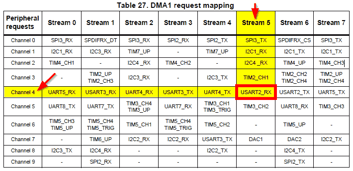

在这个表中，我们可以看到 DMA1 通道 4，流 5 是处理`USART2_RX`请求的适当设置。如果我们还对处理发送端的请求感兴趣，通道 4，流 6 也需要设置。

现在我们知道了通道和流号，我们可以添加一些初始化代码来设置 DMA1 和 USART2 外设：

+   `DMA1_Stream5` 将用于将 USART2 的接收数据寄存器中的数据直接传输到 RAM 中的缓冲区。

+   `USART2` 不会启用中断（因为 DMA 将执行所有从外设寄存器到 RAM 的传输）。

+   `DMA1_Stream5` 将配置为在缓冲区完全填满后触发中断。

下面的几个片段来自`Chapter_10/src/mainUartDMABuff.c`中的`setupUSART2DMA`函数：

1.  首先，启用 DMA 外设的时钟，设置中断优先级，并在 NVIC 中启用中断：

```cpp
void setupUSART2DMA( void )
{
  __HAL_RCC_DMA1_CLK_ENABLE();

  NVIC_SetPriority(DMA1_Stream5_IRQn, 6);
  NVIC_EnableIRQ(DMA1_Stream5_IRQn);
```

1.  接下来，通过填写一个 `DMA_HandleTypeDef` 结构（`usart2DmaRx`）并使用 `HAL_DMA_Init()` 来配置 DMA 流：

```cpp
  HAL_StatusTypeDef retVal;
  memset(&usart2DmaRx, 0, sizeof(usart2DmaRx));
  usart2DmaRx.Instance = DMA1_Stream5; //stream 5 is for USART2 Rx

  //channel 4 is for USART2 Rx/Tx
  usart2DmaRx.Init.Channel = DMA_CHANNEL_4;

  //transfering out of memory and into the peripheral register
  usart2DmaRx.Init.Direction = DMA_PERIPH_TO_MEMORY;
  usart2DmaRx.Init.FIFOMode = DMA_FIFOMODE_DISABLE; //no FIFO

  //transfer 1 at a time
  usart2DmaRx.Init.MemBurst = DMA_MBURST_SINGLE; 
  usart2DmaRx.Init.MemDataAlignment = DMA_MDATAALIGN_BYTE;

  //increment 1 byte at a time
  usart2DmaRx.Init.MemInc = DMA_MINC_ENABLE;

  //flow control mode set to normal
  usart2DmaRx.Init.Mode = DMA_NORMAL; 

  //write 1 at a time to the peripheral
  usart2DmaRx.Init.PeriphBurst = DMA_PBURST_SINGLE; 

  //always keep the peripheral address the same (the RX data
  //register is always in the same location)
  usart2DmaRx.Init.PeriphInc = DMA_PINC_DISABLE;

  usart2DmaRx.Init.PeriphDataAlignment = DMA_PDATAALIGN_BYTE;

  usart2DmaRx.Init.Priority = DMA_PRIORITY_HIGH;
  retVal = HAL_DMA_Init(&usart2DmaRx);
  assert_param( retVal == HAL_OK );

  //enable transfer complete interrupts
  DMA1_Stream5->CR |= DMA_SxCR_TCIE; 

  //set the DMA receive mode flag in the USART
  USART2->CR3 |= USART_CR3_DMAR_Msk;
```

`HAL` 初始化对其传递的值提供一些合理性检查。以下是最直接相关的部分：

+   将 `DMA1_Stream5` 设置为实例。所有使用 `usart2DmaRx` 结构体的调用都将引用流 `5`。

+   通道 `4` 连接到流 `5`。

+   启用内存递增。DMA 硬件将在传输后自动递增内存地址，填充缓冲区。

+   每次传输后不递增外设地址——USART2 接收数据寄存器 (`RDR`) 的地址永远不会改变。

+   为 `DMA1_Stream5` 启用 `传输完成` 中断。

+   USART2 已设置为 `DMA 接收模式`。在 USART 外设配置中设置此位是必要的，以表示外设的接收寄存器将被映射到 DMA 控制器。

关于如何使用此结构体的更多详细信息，可以通过查看 `stm32f7xx_hal_dma.h` 中的 `DMA_HandleTypeDef` 结构体定义（第 168 行）和 `stm32f7xx_hal_dma.c` 中的 `HAL_DMA_Init()`（第 172 行）来找到。将 HAL 代码使用的寄存器与 *STM32F76xxx RM0410* 参考手册的第八部分（第 245 页）进行交叉引用。这种相同的技术通常对于理解 `HAL` 代码如何使用单个函数参数和结构体成员是非常有效的。

现在初始 DMA 配置已完成，我们可以探索一些不同的中断实现，使用 DMA 而不是中断。

# 基于缓冲区的 DMA 驱动程序

这是一个具有与 *A 缓冲区驱动程序* 部分中相同功能的驱动程序实现。区别在于，DMA 版本的驱动程序在每次接收到字节时不会中断应用程序。唯一生成的 `中断` 是当整个传输完成时。为了实现此驱动程序，我们只需要添加以下中断服务例程（ISR）：

```cpp
void DMA1_Stream5_IRQHandler(void)
{
  portBASE_TYPE xHigherPriorityTaskWoken = pdFALSE;
  SEGGER_SYSVIEW_RecordEnterISR();

  if(rxInProgress && (DMA1->HISR & DMA_HISR_TCIF5))
 {
 rxInProgress = false;
 DMA1->HIFCR |= DMA_HIFCR_CTCIF5;
 xSemaphoreGiveFromISR(rxDone, &xHigherPriorityTaskWoken);
 }
  SEGGER_SYSVIEW_RecordExitISR();
  portYIELD_FROM_ISR(xHigherPriorityTaskWoken);
}
```

驱动程序的重要部分已加粗。如果接收正在进行中（基于 `rxInProgress` 的值和传输完成标志 `DMA_HISR_TCIF5`），则以下操作发生：

+   清除 DMA 中断标志。

+   发送 `rxDone` 信号量。

当使用基于 DMA 的传输时，这已经足够了，因为 DMA 控制器处理与缓冲区相关的所有账目。此时，其余代码的功能与 `中断` 版本完全相同（唯一的区别是服务中断所花费的 CPU 时间更少）。

# 性能分析

让我们比较基于 DMA 的实现与中断驱动方法的性能：

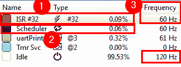

这次，我们可以对整体系统行为做出以下观察：

1.  (DMA) 中断服务例程现在在 9,600 波特率下消耗的 CPU 周期小于 0.1%。

1.  调度器 CPU 的消耗仍然非常低。

1.  ISR 的频率已降低到仅 60 赫兹（从 960 赫兹）。这是因为，而不是为每个字节创建一个中断，只有在 16 字节传输结束时才生成一个中断。空闲任务也被上下文切换得少得多。虽然在这些简单的示例中这似乎微不足道，但在具有许多任务和中断的大型应用程序中，过多的上下文切换可能成为一个非常真实的问题。

整体流程与基于中断缓冲区的方法相似，唯一的区别在于，当整个传输完成时，只有一个中断服务例程（ISR）被执行（而不是每个字节传输一个中断）：

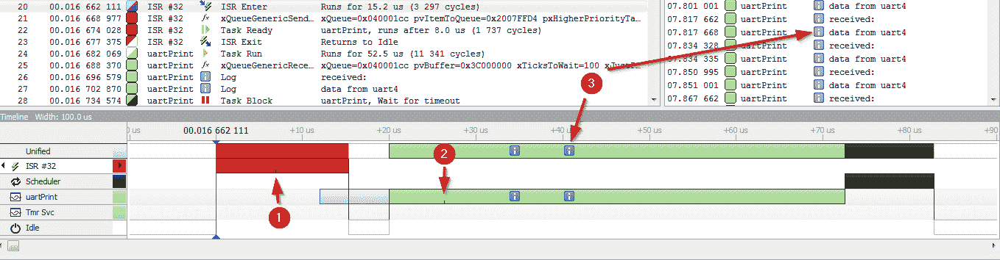

从前面的屏幕截图，我们可以观察到以下情况：

1.  DMA ISR 在所有 16 字节传输到缓冲区后执行一次。截图中的箭头 1 所指的标记显示了信号量。

1.  ISR 唤醒了阻塞的`uartPrint`函数。箭头 2 指向了在截图中所指的信号量被获取的地方。

1.  两个信息框显示控制台打印消息生成的地方（在最后一个字节接收后约 35 和 40 微秒）。其余时间这个任务花在重新初始化缓冲区和设置下一次传输上。

这里是所有处理器活动的更宽视角。请注意，唯一的活动大约每 16 毫秒发生一次（在所有字节都传输到内存之后）：

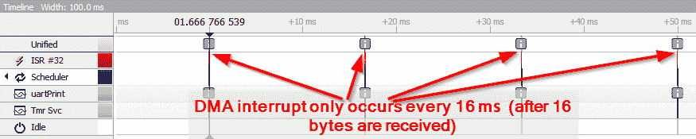

基于完全 DMA 方法的实际能力在快速传输大量数据时最为宝贵。以下示例显示了相同的数据集（仅 16 字节）以 256,400 波特率（在没有错误的情况下可靠实现的最快速度）进行传输。

在示例中，可以通过修改`main<exampleame>.c`中的`#define BAUDRATE`来轻松更改波特率。它们被配置为单个更改将修改 USART2 和 UART4 的波特率。

以下是在 256,000 波特率下进行传输的示例。缓冲区中每 624 微秒就可用一组新的 16 字节：

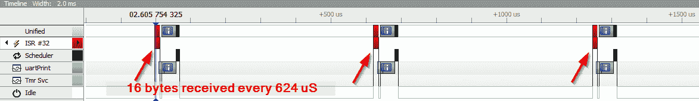

通过将波特率从 9,600 提高到 256,000，我们的 CPU 使用率从大约 0.5%增加到大约 11%。这与波特率 26 倍的提高相一致——所有函数调用都与波特率成比例：

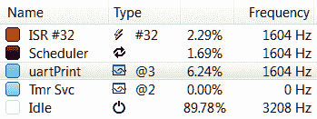

注意以下情况：

+   DMA 中断消耗了 2.29%。

+   我们的`uartPrint`任务是 CPU 周期的最大消费者（略超过 6%）。

尽管我们已经证明使用 DMA 可以快速高效地传输数据，但当前的设置并没有中断驱动的队列解决方案那样的便利性。任务依赖于整个块的传输，而不是使用队列。这可能是合适的，也可能是不便的，这取决于高级代码的目标。

当基于队列的驱动 API 而不是基于缓冲区的驱动 API（如我们在这里实现的）编写基于字符的协议时，通常会更容易实现。然而，我们在*基于队列的驱动*部分看到，队列很快就会变得计算成本高昂。每个字节被添加到队列中大约需要 30 微秒。以 256,000 波特率传输数据将消耗掉 UART 中断服务例程（ISR）中大部分可用的 CPU（每个 40 微秒接收一个新字节，处理它需要 30 微秒）。

在过去，如果你真的需要实现一个面向字符的驱动程序，你可以自己实现一个高度高效的环形缓冲区实现，并直接从低级 ISR 中提供（绕过大多数 FreeRTOS 原语以节省时间）。然而，从 FreeROTS 10 开始，还有一个替代方案——流缓冲区。

# 流缓冲区（FreeRTOS 10+）

流缓冲区结合了基于队列系统的便利性和与我们之前创建的原始缓冲区实现相近的速度。它们有一些灵活性限制，这些限制与任务通知系统与信号量相比的限制相似。*流缓冲区一次只能由一个发送者和一个接收者使用。* 否则，如果它们要被多个任务使用，将需要外部保护（例如互斥锁）。

流缓冲区的编程模型与队列非常相似，除了函数不是每次限制于排队一个项目，而是可以一次排队多个项目（这在排队数据块时可以节省大量的 CPU 时间）。在这个例子中，我们将通过 UART 接收的高效 DMA 环形缓冲区实现来探索流缓冲区。

本驱动程序示例的目标如下：

+   为驱动程序的用户提供一个易于使用的基于字符的队列。

+   在高数据速率下保持效率。

+   总是准备好接收数据。

那么，让我们开始吧！

# 使用流缓冲区 API

首先，让我们看看在这个例子中`uartPrintOutTask`如何使用流缓冲区 API 的示例。以下摘录来自`mainUartDMAStreamBufferCont.c`。

下面是`xSttreamBufferCreate()`函数定义的示例：

```cpp
StreamBufferHandle_t xStreamBufferCreate( size_t xBufferSizeBytes,
                                          size_t xTriggerLevelBytes);
```

注意以下前述代码中的内容：

+   `xBufferSizeBytes`是缓冲区能够容纳的字节数。

+   `xTriggerLevelBytes`是在调用`xStreamBufferReceive()`之前需要在流中可用的字节数（否则，将发生超时）。

以下示例代码设置了一个流缓冲区：

```cpp
#define NUM_BYTES 100
#define MIN_NUM_BYTES 2
StreamBufferHandle_t rxStream = NULL;
rxStream = xStreamBufferCreate( NUM_BYTES , MIN_NUM_BYTES);
assert_param(rxStream != NULL);
```

在前面的代码片段中，我们可以观察到以下内容：

+   `rxStream`能够容纳`NUM_BYTES`（100 字节）。

+   每次任务阻止数据被添加到流中时，它将不会解除阻塞，直到流中至少有`MIN_NUM_BYTES`（2 字节）可用。在这个例子中，对`xStreamBufferReceive`的调用将阻塞，直到流中至少有 2 字节可用（或者发生超时）。

+   如果使用 FreeRTOS 堆，请确保通过检查返回的句柄是否为`NULL`来确认有足够的空间用于分配流缓冲区。

从流缓冲区接收数据的函数是`xStreamBufferReceive()`：

```cpp
size_t xStreamBufferReceive( StreamBufferHandle_t xStreamBuffer,
                             void *pvRxData,
                             size_t xBufferLengthBytes,
                             TickType_t xTicksToWait );
```

下面是一个从流缓冲区接收数据的简单示例：

```cpp
void uartPrintOutTask( void* NotUsed)
{
    static const uint8_t maxBytesReceived = 16;
    uint8_t rxBufferedData[maxBytesReceived];

    //initialization code omitted for brevity
    while(1)
    {
        uint8_t numBytes = xStreamBufferReceive(  rxStream,
 rxBufferedData,
 maxBytesReceived,
 100 );
        if(numBytes > 0)
        {
          SEGGER_SYSVIEW_PrintfHost("received: ");
          SEGGER_SYSVIEW_Print((char*)rxBufferedData);
        }
        else
        {
          SEGGER_SYSVIEW_PrintfHost("timeout");
 ...
```

在前面的代码片段中，请注意以下内容：

+   `rxStream`：`StreamBuffer`的指针/句柄。

+   `rxBufferedData`：字节将被复制到的本地缓冲区。

+   `maxBytesReceived`：将复制到`rxBufferedData`中的最大字节数。

+   超时是`100`个滴答（`xStreamBufferReceive()`将在至少`xTriggerLevelBytes`（在这个例子中是`2`）可用或 100 个滴答已过之后返回）。

对`xStreamBufferReceive()`的调用行为与对`xQueueReceive()`的调用类似，它们都会在数据可用时阻塞。然而，对`xStreamBufferReceive()`的调用将阻塞，直到最小数量的字节（在调用`xStreamBufferCreate()`时定义）或指定的滴答数已过。

在这个例子中，对`xStreamBufferReceive()`的调用将阻塞，直到以下条件之一满足：

+   缓冲区中的字节数超过了`MIN_NUM_BYTES`（在这个例子中是`2`）。如果还有更多的字节可用，它们将被移动到`rxBufferedData`——但不超过`maxBytesReceived`字节（在这个例子中是`16`）。

+   发生超时。流中的所有可用字节都移动到`rxBufferedData`。`xStreamBuffereReceive()`返回放置到`rxBufferedData`中的确切字节数（在这个例子中是`0`或`1`）。

既然我们已经对接收方有了很好的了解，让我们来看看驱动程序本身的某些细节。

# 设置双缓冲 DMA

如我们之前所见，使用 DMA 可以非常有益于减少 CPU 使用率（相对于中断）。然而，上一个例子中没有涵盖的一个特性是持续填充队列（驱动程序需要在进行数据接收之前进行基于块的调用）。在这个例子中的驱动程序将不断将数据传输到流缓冲区，而不需要调用它的代码进行任何干预。也就是说，驱动程序将始终接收字节并将它们推入流缓冲区。

对于基于 DMA 的系统，持续接收数据会带来两个有趣的问题：

+   如何处理**溢出**——当缓冲区已完全填满，但高速数据仍然可以进入时。

+   如何在缓冲区完全填满之前终止传输。DMA 传输通常需要在传输开始之前指定字节数。然而，我们需要一种方法在数据停止接收时停止传输，并将该数据复制到流缓冲区。

将使用 DMA 双缓冲来确保我们的驱动程序始终能够接收数据（即使单个缓冲区已被填满）。在先前的例子中，一个缓冲区被填满并生成中断，然后直接操作数据，在重新启动传输之前。使用双缓冲，添加第二个缓冲区。在 DMA 控制器填满第一个缓冲区后，它将自动开始填充第二个缓冲区：

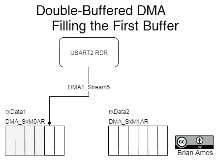

在第一个缓冲区被填满并生成中断后，ISR 可以安全地操作第一个缓冲区`rxData1`中的数据，同时第二个缓冲区`rxData2`被填满。在我们的例子中，我们是在 ISR 内部将数据传输到 FreeRTOS 流缓冲区。

重要的是要注意，`xStreamBufferSendFromISR()`会将数据的**副本**添加到流缓冲区，而不是引用。因此，在这个例子中，只要 DMA ISR 对`xStreamBufferSendFromISR()`的调用在`rxData2`被填满之前执行，数据就可以无损失地可用。这与传统的**裸机**双缓冲实现不同，因为不需要调用`xStreamBufferReceive()`的高级代码从`rxData1`中提取数据，在`rxData2`被填满之前：

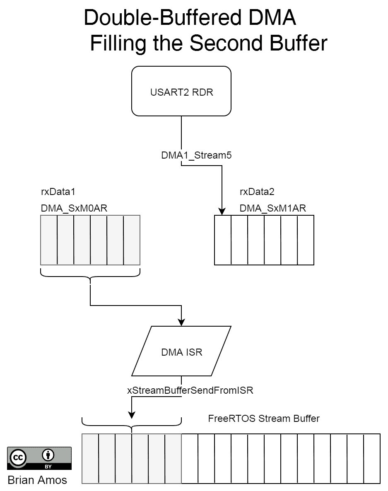

即使你在为没有明确**双缓冲模式**的 MCU 编程，大多数 DMA 控制器也将具有**循环**模式，包括**半传输**和**全传输**中断。在这种情况下，可以通过在每个缓冲区的一半被填满后生成一个中断来达到相同的功能。

通过将地址写入`DMA_SxM1AR`寄存器（需要一些类型转换以防止编译器大声抱怨我们在写入一个指向 32 位内存地址的指针）来设置二级缓冲区`rxData2`：

```cpp
//setup second address for double buffered mode
DMA1_Stream5->M1AR = (uint32_t) rxData2;
```

很有趣的是，STM HAL 不直接支持双缓冲模式。实际上，对`HAL_DMA_Start`的调用会明确禁用该模式。因此，需要通过寄存器进行一些手动设置（在`HAL`处理大部分基础工作之后）：

```cpp
//NOTE: HAL_DMA_Start explicitly disables double buffer mode
// so we'll explicitly enable double buffer mode later when
// the actual transfer is started
if(HAL_DMA_Start(&usart2DmaRx, (uint32_t)&(USART2->RDR), (uint32_t)rxData1,
                 RX_BUFF_LEN) != HAL_OK)
{
    return -1;
}

//disable the stream and controller so we can setup dual buffers
__HAL_DMA_DISABLE(&usart2DmaRx);
//set the double buffer mode
DMA1_Stream5->CR |= DMA_SxCR_DBM;
//re-enable the stream and controller
__HAL_DMA_ENABLE(&usart2DmaRx);
DMA1_Stream5->CR |= DMA_SxCR_EN;
```

在 DMA 流启用后，UART 被启用，这将开始传输（这与前面的示例相同）。

# 填充流缓冲区

流缓冲区将由 DMA 中断服务例程（ISR）内部填充：

```cpp
void DMA1_Stream5_IRQHandler(void)
{
    uint16_t numWritten = 0;
    uint8_t* currBuffPtr = NULL;
    portBASE_TYPE xHigherPriorityTaskWoken = pdFALSE;
    SEGGER_SYSVIEW_RecordEnterISR();

    if(rxInProgress && (DMA1->HISR & DMA_HISR_TCIF5))
    {
        if(DMA1_Stream5->CR & DMA_SxCR_CT)
            currBuffPtr = rxData1;
        else
            currBuffPtr = rxData2;

        numWritten = xStreamBufferSendFromISR(  rxStream,
                                                currBuffPtr,
                                                RX_BUFF_LEN,
                                                &xHigherPriorityTaskWoken);
        while(numWritten != RX_BUFF_LEN);

        DMA1->HIFCR |= DMA_HIFCR_CTCIF5;
    }
    SEGGER_SYSVIEW_RecordExitISR();
    portYIELD_FROM_ISR(xHigherPriorityTaskWoken);
}
```

在这个 ISR 中，有一些值得注意的项目：

+   `if(rxInProgress && (DMA1->HISR & DMA_HISR_TCIF5))`：这一行防止在调度器启动之前写入流缓冲区。即使 ISR 在调度器启动之前执行，`rxInProgress`也不会为真，直到一切初始化完成。检查传输完成标志`DMA_HISR_TCIF5`可以确保确实完成了一次传输（而不是因为错误而进入 ISR）。

+   `DMA1_Stream5->CR & DMA_SxCR_CT`：检查当前目标位。由于此位指示 DMA 控制器当前正在填充哪个目标缓冲区（`DMA_SxM0AR`或`DMA_SxM1AR`），我们将选择另一个并推入流缓冲区。

+   `xStreamBufferSendFromISR`的调用一次将`rxBuff1`或`rxBuff2`（每个长度为`RX_BUFF_LEN`）的全部内容推入`rxStream`。

需要记住以下几点：

+   数据是通过值（而非引用）传输到流中的。也就是说，FreeRTOS 正在使用`memcpy`来复制所有移动到流缓冲区的数据（在移除数据时再次复制）。缓冲区越大，复制所需的时间就越长——还会使用额外的 RAM。

+   在某些情况下，而不是在中断内部执行复制，可能更倾向于发出信号量或任务通知，并在高优先级任务中执行复制——例如，如果正在填充大缓冲区。然而，你需要保证其他中断不会使执行`xStreamBufferSend`的任务饿死，否则数据将会丢失。

+   使用 DMA 时存在权衡。更大的缓冲区意味着更少的数据传输中断，但同时也意味着延迟的增加。缓冲区越大，数据在缓冲区中停留的时间就越长，直到被处理。

+   此实现仅适用于连续数据流——如果数据流停止，最后的 DMA 传输将永远不会完成。

将从外围设备推送到内存中的数据的方法在数据连续流式传输时效果非常好。它也可以在接收已知字节数的消息时表现得极为出色。然而，还有一些方法可以改进它。

# 改进流缓冲区

为了处理间歇性数据流，有两种可能的方法（针对此特定设置）：

+   此 MCU 上的 USART 外围设备能够检测到“空闲线”，并在检测到空闲线时通过设置`USART_CR1:IDLEE`位来生成中断。

+   USART 外围设备还有一个`接收`超时，可以在检测到指定数量的位时间（0-16,777,215）内没有检测到起始位后生成中断。

    +   此超时在`USART_RTOR:RTO[23:0]`寄存器中指定。

    +   该功能可以通过`USART_CR2:RTOEN`启用，并且可以通过`USART_CR1:RTOIE`启用中断。

这两个功能都可以用来生成 USART 中断，缩短 DMA 传输，并将数据传输到流缓冲区。

对于极高的波特率，在使用空闲线路方法时需要格外小心，因为产生的中断数量仅受波特率限制。如果存在字符间间隔（每个发送字符之间的空闲时间），你将得到一个中断驱动的方案（比正常情况有更多的开销）。

另一方面，使用`接收`超时功能意味着在处理传入数据之前会有额外的延迟。通常，这里没有一种“一刀切”的解决方案。

# 分析性能

那么，这种 DMA 流缓冲区实现与基于 ISR 的队列实现相比如何？好吧，一方面，没有比较……基于 ISR 的实现无法在 256,400 波特率下工作。在这个波特率下，每个字符的接收间隔为 39 uS。由于 ISR 的执行大约需要 18 us，我们根本无法在丢弃数据的情况下可靠地运行`printUartTask()`：

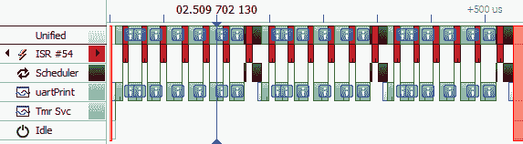

注意，在空闲任务上绝对没有花费时间——CPU 完全被尝试跟上 UART2 传入的数据所消耗。

如以下屏幕截图所示，当处理器设置为使用每字符执行一次的中断在 256,400 波特率接收数据时，数据偶尔会丢失：

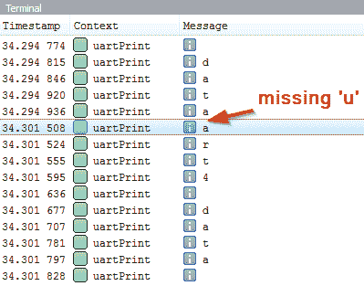

现在，为了比较，这里是用流缓冲区和 DMA 实现的（几乎）等效实现：

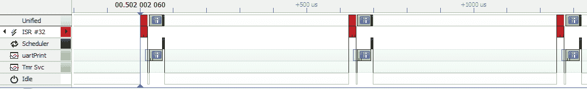

流缓冲区和 DMA 的组合释放了相当多的 CPU 时间；基于队列的中断服务例程（ISR）实现消耗了>100%的 CPU。正如以下处理分解所示，使用 DMA 的流缓冲区的总 CPU 使用率约为 10%：

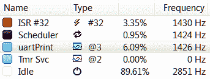

注意以下内容：

+   基于 DMA/流缓冲区的解决方案几乎为其他任务留下了 90%的 CPU 周期。

+   花在打印调试语句（和从队列中取出字节）上的时间比服务 DMA ISR 的时间要多。

+   多字节流缓冲区事务还消除了大量的上下文切换（注意调度器只利用了大约 1%的 CPU），这将为其他处理任务留下更多连续的时间。

因此，现在我们已经处理了每种驱动类型的非常简单的示例，那么你应该实现哪一个呢？

# 选择驱动器模型

选择给定系统的*最佳*驱动器取决于几个不同的因素：

+   调用代码是如何设计的？

+   可以接受多少延迟？

+   数据移动有多快？

+   它是什么类型的设备？

让我们逐一回答这些问题。

# 调用代码是如何设计的？

使用驱动器的高级代码的预期设计是什么？它将操作传入的每个字符或字节吗？或者，对于高级代码来说，将传输批量到字节的块/帧中更有意义吗？

基于队列的驱动程序在处理未知数量（或流）的数据时非常有用，这些数据可以在任何时间点到来。它们也非常适合处理单个字节的代码——`uartPrintOutTask`就是一个很好的例子：

```cpp
 while(1)
 {
     xQueueReceive(uart2_BytesReceived, &nextByte, portMAX_DELAY);
    //do something with the byte received
     SEGGER_SYSVIEW_PrintfHost("%c", nextByte);
 }
```

虽然环形缓冲区实现（如前述代码中的实现）非常适合流数据，但其他代码自然倾向于操作数据块。例如，如果我们的高级代码旨在通过串行端口读取第九章中定义的结构之一，即*任务间通信*：

以下摘录来自`Chapter_9/MainQueueCompositePassByValue.c`：

```cpp
typedef struct
{
    uint8_t redLEDState : 1;     
    uint8_t blueLEDState : 1;
    uint8_t greenLEDState : 1;
    uint32_t msDelayTime;
}LedStates_t;
```

与操作单个字节相比，接收方一次性拉取整个结构体的实例要方便得多。以下代码旨在从队列中接收`LedStates_t`的整个副本。在接收到结构体之后，可以通过引用结构体的成员来操作它，例如在这个例子中检查`redLEDState`：

```cpp
LedStates_t nextCmd;
while(1)
{
    if(xQueueReceive(ledCmdQueue, &nextCmd, portMAX_DELAY) == pdTRUE)
    {
        if(nextCmd.redLEDState == 1)
            RedLed.On();
        else
             . . .
```

这可以通过**序列化**数据结构并将其通过通信介质传递来实现。我们的`LedStates_t`结构可以序列化为 5 字节的块。所有三个红色、绿色和蓝色状态值都可以打包到一个字节的 3 位中，延迟时间将占用 4 字节：

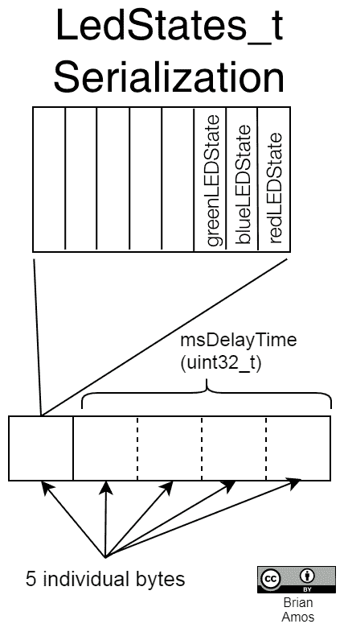

序列化本身是一个广泛的话题。在可移植性、易用性、代码脆弱性和速度之间需要做出权衡。关于所有这些点的讨论超出了本章的范围。关于端序和**最佳**序列化/反序列化此特定数据结构的方法的细节已被故意忽略在图中。主要收获是，结构体可以用 5 字节的块来表示。

在这种情况下，底层外设驱动程序以 5 字节为一个缓冲区进行操作是有意义的，因此将传输分组为 5 字节的缓冲区方法比字节流更自然。以下伪代码概述了基于我们在上一节中编写的基于缓冲区的驱动程序的方案：

```cpp
uint8_t ledCmdBuff[5];
startReceiveInt(ledCmdBuff, 5);
//wait for reception to complete
xSemaphoreTake(cmdReceived, portMAX_DELAY);
//populate an led command with data received from the serial port
LedStates_t ledCmd = parseMsg(ledCmdBuff);
//send the command to the queue
xQueueSend(ledCmdQueue, &ledCmd, portMAX_DELAY);
```

在类似前述情况的情况下，我们已经介绍了两种可以提供高效实现的不同方法：

+   基于缓冲区的驱动程序（每次接收 5 字节）

+   流缓冲区（接收方可以配置为每次获取 5 字节）

FreeRTOS 消息缓冲区也可以用来代替流缓冲区，以提供更灵活的解决方案。消息缓冲区建立在流缓冲区之上，但具有更灵活的阻塞配置。它们允许在每次`receive`调用时配置不同的消息大小，因此相同的缓冲区可以用来将接收分组为每次 5 字节（或任何其他所需大小）。在使用流缓冲区的情况下，消息大小在创建流缓冲区时通过设置`xStreamBufferCreate`中的`xTriggerLevelBytes`参数而被严格定义。与流缓冲区不同，消息缓冲区将只返回完整的消息，而不是单个字节。

# 可以接受多少延迟？

根据要实现的特定功能，可能需要最小的延迟。在这种情况下，基于缓冲区的实现有时可能具有轻微的优势。它们允许调用代码被设置为极高的优先级，而不会在应用程序的其他部分引起显著的任务上下文切换。

在基于缓冲区的设置中，消息的最后一个字节传输完成后，任务将被通知并立即运行。这比让高优先级任务进行字节解析消息要好，因为它会在每次接收到一个字节时不断中断其他任务。在基于字节的队列方法中，如果传入的消息非常重要，等待队列的任务需要被设置为非常高的优先级。这种组合与缓冲区方法相比，会导致相当多的任务上下文切换，因为缓冲区方法在传输完成后只有一个信号量（或直接任务通知）。

有时，时间约束非常严格，既不能接受队列，也不能接受整个块传输（字节可能需要随着接收到来进行处理）。这种方法有时还会消除对中间缓冲区的需求。在这些情况下，可以编写一个完全定制的 ISR，但它不容易重用。尽可能避免将**业务逻辑**（非立即用于服务外设的应用级逻辑）放入 ISR 中。这会复杂化测试并减少代码重用。在编写了几个月（或几年）这样的代码之后，你可能会发现你已经有几十个看起来几乎相同但行为略有不同的 ISR，这在需要修改高级代码时可能会造成有缺陷的系统。

# 数据移动有多快？

虽然非常方便，但队列是传递单个字节在系统中的相当昂贵的方式。即使基于中断的驱动程序也有处理传入数据的时间限制。我们的例子使用了 9600 波特率的传输。字符在被接收后 40 微秒内被传输到队列中，但波特率是 115,200 波特时会发生什么？现在，每个字符需要在不低于 9 微秒内添加到队列中。每个中断需要 40 微秒的驱动程序在这里是不可接受的，因此使用简单的队列方法不是一个可行的选项。

我们看到，使用 DMA 的流缓冲区实现是队列的可行替代方案。对于高速、连续的数据流，使用某种类型的双缓冲技术至关重要。当与高度有效的 RTOS 原语（如流缓冲区或消息缓冲区）结合使用时，这成为了一种特别方便的技术。

当速度较高时，基于中断和 DMA 的驱动程序将数据直接移动到**原始**内存缓冲区也是相当可行的，但它们没有队列-like 界面的便利性。

# 你正在与哪种类型的设备接口？

一些外围设备和外部设备会自然倾向于一种或另一种实现。在接收异步数据时，队列是一个相当自然的选择，因为它们提供了一个易于捕获不断传入数据的机制。UARTs、USB 虚拟串行通信、网络流和定时器捕获都自然地使用字节级队列实现（至少在最低级别）。

基于同步的设备，如**串行外设接口**（**SPI**）和**集成电路间**（**I2C**），由于事先知道字节数，因此在主侧使用基于块的传输很容易实现（主需要提供发送和接收的字节所需的时钟信号）。

# 何时使用基于队列的驱动程序

以下是一些使用队列作为驱动程序接口的优势案例：

+   当外围/应用程序需要接收未知长度的数据时

+   当数据必须异步接收请求时

+   当驱动程序应该从多个来源接收数据而不阻塞调用者时

+   当数据速率足够慢，允许每个中断至少有 10 的微秒（当在硬件上实现时，例如这个例子）

# 何时使用基于缓冲区的驱动程序

以下是一些原始缓冲区驱动程序极其有用的案例：

+   当需要大缓冲区时，因为将一次性接收大量数据

+   在基于事务的通信协议期间，尤其是在事先知道接收到的数据长度时

# 何时使用流缓冲区

流缓冲区提供的速度接近原始缓冲区，但增加了提供高效队列 API 的好处。它们通常可以在标准队列会被使用的地方使用（只要只有一个消费者任务）。流缓冲区在许多情况下也足够高效，可以替代原始缓冲区。正如我们在`mainUartDMAStreamBufferCont.c`示例中看到的那样，它们可以与循环 DMA 传输结合使用，提供真正的连续数据捕获，而不需要使用大量的 CPU 周期。

这些只是你在创建驱动程序时可能会遇到的一些考虑因素；它们主要针对通信外设（因为我们的示例涵盖了这一点）。在选择使用第三方库和驱动程序时，也有一些考虑因素需要考虑。

# 使用第三方库（STM HAL）

如果你一直密切关注，你可能已经注意到了一些事情：

+   STM HAL（供应商提供的硬件抽象层）用于初始外设配置。这是因为 HAL 在使外设配置变得容易方面做得非常好。使用 STM Cube 等工具生成一些模板代码作为参考，以便首次与新型芯片交互时也非常方便。

+   当需要实现中断驱动的交易细节时，我们一直直接调用 MCU 外设寄存器，而不是让 HAL 为我们管理交易。这样做有几个原因：

    +   我们希望更接近硬件，以便更好地理解系统中的实际工作方式。

    +   一些设置没有得到 HAL 的直接支持，例如 DMA 双缓冲。

通常，你应该使用你（或你的项目/公司）感到舒适的供应商提供的代码量。如果代码编写良好且工作可靠，那么通常没有太多理由不使用它。

话虽如此，以下是在使用供应商提供的驱动程序时可能遇到的一些潜在问题：

+   它们可能使用轮询而不是中断或 DMA。

+   将其与中断绑定可能很繁琐或不灵活。

+   可能会有很多额外的开销，因为许多芯片/用例可能已经被驱动程序覆盖（它们需要解决**每个人的**问题，而不仅仅是你的）。

+   完全掌握和理解复杂的 API 可能比直接与外设硬件工作（对于简单的外设）需要更长的时间。

以下是一些编写**裸机**驱动程序的例子：

+   当供应商的驱动程序出现故障/有错误时

+   当速度很重要时

+   当需要特殊配置时

+   作为学习练习

理想情况下，在第三方驱动程序和您自己的驱动程序之间切换应该是无缝的。如果不是这样，这意味着高级代码与硬件紧密耦合。这种紧密耦合对于足够小的*一次性*和*废弃*项目来说是完全可以接受的，但如果您试图长期开发代码库，投资于创建松散耦合的架构将会有回报。拥有松散耦合（消除精确驱动程序实现与高级代码之间的依赖关系）也为单个组件的实现提供了灵活性。松散耦合确保在自定义驱动程序和第三方驱动程序之间切换不需要对高级代码进行重大重写。松散耦合还使得在隔离状态下测试代码库的小部分成为可能——有关详细信息，请参阅第十二章*，创建良好抽象架构的技巧*。

# 摘要

在本章中，我们介绍了三种实现低级驱动程序的方法，这些驱动程序与 MCU 中的硬件外设接口。通过示例涵盖了中断、轮询和基于 DMA 的驱动程序，并使用 SEGGER SystemView 分析了它们的性能并进行比较。我们还介绍了 FreeRTOS 与 ISRs 交互的三个不同方式：信号量、队列和流缓冲区。还讨论了选择实现选项的考虑因素，以及何时使用第三方外设驱动程序（STM HAL）以及何时“自行开发”最佳。

为了充分利用本章内容，我们鼓励您在实际硬件上运行它。开发板的选择（部分原因）是希望您可能能够访问 Arduino 外壳。在运行示例之后，下一步的绝佳步骤是开发一个外壳或另一件实际硬件的驱动程序。

当谈到驱动程序实现时，本章只是冰山一角。在创建高效实现时，可以使用许多额外的方法和技巧，从使用本章未展示的不同 RTOS 原语到配置 MCU 特定的功能。您的设计不需要受限于供应商提供的功能。

您现在应该对低级驱动程序的不同实现方式有了稳固的理解。在下一章中，我们将探讨如何将这些驱动程序安全地跨多个任务呈现给高级代码。提供驱动程序的便捷访问使得开发最终应用程序变得快速灵活。

# 问题

在我们总结之际，这里有一份问题列表，供您测试对本章内容的理解。您将在附录的*评估*部分找到答案：

1.  哪种类型的驱动程序编写和使用的难度更大？

    +   轮询

    +   中断驱动

1.  判断对错：在 FreeRTOS 中，是否可以从任何中断服务例程（ISR）中调用任何 RTOS 函数？

    +   是

    +   否

1.  判断对错：在使用实时操作系统（RTOS）时，中断始终在与调度器争夺 CPU 时间？

    +   是

    +   否

1.  在传输大量高速数据时，哪种外围设备驱动技术需要的 CPU 资源最少？

    +   投票

    +   中断

    +   DMA

1.  DMA 代表什么？

1.  列举一个使用基于原始缓冲区的驱动程序不是好主意的情况。

# 进一步阅读

+   *RM0410 STM32F76xxx*参考手册的*第四章*（*USART*）

+   B1.5.4，在*Arm®v7-M Architecture*参考手册的**异常优先级和抢占**部分

+   FreeRTOS.org 对 CortexM 优先级的解释，见[`www.freertos.org/RTOS-Cortex-M3-M4.html`](https://www.freertos.org/RTOS-Cortex-M3-M4.html)
