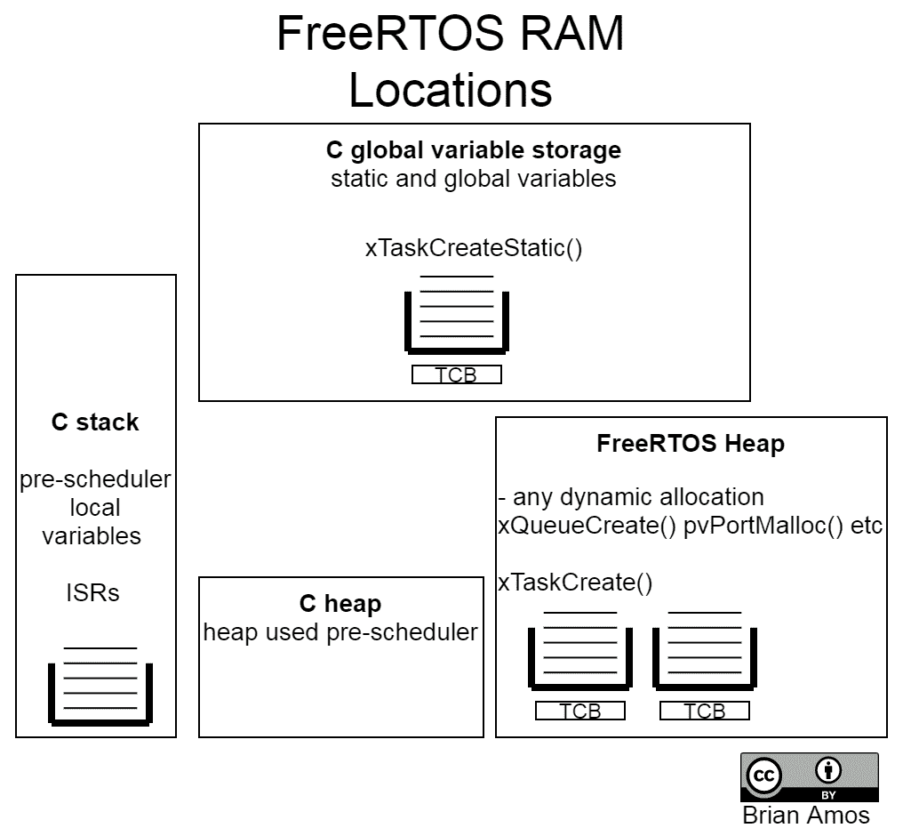
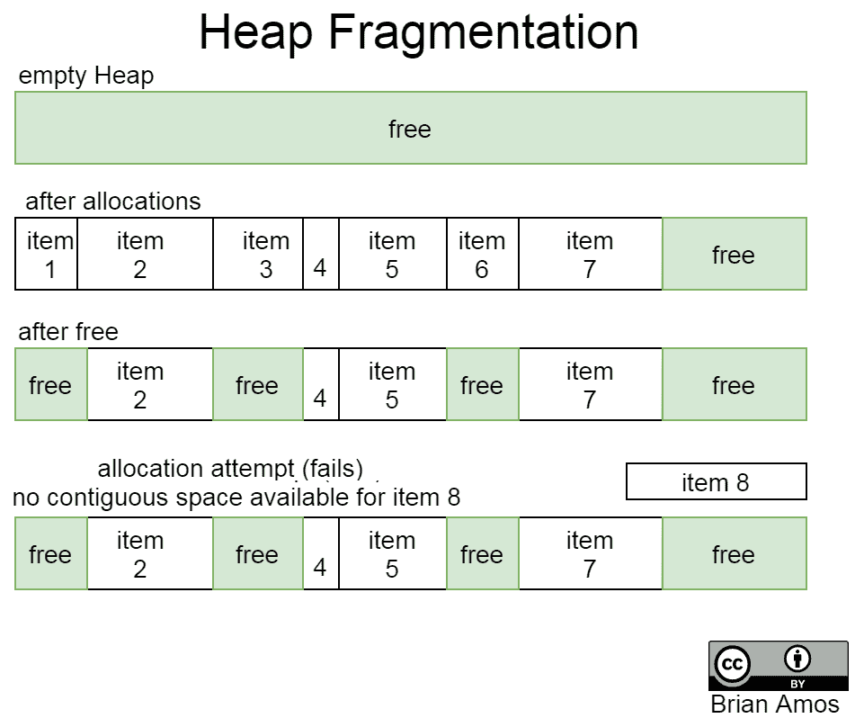
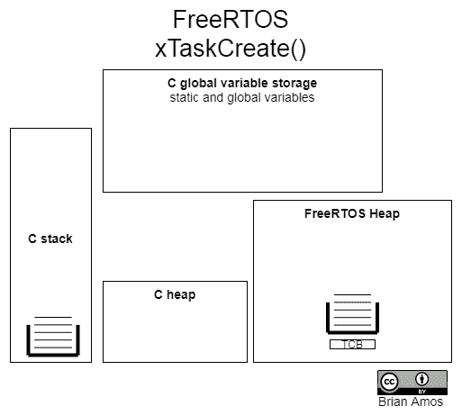
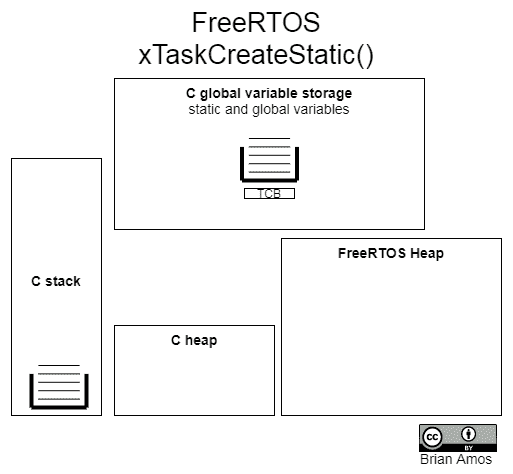
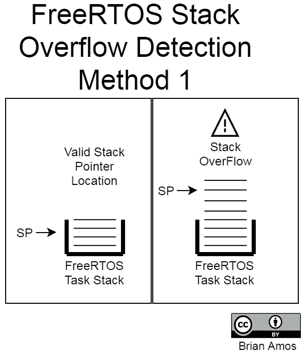
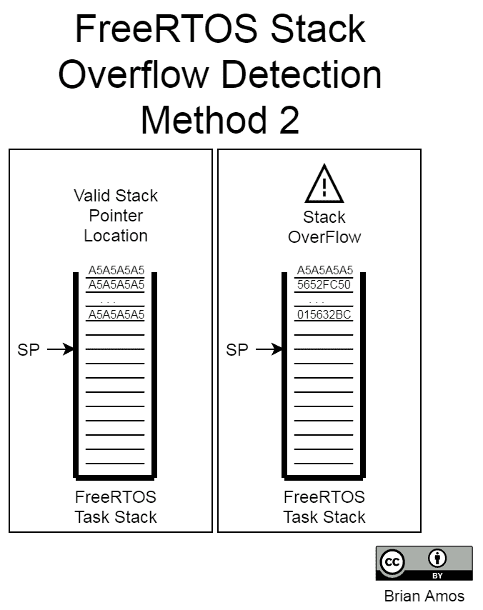

# 第十五章：FreeRTOS 内存管理

到目前为止，我们已经通过许多创建 FreeRTOS 原语的示例；然而，当这些原语最初创建时，并没有太多关于内存来源的解释。在本章中，我们将了解内存的确切来源，以及何时以及如何分配。选择何时以及如何分配内存允许我们在编码便利性、时序确定性、潜在法规要求以及代码标准之间进行权衡。我们将通过查看可以采取的不同措施来确保应用程序的健壮性来结束本章。

简而言之，本章涵盖了以下内容：

+   理解内存分配

+   FreeRTOS 原语的静态和动态分配

+   比较 FreeRTOS 堆实现

+   替换`malloc`和`free`

+   实现 FreeRTOS 内存钩子

+   使用**内存保护单元**（**MPU**）

# 技术要求

要完成本章的动手练习，你需要以下内容：

+   Nucleo F767 开发板

+   一条 Micro-USB 线

+   STM32CubeIDE 和源代码（参见第五章，*选择 IDE*部分下的*设置我们的 IDE*说明）

+   SEGGER JLink、Ozone 和 SystemView（参见第六章，*实时系统调试工具*中的说明）

本章的所有源代码均可在[`github.com/PacktPublishing/Hands-On-RTOS-with-Microcontrollers/tree/master/Chapter_15`](https://github.com/PacktPublishing/Hands-On-RTOS-with-Microcontrollers/tree/master/Chapter_8)获取。

# 理解内存分配

内存分配并不一定是开发者考虑应用开发中最喜欢的主题之一——它并不那么吸引人。动态分配内存——即在需要时分配内存，而不是在程序开始时——是常态。在面向桌面的开发中，内存通常在需要时可用，因此不会过多考虑；它只是一个`malloc`调用而已。当它完成时，它将通过`free`进行释放。

与桌面环境中无忧无虑的动态内存分配方案不同，使用 MCU 的深度嵌入式系统程序员通常需要更加小心地考虑如何（以及是否）动态分配内存。在嵌入式系统中，法规、RAM 和时序约束都可能影响内存是否以及如何进行动态分配。

许多高可靠性和安全关键性的编码标准，如 MISRA-C，不允许使用动态分配。在这种情况下，使用静态分配仍然是完全可接受的。一些编码标准禁止在所有任务创建后进行动态分配（例如，*JPL 的*《*安全关键编码十规则*》）。在这种情况下，静态分配或 FreeRTOS 的`heap_1.c`实现是合理的。

在某些平台上，RAM 可能会受到严重限制。表面上，这似乎是动态内存分配的完美用例；毕竟，如果内存有限，当它不再使用时可以将其归还！然而，在实践中，当有限的堆空间可用时，事情并不总是这么顺利。当使用小堆为具有不同生命周期的任意大小对象分配空间时，最终往往会发生碎片化（这将在稍后的示例中更深入地讨论）。

最后，对高度确定性的定时需求也可能限制动态分配的选项。如果代码的一部分有严格的定时约束，有时避免使用动态分配比尝试模拟 `malloc` 调用的最坏情况定时测试要容易。还值得再次注意的是，`malloc` 并不保证成功，尤其是在内存有限的嵌入式系统中。在内存受限的多线程系统中，大量动态分配可能会创建一些非常复杂的使用案例，这些案例在运行时可能会失败。彻底测试这样的系统是一个非常大的挑战。

在了解了为什么内存分配在受限嵌入式系统中如此重要之后，让我们更仔细地看看在几个不同的用例中内存是从哪里来的。

# 静态内存

静态内存的生命周期是整个程序运行期间。全局变量，以及使用 `static` 说明符在函数内部声明的任何变量，都将放置到静态内存中，并且它们的生命周期与程序相同。

例如，`globalVar` 和 `staticVar` 都位于静态内存中，并且在整个程序生命周期内保持不变。`staticVar` 的初始化仅在程序初始加载时发生一次：

```cpp
uint8_t globalVar = 12;

void myFunc( void )
{
  static uint8_t staticVar = 0;
  ...
}
```

当变量被声明为静态时，内存的可用性得到保证。程序定义的所有全局和静态变量都在链接阶段放置到它们的位置。只要内存量已正确配置，链接器保证这些变量有足够的空间。

然而，缺点是静态变量具有如此长的生命周期，静态变量将始终占用空间，即使它们没有被使用。

# 栈内存

栈用于函数作用域的存储。每次调用函数时，该函数的信息（如参数和局部变量）都会放置到栈上。当函数退出时，放置到栈上的所有信息都会被移除（这就是为什么将局部变量的指针传递出去是一个问题）。在 FreeRTOS 中，每个任务都有自己的私有栈，其大小在任务创建时确定。

由于堆栈有如此有序的访问方式，它们不可能像堆那样变得碎片化。然而，通过在堆栈上放置比其大小允许更多的信息，是有可能溢出堆栈的。

在 Cortex-M 中，还有一个额外的堆栈——主堆栈。主堆栈由中断服务例程（ISRs）和 FreeRTOS 内核使用。内核和 ISRs 在特权模式下执行，该模式会修改**主堆栈指针**（**MSP**）。任务在进程堆栈上执行并使用**进程堆栈指针**（**PSP**）。所有堆栈指针操作都由硬件和内核根据当前正在执行的是内核、中断还是任务（进程）来处理。这不是 RTOS API 用户通常需要担心的事情。

堆栈和堆的初始化发生在 `Chapter_*\startup\startup_stm32f767xx.s`。主堆栈的确切大小在链接脚本 `STM32F767ZI_FLASH.ld` 中定义。如果需要，可以通过修改 `_Min_Heap_Size` 或 `_Min_Stack_Size` 来调整在 FreeRTOS 调度器启动之前系统可用的堆栈和堆的大小：

```cpp
_Min_Heap_Size = 0x200; /* required amount of heap */
_Min_Stack_Size = 0x400; /* required amount of stack */
```

最好尽量保持这两个堆栈的大小最小，因为在这里使用的任何 RAM 都将无法用于任务。这些堆栈/堆只用于在调度器启动之前运行的代码，以及中断服务例程（ISRs）。这**不是**任何任务使用的相同堆栈。

有时，你可能会遇到需要运行一些内存密集型初始化代码的问题（USB 堆栈是这种情况的一个好例子）。如果初始化函数在任务之外（在调度器启动之前）被调用，那么它们将使用主堆栈。为了使这个堆栈尽可能小，并允许为任务使用更多的内存，将内存密集型初始化代码移入任务中。这将允许 RTOS 堆拥有在初始化后本将未使用的额外 RAM，因为如果增加了主堆栈的大小。

FreeRTOS 内核操作**进程堆栈指针**（**PSP**）以指向具有上下文（处于运行状态）的任务堆栈。

在大多数情况下，你不需要立即关注各种堆栈指针——它们由内核和 C 运行时处理。如果你正在开发将在 RTOS 和 *bare metal*（即，引导加载程序）之间转换的代码，那么你需要了解如何/何时正确切换当前堆栈指针。

在堆栈方面需要记住的最重要的事情是，它们必须足够大，以容纳任务将执行的 deepest call level 的所有局部变量。我们将在 *Keeping an eye on stack space* 部分讨论获取这个信息的方法。

# 堆内存

堆是当调用 `malloc` 进行动态分配时使用的内存部分。它也是当通过调用 `xTaskCreate()` 创建时，FreeRTOS 任务堆栈和 **任务控制块** (**TCB**) 存储的地方。

在一个 MCU FreeRTOS 系统中，通常会创建两个堆：

+   **系统堆**：在前面描述的启动和链接脚本中定义。这在使用为 RTOS 原语分配空间时将 *不* 可用于最终应用程序代码。

+   **FreeRTOS 堆**：在创建任务和其他原语时使用，并在 ***Inc\****FreeRTOSConfig.h*** 中定义。可以通过调整以下行来调整大小：

```cpp
#define configTOTAL_HEAP_SIZE ((size_t)15360)
```

目前，这一行定义了一个 15 KB 的堆。这个堆必须足够大，以容纳以下内容：

+   使用 `xTaskCreate` 创建的所有任务的堆栈（和 **TCBs**）

+   使用 `x*Create` 创建的队列、信号量、互斥锁、事件组和软件定时器

这里是所有不同变量来源的视觉表示：



FreeRTOS 原语和堆栈有两个可能的存储位置：

+   当调用 `xTaskCreateStatic()` 时传递给任务的堆栈和 **TCB** 的静态分配空间

+   当调用 `xTaskCreate()` 时创建的堆栈/TCB 的动态分配空间

C 堆仅用于创建时未使用 FreeRTOS 堆实现的项目，而 C 堆栈仅在调度器启动之前以及由 ISRs 使用。在使用 RTOS 时，最好尽可能最小化 C 堆的大小，或者完全不要。这将留下更多的可用 RAM 来分配给 RTOS 堆或静态变量。

# 堆碎片化

在有限 RAM 的嵌入式系统中，堆碎片化可能是一个非常严重的问题。当项目被加载到堆中并在不同的时间点移除时，堆就会变得碎片化。问题是，如果许多被移除的项目不是相邻的，就不一定会有一个更大的连续空间区域可用：



在前面的例子中，项目 8 的空间无法成功分配。尽管有足够的空闲空间，但并没有足够的 *连续* 空间来容纳项目 8 的大小。这尤其成问题，因为它只会在运行时发生，并且在某些情况下，这些情况取决于堆中项目分配和释放的大小和时机。

现在我们已经涵盖了内存分配的基础知识，让我们看看 FreeRTOS 原语可以以不同的方式创建并放置在静态或堆内存中的几种方法。

# FreeRTOS 原语的静态和动态分配

关于创建任务的机制在第七章，*FreeRTOS 调度器*中有所介绍。在这里，我们只关注内存来源及其*生命周期*的差异。这将有助于阐明选择不同分配方案的含义。

任务内存可以是动态分配或静态分配。动态分配允许通过调用`vTaskDelete()`来返回任务使用的内存，如果任务不再需要运行（有关详细信息，请参阅第七章，*FreeRTOS 调度器*）。动态分配可以在程序的任何点发生，而静态分配则在程序开始之前发生。FreeRTOS API 调用的静态变体遵循相同的初始化方案——标准调用使用动态分配（从 FreeRTOS 堆中拉取内存）。所有名称中包含`CreateStatic`的 FreeRTOS API 函数（如`xTaskCreateStatic`）都接受额外的参数来引用预分配的内存。与动态分配方法相反，传递给`*CreateStatic`变体的内存通常是静态分配的缓冲区，这些缓冲区在整个程序的生命周期中都是存在的。

虽然`*CreateStatic` API 变体的命名暗示内存是静态的，但这实际上并不是一个要求。例如，你可以在栈上分配缓冲区内存，并将指针传递给`*CreateStatic` API 函数调用；然而，你需要确保所创建的基本类型的生命周期仅限于该函数！你还可以发现，使用 FreeRTOS 堆以外的分配方案分配内存可能很有用，在这种情况下，你也可以使用`*CreateStatic` API 变体。如果你选择使用这两种方法中的任何一种，为了避免内存损坏，你需要详细了解正在创建的 FreeRTOS 基本类型和分配的内存的生命周期！

# 动态分配示例

几乎所有展示的代码都使用了动态分配来创建 FreeRTOS 基本类型（任务、队列、互斥锁等）。在我们查看使用静态分配创建基本类型的差异之前，这里有两个例子作为快速复习。 

# 创建任务

当使用动态分配的内存创建任务时，调用将类似于以下内容（有关与内存分配无关的参数的更多详细信息，请参阅第七章，*FreeRTOS 调度器*）：

```cpp
BaseType_t retVal = xTaskCreate( Task1, "task1", StackSizeWords, NULL,
        tskIDLE_PRIORITY + 2, tskHandlePtr);
assert_param(retVal != pdPASS);
```

关于此调用，有一些与内存分配相关的相关信息需要注意：

+   `xTaskCreate`的调用可能会失败。这是因为无法保证在 FreeRTOS 堆上有足够的空间来存储任务的堆栈和 TCB。唯一确保其成功创建的方法是检查返回值，`retVal`。

+   与堆栈有关的唯一参数是请求的堆栈大小。

以这种方式创建时，如果任务适当地终止自己，它可以调用 `xTaskDelete(NULL)`，与任务堆栈和 TCB 相关的内存将可用于重用。

关于动态分配的以下是一些需要注意的点：

+   如果没有堆空间可用，原语创建可能在运行时失败。

+   FreeRTOS 为原语分配的所有内存将在任务删除时自动释放（只要不使用 `Heap_1`，并且在 `FreeRTOSConfig.h` 中将 `INCLUDE_vTaskDelete` 设置为 `1`）。这不包括实际任务中由 *用户* 代码动态分配的内存；RTOS 对用户代码启动的任何动态分配一无所知。释放此代码的责任在于您，您需要在适当的时候释放此代码。

+   在 `FreeRTOSConfig.h` 中，必须将 `configSUPPORT_DYNAMIC_ALLOCATION` 设置为 1，以便动态分配可用：



当使用动态分配创建任务时，任务使用的所有内存、任务的堆栈和 **TCB** 都是从 FreeRTOS 堆中分配的，如前图所示。

接下来，让我们看看创建队列的不同方法。

# 创建队列

关于如何使用动态分配的内存创建队列的详细解释和工作示例，请参阅第九章，*通过队列按值传递数据* 中的 *任务间通信* 部分，第九章。作为一个快速回顾，要创建一个长度为 `LED_CMD_QUEUE_LEN`、包含 `uint8_t` 类型元素的队列，我们需要执行以下步骤：

1.  创建队列：

```cpp
ledCmdQueue = xQueueCreate(LED_CMD_QUEUE_LEN,
                            sizeof(uint8_t));
```

1.  通过检查句柄 `ledCmdQueue` 不是 `NULL` 来验证队列是否成功创建：

```cpp
assert_param(ledCmdQueue != NULL);
```

现在我们已经回顾了一些动态分配的示例（这些示例将在运行时从 FreeRTOS 堆中拉取内存），让我们继续讨论静态分配（这将在编译/链接期间预留内存，在应用程序运行之前）。

# 静态分配示例

FreeRTOS 还有一种创建不需要我们动态分配内存的原语的方法。这是一个使用静态分配内存创建原语的示例。

# 创建任务

要使用预分配的堆栈和 TCB（不需要动态分配）创建任务，可以使用以下类似的调用：

```cpp
StackType_t GreenTaskStack[STACK_SIZE];
StaticTask_t GreenTaskTCB;
TaskHandle_t greenHandle = NULL;
greenHandle = xTaskCreateStatic(    GreenTask, "GreenTask", STACK_SIZE,
                                    NULL, tskIDLE_PRIORITY + 2,
 GreenTaskStack, &GreenTaskTCB);
assert_param( greenHandle != NULL );
```

与之前的动态分配方法相比，这种静态分配有几个显著的不同点：

+   与返回值 `pdPASS` 不同，`xTaskCreateStatic` 函数返回一个任务句柄。

+   使用 `xTaskCreateStatic` 创建任务总是会成功，前提是堆栈指针和 TCB 指针非空。

+   作为检查 `TaskHandle_t`、`StackType_t` 和 `StaticTask_t` 的替代方案，可以检查 `StackType_t`；只要它们不是 `NULL`，任务总是会成功创建。

+   即使任务是用 `xTaskCreateStatic` 创建的，任务也可以被*删除*。FreeRTOS 只会采取必要的步骤将任务从调度器中移除；释放相关内存是调用者的责任。

当我们使用之前的调用时，这是任务堆栈和 TCB 所在的位置：



静态创建在内存分配方面比其名称所暗示的提供了更多的灵活性。严格来说，对 `vTaskDelete` 的调用只会将静态创建的任务从调度器中移除。由于 FreeRTOS 将不再访问该任务的堆栈或 TCB 中的内存，因此可以安全地将此内存用于其他目的。从堆栈内存而不是静态内存分配堆栈和 TCB 是可能的。使用 `xTaskCreateStatic` 创建的任务删除的示例可以在 `main_staticTask_Delete.c` 中找到。

# 创建队列

现在，让我们看看使用静态内存为缓冲区和队列结构创建队列的步骤。此代码摘自 `mainStaticQueueCreation.c`：

1.  定义一个变量来保存 FreeRTOS 使用的队列结构：

```cpp
static StaticQueue_t queueStructure;
```

1.  创建一个适当大小的原始数组，用于保存队列内容：

    +   可以使用目标数据类型的一个简单的 C 数组；在这种情况下，我们的队列将持有 `uint8_t` 数据类型。

    +   使用 `#define` 来定义数组长度：

```cpp
#define LED_CMD_QUEUE_LEN 2
static uint8_t queueStorage[LED_CMD_QUEUE_LEN];
```

1.  在之前定义的数组相同长度内创建队列：

```cpp
ledCmdQueue = xQueueCreateStatic(LED_CMD_QUEUE_LEN,                                   sizeof(uint8_t), queueStorage, &queueStructure );
```

这里是参数的分解：

+   +   `LED_CMD_QUEUE_LEN`: 队列中的元素数量

    +   `sizeof(uint8_t)`: 每个元素的大小（以字节为单位）

    +   `queueStorage`: 用于在队列中存储元素的原始数组（仅由 FreeRTOS 使用）

    +   `queueStructure`: 指向 `StatisQueue_t` 的指针，这是 FreeRTOS 内部使用的队列结构

1.  检查队列句柄 `ledCmdQueue`，以确保队列被正确创建，通过验证它不是 `NULL`。与动态分配的队列不同，这个调用不太可能失败，但进行这个检查可以确保如果队列被更改为动态分配，错误仍然会被捕获：

```cpp
assert_param(ledCmdQueue != NULL);
```

1.  将所有内容组合在一起：

```cpp
static QueueHandle_t ledCmdQueue = NULL;
static StaticQueue_t queueStructure;
#define LED_CMD_QUEUE_LEN 2
static uint8_t queueStorage[LED_CMD_QUEUE_LEN];
ledCmdQueue = xQueueCreateStatic(LED_CMD_QUEUE_LEN,
            sizeof(uint8_t),
            queueStorage, &queueStructure );
assert_param(ledCmdQueue != NULL);
```

使用静态分配创建队列和使用动态分配创建队列之间的唯一区别是内存的提供方式——两个调用都返回队列句柄。现在我们已经看到了创建队列和任务而不使用动态分配内存的示例，如果我们有*不*进行动态分配的要求会发生什么？

# 消除所有动态分配

在我们看到的多数示例中，我们专注于在创建 FreeRTOS 原语时使用动态分配方案变体。这主要是为了使用方便和简洁，使我们能够专注于核心 RTOS 概念，而不是担心内存的确切来源以及我们如何访问它。

所有 FreeRTOS 原语都可以使用动态分配的内存或预分配的内存来创建。为了避免所有动态分配，只需使用`CreateStatic`版本的`create`函数，就像我们在前面的例子中创建任务时做的那样。对于队列、互斥锁、信号量、流缓冲区、消息缓冲区、事件组和定时器，都存在`CreateStatic`版本。它们与它们的动态对应物具有相同的参数，但还需要传递一个指向预分配内存的指针。`CreateStatic`等效版本在运行时不需要进行任何内存分配。

你会考虑使用静态等效物，以下是一些原因：

+   它们保证永远不会因为内存不足而失败。

+   所需要的所有检查以确保内存可用都发生在链接阶段（在创建应用程序二进制文件之前）。如果内存不可用，它将在链接时失败，而不是在运行时。

+   许多针对安全关键应用的标准禁止使用动态分配的内存。

+   内部嵌入式 C 编码标准偶尔也会禁止使用动态分配。

内存碎片化也可以添加到这个列表中，但这并不是一个问题，除非内存被释放（例如，可以使用`heap_1`来消除堆碎片化问题）。

现在我们已经了解了动态分配和静态分配之间的区别，让我们深入了解 FreeRTOS 的动态分配方案——五种堆实现。接下来，我们将看到这些不同的定义在文件中是什么样的（全局变量、静态分配等）。我们还将理解主栈和基于任务的栈之间的区别，以及它们在 FreeRTOS 堆中的位置。

# 比较 FreeRTOS 堆实现

由于 FreeRTOS 针对如此广泛的 MCU 和应用程序，它提供了五种不同的动态分配方案，所有这些方案都是通过堆实现的。不同的堆实现允许不同的堆功能级别。它们包含在`portable/MemMang`目录中，作为`heap_1.c`、`heap_2.c`、`heap_3.c`、`heap_4.c`和`heap_5.c`。

**关于内存池的说明：**

许多其他实时操作系统（RTOS）将内存池作为动态内存分配的实现方式。内存池通过仅分配和释放固定大小的块来实现动态分配。通过固定块大小，在内存受限的环境中可以避免碎片化问题。

内存池的缺点是，块的大小需要针对每个特定应用程序进行调整。如果太大，它们会浪费宝贵的 RAM；太小，它们将无法容纳大项。为了使用户更容易操作并避免浪费 RAM，理查德·巴里选择在 FreeRTOS 中仅使用堆进行动态分配。

为了确保项目在编译后正确链接，重要的是只让链接器看到一种堆实现。这可以通过删除未使用的文件或不在链接器可用的文件列表中包含未使用的堆文件来实现。对于本书，`Middleware\Third_Party\FreeRTOS\Source\portable\MemMang` 中的额外文件已被删除。然而，对于本章，所有原始实现都包含在 `Chapter_15\Src\MemMang` 中：这是唯一一个使用除 `heap_4.c` 之外堆的示例的地方。

所有各种堆选项都存在，以便项目能够获得所需的确切功能，而无需更多（在程序空间或配置方面）。它们还允许在灵活性和确定性定时之间进行权衡。以下是一系列各种堆选项：

+   `heap_1`: 只允许分配——不允许释放。这最适合那些在初始创建后不释放任何内容的简单应用程序。此实现，连同 `heap_2`，提供了最确定的定时，因为这两个堆永远不会执行搜索相邻空闲块以组合的操作。

+   `heap_2`: 允许分配和释放，但不会组合相邻的空闲块。这限制了适当的使用场景，仅适用于那些可以知道/保证每次重新使用相同数量的相同大小的项的应用程序。此堆实现对于明确使用 `vPortMalloc` 和 `vPortFree` 的应用程序（例如，自行动态分配内存的应用程序）来说并不是一个好的选择，除非在确保只使用可能大小的一小部分方面有非常高的纪律性。

+   `heap_3`: 包装标准的 `malloc`/`free` 实现以提供线程安全。

+   `heap_4`: 与 `heap_2` 相同，但组合相邻的空闲空间。通过提供一个绝对地址，允许定位整个堆。非常适合需要使用动态分配的应用程序。

+   `heap_5`: 与 `heap_4` 相同，但允许创建一个分布在不同非连续内存区域上的堆——例如，堆可以分散在内部和外部 RAM 上。

下面是所有堆实现之间的快速比较：

| **堆名称** | **线程安全** | **分配** | **释放** | **组合相邻空闲空间** | **多个内存区域** | **确定性** |
| --- | --- | --- | --- | --- | --- | --- |
| `heap_1.c` | ✓ | ✓ |  |  |  | ↑ |
| `heap_2.c` | ✓ | ✓ | ✓ |  |  | ↑ |
| `heap_3.c` | ✓ | ✓ | ✓ | ✓* |  | ? |
| `heap_4.c` | ✓ | ✓ | ✓ | ✓ |  | → |
| `heap_5.c` | ✓ | ✓ | ✓ | ✓ | ✓ | → |
| `std C lib` | ? | ✓ | ✓ | ✓* |  | ? |

(*) 大多数（如果不是全部）包含的堆实现将组合空闲空间。

由于确定性取决于我们恰好使用的 C 库实现，因此在这里提供一般性指导是不可能的。通常，通用堆实现是为了最小化碎片化而创建的，这需要额外的 CPU 资源（时间），并且会降低时间确定的确定性，这取决于移动了多少内存。

每个 C 语言的实现可能对动态分配的处理方式不同。有些实现会让添加线程安全变得和定义`__mallock_lock`和`__malloc_unlock`的实现一样简单，在这种情况下，只需要一个互斥锁即可。在其他情况下，它们可能需要几个实现来实施互斥锁功能。

# 选择你的 RTOS 堆实现

那么，你如何选择使用哪种堆实现呢？首先，你需要确保你能够使用动态分配（许多针对安全关键型应用的标准禁止使用它）。如果你不需要释放分配的内存，那么`heap_1.c`可能是一个潜在的选择（同样，完全避免使用堆也是一个选择）。

从编码的角度来看，使用`heap_1`和静态分配之间的主要区别在于内存可用性检查的执行时机。当使用`*CreateStatic`变体时，你将在链接时被告知没有足够的内存来支持新创建的原语。这需要在每次创建原语时添加几行额外的代码（以分配原语使用的缓冲区）。当使用`heap_1`时，只要执行检查（见第七章，*FreeRTOS 调度器*）以确定任务创建成功，那么检查将在运行时执行。许多适合`heap_1`实现的程序也会在启动调度器之前创建所有必需的任务。以这种方式使用动态内存分配与静态分配并没有太大的区别；它只是将检查从链接时间移动到运行时，同时减少了创建每个 RTOS 原语所需的代码量。

如果你正在开发一个只需要释放*一种*数据类型的程序，`heap_2`可能是一个选择。如果你选择走这条路，你需要非常小心地记录下这个限制，以便未来的代码维护者了解。未能理解`heap_2`的有限用途可能会导致内存碎片化。在最坏的情况下，碎片化可能发生在应用程序运行了一段时间之后，并且可能直到最终代码发布和硬件部署时才会发生。

当使用动态内存时，可以使用 `heap_3`、`heap_4` 或 `heap_5`。如前所述，`heap_3` 简单地包装可用的任何 C 运行时 `malloc` 和 `free` 实现，使其线程安全，以便可以被多个任务使用。这意味着其行为将取决于底层运行时实现。如果您的系统有多个不同、非连续的内存位置（例如，内部和外部 RAM），则可以使用 `heap_5` 将所有这些位置组合成一个堆；否则，`heap_4` 提供与 `heap_5` 相同的分配、释放和相邻块整理能力。这些都是两种通用堆实现。由于它们包括整理空闲块的代码，它们在释放内存时可能会运行不同时间段。一般来说，最好避免在需要高度确定性的代码中调用 `vPortMalloc` 和 `vPortFree`。在 `heap_4` 和 `heap_5` 中，调用 `vPortFree` 将具有最大的时间变化性，因为这是相邻块整理发生的时候。

通常，避免动态分配可以帮助以更少的努力提供更健壮的代码——如果内存从未被释放，内存泄漏和碎片化是不可能的。在另一端，如果您的应用程序使用了标准库函数，例如 `printf` 和字符串操作，您可能需要替换随 `malloc` 和 `free` 一起提供的版本，以使用线程安全的实现。让我们快速看一下确保应用程序的其他部分不会最终使用非线程安全的堆实现所涉及的内容。

# 替换 `malloc` 和 `free`

许多 C 运行时都会附带 `malloc` 的实现，但嵌入式、面向特定版本的运行时不一定默认是线程安全的。由于每个 C 运行时都不同，使 `malloc` 具有线程安全性的步骤也会有所不同。本书中使用的包含的 STM 工具链将 `newlib-nano` 作为 C 运行时库。以下是一些关于 `newlib-nano` 的注意事项：

+   `newlib-nano` 使用 `malloc` 和 `realloc` 来实现 `stdio.h` 的功能（即 `printf`）。

+   FreeRTOS 堆实现不支持 `realloc`。

+   `FreeRTOSConfig.h` 包含了 `configUSE_NEWLIB_REENTRANT` 设置，以使 `newlib` 具有线程安全性，但它需要与所有存根的适当实现一起使用。这将允许您以线程安全的方式使用基于 newlib 的 `printf`、`strtok` 等功能。此选项还使对 `malloc` 和 `free` 的一般用例调用在任何地方都是安全的，无需您显式使用 `pvPortMalloc` 和 `vPortFree`。

请参阅“进一步阅读”部分中的 Dave Nadler 链接，以获取更多信息以及如何在 FreeRTOS 项目中使用 GNU 工具链安全地使用`newlib`的详细说明。

幸运的是，这本书中包含的示例代码中没有对原始`malloc`的调用。通常，STM HAL USB CDC 实现会包含对`malloc`的调用，但这个调用被转换为一个静态定义的变量，这使得我们可以简单地使用 FreeRTOS 附带提供的堆实现。

STM 提供的 USB 堆栈中的`malloc`调用特别危险，因为它发生在 USB 中断中，这使得在`malloc`期间保证线程安全特别困难。这是因为，对于每次对`malloc`的调用，都需要在任务内部以及调用`malloc`的中断（在这种情况下是 USB）内部禁用中断。为了避免这种麻烦，动态分配被完全移除。

既然我们已经了解了使用动态分配的不同安全选项，让我们来看看 FreeRTOS 为我们提供的其他一些工具，用于报告我们的栈和堆的健康状况。

# 实现 FreeRTOS 内存钩子

当许多人第一次开始使用实时操作系统（RTOS）编程时，一个直接的挑战是找出如何为每个任务正确地设置栈的大小。这可能导致开发过程中的某些挫折，因为当栈溢出时，症状可能从异常行为到整个系统崩溃不等。

# 关注栈空间

`vApplicationStackOverflowHook`提供了一种非常简单的方法来消除大多数异常行为并停止应用程序。当在`FreeRTOSConfig.h`中启用`configCHECK_FOR_STACK_OVERFLOW #define`时，每当 FreeRTOS 检测到栈溢出时，`vApplicationStackOverflowHook`将被调用。

`configCHECK_FOR_STACK_OVERFLOW`有两个可能的值：

+   `#define configCHECK_FOR_STACK_OVERFLOW 1`：在任务退出时检查栈指针的位置。

+   `#define configCHECK_FOR_STACK_OVERFLOW 2`：在栈中填充一个已知的模式，并在退出时检查该模式。

第一种方法在任务退出运行状态时检查任务栈指针。如果栈指针指向一个无效位置（栈不应该在那里），则发生了溢出：



这种方法非常快，但它有可能错过一些栈溢出——例如，如果栈已经超出了最初分配的空间，但在检查时栈指针恰好指向一个有效位置，那么溢出就会被错过。为了解决这个问题，还有一个第二种方法可用。

当将`configCHECK_FOR_STACK_OVERFLOW`设置为 2 时，将使用方法 1，但还会采用第二种方法。不是简单地检查任务退出运行状态后栈指针的位置，而是在退出时对栈的顶部 16 个字节进行水印和分析。这样，如果在任务运行期间栈溢出并且顶部 16 个字节中的数据被修改，就可以检测到溢出：



此方法有助于确保，即使在任务执行期间的任何时刻发生了堆栈溢出（或几乎发生了），只要溢出通过了堆栈的上 16 个字，它就会被检测到。

虽然这些方法对于捕获堆栈溢出很有用，但它们并不完美——例如，如果一个数组在任务堆栈上声明并扩展到堆栈的末尾，只有数组的末尾被修改，那么堆栈溢出将不会被检测到。

因此，为了实现一个简单的钩子，在堆栈溢出发生时停止执行，我们将采取以下简单步骤：

1.  在 `FreeRTOSConfig.h` 中定义配置标志：

```cpp
#define configCHECK_FOR_STACK_OVERFLOW 2
```

1.  在一个 `*.c` 文件中，添加堆栈溢出钩子：

```cpp
void vApplicationStackOverflowHook( void )
{
 __disable_irq();
 while(1);
}
```

这种非常简单的方法禁用所有中断并执行一个无限循环，毫无疑问地表明出了问题。此时，可以使用调试器来分析哪个堆栈发生了溢出。

# 关注堆空间

如果你的应用程序经常使用 FreeRTOS 堆，那么你应该强烈考虑使用 `configUSE_MALLOC_FAILED_HOOK` 配置和相关的钩子 `vApplicationMallocFailedHook`。此钩子会在调用 `pvMalloc()` 失败时被调用。

当然，当你这样做的时候，你正在做一个负责任的程序员，检查 `malloc` 的返回值并处理这些错误情况……所以这个钩子可能是多余的。

设置此钩子的步骤与上一个钩子相同：

1.  在 `FreeRTOSConfig.h` 中添加以下内容：

```cpp
#define configUSE_MALLOC_FAILED_HOOK 1
```

1.  在一个 `*.c` 文件中，添加失败的 `malloc` 钩子：

```cpp
void vApplicationMallocFailedHook( void )
{
 __disable_irq();
 while(1);
}
```

此外，还有两个有用的 API 函数可以定期调用，以帮助获得可用空间的一般感觉：

+   `xPortGetFreeHeapSize()`

+   `xPortGetMinimumEverFreeHeapSize()`

这些函数返回可用堆空间和记录过的最少空闲堆空间。然而，它们并不提供任何关于空闲空间是否被分割成小块的线索。

那么，如果这些安全措施中没有一项能给你足够的信心，确保你的每个任务都能与其他系统部分良好地协作，会发生什么？继续阅读！

# 使用内存保护单元（MPU）

**内存保护单元**（**MPU**）在硬件级别持续监控内存访问，以确保只有合法的内存访问发生；否则，会引发中断并立即采取行动。这允许许多常见的错误（否则可能一段时间内不会被注意到）立即被检测到。

使用 MPU 时，即使 `vApplicationStackOverflowHook` 无法检测到，像堆栈溢出这样使堆流向为另一个任务保留的内存空间的问题也会立即被捕获。当使用 MPU 时，缓冲区溢出和指针错误也会被立即阻止，这使得应用程序更加健壮。

STM32F767 MCU 包含一个 MPU。为了使用它，必须使用启用 MPU 的端口：`GCC\ARM_CM4_MPU`。这样，可以通过使用 `xTaskCreateRestricted` 创建受限制的任务，它包含以下附加参数：

```cpp
typedef struct xTASK_PARAMTERS
{
 pdTASK_CODE pvTaskCode;
 const signed char * const pcName;
 unsigned short usStackDepth;
 void *pvParameters;
 unsigned portBASE_TYPE uxPriority;
 portSTACK_TYPE *puxStackBuffer;
 xMemoryRegion xRegions[ portNUM_CONFIGURABLE_REGIONS ];
} xTaskParameters; 
```

受限制的任务具有有限的执行和内存访问权限。

`xTaskCreate` 可以用来创建标准用户模式任务或特权模式任务。在特权模式下，任务可以访问整个内存映射，而在用户模式下，它只能访问自己的闪存和未配置为仅特权访问的 RAM。

为了使所有这些内容结合在一起，FreeRTOS 的 MPU 端口还需要在链接器文件中定义变量：

| **变量名** | **描述** |
| --- | --- |
| `__FLASH_segment_start__` | 闪存的起始地址 |
| `__FLASH_segment_end__` | 闪存的结束地址 |
| `__privileged_functions_end__` | `privileged_functions` 命名部分的结束地址 |
| `__SRAM_segment_start__` | SRAM 存储器的起始地址 |
| `__SRAM_segment_end__` | SRAM 存储器的结束地址 |
| `__privileged_data_start__` | `privileged_data` 部分的起始地址 |
| `__privileged_data_end__` | `privileged_data` 部分的结束地址 |

这些变量将被放置在 `*.LD` 文件中。

恭喜！你现在可以使用 MPU 来保护无效数据访问，准备开发你的应用程序了。

# 摘要

在本章中，我们介绍了静态和动态内存分配，FreeRTOS 中所有可用的堆实现，以及如何实现内存钩子，以便我们可以监视我们的堆栈和堆。通过了解使用不同分配方案时需要做出的权衡，你将能够为你的每个未来项目选择最合适的方法。

在下一章中，我们将讨论在多核环境中使用 FreeRTOS 的细节。

# 问题

在我们总结之际，这里有一份问题列表，供你测试对本章内容的了解。你将在附录的 *评估* 部分找到答案：

1.  使用 FreeRTOS，动态分配内存非常安全，因为它可以防止堆碎片化：

    +   True

    +   False

1.  FreeRTOS 需要动态分配的内存来运行：

    +   True

    +   False

1.  FreeRTOS 中有多少种不同的堆实现？

1.  列出两个可以用来通知你堆栈或堆问题的钩子函数。

1.  MPU 用于什么？

# 进一步阅读

+   *《10 条规则：开发安全关键代码的法则》* 由 *Gerard J. Holzmann* 撰写：[`web.eecs.umich.edu/~imarkov/10rules.pdf`](http://web.eecs.umich.edu/~imarkov/10rules.pdf)

+   Dave Nadler – newlib 和 FreeRTOS 重入：[`www.nadler.com/embedded/newlibAndFreeRTOS.html`](http://www.nadler.com/embedded/newlibAndFreeRTOS.html)

+   FreeRTOS 栈溢出检查：[`www.freertos.org/Stacks-and-stack-overflow-checking.html`](https://www.freertos.org/Stacks-and-stack-overflow-checking.html)
