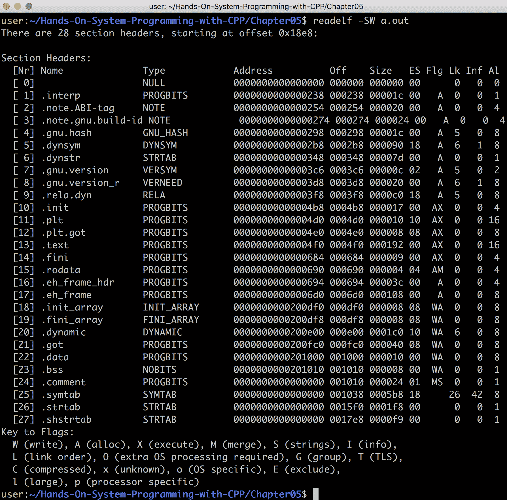
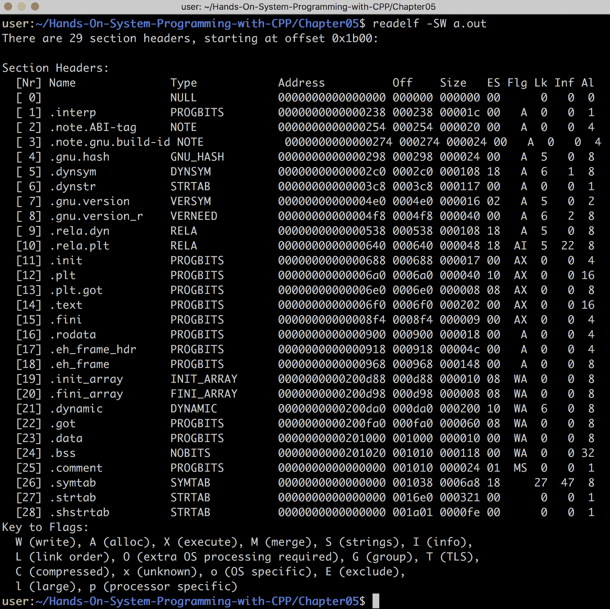
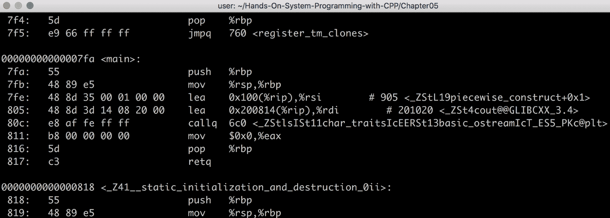
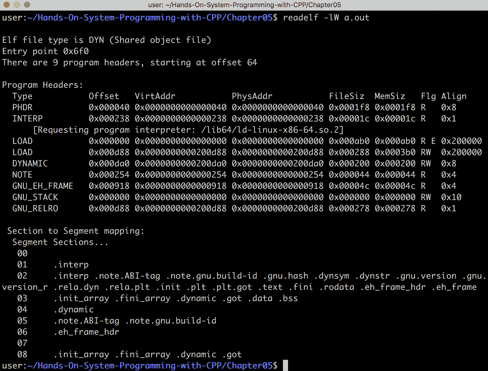

# 第五章：编程 Linux/Unix 系统

本章的目标是解释在 Linux/Unix 系统上编程的基础知识。这将提供一个更完整的图景，说明程序在 Unix/Linux 系统上如何执行，如何编写更高效的代码，以及在出现难以找到的错误时应该去哪里寻找。

为此，本章首先全面审视 Linux ABI，或者更具体地说，System V ABI。在本节中，我们将从寄存器和栈布局到 System V 调用约定和 ELF 二进制对象规范进行全面审查。

下一节将简要介绍 Linux 文件系统，包括标准布局和权限。然后，我们将全面审查 Unix 进程以及如何对它们进行编程，包括考虑到创建新进程和进程间通信等方面。

最后，本章将简要概述基于 Unix 的信号以及如何处理它们（发送和接收）。

在本章中，我们将讨论以下内容：

+   Linux ABI

+   Unix 文件系统

+   Unix 进程 API

+   Unix 信号 API

# 技术要求

为了跟随本章中的示例，您必须具备以下条件：

+   一个能够编译和执行 C++17 的基于 Linux 的系统（例如，Ubuntu 17.10+）

+   GCC 7+

+   CMake 3.6+

+   互联网连接

要下载本章中的所有代码，包括示例和代码片段，请转到以下链接：[`github.com/PacktPublishing/Hands-On-System-Programming-with-CPP/tree/master/Chapter05`](https://github.com/PacktPublishing/Hands-On-System-Programming-with-CPP/tree/master/Chapter05)。

# Linux ABI

在本节中，我们将讨论 Linux ABI（实际上称为**System V ABI**），以及 ELF 标准及其在 Linux/Unix 中的使用。

我们还将深入探讨与 ELF 文件相关的一些细节，如何读取和解释它们，以及 ELF 文件中特定组件的一些含义。

# System V ABI

Unix System V 是最早可用的 Unix 版本之一，并在很大程度上定义了多年的 Unix。在内部，System V 利用了 System V ABI。随着 Linux 和 BSD（类 Unix 操作系统）的广泛使用，System V 的流行度下降了。然而，System V ABI 仍然很受欢迎，因为诸如 Linux 之类的操作系统采用了这一规范用于基于 Intel 的个人电脑。

在本章中，我们将重点关注 Linux 操作系统上 Intel 平台的 System V ABI。然而，需要注意的是，其他架构和操作系统可能使用不同的 ABI。例如，ARM 有自己的 ABI，它在很大程度上基于 System V（奇怪的是，还有 Itanium 64 规范），但有一些关键的区别。

本节的目标是揭示单个 Unix ABI 的内部工作原理，从而使必要时学习其他 ABI 更容易。

本章讨论的大部分规范可以在以下链接找到：[`refspecs.linuxfoundation.org/`](https://refspecs.linuxfoundation.org/)。

System V ABI 定义了程序的大部分低级细节（从而定义了系统编程的接口），包括：

+   寄存器布局

+   栈帧

+   函数前言和尾声

+   调用约定（即参数传递）

+   异常处理

+   虚拟内存布局

+   调试

+   二进制对象格式（在本例中为 ELF）

+   程序加载和链接

在第二章中，*学习 C、C++17 和 POSIX 标准*，我们讨论了程序链接和动态加载的细节，并专门讨论了二进制对象格式（ELF）。

以下是关于 Intel 64 位架构的 System V 规范的其余细节的简要描述。

# 寄存器布局

为了简化这个话题，我们将专注于英特尔 64 位。每个 ABI、操作系统和架构组合的不同寄存器布局都可以写成一本书。

英特尔 64 位架构（通常称为 AMD64，因为 AMD 实际上编写了它）定义了几个寄存器，其中一些在指令集中有定义的含义。

指令指针`rip`定义了程序在可执行内存中的当前位置。具体来说，当程序执行时，它从`rip`中存储的位置执行，并且每次指令执行完毕，`rip`都会前进到下一条指令。

堆栈指针和基指针（分别为`rsp`和`rbp`）用于定义堆栈中的当前位置，以及堆栈帧的开始位置（我们将在后面提供更多信息）。

以下是剩余的通用寄存器。它们有不同的含义，将在本节的其余部分中讨论：`rax`、`rbx`、`rcx`、`rdx`、`rdi`、`rsi`、`r8`、`r9`、`r10`、`r11`、`r12`、`r13`、`r14`和`r15`。

在继续之前，应该指出系统上还定义了几个具有非常具体目的的寄存器，包括浮点寄存器和宽寄存器（这些寄存器由专门设计用于加速某些类型计算的特殊指令使用；例如，SSE 和 AVX）。这些超出了本讨论的范围。

最后，一些寄存器以字母结尾，而另一些以数字结尾，因为英特尔的 x86 处理器版本只有基于字母的寄存器，真正的通用寄存器只有 AX、BX、CX 和 DX。

当 AMD 引入 64 位时，通用寄存器的数量翻了一番，为了保持简单，寄存器名称被赋予了数字。

# 堆栈帧

堆栈帧用于存储每个函数的返回地址，并存储函数参数和基于堆栈的变量。它是所有程序都大量使用的资源，它采用以下形式：

```cpp
high |----------| <- top of stack
     |          |
     |   Used   |
     |          |
     |----------| <- Current frame (rbp)
     |          | <- Stack pointer (rsp)
     |----------|
     |          |
     |  Unused  |
     |          |
 low |----------|
```

堆栈帧只不过是一个从顶部向底部增长的内存数组。也就是说，在英特尔 PC 上，向堆栈推送会从堆栈指针中*减去*，而从堆栈弹出会向堆栈指针中*加上*，这意味着内存实际上是向下增长的（假设您的观点是随着地址增加，内存向上增长，就像前面的图表中一样）。

System V ABI 规定堆栈由堆栈*帧*组成。每个帧看起来像下面这样：

```cpp
high |----------| 
     |   ....   |
     |----------| 
     |   arg8   | 
     |----------| 
     |   arg7   | 
     |----------| 
     | ret addr | 
     |----------| <- Stack pointer (rbp)
     |          |
 low |----------|
```

每个帧代表一个函数调用，并以超过前六个参数的任何参数开始调用函数（前六个参数作为寄存器传递，这将在后面更详细地讨论）。最后，返回地址被推送到堆栈中，然后调用函数。

返回地址后的内存属于函数本身范围内的变量。这就是为什么我们称在函数中定义的变量为*基于堆栈的变量*。剩下的堆栈将被未来将要调用的函数使用。每当一个函数调用另一个函数时，堆栈就会增长，而每当一个函数返回时，堆栈就会缩小。

操作系统的工作是管理堆栈的大小，确保它始终有足够的内存。例如，如果应用程序尝试使用太多内存，操作系统将终止该程序。

最后，应该指出，在大多数 CPU 架构上，提供了特殊指令，用于从函数调用返回并自动弹出堆栈的返回地址。在英特尔的情况下，`call`指令将跳转到一个函数并将当前的`rip`推送到堆栈作为返回地址，然后`ret`将从堆栈中弹出返回地址并跳转到被弹出的地址。

# 函数前言和尾声

每个函数都带有一个堆栈帧，如前所述，存储函数参数、函数变量和返回地址。管理这些资源的代码称为函数的*前导*（开始）和*结尾*（结束）。

为了更好地解释这一点，让我们创建一个简单的例子并检查生成的二进制文件：

```cpp
int test()
{
    int i = 1;
    int j = 2;

    return i + j;
}

int main(void)
{
    test();
}

// > g++ scratchpad.cpp; ./a.out
// 
```

如果我们反汇编生成的二进制文件，我们得到以下结果：

```cpp
...
00000000000005fa <_Z4testv>:
 push %rbp
 mov %rsp,%rbp
 movl $0x1,-0x8(%rbp)
 movl $0x2,-0x4(%rbp)
 mov -0x8(%rbp),%edx
 mov -0x4(%rbp),%eax
 add %edx,%eax
 pop %rbp
 retq
...
```

在我们的测试函数中，前两条指令是函数的前导。前导是推送当前堆栈帧（即前一个函数的堆栈帧），然后将当前堆栈指针设置为`rbp`，从而创建一个新的堆栈帧。

接下来的两条指令使用堆栈的未使用部分来创建变量`i`和`j`。最后，将结果加载到寄存器中，并在`rax`中添加并返回结果（这是为英特尔定义的大多数 ABI 的返回寄存器）。

该函数的结尾是这个例子中的最后两条指令。具体来说，先前的堆栈帧的位置（在前导中推送到堆栈中）从堆栈中弹出并存储在`rbp`中，有效地切换到先前的堆栈帧，然后使用`ret`指令返回到先前的函数（就在函数调用之后）。

敏锐的眼睛可能已经注意到，通过移动`rsp`来为变量`i`和`j`保留了堆栈上的空间。这是因为 System V ABI 的 64 位版本定义了所谓的**红区**。红区仅适用于叶函数（在我们的例子中，测试函数是一个叶函数，意味着它不调用任何其他函数）。

叶函数永远不会进一步增加堆栈，这意味着剩余的堆栈可以被函数使用，而无需推进堆栈指针，因为所有剩余的内存都是公平竞争的。

在系统编程时，如果在内核中编程，有时可能会出现问题。具体来说，如果中断触发（使用当前堆栈指针作为其堆栈），如果堆栈没有正确保留，可能会导致损坏，因此中断会破坏基于堆栈的叶函数的变量。

为了克服这一点，必须使用 GCC 的`-mno-red-zone`标志关闭红区。例如，如果我们使用这个标志编译前面的例子，我们得到以下二进制输出：

```cpp
...
00000000000005fa <_Z4testv>:
 push %rbp
 mov %rsp,%rbp
 sub $0x10,%rsp
 movl $0x1,-0x8(%rbp)
 movl $0x2,-0x4(%rbp)
 mov -0x8(%rbp),%edx
 mov -0x4(%rbp),%eax
 add %edx,%eax
 leaveq
 retq
...
```

如所示，生成的二进制文件与原始文件非常相似。然而，有两个主要区别。第一个是`sub`指令，用于移动堆栈指针，从而保留堆栈空间，而不是使用红区。

第二个区别是使用`leave`指令。这条指令像前面的例子一样弹出`rbp`，但也恢复了堆栈指针，这个指针已经移动以为基于堆栈的变量腾出空间。在这个例子中，`leave`和`ret`指令是新的结尾。

# 调用约定

调用约定规定了哪些寄存器是*易失性*的，哪些寄存器是*非易失性*的，哪些寄存器用于参数传递以及顺序，以及哪个寄存器用于返回函数的结果。

非易失性寄存器是在函数结束之前恢复到其原始值的寄存器（即在其结尾）。System V ABI 将`rbx`、`rbp`、`r12`、`r13`、`r14`和`r15`定义为非易失性寄存器。相比之下，易失性寄存器是被调用函数可以随意更改的寄存器，无需在返回时恢复其值。

为了证明这一点，让我们看下面的例子：

```cpp
0000000000000630 <__libc_csu_init>:
push %r15
push %r14
mov %rdx,%r15
push %r13
push %r12
```

如前面的例子所示，`__libc_csu_init()`函数（被`libc`用于初始化）会触及`r12`、`r13`、`r14`和`r15`。因此，在执行初始化过程之前，它必须将这些寄存器的原始值推送到堆栈中。

此外，在这段代码的中间，编译器将`rdx`存储在`r15`中。稍后将会展示，编译器正在保留函数的第三个参数。仅仅根据这段代码，我们知道这个函数至少需要三个参数。

快速的谷歌搜索会显示这个函数有以下签名：

```cpp
__libc_csu_init (int argc, char **argv, char **envp)
```

由于这个函数触及了*非易失性*寄存器，它必须在离开之前将这些寄存器恢复到它们的原始值。让我们看一下函数的尾声：

```cpp
pop %rbx
pop %rbp
pop %r12
pop %r13
pop %r14
pop %r15
retq
```

如前所示，`__libc_csu_init()`函数在离开之前恢复所有非易失性寄存器。这意味着，在函数的中间某处，`rbx`也被破坏了（原始值先被推送到堆栈上）。

除了定义易失性和非易失性寄存器之外，System V 的调用约定还定义了用于传递函数参数的寄存器。具体来说，寄存器`rdi`、`rsi`、`rdx`、`rcx`、`r8`和`r9`用于传递参数（按照提供的顺序）。

为了证明这一点，让我们看下面的例子：

```cpp
int test(int val1, int val2)
{
    return val1 + val2;
}

int main(void)
{
    auto ret = test(42, 42);
}

// > g++ scratchpad.cpp; ./a.out
//
```

在前面的例子中，我们创建了一个接受两个参数，将它们相加并返回结果的测试函数。现在让我们看一下`main()`函数的生成二进制文件：

```cpp
000000000000060e <main>:
push %rbp
mov %rsp,%rbp
sub $0x10,%rsp
mov $0x2a,%esi
mov $0x2a,%edi
callq 5fa <_Z4testii>
mov %eax,-0x4(%rbp)
mov $0x0,%eax
leaveq
retq
```

`main()`函数的第一件事是提供其前言（如前几章所述，`main()`函数不是第一个执行的函数，因此，就像任何其他函数一样，需要前言和尾声）。

然后，`main()`函数在堆栈上为`test()`函数的返回值保留空间，并在调用`test()`之前用传递给`test()`的参数填充`esi`和`edi`。

如前所述，`call`指令将返回地址推送到堆栈上，然后跳转到`test()`函数。`test()`函数的结果存储在堆栈上（如果启用了优化，这个操作将被移除），然后在返回之前将`eax`中放入`0`。

正如我们所看到的，我们没有为`main`函数提供返回值。这是因为，如果没有提供返回值，编译器将自动为我们插入返回`0`，这就是我们在这段代码中看到的，因为`rax`是 System V 的返回寄存器。

现在让我们看一下测试函数的二进制文件：

```cpp
00000000000005fa <_Z4testii>:
push %rbp
mov %rsp,%rbp
mov %edi,-0x4(%rbp)
mov %esi,-0x8(%rbp)
mov -0x4(%rbp),%edx
mov -0x8(%rbp),%eax
add %edx,%eax
pop %rbp
retq
```

`test`函数设置前言，然后将函数的参数存储在堆栈上（如果启用了优化，这个操作将被移除）。然后将堆栈变量放入易失性寄存器中（以防止它们需要被保存和恢复），然后将寄存器相加，并将结果存储在`eax`中。最后，函数通过尾声返回。

如前所述，System V 的返回寄存器是`rax`，这意味着每个返回值的函数都将使用`rax`来返回。要返回多个值，也可以使用`rdx`。例如，看下面的例子：

```cpp
#include <cstdint>

struct mystruct
{
    uint64_t data1;
    uint64_t data2;
};

mystruct test()
{
    return {1, 2};
}

int main(void)
{
    auto ret = test();
}

// > g++ scratchpad.cpp; ./a.out
//
```

在前面的例子中，我们创建了一个返回包含两个 64 位整数的结构的`test`函数。我们选择了两个 64 位整数，因为如果我们使用常规的 int，编译器将尝试将结构的内容存储在一个 64 位寄存器中。

`test()`函数的生成二进制文件如下：

```cpp
00000000000005fa <_Z4testv>:
push %rbp
mov %rsp,%rbp
mov $0x1,%eax
mov $0x2,%edx
pop %rbp
retq
```

如前所示，`test`函数在返回之前将结果存储在`rax`和`rdx`中。如果返回的数据超过 128 位，那么`main()`函数和`test()`函数都会变得更加复杂。这是因为`main()`函数必须保留堆栈空间，然后`test()`函数必须利用这个堆栈空间来返回函数的结果。

这是如何工作的具体细节超出了本书的范围，但简而言之，为返回值保留的堆栈空间的地址实际上成为函数的第一个参数，所有这些都是由 System V ABI 定义的。

应该注意，示例大量使用以`e`为前缀而不是`r`的寄存器。这是因为`e`表示 32 位寄存器，而`r`表示 64 位寄存器。之所以这么多使用`e`版本，是因为我们利用基于整数的文字，如`1`、`2`和`42`。这些都是`int`类型，根据 C 和 C++规范（如前几章所述），在 Intel 64 位 CPU 上默认是 32 位值。

# 异常处理和调试

C++异常提供了一种在调用堆栈的某个地方返回错误到`catch`处理程序的方法。我们将在第十三章中详细介绍 C++异常，*异常处理*。

现在，我们将使用以下简单的例子：

```cpp
#include <iostream>
#include <exception>

void test(int i)
{
    if (i == 42) {
        throw 42;
    }
}

int main(void)
{
    try {
        test(1);
        std::cout << "attempt #1: passed\n";

        test(21);
        std::cout << "attempt #2: passed\n";
    }
    catch(...) {
        std::cout << "exception catch\n";
    }
}

// > g++ scratchpad.cpp; ./a.out
// attempt #1: passed
// exception catch
```

在前面的例子中，我们创建了一个简单的`test()`函数，它接受一个输入。如果输入等于`42`，我们会抛出一个异常。这将导致函数返回（并且每个调用函数继续返回），直到遇到`try`或`catch`块。在块的`try`部分执行的任何代码都将在抛出异常时执行块的`catch`部分。

应该注意，被调用函数的返回值不被考虑或使用。这提供了一种在调用函数调用堆栈的任何点抛出错误，并在任何点捕获可能的错误的方法（最有可能在错误可以安全处理或程序可以安全中止时）。

如前面的例子所示，第一次尝试执行`test()`函数成功，并且将`attempt #1: passed`字符串输出到`stdout`。第二次尝试执行`test()`函数失败，因为函数抛出异常，结果，`attempt #2: passed`字符串不会输出到`stdout`，因为这段代码永远不会执行。相反，将执行`catch`块，该块处理错误（忽略它）。

异常处理（和调试）的细节非常困难（故意的双关语），因此本节的目标是解释 System V 规范如何规定与异常（和调试）支持相关的 ABI。

我在以下视频中提供了有关 C++异常内部工作原理的更多细节，该视频是在 CppCon 上录制的：[`www.youtube.com/watch?v=uQSQy-7lveQ`](https://www.youtube.com/watch?v=uQSQy-7lveQ)。

在本节结束时，以下内容应该是清楚的：

+   C++异常执行起来很昂贵，因此不应该用于控制流（仅用于错误处理）。

+   C++异常在可执行文件中占用大量空间，如果不使用，应该传递`-fno-exceptions`标志给 GCC，以减少生成代码的总体大小。这也意味着不应该使用可能引发异常的库设施。

为了支持前面的例子，堆栈必须被*展开*。也就是说，为了程序跳转到`catch`块，非易失性寄存器需要被设置，以使得`test()`函数看起来从未执行过。为了做到这一点，我们以某种方式以编译器提供的一组指令的方式，以相反的方式执行`test()`函数。

在我们深入了解这些信息之前，让我们先看一下与我们之前的例子相关的汇编代码：

```cpp
0000000000000c11 <main>:
push %rbp
mov %rsp,%rbp
push %rbx
sub $0x8,%rsp
mov $0x1,%edi
callq b9a <test>
...
callq a30 <std::cout>
...
mov $0x0,%eax
jmp c90
...
callq 9f0 <__cxa_begin_catch@plt>
...
callq a70 <_Unwind_Resume@plt>
add $0x8,%rsp     
pop %rbx
pop %rbp
retq
```

为了保持易于理解，上述代码已经简化。让我们从头开始。这个函数的第一件事是设置函数前言（即堆栈帧），然后在堆栈上保留一些空间。完成这些操作后，代码将`0x1`移动到`edi`中，这将传递`1`给`test()`函数。

接下来，调用`test()`函数。然后发生一些事情（细节不重要），然后调用`std::cout`（尝试将`attempt #1: passed`字符串输出到`stdout`）。这个过程对`test(42)`也是一样的。

接下来的代码是`main()`函数变得有趣的地方。`mov $0x0,%eax`将`eax`设置为`0`，正如我们所知，这是返回寄存器。这段代码设置了`main()`函数的返回值，但有趣的是，下一条指令相对跳转到`main()`函数中的`c90`，也就是`add $0x8,%rsp`代码。这是函数的结尾的开始，它清理堆栈并恢复非易失性寄存器。

中间的代码是我们的`catch`块。这是在抛出异常时执行的代码。如果没有抛出异常，就会执行`jmp c90`代码，跳过`catch`块。

`test`函数要简单得多：

```cpp
0000000000000a6a <_Z4testi>:
push %rbp
mov %rsp,%rbp
sub $0x10,%rsp
mov %edi,-0x4(%rbp)
cmpl $0x2a,-0x4(%rbp)
jne a9f
mov $0x4,%edi
callq 8e0 <__cxa_allocate_exception@plt>
...
callq 930 <__cxa_throw@plt>
nop
leaveq
retq
```

在`test`函数中，函数的前言被设置，堆栈空间被保留（如果启用了优化，这可能会被移除）。然后将输入与`42`进行比较，如果它们不相等（通过使用`jne`来表示），函数就会跳转到结尾并返回。如果它们相等，就会分配并抛出一个 C++异常。

这里需要注意的重要一点是，`__cxa_throw()`函数不会返回，这意味着函数的结尾部分永远不会被执行。原因是，当抛出异常时，程序员表示函数的剩余部分无法执行，而是需要`__cxa_throw()`跳转到调用堆栈中的`catch`块（在这种情况下是在`main()`函数中），或者如果找不到`catch`块，则终止程序。

由于函数的结尾从未被执行，非易失性寄存器需要以某种方式恢复到它们的原始状态。这就引出了 DWARF 规范和嵌入在应用程序中的`.eh_frame`表。

正如本章后面将要展示的，大多数基于 Unix 的应用程序都是编译成一种名为**ELF**的二进制格式。任何使用 C++异常支持编译的 ELF 应用程序都包含一个特殊的表，叫做`.eh_frame`表（这代表异常处理框架）。

例如，如果你在之前的应用程序上运行`readelf`，你会看到`.eh_frame`表，如下所示：

```cpp
> readelf -SW a.out
There are 31 section headers, starting at offset 0x2d18:

Section Headers:
...
  [18] .eh_frame PROGBITS 0000000000000ca8 000ca8 000190 00 A 0 0 8
...
```

DWARF 规范（官方上没有特定的含义）提供了调试应用程序所需的所有信息。当 GCC 启用调试时，会向应用程序添加几个调试表，以帮助 GDB。

DWARF 规范也用于定义反转堆栈所需的指令；换句话说，以相对于非易失性寄存器的内容执行函数的反向操作。

让我们使用`readelf`来查看`.eh_frame`表的内容，如下所示：

```cpp
> readelf --debug-dump=frames a.out
...
00000088 000000000000001c 0000005c FDE ...
  DW_CFA_advance_loc: 1 to 0000000000000a6b
  DW_CFA_def_cfa_offset: 16
  DW_CFA_offset: r6 (rbp) at cfa-16
  DW_CFA_advance_loc: 3 to 0000000000000a6e
  DW_CFA_def_cfa_register: r6 (rbp)
  DW_CFA_advance_loc: 51 to 0000000000000aa1
  DW_CFA_def_cfa: r7 (rsp) ofs 8
  DW_CFA_nop
  DW_CFA_nop
  DW_CFA_nop
...
```

关于这段代码的功能可以写一整本书，但这里的目标是保持简单。对于程序中的每个函数（对于代码量很大的程序可能有数十万个函数），`.eh_frame`中都提供了类似上面的一个块。

前面的代码块（通过使用`objdump`找到的地址匹配）是我们`test()`函数的**Frame Description Entry**（FDE）。这个 FDE 描述了如何使用 DWARF 指令反转堆栈，这些指令是为了尽可能小（以减小`.eh_frame`表的大小）而压缩的指令。

FDE 根据抛出的位置提供了堆栈反转指令。也就是说，当一个函数执行时，它会继续触及堆栈。如果一个函数中存在多个抛出，那么在每次抛出之间可能会触及更多的堆栈，这意味着需要更多的堆栈反转指令来正确地将堆栈恢复到正常状态。

一旦函数的堆栈被反转，调用堆栈中的下一个函数也需要被反转。这个过程会一直持续，直到找到一个`catch`块。问题在于`.eh_frame`表是这些 FDE 的列表，这意味着反转堆栈是一个`O(N²)`的操作。

已经进行了优化，包括使用哈希表，但仍然有两个事实是真实的：

+   反转堆栈是一个缓慢的过程。

+   使用 C++异常会占用大量空间。这是因为代码中定义的每个函数不仅必须包含该函数的代码，还必须包含一个 FDE，告诉代码如何在触发异常时展开堆栈。

# 虚拟内存布局

虚拟内存布局也是由 System V 规范提供的。在下一节中，我们将讨论 ELF 格式的细节，这将提供关于虚拟内存布局以及如何更改它的更多信息。

# 可执行和可链接格式（ELF）

**可执行和可链接格式**（**ELF**）是大多数基于 Unix 的操作系统中使用的主要格式，包括 Linux。每个 ELF 文件以十六进制数`0x7F`开头，然后是`ELF`字符串。

例如，让我们看一下以下程序：

```cpp
int main(void)
{
}

// > g++ scratchpad.cpp; ./a.out
//
```

如果我们查看生成的`a.out` ELF 文件的`hexdump`，我们会看到以下内容：

```cpp
> hexdump -C a.out
00000000 7f 45 4c 46 02 01 01 00 00 00 00 00 00 00 00 00 |.ELF............|
00000010 03 00 3e 00 01 00 00 00 f0 04 00 00 00 00 00 00 |..>.............|
00000020 40 00 00 00 00 00 00 00 e8 18 00 00 00 00 00 00 |@...............|
00000030 00 00 00 00 40 00 38 00 09 00 40 00 1c 00 1b 00 |....@.8...@.....|
```

如图所示，`ELF`字符串位于开头。

每个 ELF 文件都包含一个 ELF 头，描述了 ELF 文件本身的一些关键组件。以下命令可用于查看 ELF 文件的头部：

```cpp
> readelf -hW a.out
ELF Header:
  Magic: 7f 45 4c 46 02 01 01 00 00 00 00 00 00 00 00 00
  Class: ELF64
  Data: 2's complement, little endian
  Version: 1 (current)
  OS/ABI: UNIX - System V
  ABI Version: 0
  Type: DYN (Shared object file)
  Machine: Advanced Micro Devices X86-64
  Version: 0x1
  Entry point address: 0x4f0
  Start of program headers: 64 (bytes into file)
  Start of section headers: 6376 (bytes into file)
  Flags: 0x0
  Size of this header: 64 (bytes)
  Size of program headers: 56 (bytes)
  Number of program headers: 9
  Size of section headers: 64 (bytes)
  Number of section headers: 28
  Section header string table index: 27
```

如图所示，我们编译的 ELF 文件链接到了一个符合 Unix System V ABI for Intel 64-bit 的 ELF-64 文件。在头部的底部附近，您可能会注意到程序头和部分头的提及。

每个 ELF 文件都可以从其段或其部分的角度来查看。为了可视化这一点，让我们从两个角度来看一个 ELF 文件，如下所示：

```cpp
   Segments       Sections
|------------| |------------|
|   Header   | |   Header   |
|------------| |------------|
|            | |            |
|            | |------------|
|            | |            |
|            | |            |
|------------| |------------|
|            | |            |
|            | |------------|
|            | |            |
|------------| |------------|
```

如前所示，每个 ELF 文件由部分组成。然后将这些部分分组成段，用于定义需要加载哪些部分，以及如何加载（例如，一些部分需要以读写方式加载，其他部分需要以读取-执行方式加载，或者在一些次优化的情况下，以读写-执行方式加载）。

# ELF 部分

要查看所有部分的列表，请使用以下命令：

```cpp
> readelf -SW a.out
```

这将导致以下输出：



如图所示，即使在一个简单的例子中，也有几个部分。其中一些部分包含了在前几章中已经讨论过的信息：

+   `eh_frame/.eh_frame_hdr`：这些包含了在处理异常时反转堆栈的 FDE 信息，正如刚才讨论的。`eh_frame_hdr`部分包含了用于改进 C++异常性能的其他信息，包括一个哈希表，用于定位 FDE，而不是循环遍历 FDE 列表（否则将是一个`O(n²)`操作）。

+   `.init_array/.fini_array/.init/.fini`：这些包含了代码执行的构造函数和析构函数，包括任何链接到您的代码的库（如前所述，在底层可能链接到您的应用程序的库很多）。还应该注意，这些部分包含能够执行运行时重定位的代码，必须在任何应用程序的开头执行，以确保代码被正确链接和重定位。

+   `.dynsym`：这包含了用于动态链接的所有符号。如前所述，如果使用 GCC，这些符号将全部包含 C 运行时链接名称，而如果使用 G++，它们还将包含有缠结的名称。我们将很快更详细地探讨这一部分。

从`readelf`的部分输出中可以学到很多东西。例如，所有地址都以`0`开头，而不是一些更高内存中的地址。这意味着应用程序在链接期间使用了`-pie`标志进行编译，这意味着应用程序是可重定位的。具体来说，**位置无关可执行文件**（**PIE**）（因此 ELF 文件）包含了`.plt`和`.got`部分，用于在内存中重定位可执行文件。

这也可以从`.rela.xxx`部分的包含中看出，其中包含了 ELF 加载器用于在内存中重新定位可执行文件的实际重定位命令。为了证明这个应用程序是使用`-pie`标志编译的，让我们看看应用程序的编译标志：

```cpp
> g++ scratchpad.cpp -v
...
/usr/lib/gcc/x86_64-linux-gnu/7/collect2 -plugin /usr/lib/gcc/x86_64-linux-gnu/7/liblto_plugin.so -plugin-opt=/usr/lib/gcc/x86_64-linux-gnu/7/lto-wrapper -plugin-opt=-fresolution=/tmp/ccmBVeIh.res -plugin-opt=-pass-through=-lgcc_s -plugin-opt=-pass-through=-lgcc -plugin-opt=-pass-through=-lc -plugin-opt=-pass-through=-lgcc_s -plugin-opt=-pass-through=-lgcc --sysroot=/ --build-id --eh-frame-hdr -m elf_x86_64 --hash-style=gnu --as-needed -dynamic-linker /lib64/ld-linux-x86-64.so.2 -pie -z now -z relro /usr/lib/gcc/x86_64-linux-gnu/7/../../../x86_64-linux-gnu/Scrt1.o /usr/lib/gcc/x86_64-linux-gnu/7/../../../x86_64-linux-gnu/crti.o /usr/lib/gcc/x86_64-linux-gnu/7/crtbeginS.o -L/usr/lib/gcc/x86_64-linux-gnu/7 -L/usr/lib/gcc/x86_64-linux-gnu/7/../../../x86_64-linux-gnu -L/usr/lib/gcc/x86_64-linux-gnu/7/../../../../lib -L/lib/x86_64-linux-gnu -L/lib/../lib -L/usr/lib/x86_64-linux-gnu -L/usr/lib/../lib -L/usr/lib/gcc/x86_64-linux-gnu/7/../../.. /tmp/ccZU6K8e.o -lstdc++ -lm -lgcc_s -lgcc -lc -lgcc_s -lgcc /usr/lib/gcc/x86_64-linux-gnu/7/crtendS.o /usr/lib/gcc/x86_64-linux-gnu/7/../../../x86_64-linux-gnu/crtn.o
...
```

如前所示，提供了`-pie`标志。

还要注意的一点是，部分从地址`0`开始并继续，但是在某个时候，地址跳到`0x200000`并从那里继续。这意味着应用程序是 2MB 对齐的，这对于 64 位应用程序来说是典型的，因为它们有更大的地址空间可供使用。

正如将要展示的，跳转到`0x200000`的点是 ELF 文件中一个新程序段的开始，并且表示正在加载的部分权限的改变。

还有一些值得指出的显著部分：

+   `.text`：这包含了与程序相关的大部分（如果不是全部）代码。这个部分通常位于标记为读取-执行的段中，并且理想情况下不具有写权限。

+   `.data`：这包含了初始化为非`0`值的全局变量。如前所示，这个部分存在于 ELF 文件本身中，因此这些类型的变量应该谨慎使用，因为它们会增加生成的 ELF 文件的大小（这会减少应用程序的加载时间，并在磁盘上占用额外的空间）。还应该注意，一些编译器会将未初始化的变量放在这个部分中，所以如果一个变量应该是`0`，就要初始化为`0`。

+   `.bss`：这个部分包含所有应该初始化为`0`的全局变量（假设使用 C 和 C++）。这个部分总是最后一个被加载的部分（也就是说，它是由段标记的最后一个部分），并且实际上并不存在于 ELF 文件本身。相反，当一个 ELF 文件被加载到内存中时，ELF 加载器（或 C 运行时）会扩展 ELF 文件的大小以包括这个部分的总大小，并且额外的内存会被初始化为`0`。

+   `.dynstr/.strtab`：这些表包含用于符号名称（即变量和函数名称）的字符串。`.dynstr`表包含在动态链接期间需要的所有字符串，而`.strtab`部分包含程序中的所有符号。关键点在于这些字符串出现了两次。在变量或函数前使用`static`可以防止变量的符号出现在`.dynsym`部分中，这意呈现它不会出现在`.dynstr`部分中。这样做的缺点是，变量在动态链接期间无法被看到，这意味着如果另一个库尝试在该变量上使用`extern`，它将失败。默认情况下，所有变量和函数都应该被标记为`static`，除非你打算让它们在外部可访问，这样可以减少磁盘和内存上文件的总大小。这也加快了链接时间，因为它减少了`.dynsym`部分的大小，该部分用于动态链接。

为了进一步研究字符串在 ELF 文件中的存储方式，让我们创建一个简单的示例，其中包含一个易于查找的字符串。

```cpp
#include <iostream>

int main(void)
{
    std::cout << "The answer is: 42\n";
}

// > g++ scratchpad.cpp; ./a.out
// The answer is: 42
```

如前所示，这个示例将`The answer is: 42`输出到`stdout`。

现在让我们在 ELF 文件本身中查找这个字符串，使用以下内容：

```cpp
> hexdump -C a.out | grep "The" -B1 -A1
000008f0 f3 c3 00 00 48 83 ec 08 48 83 c4 08 c3 00 00 00 |....H...H.......|
00000900 01 00 02 00 00 54 68 65 20 61 6e 73 77 65 72 20 |.....The answer |
00000910 69 73 3a 20 34 32 0a 00 01 1b 03 3b 4c 00 00 00 |is: 42.....;L...|
```

如前所示，字符串存在于我们的程序中，并位于`0x905`。现在让我们看看这个应用程序的 ELF 部分：



如果我们查看部分内的地址，我们可以看到字符串存在于一个名为`.rodata`的部分中，其中包含*常量*数据。

现在让我们使用`objdump`查看这个应用程序的汇编，它会反汇编`.text`部分中的代码，如下所示：



如前所示，代码在调用 `std::cout` 之前将 `rsi` 加载为字符串的地址（在 `0x905` 处），这是第二个参数。需要注意的是，与之前一样，这个应用是使用 `-pie` 命令编译的，这意味着应用本身将被重定位。这最终意味着字符串的地址不会在 `0x905` 处，而是在 `# + 0x905` 处。

为了避免需要重定位条目（即**全局偏移表**（GOT）中的条目），程序使用了指令指针相对偏移。在这种情况下，加载 `rsi` 的指令位于 `0x805` 处，使用了偏移量 `0x100`，从而返回 `0x905 + rip`。这意味着无论应用程序在内存中的哪个位置，代码都可以找到字符串，而无需需要重定位条目。

# ELF 段

正如之前所述，ELF 段将各个部分分组为可加载的组件，并描述了如何在内存中加载 ELF 文件的位置和方式。理想的 ELF 加载器只需要读取 ELF 段来加载 ELF 文件，并且（对于可重定位的 ELF 文件）还需要加载动态部分和重定位部分。

要查看 ELF 的段，请使用以下代码：



如前所示，简单示例有几个程序段。第一个段描述了程序头（定义了段），在很大程度上可以忽略。

第二个段告诉 ELF 加载器它期望使用哪个重定位器。具体来说，这个段中描述的程序用于延迟重定位。当程序动态链接时，GOT 和**过程链接表**（PLT）中的符号包含每个符号在内存中的实际地址，代码引用这个表中的条目，而不是直接引用一个符号。

这是必要的，因为编译器无法知道另一个库中符号的位置，因此 ELF 加载器通过加载其他库中存在的符号的 GOT 和 PLT 来填充每个符号的位置（或者没有标记为静态的符号）。

问题在于一个大型程序可能有数百甚至数千个这些 GOT 或 PLT 条目，因此加载一个程序可能需要很长时间。更糟糕的是，许多外部库的符号可能永远不会被调用，这意味着 ELF 加载器需要填充一个不需要的符号位置的 GOT 或 PLT 条目。

为了克服这些问题，ELF 加载器将 GOT 和 PLT 加载为懒加载器的位置，而不是符号本身的位置。懒加载器（就是你在第二个段中看到的程序）在第一次使用符号时加载符号的位置，从而减少程序加载时间。

第三个段标记为 `LOAD`，告诉 ELF 加载器将 ELF 文件的下一部分加载到内存中。如前面的输出所示，这个段包含几个部分，所有这些部分都标记为读取-执行。例如，`.text` 部分存在于这个段中。

ELF 加载器所需做的就是按照段标记的指示将 ELF 文件的部分加载到提供的虚拟地址（以及提供的内存大小）中。

第四个段与第三个相同，但标记的不是读取-执行部分，而是标记的读取-写入部分，包括 `.data` 等部分。

需要注意的是，加载第四个段的内存偏移增加了 `0x200000`。正如之前所述，这是因为程序是 2 MB 对齐的。更具体地说，英特尔 64 位 CPU 支持 4 KB、2 MB 和 1 GB 页面。

由于第一个可加载段标记为读-执行，第二个可加载段不能在同一页上（否则，它也必须标记为读-执行）。因此，第二个可加载段被设计为从下一个可用页面开始，这种情况下是内存中的 2MB。这允许操作系统将第一个可加载段标记为读-执行，第二个可加载段标记为读-写，并且 CPU 可以强制执行这些权限。

下一部分定义了动态部分的位置，ELF 加载器用于执行动态重定位。这是必要的，因为可执行文件是使用`-pie`编译的。需要注意的是，ELF 加载器可以扫描 ELF 部分以找到这些数据，但程序段的目标是定义加载 ELF 文件所需的所有信息，而无需扫描部分。不幸的是，在实践中，这并不总是正确的，但理想情况下应该是这样。

*notes*部分可以安全地忽略。以下部分为 ELF 加载器提供了异常信息的位置（如描述）；可执行文件期望的堆栈权限，理想情况下应该始终是读写而不是读写执行；以及只读部分的位置，加载后可以更改其权限为只读。

# Unix 文件系统

Unix 文件系统被大多数基于 Unix 的操作系统使用，包括 Linux，它由一个虚拟文件系统树组成，这是用户和应用程序的前端。树从根目录（即`/`）开始，所有文件、设备和其他资源都位于这个单一的根目录中。

从那里，物理文件系统通常映射到虚拟文件系统，提供了一种存储和检索文件的机制。需要注意的是，这个物理文件系统不一定是一个磁盘；它也可以是 RAM 或其他类型的存储设备。

为了执行这种映射，操作系统有一个机制指示 OS 执行这种映射。在 Linux 上，这是通过`/etc/fstab`完成的，如下所示：

```cpp
> cat /etc/fstab
UUID=... / ext4 ...
UUID=... /boot/efi vfat ...
```

如本例所示，根文件系统映射到一个特定的物理设备（用 UUID 表示），其中包含一个`ext4`文件系统。此外，在这个根文件系统中，另一个物理分区映射到`/boot/efi`，包含一个 VFAT 文件系统。

这意味着对虚拟文件系统的所有访问都默认为`ext4`分区，而对`/boot/efi`下的任何内容的访问都会被重定向到一个包含特定于 UEFI 的文件的单独的 VFAT 分区（这是用于编写本书的文本框中使用的特定 BIOS）。

虚拟文件系统中的任何节点都可以重新映射到任何设备或资源。这种设计的精妙之处在于，应用程序不需要关心虚拟文件系统当前映射的设备类型，只要应用程序对它正在尝试访问的文件系统部分有权限，并且有能力打开文件并读写它。

例如，让我们看看以下内容：

```cpp
> ls /dev/null
/dev/null
```

在大多数基于 Linux 的系统上，存在一个名为`/dev/null`的文件。这个文件实际上并不映射到一个真实的文件。相反，虚拟文件系统将这个文件映射到一个忽略所有写入并在读取时返回空的设备驱动程序。例如，参见以下内容：

```cpp
> echo "Hello World" > /dev/null
> hexdump -n16 /dev/null
<nothing>
```

大多数基于 Linux 的系统还提供了`/dev/zero`，当读取时返回所有的零，如下所示：

```cpp
> hexdump -n16 /dev/zero
0000000 0000 0000 0000 0000 0000 0000 0000 0000
0000010
```

还有`/dev/random`，当读取时返回一个随机数，如下所示：

```cpp
> hexdump -n16 /dev/random
0000000 3ed9 25c2 ad88 bf62 d3b3 0f72 b32a 32b3
0000010
```

如前所述，在第二章中，*学习 C、C++17 和 POSIX 标准*，POSIX 定义的文件系统布局如下：

+   /bin：用于所有用户使用的二进制文件

+   `/boot`：用于引导操作系统所需的文件

+   `/dev`：用于物理和虚拟设备

+   `/etc`：操作系统需要的配置文件

+   `/home`：用于特定用户文件

+   `/lib`：用于可执行文件所需的库

+   `/mnt`和`/media`：用作临时挂载点

+   `/sbin`：用于系统特定的二进制文件

+   `/tmp`：用于在重启时删除的文件

+   `/usr`：用于前述文件夹的特定用户版本

通常，`/boot`下的文件指向与根分区不同的物理分区，`/dev`文件夹包含映射到设备的文件（而不是存储和检索在磁盘上的文件），`/mnt`或`/media`用于挂载临时设备，如 USB 存储设备和 CD-ROM。

在一些系统上，`/home`可能被映射到一个完全独立的硬盘驱动器，允许用户完全格式化和重新安装根文件系统（即重新安装操作系统），而不会丢失任何个人文件或配置。

Unix 文件系统还维护了一整套权限，定义了谁被允许读取、写入和执行文件。参见以下示例：

```cpp
> ls -al
total 40
drwxrwxr-x 3  user user ... .
drwxrwxr-x 16 user user ... ..
-rwxrwxr-x 1  user user ... a.out
drwxrwxr-x 3  user user ... build
-rw-rw-r-- 1  user user ... CMakeLists.txt
-rw-rw-r-- 1  user user ... scratchpad.cpp
```

文件系统定义了文件所有者、文件组和其他人（既不是所有者也不是文件组成员）的权限。

前面示例中的第一列定义了文件的权限。`d`定义了节点是目录还是文件。前三个字符定义了文件所有者的读/写/执行权限，第二个定义了文件组的权限，最后一个定义了其他用户的权限。

前面示例中的第三列定义了所有者的名称，而第二列定义了组的名称（在大多数情况下也是所有者）。

使用这种权限模型，Unix 文件系统可以控制任何给定用户、一组用户和其他所有人对任何文件或目录的访问。

# Unix 进程

Unix 系统上的进程是由操作系统执行和调度的用户空间应用程序。在本书中，我们将进程和用户空间应用程序互换使用。

正如将要展示的，大多数在任何给定时间运行的基于 Unix 的进程都是某些其他父进程的子进程，每个内核在底层实现进程的方式可能不同，但所有 Unix 操作系统都提供了相同的基本命令来创建和管理进程。

在本节中，我们将讨论如何使用常见的 POSIX 接口创建和管理基于 Unix 的进程。

# fork()函数

在基于 Unix 的系统上，`fork()`函数用于创建进程。`fork()`函数是操作系统提供的一个相对简单的系统调用，它接受当前进程，并创建进程的一个重复子版本。父进程和子进程的一切都是相同的，包括打开的文件句柄、内存等，唯一的区别是子进程有一个新的进程 ID。

在第十二章中，《学习编程 POSIX 和 C++线程》，我们将讨论线程（在系统编程中比进程更常用）。线程和进程都由操作系统调度；线程和进程的主要区别在于子进程和父进程无法访问彼此的内存，而线程可以。

即使`fork()`创建了一个具有相同资源和内存布局的新进程，父进程和子进程之间共享的内存被标记为写时复制。这意味着，当父进程和子进程执行时，任何尝试写入可能已经共享的内存的操作会导致子进程创建自己的内存副本，只有它自己可以写入。结果是，父进程无法看到子进程对内存所做的修改。

对于线程来说并不是这样，因为线程保持相同的内存布局，不会被标记为写时复制。因此，一个线程能够看到另一个线程（或父进程）对内存所做的更改。

让我们看下面的例子：

```cpp
#include <unistd.h>
#include <iostream>

int main(void)
{
    fork();
    std::cout << "Hello World\n";
}

// > g++ scratchpad.cpp; ./a.out
// Hello World
// Hello World
```

在这个例子中，我们使用`fork()`系统调用创建一个重复的进程。重复的子进程使用`std::cout`向`stdout`输出`Hello World`。如示例所示，这个例子的结果是`Hello World`被输出两次。

`fork()`系统调用在父进程中返回子进程的进程 ID，在子进程中返回`0`。如果发生错误，将返回`-1`并将`errno`设置为适当的错误代码。看下面的例子：

```cpp
#include <unistd.h>
#include <iostream>

int main(void)
{
    if (fork() != 0) {
        std::cout << "Hello\n";
    }
    else {
        std::cout << "World\n";
    }
}

// > g++ scratchpad.cpp; ./a.out
// Hello
// World
```

在这个例子中，父进程输出`Hello`，而子进程输出`World`。

为了检查父进程和子进程之间如何处理共享内存，让我们看下面的例子：

```cpp
#include <unistd.h>
#include <iostream>

int data = 0;

int main(void)
{
    if (fork() != 0)
    {
        data = 42;
    }

    std::cout << "The answer is: " << data << '\n';
}

// > g++ scratchpad.cpp; ./a.out
// The answer is: 42
// The answer is: 0
```

在这个例子中，我们为父进程和子进程输出`The answer is:`字符串。两个进程都可以访问一个名为`data`的全局变量，它被初始化为`0`。不同之处在于父进程将`data`变量设置为`42`，而子进程没有。

父进程在操作系统调度子进程之前完成了它的工作，因此`The answer is: 42`首先被输出到`stdout`。

一旦子进程有机会执行，它也输出这个字符串，但答案是`0`而不是`42`。这是因为对于子进程来说，数据变量从未被设置过。父进程和子进程都可以访问自己的内存（至少是写入的内存），因此`42`是在父进程的内存中设置的，而不是子进程的。

在大多数基于 Unix 的操作系统中，第一个执行的进程是`init`，它使用`fork()`启动系统上的其他进程。这意味着`init`进程是用户空间应用程序的根级父进程（有时被称为祖父）。因此，`fork()`系统调用可以用来创建复杂的进程树。

看下面的例子：

```cpp
#include <unistd.h>
#include <iostream>

int main(void)
{
    fork();
    fork();
    std::cout << "Hello World\n";
}

// > g++ scratchpad.cpp; ./a.out
// Hello World
// Hello World
// Hello World
// Hello World
```

在前面的例子中，我们两次执行`fork()`系统调用，生成了三个额外的进程。为了理解为什么会创建三个进程而不是两个，让我们对例子进行简单修改，以突出所创建的树结构，如下所示：

```cpp
#include <unistd.h>
#include <iostream>

int main(void)
{
    auto id1 = fork();
    std::cout << "id1: " << id1 << '\n';

    auto id2 = fork();
    std::cout << "id2: " << id2 << '\n';
    std::cout << "-----------\n";
}

// > g++ scratchpad.cpp; ./a.out
// id1: 14181
// id2: 14182
// -----------
// id1: 0
// id2: 14183
// -----------
// id2: 0
// -----------
// id2: 0
// -----------
```

在这个例子中，我们像之前一样两次执行`fork()`，唯一的区别是我们输出每个创建的进程的 ID。父进程执行`fork()`，输出 ID，再次执行`fork()`，然后再次输出 ID 后执行。

由于 ID 不是`0`（实际上是`14181`和`14182`），我们知道这是父进程，并且如预期的那样，它创建了两个子进程。接下来显示的 ID 是`0`和`14183`。这是第一个子进程（`14181`），它出现在父进程第一次调用`fork()`时。

然后这个子进程继续创建它自己的子进程（ID 为`14183`）。当第二次执行`fork()`时，父进程和子进程分别创建了一个额外的进程（`14182`和`14183`），它们都为`id2`输出了`0`。这解释了最后两个输出。

需要注意的是，这个例子可能需要执行多次才能得到一个干净的结果，因为每个额外的子进程增加了一个子进程与其他子进程同时执行的机会，从而破坏了输出。由于进程不共享内存，在这样的例子中实现同步输出的方法并不简单。

使用`fork()`创建*n*² 个进程，其中*n*是调用`fork()`的总次数。例如，如果`fork()`被调用三次而不是两次，就像在简化的前面的例子中一样，我们期望`Hello World`输出的次数是八次而不是四次，如下所示：

```cpp
#include <unistd.h>
#include <iostream>

int main(void)
{
    fork();
    fork();
    fork();
    std::cout << "Hello World\n";
}

// > g++ scratchpad.cpp; ./a.out
// Hello World
// Hello World
// Hello World
// Hello World
// Hello World
// Hello World
// Hello World
// Hello World
```

除了显示的进程呈指数增长外，一些进程可能选择创建子进程，而另一些可能不会，导致复杂的进程树结构。

请看以下示例：

```cpp
#include <unistd.h>
#include <iostream>

int main(void)
{
    if (fork() != 0) {
        std::cout << "The\n";
    }
    else {
        if (fork() != 0) {
            std::cout << "answer\n";
        }
        else {
            if (fork() != 0) {
                std::cout << "is\n";
            }
            else {
                std::cout << 42 << '\n';
            }
        }
    }
}

// > g++ scratchpad.cpp; ./a.out
// The
// answer
// is
// 42
```

在这个例子中，父进程创建子进程，而每个子进程都不做任何事情。这导致`The answer is 42`字符串仅由父进程输出到`stdout`。

# wait()函数

正如所述，操作系统以操作系统选择的任何顺序执行每个进程。因此，父进程在子进程完成之前可能会完成执行。在某些操作系统上，这可能会导致损坏，因为某些操作系统要求父进程在子进程成功完成之前保持活动状态。

为了处理这个问题，POSIX 提供了`wait()`函数：

```cpp
#include <unistd.h>
#include <iostream>
#include <sys/wait.h>

int main(void)
{
    if (fork() != 0) {
        std::cout << "parent\n";
        wait(nullptr);
    }
    else {
        std::cout << "child\n";
    }
}

// > g++ scratchpad.cpp; ./a.out
// parent
// child
```

在这个例子中，我们创建了一个子进程，将`child`输出到`stdout`。与此同时，父进程将`parent`输出到`stdout`，然后执行`wait()`函数，告诉父进程等待子进程完成执行。

我们将`nullptr`传递给`wait()`函数，因为这告诉`wait()`函数我们对错误代码不感兴趣。

`wait()`函数等待*任何*子进程完成。它不等待*特定*子进程完成。因此，如果创建了多个子进程，必须多次执行`wait()`。

请看以下示例：

```cpp
#include <unistd.h>
#include <iostream>
#include <sys/wait.h>

int main(void)
{
    int id;

    auto id1 = fork();
    auto id2 = fork();
    auto id3 = fork();

    while(1)
    {
        id = wait(nullptr);

        if (id == -1)
            break;

        if (id == id1)
            std::cout << "child #1 finished\n";

        if (id == id2)
            std::cout << "child #2 finished\n";

        if (id == id3)
            std::cout << "child #3 finished\n";
    }

    if (id1 != 0 && id2 != 0 && id3 != 0)
        std::cout << "parent done\n";
}

// > g++ scratchpad.cpp; ./a.out
// child #3 finished
// child #3 finished
// child #3 finished
// child #3 finished
// child #2 finished
// child #2 finished
// child #1 finished
// parent done
```

在上面的示例中，我们创建了八个子进程。如前所述，创建的进程总数是 2^(调用`fork`的次数)。然而，在这个例子中，我们希望确保祖父进程，也就是根父进程，是最后一个完成执行的进程。

请记住，当我们像这样调用`fork()`时，第一次调用创建第一个子进程。第二次调用`fork()`创建另一个子进程，但第一个子进程现在成为父进程，因为它调用`fork()`。当我们第三次调用`fork()`时，同样的事情发生了（甚至更多）。祖父进程是根父进程。

无论哪个进程是祖父进程，我们都希望确保所有子进程在其父进程之前完成。为了实现这一点，我们记录每次执行`fork()`时的进程 ID。对于子进程，此 ID 设置为`0`。

接下来，我们进入一个`while(1)`循环，然后调用`wait()`。`wait()`函数将在子进程完成时退出。进程完成后，我们输出退出到`stdout`的子进程。如果我们从`wait()`获取的进程 ID 是`-1`，我们知道没有更多的子进程存在，我们可以退出`while(1)`循环。

最后，如果没有一个进程 ID 等于`0`，我们知道该进程是祖父，我们输出它何时退出，只是为了显示它是最后一个退出的进程。

由于`wait()`函数不会返回`0`，我们知道当子进程退出时，我们只会在我们的`while(1)`循环中输出退出的子进程。如所示，我们看到一个带有`id1`的子进程退出，两个带有`id2`的子进程退出，以及四个带有`id3`的子进程退出。这与我们之前执行的数学计算一致。

还应该注意，这个例子确保所有子进程在父进程之前完成。这意味着祖父必须等待其子进程完成。由于祖父的子进程也创建自己的进程，因此祖父必须首先等待父进程完成，而父进程必须依次等待其子进程完成。

这导致了子进程在其父进程之前完成的级联效应，一直到最终完成祖父进程。

最后，还应该注意，尽管父进程必须等待子进程完成，但这并不意味着所有带有`id3`的子进程将在带有`id2`的子进程之前退出。这是因为子树的一半可能在另一半完成之前或以任何顺序完成而没有问题。因此，可能会得到这样的输出：

```cpp
child #3 finished
child #3 finished
child #3 finished
child #2 finished
child #2 finished
child #3 finished
child #1 finished
parent done
```

在这个例子中，最后完成的`child #3`是由祖父进程最后一次调用`fork()`创建的进程。

# 进程间通信（IPC）

在我们之前的一个例子中，我们演示了如何使用`fork()`从父进程创建一个子进程，如下所示：

```cpp
#include <unistd.h>
#include <iostream>
#include <sys/wait.h>

int main(void)
{
    if (fork() != 0) {
        std::cout << "parent\n";
        wait(nullptr);
    }
    else {
        std::cout << "child\n";
    }
}

// > g++ scratchpad.cpp; ./a.out
// parent
// child
```

在这个例子中，我们看到`parent`在`child`之前输出仅仅是因为操作系统启动子进程的时间比从子进程输出的时间长。如果父进程需要更长的时间，`child`将首先输出。

请参见以下示例：

```cpp
#include <unistd.h>
#include <iostream>
#include <sys/wait.h>

int main(void)
{
    if (fork() != 0) {
        sleep(1);
        std::cout << "parent\n";
        wait(nullptr);
    }
    else {
        std::cout << "child\n";
    }
}

// > g++ scratchpad.cpp; ./a.out
// child
// parent
```

这与之前的例子相同，唯一的区别是在父进程中添加了一个`sleep()`命令，告诉操作系统暂停父进程的执行一秒钟。结果，子进程有足够的时间来执行，导致`child`首先输出。

为了防止子进程先执行，我们需要在父进程和子进程之间建立一个通信通道，以便子进程知道在父进程完成向`stdout`输出之前等待。这被称为**同步**。

有关同步、如何处理同步以及同步引起的死锁和竞争条件等问题的更多信息，请参见本章的*进一步阅读*部分。

在本节中，我们将用来同步父进程和子进程的机制称为**进程间通信**（**IPC**）。在继续之前，应该注意到，创建多个进程并使用 IPC 来同步它们是在操作系统上创建和协调多个任务的一种笨重的方式。除非绝对需要单独的进程，更好的方法是使用线程，这是我们在第十二章中详细介绍的一个主题，*学习编程 POSIX 和 C++线程*。

在 Unix 系统中有几种不同类型的 IPC 可以利用。在这里，我们将介绍两种最流行的方法：

+   Unix 管道

+   Unix 共享内存

# Unix 管道

管道是一种从一个进程向另一个进程发送信息的机制。在其最简单的形式中，管道是一个文件（在 RAM 中），一个进程可以向其写入，另一个进程可以从中读取。文件最初为空，直到有字节写入它，才能从管道中读取字节。

让我们看下面的例子：

```cpp
#include <string.h>
#include <unistd.h>
#include <sys/wait.h>

#include <array>
#include <iostream>
#include <string_view>

class mypipe
{
    std::array<int, 2> m_handles;

public:
    mypipe()
    {
        if (pipe(m_handles.data()) < 0) {
            exit(1);
        }
    }

    ~mypipe()
    {
        close(m_handles.at(0));
        close(m_handles.at(1));
    }

    std::string
    read()
    {
        std::array<char, 256> buf;
        std::size_t bytes = ::read(m_handles.at(0), buf.data(), buf.size());

        if (bytes > 0) {
            return {buf.data(), bytes};
        }

        return {};
    }

    void
    write(const std::string &msg)
    {
        ::write(m_handles.at(1), msg.data(), msg.size());
    }
};

int main(void)
{
    mypipe p;

    if (fork() != 0) {
        sleep(1);
        std::cout << "parent\n";

        p.write("done");
        wait(nullptr);
    }
    else {
        auto msg = p.read();

        std::cout << "child\n";
        std::cout << "msg: " << msg << '\n';
    }
}

// > g++ scratchpad.cpp -std=c++17; ./a.out
// parent
// child
// msg: done
```

这个例子与之前的例子类似，增加了一个 Unix 管道。这是为了确保即使父进程需要一段时间来执行，父进程在子进程执行之前输出到`stdout`。为了实现这一点，我们创建了一个类，利用**资源获取即初始化**（**RAII**）来封装 Unix 管道，确保正确抽象 C API 的细节，并在`mypipe`类失去作用域时关闭支持 Unix 管道的句柄。

我们在课上做的第一件事是打开管道，如下所示：

```cpp
mypipe()
{
    if (pipe(m_handles.data()) < 0) {
        exit(1);
    }
}
```

管道本身是两个文件句柄的数组。第一个句柄用于从管道中读取，而第二个句柄用于向管道中写入。如果发生错误，`pipe()`函数将返回`-1`。

需要注意的是，如果`pipe()`函数成功，结果是两个文件句柄，当不再使用时应该关闭。为了支持这一点，我们在类的析构函数中关闭打开的文件句柄，这样当管道失去作用域时，管道就关闭了，如下所示：

```cpp
~mypipe()
{
    close(m_handles.at(0));
    close(m_handles.at(1));
}
```

然后我们提供一个`read()`函数，如下所示：

```cpp
std::string
read()
{
    std::array<char, 256> buf;
    std::size_t bytes = ::read(m_handles.at(0), buf.data(), buf.size());

    if (bytes > 0) {
        return {buf.data(), bytes};
    }

    return {};
}
```

`read()`函数创建一个可以读取的缓冲区，我们从管道中读取并将结果放入缓冲区。注意我们从第一个文件句柄中读取，如所述。

需要注意的是，我们在这里利用的`read()`和`write()`函数将在第八章中详细介绍，*学习文件输入/输出编程*。现在，重要的是要注意，`read()`函数在这种情况下是一个阻塞函数，直到从管道中读取数据才会返回。如果发生错误（例如，管道关闭了），将返回`-1`。

为了解决这个问题，我们只在从管道中读取实际字节时返回数据；否则，我们返回一个空字符串，用户可以用这个类来检测错误（或者我们可以使用 C++异常，如第十三章中所述的异常处理）。

最后，我们还添加了一个`write()`函数到管道，如下所示：

```cpp
void
write(const std::string &msg)
{
    ::write(m_handles.at(1), msg.data(), msg.size());
}
```

`write()`函数更简单，使用`write()` Unix 函数写入管道的写端。

在父进程中我们做以下事情：

```cpp
sleep(1);
std::cout << "parent\n";

p.write("done");
wait(nullptr);
```

首先，我们要做的是睡一秒钟，这样可以确保父进程需要很长时间才能执行。如果不使用同步，子进程会在父进程之前输出到`stdout`，这是由于使用了`sleep()`函数的结果。

接下来我们要做的是输出到`stdout`，然后将`done`消息写入管道。最后，我们等待子进程完成后再退出。

子进程做以下事情：

```cpp
auto msg = p.read();

std::cout << "child\n";
std::cout << "msg: " << msg << '\n';
```

正如所述，`read()`函数是一个阻塞函数，这意味着它在从文件句柄中读取数据（或发生错误）之前不会返回。我们假设不会发生错误，并将结果字符串存储在一个名为`msg`的变量中。

由于`read()`函数是阻塞的，子进程会等待父进程输出到`stdout`，然后写入管道。无论父进程在写入管道之前做了什么，子进程都会等待。

一旦`read()`调用返回，我们输出到`stdout` *child* 和父进程发送的消息，然后退出。

通过这个简单的例子，我们能够从一个进程发送信息到另一个进程。在这种情况下，我们使用这种通信来同步父进程和子进程。

# Unix 共享内存

Unix 共享内存是另一种流行的 IPC 形式。与 Unix 管道不同，Unix 共享内存提供了一个可以被两个进程读写的缓冲区。

让我们来看下面的例子：

```cpp
#include <string.h>
#include <unistd.h>
#include <sys/shm.h>
#include <sys/wait.h>

#include <iostream>

char *
get_shared_memory()
{
    auto key = ftok("myfile", 42);
    auto shm = shmget(key, 0x1000, 0666 | IPC_CREAT);

    return static_cast<char *>(shmat(shm, nullptr, 0));
}

int main(void)
{
    if (fork() != 0) {
        sleep(1);
        std::cout << "parent\n";

        auto msg = get_shared_memory();
        msg[0] = 42;

        wait(nullptr);
    }
    else {
 auto msg = get_shared_memory();
 while(msg[0] != 42);

 std::cout << "child\n";
    }
}

// > g++ scratchpad.cpp; ./a.out
// parent
// child
```

在前面的例子中，我们创建了以下函数，负责在父进程和子进程之间打开共享内存：

```cpp
char *
get_shared_memory()
{
    auto key = ftok("myfile", 42);
    auto shm = shmget(key, 0x1000, 0666 | IPC_CREAT);

    return static_cast<char *>(shmat(shm, nullptr, 0));
}
```

这个函数首先创建一个唯一的键，操作系统用它来关联父进程和子进程之间的共享内存。一旦生成了这个键，就使用`shmget()`来打开共享内存。

`0x1000`告诉`shmget()`我们想要打开 4KB 的内存，`0666 | IPC_CREATE`用于告诉`shmget()`我们想要以读写权限打开内存，并在不存在时创建共享内存文件。

`shmget()`的结果是一个句柄，可以被`shmat()`使用来返回指向共享内存的指针。

需要注意的是，一个更完整的例子会将这个共享内存封装在一个类中，这样 RAII 也可以被使用，并且利用 GSL 来正确保护两个进程之间共享的缓冲区。

在父进程中，我们做以下事情：

```cpp
sleep(1);
std::cout << "parent\n";

auto msg = get_shared_memory();
msg[0] = 42;

wait(nullptr);
```

与前面的例子一样，父进程在输出到`stdout`之前睡眠一秒。接下来，父进程获取共享内存区域，并向缓冲区写入`42`。最后，父进程在退出之前等待子进程完成。

子进程执行以下操作：

```cpp
auto msg = get_shared_memory();
while(msg[0] != 42);

std::cout << "child\n";
```

如前所示，子进程获取共享内存缓冲区，并等待缓冲区的值为`42`。一旦这样做了，也就是说父进程已经完成了对`stdout`的输出，子进程就会输出到`stdout`并退出。

# `exec()`函数

直到这一点，我们创建的所有子进程都是父进程的副本，具有相同的代码和内存结构。虽然这是可以做到的，但这种情况不太可能发生，因为 POSIX 线程提供了相同的功能，而且没有共享内存和 IPC 的问题。POSIX 线程将在第十二章中更详细地讨论，*学习编程 POSIX 和 C++线程*。

相反，更有可能的是对`fork()`的调用后面跟着对`exec()`的调用。`exec()`系统调用用全新的进程覆盖现有的进程。看下面的例子：

```cpp
#include <unistd.h>
#include <iostream>

int main(void)
{
    execl("/bin/ls", "ls", nullptr);
    std::cout << "Hello World\n";
}

// > g++ scratchpad.cpp; ./a.out
// <output of ls>
```

在前面的例子中，我们调用了`execl()`，这是`exec()`系统调用系列的一个特定版本。`execl()`系统调用执行函数的第一个参数，并将剩余的参数作为`argv[]`传递给进程。最后一个参数总是必须是`nullptr`，就像`argv[]`中的最后一个参数总是`nullptr`一样。

对`exec()`（和相关函数）的调用会用新执行的进程替换当前进程。因此，对`stdout`输出`Hello World`的调用不会被执行。这是因为这个调用是`a.out`程序的一部分，而不是`ls`程序的一部分，而且由于`exec()`用新的可执行文件替换了当前进程，输出就永远不会发生。

这就是为什么`fork()`和`exec()`通常一起调用的原因。`fork()`的调用创建了一个新的进程，而`exec()`的调用将新的进程作为新的进程执行所需的程序。

这就是`system()`系统调用的工作原理：

```cpp
#include <unistd.h>
#include <iostream>

int main(void)
{
    system("ls");
    std::cout << "Hello World\n";
}

// > g++ scratchpad.cpp; ./a.out
// <output of ls -al>
// Hello World
```

调用`system()`时，`ls`可执行文件被运行，`system()`函数会等待直到可执行文件完成。一旦完成，执行就会继续，对`stdout`输出`Hello World`的调用就会被执行。

这是因为`system()`调用会 fork 一个新的进程，并从新的进程中运行`exec()`。父进程运行`wait()`，并在子进程完成时返回。

为了演示这一点，我们可以制作我们自己的系统调用版本，如下所示：

```cpp
#include <unistd.h>
#include <iostream>
#include <sys/wait.h>

void
mysystem(const char *command)
{
    if (fork() == 0) {
        execlp(command, command, nullptr);
    }
    else {
        wait(nullptr);
    }
}

int main(void)
{
    mysystem("ls");
    std::cout << "Hello World\n";
}

// > g++ scratchpad.cpp; ./a.out
// <output of ls>
// Hello World
```

在`mysystem()`函数中，我们执行`fork()`来创建一个新的子进程，然后执行`execlp()`来执行`ls`。（对`execlp()`的调用将在后面解释。）

父进程调用`wait()`，并等待新创建的子进程完成。一旦完成，对`mysystem()`的调用就结束了，允许`Hello World`的输出执行。

应该注意的是，有一些改进可以使这个函数更完整。实际的`system()`函数会将参数传递给`exec()`调用，而我们的版本没有。

`wait()`调用不会检查已完成的子进程是否是被 fork 的进程。相反，`wait()`的调用应该循环，直到被 fork 的子进程实际完成。

为了向子进程传递参数，我们可以使用`execl()`进行以下操作：

```cpp
#include <unistd.h>
#include <iostream>

int main(void)
{
    execl("/bin/ls", "ls", "-al", nullptr);
}

// > g++ scratchpad.cpp; ./a.out
// <output of ls -al>
```

在这个例子中，我们执行`/bin/ls`并将`-al`传递给进程。

第二个参数`ls`与`argv[0]`相同，它总是进程的名称。就像`argv[argc] == nullptr`一样，我们的最后一个参数也是`nullptr`。

如前所述，`exec()`有不同的版本。看下面的例子：

```cpp
#include <unistd.h>
#include <iostream>

int main(void)
{
    const char *envp[] = {"ENV1=1", "ENV2=2", nullptr};
    execle("/bin/ls", "ls", nullptr, envp);
}

// > g++ scratchpad.cpp; ./a.out
// <output of ls>
```

`execle()`版本与`execl()`执行相同的操作，但还提供了传递环境变量的能力。在这种情况下，我们为`ls`提供了进程特定的环境变量`ENV1`和`ENV2`。

到目前为止，`execl()`函数已经采用了`ls`的绝对路径。可以使用`PATH`环境变量来定位可执行文件，而不是使用绝对路径，如下所示：

```cpp
#include <unistd.h>
#include <iostream>

int main(void)
{
    execlp("ls", "ls", nullptr);
}

// > g++ scratchpad.cpp; ./a.out
// <output of ls>
```

`execlp()`调用使用`PATH`来定位`ls`，而不是使用绝对路径。

另外，`exec()`系列还提供了使用变量详细说明`argv[]`参数的能力，而不是直接作为`exec()`的函数参数，如下所示：

```cpp
#include <unistd.h>
#include <iostream>

int main(void)
{
    const char *argv[] = {"ls", nullptr};
    execv("/bin/ls", const_cast<char **>(argv));
}

// > g++ scratchpad.cpp; ./a.out
// <output of ls>
```

如此所示，`execv()`调用允许你将`argv[]`定义为一个单独的变量。

`execv()`系列调用的一个问题是`argv[]`在技术上是指向 C 风格字符串的指针数组，在 C++中采用`const char *`的形式。然而，`execv()`和相关函数的调用需要`char**`而不是`const char**`，这意味着需要使用`const_cast`来转换参数。

`execv()`系列还提供了像`execl()`一样传递环境变量的能力，如下所示：

```cpp
#include <unistd.h>
#include <iostream>

int main(void)
{
    const char *argv[] = {"ls", nullptr};
    const char *envp[] = {"ENV1=1", "ENV2=2", nullptr};

    execve(
        "/bin/ls",
        const_cast<char **>(argv),
        const_cast<char **>(envp)
    );
}

// > g++ scratchpad.cpp; ./a.out
// <output of ls>
```

在前面的例子中，我们使用`execve()`传递了`argv[]`参数和环境变量。

最后，也可以使用路径来定位可执行文件，而不是使用绝对值，如下所示：

```cpp
\#include <unistd.h>
#include <iostream>

int main(void)
{
    const char *argv[] = {"ls", nullptr};
    execvp("ls", const_cast<char **>(argv));
}

// > g++ scratchpad.cpp; ./a.out
// <output of ls>
```

在这个例子中，`PATH`环境变量用于定位`ls`。

# 输出重定向

在本章中，我们已经概述了编写自己的 shell 所需的所有系统调用。现在你可以创建自己的进程，加载任意可执行文件，并等待进程完成。

创建一个完整的 shell 还需要一些东西。其中之一是 Unix 信号，这将很快讨论；另一个是捕获子进程的输出。

为此，我们将利用 Unix 管道进行 IPC，并告诉子进程将其输出重定向到此管道，以便父进程可以接收它。

请参阅以下示例：

```cpp
#include <string.h>
#include <unistd.h>
#include <sys/wait.h>

#include <array>
#include <iostream>
#include <string_view>

class mypipe
{
    std::array<int, 2> m_handles;

public:
    mypipe()
    {
        if (pipe(m_handles.data()) < 0) {
            exit(1);
        }
    }

    ~mypipe()
    {
        close(m_handles.at(0));
        close(m_handles.at(1));
    }

    std::string
    read()
    {
        std::array<char, 256> buf;
        std::size_t bytes = ::read(m_handles.at(0), buf.data(), buf.size());

        if (bytes > 0) {
            return {buf.data(), bytes};
        }

        return {};
    }

    void
    redirect()
    {
        dup2(m_handles.at(1), STDOUT_FILENO);
        close(m_handles.at(0));
        close(m_handles.at(1));
    }
};

int main(void)
{
    mypipe p;

    if(fork() == 0) {
        p.redirect();
        execlp("ls", "ls", nullptr);
    }
    else {
        wait(nullptr);
        std::cout << p.read() << '\n';
    }
}

// > g++ scratchpad.cpp; ./a.out
// <output of ls>
```

在前面的例子中，我们使用了与前一个例子中创建的相同的 Unix 管道类。然而，不同之处在于子进程不会写入 Unix 管道，而是输出到`stdout`。因此，我们需要将`stdout`的输出重定向到我们的 Unix 管道。

为此，我们将`write()`函数替换为`redirect()`，如下所示：

```cpp
void
redirect()
{
    dup2(m_handles.at(1), STDOUT_FILENO);
    close(m_handles.at(0));
    close(m_handles.at(1));
}
```

在这个`redirect()`函数中，我们告诉操作系统将所有写入我们的管道的`stdout`的写入重定向（管道的写入端）。因此，当子进程写入`stdout`时，写入被重定向到父进程的读取端的管道。

因此，不再需要子进程的管道句柄（并且在执行子进程之前关闭）。

示例的其余部分与我们对自定义`mysystem()`调用的调用类似，如下所示：

```cpp
if(fork() == 0) {
    p.redirect();
    execlp("ls", "ls", nullptr);
}
else {
    wait(nullptr);
    std::cout << p.read() << '\n';
}
```

创建了一个子进程。在执行`ls`命令之前，我们重定向了子进程的输出。父进程，就像`mysystem()`一样，等待子进程完成，然后读取管道的内容。

要创建自己的完整 shell，需要更多的功能，包括为`stdout`和`stderr`提供对子进程输出的异步访问的能力，执行前台和后台的进程，解析参数等。然而，这里提供了所需概念的大部分。

在下一节中，我们将讨论 Unix 信号的工作原理。

# Unix 信号

Unix 信号提供了中断给定进程的能力，并允许子进程接收此中断并以任何希望的方式处理它。

具体来说，Unix 信号提供了处理特定类型的控制流和可能发生的错误的能力，比如终端试图关闭你的程序，或者可能是可恢复的分段错误。

请参阅以下示例：

```cpp
#include <unistd.h>
#include <iostream>

int main(void)
{
    while(true) {
        std::cout << "Hello World\n";
        sleep(1);
    }
}

// > g++ scratchpad.cpp; ./a.out
// Hello World
// Hello World
// Hello World
// ...
// ^C
```

在前面的例子中，我们创建了一个永远执行的进程，每秒输出`Hello World`。要停止这个应用程序，我们必须使用`CTRL+C`命令，这告诉 shell 终止进程。这是使用 Unix 信号完成的。

我们可以这样捕获这个信号：

```cpp
#include <signal.h>
#include <unistd.h>
#include <iostream>

void handler(int sig)
{
    if (sig == SIGINT)
    {
        std::cout << "handler called\n";
    }
}

int main(void)
{
    signal(SIGINT, handler);

    for (auto i = 0; i < 10; i++)
    {
        std::cout << "Hello World\n";
        sleep(1);
    }
}

// > g++ scratchpad.cpp; ./a.out
// Hello World
// Hello World
// ^Chandler called
// Hello World
// ^Chandler called
// Hello World
// ^Chandler called
// Hello World
// ^Chandler called
// Hello World
// Hello World
// Hello World
// Hello World
// Hello World
```

在这个例子中，我们创建了一个循环，每秒向`stdout`输出`Hello World`，并且这样做了 10 次。然后我们使用`signal()`函数安装了一个信号处理程序。这个信号处理程序告诉操作系统，我们希望在调用`SIGINT`时调用`handler()`函数。

因此，现在，如果我们使用`CTRL+C`，信号处理程序将被调用，我们会在`stdout`上看到`handler called`的输出。

应该注意的是，由于我们成功处理了`SIGINT`，使用`CTRL+C`不再会终止进程，这就是为什么我们使用`for()`循环而不是`while(1)`循环。您也可以使用`CTRL+/`来发送`SIGSTOP`，而不是`SIGINT`，这也会终止前面例子中的应用程序。

另一种克服这个问题的方法是使用一个能够停止循环的全局变量，如下所示：

```cpp
#include <signal.h>
#include <unistd.h>
#include <iostream>

auto loop = true;

void handler(int sig)
{
    if (sig == SIGINT)
    {
        std::cout << "handler called\n";
        loop = false;
    }
}

int main(void)
{
    signal(SIGINT, handler);

    while(loop) {
        std::cout << "Hello World\n";
        sleep(1);
    }
}

// > g++ scratchpad.cpp; ./a.out
// Hello World
// Hello World
// ^Chandler called
```

这个例子与我们之前的例子相同，只是我们使用了一个`while()`循环，该循环一直循环，直到`loop`变量为`false`为止。在我们的信号处理程序中，我们将`loop`变量设置为`true`，这会停止循环。这是因为信号处理程序不会在与`while()`循环相同的线程中执行。

这一点很重要，因为如果不解决这些问题，使用信号处理程序时可能会出现死锁、损坏和竞争条件。有关线程的更多信息，请参见第十二章，*学习编程 POSIX 和 C++线程*。

最后，在我们结束之前，`kill()`函数可以用来向子进程发送信号，如下所示：

```cpp
#include <signal.h>
#include <unistd.h>
#include <sys/wait.h>

#include <iostream>

void
mysystem(const char *command)
{
    if(auto id = fork(); id > 0) {
        sleep(2);
        kill(id, SIGINT);
    }
    else {
        execlp(command, command, nullptr);
    }
}

int main(void)
{
    mysystem("b.out");
}

// > g++ scratchpad.cpp -std=c++17; ./a.out
// 
```

在这个例子中，我们再次创建了我们的`mysystem()`函数调用，但这次在父进程中，我们在两秒后杀死了子进程，而不是等待它完成。然后我们编译了我们的`while(1)`例子，并将其重命名为`b.out`。

然后我们执行了子进程，它将永远执行，或者直到父进程发送`kill`命令。

# 总结

在本章中，我们全面介绍了 Linux（System V）ABI。我们讨论了寄存器和堆栈布局，System V 调用约定以及 ELF 规范。

然后，我们回顾了 Unix 文件系统，包括标准文件系统布局和权限。

接下来，我们将介绍如何处理 Unix 进程，包括常见函数，如`fork()`、`exec()`和`wait()`，以及 IPC。

最后，本章简要概述了基于 Unix 的信号以及如何处理它们。

在下一章中，我们将全面介绍使用 C++进行控制台输入和输出。

# 问题

1.  System V 架构（64 位）在 Intel 上的第一个返回寄存器是什么？

1.  System V 架构（64 位）在 Intel 上的第一个参数寄存器是什么？

1.  在 Intel 上将数据推送到堆栈时，您是添加还是减去堆栈指针？

1.  ELF 中段和节之间有什么区别？

1.  在 ELF 文件的`.eh_frame`部分中存储了什么？

1.  `fork()`和`exec()`之间有什么区别？

1.  在创建 Unix 管道时，写文件句柄是第一个还是第二个？

1.  `wait()`系统调用的返回值是什么？

# 进一步阅读

+   [`www.packtpub.com/application-development/c-multithreading-cookbook`](https://www.packtpub.com/application-development/c-multithreading-cookbook)
